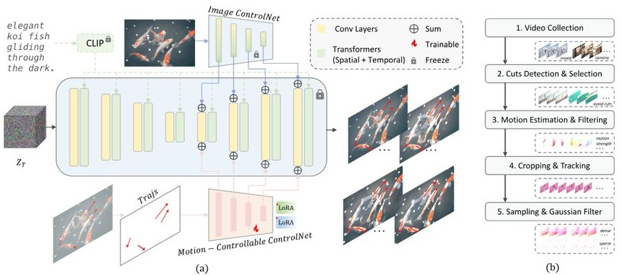
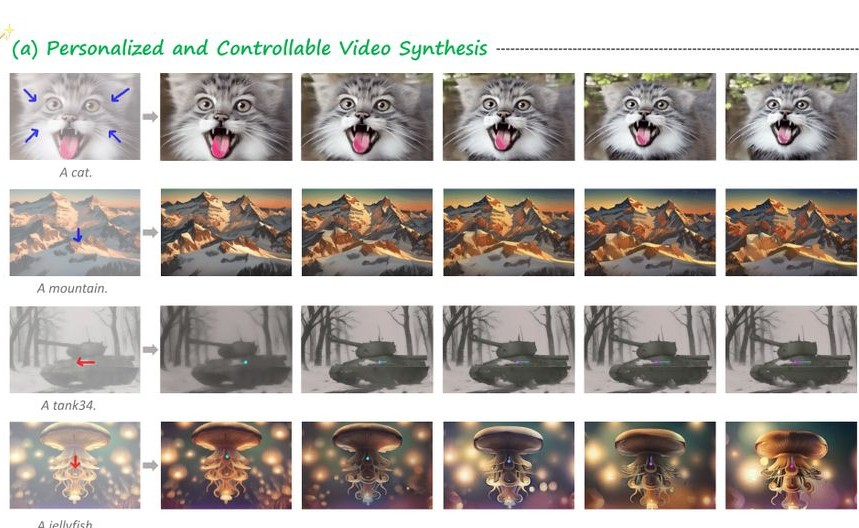
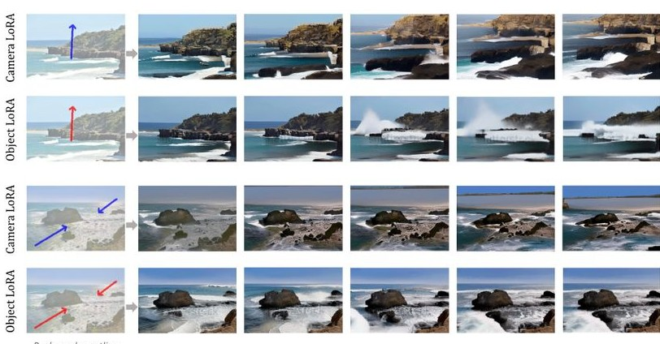
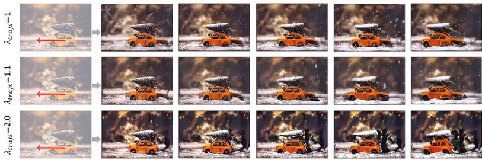
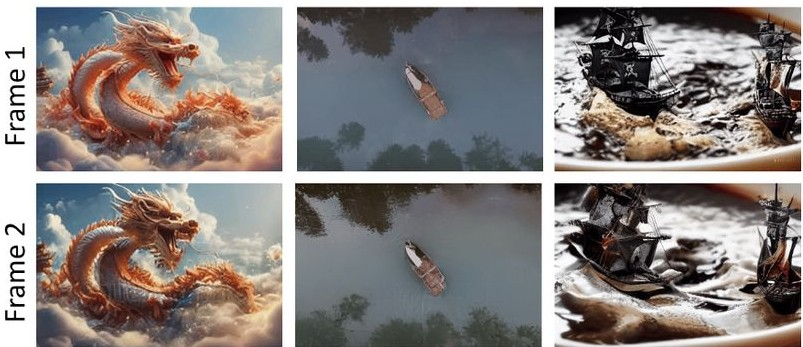

# 图像导体：互动视频合成的精确控制

Yaowei \(\mathbf{Li}^{1,2}\) , Xintao Wang \(^{2}\) , Zhaoyang Zhang \(^{2\dagger}\) , Zhouxia Wang \(^{2,3}\) , Ziyang Yuan \(^{2,4}\) , Liangbin \(\mathbf{Xie}^{2,5,6}\) , Yuexian Zou \(^{1\biornt}\) , Ying Shan \(^{2}\) \(^{1}\) 北京大学 \(^{2}\) 腾讯PCG ARC实验室 \(^{3}\) 南洋理工大学 \(^{4}\) 清华大学 \(^{5}\) 澳门大学 \(^{6}\) 深圳先进技术研究院 项目页面: images/6.jpg)

Figure 1: Orchestrated Results of Image Conductor. Image Conductor enables fine-grained and accurate image-to-video motion control, including both camera transitions and object movements. Colorful lines denote motion trajectories.   

## 摘要

电影制作和动画制作通常需要复杂的技术来协调相机的转场和物体的运动，这通常涉及劳动密集型的真实场景捕捉。尽管生成性人工智能在视频创作方面取得了进展，但在交互式视频资源生成中实现对运动的精确控制仍然具有挑战性。为此，我们提出了图像指挥器（Image Conductor），一种从单张图像生成视频资源的相机转场和物体运动的精确控制方法。我们提出了一种成熟的训练策略，通过相机的 LoRA 权重和物体的 LoRA 权重来分离不同的相机和物体运动。为了进一步解决由于不良轨迹导致的电影变化，我们在推理过程中引入了一种无相机引导技术，增强物体运动，同时消除相机转场。此外，我们还开发了一个基于轨迹的视频运动数据整理管道用于训练。定量和定性实验表明我们的方法在从图像生成可控运动视频方面具有精确性和细粒度控制，推动了交互式视频合成的实际应用。

## 1 引言

电影制作和动画制作是视觉艺术的重要形式。在视频媒体的创作过程中，专业导演通常需要先进的摄影技术，精心规划和协调镜头转换和物体运动，以确保故事情节的连贯性和精致的视觉效果。为了实现精准的创作表达，当前的视频媒体编排和制作工作流程严重依赖现实世界的捕捉和三维扫描建模，这些过程劳动密集且成本高昂。近期的研究（Ho et al., 2022; Blattmann et al., 2023b; Girdhar et al., 2023; Xing et al., 2023; Chen et al., 2023; Blattmann et al., 2023a; Bar-Tal et al., 2024; Brooks et al., 2024）探讨了基于AIGC的电影制作流程，利用扩散模型强大的生成能力来生成视频片段资产。尽管这些进展，生成动态视频资产以让创作者精准表达其想法仍然不可用，原因有： (1) 缺乏高效的生成控制界面。(2) 缺乏对镜头转换和物体运动的精细和准确控制。虽然一些研究试图引入运动控制信号来指导视频生成过程（Yin et al., 2023; Wang et al., 2023b; 2024; Wu et al., 2024），但现有方法都不支持对镜头转换和物体运动的准确和精细控制（见图1）。

事实上，互联网上的数据往往混合了相机运动和物体运动，导致这两种运动之间存在模糊性。尽管MotionCtrl（Wang et al.，2023b）使用数据驱动的方法将相机运动与物体运动解耦，但仍然缺乏精确性和有效性。对于电影变换来说，相机参数既不直观也不容易获得。在物体运动方面，MotionCtrl使用了基于光流估计的运动分割网络ParticleSfM（Zhao et al.，2022），这引入了显著的误差。此外，基于运动分割网络标注的真实标注视频仍包含相机运动，导致生成的视频表现出意外的电影变换。通过数据整理将电影变换与物体运动解耦是根本性的挑战。从固定相机视点获取视频数据，即仅包含物体运动的视频，非常困难。基于光流的运动分割方法（Teed & Deng，2020；Xu et al.，2022；Zhao et al.，2022；Yin et al.，2023；Wang et al.，2023b）难以准确追踪运动物体而不出现错误，也未能消除真实视频中的内在相机运动。总体而言，现有方法要么不够细致，要么效果不足。本文提出了Image Conductor，一种用于细粒度物体运动和相机控制的互动方法，从单一图像生成精确的视频素材。有效的细粒度运动控制需要稳健的运动表示。轨迹因其直观和用户友好性，允许用户通过绘制路径来控制视频内容中的运动。然而，目前缺乏大规模、高质量的开源轨迹跟踪视频数据集。为了解决这一问题，我们使用CoTracker（Karaev et al.，2023）对现有视频数据进行标注，并设计了数据过滤工作流，从而生成高质量的轨迹导向视频运动数据。为了应对现实数据中电影变换与物体运动的耦合，我们首先使用标注数据训练视频ControlNet（Zhang et al.，2023），以将运动信息传递给扩散模型的UNet主干。然后我们提出了一种协同优化方法，在ControlNet上应用不同组的低秩适配（LoRA）权重（Hu et al.，2021a），以区分各种类型的运动。除扩散模型中常用的去噪损失外，我们引入了一种正交损失，以确保不同LoRA权重的独立性，从而实现精确的运动解耦。为灵活消除由于不适定轨迹引起的电影变换（在LoRA中难以区分）并增强物体运动，我们还引入了一种新的无相机引导技术。该技术在扩散模型的采样过程中迭代执行不同潜变量之间的外推融合，类似于无分类器引导技术（Ho & Salimans，2022）。简而言之，我们的主要贡献如下：- 我们构建了一个高质量的视频运动数据集，具有精确的轨迹标注，解决了开源社区中此类数据的缺乏问题。

Figure 2: a) Framework of Image Conductor. 3D UNet serves as the diffusion backbone, while image ControlNet and motion-controllable ControlNet (and its LoRA weights) convey appearance and motion information, respectively. We progressively fine-tune different modules during framing phase (see Sec 2.4). b) Trajectory-oriented video motion data construction workflow. We carefully curate the data to ensure dynamic and consistent video content, as well as precise trajectory annotations (see Sec 2.2).   

- 我们介绍了一种在运动控制网络中协同优化LoRA权重的方法，有效地分离和控制摄像机的过渡与物体的运动。 - 我们提出了一种无摄像机的引导方法，以启发式地消除因多条轨迹而导致的摄像机过渡，这些轨迹难以通过LoRA权重分离。 - 大量实验证明了我们的方法在精确和细致的运动控制方面的优越性，使得可以根据用户的期望从图像生成视频。

## 2 方法

### 2.1 概述

Image Conductor旨在根据用户规范精确指导相机转换和物体运动，从而为静态图像赋予动态，生成连贯的视频素材。我们的工作流程包括轨迹导向的视频数据构建（第2.2节）、运动感知的图像到视频架构（第2.3节）、可控运动分离（第2.4节）和无相机引导（第2.5节）。我们使用用户友好的轨迹定义相机转换和物体运动的强度与方向。为了解决大规模标注视频数据的缺乏，我们设计了一条数据构建管道，以创建具有适当运动的一致视频数据集。利用这些数据，我们训练Video ControlNet（Zhang et al., 2023），以合成可控运动的视频内容。为消除相机转换与物体运动之间的模糊性，我们采用了独立的LoRA权重集合。首先，我们使用仅相机的LoRA权重进行训练，以控制相机转换。然后，我们加载这些权重，并使用一组新的物体LoRA权重以解耦物体运动，确保精确控制。我们还引入了一种具有正交约束的损失函数，以保持不同LoRA权重之间的独立性。为了无缝融合相机转换与物体运动，我们提出了一种无相机引导技术，在推理过程中迭代推断相机和物体运动潜在变量之间的关系。图2（a）展示了我们的框架，图2（b）示意了我们的数据整理管道，图3展示了Image Conductor的核心理念。

### 2.2 基于轨迹的视频运动数据构建。

由于图像指挥器依赖于轨迹来引导运动，我们需要一个带有轨迹标注的数据集来跟踪视频中的动态信息。现有的大规模视频数据集通常缺乏这样的标注。虽然一些方法使用运动估计器来对视频数据进行标注，但这些方法往往存在不准确（Yin et al., 2023；Wang et al., 2023b；Wu et al., 2024）或缺乏普适性（Wu et al., 2024）的情况。此外，几乎所有带有轨迹标注的标注数据集都是不公开的。为了解决这个问题，我们提出了一个全面且通用的流程，用于生成高质量的视频数据，具备适当的运动和一致的场景，如图2（b）所示。 视频收集。我们利用WebVid数据集（Bain et al., 2021），这是一个带有文本描述的大规模混合数据集，以及Realestate10K数据集（Zhou et al., 2018），这是一个仅包含摄像头数据的数据集，作为我们的研究基础。图像指挥器旨在将物体运动与混合数据解耦，要求场景一致性和高运动质量。为了确保时间质量，我们通过检测剪辑和过滤运动来处理WebVid数据集。对于Realestate10K数据集，我们注重摄像头切换的多样性，并使用\(\text{BLIP2}(\text{Li et al., 2023})\)以特定时间间隔提取帧并拼接其描述生成视频标题。 剪辑检测与选择。在视频中，剪辑指的是不同镜头之间的转换，生成式视频模型对这样的运动不一致性非常敏感（Blattmann et al., 2023a）。为了避免剪辑和突然的场景变化，这可能导致模型过拟合这些现象，我们首先使用剪辑检测工具1来识别视频数据集中的剪辑。然后，我们选择最长的一致场景作为我们的视频片段，确保场景的一致性。 运动估计和过滤。为了确保数据集展现良好的动态性，我们使用RAFT（Teed & Deng, 2020）计算相邻帧之间的光流，并计算Frobenius范数作为运动评分。我们根据这个评分过滤掉得分最低的\(25\%\)的视频样本。为了降低计算成本，我们将视频的短边调整为256像素，并随机抽取32帧序列，时间间隔为1到16帧。这32帧作为训练数据集，并计算它们的运动评分以供样本过滤。 裁剪与跟踪。为了标准化训练数据的维度，我们对之前获得的数据进行中心裁剪，得到大小为\(384 \times 256 \times 32\)的视频帧。然后，我们使用CoTracker（Karaeva et al., 2023），一种密集点追踪方法，使用\(16 \times 16\)的网格记录视频中的运动。与基于光流的点对应方法（Teed & Deng, 2020；Xu et al., 2022）相比，追踪避免了漂移引起的误差累积，提供了更准确的运动表示。跟踪后，我们通过计算同一轨迹内相邻点之间的差异来累积点轨迹。这导致生成与ControlNet（Zhang et al., 2023）输入格式兼容的堆叠流动图。 采样与高斯过滤。为了增强用户交互和可用性，我们使用稀疏轨迹进行运动指导。我们从密集集上启发式地抽样\(n \in [1,8]\)条轨迹，8为上限。\(n\)的值随机选择，每条轨迹的归一化运动强度作为采样概率。这些轨迹的累积流动图形成一个稀疏矩阵。为了避免由于稀疏矩阵导致的训练不稳定，我们对轨迹应用高斯过滤，类似于之前的方法（Yin et al., 2023；Wang et al., 2023b；Wu et al., 2024）。通过这一数据处理流程，我们构建了一个面向轨迹的视频运动数据集，包含130k个带有摄像头切换和物体运动的混合视频，以及62k个仅包含摄像头切换的视频。

### 2.3 动态感知图像到视频架构

图像到视频主干网络。如图 2 (a) 所示，我们利用配备 SparseCtrl 的 Animatediff（Guo 等，2023b）作为经过预训练的图像到视频基础模型。该模型使用 CLIP（Radford 等，2021）文本编码器提取文本嵌入 \(c_{t x t} \in \mathbb{R}^{1\times d}\)，然后通过交叉注意机制传递给 UNet（Ronneberger 等，2015）主干网络。输入图像作为第一帧，和一个全零帧矩阵以及一个掩码标识符在通道维度上拼接，形成 \(c_{img} \in \mathbb{R}^{T\times 4\times H\times W}\)。接下来，使用视频 SparseCtrl，这是 ControlNet（Zhang & Agrawala, 2023）的一个变种，移除 ControlNet 与 UNet 编码器的输入潜在变量之间的跳跃连接，从 \(c_{img}\) 中提取图像信息。

Figure 3: Fine-grained Motion Separation Method. a) The training process is divided into two stages. Initially, camera-only data is used to empower the camera LoRA with the ability to control camera transitions. After loading the well-trained camera LoRA, mixed motion data is used to train the object LoRA, refining object motion information. b) During inference, loading different LoRAs provides the model with various control capabilities.   

运动可控的 ControlNet。为了从注释的轨迹输入 \(c_{tra j s} \in \mathbb{R}^{T \times 2 \times H \times W}\) 中提取运动信息，以便在视频中组合摄像机过渡和物体运动，我们使用 ControlNet 作为运动编码器来捕捉多层次的运动表征。该 ControlNet 纳入了不同类型的 LoRA 权重，以引导图像到视频生成，使其符合用户期望的摄像机过渡和物体运动。与 SparseCtrl (Guo et al., 2023a) 的观察结果一致，我们发现移除主干和条件分支的输入潜变量之间的跳跃连接能够加快训练过程中的收敛速度。

### 2.4 可控运动分离

我们的方法旨在精确区分视频中的相机过渡和物体运动，从而实现对生成符合用户期望的视频片段内容的细致控制。为此，我们将相机 LoRA \(\theta_{\mathrm{cam}}\) 和物体 LoRA \(\theta_{\mathrm{obj}}\) 引入运动 ControlNet，指导不同类型运动的合成。如图 3 所示，在训练过程中，我们采用了协同优化策略。首先，我们优化相机 LoRA，然后基于已加载的相机 LoRA 优化物体 LoRA。在推理阶段，模型加载不同的 LoRA 以控制相机过渡（例如，缩小视角）和物体运动（例如，两条波浪朝特定方向前进）。相机过渡。由于能够获取仅具有相机过渡的数据，我们直接使用我们精心培养的相机运动数据集训练相机 LoRA \(\theta_{\mathrm{cam}} = \theta_{0} + \Delta \theta_{\mathrm{cam}}\)，赋予 ControlNet 指导电影化变化的能力。采用标准的扩散去噪训练目标：

\[\mathcal{L}_{\mathrm{cam}} = \mathbb{E}_{z_{0,\mathrm{cam}},c_{\mathrm{txt}},c_{\mathrm{img}},c_{\mathrm{traj s}},\epsilon \sim \mathcal{N}(0,I),t}\big[\Vert \epsilon -\epsilon \theta_{\mathrm{cam}}(z_{t,\mathrm{cam}},t,c_{\mathrm{txt}},c_{\mathrm{img}},c_{\mathrm{traj s}})\Vert_{2}^2\big], \quad (1)\]  

其中 \(\theta_{\mathrm{cam}}\) 是加载了摄像机 LoRA 的去噪器，\(z_{t,\mathrm{cam}}\) 是在时间步 \(t\) 仅包含摄像机过渡的视频的嘈杂潜变量，\(c_{\mathrm{txt}}\)、\(c_{\mathrm{img}}\) 和 \(c_{\mathrm{traj s}}\) 分别指文本提示、图像提示和条件轨迹。物体运动。由于缺乏没有影片变动的固定摄像机视角视频数据，我们需要将物体运动与混合数据中的摄像机过渡和物体运动解耦。观察到不同类型的运动共享相同轨迹，我们可以在加载经过良好训练的摄像机 LoRA 权重后进一步训练物体 LoRA \(\theta_{\mathrm{obj}} = \theta_{0} + \Delta \theta_{\mathrm{obj}}\)，即目标是从混合数据中重构原始视频内容中的摄像机过渡和物体运动。形式上，在训练阶段我们同时加载摄像机 LoRA 和物体 LoRA，并通过 stopgrad \(\mathrm{sg}[\cdot ]\) 阻止梯度流向摄像机 LoRA：

\[\theta_{\mathrm{mixed}} = \theta_{0} + \mathrm{sg}[\Delta \theta_{\mathrm{cam}}] + \Delta \theta_{\mathrm{obj}}. \quad (2)\]  

类似地，我们使用标准的扩散去噪目标来优化对象 LoRA：

\[\begin{array}{r}{\mathcal{L}_{\mathrm{mixed}} = \mathbb{E}_{z_{0,\mathrm{mixed}},c_{\mathrm{txt}},c_{\mathrm{targ}},c_{\mathrm{targ}},c\sim \mathcal{N}(0,I),\tau}\big[\big\| \epsilon -\epsilon_{\theta_{\mathrm{mixed}}(z_{t,\mathrm{mixed}},t},c_{\mathrm{txt}},c_{\mathrm{targ}})||_{2}^{2}\big]\big\} ,} \end{array} \quad (3)\]  

其中 \(\theta_{\mathrm{mixed}}\) 是去噪器，ControlNet 使用所有加载的 LoRA，如方程 2 所示，\(z_{t,\mathrm{cam}}\) 是在时间步 \(t\) 时，由于相机过渡和物体移动而产生的噪声潜变量。正交损失。为了鼓励物体 LoRA 学习与相机 LoRA 不同的概念，并加速模型的收敛，我们提出了一种正交损失作为联合优化目标。具体而言，我们从不同的 LoRA 中提取所有线性层权重 \(W_{\mathrm{cam}}\) 和 \(W_{\mathrm{traj}}\)，并对它们施加正交约束：

\[\begin{array}{r}{\mathcal{L}_{\mathrm{ortho}} = \mathbb{E}_{W_{i,\mathrm{cam}}\in W_{\mathrm{cam}},W_{i,\mathrm{traj}}\in W_{\mathrm{traj}}}\left[\left\| I - W_{i,\mathrm{cam}}W_{i,\mathrm{traj}}^{T}\right\|_{2}^{2}\right]} \end{array} \quad (4)\]  

其中 \(I\) 代表单位矩阵，\(W_{i,\mathrm{cam}}\) 和 \(W_{i,\mathrm{traj}}\) 分别指相机 LoRA 和物体 LoRA 的第 \(i\) 个线性层的权重。总体而言，优化过程是逐步进行的。我们首先使用 \(\mathcal{L}_{\mathrm{cam}}\) 优化相机 LoRA，然后使用 \(\mathcal{L}_{\mathrm{mixed}}\) 和 \(\mathcal{L}_{\mathrm{ortho}}\) 优化物体 LoRA。

### 2.5 无摄像头引导

当用户试图控制多个对象时，多条轨迹通常会引入相机切换。受无分类器引导（Ho & Salimans, 2022）的启发，我们提出了一种无相机引导技术，以灵活且无缝地增强运动强度，同时消除相机切换。

\[\begin{array}{rl} & {\hat{\epsilon}_{\boldsymbol{\theta}_{0},\boldsymbol{\theta}_{\mathrm{traj}}}(\boldsymbol {x}_t,\boldsymbol {c}) = \epsilon_{\boldsymbol{\theta}_0}(\boldsymbol {x}_t,\mathcal{O})}\\ & {\qquad +\lambda_{\mathrm{cfg}}(\epsilon_{\boldsymbol{\theta}_0}(\boldsymbol {x}_t,\boldsymbol {c}) - \epsilon_{\boldsymbol{\theta}_0}(\boldsymbol {x}_t,\mathcal{O}))}\\ & {\qquad +\lambda_{\mathrm{trajs}}(\epsilon_{\boldsymbol{\theta}_{\mathrm{traj}}}(\boldsymbol {x}_t,\boldsymbol {c}) - \epsilon_{\boldsymbol{\theta}_0}(\boldsymbol{x}_t,\boldsymbol {c})),} \end{array} \quad (5)\]  

其中 \(\theta_{\mathrm{traj}}\) 表示带有对象LoRA的模型，而 \(\theta_{0}\) 是预训练的运动ControlNet模型。最终的输出潜变量是通过推演这两个组件的输出得出的。

## 3 实验

### 3.1 与最先进方法的比较

我们将图像导体与现有最先进的基于图像或基于文本的运动可控视频生成方法进行比较，即 DragNUWA（Yin et al., 2023）、DragAnything（Wu et al., 2024）和 MotionCtrl（Wang et al., 2023b）。评估数据集。为了独立评估相机过渡和物体运动，我们使用两个不同的数据集：1) 仅相机运动评估数据集：我们选择了10条相机轨迹，例如向左平移、向右平移、向上平移、向下平移、放大、缩小，以评估对电影变换的控制。2) 仅物体运动评估数据集：我们设计了10条不同的轨迹，包括直线、曲线、震动线及其组合。定性评估图4展示了我们的一些定性结果。与先前的方法（Yin et al., 2023；Wu et al., 2024；Wang et al., 2023b）相比，我们的方法能够有效控制相机过渡和物体运动。在相机过渡方面，DragNUWA 和 DragAnything 在生成的视频中未能实现向下平移后再向上的相机过渡。尽管 Motionctrl-SVD 能够生成指定的相机运动，但无法通过文本提示明确定义自然内容的变化。此外，它无法准确界定相机变化的强度，有时还会引入失真伪影。

Figure 4: Qualitative Comparisons of the proposed Image Conductor. (a) Camera Transitions. Our method can simultaneously utilize text, image, and trajectory prompts as control signals to achieve more natural content and camera transitions. (b) Object Movements. Apart from our method, other approaches incorrectly confuse object movements with camera transitions.   

在物体运动方面，DragNUWA 和 DragAnything 错误地将物体运动解释为相机过渡，从而导致生成的视频无法满足用户意图。此外，由于标注数据集引入的错误，它们生成的视频的运动轨迹通常与期望的轨迹匹配较差。由于基于轨迹的 MotionCtrl 依赖于文本到视频模型，我们直接使用文本和轨迹提示在不同种子下控制视频生成。结果表明，由于无法使用图像作为条件，它在生成内容时缺乏细粒度控制。此外，它仍然表现出显著的相机过渡，而不是物体运动。总体而言，我们的方法能够准确且精细地控制各种类型的运动，利用分离的 LoRA。定量评估如表 1 所示，与其他方法相比，我们提出的图像导体在定量性能上达到了最先进水平。我们通过 CamMC 和 ObjMC 指标测量与给定轨迹的对齐程度，超越了基准模型，展示了我们精确的运动控制能力。同时，FID 和 FVD 指标表明，我们的生成质量超过其他模型，能够生成逼真的视频。此外，我们邀请了 31 位参与者评估 DragNUWA、DragAnything 和图像导体的结果。评估包括视频质量和运动相似性。参与者还被要求对每对比较样本给出整体偏好。统计结果确认，我们生成的视频不仅看起来更真实、更具视觉吸引力，而且在运动一致性上也优于其他模型生成的视频。

Figure 5: Results of Personalized and Controllable Video Synthesis. The pre-trained base model and LoRA weights are sourced from TuSun 2, HelloObject 3, and CardosAnime 4 checkpoint.   

Table 1: Quantitative Comparisons with SOTA Methods. We utilize automatic metrics (i.e., FID, FVD, CamMC, ObjMC) and human evaluation (i.e., overall performance, sample quality, motion similarity) to evaluate the performance. DN and DA denotes DragNUWa (Wu et al., 2024) and DragAnything (Yin et al., 2023), respectively.   

<table><tr><td rowspan="2">Method</td><td colspan="4">Automatic Metrics</td><td colspan="3">Human Evaluation</td></tr><tr><td>FID ↓</td><td>FVD ↓</td><td>CamMC ↓</td><td>ObjMC ↓</td><td>Overall ↑</td><td>Quality ↑</td><td>Motion ↑</td></tr><tr><td>DN (Yin et al., 2023)</td><td>237.26</td><td>1283.85</td><td>48.72</td><td>51.24</td><td>31.8%</td><td>37.1%</td><td>27.7%</td></tr><tr><td>DA (Wu et al., 2024)</td><td>243.17</td><td>1287.15</td><td>66.54</td><td>60.97</td><td>6.5%</td><td>8.1%</td><td>6.3%</td></tr><tr><td>Image Condutor</td><td>209.74</td><td>1116.17</td><td>33.49</td><td>42.38</td><td>61.7%</td><td>54.8%</td><td>66.0%</td></tr></table>  

### 3.2 个性化与可控视频合成

由于基础的T2V模型未经过微调，我们的方法自然具备个性化生成的能力，同时保持可控性。在图5中，我们加载了一些个性化模型，通过提供的提示、引导比例和用户指定的轨迹来采样视频。结果表明，我们的方法能够无缝集成开放源代码的定制社区（例如，CIVITAI5），并具备强大的生成可控视频内容资产的能力。

### 3.3 消融研究

不同LoRA权重的影响 为了验证我们精心设计的交互优化策略能够通过不同的LoRA权重来分离相机转换和物体运动，我们使用相同的轨迹作为输入，以引导不同的LoRA生成视频。如图6所示，加载不同的LoRA权重使模型具备了不同的能力。例如，当加载相机LoRA时，垂直向上的轨迹会导致视频向上平移，而加载物体LoRA时则会产生向上的波浪效果。

Figure 6: Effect of distinct LoRA weights. Image conductor enables users to independently control camera and object motion interactively.   

Figure 7: Effect of Camera-free Guidance. The camera-free guidance approach flexibly enhances object movements during inference.   

无相机引导的效果 如图7所示，使用无相机引导可以在几个具有挑战性的实例中促进物体运动与相机变换的分离。当无相机引导 \(\lambda_{\mathrm{trajs}}\) 设置为1时，即尚未使用无相机引导，生成的视频出现了意外的向左平移变换。当 \(\lambda_{\mathrm{trajs}}\) 设置为1.1时，生成的视频表现出合理的物体运动，但仍然存在一些伪影。随着引导的增强，物体的运动变得更加明显和清晰。

## 4 结论

综上所述，本文提出了图像引导，作为一种在交互视频合成中对摄像机切换和物体运动进行精确且细致控制的新方法。我们设计了一种训练策略，并利用不同的LoRA权重来解耦摄像机切换和物体运动。此外，我们提出了一种无摄像机引导技术，以增强物体运动的控制能力。大量实验表明我们方法的有效性，这标志着在视频为中心的创意表达领域向实用应用迈出了重要一步。

## REFERENCES  

Max Bain, Arsha Nagrani, Gul Varol, and Andrew Zisserman. Frozen in time: A joint video and image encoder for end- to- end retrieval. In Proceedings of the IEEE/CVF International Conference on Computer Vision, pp. 1728- 1738, 2021.  

Omer Bar- Tal, Hila Chefer, Omer Tov, Charles Herrmann, Roni Paiss, Shiran Zada, Ariel Ephrat, Junhwa Hur, Yuanzhen Li, Tomer Michaeli, et al. Lumiere: A space- time diffusion model for video generation. arXiv preprint arXiv:2401.12945, 2024.  

Georgios Batzolis, Jan Stanczuk, Carola- Bibiane Schönlieb, and Christian Ermann. Conditional image generation with score- based diffusion models. arXiv preprint arXiv:2111.13606, 2021.  

Andreas Blattmann, Tim Dockhorn, Sumith Kulal, Daniel Mendelevitch, Maciej Kilian, Dominik Lorenz, Yam Levi, Zion English, Vikram Voleti, Adam Letts, et al. Stable video diffusion: Scaling latent video diffusion models to large datasets. arXiv preprint arXiv:2311.15127, 2023a.  

Andreas Blattmann, Robin Rembach, Huan Ling,Tim Dockhorn, Seung Wook Kim, Sanja Fidler, and Karsten Kreis. Align your latents: High- resolution video synthesis with latent diffusion models. In Proceedings of the IEEE/CVF Conference on Computer Vision and Pattern Recognition, pp. 22563- 22575, 2023b.  

Tim Brooks, Bill Peebles, Connor Holmes, Will DePue, Yufei Guo, Li Jing, David Schnurr, Joe Mayor, Troy Luhman, Eric Luhman, Clarence Ng, Ricky Wang, and Aditya Ramesh. Video generation models as world simulators. 2024. URL https://openai.com/research/video- generation- models- as- world- simulators.  

Haoxin Chen, Menghan Xia, Yingqing He, Yong Zhang, Xiaodong Cun, Shaoshu Yang, Jinbo Xing, Yaofang Liu, Qifeng Chen, Xintao Wang, et al. Videocrafter1: Open diffusion models for high- quality video generation. arXiv preprint arXiv:2310.19512, 2023.  

Tsai- Shien Chen, Aliaksandr Siarokin, Willi Menapace, Ekaterina Deyneka, Hsiang- wei Chao, Byung Eun Jeon, Yuwei Fang, Hsin- Ying Lee, Jian Ren, Ming- Hsuan Yang, et al. Panda- 70m: Captioning 70m videos with multiple cross- modality teachers. arXiv preprint arXiv:2402.19479, 2024.  

Pinon Gal, Yuval Alaluf, Yuval Atzumon, Or Patashnik, Amit H Bermano, Gal Chechik, and Daniel Cohen- Or. An image is worth one word: Personalizing text- to- image generation using textual inversion. arXiv preprint arXiv:2208.01618, 2022.  

Rohit Girdhar, Mannat Singh, Andrew Brown, Quentin Duval, Samaneh Azadi, Sai Saketh Rambhatla, Akbar Shah, Xi Yin, Devi Parikh, and Ishan Misra. Emu video: Factorizing text- to- video generation by explicit image conditioning. arXiv preprint arXiv:2311.10709, 2023.  

Yuwei Guo, Ceyuan Yang, Anyi Rao, Maneesh Agrawala, Dahua Lin, and Bo Dai. Sparsecurity: Adding sparse controls to text- to- video diffusion models. arXiv preprint arXiv:2311.16933, 2023a.  

Yuwei Guo, Ceyuan Yang, Anyi Rao, Yaohui Wang, Yu Qiao, Dahua Lin, and Bo Dai. Animadediff Animate your personalized text- to- image diffusion models without specific tuning. arXiv preprint arXiv:2307.04725, 2023b.  

Hao He, Yinghao Xu, Yuwei Guo, Gordon Wetzstein, Bo Dai, Hongsheng Li, and Ceyuan Yang. Cameractrl: Enabling camera control for text- to- video generation. arXiv preprint arXiv:2404.02101, 2024. Jonathan Ho and Tim Salimans. Classifier- free diffusion guidance. arXiv preprint arXiv:2207.12598, 2022.  

Jonathan Ho, Ajay Jain, and Pieter Abbeel. Denoising diffusion probabilistic models. Advances in neural information processing systems, 33:6840- 6851, 2020.  

Jonathan Ho, William Chan, Chitwan Saharia, Jay Whang, Ruiqi Gao, Alexey Gritsenko, Diederik P Kingma, Ben Poole, Mohammad Norouzi, David J Fleet, et al. Imagen video: High definition video generation with diffusion models. arXiv preprint arXiv:2210.02303, 2022.

Edward J Hu, Yelong Shen, Phillip Wallis, Zeyuan Allen- Zhu, Yuanzhi Li, Shean Wang, Lu Wang, and Weizhu Chen. Lora: Low- rank adaptation of large language models. arXiv preprint arXiv:2106.09685, 2021a.  

Edward J Hu, Yelong Shen, Phillip Wallis, Zeyuan Allen- Zhu, Yuanzhe Li, Shean Wang, Lu Wang, and Weizhu Chen. Lora: Low- rank adaptation of large language models. arXiv preprint arXiv:2106.09685, 2021b.  

Nikita Karaev, Ignacio Rocco, Benjamin Graham, Natalia Neverova, Andrea Vedaldi, and Christian Rupprecht. Cotracker: It is better to track together. arXiv preprint arXiv:2307.07635, 2023.  

Diederik P Kingma and Jimmy Ba. Adam: A method for stochastic optimization. arXiv preprint arXiv:1412.6980, 2014.  

Junnan Li, Dongxu Li, Silvio Savarese, and Steven Hoi. Blip- 2: Bootstrapping language- image pre- training with frozen image encoders and large language models. arXiv preprint arXiv:2301.12597, 2023.  

Alexander Quinn Nichol and Prafulla Dhariwal. Improved denoising diffusion probabilistic models. In International Conference on Machine Learning, pp. 8162- 8171. PMLR, 2021.  

Alec Radford, Jong Wook Kim, Chris Hallacy, Aditya Ramesh, Gabriel Goh, Sandhini Agarwal, Girish Sastry, Amanda Askell, Pamela Mishkin, Jack Clark, et al. Learning transferable visual models from natural language supervision. In ICML, 2021.  

Weijieying Ren, Xinlong Li, Lei Wang, Tianxiang Zhao, and Wei Qin. Analyzing and reducing catastrophic forgetting in parameter efficient tuning. arXiv preprint arXiv:2402.18865, 2024.  

Robin Rombach, Andreas Blattmann, Dominik Lorenz, Patrick Eiser, and Björn Ommer. High- resolution image synthesis with latent diffusion models. In CVPR, 2022.  

Olaf Ronneberger, Philipp Fischer, and Thomas Brox. U- net: Convolutional networks for biomedical image segmentation. In MICCAI, 2015.  

Tim Salimans and Jonathan Ho. Progressive distillation for fast sampling of diffusion models, 2022.  

Maximilian Seitzer. pytorch- fid: FID Score for PyTorch. https://github.com/mseitzer/pytorch- fid, 2020.  

Jascha Sohl- Dickstein, Eric Weiss, Niru Maheswaranathan, and Surya Ganguli. Deep unsupervised learning using nonequilibrium thermodynamics. In International conference on machine learning, pp. 2256- 2265. PMLR, 2015.  

Jiaming Song, Chenlin Meng, and Stefano Ermon. Denoising diffusion implicit models. arXiv preprint arXiv:2010.02502, 2020a.  

Yang Song and Stefano Ermon. Generative modeling by estimating gradients of the data distribution. Advances in neural information processing systems, 32, 2019.  

Yang Song, Jascha Sohl- Dickstein, Diederik P Kingma, Abhishek Kumar, Stefano Ermon, and Ben Poole. Score- based generative modeling through stochastic differential equations. arXiv preprint arXiv:2011.13456, 2020b.  

Yang Song, Jascha Sohl- Dickstein, Diederik P Kingma, Abhishek Kumar, Stefano Ermon, and Ben Poole. Score- based generative modeling through stochastic differential equations. arXiv preprint arXiv:2011.13456, 2020c.  

Zachary Teed and Jia Deng. Raff: Recurrent all- pairs field transforms for optical flow. In Computer Vision- ECCV 2020: 16th European Conference, Glasgow, UK, August 23- 28, 2020, Proceedings, Part II 16, pp. 402- 419. Springer, 2020.  

Thomas Unterthiner, Sjoerd Van Steenkiste, Karol Kurach, Raphael Marinier, Marcin Michalski, and Sylvain Gelly. Towards accurate generative models of video: A new metric & challenges. arXiv preprint arXiv:1812.01717, 2018.

Jiawei Wang, Yuchen Zhang, Jiaxin Zou, Yan Zeng, Guoqiang Wei, Liping Yuan, and Hang Li. Boximator: Generating rich and controllable motions for video synthesis. iXiv preprint arXiv:2402.01566, 2024.  

Xiang Wang, Hangjie Yuan, Shiwei Zhang, Dayou Chen, Jiuniu Wang, Yingya Zhang, Yujun Shen, Deli Zhao, and Jingren Zhou. Videocomposer: Compositional video synthesis with motion controllability. arXiv preprint arXiv:2306.02018, 2023a.  

Zhouxia Wang, Ziyang Yuan, Xintao Wang, Tianshui Chen, Menghan Xia, Ping Luo, and Ying Shan. Motionctrl: A unified and flexible motion controller for video generation. arXiv preprint arXiv:2312.03641, 2023b.  

Wejia Wu, Zhuang Li, Yuchao Gu, Rui Zhao, Yefei He, David Junhao Zhang, Mike Zheng Shou, Yan Li, Tingting Gao, and Di Zhang. Draganything: Motion control for anything using entity representation. arXiv preprint arXiv:2403.07420, 2024.  

Jinbo Xing, Menghan Xia, Yong Zhang, Haoxin Chen, Xintao Wang, Tien- Tsun Wong, and Ying Shan. Dynamicreator: Animating open- domain images with video diffusion priors. arXiv preprint arXiv:2100.12190, 2023.  

Haofei Xu, Jing Zhang, Jianfei Cai, Hamid Rezatofighi, and Dacheng Tao. Gmflow: Learning optical flow via global matching. In Proceedings of the IEEE/CVF conference on computer vision and pattern recognition, pp. 8121- 8130, 2022.  

Shengming Yin, Chenfei Wu, Jian Liang, Jie Shi, Houqiang Li, Gong Ming, and Nan Duan. Dragnuva: Fine- grained control in video generation by integrating text, image, and trajectory. arXiv preprint arXiv:2305.08089, 2023. Lvmin Zhang and Maneesh Agrawala. Adding conditional control to text- to- image diffusion models. arXiv preprint arXiv:2302.05543, 2023.   

Lvmin Zhang, Anyi Rao, and Maneesh Agrawala. Adding conditional control to text- to- image diffusion models. In Proceedings of the IEEE/CVF International Conference on Computer Vision, pp. 3856- 3847, 2023.  

Wang Zhao, Shaohui Liu, Hengkai Guo, Wenping Wang, and Yong- Jin Liu. Particlesfm: Exploiting dense point trajectories for localizing moving cameras in the wild. In ECCV, 2022.  

Tinghui Zhou, Richard Tucker, John Flynn, Graham Fyffe, and Noah Snavely. Stereo magnification: Learning view synthesis using multiplane images. arXiv preprint arXiv:1805.09817, 2018.

Video Synthesis. With the emergence of massive data (Bain et al., 2021; Chen et al., 2024) and the gradual perfection of diffusion model theory (Ho et al., 2020; Song et al., 2020c; Batzolis et al., 2021), deep generative models have made remarkable progress (Rombach et al., 2022; Gal et al., 2022; Zhang & Agrawala, 2023; Wang et al., 2023a; Chen et al., 2023; Brooks et al., 2024). Despite the significant achievements, current video generation methods (Wang et al., 2023a; Chen et al., 2023; Brooks et al., 2024; Blattmann et al., 2023a; Girdhar et al., 2023) still exhibit randomness and face challenges in generating high- quality videos with controllability, which hinders the practical application of AIGC- based video generation methods.  

Motion Control in Videos. Recently, some studies have introduced additional control signals, such as trajectories (Yin et al., 2023; Wu et al., 2024; Wang et al., 2023b), camera parameters (Wang et al., 2023b; He et al., 2024), and bounding boxes (Wang et al., 2024), to control visual elements in videos, i.e., camera transitions and object movements, thus achieving interactive video asserts generation. However, they lack the capability to precisely and finely manipulate visual elements, especially when it comes to object movements (Yin et al., 2023; Wang et al., 2023b). In this paper, we meticulously design a training strategy that utilizes existing data to achieve flexible and precise motion separation and control.  

## B PRELIMINARY  

## B.1 CONDITIONAL VIDEO DIFFUSION MODEL  

Formally, diffusion models consists of a forward process and a reverse process (Sohl- Dickstein et al., 2015; Ho et al., 2020; Song et al., 2020c). The forward process is defined as a Markov chain that progressively adds distinct levels of gaussian noise to the signal \(x_0\) over a series of timesteps \(t \in [0,T]\) , until the \(x_0\) is completely corrupted to \(x_{T} \sim N(\mathbf{0}, \bar{I})\) :  

\[q(\pmb{x}_{t}|\pmb{x}_{t - 1}) = \mathcal{N}(\sqrt{\bar{\alpha}_{t}}\pmb{x}_{t - 1},(1 - \alpha_{t})\pmb {I}),\quad \mathrm{and}\quad q(\pmb {x}_{t}|\pmb {x}_{0}) = \mathcal{N}(\sqrt{\bar{\alpha}_{t}}\pmb{x}_{0},(1 - \bar{\alpha}_{t})\pmb{I}), \quad (6)\]  

Here we consider the variance- preserving setting (Song et al., 2020b) with \(0< \alpha_{t}< 1\) and \(\bar{\alpha}_{t} = \prod_{i = 1}^{t}\alpha_{i}\) where \(\alpha_{t}\) is a decreasing sequence. The reverse process is a parameter- containing process designed to iteratively denoise the corrupted sequence \(x_{T}\)  

\[p(x_{t - 1}|x_{t}) = \mathcal{N}(\mu_{t}(x_{t}),\sigma_{t}^{2}I). \quad (7)\]  

The mean and variance of the reverse process can be defined as:  

\[\begin{array}{c}{\mu_{t}(x_{t},x_{0}) = \frac{\sqrt{\alpha_{t}}(1 - \bar{\alpha}_{t - 1})}{1 - \bar{\alpha}_{t}} x_{t} + \frac{\sqrt{\bar{\alpha}_{t} - 1}(1 - \alpha_{t})}{1 - \bar{\alpha}_{t}} x_{0},}\\ {\sigma_{t}^{2} = (1 - \alpha_{t})\left(\frac{1 - \bar{\alpha}_{t - 1}}{1 - \bar{\alpha}_{t}}\right).} \end{array} \quad (8)\]  

Here we consider \(\sigma_{t}^{2}\) is an untrained time dependent constants (Ho et al., 2020; Nichol & Dhariwal, 2021), and \(x_{0}\) can be reparameterized using Eq. 6 and estimated using \(v\) - prediction (Salimans & Ho, 2022) or \(\epsilon\) - prediction techniques (Ho et al., 2020).  

Given an input condition \(\mathbf{\psi}_{c}\) , the goal of the conditional video diffusion model is to sample a video sequence \(x_{0}~ = ~\{\boldsymbol{x}_{0}^{1},\boldsymbol{x}_{0}^{2},\dots ,\boldsymbol{x}_{0}^{t}\}\) with \(L\) frames from the conditional probability distribution. \(p(x_0|c)\) . Specifically, \(\mu_{\theta}(\pmb{x}_{t},t,c)\) can be calculated using the \(\epsilon\) - prediction:  

\[\mu_{\theta}(x_{t},t,c) = \frac{1}{\sqrt{\alpha_{t}}}\bigg(x_{t} - \frac{1 - \alpha_{t}}{\sqrt{1 - \bar{\alpha}_{t}}}\epsilon_{\theta}(x_{t},t,c)\bigg), \quad (10)\]  

where \(\epsilon_{\theta}\) is a denoising UNet network. In this case, the \(\epsilon_{\theta}\) is optimized via denoising score matching (Song & Ermon, 2019):  

\[\min_{\theta}\mathbb{E}_{(x_{0},c)\sim q(x_{0},c),\epsilon \sim \mathcal{N}(\mathbf{0},\mathbf{I}),t}\left[\| \epsilon -\epsilon_{\theta}(\sqrt{\bar{\alpha}_{t}} x_{0} + \sqrt{1 - \bar{\alpha}_{t}}\epsilon ,t,c)\|_{2}^{2}\right]. \quad (11)\]

Figure 8: Inherent video content inconsistency between the first frame and subsequent frames in the base model.   

## B.2 LOW-RANK ADAPTATION  

Low- Rank Adaptation (LoRA) (Hu et al., 2021b) is a parameter- efficient tuning approach used to accelerate model fine- tuning on incoming data, which can prevent catastrophic forgetting (Ren et al., 2024). Unlike training the entire model, LoRA adds a pair of rank- decomposition matrices to the linear layer weights, which optimizes only the newly introduced parameters and ensures that the other parameters are fixed. Mathematically, the new weights \(W' \in \mathbb{R}^{m \times n}\) can be defined as:  

\[W^{\prime} = W + \Delta W = W + A B^{T}, \quad (12)\]  

where \(A \in \mathbb{R}^{m \times r}\) and \(B \in \mathbb{R}^{n \times r}\) are a pair of learnable matrices and \(r \ll \min (m, n)\) is the rank to reduce the cost of fine- tuning.  

## C EXPERIMENTAL DETAILS  

## C.1 IMPLEMENTATION DETAILS.  

We use Animatediff v3 (Guo et al., 2023b) combined with RGB SparseCtrl (Guo et al., 2023a) as our base model for image- to- video generation. We train only the motion ControlNet while keeping the UNet backbone weights frozen. The motion ControlNet is trained on our cultivated sampled 16- frame video sequences with a resolution of \(384 \times 256\) (Section 2.2). Both camera LoRA and object LoRA is optimized with Adam (Kingma & Ba, 2014) on 8 NVIDIA Tesla V100 GPUs for a week with a batch size of 64 and a learning rate of \(1 \times 10^{- 4}\) . We initially train the motion ControlNet using mixed data. Subsequently, we utilize camera- only data and mixed data to extract the camera LoRA and object LoRA weights respectively. To facilitate user input, we follow a strategy of training on dense trajectories first, and then fine- tuning the model on sparse trajectories. During the inference phase, we use 25 steps of DDIM sampler (Song et al., 2020a). Unless otherwise noted, the scale of classifier- free guidance (Ho & Salimans, 2022) is set to 8.5.  

## C.2 EVALUATION METRICS.  

To thoroughly evaluate the effectiveness of our method, we following MotionCtrl (Wang et al., 2023b) to assessed two types of metrics: 1) Video content quality evaluation. We employ Fréchet Inception Distance (FID)(Seitzer, 2020), Fréchet Video Distance (FVD)(Unterthiner et al., 2018) to measure the visual quality and temporal coherence. The reference videos of FID and FVD are 5000 videos randomly selected from WebVid (Bain et al., 2021). 2) Video motion quality evaluation. The Euclidean distance between the predicted and ground truth trajectories, i.e., CamMC and ObjMC, is used to evaluate the motion control. Unlike MotionCtrl, which uses particleSFM (Zhao et al., 2022) to estimate the camera poses of the predicted video for calculating CamMC, we directly extract pixel- level movement trajectories to compute CamMC similar to ObjMC.

## D LIMITATIONS  

Aside our model can faithfully produce motion information based on user- input trajectories, the generated quality of content is constrained by the base model. For example, as shown in Fig. 8, we observe that although Animatediff (Guo et al., 2023b) with image SparseCtrl (Guo et al., 2023a) imposes strong constraints on the first frame, subsequent frames exhibit some inconsistencies in color and detail compared to the first frame. One possible solution is to concatenate noisy image latents to the input noise in addition to using the image conditioning injection mechanism, similar to SVD (Blattmann et al., 2023a) and DynamiCrafter (Xing et al., 2023).  

Another limitation is that despite text and image prompts generally complementing each other in most scenarios during the video generation process, if they convey different meanings, the quality of the output may be compromised.