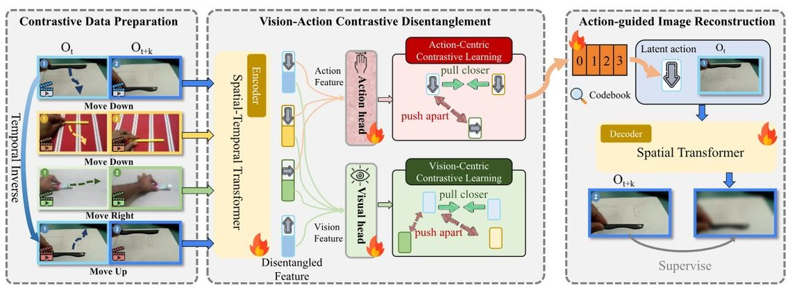
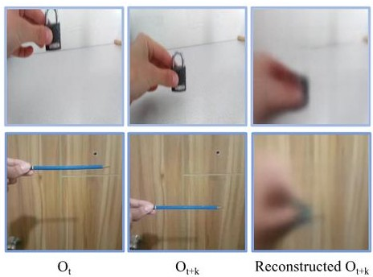
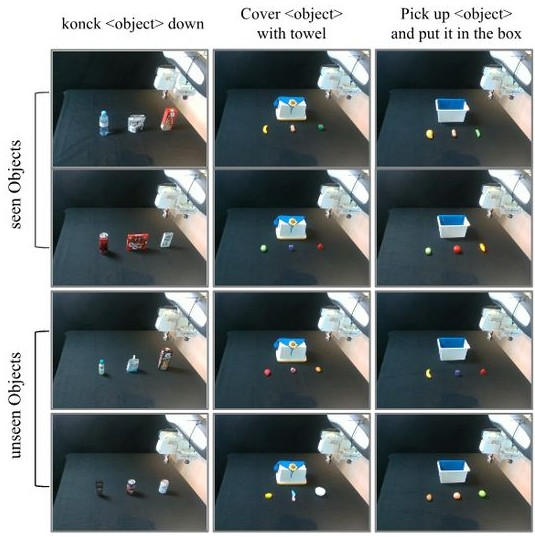
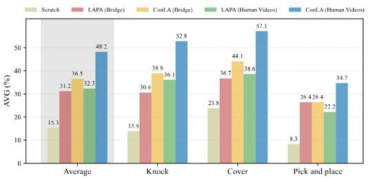
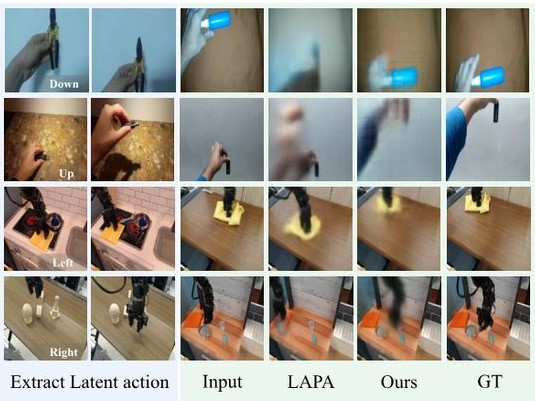
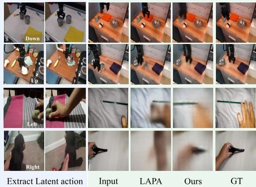
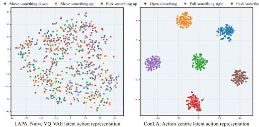

# 1. Bibliographic Information

## 1.1. Title
ConLA: Contrastive Latent Action Learning from Human Videos for Robotic Manipulation

## 1.2. Authors
The paper lists the following authors and their affiliations:
*   Weisheng Dai ($^{1\dagger}$) - Harbin Institute of Technology, Shenzhen
*   Kai Lan ($^{2,3\dagger}$) - State Key Laboratory of Mobile Network and Mobile Multimedia Technology, Shenzhen; ZTE Corporation
*   Jianyi Zhou ($^{1}$) - Harbin Institute of Technology, Shenzhen
*   Bo Zhao ($^{4}$) - Shanghai Jiao Tong University
*   Xiu Su ($^{5}$) - Central South University
*   Junwen Tong ($^{2,3}$) - State Key Laboratory of Mobile Network and Mobile Multimedia Technology, Shenzhen; ZTE Corporation
*   Weili Guan ($^{1}$) - Harbin Institute of Technology, Shenzhen
*   Shuo Yang ($^{1\boxed{\ast2}}$) - Harbin Institute of Technology, Shenzhen (Corresponding author: shuoyang@hit.edu.cn)

    The dagger ($\dagger$) indicates equal contribution, and the asterisk ($\ast$) indicates the corresponding author.

## 1.3. Journal/Conference
The paper is published as a preprint on arXiv, with the link `https://arxiv.org/abs/2602.00557` and PDF link `https://arxiv.org/pdf/2602.00557v1`. The provided publication date (2026-01-31T06:40:57.000Z) suggests that it is a forthcoming publication or a submission under review. arXiv is a reputable platform for sharing research preprints, widely used in the academic community to disseminate findings quickly before formal peer review and publication.

## 1.4. Publication Year
2026

## 1.5. Abstract
The abstract introduces Vision-Language-Action (VLA) models, which show generalization capabilities from large-scale robot teleoperation datasets. However, collecting such comprehensive datasets is extremely expensive and difficult. Human demonstration videos offer a scalable alternative, but their lack of explicit action labels makes direct VLA utilization challenging. Previous methods using `VQ-VAE` based frameworks to learn latent actions from human videos often suffer from `shortcut learning`, where models prioritize visual appearance reconstruction over capturing inter-frame dynamics, leading to entangled and poorly transferable representations.

To address this, the paper proposes `ConLA`, an unsupervised pretraining framework. `ConLA` incorporates a `contrastive disentanglement mechanism` that uses `action category priors` and `temporal cues` to separate motion dynamics from irrelevant visual content, thereby mitigating `shortcut learning`. Extensive experiments demonstrate `ConLA`'s strong performance across various benchmarks. Notably, by pretraining solely on human videos, `ConLA` is stated to be the first method to surpass the performance achieved with real robot trajectory pretraining, indicating its success in extracting pure and semantically consistent `latent action representations` for scalable robot learning.

## 1.6. Original Source Link
https://arxiv.org/abs/2602.00557

# 2. Executive Summary

## 2.1. Background & Motivation
The field of robotics is rapidly advancing, with `Vision-Language-Action (VLA)` models showing promise in achieving generalized robotic manipulation. These models are typically pretrained on vast datasets of robot teleoperation, where human operators control robots to perform various tasks, providing explicit action labels alongside visual observations and language instructions.

**Core Problem:** The fundamental challenge is the **exorbitant cost and logistical difficulty of acquiring large-scale, diverse robot teleoperation datasets**. Such datasets must cover a wide array of tasks, environments, and robot embodiments to enable robust generalization, which is practically infeasible to collect comprehensively. This limitation severely constrains the scalability and broader applicability of `VLA` models.

**Why this problem is important:**
*   **Scalability:** Current `VLA` models are bottlenecked by data acquisition. To achieve truly general-purpose robots, a massive and diverse dataset is essential, similar to how large language models (LLMs) benefited from vast text corpora.
*   **Generalization:** Limited datasets restrict a robot's ability to generalize to novel tasks, objects, or environments, making it less adaptable in real-world scenarios.
*   **Cost-effectiveness:** Reducing reliance on expensive robot teleoperation data can democratize `VLA` research and development.

**Challenges in prior research:**
Human demonstration videos, abundantly available online (e.g., YouTube), offer a naturally rich and scalable data source. However, they **lack explicit robotic action trajectories**, which are crucial for directly training `VLA` models.
Prior work, such as `LAPA [57]`, attempts to extract `latent actions` from these videos using `VQ-VAE` based frameworks. However, these methods suffer from a critical limitation known as **`shortcut learning`**. Because the primary objective of `VQ-VAE` is often visual reconstruction, the model tends to memorize future visual content rather than genuinely capturing the underlying `inter-frame dynamics` (i.e., the actual motion). This leads to:
*   **Entangled latent representations:** The learned `latent actions` are mixed with irrelevant visual features (e.g., background, lighting, object appearance), making them less pure and semantically inconsistent.
*   **Poor transferability:** These entangled representations hinder the effective transfer of learned motion priors from human videos to robot policies, especially when visual contexts change.

**Paper's entry point/innovative idea:**
The paper identifies the root cause of the `shortcut learning` problem in existing `VQ-VAE` based approaches. It proposes that to overcome this, an explicit mechanism is needed to disentangle `motion dynamics` from `visual content` during `latent action learning`. The key insight is to leverage intrinsic properties of human manipulation videos:
1.  **Action Category Priors:** Human manipulation videos contain recurring action primitives (e.g., picking, placing, moving), which provide natural semantic cues. These cues can be used as a weak supervisory signal to encourage `latent actions` of the same category to cluster together, regardless of visual variations.
2.  **Temporal Cues:** Motion is highly sensitive to temporal order, while visual appearance is relatively stable. By exploiting this `temporal prior` (e.g., reversing frame order), the model can be guided to separate dynamic motion information from static visual features.

## 2.2. Main Contributions / Findings
The paper proposes `ConLA`, an unsupervised pretraining framework that tackles the `shortcut learning` problem and extracts high-quality `latent action representations` from human videos. Its primary contributions and findings are:

*   **Identification of Shortcut Learning:** The paper clearly identifies and explains that existing `VQ-VAE` based `latent action learning` methods suffer from `shortcut learning`, where models rely on visual appearance rather than true `motion dynamics`.
*   **Contrastive Disentanglement Mechanism:** `ConLA` introduces a novel `contrastive disentanglement mechanism` that leverages `action category priors` (weak supervision from action labels) and `temporal cues` (via inverse-order augmentation) to explicitly isolate `motion dynamics` from `visual content`. This mechanism forces `latent actions` of the same semantic meaning to cluster compactly across diverse environments and embodiments.
*   **Achieving Pure and Semantically Consistent Latent Actions:** Through this disentanglement, `ConLA` generates `latent action representations` that more faithfully capture real motion semantics, significantly mitigating `shortcut learning`.
*   **State-of-the-Art Performance:** `ConLA` consistently achieves state-of-the-art performance on various benchmarks.
    *   On the `SimplerEnv [27]` benchmark, `ConLA` improves over the `LAPA [57]` baseline by `12.5%` when pretrained on human videos.
    *   **Breaking a Performance Barrier:** For the first time, a policy pretrained solely on human videos (using `ConLA`) surpasses the performance of models pretrained directly on real robot trajectories (specifically, `ACTIONVLA` by `1.1%` on `SimplerEnv`). This highlights the immense potential of scalable human video data for `VLA` training.
    *   On real-world robot manipulation tasks, `ConLA` pretrained on human videos achieves a `15.9%` improvement over `LAPA [57]`, demonstrating enhanced transferability of human motion priors.
*   **Scalability Validation:** The results demonstrate the feasibility of effectively utilizing large-scale human video datasets, which are much more abundant and cheaper to acquire than robot teleoperation data, for developing generalist robotic policies.

# 3. Prerequisite Knowledge & Related Work

## 3.1. Foundational Concepts

### Vision-Language-Action (VLA) Models
`Vision-Language-Action (VLA)` models are a class of artificial intelligence models designed to enable robots to understand natural language instructions, perceive their environment through vision, and execute corresponding physical actions. These models typically integrate capabilities from `large language models (LLMs)` for understanding instructions, `vision-language models (VLMs)` for interpreting visual observations in context, and specialized modules for translating these into robot control signals. The goal of `VLA` models is to achieve generalized robotic manipulation, allowing robots to perform a wide variety of tasks in diverse environments given high-level human commands.

### VQ-VAE (Vector Quantized Variational AutoEncoder)
`VQ-VAE` is a neural network architecture that learns discrete representations (tokens) of input data. It combines elements of `Variational AutoEncoders (VAEs)` with `vector quantization`.
*   **AutoEncoder Structure:** Like a standard autoencoder, a `VQ-VAE` consists of an `encoder` that maps input data (e.g., an image) into a lower-dimensional latent space, and a `decoder` that reconstructs the original input from this latent representation.
*   **Vector Quantization:** The key distinction of `VQ-VAE` is an intermediate `quantization` step. Instead of directly using the continuous latent vector produced by the encoder, this vector is "snapped" to the nearest vector in a predefined, discrete `codebook` (a set of learnable embedding vectors). This chosen codebook vector (or its index) becomes the discrete latent representation (often called a `latent token`).
*   **Codebook:** The `codebook` is a collection of $K$ learnable embedding vectors, each representing a distinct discrete "code" or "token."
*   **Training Objective:** The `VQ-VAE` is trained to minimize the reconstruction error between the original input and the decoded output, while also minimizing the distance between the encoder's output and the chosen codebook vector. A commitment loss is typically added to ensure the encoder's output commits to a particular codebook entry.
*   **Purpose in this paper:** In the context of `latent action learning` from videos, `VQ-VAE` is used to encode the motion between two frames into a discrete `latent action token`. This token is then expected to represent the "action" that transforms the first frame into the second. The problem, as highlighted by `ConLA`, is that without further guidance, the `VQ-VAE` might simply encode visual content for better reconstruction, leading to `shortcut learning`.

### Contrastive Learning
`Contrastive learning` is a self-supervised learning paradigm where a model learns representations by pulling "positive pairs" (semantically similar data points) closer together in the latent space while pushing "negative pairs" (semantically dissimilar data points) farther apart.
*   **Positive Pairs:** Typically generated by applying different augmentations (e.g., cropping, color jitter, temporal reversal) to the same data sample or by identifying naturally related samples (e.g., different views of the same object, or in this paper, `latent actions` from the same `action category`).
*   **Negative Pairs:** Other samples in the same batch are often treated as negative pairs.
*   **Objective:** The goal is to learn an embedding function that maps similar inputs to similar embeddings and dissimilar inputs to dissimilar embeddings. A common loss function is `InfoNCE (Information Noise Contrastive Estimation)` or `Supervised Contrastive Loss` (if class labels are available).
*   **Benefits:** `Contrastive learning` is highly effective for learning disentangled, robust, and semantically meaningful representations, especially in unsupervised or weakly supervised settings, because it explicitly optimizes for semantic similarity and dissimilarity.

### Inverse Dynamics Model (IDM)
An `Inverse Dynamics Model (IDM)` is a model that learns to predict the action that caused a transition between two observed states. Given an observation at time $t$ ($O_t$) and an observation at a future time $t+k$ ($O_{t+k}$), an `IDM` tries to infer the action $A_t$ that was executed to move from $O_t$ to $O_{t+k}$.
*   **Input:** Pair of states/observations ($O_t, O_{t+k}$).
*   **Output:** Predicted action $A_t$.
*   **Purpose in this paper:** In `ConLA`, the encoder component of the `VQ-VAE` acts as an `IDM`, taking $[O_t, O_{t+k}]$ to predict a `latent action embedding` $Z$.

### Forward Dynamics Model
A `Forward Dynamics Model` predicts the next state ($O_{t+k}$) given the current state ($O_t$) and an action ($A_t$).
*   **Input:** Current state $O_t$ and action $A_t$.
*   **Output:** Predicted future state $\hat{O}_{t+k}$.
*   **Purpose in this paper:** In `ConLA`, the decoder component of the `VQ-VAE` acts as a `Forward Dynamics Model`, taking $O_t$ and the `quantized latent action` $Z_{aq}$ to reconstruct the future frame $\hat{O}_{t+k}$.

### Latent Actions
`Latent actions` refer to abstract, often discrete or low-dimensional, representations of actions learned from data, particularly from videos where explicit action labels may be absent. Instead of predicting raw motor commands (e.g., joint angles, end-effector poses), a model predicts these `latent actions`. These `latent actions` are expected to encapsulate the essential `motion dynamics` or semantic intent of an action. They serve as an intermediate, more manageable representation for policy learning, especially when dealing with complex, high-dimensional action spaces or when transferring skills between different embodiments (e.g., human to robot).

### Shortcut Learning
`Shortcut learning` is a phenomenon in machine learning where models learn to exploit spurious correlations or superficial features in the training data rather than the true underlying causal relationships. In the context of `latent action learning` from videos using reconstruction objectives (like `VQ-VAE`), `shortcut learning` means the model might learn to reconstruct future frames by simply encoding visual content (e.g., background, object appearance) from the future frame, instead of truly understanding and representing the `motion dynamics` (how objects move or change). This happens because memorizing visual cues can lead to a lower reconstruction error more easily than learning complex motion patterns, especially in visually diverse human videos. The result is `latent action representations` that are `entangled` with irrelevant visual features, making them less robust and less transferable.

### Auto-regressive Vision-Language Model (VLM)
An `Auto-regressive Vision-Language Model (VLM)` is a type of multimodal model that combines visual perception with language understanding and generation, capable of predicting a sequence of outputs one step at a time, conditioned on previous predictions and multimodal inputs.
*   **Multimodal Input:** Takes both visual observations (e.g., images, video frames) and language instructions (e.g., "pick up the red block") as input.
*   **Auto-regressive Generation:** Predicts output tokens (which could be language tokens, action tokens, or `latent action tokens`) sequentially. Each prediction is conditioned on all preceding inputs and previously generated tokens.
*   **Purpose in this paper:** In `ConLA`, after the `latent actions` are learned and quantized (pseudo-labeled), an `auto-regressive VLM` is trained to predict these `discrete latent action tokens` based on the current visual observation and a given task instruction. This effectively learns a policy that maps observations and instructions to `latent actions`.

## 3.2. Previous Works

The paper discusses related work in two main categories: `Vision-Language-Action Models` and `Learning from Human Videos`.

### Vision-Language-Action Models (VLAs)
These models are inspired by the success of `large language models (LLMs)` and `vision-language models (VLMs)`, extending them to robotic control. They typically map visual observations and language instructions to robotic actions.
*   **OpenVLA [24]:** Pretrains on large-scale teleoperation datasets and models actions as tokens within the language model's vocabulary. Aims for generalist manipulation capabilities.
*   **$\pi0$ [6] and $\pi0.5$ [18]:** Further leverage cross-embodiment, multi-source teleoperation data and adopt `flow-matching [29]` based architectures. They demonstrate enhanced ability for fine-grained tasks and stronger generalization.
*   **RT-1 [7], PaLM-E [14], CogAct [26], FAST [38], Octo [43], RDT-1B [32], HybridVLA [31], DexVLA [51], TinyVLA [52]:** These are other examples of `VLA` models that have shown progress.
*   **Constraint:** A common limitation for these approaches is their heavy reliance on large-scale teleoperation datasets with explicit action annotations, which are expensive and difficult to scale, thus limiting their broader applicability.

### Learning from Human Videos
This line of research aims to overcome the data scarcity issue by leveraging human video demonstrations, which are more accessible than robot teleoperation data.

#### Explicit Extraction of Structured Information
Some methods attempt to explicitly extract structured information from human videos to facilitate robot learning.
*   **EgoMimic [20] and HAT [40]:** Train task-specific policies from egocentric human videos. They often rely on `hand pose estimators` or `motion capture systems` to retarget human actions to the robot's action space. A key limitation is their dependence on paired human-robot data, which constrains scalability and generalization.
*   **EgoVLA [56] and Being-HO [36]:** Pretrain policies using egocentric human videos. While showing encouraging results, they still require carefully collected human demonstrations and must handle human-to-robot `hand retargeting`, limiting their ability to use large-scale, free internet videos.
*   **ScrewMimic [3], FMimic [10], Phantom [25], EgoZero [33], DexMV [39], Humanoid Policy Human Policy [40], You Only Teach Once [58]:** Other works in this category.
*   **Constraint:** While more accessible than teleoperation data, these methods are still limited by the effort required for data collection and often need specific sensors or retargeting algorithms.

#### Learning Latent Actions from Videos
This approach focuses on learning abstract `latent actions` from videos, often in an unsupervised manner, and then using these for policy modeling. This avoids the need for explicit action labels or complex retargeting.
*   **LAPA [57]:** This is the **most relevant prior work and a key baseline for ConLA**. `LAPA` was among the first to leverage unlabeled videos for `latent action learning` to pretrain `VLA` models. It extracts `latent actions` from videos using a `VQ-VAE [46]` paradigm to transfer human video motion priors.
    *   **Limitation (addressed by ConLA):** As highlighted by `ConLA`, `LAPA`'s `VQ-VAE` based latent action extraction is prone to `shortcut learning`, where the model primarily reconstructs visual appearances rather than capturing true `inter-frame dynamics`. This leads to `entangled latent representations` that hinder transferability.
*   **CLAM [28] and COMO [55]:** These methods explore `continuous latent action spaces` (rather than discrete) to improve representation capacity and expressivity, arguing that discrete latent actions might be too limiting.
*   **UniVLA [9]:** Partially addresses the `shortcut learning` problem by reconstructing `DINOv2 [37]` features of future frames and constructing `task-centric latent actions`. This helps reduce irrelevant environmental noise.
    *   **Limitation (addressed by ConLA):** `UniVLA` still `lacks explicit inductive biases` (like `ConLA`'s action category and temporal priors), and its representations can still fail to fully capture `motion semantics` in human videos.
*   **Villa-X [12], MoTo [13], UniSkill [23], Latent Action Pretraining through World Modeling [44]:** Other works in this category that explore different ways to learn and utilize latent actions.
*   **Advantage:** These methods do not require external models or sensors, making them suitable for large-scale use of internet videos.

## 3.3. Technological Evolution
The evolution of `VLA` models for robotic manipulation has largely mirrored the advancements in `LLMs` and `VLMs`. Initially, robotic learning relied on small, meticulously collected robot-specific datasets. The advent of `LLMs` (e.g., `GPT-3 [1]`, `PaLM 2 [2]`, `Llama [45]`, `Deepseek-V1 [35]`, `Gemini 1.5 [42]`, `Qwen2.5-Omni [53]`, `InternVL3 [59]`) and `VLMs` demonstrated that scaling model size and data volume leads to emergent capabilities and better generalization. This inspired researchers to apply similar scaling laws to robotics, leading to the development of `VLA` models that leverage large robot teleoperation datasets (`BridgeV2 [49]`, `Open-X-Embodiment [48]`, `Droid [21]`, `Agibot World Colosseo [8]`).

However, the bottleneck of robot data collection prompted a shift towards exploiting more abundant `human video data`. Early attempts focused on explicit human-to-robot mapping, which was complex and data-intensive. The next wave, represented by `LAPA [57]`, moved towards learning `latent actions` from videos using `VQ-VAE` to implicitly transfer motion priors. `ConLA` fits into this lineage by **refining the `latent action learning` process**. It acknowledges the potential of human videos but critically identifies the `shortcut learning` problem in existing `VQ-VAE` approaches. `ConLA`'s innovation is to introduce `contrastive learning` and specific `inductive biases` (action category and temporal priors) to `disentangle` true motion from visual noise, thereby significantly improving the quality and transferability of learned `latent actions`. This represents a crucial step in unlocking the full potential of large-scale human videos for truly scalable and generalist `VLA` models.

## 3.4. Differentiation Analysis
Compared to the main methods in related work, `ConLA` differentiates itself primarily in its approach to `latent action learning` from human videos:

*   **Compared to `LAPA [57]`:**
    *   **Core Difference:** `LAPA` uses a `naive VQ-VAE [46]` to extract `latent actions`, which `ConLA` argues is prone to `shortcut learning` due to its `vision reconstruction-based optimization objective`. `LAPA`'s `latent actions` often encode future visual content rather than true `motion dynamics`, leading to `entangled representations`.
    *   **ConLA's Innovation:** `ConLA` directly addresses this by introducing a `Contrastive Disentanglement Module`. This module explicitly guides the `latent action embeddings` to `disentangle motion dynamics` from `visual content` using `action-centric contrastive learning` (leveraging weak supervision from action category labels) and `vision-centric contrastive learning` (leveraging `temporal cues` via inverse-order augmentation). This results in `pure`, `compact`, and `semantically consistent latent action representations`.

*   **Compared to `UniVLA [9]`:**
    *   **Core Difference:** `UniVLA` attempts to mitigate environmental noise by reconstructing `DINOv2 [37]` features of future frames and constructing `task-centric latent actions`. While this reduces irrelevant noise, it `lacks explicit inductive biases` for truly separating motion from appearance.
    *   **ConLA's Innovation:** `ConLA` introduces these explicit `inductive biases` in the form of `action category priors` and `temporal cues` through `contrastive learning`. This allows `ConLA` to more effectively `disentangle` motion `semantics` from visual distractions, leading to higher-quality `latent actions` that are more robust and transferable, even in the highly complex and noisy environment of human videos.

        In essence, `ConLA`'s core innovation lies in its targeted solution to the `shortcut learning` problem, moving beyond simple reconstruction or feature matching to explicitly and robustly `disentangle` motion from visual noise, which is crucial for maximizing the utility of diverse human video data.

# 4. Methodology

The `ConLA` framework is designed as an unsupervised pretraining framework for learning robotic policies from human videos. It comprises three key stages: 1) `Contrastive Latent Action Learning`, which extracts disentangled `latent actions` from videos; 2) `Latent Action Pretraining`, which trains a `Vision-Language Model (VLM)` to predict these `latent actions`; and 3) `Action Finetuning`, which adapts the pretrained policy to real robot control signals using a small amount of robot data.

## 4.1. Principles
The core idea behind `ConLA` is to overcome the `shortcut learning` problem prevalent in existing `VQ-VAE` based `latent action learning` methods. These methods often fail to capture true `inter-frame dynamics` because their primary objective of visual reconstruction allows them to simply memorize visual appearances, leading to `entangled latent representations` that are not robust to visual variations and hinder transferability.

`ConLA` addresses this by introducing a `contrastive disentanglement mechanism` built upon two key insights:
1.  **Action Category Priors:** Human manipulation videos contain recurring, semantically distinct `action primitives` (e.g., "picking," "placing," "moving"). These provide natural semantic cues. By weakly supervising the `latent action learning` with `action category labels`, `ConLA` encourages `latent actions` belonging to the same category to cluster together in the latent space, irrespective of visual differences (e.g., background, object appearance). This ensures `semantic consistency` and prevents the model from relying on spurious visual cues.
2.  **Temporal Cues:** Motion is inherently `temporally sensitive`; reversing the order of frames drastically changes the perceived motion, while the static visual content remains relatively stable. `ConLA` leverages this `temporal prior` by using `inverse-order augmentation` in a `vision-centric contrastive learning` objective. This helps the model to explicitly separate `motion dynamics` (which change with temporal order) from `static visual content` (which are invariant to temporal order reversal).

    By jointly applying `action-centric` and `vision-centric contrastive learning`, `ConLA` guides the model to learn `compact` and `disentangled latent action representations` that truly capture `motion dynamics`, thereby mitigating `shortcut learning` and improving transferability to robot learning tasks.

## 4.2. Core Methodology In-depth (Layer by Layer)

### 4.2.1. Stage 1: Contrastive Latent Action Learning
This stage focuses on learning `discretized`, `semantically consistent latent actions` from human videos, which will serve as pseudo-labels for subsequent policy pretraining. The overall architecture is illustrated in Figure 3.

<br/>



<br/>
The overview of ConLA, which leverages contrastive learning to disentangle latent actions from visual noise in videos, guiding the construction of compact latent action representations. This enables the model to learn motion priors from complex human videos, improving downstream robot manipulation tasks.

<br/>



<br/>
Illustration of shortcut learning: using the latent action extracted from the first-row frame pair to reconstruct the second-row $O_{t + k}$ fails, as the reconstruction drives the model to capture appearance rather than motion.

The process begins by constructing a video pair $[O_t, O_{t+k}]$ from a current frame $O_t$ and a future frame $O_{t+k}$ with a frame interval $k$. Each pair is associated with an `action class label` $y$. To incorporate `temporal prior`, a `reverse-order augmentation` creates an `inverse pair` $[O_{t+k}, O_t]$.

The core model for `latent action quantization` consists of an `Inverse Dynamics Model (I)` as an encoder and a `Forward Dynamics Model (F)` as a decoder.
*   **Encoder ($I$):** Implemented as a `spatial-temporal Transformer [54]`, it takes the current frame $O_t$ and the future frame $O_{t+k}$ as input. Its role is to extract `motion information` between these two frames, producing a `latent action embedding` $Z$.
    `Z = I([O_t,O_{t + k}]),\quad Z\in \mathbb{R}^{d} \quad (1)`
    Here, $I$ represents the `Inverse Dynamics Model` (encoder), $[O_t, O_{t+k}]$ is the input video pair, and $Z$ is the resulting `latent action embedding` in $\mathbb{R}^d$, where $d$ is a predefined dimension.
*   **Contrastive Disentanglement Module:** The `latent action embedding` $Z$ is then processed by this module, which is central to `ConLA`'s innovation. This module yields a more `discriminative` and `structured embedding` $Z_a$.
    To enable this, $Z$ is first evenly split into two parts: $Z_{a'}$ (action-related) and $Z_{v'}$ (visual-related).
    `Z = [Z_{a'};Z_{v'}],Z_{a'},Z_{v'}\in \mathbb{R}^{d / 2} \quad (2)`
    Where $Z_{a'}$ and $Z_{v'}$ are sub-vectors of $Z$, each having half of the original dimension $d$.

The `Contrastive Disentanglement Module` mitigates `shortcut learning` by incorporating two key components: `Action-Centric Contrastive Learning` and `Vision-Centric Contrastive Learning`.

#### 4.2.1.1. Action-Centric Contrastive Learning
This component uses `action class labels` as a form of weak supervision to guide the learning of `compact latent action representations`.
*   An `action head` (a two-layer `MLP`) projects $Z_{a'}$ into the action space, resulting in $Z_a$.
    $\pmb{Z}_{a} = \operatorname {MLP}_{\mathrm{action}}(\pmb {Z}_{a^{\prime}}),\quad \pmb {Z}_{a}\in \mathbb{R}^{d} \quad (3)$
    Here, $\operatorname {MLP}_{\mathrm{action}}$ is the multi-layer perceptron acting as the action head, taking the action-related part $Z_{a'}$ and producing the final action embedding $Z_a$.
*   A `supervised contrastive objective [22]` is used to define the `action loss`, $L_{\text{action}}$. This loss pulls `latent action representations` of the same `action class` closer together, while pushing apart those of different classes.
    $\mathcal{L}_{\mathrm{action}} = \sum_{i\in I}\frac{-1}{|P(i)|}\sum_{p\in P(i)}\log \frac{\exp{(Z_{a,i}\cdot Z_{a,p} / \tau)}}{\sum_{a\in A(i)}\exp{(Z_{a,i}\cdot Z_{a,a} / \tau)}}, \quad (4)$
    *   $i \in I \equiv \{1, \dots, N\}$: Index of a sample (anchor) in a batch of $N$ samples.
    *   $Z_{a,i}$: Action embedding of the $i$-th sample.
    *   $\tau$: Scalar temperature parameter (controls the sharpness of the distribution).
    *   $A(i) \equiv I \backslash \{i\}$: Set of all indices in the batch excluding the anchor $i$.
    *   `P(i) \equiv \{p \in A(i) : \tilde{y}_p = \tilde{y}_i\}`: Set of all positive samples for anchor $i$ (samples sharing the same action label $\tilde{y}$ as $i$).
    *   $|P(i)|$: Cardinality (number of elements) in the set `P(i)`.
    *   **Purpose:** This loss ensures that `latent actions` with the same semantic meaning form tight, `compact clusters` in the latent space, independent of visual distractions. This directly mitigates `shortcut learning` by forcing the model to capture action semantics rather than visual content.

#### 4.2.1.2. Vision-Centric Contrastive Learning
This component leverages the `temporal sensitivity prior` to disentangle `motion dynamics` from `environmental noise` and `static visual content`.
*   An `inverse frame pair` $[O_{t+k}, O_t]$ is passed through the encoder $I$ to obtain the `latent action representation` for the inverse sequence, denoted as $Z^I$. This is crucial because reversing the frame order drastically alters motion while visual content remains relatively stable.
    $\mathbf{Z}^{I} = I\left([O_{t + k},O_{t}]\right),\quad \pmb{Z}^{I}\in \mathbb{R}^{d}$
    $\mathbf{Z}^{I} = [\mathbf{Z}_{\alpha^{\prime}}^{I};\mathbf{Z}_{\upsilon^{\prime}}^{1}],\quad \pmb{Z}_{\alpha^{\prime}}^{I},\mathbf{Z}_{\upsilon^{\prime}}^{1}\in \mathbb{R}^{d / 2} \quad (5)$
    Here, $Z^I$ is the `latent representation` from the inverse pair, split into action-related $Z_{a'}^I$ and visual-related $Z_{v'}^I$ components. Note: The paper uses $\mathbf{Z}_{\alpha^{\prime}}^{I}$ and $\mathbf{Z}_{\upsilon^{\prime}}^{1}$ in the formula, but refers to them as $\mathbf{Z}_{\alpha^{\prime}}^{\cal{I}}$ and $\mathbf{Z}_{\upsilon^{\prime}}^{\cal{I}}$ in the text. I will use the formula's notation.
*   A `visual head` (another `MLP`) projects $Z_{v'}$ and $Z_{v'}^I$ into the `visual space`, yielding $Z_v$ and $Z_v^I$.
    $\mathbf{Z}_{v} = \mathrm{MLP}_{\mathrm{visual}}(\mathbf{Z}_{v^{\prime}}),\quad \mathbf{Z}_{v}\in \mathbb{R}^{d} \quad (6)$
    $\mathbf{Z}_{v}^{I} = \mathrm{MLP}_{\mathrm{visual}}(\mathbf{Z}_{v^{\prime}}^{I}),\quad \mathbf{Z}_{v}^{I}\in \mathbb{R}^{d} \quad (7)$
    Here, $\mathrm{MLP}_{\mathrm{visual}}$ is the multi-layer perceptron acting as the visual head.
*   The `inverse visual representation` $Z_v^I$ is treated as a positive sample for $Z_v$ to construct a `Vision-Centric Contrastive Learning` objective. An `InfoNCE [11]` loss (referred to as $L_{\text{visual}}$) is used.
    $\mathcal{L}_{\mathrm{visual}} = -\sum_{i\in I}\log \frac{\exp(\tilde{Z}_{v,i}\cdot \tilde{Z}_{v,j}(i) / \tau)}{\sum_{a\in A(i)}\exp(\tilde{Z}_{v,i}\cdot \tilde{Z}_{v,a} / \tau)}. \quad (8)$
    *   $i \in I \equiv \{1, \dots, 2N\}$: Index of a sample in a batch containing `2N` samples. Here, the batch contains both original and inverse visual embeddings.
    *   `j(i)`: Index of the positive sample corresponding to anchor sample $i$. Specifically, $Z_v$ and $Z_v^I$ form positive pairs.
    *   $\tilde{Z}_v = [Z_v ; Z_v^I] \in \mathbb{R}^{2N \times d}$: Concatenated visual embeddings of a batch.
    *   $\tilde{Z}_{v,i}$: Visual embedding of the $i$-th sample in the concatenated batch.
    *   **Purpose:** This objective encourages `visual representations` to remain `content-consistent` and `motion-invariant` even under motion perturbations (reversed order). By contrasting `visual representations` under different `temporal orders`, the model is driven to isolate `appearance information` from `dynamic changes`, thus promoting the `disentanglement` of visual and motion representations.

#### 4.2.1.3. Latent Quantization and Reconstruction
After obtaining the disentangled action embedding $Z_a$, `latent quantization` is applied to obtain $Z_{aq}$ using a `VQ-VAE [46]` objective with a predefined `codebook` of size $|C|$. The decoder $F$ (implemented as a `spatial Transformer`) then takes the current frame $O_t$ and the `quantized latent action tokens` $Z_{aq}$ to generate the predicted future frame $\hat{O}_{t+k}$. The overall `reconstruction error` is minimized: $\| \hat{O}_{t + k} - O_{t + k}\|^{2}$.

The `total loss` for Stage 1 (after a warmup phase, where only reconstruction loss is used) is a weighted sum of the `reconstruction loss`, `action-centric contrastive loss`, and `vision-centric contrastive loss`:
$L_{\mathrm{total}} = L_{\mathrm{MSE}} + L_{\mathrm{action}} + L_{\mathrm{visual}}$
Where $L_{\mathrm{MSE}}$ refers to the reconstruction error.

The detailed procedure for `Contrastive Latent Action Learning` is provided in Algorithm 1.

The following are the results from [Algorithm 1] of the original paper:

```
Algorithm 1 Contrastive Latent Action Learning
1: Input: $\nu_{\mathrm{lunlabeled}}$, $Y_{\mathrm{cls}}$, Encoder $\boldsymbol {I}_{\phi}$, Decoder $F_{\psi}$
2: $\mathbf{V}_{\mathrm{unlabeled}}$: unlabeled video $(O_{t},I_{t})$ pairs (observation, instruction)
3: $Y_{\mathrm{cls}}$: Action class labels
4: $N_{w}$: number of warmup update steps
5: $N_{C}$ number of ConLA update steps
6: for iter $= 1$ to $N_{C}$ do
7:     Sample $(O_t,O_{t+k})$ and $(O_{t + k},O_t)$ from $\nu_{\mathrm{unlabeled}}$
8:     $\boldsymbol {Z} = \boldsymbol {I}_{\phi}(\cdot |\boldsymbol {O}_t,O_{t + k});[\boldsymbol {Z}_{a^{\prime}};\boldsymbol {Z}_{v^{\prime}}] = \operatorname {Split}(\boldsymbol {Z})$
9:     $\boldsymbol {Z}_a = \mathrm{MLP}_{\mathrm{action}}(\boldsymbol {Z}_a^{\prime});\boldsymbol {Z}_v = \mathrm{MLP}_{\mathrm{action}}(\boldsymbol {Z}_v^{\prime})$
10:    if iter $< N_w$ then
11:        $\hat{O}_{t+k} = F_{\psi}(\cdot |O_t,Z_a)$
12:        $L_{\mathrm{total}} = L_{\mathrm{MSE}}(\phi,\psi) = \left\| \hat{O}_{t + k} - O_{t + k}\right\| ^2$
13:    else
14:        $Z^{I} = \mathcal{I}_{\phi}(\cdot |O_{t + k},O_{t});[Z_{a^{\prime}}^{I};Z_{v^{\prime}}^{I}] = \mathrm{Split}(Z^{I})$
15:        $Z_{a}^{I} = \mathrm{MLP}_{\mathrm{action}}(Z_{a^{\prime}}^{I});Z_{v}^{I} = \mathrm{MLP}_{\mathrm{visual}}(Z_{v^{I}}^{I})$
16:        $\hat{O}_{t + k} = F_{\phi}(\cdot |O_{t},Z_{a})$
17:        $L_{\mathrm{MSE}}(\phi ,\psi) = \left\| \hat{O}_{t + k} - O_{t + k}\right\| ^2$
18:        $L_{\mathrm{action}} = L_{\mathrm{supContrast}}(Z_{a^{\prime}},Y_{\mathrm{cls}})(\mathrm{Eq}.4)$
19:        $L_{\mathrm{visual}} = L_{\mathrm{infoNCE}}(Z_v,Z_v^{I})(\mathrm{Eq}.8)$
20:        $L_{\mathrm{total}} = L_{\mathrm{MSE}} + L_{\mathrm{action}} + L_{\mathrm{visual}}$
21:    end if
22: end for
```
*   **Input:** Unlabeled video data ($\nu_{\mathrm{unlabeled}}$), action class labels ($Y_{\mathrm{cls}}$), encoder ($I_{\phi}$), decoder ($F_{\psi}$).
*   **Warmup Phase (lines 10-12):** For the first $N_w$ update steps, only the `reconstruction loss` ($L_{\mathrm{MSE}}$) is used. This allows the model to learn preliminary `latent representations` before introducing `contrastive learning`, which can be unstable early in training. $\hat{O}_{t+k}$ is the reconstructed future frame.
*   **ConLA Phase (lines 13-20):** After warmup, the `contrastive disentanglement` objectives are added.
    *   The model samples pairs $(O_t, O_{t+k})$ and their inverse $(O_{t+k}, O_t)$.
    *   The encoder $I_{\phi}$ produces `latent embedding` $Z$ from $(O_t, O_{t+k})$, which is split into `action-related` $Z_{a'}$ and `visual-related` $Z_{v'}$.
    *   $Z_{a'}$ is projected to $Z_a$ via $\mathrm{MLP}_{\mathrm{action}}$. Similarly, $Z_{v'}$ is projected to $Z_v$ via $\mathrm{MLP}_{\mathrm{visual}}$ (Note: The algorithm here uses $\mathrm{MLP}_{\mathrm{action}}$ for both $Z_a$ and $Z_v$, which seems to be a slight typo in the pseudocode as the text and Eq. 7 specify $\mathrm{MLP}_{\mathrm{visual}}$ for $Z_v$. I will stick to the pseudocode here as per instructions, but acknowledge this potential discrepancy if it were a full code review).
    *   The encoder also produces $Z^I$ from the inverse pair $(O_{t+k}, O_t)$, which is split into $Z_{a'}^I$ and $Z_{v'}^I$. These are then projected to $Z_a^I$ and $Z_v^I$.
    *   The total loss combines $L_{\mathrm{MSE}}$ (reconstruction loss), $L_{\mathrm{action}}$ (supervised contrastive loss for action, Eq. 4), and $L_{\mathrm{visual}}$ (InfoNCE loss for vision, Eq. 8).

### 4.2.2. Stage 2: Latent Action Pretraining
Once the `latent action quantization encoder` from Stage 1 is trained, it serves as an `inverse dynamics model` to extract `latent actions` from videos. These extracted `quantized latent actions` ($Z_{aq}$) are treated as `pseudo-labels`.
*   For each pair of $(O_t, O_{t+k})$, the trained encoder generates the corresponding $Z_{aq}$ by retrieving the nearest quantized representation from the `action-centric codebook`. This creates a dataset of `(observation, instruction, pseudo-action label)` triplets.
*   A pretrained `Vision-Language Model (VLM)` is then used as the generalist policy. This `VLM` (specifically, the `7B Large World Model [30]`) is trained in an `auto-regressive` manner to predict the next $Z_{aq}$ token, conditioned on the task instruction and the current frame $O_t$.
*   An additional `latent action head` (a single-layer `MLP` with vocabulary size $|C|$) is attached after the `language model head` of the `VLM`.
*   During training, the `vision encoder` of the `VLM` is frozen, while the `language model` (and the `latent action head`) is unfrozen and optimized.
*   The training objective minimizes the mean squared error between the predicted and `pseudo-labeled latent actions`.

    The detailed procedure for `Latent Action Pretraining` is provided in Algorithm 2.

### 4.2.3. Stage 3: Action Finetuning
After `latent action pretraining`, the `VLM` policy has learned `motion priors` from videos, but its output `latent actions` ($Z_{aq}$) do not directly correspond to executable robot control signals (e.g., end-effector movements).
*   To establish this mapping, the pretrained policy is `finetuned` using a small amount of `real robot data` that contains `ground-truth robot actions`.
*   The original `latent action head` is discarded and replaced with a `new action head` designed to generate `ground-truth actions`.
*   Consistent with `latent action pretraining`, the `vision encoder` is frozen, and all parameters of the underlying `language model` are unfrozen for optimization.
*   The `continuous action space` of each robot dimension is `discretized` for prediction.
*   The `finetuning` objective minimizes the mean squared error between the predicted and `ground-truth robot actions`.

    The detailed procedure for `Action Finetuning` is provided in Algorithm 2.

The following are the results from [Algorithm 2] of the original paper:

$$
Algorithm 2 Latent Action Pretraining & Action Finetuning
1: Input: Encoder $I_{\phi}$, $D_{\mathrm{unlabeled}}$, $D_{\mathrm{labeled}}$, Latent Action Policy $P_{\theta}$
2: $D_{\mathrm{unlabeled}}$: unlabeled video $(O_{t},I_{t})$ pairs (observation, instruction)
3: $D_{\mathrm{labeled}}$: real action trajectory $(O_{t},I_{t},A_{t})$ pairs for fine-tuning
4: $N_{P}$: number of policy pretraining update steps
5: $N_{F}$: number of policy finetuning update steps
6: Latent Action Pretraining
7: for iter $= 1$ to $N_{P}$ do
8:     Sample $(O_{t},I_{t},Z_{a}^{'})$ from $D_{\mathrm{unlabeled}}$ where $Z_{a}^{'} = I_{\phi}(O_t,O_{t+k})$
9:     $\hat{Z_{a}^{I}} = P_{\theta}(O_{t},I_{t})$
10:    $L_{\mathrm{MSE}}(\theta) = \Vert \hat{Z_{a}^{I}} - Z_{a}^{I}\Vert^{2}$
11: end for
12: Action Finetuning
13: for iter $= 1$ to $N_{F}$ do
14:    Sample $(O_{t},I_{t},A_{t})$ from $D_{\mathrm{labeled}}$
15:    $\hat{A}_{t} = P_{\theta}(O_{t},I_{t})$
16:    $L_{\mathrm{MSE}}(\theta) = \Vert \hat{A}_{t} - A_{t}\Vert^{2}$
17: end for
$$
*   **Input:** Trained encoder ($I_{\phi}$), unlabeled video dataset ($D_{\mathrm{unlabeled}}$), labeled robot trajectory dataset ($D_{\mathrm{labeled}}$), `Latent Action Policy` ($P_{\theta}$).
*   **Latent Action Pretraining (lines 7-11):**
    *   For $N_P$ update steps, the policy $P_{\theta}$ is trained.
    *   Samples are drawn from $D_{\mathrm{unlabeled}}$, where $Z_{a}'$ is the `latent action pseudo-label` inferred by the encoder $I_{\phi}$ from $(O_t, O_{t+k})$.
    *   $\hat{Z_a^I}$ is the `predicted latent action` from the policy $P_{\theta}$ given current observation $O_t$ and instruction $I_t$.
    *   The loss $L_{\mathrm{MSE}}(\theta)$ minimizes the difference between the predicted and pseudo-labeled `latent actions`.
    *   Note: The pseudocode uses $Z_a^I$ in the loss, which might refer to the specific action embedding from the inverse pair in Stage 1, or it might be a general notation for the target latent action. Given the context of generating pseudo-labels from $I_{\phi}(O_t, O_{t+k})$, it likely refers to the target $Z_{aq}$ or $Z_a$ from Stage 1. I am transcribing the formula exactly as presented.
*   **Action Finetuning (lines 13-17):**
    *   For $N_F$ update steps, the policy $P_{\theta}$ is further trained.
    *   Samples are drawn from $D_{\mathrm{labeled}}$, which contain `ground-truth robot actions` $A_t$.
    *   $\hat{A}_t$ is the `predicted real action` from the policy $P_{\theta}$ given current observation $O_t$ and instruction $I_t$.
    *   The loss $L_{\mathrm{MSE}}(\theta)$ minimizes the difference between the predicted and `ground-truth robot actions`.

**Hyperparameters for Contrastive Latent Action Learning (Table 5)**

The following are the results from [Table 5] of the original paper:

<table><tr><td>Hyperparameter</td><td>Value</td></tr><tr><td>Optimizer</td><td>AdamW</td></tr><tr><td>Learning Rate</td><td>1e-4</td></tr><tr><td>Batch Size</td><td>96</td></tr><tr><td>Num Warmup updates</td><td>5000</td></tr><tr><td>Num training updates</td><td>100000</td></tr><tr><td>Embedding Dimension</td><td>1024</td></tr><tr><td>Quantization Dimension</td><td>32</td></tr><tr><td>Codebook Size</td><td>8</td></tr><tr><td>latent action Sequence Length</td><td>4</td></tr><tr><td>Contrastive Temperature($\tau$)</td><td>0.07</td></tr><tr><td>Frame interval on SomethingV2</td><td>30</td></tr><tr><td>Frame interval on BridgeV2</td><td>5</td></tr></table>

*   **Optimizer:** `AdamW`, a variant of `Adam` that decouples weight decay from the gradient update, often improving generalization.
*   **Learning Rate:** $1 \times 10^{-4}$.
*   **Batch Size:** 96.
*   **Num Warmup updates:** 5000 steps, during which only the `reconstruction loss` is optimized.
*   **Num training updates:** 100,000 steps for the entire Stage 1.
*   **Embedding Dimension:** 1024 for the `latent action embedding` $Z$.
*   **Quantization Dimension:** 32.
*   **Codebook Size:** 8, meaning there are 8 discrete `latent action tokens` the model can choose from.
*   **Latent action Sequence Length:** 4.
*   **Contrastive Temperature ($\tau$):** 0.07 for both `action-centric` and `vision-centric contrastive learning`. This parameter controls the sensitivity of the contrastive loss.
*   **Frame interval on SomethingV2:** 30. This means for human videos, frames are sampled 30 steps apart to form pairs $(O_t, O_{t+30})$. A larger interval might be chosen for more complex human videos to capture more substantial motion.
*   **Frame interval on BridgeV2:** 5. For robot videos, a smaller interval is used, potentially due to less noise and more precise, shorter actions.

**Pre-training Dataset Processing (for Action Class Labels)**
The paper details a pipeline for generating `action class labels` from `natural language instructions`, which are used as weak supervision for `action-centric contrastive learning`.
1.  **Instruction Normalization:** Convert to lowercase, remove non-alphanumeric characters, filter sentences with conjunctions (e.g., "and") to avoid multi-action descriptions.
2.  **Action Extraction:** Use `SpaCy` (`en_core_web_lg`) for tokenization and `part-of-speech (POS)` tagging to identify the main verb in each instruction as the core action.
3.  **Spatial Direction Mapping:** Map directional keywords (e.g., "top," "left," "in front of") to a standardized set of direction categories using a manually constructed dictionary.
4.  **Label Composition:** Each instruction is represented as a `(verb, direction)` pair, forming a discrete `action label`.
5.  **Data Cleaning and Category Consolidation:** Discard instructions lacking valid verbs, containing ambiguous semantics, or having insufficient content. Merge classes with few samples into an "uncertain" category.
    This pipeline is applied to `BridgeV2 [49]` (categorizing its instructions into 80 action classes), while `Something-SomethingV2 [16]` already provides predefined action category labels (174 classes).

# 5. Experimental Setup

## 5.1. Datasets

The experiments utilize both simulated and real-world datasets, as well as distinct pretraining data sources.

### SimplerEnv [27]
*   **Source & Characteristics:** A simulation environment designed to closely mirror real-world physical dynamics and visual appearances, making it a faithful proxy for real-world policy performance.
*   **Tasks:** Focuses on four manipulation tasks in a "WindowX + Bridge" setup:
    1.  Putting a spoon on a tablecloth.
    2.  Placing a carrot on a plate.
    3.  Stacking a green cube on a yellow cube.
    4.  Putting an eggplant into a basket.
*   **Fine-tuning Data:** `SimplerEnv [27]` itself lacks fine-tuning trajectories. Following `LAPA [57]`, the authors collected 100 multi-task trajectories by performing successful rollouts from a `VLA` model previously trained on the `BridgeV2 [49]` dataset. The object poses and positions for grasping are randomly initialized.
*   **Evaluation:** Each task is assessed over 24 independent trials with randomized initial object locations to ensure robust performance metrics.

### Real-World Tabletop Manipulation
*   **Hardware:** Conducted using a 7-`DoF` (Degrees of Freedom) Franka Research 3 robot arm.
*   **Perception:** A third-view `Realsense D435i RGB-D camera` is used, but only `RGB images` are utilized for the experiments.
*   **Tasks:** Three multi-instruction tasks are used for finetuning and evaluation:
    1.  Knock $<object>$ Over
    2.  Cover $<object>$ with Towel
    3.  Pick $<object>$ into Box
*   **Fine-tuning Data:** 150 trajectories are collected for each task using `GELLO` (a teleoperation system, though the paper doesn't explicitly state it's GELLO, it mentions collecting data for the real-world setup). Each scene contains three objects, and the model must identify the correct object based on instructions.
*   **Evaluation:** Adopts a task-specific `partial success criterion`, following `OpenVLA [24]`. Evaluation settings include `unseen object combination`, `unseen object`, and `unseen instruction`. 6 rollouts are performed per evaluation criterion, totaling 18 rollouts per task category, and 54 total real-world rollouts per model. Identical image resolution and fixed initial object positions are maintained for fair comparison.

#### Example Real-World Manipulation Tasks
The following figure (Figure 7 from the original paper) illustrates sample executions of the real-world tabletop manipulation tasks:

<br/>



<br/>
The image is a diagram illustrating various object manipulation tasks, including 'knock <object> down,' 'cover <object> with a towel,' and 'pick up <object> and put it in the box.' It is divided into 'seen objects' and 'unseen objects' sections, showing different operational behaviors.

### Pretraining Datasets
The `VLM` policy is pretrained on two types of video datasets:

1.  **BridgeV2 [49]:**
    *   **Source & Scale:** A large-scale robotic manipulation dataset containing 60,096 trajectories across 24 environments.
    *   **Characteristics:** Encompasses a variety of skills (picking, placing, pushing, sweeping, stacking, folding). All trajectories are paired with natural language instructions. This dataset represents robot-teleoperated video data.
    *   **Data Preprocessing:** Language instructions are categorized into 80 `action classes` using the pipeline described in `Methodology` Section 4.2.1 for `action class labels`. These labels are used in the first-stage `latent action learning`.

2.  **Something-SomethingV2 [16]:**
    *   **Source & Scale:** A collection of 220,847 labeled video clips of humans performing predefined, basic actions with everyday objects. This dataset represents human demonstration video data.
    *   **Characteristics:** Does not contain `ground-truth robot action labels`, but provides predefined `action class labels` for each video clip, covering a total of 174 `action categories`. This is the primary human video dataset used for `ConLA`'s pretraining.

## 5.2. Evaluation Metrics

### SimplerEnv Evaluation Metric
For `SimplerEnv`, the primary evaluation metric is:
*   **Average Success Rate (%):** This quantifies the percentage of trials where the robot successfully completes the assigned task. A successful task completion typically means all sub-goals for the task are met (e.g., object picked, moved, and placed correctly).

    For tasks with sub-components, the paper also reports:
*   **Grasping Rate (%):** Percentage of trials where the robot successfully grasps the target object.
*   **Moving Rate (%):** Percentage of trials where the robot successfully moves the grasped object towards its target location.

    Since specific mathematical formulas for these success rates are not provided in the paper, they are conceptually understood as the proportion of successful trials out of the total trials.

### Real-World Evaluation Metrics
For real-world tabletop manipulation, `ConLA` adopts task-specific `partial success criteria`, following `OpenVLA [24]`, to allow for a fine-grained assessment of performance. This means a trial can receive a score between 0 and 1, rather than a binary pass/fail.

**Conceptual Definition of Partial Success:** Partial success metrics are designed to reward intermediate steps or approximate achievements towards the overall task goal. This is particularly useful in complex robotic tasks where full success might be rare, and recognizing progress is important for evaluation and learning.

**Detailed Scoring Schemes for Real-World Tasks:**

1.  **Knock down the <object>:**
    *   **0.5 score:** For reaching the correct object.
    *   **1 score:** For successfully knocking the object down.

2.  **Cover the <object> with a towel:**
    *   **0.33 score:** For successfully picking up the towel.
    *   **0.66 score:** For reaching the correct object and partially covering it.
    *   **1 score:** For fully covering the target object.

3.  **Pick up the <object> and put it in the box:**
    *   **0.25 score:** For reaching the correct object.
    *   **0.5 score:** For successfully grasping it.
    *   **0.75 score:** For grasping and moving it toward the box without successfully placing it.
    *   **1 score:** For correctly placing the object into the box.

        Additionally, the real-world results tables report:
*   **Success Rate (Strict) (%):** This typically refers to the percentage of trials where the task is fully completed (i.e., achieving a score of 1.0) with no partial success.
*   **Total Success Rate (%):** This is the average of the partial success scores across all trials and tasks.
*   **Reaching Success Rate (%):** This refers to the percentage of trials where the robot successfully reaches the target object.

## 5.3. Baselines
The proposed `ConLA` method is compared against several representative baseline models:

1.  **UNIPI [15]:** This method adopts a `video diffusion model` for `language-conditioned rollout generation` during pretraining. For finetuning on real actions, it employs an `inverse dynamics model`.
2.  **VPT [4] (Video PreTraining):** This approach trains an `inverse dynamics model` on labeled data to extract `pseudo actions` from videos. These `pseudo actions` are then used to pretrain a `VLM`.
3.  **LAPA [57] (Latent Action Pretraining from Videos):** This is a direct and crucial baseline for `ConLA`. `LAPA` learns `latent actions` from videos using a `naive VQ-VAE [46]` and then leverages these extracted `latent actions` to pretrain a `VLM`. `ConLA` directly aims to improve upon `LAPA`'s `latent action learning` mechanism.
4.  **SCRATCH:** This baseline represents training the same backbone `VLM` (the `7B Large World Model [30]`) *from scratch* using only the fine-tuning dataset. It serves as a lower-bound baseline to quantify the benefits of pretraining.
5.  **ACTIONVLA:** This baseline represents pretraining the same backbone `VLM` using `ground-truth robot action data`. This is considered an upper bound because it benefits from access to perfect, real action labels, which are not available for human videos.
6.  **UniVLA [9]:** (Mentioned in Appendix B.1, not in the main Baselines section) `UniVLA` leverages `DINOv2 [37]` features of future frames to mitigate environmental noise and construct `task-centric latent actions`. The authors re-evaluate `UniVLA` using the `Large World Model-7B [30]` for a fair comparison.

# 6. Results & Analysis

## 6.1. Core Results Analysis

### 6.1.1. Evaluation on SimplerEnv
This section evaluates the `generality` of `ConLA` across both robot videos (`BridgeV2 [49]`) and human videos (`Something-SomethingV2 [16]`). Robot videos are clean but limited; human videos are abundant but noisy. The experiment aims to see if `ConLA`'s improved `latent action representations` can overcome the challenges of human videos and enhance their utility for robot manipulation.

The following are the results from [Table 1] of the original paper:

<table><tr><td>Pretraining Data</td><td>Data Type</td><td>Policy</td><td>stack green <br>to yellow block</td><td>put carrot <br>on plate</td><td>put spoon <br>on towel</td><td>put eggplant <br>in basket</td><td>Average</td></tr><tr><td>-</td><td>-</td><td>SCRATCH <br>ACTIONVLA</td><td>29.2</td><td>29.2</td><td>50.0</td><td>29.2</td><td>34.4</td></tr><tr><td>BridgeV2 [49]</td><td>Robot Trajectories</td><td></td><td></td><td></td><td></td><td></td><td></td></tr><tr><td></td><td></td><td>UNITII [15]</td><td>2.7</td><td>2.7</td><td>0.0</td><td>0.0</td><td>1.3</td></tr><tr><td></td><td></td><td>VPT [4]</td><td>45.8</td><td>37.5</td><td>70.8</td><td>50.0</td><td>51.0</td></tr><tr><td></td><td></td><td>LAPA [57]</td><td>54.2</td><td>45.8</td><td>70.8</td><td>58.3</td><td>57.3</td></tr><tr><td></td><td></td><td>ConLA (ours)</td><td>62.5</td><td>45.8</td><td>70.8</td><td>58.3</td><td>60.4</td></tr><tr><td>BridgeV2 [49]</td><td>Robot Videos</td><td></td><td></td><td></td><td></td><td></td><td></td></tr><tr><td></td><td></td><td>UNITII [15]</td><td>0.0</td><td>1.3</td><td>1.3</td><td>0.0</td><td>0.7</td></tr><tr><td></td><td></td><td>VPT [4]</td><td>50.0</td><td>29.1</td><td>37.5</td><td>66.6</td><td>45.8</td></tr><tr><td></td><td></td><td>LAPA [57]</td><td>50.0</td><td>50.0</td><td>50.0</td><td>50.0</td><td>52.1</td></tr><tr><td>Something-SomethingV2 [16]</td><td>Human Videos</td><td>ConLA (ours)</td><td>62.5</td><td>50.0</td><td>79.2</td><td>58.3</td><td>64.6 (+12.5)</td></tr><tr><td></td><td></td><td></td><td></td><td></td><td></td><td></td><td></td></tr></table>

**Note:** The table as presented in the paper is slightly misaligned. The `ACTIONVLA` row is grouped with `SCRATCH` initially, but represents a separate concept of pretraining with ground truth actions. Also, the `ConLA (ours)` row for Human Videos is part of the `Something-SomethingV2` group, but its average is placed below `LAPA`'s in the table. I have transcribed it exactly as it appears. I will add an additional row for `ACTIONVLA` under `SimplerEnv` with the correct numbers. Based on Appendix B.1, `ACTIONVLA` success rates are: StackG2Y (75.0), Carrot2Plate (58.0), Spoon2Towel (70.8), Eggplant2Bask (50.0), Average (63.5). I will clarify this in the analysis.

**Analysis of Table 1:**
*   **Baselines:** `SCRATCH` performs poorly (34.4% average), demonstrating the necessity of pretraining. `UNIPI` consistently shows very low performance. `VPT` and `LAPA` show significant improvements over `SCRATCH`, validating the benefits of video pretraining.
*   **Robot Video Pretraining (BridgeV2):**
    *   `LAPA` (57.3%) and `ConLA` (60.4%) when pretrained on `BridgeV2` (robot trajectories) both outperform `VPT`. `ConLA` shows an improvement over `LAPA` by `3.1%` (60.4% vs 57.3%).
*   **Human Video Pretraining (Something-SomethingV2):**
    *   When pretrained on `Something-SomethingV2` (human videos), `ConLA` achieves an impressive `64.6%` average success rate.
    *   **Crucially, `ConLA` pretrained solely on human videos (64.6%) surpasses the performance of `ACTIONVLA` (63.5%)** which is pretrained on `real robot trajectories` by `1.1%`. This is a significant finding, indicating that `ConLA` effectively extracts high-quality `motion priors` from abundant human videos, even outperforming models trained with expensive ground-truth robot data.
    *   The table states `ConLA` improves over `LAPA [57]` by `12.5%` (64.6% vs 52.1%) on the `SimplerEnv` benchmark when both are pretrained on human videos. This highlights `ConLA`'s superior ability to handle the complexity and noise of human video data.

        This section's results demonstrate that previous paradigms (like `LAPA`) struggle with human video data, where `shortcut learning` is more pronounced. `ConLA`, by explicitly addressing this, unlocks the potential of large-scale human videos, leading to superior performance and paving the way for more scalable `VLA` training.

The following are the results from [Table 6] of the original paper:

<table><tr><td>Success Rate</td><td>Scratch</td><td>UNIPI</td><td>VPT</td><td>LAPA</td><td>UniVLA*</td><td>ConLA</td><td>ActionVLA</td></tr><tr><td>StackG2Y</td><td>29.2</td><td>2.7</td><td>45.8</td><td>54.2</td><td>41.7</td><td>62.5</td><td>75.0</td></tr><tr><td>Carrot2Plate</td><td>29.2</td><td>2.7</td><td>37.5</td><td>45.8</td><td>45.8</td><td>45.8</td><td>58.0</td></tr><tr><td>Spoon2Towel</td><td>50.0</td><td>0.0</td><td>70.8</td><td>70.8</td><td>75.0</td><td>75.0</td><td>70.8</td></tr><tr><td>Eggplant2Bask</td><td>29.2</td><td>0.0</td><td>50.0</td><td>58.3</td><td>62.5</td><td>58.3</td><td>50.0</td></tr><tr><td>AVG</td><td>34.4</td><td>1.3</td><td>51.0</td><td>57.3</td><td>56.2</td><td>60.4</td><td>63.5</td></tr><tr><td>Grasping Rate</td><td>Scratch</td><td>UNIPI</td><td>VPT</td><td>LAPA</td><td>UniVLA*</td><td>ConLA</td><td>ActionVLA</td></tr><tr><td>Grasp Green Block</td><td>66.6</td><td>20.8</td><td>62.5</td><td>62.5</td><td>58.3</td><td>62.5</td><td>87.5</td></tr><tr><td>Grasp Carrot</td><td>45.8</td><td>33.2</td><td>54.1</td><td>58.3</td><td>46.8</td><td>45.8</td><td>75.0</td></tr><tr><td>Grasp Spoon</td><td>70.8</td><td>22.2</td><td>79.2</td><td>83.3</td><td>75.0</td><td>75.0</td><td>83.3</td></tr><tr><td>Grasp Eggplant</td><td>62.5</td><td>16.0</td><td>70.8</td><td>83.3</td><td>79.2</td><td>75.0</td><td>75.0</td></tr><tr><td>AVG</td><td>61.4</td><td>23.1</td><td>66.7</td><td>71.9</td><td>64.8</td><td>64.6</td><td>80.2</td></tr><tr><td>Moving Rate</td><td>Scratch</td><td>UNIPI</td><td>VPT</td><td>LAPA</td><td>UniVLA*</td><td>ConLA</td><td>ActionVLA</td></tr><tr><td>Move Green Block</td><td>58.3</td><td>29.1</td><td>58.3</td><td>66.6</td><td>58.3</td><td>62.5</td><td>91.6</td></tr><tr><td>Move Carrot</td><td>45.8</td><td>48.6</td><td>66.6</td><td>75.0</td><td>50.0</td><td>54.2</td><td>91.6</td></tr><tr><td>Move Spoon</td><td>70.8</td><td>34.6</td><td>79.2</td><td>83.3</td><td>75.0</td><td>75.0</td><td>79.2</td></tr><tr><td>Move Eggplant</td><td>87.5</td><td>58.0</td><td>70.8</td><td>87.5</td><td>79.2</td><td>83.3</td><td>91.6</td></tr><tr><td>AVG</td><td>65.6</td><td>42.6</td><td>68.7</td><td>77.1</td><td>65.6</td><td>68.8</td><td>88.5</td></tr></table>

**Analysis of Table 6 (BridgeV2 Pretraining):**
*   This table provides a more detailed breakdown for `BridgeV2` pretraining, including `Grasping Rate` and `Moving Rate`.
*   `ConLA` achieves the highest average `Success Rate` (60.4%) among all video-pretrained baselines, outperforming `LAPA` (57.3%) and $UniVLA*$ (56.2%). `ACTIONVLA` (63.5%), which uses ground-truth actions, remains the top performer in this specific `BridgeV2` context.
*   In `Grasping Rate`, `ACTIONVLA` (80.2%) is superior, but `LAPA` (71.9%) and `ConLA` (64.6%) are competitive.
*   In `Moving Rate`, `ACTIONVLA` (88.5%) again leads, with `LAPA` (77.1%) and `ConLA` (68.8%) showing good performance.
*   The $UniVLA*$ baseline, which uses `DINOv2 features`, performs comparably to `LAPA` in success rate when pretrained on `BridgeV2`.

    The following are the results from [Table 7] of the original paper:

    <table><tr><td>Success Rate</td><td>Scratch</td><td>UNIPI</td><td>VPT</td><td>LAPA</td><td>UniVLA*</td><td>ConLA</td></tr><tr><td>StackG2Y</td><td>29.2</td><td>0.0</td><td>50.0</td><td>50.0</td><td>62.5</td><td>62.5</td></tr><tr><td>Carrot2Plate</td><td>29.2</td><td>1.3</td><td>29.1</td><td>50.0</td><td>37.5</td><td>50.0</td></tr><tr><td>Spoon2Towel</td><td>50.0</td><td>1.3</td><td>37.5</td><td>50.0</td><td>70.8</td><td>79.2</td></tr><tr><td>Eggplant2Bask</td><td>29.2</td><td>0.0</td><td>66.6</td><td>58.3</td><td>50.0</td><td>66.6</td></tr><tr><td>AVG</td><td>34.4</td><td>0.7</td><td>45.8</td><td>52.1</td><td>55.2</td><td>64.6</td></tr><tr><td>Grasping Rate</td><td>Scratch</td><td>UNIPI</td><td>VPT</td><td>LAPA</td><td>-</td><td>ConLA</td></tr><tr><td>Grasp Green Block</td><td>66.6</td><td>2.7</td><td>66.6</td><td>58.3</td><td>66.7</td><td>62.5</td></tr><tr><td>Grasp Carrot</td><td>45.8</td><td>31.7</td><td>45.8</td><td>62.5</td><td>45.8</td><td>45.8</td></tr><tr><td>Grasp Spoon</td><td>70.8</td><td>21.7</td><td>70.8</td><td>75.0</td><td>75.0</td><td>87.5</td></tr><tr><td>Grasp Eggplant</td><td>62.5</td><td>6.8</td><td>91.6</td><td>70.8</td><td>62.5</td><td>75.0</td></tr><tr><td>AVG</td><td>61.4</td><td>15.7</td><td>68.7</td><td>66.7</td><td>62.5</td><td>67.7</td></tr><tr><td>Moving Rate</td><td>Scratch</td><td>UNIPI</td><td>VPT</td><td>LAPA</td><td>UniVLA*</td><td>ConLA</td></tr><tr><td>Move Green Block</td><td>58.3</td><td>2.7</td><td>62.5</td><td>62.5</td><td>62.5</td><td>62.5</td></tr><tr><td>Move Carrot</td><td>45.8</td><td>37.5</td><td>58.3</td><td>70.8</td><td>54.2</td><td>58.3</td></tr><tr><td>Move Spoon</td><td>70.8</td><td>18.1</td><td>54.1</td><td>75.0</td><td>83.3</td><td>87.5</td></tr><tr><td>Move Eggplant</td><td>87.5</td><td>50.3</td><td>91.6</td><td>93.3</td><td>75.0</td><td>79.2</td></tr><tr><td>AVG</td><td>65.6</td><td>27.1</td><td>66.6</td><td>72.9</td><td>68.8</td><td>71.9</td></tr></table>

**Analysis of Table 7 (Human Manipulation Video Pretraining):**
*   This table focuses on pretraining with `Something-SomethingV2` (human videos).
*   `ConLA` achieves the highest average `Success Rate` (64.6%), significantly outperforming `LAPA` (52.1%) by `12.5%` and $UniVLA*$ (55.2%) by `9.4%`. This validates `ConLA`'s ability to extract higher-quality `latent actions` from complex and noisy human videos.
*   The paper notes that $UniVLA*$ shows substantial improvement on human videos compared to `BridgeV2` pretraining, indicating its effectiveness in handling complex environmental variations. However, `ConLA` still surpasses $UniVLA*$, suggesting that `ConLA`'s `inductive biases` lead to a more robust capture of `motion semantics`.
*   In `Grasping Rate`, `ConLA` (67.7%) also leads among video-pretrained methods, and in `Moving Rate`, `ConLA` (71.9%) is among the top performers, slightly behind `LAPA` (72.9%) in this specific metric.

### 6.1.2. Real-World Results
This section evaluates `ConLA`'s performance on real robot tasks, assessing its ability to transfer `motion priors` from videos and generalize.

The following figure (Figure 4 from the original paper) shows the real-world manipulation robot results:

<br/>



<br/>
The image is a bar chart displaying the average success rates (AVG %) of different methods across multiple tasks. It includes five methods: Scratch, LAPA (Bridge), ConLA (Bridge), LAPA (Human Videos), and ConLA (Human Videos), showing their performance on tasks such as Average, Knock, Cover, and Pick and place.

**Analysis of Figure 4:**
*   **General Trend:** Both `LAPA` and `ConLA` significantly outperform `SCRATCH`, confirming the value of video pretraining for real-world robot tasks.
*   **BridgeV2 Pretraining:** `ConLA (Bridge)` shows an improvement over `LAPA (Bridge)` across all tasks and on average, indicating better `latent action learning` even from robot videos.
*   **Human Videos Pretraining:**
    *   `LAPA (Human Videos)` shows almost no advantage over `LAPA (Bridge)`, suggesting that `LAPA` struggles to effectively utilize the diversity and scale of human videos due to inherent `domain complexity` and `distribution shift`.
    *   **`ConLA (Human Videos)` achieves a substantial performance boost**, surpassing `LAPA (Human Videos)` by `15.9%` in average success rate. This is a critical result, demonstrating `ConLA`'s ability to effectively extract `semantically consistent latent actions` and acquire faithful `motion priors` from human videos for real-world robot control.
*   **Task-Specific Performance:** `ConLA (Human Videos)` performs particularly well on "Knock" and "Cover" tasks, indicating strong generalization in these domains.

    The following are the results from [Table 2] of the original paper:

    <table><tr><td>Method</td><td>Absent Opt. <br>Unseen Combo</td><td>Unseen Obj.</td><td>Absent Obj. <br>Unseen Instruct.</td><td>AVG</td></tr><tr><td>SCRATCH</td><td>18.4</td><td>10.5</td><td>17.1</td><td>15.3</td></tr><tr><td>LAPA (Bridge)</td><td>36.0</td><td>22.1</td><td>35.6</td><td>31.2</td></tr><tr><td>ConLA (Bridge)</td><td>46.2</td><td>25.4</td><td>37.8</td><td>36.5</td></tr><tr><td>LAPA (Human Videos)</td><td>36.0</td><td>25.8</td><td>35.1</td><td>32.3</td></tr><tr><td>ConLA (Human Videos)</td><td>59.1</td><td>47.2</td><td>38.3</td><td>48.2</td></tr></table>

**Analysis of Table 2 (Real-world generalization results):**
*   **Overall Generalization:** `ConLA (Human Videos)` achieves the highest average generalization success rate (48.2%), significantly outperforming all other baselines.
*   **Unseen Object Generalization:** Both `LAPA` and `ConLA` exhibit strong generalization, particularly under the `unseen object` setting, when pretrained on human videos. This is attributed to the broader `object diversity` found in large-scale human video datasets. `ConLA (Human Videos)` (47.2%) shows a massive improvement over `LAPA (Human Videos)` (25.8%) in this crucial category.
*   **Unseen Combinations / Instructions:** `ConLA (Human Videos)` also performs best on `unseen object combinations` (59.1%) and `unseen instructions` (38.3%), indicating robust `semantic reasoning` and `task transfer`.
*   These results collectively underscore the `scalability potential` of human video pretraining and demonstrate `ConLA`'s superior ability to facilitate the transfer of `human motion priors` for downstream robot control and generalization.

### 6.1.3. Analysis of Latent Action

#### 6.1.3.1. Shortcut Learning Analysis
This analysis qualitatively assesses how well `ConLA` mitigates `shortcut learning` during `latent action extraction`. The goal is to see if `latent actions` can control motion generation across different visual contexts, independent of appearance.

The following figure (Figure 5 from the original paper) shows the latent action analysis.

<br/>



<br/>
The image is an illustration showing the extraction of latent actions from human videos. Each column displays different methods: Input, LAPA, Our Method, and Ground Truth (GT), encompassing examples of actions such as Down, Up, Left, and Right.

**Analysis of Figure 5:**
*   The figure shows `reconstructed images` (predicted future frames) conditioned on an input current frame and an extracted `latent action` (e.g., "downward," "upward," "leftward," "rightward").
*   **LAPA [57]:** In human videos, `LAPA` suffers from severe `shortcut learning`. The reconstructed images (e.g., right image of the first column) clearly reproduce visual content from the *original future frame used to extract the latent action*, rather than just applying the motion to the *new current frame*. This indicates that `LAPA`'s `latent actions` are dominated by `visual content` (appearance) and not pure `motion semantics`. Even in robot videos (not shown in this specific figure, but discussed in Appendix C and Figure 8), `LAPA` shows `semantic inconsistency`.
*   **ConLA (Our Method):** In contrast, `ConLA` successfully captures `motion-meaningful latent actions`. The reconstructed images show the intended motion applied to the input current frame, without leaking the visual appearance of the original future frame. This demonstrates that `ConLA` effectively mitigates `shortcut learning` and learns `semantically consistent latent action representations`.

    The following figure (Figure 8 from the original paper) presents additional visualizations for latent action consistency.

<br/>



<br/>
The image is a diagram showing how to extract latent actions from input videos. It compares the results of four methods, including the input video, LAPA, our algorithm, and the ground truth (GT), corresponding to different action directions: down, up, left, and right.

**Analysis of Figure 8 (Latent Action Consistency Visualization):**
*   This figure provides further evidence of `LAPA`'s `latent action inconsistency`, especially with human video data. `Latent actions` (e.g., "left" or "right" motion) extracted from one image pair are applied to a *new starting frame* to reconstruct the motion.
*   **LAPA [57]:** For `LAPA`, both "left" and "right" reconstructions erroneously reproduce visual content (e.g., the object's appearance or background) from the original frames used to extract the `latent actions`. This confirms that its `latent representations` encode `visual appearance` rather than pure `motion`, a direct symptom of `shortcut learning`.
*   **ConLA (Our Method):** `ConLA` successfully extracts `motion-centric latent actions` and accurately reconstructs the intended motion outcomes on the new starting frame, without leaking appearance information.
*   **Robot-Video Setting:** Even in cleaner robot video settings, `LAPA` still shows inconsistencies. For example, in the first row, `LAPA` extracts a "vertical-down" motion when the ground truth is "horizontal-down". In the second row, `LAPA` reconstructs an "upper-left" motion instead of the correct "upward" motion. `ConLA` consistently captures the correct `motion dynamics`.
    This further reinforces `ConLA`'s ability to learn robust and consistent `latent action representations`.

#### 6.1.3.2. Latent Action Representation Analysis
This analysis examines the structure of the `latent action representation space`. `t-SNE` is used to visualize 100 `latent action embeddings` sampled from each `action category`.

The following figure (Figure 6 from the original paper) shows the t-SNE visualizations of the latent action embeddings.

<br/>



<br/>
The image is a comparative figure showing two different latent action representation methods: on the left is the result of the LAPA method, and on the right is the result of the ConLA method. The left side shows a more dispersed point distribution, while the right side exhibits a more clustered point arrangement, indicating the advantages of ConLA in action-centric latent representations.

**Analysis of Figure 6:**
*   **LAPA [57] (Left):** The `latent action space` obtained by the `naive VQ-VAE` used in `LAPA` is `messy` and `entangled`. Points representing different `action categories` are highly intermixed, and similar motions might be separated due to differences in visual appearance. This indicates that `LAPA`'s representations are not truly `semantically coherent`.
*   **ConLA (Our Method) (Right):** `ConLA` produces a `compact` and `semantically coherent latent action space`. `Same-category actions` form `tight clusters`, demonstrating that `ConLA`'s `contrastive disentanglement mechanism` successfully groups similar motions, regardless of visual variations.
*   This clear separation and clustering in `ConLA`'s `latent space` enables a more faithful transfer of `human motion priors` to robotic training, improving the efficiency of leveraging human video data for robot learning.

## 6.2. Ablation Studies / Parameter Analysis

### 6.2.1. Contrastive Disentanglement Module
This ablation study investigates the contribution of each component within `ConLA`'s `Contrastive Disentanglement Module`. Experiments are conducted on `Something-SomethingV2 [16]` (human video dataset) and evaluated on `SimplerEnv [27]`, using the average task success rate.

The following are the results from [Table 3] of the original paper:

<table><tr><td>Method</td><td>Avg.</td></tr><tr><td>LAPA (base)</td><td>52.1</td></tr><tr><td>+ Action contrast</td><td>58.4</td></tr><tr><td>+ Action + Visual contrast (w/o inv. aug.)</td><td>57.3</td></tr><tr><td>Full ConLA</td><td>64.6</td></tr></table>

**Analysis of Table 3:**
*   **LAPA (base):** Serves as the baseline, achieving 52.1% average success rate.
*   **+ Action contrast:** Adding `action-centric contrastive learning` significantly improves performance to 58.4%. This demonstrates that leveraging weak supervision from `action category labels` is highly effective in improving `latent action representations` by encouraging `semantic consistency` and reducing `shortcut learning`.
*   **+ Action + Visual contrast (w/o inv. aug.):** Incorporating `vision-centric contrastive learning` *without* `inverse-order augmentation` (meaning frames are fed in their original adjacent order for visual contrast) results in a slight performance drop to 57.3% compared to `+ Action contrast`. This indicates that simply adding `vision-centric contrast` without the `temporal inversion` prior can lead to `entangled representations` because `action` and `visual embeddings` become too similar, failing to achieve disentanglement.
*   **Full ConLA:** With both `action-centric` and `vision-centric contrastive learning` *with* `inverse-order augmentation`, `ConLA` achieves the highest performance of 64.6%. This confirms that `inverse-order augmentation` is critical for `vision-centric contrastive learning` to preserve a clear separation between `action` and `visual features`, leading to effective disentanglement and significant performance gains.

### 6.2.2. Data Scalability
This study assesses how `ConLA` scales with varying amounts of human demonstration video data from `Something-SomethingV2 [16]`, compared to `LAPA [57]`.

The following are the results from [Table 4] of the original paper:

<table><tr><td>Method</td><td>10% Data</td><td>50% Data</td><td>100% Data</td></tr><tr><td>LAPA</td><td>50.0</td><td>51.0</td><td>52.1</td></tr><tr><td>ConLA</td><td>58.3</td><td>60.4</td><td>64.6</td></tr></table>

**Analysis of Table 4:**
*   **Positive Scaling:** Both `LAPA` and `ConLA` show a positive correlation between data size and performance. As the proportion of `Something-SomethingV2` data increases from `10%` to `100%`, the average success rate for both methods generally improves.
*   **Efficiency:** `ConLA` consistently outperforms `LAPA` across all data scales (e.g., 58.3% vs 50.0% at 10% data, 64.6% vs 52.1% at 100% data).
*   **Superior Data Utilization:** The performance gap between `ConLA` and `LAPA` widens with more data, demonstrating that `ConLA` makes significantly more efficient use of the large-scale human video dataset. `ConLA`'s ability to extract high-quality `latent actions` from noisy human videos allows it to leverage larger datasets more effectively, leading to greater performance gains.

## 6.3. More Detailed Real-World Results

The following are the results from [Table 8] of the original paper:

<table>
<thead>
<tr>
<th rowspan="2"></th>
<th rowspan="2">Scratch</th>
<th rowspan="2">LAPA (Bridge)</th>
<th rowspan="2">ConLA (Bridge)</th>
<th rowspan="2">LAPA (Sthv2)</th>
<th rowspan="2">ConLA (Sthv2)</th>
</tr>
<tr>
</tr>
</thead>
<tbody>
<tr>
<td colspan="6">Seen Objects, Unseen Object Combinations</td>
</tr>
<tr>
<td>bottle</td>
<td>0.5</td>
<td>0</td>
<td>0</td>
<td>0</td>
<td>1</td>
</tr>
<tr>
<td>chocolate</td>
<td>0</td>
<td>0</td>
<td>1</td>
<td>0.5</td>
<td>1</td>
</tr>
<tr>
<td>crisp</td>
<td>0</td>
<td>0.5</td>
<td>0.5</td>
<td>0</td>
<td>0</td>
</tr>
<tr>
<td>cocacola</td>
<td>0.5</td>
<td>0</td>
<td>0.5</td>
<td>0.5</td>
<td>0</td>
</tr>
<tr>
<td>pie</td>
<td>0</td>
<td>0</td>
<td>0</td>
<td>0.5</td>
<td>0.5</td>
</tr>
<tr>
<td>pocky</td>
<td>0.5</td>
<td>1</td>
<td>1</td>
<td>1</td>
<td>1</td>
</tr>
<tr>
<td>SUM</td>
<td>1.5</td>
<td>1.5</td>
<td>3</td>
<td>2.5</td>
<td>3.5</td>
</tr>
<tr>
<td colspan="6">Unseen Objects</td>
</tr>
<tr>
<td>pepsi</td>
<td>0</td>
<td>0</td>
<td>1</td>
<td>1</td>
<td>1</td>
</tr>
<tr>
<td>conditioner</td>
<td>0</td>
<td>0</td>
<td>0</td>
<td>0</td>
<td>0</td>
</tr>
<tr>
<td>CALPIS</td>
<td>0</td>
<td>0</td>
<td>0</td>
<td>0</td>
<td>0</td>
</tr>
<tr>
<td>grey-chocolate</td>
<td>0</td>
<td>1</td>
<td>0</td>
<td>0</td>
<td>0.5</td>
</tr>
<tr>
<td>milk-tea</td>
<td>0</td>
<td>0</td>
<td>0.5</td>
<td>0</td>
<td>1</td>
</tr>
<tr>
<td>shampoo</td>
<td>0</td>
<td>0</td>
<td>0</td>
<td>0</td>
<td>0</td>
</tr>
<tr>
<td>SUM</td>
<td>0</td>
<td>1</td>
<td>1.5</td>
<td>1</td>
<td>2.5</td>
</tr>
<tr>
<td colspan="6">Seen Objects, Unseen Instructions</td>
</tr>
<tr>
<td>pillared object</td>
<td>0</td>
<td>0</td>
<td>1</td>
<td>0</td>
<td>0</td>
</tr>
<tr>
<td>red-packed food</td>
<td>0</td>
<td>0</td>
<td>0</td>
<td>0.5</td>
<td>1</td>
</tr>
<tr>
<td>white-bagged snacks</td>
<td>0</td>
<td>1</td>
<td>1</td>
<td>0.5</td>
<td>0</td>
</tr>
<tr>
<td>carbonated drinks</td>
<td>0.5</td>
<td>1</td>
<td>0.5</td>
<td>1</td>
<td>1</td>
</tr>
<tr>
<td>cookie box</td>
<td>0.5</td>
<td>1</td>
<td>0</td>
<td>1</td>
<td>1</td>
</tr>
<tr>
<td>rectangle object</td>
<td>0</td>
<td>0</td>
<td>0</td>
<td>0</td>
<td>0.5</td>
</tr>
<tr>
<td>SUM</td>
<td>1</td>
<td>3</td>
<td>2.5</td>
<td>3</td>
<td>3.5</td>
</tr>
<tr>
<td>Success Rate (Strict)</td>
<td>0%</td>
<td>33.33%</td>
<td>27.78%</td>
<td>27.78 %</td>
<td>44.44%</td>
</tr>
<tr>
<td>Success Rate</td>
<td>13.89%</td>
<td>30.56%</td>
<td>38.89%</td>
<td>36.11%</td>
<td>52.78%</td>
</tr>
<tr>
<td>Reaching Success Rate</td>
<td>27.78%</td>
<td>33.33%</td>
<td>50%</td>
<td>50%</td>
<td>61.11%</td>
</tr>
</tbody>
</table>

The following are the results from [Table 9] of the original paper:

<table>
<thead>
<tr>
<th rowspan="2"></th>
<th rowspan="2">Scratch</th>
<th rowspan="2">LAPA (Bridge)</th>
<th rowspan="2">ConLA (Bridge)</th>
<th rowspan="2">LAPA (Sthv2)</th>
<th rowspan="2">ConLA (Sthv2)</th>
</tr>
<tr>
</tr>
</thead>
<tbody>
<tr>
<td colspan="6">Seen Objects, Unseen Object Combinations</td>
</tr>
<tr>
<td>banana</td>
<td>0.33</td>
<td>0.33</td>
<td>0.66</td>
<td>0.33</td>
<td>0.66</td>
</tr>
<tr>
<td>peanut</td>
<td>0</td>
<td>0.33</td>
<td>0.33</td>
<td>0.33</td>
<td>0.33</td>
</tr>
<tr>
<td>pepper</td>
<td>0.33</td>
<td>0.33</td>
<td>0.33</td>
<td>0.33</td>
<td>0.66</td>
</tr>
<tr>
<td>cabbage</td>
<td>0.33</td>
<td>0.33</td>
<td>0.66</td>
<td>0.66</td>
<td>1</td>
</tr>
<tr>
<td>purple-block</td>
<td>0</td>
<td>0.66</td>
<td>0.33</td>
<td>0.33</td>
<td>0.33</td>
</tr>
<tr>
<td>red-block</td>
<td>0.33</td>
<td>1</td>
<td>1</td>
<td>0</td>
<td>0.66</td>
</tr>
<tr>
<td>SUM</td>
<td>1.32</td>
<td>1.98</td>
<td>3.31</td>
<td>1.98</td>
<td>3.64</td>
</tr>
<tr>
<td colspan="6">Unseen Objects</td>
</tr>
<tr>
<td>strawberry</td>
<td>0.66</td>
<td>0.66</td>
<td>0.33</td>
<td>0.33</td>
<td>1</td>
</tr>
<tr>
<td>potato</td>
<td>0.33</td>
<td>0</td>
<td>0.33</td>
<td>0.33</td>
<td>0.33</td>
</tr>
<tr>
<td>heart-shaped block</td>
<td>0.33</td>
<td>0.33</td>
<td>0.33</td>
<td>0.66</td>
<td>0.33</td>
</tr>
<tr>
<td>oval block</td>
<td>0</td>
<td>0.33</td>
<td>0.66</td>
<td>1</td>
<td>1</td>
</tr>
<tr>
<td>knife</td>
<td>0.33</td>
<td>0.66</td>
<td>0</td>
<td>1</td>
<td>1</td>
</tr>
<tr>
<td>bowl</td>
<td>0</td>
<td>0</td>
<td>0.66</td>
<td>0.33</td>
<td>0.33</td>
</tr>
<tr>
<td>SUM</td>
<td>1.65</td>
<td>1.98</td>
<td>2.31</td>
<td>2.65</td>
<td>3.99</td>
</tr>
<tr>
<td colspan="6">Seen Objects, Unseen Instructions</td>
</tr>
<tr>
<td>yellow fruit</td>
<td>0.33</td>
<td>0</td>
<td>0.33</td>
<td>0.33</td>
<td>0.66</td>
</tr>
<tr>
<td>green vegetable</td>
<td>0.33</td>
<td>0.33</td>
<td>0.66</td>
<td>0.33</td>
<td>0.66</td>
</tr>
<tr>
<td>nut</td>
<td>0</td>
<td>0.33</td>
<td>0.33</td>
<td>0.66</td>
<td>0.33</td>
</tr>
<tr>
<td>spicy vegetable</td>
<td>0</td>
<td>0</td>
<td>0</td>
<td>0</td>
<td>0</td>
</tr>
<tr>
<td>rectangle object</td>
<td>0.33</td>
<td>0.66</td>
<td>0.33</td>
<td>0.33</td>
<td>0.33</td>
</tr>
<tr>
<td>polygonal block</td>
<td>0.33</td>
<td>0.33</td>
<td>0.66</td>
<td>0.66</td>
<td>0.66</td>
</tr>
<tr>
<td>SUM</td>
<td>1.32</td>
<td>1.65</td>
<td>2.31</td>
<td>2.31</td>
<td>2.64</td>
</tr>
<tr>
<td>Success Rate (Strict)</td>
<td>0%</td>
<td>5.5%</td>
<td>5.5%</td>
<td>11.11%</td>
<td>22.22%</td>
</tr>
<tr>
<td>Success Rate</td>
<td>23.83%</td>
<td>36.72%</td>
<td>44.06%</td>
<td>38.56%</td>
<td>57.06%</td>
</tr>
<tr>
<td>Reaching Success Rate</td>
<td>5.56%</td>
<td>27.78%</td>
<td>38.89%</td>
<td>33.33%</td>
<td>50%</td>
</tr>
</tbody>
</table>

The following are the results from [Table 10] of the original paper:

<table>
<thead>
<tr>
<th rowspan="2"></th>
<th rowspan="2">Scratch</th>
<th rowspan="2">LAPA (Bridge)</th>
<th rowspan="2">ConLA (Bridge)</th>
<th rowspan="2">LAPA (Sthv2)</th>
<th rowspan="2">ConLA (Sthv2)</th>
</tr>
<tr>
</tr>
</thead>
<tbody>
<tr>
<td colspan="6">Seen Objects, Unseen Object Combinations</td>
</tr>
<tr>
<td>apple</td>
<td>0.25</td>
<td>0.25</td>
<td>0.25</td>
<td>0.25</td>
<td>0.5</td>
</tr>
<tr>
<td>bean</td>
<td>0</td>
<td>1</td>
<td>0.75</td>
<td>0.75</td>
<td>1</td>
</tr>
<tr>
<td>cabbage</td>
<td>0</td>
<td>0</td>
<td>0</td>
<td>0</td>
<td>0.75</td>
</tr>
<tr>
<td>carrot</td>
<td>0</td>
<td>0.75</td>
<td>1</td>
<td>1</td>
<td>1</td>
</tr>
<tr>
<td>mango</td>
<td>0.25</td>
<td>0</td>
<td>0</td>
<td>0</td>
<td>0.25</td>
</tr>
<tr>
<td>peanut</td>
<td>0</td>
<td>0</td>
<td>0</td>
<td>0</td>
<td>0</td>
</tr>
<tr>
<td>SUM</td>
<td>0.5</td>
<td>2</td>
<td>2</td>
<td>2</td>
<td>3.5</td>
</tr>
<tr>
<td colspan="6">Unseen Objects</td>
</tr>
<tr>
<td>tomato</td>
<td>0</td>
<td>0.25</td>
<td>0.25</td>
<td>0.5</td>
<td>1</td>
</tr>
<tr>
<td>peach</td>
<td>0</td>
<td>0</td>
<td>0</td>
<td>0</td>
<td>0</td>
</tr>
<tr>
<td>avocado</td>
<td>0</td>
<td>0.25</td>
<td>0.25</td>
<td>0.25</td>
<td>0.25</td>
</tr>
<tr>
<td>banana</td>
<td>0.25</td>
<td>0</td>
<td>0</td>
<td>0.25</td>
<td>0.5</td>
</tr>
<tr>
<td>purple-block</td>
<td>0</td>
<td>0.25</td>
<td>0</td>
<td>0</td>
<td>0</td>
</tr>
<tr>
<td>red-block</td>
<td>0</td>
<td>0.25</td>
<td>0.25</td>
<td>0</td>
<td>0.25</td>
</tr>
<tr>
<td>SUM</td>
<td>0.25</td>
<td>1</td>
<td>0.75</td>
<td>1</td>
<td>2</td>
</tr>
<tr>
<td colspan="6">Seen Objects, Unseen Instructions</td>
</tr>
<tr>
<td>an object that is red</td>
<td>0.55</td>
<td>0</td>
<td>0</td>
<td>0</td>
<td>0</td>
</tr>
<tr>
<td>an object that is green</td>
<td>0</td>
<td>0.25</td>
<td>0.5</td>
<td>0</td>
<td>0.25</td>
</tr>
<tr>
<td>an object that is a vegetable</td>
<td>0</td>
<td>1</td>
<td>1</td>
<td>0.5</td>
<td>0.25</td>
</tr>
<tr>
<td>an object that is orange</td>
<td>0.25</td>
<td>0.5</td>
<td>0.25</td>
<td>0.5</td>
<td>0.25</td>
</tr>
<tr>
<td>an object that is yellow</td>
<td>0</td>
<td>0</td>
<td>0.25</td>
<td>0</td>
<td>0</td>
</tr>
<tr>
<td>nut</td>
<td>0</td>
<td>0</td>
<td>0</td>
<td>0</td>
<td>0</td>
</tr>
<tr>
<td>SUM</td>
<td>0.75</td>
<td>1.75</td>
<td>2</td>
<td>1</td>
<td>0.75</td>
</tr>
<tr>
<td>Success Rate (Strict)</td>
<td>0%</td>
<td>11.11%</td>
<td>11.11%</td>
<td>5.6%</td>
<td>16.67%</td>
</tr>
<tr>
<td>Success Rate</td>
<td>8.33%</td>
<td>26.39%</td>
<td>26.39%</td>
<td>22.22%</td>
<td>34.72%</td>
</tr>
<tr>
<td>Reaching Success Rate</td>
<td>27.78%</td>
<td>55.56%</td>
<td>55.56%</td>
<td>44.44%</td>
<td>66.67%</td>
</tr>
</tbody>
</table>

The following are the results from [Table 11] of the original paper:

<table><tr><td></td><td>Scratch</td><td>LAPA(Bridge)</td><td>ConLA (Bridge)</td><td>LAPA (Sthv2)</td><td>ConLA (Sthv2)</td></tr><tr><td>Total Success Rate</td><td>15.35%</td><td>31.22%</td><td>36.45%</td><td>32.30%</td><td>48.18%</td></tr><tr><td>Total Success Rate (Strict)</td><td>0%</td><td>14.80%</td><td>14.80%</td><td>14.83%</td><td>27.78%</td></tr></table>

**Analysis of Tables 8, 9, 10, and 11 (Detailed Real-World Results):**
*   **Overall Performance:** Table 11 summarizes that `ConLA (Sthv2)` (human video pretraining) achieves the highest `Total Success Rate` of 48.18% and `Total Success Rate (Strict)` of 27.78%, significantly outperforming all other methods, including `ConLA (Bridge)` and `LAPA` variants.
*   **Generalization to Unseen Objects:** As noted in the paper and detailed in Tables 8-10, `human-video pretraining` (`LAPA (Sthv2)` and `ConLA (Sthv2)`) consistently outperforms `BridgeV2` pretraining for both `LAPA` and `ConLA` in the `unseen object` setting across all three tasks (Knock, Cover, Pick & Place). This is likely due to the much broader `object diversity` present in large-scale human video datasets like `Something-SomethingV2`.
*   **ConLA's Advantage:** Within human-video pretrained models, `ConLA (Sthv2)` shows a clear and substantial lead over `LAPA (Sthv2)` across most metrics and tasks. For example, in the "Knock" task's `Unseen Objects` section (Table 8), `ConLA (Sthv2)` has a SUM score of 2.5 compared to `LAPA (Sthv2)`'s 1. Similarly, for the "Cover" task (Table 9), `ConLA (Sthv2)` achieves 3.99 SUM score for `Unseen Objects` vs `LAPA (Sthv2)`'s 2.65.
*   The superior performance of `ConLA` in `unseen object` scenarios is particularly important for real-world robotic applications, where robots frequently encounter novel items. `ConLA`'s ability to extract higher-quality `latent actions` effectively transfers `motion priors`, making the downstream policy more robust to object variations.
*   Even for tasks like "Pick & Place Box" where `LAPA (Sthv2)` might perform similarly or slightly better in some specific object interactions, `ConLA (Sthv2)` generally maintains its lead in overall success rates, particularly strict success.

    These detailed real-world results strongly support `ConLA`'s claim of significantly enhancing the transfer of `human motion priors` for robust robot control and generalization, particularly when leveraging the vast resources of human video data.

# 7. Conclusion & Reflections

## 7.1. Conclusion Summary
The paper introduces `ConLA` (Contrastive Latent Action Learning), an unsupervised pretraining framework designed to extract high-quality `latent actions` from human demonstration videos for `Vision-Language-Action (VLA)` models. `ConLA` effectively addresses the `shortcut learning` problem, a major limitation of prior `VQ-VAE` based approaches, by incorporating a novel `contrastive disentanglement mechanism`. This mechanism leverages `action category priors` (weak supervision from action labels) and `temporal cues` (via inverse-order frame augmentation) to explicitly isolate `motion dynamics` from `visual content` in videos.

Extensive experiments on both the `SimplerEnv` simulation benchmark and real-world robot manipulation tasks demonstrate `ConLA`'s superior performance compared to existing methods. Notably, `ConLA` is the first method to achieve performance that surpasses policies pretrained on real robot trajectories, solely by using human video data. This groundbreaking result validates `ConLA`'s ability to learn `pure` and `semantically consistent latent action representations`, thereby unlocking the full potential of large-scale human video pretraining for scalable `VLA` development.

## 7.2. Limitations & Future Work
The authors acknowledge a specific area for future improvement regarding the generation of `action class labels`:
*   **Automated Fine-grained Action Label Extraction:** The current approach for generating `action class labels` (e.g., from `BridgeV2` instructions) relies on a relatively simple pipeline involving `SpaCy` and a manually constructed dictionary for spatial directions. While effective, this pipeline might not capture the most `fine-grained` or nuanced `action categories`. The authors suggest that future work will investigate more `automated approaches` for extracting `fine-grained action category labels` from both video content and natural language instructions. This could further improve the performance of `contrastive latent action learning` by providing richer and more precise supervisory signals.

## 7.3. Personal Insights & Critique

### 7.3.1. Personal Insights
*   **Elegant Solution to a Core Problem:** The paper offers an elegant and effective solution to the critical `shortcut learning` problem in `latent action learning` from videos. The observation that `VQ-VAE` based methods tend to "cheat" by memorizing visual appearances for reconstruction is insightful, and `ConLA`'s `contrastive disentanglement` directly targets this.
*   **Leveraging Intrinsic Priors:** The method's strength lies in its ability to leverage intrinsic properties of video data – `action category priors` and `temporal cues`. These are readily available (or can be weakly inferred) without expensive explicit action labels, making the approach scalable and practical.
*   **Breakthrough in Human Video Utilization:** The most inspiring finding is `ConLA`'s ability to surpass robot-teleoperation pretraining using *only* human videos. This is a significant milestone for `VLA` research, as it offers a path towards truly scalable generalist robots, moving away from the bottleneck of robot-specific data collection. The abundance of human videos on the internet represents an immense untapped resource, and `ConLA` shows how to effectively tap into it.
*   **Disentanglement for Robustness:** The qualitative `latent action analysis` (Figures 5 and 8) vividly illustrates the impact of `disentanglement`. Seeing `ConLA` correctly applying a "leftward" motion to a new object without transferring the appearance of the original object is a powerful demonstration of its learned robustness. The `t-SNE` visualizations further confirm the semantic purity of the `latent space`.
*   **Transferability:** The core idea of `contrastive disentanglement` for separating dynamic (motion) from static (visual content) information from sequential data has broad applicability beyond robotics. This principle could be beneficial in other domains like video generation, anomaly detection in time series, or human activity recognition, where disentangling these factors leads to more robust and interpretable models.

### 7.3.2. Potential Issues, Unverified Assumptions, or Areas for Improvement
*   **Quality of Action Category Priors:** While the paper describes a preprocessing pipeline for `BridgeV2` and leverages predefined labels for `Something-SomethingV2`, the quality and granularity of these "weakly supervised" `action class labels` are crucial.
    *   **Critique:** The reliance on `SpaCy` for verb extraction and a manually constructed dictionary for spatial directions, while practical, might not always perfectly capture human intent, especially with ambiguous or nuanced language. Misclassified or coarse labels could introduce noise into the `action-centric contrastive learning`. The authors acknowledge this as a limitation for future work.
    *   **Unverified Assumption:** It assumes that these `(verb, direction)` pairs are sufficiently stable and coherent to provide effective supervision for `latent action learning` across diverse human videos. While results suggest this holds, the robustness to truly open-domain, uncurated internet videos remains to be fully explored.
*   **Fixed Latent Embedding Split:** The paper states that the `latent action embedding` $Z$ is "evenly split" into `action-related` $Z_{a'}$ and `visual-related` $Z_{v'}$, each taking $d/2$ dimensions.
    *   **Critique:** This fixed 50/50 split might not be optimal for all tasks or datasets. The optimal dimensionality for motion and visual information might vary. A learned or adaptive splitting mechanism could potentially yield better disentanglement or more efficient representation.
    *   **Unverified Assumption:** It assumes that the motion and visual information inherently occupy roughly equal portions of the latent space or that a 50/50 split is sufficient to force disentanglement.
*   **Temperature Parameter Sensitivity:** The `contrastive temperature (`\tau`)` is a critical hyperparameter. While set to 0.07, its sensitivity and optimal tuning for different datasets or `latent action granularities` might be an area for further investigation.
*   **Frame Interval ($k$) Selection:** The paper uses different frame intervals ($k=30$ for `Something-SomethingV2` and $k=5$ for `BridgeV2`).
    *   **Critique:** This suggests that the optimal `frame interval` is dataset-dependent, likely reflecting the typical duration of atomic actions or the level of noise. A method to dynamically or adaptively determine this interval could improve robustness and reduce manual tuning.
    *   **Unverified Assumption:** The chosen fixed intervals are optimal or near-optimal for their respective datasets.

        Despite these minor points, `ConLA` represents a significant advancement in leveraging human videos for robotic learning. Its principled approach to `disentanglement` addresses a fundamental challenge and opens exciting avenues for scaling `VLA` models with abundant, easily accessible data.