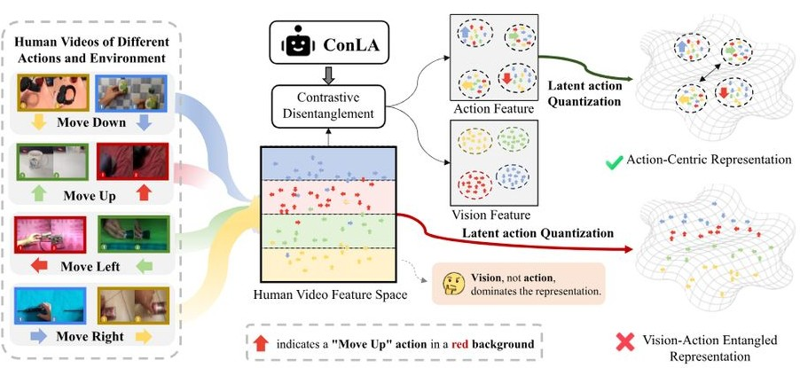

# ConLA：来自人类视频的对比潜在行动学习用于机器人操控

魏生代 \(^{1\dagger}\) 赖凯 \(^{2,3\dagger}\) 周建义 \(^{1}\) 赵博 \(^{4}\) 苏修 \(^{5}\) 汪俊文 \(^{2,3}\) 关伟力 \(^{1}\) 杨朔 \(^{1\boxed{\ast2}}\) \(^{1}\) 哈尔滨工业大学（深圳） \(^{2}\) 移动网络与移动多媒体技术国家重点实验室（深圳） \(^{3}\) 中兴通讯 \(^{4}\) 上海交通大学 \(^{5}\) 中南大学 shuoyang@hit.edu.cn

Figure 1. The overview of ConLA, which leverages contrastive learning to disentangle latent actions from visual noise in videos, guiding the construction of compact latent action representations. This enables the model to learn motion priors from complex human videos, improving downstream robot manipulation tasks.   

## 摘要

视觉-语言-动作（VLA）模型通过在大规模机器人遥控数据集上进行预训练实现了初步的泛化。然而，获取全面涵盖多样化任务和环境的数据集的成本极高并且难以扩展。相比之下，人类示范视频提供了一种丰富且可扩展的多样场景和操作行为的来源，但其缺乏明确的行动监督限制了直接利用。之前的工作利用基于VQ-VAE的框架以无监督的方式从人类视频中学习潜在动作。然而，由于训练目标主要集中在重建视觉外观而非捕捉帧间动态，因此学习到的表征往往依赖于虚假的视觉线索，导致捷径学习和纠缠的潜在表征，从而妨碍迁移性。为了解决该问题，我们提出了ConLA，一个用于从人类视频学习机器人策略的无监督预训练框架。ConLA引入了一种对比解纠缠机制，利用动作类别先验和时间线索将运动动态与视觉内容分离，有效缓解了捷径学习。广泛的实验表明，ConLA在多样化基准测试中表现出色。值得注意的是，通过仅在人类视频上进行预训练，我们的方法首次超越了基于真实机器人轨迹预训练获得的性能，突显了其为可扩展的机器人学习提取纯粹且语义一致的潜在动作表征的能力。我们的代码和数据可在 images/4.jpg)

Figure 2. Illustration of shortcut learning: using the latent action extracted from the first-row frame pair to reconstruct the second-row \(O_{t + k}\) fails, as the reconstruction drives the model to capture appearance rather than motion.    

基于这些洞见，我们提出了ConLA，这是一个无监督的机器人策略学习的预训练框架，旨在从人类视频中提取一个紧凑且语义一致的潜在动作表示，以促进运动知识向机器人学习的转移。ConLA由三个关键阶段组成：1) 对比潜在动作学习，在此阶段，我们利用动作类别先验和视频中的时间先验，通过对比学习从混合视觉噪声中解耦潜在动作。具体而言，我们首先通过用VQ-VAE建模逆动力学，从成对帧中提取潜在动作表示。在离散化之前，这些表示会通过我们的对比解耦模块进行处理，该模块采用对比学习来指导潜在动作嵌入，有效地隔离出纯净和紧凑的潜在动作。2) 潜在动作预训练，在此阶段，我们利用第一阶段获得的离散化且语义一致的潜在动作令牌来训练一个自回归视觉-语言模型。该模型根据视频观测和任务指令预测潜在动作，从而实现将人类运动从视频演示转移到机器人策略。3) 动作微调，我们使用少量真实机器人数据对模型进行微调，将潜在动作映射到可执行的电动动作，以获得最终策略。在多个基准测试中，ConLA始终实现最先进的性能。与我们的基线模型LAPA相比，ConLA显示出显著的改进。通过有效提取语义上有意义的潜在动作，ConLA在仅基于人类视频的预训练下，在SimplerEnv基准测试中比LAPA提升了\(12.5\%\)，值得注意的是，甚至超过了直接在真实机器人轨迹上预训练的模型的性能\(1.1\%\)。这些令人鼓舞的结果表明了大规模人类视频在VLA训练中的可行性和潜力。ConLA成功提取高质量的潜在动作，并验证了从人类演示中的知识转移的有效性。我们的贡献有：

我们发现现有基于 VQ-VAE 的潜在动作学习方法存在快捷学习问题，模型过于依赖视觉外观线索，而不是建模真实的运动动态。为了解决这个问题，我们引入对比学习来分离视觉和动作表征，使潜在动作能够更真实地捕捉运动语义。我们提出了一种对比解耦架构，利用动作类别和时间先验，确保具有相同语义的潜在动作在不同环境和体现方式中紧密聚集，从而改善从人类视频中学习潜在动作的效果。ConLA 在模拟基准和真实机器人测试中实现了最先进的性能，在 SimplerEnv 基准上比 LAPA 提高了 \(12.5\%\) 的成功率，并在真实世界测试中提高了 \(15.9\%\)。此外，在人类视频上预训练的策略比使用机器人轨迹数据训练的策略提高了 \(1.1\%\)，展示了利用大规模人类视频数据集扩展 VLA 的可行性。

## 2. 相关工作

视觉-语言-动作模型。基于大型语言模型（LLMs）和视觉-语言模型（VLMs）的成功，研究人员最近引入了视觉-语言-动作模型（VLAs）。这些模型将视觉观察和语言指令映射为机器人动作，从而实现操作任务的执行。OpenVLA在大规模远程操作数据集上进行预训练，并将动作建模为语言模型词汇中的词元，实现了通用的操作能力。\(\pi 0\)和\(\pi 0.5\)进一步利用跨体态、多源远程操作数据，采用基于流匹配的架构，这增强了执行细粒度任务的能力，并展示了更强的泛化能力。尽管取得了这些进展，现有方法仍然严重依赖于具有动作标注的大规模远程操作数据集，这限制了它们的可扩展性并限制了更广泛的适用性。学习自人类视频。在现实世界的机器人操作中，收集大规模远程操作数据是难以扩展的。因此，从视频演示中学习已成为一种有前景的范式。

一些研究尝试从人类视频中显式提取结构化信息以促进机器人学习。这些方法通常依赖于手势估计器或动作捕捉系统，将人类动作重新映射到机器人动作空间。EgoMimic 和 HAT 从以自我为中心的人类视频中训练特定任务的策略，但它们依赖于配对的人机数据，限制了可扩展性和泛化能力。EgoVLA 和 Being-HO 等方法使用以自我为中心的人类视频进行策略预训练，并取得了令人鼓舞的结果；然而，它们仍无法利用大规模的自由互联网视频，需要仔细收集的人类演示，并必须处理人机手部动作的重新映射。尽管这些方法比遥控操作数据更为易得，但由于数据收集所需的努力，它们仍然受到限制，限制了可扩展性。

另一项研究[9, 12, 13, 23, 28, 44, 55, 57]集中于从视频中学习潜在动作并将其用于策略建模。这些方法通常依赖于无监督的逆动态模型（IDMs）从未标记的视频中提取动作先验，进而用于训练变分潜在动作（VLA）策略。LAPA [57]利用VQ-VAE [46]从连续帧中提取运动先验，使得从人类视频到机器人操作的知识转移成为可能。CLAM [28]和COMO [55]强调了离散潜在动作在表达能力方面的局限性，并主张在连续动作空间中建模潜在动作以提高表示能力。这些方法不需要外部模型或传感器，从而实现大规模使用互联网视频。然而，基于VQ-VAE [46]的潜在动作提取容易导致捷径学习。UniVLA [9]部分解决了这个问题，通过重建未来帧的DINOv2 [37]特征并构建以任务为中心的潜在动作，减少了无关的环境噪声。尽管如此，它缺乏显式的归纳偏置，其表示仍未能完全捕捉人类视频中的运动语义。相比之下，我们的方法利用内在视频先验，包括动作类别和时间线索，来引导模型学习紧凑、解耦的表示，更有效地捕捉帧间动态，同时抑制无关的视觉干扰。

## 3. 方法论

我们的框架由三个阶段组成。在第一个阶段，我们利用动作类别信息和视频中的时间线索作为归纳偏置，从视频中提取潜在动作，从而获得一组离散的、语义一致的潜在动作。在第二个阶段，我们预训练一个基于自回归的变换语言模型政策，该政策根据视觉观测和任务指令预测离散的潜在动作词元。最后，在第三个阶段，我们在少量真实机器人轨迹上微调该政策，建立潜在动作与可执行控制信号之间的映射。

Figure 3. Contrastive Latent Action Learning. We propose a contrastive disentanglement framework to separate action from visual interference in video clips spanning the current and future frames. Specifically, samples with action class labels and their inversely augmented counterparts are encoded into latent action embeddings, which are evenly divided and fed into the Action head for Action-Centric Contrastive Learning and the Visual head for Vision-Centric Contrastive Learning to achieve disentangled representations. The optimized representation from the Action head is further quantized, and the resulting quantized latent actions, together with the current frame \(O_{t}\) , are employed to reconstruct the future frame \(O_{t + k}\) .   

## 3.1. 对比潜在行动学习

在第一阶段，我们训练一个基础模型为视频生成伪标签（潜在动作词元）。具体来说，采用对比学习来引导潜在动作表示与视觉噪声的解耦，从而获取更具判别性的伪标签，这些伪标签为第二阶段的策略预训练提供了可靠的基础。

潜在动作量化。我们从当前帧 \(O_{t}\) 和未来帧 \(O_{t + k}\) 构建视频对 \([O_{t}, O_{t + k}]\)，帧间隔为 \(k\)，并附上相应的动作类别标签 \(y\)。为了引入时间先验，我们应用逆序增强来创建逆视频对 \([O_{t + k}, O_{t}]\)。我们的潜在动作模型由逆动力学模型作为编码器 \(I\) 和正向动力学模型作为解码器 \(F\) 组成。根据 C-ViViT 分词器 [47]，我们的编码器实现为空间-时间变换器 [54]，它将当前帧 \(O_{t}\) 和未来帧 \(O_{t + k}\) 作为输入，提取两帧之间的运动信息，生成潜在动作嵌入 \(Z \in \mathbb{R}^{d}\)，预定义维度为 \(d\)。为了获得语义一致的潜在动作表示，\(Z\) 经过对比解缠模块进一步处理，生成更具区分性和结构化的嵌入 \(Z_{a}\)。然后我们对 \(Z_{a}\) 进行潜在量化以获得 \(Z_{aq}\)，并使用 VQ-VAE [46] 的目标进行优化，代码本大小为 \(|C|\)。解码器实现为空间变换器，将当前帧 \(O_{t}\) 和量化后的潜在动作词元 \(Z_{aq}\) 作为输入，以生成预测的未来帧 \(\hat{O}_{t + k}\)。我们的目标是最小化重构误差：\(\| \hat{O}_{t + k} - O_{t + k}\|^{2}\)。 对比解缠模块。如图 2 所示，基于 VQ-VAE [46] 的先验范式存在明显的快速学习问题：模型学习的潜在动作往往编码了未来帧视觉内容的离散化副本，而非真实的帧间动态。为了减轻视觉信息在潜在动作提取中的干扰，我们引入了一个对比解缠框架，结合了以动作为中心的对比学习和以视觉为中心的对比学习。这两个组件共同将动作与视觉内容解缠，使模型能够为下游策略学习生成高质量和语义一致的潜在动作表示。1) 以动作为中心的对比学习：如图 3 所示，在通过编码器获得潜在动作表示后，我们将 \(Z\) 平均分成两部分：\(Z_{a'}\)（与动作相关）和 \(Z_{v'}\)（与视觉相关），具体如下：

\[Z = I\big([O_{t},O_{t + k}]\big),\quad Z\in \mathbb{R}^{d} \quad (1)\]  

\[Z = \left[Z_{a'};Z_{v'}\right],Z_{a'},Z_{v'}\in \mathbb{R}^{d / 2} \quad (2)\]  

对于 \(Z_{a'}\)，我们应用一个两层的多层感知机作为动作头，将表示投影到动作空间，得出 \(Z_{a}\)。为了学习紧凑的潜在动作表示，我们通过优化一个动作损失来采用以动作为中心的对比学习，记作 \(L_{\text{action}}\)，该损失被实现为一种监督对比目标[22]。与仅依赖无监督VQ-VAE [46] 的LAPA [57]相比，采用动作类别标签形式的弱监督显著提高了潜在表示的可区分性。缺乏监督的情况下，潜在动作对视觉干扰（例如背景变化）高度敏感，这可能导致相似的动作被编码为完全不同的潜在表示，从而导致表示空间纠缠。动作损失通过拉近同一动作类别的表示，同时拉开不同类别的表示来缓解这一问题，导致潜在空间中紧凑且语义一致的聚类。这一机制有效减轻了捷径学习，产生了更具可区分性的潜在动作表示。这个过程可以描述为：

\[\scriptstyle \pmb{Z}_{a} = \operatorname {MLP}_{\mathrm{action}}(\pmb {Z}_{a^{\prime}}),\quad \pmb {Z}_{a}\in \mathbb{R}^{d} \quad (3)\]  

\[\mathcal{L}_{\mathrm{action}} = \sum_{i\in I}\frac{-1}{|P(i)|}\sum_{p\in P(i)}\log \frac{\exp{(Z_{a,i}\cdot Z_{a,p} / \tau)}}{\sum_{a\in A(i)}\exp{(Z_{a,i}\cdot Z_{a,a} / \tau)}}, \quad (4)\]  

其中，\(i\in I\equiv \{1,\dots ,N\}\) 表示样本的索引，称为锚点。 \(\pmb {Z}_{a,i}\) 表示第 \(\dot{\iota}\) 个样本的动作嵌入，\(\tau\) 是一个标量温度参数，而 \(A(i)\equiv I\backslash \{i\}\) 表示批次中所有索引的集合，排除 \(\ddot{\iota}\)。集合 \(\{p\in A(i):\tilde{y}_{p} = \tilde{y}_{i}\}\) 表示锚点 \(\ddot{\iota}\) 的所有正样本（即与 \(\ddot{\iota}\) 共享相同动作标签的样本），\(|P(i)|\) 表示其基数。

视觉中心对比学习：在逆动力学建模中，当前帧与未来帧之间的差异不仅包含运动信息，还包括不可避免的环境噪声，例如相机抖动、视角变化或光照波动。在没有归纳偏置的情况下，使用无监督学习来解开这些组件是具有挑战性的。我们利用时序敏感性先验：当帧顺序被颠倒时，运动信息显著变化，而内容信息和视觉干扰相对稳定。基于这一先验，我们引入了一种视觉中心对比学习目标，以维持内容一致性，同时减少运动变化的影响。具体而言，我们取反转的帧对 \([O_{t + k},O_{t}]\) 并通过编码器传递，以获得逆序列的潜在动作表示，记作 \(\mathbf{Z}^I\)。然后我们将 \(\mathbf{Z}^I\) 均匀分成两部分，得到 \(\mathbf{Z}_{\alpha}^{\cal{I}}\) 和 \(\mathbf{Z}_{\upsilon}^{\cal{I}}\)，如以下所示：

\[\begin{array}{c}\mathbf{Z}^{I} = I\left([O_{t + k},O_{t}]\right),\quad \pmb{Z}^{I}\in \mathbb{R}^{d}~\\ \mathbf{Z}^{I} = [\mathbf{Z}_{\alpha^{\prime}}^{I};\mathbf{Z}_{\upsilon^{\prime}}^{1}],\quad \pmb{Z}_{\alpha^{\prime}}^{I},\mathbf{Z}_{\upsilon^{\prime}}^{1}\in \mathbb{R}^{d / 2} \end{array} \quad (5)\]  

我们通过视觉头将\(\pmb{Z}_{\upsilon^{\prime}}\)和\(\mathbf{Z}_{\upsilon^{\prime}}^{\mathcal I}\)投影到视觉空间，得到\(\mathbf{Z}_{v}\)和\(\mathbf{Z}_{\upsilon}^{I}\)，具体如下：

\[\begin{array}{rl} & {\mathbf{Z}_{v} = \mathrm{MLP}_{\mathrm{visual}}(\mathbf{Z}_{v^{\prime}}),\quad \mathbf{Z}_{v}\in \mathbb{R}^{d}}\\ & {\mathbf{Z}_{v}^{I} = \mathrm{MLP}_{\mathrm{visual}}(\mathbf{Z}_{v^{\prime}}^{I}),\quad \mathbf{Z}_{v}^{I}\in \mathbb{R}^{d}} \end{array} \quad (7)\]  

我们将逆视觉表示 \(\mathbf{z}_{v}^{I}\) 视为正样本，以构建一个以视觉为中心的对比学习目标，其中优化由视觉损失 \(\mathcal{L}_{\mathrm{visual}}\) 指导，该损失实现为 InfoNCE [11] 损失。以视觉为中心的对比目标鼓励模型捕捉内容一致和运动不变的特征。通过在运动扰动下对比视觉表示，视觉损失驱动模型将外观信息与动态变化隔离，从而促进视觉表示与运动表示的解缠结。公式如下所示：

\[\mathcal{L}_{\mathrm{visual}} = -\sum_{i\in I}\log \frac{\exp(\tilde{Z}_{v,i}\cdot \tilde{Z}_{v,j}(i) / \tau)}{\sum_{a\in A(i)}\exp(\tilde{Z}_{v,i}\cdot \tilde{Z}_{v,a} / \tau)}. \quad (8)\]  

这里，\(i\in I\equiv \{1,\dotsc ,2N\}\) 表示样本的索引，令 \(j(i)\) 为对应于锚点样本 \(i\) 的正样本索引。 \(\begin{array}{r}\tilde{Z}_\upsilon = [\mathbf{Z}_\upsilon ;\mathbf{Z}_{\upsilon}^I ]\in \mathbb{R}^{2N\times d} \end{array}\) 表示包含 \(2N\) 个样本的批次的连接视觉嵌入，其中 \(\mathbf{Z}_{\upsilon}\in \mathbb{R}^{N\times d}\) 和 \(\mathbf{Z}_{\upsilon}^{I}\in \mathbb{R}^{N\times d}\) 彼此作为正样本对。 \(\tilde{Z}_{v,i}\) 表示批次中第 \(i\) 个样本的视觉嵌入。

### 3.2. 潜在行动预训练

我们利用第一阶段训练的潜在动作量化编码器作为逆动力学模型，从视频中提取潜在动作，这些潜在动作作为伪标签。具体来说，对于每一对当前帧 \(O_{t}\) 和未来帧 \(O_{t + k}\)，我们通过从动作中心化的代码本中检索最近的量化表示来生成相应的潜在动作，从而构建一个由观察-指令-伪动作标签三元组组成的数据集。然后，我们在这个数据集上对潜在动作进行预训练，使用一个预训练的视觉-语言模型 (VLM) 预测 \(Z_{aq}\)，条件是任务指令和当前帧 \(O_{t}\)。遵循 LAPA [57]，我们在 VLM 的语言模型头后附加了一个额外的潜在动作头，该头实现为一个具有词汇表大小 \(|C|\) 的单层 MLP。在训练过程中，视觉编码器保持冻结，而语言模型则解冻进行优化。为了保持一致性，我们的通用策略基于 7B 大型世界模型 [30]。

### 3.3. 动作微调

在潜在动作预训练的第二阶段，视频中的运动先验已成功转移到策略中。然而，生成的潜在动作不能直接应用于下游机器人任务，因为它们与实际的末端执行器运动不对应。为了将潜在动作映射到真实的机器人动作，我们使用包含真实机器人动作的小规模轨迹对预训练策略进行微调。在动作预测过程中，我们对每个机器人维度的连续动作空间进行离散化。在微调阶段，原始潜在动作头被丢弃，并替换为一个新的动作头，以生成真实动作。与潜在动作预训练一致，视觉编码器保持冻结，而底层语言模型的所有参数则解冻以进行优化。

## 4. 实验

4. 实验 为了验证我们提出的通用策略的有效性，我们的框架在 SimplerEnV [27] 模拟环境和现实世界场景中进行了评估。此外，我们还进行了潜在动作分析和消融研究，以探讨关键设计选择。

### 4.1. 基准测试

4.1. 基准测试\(\text{SimplerEnv } [27]\) 旨在通过反映物理动态和视觉外观，忠实地反映现实世界策略的性能。我们关注在 "\text{WindowX} + \text{Bridge}" 设置中的四个任务：(1) 将勺子放在桌布上，(2) 将胡萝卜放在盘子上，(3) 将一个绿色立方体叠放在一个黄色立方体上，以及 (4) 将一个茄子放入篮子中。由于 SimplerEnv [27] 缺乏微调轨迹，我们遵循 LAPA [57] 的实验设置，基于在 BridgeV2 数据集 [49] 上训练的 VLA 模型的成功推演收集 100 个多任务轨迹。待抓取物体的姿态和位置使用不同的随机种子进行随机初始化。我们的评估遵循 LAPAG [57]，每个任务在 24 次独立试验中评估，以确保稳健的性能指标。现实世界桌面操作实验使用 7 自由度 Franka Research 3 机器人臂在三个环境中进行，配备第三视角的 Realsense D435i RGB-D 摄像头，仅使用 RGB 图像。我们利用两个预训练数据源，BridgeV2 [49] 和 Something-SomethingV2 [16]，遵循 LAPAG [57] 的现实世界实验设置。模型在三个多指令任务上进行微调：(1) 撞倒 <object>，(2) 用毛巾覆盖 <object>，(3) 将 <object> 放入箱子中。对于每个任务，我们收集 150 个轨迹。为了评估，我们采用任务特定的部分成功标准，遵循 OpenVLA [24]。更多细节见附录。

### 4.2. 预训练数据集

4.2. 预训练数据集 我们在机器人视频数据集和人类视频数据集上预训练VLM策略。 1) BridgeV2是一个大规模的机器人操作数据集，包含60,096条记录，分布在24个环境中。该数据集涵盖了多种技能，包括拾取、放置、推动、清扫、堆叠和折叠。所有记录都配有自然语言指令。在数据预处理过程中，我们将语言指令分类为80个动作类别，从而形成第一阶段潜在动作学习中使用的动作类别标签。数据预处理的具体细节见附录。 2) Something-SomethingV2是一个包含220,847个被标记的视频片段的集合，这些片段展示了人类使用日常物品执行预定义基本动作。虽然该数据集不包含真实动作标签，但为每个视频片段提供了预定义的动作类别标签，涵盖共174个动作类别。

## 4.3. 基线比较

4.3. 基线选择我们选定的基线模型包括以下模型：1) UNIPI [15] 采用视频扩散模型进行语言条件的推演生成，并使用反向动力学模型在真实动作上进行微调。2) VPT [4] 在标记数据上训练反向动力学模型，从视频中提取伪动作，并用于预训练VLM。3) LAPA [57] 使用简单的VQ-VAE [46] 从视频中学习潜在动作，并利用提取的潜在动作对VLM进行预训练。4) SCRATCH 表示仅在微调数据集上从头开始训练相同的主干VLM，作为评估预训练收益的下限基线。5) ACTIONVLA 表示使用真实机器人动作数据预训练相同的主干VLM，可以视为上限，因为它依赖于访问真实动作标签。

## 4.4.在SimplerEnv上的评估

4.4. 在SimplerEnv上的评估 在本节中，我们使用机器人视频（BridgeV2 [49]）和人类视频（Something-SomethingV2 [16]）进行策略的预训练。机器人视频是在受控环境中收集的，噪声极少，但获取成本高且数量有限。相比之下，人类视频数量丰富且易于获取，但包含较高的环境噪声，这给潜在动作学习带来了挑战。本实验评估了我们的方法在这两种视频类型上的普适性，并探讨了改进的潜在动作表示是否能缓解人类视频中的挑战，提高其效用，并促进运动先验向机器人操作任务的转移。 结果与分析。正如表1所示，我们的方法在SimplerEnv上大幅超越所有基线。值得注意的是， solely针对人类视频预训练的ConLA甚至超越了在真实机器人轨迹（ACTIONVLA）上预训练的模型。这些结果突显了先前范式未能解决人类视频数据的挑战：尽管人类视频在规模上大于机器人数据集，并且包含更丰富、多样的运动信息，但其预训练效果不佳。相比之下，我们的方法更有效地利用人类视频，产生了积极的结果，并为未来研究释放其全部潜力铺平了道路。更多结果详见附录。

## 4.5. 现实世界结果

4.5. 真实世界结果 在本节中，我们使用 BridgeV2 [49] 和 Something-SomethingV2 [16] 进行策略的预训练，随后使用少量真实世界机器人轨迹进行微调。图 4 报告了在三个任务和三个泛化设置（未见的物体组合、未见的物体、未见的指令）下的真实机器人表现。LAPA [57] 和 ConLA 均优于 SCRATCH，验证了视频预训练的价值。然而，LAPA [57] 在人类视频和机器人视频预训练时几乎没有优势，这表明尽管人类视频具有多样性和规模，领域复杂性和分布迁移却阻碍了其有效利用。相反，ConLA 不仅进一步改进了 BridgeV2 [49] 的预训练，更重要的是，在人类视频上预训练时实现了显著的性能提升，超过了 LAPA [57] 15.9%。我们认为，这一改进源于 ConLA 提取语义一致的潜在动作的能力，使得人类视频中的运动先验获得得更加可靠。此外，如表 2 所示，LAPA [57] 和 ConLA 在人类视频上预训练时，在未见物体设置下表现出强大的泛化能力，原因是大规模人类视频数据集中物体多样性更广泛。总体而言，这些结果突显了人类视频预训练的可扩展潜力，并证明 ConLA 显著增强了人类运动先验在下游机器人控制中的迁移效果。更多结果见附录。

Table 1. Quantiative results of our method and baselines on the SimplerEnv. Average success rate \((\%)\) are shown. Notably, ConLA pretrained only on human videos surpasses model pretrained on real robot trajectories (ACTONVLA) by \(^{1.1\%}\)   

<table><tr><td>Pretraining Data</td><td>Data Type</td><td>Policy</td><td>stack green  to yellow block</td><td>put carrot  on plate</td><td>put spoon  on towel</td><td>put eggplant  in basket</td><td>Average</td></tr><tr><td>-</td><td>-</td><td>SCRATCH  ACTIONVLA</td><td>29.2</td><td>29.2</td><td>50.0</td><td>29.2</td><td>34.4</td></tr><tr><td>BridgeV2 [49]</td><td>Robot Trajectories</td><td>UNITII [15]  VPT [4]  LAPA [57]  ConLA (ours)</td><td>2.7  45.8  54.2  62.5</td><td>2.7  37.5  45.8  45.8</td><td>0.0  70.8  70.8</td><td>0.0  50.0  58.3</td><td>1.3  51.0  57.3</td></tr><tr><td>BridgeV2 [49]</td><td>Robot Videos</td><td>UNITII [15]  VPT [4]  LAPA [57]  ConLA (ours)</td><td>0.0  50.0  50.0  62.5</td><td>1.3  29.1  50.0  50.0</td><td>1.3  37.5  50.0  79.2</td><td>0.0  66.6  50.0  58.3</td><td>0.7  45.8  52.1</td></tr><tr><td></td><td></td><td></td><td></td><td></td><td></td><td></td><td>64.6 (+12.5)</td></tr></table>  

Figure 4. Real-world Manipulation Robot Results. ConLA outperforms prior state-of-the-art by \(15.9\%\) in success rate.   

### 4.6. 潜在行动分析

快捷学习分析。为了评估我们的方法在减轻潜在动作提取过程中快捷学习的有效性，我们进行了定性可视化分析（见图5）。具体而言，我们从一对视频剪辑中提取了四个代表性的潜在动作：向下、向上、向左和向右。这些提取的潜在动作随后被应用于重建来自其他图像的帧，旨在评估学习到的潜在动作是否能够在不同视觉上下文中控制运动生成。

Table 2. Real-world generalization results across three evaluation settings. We report success rates \((\%)\) on :-1) seen objects but unseen combinations,(2) unseen object,(3) new instructions requiring semantic reasoning.   

<table><tr><td>Method</td><td>Absent Opt.  Unseen Combo</td><td>Unseen Obj.</td><td>Absent Obj.  Unseen Instruct.</td><td>AVG</td></tr><tr><td>SCRATCH</td><td>18.4</td><td>10.5</td><td>17.1</td><td>15.3</td></tr><tr><td>LAPA (Bridge)</td><td>36.0</td><td>22.1</td><td>35.6</td><td>31.2</td></tr><tr><td>ConLA (Bridge)</td><td>46.2</td><td>25.4</td><td>37.8</td><td>36.5</td></tr><tr><td>LAPA (Human Videos)</td><td>36.0</td><td>25.8</td><td>35.1</td><td>32.3</td></tr><tr><td>ConLA (Human Videos)</td><td>59.1</td><td>47.2</td><td>38.3</td><td>48.2</td></tr></table>  

Figure 5. Latent action analysis. Visualization of shortcut learning in latent action extraction. Reconstructed images conditioned on the extracted latent actions demonstrate that our method captures motion-relevant actions, alleviating shortcut learning.

在本分析中，我们将当前帧（输入）作为条件，并基于提取的潜在动作生成预测的未来帧。我们将我们方法的重建结果与一项简单的LAPA [57] 基线进行了比较。如图所示，在人类视频中，LAPA [57] 遭遇了严重的捷径学习问题，提取的潜在动作主要由视觉内容主导（如第一列右侧图像所示），而非运动语义；而在机器人视频中，提取的潜在动作也表现出语义不一致性。相比之下，我们的方法捕捉到了具有运动意义的潜在动作，这些动作真实地反映了潜在的动态。这些结果表明我们的方法有效地缓解了捷径学习，并学习了语义一致的潜在动作表示。潜在动作表示分析。为了分析潜在动作表示空间的结构，我们从每个动作类别随机抽样了100个视频片段，并提取了它们的潜在动作嵌入，这些嵌入通过 t-SNE 可视化。如图5所示，简单的VQ-VAE [46] 获得的潜在动作空间杂乱无序，且在不同动作类别间交织（如左侧图所示），而我们的方法生成了一个更紧凑且语义上连贯的潜在动作空间。相似的动作因视觉外观差异不再被分离。这样的表示使得人类动作先验能够更忠实地转移到机器人训练中，从而提高了利用人类视频数据进行机器人学习的效率。

Figure 6. t-SNE visualizations of the latent action embeddings show that our method yields semantically consistent and compact representations, with same-category actions forming tight clusters.   

### 4.7. 消融研究

对比解缠模块。为了评估解缠过程中特征的贡献，我们在第一阶段潜在动作学习中进行消融研究，使用Something-SomethingV2 [16] 数据集，并在SimplerEnv [27] 基准上验证性能，采用平均任务成功率作为评估指标。正如表3所示，以LAPA [57] 作为基线，基于动作的对比学习通过利用来自动作类别标签的弱监督显著提高了潜在动作表示。我们进一步引入基于视觉的对比学习，并检查逆序增强的效果。去除时间反转——以原始顺序输入相邻帧——导致动作和视觉嵌入变得更加相似，进而导致特征的混淆表示和性能下降。相较之下，逆序增强保留了动作和视觉特征之间的清晰分离，从而带来了额外的性能提升。

Table 3. Ablation study on the contrastive disentanglement module design on SimplerEnv. Average success rate \((\%)\) are shown.   

<table><tr><td>Method</td><td>Avg.</td></tr><tr><td>LAPA (base)</td><td>52.1</td></tr><tr><td>+ Action contrast</td><td>58.4</td></tr><tr><td>+ Action + Visual contrast (w/o inv. aug.)</td><td>57.3</td></tr><tr><td>Full ConLA</td><td>64.6</td></tr></table>  

数据可扩展性。为了评估我们方法在人工演示视频数据集上的扩展能力，我们在 Something-SomethingV2 [16] 数据集上进行了实验。具体而言，我们使用数据集中不同比例的数据进行预训练，从 \(10\%\) 到 \(100\%\) 的范围，以检查性能如何随数据规模的增加而变化。我们还将我们的结果与 LAPA [57] 基线进行了比较，以评估相对改善。结果表明，性能随着数据规模的增加而积极提升，我们的方法比基线更有效地利用数据。

Table 4. Ablation study of pretraining on different scales of human videos on SimplerEnv. Average success rate \((\%)\) are shown.   

<table><tr><td>Method</td><td>10% Data</td><td>50% Data</td><td>100% Data</td></tr><tr><td>LAPA</td><td>50.0</td><td>51.0</td><td>52.1</td></tr><tr><td>ConLA</td><td>58.3</td><td>60.4</td><td>64.6</td></tr></table>  

## 5. 结论

在本工作中，我们提出了ConLA，一种简单而有效的方法，用于从人类演示视频中提取高质量的潜在动作，适用于视觉-语言-动作模型。通过利用对比潜在动作学习，结合动作类别和时间先验构建以动作为中心的表示，我们的方法减轻了简便学习，并产生了稳健的潜在动作。大量实验表明，ConLA始终优于以前的方法，即使仅在人类视频数据上进行训练。这些结果展示了大规模人类视频预训练在视觉-语言-动作中的强大潜力。

## References  

[1] Josh Achiam, Steven Adler, Sandhini Agarwal, Lama Ahmad, Iige Akkaya, Florencia Leoni Aleman, Diogo Almeida, Janko Altenschmidt, Sam Altman, Shyamal Anandk, et al. Gpt- 4 technical report. arXiv preprint arXiv:2303.08774, 2023. 2, 3  [2] Rohan Anil, Andrew M Dai, Orhan Firat, Melvin Johnson, Dmitry Lepikhin, Alexandre Passos, Siamak Shakeri, Emanuel Taropa, Paige Bailey, Zhifeng Chen, et al. Palm 2 technical report. arXiv preprint arXiv:2305.10403, 2023. 3  [3] Arpit Bahetty, Priyanka Mandikal, Ben Abbatematteo, and Roberto Martin- Martin. Screwmicmic: Bimanual imitation from human videos with screw space projection. RSS, 2024. 3  [4] Bowen Baker, Ilge Akkaya, Peter Zhokov, Joost Huizinga, Jie Tang, Adrien Ecoffet, Brandon Houghton, Raul Sampedro, and Jeff Clune. Video pretraining (vpt): Learning to act by watching unlabeled online videos. NeurIPS, 2022. 6, 7  [5] Johan Bjorck, Fernando Castaneda, Nikita Cherniadev, Xingye Da, Runyu Ding, Linxi Fan, Yu Fang, Dieter Fox, Fengyuan Hu, Spencer Huang, et al. Gr0dt n1: An open foundation model for generalist humanoid robots. arXiv preprint arXiv:2503.14734, 2025. 2, 3  [6] Kevin Black, Noah Brown, Danny Driess, Adnan Esmail, Michael Equi, Chelsea Finn, Niccolo Fusai, Lachry Groom, Karol Hausman, Brian Ichter, et al. \(\pi 0\) : A vision- language- action flow model for general robot control. arXiv preprint ARXIV.2410.24164, 2024. 2, 3  [7] Anthony Brohan, Noah Brown, Justice Carbajal, Yevgen Chebotar, Joseph Dabus, Chelsea Finn, Keerthana Gopalakrishnan, Karol Hausman, Alex Herzog, Jasmine Hsu, et al. Rt- 1: Robotics transformer for real- world control at scale. RSS, 2023. 3  [8] Qingwen Bu, Jisong Cai, Li Chen, Xiuqi Cui, Yan Ding, Siyuan Feng, Shenyuan Gao, Xindong He, Xuan Hu, Xu Huang, et al. Agibot world colosseo: A large- scale manipulation platform for scalable and intelligent embodied systems. IROS, 2025. 3  [9] Qingwen Bu, Yanting Yang, Jisong Cai, Shenyuan Gao, Guanghui Ren, Maoping Yao, Ping Luo, and Hongyang Li. Univla: Learning to act anywhere with task- centric latent actions. RSS, 2025. 2, 3, 13  [10] Guangyan Chen, Meiling Wang, Te Cui, Yao Mu, Haoyang Lu, Zicai Peng, Mengxiao Hu, Tianxing Zhou, Mengyin Fu, Yi Yang, et al. Fmimic: Foundation models are fine- grained action learners from human videos. 1RRR, 2025. 3  [11] Ting Chen, Simon Kornblith, Mohammad Norouzi, and Geoffrey Hinton. A simple framework for contrastive learning of visual representations. ICML, 2020. 5  [12] Xiaoyu Chen, Hangxing Wei, Pushi Zhang, Chuhheng Zhang, Kaixin Wang, Yanjiang Guo, Rushuai Yang, Yucen Wang, Xinquan Xiao, Li Zhao, et al. Villa- x: enhancing latent action modeling in vision- language- action models. arXiv preprint arXiv:2507.23682, 2025. 3  [13] Yi Chen, Yuying Ge, Weiliang Tang, Yizhuo Li, Yixiao Ge, Mingyu Ding, Ying Shan, and Xihui Liu. Moto: Latent motion token as the bridging language for learning robot manipulation from videos. ICCV, 2025. 2, 3  [14] Danny Driess, Fei Xia, Mehdi SM Sajjadi, Corey Lynch, Aakanksha Chowdhery, Brian Ichter, Ayzaan Wahid, Jonathan Tompson, Quan Vuong, Tianhe Yu, et al. Palm- e: an embodied multimodal language model. ICML, 2023. 2  [15] Yilun Du, Sherry Yang, Bo Dai, Hanjun Dai, Ofir Nachum, Josh Tenenbaum, Dale Schuurmans, and Pieter Abbeel. Learning universal policies via text- guided video generation. NeurIPS, 2023. 6, 7  [16] Raghav Goyal, Sumira Ebrahimi Kahou, Vincent Michalski, Joanna Materzynska, Susanne Westphal, Heuna Kim, Valentin Haenel, Ingo Freund, Peter Yianilos, Moritz Mueller- Freitag, et al. "the" Something something vision database for learning and evaluating visual common sense. ICCV, 2017. 6, 7, 8, 13  [17] Ryan Hoque, Peide Huang, David J Yoon, Mouli Sivapurapu, and Jian Zhang. Egodex: Learning dexterous manipulation from large- scale egocentric video. arXiv preprint arXiv:2505.11709, 2025. 3  [18] Physical Intelligence, Kevin Black, Noah Brown, James Darpinjian, Karan Dhabalia, Danny Driess, Adnan Esmail, Michael Equi, Chelsea Finn, Niccolo Fusai, et al. \(\pi 0\) .5: a vision- language- action model with open- world generalization, 2025. URL https://01.311.026/22416,2025.3  [19] Jared Kaplan, Sam McCandlich, Tom Henighan, Tom B Brown, Benjamin Chess, Rewon Child, Scott Gray, Alec Radford, Jeffrey Wu, and Dario Amodei. Scaling laws for neural language models. arXiv preprint arXiv:2001.08361, 2020. 2  [20] Simar Kareer, Dhruv Patel, Ryan Punamiya, Pranay Mathur, Shuo Cheng, Chen Wang, Judy Hoffman, and Danfei Xu. Egomicic: Scaling imitation learning via egocentric video. ICRA, 2025. 3  [21] Alexander Khazatsky, Karl Pertsch, Suraj Nair, Ashwin Balakrishna, Sudeep Dasari, Siddharth Karamcheti, Soroush Nasiriany, Mohan Kumar Srirama, Lawrence Yunliang Chen, Kirsty Ellis, et al. Droid: A large- scale in- the- wild robot manipulation dataset. RSS, 2024. 3  [22] Prannay Khosla, Piotr Teterwak, Chen Wang, Aaron Sarna, Yonglong Tian, Phillip Isola, Aaron Maschinot, Ce Liu, and Dilip Krishnan. Supervised contrastive learning. NeurIPS, 2020. 4  [23] Hanjung Kim, Jaehyun Kang, Hyelim Kang, Meedeum Cho, Seon Joo Kim, and Youngwoon Lee. Uniskill: Imitating human videos via cross- embodiment skill representations. arXiv preprint arXiv:2505.08787, 2025. 3  [24] Moo Jin Kim, Karl Pertsch, Siddharth Karamcheti, Ted Xiao, Ashwin Balakrishna, Suraj Nair, Rafael Rafailov, Ethan P Foster, Pannag R Sanketi, Quan Vuong, et al. Openvla: An open- source vision- language- action model. CoRL, 2025. 2, 3, 6  [25] Marion Lepert, Jiaying Fang, and Jeannette Bohg. Phantom: Training robots without robots using only human videos. arXiv preprint arXiv:2503.00779, 2025. 3  [26] Qixiu Li, Yaobio Liang, Zeyu Wang, Lin Luo, Xi Chen, Mozheng Liao, Fangyun Wei, Yu Deng, Sicheng Xu.  

tion taken as the bridging language for learning robot manipulation from videos. ICCV, 2025. 2, 3  [14] Danny Driess, Fei Xia, Mehdi SM Sajjadi, Corey Lynch, Aakanksha Chowndhery, Brian Ichter, Ayzaan Wahid, Jonathan Tompson, Quan Vuong, Tianhe Yu, et al. Palm- e: an embodied multimodal language model. ICML, 2023. 2  [15] Yilun Du, Sherry Yang, Bo Dai, Hanjun Dai, Ofir Nachum, Josh Tenenbaum, Dale Schuurmans, and Pieter Abbeel. Learning universal policies via text- guided video generation. NeurIPS, 2023. 6, 7  [16] Raghav Goyal, Sumira Ebrahimi Kahou, Vincent Michalski, Joanna Materzynska, Susanne Westphal, Heuna Kim, Valentin Haenel, Ingo Freund, Peter Yianilos, Moritz Mueller- Freitag, et al. 'the' Something something vision database for learning and evaluating visual common sense. ICCY, 2017. 6, 7, 8, 13  [17] Ryan Hoque, Peide Huang, David J Yoon, Mouli Sivapurapu, and Jian Zhang. Egodex: Learning dexterous manipulation from large- scale egocentric video. arXiv preprint arXiv:2505.11709, 2025. 3  [18] Physical Intelligence, Kevin Black, Noah Brown, James Darpinjian, Karan Dhabalia, Danny Driess, Adnan Esmail, Michael Equi, Chelsea Finn, Niccolo Fusai, et al. \(\pi 0\) .5: a vision- language- action model with open- world generalization, 2025. URL https://01.311.026/22416,2025. 3  [19] Jared Kaplan, Sam McCandlich, Tom Henighan, Tom B Brown, Benjamin Chess, Rewon Child, Scott Gray, Alec Radford, Jeffrey Wu, and Dario Amodei. Scaling laws for neural language models. arXiv preprint arXiv:2001.08361, 2020. 2  [20] Simar Kareer, Dhruv Patel, Ryan Punamiya, Pranay Mathur, Sho Chuo, Chen Wang, Judy Hoffman, and Danfei Xu. Egomicic: Scaling imitation learning via egocentric video. ICRA, 2025. 3  [21] Alexander Khazatsky, Karl Pertsch, Suraj Nair, Ashwin Balakrishna, Sudeep Dasari, Siddharth Karamcheti, Soroush Nasiriany, Mohan Kumar Srirama, Lawrence Yunliang Chen, Kirsty Ellis, et al. Droid: A large- scale image- model robot manipulation dataset. RSS, 2024. 3  [22] Prannay Khosla, Piotr Teterwak, Chen Wang, Aaron Sarna, Yonglong Tian, Phillip Isola, Aaron Maschinot, Ce Liu, and Dilip Krishnan. Supervised contrastive learning. NeurIPS, 2020. 4  [23] Hanjung Kim, Jaehyun Kang, Hyelim Kang, Meedeum Cho, Seon Joowi Kim, and Youngwoon Lee. Uniskill: Imitating human videos via cross- embodiment skill representations. arXiv preprint arXiv:2505.08787, 2025. 3.  [24] Moo Jin Kim, Karl Pertsch, Siddharth Karamcheti, Ted Xiao, Ashwin Balakrishna, Suraj Nair, Rafael Rafailov, Ethan P Foster, Pannag R Sanketi, Quan Vuong, et al. Openvla: An open- source vision- language action model. CoRL, 2025. 2, 3, 6.  [25] Marion Lepert, Jiaying Fang, and Jeannette Bohg. Phantom: Training robots without robots using only human videos. arXiv preprint arXiv:2503.00779, 2025. 3.  [26] Qixiu Li, Yaobio Liang, Zeyun Wang, Lin Luo, Xi Chen, Mozheng Liao, Fangyun Wei, Yu Deng, Sicheng Xu,

Yizhong Zhang, et al. Cogact: A foundational vision- language- action model for synergizing cognition and action in robotic manipulation. arXiv preprint arXiv:2411.19650, 2024. 3[27] Xuanlin Li, Kyle Hsu, Jiayuan Gu, Oier Mees, Karl Pertsch, Homer Rich Walke, Chuyuan Fu, Ishikaa Lunawat, Isabel Sieh, Sean Kirmani, et al. Evaluating real- world robot manipulation policies in simulation. CoRL, 2025. 3, 6, 8, 13[28] Anthony Liang, Pavel Czemplin, Matthew Hong, Yutai Zhou, Erdem Biyik, and Stephen Tu. Clam: Continuous latent action models for robot learning from unlabeled demonstrations. arXiv preprint arXiv:2505.04999, 2025. 3[29] Yaron Lipman, Ricky TQ Chen, Heli Ben- Hamu, Maximilian Nickel, and Matt Le. Flow matching for generative modeling. ICLR, 2023. 3[30] Hao Liu, Wilson Yan, Mateia Zaharia, and Pieter Abbeel. World model on million- length video and language with blockwise grindingal. ICLR, 2025. 5, 12, 13[31] Jiaming Liu, Hao Chen, Pengju An, Zhuoyang Liu, Renrui Zhang, Chenyang Gu, Xiaoqi Li, Ziyu Guo, Sixiang Chen, Mengzhen Liu, et al. Hybridya: Collaborative diffusion and autoregression in a unified vision- language- action model. arXiv preprint arXiv:2503.10631, 2025. 3[32] Songming Liu, Lingxuan Wu, Bangguo Li, Hengkai Tan, Huayu Chen, Zhengyi Wang, Ke Xu, Hang Su, and Jun Zhu. Rdt- 1b: a diffusion foundation model for bimanual manipulation. ICLR, 2025. 2, 3[33] Vincent Liu, Ademi Adeniji, Haotian Zhan, Siddhant Haldar, Raunag Bhirangi, Pieter Abbeel, and Lerrel Pinto. Egozero: Robot learning from smart glasses. arXiv preprint arXiv:2505.20290, 2025. 3[34] Francesco Locatello, Stefan Bauer, Mario Lucic, Gunnar Raetsch, Sylvain Gelly, Bernhard Scholkopf, and Olivier Bachem. Challenging common assumptions in the unsupervised learning of disentangled representations. ICML, 2019. 2[35] Haoyu Lu, Wen Liu, Bo Zhang, Bingxuan Wang, Kai Dong, Bo Liu, Jingxiang Sun, Tongzheng Ren, Zhuoshu Li, Hao Yang, et al. Deepseek- v1: towards real- world vision- language understanding. arXiv preprint arXiv:2403.05525, 2024. 3[36] Hao Luo, Yicheng Feng, Wanpeng Zhang, Sixpeng Zheng, Ye Wang, Haoqi Yuan, Jiazheng Liu, Chaoyi Xu, Qin Jin, and Zongqing Lu. Being- h0: vision- language- action pretraining from large- scale human videos. arXiv preprint arXiv:2507.15597, 2025. 3[37] Maxime Oquab, Timothee Parent, Theo Moutakanni, Huy Vo, Marc Szafraniec, Vasil Khalidov, Pierre Fernandez, Daniel Haziza, Francisco Massa, Alaaeldin El- Nouby, et al. Dinov2: Learning robust visual features without supervision. TMLR, 2024. 3, 13[38] Karl Pertsch, Kyle Stachowicz, Brian Ichter, Danny Driess, Suraj Nair, Quan Vuong, Oier Mees, Chelsea Finn, and Sergey Levine. Fast: Efficient action tokenization for vision- language- action models. arXiv preprint arXiv:2501.09747, 2025. 2, 3  

[39] Yuzhe Qin, Yueh- Hua Wu, Shaowei Liu, Hanwen Jiang, Ruihan Yang, Yang Fu, and Xiaolong Wang. Dexmv: Imitation learning for dexterous manipulation from human videos. ECCV, 2022. 3[40] Ri- Zhao Qiu, Shiqi Yang, Xuxin Cheng, Chaitanya Chawla, Jialong Li, Tairan He, Ge Yan, David J Yoon, Ryan Hoque, Lars Paulsen, et al. Humanoid policy human policy. arXiv preprint arXiv:2503.13441, 2025. 3[41] Aarohi Srivastava, Abhinav Rastogi, Abhishek Rao, Abu Awal Md Shoeb, Abubakar Abid, Adam Fisch, Adam R Brown, Adam Santoro, Aditya Gupta, Adria Garriga- Alonso, et al. Beyond the imitation game: Quantifying and extrapolating the capabilities of language models. TMLR, 2023. 2[42] Gemini Team, Petko Georgiev, Ying Ian Lei, Ryan Burnell, Libin Bai, Anmol Gulati, Garrett Tanzer, Damien Vincent, Zhufeng Pan, Shibo Wang, et al. Gemini 1.5: Unlocking multimodal understanding across millions of tokens of context. arXiv preprint arXiv:2403.05530, 2024. 3[43] Octo Model Team, Dibya Ghosh, Homer Walke, Karl Pertsch, Kevin Black, Oier Mees, Sudeep Dasari, Joey Hejna, Tobias Kreiman, Charles Xu, et al. Octo: An open- source generalist robot policy. ICRA, 2024. 3[44] Bahey Tharwat, Yara Nasser, Ali Abouzeid, and Ian Reid. Latent action pretraining through world modeling. arXiv preprint arXiv:2509.18428, 2025. 3[45] Hugo Touvron, Thibaut Lawtli, Gautier Izacard, Xavier Martinet, Marie- Anne Lachaux, Timothée Lacroix, Baptiste Rozière, Niman Goyal, Eric Hambro, Faisal Azhar, et al. Llama: Open and efficient foundation language models. arXiv preprint arXiv:2302.13971, 2023. 3[46] Aaron Van Den Oord, Oriol Vinyals, et al. Neural discrete representation learning. NeurIPS, 2017. 2, 3, 4, 6, 8[47] Ruben Villegas, Mohammad Babaeizadeh, Pieter- Jan Kindermans, Hernan Moraldo, Han Zhang, Mohammad Taghi Saffar, Santiago Castro, Julius Kunze, and Dumitru Erhan. Phenaki: Variable length video generation from open domain textual description. ICLR, 2023. 4[48] Quan Vuong, Sergey Levine, Homer Rich Walke, Karl Pertsch, Anikait Singh, Ria Doshi, Charles Xu, Jianlan Luo, Liam Tan, Dhruv Shah, et al. Open- x- embodiment: Robotic learning datasets and rt- x models. CoRL, 2023. 3[49] Homer Rich Walke, Kevin Black, Tony Z Zhao, Quan Vuong, Chongyi Zheng, Philippe Hansen- Estruch, Andrée Wang He, Vivek Myers, Moo Jin Kim, Maa Du, et al. Bridgedata v2: A dataset for robot learning at scale. PMLR, 2023. 6, 7, 13, 14[50] Jason Wei, Yi Tay, Rishi Bommasani, Colin Raffel, Barret Zoph, Sebastian Borgeaud, Dani Yogatama, Maarten Bosma, Denny Zhou, Donald Metzler, et al. Emergent abilities of large language models. arXiv preprint arXiv:2206.07682, 2022. 2[51] Junjie Wen, Yichen Zhu, Jinming Li, Zhibin Tang, Chaomin Shen, and Feifei Feng. Dexvla: Vision- language model with plug- in diffusion expert for general robot control. arXiv preprint arXiv:2502.05855, 2025. 2[52] Junjie Wen, Yichen Zhu, Jinming Li, Minjie Zhu, Zhibin Tang, Kun Wu, Zhiyuan Xu, Ning Liu, Ran Cheng, Chaomin

Shen, et al. Tinyvla: Towards fast, data- efficient vision- language- action models for robotic manipulation. RAL, 2025. 2 

[53] Jin Xu, Zhifang Guo, Jinzheng He, Hangrui Hu, Ting He, Shuai Bai, Keqin Chen, Jialin Wang, Yang Fan, Kai Dang, et al. Qwen2. 5- omni technical report. arXiv preprint arXiv:2503.20215, 2025. 3 

[54] Mingxing Xu, Wenrui Dai, Chunmao Liu, Xing Gao, Weiyao Lin, Guo-Jun Qi, and Hongkai Xiong. Spatial-temporal transformer networks for traffic flow forecasting. arXiv preprint arXiv:0001.02908, 2020. 4 

[55] Jiange Yang, Yansong Shi, Haoyi Zhu, Mingyu Liu, Kaijing Ma, Yating Wang, Gangshan Wu, Tong He, and Limin Wang. Como: Learning continuous latent motion from internet videos for scalable robot learning. arXiv preprint arXiv:2505.17006, 2025. 3 

[56] Ruihan Yang, Qinxi Yu, Yecheng Wu, Rui Yan, Borui Li, An-Chieh Cheng, Xueyan Zou, Yunhao Fang, Xuxin Cheng, Ri-Zhao Qiu, et al. EgoVLA: Learning vision-language-action models from egocentric human videos. arXiv preprint arXiv:2507.12440, 2025. 3. 

[57] Seonghyeon Ye, Joel Jang, Byeongguk Jeon, Se June Joo, Jianwei Yang, Baolin Peng, Ajay Mandlekar, Reuben Tan, Yu- Wei Chao, Bill Yuchen Lin, et al. Latent action pretraining from videos. ICLR, 2025. 2, 3, 4, 5, 6, 7, 8, 12, 13, 14 

[58] Huayi Zhou, Ruixiang Wang, Yunxin Tai, Yucci Deng, Guiliang Liu, and Kui Jia. You only teach once: Learn one-shot bimanual robotic manipulation from video demonstrations. arXiv preprint arXiv:2501.14208, 2025. 3 

[59] Jinguo Zhu, Weiyun Wang, Zhe Chen, Zhaoyang Liu, Shenglong Ye, Lixin Gu, Hao Tian, Yuchen Duan, Weijie Su, Jie Shao, et al. Internvl3: Exploring advanced training and test-time recipes for open-source multimodal models. arXiv preprint arXiv:2504.10479, 2025. 3 

[60] Brianna Zitkovich, Tianhe Yu, Sichun Xu, Peng Xu, Ted Xiao, Fei Xia, Jialin Wu, Paul Wohlhart, Stefan Welker, Ayzaan Wahid, et al. Rt-2: Vision-language-action models transfer web knowledge to robotic control. CoRL, 2023. 3

## Appendix  

### A. Implementation Details  

## A.1. Detailed Algorithm  

Algorithm 1 shows the detailed procedure of Contrastive Latent Action Learning. Algorithm 2 provides the pseudocode for latent action policy pretraining and action finetuning. As shown in Algorithm 1, prior to performing contrastive latent action learning, we first conduct a warm- up phase of 5,000 steps. During Warmup, we optimize model solely using the reconstruction loss. This is because at the beginning of training, the model has not yet learned a stable representation, and applying contrastive learning at this stage may lead to model collapse. By first optimizing the reconstruction loss, the model can acquire preliminary latent representations, which are then used to guide contrastive latent action learning and enhance the motion representations.  

Algorithm 2 demonstrates the pretraining and finetuning procedure of our policy. During the pretraining stage, we leverage the encoder trained in the first stage to infer latent action sequences from unlabeled videos, generating pseudo- labels. The policy is trained to predict the upcoming latent action sequence based on the current frame's observation and instruction. During the finetuning stage, the policy is further trained on real robot trajectories, using the current observation and instruction, which enables alignment between latent actions and actual executed actions. Throughout the entire training process, the policy is based on the 7B Large World Model [30]. Both the pretraining and finetuning stages follow the LAPA [57] framework; for more detailed implementation, please refer to LAPA [57].  

Table 5 presents the training hyperparameter settings used in the first- stage contrastive latent action learning. We set the temperature coefficients for both action- centric and vision- centric contrastive learning to 0.07. To facilitate a fair comparison with our baseline LAPA [57] and to highlight the effectiveness of our method, we keep our hyperparameters consistent with those used in LAPA [57]. Since human- captured videos contain more motion- irrelevant noise, we follow LAPA's [57] design when choosing the frame interval: the frame interval for Something- SomethingV2 is set to 30, while that for BridgeV2 is set to 5.  

## A.2. Pre-training Dataset Processing  

We leverage natural language instructions as a bridge to extract structured action class labels, as instructions are highly correlated with executable action categories. Natural language conveys rich motion and spatial semantics, which can be distilled into explicit action category signals, providing clear supervision for latent action learning. This enables the automatic generation of action class labels from Algorithm 1 Contrastive Latent Action Learning1: Input: \(\nu_{\mathrm{lunlabeled}}\) \(Y_{\mathrm{cls}}\) Encoder \(\boldsymbol {I}_{\phi}\) Decodcr. \(F_{y}\) 2: \(\mathbf{V}_{\mathrm{unlabeled}}\) : unlabeled video \((O_{t},I_{t})\) pairs (observation, instruction) 3: \(Y_{\mathrm{cls}}\) : Action class labels 4: \(N_{w}\) : number of warmup update steps 5: \(N_{C}\) number of ConLA update steps 6: for iter \(= 1\) to \(N_{C}\) do 7: Sample \((O_t,O_{t+k})\) and \((O_{t + k},O_t)\) from \(\nu_{\mathrm{unlabeled}}\) 8: \(\boldsymbol {Z} = \boldsymbol {I}_{\phi}(\cdot |\boldsymbol {O}_t,O_{t + k});[\boldsymbol {Z}_{a^{\prime}};\boldsymbol {Z}_{v^{\prime}}] = \operatorname {Split}(\boldsymbol {Z})\) 9: \(\begin{array}{r}\boldsymbol {Z}_a = \mathrm{MLP}_{\mathrm{action}}(\boldsymbol {Z}_a^{\prime});\boldsymbol {Z}_v = \mathrm{MLP}_{\mathrm{action}}(\boldsymbol {Z}_v^{\prime}) \end{array}\) 10: ifiter \(< N_w\) then 11: O+k =F()(O;Za) 12: \(L_{\mathrm{total}} = L_{\mathrm{MSE}}(\phi_{:};\psi) = \left\| \hat{O}_{t + k} - O_{t + k}\right\| ^2\) 13: elseif 14: \(\begin{array}{l}Z^{I} = \mathcal{I}_{\phi}(\cdot |O_{t + k},O_{t});[Z_{a^{\prime}}^{I};Z_{v^{\prime}}^{I}] = \mathrm{Split}(Z^{I})\\ Z_{a}^{I} = \mathrm{MLP}_{\mathrm{action}}(Z_{a^{\prime}}^{I});Z_{v}^{I} = \mathrm{MLP}_{\mathrm{visual}}(Z_{v^{I}}^{I})\\ \hat{O}_{t + k} = F_{\phi}(\cdot |O_{t},Z_{a})\\ L_{\mathrm{MSE}}(\phi ,\psi) = \left\| \hat{O}_{t + k} - O_{t + k}\right\| ^2\\ L_{\mathrm{action}} = L_{\mathrm{supConlast}}(Z_{a^{\prime}},Y_{\mathrm{cls}})(\mathrm{Eq}.4)\\ L_{\mathrm{visual}} = L_{\mathrm{infD}}_{NC}(Z_v,Z_v^{I})(\mathrm{Eq}.8)\\ L_{\mathrm{total}} = L_{\mathrm{MSE}} + L_{\mathrm{action}} + L_{\mathrm{visual}} \end{array}\) 24: else end if 25: end for end for  

## Algorithm 2 Latent Action Pretraining & Action Finetuning  

1: Input:Asabled, \(\operatorname {Enc}der:|\mathcal{L}_{\phi},D_{\mathrm{labeled}}\) , Latent Action Policy \(P_{\theta}\) 2: \(\mathrm{Van}_{r = 1}\) labelled video \((O_{t},I_{t})\) pairs (observation, instruction) 3: \(\hat{D}_{\mathrm{labeled}}\) : real action trajectory \((O_{t},I_{t},A_{t})\) pairs for fine- tuning 4: \(N_{F}\) : number of policy pretraining update steps 5: \(N_{F}\) : number of policy finetuning update steps 6: Latent Action Pretraining 7: for iter \(= 1\) to \(N_{F}\) do 8: Sample \((O_{t},I_{t},Z_{a}^{'})\) from Vseuco where Z=J(o,Ot+k) 9: \(\hat{Z_{a}^{I}} = P_{\theta}(O_{t},I_{t})\) 10: \(L_{\mathrm{MSE}}(\theta) = \Vert \hat{Z_{a}^{I}} - Z_{a}^{I}\Vert^{2}\) 11: end for 12: Action Finetuning 13: for iter \(= 1\) to \(N_{F}\) do 14: Sample \((O_{t},I_{t},A_{t})\) from \(\hat{D}_{\mathrm{labeled}}\) 15: \(\hat{A}_{t} = P_{\theta}(O_{t},I_{t})\) 16: \(L_{\mathrm{MSE}}(\theta) = \Vert \hat{A}_{t} - A_{t}\Vert^{2}\) 17: end for  

videos without ground- truth annotations, thereby supporting downstream contrastive latent action learning or policy learning. Our data preprocessing pipeline consists of the following stages:  

(1) Instruction normalization: All instructions are converted to lowercase, and non-alphanumeric characters are removed. Sentences containing conjunctions (e.g., "and") are filtered out, as such sentences typically describe multiple actions, which complicates the classification of atomic actions.  

(2) Action extraction: Tokenization and part-of-speech tagging are performed using SpaCy (en_core_web_lg). SpaCy is an efficient natural language processing library that supports tokenization, POS tagging, and dependency parsing. We use it to identify the main verb in each instruc

Table 5. Latent action model Hyperparameters   

<table><tr><td>Hyperparameter</td><td>Value</td></tr><tr><td>Optimizer</td><td>AdamW</td></tr><tr><td>Learning Rate</td><td>1e-4</td></tr><tr><td>Batch Size</td><td>96</td></tr><tr><td>Num Warmup updates</td><td>5000</td></tr><tr><td>Num training updates</td><td>100000</td></tr><tr><td>Embedding Dimension</td><td>1024</td></tr><tr><td>Quantization Dimension</td><td>32</td></tr><tr><td>Codebook Size</td><td>8</td></tr><tr><td>latent action Sequence Length</td><td>4</td></tr><tr><td>Contrastive Temperature(τ)</td><td>0.07</td></tr><tr><td>Frame interval on SomethingV2</td><td>30</td></tr><tr><td>Frame interval on BridgeV2</td><td>5</td></tr></table>  

tion as the core action information.  

(3) Spatial Direction Mapping: Directional keywords e.g., "top", "left", "in front of") are mapped to a standardized set of direction categories using a manually constructed dictionary.  

(4) Label composition: Each instruction is represented as a (verb, direction) pair, forming a discrete action label.  

(5) Data cleaning and category consolidation: Instrucsions lacking valid verbs, containing ambiguous semantics, or having insufficient textual content are discarded. Classes with sample counts below a minimum threshold are merged into an "uncertain" category.  

BridgeV2 [49] does not provide action category labels. For this dataset, we apply the aforementioned preprocessing pipeline to categorize its natural language instructions into 80 discrete action classes. In contrast, the SomethingSomethingV2 [16] dataset includes predefined action category labels for each video clip, with a total of 174 action classes.Despite the simplicity of this pipeline, the resulting pseudo action class labels are sufficiently stable and coherent to effectively support contrastive latent action learning. In future work, we will investigate automated approaches for extracting more fine- grained action category labels from both video and natural language instructions, with the goal of further improving the performance of contrastive latent action learning.  

### B. Detailed Experimental  

## B.1. SimplerEnv  

Experiment Setup. SimplerEnv does not provide trajectories for fine- tuning, we follow the experimental setup of LAPA [57]. In particular, once the base VLM is trained on BridgeV2 [49], we perform rollouts on the four SIMPLER [27] tasks and filter out 25 successful trajectories per task, resulting in 100 fine- tuning trajectories. Impor  

tantly, the trajectories used for fine- tuning differ from the evaluation setup in both object orientation and position. During evaluation, we conduct 24 rollouts for each task while randomizing the initial object locations. The average success rate is reported as the evaluation metric.  

Results. We provide the evaluation results of baselines on the Simpler. We introduce a new baseline, UniVLA [9], which leverages Dinov2 [37] features reconstructed from future frames to mitigate environmental noise and to construct task- centric representations that enhance latent action learning. To fairly compare the quality of latent actions learned in the first stage of latent action learning, the base model of UniVLA [9] is aligned with ours ConLA and LAPA [57], all using the same Large World Model- 7B [30]. The results report detailed performance across four tasks—stacking the green block onto the yellow block, placing the carrot on the plate, placing the spoon on the towel, and putting the eggplant into the basket—as well as their subtasks (grasping and moving). Tables 6 and 7 present results on BridgeV2 [49] and human manipulation videos, respectively. UniVLA [9] achieves performance comparable to LAPA [57] on BridgeV2 [49], while obtaining a substantially larger improvement on human videos. This indicates that UniVLA [9] is effective at extracting higher- quality latent actions under complex environmental variations present in human demonstrations. However, due to the lack of inductive biases, UniVLA [9] remains susceptible to interference from irrelevant visual information, which restricts its ability to further improve performance.  

### B.2. Real-World Robots  

Experiment Setup. To enable a direct comparison with our baselines, we follow the real- world experimental setup of LAPA [57]. Figure 7 illustrates sample executions of each real- world tabletop manipulation task. For teleoperation data collection, we use GELLO to collect 150 trajectories per task. Each scene contains three objects, and the model must determine which object to interact with based on the task instruction. For each task, we evaluate three distinct capabilities:(1) Generalization to unseen combinations of previously seen objects during fine- tuning. (2) Generalization to completely unseen objects during fine- tuning, which may or may not have been observed during pretraining. (3) Generalization to unseen instructions requiring semantic reasoning. For each evaluation criterion, we perform 6 rollouts, resulting in 18 rollouts per task category. Since there are three tasks, each model is evaluated with a total of 54 real- world rollouts. For fair comparison, we use an identical image resolution across all models and keep the initial positions of all objects fixed. For evaluation metrics, we adopt the same partial success criteria as LAPA [57] to enable fine- grained assessment. The detailed scoring scheme

is provided below.  

Knock down the <object>. The robot receives 0.5 score for reaching the correct object and 1 score for successfully knocking it down.  

Cover the <object>with a towel. The robot receives 0.33 score for successfully picking up the towel, 0.66 score for reaching the correct object and partially covering it, and 1 score for fully covering the target object..  

Pick up the <object>and put it in the box. The robot receives O.25 score for reaching the correct object, O.5 score for successfully grasping it, 0.75 score for grasping and moving it toward the box without successfully placing it, and 1 score for correctly placing the object into the box.  

Figure 7. Real-world Manipulation Examples   

Results. Tables 8, 9, and 10 provide the full list of objects used in the evaluation rollouts for the Knocking, Covering, and Pick & Place tasks, respectively, along with the corresponding partial success scores. Table 11 reports the overall average success rate. From the experimental results, we observe clear performance gains over the Scratch baseline for both robot- video and human- video pretraining, demonstrating the effectiveness of pretraining. Moreover, in the unseen object setting across all three tasks- knock, cover, and pick and place human- video pretraining consistently outperforms BridgeV2 [49] pretraining for both LAPA [57] and ConLA.A explanation is that some of the unseen e- . BJETS zien 1t e o  uren  ob li..!!  i ach. 1. ,  i \*  i  

higher strict success than LAPA [57]. We attribute this improvement to our ability to extract higher- quality latent actions, which more effectively transfer motion priors into the downstream policy.  

## C.More Visualization  

Figure 8 presents additional visualizations for latent action consistency. From these results, we clearly observe that LAPA [57] exhibits significant latent action inconsistency, particularly when trained on human video data where shortcut learning is more likely to occur.  

In our analysis, we extract the latent actions corresponding to left and right motion from two image pairs, and then apply each extracted latent action to a new starting frame to reconstruct the expected motion outcome. For LAPA [57], both the “left” and “right” reconstructions inadvertently reproduce visual content from the frames used to extract the latent actions, indicating that the extracted representation encodes visual appearance rather than motion, which is a direct symptom of shortcut learning. In contrast, our method successfully extracts motion- centric latent actions and reconstructs the intended motion outcomes without leaking appearance information.  

For the robot- video setting—which contains more controlled scenes and less visual noise—shortcut learning is less problematic. However, even in this cleaner setting LAPA [57] still shows latent action inconsistencies. For example, in the first row, when extracting a horizontaldown motion, LAPA [57] incorrectly captures a verticaldown motion, whereas our method correctly captures the horizontal- down direction. In the second row, LAPA [57] reconstructs an upper- left motion, while our method more accurately extracts the upward motion, demonstrating better alignment between the intended and extracted latent actions.  

Figure 8. Latent action consistency visualization analysis

Table 6. SimplerEnv results of Bridgev2 Pretraining. We pretrain baselines on BridgeV2 video dataset. Here, We reproduce the UniVLA\\* results using the Large World Model 7B. The table reports Success, Grasping, and Moving rates \((\%)\) . The four evaluated tasks are: stack green to yellow block, put carrot on plate, put spoon on towel, and put eggplant in basket.   

<table><tr><td>Success Rate</td><td>Scratch</td><td>UNIPI</td><td>VPT</td><td>LAPA</td><td>UniVLA*</td><td>ConLA</td><td>ActionVLA</td></tr><tr><td>StackG2Y</td><td>29.2</td><td>2.7</td><td>45.8</td><td>54.2</td><td>41.7</td><td>62.5</td><td>75.0</td></tr><tr><td>Carrot2Plate</td><td>29.2</td><td>2.7</td><td>37.5</td><td>45.8</td><td>45.8</td><td>45.8</td><td>58.0</td></tr><tr><td>Spoon2Towel</td><td>50.0</td><td>0.0</td><td>70.8</td><td>70.8</td><td>75.0</td><td>75.0</td><td>70.8</td></tr><tr><td>Eggplant2Bask</td><td>29.2</td><td>0.0</td><td>50.0</td><td>58.3</td><td>62.5</td><td>58.3</td><td>50.0</td></tr><tr><td>AVG</td><td>34.4</td><td>1.3</td><td>51.0</td><td>57.3</td><td>56.2</td><td>60.4</td><td>63.5</td></tr><tr><td>Grasping Rate</td><td>Scratch</td><td>UNIPI</td><td>VPT</td><td>LAPA</td><td>UniVLA*</td><td>ConLA</td><td>ActionVLA</td></tr><tr><td>Grasp Green Block</td><td>66.6</td><td>20.8</td><td>62.5</td><td>62.5</td><td>58.3</td><td>62.5</td><td>87.5</td></tr><tr><td>Grasp Carrot</td><td>45.8</td><td>33.2</td><td>54.1</td><td>58.3</td><td>46.8</td><td>45.8</td><td>75.0</td></tr><tr><td>Grasp Spoon</td><td>70.8</td><td>22.2</td><td>79.2</td><td>83.3</td><td>75.0</td><td>75.0</td><td>83.3</td></tr><tr><td>Grasp Eggplant</td><td>62.5</td><td>16.0</td><td>70.8</td><td>83.3</td><td>79.2</td><td>75.0</td><td>75.0</td></tr><tr><td>AVG</td><td>61.4</td><td>23.1</td><td>66.7</td><td>71.9</td><td>64.8</td><td>64.6</td><td>80.2</td></tr><tr><td>Moving Rate</td><td>Scratch</td><td>UNIPI</td><td>VPT</td><td>LAPA</td><td>UniVLA*</td><td>ConLA</td><td>ActionVLA</td></tr><tr><td>Move Green Block</td><td>58.3</td><td>29.1</td><td>58.3</td><td>66.6</td><td>58.3</td><td>62.5</td><td>91.6</td></tr><tr><td>Move Carrot</td><td>45.8</td><td>48.6</td><td>66.6</td><td>75.0</td><td>50.0</td><td>54.2</td><td>91.6</td></tr><tr><td>Move Spoon</td><td>70.8</td><td>34.6</td><td>79.2</td><td>83.3</td><td>75.0</td><td>75.0</td><td>79.2</td></tr><tr><td>Move Eggplant</td><td>87.5</td><td>58.0</td><td>70.8</td><td>87.5</td><td>79.2</td><td>83.3</td><td>91.6</td></tr><tr><td>AVG</td><td>65.6</td><td>42.6</td><td>68.7</td><td>77.1</td><td>65.6</td><td>68.8</td><td>88.5</td></tr></table>  

Table 7. SimplerEnv results of Human Manipulation Video Pretraining. We pretrain baselines on the Something-SomethingV2 video dataset. Here, We reproduce the UniVLA\\* results using the Large World Model 7B. The table reports Success, Grasping, and Moving rates \((\%)\) . The four evaluated tasks are: stack green to yellow block, put carrot on plate, put spoon on towel, and put eggplant in basket.   

<table><tr><td>Success Rate</td><td>Scratch</td><td>UNIPI</td><td>VPT</td><td>LAPA</td><td>UniVLA*</td><td>ConLA</td></tr><tr><td>StackG2Y</td><td>29.2</td><td>0.0</td><td>50.0</td><td>50.0</td><td>62.5</td><td>62.5</td></tr><tr><td>Carrot2Plate</td><td>29.2</td><td>1.3</td><td>29.1</td><td>50.0</td><td>37.5</td><td>50.0</td></tr><tr><td>Spoon2Towel</td><td>50.0</td><td>1.3</td><td>37.5</td><td>50.0</td><td>70.8</td><td>79.2</td></tr><tr><td>Eggplant2Bask</td><td>29.2</td><td>0.0</td><td>66.6</td><td>58.3</td><td>50.0</td><td>66.6</td></tr><tr><td>AVG</td><td>34.4</td><td>0.7</td><td>45.8</td><td>52.1</td><td>55.2</td><td>64.6</td></tr><tr><td>Grasping Rate</td><td>Scratch</td><td>UNIPI</td><td>VPT</td><td>LAPA</td><td>-</td><td>ConLA</td></tr><tr><td>Grasp Green Block</td><td>66.6</td><td>2.7</td><td>66.6</td><td>58.3</td><td>66.7</td><td>62.5</td></tr><tr><td>Grasp Carrot</td><td>45.8</td><td>31.7</td><td>45.8</td><td>62.5</td><td>45.8</td><td>45.8</td></tr><tr><td>Grasp Spoon</td><td>70.8</td><td>21.7</td><td>70.8</td><td>75.0</td><td>75.0</td><td>87.5</td></tr><tr><td>Grasp Eggplant</td><td>62.5</td><td>6.8</td><td>91.6</td><td>70.8</td><td>62.5</td><td>75.0</td></tr><tr><td>AVG</td><td>61.4</td><td>15.7</td><td>68.7</td><td>66.7</td><td>62.5</td><td>67.7</td></tr><tr><td>Moving Rate</td><td>Scratch</td><td>UNIPI</td><td>VPT</td><td>LAPA</td><td>UniVLA*</td><td>ConLA</td></tr><tr><td>Move Green Block</td><td>58.3</td><td>2.7</td><td>62.5</td><td>62.5</td><td>62.5</td><td>62.5</td></tr><tr><td>Move Carrot</td><td>45.8</td><td>37.5</td><td>58.3</td><td>70.8</td><td>54.2</td><td>58.3</td></tr><tr><td>Move Spoon</td><td>70.8</td><td>18.1</td><td>54.1</td><td>75.0</td><td>83.3</td><td>87.5</td></tr><tr><td>Move Eggplant</td><td>87.5</td><td>50.3</td><td>91.6</td><td>93.3</td><td>75.0</td><td>79.2</td></tr><tr><td>AVG</td><td>65.6</td><td>27.1</td><td>66.6</td><td>72.9</td><td>68.8</td><td>71.9</td></tr></table>

Table8. Knocking Task Results   

<table><tr><td></td><td>Scratch</td><td>LAPA (Bridge)</td><td>ConLA (Bridge)</td><td>LAPA (Sthv2)</td><td>ConLA (Sthv2)</td></tr><tr><td colspan="6">Seen Objects, Unseen Object Combinations</td></tr><tr><td>bottle</td><td>0.5</td><td>0</td><td>0</td><td>0</td><td>1</td></tr><tr><td>chocolate</td><td>0</td><td>0</td><td>1</td><td>0.5</td><td>1</td></tr><tr><td>crisp</td><td>0</td><td>0.5</td><td>0.5</td><td>0</td><td>0</td></tr><tr><td>cocacola</td><td>0.5</td><td>0</td><td>0.5</td><td>0.5</td><td>0</td></tr><tr><td>pie</td><td>0</td><td>0</td><td>0</td><td>0.5</td><td>0.5</td></tr><tr><td>pocky</td><td>0.5</td><td>1</td><td>1</td><td>1</td><td>1</td></tr><tr><td>SUM</td><td>1.5</td><td>1.5</td><td>3</td><td>2.5</td><td>3.5</td></tr><tr><td colspan="6">Unseen Objects</td></tr><tr><td>pepsi</td><td>0</td><td>0</td><td>1</td><td>1</td><td>1</td></tr><tr><td>conditioner</td><td>0</td><td>0</td><td>0</td><td>0</td><td>0</td></tr><tr><td>CALPIS</td><td>0</td><td>0</td><td>0</td><td>0</td><td>0</td></tr><tr><td>grey-chocolate</td><td>0</td><td>1</td><td>0</td><td>0</td><td>0.5</td></tr><tr><td>milk-tea</td><td>0</td><td>0</td><td>0.5</td><td>0</td><td>1</td></tr><tr><td>shampoo</td><td>0</td><td>0</td><td>0</td><td>0</td><td>0</td></tr><tr><td>SUM</td><td>0</td><td>1</td><td>1.5</td><td>1</td><td>2.5</td></tr><tr><td colspan="6">Seen Objects, Unseen Instructions</td></tr><tr><td>pillared object</td><td>0</td><td>0</td><td>1</td><td>0</td><td>0</td></tr><tr><td>red-packed food</td><td>0</td><td>0</td><td>0</td><td>0.5</td><td>1</td></tr><tr><td>white-bagged snacks</td><td>0</td><td>1</td><td>1</td><td>0.5</td><td>0</td></tr><tr><td>carbonated drinks</td><td>0.5</td><td>1</td><td>0.5</td><td>1</td><td>1</td></tr><tr><td>cookie box</td><td>0.5</td><td>1</td><td>0</td><td>1</td><td>1</td></tr><tr><td>rectangle object</td><td>0</td><td>0</td><td>0</td><td>0</td><td>0.5</td></tr><tr><td>SUM</td><td>1</td><td>3</td><td>2.5</td><td>3</td><td>3.5</td></tr><tr><td>Success Rate (Strict)</td><td>0%</td><td>33.33%</td><td>27.78%</td><td>27.78 %</td><td>44.44%</td></tr><tr><td>Success Rate</td><td>13.89%</td><td>30.56%</td><td>38.89%</td><td>36.11%</td><td>52.78%</td></tr><tr><td>Reaching Success Rate</td><td>27.78%</td><td>33.33%</td><td>50%</td><td>50%</td><td>61.11%</td></tr></table>

Table 9. Covering Task Results

<table><tr><td></td><td>Scratch</td><td>LAPA (Bridge)</td><td>ConLA (Bridge)</td><td>LAPA (Sthv2)</td><td>ConLA (Sthv2)</td></tr><tr><td colspan="6">Seen Objects, Unseen Object Combinations</td></tr><tr><td>banana</td><td>0.33</td><td>0.33</td><td>0.66</td><td>0.33</td><td>0.66</td></tr><tr><td>peanut</td><td>0</td><td>0.33</td><td>0.33</td><td>0.33</td><td>0.33</td></tr><tr><td>pepper</td><td>0.33</td><td>0.33</td><td>0.33</td><td>0.33</td><td>0.66</td></tr><tr><td>cabbage</td><td>0.33</td><td>0.33</td><td>0.66</td><td>0.66</td><td>1</td></tr><tr><td>purple-block</td><td>0</td><td>0.66</td><td>0.33</td><td>0.33</td><td>0.33</td></tr><tr><td>red-block</td><td>0.33</td><td>1</td><td>1</td><td>0</td><td>0.66</td></tr><tr><td>SUM</td><td>1.32</td><td>1.98</td><td>3.31</td><td>1.98</td><td>3.64</td></tr><tr><td colspan="6">Unseen Objects</td></tr><tr><td>strawberry</td><td>0.66</td><td>0.66</td><td>0.33</td><td>0.33</td><td>1</td></tr><tr><td>potato</td><td>0.33</td><td>0</td><td>0.33</td><td>0.33</td><td>0.33</td></tr><tr><td>heart-shaped block</td><td>0.33</td><td>0.33</td><td>0.33</td><td>0.66</td><td>0.33</td></tr><tr><td>oval block</td><td>0</td><td>0.33</td><td>0.66</td><td>1</td><td>1</td></tr><tr><td>knife</td><td>0.33</td><td>0.66</td><td>0</td><td>1</td><td>1</td></tr><tr><td>bowl</td><td>0</td><td>0</td><td>0.66</td><td>0.33</td><td>0.33</td></tr><tr><td>SUM</td><td>1.65</td><td>1.98</td><td>2.31</td><td>2.65</td><td>3.99</td></tr><tr><td colspan="6">Seen Objects, Unseen Instructions</td></tr><tr><td>yellow fruit</td><td>0.33</td><td>0</td><td>0.33</td><td>0.33</td><td>0.66</td></tr><tr><td>green vegetable</td><td>0.33</td><td>0.33</td><td>0.66</td><td>0.33</td><td>0.66</td></tr><tr><td>nut</td><td>0</td><td>0.33</td><td>0.33</td><td>0.66</td><td>0.33</td></tr><tr><td>spicy vegetable</td><td>0</td><td>0</td><td>0</td><td>0</td><td>0</td></tr><tr><td>rectangle object</td><td>0.33</td><td>0.66</td><td>0.33</td><td>0.33</td><td>0.33</td></tr><tr><td>polygonal block</td><td>0.33</td><td>0.33</td><td>0.66</td><td>0.66</td><td>0.66</td></tr><tr><td>SUM</td><td>1.32</td><td>1.65</td><td>2.31</td><td>2.31</td><td>2.64</td></tr><tr><td>Success Rate (Strict)</td><td>0%</td><td>5.5%</td><td>5.5%</td><td>11.11%</td><td>22.22%</td></tr><tr><td>Success Rate</td><td>23.83%</td><td>36.72%</td><td>44.06%</td><td>38.56%</td><td>57.06%</td></tr><tr><td>Reaching Success Rate</td><td>5.56%</td><td>27.78%</td><td>38.89%</td><td>33.33%</td><td>50%</td></tr></table>

Table 10. Pick & Place Box Task Results

<table><tr><td></td><td>Scratch</td><td>LAPA (Bridge)</td><td>ConLA (Bridge)</td><td>LAPA (Sthv2)</td><td>ConLA (Sthv2)</td></tr><tr><td colspan="6">Seen Objects, Unseen Object Combinations</td></tr><tr><td>apple</td><td>0.25</td><td>0.25</td><td>0.25</td><td>0.25</td><td>0.5</td></tr><tr><td>bean</td><td>0</td><td>1</td><td>0.75</td><td>0.75</td><td>1</td></tr><tr><td>cabbage</td><td>0</td><td>0</td><td>0</td><td>0</td><td>0.75</td></tr><tr><td>carrot</td><td>0</td><td>0.75</td><td>1</td><td>1</td><td>1</td></tr><tr><td>mango</td><td>0.25</td><td>0</td><td>0</td><td>0</td><td>0.25</td></tr><tr><td>peanut</td><td>0</td><td>0</td><td>0</td><td>0</td><td>0</td></tr><tr><td>SUM</td><td>0.5</td><td>2</td><td>2</td><td>2</td><td>3.5</td></tr><tr><td colspan="6">Unseen Objects</td></tr><tr><td>tomato</td><td>0</td><td>0.25</td><td>0.25</td><td>0.5</td><td>1</td></tr><tr><td>peach</td><td>0</td><td>0</td><td>0</td><td>0</td><td>0</td></tr><tr><td>avocado</td><td>0</td><td>0.25</td><td>0.25</td><td>0.25</td><td>0.25</td></tr><tr><td>banana</td><td>0.25</td><td>0</td><td>0</td><td>0.25</td><td>0.5</td></tr><tr><td>purple-block</td><td>0</td><td>0.25</td><td>0</td><td>0</td><td>0</td></tr><tr><td>red-block</td><td>0</td><td>0.25</td><td>0.25</td><td>0</td><td>0.25</td></tr><tr><td>SUM</td><td>0.25</td><td>1</td><td>0.75</td><td>1</td><td>2</td></tr><tr><td colspan="6">Seen Objects, Unseen Instructions</td></tr><tr><td>an object that is red</td><td>0.55</td><td>0</td><td>0</td><td>0</td><td>0</td></tr><tr><td>an object that is green</td><td>0</td><td>0.25</td><td>0.5</td><td>0</td><td>0.25</td></tr><tr><td>an object that is a vegetable</td><td>0</td><td>1</td><td>1</td><td>0.5</td><td>0.25</td></tr><tr><td>an object that is orange</td><td>0.25</td><td>0.5</td><td>0.25</td><td>0.5</td><td>0.25</td></tr><tr><td>an object that is yellow</td><td>0</td><td>0</td><td>0.25</td><td>0</td><td>0</td></tr><tr><td>nut</td><td>0</td><td>0</td><td>0</td><td>0</td><td>0</td></tr><tr><td>SUM</td><td>0.75</td><td>1.75</td><td>2</td><td>1</td><td>0.75</td></tr><tr><td>Success Rate (Strict)</td><td>0%</td><td>11.11%</td><td>11.11%</td><td>5.6%</td><td>16.67%</td></tr><tr><td>Success Rate</td><td>\(8.33\%\)</td><td>\(26.39\%\)</td><td>\(26.39\%\)</td><td>\(22.22\%\)</td><td>34.72%</td></tr><tr><td>Reaching Success Rate</td><td>27.78%</td><td>55.56%</td><td>55.56%</td><td>44.44%</td><td>66.67%</td></tr></table>

Table 11. Summary of Total Success Rates (%)

<table><tr><td></td><td>Scratch</td><td>LAPA(Bridge)</td><td>ConLA (Bridge)</td><td>LAPA (Sthv2)</td><td>ConLA (Sthv2)</td></tr><tr><td>Total Success Rate</td><td>15.35%</td><td>\(31.22\%\)</td><td>36.45%</td><td>32.30%</td><td>48.18%</td></tr><tr><td>Total Success Rate (Strict)</td><td>0%</td><td>14.80%</td><td>14.80%</td><td>14.83%</td><td>27.78%</td></tr></table>