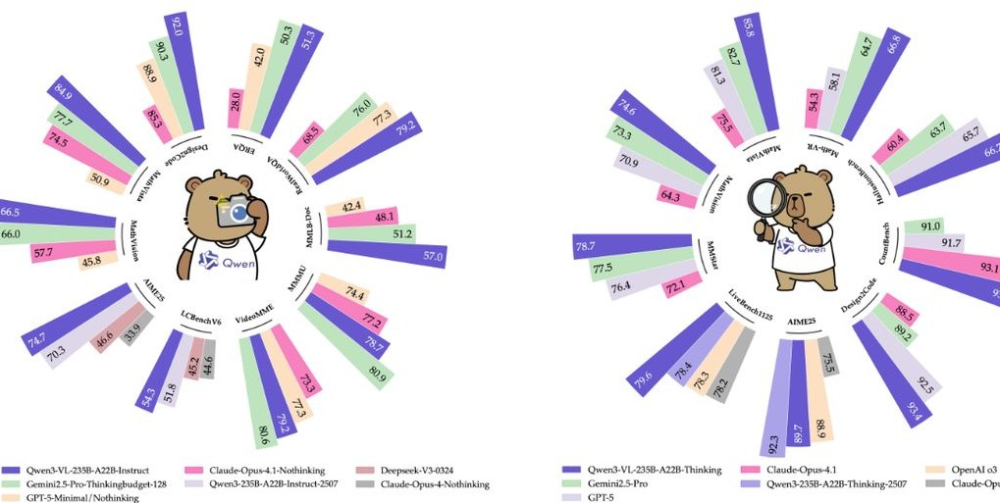

# 1. Bibliographic Information

## 1.1. Title
Qwen3-VL Technical Report

## 1.2. Authors
The paper lists a large team of contributors from the Qwen Team. The core contributors are: Shuai Bai, Yuxuan Cai, Ruizhe Chen, Keqin Chen, Xiongshu Chen, Zesen Cheng, Lianghao Deng, Wei Ding, Chang Gao, Chunjiang Ge, Wenbin Ge, Zhifang Guo, Qidong Huang, Jie Huang, Fei Huang, Binyuan Hui, Shutong Jiang, Zhaohai Li, Mingsheng Li, Mei Li, Kaixin Li, Zicheng Lin, Junyang Lin, Xuejing Liu, Jiawei Liu, Chenglong Liu, Yang Liu, Daiyheng Liu, Shixuan Liu, Dunjie Lu, Ruilin Luo, Chenxu Lv, Rui Men, Lingchen Meng, Xuancheng Ren, Xingzhang Ren, Sibo Song, Yuchong Sun, Jun Tang, Jianhong Tu, Jianqiang Wan, Peng Wang, Penguin Wang, Qiuyue Wang, Yuxuan Wang, Tianbao Xie, Yiheng Xu, Haiyang Xu, Jin Xu, Zhibo Yang, Mingkun Yang, Jianxin Yang, An Yang, Bowen Yu, Fei Zhang, Hang Zhang, Xi Zhang, Bo Zheng, Humen Zhong, Jingren Zhou, Fan Zhou, Jing Zhou, Yuanzhi Zhu, Ke Zhu.

## 1.3. Journal/Conference
The paper is published as a preprint on arXiv, indicated by the `Original Source Link` starting with `https://arxiv.org/abs/`. arXiv is a well-respected open-access archive for scholarly articles in various fields, including computer science. Preprints allow researchers to share their work rapidly before or during peer review.

## 1.4. Publication Year
The `Published at (UTC)` date is 2025-11-26T17:59:08.000Z, indicating the publication year is 2025.

## 1.5. Abstract
The paper introduces `Qwen3-VL`, described as the most capable vision-language model in the Qwen series to date, achieving superior performance across a wide range of multimodal benchmarks. It natively supports interleaved contexts of up to 256K tokens, seamlessly integrating text, images, and video. The model family offers both dense (2B/4B/8B/32B) and mixture-of-experts (MoE) (30B-A3B/235B-A22B) variants to balance latency and quality. `Qwen3-VL` delivers three core pillars: (i) stronger pure-text understanding, often surpassing comparable text-only backbones; (ii) robust long-context comprehension with its 256K-token window for text and interleaved multimodal inputs, enabling faithful retention and cross-referencing; and (iii) advanced multimodal reasoning across single-image, multi-image, and video tasks, demonstrating leading performance on evaluations like `MMMU` and visual-math benchmarks. Architecturally, it introduces three key upgrades: (i) an enhanced `interleaved-MRoPE` for improved spatial-temporal modeling; (ii) `DeepStack` integration, leveraging multi-level `ViT` features for tighter vision-language alignment; and (iii) text-based time alignment for video, transitioning from `T-RoPE` to explicit textual timestamps for precise temporal grounding. The model also applies square-root reweighting to balance text and multimodal learning. `Qwen3-VL` is envisioned as a foundational engine for image-grounded reasoning, agentic decision-making, and multimodal code intelligence.

## 1.6. Original Source Link
https://arxiv.org/abs/2511.21631
Publication Status: Preprint on arXiv.

## 1.7. PDF Link
https://arxiv.org/pdf/2511.21631v2

# 2. Executive Summary

## 2.1. Background & Motivation

### 2.1.1. Core Problem
The core problem the paper aims to solve is the advancement of `Vision-Language Models (VLMs)` to achieve more comprehensive, robust, and versatile multimodal understanding and reasoning capabilities, particularly across long and complex interleaved text, image, and video contexts. Current `VLMs` often struggle with:
*   Maintaining strong linguistic proficiency while integrating visual capabilities.
*   Handling extremely long contexts, which is crucial for understanding documents, books, or lengthy videos.
*   Performing complex multimodal reasoning, especially in specialized domains like `STEM` or for agentic tasks.
*   Achieving precise spatial-temporal grounding in videos and complex visual scenes.
*   Scaling effectively across different model sizes to accommodate diverse computational constraints.

### 2.1.2. Importance in the Current Field
`VLMs` have seen rapid advancements, leading to a wide array of downstream applications such as long-context understanding, `STEM` reasoning, `GUI` comprehension, and agentic workflows. For these applications to be truly effective, `VLMs` must not only excel at multimodal tasks but also preserve or surpass the linguistic proficiency of their text-only counterparts. The ability to process and reason over long, interleaved multimodal inputs is critical for real-world scenarios involving extensive documents, multi-page reports, or long video content. Moreover, robust `STEM` reasoning and agentic capabilities are pivotal for developing intelligent systems that can interact with and understand the physical and digital world.

### 2.1.3. Paper's Entry Point or Innovative Idea
The paper's entry point and innovative idea revolve around developing a new generation of `VLMs` (`Qwen3-VL`) that simultaneously push the boundaries in three core areas:
1.  **Stronger pure-text understanding:** Ensuring multimodal models do not degrade linguistic proficiency.
2.  **Robust long-context comprehension:** Natively supporting `256K` tokens for interleaved multimodal inputs.
3.  **Advanced multimodal reasoning:** Excelling in complex tasks across images and videos.

    This is achieved through a combination of architectural upgrades (enhanced `interleaved-MRoPE`, `DeepStack`, text-based time alignment) and a meticulously designed multi-stage pre-training and post-training strategy with high-quality, diverse data, including specialized corpora for `STEM`, code, and agentic interactions.

## 2.2. Main Contributions / Findings

### 2.2.1. Primary Contributions
The paper makes several primary contributions:
*   **Introduction of `Qwen3-VL` family:** A series of state-of-the-art `vision-language models`, including both dense (2B/4B/8B/32B) and `Mixture-of-Experts (MoE)` (30B-A3B/235B-A22B) variants, offering diverse latency-quality trade-offs.
*   **Architectural Innovations:**
    *   **Enhanced `interleaved-MRoPE`:** A novel positional encoding scheme for stronger spatial-temporal modeling in images and videos with a balanced frequency spectrum.
    *   **`DeepStack` integration:** A mechanism to leverage multi-level `Vision Transformer (ViT)` features by injecting visual tokens into multiple layers of the `LLM`, tightening vision-language alignment.
    *   **Text-based time alignment for video:** Moving from `T-RoPE` to explicit textual timestamp tokens for more precise temporal grounding in videos.
*   **Comprehensive Training Strategy:** A four-stage pre-training pipeline (warm-up alignment, multimodal pre-training, long-context pre-training, ultra-long-context adaptation) and a three-stage post-training pipeline (`SFT`, `Strong-to-Weak Distillation`, `Reinforcement Learning`) designed to build robust capabilities and align with human preferences.
*   **High-Quality Data Overhaul:** Significant upgrades in training data quality, diversity, and structure, including enhanced captioning, expanded `OCR` and omni-recognition, normalized grounding, and new corpora for code, long documents, and temporally grounded video.
*   **Bifurcated Post-Training:** Introduction of `non-thinking` and `thinking` variants to address distinct application requirements, with the latter showing superior performance on complex reasoning tasks.
*   **Infrastructure for Large-Scale Training:** Utilization of Alibaba Cloud's `PAI-Lingjuan AI Computing Service` with a hybrid parallelism strategy for efficient training at scales up to 10,000 `GPUs`.

### 2.2.2. Key Conclusions / Findings
The paper reaches several key conclusions:
*   `Qwen3-VL` models achieve superior performance across a broad range of multimodal benchmarks, including general `VQA`, multimodal reasoning (`MMMU`, `MathVista`), alignment (`HallusionBench`, `MIA-Bench`), document understanding (`DocVQA`, `OCRBench`), 2D/3D grounding, embodied/spatial understanding, multi-image understanding, and video understanding.
*   The `256K` token context window enables robust long-context comprehension, demonstrated by high accuracy in the `Needle-in-a-Haystack` evaluation for videos up to 30 minutes (extrapolating to 1M tokens / 2 hours with `YaRN`).
*   The architectural upgrades, particularly `DeepStack` and `interleaved-MRoPE`, are effective in enhancing visual understanding and spatial-temporal modeling.
*   The `thinking` variants of `Qwen3-VL` consistently achieve higher performance on complex reasoning tasks compared to `non-thinking` variants and other leading models.
*   `Qwen3-VL` models, even smaller variants, often outperform models of comparable size, and in some cases, larger previous-generation models (e.g., `Qwen3-VL-32B` surpassing `Qwen2.5-VL-72B` on reasoning tasks), showcasing strong scalability and efficiency.
*   The `Strong-to-Weak Distillation` approach is effective in enabling lightweight models to achieve strong performance with reduced costs.
*   The model demonstrates strong multilingual `OCR` capabilities, achieving over `70%` accuracy on `32` out of `39` supported languages.
*   The integration of external tools (`tool-integrated agentic learning`) consistently provides significant performance gains, often outweighing mere increases in model size, particularly for fine-grained perception tasks.

# 3. Prerequisite Knowledge & Related Work

## 3.1. Foundational Concepts

### 3.1.1. Vision-Language Models (VLMs)
`Vision-Language Models (VLMs)` are a class of artificial intelligence models designed to understand and process information from both visual (images, videos) and textual modalities. They learn to associate visual features with linguistic descriptions, enabling them to perform tasks that require cross-modal reasoning, such as answering questions about images (`Visual Question Answering` or `VQA`), generating captions for images, localizing objects described in text (`referring expression comprehension`), and understanding video content based on textual queries. `VLMs` typically combine a visual encoder (e.g., a `Vision Transformer`) to extract features from images/videos and a language model (e.g., a `Large Language Model` or `LLM`) to process text and generate responses.

### 3.1.2. Large Language Models (LLMs)
`Large Language Models (LLMs)` are deep learning models, typically based on the `Transformer` architecture, trained on vast amounts of text data. They are capable of understanding, generating, and manipulating human language. Key capabilities include text generation, summarization, translation, question answering, and code generation. `LLMs` form the linguistic backbone of many `VLMs`, providing strong text understanding and generation abilities.

### 3.1.3. Transformer Architecture
The `Transformer` is a neural network architecture introduced in 2017 by Vaswani et al., which has become foundational for `LLMs` and `VLMs`. It revolutionized sequence processing by relying entirely on an `attention mechanism` to draw global dependencies between input and output, rather than using recurrent or convolutional layers. The core components are:
*   **Self-Attention:** Allows each word in a sequence to weigh the importance of all other words when computing its representation.
*   **Multi-Head Attention:** Extends self-attention by performing multiple attention calculations in parallel, allowing the model to focus on different parts of the input sequence simultaneously.
*   **Positional Encoding:** Since `Transformers` do not have inherent notions of sequence order, `positional encodings` are added to the input embeddings to provide information about the relative or absolute position of tokens in the sequence.
*   **Feed-Forward Networks:** Standard fully connected neural networks applied independently to each position.
*   **Encoder-Decoder Structure:** Original `Transformers` consist of an encoder stack (for input processing) and a decoder stack (for output generation). Many modern `LLMs` use a decoder-only `Transformer` architecture.

### 3.1.4. Vision Transformer (ViT)
A `Vision Transformer (ViT)` adapts the `Transformer` architecture for image processing. Instead of processing images as grids of pixels, `ViTs` divide an image into fixed-size patches, linearly embed these patches, add `positional encodings`, and then feed the resulting sequence of vectors into a standard `Transformer` encoder. This allows `ViTs` to capture long-range dependencies in images more effectively than traditional `Convolutional Neural Networks (CNNs)`.

### 3.1.5. Mixture-of-Experts (MoE)
`Mixture-of-Experts (MoE)` is a neural network architecture that employs multiple "expert" sub-networks. For each input, a `gating network` learns to activate only a subset of these experts, typically the top-k most relevant ones. This allows `MoE` models to have a very large number of parameters (increasing model capacity) while keeping the computational cost per inference relatively low, as only a fraction of the parameters are activated for any given input. This approach helps achieve a favorable latency-quality trade-off.

### 3.1.6. Rotational Positional Encoding (RoPE / MRoPE)
`Rotational Positional Encoding (RoPE)` is a type of `positional encoding` that encodes absolute positional information with a rotation matrix and naturally incorporates relative positional information. It modifies the `attention mechanism` by multiplying query and key vectors with rotation matrices that depend on their absolute positions, thereby inducing relative position dependency. `MRoPE` (Multimodal `RoPE`) extends this concept to handle multiple modalities, such as text, image, and video, by chunking embedding dimensions into temporal, horizontal, and vertical groups.

### 3.1.7. Supervised Fine-Tuning (SFT)
`Supervised Fine-Tuning (SFT)` is a common technique in machine learning where a pre-trained model (e.g., an `LLM` or `VLM`) is further trained on a smaller, task-specific dataset with labeled examples. The goal of `SFT` is to adapt the general capabilities of the pre-trained model to a specific downstream task, improving its performance and instruction-following abilities for that task.

### 3.1.8. Knowledge Distillation
`Knowledge Distillation` is a technique where a smaller, "student" model is trained to mimic the behavior of a larger, more capable "teacher" model. The student model learns not only from the hard labels (correct answers) but also from the soft predictions (probability distributions over classes) of the teacher model. This allows the student model to achieve performance comparable to the teacher, often with significantly fewer parameters, making it more efficient for deployment.

### 3.1.9. Reinforcement Learning (RL)
`Reinforcement Learning (RL)` is a type of machine learning where an agent learns to make decisions by interacting with an environment. The agent receives rewards or penalties based on its actions and learns to maximize cumulative reward over time. In the context of `LLMs` and `VLMs`, `RL` is often used for alignment with human preferences (`RLHF` - Reinforcement Learning from Human Feedback) or for improving performance on tasks with verifiable outcomes, by treating model outputs as actions and external evaluators as the environment providing rewards.

## 3.2. Previous Works

The paper builds upon and references several important prior works:

### 3.2.1. Qwen Series
`Qwen3-VL` is the latest iteration in the `Qwen` series, specifically building on `Qwen3` (`Yang et al., 2025a`) for its language backbone and `Qwen2.5-VL` (`Bai et al., 2025`) for its multimodal architecture. `Qwen2.5-VL` notably introduced `MRoPE` for multimodal positional encoding, which `Qwen3-VL` enhances.

### 3.2.2. Positional Encoding (`MRoPE` and `interleaved-MRoPE`)
*   **`MRoPE` (Multimodal Rotational Positional Encoding):** Introduced in `Qwen2-VL` (`Wang et al., 2024c`), this method extended `RoPE` to multimodal inputs by partitioning embedding dimensions into temporal, horizontal, and vertical subspaces. `Qwen3-VL` identifies a limitation of `MRoPE` (imbalanced frequency spectrum) and introduces `interleaved-MRoPE` to address it.
*   **Positional Encoding in Transformers:** The original `Transformer` (Vaswani et al., 2017) used sinusoidal `positional encodings` added to the input embeddings. Subsequent works like `RoPE` (`Su et al., 2021`) aimed to improve how positional information is incorporated, particularly for longer sequences. `interleaved-MRoPE` aims for a more faithful positional representation by uniformly distributing spatial-temporal components across frequency bands, as suggested by `Huang et al., 2025`.

### 3.2.3. Multi-level Feature Fusion (`DeepStack`)
*   **`DeepStack` (`Meng et al., 2024`):** This pioneering mechanism, adapted by `Qwen3-VL`, involves injecting visual tokens from multiple layers of the vision encoder into corresponding layers of the `LLM`. This is a significant improvement over earlier `VLMs` that might only use features from the final layer of the visual encoder, allowing for richer, multi-scale visual information to be integrated. `DeepStack` enhances vision-language alignment without increasing context length.

### 3.2.4. Video Temporal Alignment (`T-RoPE` to Textual Timestamps)
*   `Qwen2.5-VL` used a time-synchronized variant of `MRoPE` (`T-RoPE`) for temporal awareness in videos. `Qwen3-VL` evolves from this by adopting a textual token-based time encoding strategy (`Chen et al., 2024b`). This change is motivated by issues with `T-RoPE` for long videos (sparse temporal IDs, increased training cost) and aims for more precise temporal grounding.

### 3.2.5. Vision Encoders (`SigLIP-2`)
*   `Qwen3-VL` utilizes the `SigLIP-2` architecture (`Tschannen et al., 2025`) as its vision encoder. `SigLIP-2` is a state-of-the-art vision model, and `Qwen3-VL` continues its training with dynamic input resolutions, initialized from official pre-trained checkpoints. `CoMP` (`Chen et al., 2025`) is cited for its methodology on handling dynamic resolutions with `2D-RoPE` and interpolated absolute position embeddings.

### 3.2.6. "Thinking with Images" Paradigm
The paper acknowledges prior works on "thinking with images" (`Wu et al., 2025a; Jin et al., 2025; Zheng et al., 2025; Lai et al., 2025`), which involve agentic capabilities through a `think-act-analyze feedback-answer` paradigm. `Qwen3-VL` integrates similar ideas through its `thinking` variants and `tool-integrated RL`.

### 3.2.7. Training Optimizations
*   **Square-root reweighting:** Mentioned as a method to balance text and multimodal data contributions during training, similar to approaches found in other multimodal training strategies.
*   **`SAPO` (Smooth and Adaptive Policy-Gradient Optimization):** (`Gao et al., 2025`) is employed for `Reinforcement Learning` training, indicating reliance on advanced `RL` algorithms for performance improvement.

## 3.3. Technological Evolution

The field of `VLMs` has evolved from initial efforts in visual perception (e.g., image classification, object detection) to complex multimodal reasoning. Early `VLMs` often relied on `CNNs` for visual feature extraction and `Recurrent Neural Networks (RNNs)` or `LSTMs` for language processing. The advent of the `Transformer` architecture profoundly changed this, leading to `ViTs` for vision and `LLMs` for language. The challenge then shifted to effectively merging these powerful unimodal models.

Initially, simple `MLP` layers were used to project visual features into the `LLM`'s embedding space. Subsequent advancements focused on tighter integration, such as employing attention mechanisms across modalities (`cross-attention`) and more sophisticated visual tokenization. The concept of `positional encoding` became critical for handling structured visual data (like image grids or video frames) within the sequence-based `Transformer` framework. `MRoPE` was an early attempt to unify positional encoding for multimodal inputs.

More recently, the focus has moved to:
*   **Long-context understanding:** Extending models to handle thousands or even hundreds of thousands of tokens, enabling comprehension of entire documents or videos.
*   **Advanced reasoning:** Developing models that can perform multi-step, symbolic, or scientific reasoning, often requiring `Chain-of-Thought (CoT)` capabilities.
*   **Agentic capabilities:** Equipping `VLMs` to interact with digital environments (`GUIs`) or physical robots, often through `tool-use` and `RL`.
*   **Efficiency and Scalability:** Developing `MoE` architectures and distillation techniques to build large, capable models that are still deployable.

    `Qwen3-VL` fits into this evolutionary timeline by addressing these cutting-edge challenges. It refines existing techniques like `MRoPE` and multi-level feature injection (`DeepStack`), introduces explicit temporal grounding for videos, and leverages advanced training paradigms like `RL` and `distillation` to achieve state-of-the-art performance across a comprehensive suite of multimodal tasks, including those requiring long-context and agentic reasoning.

## 3.4. Differentiation Analysis

Compared to prior `VLMs` and the main methods in related work, `Qwen3-VL` introduces several core differentiators:

*   **Enhanced Positional Encoding (`interleaved-MRoPE`):** While `MRoPE` was an innovation for multimodal positional encoding, `Qwen3-VL` identifies and corrects its limitation of an imbalanced frequency spectrum. By `interleaving` temporal, horizontal, and vertical components across frequency bands, `Qwen3-VL` achieves a more faithful and robust representation for long videos, where previous `MRoPE` might degrade performance. This is a direct architectural refinement addressing a known weakness.
*   **Deep and Multi-level Vision-Language Alignment (`DeepStack`):** Instead of only integrating visual features from the final layer of a `ViT`, `Qwen3-VL` adopts `DeepStack` to inject features from *multiple intermediate layers* of the `ViT` into corresponding `LLM` layers. This provides the `LLM` with a richer, hierarchical understanding of visual information, from low-level textures to high-level semantics, leading to tighter vision-language alignment without adding to context length. This contrasts with simpler single-point integration or attention mechanisms that might not capture this depth.
*   **Precise Text-Based Temporal Grounding for Video:** `Qwen3-VL` moves away from absolute-time alignment using `positional encoding` (`T-RoPE` in `Qwen2.5-VL`) to explicit `textual timestamp tokens` (e.g., $<3.0 seconds>$). This offers a simpler and more direct temporal representation, addressing issues of sparse temporal `IDs` and high training costs in `T-RoPE`. This allows for more effective perception of temporal information and facilitates time-aware video tasks.
*   **Native `256K` Long-Context Support:** `Qwen3-VL` is specifically designed and trained to natively support `256K` tokens for both text and interleaved multimodal inputs. This is a significant leap for `VLMs`, enabling faithful retention, retrieval, and cross-referencing across ultra-long documents and videos, a capability often limited in other `VLMs`. The `Needle-in-a-Haystack` evaluation demonstrates this robustness.
*   **Bifurcated `Thinking` vs. `Non-Thinking` Modes:** The introduction of distinct `non-thinking` and `thinking` variants, with the latter explicitly modeling the reasoning process (e.g., `Chain-of-Thought`), allows `Qwen3-VL` to achieve superior performance on complex reasoning tasks. This provides flexibility and optimized performance for different application requirements, directly addressing the need for more sophisticated reasoning in `VLMs`.
*   **Balanced Multimodal and Pure-Text Proficiency:** The paper explicitly states that `Qwen3-VL` delivers `markedly stronger pure-text understanding, surpassing comparable text-only backbones in several cases`. This addresses a common challenge in `VLMs` where adding visual modalities can sometimes degrade core language capabilities. The use of `square-root reweighting` during training and increased proportion of text-only data during pre-training are specific strategies for this.
*   **Diverse Model Family with `MoE`:** Offering a broad range of models from `2B` dense to $235B-A22B MoE$ variants provides flexibility for users to select models based on their latency-quality trade-offs, making the `Qwen3-VL` series highly adaptable to different deployment scenarios.

    In essence, `Qwen3-VL` differentiates itself by rigorously enhancing fundamental architectural components for multimodal processing, meticulously curating diverse training data for broad and deep understanding, and employing sophisticated training strategies to balance performance across modalities and reasoning complexities, especially for long contexts and agentic tasks.

# 4. Methodology

The methodology section describes the architectural upgrades and the multi-stage training pipeline employed for `Qwen3-VL`.

## 4.1. Model Architecture
`Qwen3-VL` adopts a three-module architecture, similar to `Qwen2.5-VL`, comprising a `vision encoder`, an `MLP-based vision-language merger`, and a `Large Language Model (LLM)`. Figure 1 provides a detailed depiction of this structure.

The following figure (Figure 1 from the original paper) shows the overall framework of Qwen3-VL:

*该图像是一个图表，展示了Qwen3-VL相较于其他模型在不同任务下的性能评分。图中有多个模型的得分，以不同颜色编码，Qwen3-VL在多个任务中表现突出，显示其较强的能力。*

### 4.1.1. Large Language Model (LLM)
`Qwen3-VL` is instantiated in three dense variants: `Qwen3-VL-2B`, `Qwen3-VL-4B`, `Qwen3-VL-8B`, `Qwen3-VL-32B`, and two `MoE` variants: `Qwen3-VL-30B-A3B` and `Qwen3-VL-235B-A22B`. All variants are built upon `Qwen3` backbones. The flagship model, `Qwen3-VL-235B-A22B`, has `235B` total parameters with `22B` activated per token, making it highly capable. It is noted to outperform most `VLMs` and, in many cases, its text-only counterpart on language benchmarks.

### 4.1.2. Vision Encoder
The `SigLIP-2` architecture (`Tschannen et al., 2025`) is used as the `vision encoder`. It is continuously trained with dynamic input resolutions, initialized from official pre-trained checkpoints. To effectively handle dynamic resolutions, `2D-RoPE` and interpolated absolute `position embeddings` are employed, following the methodology of `CoMP` (`Chen et al., 2025`).
*   The `SigLIP2-SO-400M` variant is used by default.
*   For smaller-scale `LLMs` (2B and 4B), `SigLIP2-Large (300M)` is used.

### 4.1.3. MLP-based Vision-Language Merger
A two-layer `MLP` is used to compress `2x2` visual features from the `vision encoder` into a single `visual token`, which is then aligned with the `LLM`'s hidden dimension. Additionally, specialized merger modules are deployed to support the `DeepStack` mechanism, as described in Section 4.1.5.

### 4.1.4. Interleaved MRoPE
`Qwen2-VL` introduced `MRoPE` for multimodal positional encoding, chunking embedding dimensions into `temporal (t)`, `horizontal (h)`, and `vertical (w)` groups. This approach, however, induced an `imbalanced frequency spectrum` and degraded long-video understanding.
To address this, `Qwen3-VL` redesigns the frequency allocation by `interleaving` the $t$, $h$, and $w$ components across the embedding dimensions (`Huang et al., 2025`). This ensures a uniform representation of each spatial-temporal axis across both low- and high-frequency bands, mitigating spectral bias and significantly improving long-range positional modeling for video.

### 4.1.5. DeepStack Integration
Inspired by `DeepStack` (`Meng et al., 2024`), `Qwen3-VL` injects visual tokens into multiple layers of the `LLM`. Unlike the original `DeepStack` that stacks tokens from multi-scale visual inputs, `Qwen3-VL` extends it to extract visual tokens from `intermediate layers` of the `Vision Transformer (ViT)`. This design preserves rich visual information from low- to high-level representations.
Specifically, features are selected from three distinct levels of the `vision encoder`. Dedicated `vision-language merger` modules then project these multi-level features into `visual tokens`, which are added directly to the corresponding hidden states of the first three `LLM` layers.

The following figure (Figure 2 from the original paper) depicts the `Qwen3-VL` framework, showing `DeepStack` integration:

*该图像是Qwen3-VL的结构示意图，展示了不同输入（图片、视频和文本）在模型解码器中的处理流程。图中包含了多个关键元素，如`11427`个文本标记和视觉编码器的细节，以及DeepStack集成的作用，系统全貌显示了模型的高效性与灵活性。*

### 4.1.6. Video Timestamp
In `Qwen2.5-VL`, a time-synchronized `MRoPE` (`T-RoPE`) was used for temporal awareness. However, this had two limitations:
1.  It generated excessively large and sparse temporal `position IDs` for long videos, degrading long temporal context understanding.
2.  Effective learning required extensive and uniformly distributed sampling across various `frame rates (fps)`, increasing data construction cost.
    `Qwen3-VL` addresses these issues by adopting a `textual token-based time encoding strategy` (`Chen et al., 2024b`). Each video temporal patch is prefixed with a timestamp as a formatted text string (e.g., $<3.0 seconds>$). During training, timestamps are generated in both seconds and `HMS (hours:minutes:seconds)` formats to ensure the model learns diverse timecode representations. This approach, while modestly increasing context length, provides more effective and precise temporal information.

## 4.2. Pre-Training
The pre-training methodology is structured into four distinct stages, progressively building capabilities from basic alignment to long-context understanding.

### 4.2.1. Training Recipe
The following table (Table 1 from the original paper) details the training setup and hyperparameters across different stages for Qwen3-VL:

<table><tr><td>Stage</td><td>Objective</td><td>Training</td><td>Token Budget</td><td>Sequence Length</td></tr><tr><td>S0</td><td>Vision-Language Alignment</td><td>Merger</td><td>67B</td><td>8,192</td></tr><tr><td>S1</td><td>Multimodal Pre-Training</td><td>All</td><td>~1T</td><td>8,192</td></tr><tr><td>S2</td><td>Long-Context Pre-Training</td><td>All</td><td>~1T</td><td>32,768</td></tr><tr><td>S3</td><td>Ultra-Long-Context Adaptation</td><td>All</td><td>100B</td><td>262,144</td></tr></table>

*   **Stage 0: Vision-Language Alignment (S0)**
    *   **Objective:** Efficiently bridge the modality gap between the `vision encoder` and the `LLM`.
    *   **Training:** Only the parameters of the `MLP merger` are trained. Both the `vision encoder` and `LLM backbone` remain frozen.
    *   **Data:** A curated dataset of approximately `67B` tokens, consisting of high-quality image-caption pairs, visual knowledge collections, and `OCR` data.
    *   **Sequence Length:** `8,192`.
    *   **Outcome:** Establishes a solid foundation for cross-modal understanding.

*   **Stage 1: Multimodal Pre-Training (S1)**
    *   **Objective:** Full-parameter multimodal pre-training.
    *   **Training:** All model components (`vision encoder`, `merger`, `LLM`) are unfrozen for joint end-to-end training.
    *   **Data:** A massive and diverse dataset of approximately `1 trillion (1T)` tokens. The data mixture includes `vision-language (VL)` data and `text-only` data to maintain `LLM` language abilities. `VL` data is rich, adding interleaved image-text documents, visual grounding tasks, `VQA`, `STEM` data, and a small amount of video data.
    *   **Sequence Length:** `8,192`.

*   **Stage 2: Long-Context Pre-Training (S2)**
    *   **Objective:** Significantly extend the model's contextual processing abilities.
    *   **Training:** All model parameters continue to be trainable.
    *   **Data:** Approximately `1T` tokens, with an adjusted data mixture. Proportion of `text-only` data is increased. `VL` data incorporates a significantly larger volume of video and agent-oriented instruction-following data.
    *   **Sequence Length:** Quadrupled to `32,768`.
    *   **Outcome:** Enables processing and reasoning over longer videos and complex, multi-step tasks.

*   **Stage 3: Ultra-Long-Context Adaptation (S3)**
    *   **Objective:** Push the model's context window to its operational limits.
    *   **Training:** All model parameters continue to be trainable.
    *   **Data:** A more focused `100B` token dataset, curated for this purpose, composed of `text-only` data and `VL` data with a strong emphasis on long-video and long-document understanding tasks.
    *   **Sequence Length:** Dramatically increased to `262,144`.
    *   **Outcome:** Solidifies proficiency in processing and analyzing extremely long sequential inputs.

### 4.2.2. Pre-Training Data
A significant overhaul of the training data was performed, focusing on quality, diversity, and structure.

#### 4.2.2.1. Image Caption and Interleaved Text-Image Data
*   **Image Caption Data:** A large-scale corpus of contemporary, multilingual (predominantly Chinese-English) image-text pairs from web sources. A `Qwen2.5-VL-32B` model, fine-tuned for recaptioning, generates comprehensive, fluent, and fine-grained captions (object attributes, spatial layouts, contextual semantics). Deduplication is performed on recaptioned text using semantic similarity. Clustering over visual embeddings identifies sparse regions for targeted augmentation to enhance coverage of underrepresented concepts.
*   **Interleaved Text-Image Data:** Diverse real-world multimodal documents from Chinese and English websites (`Laurencon et al., 2023; Zhu et al., 2023; Li et al., 2024c`). Domain classification (`Wettig et al., 2025`) and filtering using a lightweight `Qwen-based scorer` remove harmful or low-value categories (ads, promotions, clickbait).
    *   For book-scale data, a fine-tuned `Qwen2.5-VL-7B` performs high-accuracy multimodal parsing, extracting and aligning text with figures.
    *   For ultra-long context modeling, consecutive pages are merged into sequences up to `256K` tokens, preserving natural order and multimodal coherence.
    *   Quality controls: pure-text or low-alignment segments removed; minimum page count and image-to-text ratio for ultra-long book sequences.

#### 4.2.2.2. Knowledge
Large-scale pre-training dataset centered on well-defined entities across `~12+ semantic categories` (animals, plants, landmarks, etc.).
*   **Importance-based sampling:** High-prominence entities are sampled more heavily, while low-prominence entities are included in smaller proportions to balance data quality, utility, and diversity.
*   **Refinement pipeline:** Standard filtering for noise/misalignment. Original/sparse captions (e.g., generic alt-text) are replaced with richer, `LLM-generated descriptions` that identify main entities, visual attributes, context, spatial layout, and interactions.

#### 4.2.2.3. OCR, Document Parsing and Long Document Understanding
*   **OCR:** `30 million` in-house collected samples using a coarse-to-fine pipeline (integrating pseudo-labels from `OCR-specialized models` with `Qwen2.5-VL` refinements, without human annotation). Expanded from 10 to `39 languages`, synthesizing `~30 million` multilingual `OCR` samples and $>1 million$ internal real-world multilingual images.
*   **Document Parsing:** `3 million PDFs` from `Common Crawl` across 10 document types, plus `4 million internal documents`. An in-house layout model predicts reading order and bounding boxes. `Qwen2.5-VL-72B` performs region-specific recognition. Outputs are reassembled into position-aware, layout-aligned parsing data.
    *   **Unified annotation framework:** Supports `QwenVL-HTML` (fine-grained, element-level bounding boxes) and `QwenVL-Markdown` (images and tables localized, tables in `LaTeX`).
    *   Large-scale synthetic `HTML` corpus converted to `Markdown`. Pseudo-labels generated on real documents and filtered for quality.
*   **Long Document Understanding:**
    *   Synthesized long-document parsing sequences by merging single-page document samples.
    *   Constructed long-document `Visual Question Answering (VQA)` data from high-quality multi-page `PDFs`, requiring reasoning across multiple pages and heterogeneous elements (charts, tables, figures, body text). Balanced distribution of question types and evidence modalities.

#### 4.2.2.4. Grounding and Counting
*   **Box-based Grounding:** Aggregation of open-source datasets (`COCO`, `Objects 365`, `OpenImages`, `RefCOCO+ / g`). Automated synthesis pipeline: (i) `object candidates` extracted using `Qwen2.5-VL`; (ii) localized/annotated using `Grounding DINO` (`Liu et al., 2023a`) and `Qwen2.5-VL`; (iii) quality assessment filters low-confidence annotations.
*   **Point-based Grounding:** Comprehensive dataset combining public (`PixMo` - `Deittek et al., 2024`) and synthetically generated pointing annotations. Also includes object grounding data from public detection/segmentation benchmarks and high-precision pointing annotations from a dedicated synthesis pipeline.
*   **Counting:** Curated high-quality subset from grounding data, including direct counting, box-based counting, and point-based counting.
*   **Normalized Coordinate System:** Adopted for robustness to resolution/aspect ratio variations, scaled to `[0, 1000]`.

#### 4.2.2.5. Spatial Understanding and 3D Recognition
*   **Spatial Understanding:** Dataset for reasoning about spatial relationships, object affordances, and action planning in 2D scenes. Includes: (i) relational annotations (e.g., "the cup to the left of the laptop"), (ii) affordance labels (e.g., "graspable"), and (iii) action-conditioned queries. Samples derived from real-world scenes and synthetic layouts. Queries generated via templated and `LLM-based methods`. All spatial references are relative to other objects or scene frames.
*   **3D Grounding:** Specialized pre-training dataset for 3D visual grounding. Data from public indoor/outdoor scenes, reformulated into `VQA`. Each sample: single-view camera image, natural language referring expression, and 9-`DoF` 3D bounding box annotations (structured JSON). Filtering for occluded/inaccurate labels. Data unified into a virtual camera coordinate system (`Omni3D` - `Brazil et al., 2023`). Large corpus of descriptive captions synthesized for rich textual queries.

#### 4.2.2.6. Code
Dedicated coding capabilities by incorporating two categories of code-related data.
*   **Text-Only Coding:** Reuses extensive code corpus from `Qwen3` and `Qwen3-Coder` series (software development, algorithmic problem solving, mathematical reasoning, agent-oriented tasks).
*   **Multimodal Coding:** Data for diverse multimodal coding tasks, sourced from open-source datasets and internal synthesis. Tasks include: `UI screenshots` to `HTML/CSS`; `editable SVG codes` from images (`Li et al., 2025c`); visual programming challenges (`Li et al., 2024a`); multimodal coding questions (`StackOverflow` posts with images); transcribing visual representations (flowcharts, diagrams, `LaTeX`) into code/markup.

#### 4.2.2.7. Video
Substantially advanced video comprehension capabilities.
*   **Temporal-Aware Video Understanding:**
    *   **Dense Caption Synthesis:** For long video sequences, a short-to-long caption synthesis strategy generates holistic, timestamp-interleaved, and temporally coherent story-level descriptions. In-house captioning models produce fine-grained annotations (event-level temporal summaries, segment-specific visual details).
    *   **Spatio-Temporal Video Grounding:** Curated and synthesized large-scale video data annotated at object, action, and person levels to strengthen spatio-temporal grounding.
*   **Video Data Balancing and Sampling:**
    *   **Source Balancing:** Large-scale dataset assembled encompassing various video sources (instructional, cinematic, egocentric) with systematic curation guided by metadata.
    *   **Length-Adaptive Sampling:** Dynamic adjustment of `sampling parameters` (`fps`, max frames) during pre-training stages based on sequence length constraints. Mitigates information loss from suboptimal sampling.

#### 4.2.2.8. Science, Technology, Engineering, and Mathematics (STEM)
`STEM` reasoning is a core part of multimodal reasoning. Strategy: develop fine-grained visual perception and robust linguistic reasoning independently, then integrate synergistically.
*   **Visual Perception Data:** Dedicated synthetic data generation pipeline constructs geometric diagrams programmatically. Generates: (i) `1 million point-grounding samples` (intersection points, corners); (ii) `2 million perception-oriented VQA pairs` for fine-grained visual understanding of diagrams. Two-stage captioning framework (initial generation + model-based verification) yields `6 million` richly annotated diagram captions across `STEM` disciplines.
*   **Multimodal Reasoning Data:** Over `60 million K-12 and undergraduate-level exercises`, cleaned and reformulated. Quality filtering discards low-quality items. Reformulation translates exercises (Chinese/English) and standardizes answer format (step-by-step solutions, math expressions). Over `12 million` multimodal reasoning samples paired with images synthesized for long `CoT` problem-solving, using original rollouts from a strong reasoning model. Rigorous validation of reasoning trajectory (rule-based and model-based checks); rejection sampling retains only challenging problems.
*   **Linguistic Reasoning Data:** Incorporates reasoning data from `Qwen3`, as multimodal reasoning competence largely derives from linguistic reasoning.

#### 4.2.2.9. Agent
*   **GUI:** Curated and synthesized large-scale, cross-platform data (desktop, mobile, web) for autonomous interaction with `GUIs` (`Ye et al., 2025; Wang et al., 2025a; Lu et al., 2025`). `GUI` interface perception tasks: element description, dense captioning, dense grounding. `Agentic capability`: multi-step task trajectories via a self-evolving trajectory-production framework, complemented by human audits; augmented `Chain-of-Thought rationales` for planning, decision-making, and self-correction.
*   **Function Calling:** Multimodal function calling trajectory synthesis pipeline. Models generate user queries and function definitions with images. Model function calls with rationales are sampled, and responses synthesized. Iterative process until query solved. Trajectories filtered for formatting errors.
*   **Search:** Multimodal factual lookup trajectories with online image and text search tools collected, encouraging the model to search for unfamiliar entities to generate accurate responses.

## 4.3. Post-Training
The post-training pipeline refines the model's instruction-following capabilities, bolsters reasoning, and aligns with human preferences.

### 4.3.1. Training Recipe
A three-stage process:
1.  **Supervised Fine-Tuning (SFT):**
    *   Imparts instruction-following and activates latent reasoning skills.
    *   Two phases: initial at `32k context length`, then extension to `256k context window` focusing on long-document and long-video data.
    *   Training data bifurcated into `standard formats` for `non-thinking models` and `Chain-of-Thought (CoT) formats` for `thinking models` (explicitly modeling reasoning).
2.  **Strong-to-Weak Distillation:**
    *   A powerful teacher model transfers capabilities to student models.
    *   Performed using `text-only data` to fine-tune the `LLM backbone`.
    *   Yields significant improvements in reasoning across text-centric and multimodal tasks.
3.  **Reinforcement Learning (RL):**
    *   Further enhances model performance and alignment.
    *   Divided into `Reasoning RL` and `General RL`.
    *   Large-scale `RL` across math, `OCR`, grounding, instruction-following domains to improve fine-grained capabilities.

### 4.3.2. Cold Start Data
#### 4.3.2.1. SFT Data
*   **Objective:** Endow the model with capacity to address a wide spectrum of real-world scenarios, expanding beyond `Qwen2.5-VL`'s 8 core domains/30 subcategories. Novel capabilities include spatial reasoning, image-grounded reasoning, spatio-temporal grounding in videos, and long-context technical document comprehension.
*   **Curated Dataset:** `~1,200,000 samples`, composed of `1/3 text-only` and `2/3 image-text/video-text pairs`. Integrates multimodal content for complex scenarios. Includes multilingual samples. Simulates conversational dynamics (single-turn, multiturn dialogues) across visual settings. Features interleaved image-text examples for agentic behaviors (tool-augmented image search, visually-grounded reasoning).
*   **Staged Training Strategy (256K token context):** Initial one-epoch training at `32K sequence length`, followed by a second epoch at `256K token length`. The latter interleaves long-context inputs (hundreds of pages of technical documents, entire textbooks, up to two-hour videos) with `32K` data.
*   **Data Filtering Protocol:** Two-phase pipeline for quality assurance:
    *   **Query Filtering:** `Qwen2.5-VL` identifies/discards unverifiable queries. Ambiguous instructions are minimally revised. Web-sourced queries lacking substantive content removed. Final assessment for complexity and contextual relevance.
    *   **Response Filtering:**
        *   **Rule-Based Filtering:** Predefined heuristics eliminate responses with qualitative deficiencies (repetition, incompleteness, improper formatting). Off-topic or harmful query-response pairs are discarded.
        *   **Model-Based Filtering:** Reward models from `Qwen2.5-VL` series (e.g., `Qwen2.5-VL-72B-Instruct` or `Qwen3`) conduct multi-dimensional evaluation of multimodal question-answering pairs. Scores correctness, completeness, clarity, helpfulness. For vision-grounded tasks, verifies accurate interpretation of visual information. Detects subtle issues like inappropriate language mixing or stylistic shifts.

#### 4.3.2.2. Long-CoT Cold Start Data
Foundation for `thinking models`. Meticulously curated dataset engineered to elicit and refine complex reasoning capabilities.
*   **Composition:** Diverse queries spanning pure-text and multimodal data, `~1:1 ratio`.
    *   **Multimodal component:** Covers `VQA`, `OCR`, 2D/3D grounding, video analysis, with special emphasis on `STEM` and agentic workflows.
    *   **Pure-text component:** Mirrors `Qwen3` data (math, code generation, logical reasoning, general `STEM`).
*   **Filtering Protocol:** Rigorous multi-stage process for quality and difficulty:
    *   **Difficulty Curation:** Retains instances where baseline models had low pass rates or generated longer, detailed responses.
    *   **Multimodal Necessity Filtering:** For `vision-language mathematics` problems, samples solvable by `Qwen3-30B-nothink` without visual input are discarded, ensuring genuine multimodal necessity.
    *   **Response Quality Control:** Sanitizes generated responses. Removes incorrect final results for multi-candidate queries. Filters responses with undesirable patterns (repetition, improper language mixing, guessing).

### 4.3.3. Strong-to-Weak Distillation
Adopts `Qwen3`'s `Strong-to-Weak Distillation` pipeline to improve lightweight models.
*   **Off-policy Distillation:** Teacher model outputs are combined to provide response distillation, helping student models acquire fundamental reasoning abilities.
*   **On-policy Distillation:** Student model generates responses based on prompts, then fine-tuned by minimizing `KL divergence` between student and teacher logits.

### 4.3.4. Reinforcement Learning (RL)
#### 4.3.4.1. Reasoning Reinforcement Learning
*   **Training Scope:** Diverse text and multimodal tasks (math, coding, logical reasoning, visual grounding, visual puzzles). Solutions verifiable deterministically.
*   **Data Preparation:** Curated training data from open-source and proprietary sources, with preprocessing and manual annotation. For multimodal queries, `Qwen3-VL-235B-A22B` (preliminary checkpoint) samples 16 responses per query; queries with all incorrect responses discarded. Preliminary `RL` experiments identify and remove data sources with limited improvement potential. Yields `~30K RL queries`. Easy queries (pass rate $>90%$) are filtered out. Task-specific datasets shuffled and combined into mixed-task batches with predefined ratios.
*   **Reward System:** Unified framework for precise feedback. Shared infrastructure (`data preprocessing`, `utility functions`, `reward manager`). Core `reward logic` implemented per task. Uses task-specific format prompts; no explicit format rewards. Penalty for `code-switching`.
*   **RL Algorithm:** `SAPO (Smooth and Adaptive Policy-Gradient Method)` (`Gao et al., 2025`) employed for `RL` training, delivering consistent improvements across diverse tasks and model sizes.

#### 4.3.4.2. General Reinforcement Learning
*   **Objective:** Enhance generalization capabilities and operational robustness.
*   **Multi-task RL Paradigm:** Reward function formulated based on comprehensive `SFT` tasks (`VQA`, image captioning, `OCR`, document parsing, grounding, clock recognition).
*   **Reward Mechanism Dimensions:**
    *   **Instruction Following:** Evaluates adherence to explicit user directives (constraints on content, format, length, structured outputs like `JSON`).
    *   **Preference Alignment:** For open-ended/subjective queries, optimizes outputs for helpfulness, factual accuracy, stylistic appropriateness.
*   **Corrective Mechanism:** Addresses strong but flawed knowledge priors from `SFT`. Introduces specialized, verifiable tasks to trigger errors (e.g., counter-intuitive object counting, complex clock time recognition) to supplant erroneous priors with factual knowledge.
*   **Mitigating Inferior Behaviors:** Curates a dedicated dataset with prompts known to elicit undesirable behaviors (inappropriate language mixing, excessive repetition, formatting errors). Focused training with targeted, high-frequency penalties suppresses residual errors.
*   **Hybrid Reward System:**
    *   **Rule-Based Rewards:** Unambiguous, high-precision feedback for verifiable tasks (format adherence, instruction following). Robust mechanism, mitigates reward hacking.
    *   **Model-Based Rewards:** `Qwen2.5-VL-72B-Instruct` or `Qwen3` act as sophisticated judges, evaluating response quality across multiple axes against ground-truth references. Offers flexibility for nuanced tasks, minimizes false negatives.

### 4.3.5. Thinking with Images
Endows `Qwen3-VL` with agentic capabilities through a two-stage training paradigm.
*   **Stage 1:**
    *   Synthesizes `~10K grounding examples` (simple two-turn `VQA`, e.g., attribute detection) as a `cold-start genetic dataset`.
    *   `SFT` on `Qwen2.5-VL-32B` to emulate a visual agent's behavior: `think` $\rightarrow$ `act` $\rightarrow$ `analyze feedback` $\rightarrow$ `answer`.
    *   Multi-turn, `tool-integrated Reinforcement Learning (RL)` for enhanced reasoning.
*   **Stage 2:**
    *   Distills trained `Qwen2.5-VL-32B visual agents` from Stage 1 to generate a larger, more diverse dataset (`~120K multi-turn agentic interactions`) spanning broader visual tasks.
    *   Applies a similar `cold-start SFT` and `tool-integrated RL pipeline` (using both distilled and synthesized data) for `Qwen3-VL` post-training.
*   **Multi-turn, Tool-Integrated RL Reward Signals:** Three complementary signals encourage robust, tool-mediated reasoning:
    *   **Answer Accuracy Reward:** Uses `Qwen3-32B` to measure correctness of final answer.
    *   **Multi-Turn Reasoning Reward:** Uses `Qwen2.5-VL-72B` to evaluate if assistant correctly interprets tool/environment feedback and arrives at answer via coherent, step-by-step reasoning.
    *   **Tool-Calling Reward:** Encourages appropriate tool usage by comparing actual tool calls to an expert-estimated target (determined offline by `Qwen2.5-VL-72B` based on task complexity). This mitigates degeneration into single tool calls.

## 4.4. Infrastructure
*   **Training Platform:** Alibaba Cloud's `PAI-Lingjuan AI Computing Service`, providing high-performance computing.
*   **Pretraining Parallelism:** Hybrid parallelism strategy built upon `Megatron-LM` framework. Integrates:
    *   `Tensor Parallelism (TP)`: Distributes tensors across devices.
    *   `Pipeline Parallelism (PP)`: Divides model layers into stages and pipelines execution.
    *   `Context Parallelism (CP)`: Handles large context windows efficiently.
    *   `Expert Parallelism (FP)`: Distributes `MoE` experts across devices.
    *   `ZeRO-1 Data Parallelism (DP)`: Optimizes memory for large models.
    *   **Outcome:** Achieves fine-grained balance among model scale, computational load, and communication overhead, enabling high hardware utilization and sustaining high throughput with low communication latency up to `10,000 GPUs`.
*   **Local Deployment/Inference:** Deployment strategies based on `vLLM` or `SGLang`.
    *   `vLLM`: Utilizes `PagedAttention` for memory-efficient management and high-throughput inference.
    *   `SGLang`: Excels at structured generation and handling complex prompts.
    *   **Outcome:** Provides efficient inference and evaluation with stable, efficient, and flexible model inference capabilities.

# 5. Experimental Setup

## 5.1. Datasets

The paper utilizes a vast array of datasets for pre-training and evaluates `Qwen3-VL` on numerous benchmarks. Many of these datasets are explicitly curated in-house.

### 5.1.1. Pre-Training Datasets (Examples and Characteristics)
*   **Image Caption Data:** Large-scale corpus of contemporary, predominantly Chinese-English multilingual image-text pairs from web sources. Fine-grained captions generated by `Qwen2.5-VL-32B`.
    *   *Example:* An image of a cat playing with a yarn ball. Caption might be: "A fluffy tabby cat with green eyes is batting at a red yarn ball on a wooden floor, its tail slightly swishing in excitement."
*   **Interleaved Text-Image Data:** Diverse real-world multimodal documents from Chinese and English websites. Book-scale data with text aligned with embedded figures, diagrams, photographs. For ultra-long context, consecutive pages merged up to `256K` tokens.
    *   *Example:* A PDF document about a scientific experiment, where text describes a procedure, followed by an image of the experimental setup, then more text explaining results, and a chart visualizing data.
*   **Knowledge Data:** Centered on well-defined entities across semantic categories like animals, plants, landmarks, food, vehicles, electronics, clothing.
    *   *Example:* An image of the Eiffel Tower with a detailed description generated by an `LLM` describing its location, architectural style, historical significance, and visual attributes such as its iron lattice structure and height.
*   **OCR Data:** `30 million` in-house collected samples, expanded to `39 languages`.
    *   *Example:* An image of a restaurant menu in French, with the text "Soupe à l'oignon gratinée (Gratinated onion soup)" clearly visible. The `OCR` task would be to extract this text.
*   **Document Parsing Data:** `3 million PDFs` from `Common Crawl`, `4 million internal documents`. Annotated in `QwenVL-HTML` (element-level bounding boxes) or `QwenVL-Markdown` (images/tables localized).
    *   *Example:* A scanned invoice showing itemized lists, totals, and company information. The parsing task would involve identifying fields like "Invoice Number," "Date," "Total Amount," and their corresponding values, potentially with bounding box coordinates for each.
*   **Long Document Understanding Data:** Multi-page `PDFs` (dozens of pages) for `VQA`.
    *   *Example:* A multi-page technical report on climate change, including text, graphs, and tables. A `VQA` query might be "What was the average global temperature in 2023 according to the graph on page 7?"
*   **Box-based Grounding Data:** Aggregation of `COCO`, `Objects 365`, `OpenImages`, `RefCOCO+ / g`. Synthesized data for object annotations.
    *   *Example:* An image of a street scene. A query could be "Locate the red car" with the expected output being the bounding box coordinates `[x1, y1, x2, y2]` for the red car.
*   **Point-based Grounding Data:** Public (`PixMo`) and synthetically generated pointing annotations.
    *   *Example:* An image of a detailed circuit board. A query could be "Point to the largest resistor" with the expected output being `[x, y]` coordinates of the resistor.
*   **Counting Data:** Subset of grounding data.
    *   *Example:* An image of a bowl of fruit. A query could be "How many apples are in the bowl?"
*   **Spatial Understanding Data:** Curated real-world scenes and synthetically generated layouts with relational annotations, affordance labels, and action-conditioned queries.
    *   *Example:* An image of a desk with a laptop, a mug, and a notebook. A query could be "Describe the object to the left of the laptop" or "What can I do with the mug?"
*   **3D Grounding Data:** Public indoor/outdoor scenes, reformulated `VQA` with 9-`DoF` 3D bounding boxes.
    *   *Example:* A monocular image of a living room. A query could be "Locate the couch" with the expected output being a JSON array $["bbox_3d": [x_center, y_center, z_center, x_size, y_size, z_size, roll, pitch, yaw],"label":"category"]$.
*   **Code Data:** `Qwen3` and `Qwen3-Coder` corpora for text-only. Multimodal code data for `UI` to `HTML/CSS`, `SVG` generation, visual programming, `StackOverflow` posts.
    *   *Example:* An image of a user interface screenshot. The task is to generate HTML and CSS code that reproduces the layout and elements of the `UI`.
*   **Video Data:** Instructional content, cinematic films, egocentric recordings. Dense caption synthesis, spatio-temporal video grounding.
    *   *Example:* A cooking tutorial video. A query could be "Summarize the steps for chopping onions shown between 0:30 and 1:15" or "Identify when the chef adds salt."
*   **STEM Data:** Programmatically rendered geometric diagrams. `1 million point-grounding samples`, `2 million perception-oriented VQA pairs`, `6 million` diagram captions. `60 million K-12/undergraduate exercises`.
    *   *Example:* An image of a geometric proof with labels. A query could be "What is the relationship between angle A and angle B in the diagram?"
*   **Agent Data (GUI, Function Calling, Search):** Cross-platform `GUI` data (desktop, mobile, web), multi-step task trajectories. Function calling trajectories. Factual lookup trajectories with online search tools.
    *   *Example:* An image of a mobile phone screen with an app open. A query could be "Navigate to the settings menu and change the display brightness to 50%."

### 5.1.2. Rationale for Dataset Selection
The diverse and extensive nature of these datasets ensures that `Qwen3-VL` is trained on a broad spectrum of real-world scenarios and specialized tasks. This multi-modal, multi-task, and multi-domain data strategy is crucial for:
*   **Generalization:** Covering varied modalities and domains allows the model to generalize across different `VLM` applications.
*   **Robustness:** Incorporating noisy, real-world data helps the model become robust to imperfections.
*   **Specific Capabilities:** Dedicated datasets for `OCR`, `STEM`, `3D Grounding`, `Code`, and `Agentic tasks` directly train and enhance these specialized abilities.
*   **Long-Context Understanding:** The inclusion of merged long documents and extensive video data is fundamental to achieving the `256K` token context window capabilities.
*   **Quality Control:** Rigorous filtering and LLM-generated enhancements ensure high-fidelity and semantically rich training signals.

## 5.2. Evaluation Metrics

For every evaluation metric mentioned in the paper, a complete explanation is provided.

### 5.2.1. Accuracy
*   **Conceptual Definition:** Accuracy is a common metric that measures the proportion of correct predictions made by a model. It indicates how often the model is correct across all its predictions.
*   **Mathematical Formula:**
    \$
    \text{Accuracy} = \frac{\text{Number of Correct Predictions}}{\text{Total Number of Predictions}}
    \$
*   **Symbol Explanation:**
    *   `Number of Correct Predictions`: The count of instances where the model's output matches the true label or correct answer.
    *   `Total Number of Predictions`: The total count of all instances for which the model made a prediction.

### 5.2.2. Mean Average Precision (mAP)
*   **Conceptual Definition:** `Mean Average Precision (mAP)` is a popular metric for evaluating the performance of object detection and instance segmentation models. It combines both precision and recall, providing a single score that reflects the overall quality of detections. It is calculated by taking the average `AP` (Average Precision) over all object classes and/or `Intersection over Union (IoU)` thresholds. `AP` is the area under the `Precision-Recall Curve`.
*   **Mathematical Formula:**
    \$
    \text{AP}_c = \int_0^1 P_c(R_c)dR_c
    \$
    \$
    \text{mAP} = \frac{1}{N_{classes}} \sum_{c=1}^{N_{classes}} \text{AP}_c
    \$
    (The paper also refers to `mAP@0.15`, implying `AP` is calculated at a specific `IoU` threshold of 0.15.)
*   **Symbol Explanation:**
    *   $\text{AP}_c$: Average Precision for class $c$.
    *   $P_c(R_c)$: The Precision-Recall curve for class $c$, where $P_c$ is precision and $R_c$ is recall. Precision is $\frac{\text{True Positives}}{\text{True Positives} + \text{False Positives}}$ and Recall is $\frac{\text{True Positives}}{\text{True Positives} + \text{False Negatives}}$.
    *   $N_{classes}$: The total number of object classes.
    *   `IoU`: Intersection over Union, a measure of overlap between a predicted bounding box and a ground-truth bounding box. Calculated as $\frac{\text{Area of Overlap}}{\text{Area of Union}}$. `mAP@0.15` indicates that only detections with an `IoU` of at least 0.15 are considered true positives.

### 5.2.3. Win Rate (for `Arena-Hard v2`)
*   **Conceptual Definition:** `Win rate` is a metric used in competitive evaluation benchmarks, typically where `LLMs` or `VLMs` are compared head-to-head or against human preferences. It measures the percentage of times a given model's response is preferred over another model's response (or a baseline/human standard) by an evaluator (either human or an `LLM-as-a-judge`).
*   **Mathematical Formula:**
    \$
    \text{Win Rate}_A = \frac{\text{Number of times Model A wins}}{\text{Total number of comparisons for Model A}}
    \$
*   **Symbol Explanation:**
    *   $\text{Win Rate}_A$: The win rate for Model A.
    *   `Number of times Model A wins`: The count of instances where Model A's response was judged superior.
    *   `Total number of comparisons for Model A`: The total count of comparisons in which Model A participated.

### 5.2.4. Needle-in-a-Haystack (Accuracy)
*   **Conceptual Definition:** This is a specialized benchmark to test a model's long-context understanding and retrieval capabilities. A specific "needle" (a piece of critical information or a key visual frame) is inserted into a very long "haystack" (a long document or video). The model is then tasked with locating and correctly answering a question about this "needle." Accuracy here refers to the percentage of times the model correctly identifies and uses the "needle" information.
*   **Mathematical Formula:** This is typically reported as a percentage of correct answers, so it aligns with the basic `Accuracy` formula.
    \$
    \text{Accuracy} = \frac{\text{Number of Questions Correctly Answered based on Needle}}{\text{Total Number of Needle-in-a-Haystack Questions}}
    \$
*   **Symbol Explanation:**
    *   `Number of Questions Correctly Answered based on Needle`: The count of questions where the model correctly extracted and used the "needle" information.
    *   `Total Number of Needle-in-a-Haystack Questions`: The total count of retrieval questions posed.

## 5.3. Baselines

`Qwen3-VL` is compared against a wide range of state-of-the-art closed-source and open-source models across various scales.

### 5.3.1. Flagship Model (Qwen3-VL-235B-A22B) Baselines
*   **Closed-Source Models:**
    *   `Gemini 2.5 Pro` (`Comanici et al., 2025`): A highly capable multimodal model from Google, evaluated in both `thinking` and `budget-128` (specific budget constraint) modes.
    *   `OpenAI GPT-5` (`OpenAI, 2025`): A leading `LLM` (and likely multimodal in its full version), evaluated in `high` and `minimal` modes.
    *   `Claude Opus 4.1` (`Anthropic, 2025`): A powerful conversational `AI` model from Anthropic, evaluated in both `thinking` and `non-thinking` modes.
*   **Previous Qwen Series:**
    *   `Qwen3-235B-A22B-Instruct-2507`: Previous flagship text-only instruct model.
    *   `Qwen3-235B-A22B-Thinking-2507`: Previous flagship text-only thinking model.
*   **Other Large Models:**
    *   `Deepseek V3 0324`: A large language model from Deepseek.
    *   `OpenAI o3 (medium)`: Another variant from OpenAI.

### 5.3.2. Medium-Sized Model Baselines (Qwen3-VL-32B / 30B-A3B)
*   `Gemini 2.5 Flash`: A more lightweight and faster variant of Gemini.
*   `GPT-5 mini`: A smaller version of `GPT-5`.
*   `Qwen2.5-VL-72B`: The previous generation `VLM` from the Qwen series.
*   **Text-only counterparts:** `Qwen3-32B`, `Qwen3-30B-A3B`, and `Qwen3-30B-A3B-2507`.

### 5.3.3. Small-Sized Model Baselines (Qwen3-VL-2B / 4B / 8B)
*   `OpenAI GPT-5 nano`: The smallest variant of `GPT-5`.
*   **Text-only counterparts:** `Qwen3-1.7B`, `Qwen3-4B`, `Qwen3-8B`, and `Qwen3-4B-2507`.

### 5.3.4. Rationale for Baseline Selection
The baselines are chosen to represent:
*   **State-of-the-art (SOTA):** Inclusion of leading commercial models like `Gemini`, `GPT-5`, and `Claude Opus` ensures comparison against the best available systems.
*   **Different Scales:** Comparing across `flagship`, `medium`, and `small` models demonstrates the scalability and efficiency of `Qwen3-VL`'s architecture.
*   **Previous Generations:** Comparison with `Qwen2.5-VL` and text-only `Qwen3` models highlights the improvements made within the `Qwen` series and the integration of multimodal capabilities without sacrificing text proficiency.
*   **Open-source alternatives:** Although not explicitly named as open-source, `Deepseek V3` represents a strong, publicly benchmarked alternative.

    This comprehensive set of baselines allows for a thorough evaluation of `Qwen3-VL`'s performance across various dimensions (general `VQA`, reasoning, document understanding, specialized tasks) and at different computational scales, validating its claims of superiority.

# 6. Results & Analysis

## 6.1. Core Results Analysis

The `Qwen3-VL` series demonstrates superior performance across a broad range of multimodal benchmarks, often establishing new state-of-the-art results, particularly for its flagship and thinking variants. The results validate the effectiveness of the architectural innovations, the extensive data curation, and the sophisticated training strategies.

### 6.1.1. Flagship Model: Qwen3-VL-235B-A22B

The following are the results from Table 2 of the original paper:

<table><tr><td rowspan="2"></td><td rowspan="2">Benchmark</td><td colspan="2">Qwen3-VL  235B-A22B</td><td colspan="2">Gemini  2.5 Pro</td><td colspan="2">OpenAI  GPT-5</td><td colspan="2">Claude  Opus 4.1</td></tr><tr><td>thinking</td><td>instruct</td><td>thinking</td><td>budget-128</td><td>high</td><td>minimal</td><td>thinking</td><td>non-thinking</td></tr><tr><td rowspan="10">STEM Puzzle</td><td>MMMU</td><td>80.6</td><td>78.7</td><td>81.7*</td><td>80.9</td><td>84.2*</td><td>74.4*</td><td>78.4</td><td>77.2</td></tr><tr><td>MMMU-Pro</td><td>69.3</td><td>68.1</td><td>68.8*</td><td>71.2</td><td>78.4*</td><td>62.7*</td><td>64.8</td><td>60.7</td></tr><tr><td>MathVisitor</td><td>85.8</td><td>84.9</td><td>82.7*</td><td>77.7</td><td>81.3</td><td>50.9</td><td>75.5</td><td>74.5</td></tr><tr><td>MathVision</td><td>74.6</td><td>66.5</td><td>73.3*</td><td>66.0</td><td>70.9</td><td>45.8</td><td>64.3</td><td>57.7</td></tr><tr><td>MathVisionWP</td><td>~63.8</td><td>57.0</td><td>63.2</td><td>56.9</td><td>62.8</td><td>40.1</td><td>54.0</td><td>46.4</td></tr><tr><td>We-Math</td><td>74.8</td><td>67.5</td><td>80.6</td><td>74.5</td><td>73.8</td><td>51.8</td><td>65.2</td><td>60.2</td></tr><tr><td>MathVersumini</td><td>85.0</td><td>72.5</td><td>82.9</td><td>65.9</td><td>84.1</td><td>43.0</td><td>70.6</td><td>68.1</td></tr><tr><td>DynaMath</td><td>82.8</td><td>79.4</td><td>80.0</td><td>78.5</td><td>85.4</td><td>74.0</td><td>75.1</td><td>72.0</td></tr><tr><td>Math-VR</td><td>66.8</td><td>65.0</td><td>64.7*</td><td>54.3</td><td>58.1</td><td>21.7</td><td>54.3</td><td>38.0</td></tr><tr><td>ZeroBench</td><td>4</td><td>2</td><td>3</td><td>1</td><td>2</td><td>2</td><td>3</td><td>1</td></tr><tr><td>VlmsAneBlinda</td><td>79.5</td><td>80.4</td><td>86.1</td><td>78.5</td><td>80.5</td><td>53.4</td><td>77.8</td><td>72.2</td></tr><tr><td>LogicVista</td><td>72.2</td><td>65.8</td><td>72.0</td><td>68.7</td><td>71.8</td><td>46.3</td><td>67.3</td><td>63.5</td></tr></tr><tr><td>Visual Logic</td><td>34.4</td><td>29.9</td><td>31.6</td><td>26.9</td><td>28.5</td><td>27.2</td><td>27.9</td><td>27.2</td></tr><tr><td>VisualPuzzles</td><td>57.2</td><td>54.7</td><td>60.9</td><td>56.9</td><td>57.3</td><td>47.9</td><td>48.8</td><td>47.6</td></tr><tr><td rowspan="6">General VQA</td><td>MMBench-EN</td><td>~88.8</td><td>89.3</td><td>90.1*</td><td>88.4</td><td>83.8</td><td>81.3</td><td>79.4</td><td>83.0</td></tr><tr><td>MMBench-CN</td><td>88.6</td><td>88.9</td><td>89.7*</td><td>86.4</td><td>83.5</td><td>79.9</td><td>84.9</td><td>74.3</td></tr><tr><td>RealWorldQA</td><td>81.3</td><td>79.2</td><td>78.0*</td><td>76.0</td><td>82.8</td><td>77.3</td><td>69.9</td><td>68.5</td></tr><tr><td>MMStar</td><td>78.7</td><td>78.4</td><td>77.5*</td><td>78.5</td><td>76.4</td><td>65.2</td><td>72.1</td><td>71.0</td></tr><tr><td>SimpleVQA</td><td>61.3</td><td>63.0</td><td>65.4</td><td>66.9</td><td>61.8</td><td>56.7</td><td>56.7</td><td>55.7</td></tr><tr><td></td><td></td><td></td><td></td><td></td><td></td><td></td><td></td><td></td></tr><tr><td rowspan="3">Alignment</td><td>HallusionBench</td><td>66.7</td><td>63.2</td><td>63.7*</td><td>60.9</td><td>65.7</td><td>53.7</td><td>60.4</td><td>55.1</td></tr><tr><td>MMM-TB-Bench</td><td>8.5</td><td>8.5</td><td>8.4*</td><td>7.6</td><td>7.6</td><td>7.5</td><td>7.8</td><td>7.9</td></tr><tr><td>MIA-Bench</td><td>92.7</td><td>91.3</td><td>92.3</td><td>91.3</td><td>92.4</td><td>92.6</td><td>91.2</td><td>90.0</td></tr><tr><td rowspan="10">Document Understanding</td><td>DocVQAttest</td><td>96.5</td><td>97.1</td><td>92.6</td><td>94.0</td><td>91.5</td><td>89.6</td><td>92.5</td><td>89.2</td></tr><tr><td>InfoVQAttest</td><td>89.5</td><td>89.2</td><td>84.2</td><td>82.9</td><td>79.0</td><td>69.9</td><td>69.4</td><td>60.9</td></tr><tr><td>AI2Dw.M.</td><td>89.2</td><td>89.7</td><td>90.9</td><td>90.0</td><td>89.7</td><td>84.1</td><td>86.4</td><td>84.4</td></tr><tr><td>ChartQAttest</td><td>90.3</td><td>90.3</td><td>83.3</td><td>62.6</td><td>59.7</td><td>59.1</td><td>86.2</td><td>83.9</td></tr><tr><td>OCRBench</td><td>875</td><td>920</td><td>866</td><td>872</td><td>810</td><td>787</td><td>764</td><td>750</td></tr><tr><td>OCRBench_v2en</td><td>66.8</td><td>67.1</td><td>54.3</td><td>55.2</td><td>53.0</td><td>48.2</td><td>48.4</td><td>47.2</td></tr><tr><td>OCRBench_v2 Zh</td><td>63.5</td><td>61.8</td><td>48.5</td><td>53.1</td><td>43.2</td><td>37.7</td><td>43.7</td><td>38.0</td></tr><tr><td>CC-OCR</td><td>81.5</td><td>82.2</td><td>77.2</td><td>76.8</td><td>68.3</td><td>66.1</td><td>69.1</td><td>66.0</td></tr><tr><td>OmniDocBenchen</td><td>0.155</td><td>0.143</td><td>0.347</td><td>0.206</td><td>0.356</td><td>0.174</td><td>0.194</td><td>-</td></tr><tr><td>OmniDocBenchzh</td><td>0.207</td><td>0.207</td><td>0.238</td><td>0.249</td><td>0.472</td><td>0.389</td><td>0.293</td><td>-</td></tr><tr><td>ChairXinv(DQ)</td><td>90.5</td><td>89.4</td><td>94.4</td><td>87.8</td><td>89.2</td><td>79.5</td><td>88.5</td><td>87.8</td></tr><tr><td>ChairXinv(RQ)</td><td>66.1</td><td>62.1</td><td>67.9</td><td>62.9</td><td>81.1*</td><td>57.8</td><td>63.6</td><td>60.2</td></tr><tr><td>MMLongBenchDoc</td><td>56.2</td><td>57.0</td><td>55.6</td><td>51.2</td><td>51.5</td><td>42.4</td><td>54.5</td><td>48.1</td></tr><tr><td></td><td></td><td></td><td></td><td></td><td></td><td></td><td></td><td></td></tr><tr><td rowspan="6">2D/3D WDRound</td><td>RefCOCO-avg</td><td>92.1</td><td>91.9</td><td>74.6*</td><td>-</td><td>66.8</td><td>-</td><td>-</td><td>-</td></tr><tr><td>CountBench</td><td>93.7</td><td>93.0</td><td>91.0*</td><td>91.0</td><td>91.7</td><td>87.8</td><td>93.1</td><td>91.9</td></tr><tr><td>ODINW-13</td><td>43.2</td><td>48.6</td><td>33.7*</td><td>34.5</td><td>-</td><td>-</td><td>-</td><td>-</td></tr><tr><td>ARKiSCSEnes</td><td>53.7</td><td>56.9</td><td>-</td><td>-</td><td>-</td><td>-</td><td>-</td><td>-</td></tr><tr><td>HyperSim</td><td>11.0</td><td>13.0</td><td>-</td><td>-</td><td>-</td><td>-</td><td>-</td><td>-</td></tr><tr><td>SUNRBINDEX</td><td>34.9</td><td>39.4</td><td>29.7</td><td>-</td><td>-</td><td>-</td><td>-</td><td>-</td></tr><tr><td rowspan="7">EmBodel/Spatial Understanding</td><td>ERQA</td><td>52.5</td><td>51.3</td><td>55.3</td><td>50.3</td><td>65.7*</td><td>42.0*</td><td>34.8</td><td>28.0</td></tr><tr><td>VSI-Bench</td><td>60.0</td><td>62.7</td><td>-</td><td>-</td><td>-</td><td>-</td><td>69.2</td><td>66.0</td></tr><tr><td>EmbIsospatialBench</td><td>84.3</td><td>83.1</td><td>79.1</td><td>73.3</td><td>82.9</td><td>75.1</td><td>-</td><td>-</td></tr><tr><td>RefspatialBench</td><td>69.9</td><td>65.5</td><td>36.5</td><td>35.6</td><td>23.8</td><td>23.1</td><td>-</td><td>-</td></tr><tr><td>RobSpatialHome</td><td>73.8</td><td>69.4</td><td>47.5</td><td>49.2</td><td>53.5</td><td>43.6</td><td>-</td><td>-</td></tr><tr><td rowspan="2">Multi-Image</td><td>BLINK</td><td>67.1</td><td>70.7</td><td>70.6*</td><td>70.0</td><td>71.0</td><td>62.8</td><td>64.1</td><td>62.9</td></tr><tr><td>MUIRBENCH</td><td>80.1</td><td>73.0</td><td>77.2</td><td>74.0</td><td>77.5</td><td>66.5</td><td>-</td><td>-</td></tr><tr><td rowspan="6">Video Understanding</td><td>MVBench</td><td>75.2</td><td>76.5</td><td>69.9</td><td>65.8</td><td>75.3</td><td>64.6</td><td>61.4</td><td>59.0</td></tr><tr><td>Video-MME/wO sub.</td><td>79.0</td><td>79.2</td><td>85.1</td><td>80.6</td><td>84.7</td><td>77.3</td><td>75.6</td><td>73.3</td></tr><tr><td>LvívM avg</td><td>83.8</td><td>84.3</td><td>85.6</td><td>81.2</td><td>86.2</td><td>78.3</td><td>73.5</td><td>71.2</td></tr><tr><td>LvBench</td><td>63.6</td><td>67.7</td><td>73.0</td><td>69.0</td><td>-</td><td>-</td><td>-</td><td>-</td></tr><tr><td>Charades-STAevol MediaMMMpui</td><td>80.7</td><td>74.7</td><td>83.6*</td><td>79.4</td><td>84.6*</td><td>61.6*</td><td>76.2</td><td>70.1</td></tr><tr><td>C喵iLwDivl CHeMPvidi</td><td>71.1</td><td>68.1</td><td>74.9</td><td>72.2</td><td>73.1</td><td>68.1</td><td>66.4</td><td>61.4</td></tr><tr><td rowspan="2">Perception with Tool</td><td>V*</td><td>85.9</td><td></td><td></td><td></td><td></td><td></td><td>-</td><td></td></tr><tr><td>HRBench4K</td><td>84.3</td><td>83.7*</td><td>87.3</td><td>84.8</td><td></td><td></td><td></td><td></td></tr><tr><td rowspan="2">Multi-Dodai Coding</td><td>76.6</td><td>84.2*</td><td>85.4</td><td>84.1</td><td>-</td><td>-</td><td>-</td><td>-</td><td></td></tr><tr><td>Design2Doe</td><td>93.4</td><td>92.0</td><td>89.2</td><td>90.3</td><td>92.5</td><td>88.9</td><td>88.5</td><td>85.3</td></tr><tr><td>ChatMini</td><td>79.4</td><td>80.0</td><td>83.9</td><td>79.9</td><td>62.1</td><td>41.4</td><td>85.2</td><td>82.9</td><td></td></tr><tr><td>UniSVG</td><td>65.8</td><td>69.8</td><td>70.0</td><td>67.9</td><td>71.7</td><td>74.5</td><td>73.0</td><td>72.5</td><td></td></tr><tr><td rowspan="4">Multi-Dodai Agent</td><td>ScreenSpot Pro</td><td>61.8</td><td>62.0</td><td>-</td><td>-</td><td>-</td><td>-</td><td>-</td><td>-</td></tr><tr><td>OSWorldG</td><td>68.3</td><td>66.7</td><td>45.2</td><td>-</td><td>-</td><td>-</td><td>-</td><td>-</td></tr><tr><td>AndroidWorld</td><td>62.0</td><td>63.7</td><td>-</td><td>-</td><td>-</td><td>-</td><td>-</td><td>-</td></tr><tr><td>OSWorld</td><td>38.1</td><td>31.6</td><td>-</td><td>-</td><td>-</td><td>-</td><td>-</td><td>44.4</td></tr><tr><td>WindowsAA</td><td>32.1</td><td>28.9</td><td>-</td><td>-</td><td>-</td><td>-</td><td>-</td><td>-</td><td></td></tr></table>

*   **Multimodal Reasoning (STEM/Puzzle):**
    *   `Qwen3-VL-235B-A22B-Thinking` achieves the highest score on `MMStar` (78.7) and leading performance on visual-math benchmarks like `MathVista_mini`, `MathVision`, `MathVerse_mini`, `ZeroBench`, `LogicVista`, and `VisuLogic`.
    *   `Qwen3-VL-235B-A22B-Instruct` shows strong results, achieving the best among non-thinking or low-thinking-budget models on multiple benchmarks including `MathVista_mini`, `MathVision`, `MathVerse_mini`, `DynaMath`, `ZeroBench`, `VLMsAreBlind`, `VisuLogic`, and `VisualPuzzlesDirect`.
    *   For `MMMU`, `GPT-5` and `Gemini 2.5 Pro` show slightly higher scores in their thinking variants, but `Qwen3-VL` is highly competitive.
*   **General VQA:**
    *   `Qwen3-VL-235B-A22B-Instruct` obtains the highest scores on `MMBench-EN` (89.3) and `RealWorldQA` (79.2), outperforming `Gemini 2.5 Pro` and `GPT-5` in these non-reasoning modes.
    *   For `MMBench-CN`, `Qwen3-VL-235B-A22B-Instruct` is also very strong (88.9).
*   **Alignment and Subjective Tasks:**
    *   `Qwen3-VL-235B-A22B-Thinking` surpasses `Gemini 2.5 Pro`, `GPT-5`, and `Claude Opus 4.1` on `HallusionBench` (66.7 vs. 63.7*, 65.7, 60.4 respectively).
    *   On `MIA-Bench`, `Qwen3-VL-235B-A22B-Thinking` achieves the overall best score (92.7), demonstrating superior multimodal instruction following. It notably overtakes `GPT-5-high-thinking` version by 10.0 and 5.0 points in math and textual subtasks of `MIA-Bench`.
*   **Document Understanding:**
    *   `Qwen3-VL-235B-A22B-Instruct` establishes new state-of-the-art on `OCR-focused parsing` benchmarks (`CC-OCR`, `OmniDocBench`) and comprehensive `OCR` benchmarks (`OCR-Bench`, `OCRBench_v2`).
    *   On `MMLongBench-Doc`, `Qwen3-VL-235B-A22B` achieves SOTA (57.0%/56.2% for instruct/thinking).
    *   The model also shows strong multilingual `OCR` capabilities, exceeding 70% accuracy on 32 of 39 languages.
*   **2D/3D Grounding:**
    *   `Qwen3-VL-235B-A22B` achieves SOTA on `RefCOCO-avg` (92.1/91.9), `CountBench` (93.7/93.0), and `ODinW-13` (43.2/48.6 mAP), demonstrating strong performance in multi-target open-vocabulary object grounding.
    *   On `SUN RGB-D`, `Qwen3-VL-235B-A22B-Thinking` surpasses `Gemini 2.5 Pro` by 5.2 points.
*   **Multi-Image Understanding:**
    *   `Qwen3-VL-235B-A22B-Thinking` attains a remarkable leading score of 80.1 on `MuirBench`, surpassing all other models.
*   **Video Understanding:**
    *   `Qwen3-VL-235B-A22B-Instruct` achieves performance on par with leading models like `Gemini 2.5 Pro` and `GPT-5 minimal` on standard video understanding benchmarks.
    *   With its `256K` context window, it attains or surpasses `Gemini 2.5 Pro` on long-video evaluation tasks, particularly `MLVU`.

### 6.1.2. Medium-Sized Models: Qwen3-VL-30B-A3B / Qwen3-VL-32B

The following are the results from Table 3 of the original paper:

<table><tr><td colspan="3"></td><td>Qwen3-VL 30B-A3B</td><td>Qwen3-VL 32B</td><td>Gemini 2.5 Flash</td><td>GPT-5 mini</td><td></td><td></td><td></td><td></td></tr><tr><td></td><td></td><td>Benchmark</td><td>thinking</td><td>instruct</td><td>thinking</td><td>no-tank</td><td>high</td><td></td><td></td><td></td></tr><tr><td rowspan="10">STEM Puzzle</td><td rowspan="10">MMM</td><td>MMMU</td><td>76.0</td><td>74.2</td><td>78.1</td><td>76.0</td><td>77.7</td><td>76.3</td><td>79.0</td><td>67.9</td></tr><tr><td>MMMU-Pro</td><td>63.0</td><td>60.4</td><td>68.1</td><td>65.3</td><td>67.2</td><td>65.9</td><td>67.3</td><td>53.7</td></tr><tr><td>MathVista *mini*</td><td>81.9</td><td>80.1</td><td>62.9</td><td>70.2</td><td>63.4</td><td>74.4</td><td>75.3</td><td>79.1</td></tr><tr><td>MathVision ≡Mathvisionwp</td><td>65.7</td><td>60.2</td><td>52.8</td><td>58.6</td><td>54.6</td><td>63.9</td><td>60.4</td><td>49.6</td></tr><tr><td>MathVisionpw</td><td>58.9</td><td>52.3</td><td>71.6</td><td>63.3</td><td>63.9</td><td>49.0</td><td>50.6</td><td>42.8</td></tr><tr><td>We-Math</td><td>70.0</td><td>56.9</td><td>71.6</td><td>63.3</td><td>53.7</td><td>60.3</td><td>70.2</td><td>51.4</td></tr><tr><td>MathVerse</td><td>79.6</td><td>70.2</td><td>80.7</td><td>78.4</td><td>57.7</td><td>59.7</td><td>61.1</td><td>61.3</td></tr><tr><td>DynaMath</td><td>81.1</td><td>73.4</td><td>82.0</td><td>76.7</td><td>75.9</td><td>69.7</td><td>81.4</td><td>72.3</td></tr><tr><td>Math-VR</td><td>61.7</td><td>61.3</td><td>62.3</td><td>59.8</td><td>58.8</td><td>54.7</td><td>58.2</td><td>26.4</td></tr><tr><td>ZeroBench</td><td>0</td><td>0</td><td>2</td><td>1</td><td>1</td><td>3</td><td>3</td><td>2</td><td>2</td></tr><tr><td rowspan="5">General VQA</td><td>VlmsAreBlind</td><td>72.5</td><td>67.5</td><td>85.1</td><td>87.0</td><td>77.5</td><td>73.9</td><td>75.8</td><td>62.0</td></tr><tr><td>LogicVista</td><td>65.8</td><td>53.5</td><td>70.9</td><td>62.2</td><td>67.3</td><td>60.0</td><td>71.4</td><td>50.8</td></tr><tr><td>VisuLogic</td><td>26.6</td><td>23.0</td><td>32.4</td><td>27.7</td><td>31.0</td><td>23.3</td><td>27.2</td><td>27.6</td></tr><tr><td>VisualPuzzles</td><td>52.0</td><td>46.2</td><td>54.7</td><td>53.2</td><td>41.4</td><td>45.0</td><td>59.3</td><td>41.8</td></tr><tr><td>Statistical</td><td>MMench-EN</td><td>87.0</td><td>86.1</td><td>89.5</td><td>87.6</td><td>87.1</td><td>86.6</td><td>86.6</td><td>76.5</td></tr><tr><td rowspan="5">General VQA</td><td>MMBench-CN</td><td>85.9</td><td>85.3</td><td>89.4</td><td>87.7</td><td>87.3</td><td>86.0</td><td>84.0</td><td>76.3</td></tr><tr><td>RealWorldQA</td><td>77.4</td><td>73.7</td><td>78.4</td><td>79.0</td><td>76.0</td><td>75.7</td><td>79.0</td><td>73.3</td></tr><tr><td>MMStar</td><td>75.5</td><td>72.1</td><td>79.4</td><td>77.7</td><td>76.5</td><td>75.8</td><td>74.1</td><td>61.3</td></tr><tr><td>SimpleVQA</td><td>54.3</td><td>52.7</td><td>55.4</td><td>56.9</td><td>63.2</td><td>59.2</td><td>56.8</td><td>50.3</td></tr><tr><td>MMBench</td><td>66.0</td><td>61.5</td><td>67.4</td><td>63.8</td><td>63.5</td><td>59.1</td><td>63.2</td><td>55.9</td></tr><tr><td rowspan="2">Alignment</td><td>MM-MT-Bench</td><td>7.9</td><td>8.0</td><td>8.3</td><td>8.4</td><td>8.1</td><td>8.0</td><td>7.7</td><td>7.4</td></tr><tr><td>MIA-Bench</td><td>91.6</td><td>91.2</td><td>92.3</td><td>91.8</td><td>91.1</td><td>90.6</td><td>92.0</td><td>92.3</td></tr><tr><td rowspan="9">Document Understanding</td><td>DocVQA</td><td>95.5</td><td>95.0</td><td>96.1</td><td>96.9</td><td>92.8</td><td>93.0</td><td>90.5</td><td>90.6</td></tr><tr><td>InfoVQA</td><td>85.6</td><td>81.8</td><td>89.2</td><td>87.0</td><td>82.5</td><td>81.7</td><td>77.6</td><td>72.8</td></tr><tr><td>AI2D</td><td>86.9</td><td>85.0</td><td>88.9</td><td>89.5</td><td>88.7</td><td>87.7</td><td>88.2</td><td>82.9</td></tr><tr><td>ChatVQA</td><td>89.4</td><td>86.8</td><td>89.0</td><td>88.5</td><td>60.6</td><td>69.0</td><td>57.5</td><td>57.8</td></tr><tr><td>OCRBench</td><td>839</td><td>90.3</td><td>85.5</td><td>89.5</td><td>853</td><td>864</td><td>821</td><td>807</td></tr><tr><td>OCRBench-v2</td><td>62.6</td><td>63.2</td><td>68.4</td><td>67.4</td><td>52.2</td><td>50.6</td><td>52.6</td><td>45.7</td></tr><tr><td>OCRBench_v2h</td><td>60.4</td><td>57.8</td><td>62.1</td><td>59.2</td><td>43.8</td><td>43.9</td><td>45.1</td><td>41.0</td></tr><tr><td>CC-OCR</td><td>77.8</td><td>80.7</td><td>79.6</td><td>80.3</td><td>75.4</td><td>74.8</td><td>70.8</td><td>61.6</td></tr><tr><td>OmniDocBench</td><td>0.165</td><td>0.183</td><td>0.148</td><td>0.151</td><td>0.265</td><td>0.228</td><td>0.181</td><td>0.260</td></tr><tr><td>OmniDocBench</td><td>0.233</td><td>0.253</td><td>0.236</td><td>0.239</td><td>0.245</td><td>0.305</td><td>0.316</td><td>0.425</td></tr><tr><td>CharXiv(DQ)</td><td>86.9</td><td>85.5</td><td>90.2</td><td>90.5</td><td>90.1</td><td>85.5</td><td>89.4</td><td>78.6</td></tr><tr><td>CharXIV(RQ)</td><td>56.6</td><td>48.9</td><td>65.2</td><td>62.8</td><td>61.7</td><td>60.1</td><td>68.6</td><td>48.9</td></tr><tr><td>MMLongBenchDoc</td><td>47.4</td><td>47.1</td><td>54.6</td><td>55.4</td><td>49.0</td><td>44.6</td><td>50.3</td><td>39.6</td></tr><tr><td rowspan="4">2D/3D</td><td>RefCOCO-avg</td><td>89.3</td><td>89.7</td><td>91.1</td><td>91.9</td><td>-</td><td>-</td><td>-</td><td></td></tr><tr><td>CountBench</td><td>90.0</td><td>89.8</td><td>94.1</td><td>94.9</td><td>86.0</td><td>83.7</td><td>91.0</td><td>84.1</td></tr><tr><td>ODinW-13</td><td>42.3</td><td>47.5</td><td>41.8</td><td>46.6</td><td>-</td><td>-</td><td>-</td><td>-</td></tr><tr><td>ARKitScenes</td><td>55.6</td><td>56.1</td><td>46.1</td><td>55.6</td><td>-</td><td>-</td><td>-</td><td>-</td></tr><tr><td rowspan="4">2D/3D</td><td>Hypersim</td><td>11.4</td><td>12.5</td><td>12.5</td><td>14.0</td><td>-</td><td>-</td><td>-</td><td>-</td></tr><tr><td>SURGBD</td><td>34.6</td><td>38.1</td><td>33.9</td><td>37.0</td><td>-</td><td>-</td><td>-</td><td>-</td></tr><tr><td>ERQA</td><td>45.3</td><td>43.0</td><td>52.3</td><td>48.8</td><td>-</td><td>-</td><td>54.0</td><td>45.8</td></tr><tr><td>VSI-Bench</td><td>56.1</td><td>63.2</td><td>61.2</td><td>61.5</td><td>-</td><td>-</td><td>31.5</td><td>30.5</td></tr><tr><td rowspan="4">Embodied/Spatial</td><td>EmbSpatibench</td><td>86.0</td><td>76.4</td><td>82.7</td><td>81.5</td><td>-</td><td>-</td><td>80.7</td><td>72.1</td></tr><tr><td>Refspatibench</td><td>54.2</td><td>53.1</td><td>67.2</td><td>61.4</td><td>-</td><td>-</td><td>9.0</td><td>4.0</td></tr><tr><td>RoboSpatialHome</td><td>65.5</td><td>62.9</td><td>74.2</td><td>64.6</td><td>-</td><td>-</td><td>54.3</td><td>44.6</td></tr><tr><td>Statistical</td><td>EMBley科院</td><td>65.4</td><td>67.7</td><td>68.5</td><td>67.3</td><td>68.1</td><td>66.8</td><td>-</td><td>56.7</td></tr><tr><td rowspan="2">Multi-Image</td><td>MURBENCH</td><td>77.6</td><td>62.9</td><td>80.3</td><td>72.8</td><td>72.7</td><td>67.5</td><td>-</td><td>57.5</td></tr><tr><td>Multi-Image</td><td>MMEngene</td><td>72.0</td><td>72.3</td><td>73.2</td><td>72.8</td><td>-</td><td>-</td><td>-</td></tr><tr><td rowspan="5">Video Understanding</td><td>MultExam</td><td>73.3</td><td>74.5</td><td>77.3</td><td>76.6</td><td>79.6</td><td>75.6</td><td>78.9</td><td>71.0</td></tr><tr><td><|ref|><td></td><td></td><td></td><td></td><td></td><td>77.8</td><td>83.3</td><td>71.7</td></tr><tr><td></td><td></td><td></td><td></td><td></td><td></td><td></td><td></td><td></td></tr><tr><td>Training</td><td>Training</td><td>Training</td><td>Training</td><td>Training</td><td>Training</td><td>Training</td><td>Computer Vision</td><td>Computer Vision</td></tr><tr><td></td><td></td><td></td><td></td><td></td><td></td><td></td><td>Computer Vision</td><td>Computer Vision</td></tr><tr><td rowspan="4">Computer Vision</td><td>Computer Vision</td><td>Computer Vision</td><td>Computer Vision</td><td>Computer Vision</td><td>Computer Vision</td><td>Computer Vision &amp;gt; Computer Vision</td><td>Computer Vision</td><td>Computer Vision</td></tr><tr><td>Data-valuing</td><td>Data-valuing</td><td>Data-valuing</td><td>Data-valuing</td><td>Data-valuing</td><td>Data-valuing</td><td>Computer Vision</td><td>Computer Vision</td></tr><tr><td>Data-valuing</td><td>Data-valuing</td><td>Data-valuing</td><td>Data-valuing</td><td>Data-valuing</td><td>Data-valuing</td><td>Computer Vision</td><td>Data-valuing</td></tr><tr><td>Data-valuing</td><td>Data-valuing</td><td>Data-valuing</td><td>Data-valuing</td><td>Data-valuing</td><td>Data-valuing</td><td>Computer Vision</td><td>Data-valuing</td></tr><tr><td rowspan="2">Visualizers</td><td>Computer Vision</td><td>Computer Vision</td><td>Computer Vision</td><td>Computer Vision</td><td>Computer Vision</td><td>Computer Vision</td><td>Computer Vision</td><td>Data-valuing</td></tr><tr><td>Computer Vision</td><td>Computer Vision</td><td>Visualization</td><td>Computer Vision</td><td>Computer Vision</td><td>Computer Vision</td><td>Computer Vision &amp;amp; Data-valuing</td><td>Data-valuing</td></tr><tr><td>Reference</td><td>Computer Vision</td><td>Computer Vision</td><td>Computer Vision</td><td>Computer Vision</td><td>Computer Vision</td><td>Computer Vision</td><td>Computer Vision</td><td>Training</td></tr><tr><td rowspan="4">Example of Output Visual Program</td><td>Computer Vision</td><td>Computer Vision</td><td>Computer Vision</td><td>Computer Vision</td><td>Computer Vision</td><td>Computer Vision</td><td>Computer Vision</td><td>mull</td></tr><tr><td>Computer Vision</td><td>Computer Vision</td><td>Computer Vision</td><td>Mull</td><td>Computer Vision</td><td>Computer Vision</td><td>Computer Vision</td><td>Computer Vision</td></tr><tr><td>Computer Vision</td><td>Computer Vision (Mull)</td><td>Computer Vision</td><td>Computer Vision</td><td>Mull</td><td>Computer Vision</td><td>Computer Vision</td><td>Computer Vision (Mull)</td></tr><tr><td>Computer Vision</td><td>Computer Vision (Mull)</td><td>Comparalleled</td><td>Computer Vision</td><td>Mull</td><td>Computer Vision</td><td>Computer Vision</td><td>Computer Vision (Mull)</td></tr><tr><td>Computer Vision</td><td>Computer Vision</td><td>Mull</td><td>Mull</td><td>Mull</td><td>Mull</td><td>Mull</td><td>Mull</td><td>Mull</td></tr></table>

*   `Qwen3-VL-32B` and `Qwen3-VL-30B-A3B` demonstrate significant advantages over `Gemini 2.5 Flash` and `GPT-5 mini` across most metrics.
*   The medium-sized `Qwen3-VL` models surpass the previous-generation `Qwen2.5-VL-72B` on reasoning tasks, indicating substantial progress.
*   For example, on `MMBench-EN`, `Qwen3-VL-32B-Thinking` achieves 89.5, outperforming `Gemini 2.5 Flash` (87.1) and `GPT-5 mini` (86.6).
*   On `DocVQA`, `Qwen3-VL-32B-Instruct` scores 96.9, higher than `Gemini 2.5 Flash` (92.8) and `GPT-5 mini` (90.5).

### 6.1.3. Small-Sized Models: Qwen3-VL-2B / 4B / 8B

The following are the results from Table 4 of the original paper:

<table><tr><td></td><td>Benchmark</td><td colspan="2">Qwen3-VL 2B thinking instruct</td><td colspan="2">Qwen3-VL 4B thinking instruct</td><td colspan="2">Qwen3-VL 8B thinking instruct</td><td colspan="2">OpenAI GPT-5 nano high minimal</td></tr><tr><td rowspan="10">STEM Puzzle</td><td>MMMU</td><td>61.4</td><td>53.4</td><td>70.8</td><td>67.4</td><td>74.1</td><td>69.6</td><td>75.8</td><td>57.6</td></tr><tr><td>MMMU-Pro</td><td>42.5</td><td>36.5</td><td>57.0</td><td>53.2</td><td>60.4</td><td>55.9</td><td>57.2</td><td>36.5</td></tr><tr><td>MathVistamini</td><td>73.6</td><td>61.3</td><td>79.5</td><td>73.7</td><td>81.4</td><td>77.2</td><td>71.5</td><td>40.9</td></tr><tr><td>MathVision</td><td>45.9</td><td>31.6</td><td>60.0</td><td>51.6</td><td>62.7</td><td>53.9</td><td>62.2</td><td>33.2</td></tr><tr><td>MathVisinowp</td><td>35.5</td><td>30.9</td><td>48.7</td><td>44.4</td><td>53.3</td><td>45.4</td><td>49.3</td><td>28.3</td></tr><tr><td>MathVerse-mini</td><td>66.9</td><td>52.1</td><td>75.2</td><td>46.8</td><td>77.7</td><td>62.1</td><td>74.2</td><td>27.0</td></tr><tr><td>DynaMath</td><td>66.7</td><td>54.2</td><td>74.4</td><td>65.3</td><td>73.2</td><td>67.7</td><td>78.0</td><td>62.0</td></tr><tr><td>Math-VR</td><td>37.7</td><td>20.7</td><td>58.1</td><td>52.3</td><td>59.0</td><td>53.4</td><td>49.7</td><td>25.0</td></tr><tr><td>ZeroBench</td><td>0</td><td>0</td><td>0</td><td>0</td><td>2</td><td>1</td><td>1</td><td>1</td></tr><tr><td>VLMsAreBlind</td><td>50.0</td><td>56.0</td><td>68.6</td><td>71.9</td><td>69.1</td><td>74.0</td><td>66.7</td><td>40.2</td></tr><tr><td rowspan="3"></td><td>LogicVista</td><td>50.0</td><td>35.8</td><td>61.1</td><td>53.2</td><td>65.1</td><td>55.3</td><td>59.7</td><td>40.5</td></tr><tr><td>VisuLogic</td><td>25.4</td><td>11.5</td><td>30.2</td><td>19.0</td><td>27.5</td><td>22.5</td><td>24.5</td><td>24.0</td></tr><tr><td>VisualPuzzles</td><td>37.4</td><td>34.3</td><td>48.9</td><td>43.7</td><td>51.7</td><td>47.9</td><td>43.5</td><td>31.3</td></tr><tr><td rowspan="5">General VQA</td><td>MMBench-EN</td><td>79.9</td><td>78.4</td><td>84.6</td><td>83.9</td><td>85.3</td><td>84.5</td><td>78.4</td><td>50.8</td></tr><tr><td>MMBench-CN</td><td>78.8</td><td>75.9</td><td>83.8</td><td>83.5</td><td>85.5</td><td>84.7</td><td>77.6</td><td>48.5</td></tr><tr><td>RealWorldQA</td><td>69.5</td><td>63.9</td><td>73.2</td><td>70.9</td><td>73.5</td><td>71.5</td><td>71.8</td><td>60.7</td></tr><tr><td>MMStar</td><td>68.1</td><td>58.3</td><td>73.2</td><td>69.8</td><td>75.3</td><td>70.9</td><td>68.6</td><td>41.3</td></tr><tr><td>SimpleVQA</td><td>43.6</td><td>40.7</td><td>48.8</td><td>48.0</td><td>49.6</td><td>50.2</td><td>46.0</td><td>39.0</td></tr><tr><td rowspan="3">Alignment</td><td>HallusionBench</td><td>54.9</td><td>51.4</td><td>64.1</td><td>57.6</td><td>65.4</td><td>61.1</td><td>58.4</td><td>39.3</td></tr><tr><td>MM-MT-Bench</td><td>6.9</td><td>5.9</td><td>7.7</td><td>7.5</td><td>8.0</td><td>7.7</td><td>6.6</td><td>6.2</td></tr><tr><td>MIA-Bench</td><td>85.6</td><td>83.6</td><td>91.0</td><td>89.7</td><td>91.5</td><td>91.1</td><td>89.9</td><td>89.6</td></tr><tr><td rowspan="10">Document Understanding</td><td>DocVQAtest</td><td>92.9</td><td>93.3</td><td>94.2</td><td>95.3</td><td>95.3</td><td>96.1</td><td>88.2</td><td>78.3</td></tr><tr><td>InfoVQAtest</td><td>77.1</td><td>72.4</td><td>83.0</td><td>80.3</td><td>86.0</td><td>83.1</td><td>68.6</td><td>49.2</td></tr><tr><td>AI2Dw. M.</td><td>80.4</td><td>76.9</td><td>84.9</td><td>84.1</td><td>84.9</td><td>85.7</td><td>81.9</td><td>65.7</td></tr><tr><td>ChartQAtest</td><td>86.6</td><td>79.1</td><td>88.8</td><td>84.6</td><td>88.6</td><td>89.6</td><td>52.1</td><td>48.6</td></tr><tr><td>OCRBench</td><td>792</td><td>858</td><td>808</td><td>881</td><td>819</td><td>896</td><td>753</td><td>701</td></tr><tr><td>OCRBench_v2en</td><td>56.4</td><td>56.3</td><td>61.8</td><td>63.7</td><td>63.9</td><td>65.4</td><td>48.1</td><td>37.9</td></tr><tr><td>OCRBench_v2zh</td><td>51.9</td><td>53.0</td><td>55.8</td><td>57.6</td><td>59.2</td><td>61.2</td><td>33.6</td><td>27.3</td></tr><tr><td>CC-OCR</td><td>68.3</td><td>72.8</td><td>73.8</td><td>76.2</td><td>76.3</td><td>79.9</td><td>58.9</td><td>52.9</td></tr><tr><td>OmniDocBenchen</td><td>0.370</td><td>0.292</td><td>0.234</td><td>0.244</td><td>0.209</td><td>0.170</td><td>0.401</td><td>0.454</td></tr><tr><td>OmniDocBenchzh</td><td>0.447</td><td>0.348</td><td>0.297</td><td>0.285</td><td>0.253</td><td>0.264</td><td>0.518</td><td>0.568</td></tr><tr><td>CharXiv(DQ)</td><td>70.1</td><td>62.3</td><td>83.9</td><td>76.2</td><td>85.9</td><td>83.0</td><td>82.0</td><td>64.4</td></tr><tr><td>CharXiv(RQ)</td><td>37.1</td><td>26.8</td><td>50.3</td><td>39.7</td><td>53.0</td><td>46.4</td><td>50.1</td><td>31.7</td></tr><tr><td>MMLongBenchDoc</td><td>33.8</td><td>31.6</td><td>44.4</td><td>43.5</td><td>48.0</td><td>47.9</td><td>31.8</td><td>22.1</td></tr><tr><td rowspan="6">2D/3D Grounding</td><td>RefCOCO-avg</td><td>84.8</td><td>85.6</td><td>88.2</td><td>89.0</td><td>88.2</td><td>89.1</td><td>-</td><td>-</td></tr><tr><td>CountBench</td><td>84.1</td><td>88.4</td><td>89.4</td><td>84.9</td><td>91.5</td><td>80.5</td><td>80.0</td><td>62.9</td></tr><tr><td>OdinW-13</td><td>36.0</td><td>43.4</td><td>39.4</td><td>48.2</td><td>39.8</td><td>44.7</td><td>-</td><td>-</td></tr><tr><td>ARKitScenes</td><td>47.7</td><td>56.2</td><td>46.3</td><td>56.6</td><td>46.6</td><td>56.8</td><td>-</td><td>-</td></tr><tr><td>Hypersim</td><td>11.2</td><td>12.0</td><td>11.9</td><td>12.2</td><td>12.0</td><td>12.7</td><td>-</td><td>-</td></tr><tr><td>SUNRGBD</td><td>28.6</td><td>33.8</td><td>28.0</td><td>34.7</td><td>30.4</td><td>36.2</td><td>-</td><td>-</td></tr><tr><td rowspan="4">Embodied/Spatial Understanding</td><td>ERQA</td><td>41.8</td><td>28.3</td><td>47.3</td><td>41.3</td><td>46.8</td><td>45.8</td><td>45.8</td><td>37.8</td></tr><tr><td>VSI-Bench</td><td>48.0</td><td>53.9</td><td>55.2</td><td>59.3</td><td>56.6</td><td>59.4</td><td>15.4</td><td>27.0</td></tr><tr><td>EmbSpatialBench</td><td>75.9</td><td>69.2</td><td>80.7</td><td>79.6</td><td>81.1</td><td>78.5</td><td>74.2</td><td>50.7</td></tr><tr><td>RefSpatialBench</td><td>28.9</td><td>30.3</td><td>45.3</td><td>46.6</td><td>44.6</td><td>54.2</td><td>12.6</td><td>2.5</td></tr><tr><td rowspan="2"></td><td>RoboSpatialHome</td><td>45.3</td><td>49.1</td><td>63.2</td><td>61.7</td><td>62.0</td><td>66.9</td><td>46.1</td><td>44.8</td></tr><tr><td>Multi-Image</td><td>BLINK MUIRBENCH</td><td>57.2 68.1</td><td>53.8 47.4</td><td>63.4 75.0</td><td>65.8 63.8</td><td>64.7 76.8</td><td>69.1 64.4</td><td>58.3 45.7</td></tr><tr><td rowspan="6">Video Understanding</td><td>MVBench</td><td>64.5</td><td>61.7</td><td>69.3</td><td>68.9</td><td>69.0</td><td>68.7</td><td>-</td><td>-</td></tr><tr><td>Video-MME\((W/o sub.\)</td><td>62.1</td><td>61.9</td><td>68.9</td><td>69.3</td><td>71.8</td><td>71.4</td><td>66.2</td><td>49.4</td></tr><tr><td>MLVU\(\vert W_{M}\)－Avg</td><td>69.2</td><td>68.3</td><td>75.7</td><td>75.3</td><td>75.1</td><td>78.1</td><td>69.2</td><td>52.6</td></tr><tr><td>LVBench</td><td>47.6</td><td>47.4</td><td>53.5</td><td>56.2</td><td>55.8</td><td>58.0</td><td>-</td><td>-</td></tr><tr><td>Charades-StatMoU</td><td>56.9</td><td>54.5</td><td>59.0</td><td>55.5</td><td>59.9</td><td>56.0</td><td>-</td><td>-</td></tr><tr><td>VideoMMM</td><td>54.1</td><td>41.9</td><td>69.4</td><td>56.2</td><td>72.8</td><td>65.3</td><td>63.0</td><td>40.2</td></tr><tr><td rowspan="2">Perception with Tool</td><td>MMVU</td><td>48.9</td><td>41.7</td><td>58.6</td><td>50.5</td><td>62.0</td><td>58.7</td><td>63.1</td><td>51.0</td></tr><tr><td>\(V^{*}\)</td><td>69.1</td><td>75.9+</td><td>74.9</td><td>88.0+</td><td>77.5</td><td>90.1+</td><td>-</td><td>-</td></tr><tr><td rowspan="4">Multi-Modal Agent</td><td>HRBench4K</td><td>69.4</td><td>72.6+</td><td>73.5</td><td>81.3+</td><td>72.4</td><td>82.3+</td><td>-</td><td>-</td></tr><tr><td>HRBench\(8K\)</td><td>62.6</td><td>68.9+</td><td>67.1</td><td>74.4+</td><td>68.1</td><td>78.0+</td><td>-</td><td>-</td></tr><tr><td>ScreenSpot Pro</td><td>32.2</td><td>48.5</td><td>49.2</td><td>59.5</td><td>46.6</td><td>54.6</td><td>-</td><td>-</td></tr><tr><td>OSWorldG</td><td>41.8</td><td>46.1</td><td>53.9</td><td>58.2</td><td>56.7</td><td>58.2</td><td>-</td><td>-</td></tr><tr><td rowspan="4">Understanding</td><td>AndroidWorld</td><td>46.1</td><td>36.4</td><td>52.0</td><td>45.3</td><td>50.0</td><td>47.6</td><td>-</td><td>-</td></tr><tr><td>OSWorld</td><td>19.0</td><td>17.0</td><td>31.4</td><td>26.2</td><td>33.9</td><td>33.9</td><td>-</td><td>-</td></tr><tr><td>WindowsAA</td><td>-</td><td>-</td><td>35.5</td><td>23.4</td><td>24.1</td><td>28.8</td><td>-</td><td>-</td></tr></table>

*   The `8B` variant maintains a clear advantage overall among small models.
*   The `4B` model achieves the highest scores on `DynaMath` and `VisuLogic`.
*   Even the smallest `2B` model exhibits strong reasoning capabilities, demonstrating the scalability of the `Qwen3-VL` architecture. For example, on `MMBench-EN`, `Qwen3-VL-8B-Instruct` scores 84.5, outperforming `GPT-5 nano` (78.4/50.8).

### 6.1.4. Multilingual OCR Performance

The following figure (Figure 3 from the original paper) shows the multilingual `OCR` performance:

*该图像是一个条形图，展示了多语言 OCR 支持的准确率（%），横轴为不同语言，纵轴为准确度。图中显示，罗马尼亚语和西班牙语的准确率较高，而其他语言的准确率则有所不同。*

The bar chart illustrates the accuracy of `Qwen3-VL` on a self-built test set across 39 supported languages. The model achieves over `70%` accuracy on 32 out of 39 languages, demonstrating strong and usable multilingual capabilities, a significant expansion from the 10 languages supported by `Qwen2.5-VL`.

### 6.1.5. Needle-in-a-Haystack

The following figure (Figure 4 from the original paper) shows the `Needle-in-a-Haystack` performance:

*该图像是一个比较图，展示了在不同训练上下文下（0-30分钟及40-120分钟）准确性得分与上下文长度的关系。左侧部分为训练上下文，右侧为外推上下文，各列分别代表上下文长度，纵轴为深度百分比。*

The `Needle-in-a-Haystack` performance heatmap for `Qwen3-VL-235B-A22B-Instruct` across varying video durations and needle positions shows:
*   The model achieves `100%` accuracy on videos up to 30 minutes (corresponding to `256K` tokens).
*   Even when extrapolating to `1M` tokens (approximately 2 hours of video) via `YaRN-based positional extension`, the model retains a high accuracy of `99.5%`. This strongly demonstrates the model's powerful long-sequence modeling capabilities for video.

### 6.1.6. Text-Centric Tasks

#### 6.1.6.1. Qwen3-VL-235B-A22B (Instruct) vs. Baselines

The following are the results from Table 5 of the original paper:

<table><tr><td rowspan="2"></td><td rowspan="2">Benchmark</td><td rowspan="2">Qwen3-VL 235B-A22B Instruct</td><td rowspan="2">Qwen3 235B-A22B Instruct-2507</td><td rowspan="2">Deepseek V3 0324</td><td rowspan="2">Claude-Opus-4 (Without thinking)</td></tr><tr></tr><tr><td rowspan="4">Knowledge</td><td>MMLU-Pro</td><td>81.8</td><td>83.0</td><td>81.2</td><td>86.6</td></tr><tr><td>MMLU-Redux</td><td>92.2</td><td>93.1</td><td>90.4</td><td>94.2</td></tr><tr><td>GPQA</td><td>74.3</td><td>77.5</td><td>68.4</td><td>74.9</td></tr><tr><td>SuperGPQA</td><td>60.4</td><td>62.6</td><td>57.3</td><td>56.5</td></tr><tr><td rowspan="3">Reasoning</td><td>AIME-25</td><td>74.7</td><td>70.3</td><td>46.6</td><td>33.9</td></tr><tr><td>HMMT-25</td><td>57.4</td><td>55.4</td><td>27.5</td><td>15.9</td></tr><tr><td>LiveBench 2024-11-25</td><td>74.8</td><td>75.4</td><td>66.9</td><td>74.6</td></tr><tr><td rowspan="4">Alignment Tasks</td><td>IFEval</td><td>87.8</td><td>88.7</td><td>82.3</td><td>87.4</td></tr><tr><td>Arena-4 HarrisV2 (winnrate)</td><td>77.4</td><td>79.2</td><td>45.6</td><td>51.5</td></tr><tr><td>Creative Writing v3</td><td>86.5</td><td>87.5</td><td>81.6</td><td>83.8</td></tr><tr><td>WritingBench</td><td>85.5</td><td>85.2</td><td>74.5</td><td>79.2</td></tr><tr><td rowspan="2">Coding &Agen</td><td>LiveCodeBench v6</td><td>54.3</td><td>51.8</td><td>45.2</td><td>44.6</td></tr><tr><td>BFCL-v3</td><td>67.7</td><td>70.9</td><td>64.7</td><td>60.1</td></tr><tr><td rowspan="4">Multilingualism</td><td>MultiIF</td><td>76.3</td><td>77.5</td><td>66.5</td><td>-</td></tr><tr><td>MMLU-ProX</td><td>77.8</td><td>79.4</td><td>75.8</td><td></td></tr><tr><td>INCLUDE</td><td>80.0</td><td>79.5</td><td>80.1</td><td>-</td></tr><tr><td>PolyMATH</td><td>45.1</td><td>50.2</td><td>32.2</td><td>30.0</td></tr></table>

*   `Qwen3-VL-235B-A22B-Instruct` achieves competitive results, comparable to or even surpassing `DeepSeek V3 0324`, `Claude-Opus-4 (without thinking)`, and `Qwen3-235B-A22B-Instruct-2507`.
*   It particularly exceeds other models on reasoning-demand tasks like `AIME-25` (74.7) and `HMMT-25` (57.4), demonstrating strong mathematical and coding capabilities even as a multimodal model. This highlights its successful integration of visual and textual capabilities without compromise.

#### 6.1.6.2. Qwen3-VL-235B-A22B (Thinking) vs. Baselines

The following are the results from Table 6 of the original paper:

<table><tr><td></td><td>Benchmark</td><td>Qwen3-VL 235B-A22B Thinking</td><td>Qwen3 235B-A22B Thinking-2507</td><td>OpenAI 03 (medium)</td><td>Claude-Opus-4 (With thinking)</td></tr><tr><td rowspan="4">Knowledge</td><td>MMLU-Pro</td><td>83.8</td><td>84.4</td><td>85.9</td><td>-</td></tr><tr><td>MMLU-Redux</td><td>93.7</td><td>93.8</td><td>94.9</td><td>94.6</td></tr><tr><td>GPQA</td><td>77.1</td><td>81.1</td><td>83.3(high)</td><td>79.6</td></tr><tr><td>SuperGPQA</td><td>64.3</td><td>64.9</td><td>-</td><td>-</td></tr><tr><td rowspan="3">Reasoning</td><td>AIME-25</td><td>89.7</td><td>92.3</td><td>88.9(high)</td><td>75.5</td></tr><tr><td>HMMT-25</td><td>77.4</td><td>83.9</td><td>77.5</td><td>58.3</td></tr><tr><td>LiveBench 2024-11-25</td><td>79.6</td><td>78.4</td><td>78.3</td><td>78.2</td></tr><tr><td rowspan="3">Coding</td><td>LiveCodeBench v6</td><td>70.1</td><td>74.1</td><td>58.6</td><td>48.9</td></tr><tr><td>CFEval</td><td>1964</td><td>2134</td><td>2043</td><td>-</td></tr><tr><td>OJBench</td><td>27.5</td><td>32.5</td><td>25.4</td><td>-</td></tr><tr><td rowspan="4">Alignment Tasks</td><td>IFEval</td><td>88.2</td><td>87.8</td><td>92.1</td><td>89.7</td></tr><tr><td>Arena-Hard V2 (winrnte)</td><td>74.8</td><td>79.7</td><td>80.8</td><td>59.1</td></tr><tr><td>Creative Writing v3</td><td>85.7</td><td>86.1</td><td>87.7</td><td>83.8</td></tr><tr><td>WritingBench</td><td>86.7</td><td>88.3</td><td>85.3</td><td>79.1</td></tr><tr><td rowspan="4">Agent</td><td>BFCL-v3</td><td>71.8</td><td>71.9</td><td>72.4</td><td>61.8</td></tr><tr><td>TAU2-Retail</td><td>67.0</td><td>71.9</td><td>76.3</td><td>-</td></tr><tr><td>TAU2-Airline</td><td>62.0</td><td>58.0</td><td>70.0</td><td>-</td></tr><tr><td>TAU2-Telecom</td><td>44.7</td><td>45.6</td><td>60.5</td><td>-</td></tr><tr><td rowspan="4">Multilingualism</td><td>MultiIF</td><td>79.1</td><td>80.6</td><td>80.3</td><td>-</td></tr><tr><td>MMLU-ProX</td><td>80.6</td><td>81.0</td><td>83.3</td><td>-</td></tr><tr><td>INCLUDE</td><td>80.0</td><td>81.0</td><td>86.6</td><td>-</td></tr><tr><td>PolyMATH</td><td>57.8</td><td>60.1</td><td>49.7</td><td>-</td></tr></table>

*   `Qwen3-VL-235B-A22B-Thinking` also achieves competitive results compared with other leading thinking models.
*   It exceeds `OpenAI o3 (medium)` and `Claude-Opus-4 (with thinking)` on `AIME-25` (89.7 vs. 88.9, 75.5) and `LiveCodeBench v6` (70.1 vs. 58.6, 48.9), indicating better reasoning ability in these critical areas.

#### 6.1.6.3. Qwen3-VL-32B / 30B-A3B vs. Baselines (Instruct)

The following are the results from Table 7 of the original paper:

<table><tr><td rowspan="2"></td><td rowspan="2">Benchmark</td><td rowspan="2">Qwen3-VL 32B  Instruct</td><td rowspan="2">Qwen3 32B  rstruct</td><td rowspan="2">Qwen3-30B-A3B  Instruct</td><td rowspan="2">Qwen3 30B-A3B  Instruct</td><td></td></tr><tr><td>Instruct-2507</td></tr><tr><td rowspan="4">Knowledge</td><td>MMLU-Pro</td><td>78.6</td><td>71.9</td><td>77.8</td><td>69.1</td><td>78.4</td></tr><tr><td>MMLU-Redux</td><td>89.8</td><td>85.7</td><td>88.4</td><td>84.1</td><td>89.3</td></tr><tr><td>GPQA</td><td>68.9</td><td>54.6</td><td>70.4</td><td>54.8</td><td>70.4</td></tr><tr><td>SuperGPQA</td><td>54.6</td><td>43.2</td><td>53.1</td><td>42.2</td><td>53.4</td></tr><tr><td rowspan="3">Reasoning</td><td>AIME-25</td><td>66.2</td><td>20.2</td><td>69.3</td><td>21.6</td><td>61.3</td></tr><tr><td>HMMT-25</td><td>46.1</td><td>10.9</td><td>50.6</td><td>12.0</td><td>43.0</td></tr><tr><td>LiveBench 2024-11-25</td><td>72.2</td><td>31.3</td><td>65.4</td><td>59.4</td><td>69.0</td></tr><tr><td rowspan="3">Alignment Tasks</td><td>IFEval</td><td>84.7</td><td>83.2</td><td>85.8</td><td>83.7</td><td>84.7</td></tr><tr><td>Arena-Hard V2 (winnte)</td><td>64.7</td><td>37.4</td><td>58.5</td><td>24.8</td><td>69.0</td></tr><tr><td>Creative Writing v3</td><td>85.6</td><td>80.6</td><td>84.6</td><td>68.1</td><td>86.0</td></tr><tr><td></td><td>WritingBench</td><td>82.9</td><td>81.3</td><td>82.6</td><td>72.2</td><td>85.5</td></tr><tr><td rowspan="2">Coding &amp;amp; Agent</td><td>LiveCodeBench v6</td><td>43.8</td><td>29.1</td><td>42.6</td><td>29.0</td><td>43.2</td></tr><tr><td>BFCL-v3</td><td>70.2</td><td>63.0</td><td>66.3</td><td>58.6</td><td>65.1</td></tr><tr><td rowspan="4">Multilingualism</td><td>MultiIF</td><td>72.0</td><td>70.7</td><td>66.1</td><td>70.8</td><td>67.9</td></tr><tr><td>MMLU-ProX</td><td>73.4</td><td>69.3</td><td>70.9</td><td>65.1</td><td>72.0</td></tr><tr><td>INCLUDE</td><td>74.0</td><td>69.6</td><td>71.6</td><td>67.8</td><td>71.9</td></tr><tr><td>PolyMATH</td><td>40.5</td><td>22.5</td><td>44.3</td><td>23.3</td><td>43.1</td></tr></table>

*   `Qwen3-VL-32B` and `Qwen3-VL-30B-A3B` show significant performance improvement compared with their text-only counterparts (`Qwen3-32B`, `Qwen3-30B-A3B`) across all benchmarks, notably in reasoning tasks like `AIME-25` and `HMMT-25`.
*   `Qwen3-VL-30B-A3B` achieves comparable or even better results than `Qwen3-30B-A3B-2507`.

#### 6.1.6.4. Qwen3-VL-32B / 30B-A3B vs. Baselines (Thinking)

The following are the results from Table 8 of the original paper:

<table><tr><td rowspan="2" colspan="2">Benchmark</td><td>Qwen3- 32B</td><td>Qwen3- 32B</td><td>Qwen3- 30B-A3B</td><td>Qwen3- 30B-A3B</td><td>Qwen3- 30B-A3B</td></tr><tr><td>Thinking</td><td> Thinking</td><td>Thinking</td><td> Thinking</td><td>Thinking</td></tr><tr><td rowspan="4">Knowledge</td><td>MMLU-Pro</td><td>82.1</td><td>79.1</td><td>80.5</td><td>78.5</td><td>80.9</td></tr><tr><td>MMLU-Redux</td><td>91.9</td><td>90.9</td><td>90.9</td><td>89.5</td><td>91.4</td></tr><tr><td>GPQA</td><td>73.1</td><td>68.4</td><td>74.4</td><td>65.8</td><td>73.4</td></tr><tr><td>SuperGPQA</td><td>59.0</td><td>54.1</td><td>56.4</td><td>51.8</td><td>56.8</td></tr><tr><td rowspan="3">Reasoning</td><td>AIME-25</td><td>83.7</td><td>72.9</td><td>83.1</td><td>70.9</td><td>85.0</td></tr><tr><td>HMMT-25</td><td>64.6</td><td>51.8</td><td>67.6</td><td>49.8</td><td>71.4</td></tr><tr><td>LiveBench 2024-11-25</td><td>74.7</td><td>65.7</td><td>72.1</td><td>74.3</td><td>76.8</td></tr><tr><td rowspan="3">Coding</td><td>LiveCodeBench v6</td><td>65.6</td><td>60.6</td><td>64.2</td><td>57.4</td><td>66.0</td></tr><tr><td>CFEval</td><td>1842</td><td>1986</td><td>1894</td><td>1940</td><td>2044</td></tr><tr><td>QBench</td><td>20.0</td><td>24.1</td><td>23.4</td><td>20.7</td><td>25.1</td></tr><tr><td rowspan="4">Alignment Tasks</td><td>IFEval</td><td>87.8</td><td>85.0</td><td>81.7</td><td>86.5</td><td>88.9</td></tr><tr><td>Arena-Hard V2 (winrate)</td><td>60.5</td><td>50.3</td><td>56.7</td><td>36.3</td><td>56.0</td></tr><tr><td>Creative Writing v3</td><td>83.3</td><td>84.4</td><td>82.5</td><td>79.1</td><td>84.4</td></tr><tr><td>WritingBench</td><td>86.2</td><td>78.4</td><td>85.2</td><td>77.0</td><td>85.0</td></tr><tr><td rowspan="4">Agent</td><td>BFCL-v3</td><td>71.7</td><td>70.3</td><td>68.6</td><td>69.1</td><td>72.4</td></tr><tr><td>TAU2-Retail</td><td>59.4</td><td>59.6</td><td>64.0</td><td>34.2</td><td>58.8</td></tr><tr><td>TAU2-Airline</td><td>52.5</td><td>38.0</td><td>48.0</td><td>36.0</td><td>58.0</td></tr><tr><td>TAU2-Telecom</td><td>46.9</td><td>26.3</td><td>27.2</td><td>22.8</td><td>26.3</td></tr><tr><td rowspan="4">Multilingualism</td><td>MultiIF</td><td>78.0</td><td>73.0</td><td>73.0</td><td>72.2</td><td>76.4</td></tr><tr><td>MMLU-ProX</td><td>77.2</td><td>74.6</td><td>76.1</td><td>73.1</td><td>76.4</td></tr><tr><td>INCLUDE</td><td>76.3</td><td>73.7</td><td>74.5</td><td>71.9</td><td>74.4</td></tr><tr><td>PolyMATH</td><td>52.0</td><td>47.4</td><td>51.7</td><td>46.1</td><td>52.6</td></tr></table>

*   For thinking models, `Qwen3-VL-32B` and `Qwen3-VL-30B-A3B` surpass their baselines in most benchmarks, demonstrating the effectiveness of the `thinking` variants.
*   `Qwen3-VL-30B-A3B` also shows comparable performance to `Qwen3-30B-A3B-2507`.

#### 6.1.6.5. Qwen3-VL-2B / 4B / 8B vs. Baselines (Instruct)

The following are the results from Table 9 of the original paper:

<table><tr><td rowspan="2" colspan="2">Benchmark</td><td>Qwen3-VL 2B</td><td>Qwen3-VL 4B</td><td>Qwen3-VL 8B</td><td>Qwen3-VL 1.7B</td><td>Qwen3 4B</td><td>Qwen3 8B</td><td>Qwen3 4B</td></tr><tr><td>Instruct</td><td>Instruct</td><td>Instruct</td><td>Instruct</td><td>Instruct</td><td>Instruct</td><td>Instruct</td><td>Instruct-2507</td></tr><tr><td rowspan="4">Knowledge</td><td>MMLU-Pro</td><td>49.0</td><td>67.1</td><td>71.6</td><td>42.3</td><td>58.0</td><td>63.4</td><td>69.6</td></tr><tr><td>MMLU-Redux</td><td>66.5</td><td>81.5</td><td>84.9</td><td>63.6</td><td>77.3</td><td>79.5</td><td>84.2</td></tr><tr><td>GPQA</td><td>42.0</td><td>55.9</td><td>61.9</td><td>34.7</td><td>41.7</td><td>39.3</td><td>62.0</td></tr><tr><td>SuperGPQA</td><td>24.3</td><td>40.3</td><td>44.5</td><td>22.8</td><td>32.0</td><td>35.8</td><td>42.8</td></tr><tr><td rowspan="3">Reasoning</td><td>AIME-25</td><td>22.2</td><td>46.6</td><td>45.9</td><td>10.6</td><td>19.1</td><td>20.9</td><td>47.4</td></tr><tr><td>HMMT-25</td><td>10.9</td><td>30.7</td><td>32.5</td><td>6.2</td><td>12.1</td><td>11.8</td><td>31.0</td></tr><tr><td>LiveBench 2024-11-25</td><td>39.5</td><td>60.9</td><td>62.0</td><td>35.6</td><td>48.4</td><td>53.5</td><td>63.0</td></tr><tr><td rowspan="3">Alignment Tasks</td><td>IFEval</td><td>68.2</td><td>82.3</td><td>83.7</td><td>67.1</td><td>81.2</td><td>83.0</td><td>83.4</td></tr><tr><td>Arena-Hard V2 (winrate)</td><td>6.4</td><td>30.4</td><td>46.3</td><td>4.1</td><td>9.5</td><td>15.5</td><td>43.4</td></tr><tr><td>Creative Writing v3</td><td>48.6</td><td>72.3</td><td>77.0</td><td>49.1</td><td>53.6</td><td>69.0</td><td>83.5</td></tr><tr><td></td><td>ADQ</td><td>79.2</td><td>83.5</td><td>83.1</td><td>65.1</td><td>68.5</td><td>71.4</td><td>83.4</td></tr><tr><td rowspan="3">Coding &amp;amp; Agent</td><td>LiveCodeBench v6</td><td>20.3</td><td>37.9</td><td>39.3</td><td>16.1</td><td>26.4</td><td>25.5</td><td>35.1</td></tr><tr><td>BFCL-v3</td><td>55.4</td><td>63.3</td><td>66.3</td><td>52.2</td><td>57.6</td><td>60.2</td><td>61.9</td></tr><tr><td>MultiIF</td><td>43.2</td><td>61.5</td><td>66.8</td><td>43.2</td><td>61.3</td><td>69.2</td><td>69.0</td></tr><tr><td rowspan="3">Multilingualism</td><td>MMLU-ProX</td><td>38.8</td><td>59.4</td><td>65.4</td><td>33.5</td><td>49.6</td><td>58.0</td><td>61.6</td></tr><tr><td>INCLUDE</td><td>45.8</td><td>61.4</td><td>67.0</td><td>42.6</td><td>53.8</td><td>62.5</td><td>60.1</td></tr><tr><td>PolyMATH</td><td>14.9</td><td>28.8</td><td>30.4</td><td>10.3</td><td>16.6</td><td>18.8</td><td>31.1</td></tr></table>

*   The `Qwen3-VL-2B`, `Qwen3-VL-4B`, and `Qwen3-VL-8B` models exhibit impressive performance, outperforming their respective text-only baselines across various benchmarks, especially in reasoning tasks. This demonstrates the efficacy of the `Strong-to-Weak Distillation` approach for building efficient lightweight models.

#### 6.1.6.6. Qwen3-VL-2B / 4B / 8B vs. Baselines (Thinking)

The following are the results from Table 10 of the original paper:

<table><tr><td rowspan="2" colspan="2"></td><td>Qwen3-VL 2B</td><td>Qwen3-VL 4B</td><td>Qwen3-VL 8B</td><td>Qwen3-LR</td><td>Qwen3-Qwen3 4B</td><td>Qwen3-BB</td><td rowspan="2">Qwen3-Qew3-BB</td><td rowspan="2">Qwen3Qew3-BB</td></tr><tr><td>Thinking</td><td>Thinking</td><td>Thinking</td><td>Thinking</td><td>Thinking</td><td>Thinking</td></tr><tr><td rowspan="4">Knowledge</td><td>MMLU-Pro</td><td>62.3</td><td>73.6</td><td>77.3</td><td>58.1</td><td>70.4</td><td>74.6</td><td>74.0</td><td></td></tr><tr><td>MMLU-Redux</td><td>76.9</td><td>86.0</td><td>88.8</td><td>73.9</td><td>83.7</td><td>87.5</td><td>86.1</td><td></td></tr><tr><td>GPQA</td><td>49.5</td><td>64.1</td><td>69.9</td><td>27.9</td><td>55.9</td><td>62.0</td><td>65.8</td><td></td></tr><tr><td>SuperGPQA</td><td>34.6</td><td>46.8</td><td>51.2</td><td>31.2</td><td>42.7</td><td>47.6</td><td>47.8</td><td></td></tr><tr><td rowspan="4">Reasoning</td><td>AIME-25</td><td>39.0</td><td>74.5</td><td>80.3</td><td>36.8</td><td>65.6</td><td>67.3</td><td>81.3</td><td rowspan="2"></td></tr><tr><td>HMMT-25</td><td>22.8</td><td>53.1</td><td>60.6</td><td>24.3</td><td>42.1</td><td>43.2</td><td>55.5</td></tr><tr><td>LiveBench 2024-11-25</td><td>50.1</td><td>68.4</td><td>69.8</td><td>51.1</td><td>63.6</td><td>67.1</td><td>71.8</td><td></td></tr><tr><td>IFEval</td><td>75.1</td><td>82.6</td><td>83.2</td><td>72.5</td><td>81.9</td><td>85.0</td><td>87.4</td><td></td></tr><tr><td rowspan="3">Alignment Tasks</td><td>Arena-hard V2 (winrate)</td><td>12.0</td><td>36.8</td><td>51.1</td><td>4.7</td><td>13.7</td><td>29.1</td><td>34.9</td><td></td></tr><tr><td>Creative Writing v3</td><td>57.6</td><td>76.1</td><td>82.4</td><td>50.6</td><td>61.1</td><td>78.5</td><td>75.6</td><td></td></tr><tr><td>WordginBench</td><td>77.9</td><td>84.0</td><td>85.5</td><td>68.9</td><td>73.5</td><td>75.0</td><td>83.3</td><td></td></tr><tr><td rowspan="2">Coding &amp;amp; Agent</td><td>LiveCodeBench v6</td><td>29.3</td><td>51.3</td><td>58.6</td><td>31.3</td><td>48.4</td><td>51.0</td><td>55.2</td><td></td></tr><tr><td>RFCL-v3</td><td>57.2</td><td>67.3</td><td>63.0</td><td>56.6</td><td>65.9</td><td>68.1</td><td>71.2</td><td></td></tr><tr><td rowspan="4">Multilingualism</td><td>MultiIF</td><td>58.9</td><td>73.6</td><td>751</td><td>51.2</td><td>66.3</td><td>71.2</td><td>77.3</td><td rowspan="4"></td></tr><tr><td>MMLU-Prox</td><td>55.1</td><td>65.0</td><td>70.7</td><td>50.4</td><td>61.0</td><td>68.1</td><td>64.2</td></tr><tr><td>INCLUDE</td><td>53.3</td><td>64.6</td><td>69.5</td><td>51.8</td><td>61.8</td><td>67.8</td><td>64.4</td></tr><tr><td>PolyMATH</td><td>28.0</td><td>44.6</td><td>47.5</td><td>25.2</td><td>40.0</td><td>42.7</td><td>46.2</td></tr></table>

*   These small `thinking` models demonstrate impressive performance, especially `Qwen3-VL-8B-Thinking` which scores 80.3 on `AIME-25` and 60.6 on `HMMT-25`, showing strong reasoning abilities.

## 6.2. Ablation Studies

### 6.2.1. Vision Encoder

The following are the results from Table 11 of the original paper:

<table><tr><td>ViT</td><td colspan="7">Clip Bench ImageNet-1K ImageNet-V2 ImageNet-A ImageNet-R ImageNet-S ObjectNet Omni</td><td colspan="4">VLM Bench</td></tr><tr><td>SigLip-2</td><td>84.2</td><td>78.6</td><td>87.0</td><td>96.1</td><td>76.2</td><td>79.9</td><td>36.9</td><td>77.2</td><td>78.1</td><td>85.7</td><td>65.3</td><td>50.1</td></tr><tr><td>Qwen3-ViT</td><td>84.6</td><td>78.8</td><td>87.1</td><td>95.7</td><td>74.5</td><td>81.0</td><td>45.5</td><td>78.7</td><td>78.2</td><td>66.1</td><td>67.0</td><td>53.0</td></tr></table>

*   **Comparison:** `Qwen3-ViT` is compared against the original `SigLIP-2`.
*   **CLIP Pretraining Stage:** `Qwen3-ViT` maintains competitive performance on standard benchmarks (`ImageNet-1K`, `ImageNet-V2`, `ImageNet-A`, `ImageNet-R`, `ImageNet-S`, `ObjectNet`) while achieving substantial gains on `OmniBench` (an in-house holistic evaluation suite designed for world knowledge integration). For example, `Qwen3-ViT` scores 45.5 on `ObjectNet` compared to `SigLIP-2`'s 36.9, and 78.7 on `Omni` compared to 77.2.
*   **VLM Stage:** When integrated with the same `1.7B Qwen3 language model` and trained for `1.5T` tokens, `Qwen3-ViT` consistently outperforms the `SigLIP-2`-based baseline across multiple key tasks and remains significantly ahead on `OmniBench` (53.0 vs. 50.1), demonstrating its superiority and effectiveness as a stronger visual backbone.

### 6.2.2. DeepStack

The following are the results from Table 12 of the original paper:

<table><tr><td>Method</td><td>AVG</td><td>AI2D</td><td>OCR</td><td>TVQA</td><td>InfoVQA</td><td>ChartQA</td><td>DocVQA</td><td>MMMU</td><td>MMStar</td><td>RLWDQA</td><td>MMBN</td><td>MMBNN</td></tr><tr><td>Baseline</td><td>74.7</td><td>81.8</td><td>81.0</td><td>80.6</td><td>71.9</td><td>81.5</td><td>89.5</td><td>52.9</td><td>55.5</td><td>67.7</td><td>81.0</td><td>78.1</td></tr><tr><td>DeepStack</td><td>76.0</td><td>83.2</td><td>83.6</td><td>80.5</td><td>74.2</td><td>83.3</td><td>91.1</td><td>54.1</td><td>57.7</td><td>68.1</td><td>81.2</td><td>78.5</td></tr></table>

*   **Comparison:** A baseline model is compared against a model equipped with `DeepStack`.
*   **Results:** The model with `DeepStack` consistently achieves an overall performance gain across various benchmarks (AVG 76.0 vs. 74.7).
*   **Analysis:** This gain is attributed to `DeepStack`'s ability to integrate rich multi-level visual information, effectively boosting capabilities in fine-grained visual understanding tasks like `InfoVQA` (74.2 vs. 71.9) and `DocVQA` (91.1 vs. 89.5).

# 7. Conclusion & Reflections

## 7.1. Conclusion Summary
The `Qwen3-VL` series represents a significant advancement in vision-language foundation models, demonstrating state-of-the-art performance across a wide spectrum of multimodal benchmarks. Key to its success are architectural innovations such as `enhanced interleaved-MRoPE`, `DeepStack` vision-language alignment, and text-based temporal grounding for video. These, combined with high-quality multimodal data iteration and a sophisticated multi-stage training pipeline (including `non-thinking` and `thinking` variants), enable `Qwen3-VL` to achieve robust long-context comprehension of up to `256K` interleaved tokens for documents and videos, while also maintaining or surpassing pure-text understanding capabilities. The availability of both dense and `Mixture-of-Experts (MoE)` variants provides flexibility for diverse deployment needs.

## 7.2. Limitations & Future Work
The paper implicitly and explicitly points to several directions for future work and potential limitations:
*   **Extrapolation limitations:** While `YaRN-based positional extension` allows for extrapolation to `1M` tokens (2 hours of video) with high accuracy, there might be inherent limits to how far this can be pushed or what complexities it can handle without native training at such extreme lengths.
*   **Resource and API limitations in evaluation:** The authors acknowledge that comparison fairness could not be fully guaranteed due to resource and `API` limitations, which constrained the number of input frames for competitor models during video evaluations. This highlights a general challenge in comparing large, closed-source models.
*   **Unified understanding-generation architectures:** Future work will explore these, leveraging visual generation capabilities to elevate overall intelligence. This suggests that while `Qwen3-VL` excels in understanding, tighter integration with generative components could be a next step.
*   **Interactive perception, tool-augmented reasoning, and real-time multimodal control:** The paper envisions `Qwen3-VL` as a foundational engine for `embodied AI agents` and explicitly states future work will focus on these areas. This implies current capabilities, while strong, are still being refined for truly seamless, dynamic, and real-time interaction.
*   **Agentic decision-making:** The `GUI` agent benchmarks show strong initial results, but the field of agentic `AI` is rapidly evolving, suggesting continuous work in this complex domain.

## 7.3. Personal Insights & Critique
The `Qwen3-VL` technical report presents an extremely comprehensive and impressive suite of models. The meticulous detail in the data curation and training methodology, spanning four pre-training and three post-training stages, is particularly noteworthy. The sheer scale and diversity of the training data, especially for specialized domains like `STEM`, `Code`, and agentic `GUI` interaction, likely contribute significantly to its leading performance.

One major insight is the critical importance of **architectural refinements for multimodal integration**. The evolution from `MRoPE` to `interleaved-MRoPE` and the adoption of `DeepStack` for multi-level feature fusion demonstrate that mere scaling of models or data is not sufficient; careful design of how modalities interact and how information flows through the `Transformer` is crucial. The explicit textual timestamping for video is another clever solution to address `T-RoPE`'s limitations, highlighting that sometimes a simpler, more direct representation can be more effective.

The **bifurcation into `thinking` and `non-thinking` variants** is a practical approach. It allows for optimized models based on application needs: a faster, direct response for simple queries (`instruct`) versus a more deliberative, `Chain-of-Thought` based reasoning for complex problems (`thinking`). This acknowledges that not all tasks require the same computational overhead for reasoning.

The **`Needle-in-a-Haystack` results for long video contexts** are particularly compelling, showcasing that the `256K` token window is not just a theoretical capacity but a functional one, even extrapolating to `1M` tokens. This has profound implications for applications like video summarization, long-form content analysis, and legal document review.

A potential area for further exploration or critique is the **computational cost of such extensive training**. While `MoE` architectures and `Strong-to-Weak Distillation` aim for efficiency, the initial training on `10,000 GPUs` and `trillions of tokens` is still immense. For external researchers or smaller organizations, replicating such efforts remains a significant challenge, even with the Apache 2.0 license. The `Strong-to-Weak Distillation` is a good step towards democratizing some of these capabilities, but the initial "strong" model still requires massive resources.

Another aspect is the **interpretability of the `thinking` process**. While `Chain-of-Thought` provides some transparency, deeply understanding how `Qwen3-VL` arrives at complex multimodal reasoning conclusions, especially in `STEM` or agentic tasks, could be a valuable research direction.

Overall, `Qwen3-VL` sets a new bar for `vision-language models`, especially in terms of long-context comprehension and reasoning across diverse multimodal inputs. Its open-source release under the Apache 2.0 license is a significant contribution to the broader `AI` community, fostering further innovation and application development.