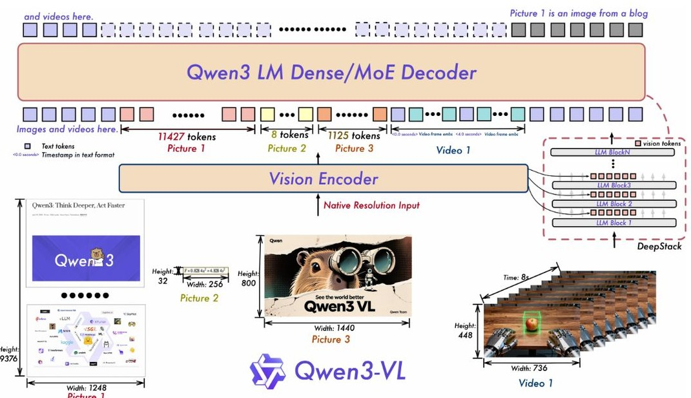
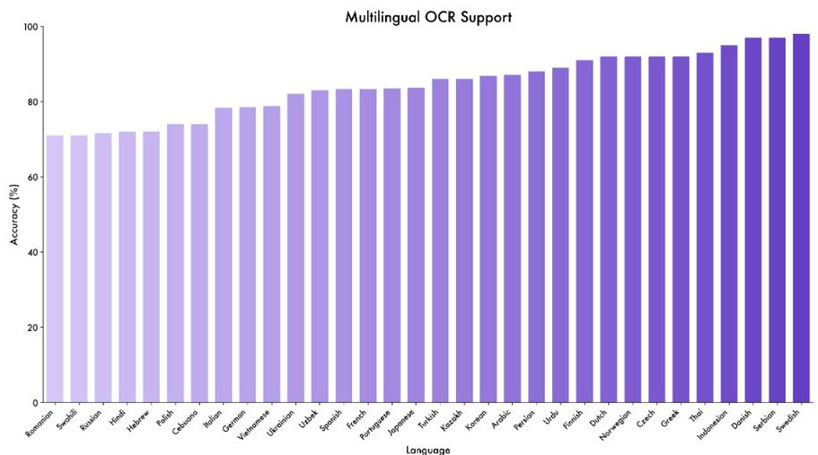
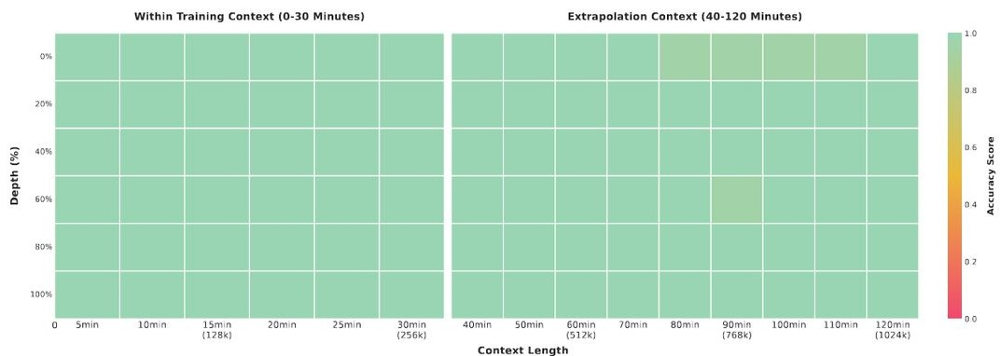

# Qwen3-VL 技术报告

# Qwen团队 ## images/1.jpg)

## 1 引言

视觉语言模型（VLMs）近年来取得了实质性进展，从基础的视觉感知发展到对图像和视频的高级多模态推理。VLMs的快速发展催生了快速扩展的下游应用领域——如长上下文理解、STEM推理、GUI理解与交互以及智能工作流。尤为重要的是，这些进展不能削弱基础大语言模型（LLM）的语言能力；多模态模型在语言基准测试中应当与其仅文本模型相匹配或超越。在本报告中，我们介绍了Qwen3-VL及其在通用和高级应用中的进展。基于Qwen3系列（Yang et al., 2025a），我们实现了四个密集模型（2B/4B/8B/32B）和两个专家混合模型（MoE）（30B-A3B / 235B-A22B），每个模型在训练时使用最长可达256K的上下文窗口以实现长上下文理解。通过优化训练语料库和训练策略，我们在视觉语言（VL）训练过程中保留了基础LLM的语言能力，从而显著提升整体能力。我们发布了非推理和推理两个变体；后者展示了显著更强的多模态推理能力，在复杂推理任务上取得更优秀的表现。

我们首先介绍架构改进，涵盖三大组件：1）增强的位置信息编码。在 Qwen2.5-VL 中，我们使用 MRoPE 作为文本和视觉统一的位置信息编码方案。我们观察到，将嵌入维度划分为时间（t）、水平（h）和垂直（w）组会导致频谱不平衡，并阻碍对长视频的理解。因此，我们采用交错的 MRoPE，将 t、h 和 w 均匀分布在低频和高频带中，从而产生更真实的位置信息表示。2）用于跨层融合的 DeepStack。为了增强视觉-语言对齐，我们结合了开创性的 DeepStack（Meng et al., 2024）机制。来自视觉编码器不同层的视觉词元通过轻量级残差连接路由到相应的 LLM 层，增强了多层融合，而不引入额外的上下文长度。3）显式视频时间戳。我们用显式时间戳词元替换了 Qwen2.5-VL 中通过位置信息编码实现的绝对时间对齐，以标记帧组，提供更简单直接的时间表示。此外，在优化方面，我们将每个样本损失改为平方根归一化的每个词元损失，这在训练过程中更好地平衡了文本和多模态数据的贡献。为了构建更强大和鲁棒的视觉-语言基础模型，我们在质量、多样性和结构上对训练数据进行了全面改造。关键升级包括增强的详细描述监督、扩展的全方位识别与 OCR 覆盖、具有 3D/空间推理的规范化定位，以及用于代码、长文档和时序视频的新语料库。我们进一步注入链式思维推理和高质量、多样化的 GUI-智能体交互数据，以桥接感知、推理和行动。这些创新共同促进了更强的多模态理解、精准的定位和工具增强的智能。我们的训练流程分为两个阶段：预训练和后训练。预训练分为四个阶段：一个只更新合并（视觉-语言投影）层的热身对齐阶段，同时保持模型的其余部分冻结，然后是具有逐步增大上下文窗口的全参数训练，序列长度为 8K、32K 和 256K。后训练包括三个阶段：（i）在长链式思维数据上进行监督微调，（ii）从更强的教师模型中进行知识蒸馏，以及（iii）强化学习。上述创新使 Qwen3-VL 拥有强大的能力，不仅作为一个鲁棒的视觉-语言基础模型，还作为一个灵活的平台，适用于真实世界的多模态智能——在不同应用领域无缝整合感知、推理和行动。在接下来的章节中，我们将展示模型架构、训练框架以及广泛评估的结果，证明其在文本、视觉和多模态推理基准上的持续和竞争性表现。

## 2 模型架构

继 Qwen2.5-VL（白等，2025）之后，Qwen3-VL 采用了由视觉编码器、基于 MLP 的视觉-语言合并模块和大型语言模型（LLM）组成的三模块架构。图 1 显示了详细的模型结构。大型语言模型：Qwen3-VL 在三种密集变体（Qwen3-VL-2B/4B/8B/32B）和两种 MoE 变体（Qwen3-VL-30B-A3B、Qwen3-VL-235B-A22B）中实例化，均建立在 Qwen3 主干网络之上。旗舰模型 Qwen3-VL-235B-A22B 总参数量为 235B，每个 token 激活 22B。它在广泛的多模态任务中超越了大多数 VLM，并在大多数语言基准测试中超过了其文本单一版本。

Figure 1: The Qwen3-VL framework integrates a vision encoder and a language model decoder to process multimodal inputs, including text, images, and video. The vision encoder is specifically designed to handle dynamic, native-resolution visual inputs, mapping them to visual tokens of variable length. To enhance perceptual capability and preserve rich visual information, we incorporate the pioneering DeepStack mechanism, which injects visual tokens from multiple layers of the vision encoder into corresponding layers of the LLM. Furthermore, we adopt Interleaved MRoPE to encode positional information for multimodal inputs with a balanced frequency spectrum, and introduce text-based timestamp tokens to more effectively capture the temporal structure of video sequences.   

视觉编码器：我们利用SigLIP-2架构（Tschannen等，2025）作为我们的视觉编码器，并继续使用动态输入分辨率进行训练，初始化自官方预训练检查点。为了有效适应动态分辨率，我们采用2D-RoPE并根据输入大小插值绝对位置嵌入，遵循CoMP的方法论（Chen等，2025）。具体而言，我们默认使用SigLIP2-SO-400M变体，并在小规模LLM（2B和4B）中使用SigLIP2-Large（300M）。基于MLP的视觉-语言合并：与Qwen2.5-VL中一样，我们使用一个两层的MLP将视觉编码器中的 \(2 \times 2\) 视觉特征压缩为一个单一的视觉词元，与LLM的隐层维度对齐。此外，我们部署了专门的合并器以支持DeepStack机制（Meng等，2024），具体细节在第2.2节中有全面描述。

### 2.1 交错 MRoPE

Qwen2-VL（Wang et al., 2024c）引入了MRoPE来对多模态输入进行位置信息建模。在其原始形式中，嵌入维度被划分为时间（t）、水平（h）和垂直（w）子空间，各自分配不同的旋转频率。这导致了频率谱的失衡，后续研究表明这会降低在长视频理解基准上的性能。为了解决这个问题，我们通过在嵌入维度中交错t、h和w成分重新设计了频率分配（Huang et al., 2025）。这样确保了每个时空轴在低频和高频带中都能均匀表示。结果得到的平衡频谱减轻了原始频谱偏差，显著改善了视频的长范围位置信息建模。

### 2.2 DeepStack

我们借鉴了DeepStack（Meng等，2024）的思路，将视觉词元注入到大语言模型的多个层中。与原始DeepStack方法通过多尺度视觉输入堆叠词元不同，我们将DeepStack扩展为从视觉变换器（ViT）的中间层提取视觉词元。该设计保留了丰富的视觉信息，涵盖从低级到高级的表示。具体而言，如图1所示，我们从视觉编码器的三个不同层次选择特征。随后，专用的视觉-语言融合模块将这些多层特征投影为视觉词元，并将其直接添加到前面三层大语言模型的对应隐藏状态中。

### 2.3 视频时间戳

在 Qven2.5-VL 中，采用了一种与时间同步的 MRoPE 变体，以赋予模型时间意识。然而，我们识别出该方法的两个关键局限性：（1）通过直接将时间位置 ID 绑定到绝对时间，该方法对长视频生成过大且稀疏的时间位置 ID，降低了模型理解长时间上下文的能力。（2）在这种方案下，有效学习需要在各种帧率（fps）之间进行广泛和均匀分布的采样，这显著增加了训练数据构建的成本。为了解决这些问题，我们采用了一种基于文本词元的时间编码策略（Chen et al., 2024b），在该策略中，每个视频时间片段前缀带有一个表示为格式化文本字符串的时间戳——例如，<3.0 seconds>。此外，在训练过程中，我们以秒和 HMS（小时：分钟：秒）格式生成时间戳，以确保模型学习解读多样的时间码表示。尽管这种方法在上下文长度上略有增加，但它使模型能够更有效、准确地感知时间信息，从而促进时间感知的视频任务，例如视频定位和密集标注。

## 3 预训练

### 3.1 训练方案

我们首先通过基于预训练的 SigLIP-2 模型进行动态分辨率的连续训练，增强视觉编码器。整体 Qven3-VL 模型采用三模块架构，包含此视觉编码器、基于 MLP 的视觉-语言合并模块和 Qven3 大语言模型（LLM）主干。基于该架构，我们的预训练方法论系统地结构化为四个不同阶段，旨在逐步提高从基础对齐到长文本理解的能力。这些阶段的概述见表 1。

Table 1: Training setup and hyperparameters across different stages for Qwen3-VL.   

<table><tr><td>Stage</td><td>Objective</td><td>Training</td><td>Token Budget</td><td>Sequence Length</td></tr><tr><td>S0</td><td>Vision-Language Alignment</td><td>Merger</td><td>67B</td><td>8,192</td></tr><tr><td>S1</td><td>Multimodal Pre-Training</td><td>All</td><td>~1T</td><td>8,192</td></tr><tr><td>S2</td><td>Long-Context Pre-Training</td><td>All</td><td>~1T</td><td>32,768</td></tr><tr><td>S3</td><td>Ultra-Long-Context Adaptation</td><td>All</td><td>100B</td><td>262,144</td></tr></table>  

阶段0：视觉-语言对齐。初始阶段（S0）专注于高效地缩小视觉编码器和大语言模型（LLM）之间的模态差距。关键是，在这一阶段中，仅训练多层感知器合并器的参数，而视觉编码器和LLM主干网络保持不变。我们利用一个精心整理的数据集，包含约670亿个词元，由高质量的图像-标题对、视觉知识集合和光学字符识别（OCR）数据组成。所有训练在序列长度为8192的情况下进行。这种以对齐为先的方法为跨模态理解打下了坚实的基础，然后再进行全参数训练。 阶段1：多模态预训练。在初始对齐后，阶段1（S1）转向全参数的多模态预训练。在这一阶段，我们解冻所有模型组件——视觉编码器、合并器和LLM——进行联合端到端训练。模型在一个大规模且多样化的数据集上训练，约为1万亿（1T）词元。为了保持LLM的强语言能力，数据混合由视觉-语言（VL）数据和仅文本数据构成。VL部分丰富多样，增加了交错的图像-文本文档、视觉定位任务、视觉问答（VQA）、来自STEM领域的数据，以及少量视频数据以引入时间理解。序列长度保持在8192。 阶段2：长文本预训练。阶段2（S2）旨在显著扩展模型的上下文处理能力。此阶段的关键变化是序列长度增加到32768，同时所有模型参数继续可训练。训练在一个约为1万亿词元的数据集上进行，并调整数据混合以支持长文本任务。增加仅文本数据的比例以增强长篇文本理解，而剩余的VL数据则结合了大量的视频和以智能体为导向的指令跟随数据。本阶段对于使模型能够处理和推理更长的视频和复杂的多步骤任务至关重要。 阶段3：超长文本适应。最后阶段（S3）是一个专门的阶段，旨在将模型的上下文窗口推向其操作极限。在这里，我们将序列长度大幅增加至262144。模型在一个更为专注的1000亿词元数据集上进行训练，专门为此目的整理。数据同样由仅文本数据和VL数据构成，重点强调长视频和长文档理解任务。该最终适应巩固了Qwen3-VL在处理和分析极长序列输入方面的能力，这是全面文档分析和长视频摘要等应用的关键能力。

### 3.2 预训练数据

#### 3.2.1 图像描述与交错文本-图像数据

为了构建一个强大的通用视觉-语言理解基础模型，我们显著扩展和精炼了两种核心数据模态：图像-标题对和交错文本-图像序列。我们的策略强调高质量、多样化和语义丰富的多模态基础，支持专用构建的模型和严格的筛选管道。 图像标题数据：我们从网络来源整理了一个大型的现代中英多语言图像-文本对语料库，并应用一个以专门的Qwen2.5-VL-32B模型为中心的多阶段精炼管道，进行再标题化微调。该模型利用与每张图像相关的原始文本生成更全面、流畅和细致的标题，丰富了对视觉元素（例如，物体属性、空间布局和上下文语义）的描述，同时提高了文本部分的语言质量和信息量。重复数据清理仅在再标题化文本上进行，使用语义相似性度量，确保在不影响视觉多样性的情况下移除冗余样本。为了进一步增强对被低估概念的覆盖，我们对视觉嵌入进行聚类（Johnson等，2019；Douze等，2024；Diao等，2025），识别数据分布中的稀疏区域并进行针对性增强。最终结果是一个高保真标题数据集，平衡了规模、多样性和描述精细度。 交错文本-图像数据：我们收集了来自最近的中英文网站的多样化真实世界多模态文档（Laurencon等，2023；Zhu等，2023；Li等，2024c）。所有文档经过领域分类（Wettig等，2025），使用一种为细致领域识别微调的轻量级Qwen基础评分器。根据跨领域验证实验，我们系统性地排除有害或低价值的类别——例如广告、促销内容和标题党——使用相同的高效评分器筛选出不必要的样本。对于规模较大的交错数据，我们应用微调的Qwen2.5-VL-7B模型进行高准确度的多模态解析，精确提取并对齐与嵌入图形、图表和照片的文本。为了实现超长上下文建模，我们通过将连续页面合并为最多256K个词元的序列来构建一个专门的子集，保持自然的页面顺序和多模态一致性。在预处理过程中，我们执行严格的质量控制：（i）去除纯文本或对齐度低的片段；（ii）对于超长书籍序列，我们要求最低页面数和最低图像-文本比率，以确保上下文中始终存在有意义的视觉-文本交互。因此，构建了一个干净、多样且具有布局感知的交错语料库，旨在优化基础理解和长程多模态推理。

#### 3.2.2 知识

世界知识对于多模态大语言模型（MLLMs）在实现稳健的视觉理解、基础推理和跨多样下游任务的实体感知生成至关重要。为了使Qwen3-VL全面掌握现实世界和虚构概念，我们构建了一个以明确实体为中心的大规模预训练数据集，涵盖超过十种语义类别，包括动物、植物、地标、食品以及日常物体如交通工具、电子产品和衣物。现实世界实体遵循长尾分布：突出的概念频繁出现，并具有高质量的标注，而大多数则较为稀缺。为了解决这一不平衡，我们采用了基于重要性的抽样策略。高显著性的实体被更频繁地抽样，以确保有足够的学习信号，而低显著性的实体则以较小的比例被纳入，以保持广泛的覆盖，同时不影响训练过程。这一方法有效平衡了数据质量、实用性和多样性。所有保留的样本经过多阶段的精炼流程。除了进行标准的噪声和不对齐过滤外，我们还用更丰富的、由LLM生成的描述替换原始或稀疏的标题——如普通的替代文本。这些增强的标题不仅识别主要实体，还描述其视觉属性、周围环境、空间布局以及与其他物体或人之间的互动，从而提供更完整和更扎实的文本表示。通过这些努力，我们获得了知识丰富、具有情境感知以及注重区分的训练信号，显著提升了Qwen3-VL在现实场景中识别、推理和准确描述视觉概念的能力。

#### 3.2.3 光学字符识别（OCR）、文档解析与长文档理解

OCR：为了提升真实世界图像上的光学字符识别（OCR）性能，我们使用粗到精的流程 curated 出一个包含 3000 万个内部收集样本的数据集。该流程通过整合来自 OCR 专用模型的伪标签与 Qwen2.5-VL 的细化结果来优化 OCR 注释，不需要任何人工注释。在支持 10 种语言（不包括中文和英文）的基础上，我们新增了 29 种语言，合成了大约 3000 万个高质量的多语言 OCR 样本，并整理了超过 100 万个内部真实世界的多语言图像。文档解析：针对文档解析，我们从 Common Crawl 收集 300 万个 PDF，均匀分布在 10 种文档类型中（每种 30 万个样本），以及 400 万个内部文档。首先，内部的布局模型预测文本和非文本区域的阅读顺序和边界框；然后 Qwen2.5-VL-72B 进行区域特定的识别。输出数据被重新组装成位置感知且布局对齐的解析数据。为了确保在不同格式中都能稳健解析，我们设计了一个统一的注释框架，支持两种表示方式：- QwenVL-HTML，包含细粒度的元素级边界框；- QwenVL-Markdown，仅对图像和表格进行位置标注，表格使用 LaTeX 编码。我们构建了一个带有精准注释的大规模合成 HTML 语料库，并将其系统性转化为 Markdown 格式。为了进一步提高模型的泛化能力，我们在大量真实文档集合上生成了伪标签并进行质量过滤。最终的训练集结合了合成数据和高质量伪标签数据，以增强可扩展性和稳健性。长文档理解：为了增强模型对多页 PDF 文档的理解能力——这些文档通常跨越几十页——我们利用了一个大规模的长文档数据语料库。首先，我们通过合并单页文档样本来合成长文档解析序列。在每个序列中，多张页面图像位于开头，后面是来自 OCR 或 HTML 解析的对应文本。其次，我们构建了长文档视觉问答（VQA）数据。具体而言，我们从高质量的多页 PDF 中抽取样本，生成一组多样的 VQA 示例，这些示例要求模型在多个页面和异质文档元素之间进行推理——例如图表、表格、图形和正文。我们仔细平衡问题类型的分布，并确保支持证据来自多种模态和布局组件，从而促进在扩展上下文中进行稳健、扎实和多跳推理。

#### 3.2.4 真实标注数据与计数

视觉定位是多模态模型的基本能力，使其能够准确识别、解释和定位从特定物体到任意图像区域的广泛视觉目标。在Qwen3-VL中，我们系统地增强了定位能力，并支持两种定位方式：边界框和点。这些表示允许在不同场景和下游任务中对图像内容进行精确和灵活的解释。此外，我们扩展了模型的定位能力以支持计数，从而使得对视觉实体进行定量推理成为可能。接下来，我们将简要描述用于定位和计数的数据构建流程。

基于框的定位：我们首先汇集了广泛使用的开源数据集，包括COCO（Lin等，2014）、Objects 365（Shao等，2019）、OpenImages（Kuznetsova等，2020）和RefCOCO+（Kazemzadeh等，2014；Mao等，2016）。为了进一步丰富数据多样性，我们开发了一条自动化合成管道，能够在广泛场景下生成高质量的物体标注。该管道分为三个阶段：（i）通过Qwen2.5-VL从未标记的图像中提取物体候选；（ii）使用开放词汇探测器（具体而言，Grounding DINO（Liu等，2023a））和Qwen2.5-VL对这些候选进行定位和标注；（iii）对生成的标注进行质量评估，系统性地过滤掉低置信度或不准确的标注。通过这种方法，我们构建了一个大规模、高度多样的基于框的定位数据集，涵盖了多种视觉背景和物体类别。 基于点的定位：为了确保稳健的基于点的定位，我们策划了一个综合数据集，结合了公开可用和合成生成的指向标注。它整合了三个来源：（i）来自PixMo（Deittek等，2024）的公共指向和计数标注；（ii）源于公共物体检测和实例分割基准的物体定位数据；（iii）由专门设计的合成管道生成的高精度指向标注，针对细粒度图像细节。计数：基于定位数据，我们策划了一个高质量的子集，以形成我们的计数数据集基础，包括三种不同的任务表述：直接计数、基于框的计数和基于点的计数。这三种任务类型共同构成了一个综合计数数据集。与Qwen2.5-VL不同，在此版本中我们采用了一个标准化坐标系统，范围缩放到[0, 1000]。这一设计提升了对多样输入的图像分辨率和纵横比变化的鲁棒性，同时也简化了后处理，增强了预测坐标在下游应用中的可用性。

#### 3.2.5 空间理解与三维识别

为了促进与物理世界的复杂交互，Qwen3-VL 在空间上下文方面具有深刻理解。这使得模型能够解释空间关系、推断对象的可操作性，并进行行动规划和具身推理。它还可以从单张单目图像中估计对象的三维空间位置。为了支持这些能力，我们创建了两个全面的数据集，专注于空间理解和三维定位。

空间理解。除了定位物体之外，Qwen3-VL 还被训练以推理空间关系、物体可用性以及在 2D 场景中可行的动作，这些能力对于具身 AI 和交互应用至关重要。为此，我们构建了一个专用数据集，超越标准的基础标注，包含：（i）关系注释（例如“位于笔记本电脑左侧的杯子”），（ii）可用性标签（例如“可抓取”、“施加压力”、“可坐”），以及（iii）需要规划的动作条件查询（例如“我应该首先移动什么以到达显示器后面的书？”）。这些样本来源于经过精心策划的真实场景和合成生成的布局，自然语言查询通过模板化和基于大语言模型的方法自动生成，以确保多样性和复杂性。重要的是，所有空间引用都是相对于其他物体或场景框架表达的，而不是绝对坐标，从而鼓励强健的关系推理。这一培训使 Qwen3-VL 不仅能够回答“哪里”的问题，还能回答“如何”和“可以做什么”——为与视觉环境的代理互动奠定基础。

3D 定位。为了进一步增强模型从图像理解物理世界的能力，我们构建了一个专门用于 3D 视觉定位的预训练数据集。我们从多种室内和室外场景的公共数据集中获取数据，并将其重新构造成视觉问答格式。每个样本由以下三部分组成：1) 单视角摄像头图像，2) 自然语言引用表达，3) 以结构化 JSON 格式提供的相应 9 自由度 3D 边界框注释，指定物体的空间位置和语义标签。由于 3D 边界框是从多个传感器和数据源中提取的，它们表现出不同的相机内参和固有噪声。为此，我们过滤掉严重遮挡和不准确的标签，并遵循 Omni3D（Brazil 等，2023）将所有数据统一到虚拟相机坐标系中。我们还合成了大量描述性标题，创建丰富的文本查询以用于 3D 定位。这些描述不仅限于命名物体类别，还包括详细属性、布局安排、空间位置、视觉便利性以及与周围物体的交互——产生更细粒度和更具基础性的引用表达。

## 3.2.6 代码

我们通过将两类代码相关的数据纳入训练语料库，增强了 Qwen3- VL 系列的专用编码能力，使模型能够在文本和视觉基础的上下文中读取、编写和推理程序。仅文本编码。我们重用了 Qwen3 和 Qwen3- Coder 系列的广泛代码语料库。这个大规模数据集涵盖了多种编程语言和领域，包括软件开发、算法问题解决、数学推理和基于智能体的任务，奠定了模型对代码语法、算法逻辑和通用程序生成的基础理解。多模态编码。为了应对需要视觉理解和代码生成的任务，我们为多样化的多模态编码任务策划了数据。该数据集源于开源数据集和内部合成管道，教会模型共同理解视觉输入并生成功能性代码。数据涵盖多个关键任务，包括：将 UI 截图转换为响应式 HTML/CSS；从图像生成可编辑的 SVG 代码（Li 等，2025c）；解决视觉编程挑战（Li 等，2024a）；回答多模态编码问题（例如，带图像的 StackOverflow 帖子）；以及将视觉表示（如流程图、图表和 LaTeX 方程）转录为相应的代码或标记。这种新颖的数据组合使 Qwen3- VL 能够充当视觉感知和可执行逻辑之间的桥梁。

## 3.2.7 视频

Qwen3-VL 的视频理解能力已大幅提升，能够有效建模帧间的时间动态，细致感知空间关系，并对超长视频序列进行连贯的总结。这一增强得益于一个数据处理管道，其中包含两项主要创新：时间感知视频理解。(i) 密集字幕合成：针对长视频序列，我们采用短到长的字幕合成策略生成整体的、时间戳交错的、时间上连贯的故事级描述。利用内部字幕生成模型，我们进一步生成细致的注释，既捕捉事件级的时间总结，又涵盖特定片段的视觉细节。(ii) 时空视频定位：我们整合和合成了大规模的带有对象、动作和人物注释的视频数据，以增强模型的时空定位能力，从而提高其细致视频理解的能力。视频数据平衡与采样。(i) 来源平衡：为了确保数据的平衡和多样性，我们组建了一个大规模的数据集，涵盖了包括教学内容、电影、第一人称录像等各种视频来源。数据集平衡通过受视频标题、时长和类别标签等元数据指导的系统性策划来实现。(ii) 长度自适应采样：在预训练阶段，我们根据不同序列长度的约束动态调整采样参数，如每秒帧数（fps）和最大帧数。这一自适应策略减轻了与次优采样实践相关的信息损失（例如，过于稀疏的帧选择或过低的空间分辨率），从而保持视觉细节并优化训练效果。

## 3.2.8 科学、技术、工程与数学 (STEM)

多模态推理是 Qwen3-VL 的核心，其中 STEM 推理构成其最关键的部分。我们的理念遵循分而治之的策略：首先独立开发精细的视觉感知能力和强大的语言推理能力，然后以协同的方式将它们整合，以实现有效的多模态推理。视觉感知数据。我们开发了一条专用的合成数据生成管道，通过程序化（基于代码）渲染构建几何图形。使用该管道，我们生成：（i）100 万个点接地样本，如交点、角点和重心；以及 （ii）200 万个以感知为导向的视觉问答对，旨在针对图表的精细视觉理解。为了获得高保真度的文本描述，我们进一步实施了一个两阶段的字幕生成框架：初始生成阶段随后是严格的基于模型的验证。两个阶段均使用多种专业模型的集成，以确保准确性和描述的细致性。这个过程生成了一个包含600万条丰富注释的图表字幕的综合数据集，覆盖多种 STEM 学科。

多模态推理数据。我们的大部分多模态推理数据由超过6000万个K-12和本科层次的习题组成，这些习题经过严格的清洗和重构流程精心整理。在质量筛选过程中，我们剔除了低质量项，包括损坏的图像、不相关的内容或不完整或错误的答案。在重构阶段，我们在中文和英文之间翻译习题，并标准化答案的格式——例如逐步解决方案列表、数学表达式和符号标记——以确保一致性和统一展示。关于长链推理问题解决数据，我们合成了超过1200万个配有图像的多模态推理样本。为了确保推理过程的连续性和丰富性，我们利用强推理模型生成的原始推演。为了保证数据的可靠性和适用性，每个样本的推理轨迹都经过严格验证——结合基于规则的检查和基于模型的验证——明确过滤掉任何包含模糊答案或代码切换的实例。此外，为了提高推理质量，我们通过拒绝采样仅保留具有挑战性的题目。语言推理数据。除了多模态推理数据，我们还纳入了来自Qwen3的推理数据，因为多模态推理能力主要源于语言推理能力。

### 3.2.9 智能体

GUI：为了赋予 Qwen3-VL 自主与图形用户界面（GUI）进行交互的能力，我们策划并综合了覆盖桌面、移动和网络环境的大规模跨平台数据（Ye 等，2025；Wang 等，2025a；Lu 等，2025）。在 GUI 接口感知方面，我们利用元数据、解析工具和人工标注构建任务，例如元素描述、密集标注和密集定位，从而实现对多样化用户界面的稳健理解。为了实现智能能力，我们通过自我演化的轨迹生成框架组装多步骤任务轨迹，并辅以有针对性的人工审核；我们还精心设计并增强了思维链推理，以加强在现实执行过程中规划、决策和反思自我修正的能力。函数调用：对于具备多模态上下文的一般函数调用能力，我们构建了多模态函数调用轨迹合成管道。我们首先指示具备能力的模型通过图像生成用户查询及其相应的函数定义。然后，我们从模型的函数调用中抽样逻辑，并合成函数响应。该过程重复进行，直至判断用户的查询已被解决。在每个步骤之间，由于格式错误，轨迹可能会被过滤掉。这样的管道使我们能够从大量图像中构建大规模多模态函数调用轨迹，而无需实现可执行功能。搜索：在一般函数调用能力中，我们认为执行搜索的能力是促进现实场景中长尾实体知识整合的关键。在这种情况下，我们收集了与在线图像搜索和文本搜索工具相结合的多模态事实查找轨迹，鼓励模型对不熟悉的实体进行搜索。通过这样做，模型学习从网络中收集信息，以生成更准确的响应。

## 4 训练后阶段

### 4.1 训练方案

我们的后训练流程是一个三阶段的过程，旨在提高模型的指令跟随能力，增强其推理能力，并使其与人类偏好保持一致。每个阶段的具体数据和方法在后续部分中进行了详细说明。 监督微调（SFT）。第一阶段赋予模型指令跟随能力，并激活潜在的推理技能。该阶段分为两个阶段：初始阶段的上下文长度为32k，然后扩展到256k的上下文窗口，专注于长文档和长视频数据。为了满足不同需求，我们将训练数据分为非思维模型的标准格式和思维模型的链式推理（CoT）格式，后者明确建模了推理过程。 强到弱蒸馏。第二阶段采用知识蒸馏，由一个强大的教师模型将其能力转移给我们的学生模型。至关重要的是，我们使用文本数据进行蒸馏，以微调大语言模型的主干网络。这种方法证明非常有效，在文本中心和多模态任务中均显著提高了推理能力。 强化学习（RL）。最后一个阶段利用强化学习进一步提升模型的性能和一致性。该阶段分为推理强化学习和整体强化学习。我们在广泛的文本和多模态领域内应用大规模的强化学习，包括但不限于数学、光学字符识别、基础知识和指令跟随，以提高更细致的能力。

### 4.2 冷启动数据

#### 4.2.1 SFT 数据

我们主要目标是赋予模型应对广泛现实场景的能力。在 Qwen2.5-VL 的基础能力之上，该模型在大约八个核心领域和30个细分子类别中表现出色，我们有策略地扩展了其功能范围。这一扩展通过整合社区反馈、学术文献和实际应用的洞见实现，推动了新能力的引入。这些能力包括但不限于：针对具身智能的空间推理、针对细粒度视觉理解的图像基础推理、在视频中的时空基础以实现稳健的目标跟踪，以及对数百页长文本技术文档的理解。在这些目标任务的指导下，并基于真实的使用案例，我们通过从开源数据集和网络资源中精心选择和合成样本，系统性地策划了 SFT 数据集。这一针对性的数据工程工作对将 Qwen3-VL 打造为更全面更稳健的多模态基础模型发挥了关键作用。

该数据集包含大约 1,200,000 个样本，经过战略性构建，以促进强大的多模态能力。该集合被分为单模态和多模态数据，其中三分之一由仅文本条目组成，剩下的三分之二则由图像-文本和视频-文本对构成。多模态内容的集成特别设计用于使模型能够理解复杂的现实场景。为了确保全球相关性，该数据集超越其主要的中文和英文语料库，纳入了多样化的多语言样本，从而扩展其语言覆盖范围。此外，它通过包含单轮和多轮对话，并结合各种视觉设置，从单图像到多图像序列，模拟现实的对话动态。关键的是，该数据集还包含交错的图像-文本示例，旨在支持高级智能行为，如工具增强的图像搜索和基于视觉的推理。这种异质的数据构成确保了全面覆盖，并增强了数据集在训练可泛化和复杂多模态智能体方面的代表性。考虑到 Qwen3-VL 原生支持 256K 词元的上下文长度，我们采用分阶段训练策略以优化计算效率。该策略包括两个阶段：初始的一轮训练阶段，序列长度为 32K 词元，然后是全长 256K 词元的第二轮训练。在后一个阶段，模型在交错长上下文输入和 32K 词元长度样本的数据集上进行训练。长上下文输入包括数百页的技术文档、完整的教科书以及时长可达两小时的视频。训练数据的质量是影响视觉-语言模型性能的关键因素。来自开源和合成来源的数据集通常受到显著变异和噪声的困扰，包括冗余、无关或低质量样本。为了解决这些缺陷，实施严格的数据过滤协议是不可或缺的。因此，我们的数据策划过程包括两个阶段的过滤管道：查询过滤和响应过滤。查询过滤。在初始阶段，我们利用 Qwen2.5-VL 来识别并丢弃那些不易验证的查询。对含糊指令的查询进行最小修改，以增强清晰度，同时保留原始语义意图。此外，对于缺乏实质性内容的网络来源查询，系统性地进行剔除。关键是，所有剩余查询都经过复杂性和上下文相关性的最终评估，确保只有适当具有挑战性和相关性的样本被保留用于下一个阶段。响应过滤。该阶段整合了两种互补的策略：\(\bullet\) 基于规则的过滤：应用一套预定义的启发式规则，消除表现出定性缺陷的响应，如重复、不完整或格式不当。为了保持语义的相关性并维护伦理原则，我们还会丢弃任何与主题无关或可能产生有害内容的查询-响应对。 \(\bullet\) 基于模型的过滤：通过采用来自 Qwen2.5-VL 系列的奖励模型进一步精炼数据集。这些模型对多模态问答对进行多维评估。具体来说：（a）根据正确性、完整性、清晰度和有用性等多种标准对回答进行评分；（b）对于基于视觉的任务，评估特别强调验证对视觉信息的准确解读和利用；（c）这种基于模型的方法能够检测到通常规避基于规则的方法的细微问题，如不当的语言混合或突兀的风格转变。该多维过滤框架确保只有满足质量、可靠性和伦理完整性严格标准的数据被推进到 SFT 阶段。

#### 4.2.2 Long-CoT 冷启动数据

我们思维模型的基础是一套精心策划的长链思维（CoT）冷启动数据集，旨在引发和提升复杂推理能力。该数据集建立在一系列多样化的查询上，包括纯文本和多模态数据，确保视觉-语言与仅文本样本之间大约1:1的比例，以确保技能的均衡发展。多模态组件涵盖了视觉问答（VQA）、光学字符识别（OCR）、二维/三维定位以及视频分析等既定领域，特别强调丰富与STEM及代理工作流程相关的任务。这一战略重点旨在提升模型在需要复杂多步推理的问题上的表现。纯文本部分与Qwen3使用的数据非常相似，包含数学、代码生成、逻辑推理和一般STEM中具有挑战性的问题。为了确保高质量和适当的难度，我们实施了一套严格的多阶段筛选协议。 - 难度筛选：我们有选择性地保留基准模型表现出低通过率或生成较长、更详细响应的实例。这为数据集丰富了当前模型真正具有挑战性的问题。 - 多模态必要性筛选：对于视觉-语言数学问题，我们引入了一项关键的筛选步骤：我们丢弃任何我们的Qwen3-30B-nothink模型在没有视觉输入的情况下也能正确解决的样本。这确保了剩余实例确实需要多模态理解，而不是仅通过文本线索就能解决。 - 响应质量控制：与Qwen3的方法论保持一致，我们对生成的响应进行清理。对于多个候选答案的查询，我们首先去除包含错误最终结果的答案。随后，我们过滤出表现出不良模式的响应，例如过度重复、不当语言混合或明显缺乏合理推理步骤的猜测性答案。这一严格的筛选过程产生了高质量、具有挑战性的数据集，为高级多模态推理奠定了基础。

### 4.3 强到弱的蒸馏

我们采用 Qwen3 中描述的强到弱蒸馏管道进一步提高轻量模型的性能。该蒸馏过程由两个主要阶段组成： - 离策略蒸馏：在第一阶段，由教师模型生成的输出被组合以提供响应蒸馏。这帮助轻量级学生模型获得基本的推理能力，为后续的在策略训练奠定了坚实的基础。 - 在策略蒸馏：在第二阶段，学生模型基于提供的提示生成响应。这些在策略序列随后被用于微调学生模型。我们通过最小化 KL 散度来对齐学生模型和教师模型预测的 logits。

### 4.4 强化学习

#### 4.4.1 推理强化学习

我们在一系列多样化的文本和多模态任务上训练模型，包括数学、编码、逻辑推理、视觉定位和视觉谜题。每个任务的设计使得解决方案可以通过规则或代码执行器进行确定性验证。数据准备我们从开放源代码和专有来源策划训练数据，并进行严格的预处理和人工标注，以确保高质量的强化学习查询。对于多模态查询，我们使用我们最先进的视觉-语言模型（Qwen3- VL- 235B- A22B）的初步检查点为每个查询采样 16 个响应；对于所有响应均错误的查询将被丢弃。随后，我们针对每个任务进行初步的强化学习实验，以识别和移除有限改善潜力的数据源。该过程生成大约 30K 个涵盖多种文本和多模态任务的强化学习查询。为了训练每个模型，我们对所有查询采样 16 个响应，并过滤掉通过率超过 \(90\%\) 的简单查询。我们对任务特定数据集进行洗牌和组合，以构建混合任务批次，确保每个任务的样本比例保持一致且预定义。该比例通过大量的初步实验确定。奖励系统我们实施一个统一的奖励框架，以在所有任务中提供准确的反馈。该系统提供共享基础设施——数据预处理、实用函数以及一个奖励管理器，用于整合多种奖励类型——而核心奖励逻辑则针对每个任务实施。我们使用任务特定格式的提示引导模型输出所需的格式，因此不依赖显式格式奖励。为了减轻代码切换，当响应语言与提示语言不同时，我们施加惩罚。强化学习算法我们采用 SAPO（Gao et al., 2025），这是一种平滑且自适应的策略梯度方法，用于强化学习训练。SAPO 在多样化的文本和多模态任务及不同模型规模和架构中提供了持续的改进。

#### 4.4.2 一般强化学习

一般强化学习（RL）阶段旨在增强模型的泛化能力和操作鲁棒性。为此，我们采用多任务 RL 范式，其中奖励函数基于来自 SFT 阶段的一整套任务进行形式化，包括视觉问答（VQA）、图像描述、光学字符识别（OCR）、文档解析、定位和时钟识别。奖励机制旨在优化模型性能的两个主要维度： 1. 指令遵循：该维度评估模型对明确用户指令的遵守程度。它评估处理内容、格式、长度和结构化输出（例如 JSON）等复杂约束的能力，确保生成的响应准确符合用户要求。 2. 偏好对齐：对于开放式或主观查询，该维度通过优化有用性、事实准确性和风格适当性，将模型输出与人类偏好对齐。这促进了更自然和引人入胜的用户互动。 此外，此阶段作为一种纠正机制，旨在消除在 SFT 阶段根深蒂固的强但有缺陷的知识先验。我们通过引入专门的、可验证的任务来解决这一问题，这些任务旨在引发这些特定错误，例如反直觉的物体计数和复杂的时钟时间识别。这种针对性的干预旨在用事实知识取代错误的先验知识。另一个关键目标是减轻诸如不当语言混合、过度重复和格式错误等劣质行为。然而，这些问题的低发生率使得一般 RL 成为一种样本效率低的纠正策略。为了解决这一问题，我们在此阶段策划了一个专门的数据集。该数据集隔离了已知会引发这些不良行为的提示。这种针对性的训练使得能够施加高频次的针对性惩罚，有效抑制这些残余错误。 对于 RL 过程的反馈通过混合奖励系统提供，该系统结合了两种互补的方法： - 基于规则的奖励：该方法为具有可验证真值的任务提供明确、高精度的反馈，例如格式遵循和指令遵循。通过使用明确定义的启发式规则，该方法提供了评估正确性的强大机制，并有效降低了奖励操控的风险，即模型可能利用学习的奖励函数中的模糊性。 - 基于模型的奖励：该方法使用 Qwen2.5-VL-72B-Instruct 或 Qwen3 作为复杂的评审者。评审模型根据真值参考评估每个生成的响应，按多个维度对其质量进行评分。这种方法在评估细微或开放式任务时提供了更大的灵活性，因为仅凭严格的基于规则的匹配是无法满足的。它特别有效于最小化会对格式或措辞非传统的有效响应施加惩罚的误判。

### 4.5 用图像思考

受到“使用图像思考”的重大先前工作的启发（Wu et al., 2025a; Jin et al., 2025; Zheng et al., 2025; Lai et al., 2025），我们通过两阶段的训练范式赋予Qwen3-VL类似的自主能力。在第一阶段，我们合成了一个包含大约10,000个基础示例的冷启动基因数据集——主要是简单的两轮视觉问答任务，如属性检测。然后，我们对Qwen2.5-VL-32B进行监督微调（SFT），以模拟视觉智能体的行为：思考→行动→分析反馈→回答。为了进一步增强其推理能力，我们应用多轮、工具集成的强化学习（RL）。在第二阶段，我们从第一阶段中提炼训练好的Qwen2.5-VL-32B视觉智能体，以生成一个更大、更具多样性的数据集，包含大约120,000个涵盖更广泛视觉任务的多轮自主交互。然后，我们对Qwen3-VL进行类似的冷启动SFT和工具集成RL流程（现在使用提炼和合成的数据）进行后训练。多轮、工具集成的RL程序在两个阶段几乎完全相同，仅在基础数据上有所不同。在RL过程中，我们采用三个互补的奖励信号来促进稳健的工具介导推理：- 答案准确奖励利用Qwen3-32B测量最终答案是否正确。- 多轮推理奖励利用Qwen2.5-VL-72B评估助手是否正确理解工具或环境反馈，并通过连贯的逐步推理得出答案。- 工具调用奖励通过将实际工具调用次数与专家估计的目标进行比较，以鼓励适当的工具使用。该目标由Qwen2.5-VL-72B根据任务复杂性离线确定。早期实验显示模型倾向于退化为仅进行一次工具调用，以达到前两个奖励，而不考虑任务要求。为此，我们明确引入工具调用奖励，以促进与任务复杂性相适应的自适应工具探索。

### 4.6 基础设施

我们在阿里云的PAI-灵雀AI计算服务上训练Qwen3-VL系列模型，该服务提供了进行AI和高性能计算等计算密集型场景所需的高性能计算能力。在预训练阶段，系统采用基于Megatron-LM框架的混合并行策略，整合了张量并行（TP）、流水线并行（PP）、上下文并行（CP）、专家并行（FP）和ZeRO-1数据并行（DP）。这一配置在模型规模、计算负载和通信开销之间实现了精细平衡，使得硬件利用率高，能够在高通量和低通信延迟下持续运行，甚至在高达10,000个GPU的规模下也能保持稳定。对于本地部署和性能评估，我们采用基于vLLM或SGLang的部署策略。vLLM利用PagedAttention实现内存高效管理和高通量推理，而SGLang在结构化生成和处理复杂提示方面表现出色。这些后端共同提供了高效的推理和评估，具备稳定、高效和灵活的模型推理能力。

## 5 评估

### 5.1 一般视觉问答

为了全面评估Qwen3-VL系列的一般视觉问答（VQA）能力，我们对一组多样化的基准进行了广泛评估，包括MMBench-V1.1（Liu et al., 2023b）、RealWorldQA（xAI, 2024）、MMStar（Chen et al., 2024a）和SimpleVQA（Cheng et al., 2025）。如表2、表3和表4所详细列示，Qwen3-VL系列在参数规模从2B到235B的广泛范围内表现出强大且高度竞争的性能。在思维模式的比较中，Qwen3-VL-235B-A22B-思维在MMStar上获得了最高得分78.7。Gemini-2.5-Pro（Comanici et al., 2025）的思维模式提供了最佳的整体性能，但Qwen3-VL-235B-A22B-思维的表现也非常接近。在非推理模式比较中，Qwen3-VL-235B-A22B-指令在MMBench和RealWorldQA上分别获得了89.3/88.9和79.2的最高得分。在中等规模模型的实验中，Qwen3-VL-32B-思维在MMBench和RealWorldQA上分别取得了89.5/89.5和79.4的最高得分。值得注意的是，Qwen3-VL-32B-指令在RealWorldQA上甚至超越了思维变体，得分为79.0。Qwen3-VL系列的可扩展性在我们较小模型的强大表现中得以体现。具体而言，最大模型Qwen3-VL-8B在所有五个基准测试中都取得了最佳性能。例如，在MMA5bench-EN上，“思维”模式的得分由2B模型的79.9提高到8B模型的85.3。在MMStar等其他基准上也观察到了类似的上升趋势，其得分从68.1（2B，思维）上升到75.3（8B，思维）。

### 5.2 多模态推理

我们对Qwen3-VL系列在广泛的多模态推理基准上进行了评估，主要集中在STEM相关任务和视觉难题，包括MMMU（Yue等，2024a）、MMMU-Pro（Yue等，2024b）、MathVision（Wang等，2024b）、MathVision-Wild_photo（以下简称MathVisionwp）、MathVista（Lu等，2023）、We-Math（Qiao等，2024）、MathVerse（Zhang等，2024）、DynaMath（Zou等，2024）、Math-VR（Duan等，2025）、LogicVista（Xiao等，2024）、VisualPuzzles（Song等，2025b）、VLM是盲的（Rahmanzadehgervi等，2025）、ZeroBench（主/子任务）（Roberts等，2025）和VisuLogic（Xu等，2025）。如表2所示，旗舰Qwen3-VL模型在“非思考”和“思考”模型中都展现出了卓越的性能。值得注意的是，Qwen3-VL-235B-A22B-Instruct在多个基准上取得了低思考预算模型中最佳的报告结果，包括MathVista_mini、MathVision、MathVerse_mini、DynaMath、ZeroBench、VLMsAreBlind、VisuLogic和VisualPuzzlesDirect。而Qwen3-VL-235B-A22B-Thinking在MathVista_mini、MathVision、MathVerse_mini、ZeroBench、LogicVista和VisuLogic上达到了最先进的结果。在中型模型中，如表3所示，Qwen3-VL-32B展现出了显著的优势，持续超越Gemini-2.5-Flash和GPT-5-mini。与上一代Qwen2.5-VL-72B模型相比，中型Qwen3-VL模型在推理任务上已经超越了它。这突显了VLMs的显著进步。此外，我们新推出的Qwen3-VL-30B-A3B MoE模型同样提供了具有竞争力的结果。在小型模型中，我们将Qwen3-VL-2B/4B/8B与GPT-5-Nano进行了比较，结果见于表4。8B变种整体上保持了明显的优势，而4B模型在DynaMath和VisuLogic上获得了最高分。值得注意的是，即使是最小的2B模型也展现出了强大的推理能力。

### 5.3 对齐与主观任务

跟随复杂用户指令并减少潜在图像级幻觉的能力对于当前的大型视觉语言模型（VIMs）至关重要。我们在三个具有代表性的基准上评估我们的模型：MM-MT-Bench（Agrawal et al., 2024）、HallusionBench（Guan et al., 2023）和MIA-Bench（Qian et al., 2024）。MM-MT-Bench是一个针对多轮LLM作为评判的评估基准，用于测试多模态指令调优模型。HallusionBench旨在诊断图像上下文推理，并对当前的视觉语言模型提出了很大挑战。MIA-Bench是一个更全面的基准，用于评估模型对用户复杂指令的反应（例如，有限字数的创意写作和组合指令）。

如表2所示，我们的旗舰模型Qwen3-VL-235B-A22B在各项评测中始终优于其他闭源模型。在HallusionBench中，我们的思考版本分别超过Gemini-2.5-pro（Comanici等，2025）、GPT-5（OpenAI，2025）和Claude opus 4.1（Anthropic，2025）3.0、1.0和6.3分。在MIA-Bench中，Qwen3-VL-235B-A22B-思考版在所有其他模型中实现了最佳总体得分，显示出我们卓越的多模态指令跟随能力。我们还调查了MIA-Bench中各子任务的详细结果：我们的模型在数学和文本子任务中分别超过了GPT-5高思考版10.0和5.0分。同样的趋势也出现在我们的较小模型如Qwen3-VL-30B-A3B和Qwen3-VL-32B上，它们在与其他相似规模的模型对比中也展现出优越性。我们的2B/4B/8B系列表现良好，尤其在MIA-Bench上几乎没有下降。

### 5.4 文本识别与文档理解

我们将 Qwen3-VL 系列与其他相似规模的模型在与文档相关的基准测试上进行比较，包括光学字符识别（OCR）、文档解析、文档问答（QA）和文档推理。

我们评估了我们的旗舰模型 Qwen3-VL-235B-A22B，并与表2中列出的最先进的视觉语言模型（VLM）进行比较。在 OCR 相关的解析基准测试中，包括 CC-OCR（Yang et al., 2024b）和 OmniDocBench（Ouyang et al., 2024），以及全面的 OCR 基准测试如 OCR-Bench（Liu et al., 2024）和 OCRBench_v2（Fu et al., 2024b），Qwen3-VL-235B-A22B-Instruct 模型创造了新的最先进记录，略微优于其“思考”版本 Qwen3-VL235B-A22B-Thinking。在 OCR 相关的视觉问答（VQA）基准测试中，这些测试需要 OCR 能力和关键字搜索，例如 DocVQA（Mathew et al., 2021b）、InfoVQA（Mathew et al., 2021a）、AI2D（Kembhavi et al., 2016）、ChartQA（Masry et al., 2022）和 CharXiv（Wang et al., 2024g）描述子集，Instruct 和 Thinking 版本均表现出可比的性能，展示了在这些任务中的一致性和强劲的结果。值得注意的是，在 CharXiv 的推理子集上，该子集要求深入的图表理解和多步推理，Thinking 版本超过了 Instruct 版本，仅次于 GPT5-thinking 和 Gemini-2.5-Pro-Thinking。

Table 2: Performance of Qwen3-VL-235B-A22B and top-tier models on visual benchmarks. The highest scores of the reasoning and non-reasoning models are shown in bold and underlined, respectively. Results marked with an \(^*\) are sourced from the technical report. \(^+\) denotes results with tool use.   

<table><tr><td rowspan="2"></td><td rowspan="2">Benchmark</td><td colspan="2">Qwen3-VL  235B-A22B</td><td colspan="2">Gemini  2.5 Pro</td><td colspan="2">OpenAI  GPT-5</td><td colspan="2">Claude  Opus 4.1</td></tr><tr><td>thinking</td><td>instruct</td><td>thinking</td><td>budget-128</td><td>high</td><td>minimal</td><td>thinking</td><td>non-thinking</td></tr><tr><td rowspan="10">STEM Puzzle</td><td>MMMU</td><td>80.6</td><td>78.7</td><td>81.7*</td><td>80.9</td><td>84.2*</td><td>74.4*</td><td>78.4</td><td>77.2</td></tr><tr><td>MMMU-Pro</td><td>69.3</td><td>68.1</td><td>68.8*</td><td>71.2</td><td>78.4*</td><td>62.7*</td><td>64.8</td><td>60.7</td></tr><tr><td>MathVisitor</td><td>85.8</td><td>84.9</td><td>82.7*</td><td>77.7</td><td>81.3</td><td>50.9</td><td>75.5</td><td>74.5</td></tr><tr><td>MathVision</td><td>74.6</td><td>66.5</td><td>73.3*</td><td>66.0</td><td>70.9</td><td>45.8</td><td>64.3</td><td>57.7</td></tr><tr><td>MathVisionWP</td><td>~63.8</td><td>57.0</td><td>63.2</td><td>56.9</td><td>62.8</td><td>40.1</td><td>54.0</td><td>46.4</td></tr><tr><td>We-Math</td><td>74.8</td><td>67.5</td><td>80.6</td><td>74.5</td><td>73.8</td><td>51.8</td><td>65.2</td><td>60.2</td></tr><tr><td>MathVersumini</td><td>85.0</td><td>72.5</td><td>82.9</td><td>65.9</td><td>84.1</td><td>43.0</td><td>70.6</td><td>68.1</td></tr><tr><td>DynaMath</td><td>82.8</td><td>79.4</td><td>80.0</td><td>78.5</td><td>85.4</td><td>74.0</td><td>75.1</td><td>72.0</td></tr><tr><td>Math-VR</td><td>66.8</td><td>65.0</td><td>64.7*</td><td>54.3</td><td>58.1</td><td>21.7</td><td>54.3</td><td>38.0</td></tr><tr><td>ZeroBench</td><td>4</td><td>2</td><td>3</td><td>1</td><td>2</td><td>2</td><td>3</td><td>1</td></tr><tr><td>VlmsAneBlinda</td><td>79.5</td><td>80.4</td><td>86.1</td><td>78.5</td><td>80.5</td><td>53.4</td><td>77.8</td><td>72.2</td></tr><tr><td>LogicVista</td><td>72.2</td><td>65.8</td><td>72.0</td><td>68.7</td><td>71.8</td><td>46.3</td><td>67.3</td><td>63.5</td></tr><tr><td>Visual Logic</td><td>34.4</td><td>29.9</td><td>31.6</td><td>26.9</td><td>28.5</td><td>27.2</td><td>27.9</td><td>27.2</td></tr><tr><td>VisualPuzzles</td><td>57.2</td><td>54.7</td><td>60.9</td><td>56.9</td><td>57.3</td><td>47.9</td><td>48.8</td><td>47.6</td></tr><tr><td rowspan="6">General VQA</td><td>MMBench-EN</td><td>~88.8</td><td>89.3</td><td>90.1*</td><td>88.4</td><td>83.8</td><td>81.3</td><td>79.4</td><td>83.0</td></tr><tr><td>MMBench-CN</td><td>88.6</td><td>88.9</td><td>89.7*</td><td>86.4</td><td>83.5</td><td>79.9</td><td>84.9</td><td>74.3</td></tr><tr><td>RealWorldQA</td><td>81.3</td><td>79.2</td><td>78.0*</td><td>76.0</td><td>82.8</td><td>77.3</td><td>69.9</td><td>68.5</td></tr><tr><td>MMStar</td><td>78.7</td><td>78.4</td><td>77.5*</td><td>78.5</td><td>76.4</td><td>65.2</td><td>72.1</td><td>71.0</td></tr><tr><td>SimpleVQA</td><td>61.3</td><td>63.0</td><td>65.4</td><td>66.9</td><td>61.8</td><td>56.7</td><td>56.7</td><td>55.7</td></tr><tr><td></td><td></td><td></td><td></td><td></td><td></td><td></td><td></td><td></td></tr><tr><td rowspan="3">Alignment</td><td>HallusionBench</td><td>66.7</td><td>63.2</td><td>63.7*</td><td>60.9</td><td>65.7</td><td>53.7</td><td>60.4</td><td>55.1</td></tr><tr><td>MMM-TB-Bench</td><td>8.5</td><td>8.5</td><td>8.4*</td><td>7.6</td><td>7.6</td><td>7.5</td><td>7.8</td><td>7.9</td></tr><tr><td>MIA-Bench</td><td>92.7</td><td>91.3</td><td>92.3</td><td>91.3</td><td>92.4</td><td>92.6</td><td>91.2</td><td>90.0</td></tr><tr><td rowspan="10">Document Understanding</td><td>DocVQAttest</td><td>96.5</td><td>97.1</td><td>92.6</td><td>94.0</td><td>91.5</td><td>89.6</td><td>92.5</td><td>89.2</td></tr><tr><td>InfoVQAttest</td><td>89.5</td><td>89.2</td><td>84.2</td><td>82.9</td><td>79.0</td><td>69.9</td><td>69.4</td><td>60.9</td></tr><tr><td>AI2Dw.M.</td><td>89.2</td><td>89.7</td><td>90.9</td><td>90.0</td><td>89.7</td><td>84.1</td><td>86.4</td><td>84.4</td></tr><tr><td>ChartQAttest</td><td>90.3</td><td>90.3</td><td>83.3</td><td>62.6</td><td>59.7</td><td>59.1</td><td>86.2</td><td>83.9</td></tr><tr><td>OCRBench</td><td>875</td><td>920</td><td>866</td><td>872</td><td>810</td><td>787</td><td>764</td><td>750</td></tr><tr><td>OCRBench_v2en</td><td>66.8</td><td>67.1</td><td>54.3</td><td>55.2</td><td>53.0</td><td>48.2</td><td>48.4</td><td>47.2</td></tr><tr><td>OCRBench_v2 Zh</td><td>63.5</td><td>61.8</td><td>48.5</td><td>53.1</td><td>43.2</td><td>37.7</td><td>43.7</td><td>38.0</td></tr><tr><td>CC-OCR</td><td>81.5</td><td>82.2</td><td>77.2</td><td>76.8</td><td>68.3</td><td>66.1</td><td>69.1</td><td>66.0</td></tr><tr><td>OmniDocBenchen</td><td>0.155</td><td>0.143</td><td>0.347</td><td>0.206</td><td>0.356</td><td>0.174</td><td>0.194</td><td>-</td></tr><tr><td>OmniDocBenchzh</td><td>0.207</td><td>0.207</td><td>0.238</td><td>0.249</td><td>0.472</td><td>0.389</td><td>0.293</td><td>-</td></tr><tr><td>ChairXinv(DQ)</td><td>90.5</td><td>89.4</td><td>94.4</td><td>87.8</td><td>89.2</td><td>79.5</td><td>88.5</td><td>87.8</td></tr><tr><td>ChairXinv(RQ)</td><td>66.1</td><td>62.1</td><td>67.9</td><td>62.9</td><td>81.1*</td><td>57.8</td><td>63.6</td><td>60.2</td></tr><tr><td>MMLongBenchDoc</td><td>56.2</td><td>57.0</td><td>55.6</td><td>51.2</td><td>51.5</td><td>42.4</td><td>54.5</td><td>48.1</td></tr><tr><td></td><td></td><td></td><td></td><td></td><td></td><td></td><td></td><td></td></tr><tr><td rowspan="6">2D/3D WDRound</td><td>RefCOCO-avg</td><td>92.1</td><td>91.9</td><td>74.6*</td><td>-</td><td>66.8</td><td>-</td><td>-</td><td>-</td></tr><tr><td>CountBench</td><td>93.7</td><td>93.0</td><td>91.0*</td><td>91.0</td><td>91.7</td><td>87.8</td><td>93.1</td><td>91.9</td></tr><tr><td>ODINW-13</td><td>43.2</td><td>48.6</td><td>33.7*</td><td>34.5</td><td>-</td><td>-</td><td>-</td><td>-</td></tr><tr><td>ARKiSCSEnes</td><td>53.7</td><td>56.9</td><td>-</td><td>-</td><td>-</td><td>-</td><td>-</td><td>-</td></tr><tr><td>HyperSim</td><td>11.0</td><td>13.0</td><td>-</td><td>-</td><td>-</td><td>-</td><td>-</td><td>-</td></tr><tr><td>SUNRBINDEX</td><td>34.9</td><td>39.4</td><td>29.7</td><td>-</td><td>-</td><td>-</td><td>-</td><td>-</td></tr><tr><td rowspan="7">EmBodel/Spatial Understanding</td><td>ERQA</td><td>52.5</td><td>51.3</td><td>55.3</td><td>50.3</td><td>65.7*</td><td>42.0*</td><td>34.8</td><td>28.0</td></tr><tr><td>VSI-Bench</td><td>60.0</td><td>62.7</td><td>-</td><td>-</td><td>-</td><td>-</td><td>69.2</td><td>66.0</td></tr><tr><td>EmbIsospatialBench</td><td>84.3</td><td>83.1</td><td>79.1</td><td>73.3</td><td>82.9</td><td>75.1</td><td>-</td><td>-</td></tr><tr><td>RefspatialBench</td><td>69.9</td><td>65.5</td><td>36.5</td><td>35.6</td><td>23.8</td><td>23.1</td><td>-</td><td>-</td></tr><tr><td>RobSpatialHome</td><td>73.8</td><td>69.4</td><td>47.5</td><td>49.2</td><td>53.5</td><td>43.6</td><td>-</td><td>-</td></tr><tr><td rowspan="2">Multi-Image</td><td>BLINK</td><td>67.1</td><td>70.7</td><td>70.6*</td><td>70.0</td><td>71.0</td><td>62.8</td><td>64.1</td><td>62.9</td></tr><tr><td>MUIRBENCH</td><td>80.1</td><td>73.0</td><td>77.2</td><td>74.0</td><td>77.5</td><td>66.5</td><td>-</td><td>-</td></tr><tr><td rowspan="6">Video Understanding</td><td>MVBench</td><td>75.2</td><td>76.5</td><td>69.9</td><td>65.8</td><td>75.3</td><td>64.6</td><td>61.4</td><td>59.0</td></tr><tr><td>Video-MME/wO sub.</td><td>79.0</td><td>79.2</td><td>85.1</td><td>80.6</td><td>84.7</td><td>77.3</td><td>75.6</td><td>73.3</td></tr><tr><td>LvívM avg</td><td>83.8</td><td>84.3</td><td>85.6</td><td>81.2</td><td>86.2</td><td>78.3</td><td>73.5</td><td>71.2</td></tr><tr><td>LvBench</td><td>63.6</td><td>67.7</td><td>73.0</td><td>69.0</td><td>-</td><td>-</td><td>-</td><td>-</td></tr><tr><td>Charades-STAevol MediaMMMpui</td><td>80.7</td><td>74.7</td><td>83.6*</td><td>79.4</td><td>84.6*</td><td>61.6*</td><td>76.2</td><td>70.1</td></tr><tr><td>C喵iLwDivl CHeMPvidi</td><td>71.1</td><td>68.1</td><td>74.9</td><td>72.2</td><td>73.1</td><td>68.1</td><td>66.4</td><td>61.4</td></tr><tr><td rowspan="2">Perception with Tool</td><td>V*</td><td>85.9</td><td></td><td></td><td></td><td></td><td></td><td>-</td><td></td></tr><tr><td>HRBench4K</td><td>84.3</td><td>83.7*</td><td>87.3</td><td>84.8</td><td></td><td></td><td></td><td></td></tr><tr><td rowspan="2">Multi-Dodai Coding</td><td>76.6</td><td>84.2*</td><td>85.4</td><td>84.1</td><td>-</td><td>-</td><td>-</td><td>-</td><td></td></tr><tr><td>Design2Doe</td><td>93.4</td><td>92.0</td><td>89.2</td><td>90.3</td><td>92.5</td><td>88.9</td><td>88.5</td><td>85.3</td></tr><tr><td>ChatMini</td><td>79.4</td><td>80.0</td><td>83.9</td><td>79.9</td><td>62.1</td><td>41.4</td><td>85.2</td><td>82.9</td><td></td></tr><tr><td>UniSVG</td><td>65.8</td><td>69.8</td><td>70.0</td><td>67.9</td><td>71.7</td><td>74.5</td><td>73.0</td><td>72.5</td><td></td></tr><tr><td rowspan="4">Multi-Dodai Agent</td><td>ScreenSpot Pro</td><td>61.8</td><td>62.0</td><td>-</td><td>-</td><td>-</td><td>-</td><td>-</td><td>-</td></tr><tr><td>OSWorldG</td><td>68.3</td><td>66.7</td><td>45.2</td><td>-</td><td>-</td><td>-</td><td>-</td><td>-</td></tr><tr><td>AndroidWorld</td><td>62.0</td><td>63.7</td><td>-</td><td>-</td><td>-</td><td>-</td><td>-</td><td>-</td></tr><tr><td>OSWorld</td><td>38.1</td><td>31.6</td><td>-</td><td>-</td><td>-</td><td>-</td><td>-</td><td>44.4</td></tr><tr><td>WindowsAA</td><td>32.1</td><td>28.9</td><td>-</td><td>-</td><td>-</td><td>-</td><td>-</td><td>-</td><td></td></tr></table>

Table 3: Performance of medium-sized Qwen3-VL models and previous models on visual benchmarks. The highest scores are shown in bold. Results marked with an \(\divideontimes\) are sourced from the technical report.. d notees results with tool use.   

<table><tr><td colspan="3"></td><td>Qwen3-VL 30B-A3B</td><td>Qwen3-VL 32B</td><td>Gemini 2.5 Flash</td><td>GPT-5 mini</td><td></td><td></td><td></td><td></td></tr><tr><td></td><td></td><td>Benchmark</td><td>thinking</td><td>instruct</td><td>thinking</td><td>no-tank</td><td>high</td><td></td><td></td><td></td></tr><tr><td rowspan="10">STEM Puzzle</td><td rowspan="10">MMM</td><td>MMMU</td><td>76.0</td><td>74.2</td><td>78.1</td><td>76.0</td><td>77.7</td><td>76.3</td><td>79.0</td><td>67.9</td></tr><tr><td>MMMU-Pro</td><td>63.0</td><td>60.4</td><td>68.1</td><td>65.3</td><td>67.2</td><td>65.9</td><td>67.3</td><td>53.7</td></tr><tr><td>MathVista *mini*</td><td>81.9</td><td>80.1</td><td>62.9</td><td>70.2</td><td>63.4</td><td>74.4</td><td>75.3</td><td>79.1</td></tr><tr><td>MathVision ≡Mathvisionwp</td><td>65.7</td><td>60.2</td><td>52.8</td><td>58.6</td><td>54.6</td><td>63.9</td><td>60.4</td><td>49.6</td></tr><tr><td>MathVisionpw</td><td>58.9</td><td>52.3</td><td>71.6</td><td>63.3</td><td>63.9</td><td>49.0</td><td>50.6</td><td>42.8</td></tr><tr><td>We-Math</td><td>70.0</td><td>56.9</td><td>71.6</td><td>63.3</td><td>53.7</td><td>60.3</td><td>70.2</td><td>51.4</td></tr><tr><td>MathVerse</td><td>79.6</td><td>70.2</td><td>80.7</td><td>78.4</td><td>57.7</td><td>59.7</td><td>61.1</td><td>61.3</td></tr><tr><td>DynaMath</td><td>81.1</td><td>73.4</td><td>82.0</td><td>76.7</td><td>75.9</td><td>69.7</td><td>81.4</td><td>72.3</td></tr><tr><td>Math-VR</td><td>61.7</td><td>61.3</td><td>62.3</td><td>59.8</td><td>58.8</td><td>54.7</td><td>58.2</td><td>26.4</td></tr><tr><td>ZeroBench</td><td>0</td><td>0</td><td>2</td><td>1</td><td>1</td><td>3</td><td>3</td><td>2</td><td>2</td></tr><tr><td rowspan="5">General VQA</td><td>VlmsAreBlind</td><td>72.5</td><td>67.5</td><td>85.1</td><td>87.0</td><td>77.5</td><td>73.9</td><td>75.8</td><td>62.0</td></tr><tr><td>LogicVista</td><td>65.8</td><td>53.5</td><td>70.9</td><td>62.2</td><td>67.3</td><td>60.0</td><td>71.4</td><td>50.8</td></tr><tr><td>VisuLogic</td><td>26.6</td><td>23.0</td><td>32.4</td><td>27.7</td><td>31.0</td><td>23.3</td><td>27.2</td><td>27.6</td></tr><tr><td>VisualPuzzles</td><td>52.0</td><td>46.2</td><td>54.7</td><td>53.2</td><td>41.4</td><td>45.0</td><td>59.3</td><td>41.8</td></tr><tr><td>Statistical</td><td>MMench-EN</td><td>87.0</td><td>86.1</td><td>89.5</td><td>87.6</td><td>87.1</td><td>86.6</td><td>86.6</td><td>76.5</td></tr><tr><td rowspan="5">General VQA</td><td>MMBench-CN</td><td>85.9</td><td>85.3</td><td>89.4</td><td>87.7</td><td>87.3</td><td>86.0</td><td>84.0</td><td>76.3</td></tr><tr><td>RealWorldQA</td><td>77.4</td><td>73.7</td><td>78.4</td><td>79.0</td><td>76.0</td><td>75.7</td><td>79.0</td><td>73.3</td></tr><tr><td>MMStar</td><td>75.5</td><td>72.1</td><td>79.4</td><td>77.7</td><td>76.5</td><td>75.8</td><td>74.1</td><td>61.3</td></tr><tr><td>SimpleVQA</td><td>54.3</td><td>52.7</td><td>55.4</td><td>56.9</td><td>63.2</td><td>59.2</td><td>56.8</td><td>50.3</td></tr><tr><td>MMBench</td><td>66.0</td><td>61.5</td><td>67.4</td><td>63.8</td><td>63.5</td><td>59.1</td><td>63.2</td><td>55.9</td></tr><tr><td rowspan="2">Alignment</td><td>MM-MT-Bench</td><td>7.9</td><td>8.0</td><td>8.3</td><td>8.4</td><td>8.1</td><td>8.0</td><td>7.7</td><td>7.4</td></tr><tr><td>MIA-Bench</td><td>91.6</td><td>91.2</td><td>92.3</td><td>91.8</td><td>91.1</td><td>90.6</td><td>92.0</td><td>92.3</td></tr><tr><td rowspan="9">Document Understanding</td><td>DocVQA</td><td>95.5</td><td>95.0</td><td>96.1</td><td>96.9</td><td>92.8</td><td>93.0</td><td>90.5</td><td>90.6</td></tr><tr><td>InfoVQA</td><td>85.6</td><td>81.8</td><td>89.2</td><td>87.0</td><td>82.5</td><td>81.7</td><td>77.6</td><td>72.8</td></tr><tr><td>AI2D</td><td>86.9</td><td>85.0</td><td>88.9</td><td>89.5</td><td>88.7</td><td>87.7</td><td>88.2</td><td>82.9</td></tr><tr><td>ChatVQA</td><td>89.4</td><td>86.8</td><td>89.0</td><td>88.5</td><td>60.6</td><td>69.0</td><td>57.5</td><td>57.8</td></tr><tr><td>OCRBench</td><td>839</td><td>90.3</td><td>85.5</td><td>89.5</td><td>853</td><td>864</td><td>821</td><td>807</td></tr><tr><td>OCRBench-v2</td><td>62.6</td><td>63.2</td><td>68.4</td><td>67.4</td><td>52.2</td><td>50.6</td><td>52.6</td><td>45.7</td></tr><tr><td>OCRBench_v2h</td><td>60.4</td><td>57.8</td><td>62.1</td><td>59.2</td><td>43.8</td><td>43.9</td><td>45.1</td><td>41.0</td></tr><tr><td>CC-OCR</td><td>77.8</td><td>80.7</td><td>79.6</td><td>80.3</td><td>75.4</td><td>74.8</td><td>70.8</td><td>61.6</td></tr><tr><td>OmniDocBench</td><td>0.165</td><td>0.183</td><td>0.148</td><td>0.151</td><td>0.265</td><td>0.228</td><td>0.181</td><td>0.260</td></tr><tr><td>OmniDocBench</td><td>0.233</td><td>0.253</td><td>0.236</td><td>0.239</td><td>0.245</td><td>0.305</td><td>0.316</td><td>0.425</td></tr><tr><td>CharXiv(DQ)</td><td>86.9</td><td>85.5</td><td>90.2</td><td>90.5</td><td>90.1</td><td>85.5</td><td>89.4</td><td>78.6</td></tr><tr><td>CharXIV(RQ)</td><td>56.6</td><td>48.9</td><td>65.2</td><td>62.8</td><td>61.7</td><td>60.1</td><td>68.6</td><td>48.9</td></tr><tr><td>MMLongBenchDoc</td><td>47.4</td><td>47.1</td><td>54.6</td><td>55.4</td><td>49.0</td><td>44.6</td><td>50.3</td><td>39.6</td></tr><tr><td rowspan="4">2D/3D</td><td>RefCOCO-avg</td><td>89.3</td><td>89.7</td><td>91.1</td><td>91.9</td><td>-</td><td>-</td><td>-</td><td></td></tr><tr><td>CountBench</td><td>90.0</td><td>89.8</td><td>94.1</td><td>94.9</td><td>86.0</td><td>83.7</td><td>91.0</td><td>84.1</td></tr><tr><td>ODinW-13</td><td>42.3</td><td>47.5</td><td>41.8</td><td>46.6</td><td>-</td><td>-</td><td>-</td><td>-</td></tr><tr><td>ARKitScenes</td><td>55.6</td><td>56.1</td><td>46.1</td><td>55.6</td><td>-</td><td>-</td><td>-</td><td>-</td></tr><tr><td rowspan="4">2D/3D</td><td>Hypersim</td><td>11.4</td><td>12.5</td><td>12.5</td><td>14.0</td><td>-</td><td>-</td><td>-</td><td>-</td></tr><tr><td>SURGBD</td><td>34.6</td><td>38.1</td><td>33.9</td><td>37.0</td><td>-</td><td>-</td><td>-</td><td>-</td></tr><tr><td>ERQA</td><td>45.3</td><td>43.0</td><td>52.3</td><td>48.8</td><td>-</td><td>-</td><td>54.0</td><td>45.8</td></tr><tr><td>VSI-Bench</td><td>56.1</td><td>63.2</td><td>61.2</td><td>61.5</td><td>-</td><td>-</td><td>31.5</td><td>30.5</td></tr><tr><td rowspan="4">Embodied/Spatial</td><td>EmbSpatibench</td><td>86.0</td><td>76.4</td><td>82.7</td><td>81.5</td><td>-</td><td>-</td><td>80.7</td><td>72.1</td></tr><tr><td>Refspatibench</td><td>54.2</td><td>53.1</td><td>67.2</td><td>61.4</td><td>-</td><td>-</td><td>9.0</td><td>4.0</td></tr><tr><td>RoboSpatialHome</td><td>65.5</td><td>62.9</td><td>74.2</td><td>64.6</td><td>-</td><td>-</td><td>54.3</td><td>44.6</td></tr><tr><td>Statistical</td><td>EMBley科院</td><td>65.4</td><td>67.7</td><td>68.5</td><td>67.3</td><td>68.1</td><td>66.8</td><td>-</td><td>56.7</td></tr><tr><td rowspan="2">Multi-Image</td><td>MURBENCH</td><td>77.6</td><td>62.9</td><td>80.3</td><td>72.8</td><td>72.7</td><td>67.5</td><td>-</td><td>57.5</td></tr><tr><td>Multi-Image</td><td>MMEngene</td><td>72.0</td><td>72.3</td><td>73.2</td><td>72.8</td><td>-</td><td>-</td><td>-</td></tr><tr><td rowspan="5">Video Understanding</td><td>MultExam</td><td>73.3</td><td>74.5</td><td>77.3</td><td>76.6</td><td>79.6</td><td>75.6</td><td>78.9</td><td>71.0</td></tr><tr><td><|ref|><td></td><td></td><td></td><td></td><td></td><td>77.8</td><td>83.3</td><td>71.7</td></td></tr><tr><td></td><td></td><td></td><td></td><td></td><td></td><td></td><td></td><td></td></tr><tr><td>Training</td><td>Training</td><td>Training</td><td>Training</td><td>Training</td><td>Training</td><td>Training</td><td>Computer Vision</td><td>Computer Vision</td></tr><tr><td></td><td></td><td></td><td></td><td></td><td></td><td></td><td>Computer Vision</td><td>Computer Vision</td></tr><tr><td rowspan="4">Computer Vision</td><td>Computer Vision</td><td>Computer Vision</td><td>Computer Vision</td><td>Computer Vision</td><td>Computer Vision</td><td>Computer Vision &amp;gt; Computer Vision</td><td>Computer Vision</td><td>Computer Vision</td></tr><tr><td>Computer Vision</td><td>Data-valuing</td><td>Data-valuing</td><td>Data-valuing</td><td>Data-valuing</td><td>Data-valuing</td><td>Data-valuing</td><td>Computer Vision</td><td>Computer Vision</td></tr><tr><td>Data-valuing</td><td>Data-valuing</td><td>Data-valuing</td><td>Data-valuing</td><td>Data-valuing</td><td>Data-valuing</td><td>Data-valuing</td><td>Computer Vision</td><td>Data-valuing</td></tr><tr><td>Data-valuing</td><td>Data-valuing</td><td>Data-valuing</td><td>Data-valuing</td><td>Data-valuing</td><td>Data-valuing</td><td>Data-valuing</td><td>Computer Vision</td><td>Data-valuing</td></tr><tr><td rowspan="2">Visualizers</td><td>Computer Vision</td><td>Computer Vision</td><td>Computer Vision</td><td>Computer Vision</td><td>Computer Vision</td><td>Computer Vision</td><td>Computer Vision</td><td>Data-valuing</td></tr><tr><td>Computer Vision</td><td>Computer Vision</td><td>Visualization</td><td>Computer Vision</td><td>Computer Vision</td><td>Computer Vision</td><td>Computer Vision &amp;amp; Data-valuing</td><td>Data-valuing</td></tr><tr><td>Reference</td><td>Computer Vision</td><td>Computer Vision</td><td>Computer Vision</td><td>Computer Vision</td><td>Computer Vision</td><td>Computer Vision</td><td>Computer Vision</td><td>Training</td></tr><tr><td rowspan="4">Example of Output Visual Program</td><td>Computer Vision</td><td>Computer Vision</td><td>Computer Vision</td><td>Computer Vision</td><td>Computer Vision</td><td>Computer Vision</td><td>Computer Vision</td><td>mull</td></tr><tr><td>Computer Vision</td><td>Computer Vision</td><td>Computer Vision</td><td>Mull</td><td>Computer Vision</td><td>Computer Vision</td><td>Computer Vision</td><td>Computer Vision</td></tr><tr><td>Computer Vision</td><td>Computer Vision (Mull)</td><td>Computer Vision</td><td>Computer Vision</td><td>Mull</td><td>Computer Vision</td><td>Computer Vision</td><td>Computer Vision (Mull)</td></tr><tr><td>Computer Vision</td><td>Computer Vision (Mull)</td><td>Comparalleled</td><td>Computer Vision</td><td>Mull</td><td>Computer Vision</td><td>Computer Vision</td><td>Computer Vision (Mull)</td></tr><tr><td>Computer Vision</td><td>Computer Vision</td><td>Mull</td><td>Mull</td><td>Mull</td><td>Mull</td><td>Mull</td><td>Mull</td><td>Mull</td></tr></table>

Figure 2: Multilingual OCR performance of our model on a self-built test set. The model achieves over 70% accuracy on 32 out of 39 supported languages, demonstrating strong and usable multilingual capabilities.   

此外，在Qwen3-VL系列的小型变体中，Qwen3-VL-30BA3B模型和Qwen3-VL-32B模型在大多数评估指标上始终优于Gemini-2.5-Flash和GPT-5-mini，如表3所示。即使是紧凑型稠密模型——Qwen3-VL-8B、Qwen3-VL-4B和Qwen3-VL-2B——在OCR解析、视觉问答（VQA）和综合基准测试套件上也表现出显著的竞争力，如表4所详细列出。这突显了Qwen3-VL架构在不同模型尺寸上的卓越效率和强大的可扩展性。在本版本的Qwen3-VL中，我们特别强调提升其理解长文档的能力。如表2所报告，在MMLongBench-Doc基准上对旗舰模型的比较中（Ma等，2024），我们的Qwen3-VL-235B-A22B在指令/思考设置下整体准确率达到57.0%/56.2%，展示了在长文档理解任务上的最先进表现。除了在既定基准上的强劲表现外，我们在多语言支持方面也取得了显著进展。这标志着从Qwen2.5-VL支持的10种非英语/中文语言扩展到Qwen3-VL的39种语言。我们在一个新构建的内部数据集上评估了这一扩展能力。如图2所示，该模型在39种测试语言中，准确率超过70%——这是我们认为适用于真实世界可用性的门槛——在32种语言上实现。这表明Qwen3-VL的强大OCR能力并不限于少数语言，而是扩展到广泛而多样的语言谱系。

### 5.5 2D 和 3D 定位

在本节中，我们对Qwen3-VL系列模型在二维和三维基础相关基准上的综合评估进行了全面分析，并将这些模型与具备类似能力的最先进模型进行了比较。我们在引用表达理解基准RefCOCO/+/g（Kazemyzeadeh等，2014；Mao等，2016）、开放词汇物体检测基准ODinW-13（Li等，2022）以及计数基准CountBench（Paiss等，2023）上评估了Qwen3-VL的二维基础能力。

Table 4: Performance of small-sized Qwen3-VL models and GPT-5-nano on visual benchmarks.

<table><tr><td></td><td>Benchmark</td><td colspan="2">Qwen3-VL 2B thinking instruct</td><td colspan="2">Qwen3-VL 4B thinking instruct</td><td colspan="2">Qwen3-VL 8B thinking instruct</td><td colspan="2">OpenAI GPT-5 nano high minimal</td></tr><tr><td rowspan="10">STEM Puzzle</td><td>MMMU</td><td>61.4</td><td>53.4</td><td>70.8</td><td>67.4</td><td>74.1</td><td>69.6</td><td>75.8</td><td>57.6</td></tr><tr><td>MMMU-Pro</td><td>42.5</td><td>36.5</td><td>57.0</td><td>53.2</td><td>60.4</td><td>55.9</td><td>57.2</td><td>36.5</td></tr><tr><td>MathVistamini</td><td>73.6</td><td>61.3</td><td>79.5</td><td>73.7</td><td>81.4</td><td>77.2</td><td>71.5</td><td>40.9</td></tr><tr><td>MathVision</td><td>45.9</td><td>31.6</td><td>60.0</td><td>51.6</td><td>62.7</td><td>53.9</td><td>62.2</td><td>33.2</td></tr><tr><td>MathVisinowp</td><td>35.5</td><td>30.9</td><td>48.7</td><td>44.4</td><td>53.3</td><td>45.4</td><td>49.3</td><td>28.3</td></tr><tr><td>MathVerse-mini</td><td>66.9</td><td>52.1</td><td>75.2</td><td>46.8</td><td>77.7</td><td>62.1</td><td>74.2</td><td>27.0</td></tr><tr><td>DynaMath</td><td>66.7</td><td>54.2</td><td>74.4</td><td>65.3</td><td>73.2</td><td>67.7</td><td>78.0</td><td>62.0</td></tr><tr><td>Math-VR</td><td>37.7</td><td>20.7</td><td>58.1</td><td>52.3</td><td>59.0</td><td>53.4</td><td>49.7</td><td>25.0</td></tr><tr><td>ZeroBench</td><td>0</td><td>0</td><td>0</td><td>0</td><td>2</td><td>1</td><td>1</td><td>1</td></tr><tr><td>VLMsAreBlind</td><td>50.0</td><td>56.0</td><td>68.6</td><td>71.9</td><td>69.1</td><td>74.0</td><td>66.7</td><td>40.2</td></tr><tr><td rowspan="3"></td><td>LogicVista</td><td>50.0</td><td>35.8</td><td>61.1</td><td>53.2</td><td>65.1</td><td>55.3</td><td>59.7</td><td>40.5</td></tr><tr><td>VisuLogic</td><td>25.4</td><td>11.5</td><td>30.2</td><td>19.0</td><td>27.5</td><td>22.5</td><td>24.5</td><td>24.0</td></tr><tr><td>VisualPuzzles</td><td>37.4</td><td>34.3</td><td>48.9</td><td>43.7</td><td>51.7</td><td>47.9</td><td>43.5</td><td>31.3</td></tr><tr><td rowspan="5">General VQA</td><td>MMBench-EN</td><td>79.9</td><td>78.4</td><td>84.6</td><td>83.9</td><td>85.3</td><td>84.5</td><td>78.4</td><td>50.8</td></tr><tr><td>MMBench-CN</td><td>78.8</td><td>75.9</td><td>83.8</td><td>83.5</td><td>85.5</td><td>84.7</td><td>77.6</td><td>48.5</td></tr><tr><td>RealWorldQA</td><td>69.5</td><td>63.9</td><td>73.2</td><td>70.9</td><td>73.5</td><td>71.5</td><td>71.8</td><td>60.7</td></tr><tr><td>MMStar</td><td>68.1</td><td>58.3</td><td>73.2</td><td>69.8</td><td>75.3</td><td>70.9</td><td>68.6</td><td>41.3</td></tr><tr><td>SimpleVQA</td><td>43.6</td><td>40.7</td><td>48.8</td><td>48.0</td><td>49.6</td><td>50.2</td><td>46.0</td><td>39.0</td></tr><tr><td rowspan="3">Alignment</td><td>HallusionBench</td><td>54.9</td><td>51.4</td><td>64.1</td><td>57.6</td><td>65.4</td><td>61.1</td><td>58.4</td><td>39.3</td></tr><tr><td>MM-MT-Bench</td><td>6.9</td><td>5.9</td><td>7.7</td><td>7.5</td><td>8.0</td><td>7.7</td><td>6.6</td><td>6.2</td></tr><tr><td>MIA-Bench</td><td>85.6</td><td>83.6</td><td>91.0</td><td>89.7</td><td>91.5</td><td>91.1</td><td>89.9</td><td>89.6</td></tr><tr><td rowspan="10">Document Understanding</td><td>DocVQAtest</td><td>92.9</td><td>93.3</td><td>94.2</td><td>95.3</td><td>95.3</td><td>96.1</td><td>88.2</td><td>78.3</td></tr><tr><td>InfoVQAtest</td><td>77.1</td><td>72.4</td><td>83.0</td><td>80.3</td><td>86.0</td><td>83.1</td><td>68.6</td><td>49.2</td></tr><tr><td>AI2Dw. M.</td><td>80.4</td><td>76.9</td><td>84.9</td><td>84.1</td><td>84.9</td><td>85.7</td><td>81.9</td><td>65.7</td></tr><tr><td>ChartQAtest</td><td>86.6</td><td>79.1</td><td>88.8</td><td>84.6</td><td>88.6</td><td>89.6</td><td>52.1</td><td>48.6</td></tr><tr><td>OCRBench</td><td>792</td><td>858</td><td>808</td><td>881</td><td>819</td><td>896</td><td>753</td><td>701</td></tr><tr><td>OCRBench_v2en</td><td>56.4</td><td>56.3</td><td>61.8</td><td>63.7</td><td>63.9</td><td>65.4</td><td>48.1</td><td>37.9</td></tr><tr><td>OCRBench_v2zh</td><td>51.9</td><td>53.0</td><td>55.8</td><td>57.6</td><td>59.2</td><td>61.2</td><td>33.6</td><td>27.3</td></tr><tr><td>CC-OCR</td><td>68.3</td><td>72.8</td><td>73.8</td><td>76.2</td><td>76.3</td><td>79.9</td><td>58.9</td><td>52.9</td></tr><tr><td>OmniDocBenchen</td><td>0.370</td><td>0.292</td><td>0.234</td><td>0.244</td><td>0.209</td><td>0.170</td><td>0.401</td><td>0.454</td></tr><tr><td>OmniDocBenchzh</td><td>0.447</td><td>0.348</td><td>0.297</td><td>0.285</td><td>0.253</td><td>0.264</td><td>0.518</td><td>0.568</td></tr><tr><td>CharXiv(DQ)</td><td>70.1</td><td>62.3</td><td>83.9</td><td>76.2</td><td>85.9</td><td>83.0</td><td>82.0</td><td>64.4</td></tr><tr><td>CharXiv(RQ)</td><td>37.1</td><td>26.8</td><td>50.3</td><td>39.7</td><td>53.0</td><td>46.4</td><td>50.1</td><td>31.7</td></tr><tr><td>MMLongBenchDoc</td><td>33.8</td><td>31.6</td><td>44.4</td><td>43.5</td><td>48.0</td><td>47.9</td><td>31.8</td><td>22.1</td></tr><tr><td rowspan="6">2D/3D Grounding</td><td>RefCOCO-avg</td><td>84.8</td><td>85.6</td><td>88.2</td><td>89.0</td><td>88.2</td><td>89.1</td><td>-</td><td>-</td></tr><tr><td>CountBench</td><td>84.1</td><td>88.4</td><td>89.4</td><td>84.9</td><td>91.5</td><td>80.5</td><td>80.0</td><td>62.9</td></tr><tr><td>OdinW-13</td><td>36.0</td><td>43.4</td><td>39.4</td><td>48.2</td><td>39.8</td><td>44.7</td><td>-</td><td>-</td></tr><tr><td>ARKitScenes</td><td>47.7</td><td>56.2</td><td>46.3</td><td>56.6</td><td>46.6</td><td>56.8</td><td>-</td><td>-</td></tr><tr><td>Hypersim</td><td>11.2</td><td>12.0</td><td>11.9</td><td>12.2</td><td>12.0</td><td>12.7</td><td>-</td><td>-</td></tr><tr><td>SUNRGBD</td><td>28.6</td><td>33.8</td><td>28.0</td><td>34.7</td><td>30.4</td><td>36.2</td><td>-</td><td>-</td></tr><tr><td rowspan="4">Embodied/Spatial Understanding</td><td>ERQA</td><td>41.8</td><td>28.3</td><td>47.3</td><td>41.3</td><td>46.8</td><td>45.8</td><td>45.8</td><td>37.8</td></tr><tr><td>VSI-Bench</td><td>48.0</td><td>53.9</td><td>55.2</td><td>59.3</td><td>56.6</td><td>59.4</td><td>15.4</td><td>27.0</td></tr><tr><td>EmbSpatialBench</td><td>75.9</td><td>69.2</td><td>80.7</td><td>79.6</td><td>81.1</td><td>78.5</td><td>74.2</td><td>50.7</td></tr><tr><td>RefSpatialBench</td><td>28.9</td><td>30.3</td><td>45.3</td><td>46.6</td><td>44.6</td><td>54.2</td><td>12.6</td><td>2.5</td></tr><tr><td rowspan="2"></td><td>RoboSpatialHome</td><td>45.3</td><td>49.1</td><td>63.2</td><td>61.7</td><td>62.0</td><td>66.9</td><td>46.1</td><td>44.8</td></tr><tr><td>Multi-Image</td><td>BLINK MUIRBENCH</td><td>57.2 68.1</td><td>53.8 47.4</td><td>63.4 75.0</td><td>65.8 63.8</td><td>64.7 76.8</td><td>69.1 64.4</td><td>58.3 45.7</td></tr><tr><td rowspan="6">Video Understanding</td><td>MVBench</td><td>64.5</td><td>61.7</td><td>69.3</td><td>68.9</td><td>69.0</td><td>68.7</td><td>-</td><td>-</td></tr><tr><td>Video-MME\((W/o sub.\)</td><td>62.1</td><td>61.9</td><td>68.9</td><td>69.3</td><td>71.8</td><td>71.4</td><td>66.2</td><td>49.4</td></tr><tr><td>MLVU\(\vert W_{M}\)－Avg</td><td>69.2</td><td>68.3</td><td>75.7</td><td>75.3</td><td>75.1</td><td>78.1</td><td>69.2</td><td>52.6</td></tr><tr><td>LVBench</td><td>47.6</td><td>47.4</td><td>53.5</td><td>56.2</td><td>55.8</td><td>58.0</td><td>-</td><td>-</td></tr><tr><td>Charades-StatMoU</td><td>56.9</td><td>54.5</td><td>59.0</td><td>55.5</td><td>59.9</td><td>56.0</td><td>-</td><td>-</td></tr><tr><td>VideoMMM</td><td>54.1</td><td>41.9</td><td>69.4</td><td>56.2</td><td>72.8</td><td>65.3</td><td>63.0</td><td>40.2</td></tr><tr><td rowspan="2">Perception with Tool</td><td>MMVU</td><td>48.9</td><td>41.7</td><td>58.6</td><td>50.5</td><td>62.0</td><td>58.7</td><td>63.1</td><td>51.0</td></tr><tr><td>\(V^{*}\)</td><td>69.1</td><td>75.9+</td><td>74.9</td><td>88.0+</td><td>77.5</td><td>90.1+</td><td>-</td><td>-</td></tr><tr><td rowspan="4">Multi-Modal Agent</td><td>HRBench4K</td><td>69.4</td><td>72.6+</td><td>73.5</td><td>81.3+</td><td>72.4</td><td>82.3+</td><td>-</td><td>-</td></tr><tr><td>HRBench\(8K\)</td><td>62.6</td><td>68.9+</td><td>67.1</td><td>74.4+</td><td>68.1</td><td>78.0+</td><td>-</td><td>-</td></tr><tr><td>ScreenSpot Pro</td><td>32.2</td><td>48.5</td><td>49.2</td><td>59.5</td><td>46.6</td><td>54.6</td><td>-</td><td>-</td></tr><tr><td>OSWorldG</td><td>41.8</td><td>46.1</td><td>53.9</td><td>58.2</td><td>56.7</td><td>58.2</td><td>-</td><td>-</td></tr><tr><td rowspan="4">Understanding</td><td>AndroidWorld</td><td>46.1</td><td>36.4</td><td>52.0</td><td>45.3</td><td>50.0</td><td>47.6</td><td>-</td><td>-</td></tr><tr><td>OSWorld</td><td>19.0</td><td>17.0</td><td>31.4</td><td>26.2</td><td>33.9</td><td>33.9</td><td>-</td><td>-</td></tr><tr><td>WindowsAA</td><td>-</td><td>-</td><td>35.5</td><td>23.4</td><td>24.1</td><td>28.8</td><td>-</td><td>-</td></tr></table>

在 ODinW-13 中，我们采用平均精度均值（mAP）作为评估指标，置信度分数设定为 1.0。为了确保与传统开放集目标检测专用模型的可比性，我们在评估过程中同时提供所有数据集类别。如表 2 所示，我们的旗舰模型 Qwen3-VL-235B-A22B 展现了卓越的性能，并在 2D 目标定位和计数基准测试中达到了最先进的（SOTA）结果。值得注意的是，它在 ODinW-13 上获得了 48.6 的 mAP，显示了在多目标开放词汇目标定位中的强大表现。我们的小规模变体在 2D 视觉定位中同样表现出竞争力，具体结果分别列在表 3 和表 4 中。

此外，在这个版本的 Qwen3-VL 中，我们增强了其在三维物体定位方面的空间感知能力。我们针对 Omni3D（Brazil 等，2023）对 Qwen3-VL 系列与其他同等规模的模型进行了评估，该基准测试包含了 ARKitScenes（Baruch 等，2021）、Hypersim（Roberts 等，2021）和 SUN RGB-D（Song 等，2015）等数据集。我们采用平均精度均值（mAP）作为评估指标。每个输入都是一个由图像和指定物体类别的文本提示组成的图像-文本对。为了确保与现有 VLM 的公平比较，我们将 IoU 阈值设置为 0.15，并在 Omni3D 测试集上报告 mAP@0.15，检测置信度固定为 1.0。如表 2 所示，我们的旗舰型号 Qwen3-VL-235B-A22B 在多个数据集上始终优于其他闭源模型。具体而言，在 SUN RGB-D 数据集（Song 等，2015）上，Qwen3-VL-235B-A22B-Thinking 变种的性能超越了 Gemini-2.5-Pro 5.2 分。我们的较小规模变种（例如 Qwen3-VL-30BA3B、-32B、-8B、-4B、-2B）在三维物体定位方面也展现出显著具有竞争力的表现，详细结果见表 3 和表 4。

### 5.6 精细感知

我们在三个流行基准上测量模型的细粒度感知能力。与前身 Qwen2.5-VL-72B 相比，Qwen3-VL 系列在细粒度视觉理解方面表现出显著的飞跃。值得注意的是，Qwen3-VL-235B-A22B 在增强工具后，在所有三个基准上达到了最先进的性能——在 \(\mathrm{V}^{*}\) 上达到 93.7（Wu & Xie, 2024），在 HRBench-4k 上达到 85.3（Wang et al., 2024e），在 HRBench-8k 上达到 82.3（Wang et al., 2024e）。这种持续的超越表现突显了 Qwen3-VL 中引入的架构优化和训练策略的有效性，特别是在处理高分辨率输入和细微视觉差异方面，这对于细粒度感知任务至关重要。其次，或许更令人惊讶的是，整合外部工具所带来的性能提升始终超过仅仅增大模型规模带来的提升。例如，在 Qwen3-VL 家族中，增加工具所带来的绝对改进在 \(\mathrm{V}^{*}\) 上始终约为 5 个百分点。这些发现进一步加强了我们对在多模态中扩展工具集成的自适应学习是一条非常有前途的发展路径的信念。

### 5.7 多图像理解

超越单图像基础对话评估，推动视觉语言模型（VLMs）处理多图像理解具有重要价值。该任务需要针对多种视觉模式进行更高级的上下文分析，以实现更先进的识别和推理能力。为此，我们为 Qwen3-VL 提供全面的跨图像模式学习技术，包括多图像指称基础、视觉对应关系和多跳推理。我们在两个主要的多图像基准上评估了 Qwen3-VL：BLINK（Fu 等人，2024c）和 MuirBench（Wang 等人，2024a）。如表 2 所示，与其他领先的语言视觉模型相比，Qwen3-VL 在多图像理解方面表现出整体优势。具体而言，Qwen3-VL-235B-A22B-Instruct 的性能与最先进的模型如 Gemini-2.5-pro 相当，而 Qwen3-VL-235B-A22B-Thinking 在 MuirBench 上取得了 80.1 的显著领先得分，超过了所有其他模型。

### 5.8 具身与空间理解

对于具身和空间理解，Qwen3-VL的性能经过严格基准测试，与领先的最先进模型进行了比较，使用了一套具有挑战性的基准测试：ERQA（Team等，2025），VSBench（Yang等，2025b），EmbSpatial（Du等，2024），RefSpatial（Zhou等，2025），以及RoboSpatialHome（Song等，2025a）。在这些基准测试中，该模型展示了卓越的能力，与顶级模型如Gemini-2.5-Pro、GPT-5和Claude-Opus-4.1的表现相媲美。这一成功很大程度上得益于模型深厚的空间理解能力，源于其在高分辨率视觉数据上进行的训练，该数据包含细粒度的指向、相对位置标注和问答对。这一能力在EmbSpatial、RefSpatial和RoboSpatialHome上的强大结果得到了明确验证，Qwen3-VL-235B-A22在这些基准中分别取得了84.3、69.9和73.9的分数。此外，其具身智能通过在训练过程中整合指向、基础和时空感知数据显著增强，使Qwen3-VL-235B-A22B在ERQA（Team等，2025）和VsiBench（Yang等，2025b）中取得了52.5和60.0的顶级分数。

### 5.9 视频理解

得益于训练数据规模的扩大和关键架构的增强，Qwen3-VL 显示出显著提升的视频理解能力。特别是，交错 MRoPE 的整合、文本时间戳的插入以及时间密集视频字幕的扩展，这三者共同使得 Qwen3-VL 8B 变体在性能上与明显更大的 Qwen2.5-VL 72B 模型相竞争。

我们在多种视频理解任务上进行全面评估，包括一般视频理解（VideoMME（Fu et al., 2024a），MVBench（Li et al., 2024b））、时间视频定位（Charades-STA（Gao et al., 2017））、视频推理（VideoMMU（Hu et al., 2025），MMVU（Zhao et al., 2025））以及长视频理解（LVBench（Wang et al., 2024d），MLVU（Zhou et al., 2024））。与最先进的专有模型—包括 Gemini 2.5 Pro、GPT-5 和 Claude Opus 4.1 相比，Qwen3-VL 展现出竞争力，并在某些情况下表现更佳。尤其是我们的旗舰模型 Qwen3-VL-235B-A22B-Instruct，其在标准视频理解基准上的表现与领先模型如 Gemini 2.5 Pro（思考预算为128）和 GPT-5 保持一致。通过将上下文窗口扩展至256K词元，它在长视频评估任务中达到或甚至超越了 Gemini-2.5-Pro，特别是在 MLVU 上。关于评估细节，我们对所有基准测试的每个视频施加了2,048帧的上限，确保视频词元的总数不超过224K。对于 VideoMMU 和 MMVU，每帧的最大词元数设定为768，其他基准设定为640。此外，Charades-STA 中的视频以每秒4帧（fps）的速率采样，而其他基准则使用每秒2帧的速率。对于 VideoMMU，我们采用基于模型的评估方式，因为基于规则的评分方式的准确性不足。值得注意的是，由于资源和API限制，我们的比较无法保证完全公平，这限制了评估过程中使用的输入帧数量：Gemini 2.5 Pro 为512帧，GPT-5 为256帧，Claude Opus 4.1 为100帧。

### 5.10 智能体

我们通过 GUI 对齐任务（ScreenSpot (Cheng et al., 2024), ScreenSpot Pro (Li et al., 2025b), OSWorldG(Xie et al., 2025a)）评估用户界面（UI）感知，并通过在线环境评估（AndroidWorld (Rawles et al., 2024), OSWorld (Xie et al., 2025c);b)）评估决策能力。在 GUI 对齐方面，Qwen3-VL-235B-A22B 在多个任务中达到了最先进的性能，覆盖了桌面、移动和 PC 上的交互界面，展现出极强的 UI 感知能力。在在线评估中，Qwen3-VL32B 在 OSWorld 上得分 41，在 AndroidWorld 上得分 63.7，超越了当前的基础 VLM。Qwen3-VL 作为 GUI 智能体表现出极强的规划、决策和反思能力。此外，较小的 Qwen3-VL 模型在这些基准测试中也展现出了高度竞争力的表现。

### 5.11 基于文本的任务

为了全面评估 Qwen3-VL 的文本导向性能，我们采用自动基准测试来评估模型在指令型和推理型模型上的表现。这些基准可以分为以下几个关键类型：（1）知识：MMLU-Pro (Wang et al., 2024f)、MMLU-Redux (Gema et al., 2024)、GPQA (Rein et al., 2023)、SuperGPQA (Team, 2025)；（2）推理：AIME-25 (AIME, 2025)、HMMT-25 (HMMT, 2025)、LiveBench (2024-11-25) (White et al., 2024)；（3）代码：LiveCodeBench v6 (Jain et al., 2024)、CFEval、QJBench (Wang et al., 2025c)；（4）对齐任务：IFEval (Zhou et al., 2023)、Arena-Hard v2 (Li et al., 2024d)1、Creative Writing v3 (Paech, 2023)2、WritingBench (Wu et al., 2025b)；（5）智能体：BFCL-v3 (Patil et al., 2024)、TAU2-Retail、TAU2-Airline、TAU2-Telecom；（6）多语言：MultiIF (He et al., 2024)、MMLU-ProX、INCLUDE (Romanou et al., 2025)、PolyMATH (Wang et al., 2025b)。评估设置对于 Qwen3-VL 指令型模型，包括 235B-A22B、32B 和 30B-A3B，我们将采样超参数配置为温度 \(= 0.7\)、\(\text{top-p} = 0.8\)、\(\text{top-k} = 20\) 和出现惩罚 \(= 1.5\)。至于包括 8B、4B 和 2B 的小型指令模型，我们设置温度 \(= 1.0\)、\(\text{top-p} = 1.0\)、\(\text{top-k} = 40\) 和出现惩罚 \(= 2.0\)。我们将最大输出长度设置为 32,768 词元。对于具有专家混合 (MoE) 架构的 Qwen3-VL 推理模型，我们将采样温度设置为 0.6、\(\text{top-p}\) 设置为 0.95，\(\text{top-k}\) 设置为 20。对于密集类型的推理模型，我们将温度设置为 \(= 1.0\)、\(\text{top-p} = 0.95\)、\(\text{top-k} = 20\)，并额外施加 1.5 的出现惩罚以鼓励更高的输出多样性。除 AIME-25、HMMT-25 和 LiveCodeBench v6 外，我们将最大输出长度设置为 32,768 词元，对以上三个则扩展到 81,920 词元以提供足够的思考空间。

Table 5: Comparison among Qwen3-VL-235B-A22B (Instruct) and other baselines. The highest and second-best scores are shown in bold and underlined respectively.

<table><tr><td rowspan="2"></td><td rowspan="2">Benchmark</td><td rowspan="2">Qwen3-VL 235B-A22B Instruct</td><td rowspan="2">Qwen3 235B-A22B Instruct-2507</td><td rowspan="2">Deepseek V3 0324</td><td rowspan="2">Claude-Opus-4 (Without thinking)</td></tr><tr></tr><tr><td rowspan="4">Knowledge</td><td>MMLU-Pro</td><td>81.8</td><td>83.0</td><td>81.2</td><td>86.6</td></tr><tr><td>MMLU-Redux</td><td>92.2</td><td>93.1</td><td>90.4</td><td>94.2</td></tr><tr><td>GPQA</td><td>74.3</td><td>77.5</td><td>68.4</td><td>74.9</td></tr><tr><td>SuperGPQA</td><td>60.4</td><td>62.6</td><td>57.3</td><td>56.5</td></tr><tr><td rowspan="3">Reasoning</td><td>AIME-25</td><td>74.7</td><td>70.3</td><td>46.6</td><td>33.9</td></tr><tr><td>HMMT-25</td><td>57.4</td><td>55.4</td><td>27.5</td><td>15.9</td></tr><tr><td>LiveBench 2024-11-25</td><td>74.8</td><td>75.4</td><td>66.9</td><td>74.6</td></tr><tr><td rowspan="4">Alignment Tasks</td><td>IFEval</td><td>87.8</td><td>88.7</td><td>82.3</td><td>87.4</td></tr><tr><td>Arena-4 HarrisV2 (winnrate)</td><td>77.4</td><td>79.2</td><td>45.6</td><td>51.5</td></tr><tr><td>Creative Writing v3</td><td>86.5</td><td>87.5</td><td>81.6</td><td>83.8</td></tr><tr><td>WritingBench</td><td>85.5</td><td>85.2</td><td>74.5</td><td>79.2</td></tr><tr><td rowspan="2">Coding &Agen</td><td>LiveCodeBench v6</td><td>54.3</td><td>51.8</td><td>45.2</td><td>44.6</td></tr><tr><td>BFCL-v3</td><td>67.7</td><td>70.9</td><td>64.7</td><td>60.1</td></tr><tr><td rowspan="4">Multilingualism</td><td>MultiIF</td><td>76.3</td><td>77.5</td><td>66.5</td><td>-</td></tr><tr><td>MMLU-ProX</td><td>77.8</td><td>79.4</td><td>75.8</td><td></td></tr><tr><td>INCLUDE</td><td>80.0</td><td>79.5</td><td>80.1</td><td>-</td></tr><tr><td>PolyMATH</td><td>45.1</td><td>50.2</td><td>32.2</td><td>30.0</td></tr></table>

详细结果如下。**Qwen3-VL-235B-A22B** 我们将旗舰模型 Qwen3-VL-235B-A22B 与领先的指令和推理模型进行比较。对于 Qwen3-VL-235B-A22B-Instruct，我们将 Qwen3-235B-A22B-Instruct-2507、DeepSeek V3 0324 和 Claude-Opus-4（不考虑推理）作为基线。对于 Qwen3-VL-235B-A22B-Thinking，我们将 Qwen3-235B-A22B-Thinking-2507、OpenAI o3（中型）和 Claude-Opus-4（考虑推理）作为基线。我们在表 5 和表 6 中展示评估结果。·从表 5 可见，Qwen3-VL-235B-A22B-Instruct 的表现具有竞争力，能够与其他领先模型（包括 DeepSeek V3 0324、Claude-Opus-4（不考虑推理）以及我们之前的旗舰模型 Qwen3-235B-A22B-Instruct-2507）相媲美甚至超越。特别是在需要推理的任务（例如数学和编码）中，Qwen3-VL-235B-A22B-Instruct 超过了其他模型。值得注意的是，DeepSeek V3 0324 和 Qwen3-235B-A22B-Instruct-2507 是大型语言模型，而 Qwen3-VL-235B-A22B-Instruct 是视觉语言模型，能够处理视觉和文本任务。这意味着 Qwen3-VL-235B-Instruct 实现了视觉与文本能力的融合。·从表 6 可知，Qwen3-VL-235B-A22B-Thinking 在与其他领先的推理模型的比较中同样表现出竞争力。Qwen3-VL-235B-A22B-Thinking 在 AIME-25 和 LiveCodeBench v6 上超过了 OpenAI o3（中型）和 Claude-Opus-4（考虑推理），这表明 Qwen3-VL-235B-A22B-Thinking 拥有更强的推理能力。**Qwen3-VL-32B /30B-A3B** 我们将 Qwen3-VL-32B 和 Qwen3-VL-30B-A3B 模型与其相应的文本-only 对应模型进行比较，即 Qwen3-32B、Qwen3-30B-A3B 和 Qwen3-30B-A3B-2507。我们在表 7 和表 8 中展示评估结果。·从表 7 可见，对于指令模型，Qwen3-VL-32B 和 Qwen3-VL-30B-A3B 在所有基准测试上与 Qwen3-32B 和 Qwen3-30B-A3B 相比显示出显著的性能提升。Qwen3-VL-30B-A3B 在 AIME-25 和 HMMT-25 基准测试中取得了与 Qwen3-30B-A3B-2507 相当或更好的结果。·从表 8 可知，对于推理模型，Qwen3-VL-32B 和 Qwen3-VL-30B-A3B 在大多数基准测试中超过了基线。Qwen3-VL-30B-A3B 的表现也与 Qwen3-30B-A3B-2507 相当。

Table 6: Comparison among Qwen3-VL-235B-A22B (Thinking) and other reasoning baselines. The highest and second-best scores are shown in bold and underlined respectively.   

<table><tr><td></td><td>Benchmark</td><td>Qwen3-VL 235B-A22B Thinking</td><td>Qwen3 235B-A22B Thinking-2507</td><td>OpenAI 03 (medium)</td><td>Claude-Opus-4 (With thinking)</td></tr><tr><td rowspan="4">Knowledge</td><td>MMLU-Pro</td><td>83.8</td><td>84.4</td><td>85.9</td><td>-</td></tr><tr><td>MMLU-Redux</td><td>93.7</td><td>93.8</td><td>94.9</td><td>94.6</td></tr><tr><td>GPQA</td><td>77.1</td><td>81.1</td><td>83.3(high)</td><td>79.6</td></tr><tr><td>SuperGPQA</td><td>64.3</td><td>64.9</td><td>-</td><td>-</td></tr><tr><td rowspan="3">Reasoning</td><td>AIME-25</td><td>89.7</td><td>92.3</td><td>88.9(high)</td><td>75.5</td></tr><tr><td>HMMT-25</td><td>77.4</td><td>83.9</td><td>77.5</td><td>58.3</td></tr><tr><td>LiveBench 2024-11-25</td><td>79.6</td><td>78.4</td><td>78.3</td><td>78.2</td></tr><tr><td rowspan="3">Coding</td><td>LiveCodeBench v6</td><td>70.1</td><td>74.1</td><td>58.6</td><td>48.9</td></tr><tr><td>CFEval</td><td>1964</td><td>2134</td><td>2043</td><td>-</td></tr><tr><td>OJBench</td><td>27.5</td><td>32.5</td><td>25.4</td><td>-</td></tr><tr><td rowspan="4">Alignment Tasks</td><td>IFEval</td><td>88.2</td><td>87.8</td><td>92.1</td><td>89.7</td></tr><tr><td>Arena-Hard V2 (winrnte)</td><td>74.8</td><td>79.7</td><td>80.8</td><td>59.1</td></tr><tr><td>Creative Writing v3</td><td>85.7</td><td>86.1</td><td>87.7</td><td>83.8</td></tr><tr><td>WritingBench</td><td>86.7</td><td>88.3</td><td>85.3</td><td>79.1</td></tr><tr><td rowspan="4">Agent</td><td>BFCL-v3</td><td>71.8</td><td>71.9</td><td>72.4</td><td>61.8</td></tr><tr><td>TAU2-Retail</td><td>67.0</td><td>71.9</td><td>76.3</td><td>-</td></tr><tr><td>TAU2-Airline</td><td>62.0</td><td>58.0</td><td>70.0</td><td>-</td></tr><tr><td>TAU2-Telecom</td><td>44.7</td><td>45.6</td><td>60.5</td><td>-</td></tr><tr><td rowspan="4">Multilingualism</td><td>MultiIF</td><td>79.1</td><td>80.6</td><td>80.3</td><td>-</td></tr><tr><td>MMLU-ProX</td><td>80.6</td><td>81.0</td><td>83.3</td><td>-</td></tr><tr><td>INCLUDE</td><td>80.0</td><td>81.0</td><td>86.6</td><td>-</td></tr><tr><td>PolyMATH</td><td>57.8</td><td>60.1</td><td>49.7</td><td>-</td></tr></table>  

Table 7: Comparison among Qwen3-VL-32B-Instruct, Qwen3-VL-30B-A3B-Instruct, and corresponding baselines.   

<table><tr><td rowspan="2"></td><td rowspan="2">Benchmark</td><td rowspan="2">Qwen3-32B  Instruct</td><td rowspan="2">Qwen3 32B  rstruct</td><td rowspan="2">Qwen3-30B-A3B  Instruct</td><td rowspan="2">Qwen3 30B-A3B  Instruct</td><td></td></tr><tr><td>Instruct-2507</td></tr><tr><td rowspan="4">Knowledge</td><td>MMLU-Pro</td><td>78.6</td><td>71.9</td><td>77.8</td><td>69.1</td><td>78.4</td></tr><tr><td>MMLU-Redux</td><td>89.8</td><td>85.7</td><td>88.4</td><td>84.1</td><td>89.3</td></tr><tr><td>GPQA</td><td>68.9</td><td>54.6</td><td>70.4</td><td>54.8</td><td>70.4</td></tr><tr><td>SuperGPQA</td><td>54.6</td><td>43.2</td><td>53.1</td><td>42.2</td><td>53.4</td></tr><tr><td rowspan="3">Reasoning</td><td>AIME-25</td><td>66.2</td><td>20.2</td><td>69.3</td><td>21.6</td><td>61.3</td></tr><tr><td>HMMT-25</td><td>46.1</td><td>10.9</td><td>50.6</td><td>12.0</td><td>43.0</td></tr><tr><td>LiveBench 2024-11-25</td><td>72.2</td><td>31.3</td><td>65.4</td><td>59.4</td><td>69.0</td></tr><tr><td rowspan="3">Alignment Tasks</td><td>IFEval</td><td>84.7</td><td>83.2</td><td>85.8</td><td>83.7</td><td>84.7</td></tr><tr><td>Arena-Hard V2 (winnte)</td><td>64.7</td><td>37.4</td><td>58.5</td><td>24.8</td><td>69.0</td></tr><tr><td>Creative Writing v3</td><td>85.6</td><td>80.6</td><td>84.6</td><td>68.1</td><td>86.0</td></tr><tr><td></td><td>WritingBench</td><td>82.9</td><td>81.3</td><td>82.6</td><td>72.2</td><td>85.5</td></tr><tr><td rowspan="2">Coding &amp;amp; Agent</td><td>LiveCodeBench v6</td><td>43.8</td><td>29.1</td><td>42.6</td><td>29.0</td><td>43.2</td></tr><tr><td>BFCL-v3</td><td>70.2</td><td>63.0</td><td>66.3</td><td>58.6</td><td>65.1</td></tr><tr><td rowspan="4">Multilingualism</td><td>MultiIF</td><td>72.0</td><td>70.7</td><td>66.1</td><td>70.8</td><td>67.9</td></tr><tr><td>MMLU-ProX</td><td>73.4</td><td>69.3</td><td>70.9</td><td>65.1</td><td>72.0</td></tr><tr><td>INCLUDE</td><td>74.0</td><td>69.6</td><td>71.6</td><td>67.8</td><td>71.9</td></tr><tr><td>PolyMATH</td><td>40.5</td><td>22.5</td><td>44.3</td><td>23.3</td><td>43.1</td></tr></table>  

我们在表9和表10中展示了Qwen3-VL-2B、Qwen3-VL-4B和Qwen3-VL-8B的评估结果。对于Qwen3-VL-2B和Qwen3-VL-8B，我们将其与Qwen3-1.7B和Qwen3-8B进行了比较。对于Qwen3-VL-4B，我们将其与Qwen3-4B和Qwen3-4B-2507进行了比较。总体而言，这些边缘侧模型表现出色，超越了基线。这些结果证明了我们强到弱蒸馏方法的有效性，使我们能够构建出成本和努力显著降低的轻量级模型。

Table 8: Comparison among Qwen3-VL-32B (Thinking), Qwen3-VL-30B-A3B (Thinking), and corresponding baselines.   

<table><tr><td rowspan="2" colspan="2">Benchmark</td><td>Qwen3- 32B</td><td>Qwen3- 32B</td><td>Qwen3- 30B-A3B</td><td>Qwen3- 30B-A3B</td><td>Qwen3- 30B-A3B</td></tr><tr><td>Thinking</td><td> Thinking</td><td>Thinking</td><td> Thinking</td><td>Thinking</td></tr><tr><td rowspan="4">Knowledge</td><td>MMLU-Pro</td><td>82.1</td><td>79.1</td><td>80.5</td><td>78.5</td><td>80.9</td></tr><tr><td>MMLU-Redux</td><td>91.9</td><td>90.9</td><td>90.9</td><td>89.5</td><td>91.4</td></tr><tr><td>GPQA</td><td>73.1</td><td>68.4</td><td>74.4</td><td>65.8</td><td>73.4</td></tr><tr><td>SuperGPQA</td><td>59.0</td><td>54.1</td><td>56.4</td><td>51.8</td><td>56.8</td></tr><tr><td rowspan="3">Reasoning</td><td>AIME-25</td><td>83.7</td><td>72.9</td><td>83.1</td><td>70.9</td><td>85.0</td></tr><tr><td>HMMT-25</td><td>64.6</td><td>51.8</td><td>67.6</td><td>49.8</td><td>71.4</td></tr><tr><td>LiveBench 2024-11-25</td><td>74.7</td><td>65.7</td><td>72.1</td><td>74.3</td><td>76.8</td></tr><tr><td rowspan="3">Coding</td><td>LiveCodeBench v6</td><td>65.6</td><td>60.6</td><td>64.2</td><td>57.4</td><td>66.0</td></tr><tr><td>CFEval</td><td>1842</td><td>1986</td><td>1894</td><td>1940</td><td>2044</td></tr><tr><td>QBench</td><td>20.0</td><td>24.1</td><td>23.4</td><td>20.7</td><td>25.1</td></tr><tr><td rowspan="4">Alignment Tasks</td><td>IFEval</td><td>87.8</td><td>85.0</td><td>81.7</td><td>86.5</td><td>88.9</td></tr><tr><td>Arena-Hard V2 (winrate)</td><td>60.5</td><td>50.3</td><td>56.7</td><td>36.3</td><td>56.0</td></tr><tr><td>Creative Writing v3</td><td>83.3</td><td>84.4</td><td>82.5</td><td>79.1</td><td>84.4</td></tr><tr><td>WritingBench</td><td>86.2</td><td>78.4</td><td>85.2</td><td>77.0</td><td>85.0</td></tr><tr><td rowspan="4">Agent</td><td>BFCL-v3</td><td>71.7</td><td>70.3</td><td>68.6</td><td>69.1</td><td>72.4</td></tr><tr><td>TAU2-Retail</td><td>59.4</td><td>59.6</td><td>64.0</td><td>34.2</td><td>58.8</td></tr><tr><td>TAU2-Airline</td><td>52.5</td><td>38.0</td><td>48.0</td><td>36.0</td><td>58.0</td></tr><tr><td>TAU2-Telecom</td><td>46.9</td><td>26.3</td><td>27.2</td><td>22.8</td><td>26.3</td></tr><tr><td rowspan="4">Multilingualism</td><td>MultiIF</td><td>78.0</td><td>73.0</td><td>73.0</td><td>72.2</td><td>76.4</td></tr><tr><td>MMLU-ProX</td><td>77.2</td><td>74.6</td><td>76.1</td><td>73.1</td><td>76.4</td></tr><tr><td>INCLUDE</td><td>76.3</td><td>73.7</td><td>74.5</td><td>71.9</td><td>74.4</td></tr><tr><td>PolyMATH</td><td>52.0</td><td>47.4</td><td>51.7</td><td>46.1</td><td>52.6</td></tr></table>  

Table 9: Comparison among Qwen3-VL-2B (Instruct), Qwen3-VL-4B (Instruct), Qwen3-VL-8B (Instruct) and corresponding baselines.   

<table><tr><td rowspan="2" colspan="2">Benchmark</td><td>Qwen3-VL 2B</td><td>Qwen3-VL 4B</td><td>Qwen3-VL 8B</td><td>Qwen3-VL 1.7B</td><td>Qwen3 4B</td><td>Qwen3 8B</td><td>Qwen3 4B</td></tr><tr><td>Instruct</td><td>Instruct</td><td>Instruct</td><td>Instruct</td><td>Instruct</td><td>Instruct</td><td>Instruct</td><td>Instruct-2507</td></tr><tr><td rowspan="4">Knowledge</td><td>MMLU-Pro</td><td>49.0</td><td>67.1</td><td>71.6</td><td>42.3</td><td>58.0</td><td>63.4</td><td>69.6</td></tr><tr><td>MMLU-Redux</td><td>66.5</td><td>81.5</td><td>84.9</td><td>63.6</td><td>77.3</td><td>79.5</td><td>84.2</td></tr><tr><td>GPQA</td><td>42.0</td><td>55.9</td><td>61.9</td><td>34.7</td><td>41.7</td><td>39.3</td><td>62.0</td></tr><tr><td>SuperGPQA</td><td>24.3</td><td>40.3</td><td>44.5</td><td>22.8</td><td>32.0</td><td>35.8</td><td>42.8</td></tr><tr><td rowspan="3">Reasoning</td><td>AIME-25</td><td>22.2</td><td>46.6</td><td>45.9</td><td>10.6</td><td>19.1</td><td>20.9</td><td>47.4</td></tr><tr><td>HMMT-25</td><td>10.9</td><td>30.7</td><td>32.5</td><td>6.2</td><td>12.1</td><td>11.8</td><td>31.0</td></tr><tr><td>LiveBench 2024-11-25</td><td>39.5</td><td>60.9</td><td>62.0</td><td>35.6</td><td>48.4</td><td>53.5</td><td>63.0</td></tr><tr><td rowspan="3">Alignment Tasks</td><td>IFEval</td><td>68.2</td><td>82.3</td><td>83.7</td><td>67.1</td><td>81.2</td><td>83.0</td><td>83.4</td></tr><tr><td>Arena-Hard V2 (winrate)</td><td>6.4</td><td>30.4</td><td>46.3</td><td>4.1</td><td>9.5</td><td>15.5</td><td>43.4</td></tr><tr><td>Creative Writing v3</td><td>48.6</td><td>72.3</td><td>77.0</td><td>49.1</td><td>53.6</td><td>69.0</td><td>83.5</td></tr><tr><td></td><td>ADQ</td><td>79.2</td><td>83.5</td><td>83.1</td><td>65.1</td><td>68.5</td><td>71.4</td><td>83.4</td></tr><tr><td rowspan="3">Coding &amp;amp; Agent</td><td>LiveCodeBench v6</td><td>20.3</td><td>37.9</td><td>39.3</td><td>16.1</td><td>26.4</td><td>25.5</td><td>35.1</td></tr><tr><td>BFCL-v3</td><td>55.4</td><td>63.3</td><td>66.3</td><td>52.2</td><td>57.6</td><td>60.2</td><td>61.9</td></tr><tr><td>MultiIF</td><td>43.2</td><td>61.5</td><td>66.8</td><td>43.2</td><td>61.3</td><td>69.2</td><td>69.0</td></tr><tr><td rowspan="3">Multilingualism</td><td>MMLU-ProX</td><td>38.8</td><td>59.4</td><td>65.4</td><td>33.5</td><td>49.6</td><td>58.0</td><td>61.6</td></tr><tr><td>INCLUDE</td><td>45.8</td><td>61.4</td><td>67.0</td><td>42.6</td><td>53.8</td><td>62.5</td><td>60.1</td></tr><tr><td>PolyMATH</td><td>14.9</td><td>28.8</td><td>30.4</td><td>10.3</td><td>16.6</td><td>18.8</td><td>31.1</td></tr></table>  

Table 10: Comparison among Qwen3-VL-2B (Thinking), Qwen3-VL-4B (Thinking), Qwen3-VL-8B (Thinking) and corresponding baselines.   

<table><tr><td rowspan="2" colspan="2"></td><td>Qwen3-VL 2B</td><td>Qwen3-VL 4B</td><td>Qwen3-VL 8B</td><td>Qwen3-LR</td><td>Qwen3-Qwen3 4B</td><td>Qwen3-BB</td><td rowspan="2">Qwen3-Qew3-BB</td><td rowspan="2">Qwen3Qew3-BB</td></tr><tr><td>Thinking</td><td>Thinking</td><td>Thinking</td><td>Thinking</td><td>Thinking</td><td>Thinking</td></tr><tr><td rowspan="4">Knowledge</td><td>MMLU-Pro</td><td>62.3</td><td>73.6</td><td>77.3</td><td>58.1</td><td>70.4</td><td>74.6</td><td>74.0</td><td></td></tr><tr><td>MMLU-Redux</td><td>76.9</td><td>86.0</td><td>88.8</td><td>73.9</td><td>83.7</td><td>87.5</td><td>86.1</td><td></td></tr><tr><td>GPQA</td><td>49.5</td><td>64.1</td><td>69.9</td><td>27.9</td><td>55.9</td><td>62.0</td><td>65.8</td><td></td></tr><tr><td>SuperGPQA</td><td>34.6</td><td>46.8</td><td>51.2</td><td>31.2</td><td>42.7</td><td>47.6</td><td>47.8</td><td></td></tr><tr><td rowspan="4">Reasoning</td><td>AIME-25</td><td>39.0</td><td>74.5</td><td>80.3</td><td>36.8</td><td>65.6</td><td>67.3</td><td>81.3</td><td rowspan="2"></td></tr><tr><td>HMMT-25</td><td>22.8</td><td>53.1</td><td>60.6</td><td>24.3</td><td>42.1</td><td>43.2</td><td>55.5</td></tr><tr><td>LiveBench 2024-11-25</td><td>50.1</td><td>68.4</td><td>69.8</td><td>51.1</td><td>63.6</td><td>67.1</td><td>71.8</td><td></td></tr><tr><td>IFEval</td><td>75.1</td><td>82.6</td><td>83.2</td><td>72.5</td><td>81.9</td><td>85.0</td><td>87.4</td><td></td></tr><tr><td rowspan="3">Alignment Tasks</td><td>Arena-hard V2 (winrate)</td><td>12.0</td><td>36.8</td><td>51.1</td><td>4.7</td><td>13.7</td><td>29.1</td><td>34.9</td><td></td></tr><tr><td>Creative Writing v3</td><td>57.6</td><td>76.1</td><td>82.4</td><td>50.6</td><td>61.1</td><td>78.5</td><td>75.6</td><td></td></tr><tr><td>WordginBench</td><td>77.9</td><td>84.0</td><td>85.5</td><td>68.9</td><td>73.5</td><td>75.0</td><td>83.3</td><td></td></tr><tr><td rowspan="2">Coding &amp;amp; Agent</td><td>LiveCodeBench v6</td><td>29.3</td><td>51.3</td><td>58.6</td><td>31.3</td><td>48.4</td><td>51.0</td><td>55.2</td><td></td></tr><tr><td>RFCL-v3</td><td>57.2</td><td>67.3</td><td>63.0</td><td>56.6</td><td>65.9</td><td>68.1</td><td>71.2</td><td></td></tr><tr><td rowspan="4">Multilingualism</td><td>MultiIF</td><td>58.9</td><td>73.6</td><td>751</td><td>51.2</td><td>66.3</td><td>71.2</td><td>77.3</td><td rowspan="4"></td></tr><tr><td>MMLU-Prox</td><td>55.1</td><td>65.0</td><td>70.7</td><td>50.4</td><td>61.0</td><td>68.1</td><td>64.2</td></tr><tr><td>INCLUDE</td><td>53.3</td><td>64.6</td><td>69.5</td><td>51.8</td><td>61.8</td><td>67.8</td><td>64.4</td></tr><tr><td>PolyMATH</td><td>28.0</td><td>44.6</td><td>47.5</td><td>25.2</td><td>40.0</td><td>42.7</td><td>46.2</td></tr></table>  

### 5.12 消融研究

#### 5.12.1 视觉编码器

我们与原始的 SigLip-2 进行了比较实验。如表 11 所示，在 CLIP 预训练阶段的零-shot 评估中，Qwen3-ViT 在标准基准测试上保持了竞争性能，同时在 OmniBench 上取得了显著提升，OmniBench 是我们内部开发的综合评估套件，旨在评估在多样化和具有挑战性的条件下的世界知识整合。此外，当与同样的 17 亿参数的 Qwen3 语言模型集成并训练 1.5 万亿词元时，Qwen3-ViT 在多个关键任务上始终超越基于 SigLip-2 的基线，并且在 OmniBench 上保持显著领先，展示了其作为更强大视觉主干的卓越性和有效性。

Table 11: Ablation on Qwen3-ViT. We compare the performance metrics of Qwen3-ViT and SigLip-2 during the CLIP pre-training stage, and further evaluate their downstream performance in the visionlanguage modeling (VLM) stage when paired with the same 1.7B Qwen3 language model.   

<table><tr><td>ViT</td><td colspan="7">Clip Bench ImageNet-1K ImageNet-V2 ImageNet-A ImageNet-R ImageNet-S ObjectNet Omni</td><td colspan="4">VLM Bench</td></tr><tr><td>SigLip-2</td><td>84.2</td><td>78.6</td><td>87.0</td><td>96.1</td><td>76.2</td><td>79.9</td><td>36.9</td><td>77.2</td><td>78.1</td><td>85.7</td><td>65.3</td><td>50.1</td></tr><tr><td>Qwen3-ViT</td><td>84.6</td><td>78.8</td><td>87.1</td><td>95.7</td><td>74.5</td><td>81.0</td><td>45.5</td><td>78.7</td><td>78.2</td><td>66.1</td><td>67.0</td><td>53.0</td></tr></table>  

#### 5.12.2 DeepStack

我们进行了一项消融研究，以验证DeepStack机制的有效性。如表12所示，配备DeepStack的模型在各项基准测试中均实现了整体性能提升，进一步证实了其有效性。这一提升归因于DeepStack能够整合丰富的视觉信息，从而有效增强了在细粒度视觉理解方面的能力，例如在InfoVQA和DocVQA基准测试中。

Table 12: Ablation on DeepStack. We conduct the ablation study on the DeepStack using an internal 15Ba2B LLM, with all experiments pretrained on 200 billion tokens. We directly evaluate these pretrained models on the validation sets, without any post-training.   

<table><tr><td>Method</td><td>AVG</td><td>AI2D</td><td>OCR</td><td>TVQA</td><td>InfoVQA</td><td>ChartQA</td><td>DocVQA</td><td>MMMU</td><td>MMStar</td><td>RLWDQA</td><td>MMBN</td><td>MMBNN</td></tr><tr><td>Baseline</td><td>74.7</td><td>81.8</td><td>81.0</td><td>80.6</td><td>71.9</td><td>81.5</td><td>89.5</td><td>52.9</td><td>55.5</td><td>67.7</td><td>81.0</td><td>78.1</td></tr><tr><td>DeepStack</td><td>76.0</td><td>83.2</td><td>83.6</td><td>80.5</td><td>74.2</td><td>83.3</td><td>91.1</td><td>54.1</td><td>57.7</td><td>68.1</td><td>81.2</td><td>78.5</td></tr></table>

Figure 3: Needle-in-a-Haystack performance heatmap for Qwen3-VL-235B-A22B-Instruct across varying video durations and needle positions. Each cell shows accuracy \((\%)\) for locating and answering questions about the inserted "needle" frame.   

#### 5.12.3 大海捞针

为了评估模型处理长上下文输入的能力，我们构建了一个名为“干草堆中的针”的视频评估，使用 Qwen3-VL-235B-A22B-Instruct。在此任务中，语义显著的“针”帧被插入在长视频内的不同时间位置，该帧包含关键的视觉证据。然后，模型需要准确地从长视频中定位目标帧并回答相应的问题。在评估过程中，视频以 1 FPS 的频率均匀采样，帧分辨率动态调整以保持恒定的视觉词元预算。如图 3 所示，模型在时长达 30 分钟的视频上实现了完美的 \(100\%\) 准确率，对应的上下文长度为 256K 词元。值得注意的是，即使通过基于 YaRN 的位置扩展推导到长达 1M 词元（大约 2 小时视频）的序列，模型仍然保持高达 \(99.5\%\) 的准确率。这些结果强有力地证明了模型强大的长序列建模能力。

## 6 结论

在本研究中，我们提出了 Qwen3-VL，这是一个最先进的视觉-语言基础模型系列，推动了多模态理解和生成的前沿。通过整合高质量的多模态数据迭代和架构创新——如增强的交错 MROPE、DeepStack 视觉-语言对齐和基于文本的时间基础——Qwen3-VL 在广泛的多模态基准测试中实现了前所未有的性能，同时保持了强大的纯文本能力。其原生支持 256K 词元的交错序列，使其在处理长且复杂的文档、图像序列和视频时能进行稳健的推理，独特地适用于需要高保真跨模态理解的现实世界应用。提供稠密和专家混合（Mixture-of-Experts）变体确保了在不同延迟和质量要求下的灵活部署，以及我们的后训练策略——包括非思考和思考模式。展望未来，我们设想 Qwen3-VL 将作为具身 AI 智能体的基础引擎，能够无缝桥接数字和物理世界。这些智能体不仅能够感知和推理丰富的多模态输入，还能够在动态环境中执行决策性、具有上下文意识的行动——与用户互动、操控数字界面，并通过基于事实的多模态决策引导机器人系统。未来的工作将专注于扩展 Qwen3-VL 的能力，朝向互动感知、工具增强推理和实时多模态控制，最终目标是实现能够在虚拟和物理领域与人类共同学习、适应和协作的 AI 系统。此外，我们正在积极探索统一的理解-生成架构，利用视觉生成能力进一步提升整体智能。通过在 Apache 2.0 许可下公开发布整个模型系列，我们旨在促进社区驱动的创新，以实现真正集成的多模态 AI 智能体的愿景。

## 7 贡献与致谢

Qwen3-VL 的所有贡献者按姓氏字母顺序列出。

核心 contributors：白帅，蔡宇轩，陈瑞哲，陈克勤，陈熊舒，程泽森，邓良浩，丁伟， Gao Chang，葛春江，戈文斌，郭志芳，黄启东，黄杰，黄飞，惠彬远，蒋曙彤，李兆海，李铭生，李梅，李凯欣，林子诚，林俊阳，刘学静，刘家伟，刘承龙，刘扬，刘大宇，刘世轩，陆敦杰，罗瑞霖，吕晨旭，门锐，孟灵辰，任宣城，任兴章，宋思博，孙宇冲，唐俊，涂建红，万建强，王鹏，王企鹅，王秋月，王宇轩，谢天宝，许翊恒，徐海洋，徐瑾，杨志博，杨鸣坤，杨建新，杨安，余博文，张飞，张航，张希，郑博，钟弘文，周敬仁，周帆，周静，朱元之，朱可

贡献者：曹怡忠、陈贝、程晨、楚云飞、崔泽宇、邓凯、邓晓东、范阳、方荣耀、关同琨、贺金正、洪苗、姜松涛、李政、李晓川、林俊荣、刘玉强、娄艳塔、倪娜、牛新耀、庞亚天、邱子寒、沈天豪、唐天逸、万宇、魏金熙、吴晨费、吴步晓、徐晓、薛名峰、闫铭、杨宇欢、杨佳希、杨可欣、余乐、于浩、张健科、张建伟、张亦畅、张振如、张思琪、张佩阳、张倍晨、赵洪波、庄显伟 致谢：我们衷心感谢陈祖龙、邓兵、高飞宇、姜冠军、刘悦、邢航笛、余代军领导的团队提供的持续支持。

## References  

Pravesh Agrawal, Szymon Antoniak, Emma Bou Hanna, Baptiste Bout, Devendra Chaplot, Jessica Chudnovsky, Diogo Costa, Baudouin De Monicault, Saurabh Garg, Theophile Gervet, et al. Pixtral 12b. arXiv preprint arXiv:2410.07073, 2024. AIME. Aime problems and solutions, 2025. URL https://artofproblemsolving.com/wiki/index.php/ AIMEproblemsandSolutions. Anthropic. Claude opus 4.1, 2025. URL https://www.anthropic.com/news/claude- opus- 4- 1. Shuai Bai, Keqin Chen, Xuejing Liu, Jialin Wang, Wenbin Ge, Sibo Song, Kai Dang, Peng Wang, Shijie Wang, Jun Tang, Humen Zhong, Yuanzhi Zhu, Mingkun Yang, Zhaohai Li, Jianqiang Wan, Pengfei Wang, Wei Ding, Zheren Fu, Yiheng Xu, Jiabo Ye, Xi Zhang, Tianbao Xie, Zesen Cheng, Hang Zhang, Zhibo Yang, Haiyang Xu, and Junyang Lin. Qwen2.5- vt technical report, 2025. Gilad Baruch, Zhuoyuan Chen, Afshin Dehghan, Tal Dimry, Yuri Feigin, Peter Fu, Thomas Gebauer, Brandon Joffe, Daniel Kurz, Arik Schwartz, et al. Arkansas: A diverse real- world dataset for 3d indoor scene understanding using mobile rgb- d data. arXiv preprint arXiv:2111.08897, 2021. Garrick Brazil, Abhinav Kumar, Julian Straub, Nikhila Ravi, Justin Johnson, and Georgia Gkioxari. Omni3d: A large benchmark and model for 3d object detection in the wild. In Proceedings of the IEEE/CVF conference on computer vision and pattern recognition, pp. 13154- 13164, 2023. Lin Chen, Jinsong Li, Xiaoyi Dong, Pan Zhang, Yuhang Zang, Zehui Chen, Haodong Duan, Jiaqi Wang, Yu Qiao, Dahua Lin, et al. Are we on the right way for evaluating large vision- language models? arXiv:2403.20330, 2024a. Shimin Chen, Xiaohan Lan, Yitian Yuan, Zequn Jie, and Lin Ma. Timemark: A versatile video- llm for long and short video understanding with superior temporal localization ability. arXiv preprint arXiv:2411.18211, 2024b. Yitong Chen, Lingchen Meng, Wujian Peng, Zuxuan Wu, and Yu- Gang Jiang. Comp: Continual multimodal pre- training for vision foundation models. arXiv preprint arXiv:2503.18931, 2025. Kanzhi Cheng, Qiushi Sun, Yougang Chu, Fangzhi Xu, Yantao Li, Jianbing Zhang, and Zhiyong Wu. Seeclick: Harnessing gui grounding for advanced visual gui agents. arXiv preprint arXiv:2401.10935, 2024. Xianfu Cheng, Wei Zhang, Shiwei Zhang, Jian Yang, Xiangyuan Guan, Xianjie Wu, Xiang Li, Ge Zhang, Jiaheng Liu, Yuying Mai, et al. Simplevqa: Multimodal factuality evaluation for multimodal large language models. In Proceedings of the IEEE/CVF International Conference on Computer Vision, pp. 4637- 4646, 2025.

Gheorghe Comanici, Eric Bieber, Mike Schaekermann, Ice Pasupat, Noveen Sachdeva, Inderjit Dhillon, Marcel Blistein, Ori Ram, Dan Zhang, Evan Rosen, et al. Gemini 2.5: Pushing the frontier with advanced reasoning, multimodality, long context, and next generation agentic capabilities. arXiv preprint arXiv:2507.06261, 2025. Matt Deitke, Christopher Clark, Sangho Lee, Rohun Tripathi, Yue Yang, Jae Sung Park, Mohammadreza Salehi, Niklas Muennighoff, Kyle Lo, Luca Soldaini, et al. Molmo and pismo: Open weights and open data for state- of- the- art multimodal models. arXiv preprint arXiv:2409.17146, 2024. Shizhe Diao, Yu Yang, Yonggan Fu, Xin Dong, Dan Su, Markus Kliegl, Zijia Chen, Peter Belcak, Yoshi Suhara, Hongxu Yin, et al. Climb: Clustering- based iterative data mixture bootstrapping for language model pre- training. arXiv preprint arXiv:2504.13161, 2025. Matthijs Douze, Alexandr Guzha, Chengqi Deng, Jeff Johnson, Gergely Szilvasy, Pierre- Emmanuel Mazare, Maria Lomeli, Lucas Hosseini, and Herve Jégou. The faiss library. 2024. Mengfei Du, Binhao Wu, Zejun Li, Xuanjing Huang, and Zhongyu Wei. Embaspatial- bench: Benchmarking spatial understanding for embodied tasks with large vision- language models. arXiv preprint arXiv:2406.05756, 2024. Chengqi Duan, Kaiyue Sun, Rongyao Fang, Manyuan Zhang, Yan Feng, Ying Luo, Yufang Liu, Ke Wang, Peng Pei, Xunliang Cai, et al. Codelot- cot: Mathematical visual reasoning by thinking with code- driven images. arXiv preprint arXiv:2510.11718, 2025. Chaoyou Fu, Yuhan Dai, Yondong Luo, Lei Li, Shuhuai Ren, Renrui Zhang, Zihan Wang, Chenyu Zhou, Yunhang Shen, Mengdan Zhang, et al. Video- mme: The first- ever comprehensive evaluation benchmark of multi- modal llms in video analysis. arXiv:2405.21075, 2024a. Ling Fu, Biao Yang, Zhexin Kuang, Jiajun Song, Yuzhe Li, Linghaozhu, Qidi Luo, Xinyu Wang, Hao Lu, Mingxin Huang, Zhang Li, Guozhi Tang, Bin Shan, Chunhui Lin, Qi Liu, Binghong Wu, Hao Feng, Hao Liu, Can Huang, Jingqun Tang, Wei Chen, Lianwen Jin, Yuliang Liu, and Xiang Bai. Ocrbench v2: An improved benchmark for evaluating large multimodal models on visual text localization and reasoning, 2024b. URL https://arxiv.org/abs/2501.00321. Xingyu Fu, Yushi Hu, Bangzheng Li, Yu Feng, Haoyu Wang, Xudong Lin, Dan Roth, Noah A Smith, Wei- Chiu Ma, and Ranjay Krishna. Blink: Multimodal large language models can see but not perceive. In European Conference on Computer Vision, pp. 148- 166. Springer, 2024c. Chang Gao, Chujie Zheng, Xiong- Hui Chen, Kai Dong, Shixuan Liu, Bowen Yu, An Yang, Shuai Bai, Jingren Zhou, and Junyang Lin. Soft adaptive policy optimization. arXiv preprint arXiv:2511.20347, 2025. Jiyang Gao, Chen Sun, Zhenheng Yang, and Ram Nevatia. Tall: Temporal activity localization via language query. In Proceedings of the IEEE international conference on computer vision, pp. 5267- 5275, 2017. Aryo Pradipta Gema, Joshua Ong Jun Leang, Givonne Hong, Alessio Devoto, Alberto Carlo Maria Mancino, Rohit Saxena, Xuanli He, Yu Zhao, Xiaotang Du, Mohammad Reza Ghasemi Madani, Claire Barale, Robert McHardy, Joshua Harris, Jean Kaddour, Emile van Krieken, and Pasquale Minervini. Are we done with mmlu? CoRR, abs/2406.04127, 2024. doi: 10.48550/ARXIV.2406.04127. URL https://doi.org/10.48550/arXiv.2406.04127. Tianrui Guan, Fuxiao Liu, Xiyang Wu, Ruiqi Xian, Zongxia Li, Xiaoyu Liu, Xijun Wang, Lichang Chen, Furong Huang, Yaser Yacoob, Dinesh Manocha, and Tianyi Zhou. HallusionBench: An advanced diagnostic suite for entangled language hallucination & visual illusion in large vision- language models, 2023. Yun He, Di Jin, Chaoqi Wang, Chloe Bi, Karishma Mandyam, Hejia Zhang, Chen Zhu, Ning Li, Tengyu Xu, Hongjiang Lv, Shruti Bhosale, Chenguang Zhu, Karthik Abinav Sankararaman, Eryk Helenowski, Melanie Kambadur, Aditya Tayade, Hao Ma, Han Fang, and Sinong Wang. Multi- if: Benchmarking llms on multi- turn and multilingual instructions following. CoRR, abs/2410.15553, 2024. doi: 10.48550/ARXIV.2410.15553. URL https://doi.org/10.48550/arXiv.2410.15553. HMMT. Hmmt 2025. https://www.hmmt.org, 2025. Kairui Hu, Penghao Wu, Fanyi Pu, Wang Xiao, Yuanhan Zhang, Xiang Yue, Bo Li, and Ziwei Liu. Videommmm: Evaluating knowledge acquisition from multi- discipline professional videos. arXiv preprint arXiv:2501.13412625.

Jie Huang, Xuejing Liu, Sibo Song, Ruibing Hou, Hong Chang, Junyang Lin, and Shuai Bai. Revisiting multimodal positional encoding in vision- language models, 2025. 

Naman Jain, King Han, Alex Gu, Wen-Ding Li, Fanjia Yan, Tianjun Zhang, Sida Wang, Armando Solar-Lezama, Koushik Sen, and Ion Stoica. LiveCODencech: Holistic and contamination free evaluation of large language models for code. CoRR, abs/2403.07974, 2024. doi: 10.48550/ARXIV.2403.07974. URL https://doi.org/10.48550/arXiv.2403.07974. 

Bowen Jin, Hansi Zeng, Zhenrui Yue, Jinsung Yoon, Sercan Arik, Dong Wang, Hamed Zamani, and Jiawei Han. Search-r1: Training llms to reason and leverage search engines with reinforcement learning. arXiv preprint arXiv:2503.09516, 2025. 

Jeff Johnson, Matthijs Douze, and Hervé Jégou. Billion-scale similarity search with GPUs. IEEE Transactions on Big Data, 7(3):535-547, 2019. 

Sahar Kazemzadeh, Vicente Ordonez, Mark Matten, and Tamara Berg. Referitgame: Referring to objects in photographs of natural scenes. In EMNLP, 2014. 

Aniruddha Kembhavi, Michael Salvato, Eric Kolve, Minjoon Seo, Hannaneh Hajishirzi, and Ali Farhadi. A diagram is worth a dozen images. ArXiv, abs/1603.07396, 2016. 

Alina Kuznetsova, Hassan Rom, Neil Alldrin, Jasper Uijlings, Ivan Krasin, Jordi Pont-Tuset, Shahab Kamali, Stefan Popov, Matteo Malloci, Alexander Kolesnikov, et al. The open images dataset v4: Unified image classification, object detection, and visual relationship detection at scale. International journal of computer vision, pp. 1956-1981, 2020. 

Xin Lai, Junyi Li, Wei Li, Tao Liu, Tianjian Li, and Hengshuang Zhao. Mini-03: Scaling up reasoning patterns and interaction turns for visual search. arXiv preprint arXiv:2509.07969, 2025. 

Hugo Laurençon, Lucile Saulnier, Léo Tronchon, Stas Bekman, Amanpreet Singh, Anton Lozhkov, Thomas Wang, Siddharth Karamcheti, Alexander Rush, Douwe Kiela, et al. Obelcis: An open web-scale filtered dataset of interleaved image-text documents. Advances in Neural Information Processing Systems, 36: 71683-71702, 2023. 

Jinke Li, Jiarui Yu, Chenxing Wei, Hande Dong, Qiang Lin, Liangjing Yang, Zhicai Wang, and Yanbin Hao. Unisvg: A unified dataset for vector graphic understanding and generation with multimodal large language models. In Proceedings of the 33rd ACM International Conference on Multimedia, pp. 13156-13163, 2025a. 

Kaixin Li, Yuchen Tian, Qisheng Hu, Ziyang Luo, Zhiyong Huang, and Jing Ma. Mmodce: Benchmarking multimodal large language models for code generation with visually rich programming problems. In Findings of the Association for Computational Linguistics: EMNLP 2024, pp. 736-783, 2024a. 

Kaixin Li, Ziyang Meng, Hongzhan Lin, Ziyang Luo, Yuchen Tian, Jing Ma, Zhiyong Huang, and Tat-Seng Chua. Screenspot-pro: Gui grounding for professional high-resolution computer use, 2025b. URL https://likaixin2000.github.io/papers/ScreenSpot_Pro.pdf. Preprint. 

Kaixin Li et al. Iconstack, 2025c. URL https://huggingface.co/datasets/likaixin/IconStack-48M-Rendered-Train. 

Kunchang Li, Yali Wang, Yinan He, Yizhuo Li, Yi Wang, Yi Liu, Zun Wang, Jilan Xu, Guo Chen, Ping Luo, et al. Mvbench: A comprehensive multi-modal video understanding benchmark. In CVPR, 2024b. 

Liunian Harold Li, Pengchuan Zhang, Haotian Zhang, Jianwei Yang, Chunyuan Li, Yiwu Zhong, Lijuan Wang, Lu Yuan, Lei Zhang, Jenq-Neng Hwang, et al. Grounded language-image pre-training. In Proceedings of the IEEE/CVF Conference on Computer Vision and Pattern Recognition, pp. 10965-10975, 2022. 

Qingyun Li, Zhe Chen, Weiyun Wang, Wenhai Wang, Shenglong Ye, Zhenjiang Jin, Guanzhou Chen, Yinan He, Zhangwei Gao, Erlpei Cui, et al. Omnicorpus: An unified multimodal corpus of 10 billion-level images interleaved with text. arXiv preprint arXiv:2406.08418, 2024c. 

Tianle Li, Wei-Lin Chiang, Evan Frick, Lisa Dunlap, Tianhao Wu, Banghua Zhu, Joseph E. Gonzalez, and Ion Stoica. From crowdsourced data to high-quality benchmarks: Arena-hard and benchabler pipeline. CoRR, abs/2406.11939, 2024d. doi: 10.48550/ARXIV.2406.11939. URL https://doi.org/10.48550/arXiv.2406.11939. 

Tsung-Yi Lin, Michael Maire, Serge Belongie, James Hays, Pietro Perona, Deva Ramanan, Piotr Dollar, and C Lawrence Zitnick. Microsoft coco: Common objects in context. In ECCV, 2014.

Shilong Liu, Zhaoyang Zeng, Tianhe Ren, Feng Li, Hao Zhang, Jie Yang, Chun yue Li, Jianwei Yang, Hang Su, Jun- Juan Zhu, and Lei Zhang. Grounding dino: Marrying dino with grounded pre- training for open- set object detection. arXiv:2303.05499, 2023a. Yuan Liu, Haodong Duan, Bo Li Yuanhan Zhang, Songyang Zhang, Wangbo Zhao, Yike Yuan, Jiqiang Wang, Conghui He, Ziwei Liu, Kai Chen, and Dahua Lin. Mmbench: Is your multi- modal model an all- around player? arXiv:2307.06281, 2023b. Yuliang Liu, Zhang Li, Mingxin Huang, Biao Yang, Wenwen Yu, Chunyuan Li, Xu- Cheng Yin, Chenglin Liu, Lianwen Jin, and Xiang Bai. Orbenchen: on the hidden mystery of ocr in large multimodal models. Science China Information Sciences, 67(12), December 2024. ISSN 1869- 1919. doi: 10.1007/s11432- 024- 4235- 6. URL http://dx.doi.org/10.1007/s11432- 024- 4235- 6. Dunjie Lu, Yiheng Xu, Junli Wang, Haoyuan Wu, Xinyuan Wang, Zekun Wang, Junlin Yang, Hongjin Su, Jixuan Chen, Junda Chen, Yuchen Mao, Jingren Zhou, Junyang Lin, Binyuan Hui, and Tao Yu. Videoueengentrek: Computer use pretraining from unlabeled videos, 2025. URL https://arxiv.org/abs/2510.19488. Pan Lu, Kritik Bansal, Tony Xia, Jiachen Liu, Chunyuan Li, Hannaneh Hajishirzi, Hao Cheng, Kai- Wei Chang, Michel Galley, and Jianfeng Gao. Mathvista: Evaluating mathematical reasoning of foundation models in visual contexts. arXiv preprint arXiv:2310.02255, 2023. Yubo Ma, Yuhang Zang, Liangyu Chen, Meiqi Chen, Yizhu Jiao, Xinze Li, Xinyuan Lu, Ziyu Liu, Yan Ma, Xiaoyi Dong, et al. Mmlongbench- doc: Benchmarking long- context document understanding with visualizations. Advances in Neural Information Processing Systems, 37:95963- 96010, 2024. Junhua Mao, Jonathan Huang, Alexander Toshev, Oana Camburu, Alan L Yuille, and Kevin Murphy. Generation and comprehension of unambiguous object descriptions. In CVPR, 2016. Ahmed Masry, Do Xuan Long, Jia Qing Tan, Shafiq Joty, and Enamul Hoque. Chartqa: A benchmark for question answering about charts with visual and logical reasoning. arXiv:2203.10244, 2022. Minesh Mathew, Viraj Bagal, Ruben Perez Tito, Dimosthenis Karatzas, Ernest Valveny, and C.V. Jawahar. Infographicvqa. 2022 IEEE/CVF Winter Conference on Applications of Computer Vision (WACV), pp. 2582- 2591, 2021a. Minesh Mathew, Dimosthenis Karatzas, and CV Jawahar. Docvqa: A dataset for vqa on document images. In WACV, 2021b. Lingchen Meng, Jianwei Yang, Rui Tian, Xiyang Dai, Zuxuan Wu, Jianfeng Gao, and Yu- Gang Jiang. Deeptasdk: Deeply stacking visual tokens is surprisingly simple and effective for Imms. In Advances in Neural Information Processing Systems, volume 37, pp. 23464- 23487, 2024. OpenAI. Gpt- 5 system card, 2025. URL https://cdn.openai.com/gpt- 5- system- card.pdf. Linke Ouyang, Yuan Qu, Hongbin Zhou, Jiawei Zhu, Rui Zhang, Qunshu Lin, Bin Wang, Zhiyuan Zhao, Man Jiang, Xiaomeng Zhao, Jin Shi, Fan Wu, Pei Chu, Minghao Liu, Zhenxiang Li, Chao Xu, Bo Zhang, Botian Shi, Zhongying Tu, and Conghui He. Omnidocbench: Benchmarking diverse pdf document parsing with comprehensive annotations, 2024. URL https://arxiv.org/abs/2412.07626. Samuel J. Paech. Eq- bench: An emotional intelligence benchmark for large language models. CoRR, abs/2312.06281, 2023. doi: 10.48550/ARXIV.2312.06281. URL https://doi.org/10.48550/arXiv.2312.06281. Roni Paiss, Ariel Ephrat, Omer Tov, Shiran Zada, Inbar Mosseri, Michal Irani, and Teli Dekel. Teaching clip to count to ten. In Proceedings of the IEEE/CVF International Conference on Computer Vision, pp. 3170- 3180, 2023. Shishir G. Patil, Huanzhi Mao, Charlie Cheng- Jie Ji, Fanjia Yan, Vishnu Suresh, Ion Stoica, and Joseph E. Gonzalez. The berkeley function calling leaderboard (bfcl): From tool use to agentic evaluation of large language models. In Advances in Neural Information Processing Systems, 2024. Yusu Qian, Hanrong Ye, Jean- Philippe Fauconnier, Peter Grasch, Yinfei Yang, and Zhe Gan. Mia- bench: Towards better instruction following evaluation of multimodal llms. arXiv preprint arXiv:2407.01509, 2024. Runqi Qiao, Diina Tan, Guanting Dong, Minai Wu, Chong Sun, Xiaoshuai Song, Zhuooma GongQue, Shanglin Lei, Zhe Wei, Miaoxuan Zhang, et al. We- math: Does your large multimodal model achieve human- like mathematical reasoning? arXiv preprint arXiv:2407.01284, 2024.  

Rongqi Qiao, Qiuna Tan, Guanting Dong, Minhui Wu, Chong Sun, Xiaoshuai Song, Zhuoma GongQue, Shanglin Lei, Zhe Wei, Miaoxuan Zhang, et al. We- math: Does your large multimodal model achieve human- like mathematical reasoning? arXiv preprint arXiv: 2407.01284, 2024.

Pooyan Rahmanzadehhervi, Logan Bolton, Mohammad Reza Taesiri, and Anh Totti Nguyen. Vision language models are blind: Failing to translate detailed visual features into words, 2025. URL https://arxiv.org/abs/2407.06581. Christopher Rawles, Sarah Clinckemairilie, Yifan Chang, Jonathan Waltz, Gabrielle Lau, Marybeth Fair, Alice Li, William Bishop, Wei Li, Folawoyo Campbell- Ajala, et al. Androidworld: A dynamic benchmarking environment for autonomous agents. arXiv:2405.14573, 2024. David Rein, Betty Li Hou, Asa Cooper Stickland, Jackson Petty, Richard Yuanzhe Pang, Julien Dirani, Julian Michael, and Samuel R. Bowman. GPA: A graduate- level google- proof q&a benchmark. CoRR, abs/2311.12022, 2023. doi: 10.48550/ARXIV.2311.12022. URL https://doi.org/10.48550/arXiv.2311.12022. Jonathan Roberts, Mohammad Reza Taesiri, Ansh Sharma, Akash Gupta, Samuel Roberts, Ioana Croitoru, Simion- Vlad Bogolin, Jialu Tang, Florian Langer, et al. Zerobench: An impossible visual benchmark for contemporary large multimodal models, 2025. URL https://arxiv.org/abs/2502.09696. Mike Roberts, Jason Ramapuram, Anurag Ranjan, Atulit Kumar, Miguel Angel Bautista, Nathan Paczan, Russ Webb, and Joshua M Susskind. Hypersim: A photorealistic synthetic dataset for holistic indoor scene understanding. In Proceedings of the IEEE/CVF international conference on computer vision, pp. 10912- 10922, 2021. Angelika Romanou, Negar Foroutan, Hanna Sotnikova, Zeming Chen, Sree Harsha Nelaturu, Shivalka Singh, Rishabh Maheshwary, Micol Altomare, Mohamed A. Haggag, Imanol Schlag, et al. INCLUDE: evaluating multilingual language understanding with regional knowledge. In The Thirteenth International Conference on Learning Representations, ICLR 2025, Singapore, April 24- 28, 2025. OpenReview.net, 2025. Shuvai Shao, Zeming Li, Tianyuan Zhang, Chao Peng, Gang Yu, Xiangyu Zhang, Jing Li, and Jian Sun. Objects365: A large- scale, high- quality dataset for object detection. In Proceedings of the IEEE/CVF international conference on computer vision, pp. 8430- 8439, 2019. Chenglei Si, Yanzhe Zhang, Ryan Li, Zhengyuan Yang, Ruibo Liu, and Diyi Yang. Design2code: Benchmarking multimodal code generation for automated front- end engineering. In Proceedings of the 2025 Conference of the Nations of the Americas Chapter of the Association for Computational Linguistics: Human Language Technologies (Volume 1: Long Papers), pp. 3956- 3974, 2025. Chan Hee Song, Valts Blukis, Jonathan Tremblay, Stephen Tyree, Yu Su, and Stan Birchfield. Robospatial: Teaching spatial understanding to 2d and 3d vision- language models for robotics. In Proceedings of the Computer Vision and Pattern Recognition Conference, pp. 15768- 15780, 2025a. Shuran Song, Samuel P Licensedberg, and Jianxiong Xiao. Sun rgb- d: A rgb- d scene understanding benchmark suite. In Proceedings of the IEEE conference on computer vision and pattern recognition, pp. 567- 576, 2015. Yueqi Song, Tianyue Ou, Yibo Kong, Zecheng Li, Graham Neubig, and Xiang Yue. Visualpuzzles: Decoupling multimodal reasoning evaluation from domain knowledge. arXiv preprint arXiv:2504.10342, 2025b. URL https://arxiv.org/abs/2504.10342. Gemini Robotics Team, Saminda Abeyruwan, Joshua Ainslie, Jean- Baptiste Alayrac, Montserrat Gonzalez Arenas, Travis Armstrong, Ashwin Balakrishna, Robert Baruch, Maria Bauza, Michiel Blokzijl, et al. Gemini robotics: Bringing ai into the physical world. arXiv preprint arXiv:2503.20020, 2025. M- A- P Team. Supergppa: Scaling LLM evaluation across 285 graduate disciplines. CoRR, abs/2502.14739, 2025. doi: 10.48550/ARXIV.2502.14739. URL https://doi.org/10.48550/arXiv.2502.14739. Michael Tschannen, Alexey Gritsenko, Xiao Wang, Muhammad Ferjad Naeem, Ibrahim Alabdulmohsin, Nikhil Parthasarathy, Talfan Evans, Lucas Beyer, Ye Xia, Basil Mustafa, et al. Siglip 2: Multilingual vision- language encoders with improved semantic understanding, localization, and dense features. arXiv preprint arXiv:2502.14786, 2025. Fei Wang, Xingyu Fu, James Y Huang, Zekun Li, Qin Liu, Xiaogeng Liu, Mingyu Derek Ma, Nan Xu, Wenxuan Zhou, Kai Zhang, et al. Muibench: A comprehensive benchmark for robust multi- image understanding. arXiv preprint arXiv:2406.09411, 2024a. Ke Wang, Junting Pan, Weikang Shi, Zimu Lu, Houxing Ren, Aojun Zhou, Mingjie Zhan, and Hongsheng Li. Measuring multimodal mathematical reasoning with math- vision dataset. Advances in Neural Information Processing Systems, 37:95095- 95169, 2024b.

Peng Wang, Shuai Bai, Sinan Tan, Shijie Wang, Zhihao Fan, Jinze Bai, Keqin Chen, Xuejing Liu, Jialin Wang, Wenbin Ge, Yang Fan, Kai Dang, Mengfei Du, Xuancheng Ren, Rui Men, Dayiheng Liu, Chang Zhou, Jingren Zhou, and Junyang Lin. Qwen2- vl: Enhancing vision- language model's perception of the world at any resolution. arXiv:2409.12191, 2024c.  

Weihan Wang, Zehai He, Wenyi Hong, Yean Cheng, Xiaohan Zhang, Ji Qi, Xiaotao Gu, Shiyu Huang, Bin Xu, Yuxiao Dong, et al. Lvbench: An extreme long video understanding benchmark. arXiv preprint arXiv:2406.08035, 2024d.  

Wenbin Wang, Liang Ding, Minyan Zeng, Xiabin Zhou, Li Shen, Yong Luo, and Dacheng Tao. Divide, conquer and combine: A training- free framework for high- resolution image perception in multimodal large language models. arXiv preprint, 2024e. URL https://arxiv.org/abs/2408.15556.  

Xinyuan Wang, Bowen Wang, Dunjie Lu, Junlin Yang, Tianbao Xie, Junli Wang, Jiaqi Deng, Xiaole Guo, Yiheng Xu, Chen Henry Wu, et al. Opencrua: Open foundations for computer- use agents. arXiv preprint arXiv:2508.09123, 2025a.  

Yiming Wang, Pei Zhang, Jialong Tang, Haoran Wei, Baosong Yang, Rui Wang, Chenshu Sun, Feitong Sun, Jiran Zhang, Junxuan Wu, Qinian dang, Yichang Zhang, Fei Huang, Junyang Lin, et al. Polymath: Evaluating mathematical reasoning in multilingual contexts. CoRR, abs/2504.18428, 2025b. doi: 10.48550/ARXIV.2504.18428. URL https://doi.org/10.48550/arXiv.2504.18428.  

Yubo Wang, Xueguang Ma, Ge Zhang, Yuansheng Ni, Abhranil Chandra, Shiguang Guo, Weiming Ren, Aaran Arulraj, Xuan He, Ziyan Jiang, Tianle Li, et al. MMLU- Pro: A more robust and challenging multi- task language understanding benchmark. CoRR, abs/2406.01574, 2024f.  

Zhexu Wang, Yiping Liu, Yejie Wang, Wenyang He, Bofei Gao, Muxi Diao, Yanxu Chen, Kelin Fu, Flood Sung, Zhilin Yang, Tianyu Liu, and Weiran Xu. Ojbench: A competition level code benchmark for large language models. CoRR, abs/2506.16395, 2025c. doi: 10.48550/ARXIV.2506.16395. URL https://doi.org/10.48550/arXiv.2506.16395.  

Zirui Wang, Mengzhou Xia, Luxi He, Howard Chen, Yitao Liu, Richard Zhu, Kaiunang, Xindi Wu, Haotian Liu, Sadhika Malladi, Alexis Chevalier, Sanjeev Arora, and Danqi Chen. Charxiv: Charting gaps in realistic chart understanding in multimodal llms. arXiv preprint arXiv:2406.18521, 2024g.  

Alexander Wettig, Kyle Lo, Sewon Min, Hannaneh Hajishirzi, Danqi Chen, and Luca Soldaini. Organize the web: Constructing domains enhances pre- training data curation. arXiv preprint arXiv:2502.10341, 2025.  

Colin White, Samuel Dooley, Manley Roberts, Arka Pal, Benjamin Feuer, Siddhartha Jain, Ravid Shwartz- Ziv, Neel Jain, et al. Livebench: A challenging, contamination- free LLM benchmark. CoRR, abs/2406.19314, 2024. doi: 10.48550/ARXIV.2406.19314. URL https://doi.org/10.48550/arXiv.2406.19314.  

Jinming Wu, Zihao Deng, Wei Li, Yiding Liu, Bo You, Bo Li, Zejun Ma, and Ziwei Liu. Mmsearch- r1: Incentivizing lmms to search. arXiv preprint arXiv:2506.20670, 2025a.  

Penghao Wu and Saining Xie. \(\mathbb{V}^{*}\) : Guided visual search as a core mechanism in multimodal llms. In Proceedings of the IEE/FCVF Conference on Computer Vision and Pattern Recognition (CVPR), pp. 13084- 13094, June 2024.  

Yuning Wu, Jiahao Mei, Ming Yan, Chenliang Li, Shaopeng Lai, Yuran Ren, Zijia Wang, Ji Zhang, Mengyue Wu, Qin Jin, and Fei Huang. Writinqubench: A comprehensive benchmark for generative writing. CoRR, abs/2503.05244, 2025b. doi: 10.48550/ARXIV.2503.05244. URL https://doi.org/10.48550/arXiv.2503.05244.  

xAI. Realworldqa: A benchmark for real- world spatial understanding. https://huggingface.co/datasets/xai-orq/RealworldQA, 2024. Accessed: 2025- 04- 26.  

Yijia Xiao, Edward Sun, Tianyu Liu, and Wei Wang. Logicvista: Multimodal Hlm logical reasoning benchmark in visual contexts. arXiv preprint arXiv:2407.04973, 2024.  

Tianbao Xie, Jiaqi Deng, Xiaochuan Li, Junlin Yang, Haoyuan Wu, Jixuan Chen, Wenjing Hu, Xinyuan Wang, Yuhui Xu, Zekun Wang, Yiheng Xu, Junli Wang, Doyen Sahoo, Tao Yu, and Gaiming Xiong. Scaling computer- use grounding via user interface decomposition and synthesis, 2025a. URL https://arxiv.org/abs/2505.13227.

Tianbao Xie, Mengqi Yuan, Danyang Zhang, Xinzhuang Xiong, Zhennan Shen, Zilong Zhou, Xinyuan Wang, Yanxu Chen, Jiaqi Deng, Junda Chen, Bowen Wang, Haoyuan Wu, Jixuan Chen, Junli Wang, Dunjie Lu, Hao Hu, and Tao Yu. Introducing osworld- verified. xlang.ai, July 2025b. URL https://xlang.ai/blog/osworld- verified.Tianbao Xie, Danyang Zhang, Jixuan Chen, Xiaochuan Li, Siheng Zhao, Ruisheng Cao, et al. Osworld: Benchmarking multimodal agents for open- ended tasks in real computer environments. Advances in Neural Information Processing Systems, 37:52040- 52094, 2025c.Weiye Xu, Jiahao Wang, Weiyun Wang, Zhe Chen, Wengang Zhou, Aijun Yang, Lewei Lu, Houqiang Li, Xiaohua Wang, Xizhou Zhu, et al. VisualQC: A benchmark for evaluating visual reasoning in multi- modal large language models, 2025. URL https://arxiv.org/abs/2504.15279. An Yang, Anfeng Li, Baosong Yang, Beichen Zhang, Binyuan Hui, Bo Zheng, Bowen Yu, et al. Qwen3 technical report, 2025a.Cheng Yang, Chufan Shi, Yaxin Liu, Bo Shui, Junjie Wang, Mohan Jing, Linran Xu, Xinyu Zhu, Siheng Li, Yuxiang Zhang, et al. Chartymic: Evaluating Imm’s cross- modal reasoning capability via chart- to- code generation. arXiv preprint arXiv:2406.09961, 2024a.Jihan Yang, Shusheng Yang, Anjali W Gupta, Rilyn Han, Li Fei- Fei, and Saining Xie. Thinking in space: How multimodal large language models see, remember, and recall spaces. In Proceedings of the Computer Vision and Pattern Recognition Conference, pp. 10632- 10643, 2025b.Zhibo Yang, Jun Tang, Zhaohai Li, Pengfei Wang, Jianqiang Wan, Humen Zhong, Xuejing Liu, Mingkun Yang, Peng Wang, Shuai Bai, LianWen Jin, and Junyang Lin. Cc- ocr: A comprehensive and challenging ocr benchmark for evaluating large multimodal models in literacy, 2024b. URL https://arxiv.org/abs/2412.02210. Jiabo Ye, Xi Zhang, Haiyang Xu, Haowei Liu, Junyang Wang, Zhaoqing Zhu, Ziwei Zheng, et al. Mobile agent- v3: Fundamental agents for gui automation. arXiv preprint arXiv:2508.15144, 2025. Xiang Yue, Yuansheng Ni, Kai Zhang, Tianyu Zheng, Ruoqi Liu, Ge Zhang, et al. Mmmm: A massive multi- discipline multimodal understanding and reasoning benchmark for expert agi. In Proceedings of the IEEE/CVF Conference on Computer Vision and Pattern Recognition, pp. 9556- 9567, 2024a.Xiang Yue, Tianyu Zheng, Yuansheng Ni, Yubo Wang, Kai Zhang, Shengbang Tong, Yuxuan Sun, Botao Yu, Ge Zhang, Huan Sun, et al. Mmm- pro: A more robust multi- discipline multimodal understanding benchmark. arXiv preprint arXiv:2409.02813, 2024b.Renrui Zhang, Dongzhi Jiang, Yichi Zhang, Haokun Lin, Ziyu Guo, Pengshuo Qiu, Aojun Zhou, Pan Lu, Kai- Wei Chang, Yu Qiao, et al. Mathverse: Does your multi- modal Ilm truly see the diagrams in visual math problems? In European Conference on Computer Vision, pp. 169- 186. Springer, 2024. Yilun Zhao, Lujing Xie, Haowei Zhang, Guo Gan, Yitao Long, Zhiyuan Hu, Tongyan Hu, Weiyuan Chen, Chuhan Li, Junyang Song, Zhijian Xu, Chengye Wang, et al. Mmv: Measuring expert- level multi- discipline video understanding, 2025. URL https://arxiv.org/abs/2501.12380. Ziwei Zheng, Michael Yang, Jack Hong, Chenxiao Zhao, Guohai Xu, Le Yang, Chao Shen, and Xing Yu. Deepeyes: Incentivizing “thinking with images” via reinforcement learning. arXiv preprint arXiv:2505.14362, 2025. Enshen Zhou, Jingkun An, Cheng Chi, Yi Han, Shanyu Rong, Chi Zhang, Pengwei Wang, Zhongyuan Wang, Tiejun Huang, Lu Sheng, et al. Roborefer: Towards spatial referring with reasoning in vision- language models for robotics. arXiv preprint arXiv:2506.04308, 2025. Jeffrey Zhou, Tianjian Lu, Swaroop Mishra, Siddhartha Brahma, Sujoy Basu, Yi Luan, Denny Zhou, and Le Hou. Instruction- following evaluation for large language models. CoRR, abs/2311.07911, 2023. doi: 10.48550/ARXIV.2311.07911. URL https://doi.org/10.48550/arXiv.2311.07911. Junjie Zhou, Yan Shu, Bo Zhao, Boya Wu, Shitao Xiao, Xi Yang, Yongping Xiong, Bo Zhang, Tiejun Huang, and Zheng Liu. Mlvu: A comprehensive benchmark for multi- task long video understanding. arXiv preprint arXiv:2406.02464, 2024. Wanrong Zhu, Jack Hessel, Anas Awadalla, Samir Yitzhak Gadre, Jesse Dodge, Alex Fang, Youngjae Yu, Ludwig Schmidt, William Yang Wang, and Yejin Choi. Multimodal c4: An open, billion- scale corpus of images interleaved with text. Advances in Neural Information Processing Systems, 36:8958- 8974, 2023. Chengke Zou, Xingang Guo, Rui Yang, Junyu Zhang, Bin Hu, and Huan Zhang. Dynamath: A dynamic visual benchmark for evaluating mathematical reasoning robustness of vision language models. arXiv preprint arXiv:2411.00836, 2024.

## A Benchmarks  

We evaluate Qwen3- VL on a wide range of public benchmarks across distinct capabilities: multimodal reasoning, general visual question answering, subjective experience & instruction following, document understanding (including OCR), 2D/3D visual grounding and counting, spatial reasoning, video understanding, GUI agent, and Text- Centric tasks. Below, we provide a detailed list of all the benchmarks used.  

- Multimodal Reasoning: We evaluate the models on 12 benchmarks spanning a diverse range of domains—from mathematics and STEM to visual reasoning and puzzle-solving tasks: MMMU (Yue et al., 2024a), MMMU-Pro (Yue et al., 2024b), MathVision (Wang et al., 2024b), MathVision-Wildphoto, MathVista (Lu et al., 2023), We-Math (Qiao et al., 2024), MathVerse (Zhang et al., 2024), DynaMath (Zou et al., 2024), Math-VR (Duan et al., 2025), LogicVista (Xiao et al., 2024), VisualPuzzles (Song et al., 2025b), VLM are Blind (Rahmanzadehgervi et al., 2025), ZeroBench (Main/Subtasks) (Roberts et al., 2025), and VisuLogic (Xu et al., 2025).  

- General Visual Question Answering: We evaluate the models on 4 General VQA benchmarks: MMBench-V1.1 (Liu et al., 2023b), RealWorldQA (xA, 2024), MMStar (Chen et al., 2024a), and SimpleVQA Cheng et al. (2025).  

- Subjective Experience and Instruction Following: We evaluate the model on 3 benchmarks, across subject experience and complex instruction following: HallusionBench (Guan et al., 2023), MM-TB-Bench (Agrawal et al., 2024), and MIA-Bench (Qian et al., 2024).  

- Document Understanding: We perform comprehensive evaluation on OCR and document understanding ability of Qwen3-VL series across a diverse range OCR related benchmarks: DocVQA (Mathew et al., 2021b), InfoVQA (Mathew et al., 2021a), AI 2D (Kembhavi et al., 2016), ChartQA (Masry et al., 2022), OCRBench (Liu et al., 2024), OCRBench_v2 (Fu et al., 2024b), CC-OCR (Yang et al., 2024b), OmniDocBench (Ouyang et al., 2024), CharXiv (Wang et al., 2024g), and MMLongBench-Doc (Ma et al., 2024).  

- 2D/3D Grounding and Spatial Understanding: We evaluate the models on 11 benchmarks include 2D grounding, 3D grounding and spatial understanding: RefCOCO/+/g (Kazemzadeh et al., 2014; Mao et al., 2016), O2inw-13 (Li et al., 2022), CountBench (Paiss et al., 2023), AR KinScenes (Baruch et al., 2021), Hypersim (Roberts et al., 2021), SUN RGB-D (Song et al., 2015), ERQA (Team et al., 2025), VSI Bench (Yang et al., 2025b), EmbSpatial (Du et al., 2024), RefSpatial (Zhou et al., 2025), and RoboSpatialHome (Song et al., 2025).  

- Video Understanding: We use seven benchmarks to evaluate the model's video understanding capabilities: VideoMME (Fu et al., 2024a), MVBench (Li et al., 2024b), VideoMMU (Hu et al., 2025), MMVU (Zhao et al., 2025), LVBench (Wang et al., 2024d), MVLU (Zhou et al., 2024), Charades-STA (Gao et al., 2017).  

- Coding: We evaluate the model's multi-modal coding capabilities, particularly in front-end reconstruction and SVG generation, using the Design2Code (Si et al., 2025), ChartMimic (Yang et al., 2024a), and UniSVG (Li et al., 2025a) benchmarks.  

- GUI Agent: We evaluate GUI agent capabilities using benchmarks that test both perception and decision-making. For perception, we use ScreenSpot (Cheng et al., 2024), ScreenSpot Pro (Li et al., 2025b), and OSWorldG (Xie et al., 2025a) to measure GUI grounding and understanding of interface layouts across devices. For decision-making, we use AndroidWorld (Rawles et al., 2024) and OSWorld (Xie et al., 2025c,b) to evaluate interactive control, planning, and execution within real or simulated operating environments.  

- Text-Centric Tasks: We evaluate the models on a wide range of text-centric datasets. (1) Knowledge: MMLU-Pro (Wang et al., 2024f), MMLU-Redux (Gema et al., 2024), GPQA (Rein et al., 2023), SuperGPQA (Team, 2025), (2) Reasoning: AIME-25 (AIME, 2025), HMMT-25 (HMMT, 2025), Livebench (2024-11-25) (White et al., 2024), (3) Code: LiveCodeBench v6 (Jain et al., 2024), CFEval, OJBench (Wang et al., 2025c), (4) Alignment Tasks: IFEval (Zhou et al., 2023), Arena-Hard v2 (Li et al., 2024d), Creative Writing v3 (Menschill, 2023), WritingBench (Wu et al., 2025b), (5) Agent: BFCL-v3 (Patil et al., 2024), TAU2-Retail, TAU2-Airtine, TAU2-Telecom, (6) Multilingual: MultiIF (He et al., 2024), MMLU-ProX, INCLUDED (Romanou et al., 2025), PolyMATH (Wang et al., 2025b).

## B Evaluation Prompts  

To ensure reproducibility and facilitate future research, we provide here the complete set of prompts used to evaluate our model across all benchmarks. These prompts were consistently applied during inference to maintain fairness and comparability.  

## B.1 STEM & Puzzle  

# MMMU  

Image>  

Question: (question)  

Options:  

{options}  

Please select the correct answer from the options above.  

# MMATUPro_Standard  

{image}  

{option}  

options}  

Please select the correct answer from the options.  

# MMATUPro_Vision  

image>  

Identify the problem and solve it. Think step by step before answering.  

# MathVista | MaThVISION | MaThVerse | LogicVista  

image>  

{question}  

# We-Math  

image>  

Now, we require you to solve a multiple- choice math question. Please briefly describe your thought process and provide the final answer(option).  

Question: (question) Option: {options} Regarding the format, please answer following the template below, and be sure to include two \(\alpha\) symbols: \(<\) Thought process \\(your thought process >剌answer>\) \ \(<\) your option   

0ZeroBench  

# <image>  

<image> " May (picture>Let's think step by step and give the final answer in curly braces, like this: {final answer}

3   

<table><tr><td>DynaMath</td></tr><tr><td>&lt;image&gt;</td></tr><tr><td>## Question</td></tr><tr><td>{ question }</td></tr><tr><td>## Answer Instruction: Please provide an answer to the question outlined above. Your response should adhere to the following JSON format, which includes two keys: &#x27; solution&#x27; and &#x27; short answer&#x27;. The &#x27; solution&#x27; key can contain detailed steps needed to solve the question, and the &#x27; short answer&#x27; key should provide a concise response.  Example of expected JSON response format: {  &quot;solution&quot;: &quot;[Detailed step-by-step explanation]&quot;,  &quot;short answer&quot;: &quot;[Concise Answer]&quot;  }</td></tr></table><table><tr><td>VLMBlind</td></tr><tr><td>&lt;image&gt;</td></tr><tr><td>Question: {question}</td></tr></table>

<table><tr><td>VLMBlind</td></tr><tr><td>&lt;image&gt;</td></tr><tr><td>Question: (question)</td></tr></table>

<table><tr><td colspan="3">VLMBlind</td></tr><tr><td colspan="3"&gt; <table><tr><td>&lt;image&gt;</td></tr><tr><td>&lt;question&gt;</td></tr><tr><td>&lt;choices&gt;</td></tr><tr><td>&lt;choices&gt;</td></tr><tr><td>&lt;choices&gt;</td></tr><tr><td>&lt;choices&gt;</td><td></td></tr></table><table><tr><td colspan="3">VisualZoomDirect</td></tr><tr><td>&lt;image&gt;</td></tr><tr><td>&lt;choice&gt;</td></tr><tr><td>&lt;choice&gt;</td></tr><tr><td>&lt;choice&gt;</td></tr><tr><td>&lt;choice&gt;</td></tr><tr><td>&lt;choice&gt;</td><td></td></tr><tr><td>&lt;choice&gt;</td><td></td></tr><tr><td>&lt;choices&gt;</td><td></td></tr></table><table><tr><td>Answer:</td><td>/boxed{STETTER}&quot;</td></tr></table><table><tr><td>VisualPuzzlers-Convert</td></tr><tr><td>&lt;image&gt;</td></tr><tr><td>&lt;choice&gt;</td></tr><tr><td>&lt;choice&gt;</td><td></td></tr><tr><td>&lt;choice&gt;</td><td></td></tr><tr><td>&lt;choice&gt;</td><td></td></tr><tr><td>\[&lt;choices&gt;</td><td></td></tr><tr><td>&lt;u&gt;</td><td></td></tr><tr><td>&lt;u&gt;</td><td> </td></tr></table><table><tr><td>Vision WasteBox</td></tr><tr><td>&lt;image&gt;</td></tr><tr><td>&lt;choice&gt;</td></tr><tr><td>&lt;choice&gt;</td></tr><tr><td>&lt;choice&gt;</td></tr><tr><td>&lt;choice&gt;&#x27;</td><td></td></tr></table><table><tr><td>1011x</table><table><tr><td>SloppyQuesOrdira</td></tr><tr><td>1025101043</td></tr><tr><td>110035</td></tr><tr><td>11364637393338904</td></tr><tr><td>1136463739363295117826034</td></tr><tr><td>1136463739364851493012020202244</td></tr><tr><td>1136463739369828451493012020202244</td></tr><tr><td>1136464733964924590130202022024</td></tr><tr><td>42233143123</td></tr><tr><td>102234411311133336299329343494941</td></tr><tr><td>102234411311133436696813433333942343444444444444444444444444444444444444444444444444444444</td></tr><tr><td>102234411311133436869731433933333439399393333343389393333343388383393393333343388383393333343389393.html</td></tr><tr><td>1022344113111334338333338993933333399393933</td></tr><tr><td>1022344113111334339133893933933333433893933333433883833933333433883833933333433883833933333433883833333333393933333333448444444444444444444444444444444444444444444444444444444</td></tr><tr><td>1022344113111334339133893933933933333433893933331433883833933933333433893933331433883833934000000000000</td></tr><tr><td>1022344113111334339133893933933533933393933933333334344987336338883343939993833334333893933933433893933334779973933933334333893933933462490969601)</td></tr><tr><td>1022344113111334339133893933293933933933343393933933366328338403036033933363033933363033933363039693)</td></tr><tr><td>1022344113111334339133893933933333333993933933333343933933360303036)</td></tr><tr><td>102234411311133433913389393393396(** 0000000000000)</td></tr><tr><td>1022344113111334339135893933933933933333853864869903873863)</td></tr><tr><td>10223441131113343391358939339333942939639393369936777393393962830333890000000000083)</td></tr><tr><td>1022344113111334339135893933933368103933039843869312963690</td></tr><tr><td>1022344113111334339135893933933369893933933333335900303036090360300)</td></tr><tr><td>1022344113111334339135893339933933933963661308330660303)</td></tr></table>

<table><tr><td>DynaMath</td></tr><tr><td>&lt;image&gt;</td></tr><tr><td>## Notice</td></tr><tr><td>## Solution</td></tr><tr><td>## Section 1: A Different Answer</td></tr><tr><td>## Section 2: A Second Response please provide an alternative response</td></tr><tr><td>## Section 3: A Clear Example</td></tr><tr><td>## Section 4: A Third Response provided by the resolver</td></tr><tr><td>## Section 5: A Final Response</td></tr><tr><td>## Section 6: A Conclusion</td></tr></table>

VisualZoomPuzzles-Convert<image>`<choice>`<choice>`<choice>`<choice>`<choice>`<choice>`<choice>`<choice>`<choice>`<choice>`<choice>`<choice>`<choice>-Convert20222022202222222222222222222211111111111111111111) <image>`<choice>`<choice>`<choice>`<choice>`<choice>`<choice>`)<choice>`<choice>`<choice>`<choice>`<choice>`<choice-0000000000000000000000000001900010000000000000000000001900)

## B.3 Alignment  

B.3 AlignmentHallusionBench | MM_MT_Bench | MIA-Bench<image><question>  

## B.4 Document-Understanding  

<image> <image_1> <image_2> - <image_n> {question}  

# MMLongBench-Doc  

DocVQA | InfoVQA | ChartQA_TEST  

<image>Answer the question using a single word or phrase.  

## AI2D  

AI2D<image><question>Options: {options}Please select the correct answer from the options above.  

# OCRBench | OCRBench_v2 | CC-OCR | CharXiv  

<image> {question}  

# OmniDocBench  

<image>  

OmniDocBench<image>You are an AI assistant specialized in converting PDF images to Markdown format. Please follow these instructions for the conversion:1. Text Processing: - Accurately recognize all text content in the PDF image without guessing or inferring. - Convert the recognized text into Markdown format. - Maintain the original document structure, including headings, paragraphs, lists, etc.2. Mathematical Formula Processing: - Convert all mathematical formulas to LaTeX format. - Enclose inline formulas with \(\backslash (\backslash)\) . For example: This is an inline formula \(\nabla (E = mc^2 \nabla )\) - Enclose block formulas with \(\nabla (\) . For example: \(\nabla [\backslash \backslash \text {frac}(-\frac{\lambda}{2}\backslash \mathrm {graph}(1 - 2\mathrm {a})](2\mathrm {a})\backslash ]\) 3. Table Processing: - Convert tables to HTML format. - Wrap the entire table with \(<\) table\(>\) and \(<\) /table\(>\).4. Figure Handling: - Ignore figures in the PDF image. Do not attempt to describe or convert images.5. Output Format: - Ensure the output Markdown document has a clear structure with appropriate line breaks between elements. - For complex layouts, try to maintain the original document's structure and format as closely as possible. Please strictly follow these guidelines to ensure accuracy and consistency in the conversion. Your task is to accurately convert the content of the PDF image into Markdown format without adding any extra explanations or comments.

## B.5 2D/3D Grounding  

# RefCOCO  

RefCOCO image> Locate every object that matches the description "{ref_sentence}" in the image. Report bbox coordinates in JSON format.  

# CountBench  

CountBench image> Question: {question} Options: {options} Please select the correct answer from the options above.  

# ODinW-13  

ODInW- 13 image> Locate every instance that belongs to the following categories: {obj_names}; Report bbox coordinates in JSON format.  

# ARKiScenes | Hypersim | SUNRGBD  

<image> Locate the {class_name} in the provided image and output their positions and dimensions using 3D bounding boxes. The results must be in the JSON format: ["bbox_3d": [x_center, y_center, z_center, x_size, y_size, z_size, roll, pitch, yaw],"label":"category"].  

## B.6 Embodied/Spatial Understanding  

# ERQA  

ERQA image_1> <image_2> <image_n> {question}  

# VSI-Bench  

# multiple-choice:  

<video> These are frames of a video. {question} Options: {options} Answer with the option's letter from the given choices directly.  

open-ended:<video> These are frames of a video. {question} Please answer the question using a single word or phrase.  

EmbSpatialBench  

{image> {question}

<table><tr><td>RoboSpatialHome</td></tr><tr><td>&lt;image&gt; Locate {object_name} in this image. Output the point coordinates in JSON format. For example: [{"point_2d": [x, y], "label": "point_1"} ]</td></tr></table><table><tr><td>RefSpatialBench</td></tr><tr><td>&lt;image&gt; {question} Output the point coordinates in JSON format. For example: [{"point_2d": [x, y], "label": "point_1"}
] </td></tr></table><table><tr><td>B.7 Multi-Image</td></tr><tr><td>BLINK</td></tr><tr><td>&lt;image&gt; Question: {question} Options: {options} Please select the correct answer from the options above.</td></tr></table><table><tr><td>MUIRBENCH</td></tr><tr><td>&lt;image_1&gt; text_1&gt; image_2&gt; text_2&gt; .... image_n&gt; text_n&gt; Answer with the option's letter from the given choices directly.</td></tr></table><table><tr><td>B.8 Video Understanding</td></tr></table><table><tr><td>MVPBench | VideoMIME | MLVU | LVBench - For instruct models</td></tr><tr><td>&lt;video&gt; Select the best answer to the following multiple-choice question based on the video. Respond with only the letter (A, B, C, or D) of the correct option. Question: {question} Possible answer choices: {options} The best answer is:</td></tr></table><table><tr><td>MVPBench | VideoMIME | MLVU | lvBench - For thinking models</td></tr></table><table><tr><td>&lt;video&gt; Select the best answer to the following multiple-choice question based on the video. Respond with only the letter (A, B, C, or D) of the correct option. Question: {question} Operations: Please reason step-by-step, identify relevant visual content, analyze key timestamps and clues, and then provide the final answer.</td></tr></table>

# Charades-STA

video&gt;

Give you a textual query: {query_text}

When does the described content occur in the video?

Please return the timestamp in seconds.

# VideoMMMU

# Perception & Comprehension:

\video&gt;

{question)

{options}

Please ignore the Quiz question in last frame of the video.

# Adaptation-multiple-choice:

\video&gt;

&lt;image&gt;

You should watch and learn the video content. Then apply what you learned to answer the following multi-choice question. The image for this question is at the end of the video.{question}

{options}

# Adaptation-open-ended:

\video&gt;

&lt;image&gt;

You should watch and learn the video content. Then apply what you learned to answer the following open-ended question. The image for this question is at the end of the video.{question}

# MMVU

# multiple-choice:

\video&gt;

{question)

{options}

Visual Information: processed video

Answer the given multiple-choice question step by step. Begin by explaining your reasoning process clearly. Conclude by stating the final answer using the following format: "Therefore, the final answer is: \(LETTER\)  " (without quotes), where \\(LETTER is one of the options. Think step by step before answering.

# open-ended:

\video&gt;

{question}

Visual Information: processed video

Answer the given question step by step. Begin by explaining your reasoning process clearly.

Conclude by stating the final answer using the following format: "Therefore, the final answer is:"Answer: \(\$ AN\$ \text {WER)}^{(}\)" (without quotes), where \ \(ANSWER is the final answer of the\)  question. Think step by step before answering.

## B.9 Perception with Tool  

V\\*Your role is that of a research assistant specializing in visual information. Answer questions about images by looking at them closely and then using research tools. Please follow this structured thinking process and show your work.  

Start an iterative loop for each question:  

- \\*\\*First, look closely: \\*+ Begin with a detailed description of the image, paying attention to the user's question. List what you can tell just by looking, and what you'll need to look up. 
- \\*\\*Next, find information: \\*\\* Use a tool to research the things you need to find out. 
- \\*\\*Then, review the findings: \\*\\* Carefully analyze what the tool tells you and decide on your next action.  

Continue this loop until your research is complete.  

To finish, bring everything together in a clear, synthesized answer that fully responds to the user's question.  

#Tools  

You may call one or more functions to assist with the user query.  

You are provided with function signatures within <tools></tools> XML tags:  

<tools> 

"type": "function", "function": {"name": "image_zoom_in_tool", "description": "Zoom in on a specific region of an image by cropping it based on a bounding box (bbox) and an optional object label", "arguments": {"type": "object", "properties": {"bbox_2d": {"type: "array", "items": {"type": "number"}, "minItems": 4, "maxItems": 4, "description": "The bounding box of the region to zoom in, as [x1, y1, x2, y2], where (x1, y1) is the top-left corner and (x2, y2) is the bottom-right corner"', "label": {"type": "string", "description": "The name or label of the object in the specified bounding box"}, "img_id": {"type": "number", "description": "The index of the zoomed-in image (starting from 0)"}, "required": ["bbox_2d", "label", "img_id"])}">  

</tools>  

For each function call, return a JSON object with function name and arguments within <tool_call></tool_call> XML tags:  

<tool_call>  

[{"name": <function-name>, "arguments": <args-json-object>}] </tool_call> <image> {question}

## HRBench4K I HRBench8K  

HRBench4K | HRBench8KYour role is that of a research assistant specializing in visual information. Answer questions about images by looking at them closely and then using research tools. Please follow this structured thinking process and show your work.  

Start an iterative loop for each question:  

\\* \\*\\*First, look closely:\*\\* Begin with a detailed description of the image, paying attention to the user's question. List what you can tell just by looking, and what you'll need to look up.  

\\* \\*\\*Next, find information\\*\\*\\* Use a tool to research the things you need to find out. \\* \\*\\*\\*Then, review the findings:\\*\\* Carefully analyze what the tool tells you and decide on your next action.  

Continue this loop until your research is complete.  

To finish, bring everything together in a clear, synthesized answer that fully responds to the user's question.  

#Lens  

You may call one or more functions to assist with the user query.  

You are provided with function signatures within \<tools>\</tools> XML tags:  

<tols>  

"type":"function","function":"{\"name":"image_zoom_in_tool","description":"Zoom in on a specific region of an image by cropping it based on a bounding box (bbox) and an optional object label","arguments":{\"type":"object","properties":"rbox_2d":{\"type": "array","items":{\"type":"number"},"minItems":4,"maxItems":4,"description":"The bounding box of the region to zoom in, as [x1, y1, x2, y2], where (x1, y1) is the top- left corner and (x2, y2) is the bottom- right corner","label":{\"type":"string", "description":"The name or label of the object in the specified bounding box"}, "img_dx":[{"type":"number","description":"The index of the zoomed- in image (starting from 0)"},{"required:[\}bbox_2d","label", "img_idx"]}})  

</tools>  

For each function call, return a JSON object with function name and arguments within  

<tol_all></tolCally XML tags:  

{\"name":"function- name","arguments":<args- json- object>]}  

</image>  

{options}  

# B.10 Coding  

## Design2Code (Generation)  

/image>  

You are an expert web developer who specializes in HTML and C.S.S. A user will provide you with a screenshot of a webpage. You need to return a single HTML file that uses HTML and C.S.S to reproduce the given website. Include all CSS code in the HTML file itself. If it involves any images, use "rick.jpg" as the placeholder. Some images on the webpage are replaced with a blue rectangle as the placeholder, and use "rick.jpg" for those as well. Do not hallucinate any dependencies on external files. You do not need to include JavaScript scripts for dynamic interactions. Pay attention to things like size, text, position, and color of all the elements, as well as the overall layout. Respond with the content of the HTML+CSS file:

<table><tr><td>Screenshot [], Screenshot-Pro, (), O VsWorld-G</td></tr><tr><td>Tools</td></tr><tr><td>You may call one or more functions to assist with the user query.</td></tr><tr><td>You are provided with function signatures within &lt;tools&gt;(., &amp;lt;tool&gt; XML tags:  &lt;tool&gt;{"name":"computer_use","description":"Use a mouse to interact with a computer. The screen&#x27;s resolution is &amp;lt;display_width_px&gt; &amp;lt;display_height_px&gt;.""notes":"Click with the cursor tip centered on targets; avoid edges unless asked. Do not use other tools (type, key, scroll, left_click_drag). Only left_click and mouse_move are allowed. If you can&#x27;t find the element, terminate and report failure.", om=om={"param="type"&quot:"object","required":"[&quot;action&quot;, parameters":"{&quot;type&quot;:"string", "enum":["mouse_mov"], &#x27;leftclick&quot;}, "description":"The action to perform.", om="quote": {&quot;type":"array", "description":"Book.", om= &#x27;detail="type of variation depends on the mouse_mov, om = &#x27;am= &#x27;active_events: &quot;click&quot;" } Toolname)</title></td></tr><tr><td>${&lt;tool math&gt;)</td></tr><tr><td>For each function call, return a JSON object with function name and arguments within &lt;ol_culation<td>'+/ tool_call&gt; is XML tags: &lt;ol_culation{split="function-name,"arguments":"&lt;args-json-object&gt;{\r icos= &lt;ol_caltext"/> %, due to exceptions (% &lt;ol_caltext&gt; If kutkat taploanasun a ajl ive naaun na das‘s % tolaq&amp;l;! % tolaq!o % tolaq !%$%qq %qo!x% %q!% % qq %q!%r(qq %q!%r(q  %12 (aqqqa+n)oq3n q^ % %q3n!(aqqsa+n)aq )ltquot; %q %q t\\times a%b%br>%q!%fb%|br>%q!fr            </td></td></tr></table>