# Olaf-World：用于视频世界建模的潜在动作定向

江宇欣1,2 顾宇超1 曾伟伦2 受铭1 [链接](https://showlab.github.io/Ollaf-World)

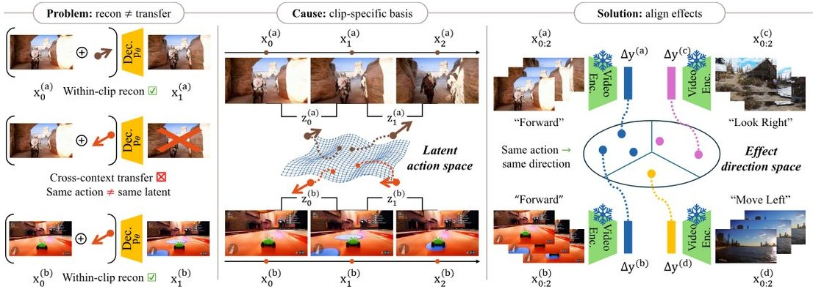

Figure 1. We present Olaf-World, an adaptable video world model pretrained with transferable latent actions learned via Seq2-REPA, enabling (A) context-invariant zero-shot action transfer, (B) efficient adaptation to new action spaces with minimal labeled data (e.g., 1 minute), and (C) improved generalization to novel scenes. Readers can click and play the video clips in this figure using Adobe Acrobat.   

## 摘要

可控动作世界模型的扩展受到动作标签稀缺的限制。尽管潜在动作学习有望从未标记的视频中提取控制接口，但所学习的潜在动作通常在不同场景中无法迁移：它们纠缠于特定场景的线索且缺乏共享坐标系统。这种情况发生的原因是标准目标仅在每个剪辑内操作，没有机制对齐不同上下文中的动作语义。我们的关键见解是，尽管动作未被观察，其语义效果是可观察的，并且可以作为共享参考。我们提出了Seq2-REPA，一种序列级控制效果对齐目标，它将集成的潜在动作锚定到来自一个冻结的自监督视频编码器的时间特征差异上。在此基础上，我们提出了Olaf-World，这是一个从大规模被动视频预训练动作条件视频世界模型的管道。大量实验表明，我们的方法学习了更结构化的潜在动作空间，导致更强的零样本动作迁移和对新控制接口的数据效率更高的适应性，超越了最先进的基线。

## 1. 引言

能够在行动下预测未来观察的世界模型（Ha & Schmidhuber, 2018；Hafner et al., 2023；Parker-Holder et al.；Garrido et al., 2024；World Labs, 2025）对于规划和交互式模拟至关重要。最近的视频生成模型（Brooks et al., 2024；Wan et al., 2025；Chen et al., 2025a；Kong et al., 2024；Peng et al., 2025；Gao et al., 2025b；Teng et al., 2025；Huang et al., 2025c；Gu et al., 2025）从互联网规模的数据中包含关于视觉和物理动态的丰富先验，使它们成为视频世界建模的有前景的主干网络。然而，将这样的模型转化为可控的模拟器通常仍然需要大规模、帧对齐的动作标签，这既成本高昂，又通常与特定领域或控制接口相关（He et al., 2025；Sun et al., 2025；Yu et al., 2025a；Team et al., 2026）。潜在动作学习（Edwards et al., 2019；Rybkin et al., 2019；Schmidt & Jiang, 2024；Ye et al., 2025）通过直接从未标记的视频中发现动作空间提供了一个可扩展的解决方案：逆动态编码器从观察到的过渡\((x_{i}, x_{i + 1})\)推断潜在动作\(z_{i}\)，而前向模型则根据过去的帧和推断的动作预测未来帧。然而，学习可转移的潜在动作仍然充满挑战。如果动作在不同上下文中保持控制语义，则认为它们是可转移的：对应于相同基础动作的过渡即使在视觉上下文（外观、视角、布局、照明等）变化时也应该产生相似的\(z_{i}\)。

Figure 2. Latent action learning. Problem: transition-based latent action models (LAMs) can reconstruct well, but fail to transfer (the same semantic action, e.g. "Forward", maps to different latent direction across contexts). Cause: the latent space is identified only up to a clip-specific basis, so there is no shared coordinate system. Solution: SeqΔ-REPA uses the observable effect direction \(\Delta g\) from a frozen video encoder as a shared reference and aligns latent actions to it, yielding consistent action semantic across contexts.   

我们识别出两种失效模式。首先，逆动态编码器通常会遭遇捷径学习（Yang et al., 2025; Garrido et al., 2026）：\(z_{i}\) 可能依赖于上下文依赖的视觉线索而非潜在的可控原因，从而将学习到的动作与场景外观混淆。其次，更根本的是，局部重建目标在不同上下文中是不可识别的（Locatello et al., 2019; Khemakhem et al., 2020; Wang et al., 2023）。由于训练局限于单个片段，模型不会被鼓励跨上下文使用共享的潜在坐标系统，因此相同的语义动作（例如，“向前移动”）在不同环境中可能对应不同的潜在方向（见图2，左侧）。这些问题共同阻止了共享控制接口的出现：相同的动作语义不必映射到潜在空间中的一致区域，从而削弱了迁移和下游可控性。为了解决这些问题，我们提出了SeqΔ-REPA，这是一种通过控制效应对齐来正则化潜在空间的序列级目标。我们的关键见解是，尽管缺乏显式动作标签，但控制的语义效应在视频中是可观察的：由相似潜在动作驱动的过渡应在不同上下文中引起类似的语义变化，尽管外观存在差异。我们通过利用一个冻结的自监督视频编码器（Tong et al., 2022; Assran et al., 2025）来正式化这一点，以根据短片段的整体语义变化定义目标效应方向（见图2，右侧）。关键的是，时间特征的差异自然抑制空间细节并强调动态变化，使得参考在上下文变化下保持稳定。SeqΔ-REPA随后将相同窗口内推断的集成潜在动作与该效应方向对齐。这提供了一个共享的全局参考，鼓励不同上下文之间一致的动作意义，并抑制对上下文特定视觉捷径的依赖。利用SeqΔ-REPA学习到的潜在动作作为一致的控制接口，我们提出了Olaf-World，一个在大规模被动视频上预训练动作条件视频世界模型的管道。由于我们表示的结构对齐，它从根本上改善了下游世界模型的能力（见图1）：(i) 上下文不变的零-shot动作迁移：在一个上下文中提取的潜在动作可以被重用于在新上下文中引起类似的控制效应。(ii) 高效的适应性：当真实标签可用时，我们学习一种轻量映射到预训练的动作空间，允许以最小的数据和参数更新进行适应。(iii) 对未见上下文的更好概括：由于潜在动作的预训练使模型暴露于多样的过渡，Olaf-World相较于从头在标注数据集上训练的模型，在新场景中的概括能力更强。总之，我们的关键贡献如下：我们表征了潜在动作学习中的跨上下文不可识别性，说明了分步重建为何无法学习可迁移的控制。我们提出了SeqΔ-REPA，一种新颖的序列级控制到效应对齐目标，锚定潜在动作轨迹与自监督视频表示导出的语义变化，鼓励上下文不变的动作语义。我们引入了Olaf-World，一个从被动视频中学习可控动作视频世界模型的预训练管道，实现了可靠的跨上下文动作迁移和以最少标注数据进行高效适应。

## 2.相关工作

## 2.1. 从视频中学习潜在动作

2. 相关工作 2.1. 从视频中学习潜在动作 潜在动作模型旨在从未标记的视频中推断潜在控制。它们被用作 (i) 交互式世界模型的统一控制接口（Bruce et al., 2024；Gao et al., 2025a；Jang et al., 2025），或作为 (ii) 策略学习的动作表示，特别是用于弥合机器人中的跨身体差距（Ye et al., 2025；Bu et al., 2025；Kim et al., 2025；Chen et al., 2025b；cy；Yang et al., 2025），以及 (iii) 支持仅观察的离线强化学习（Schmidt & Jiang, 2024；Nikulin et al., 2025）。大多数潜在动作模型学习一个逆模型，从观察到的状态转移中推断每一步的潜在变量，并使用重构或预测目标训练前解码器。已经探索了离散（基于 VQ 的）（Schmidt & Jiang, 2024；Bruce et al., 2024；Ye et al., 2025）和连续潜在（Gao et al., 2025a；Yang et al., 2025；Garrido et al., 2026）参数化方法。现有的研究认识到基于局部转移的目标对干扰因素和与动作相关的干扰物敏感，这可能导致捷径解决方案并降低下游使用效果（Nikulin et al., 2025；Bu et al., 2025；Garrido et al., 2026）。为了解决这个问题，现有方法施加潜在空间约束（Gao et al., 2025a；Garrido et al., 2026）或设计强调动作而非像素外观的目标（Chen et al., 2025c；Bu et al., 2025；Yang et al., 2025；Bi et al., 2025）。然而，这些方法在孤立片段上运行，无法保证潜在动作语义在不同环境中的一致性。SeqA-REPA 通过将潜在动作锚定到全局效果参考，借助序列级别的对齐来解决这个问题。 2.2. 视频世界模型 世界模型预测未来观测，并支持在游戏、机器人和驾驶等领域的规划或交互式仿真（Parker-Holder et al.；Agarwal et al., 2025；Gao et al., 2024；Bar et al., 2025）。大多数可控制动作的视频世界模型依赖于来自交互式游戏引擎（例如，虚幻引擎、我的世界）收集的显式控制信号，在这些引擎中，帧级键盘/鼠标输入和其他交互注释被记录为控制（Decart et al., 2024；Alonso et al., 2024；Valevski et al., 2025；Xiao et al., 2025b）。这提供了强大的可控性，但也使得学习到的模型依赖于特定的动作架构和数据收集过程（He et al., 2025；Tang et al., 2025；Sun et al., 2025；Hong et al., 2025；Team et al., 2026；Ye et al., 2026）。潜在动作世界模型直接从视频中推断控制接口，从而实现无需真实动作的交互（Bruce et al., 2024；Gao et al., 2025a；Wang et al., 2025；Garrido et al., 2026）。然而，它们的可控性和迁移能力最终取决于学习到的潜在动作空间在不同上下文中的一致性——这正是本工作所要解决的瓶颈。

## 2.2. 视频世界模型

2.2. 视频世界模型 世界模型预测未来的观测结果，并支持在游戏、机器人和驾驶等领域中的规划或交互式模拟（Parker-Holder et al.; Agarwal et al., 2025; Gao et al., 2024; Bar et al., 2025）。大多数可控行动的视频世界模型依赖于从交互式游戏引擎（例如，虚幻引擎、Minecraft）收集的显式控制信号，其中逐帧的键盘/鼠标输入以及其他交互注释被记录为控制信号（Decart et al., 2024; Alonso et al., 2024; Valevski et al., 2025; Xiao et al., 2025b）。这提供了强大的可控性，但也将学习到的模型绑定到特定的行动框架和数据收集流程上（He et al., 2025; Tang et al., 2025; Sun et al., 2025; Hong et al., 2025; Team et al., 2026; Ye et al., 2026）。潜在行动世界模型则直接从视频中推断控制接口，从而无需真实标注行动即可进行交互（Bruce et al., 2024; Gao et al., 2025a; Wang et al., 2025; Garrido et al., 2026）。然而，它们的可控性和迁移能力最终取决于所学习的潜在行动空间在不同情境中的一致性——这是瓶颈工作所解决的关键问题。

## 2.3. 表示对齐

2.3. 表示对齐 表示对齐方法将生成模型的内部特征与大型自监督编码器进行匹配，以提高语义保真度和训练效率。最初主要集中于图像生成中的空间特征（Yu et al., 2025b; Leng et al., 2025; Singh et al., 2025），最近的视频扩展则加入了时间结构，将视频生成器的内部状态与预训练视频编码器的状态进行对齐（Zhang et al., 2025; Chefer et al., 2025; Bhowmik et al., 2025）。这些方法主要旨在改善生成器的内部状态表示，以实现更高质量的合成，即实现特征间的对齐。相比之下，我们使用预训练的时空编码器（Tong et al., 2022; Assran et al., 2025）作为参考，通过匹配语义效果（特征变化）来监督潜在动作，即实现控制与效果的对齐。

## 3. 方法

我们的目标是从未标记的视频中学习一个可控行动的视频世界模型。我们将提出的Olaf-World分为两个阶段：（1）学习一个可迁移的潜在行动空间，该空间将动态与视觉上下文解耦（第3.1节），以及（2）训练一个基于这些潜在行动的条件视频生成世界模型（第3.2节）。

## 3.1. IT 交互模型

3.1. 潜在动作模型\(\beta\) - VAE。给定一个片段 \(x_{0:K}\)，我们用潜在动作 \(z_{i} \in \mathbb{R}^{d_{z}}\) 来建模每个过渡 \((x_i,x_{i + 1})\)，其中 \(i = 0, \ldots , K - 1\)。标准的潜在动作模型（Schmidt & Jiang, 2024；Gao et al., 2025a）由一个因果逆动态编码器组成，该编码器生成 \(q_{\phi}(z_i \mid x_{0:i + 1})\)，以及一个前向解码器，用于预测下一帧 \(p_{\theta}(x_{i + 1} \mid x_i, z_i)\)，以确保潜在变量捕捉到解释像素移动所需的动态。该模型通过逐步的 \(\beta\) - VAE 目标进行训练（Higgins et al., 2017；Alemi et al., 2017）：

\[\mathcal{L}_{\theta ,\phi}^{VAE} = \frac{1}{K}\sum_{i = 0}^{K - 1}\Big(-\mathbb{E}_{q_{\phi}(z_i\mid x_{0:i + 1})}\big[\log p_\theta (x_{i + 1}\mid x_i,z_i)\big]\] \[+\beta \operatorname {KL}\big(q_\phi (z_i\mid x_{0:i + 1})||p(z_i)\big)\big),\]  

其中 \(p(z_i)\) 是固定的先验 \(\kappa (0,I)\)。虽然公式 (1) 可以实现较低的一步预测误差，但这并不足以确保跨上下文语义一致的动作空间。我们总结了两种失效模式：(i) 快捷学习（上下文泄露）：由于后验条件依赖于 \(x_{i + 1}\) 的 \(q_{\phi}(z_{i}\mid x_{0:i + 1})\)，一个具有表现力的解码器可以通过编码与 \(x_{i + 1}\) 相关联的上下文依赖线索来减少损失，而不是将可转移的控制信息编码到 \(z_{i}\) 中。(ii) 跨上下文非可识别性：由于损失从未比较跨轨迹的潜变量，潜变量坐标系统没有约束，可能会在上下文之间漂移。

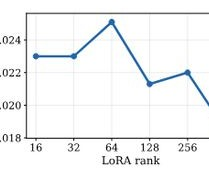

Figure 3. Overall pipeline. (a) We train a latent action model (LAM) and encourage cross-context consistency by aligning action effects in a frozen video-feature space using SeqΔ-REPA. (b) We then apply the frozen LAM to unlabeled videos to extract latent-action sequences, and use them as a unified control interface to pretrain an action-conditioned video world model.   

相同的语义运动可能在不同视频中映射到潜在空间的不同方向，从而破坏迁移效果（详见附录A中的正式讨论）。

## Seqe-REPA.

为了消除这些歧义，我们引入了一种序列级别的对齐约束，将潜在动作锚定到一个可以跨视频和上下文进行比较的效果信号上（见图3a）。令 \(f\) 为一个冻结的自监督视频编码器（例如，V-JEPA2 ViT (Assran et al., 2025)）。给定 \(x_{0:K}\)，它输出时空视觉词元，我们通过空间池化获得每帧描述符 \(s_i \in \mathbb{R}^D\)。我们将剪辑的效果方向定义为特征变化的净方向：

\[\tau_{*} = \frac{1}{K}\sum_{i = 0}^{K - 1}\left(s_{i + 1} - s_{i}\right)\in \mathbb{R}^{D}. \quad (2)\]  

因为 \(\tau_{*}\) 是通过时间差计算并在时间上进行平均，因此它强调特征空间中的一致时间变化，而 \(\Delta s\) 对静态外观的敏感度较低。在潜在动作方面，逆模型推断出一系列潜在动作 \(z_{0:K - 1}\)。我们将它们聚合并映射到编码器特征空间：

\[\bar{z} = \frac{1}{K}\sum_{i = 0}^{K - 1}z_{i}\in \mathbb{R}^{d_{z}},\qquad u = h_{\psi}(\bar{z})\in \mathbb{R}^{D}, \quad (3)\]  

其中 \(h_{\psi}:\mathbb{R}^{d_{z}}\to \mathbb{R}^{D}\) 是一个可训练的多层感知机投影头。接着，我们使用余弦相似度将集成控制方向 \(u\) 与效果方向 \(\tau_{*}\) 对齐：

\[\mathcal{L}_{\psi}^{\mathrm{S e q}\Delta \cdot \mathrm{R E P A}} = 1 - \langle \mathrm{norm}(u),\mathrm{norm}(\tau_{*})\rangle . \quad (4)\]  

与特征到特征的对齐不同，公式(4)施加了控制到效果的约束：它将集成的潜在控制与共享的语义变化概念对齐，鼓励在不同上下文中保持一致的动作意义。最终训练目标。我们用以下式子训练 \((\theta ,\phi ,\psi)\)：

\[ \mathcal{L}_{\mathrm{LAM}} = \mathcal{L}_{\theta ,\phi}^{\mathrm{VAE}} + \lambda \mathcal{L}_{\psi}^{\mathrm{Seq}\Delta}\mathrm{-REPA}, \]其中\(\{u\} = \{u\}\)是潜在方向的序列，我们使用潜在方向的集合 \(t_{1},\ldots ,t_{M}\)，即\(\{(u)\}_{i = 1}^{N}\)是潜在方向，\(\{x_{j}\}_{j = 1}^{M}\)是潜在方向，\(\{u_{j}\}_{j = 1}^{M}\)是潜在方向，\(\{x_{j}\}_{j = 1}^{M}\)是潜在方向，且\(\{x_{j}\}_{j = 1}^{M}\}_{i = 1}^{M}\)，即\(\{u_{j}\}_{j = 1}^{M}\}_{i = 1}^{M}\)，即\(\{u_{j}\}_{j = 1}^{M}\}_{i = 1}^{M}\)，即\(\{u_{j}\}_{j = 1}^{M}\}_{j = 1}^{M}\}_{j = 1}^{M}\}_{j = 1}^{M}\}_{j = 1}^{F}\)，同时保持参考编码器 \(f\) 冻结，且\(\lambda >0\) 是损失权重。

## 3.2. Olaf-World

动作感知预训练。给定一段视频 \(x_{0:T}\)，冻结的 LAM 生成每帧的潜在动作 \(z_{0:T-1}\in \mathbb{R}^{d_z}\)。我们基于一个预训练的潜在图像到视频扩散变换器（DiT）（Peebles & Xie, 2023；Chen 等，2025a）并使用标准的流匹配目标（Liu 等，2023）在与潜在动作配对的帧序列上进行训练（见图 3b）。每帧 \(z_{t}\) 被线性投影并添加到扩散时间步嵌入中。融合的嵌入随后映射到每个块的 \(\mathrm{AdaLAN}\)-Zero 调制参数，以条件化每个 DiT 块（Peebles & Xie, 2023）。由于主干网络基于由 3D 视频变分自编码器编码的潜在向量进行操作，输入视频的时间压缩因子为 \(r = 4\)（Wan 等，2025；Chen 等，2025a）。因此，我们将每 \(r\) 个连续的逐步动作分组为一个潜在时间条件向量，遵循 Yu 等（2025a）。结果，世界模型受到 LAM 潜在向量的条件影响，提供了一个统一的控制接口，可以在具有不同原始动作约定的环境之间进行迁移。

特定世界适应。在一个目标交互环境中，我们观察来自特定环境的显式真实动作 \(a_{t}\) ，这些动作源自于环境特定的动作空间。我们学习一个小型动作适配器 \(A_{\eta}\) ，将环境动作映射到潜在动作：\(\hat{z}_{t} = A_{\eta}(a_{t})\) ，并使用 \(\hat{z}_{t}\) 控制预训练的世界模型。对于离散动作集 \(\mathcal{A}\) ，\(A_{\eta}\) 可以实现为一个嵌入表 \(E \in \mathbb{R}^{|\mathcal{A}|\times d_z}\) ，其中 \(\hat{z}_{t} = E[a_{t}]\) 。我们用从目标数据计算得到的类别原型初始化 \(E\) ：对于每个动作 \(a \in \mathcal{A}\) ，我们在标记为 \(a\) 的片段上运行冻结的 LAM，并将 \(E[a]\) 设置为平均推断的潜在动作。然后我们对 (i) 动作适配器和 (ii) 在主干网络上使用相同的流匹配目标微调一个小型 LoRA。这快速将模型专门化到新的动作空间，同时保留从被动视频中学习到的全局对齐的潜在控制语义。

# 4. 实验

4. 实验 我们通过大量实验验证了 Seq-REPA 的性能以及更优潜在行为对下游应用的影响。特别地，我们探讨以下问题：RQ1（结构）：学习到的潜在变量是否编码了可线性解码并在不同领域间一致的行动语义？（第 4.2 节）RQ2（转移）：这种对齐是否使得零样本控制转移到新环境成为可能？（第 4.3 节）RQ3（适应）：对齐的潜在空间是否能够实现对特定控制接口的数据高效适应？（第 4.4 节）

### 4.1. 实验设置

数据集。我们在MiraData Ju等人（2024）的3D渲染和城市步行类别上训练潜在动作模型和基于动作的世界模型。为了进行特定世界适应和控制评估，我们使用MIND（Ye等人，2026），这是一个在虚幻引擎5中收集的、具有帧对齐动作标签的开放域数据集。MIND包含两个不同的子集，具有不同的场景和相机 rig：第一人称（1ST-P）和第三人称（3RD-P）。两者共享相同的8个动作标签空间：导航（W/S/A/D：前进/后退/左转/右转）和相机控制（(+/<-/->：向上/向下/向左/向右）。这种划分使我们能够严格测试在外观变化和视点变化下的跨上下文转移。实现细节。我们的潜在动作编码器是一个具有因果时间注意机制的时空Transformer，潜在维度为\(d_{z} = 32\)。它的训练窗口大小为\(K = 16\)和\(\lambda = 0.02\)。我们的世界模型基于SkyReels-V2-1.3B 1ZV DiT主干（Chen等人，2025a），在\(540\mathrm{p}\)上对\(T = 97\)帧（25帧潜在帧）的视频片段进行训练。所有实验在NVIDIA H200 GPU上进行。附录B提供了更多实现细节。基准。我们与AdaWorld（Gao等人，2025a）进行比较，后者是一个最先进的潜在动作世界模型。为了进行控制比较，我们使用与我们的模型相同的视频模型主干、数据和训练/适应预算，运行AdaWorld，同时保持其官方的潜在动作训练流程和配置不变。因此，差异能隔离潜在动作学习目标的影响。评估。我们评估潜在动作结构（探测^+原型相似性）、转移（动作序列转移）和适应（VBench（Huang et al.，2024）^+ RPE（Hong et al.，2025））。每个部分提供协议和指标细节，完整实现见附录C。

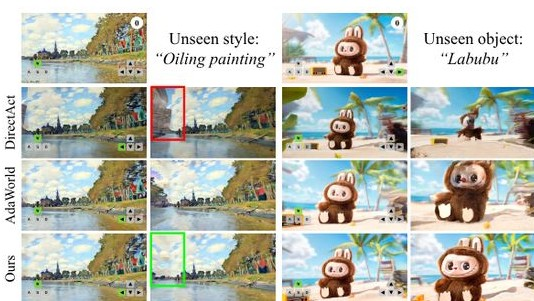

(a) 探测：1st→{lst, 3rd} (b) 探测：3rd→{3rd, 1st}。图4. 培训过程中的领域内/跨领域线性探测。表I. 领域内/跨领域线性探测（宏观F1,↑）。灰色列表示跨领域探测（源→目标）。

<table><tr><td>Method</td><td>1st→1st</td><td>1st→3rd</td><td>3rd→3rd</td><td>3rd→1st</td></tr><tr><td>AdaWorld</td><td>0.6004</td><td>0.4820</td><td>0.4827</td><td>0.4999</td></tr><tr><td>Ours</td><td>0.8138</td><td>0.6250</td><td>0.8256</td><td>0.5904</td></tr></table>  

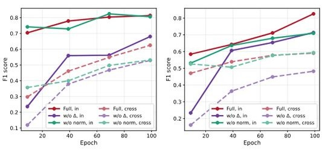

Figure 5. Cross-domain action similarity. Cosine similarity between per-action prototypes from 1sT-P (rows) and 3RD-P (columns). Seq-REPA produces a more diagonal-dominant matrix (stronger one-to-one matching across contexts).   

### 4.2. 潜在空间诊断

#### 4.2.1.跨上下文线性探测

设置。我们评估学习到的潜在动作空间 \(z_{t}\) 是否具有线性可分性和对领域转移的不变性。依据 Zhang 等人 (2022)，我们训练一个线性探针，从每个检查点的 \(z_{t}\) 预测 8 个基本动作。为测试上下文不变性，我们使用跨领域探测协议：在 1ST-P 上训练和验证探针，通过领域内验证的 F1 分数选择最佳检查点，然后在 \(3\mathrm{RD - P}\) 上对相同探针进行零样本评估。我们重复逆向过程 (3RD-P→1ST-P)。我们报告宏观 F1 值以进行类别平衡比较。结果。图 4 显示 Seq-REPA 学习到的潜在动作在更具线性可解性和上下文不变性方面都有所提高。在各个检查点中，Olaf-World 的领域内宏观 F1 值更高，并且表现稳定优于其他方法。

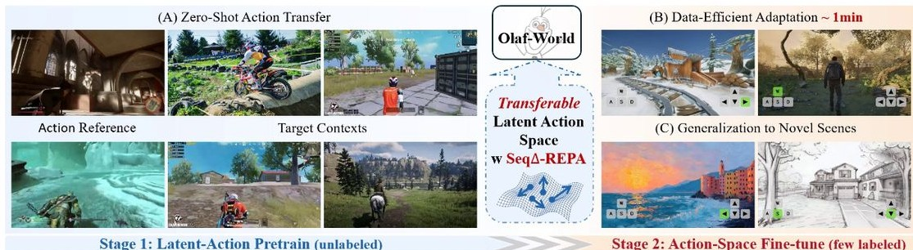

Figure 6. Zero-shot action-sequence transfer. We extract an action sequence from a reference clip (top) and apply it zero-shot to a different target context. AdaWorld often shows temporal wash-out, agent drop-out, and motion drift, whereas Olaf-World performs better in target appearance preservation and motion faithfulness. Numbers denote frame indices. See the project page for video comparisons.   

在跨领域双向评估中，AdaWorld（1ST- P \(\leftrightarrow 3\mathbb{R}\mathbb{D} = \mathbb{P}\)）表明行动语义在视角和外观变化中的对齐得到改善。值得注意的是，在更具挑战性的3RD- P子集上进行探测时，性能提升最大，AdaWorld在低Macro- F1时饱和，而我们的模型仍维持显著更高的值（见表1）。此外，通过对齐效应方向，我们的方法促进了早期学习，并减少了训练过程中的波动，从而产生了更稳定和可转移的潜在结构。

#### 4.2.2.跨上下文动作一致性

设置。为了测试动作语义在不同上下文中的一致性，我们在每个领域内单独计算动作原型（类别质心），并可视化原型之间的跨领域余弦相似度（1ST-P 为行，3RD-P 为列）。一个良好的对齐潜在空间应该是对角主导的，即每个 1ST-P 动作与其 3RD-P 对应动作是最相似的。结果。图5比较了 1ST-P 和 3RD-P 之间跨上下文原型相似度。Aadworld 基线（图5a）在各个地方显示出高相似度，这意味着 1ST-P 中的不同动作往往与多个 3RD-P 中的动作“相似”。这表明在上下文转换下，潜在空间并非独特的动作特定，即跨上下文的可辨识性较弱。相反，我们的方法（图5b）明显更具对比性：匹配的动作保持高相似度，而不匹配的对则被推向接近零或负值。这表明 SeqA-REPA 学习到了在视角和外观变化下更一致和可转移的动作语义。剩下的混淆出现在偏航“看”动作 \((\leftarrow /\rightarrow)\)上，这被预期为较少对齐，因为相同的控制在自我中心与第三人称摄像机下实际上引导不同的可观察动作。

### 4.3. 零样本动作转移

设置。我们定性评估模型在多大程度上无视视觉上下文而遵循控制信号 \(z_{t}\)。我们从参考片段中提取潜在动作序列 \(zou_{T}\)，并利用该序列从不同的目标初始帧进行生成。成功的转移需要在保持目标外观的同时再现参考运动。结果。图6表明，Olaf-World 更可靠地转移动作序列，同时更好地保持目标上下文。在所有四种情况下，AdaWorld 在转移中通常表现不佳：它表现出 (i) 时间洗出和不稳定性 (A)，(ii) 失去受控角色或规模漂移 (B,D)，以及 (iii) 轨迹漂移至偏离参考的广义动作 (C)。相比之下，Olaf-World 在忠实执行预期运动的同时，保持了场景和主体的持续性。总体而言，这些结果表明

Table 2. Adapting world models to target control domains with different amounts of labeled data (#Adapt Videos). We report VBench visual metrics (↑) and action accuracy via RPE (). Olaf-World achieves the lowest RPE in all settings, indicating the most faithful action following. Best per domain and budget is in bold.   

<table><tr><td rowspan="3">Method</td><td colspan="2" rowspan="2"># Adapt Videos</td><td colspan="3">1ST-P</td><td colspan="3">3RD-P</td></tr><tr><td colspan="2">Visual Quality</td><td>Action Accuracy (RPE)</td><td colspan="2">Visual Quality</td><td>Action Accuracy (RPE)</td></tr><tr><td colspan="3">Image Qual. ↑</td><td>Temp. Cons. ↑</td><td>Trans ↓</td><td>Rot. ↓</td><td>Image Qual. ↑</td><td>Temp. Cons. ↑</td></tr><tr><td>DirectAct</td><td>0.7213</td><td>0.8993</td><td>0.0703</td><td>1.4311</td><td>0.6970</td><td>0.9086</td><td>0.0897</td><td>0.7968</td></tr><tr><td>AdaWorld</td><td>0</td><td>0.5600</td><td>0.9226</td><td>0.0470</td><td>1.0844</td><td>0.6102</td><td>0.9344</td><td>0.0723</td></tr><tr><td>Ours</td><td>0.5400</td><td>0.9123</td><td>0.0387</td><td>0.8773</td><td>0.5909</td><td>0.9203</td><td>0.0461</td><td>0.4873</td></tr><tr><td>DirectAct</td><td>0.5269</td><td>0.8828</td><td>0.0672</td><td>1.2822</td><td>0.6019</td><td>0.8851</td><td>0.0708</td><td>0.8543</td></tr><tr><td>AdaWorld</td><td>1</td><td>0.5623</td><td>0.8955</td><td>0.0318</td><td>0.6420</td><td>0.6033</td><td>0.8989</td><td>0.0525</td></tr><tr><td>Ours</td><td>0.5726</td><td>0.9015</td><td>0.0284</td><td>0.4680</td><td>0.5844</td><td>0.8974</td><td>0.0348</td><td>0.3861</td></tr><tr><td>DirectAct</td><td>0.5936</td><td>0.9345</td><td>0.0351</td><td>0.4527</td><td>0.6265</td><td>0.9286</td><td>0.0402</td><td>0.3846</td></tr><tr><td>AdaWorld</td><td>50</td><td>0.6177</td><td>0.9239</td><td>0.0263</td><td>0.3834</td><td>0.6459</td><td>0.9306</td><td>0.0393</td></tr><tr><td>Ours</td><td>0.6312</td><td>0.9263</td><td>0.0230</td><td>0.3785</td><td>0.6486</td><td>0.9287</td><td>0.0222</td><td>0.2082</td></tr></table>  

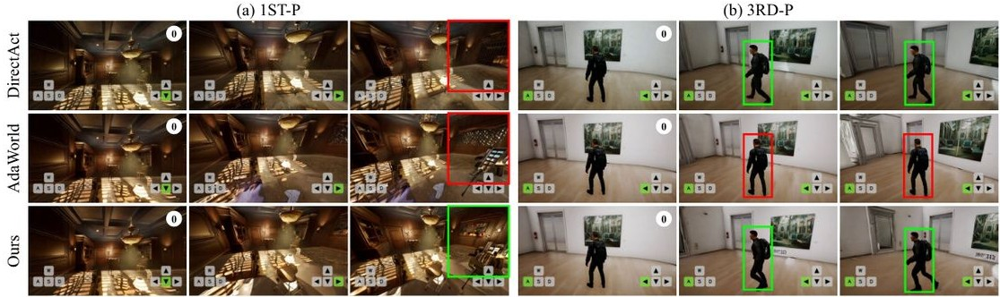

Figure 7. Qualitative comparison of action-conditioned generation after adaptation. Given the same initial frame and action sequence, Olaf-World follows controls more faithfully and preserves appearance consistency as new regions are revealed. Actions are transition-aligned: \(a_{t}\) corresponds to the change from \(x_{t}\) to \(x_{t + 1}\) . Zoom in for details.  

Seq A- REPA 生成的控制信号在大型语境变化下保持特定于某一动作的语义。附录 E 中提供了更多示例。

### 4.4. 世界模型适应性

### 4.4.1. 数据高效适应性

设置：我们研究如何在有限标注交互的情况下，高效地将预训练的视频世界模型适应于目标控制接口。我们比较了以下方法：（a）DirectAct，直接基于真实标注的动作进行条件化；（b）Ada-World，采用Vanilla \(\beta\)-VAE进行潜在动作预训练；（c）Olaf World，采用\(\beta\)-VAE + Seq A-REPA进行潜在动作预训练。所有方法使用相同的视频主干网络和适应能力（LoRA秩为16，步数和优化器匹配）。我们改变标注适应集的大小（#适应视频 \(\in \{0,1,50\}\)；分别约为0分钟、1分钟和2小时）。我们使用VBench（Huang et al.，2024）衡量视频质量，并根据Hong et al.（2025）使用平移和旋转相对位姿误差（RPE）衡量可控性。定量结果：表2显示，Olaf-World在所有适应预算下，在1ST-P和3RD-P上都取得了最低的RPE-trans和RPE-rot，表明其动作跟随最为忠实。与AdaWorld相比，Olaf-World在保持可比视频质量的同时，持续提高了可控性，表明Seq A-REPA学习了更易于适应的潜在控制表示。由于没有视频，DirectAct降级为标准的图像到视频生成，解释了其视觉评分较高，但可控性信息不足。通过动作监督后，DirectAct有所改进，但在相同的秩为16的LoRA设置下，仍然比潜在动作预训练的可控性差。我们预计在更大的适应容量下（例如，更高的LoRA秩或完全微调）这一差距会缩小。定性结果：图7与定量趋势一致。在完全适应（50个视频）后，Olaf-World更可靠地跟随预期控制，并保持生成的世界视觉上一致：当相机转动或智能体向侧面移动时，新出现区域的合成细节稳定，与初始帧匹配（图7左侧）。相比之下，AdaWorld在多键控制下表现不够可靠（例如，3RD-P转动-左移）：推演过程中往往旋转而没有期望的左侧运动，导致动作条件生成的忠实度降低。

Table 3. Generalization to unseen visual contexts after adaptation. Olaf-World achieves the lowest RPE, indicating the most faithful action following under appearance shift.

Figure 8.Qualitative generalization under unseen contexts. Left: baselines often break style consistency when completing newly revealed regions, while Right: baselines show subject drift, whereas Olaf-World better preserves a stable appearance under the same action sequence. Zoom in for details.

4.4.2. 泛化到未知上下文

<table><tr><td rowspan="2">Model</td><td colspan="2">Visual &amp;amp; Temporal Quality</td><td colspan="2">Action Accuracy (RPE)</td></tr><tr><td>Image Qual. ↑</td><td>Temp. Cons. ↑</td><td>Trans ↓</td><td>Rot. ↓</td></tr><tr><td>DirectAct</td><td>0.6322</td><td>0.8585</td><td>0.0547</td><td>1.2343</td></tr><tr><td>AdaWorld</td><td>0.6181</td><td>0.8719</td><td>0.0482</td><td>1.7063</td></tr><tr><td>Ours</td><td>0.6274</td><td>0.8743</td><td>0.0478</td><td>1.2221</td></tr></table>   

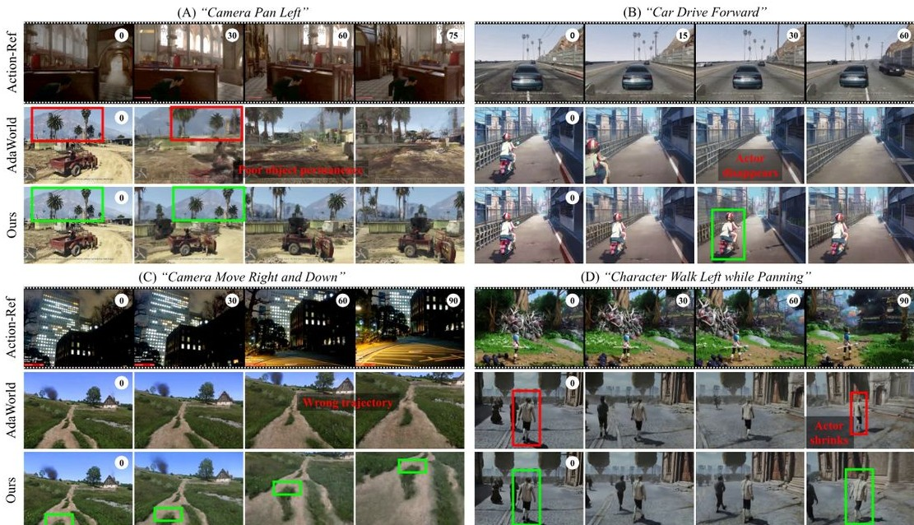

Figure 8. Qualitative generalization under unseen contexts. Left: baselines often break style consistency when completing newly revealed regions, while Right: baselines show subject drift, whereas Olaf-World better preserves a stable appearance under the same action sequence. Zoom in for details.   

#### 4.4.2. 泛化到未见上下文

设置。我们评估在测试时适应后的模拟器在探索多样化视觉世界时是否保持可靠性。使用第4.4.1节中的完全适应模型（1ST-P动作空间），我们构建了一个包含50个初始帧的OOD测试集，涵盖多样化的风格和场景。我们报告相同的指标。定量结果。表3显示，Olaf-World在未见视觉上下文下保持最佳的可控性，实现了最低的RPE。这表明所学习的潜在控制在外观变化时仍然可用，而不是对适应视觉产生过拟合。定性结果。图8突出了两个代表性案例。在未见风格中，基线模型在相机移动时常常打破风格一致性，幻想出新揭示的区域。在未见物体中，基线模型在物体身份保持上挣扎，同时使物体的姿态/尺度/视角以符合指令动作的方式演变。Olaf-World在保持外观一致性的同时，在相同的动作序列下产生与动作一致的变化。总体而言，这些结果表明潜在动作预训练提高了动作条件动态的OOD鲁棒性。

## 4.5.消融研究

Seq- △- REPA设计。我们剔除了Seq- △- REPA中的关键设计选择：(i) \(\mathbf{w} / \mathbf{o}\Delta\)，该设计对齐静态特征而非效果方向；(ii) 去除归一化，移除了\(\ell_{2}\) 归一化并将余弦对齐替换为尺度敏感的MSE损失。图9报告了与第4.2.1节相同协议下的内部/跨上下文线性探测。去除\(\Delta\)导致宏观F1明显下降（见表4），这表明对齐静态特征使得上下文依赖的空间线索渗透到动作表征中，从而使得探测结果在不同领域之间变得不那么可分且一致性大大降低。没有归一化，特征对齐变得对特征幅度敏感，而特征幅度在不同领域间可能会有所变化。这使得学习到的潜在变量不稳定，导致在两个领域之间的性能不可靠。总体而言，完整的目标在各个领域中表现最佳且最一致，支持Seq- \(\Delta\) - REPA通过对齐动作效果与稳定的、尺度不变的相似性来提高迁移性能。附录D提供了额外的消融研究。

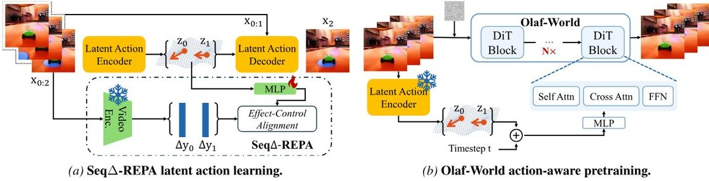

Figure 9. Ablations of Seq-△-REPA on in-/cross-context linear probing. Solid: in-domain; dashed: cross-domain evaluation.   

Table 4. Seq-△-REPA ablations (Macro-F1, \(\uparrow\) -). Gray columns denote cross-domain probing (source→target).   

<table><tr><td>Method</td><td>1st→1st</td><td>1st→3rd</td><td>3rd→3rd</td><td>3rd→1st</td></tr><tr><td rowspan="2">w/o Δ  w/o norm  Full</td><td>0.6805</td><td>0.5287</td><td>0.7137</td><td>0.4823</td></tr><tr><td>0.8064</td><td>0.5311</td><td>0.7096</td><td>0.5934</td></tr><tr><td></td><td>0.8138</td><td>0.6250</td><td>0.8256</td><td>0.5904</td></tr></table>  

## 5. 结论

我们识别出无监督潜在动作学习中的一个关键限制：跨上下文非可识别性。逆动力学目标并不能识别全局动作基础，导致上下文交缠的潜在变量传递效果较差。我们提出了Seq-△-REPA，一种序列级目标，它将潜在动作锚定到通过自监督视频编码器测得的特征差异的动作效果上，鼓励上下文不变的语义。在这些潜在变量的基础上，我们引入了Olaf-World，这是一种可扩展的潜在动作世界建模框架，能够改善零-shot动作迁移，并实现对新控制空间的数据高效适应。未来的工作。在机器人领域，效果对齐的潜在动作可以作为可转移的技能，通过特定于体现的动作到技能适配器将不同实现方式连接起来，例如，人类→机器人。我们在附录F中提供了更多讨论。

# 影响声明

影响声明 本文展示的工作旨在推动机器学习领域的发展。我们的研究可能带来多种社会影响，然而我们认为这些影响无需在此特别强调。

## References  

Agarwal, N., Ali, A., Bala, M, Balaji, Y., Barker, E., Cai, T., Chattopadhyay, P, Chen, Y., Cui, Y, Ding, Y., et al. Cosmos world foundation model platform for physical ai. arXiv preprint arXiv:2501.03575,2025. Alemi, A.A.,Fischer, I., Dillon, J.V., and Murphy, K.Deep variational information bottleneck. In ICLR,2017. Alonso,E., JLLey, A., Micheli, V.,Kanervisto, A.,Storkey, A.J., Pearce, T., and Fleuret, F. Diffusion for world modeling: Visual details matter in atari. NeurIPS, 2024. Assran,M., Baron,A.Fan,D.Garrido,Q.Howes,R. Muckley,M.,Rizvi, A.,Roberts, C., Sinha,K.Zholus, A., et al. V- JEPA 2: Self- supervised video models enable understanding, prediction and planning. arXiv preprint arXiv:2506.09985,2025.  

Far, A., Zhou, G., Tran, D., Darrell, T., and LeCun, Y. Navigation world models. In CVPR, 2025.  

Blowumik, A.,Korzhenkov, D., Snoek, C.G.,Habiian, A. and Ghafoorian, M. MoAlign: Motion- centric representation alignment for video diffusion models. arXiv preprint arXiv:2510.19022,2025. Bi, H. Tan,H. Xie,S.WangZ. Huang S.,Liu,H. Zhao, R., FengY., XiangC., Rong, Y.,et al. Motus:A unified latent action world model. arXiv preprint arXiv:2512.13030,2025.  

Brooks, T., Peebles, B., Holmes, C., DePue, W., Guo, Y., Jing, L., Schnurr, D., Taylor, J., Luhman, T., Luhman, E.Ng, C., Wang, R., and Ramesh, A.Video generation models as world simulators. 2024. URL https://openai.com/research/ video- generation- models- as- world- simulators/  

Bruce, J., Dennis, M. D., Edwards, A., Parker- Holder, J., Shi, Y., Hughes, E., Lai, M., Mavalankar, A., Steigerwald, R., Apps, C., et al. Genie: Generative interactive environments. In ICML, 2024.  

BuQ.Yang,Y.Cai J.Gao S.RenG. YaoM.Luo, P, and Li, H. UniVLA: Learning to act anywhere with taskcentric latent actions. arXiv preprint arXiv:2505.06111, 2025.  

Cohen, G., Lin, D., Yang, J., Lin, C., Zhu, J., Fan, M., Zhang, H., Chen, S., Chen, Z., Ma, C., et al. SkyReels- V2: Infinite- length film generative model. arXiv preprint arXiv:2504.13074,2025a. Chen X., Wei, H., Zhang,P., Zhang,C., Wang, K., Guo, Y., Yang, R., Wang, Y., Xiao, X., Zhao, L., et al.  villax: enhancing latent action modeling in vision- languageaction models. arXiv preprint arXiv:2507.23682,2025b. Chen, Y., Ge, Y., Tang, W., Li, Y., Ge, Y., Ding, M., Shan, Y., and Liu, X. Moto: Latent motion token as the bridging language for learning robot manipulation from videos. In ICCV, 2025c. Decart, Quevedo, J., McIntyre, Q., Campbell, S., Dehn, X., and Wachen,R.Oasis:A universe in a transformer.2024. URL https://oasis- model.github.io. Edwards, A., Sahni, H., Schroecker, Y., and Isbel, C. Imitating latent policies from observation. In ICML, 2019. Gao, S., Yang, J., Chen, L., Chitta, K., Qiu, Y., Geiger, A., Zhang, J., and Li, H. Vista: A generalized driving world model with high fidelity and versatile controllability. NeurIPS, 2024. Gao, S., Zhou, S., Du, Y., Zhang, J., and Gan, C. AdaWorld: Learning adaptable world models with latent actions. In ICML, 2025a. Gao, Y., Guo, H., Hoang, T., Huang, W., Jiang, L., Kong, F., Li, H., Li, J., Li, L., Li, X., et al. Seedance 1.0: Exploring the boundaries of video generation models. arXiv preprint arXiv:2506.09113,2025b. Garrido, Q., Assran, M., Ballas, N., Borges, A., Najman, L., and LeCun, Y. Learning and leveraging world models in visual representation learning. arXiv preprint arXiv:2403.00504,2024. Garrido, Q., Nagarajan, T., Terver, B., Ballas, N., LeCun, Y., and Rabbat, M. Learning latent action world models in the wild. arXiv preprint arXiv:2601.05230,2026. Gu, Y., Mao, W., and Shou, M. Z. Long- context autoregressive video modeling with next- frame prediction. arXiv preprint arXiv:2503.19325,2025. Gumbsch, C., Sajid, N.,Murtius, G, and Butz, M. V. Learning hierarchical world models with adaptive temporal abstractions from discrete latent dynamics. In ICLR, 2024.

Ha, D. and Schmidhuber, J. World models. arXiv preprint arXiv:1803.10122, 2018.   Hafner, D., Lee, K.- H., Fischer, I., and Abbeel, P. Deep hierarchical planning from pixels. NeurIPS, 2022.   Hafner, D., Pasukonis, J., Ba, J., and Lillicrap, T. Mastering diverse domains through world models. arXiv preprint arXiv:2301.04104, 2023.   He, X., Peng, C., Liu, Z., Wang, B., Zhang, Y., Cui, Q., Kang, F., Jiang, B., An, M., Ren, Y., Xu, B., Guo, H.- X., Gong, K., Wu, C., Li, W., Song, X., Liu, Y., Li, E., and Zhou, Y. Matrix- Game 2.0: An open- source, real- time, and streaming interactive world model. arXiv preprint arXiv:2508.13009, 2025.   Higgins, I., Matthew, L., Pal, A., Burgess, C., Glorot, X., Botvinick, M., Mohamed, S., and Lerchner, A. beta- VAE: Learning basic visual concepts with a constrained variational framework. In ICLR, 2017.   Hong, Y., Mei, Y., Ge, C., Xu, Y., Zhou, Y., Bi, S., Hold- Geoffroy, Y., Roberts, M., Fisher, M., Shechtman, E., et al. RELIC: Interactive video world model with long- horizon memory. arXiv preprint arXiv:2512.04040, 2025.   Huang, H.- P., Su, Y.- C., and Yang, M.- H. Generating longitude videos via effective keyframes and guidance. In WACV, 2025a.   Huang, J., Zhou, Q., Rabeti, H., Korovko, A., Ling, H., Ren, X., Shen, T., Gao, J., Slepichev, D., Lin, C.- H., et al. ViPE: Video pose engine for 3d geometric perception. arXiv preprint arXiv:2508.10934, 2025b.   Huang, X., Li, Z., He, G., Zhou, M., and Shechtman, E. Self forcing: Bridging the train- test gap in autoregressive video diffusion. arXiv preprint arXiv:2506.08009, 2025c.   Huang, Z., He, Y., Yu, J., Zhang, F., Si, C., Jiang, Y., Zhang, Y., Wu, T., Jin, Q., Chanpaisit, N., et al. VBench: Comprehensive benchmark suite for video generative models. In CVPR, 2024.   Huang, Z., Yu, N., Chen, G., Qiu, H., Debevec, P., and Liu, Z. VICV: Chain- of- visual- thought for reasoning in video generation. arXiv preprint arXiv:2510.05094, 2025d.   Jang, J., Ye, S., Lin, Z., Xiang, J., Bjorck, J., Fang, Y., Hu, F., Huang, S., Kundalia, K., Lin, Y.- C., et al. DreamGen: Unlocking generalization in robot learning through video world models. arXiv preprint arXiv:2505.112705, 2025.   Jiang, Y., Jiang, L., Yang, S., and Loy, C. C. Scenimefy: Learning to craft anime scene via semi- supervised image- to- image translation. In ICCV, 2023.  

Ju, X., Gao, Y., Zhang, Z., Yuan, Z., Wang, X., Zeng, A., Xiong, Y., Xu, Q., and Shan, Y. Miradata: A large- scale video dataset with long durations and structured captions. NeurIPS, 2024.  Khemakhem, I., Kingma, D., Monti, R., and Hyvarinen, A. Variational autoencoders and nonlinear ica: A unifying framework. In AISTATS, 2020.  Kim, H., Kang, J., Kang, H., Cho, M., Kim, S. J., and Lee, Y. UniSkill: Imitating human videos via cross- embodiment skill representations. arXiv preprint arXiv:2505.08787, 2025.  Kong, W., Tian, Q., Zhang, Z., Min, R., Dai, Z., Zhou, J., Xiong, J., Li, X., Wu, B., Zhang, J., et al. HunyuanVideo: A systematic framework for large video generative models. arXiv preprint arXiv:2412.03603, 2024.  Le, M.- Q., Zhu, Y., Kalogeiton, V., and Samaras, D. What about gravity in video generation? post- training newton's laws with verifiable rewards. arXiv preprint arXiv:2512.00425, 2025.  Leng, X., Singh, J., Hou, Y., Xing, Z., Xie, S., and Zheng, L. REPA- E: Unlocking vae for end- to- end tuning with latent diffusion transformers. arXiv preprint arXiv:2504.10483, 2025.  Li, Y., Angel, M. C., Khan, S., Zhu, Y., Sun, J., Zhang, Y., and Khan, F. S. C- Drag: Chain- of- thought driven motion controller for video generation. arXiv preprint arXiv:2502.19868, 2025.  Liu, X., Gong, C., and qiang liu. Flow straight and fast: Learning to generate and transfer data with rectified flow. In ICLR, 2023.  Locatello, F., Bauer, S., Lucic, M., Raetsch, G., Gelly, S., Scholkopf, B., and Bachem, O. Challenging common assumptions in the unsupervised learning of disentangled representations. In ICML, 2019.  Nikulin, A., Zisman, I., Tarasov, D., Nikita, L., Polubarov, A., Kiselev, I., and Kurenkov, V. Latent action learning requires supervision in the presence of distractors. In ICML, 2025.  Parker- Holder, J., Fruchter, S., et al. Genie 3: A new frontier for world models. https://deepmind.google/discover/blog/genie- 3- a- new- frontier- for- world- models/. Blog post.  Peebles, W. and Xie, S. Scalable diffusion models with transformers. In ICCV, 2023.

Peng, X., Zheng, Z., Shen, C., Young, T., Guo, X., Wang, B., Xu, H., Liu, H., Jiang, M., Li, W., et al. Open- Sora 2.0: Training a commercial- level video generation model in \(\)200\(k. arXiv preprint arXiv:2503.09642, 2025.  Rybkin, O., Pertsch, K., Jaegle, A., Derpanis, K. G., and Daniilidis, K. Learning what you can do before doing anything. In ICLR, 2019.  Schmidt, D. and Jiang, M. Learning to act without actions. In ICLR, 2024.  Singh, J., Leng, X., Wu, Z., Zheng, L., Zhang, R., Shechtman, E., and Xie, S. What matters for representation alignment: Global information or spatial structure? arXiv preprint arXiv:2512.10794, 2025.  Sun, W., Zhang, H., Wang, H., Wu, J., Wang, Z., Wang, Z., Wang, Y., Zhang, J., Wang, T., and Guo, C. WorldPlay: towards long- term geometric consistency for real- time interactive world modeling. arXiv preprint arXiv:2512.14614, 2025.  Tang, J., Liu, J., Li, J., Wu, L., Yang, H., Zhao, P., Gong, S., Yuan, X., Shao, S., and Lu, Q. Hunyuan- GameCraft2: Instruction- following interactive game world model. arXiv preprint arXiv:2511.23429, 2025.  Team, R., Gao, Z., Wang, Q., Zeng, Y., Zhu, J., Cheng, K. L., Li, Y., Wang, H., Xu, Y., Ma, S., et al. Advancing open-source world models. arXiv preprint arXiv:2601.20540, 2026.  Teng, H., Jia, H., Sun, L., Li, L., Li, M., Tang, M., Han, S., Zhang, T., Zhang, W., Luo, W., et al. MAGl- 1: Autoregressive video generation at scale. arXiv preprint arXiv:2505.13211, 2025.  Tong, Z., Song, Y., Wang, J., and Wang, L. VideoMAE: Masked autoencoders are data- efficient learners for self- supervised video pre- training. NeurIPS, 2022.  Valevski, D., Leviathan, Y., Arar, M., and Fruchter, S. Diffusion models are real- time game engines. In ICLR, 2025.  Wan, T., Wang, A., Ai, B., Wen, B., Mao, C., Xie, C.- W., Chen, D., Yu, F., Zhao, H., Yang, J., et al. Wan: Open and advanced large- scale video generative models. arXiv preprint arXiv:2503.20314, 2025.  Wang, Y., Blei, D. M., and Cunningham, J. P. Posterior collapse and latent variable non- identifiability. arXiv preprint arXiv:2301.00537, 2023.  Wang, Y., Zhang, F., Zhan, D.- C., Zhao, L., Wang, K., and Bian, J. Co- Evolving latent action world models. arXiv preprint arXiv:2510.26433, 2025.  

Wiedemer, T., Li, Y., Violo, P., Gu, S. S., Matarese, N., Swersky, K., Kim, B., Jain, P., and Geirmos, R. Video models are zero- shot learners and reasoners. arXiv preprint arXiv:2509.20328, 2025.  World Labs. Marble. https://marble.worldlabs. a1/2025. Product site.Wu, P.,EscontretaA., Hafner, D., Abbeel, P., and Goldberg, K. DayDreamer: World models for physical robot learning. In CORL, 2023.  Xiao, J., Cheng, F., Qi, L., Gui, L., Zhao, Y., Lin, S., Cen, J., Ma, Z., Yuille, A., and Jiang, L. VideoAuteur: Towards long narrative video generation. In ICCV, 2025a.  Xiao, Z., Lan, Y., Zhou, Y., Ouyang, W., Yang, S., Zeng, Y., and Pan, X. WorldMem: Long- term consistent world simulation with memory. arXiv preprint arXiv:2504.12369, 2025b.  Yang, J., Shi, Y., Zhu, H., Liu, M., Ma, K., Wang, Y., Wu, G., He, T., and Wang, L. CoMo: Learning continuous latent motion from internet videos for scalable robot learning. arXiv preprint arXiv:2505.17006, 2025.  Ye, S., Jang, J., Jeon, B., Joo, S. J., Yang, J., Peng, B., Mandlekar, A., Tan, R., Chao, Y.- W., Lin, B. Y., Liden, L., Lee, K., Gao, J., Zettelmeyer, L., Fox, D., and Seo, M. Latent action pretraining from videos. In ICLR, 2025.  Ye, Y., Lu, X., Jiang, Y., Gu, Y., Zhao, R., Liang, Q., Pan, J., Zhang, F., Wu, W., and Wang, A. J. MIND: Benchmarking memory consistency and action control in world models. arXiv preprint arXiv:2602.08025, 2026.  Yu, J., Qin, Y., Wang, X., Wan, P., Zhang, D., and Liu, X. GameFactory: Creating new games with generative interactive videos. arXiv preprint arXiv:2501.08325, 2025a.  Yu, S., Kwak, S., Jang, H., Jeong, J., Huang, J., Shin, J., and Xie, S. Representation alignment for generation: Training diffusion transformers is easier than you think. In ICLR, 2025b.  Zhang, Q., Gong, B., Tan, S., Zhang, Z., Shen, Y., Zhu, X., Li, Y., Yao, K., Shen, C., and Zou, C. Physryg: Physics- aware unified reinforcement learning for video generative models. arXiv preprint arXiv:2601.11087, 2026.  Zhang, W., GX- Chen, A., Sobal, V., LeCun, Y., and Carrion, N. Light- weight probing of unsupervised representations for reinforcement learning. arXiv preprint arXiv:2208.12345, 2022.  Zhang, X., Liao, J., Zhang, S., Meng, F., Wan, X., Yan, J., and Cheng, Y. VideoREPA: Learning physics for video generation through relational alignment with foundation models. arXiv preprint arXiv:2505.23656, 2025.

## Appendix  

AppendixThe document provides supplementary information not elaborated on in our main paper due to space constraints. It includes a formal analysis of cross- context non- identifiability (Section A), implementation details (Section B), evaluation protocols (Section C), additional results (Section E), and a discussion of limitations and future work (Section F). We also provide a project page (https://showlab.github.io/Olaf- World) with video visualizations that are essential for evaluating the temporal quality of the generated world models.  

### A. Formal Analysis of Cross-Context Non-Identifiability  

A. Formal Analysis of Cross-Context Non-IdentifiabilityWe formalize why standard local inverse-dynamics training signals do not, by themselves, identify a shared latent-action coordinate system across contexts. The key issue is a latent-coordinate symmetry (Locatello et al., 2019; Khemakhem et al., 2020; Wang et al., 2023): the same transition predictions can be realized under different (context-dependent) reparameterizations of the latent codes.  

## A.1. Setup  

Let \(c\) index a context (e.g., viewpoint or scene). For each transition \((x_{t}, x_{t + 1})\) from context \(c\) , a latent-action encoder \(E\) and decoder \(D\) are trained using the local prediction objective  

\[\mathcal{L}_{\mathrm{pred}}(E,D) = \mathbb{E}_{c}\mathbb{E}_{(x_{t},x_{t + 1})\sim c}\Big[\ell {\big(}x_{t + 1},D(x_{t},E(x_{t},x_{t + 1}))\Big)\Big], \quad (6)\]  

where \(\ell (\cdot , \cdot)\) is any reconstruction/prediction loss (e.g., \(\ell_{2}\) ).  

## A.2. Proposition (context-dependent latent-coordinate symmetry)  

Proposition A.1. Fix any family of bijections \(\{G_{\epsilon}:\mathbb{R}^{d_{z}}\rightarrow \mathbb{R}^{d_{z}}\}_{c}\) (one per context). Define a new encoder/decoder pair by  

\[\begin{array}{c}{E^{\prime}(x_{t},x_{t + 1})\coloneqq G_{c}(E(x_{t},x_{t + 1})),}\\ {D^{\prime}(x_{t},z)\coloneqq D(x_{t},G_{c}^{-1}(z)),} \end{array} \quad (7)\]  

for transitions \((x_{t}, x_{t + 1})\) from context \(c\) . Then \(\mathcal{L}_{\mathrm{pred}}(E^{\prime}, D^{\prime}) = \mathcal{L}_{\mathrm{pred}}(E, D)\)  

Proof. For any transition in context \(c\) , substitute the definitions:  

\[\begin{array}{c}{{D^{\prime}(x_{t},E^{\prime}(x_{t},x_{t+1}))=D\big(x_{t},G_{c}^{-1}(G_{c}(E(x_{t},x_{t+1})))\big)}}\\ {{=D\big(x_{t},E(x_{t},x_{t+1})\big).}}\end{array} \quad (10)\]  

Thus the prediction is identical for every sample, and taking expectations over \((x_{t},x_{t + 1})\) and \(c\) leaves the loss unchanged.  

## A.3. Implication for cross-context transfer  

Proposition A.1 implies that the latent representation is not anchored across contexts: different contexts can realize different latent coordinate systems while attaining the same training objective. Concretely, let \(z^{\star}\) denote an abstract latent code producing a desired semantic effect, and suppose context \(c_{A}\) represents it as \(z_{A}\coloneqq G_{c_{A}}(z^{\star})\) . Applying \(z_{A}\) in a different context \(c_{B}\) yields  

\[D^{\prime}(x_{t}^{(B)},z_{A}) = D(x_{t}^{(B)},G_{c_{B}}^{-1}(z_{A})) = D(x_{t}^{(B)},G_{c_{B}}^{-1}G_{c_{A}}(z^{\star})), \quad (11)\]  

which generally differs from the intended effect unless \(G_{c_{B}}^{- 1}G_{c_{A}}\approx I\) . Therefore, a code inferred in one context need not transfer as the "same action" in another.  

## Remark (what changes with a. \(\beta\) -VAE KL term?)  

Remark (what changes with a. \(\beta\) - VAE KL term?)Many latent action models (Gao et al., 2025a; Garrido et al., 2026) include a. \(\beta\) - VAE regularizer with isotropic prior, \(\beta \mathrm{KL}(q_{\phi}(z \mid \cdot) \parallel \mathcal{N}(0, I))\) . The prior is rotationally invariant, but restricting \(q_{\phi}\) to a factorized diagonal- Gaussian family breaks this continuous symmetry. For \(q_{\phi}(z \mid \cdot) = \mathcal{N}(\mu(\cdot), \mathrm{diag}(\sigma^{2}(\cdot)))\) , the family is not closed under arbitrary orthogonal

rotations: if \(z\sim \mathcal{N}(\mu ,\Sigma_{\mathrm{diag}})\) and \(z^{\prime} = Rz\) with orthogonal \(R\) , then \(z^{\prime}\) has covariance \(R\Sigma_{\mathrm{diag}}R^{\top}\) , which is generally non- diagonal. Requiring \(R\Sigma_{\mathrm{diag}}R^{\top}\) to remain diagonal for all diagonal \(\Sigma_{\mathrm{diag}}\) forces \(R\) to be a signed permutation matrix, up to degenerate isotropic cases. Thus, within this variational family, the remaining exact symmetries reduce to signed permutations of coordinates. Without an explicit cross- context constraint, these discrete symmetries can still vary with context, so latent directions remain non- identifiable across contexts and are not directly comparable for transfer.  

### B. Implementation Details  

### B.1. Latent Action Model  

Architecture. Our LAM is implemented as a VAE- based video prediction framework consisting of a causal spatio- temporal encoder and a spatial- only decoder. Both the encoder and decoder have a Transformer architecture with 16 blocks, 1024 embedding dimensions, and 16 attention heads. The encoder applies causal masking to the temporal attention layers to prevent information leakage from future frames. Latent actions have dimension \(d_{z} = 32\) . We train on clips of length \(T = 16\) at resolution \(272 \times 480\) . For alignment, we use a projection head consisting of LayerNorm followed by a 3- layer MLP (Linear \(\rightarrow\) SiLU \(\rightarrow\) Linear \(\rightarrow\) SiLU \(\rightarrow\) Linear), projecting the pooled latent actions to the effect direction's dimension \(D = 1408\) . As the frozen effect teacher, we use V- JEPA 2 ViT- Giant/16 (384) (Assran et al., 2025) pretrained on video data.  

Training. We train with AdamW using learning rate \(2.5 \times 10^{- 5}\) and weight decay \(10^{- 2}\) , with total batch size 32 on \(8 \times \mathrm{H}200\) GPUs. We set \(\beta = 2 \times 10^{- 4}\) for the KL term and \(\lambda = 0.02\) for the alignment loss. To preserve the fidelity of the effect trajectories extracted by V- JEPA 2, we disable color jitter during training. The model is trained for 100 epochs ( \(\sim 146\mathrm{k}\) steps), taking \(\sim 4.5\) days.  

### B.2. Olaf-World  

Architecture. We build Olaf- World on the SkyReels 12V 1.3B DiT backbone (Chen et al., 2025a). We inject latent actions via a linear projection \(32 \rightarrow 1536\) into the timestep embedding stream, with a learned gain. \(\gamma\) initialized to 2.0. For adaptation, we use LoRA with rank 16, applied to the attn. \(\{\mathbf{q}, \mathbf{k}, \mathbf{v}, \mathbf{o}\}\) and ffn. \(\{0, 2\}\) linear layers in each DiT block.  

Training. We pretrain the latent- action- conditioned video generator for \(10k\) steps using AdamW with learning rate \(5 \times 10^{- 5}\) and weight decay \(10^{- 3}\) . The training is distributed across \(4 \times \mathrm{NVIDIA~H}200\) GPUs with batch size 4 per device. For downstream adaptation, we fine- tune only LoRA parameters (rank \(r = 16\) ) with learning rate \(1 \times 10^{- 4}\) and zero weight decay.  

### C. Evaluation Details  

## C.1. Latent Space Diagnostics  

## C.1.1. CROSS-CONTEXT LINEAR PROBING  

Probe training. We train a single linear classifier on top of frozen latent actions \(z_{t}\) . We optimize with SGD (momentum 0.9, weight decay \(10^{- 6}\) ) for 12 epochs using a StepLR schedule. To handle class imbalance, we use focal loss with. \(\gamma = 2\) . For each training domain, we select the checkpoint that achieves the highest in- domain validation Macro- F1.  

Cross- domain evaluation. We evaluate the selected probe zero- shot on the other domain and report Macro- F1.  

## C.1.2.CROSS-CONTEXT ACTION CONSISTENCY  

Protype construction. For each domain \(d \in \{1\mathrm{ST- P}, 3\mathrm{RD- P}\}\) , we sample clips and infer per- step latent actions with the pretrained LAM. For each action class \(c\) , we collect the corresponding latents \(\mathcal{Z}_{c}\) and compute the prototype (class centroid):  

\[{\bf p}_{c} = \frac{1}{|\mathcal{Z}_{c}|}\sum_{\mathbf{z}\in \mathcal{Z}_{c}}{\mathbf{z}}. \quad (12)\]  

Cross- domain similarity matrix. Given the two prototype matrices \(P^{(1\mathrm{ST- P})}\in \mathbb{R}^{C\times \bar{d}_{z}}\) and \(P^{(3\mathrm{RD - P})}\in \mathbb{R}^{C\times d_{z}}\) - \((C = 8\) actions), we preprocess each by \(\ell_{2}\) - normalizing. We then compute the cosine similarity heatmap:  

\[S_{i j} = \cos \Big({\bf p}_{i}^{(1\mathrm{ST - P})}, {\bf p}_{j}^{(3\mathrm{RD - P})}\Big) = \frac{\langle{\bf p}_{i}^{(1\mathrm{ST - P})}, {\bf p}_{j}^{(3\mathrm{RD - P})}\rangle}{\|{\bf p}_{i}^{(1\mathrm{ST - P})}\|_{2}\|{\bf p}_{j}^{(3\mathrm{RD - P})}\|_{2}}. \quad (13)\]

Rows correspond to 1 ST- P prototypes and columns to 3 RD- P prototypes.  

## C.2. World model  

Visual quality. We evaluate visual quality using selected dimensions from VBench (Huang et al., 2024), including Imaging Quality and Temporal Consistency.  

Action accuracy via relative pose error. Following (Hong et al., 2025), we adopt a behavioral protocol to evaluate controllability. Given a fixed action sequence, the model generates the video. We then reconstruct the induced camera trajectories from both the ground- truth (GT) and generated videos using ViPE (Huang et al., 2025b), which estimates per- frame camera poses. We align the generated trajectory to the GT trajectory using a Sim(3) Umeyama alignment to remove scale and coordinate- frame differences. Finally, we compute Relative Pose Error (RPE) between the GT and aligned generated trajectories, reporting (i) RPE- trans , the translation error magnitude, and (ii) RPE- rot, the rotation error angle. Lower values indicate better agreement with the intended camera motion.  

Novel- scene dataset construction. Since the MIND (Ye et al., 2026) training distribution primarily consists of nearphotorealistic 3D game renderings, we curate an OOD novel- scene evaluation set of 50 initial frames to test robustness under large appearance shifts. The set spans diverse visual domains, including photorealistic scenes (Huang et al., 2024) and stylized images such as anime and oil paintings (Jiang et al., 2023; World Labs, 2025). For evaluation, all models are conditioned on these novel- scene frames and driven by the same sequence of actions used for in- domain testing.  

### D. Additional Ablation Studies  

Data budget. We study how adaptation scales with labeled target- domain supervision beyond the main- paper budgets \(\{0,1,50\}\) . We vary the number of labeled adaptation videos from the target domain, \(\{0,1,3,5,10,25,50\}\) , corresponding to approximately \(\{0,1,6,13,26,60,120\}\) minutes of supervision. Table 10b shows substantial gains in action accuracy as supervision increases, with the steepest improvements in the low- data regime (e.g., \(0 \to 1\) and early few- shot), consistent with our focus on data- efficient adaptation. Video quality remains comparable across budgets, suggesting additional labels primarily improve control alignment rather than visual fidelity.  

LoRA rank. We study the effect of adaptation capacity by varying LoRA rank under a fixed data budget. Using the 50- video setting, we adapt with ranks \(\{16,32,64,128,256\}\) and include a full- parameter update as an upper- capacity reference. Table 10b shows that higher ranks generally improve action accuracy (lower RPE), indicating additional headroom beyond  

(a) Data budget sweep (fixed adaptation capacity)   

<table><tr><td rowspan="2">#Vids</td><td colspan="3">Image Data (These Tenses)</td><td>Accepted Accuracy (RPE)</td></tr><tr><td>Visual</td><td>&amp;amp; Temporal Quality</td><td></td><td></td></tr><tr><td></td><td>Image Qual. ↑</td><td>Temp. Cons. ↑</td><td>Trans ↓</td><td>Rot ↓</td></tr><tr><td>0</td><td>0.5400</td><td>0.9123</td><td>0.0387</td><td>0.8773</td></tr><tr><td>1</td><td>0.5726</td><td>0.9015</td><td>0.0284</td><td>0.4680</td></tr><tr><td>3</td><td>0.6542</td><td>0.9274</td><td>0.0304</td><td>0.4187</td></tr><tr><td>5</td><td>0.6171</td><td>0.9139</td><td>0.0284</td><td>0.4893</td></tr><tr><td>10</td><td>0.6311</td><td>0.9218</td><td>0.0271</td><td>0.4416</td></tr><tr><td>25</td><td>0.6321</td><td>0.9239</td><td>0.0250</td><td>0.3989</td></tr><tr><td>50</td><td>0.6312</td><td>0.9263</td><td>0.0230</td><td>0.3785</td></tr></table>  

Table LoRA rank sweep (fixed data budget)   

<table><tr><td rowspan="2">Rank</td><td colspan="3">Visual &amp;amp; Temporal Quality</td><td colspan="3">Action Accuracy (RPE)</td></tr><tr><td>Image Qual. ↑</td><td>Temp. Cons. ↑</td><td>Trans ↓</td><td>Rot ↓</td><td></td><td></td></tr><tr><td>16</td><td>0.6312</td><td>0.9263</td><td>0.0230</td><td>0.3785</td><td></td><td></td></tr><tr><td>32</td><td>0.6265</td><td>0.9249</td><td>0.0230</td><td>0.3915</td><td></td><td></td></tr><tr><td>64</td><td>0.6394</td><td>0.9257</td><td>0.0251</td><td>0.3633</td><td></td><td></td></tr><tr><td>128</td><td>0.6309</td><td>0.9304</td><td>0.0213</td><td>0.3202</td><td></td><td></td></tr><tr><td>256</td><td>0.6372</td><td>0.9265</td><td>0.0220</td><td>0.2928</td><td></td><td></td></tr><tr><td>Full</td><td>0.6267</td><td>0.9210</td><td>0.0185</td><td>0.2980</td><td></td><td></td></tr></table>  

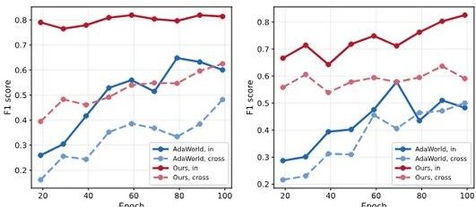

(c) RPE-Trans vs. #Videos   

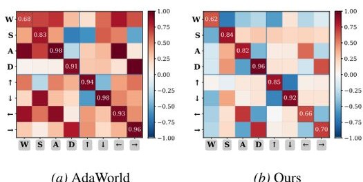

(d) RPE-Rot vs. #Videos   

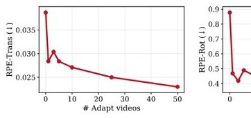

(e) RPE-Trans vs. Rank   

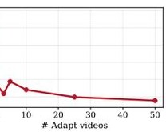

  

Figure 10. Adaptation scaling ablations. Top: quantitative results for varying (left) labeled data budget with rank fixed \((r = 16)\) and (right) LoRA rank with data fixed (50 videos). Bottom: corresponding scaling curves for action accuracy (RPE- Trans/RPE- Rot; lower is better). Across both sweeps, video quality remains comparable, while controllability improves with additional supervision (more videos) and additional capacity (more parameters). Bold and underline denote the best and second- best within each column, respectively.

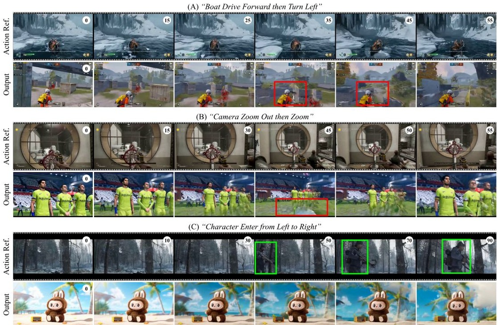

Figure 11. Failure cases generated by Olaf-World.   

our default setting, while video quality remains largely stable. We use rank 16 in the main experiments as an efficient default, and this ablation confirms that our conclusions do not hinge on a specific rank choice.  

### E. Additional Results  

We provide additional qualitative examples for zero- shot action- sequence transfer, data- efficient adaptation, and generalization to novel scenes. These results further confirm the robustness and superior performance of our method compared to baselines. Due to the inherent difficulty of conveying dynamic video generation quality through sparsely sampled frames, we refer readers to the supplementary projects page for the corresponding videos: https://showlab.github.io/Olaf- World.  

Failure cases. Figure 11 shows three representative failure cases: (A) Control- physics mismatch. When a transferred action would cause collisions in the target scene (e.g., drive forward then turn left), the model may hallucinate scene changes to remove or alter the obstacles to avoid collisions, thus preserving the intended motion. (B) Degraded completion under large reveal. Actions such as zooming out require synthesizing a large amount of newly visible content. In these cases, extended parts of the video (e.g., players' legs) may appear blurry or inconsistent. (C) Ambiguous realization for event- driven actions. For actions that imply an event (e.g., a new character entering), the identity of the entering entity is not specified under cross- context transfer. In our example, the model realizes the control as background/camera drift while keeping existing subjects consistent, which is a plausible relative- motion interpretation, but not the same event semantics. We leave richer event- level transfer (e.g., controlled object entry) to future work.  

### F. Limitations and Future Work  

We outline several promising directions that could further strengthen transferable latent actions and action- conditioned world modeling.

## F.1. Effect-aligned latent actions  

Objectives and effect targets. We use a simple and effective cosine alignment between latent actions and effect directions defined by feature differences from a frozen video encoder. Exploring alternative effect targets and alignment formulations is a natural next step and may further improve robustness across diverse contexts and the structure of the learned latent action space.  

Hierarchical latents (skills). Our current latent actions are step- level (one latent per frame at 16 FPS). Learning a hierarchy of latent actions, where short- horizon controls comprise into longer- horizon 'skills", may improve long rollouts, enable multi- rate control, and provide a cleaner interface for downstream decision- making (Hafner et al., 2022; Gumbsch et al., 2024).  

Toward physics- rule transfer. A natural next step is to augment effect- aligned latent actions with physics- grounded constraints so that transferred trajectories remain visually faithful and physically plausible. Recent work shows video generators can be post- trained with verifiable kinematic or collision- consistency rewards (e.g., Newtonian acceleration for falling objects, collision rules) to improve physical behavior (Le et al., 2025; Zhang et al., 2026). A further step is to extend action- conditioned transfer to contact- rich interactions, which require continuous contacts between multiple objects, moving beyond navigation toward complex manipulation.  

Multi- entity dynamics and factorized control. SeqΔ- REPA currently summarizes the observed change with a single effect signal, which can mix different sources of control, camera/ego motion, controllable agent motion, other agent behavior, and environment- driven events. Factorizing effects (ego vs. others vs. environment) and learning entity- specific latent control could improve interpretability and enable richer multi- entity controllable world modeling.  

## F.2. Latent actions for planning and reasoning  

Planning and sampling in latent-action space. In this work, latent actions are used for transfer and as a control interface via an adapter. A key next step is to plan directly on latent action sequences using the world model for imagination- based search or trajectory optimization (Rybkin et al., 2019; Hafner et al., 2023; Wu et al., 2023; Hafner et al., 2022).  

From frame- level "visual CoT" to latent- action traces. Recent work shows that large video models can exhibit emergent zero- shot capabilities (Wiedemer et al., 2025), and video generation work has begun to use visual chain- of- thought—e.g., sparse keyframes, intermediate "thought" prompts, or storyboard plans—as guidance to improve long- horizon coherence and controllability (Huang et al., 2025d; Xiao et al., 2025a; Huang et al., 2025a; Li et al., 2025). An intriguing direction is to treat latent- action sequences as compact traces of dynamics that are cheaper and less redundant than dense frame- level visual CoT, and to study how such traces can support evaluation, editing, and higher- level reasoning about actions and events.