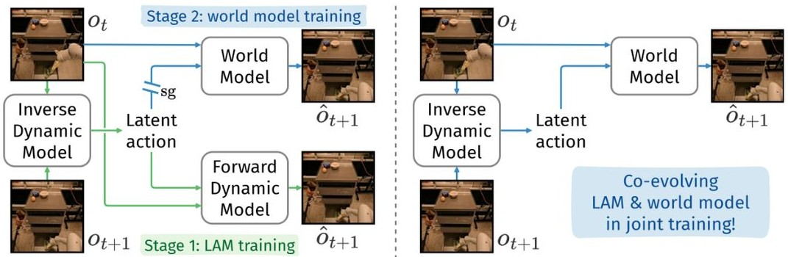
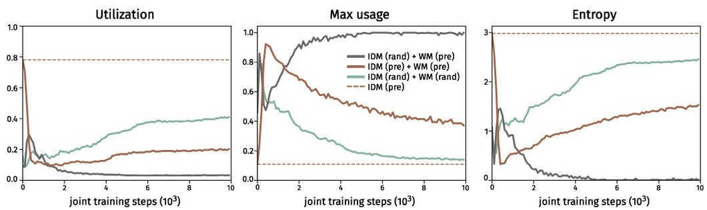
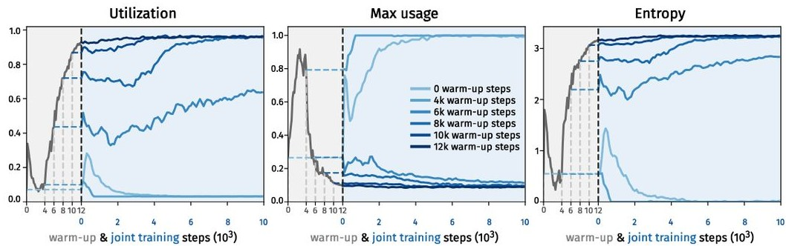
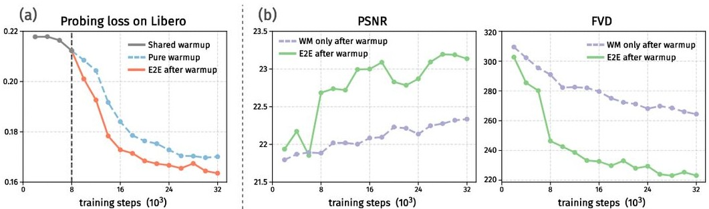
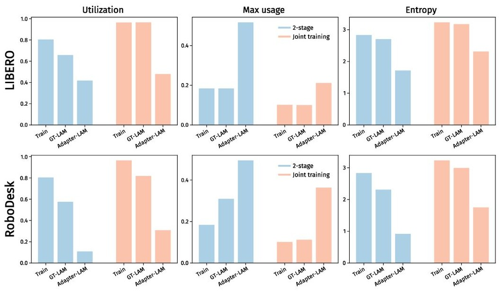
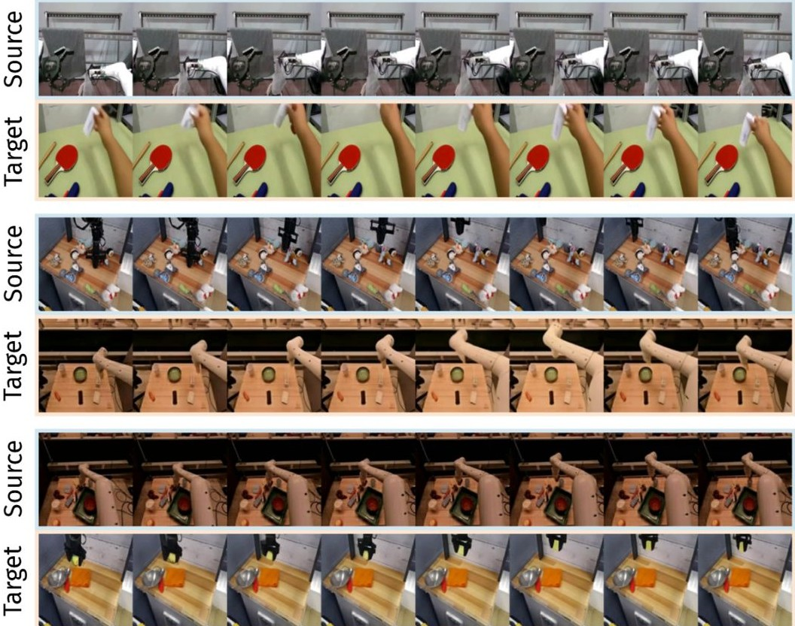

# 共同演化的潜在动作世界模型

王宇岑 \(^{2*}\) 、张凤鸣 \(^{2}\) 、詹德传 \(^{2}\) 、赵丽 \(^{1}\) 、王凯欣 \(^{1 + }\) 、边江 \(^{1}\) \(^{1}\) 微软亚洲研究院，\(^{2}\) 南京大学

将预训练的视频生成模型适应为通过潜在动作控制的世界模型是创建通用世界模型的一个有前景的步骤。主流范式采用两阶段方法，分别训练潜在动作模型（LAM）和世界模型，这导致了冗余的训练并限制了它们的共同适应潜力。一种概念上简单而吸引人的想法是直接用强大的世界模型替换LAM中的前向动态模型，并共同训练它们，但这并非易事，且容易导致表征崩溃。在本工作中，我们提出了CoLA-World，首次成功实现这种协同范式，通过一个关键的预热阶段解决了联合学习中的核心挑战，有效地对齐了从零开始的LAM与预训练世界模型的表征。这开启了一个共同进化的循环：世界模型作为知识丰富的导师，提供梯度以塑造高质量的LAM，而LAM则为世界模型提供更精确和适应性更强的控制接口。经验上，CoLA-World在视频模拟质量和下游视觉规划方面与之前的两阶段方法相匹配或超越，建立了该领域一个强大且高效的新范式。关键词：世界模型，潜在动作

## 1 引言

人工智能的一个主要目标是创造一个能够在多种环境和形态中进行操作的通用智能体。这个愿景的核心概念是世界模型，它是环境的内部模拟器，使智能体能够通过想象进行规划和学习。理想的世界模型应当是通用的，利用关于世界物理和动态的丰富先验知识，并能够在数据最少的情况下适应任何特定的下游任务。虽然大型视频生成模型由于其丰富的预训练知识而成为此类通用模拟器的强大候选者，但一个基本挑战仍然存在：如何交互式控制生成。在不同领域中，动作空间的异质性从灵巧手臂的连续扭矩到游戏主机的离散按钮按压，禁止将真实动作直接用作微调视频生成模型以匹配单一的通用世界模型。为了解决这个问题，潜在动作模型（LAMs）展现了巨大的前景。通过直接从视觉观察中推断抽象动作，LAMs提供了一个统一的、与具体形态无关的控制世界模型的接口。这个范式开辟了一个激动人心的方向：在通用潜在动作空间的条件下预训练一个单一的通用世界模型。为了将LAMs与世界模型结合，现有研究通常采用两阶段方法：首先在无动作视频上训练一个LAM，通常与一个小的逆动力学模型（IDM）和一个从头训练的前向动力学模型（FDM）一起，然后冻结IDM，以提供潜在动作供更大世界模型的训练。然而，这种两阶段方法面临几个问题。首先，FDM和世界模型基本上都在执行下一个观测预测，从而使整体框架显得多余。其次，该流程迫使世界模型依赖一个固定的、静态的潜在动作空间，阻止潜在动作随着世界模型训练的进行而适应。一个自然出现的问题是：

\[\mathbf{Can~we~replaced~the~FDM~with~the~world~model?}\]  

乍一看，这似乎是一个简单的修改，但我们的实验表明，简单地将IDM和世界模型一起训练很容易导致崩溃。在本研究中，我们探讨了这个问题，并给出了肯定的回答。我们提出了CoLA-World，一个训练管道，使潜在动作学习和世界建模的协同共同进化成为可能。我们首先观察到，无论IDM是从头开始初始化还是从预训练模型开始，直接与世界模型进行联合训练都会导致崩溃。这表明IDM与世界模型的预训练权重之间并不匹配。为了应对这一问题，在切换到联合训练之前，CoLA-World引入了一个预热阶段，在此阶段，世界模型保持冻结，仅提供梯度以更新IDM。这大大稳定了后续的联合训练，使IDM和世界模型能够有效地共同进化。一方面，强大的世界模型携带了来自预训练视频生成模型的合理物理和视觉动态的先验知识。它充当一个积极的导师，提供引导梯度，帮助从零开始的IDM朝向更高质量的潜在动作。另一方面，随着IDM学习生成更具信息性的潜在动作空间，它反过来为世界模型提供了更清晰、更精确的控制接口。我们在一个包含人类自我中心和具身操作视频的大规模数据集上评估了我们的方法。与基线的两阶段方法相比，CoLA-World学习到了更高质量的潜在动作，并且实现了更强的世界模型预测性能。我们进一步提供实证证据表明，在联合训练阶段的共同进化至关重要，它使得潜在动作学习和世界建模的性能超越了固定任何一个组件的设置。最后，我们评估了学习到的基于潜在动作的世界模型对分布外真实动作控制接口的适应性，表明我们方法所使能的联合训练是提高视频预测质量和下游视觉规划的关键。总之，我们的主要贡献是提出了CoLA-World，这是第一个成功实现潜在动作模型与基于预训练视频生成的世界模型联合训练的框架。与先前的两阶段方法相比，CoLA-World的联合潜在动作学习和世界建模产生了更高质量的潜在动作空间和具有更强可控性及样本效率的世界模型，从而改善了视频仿真和下游视觉规划。我们还展示了CoLA-World的联合训练表现出协同共进化：改进的世界模型和LAM相互强化，形成一个紧密耦合的系统，驱动出色的适应性。

## 2 相关工作

潜在动作学习 潜在动作最近作为一种有前景的方法出现，用于在无动作数据上进行行为预训练。早期的方法如FICC [39]和LAPO [30]采用IDM-FDM框架，通过下一帧重建目标发现潜在动作。Genie [3]将该框架扩展到大规模的基于变换器的体系结构，除了策略学习外，还专注于潜在动作驱动的世界模型预测。一些研究 [4, 6, 26, 38] 也探讨了潜在动作学习在具身智能体中的应用，特别是在视觉-语言-动作的设置中。我们的工作与之前的方法不同，我们利用预训练的视频生成模型共同演化潜在动作学习和世界建模，这是一个尚未探索的方向。 基于潜在动作的世界模型 虽然潜在动作模型中的FDM可以被解释为一种世界模型，但大多数工作并没有明确关注未来预测能力，只有[8]的工作例外。然而，FDM的预测质量通常低于高容量的视频生成基础的世界模型。最近，Genie [3]训练了一个单独的解码器 MaskGIT [5]作为世界模型，条件是先前学习的固定潜在动作空间。AdaWorld [11]是与我们工作最相关的，采用了与Genie类似的两阶段方法，但使用基于扩散的视频模型，并将离散潜在动作扩展为连续动作。其他努力，如AD3 [36]和PreLAR [40]，在从零开始训练的Dreamer风格 [15]架构中将潜在动作学习与动态和策略训练结合，而不是利用大规模预训练视频生成模型的优势。 微调预训练视频生成模型作为世界模型 我们的工作也与通过添加动作条件将预训练的视频生成模型微调为可控世界模型的努力相关。除了上面讨论的AdaWorld [11]，这方面的大多数工作假设一个预先指定的动作空间。AVID [29]在一个冻结的视频生成模型之上引入了一个轻量级适配器，用于动作条件和世界建模。IRASim [42]使用自适应层归一化 [28] 来结合动作，类似于文本提示的条件。随后，DWS [16]提出了一个更细粒度的动作条件机制，以及其他用于世界建模的改进。Vid2World [18]重点关注在将视频扩散模型适配为世界模型时时间因果关系的挑战，而EnerVerse-AC [19]则在用于操控任务的具身人工智能基础模型 [17]中添加了动作条件。

Figure 1: (a) Prior works use a two-stage pipeline: learn a latent action model (LAM), then fix it to train the world model. (b) We propose a one-stage pipeline, directly using the world model as the forward dynamics model and backpropagating gradients through latent actions.   

## 3 方法

### 3.1 带潜在行为的世界模型 我们专注于训练一个世界模型，以基于当前观测 \( o_{t} \) 和潜在行为 \( z_{t} \) 来预测下一个观测 \( o_{t+1} \)，建模分布 \( p(o_{t+1} \mid o_{t}, z_{t}) \)。与视频游戏中的键盘或鼠标输入等预设行为不同，潜在行为完全通过观测数据学习。这使我们能够在大规模、不带动作的视频数据上预训练世界模型。

如引言中所述，以前的研究[3, 11]通常采用两阶段过程，在世界模型训练之前先训练潜在动作模型（LAM）。LAM由逆动力学模型（IDM）和前向动力学模型（FDM）组成。具体而言，IDM \(f_{\mathrm{inv}}\) 以当前观测 \(o_{t}\) 和下一观测 \(o_{t + 1}\) 作为输入，并输出一个潜在动作 \(Z_{t}\)；而FDM \(f_{\mathrm{fwd}}\) 则以 \(\mathcal{O}_t\) 和 \(z_{t}\) 为输入，预测下一观测 \(\delta_{t + 1}\)。LAM通过最小化 \(\delta_{t + 1}\) 和 \(\mathrm{OT}_{t + 1}\) 之间的重构损失进行训练，即：

\[L_{\mathrm{LAM}} = \| o_{t + 1} - f_{\mathrm{fwd}}(o_t,f_{\mathrm{inv}}(o_t,o_{t + 1}))\| . \quad (1)\]  

为了防止微不足道的解决方案，通常在潜在动作空间中施加一个瓶颈，迫使潜在动作紧凑编码\(\mathcal{O}_t\)和\(o_{t + 1}\)之间最有意义的变化。一旦训练完成，IDM会被冻结并用于提取观察序列的潜在动作标签。之前的工作通常训练一个单独的世界模型来捕捉\(p (o_{t + 1} \mid o_t, z_t)\)，通常使用比LAM更高容量的模型。完整的管道在图1(a)中进行了说明。然而，人们可能立即会注意到，FDM和世界模型执行的任务完全相同：基于\(o_t\)和\(z_t\)预测\(o_{t + 1}\)。我们的想法是用世界模型替代FDM，将两个阶段的训练减少为一个联合训练框架，并在端到端的方式中同时进行动态学习和潜在动作学习，如图1(b)所示。这种框架不仅使模型设计更优雅、训练更高效，而且还允许潜在动作和世界模型的共同演化。强大的世界模型可以提供帮助IDM学习高质量潜在动作的梯度，而IDM则生成更具信息量的潜在动作空间，为世界模型提供更清晰的控制接口。虽然这个想法看起来很简单，但我们在下一小节中将展示，天真地将逆动态模型和世界模型一起训练很容易会崩溃。有人可能会认为FDM本质上就是一个世界模型，并可以用来推演未来预测。然而，实证研究表明，FDM产生的预测质量远低于单独训练的世界模型。我们认为这解释了为什么之前的工作采用了两阶段的方法。据我们所知，之前没有任何工作成功尝试过这种类型的联合训练。

Figure 2: Latent action codebook metrics during joint training of the IDM and world model. "rand" indicates random initialization, while "pre" indicates initialization from pre-trained weights. The dashed line shows the codebook metrics of the pre-trained IDM. All three subplots share the same legend, shown only in the middle panel for clarity.   

### 3.2 驯服联合训练的脆弱性

在之前的工作[3, 11]基础上，我们将图1(b)中的IDM实例化为ST-Transformer [37]，随后应用向量量化[33]以生成离散的潜在动作。对于世界模型，我们采用OpenSora [41]，这是一种高性能的开源扩散基础视频生成模型。我们选择OpenSora是因为其在DWS方法[16]中的有效性得到了验证，在该方法中它被适应用于具有预先指定的动作的世界建模。更多实施细节将在3.3节中介绍。然而，在训练模型时，我们观察到学习迅速崩溃。如图2中的灰色曲线所示，潜在动作的VQ代码本的利用率在初始短暂上升后迅速降至零。同时，最大代码使用率迅速上升至接近 \(100\%\)，表明模型崩溃至仅使用非常小的潜在动作子集。代码熵的同步降至零进一步表明，代码本中的所有代码退化为一个主导代码。相比之下，健康的潜在动作代码本应表现出相对较高的利用率和熵，以及较低的最大使用率，如图2中的虚线水平线所示。如我们所见，直接训练一个新初始化的IDM与预训练的世界模型联合时会导致崩溃。我们假设这是因为强大的预训练世界模型迅速学会忽略由从零开始的LAM提供的随机和无信息的动作信号。通过依靠自身强大的内部先验来最小化预测损失，世界模型未能为LAM提供结构化的监督梯度，导致其表示退化为少量主导的无信息代码。为了进一步研究联合训练的脆弱性，我们接下来使用来自合理训练好的潜在动作模型的参数初始化IDM（对应于图2中的虚线水平线）。然而，如图2中的棕色曲线所示，尽管它从一个有利的状态开始，但代码本迅速恶化，导致利用率和熵低下。虽然后来逐渐改善，但进展仍然缓慢，无法实际应用。考虑到随机初始化和引导初始化均不起作用，我们假设IDM与世界模型的预训练权重不够一致。为此，我们随机初始化IDM和世界模型并进行联合训练。如图2中的绿色曲线所示，这种设置没有崩溃，支持了我们的假设。为了在利用强大的预训练视频生成模型的同时减轻不稳定性，我们提出了一种暖启动策略：首先训练IDM，同时保持世界模型不动，然后切换到联合训练。借助这一暖启动，IDM能够赶上世界模型，从而实现稳定的联合训练而不崩溃。如图3中的深蓝色曲线所示，在这种方案下，代码本指标保持健康。我们进一步改变了暖启动步骤的数量。图3显示，较长的暖启动通常会导致后续联合训练更加稳定，确认IDM在暖启动期间确实经历了一个追赶阶段。在实践中，我们选择一个能够确保稳定性并为端到端共同进化保留尽可能多步骤的暖启动长度。

Figure 3: Latent action codebook metrics during warm-up and joint training. Different blue curves correspond to IDM initializations from warm-up checkpoints at various steps. All three subplots share the same legend, shown only in the middle panel for clarity.   

热身后，我们对IDM和世界模型进行端到端的联合训练，使它们能够共同发展和相互适应。世界模型提供的梯度指导IDM学习更高质量的潜在动作，而IDM则反过来为世界模型生成更具信息量的潜在动作空间。在第4节中，我们展示了大量实验，表明这种联合训练策略提高了所学习的潜在动作的质量以及世界模型的性能。

### 3.3 实现细节

我们详细阐述了我们联合训练范式的关键实施细节，着重关注潜在动作条件机制和端到端训练过程。关于模型架构和训练细节的进一步信息请参见B节：潜在动作条件。在预训练的OpenSora模型中，我们通过自适应层归一化（AdaLN）集成了由IDM提取的潜在动作序列。潜在动作的序列首先由从零开始的自注意力网络处理，以生成上下文嵌入。这些嵌入随后通过多层感知机（MLP）投影为特定于动作的缩放、平移和门控参数，然后通过加法与来源于扩散时间步的原始调制参数融合，并应用于所有OpenSora块中的每个LayerNorm层。该机制提供控制信号，以便根据潜在动作来调整去噪过程。训练目标和梯度流。系统使用OpenSora模型提供的流匹配损失目标进行联合优化，该模型学习预测去噪视频潜在所需的速度。热身和端到端训练阶段仔细管理由损失生成的梯度流。在热身期间，预训练的OpenSora模型被冻结，损失通过动作AdaLN参数反向传播，仅更新动作条件模块和LAM组件（IDM和VQ量化器）。随后的端到端阶段，我们解冻OpenSora世界模型，统一梯度同时更新所有组件。至关重要的是，这一端到端的梯度流是协同共进化的核心机制。

## 4 实验

在本节中，我们进行实验以回答以下问题：1. 我们的联合训练范式在LAM表示质量和世界模型视频预测性能方面与传统的两阶段方法相比如何？2. 我们的范式成功的潜在机制是什么？LAM与世界模型在联合学习期间是否真正实现了协同共进化？3. 我们的联合训练范式的固有优势能否转化为基于实际行动的视频模拟中的性能提升？4. CoLA-World作为一个学习的模拟器在通过视觉规划解决控制任务方面的最终有效性如何？

### 4.1 实验设置

数据集 我们专注于学习基于潜在动作的世界模型，以适应多样化的下游体现和动作空间。我们的训练数据由大规模的人类自我中心视频和来自具身智能体的操控视频混合而成。重要的是，训练过程完全无动作：世界模型和潜在动作模型均仅从视频中学习。完整的数据集详细信息请参见附录 A。

基线 我们比较了两种训练范式。2-阶段：根据以往的研究，我们首先从头开始训练一个LAM（包括IDM、FDM和VQ量化器）。然后冻结LAM，利用其IDM和量化器提供潜在动作，用于微调世界模型，同时丢弃FDM。联合（CoLA-World）：我们的联合学习范式以简短的热身阶段开始，目的是将从头开始的LAM（IDM和量化器）与预训练的世界模型对齐，随后进行全端到端（E2E）的联合训练。LAM和世界模型的架构在两个范式中是相同的。在2阶段设置中，我们训练LAM 30K步，以确保高质量的表示。对于联合训练，我们使用8K的热身阶段（图3），它提供了稳定的初始化，同时为E2E阶段保留预算。更多训练细节见附录B。为清晰起见，我们用各自阶段的训练预算来表示检查点，例如，在2阶段学习中为LAM30K + WM30K；在联合学习中为WARM8K + E2E52K。评估指标。为了评估学习到的潜在动作的质量，我们采用线性探测任务，其中训练一个简单的一层线性投影头来预测从冻结的潜在动作中获得的原始真实动作。在此，我们使用L1预测损失进行评估，以防止潜在的离群值主导损失结果。对于世界模型，我们使用一系列标准指标来测量基于动作的视频生成质量：PSNR、SSIM、LPIPS和FVD。在表中，LPIPS和SSIM分数乘以\(\times 100\)进行紧凑显示。

### 4.2 联合学习的LAM与世界模型的性能

Table 1: Linear probing loss across several embodied AI datasets (lower is better).   

<table><tr><td colspan="2">METHOD</td><td>BRIDGE</td><td>RT-1</td><td>KUKA</td><td>DROID</td><td>AGIBOT</td><td>LIBERo</td></tr><tr><td>2-STAGE</td><td>LAM30K</td><td>0.0827</td><td>0.1191</td><td>0.0741</td><td>0.1912</td><td>0.1035</td><td>0.1614</td></tr><tr><td>JOINT</td><td>WARM8K + E2E22K</td><td>0.0815</td><td>0.1206</td><td>0.0736</td><td>0.1911</td><td>0.0908</td><td>0.1623</td></tr></table>  

潜在动作质量。我们首先通过线性探测评估学习到的潜在动作表示的质量，涉及六个数据集，其中包括来自 Open X-Embodiment 套件的五个数据集 [7] 和一个在训练期间未见过的分布外 LIBERO 数据集 [23]。如表 1 所示，我们的 CoLA-World 生成了一个具有竞争力的潜在动作空间，在大多数数据集上实现了更低的探测损失。尽管探测损失的差异看起来微不足道，但这个孤立的指标并未完全捕捉潜在动作表示的效用。潜在动作质量的最终衡量标准在于其有效控制世界模型的能力。正如我们将证明的那样，由共同学习的 LAM 引导的世界模型在 LIBERO 上显著超越了两阶段基线。这表明我们的共同演化潜在动作空间，尽管不太适合线性探测，但为世界建模提供了更强大和有效的控制接口。世界模型仿真性能。接下来，我们评估世界模型的潜在动作条件视频预测性能。表 2 报告了多个分布内数据集（OXE、Epocentric、AgiBot）和一个分布外（LIBERO）数据集中不同训练检查点的结果。在相同的总训练预算 \(60\mathrm{K}\) 步中，我们的联合训练范式（WARM \(\mathbf{8}K + \mathbf{E}2\bar{\bf E}52\mathbf{K}\)）在所有数据集中始终与最佳的两阶段方法（LAM \(\mathbf{30K + WM}30\mathbf{K}\)）相匹配或超越。

Table 2: Video prediction performance of the learned world models on different datasets.   

<table><tr><td>Dataset</td><td colspan="2">METHOD</td><td>PSNR ↑</td><td>SSIM ↑</td><td>LPIPS ↓</td><td>FVD ↓</td></tr><tr><td rowspan="2">OXE</td><td>2-STAGE</td><td>LAM30K + WM30K</td><td>22.34</td><td>81.16</td><td>13.17</td><td>291.30</td></tr><tr><td></td><td>LAM8K + WM52K</td><td>21.91</td><td>80.76</td><td>13.79</td><td>296.64</td></tr><tr><td></td><td>JOINT</td><td>WARM8K + E2E52K</td><td>22.57</td><td>81.40</td><td>12.79</td><td>278.90</td></tr><tr><td></td><td></td><td>WARM8K + E2E30K</td><td>22.26</td><td>81.06</td><td>13.26</td><td>289.37</td></tr><tr><td rowspan="2">EGOCENTRIC</td><td>2-STAGE</td><td>LAM30K + WM30K</td><td>23.80</td><td>83.68</td><td>12.90</td><td>260.14</td></tr><tr><td></td><td>LAM8K + WM52K</td><td>23.48</td><td>83.28</td><td>13.46</td><td>267.94</td></tr><tr><td></td><td>JOINT</td><td>WARM8K + E2E52K</td><td>23.69</td><td>83.52</td><td>13.08</td><td>252.45</td></tr><tr><td></td><td></td><td>WARM8K + E2E30K</td><td>23.66</td><td>83.41</td><td>13.26</td><td>263.57</td></tr><tr><td rowspan="2">AGIBOT</td><td>2-STAGE</td><td>LAM30K + WM30K</td><td>23.61</td><td>85.36</td><td>10.11</td><td>185.63</td></tr><tr><td></td><td>LAM8K + WM52K</td><td>23.30</td><td>85.11</td><td>10.30</td><td>196.18</td></tr><tr><td></td><td>JOINT</td><td>WARM8K + E2E52K</td><td>23.93</td><td>85.61</td><td>9.86</td><td>174.93</td></tr><tr><td></td><td></td><td>WARM8K + E2E30K</td><td>23.64</td><td>85.27</td><td>10.22</td><td>189.03</td></tr><tr><td rowspan="2">LIBERO</td><td>2-STAGE</td><td>LAM30K + WM30K</td><td>23.13</td><td>86.90</td><td>10.22</td><td>167.77</td></tr><tr><td></td><td>LAM8K + WM52K</td><td>22.72</td><td>86.43</td><td>10.78</td><td>190.09</td></tr><tr><td></td><td>JOINT</td><td>WARM8K + E2E52K</td><td>23.33</td><td>87.21</td><td>9.89</td><td>158.36</td></tr><tr><td></td><td></td><td>WARM8K + E2E30K</td><td>23.25</td><td>87.05</td><td>10.08</td><td>164.86</td></tr></table>  

值得注意的是，在感知一致的FVD指标上，改进最为明显，这表明我们生成的视频不仅在像素层面上精确，而且在时间上更为连贯且更具真实感。

至关重要的是，我们的范式还展示了更高的样本效率。我们的 WARM8K + E2E30K 模型，在预算显著较小的情况下，已经接近完全训练的 LAM3OIK + WM30K 两阶段模型的性能，并且在分布外的 LIBERO 数据集上超越了它。这种效率源于协同训练，避免了两阶段方法固有的冗余学习和静态瓶颈。此外，当两阶段方法给予类似的总预算（LAM8K + WM52K 对比 WARM8K + E2E52K）时，它的性能显著逊色，甚至落后于我们训练较少的 WARM8K + E2E30K 检查点，因为其静态 LAM 未被充分训练。这些结果凸显了我们的联合训练开启了更高的性能上限，并显著减少了训练步骤。我们在 D.2 节中提供了潜在动作转移的结果。

### 4.3 协同共同进化的证据

在展示了我们 CoLA-World 的性能后，我们现在转向理解其成功背后的机制。为此，我们设计了两个受控消融研究，以剖析双向信息流并验证互相促进的良性循环的存在。

作为LAM更好的辅导者的逐步演变世界模型。为了隔离世界模型自身学习过程对LAM的影响，我们将我们的WARmup + E2E方法与一个纯粹的WARmup变体进行比较，其中LAM是在冻结的世界模型生成的梯度下进行训练。我们通过在LIBERO数据集上的线性探测损失来评估得到的LAM，如图4(a)所示。尽管由静态世界模型引导的LAM（纯WARmup）稳步提升，但在我们的CoLA-World中，一旦开始E2E训练，LAM的探测损失下降速度要快得多。这表明来自世界模型的监督信号随着时间的推移而不断演变：随着世界模型对世界动态理解的不断精细化，它提供给LAM的梯度变得越来越具有信息量和因果关系。这些结果确认了一个持续改进的世界模型作为有效的辅导者，能够使LAM的学习更好且更高效。 作为世界模型更好的控制接口的逐步演变LAM。接下来，我们调查了动态演变的LAM对世界模型视频预测性能的影响。我们将我们的WARMup + E2E模型与一个变体进行比较，该变体在相同的初始热身阶段后冻结LAM，只对世界模型进行微调。如图4(b)所示，与冻结LAM配对的世界模型最初有所提升，但很快达到了饱和。相比之下，当与在E2E训练过程中持续改进的LAM配对时，世界模型的视频生成质量显著提高。这表明，静态潜在行动空间会造成性能瓶颈，而动态演变的LAM提供了一个逐步更精确的控制接口，从而释放了世界模型的全部预测潜力。

Figure 4: Evidence of synergistic co-evolution. The LAM's probing loss drops faster when the world model is co-evolving (a), while the world model achieves higher video prediction performance as the LAM improves (b).   

协同进化的良性循环。这两个实验提供了协同进化良性循环的证据：改进的世界模型更好地塑造了潜在行为表征，而这反过来又使得更有效的世界建模成为可能。这种动态的协同进化创造了一个紧密耦合且内在一致的系统。如下一节所示，这一特性是我们模型在下游适应任务中表现优异的基础。

### 4.4 基于真实行动的模拟适应性

潜在行动基础世界模型的一个关键承诺是其适应多样化的真实行动控制接口。我们通过将我们的世界模型适配到新的、分布外的环境来评估这一能力，包括 LIBERO 和 RoboDesk。适配与评估协议 对于每个下游数据集，我们遵循文献中的方法，首先训练一个轻量级的两层 MLP 适配器，将数据集的真实行动映射到潜在行动。随后，我们对世界模型进行 3000 步的微调。至关重要的是，这一微调是使用从下游视频中提取的真实潜在行动（GT-LAM）进行的，这些潜在行动是由冻结的学习 LAM 得到的。这确保了世界模型从干净的监督信号中学习新环境的动态，符合其预训练目标。最后，我们以两种不同的模式评估微调后的世界模型：（a）使用相同的 GT-LAM 评估领域特定微调后的理想性能上限；（b）使用训练好的适配器将真实行动转换为潜在行动，并评估世界模型基于真实行动的视频预测性能。结果与分析。为了评估我们范式的效率，我们将联合训练的 warmk \(^+\) E2E30K 检查点与经过更广泛训练的 LAM30K \(^+\) WM30K 两阶段模型进行比较。尽管使用了更小的训练预算，表 3 显示 CoLA-World 明显优于两阶段基线。在 GT-LAM 评估中，它已经显示出优势，这表明联合训练的世界模型为学习未知环境中的动态提供了更强的基础。此外，当使用真实行动进行评估时，CoLA-World 与两阶段基线之间的性能差距愈加明显，特别是在 FVD 指标上。这反映了 LAM 和世界模型在两种范式下交互的根本区别。两阶段模型在固定的 GT-LAM 分布上微调后，变得僵化而精准地校准于这一静态表征。当面临来自不完美适配器的偏差潜在行动时，世界模型在解释这些分布外信号时遭遇困难，导致显著的性能下降。相比之下，我们的世界模型与动态改进的 LAM 共同演进，持续适应平滑变化的潜在行动格局。这一过程赋予世界模型对潜在行动空间的更平滑和稳健的利用，使其更能抵御适配器的不完美，正确地将其偏差输出解释为与真实信号在功能上等效。这一内在一致性使 CoLA-World 能够从理想训练信号有效推广到实际的真实世界控制接口。此外，通过联合训练学习到的潜在行动空间在下游适配过程中证明了其对两阶段方法中可能出现的表征崩溃的鲁棒性。这种鲁棒性保持了学习潜在行动空间的多样性，并验证了其在世界模型适配中的强大泛化性能。

Table 3: Video prediction performance of the finetuned world models, taking latent actions inferred by the LAM or translated from the real actions by the learned adapters as conditions.   

<table><tr><td>Dataset</td><td>ACTION TYPE</td><td>METHOD</td><td>PSNR ↑</td><td>SSIM ↑</td><td>LPIPS ↓</td><td>FVD ↓</td></tr><tr><td rowspan="2">LIBERO</td><td rowspan="2">GT-LAM</td><td>LAM30K + WM30K</td><td>25.51</td><td>89.55</td><td>7.41</td><td>73.54</td></tr><tr><td>WARM8K + E2E30K</td><td>25.85</td><td>89.82</td><td>7.31</td><td>74.65</td></tr><tr><td rowspan="2"></td><td rowspan="2">Real ACTION</td><td>LAM30K + WM30K</td><td>22.45</td><td>86.96</td><td>9.56</td><td>115.45</td></tr><tr><td>Warm8K + E2E30K</td><td>22.68</td><td>87.15</td><td>9.27</td><td>93.68</td></tr><tr><td rowspan="2">ROBODESK</td><td rowspan="2">GT-LAM</td><td>LAM30K + WM30K</td><td>24.21</td><td>86.99</td><td>7.41</td><td>120.51</td></tr><tr><td>Warm8K + E2E30K</td><td>24.29</td><td>87.04</td><td>7.57</td><td>120.26</td></tr><tr><td rowspan="2"></td><td rowspan="2">Real ACTION</td><td>LAM30K + WM30K</td><td>20.03</td><td>83.33</td><td>10.64</td><td>188.82</td></tr><tr><td>Warm8K + E2E30K</td><td>21.37</td><td>84.67</td><td>8.90</td><td>169.70</td></tr></table>  

Table 4: Visual planning success rate on RoboDesk in the \(\mathrm{VP}^2\) benchmark.   

<table><tr><td>METHOD</td><td>UPRIGHT BLOCK</td><td>PUSH SLIDE</td><td>FLAT BLOCK</td><td>PUSH DRAWER</td><td>AVERAGE</td></tr><tr><td>2-STAGE</td><td>20.0%</td><td>4.44%</td><td>1.11%</td><td>2.22%</td><td>6.94%</td></tr><tr><td>JOINT</td><td>37.78%</td><td>6.11%</td><td>3.33%</td><td>5.25%</td><td>13.12%</td></tr></table>  

## 4.5 视觉规划

为了评估我们世界模型在下游控制中的最终效用，我们利用\(\mathrm{VP}^2\)基准[32]评估了我们适应性世界模型的规划性能。我们采用了之前在RoboDesk数据集上进行微调的CoLA-World和两阶段模型，并评估它们在使用基于采样的模型预测控制规划器解决四个具有挑战性的操作任务时的能力。结果汇总在表4中，表明我们的CoLA-World范式在两阶段方法上具有明显优势，特别是在Upright Block任务上。这确认了在第4.4节中展示的卓越仿真质量转化为规划器更可靠的预测结果，从而实现更有效的控制。在若干复杂任务中，两种方法的表现都很低，突显了任何仅依赖学习到的视觉模型的规划器在这些高精度操作问题上的固有困难。尽管如此，CoLA-World在可处理任务上持续且有时显著的性能提升有力地验证了我们的联合训练方法论作为现实世界控制应用的更有效基础。

## 5 结论、限制与未来工作

在本研究中，我们介绍了CoLA-World，这是第一个成功实现隐状态动作模型与预训练基于视频生成的世界模型的协同联合训练的框架。一个关键的预热阶段解决了这种方法固有的不稳定性，实现了隐状态动作学习与世界建模之间的共同进化。我们的实验表明，CoLA-World在仿真质量和下游规划方面显著优于以往的两阶段方法。一个潜在的限制是世界模型的性能依赖于预训练的视频生成模型，并且需要大量计算资源；不过，这可以通过更高效的模型得到缓解，我们的范式在注入隐状态动作条件方面具有广泛的适用性。未来的方向包括在视觉-语言-隐状态-动作设置中评估学习到的隐状态动作，以便用于操作策略训练，以及扩大我们的框架，以便在更大的视频数据集上训练基础的世界模型，以便实现更广泛的适应性。

## References  

[1] AgiBot- World- Contributors, Bu, Q., Cai, J., Chen, L., Cui, X., Ding, Y., Feng, S., Gao, S., He, X., Huang, X., Jiang, S., Jiang, Y., Jing, C., Li, H., Li, J., Liu, C., Liu, Y., Lu, Y., Luo, J., Luo, P., Mu, Y., Niu, Y., Pan, Y., Pang, J., Qiao, Y., Ren, G., Ruan, C., Shan, J., Shen, Y., Shi, C., Shi, M., Shi, M., Sima, C., Song, J., Wang, H., Wang, W., Wei, D., Xie, C., Xu, G., Yan, J., Yang, C., Yang, L., Yang, S., Yao, M., Zeng, J., Zhang, C., Zhang, Q., Zhao, B., Zhao, C., Zhao, J., and Zhu, J. Agobot world colosseo: A large- scale manipulation platform for scalable and intelligent embodied systems. arXiv preprint arXiv: 2503.06669, 2025. [2] Blattmann, A., Dockhorn, T., Kulal, S., Mendelievitch, D., Kilian, M., Lorenz, D., Levi, Y., English, Z., Voleti, V., Letts, A., et al. Stable video diffusion: Scaling latent video diffusion models to large datasets. arXiv preprint arXiv:2311.15127, 2023. [3] Bruce, J., Dennis, M. D., Edwards, A., Parker- Holder, J., Shi, Y., Hughes, E., Lai, M., Mavalankar, A., Steigerwald, R., Apps, C., et al. Genie: Generative interactive environments. In International Conference on Machine Learning, pp. 4603- 4623. PMLR, 2024. [4] Bu, Q., Yang, Y., Cai, J., Gao, S., Ren, G., Yao, M., Luo, P., and Li, H. Univla: Learning to act anywhere with task- centric latent actions. arXiv preprint arXiv:2505.06111, 2025. [5] Chang, H., Zhang, H., Jiang, L., Liu, C., and Freeman, W. T. Maskgit: Masked generative image transformer. In Proceedings of the IEEE/CVF Conference on Computer Vision and Pattern Recognition (CVPR), pp. 11315- 11325, June 2022. [6] Chen, X., Wei, H., Zhang, P., Zhang, C., Wang, K., Guo, Y., Yang, R., Wang, Y., Xiao, X., Zhao, L., Chen, J., and Bian, J. villa- x: Enhancing latent action modeling in vision- language- action models. arXiv preprint arXiv:2507.23682, 2025. [7] Collaboration, O. X.- E., O'Neil, A., Rehman, A., Maddukuri, A., Gupta, A., Padalkar, A., Lee, A., Pooley, A., Gupta, A., Mandlekar, A., Jain, A., Tung, A., Bewley, A., Herzog, A., Irfan, A., Khazatsky, A., Rai, A., Gupta, A., Wang, A., Kolobov, A., Singh, A., Garg, A., Kembhavi, A., Xie, A., Brohan, A., Raffin, A., Sharma, A., Yavary, A., Jain, A., Balakrishna, A., Wahid, A., Burgess- Limerick, B., Kim, B., Scholkopf, B., Wulfe, B., Ichter, B., Lu, C., Xu, C., Le, C., Finn, C., Wang, C., Xu, C., Chi, C., Huang, C., Chan, C., Agia, C., Pan, C., Fu, C., Devin, C., Xu, D., Morton, D., Driess, D., Chen, D., Pathak, D., Shah, D., Buchler, D., Jayaraman, D., Kalashnikov, D., Sadigh, D., Johns, E., Foster, E., Liu, F., Ceola, F., Xia, F., Zhao, F., Wenner, F. V., Stulp, F., Zhou, G., Sukhatme, G. S., Salhotra, G., Yan, G., Feng, G., Schiao, G., Berseth, G., Kahn, G., Yang, G., Wang, G., Su, H., Fang, H.- S., Shi, H., Bao, H., Amor, H. B., Christensen, H. I., Furuta, H., Walke, H., Fang, H., Ha, H., Mordatch, I., Radosavovic, I., Leal, I., Liang, J., Abou- Chakra, J., Kim, J., Drake, J., Peters, J., Schneider, J., Hsu, J., Bohag, J., Bingham, J., Wu, J., Gao, J., Hu, J., Wu, J., Wu, J., Sun, J., Luo, J., Gu, J., Tan, J., Oh, J., Wu, J., Lu, J., Yang, J., Malik, J., Silvério, J., Hejna, J., Boomer, J., Tompson, J., Yang, J., Salvador, J., Lim, J. J., Han, J., Wang, K., Rao, K., Pertsch, K., Hausman, K., Go, K., Gopalakrishnan, K., Goldberg, K., Byrne, K., Oslund, K., Kawaharazuka, K., Black, K., Lin, K., Zhang, K., Ehsani, K., Lekkala, K., Ellis, K., Rana, K., Srinivasan, K., Fang, K., Singh, K. P., Zeng, K.- H., Hatch, K., Hsu, K., Itti, L., Chen, L. Y., Pinto, L., Fei- Fei, L., Tan, L., Fan, L. J., Ott, L., Lee, L., Weihs, L., Chen, M., Lepert, M., Memmel, M., Tomizuka, M., Itkina, M., Castro, M. G., Spere, M., Du, M., Ahn, M., Yip, M. C., Zhang, M., Ding, M., Heo, M., Srirama, M. K., Sharma, M., Kim, M. J., Kanazawa, N., Hansen, N., Heess, N., Joshi, N. J., Suenderhauf, N., Liu, N., Palo, N. D., Shafiullah, N. M. M., Mees, O., Kroemer, O., Bastani, O., Sanketi, P. R., Miller, P. T., Yin, P., Wohlhart, P., Xu, P., Fagan, P. D., Mitrano, P., Sermanet, P., Abbeel, P., Sundaresan, P., Chen, Q., Vuong, Q., Rafailov, R., Tian, R., Doshi, R., Mart'ín- Martínez, R., Baijal, R., Scalise, R., Hendrix, R., Lin, R., Qian, R., Zhang, R., Mendonca, R., Shah, R., Hoque, R., Julian, R., Bustamante, S., Kirmani, S., Levine, S., Lin, S., Moore, S., Bahl, S., Dass, S., Sonawani, S., Song, S., Xu, S., Haldar, S., Karamcheti, S., Adebola, S., Guist, S., Nasiriany, S., Schaal, S., Welker, S., Tian, S., Ramamoorthy, S., Dasari, S., Belkhale, S., Park, S., Nair, S., Mirchandani, S., Osa, T., Gupta, T., Harada, T., Matsushima, T., Xiao, T., Kollar, T., Yu, T., Ding, T., Davchev, T., Zhao, T. Z.,

Armstrong, T., Darrell, T., Chung, T., Jain, V., Vanhoucke, V., Zhan, W., Zhou, W., Burgard, W., Chen, X., Chen, X., Wang, X., Zhu, X., Geng, X., Liu, X., Liangwei, X., Li, X., Pang, Y., Lu, Y., Ma, Y., J., Kim, Y., Chebotar, Y., Zhou, Y., Zhu, Y., Wu, Y., Xu, Y., Wang, Y., Bisk, Y., Dou, Y., Cho, Y., Lee, Y., Cui, Y., Cao, Y., Wu, Y.- H., Tang, Y., Zhu, Y., Zhang, Y., Jiang, Y., Li, Y., Li, Y., Iwasawa, Y., Matsuo, Y., Ma, Z., Xu, Z., Cui, Z. J., Zhang, Z., Fu, Z., and Lin, Z. Open X- Embodiment: Robotic learning datasets and RT- X models. https://arxiv.org/abs/2310.08864, 2023.  [8] Cui, H. and Gao, Y. A universal world model learned from large scale and diverse videos. In NeurIPS 2023 Foundation Models for Decision Making Workshop, 2023.  [9] Damen, D., Doughty, H., Farinella, G. M., Fidler, S., Furnari, A., Kazakos, E., Moltisanti, D., Munro, J., Perrett, T., Price, W., et al. The epic- kitchens dataset: Collection, challenges and baselines. IEEE Transactions on Pattern Analysis and Machine Intelligence, 43(11):4125- 4141, 2020.  [10] Fang, H.- S., Fang, H., Tang, Z., Liu, J., Wang, J., Zhu, H., and Lu, C. Rh20t: A robotic dataset for learning diverse skills in one- shot. In RSS 2023 Workshop on Learning for Task and Motion Planning, 2023.  [11] Gao, S., Zhou, S., Du, Y., Zhang, J., and Gan, C. Adavorld: Learning adaptable world models with latent actions. In International Conference on Machine Learning (ICML), 2025.  [12] Goyal, R., Kahou, S. E., Michalski, V., Materzynska, J., Westphal, S., Kim, H., Haenel, V., Fruend, I., Yianilos, P., Mueller- Freitag, M., Hoppe, F., Thurau, C., Bax, I., and Memisevic, R. The "something something" video database for learning and evaluating visual common sense, 2017. URL https://arxiv.org/abs/1706.04261.  [13] Grauman, K., Westbury, A., Byrne, E., Chavis, Z., Furnari, A., Girdhar, R., Hamburger, J., Jiang, H., Liu, M., Liu, X., Martin, M., Nagarajan, T., Radosavovic, I., Ramakrishnan, S. K., Ryan, F., Sharma, J., Wray, M., Xu, M., Xu, E. Z., Zhao, C., Bansal, S., Batra, D., Cartillier, V., Crane, S., Do, T., Doulaty, M., Erapalli, A., Feichtenhofer, C., Fragomeni, A., Fu, Q., Fuegen, C., Gebreselasie, A., Gonzalez, C., Hillis, J., Huang, X., Huang, Y., Jia, W., Khoo, W., Kolar, J., Kottur, S., Kumar, A., Landini, F., Li, C., Li, Y., Li, Z., Mangalam, K., Modhugu, R., Munro, J., Murrell, T., Nishiyasu, T., Price, W., Puentes, P. R., Ramazanova, M., Sari, L., Somasundaram, K., Southerland, A., Sugano, Y., Tao, R., Vo, M., Wang, Y., Wu, X., Yagi, T., Zhu, Y., Arbeláez, P., Crandall, D., Damen, D., Farinella, G. M., Ghanem, B., Ithapu, V. K., Jawahar, C. V., Joo, H., Kitani, K., Li, H., Newcombe, R., Oliva, A., Park, H. S., Rehg, J. M., Sato, Y., Shi, J., Shou, M. Z., Torralba, A., Torresani, L., Yan, M., and Malik, J. Ego4d: Around the World in 3,000 Hours of Egocentric Video. In IEEE/CVF Computer Vision and Pattern Recognition (CVPR), 2022.  [14] Ha, D. and Schmidhuber, J. World models. arXiv preprint arXiv:1803.10122, 2018.  [15] Hafner, D., Lillicrap, T. P., Norouzi, M., and Ba, J. Mastering atari with discrete world models. In International Conference on Learning Representations, 2021. URL https://openreview.net/forum?id=0oabwy2b0u.  [16] He, H., Zhang, Y., Lin, L., Xu, Z., and Pan, L. Pre- trained video generative models as world simulators. arXiv preprint arXiv: 2502.07825, 2025.  [17] Huang, S., Chen, L., Zhou, P., Chen, S., Jiang, Z., Hu, Y., Liao, Y., Gao, P., Li, H., Yao, M., et al. Enverse: Envisioning embodied future space for robotics manipulation. arXiv preprint arXiv:2501.01895, 2025.  [18] Huang, S., Wu, J., Zhou, Q., Miao, S., and Long, M. Vid2world: Crafting video diffusion models to interactive world models. arXiv preprint arXiv: 2505.14357, 2025.  [19] Jiang, Y., Chen, S., Huang, S., Chen, L., Zhou, P., Liao, Y., He, X., Liu, C., Li, H., Yao, M., et al. Enverse- ac: Envisioning embodied environments with action condition. arXiv preprint arXiv:2505.09723, 2025.  [20] Kannan, H., Hafner, D., Finn, C., and Erhan, D. Robodesk: A multi- task reinforcement learning benchmark. https://github.com/google- research/robodesk, 2021.  [21] Li, Y., Liu, M., and Rehg, J. M. In the eye of beholder: Joint learning of gaze and actions in first person video. In Proceedings of the European conference on computer vision (ECCV), pp. 619- 635, 2018.

[22] Li, Y., Cao, Z., Liang, A., Liang, B., Chen, L., Zhao, H., and Feng, C. Egocentric prediction of action target in 3d. In Proceedings of the IEEE/CVF Conference on Computer Vision and Pattern Recognition (CVPR), June 2022. [23] Liu, B., Zhu, Y., Gao, C., Feng, Y., Liu, Q., Zhu, Y., and Stone, P. Libero: Benchmarking knowledge transfer for lifelong robot learning. arXiv preprint arXiv:2306.03310, 2023. [24] Liu, X., Gong, C., and Liu, Q. Flow straight and fast: Learning to generate and transfer data with rectified flow. arXiv preprint arXiv:2209.03003, 2022. [25] Liu, Y., Liu, Y., Jiang, C., Lyu, K., Wan, W., Shen, H., Liang, B., Fu, Z., Wang, H., and Yi, L. Hoi4d: A 4d egocentric dataset for category-level human- object interaction. In Proceedings of the IEEE/CVF Conference on Computer Vision and Pattern Recognition (CVPR), pp. 21013- 21022, June 2022. [26] NVIDIA, ; Bjork, J., Castaneada, F., Chernideev, N., Da, X., Ding, R., Fan, L. J., Fang, Y., Fox, D., Hu, F., Huang, S., Jang, J., Jiang, Z., Kautz, J., Kundalia, K., Lao, L., Li, Z., Lin, Z., Lin, K., Liu, G., Llontop, E., Magne, L., Mandlekar, A., Narayan, A., Nasiriany, S., Reed, S., Tan, Y. L., Wang, G., Wang, Z., Wang, J., Wang, Q., Xiang, J., Xie, Y., Xu, Y., Xu, Z., Ye, S., Yu, Z., Zhang, A., Zhang, H., Zhao, Y., Zheng, R., and Zhu, Y. Gr00t n1: An open foundation model for generalist humanoid robots. arXiv preprint arXiv: 2503.14734, 2025. [27] OpenAI. Sora: Creating video from text. https://openai.com/sora, 2024. Accessed: 2025- 09- 18. [28] Peebles, W. and Xie, S. Scalable diffusion models with transformers. In Proceedings of the IEEE/CVF international conference on computer vision, pp. 4195- 4205, 2023. [29] Rigter, M., Gupta, T., Hilmcil, A., and Ma, C. AVID: Adapting video diffusion models to world models. In Reinforcement Learning Conference, 2025. URL https://openreview.net/forum?id=C18kcGegAW.[30] Schmidt, D. and Jiang, M. Learning to act without actions. International Conference on Learning Representations, 2023. doi: 10.48550/arXiv.2312.10812. [31] Sutton, R. S. Integrated architecture for learning, planning, and reacting based on approximating dynamic programming. In Proceedings of the seventh international conference (1990) on Machine learning, pp. 216- 224, 1990. [32] Tian, S., Finn, C., and Wu, J. A control- centric benchmark for video prediction. arXiv preprint arXiv:2304.13723, 2023. [33] Van Den Oord, A., Vinyals, O., et al. Neural discrete representation learning. Advances in neural information processing systems, 30, 2017. [34] Wang, J., Zhang, Q., Chao, Y.- W., Wen, B., Guo, X., and Xiang, Y. Ho- cap: A capture system and dataset for 3d reconstruction and pose tracking of hand- object interaction, 2024. URL https://arxiv.org/abs/2406.06843. [35] Wang, X., Kwon, T., Rad, M., Pan, B., Chakraborty, I., Andrist, S., Bohus, D., Feniello, A., Tekin, B., Frujeri, F. V., Joshi, N., and Pollefeys, M. Holoassist: an egocentric human interaction dataset for interactive ai assistants in the real world. In Proceedings of the IEEE/CVF International Conference on Computer Vision (ICCV), pp. 20270- 20281, October 2023. [36] Wang, Y., Wan, S., Gan, L., Feng, S., and Zhan, D.- C. Ad3: Implicit action is the key for world models to distinguish the diverse visual distractors. International Conference on Machine Learning, 2024. doi: 10.48550/arXiv.2403.09976. [37] Xu, M., Dai, W., Liu, C., Gao, X., Lin, W., Qi, G.- J., and Xiong, H. Spatial- temporal transformer networks for traffic flow forecasting. arXiv preprint arXiv:2001.02908, 2020. [38] Ye, S., Jang, J., Jeon, B., Joo, S. J., Yang, J., Peng, B., Mandlekar, A., Tan, R., Chao, Y.- W., Lin, B. Y., Liden, L., Lee, K., Gao, J., Zettlemoyer, L., Fox, D., and Seo, M. Latent action pretraining from videos. In The Thirteenth International Conference on Learning Representations, 2025. URL https://openreview.net/forum?id=VY0e2eBQeh.

[39] Ye, W., Zhang, Y., Abbeel, P., and Gao, Y. Become a proficient player with limited data through watching pure videos. In The Eleventh International Conference on Learning Representations, 2023. URL https://openreview.net/forum?id=S9y- o2N0hF4f.  

[40] Zhang, L., Kan, M., Shan, S., and Chen, X. Prelar: World model pre- training with learnable action representation. In European Conference on Computer Vision, pp. 185- 201. Springer, 2024.  

[41] Zheng, Z., Peng, X., Yang, T., Shen, C., Li, S., Liu, H., Zhou, Y., Li, T., and You, Y. Open- sora: Democratizing efficient video production for all. arXiv preprint arXiv:2412.20404, 2024.  

[42] Zhu, F., Wu, H., Guo, S., Liu, Y., Cheang, C., and Kong, T. Irasim: Learning interactive real- robot action simulators. arXiv preprint arXiv:2406.14540, 2024.

## A Dataset  

We mainly focus on learning a latent action model and a world model for manipulation tasks that involve diverse downstream embodiments and action spaces. The data mixture for CoLA- World training is made up of videos of completing manipulation tasks by both embodied agents and humans. For the former, we mainly use Open X- Embodiment (OXE) [7] mixture and the AgiBot [1] dataset. For the latter, we curate a comprehensive collection from nine prominent datasets, including Something- Something V2 [12], RH20T [10], Ego4D [13], EgoPAT3D [22], EGTEA Gaze+ [21], HOI4D [25], EPIC- KITCHENS [9], HO- Cap [34] and HoloAssist [35]. The final data mixture consists of approximately \(30\%\) OXE, \(20\%\) AgiBot, and \(50\%\) human video data.  

## B Implementation Details  

Our two- stage training baseline involves training a LAM consisting of an IDM and an FDM, as well as a VQ quantizer to bottleneck the latent action space. Then the latent actions are inferred from the video using the frozen IDM and quantizer, used to finetune a pre- trained OpenSora video generation model into a world model, while the FDM is discarded. The joint training paradigm trains the LAM (i.e. the IDM and the VQ quantizer) and the OpenSora world model simultaneously, detaching the gradients of the world model's weights when executing warm- up. For fair comparison, the architectures of the IDM, the quantizer and the world model as well as the action conditioning modules of the two paradigms are totally the same. We then elaborate each of the mentioned components.  

## B.1 IDM, FDM and the Quantizer  

The IDM is implemented as an 12- layer ST- Transformer [37]. Each block has a hidden dimension of 768 and 12 attention heads. The FDM is implemented as an 12- layer spatial Transformer with the same number of hidden dimension and attention heads as the IDM. Between the IDM and FDM, we apply vector quantization [33] to produce latent actions, which is composed of two 32- dimensional action tokens chosen from the codebook. The codebook contains 32 entries, yielding a total number of 1024 different latent action choices. The IDM takes an \(T \times 224 \times 224 \times 3\) video clip as input, first patchified with a patch size of 14 and then processed by the ST- Transformer to predict \(T - 1\) latent actions. The FDM concatenates the image patches and the predicted latent action tokens, using the spatial transformer to produce pixel decoding results of the next frames. The IDM and FDM both have about 0.12 B parameters.  

## B.2 World Model based on the Pretrained OpenSora Model  

We adopt the pre- trained OpenSora model as the backbone of the world model. We use the v1.2 release with about 1.2 B parameters. As mentioned in Section 3.3, we add an extra from- scratch module for conditioning the video generation of OpenSora on the extracted latent actions, including 6 self- attention blocks to process the latent action sequence and an MLP to get the final AdaLN parameters of the latent actions, which are then fused with original diffusion timestep AdaLN parameters and modulate the attention results in each OpenSora DiT block. We initialize the weights in the action attention blocks as zero, to ensure a steady training at the beginning. Similar AdaLN- style action conditioning method is also explored in previous work [16, 42]. However, their action inputs are fixed and not learnable, while our latent actions and conditioning layers are dynamically refined by the world model's own objective, which sets our method apart.  

These newly introduced from- scratch modules to the OpenSora have about 74M parameters. The original layers in OpenSora for processing the texts, as well as the cross attention layers for fusing visual and text modalities, are discarded. Then there the about 0.93 B learnable parameters in the OpenSora, including the newly added action conditioning modules. Moreover, the original temporal transformer blocks in the OpenSora DiT are not causal, and we add causal masks in them to prevent future information from influencing the past, which is unfavorable in dynamics modeling.  

During training, the OpenSora world model takes in 256- resolution videos and the extracted latent action sequence, adding noise to the ground- truth videos and forwarding them through the DiT to predict the corresponding velocity vector, and building the prediction loss in the context of rectified flow. We use a

step- wise classifier- free guidance, where during training we randomly mask the action condition as zero in a probability of 0.1 at each step of the sequence, and apply a guidance scale of 4.0 for sampling during inference. The number of denoising timesteps is 10 in inference.  

## B.3 Training details  

Latent Action Training of the two- stage paradigm After FDM producing pixel reconstruction results, we simply build the MSE loss between the reconstruction and the ground- truth "next frame" observation, in a teacher- forcing manner, rather than multi- step auto- regression. The vq loss and the commitment loss introduced by the vq technique are also included to update the IDM and the codebook, and their loss weights are 1.0 and 0.25, respectively.  

World Model Training of the two- stage paradigm As mentioned above, the OpenSora world model builds the flow matching loss using the input videos and the detached latent actions and updates the OpenSora model, as well as the action conditioning modules.  

Training of the CoLA- World paradigm The OpenSora world model now builds the flow matching loss using the input videos and the learnable latent actions. The gradients then backpropagate throughout the whole system. The IDM, VQ quantizer and the action conditioning modules introduced in the OpenSora will be updated, while the pretrained weights of the original OpenSora model will only be updated after warm- up. The IDM and VQ quantizer will also receive gradients from the vq loss and commitment loss both during warm- up and end- to- end phase, similar to the latent action training in the two- stage paradigm.  

Other training protocols. To ensure fair comparison, both training paradigms use a learning rate of 7.5e- 5, a batch size of 128, and a 2K- step linear warmup schedule for the learning rate. When the LAM model is updating (LAM training of 2- stage paradigm, and all of the joint training paradigm), we use random crop to the video clips as a data augmentation trick to improve performance, while when the LAM is fixed, we do not use the augmentation and direct use the IDM to extract the latent actions from the original video.  

## C Evaluation Details  

## C.1 Evaluation Setup  

For the linear probing task and all the video prediction tasks, we train the prober head or the world model on the training split of the given dataset mixture and validate on the valid split. For example, for linear probing on an out- of- distribution LIBERO dataset, in fact the LAM was previously trained on the whole training data, and the prober head is now trained on the training split of the unseen LIBERO dataset. Then, we test the performance of the LAM and the prober by probing the loss on the valid split of the LIBERO dataset and record the results. For all the probing tasks, we train the prober head for 1K steps with a batch size 512, and validate on 20K test samples. For all video prediction tasks, we evaluate on a fixed test dataset for each data mixture, consisting of 240 video clips on each gpu, and the performance is averaged.  

## C.2 Real Action Adaptation  

When adapting the trained world model to a downstream real action space, we first train the adapter predicting the GT- LAM vq code indices from the real actions using a 2- layer MLP. This takes 1K training steps with a batch size of 64. We then finetune the world model on the downstream dataset for 3K steps with a batch size of 128 using GT- LAM.  

## C.3 Visual planning on \(\mathbf{V}\mathbf{P}^{2}\) benchmark  

We follow [11] and test the learned world model's utility in control on RoboDesk environment using the evaluation protocol from \(\mathbf{V}\mathbf{P}^{2}\) benchmark. Each task of the RoboDesk environment on \(\mathbf{V}\mathbf{P}^{2}\) benchmark is specified by 30 pairs of initial observation and goal observation. When testing on one task, every time we sample such a pair and the agent needs to use the world model to plan the trajectory starting at the initial state towards the goal. The reward function is also provided by \(\mathbf{V}\mathbf{P}^{2}\) , defined as the weighted sum of the

Figure 5: Codebook metrics in different training and adaptation stages. All subplots share the same legend, shown only in the middle panel for clarity.   

MSE loss between the predicted video and the goal observation, with a pretrained binary classifier's predicted logit on the current task. The classifier's weights are also provided by the benchmark. Finally, the task success rate is the ratio of success trajectories in these 30 runs. Moreover, \(\mathrm{VP}^2\) offers trajectory data on RoboDesk, and the experiments of the world model downstream adaptation on RoboDesk in Section 4.4 are conducted by training the adapter and finetuning the world model on these data.e  

## D Additional Results  

## D.1 Analysis of Codebook Dynamics in Downstream Adaptation  

To provide deeper quantitative insight into the mechanisms behind our paradigm's superior downstream real- action- adaptation performance over the two- stage method, we analyze the metrics of the VQ codebook. For both CoLA- World and the Two- Stage baseline, we compare three distinct latent action distributions on the LIBERO and RoboDesk datasets:  

(a) Training Distribution: The latent action distribution in our general training.  

(b) GT-LAM Fine-tuning Distribution: The ground-truth latent action distribution inferred by the frozen LAM encoder from the downstream task videos, used for fine-tuning the world model.  

(c) Adapter-LAM Inference Distribution: The latent action distribution produced by the trained adapter when translating the downstream task's real actions.  

The results, visualized in Figure 5, reveal a stark contrast in how the two paradigms adapt their latent action space.  

As shown in the bar charts, the two- stage method exhibits a dramatic representational collapse when adapting to the downstream tasks' real actions. While the codebook utilization and entropy are reasonable during pre- training (a), they decrease when the model is fine- tuned on the narrower distribution of the downstream GT- LAM (b). Most critically, when the adapter is used for inference (c), the codebook metrics degenerate severely and tend to collapse: codebook utilization plummet to nearly \(10\%\) on RoboDesk, with the max- usage metric spiking to approximately 0.5 on both LIBERO and RoboDesk. This indicates that the adapter has found a "lazy shortcut" by mapping the vast majority of real actions

Figure 6: Action transfer results. The source and target videos comes from different datasets   

to a single, all- purpose latent code. This is a direct cause of the model's low performance and its inability to handle the full complexity of the control task.  

In contrast, the overall codebook usage is relatively healthy in our CoLA- World paradigm under the Adapter- LAM setting. The entropy remains high and the max- usage stays at a relatively low level compared to the two- stage baseline. This provides direct, quantitative evidence that the co- evolutionary process has forged a more robust and flexible latent action space for downstream adaptation and generalization. The constant, supervisory feedback from the powerful world model tutor prevents the LAM from taking degenerative shortcuts, compelling them to learn a richer, more meaningful representations. This preserved diversity of the codebook is a cornerstone of our system's adaptation performance and its ability to robustly generalize.  

To conclude, and in conjunction with our analysis in Section 4.4, our joint training paradigm's success in downstream adaptation stems from co- evolution forging an intrinsically consistent and deeply coupled system, which manifests in the dual advantages of a collapse- resistant latent action space and a world model that robustly utilizes it.  

## D.2 Action Transfer results  

Here we provide action transfer results in Figure 6, where our learned LAM in CoLA- World extracts the latent actions from the source video, and the world model generates the video from an initial image, taking these latent actions as conditions. For each video pair below, the top video is the source video, while the bottom one is the generated action- transfer video. We notice that the generated videos show a strong resemblance in semantic meaning to the source videos. To avoid too large PDF file, we provide additional qualitative results for action transfer videos in our online supplementary repository.