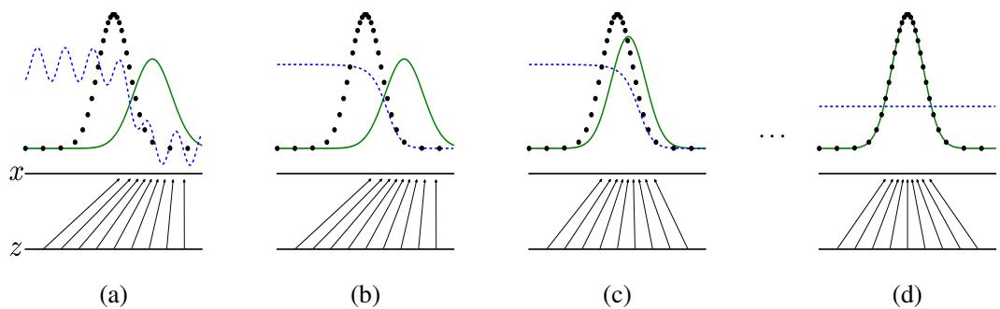
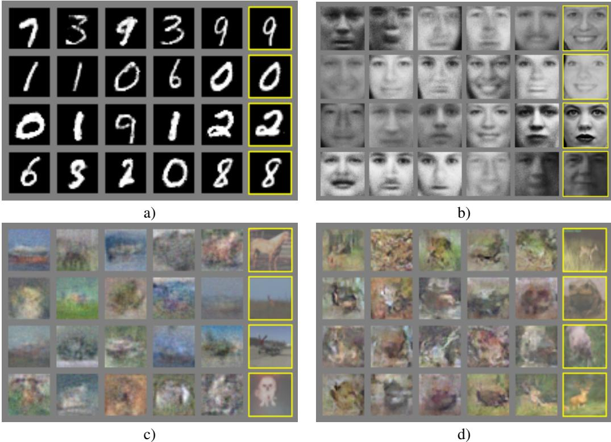

# Generative Adversarial Nets

Ian J. Goodfellow, Jean Pouget-Abadie, Mehdi Mirza, Bing Xu, David Warde-Farley, Sherjil Ozair, Aaron Courville, Yoshua Bengio‡ Département d'informatique et de recherche opérationnelle Université de Montréal Montréal, QC H3C 3J7

# Abstract

We propose a new framework for estimating generative models via an adversarial process, in which we simultaneously train two models: a generative model $G$ that captures the data distribution, and a discriminative model $D$ that estimates the probability that a sample came from the training data rather than $G$ . The training procedure for $G$ is to maximize the probability of $D$ making a mistake. This framework corresponds to a minimax two-player game. In the space of arbitrary functions $G$ and $D$ , a unique solution exists, with $G$ recovering the training data distribution and $D$ equal to $\begin{array} { l } { { \frac { 1 } { 2 } } } \end{array}$ everywhere. In the case where $G$ and $D$ are defined by multilayer perceptrons, the entire system can be trained with backpropagation. There is no need for any Markov chains or unrolled approximate inference networks during either training or generation of samples. Experiments demonstrate the potential of the framework through qualitative and quantitative evaluation of the generated samples.

# 1 Introduction

The promise of deep learning is to discover rich, hierarchical models [2] that represent probability distributions over the kinds of data encountered in artificial intelligence applications, such as natural images, audio waveforms containing speech, and symbols in natural language corpora. So far, the most striking successes in deep learning have involved discriminative models, usually those that map a high-dimensional, rich sensory input to a class label [14, 22]. These striking successes have primarily been based on the backpropagation and dropout algorithms, using piecewise linear units [19, 9, 10] which have a particularly well-behaved gradient . Deep generative models have had less of an impact, due to the difficulty of approximating many intractable probabilistic computations that arise in maximum likelihood estimation and related strategies, and due to diffculty of leveraging the benefits of piecewise linear units in the generative context. We propose a new generative model estimation procedure that sidesteps these difficulties. 1 In the proposed adversarial nets framework, the generative model is pitted against an adversary: a discriminative model that learns to determine whether a sample is from the model distribution or the data distribution. The generative model can be thought of as analogous to a team of counterfeiters, trying to produce fake currency and use it without detection, while the discriminative model is analogous to the police, trying to detect the counterfeit currency. Competition in this game drives both teams to improve their methods until the counterfeits are indistiguishable from the genuine articles. This framework can yield specific training algorithms for many kinds of model and optimization algorithm. In this article, we explore the special case when the generative model generates samples by passing random noise through a multilayer perceptron, and the discriminative model is also a multilayer perceptron. We refer to this special case as adversarial nets. In this case, we can train both models using only the highly successful backpropagation and dropout algorithms [17] and sample from the generative model using only forward propagation. No approximate inference or Markov chains are necessary.

# 2 Related work

An alternative to directed graphical models with latent variables are undirected graphical models with latent variables, such as restricted Boltzmann machines (RBMs) [27, 16], deep Boltzmann machines (DBMs) [26] and their numerous variants. The interactions within such models are represented as the product of unnormalized potential functions, normalized by a global summation/integration over all states of the random variables. This quantity (the partition function) and its gradient are intractable for all but the most trivial instances, although they can be estimated by Markov chain Monte Carlo (MCMC) methods. Mixing poses a significant problem for learning algorithms that rely on MCMC [3, 5]. Deep belief networks (DBNs) [16] are hybrid models containing a single undirected layer and several directed layers. While a fast approximate layer-wise training criterion exists, DBNs incur the computational difficulties associated with both undirected and directed models.

Alternative criteria that do not approximate or bound the log-likelihood have also been proposed, such as score matching [18] and noise-contrastive estimation (NCE) [13]. Both of these require the learned probability density to be analytically specified up to a normalization constant. Note that in many interesting generative models with several layers of latent variables (such as DBNs and DBMs), it is not even possible to derive a tractable unnormalized probability density. Some models such as denoising auto-encoders [30] and contractive autoencoders have learning rules very similar to score matching applied to RBMs. In NCE, as in this work, a discriminative training criterion is employed to fit a generative model. However, rather than fitting a separate discriminative model, the generative model itself is used to discriminate generated data from samples a fixed noise distribution. Because NCE uses a fixed noise distribution, learning slows dramatically after the model has learned even an approximately correct distribution over a small subset of the observed variables.

Finally, some techniques do not involve defining a probability distribution explicitly, but rather train a generative machine to draw samples from the desired distribution. This approach has the advantage that such machines can be designed to be trained by back-propagation. Prominent recent work in this area includes the generative stochastic network (GSN) framework [5], which extends generalized denoising auto-encoders [4]: both can be seen as defining a parameterized Markov chain, i.e., one learns the parameters of a machine that performs one step of a generative Markov chain. Compared to GSNs, the adversarial nets framework does not require a Markov chain for sampling. Because adversarial nets do not require feedback loops during generation, they are better able to leverage piecewise linear units [19, 9, 10], which improve the performance of backpropagation but have problems with unbounded activation when used ina feedback loop. More recent examples of training a generative machine by back-propagating into it include recent work on auto-encoding variational Bayes [20] and stochastic backpropagation [24].

# 3 Adversarial nets

The adversarial modeling framework is most straightforward to apply when the models are both multilayer perceptrons. To learn the generator's distribution $p _ { g }$ over data $_ { \textbf { \em x } }$ , we define a prior on input noise variables $p _ { z } ( z )$ , then represent a mapping to data space as $G ( z ; \theta _ { g } )$ , where $G$ is a differentiable function represented by a multilayer perceptron with parameters $\theta _ { g }$ . We also define a second multilayer perceptron $D ( \pmb { x } ; \dot { \theta } _ { d } )$ that outputs a single scalar. $D ( { \pmb x } )$ represents the probability that $_ { \textbf { \em x } }$ came from the data rather than $p _ { g }$ .We train $D$ to maximize the probability of assigning the correct label to both training examples and samples from $G$ .We simultaneously train $G$ to minimize $\log ( 1 - D ( G ( z ) ) )$ : In other words, $D$ and $G$ play the following two-player minimax game with value function $V ( G , D )$ :

$$
\operatorname* { m i n } _ { G } \operatorname* { m a x } _ { D } V ( D , G ) = \mathbb { E } _ { { \pmb x } \sim p _ { \mathrm { d a t a } } ( { \pmb x } ) } [ \log D ( { \pmb x } ) ] + \mathbb { E } _ { { \pmb z } \sim p _ { \pmb z } ( { \pmb z } ) } [ \log ( 1 - D ( G ( { \pmb z } ) ) ) ] .
$$

In the next section, we present a theoretical analysis of adversarial nets, essentially showing that the training criterion allows one to recover the data generating distribution as $G$ and $D$ are given enough capacity, i.e., in the non-parametric limit. See Figure 1 for a less formal, more pedagogical explanation of the approach. In practice, we must implement the game using an iterative, numerical approach. Optimizing $D$ to completion in the inner loop of training is computationally prohibitive, and on finitedatasets would result in overfitting. Insted, we alternate beween $k$ steps of optimizing $D$ and one step of optimizing $G$ .This results in $D$ being maintained near its optimal solution, so long as $G$ changes slowly enough. This strategy is analogous to the way that SML/PCD [31, 29] training maintains samples from a Markov chain from one learning step to the next in order to avoid burning in a Markov chain as part of the inner loop of learning. The procedure is formally presented in Algorithm 1. In practice, equation 1 may not provide sufficient gradient for $G$ to learn well. Early in learning, when $G$ is poor, $D$ can reject samples with high confidence because they are clearly different from the training data. In this case, $\log ( 1 - D ( G ( z ) ) )$ saturates. Rather than training $G$ to minimize $\log ( 1 - \bar { D ( G ( z ) ) } )$ we can train $G$ to maximize $\arg D ( G ( z ) )$ .This objective function results in the same fixed point of the dynamics of $G$ and $D$ but provides much stronger gradients early in learning.

  
FigureGenerativeadversarial nets are trained by simultaneously updating the discriminative distribution $D$ , blue, dashed line) so that it discriminates between samples from the data generating distribution (black, dotted line) $p _ { x }$ from those of the generative distribution $p _ { g }$ (G) (green, solid line). The lower horizontal line is the domain from which $_ z$ is sampled, in this case uniformly. The horizontal line above is part of the domain of $_ { \textbf { \em x } }$ . The upward arrows show how the mapping $x = G ( z )$ imposes the non-uniform distribution $p _ { g }$ on transformed samples. $G$ contracts in regions of high density and expands in regions of low density of $p _ { g }$ . (a) Consider an adversarial pair near convergence: $p _ { g }$ is similar to $p \mathrm { d a t a }$ and $D$ is a partially accurate classifier. (b) In the inner loop of the algorithm $D$ is trained to discriminate samples from data, converging to $D ^ { \ast } ( { \pmb x } ) =$ $\frac { p _ { \mathrm { d a t a } } ( \pmb { x } ) } { p _ { \mathrm { d a t a } } ( \pmb { x } ) + p _ { g } ( \pmb { x } ) }$ $G$ $D$ $G ( z )$ to be classified as data. (d) After several steps of training, if $G$ and $D$ have enough capacity, they will reach a point at which both cannot improve because $p _ { g } = p _ { \mathrm { d a t a } }$ . The discriminator is unable to differentiate between the two distributions, i.e. $\begin{array} { r } { D ( \pmb { x } ) = \frac { 1 } { 2 } } \end{array}$

# 4 Theoretical Results

The generator $G$ implicitly defines a probability distribution $p _ { g }$ as the distribution of the samples $G ( z )$ obtained when $z \sim p _ { z }$ . Therefore, we would like Algorithm 1 to converge to a good estimator of $p _ { \mathrm { d a t a } }$ , if given enough capacity and training time. The results of this section are done in a nonparametric setting, e.g. we represent a model with infinite capacity by studying convergence in the space of probability density functions. We will show in section 4.1 that this minimax game has a global optimum for $p _ { g } = p _ { \mathrm { d a t a } }$ We will then show in section 4.2 that Algorithm 1 optimizes $\mathrm { E q } 1$ , thus obtaining the desired result. Algorithm 1 Minibatch stochastic gradient descent training of generative adversarial nets. The number of steps to apply to the discriminator, $k$ , is a hyperparameter. We used $k = 1$ , the least expensive option, in our experiments. for number of training iterations do for $k$ steps do Sample minibatch of $m$ noise samples $\{ z ^ { ( 1 ) } , \dots , z ^ { ( m ) } \}$ from noise prior $p _ { g } ( z )$ Sample minibatch of $m$ examples $\{ \pmb { x } ^ { ( 1 ) } , \ldots , \pmb { x } ^ { ( m ) } \}$ from data generating distribution $p _ { \mathrm { d a t a } } ( \pmb { x } )$ . • Update the discriminator by ascending its stochastic gradient:

$$
\nabla _ { \theta _ { d } } \frac { 1 } { m } \sum _ { i = 1 } ^ { m } \left[ \log D \left( { \pmb x } ^ { ( i ) } \right) + \log \left( 1 - D \left( G \left( { \pmb z } ^ { ( i ) } \right) \right) \right) \right] .
$$

# end for

Sample minibatch of $m$ noise samples $\{ z ^ { ( 1 ) } , \dots , z ^ { ( m ) } \}$ from noise prior $p _ { g } ( z )$ • Update the generator by descending its stochastic gradient:

$$
\nabla _ { \theta _ { g } } \frac { 1 } { m } \sum _ { i = 1 } ^ { m } \log \left( 1 - D \left( G \left( z ^ { ( i ) } \right) \right) \right) .
$$

# end for

The gradient-based updates can use any standard gradient-based learning rule. We used momentum in our experiments.

# 4.1 Global Optimality of $p _ { g } = p _ { \mathbf { d a t a } }$

We first consider the optimal discriminator $D$ for any given generator $G$ . Proposition 1. For $G$ fixed, the optimal discriminator $D$ is

$$
D _ { G } ^ { * } ( { \pmb x } ) = \frac { p _ { d a t a } ( { \pmb x } ) } { p _ { d a t a } ( { \pmb x } ) + p _ { g } ( { \pmb x } ) }
$$

Proof. The training criterion for the discriminator $\mathbf { D }$ , given any generator $G$ , is to maximize the quantity $V ( G , D )$

$$
\begin{array} { l } { { \displaystyle V ( G , D ) = \int _ { x } p _ { \mathrm { d a t a } } ( { \pmb x } ) \log ( D ( { \pmb x } ) ) d x + \int _ { z } p _ { z } ( z ) \log ( 1 - D ( g ( z ) ) ) d z } \ ~ } \\ { { \displaystyle ~ = \int _ { x } p _ { \mathrm { d a t a } } ( { \pmb x } ) \log ( D ( { \pmb x } ) ) + p _ { g } ( { \pmb x } ) \log ( 1 - D ( { \pmb x } ) ) d x } } \end{array}
$$

For any $( a , b ) \in \mathbb { R } ^ { 2 } \setminus \{ 0 , 0 \}$ , the function $y \to a \log ( y ) + b \log ( 1 - y )$ achieves its maximum in $[ 0 , 1 ]$ at $\frac { a } { a + b }$ $S u p p ( p _ { \mathrm { d a t a } } ) \cup S u p p ( p _ { g } )$ concluding the proof. Note that the training objective for $D$ can be interpreted as maximizing the log-likelihood for estimating the conditional probability $P ( \boldsymbol { Y } = \boldsymbol { y } | \mathbf { x } )$ , where $Y$ indicates whether $_ { \textbf { \em x } }$ comes from $p _ { \mathrm { d a t a } }$ (with $y = 1$ ) or from $p _ { g }$ (with $y = 0$ ). The minimax game in Eq. 1 can now be reformulated as:

$$
\begin{array} { r l } & { C ( G ) = \underset { D } { \operatorname* { m a x } } V ( G , D ) } \\ & { \qquad = \mathbb { E } _ { \boldsymbol { x } \sim p _ { \mathrm { d a t } } } [ \log D _ { G } ^ { * } ( \boldsymbol { x } ) ] + \mathbb { E } _ { \boldsymbol { z } \sim p _ { z } } [ \log ( 1 - D _ { G } ^ { * } ( G ( \boldsymbol { z } ) ) ) ] } \\ & { \qquad = \mathbb { E } _ { \boldsymbol { x } \sim p _ { \mathrm { d a t } } } [ \log D _ { G } ^ { * } ( \boldsymbol { x } ) ] + \mathbb { E } _ { \boldsymbol { x } \sim p _ { g } } [ \log ( 1 - D _ { G } ^ { * } ( \boldsymbol { x } ) ) ] } \\ & { \qquad = \mathbb { E } _ { \boldsymbol { x } \sim p _ { \mathrm { d a t } } } \left[ \log \frac { p _ { \mathrm { d a t } } ( \boldsymbol { x } ) } { P _ { \mathrm { d a t } } ( \boldsymbol { x } ) + p _ { g } ( \boldsymbol { x } ) } \right] + \mathbb { E } _ { \boldsymbol { x } \sim p _ { g } } \left[ \log \frac { p _ { g } ( \boldsymbol { x } ) } { p _ { \mathrm { d a t } } ( \boldsymbol { x } ) + p _ { g } ( \boldsymbol { x } ) } \right] } \end{array}
$$

Theorem 1. The global minimum of the virtual training criterion $C ( G )$ is achieved if and only if $p _ { g } = p _ { d a t a }$ At that point, $C ( G )$ achieves the value $- \log 4$ .

Proof. For $p _ { g } = p _ { \mathrm { d a t a } }$ , $\begin{array} { r } { D _ { G } ^ { * } ( \pmb { x } ) = \frac { 1 } { 2 } } \end{array}$ , (consider Eq. 2). Hence, by inspecting Eq. 4 at $\begin{array} { r } { D _ { G } ^ { * } ( \pmb { x } ) = \frac { 1 } { 2 } } \end{array}$ , we find $C ( G ) = \log { \textstyle { \frac { 1 } { 2 } } } + \log { \textstyle { \frac { 1 } { 2 } } } = - \log 4$ To that h is h  os va $C ( G )$ , reached only for $p _ { g } = p _ { \mathrm { d a t a } }$ , observe that and that by subtracting this expression from $C ( G ) = V ( D _ { G } ^ { * } , G )$ , we obtain:

$$
\mathbb { E } _ { { \pmb x } \sim p _ { \mathrm { d a t a } } } \left[ - \log 2 \right] + \mathbb { E } _ { { \pmb x } \sim p _ { g } } \left[ - \log 2 \right] = - \log 4
$$

$$
C ( G ) = - \log ( 4 ) + K L ( p _ { \mathrm { d a t a } } | | \frac { p _ { \mathrm { d a t a } } + p _ { g } } { 2 }  ) + K L ( p _ { g } | | \frac { p _ { \mathrm { d a t a } } + p _ { g } } { 2 }  ) 
$$

where $\mathrm { K L }$ is the KullbackLeibler divergence. We recognize in the previous expression the Jensen Shannon divergence between the model's distribution and the data generating process:

$$
C ( G ) = - \log ( 4 ) + 2 \cdot J S D \left( p _ { \mathrm { d a t a } } \| p _ { g } \right)
$$

Since the JensenShannon divergence between two distributions is always non-negative and zero only when they are equal, we have shown that $C ^ { * } = - \log ( 4 )$ is the global minimum of $C ( G )$ and that the only solution is $p _ { g } = p _ { \mathrm { d a t a } }$ , i.e, the generative model perfectly replicating the data generating process.

# 4.2 Convergence of Algorithm 1

Proposition 2. If $G$ and $D$ have enough capacity, and at each step of Algorithm 1, the discriminator is allowed to reach its optimum given $G$ , and $p _ { g }$ is updated so as to improve the criterion then $p _ { g }$ converges to Pdata

$$
\mathbb { E } _ { { \pmb x } \sim p _ { d a t a } } [ \log D _ { G } ^ { * } ( { \pmb x } ) ] + \mathbb { E } _ { { \pmb x } \sim p _ { g } } [ \log ( 1 - D _ { G } ^ { * } ( { \pmb x } ) ) ]
$$

Proof. Consider $V ( G , D ) = U ( p _ { g } , D )$ as a function of $p _ { g }$ as done in the above criterion. Note that $U ( p _ { g } , D )$ is convex in $p _ { g }$ Th subderivatives   supremum o convex fnctions incude he derivative of the function at the point where the maximum is attained. In other words, if $f ( x ) =$ $\textstyle \operatorname* { s u p } _ { \alpha \in { \mathcal { A } } } f _ { \alpha } ( x )$ and $f _ { \alpha } ( x )$ is convex in $x$ for every $\alpha$ , then $\partial f _ { \beta } ( x ) \in \partial f$ if $\begin{array} { r } { \beta = \arg \operatorname* { s u p } _ { \alpha \in \mathcal { A } } f _ { \alpha } ( x ) } \end{array}$ . This is equivalent to computing a gradient descent update for $p _ { g }$ at the optimal $D$ given the corresponding $G$ $\operatorname* { s u p } _ { D } U ( p _ { g } , D )$ is convex in $p _ { g }$ with a unique global optima as proven in Thm 1, therefore with sufficiently small updates of $p _ { g } , p _ { g }$ converges to $p _ { x }$ , concluding the proof. □ In practice, adversarial nets represent a limited family of $p _ { g }$ distributions via the function $G ( z ; \theta _ { g } )$ , and we optimize $\theta _ { g }$ rather than $p _ { g }$ itself. Using a multilayer perceptron to define $G$ introduces multiple critical points in parameter space. However, the excellent performance of multilayer perceptrons in practice suggests that they are a reasonable model to use despite their lack of theoretical guarantees.

# 5 Experiments

We trained adversarial nets an a range of datasets including MNIST[23], the Toronto Face Database (TFD) [28], and CIFAR-10 [21]. The generator nets used a mixture of rectifier linear activations [19, 9] and sigmoid activations, while the discriminator net used maxout [10] activations. Dropout [17] was applied in training the discriminator net. While our theoretical framework permits the use of dropout and other noise at intermediate layers of the generator, we used noise as the input to only the bottommost layer of the generator network. We estimate probability of the test set data under $p _ { g }$ by fitting a Gaussian Parzen window to the samples generated with $G$ and reporting the log-likelihood under this distribution. The $\sigma$ parameter of the Gaussians was obtained by cross validation on the validation set. This procedure was introduced in Breuleux et al. [8] and used for various generative models for which the exact likelihood is not tractable [25, 3, 5]. Results are reported in Table 1. This method of estimating the likelihood has somewhat high variance and does not perform well in high dimensional spaces but it is the best method available to our knowledge. Advances in generative models that can sample but not estimate likelihood directly motivate further research into how to evaluate such models.

<table><tr><td>Model</td><td>MNIST</td><td>TFD</td></tr><tr><td>DBN [3]</td><td>138 ± 2</td><td>1909 ± 66</td></tr><tr><td>Stacked CAE [3]</td><td>121 ± 1.6</td><td>2110 ± 50</td></tr><tr><td>Deep GSN [6]</td><td>214 ± 1.1</td><td>1890 ± 29</td></tr><tr><td>Adversarial nets</td><td>225 ± 2</td><td>2057 ± 26</td></tr></table>

Table 1: Parzen window-based log-likelihood estimates. The reported numbers on MNIST are the mean loglikelihood of sample on test set, with the standard error of the mean computed across examples. On TD, we computed the standard error across folds of the dataset, with a different $\sigma$ chosen using the validation set of each fold. On TFD, $\sigma$ was cross validated on each fold and mean log-likelihood on each fold were computed. For MNIST we compare against other models of the real-valued (rather than binary) version of dataset.

In Figures 2 and 3 we show samples drawn from the generator net after training. While we make no claim that these samples are better than samples generated by existing methods, we believe that these samples are at least competitive with the better generative models in the literature and highlight the potential of the adversarial framework.

  

Figure : Visualization of samples from the model. Rightmost column shows the nearest training example of the neighboring sample, in order to demonstrate that the model has not memorized the training set.Samples are fair random draws, not cherry-picked.Unlike most other visualizations of deep generative models, these images show actual samples from the model distributions, not conditional means given samplesof hidden units. Moreover, these samples are uncorrelated because the sampling process does not depend on Markov chain mixing. a) MNIST b) TFD c) CIFAR-10 (fully connected model) d) CIFAR-10 (convolutional discriminator and "deconvolutional" generator) I 1 1 5 5 S S 5 5 S 7 7 9 9 9 9 7 / /7

Figure 3: Digits obtained by linearly interpolating between coordinates in $_ { z }$ space of the full model.   

TableChallenges in generative modeling: sumary of the difficultie encountered bydifferent appraches to deep generative modeling for each of the major operations involving a model.

<table><tr><td rowspan=1 colspan=1></td><td rowspan=1 colspan=1>Deep directedgraphical models</td><td rowspan=1 colspan=1>Deep undirectedgraphical models</td><td rowspan=1 colspan=1>Generativeautoencoders</td><td rowspan=1 colspan=1>Adversarial models</td></tr><tr><td rowspan=1 colspan=1>Training</td><td rowspan=1 colspan=1>Inference neededduring training.</td><td rowspan=1 colspan=1>Inference neededduring training.MCMC needed toapproximatepartition functiongradient.</td><td rowspan=1 colspan=1>Enforced tradeoffbetween mixingand power ofreconstructiongeneration</td><td rowspan=1 colspan=1>Synchronizing thediscriminator withthe generator.Helvetica.</td></tr><tr><td rowspan=1 colspan=1>Inference</td><td rowspan=1 colspan=1>Learnedapproximateinference</td><td rowspan=1 colspan=1>Variationalinference</td><td rowspan=1 colspan=1>MCMC-basedinference</td><td rowspan=1 colspan=1>Learnedapproximateinference</td></tr><tr><td rowspan=1 colspan=1>Sampling</td><td rowspan=1 colspan=1>No difficulties</td><td rowspan=1 colspan=1>Requires Markovchain</td><td rowspan=1 colspan=1>Requires Markovchain</td><td rowspan=1 colspan=1>No difficulties</td></tr><tr><td rowspan=1 colspan=1>Evaluating p(x)</td><td rowspan=1 colspan=1>Intractable, may beapproximated withAIS</td><td rowspan=1 colspan=1>Intractable, may beapproximated withAIS</td><td rowspan=1 colspan=1>Not explicitlyrepresented, may beapproximated withParzen densityestimation</td><td rowspan=1 colspan=1>Not explicitlyrepresented, may beapproximated withParzen densityestimation</td></tr><tr><td rowspan=1 colspan=1>Model design</td><td rowspan=1 colspan=1>Nearly all modelsincur extremedifficulty</td><td rowspan=1 colspan=1>Careful designneeded to ensuremultiple properties</td><td rowspan=1 colspan=1>Any differentiablefunction istheoreticallypermitted</td><td rowspan=1 colspan=1>Any differentiablefunction istheoreticallypermitted</td></tr></table>

# 6 Advantages and disadvantages

This new framework comes with advantages and disadvantages relative to previous modeling frameworks. The disadvantages are primarily that there is no explicit representation of $p _ { g } ( \pmb { x } )$ , and that $D$ must be synchronized well with $G$ during training (in particular, $G$ must not be trained too much without updating $D$ , in order to avoid "the Helvetica scenario" in which $G$ collapses too many values of $\mathbf { z }$ to the same value of $\mathbf { x }$ to have enough diversity to model $p _ { \mathrm { d a t a } }$ ), much as the negative chains of a Boltzmann machine must be kept up to date between learning steps. The advantages are that Markov chains are never needed, only backprop is used to obtain gradients, no inference is needed during learning, and a wide variety of functions can be incorporated into the model. Table 2 summarizes the comparison of generative adversarial nets with other generative modeling approaches. The aforementioned advantages are primarily computational. Adversarial models may also gain some statistical advantage from the generator network not being updated directly with data examples, but only with gradients flowing through the discriminator. This means that components of the input are not copied directly into the generator's parameters. Another advantage of adversarial networks is that they can represent very sharp, even degenerate distributions, while methods based on Markov chains require that the distribution be somewhat blurry in order for the chains to be able to mix between modes.

# 7 Conclusions and future work

This framework admits many straightforward extensions: 1. A conditional generative model $p ( { \pmb x } \mid { \pmb c } )$ can be obtained by adding $^ c$ as input to both $G$ and $D$ . 2. Learned approximate inference can be performed by training an auxiliary network to predict $_ { z }$ given $_ { \textbf { \em x } }$ . This is similar to the inference net trained by the wake-sleep algorithm [15] but with the advantage that the inference net may be trained for a fixed generator net after the generator net has finished training. 3. One can approximately model all conditionals $p ( \pmb { x } _ { S } \ | \ \pmb { x } _ { \mathcal { S } } )$ where $S$ is a subset of the indices of $_ { \textbf { \em x } }$ by training a family of conditional models that share parameters. Essentially, one can use adversarial nets to implement a stochastic extension of the deterministic MP-DBM [11]. 4Semi-supervised learning: features from the discriminator or inference net could improve performance of classifiers when limited labeled data is available. 5. Efficiency improvements: training could be accelerated greatly by divising better methods for coordinating $G$ and $D$ or determining better distributions to sample $\mathbf { z }$ from during training. This paper has demonstrated the viability of the adversarial modeling framework, suggesting that these research directions could prove useful.

# Acknowledgments

We would like to acknowledge Patrice Marcote, Olivier Delalleau, Kyunghyun Cho, Guillaume Alain and Jason Yosinski for helpful discussions. Yann Dauphin shared his Parzen window evaluation code with us. We would like to thank the developers of Pylearn2 [12] and Theano [7, 1], particularly Frédéric Bastien who rushed a Theano feature specifically to benefit this project. Arnaud Bergeron provided much-needed support with $\mathrm { I A T } _ { \mathrm { E } } \mathrm { X }$ typesetting. We would also like to thank CIFAR, and Canada Research Chairs for funding, and Compute Canada, and Calcul Québec for providing computational resources. Ian Goodfellow is supported by the 2013 Google Fellowship in Deep Learning. Finally, we would like to thank Les Trois Brasseurs for stimulating our creativity.

# References

[] Bastien, F., Lamblin, P. Pascanu, R., Bergstra, J. Godfelow, I. J., Bergeron, A., Bouchard, N. and Bengio, Y. (2012). Theano: new features and speed improvements. Deep Learning and Unsupervised Feature Learning NIPS 2012 Workshop.   
[2] Bengio, Y. (2009). Learning deep architectures for AI. Now Publishers.   
[3] Bengio, Y., Mesnil, G., Dauphin, Y., and Rifai, S. (2013a). Better mixing via deep representations. In ICML'13.   
[ Bengio, Y. Yao, L., Alain, G., and Vincent, P. (2013b). Generalized denoisng auto-encoders as eneative models. In NIPS26. Nips Foundation.   
[5] Bengio, Y. Thibodeau-Laufer, E., and Yosinski, J. (2014a). Deep enerative stochastic networks trainable by backprop. In ICML'14.   
[6] Bengio, Y., Thibodeau-Laufer, E., Alain, G., and Yosinski, J. (2014b). Deep generative stochastic networks trainable by backprop. In Proceedings of the 30th International Conference on Machine Learning (ICML'14).   
[Berstra, J., Breulux, O. Bastin, F. Lblin, P.Pasnu, R. Desjardins, G. Turian, J. Ware-Far, D., and Bengio, Y. (2010). Theano: a CPU and GPU math expression compiler. In Proceedings of the Python for Scientific Computing Conference (SciPy). Oral Presentation.   
[8] Breuleux, O., Bengio, Y., and Vincent, P. (2011). Quickly generating representative samples from an RBM-derived process. Neural Computation, 23(8), 20532073.   
[9] Glorot, X., Bordes, A., and Bengio, Y. (2011). Deep sparse rectifier neural networks. In AISTATS'2011.   
[10] Goodfellow, I. J, Warde-Farley, D., Mirza, M., Courvill, A., and Bengio, Y. (2013a). Maxout networks. In ICML'2013.   
[] Goodfellow, I. J., Mirza, M., Courville, A., and Bengio, Y. (2013b). Multi-prediction deep Boltzmann machines. In NIPS'2013.   
[2] Goodfellow, I. J., Warde-Farley, D., Lamblin, P., Dumoulin, V., Mirza, M., Pascanu, R., Bergstra, J., Bastien, F., and Bengio, Y. (2013c). Pylearn2: a machine learning research library. arXiv preprint arXiv:1308.4214.   
[13] Gutmann, M. and Hyvarinen, A. (2010). Noise-contrastive estimation: A new estimation principle for unnormalized statistical models. In AISTATS'2010.   
[14] Hinton, G., Deng, L., Dahl, G. E., Mohamed, A., Jaitly, N., Senior, A., Vanhoucke, V., Nguyen, P, Sainath, T., and Kingsbury, B. (2012a). Deep neural networks for acoustic modeling in speech recognition. IEEE Signal Processing Magazine, 29(6), 8297.   
[5Hinton, G. E, Dayan, P., Frey, B. J., and Neal, R. M. (1995). The wake-sleep algorith or unsupeisd neural networks. Science, 268, 15581161.   
[16] Hinton, G. E., Osindero, S., and Teh, Y. (2006). A fast learning algorithm for deep belief nets. eural Computation, 18, 15271554.   
[ Hinton, G. E., Srivastava, N., rizhevsky, A. Sutskever, I., and Salakutinov, R. (012).Impi neural networks by preventing co-adaptation of feature detectors. Technical report, arXiv:1207.0580.   
[18] Hyvärinen, A. (2005). Estimation of non-normalized statistical models using score matching. J. Machine Learning Res., 6.   
[ Jarret, K. Kavgu, K. Ro, M. andLCun, Y.(9). Wha s hebest stahe for object recognition? In Proc. International Conference on Computer Vision (ICCV'09), pages 21462153. IEEE.   
[20] Kingma, D. P. and Wellng, M. (2014). Auto-encoding variational bayes. In Proceedings of the International Conference on Learning Representations (ICLR).   
[21] Krizhevsky, A. and Hinton, G. (2009). Learning multiple layers of features from tiny images. Technical report, University of Toronto.   
[22] Krizhevsky, A., Sutskever, I., and Hinton, G. (2012). ImageNet classification with deep convolutional neural networks. In NIPS'2012.   
[3] LeCun, Y., Bottou, L., Bengio, Y., and Haffer, P. (1998). Gradient-based learning applied todocument recognition. Proceedings of the IEEE, 86(11), 22782324.   
[24] Rezende, D. J., Mohamed, S., and Wierstra, D. (2014). Stochastic backpropagation and approximate inference in deep generative models. Technical report, arXiv:1401.4082.   
[ Rifai, S., Bengi, Y. Duphi, Y. anVincet, P. (012).A gnrative proce or smpl onive auto-encoders. In ICML'12.   
[26] Salakhutdinov, R. and Hinton, G. E. (2009). Deep Boltzmann machines. In AISTATS'2009, pages 448 455.   
[27] Smolensky, P. (1986). Information processing in dynamical systems: Foundations of harmony theory. In D. E. Rumelhart and J. L. McClelland, editors, Parallel Distributed Processing, volume 1, chapter 6, pages 194281. MIT Press, Cambridge.   
[28] Susskind, J., Anderson, A., and Hinton, G. E. (2010). The Toronto face dataset. Technical Report UTML TR 2010-001, U. Toronto.   
[29] Tieleman, T. (2008). Training restricted Boltzmann machines using approximations to the likelihood gradient. In W. W. Cohen, A. McCallum, and S. T. Roweis, editors, ICML 2008, pages 10641071. ACM.   
[30] Vincent, P., Larochelle, H., Bengio, Y., and Manzagol, P.-A. (2008). Extracting and composing robust features with denoising autoencoders. In ICML 2008.   
[31] Younes, L. (19). On the convergence of Markovian stochastic algorithms with rapidly decreasing ergodicity rates. Stochastics and Stochastic Reports, 65(3), 177228.