# MegaSaM：从随意动态视频中获取准确、快速且稳健的结构与运动

李正奇1 塔克·理查德1 科尔·福雷斯特1 王前前1,2 金林怡1,3 叶维琪2 金安柔2 阿列克桑德尔·霍林斯基1,2 诺亚·斯纳弗利1 1谷歌深Mind 2加州大学伯克利分校 3密歇根大学

# 摘要

我们提出了一种系统，能够从动态场景的随意单目视频中准确、快速且稳健地估计相机参数和深度图。大多数传统的结构光束法和单目SLAM技术假设输入视频主要特征为静态场景，并具有大量视差。在缺乏这些条件时，这些方法往往会产生错误的估计。最近基于神经网络的方法试图克服这些挑战；然而，这些方法在处理具有不受控相机运动或未知视场的视频时，要么计算开销较大，要么表现脆弱。我们展示了一种深度视觉SLAM框架的惊人有效性：通过对其训练和推理方案进行细致的修改，该系统能够扩展到具有复杂动态场景和不受约束相机路径的真实世界视频，包括视差较小的视频。我们在合成视频和真实视频上的广泛实验表明，与之前和同时期的工作相比，我们的系统在相机位姿和深度估计上显著更准确和稳健，且运行时间更快或相当。请查看我们项目页面上的互动结果：mega-sam.github.io。

# 1. 引言

从一组图像中提取相机参数和场景几何是计算机视觉中的一个基本问题，通常称为运动结构重建（SfM）或同时定位与地图构建（SLAM）。虽然几十年的研究已经为大基线静态场景提供了成熟的算法，但当这些方法应用于在不受控制的环境中拍摄的普通单目视频时，它们通常会出现问题。这类视频通常由手持相机拍摄，通常显示出有限的相机运动视差（例如，几乎静止或旋转的相机）和广泛的焦距，并且常常包含移动物体和场景动态。最近为解决这些挑战的努力主要集中在两种策略：通过微调单目深度网络优化相机和场景几何，或重建辐射场；或者将从单目视频中获取的中间估计（如深度、光流、长期轨迹和运动分割）结合到全局优化框架中。然而，当应用于具有较长时长、无限制相机路径或复杂场景动态的无约束视频时，这些方法的计算成本高或稳定性差。

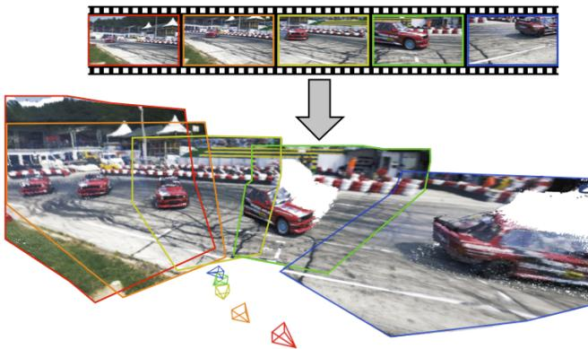  
Figure 1. MegaSaM enables accurate, fast and robust estimation of cameras and scene structure from a casually captured monocular video of a dynamic scene. Top: input video frames (every tenth frame shown). Bottom: our estimated camera and 3D point clouds unprojected by predicted video depths without any postprocessing.

在本研究中，我们提出了MegaSaM，这是一个完整的管道，用于从野外动态场景中的单目视频中进行准确、快速和鲁棒的相机跟踪和深度估计。我们的方法结合了几个先前工作的优点，达到了以前无法实现的质量，如图1所示。具体而言，我们重新审视并扩展了先前的深度视觉SLAM框架用于相机跟踪。深度视觉SLAM系统（如DROID-SLAM [59]）的一个定义特征是它们采用可微分的束调整（BA）层，迭代更新场景几何和相机位姿变量，并且通过相机和光流监督从大量数据中学习中间预测。我们发现，学习的层对于实现更具挑战性的动态视频的准确和高效的相机位姿估计至关重要。在此基础上，我们应对动态场景的关键创新之一是将单目深度先验和运动概率图集成到可微分SLAM范式中。此外，我们分析了视频中结构和相机参数的可观测性，并引入了一种考虑不确定性的全局BA方案，当输入视频对相机参数约束不佳时，这种方案提高了系统的鲁棒性。我们还展示了如何在不需要在测试时微调网络的情况下，准确高效地获得一致的视频深度。在合成和真实世界数据集上的广泛评估表明，我们的系统在相机和深度估计精度方面显著超越了先前和同时期的基准，同时实现了竞争或优越的运行时性能。

# 2. 相关工作

视觉SLAM与SfM。SLAM和SfM用于从视频序列或无结构图像集合中估计相机参数和三维场景结构。传统方法通过特征匹配 [1, 5, 8, 25, 37, 44, 45, 51, 55, 56] 或光度对齐 [9, 10, 38] 首先估计图像之间的二维对应关系。然后，通过捆束调整（BA） [61] 优化三维点位置和相机参数，最小化重投影或光度一致性误差。最近，采用深度神经网络估计成对或长期对应的深度视觉SLAM和SfM系统逐渐出现 [2, 7, 18, 19, 21, 54, 57, 59, 60, 63, 65, 73]，以重建辐射场 [11, 33, 41] 或全局三维点云 [28, 66]。虽然这些方法在相机跟踪和重建方面表现出色，但它们通常假设场景主要是静态的，并且相机帧之间存在足够的基线。因此，在存在场景动态或有限相机视差的情况下，其性能可能显著下降或完全失败。一些近期研究与我们的目标相似，旨在解决这些限制。Robust-CVD [26] 和CasualSAM [78]通过优化空间变化的样条或微调单目深度网络，从动态视频中共同估计相机参数和稠密深度图。Particle-SfM [79] 和LEAP-VO [6] 首先基于长轨迹推断移动物体遮罩，然后利用这些信息在捆束调整过程中降低特征的贡献。并行工作MonST3R [76] 采用来自DuST3R [66] 的三维点云表示，并通过额外的对齐优化进行相机定位。我们的方法共享类似思路，但我们展示了通过将可微分SLAM系统与潜在动态场景的中间预测相结合，可以显著提高性能。单目深度。最近的单目深度预测工作通过在大量合成和真实数据上训练深度神经网络，展示了在自然场景下单图像的强泛化能力 [13, 22, 29, 30, 43, 46, 47, 49, 71, 72, 74, 75]。然而，这些单图像模型往往会产生视频中的时间不一致深度。为了解决这一问题，先前的技术建议通过进行测试时优化 [35, 77] 来微调monodepth模型，或使用变换器或扩散模型直接预测视频深度 [20, 53, 69]。我们的方法遵循第一范式的精神，但我们展示了可以在不对每个视频进行昂贵的网络微调的情况下，获得更好的视频深度质量。动态场景重建。最近的一些研究采用时变辐射场表示，从自然视频中执行动态场景重建和新视角合成 [12, 27, 31, 32, 34, 39, 40, 64, 67, 70]。我们的工作在大多数这些技术之外，因为大多数辐射场重建方法需要相机参数或视频深度图作为输入，而我们的输出可以作为这些系统的输入。

# 3. MegaSaM

给定一个无约束的连续视频序列 $\nu = \{ I _ { i } \in \mathcal { R } ^ { H \times W } \} _ { i = 1 } ^ { N }$，我们的目标是估计相机姿态 $\hat { \mathbf { G } } _ { i } \in S E ( 3 )$、焦距 $\hat { f }$（如果未知）以及稠密视频深度图 $\mathbf { \hat { \mathcal { D } } } = \{ \hat { D } _ { i } \} _ { i = 1 } ^ { \tilde { N } }$，而无需对输入视频中的相机和物体运动施加约束。我们的相机跟踪和视频深度估计模块基于先前的深度视觉SLAM（特别是DROID-SLAM [59]）和随意结构与运动 [78] 框架。在接下来的部分中，我们首先总结旨在跟踪具有足够相机运动视差的静态场景视频的深度视觉SLAM框架的关键组成部分（第3.1节）。随后，我们介绍对该框架的关键修改，包括训练和推理阶段，使其能够快速、可靠且准确地对无约束动态视频进行相机跟踪（第3.2节）。最后，我们展示如何在给定估计的相机参数的情况下高效地估计一致的视频深度（第3.3节）。

# 3.1. 深度视觉SLAM的公式化

像 DROID-SLAM [59] 这样的深度视觉 SLAM 系统具有可微分的学习式束调整（BA）层，该层迭代更新结构和运动参数。具体而言，它们在处理视频时跟踪两个状态变量：每帧的低分辨率视差图 $\hat { \mathbf { d } } _ { i } \in \mathcal { R } ^ { \frac { H } { 8 } \times \frac { W } { 8 } }$ 和相机位姿 $\hat { \bf G } _ { i } \in S E ( 3 )$。在训练和推理阶段，这些变量通过可微分的 BA 层进行迭代更新，该层在动态构建的图像对集合 $( I _ { i } , I _ { j } ) \in \mathcal { P }$ 上操作，以连接具有重叠视场的帧。

给定来自帧图的两个视频帧 $I _ { i }$ 和 $I _ { j }$ 作为输入，DROID-SLAM 学习预测一个二维对应场 $\hat { \mathbf { u } } _ { i j } \in \mathcal { R } ^ { \frac { H } { 8 } \times \frac { W } { 8 } \times 2 }$ 和一个置信度 $\hat { \mathbf { w } } _ { i j } \in \mathcal { R } ^ { \frac { H } { 8 } \times \frac { W } { 8 } }$，通过卷积门控递归单元以迭代方式进行学习：$\big ( \hat { \mathbf { u } } _ { i j } ^ { k + 1 } , \hat { \mathbf { w } } _ { i j } ^ { k + 1 } \big ) ^ { - } = F ( I _ { i } , I _ { j } , \hat { \mathbf { u } } _ { i j } ^ { k } , \hat { \mathbf { w } } _ { i j } ^ { k } )$ ，其中 $k$ 表示第 $k ^ { t h }$ 次迭代。此外，刚性运动对应场也可以通过相机自运动和视差通过多视图约束推导得出：

$$
{ \bf u } _ { i j } = \pi \left( \hat { \bf G } _ { i j } \circ \pi ^ { - 1 } ( { \bf p } _ { i } , \hat { \bf d } _ { i } , K ^ { - 1 } ) , K \right) ,
$$

其中 $\mathbf { p } _ { i }$ 表示像素坐标网格，$\pi$ 表示 $i$ 和 $j$ 之间的相对相机位姿 $\hat { \mathbf { G } } _ { i j } = \hat { \mathbf { G } } _ { j } \circ \hat { \mathbf { G } } _ { i } ^ { - 1 }$，而 $\boldsymbol { K } \in \mathcal { R } ^ { 3 \times 3 }$ 表示相机内参矩阵。可微分的捆束调整。DROID-SLAM 假设焦距已知，但对于现实环境中的视频，焦距通常不是事先已知的。因此，我们通过迭代最小化当前网络预测的光流与根据相机参数和视差推导的刚体运动光流之间的加权重投影代价，来优化相机位姿、焦距和视差 [16]：

$$
\mathcal { C } ( \hat { \mathbf { G } } , \hat { \mathbf { d } } , \hat { f } ) = \sum _ { ( i , j ) \in \mathcal { P } } | | \hat { \mathbf { u } } _ { i j } - \mathbf { u } _ { i j } | | _ { \Sigma _ { i j } } ^ { 2 }
$$

权重 $\begin{array} { r } { \Sigma _ { i j } = \mathrm { d i a g } ( \hat { \mathbf { w } } _ { i j } ) ^ { - 1 } } \end{array}$ 。为了实现可微分的端到端训练，我们使用 Levenberg-Marquardt 算法对公式 2 进行优化：

$$
\left( \mathbf { J } ^ { T } \mathbf { W } \mathbf { J } + \lambda \mathrm { d i a g } ( \mathbf { J } ^ { T } \mathbf { W } \mathbf { J } ) \right) \boldsymbol { \Delta } \boldsymbol { \xi } = \mathbf { J } ^ { T } \mathbf { W } \mathbf { r }
$$

其中 $\Delta \pmb { \xi } = ( \Delta \mathbf G , \Delta \mathbf d , \Delta f ) ^ { T }$ 是状态变量的参数更新，$\mathbf { J }$ 是重投影残差相对于参数的雅可比矩阵，$\mathbf { W }$ 是包含每个帧对的 $\hat { \mathbf { w } } _ { i j }$ 的对角矩阵。$\lambda$ 是在每次 BA 迭代中由网络预测的阻尼因子。我们可以通过将方程 3 左侧的近似 Hessian 除以相机参数（包括位姿和焦距）和视差变量，从而将其分解为以下块矩阵形式：

$$
\begin{array} { r } { \left[ \mathbf { H } _ { \mathbf { G } , f } \quad \mathbf { E } _ { \mathbf { G } , f } \right] \left[ \Delta \xi _ { \mathbf { G } , f } \right] = \binom { \tilde { r } _ { \mathbf { G } , f } } { \tilde { r } _ { \mathbf { d } } } } \\ { \mathbf { E } _ { \mathbf { G } , f } ^ { T } \quad \mathbf { H } _ { \mathbf { d } } } \end{array}
$$

由于每个成对重投影项中仅包含一个视差变量，因此方程式 4 中的 $\mathbf { H _ { d } }$ 是一个对角矩阵，因此我们可以利用 Schur 余子式技巧高效地计算参数更新，这导致了全可微的 BA 更新。

$$
\begin{array} { r l r } & { \Delta \pmb { \xi } _ { \mathbf { G } , f } = \left[ \mathbf { H } _ { \mathbf { G } , f } - \mathbf { E } _ { \mathbf { G } , f } \mathbf { H } _ { \mathbf { d } } ^ { - 1 } \mathbf { E } _ { \mathbf { G } , f } { } ^ { T } \right] ^ { - 1 } \left( \tilde { r } _ { \mathbf { G } , f } - \mathbf { E } _ { \mathbf { G } , f } \mathbf { H } _ { \mathbf { d } } ^ { - 1 } \tilde { r } _ { \mathbf { d } } \right) } & \\ & { \qquad ( 5 ) } & \\ & { \Delta \mathbf { z } = \mathbf { H } _ { \mathbf { d } } ^ { - 1 } ( \tilde { r } _ { \mathbf { d } } - \mathbf { E } _ { \mathbf { G } , f } ^ { T } \Delta \pmb { \xi } _ { \mathbf { G } , f } ) } & { ( 6 ) } \end{array}
$$

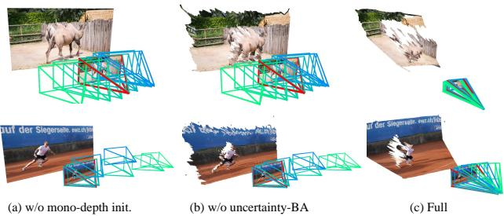  
Figure 2. Ablation on our design choices. From left to right, we visualize cameras and reconstruction from our system (a) without mono-depth initialization, (b) without uncertainty-aware BA, (c) with full configuration. For these difficult near-rotational sequences, our full method produces much better camera and scene geometry.

训练。流动和不确定性预测是通过一组静态场景的合成视频序列进行端到端训练的：

$$
\mathcal { L } _ { \mathrm { s t a t i c } } = \mathcal { L } _ { \mathrm { c a m } } + w _ { \mathrm { f l o w } } \mathcal { L } _ { \mathrm { f l o w } }
$$

其中 $\mathcal{L}_{\mathrm{cam}}$ 和 $\mathcal{L}_{\mathrm{flow}}$ 是损失函数，比较从BA层估计的相机参数和由自我运动引起的光流与相应的真实值。

# 3.2. 扩展到真实场景中的动态视频

深度视觉SLAM在处理静态场景且具有足够相机位移的视频时表现良好，但在动态内容视频或视差有限的视频上性能下降，如图2第一列所示。为了解决这些问题，我们对原始训练和推理流程提出了关键修改。首先，我们的模型预测的物体运动图是与光流和不确定性一起学习的，以便在可微BA层中降低动态元素的权重。其次，我们建议将单目深度估计的先验信息集成到训练和推理流程中，并进行不确定性感知的全局BA，这两者都有助于在具有挑战性的动态视频中区分物体和相机的运动。我们的系统仅在合成数据上进行训练，但我们证明了它对真实世界视频的强大泛化能力。

# 3.2.1 训练

学习运动概率。回顾第 3.1 节，对于每一对选定的图像对 $( I _ { i } , I _ { j } ) \in \mathcal { P }$，我们的模型在每次 BA 迭代中预测 2D 流 $\hat { \mathbf { u } } _ { i j }$ 及相关置信度 $\hat { \mathbf { w } } _ { i j }$，并且这些预测是通过静态场景的合成序列进行监督的。为了扩展模型以处理动态场景，我们可以直接在具有相应真实标注的动态场景视频上训练模型的预测，期望在训练过程中对偶不确定性能够自动涵盖物体运动信息。然而，我们发现这种简单的训练策略由于可微分 BA 层的不稳定训练行为，往往会产生次优结果。

相反，我们建议使用一个额外的网络 $F _ { m }$ 迭代预测物体运动概率图 $\mathbf { m } _ { i } \in \mathcal { R } ^ { \frac { H } { 8 } \times \frac { w } { 8 } } = F _ { m } \left( \{ I _ { i } \} \cup \mathcal { N } ( i ) \right)$，该预测基于 $I _ { i }$ 及其相邻关键帧集合 $\mathcal { N } ( i ) = \{ I _ { j } | ( i , j ) \in \mathcal { P } \}$。该运动图专门被监督以预测基于多帧信息的动态内容对应的像素。在每次 BA 迭代中，我们将成对流动置信度 $\hat { \mathbf { w } } _ { i j }$ 与物体运动图 $\mathbf { m } _ { i }$ 结合形成最终权重，如公式 2 所示：$\tilde { \mathbf { w } } _ { i j } = \hat { \mathbf { w } } _ { i j } \mathbf { m } _ { i }$。此外，我们设计了一个两阶段训练方案，该方案在静态和动态视频的混合数据上训练模型，以有效学习 2D 流动以及运动概率图。在第一阶段的自我运动预训练中，我们通过对静态场景的合成数据进行监督，训练原始深度 SLAM 模型 $F$，预测流动和置信度图（使用公式 7 中的损失），即不使用任何动态视频数据。此阶段有助于模型有效学习仅由自我运动引起的成对流动和对应的置信度。在第二阶段的动态微调中，我们冻结 $F$ 的参数，并在合成动态视频上微调 $F _ { m }$，在每次迭代中通过我们预训练的 $F$ 的特征对 $F _ { m }$ 进行条件处理，以预测运动概率图 $\mathbf { m } _ { i }$，并通过相机损失和交叉熵损失进行监督：

$$
\mathcal { L } _ { \mathrm { d y n a m i c } } = \mathcal { L } _ { \mathrm { c a m } } + w _ { \mathrm { m o t i o n } } \mathcal { L } _ { \mathrm { C E } }
$$

该阶段将学习场景动态与学习二维对应关系解耦，从而为可微BA框架带来了更稳定和有效的训练行为。我们发现这种训练方案对动态视频的准确相机估计结果至关重要，如我们的消融研究所示。我们在图3中可视化了学习到的运动概率图 $\mathbf { m } _ { i }$。视差和相机初始化。DROID-SLAM通过简单地将视差 $\hat { \mathbf { d } }$ 初始化为常数值1。然而，我们发现这种初始化在相机基线有限且场景动态复杂的视频上无法进行准确的相机跟踪。受到最近研究的启发[31, 32, 34, 64]，在训练和推理阶段，我们通过整合单目深度先验执行数据驱动的初始化。在训练期间，我们利用来自DepthAnything [71] 的视差以及借用每个训练序列的真实深度的估计全球尺度和偏移来初始化 $\breve { \mathbf { d } }$。对于每个训练序列，我们首先将前两个相机姿态初始化为真实值，以消除标定模糊，并通过将真实值随机扰动 $25\%$ 来初始化相机焦距。

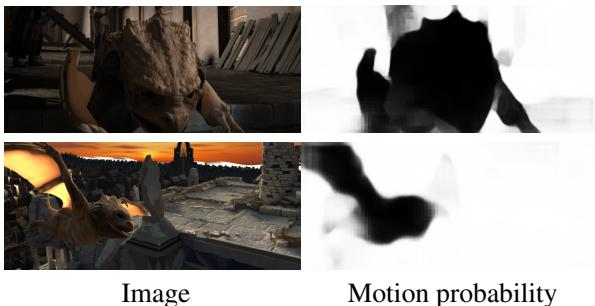  
Figure 3. Learned movement map. Left: input video frame, right: corresponding learned motion probability map.

# 3.2.2 推理

我们的推理流程包含两个组件：（i）前端模块通过执行帧选择和滑动窗口束调整（BA）来注册关键帧的摄像头；（ii）后端模块通过在所有视频帧上执行全局束调整（BA）来细化估计。在这一小节中，我们将描述在推理时所做的修改。

初始化和前端跟踪。类似于训练，我们将单目深度和焦距预测结合到推断管道中。特别地，我们用度量对齐的单目视差图 $\hat { \mathbf { d } } _ { i }$ 初始化每帧的视差图，公式为 $D _ { i } ^ { \mathrm { a l i g n } } = \hat { \alpha } D _ { i } ^ { \mathrm { r e l } } + \hat { \beta }$，其中 $D _ { i } ^ { \mathrm { r e l } }$ 是来自 [71] 的每帧仿射不变视差，视频的全局尺度和位移参数 $( { \hat { \alpha } } , { \hat { \beta } } )$ 通过中位数对齐 $D _ { i } ^ { \mathrm { r e l } }$ 和来自 UniDepth [43] 的额外度量深度估计 $D _ { i } ^ { \mathrm { a b s } }$ 来估计：$\begin{array} { r } { \hat { \alpha } _ { i } = \frac { D _ { i } ^ { \mathrm { a b s } } - \mathrm { m e d i a n } _ { i } ( D _ { i } ^ { \mathrm { a b s } } ) } { D _ { i } ^ { \mathrm { r e l } } - \mathrm { m e d i a n } ( D _ { i } ^ { \mathrm { r e l } } ) } } \end{array}$ ; $\hat { \beta } =$ median $\left( D _ { i } ^ { \mathrm { a b s } } - \hat { \alpha } D _ { i } ^ { \mathrm { r e l } } \right)$ . UniDepth 模型还预测每帧的焦距；我们使用视频帧中的中位数估计来获得初始焦距估计 $\hat { f }$，并在前端阶段内固定。为了初始化 SLAM 系统，我们累积具有足够成对运动的关键帧，直到我们拥有 $N _ { \mathrm { i n i t } } = 8$ 张有效图像。通过执行相机运动仅束调整来初始化这些关键帧的相机位姿，同时将视差变量 $\hat { \mathbf { d } } _ { i }$ 固定为对齐的单目视差 $D _ { i } ^ { \mathrm { a l i g n } }$ 来添加新关键帧，移除旧关键帧，并以滑动窗口的方式执行局部束调整，其中每个关键帧的视差也初始化为对齐单目视差。在这个阶段，束调整的代价函数由重投影误差和单目深度正则化项组成。

$$
\mathcal { C } = \sum _ { ( i , j ) \in \mathcal { P } } | | \widehat { \mathbf { u } } _ { i j } - \mathbf { u } _ { i j } | | _ { \Sigma _ { i j } } ^ { 2 } + w _ { d } \sum _ { i } | | \widehat { \mathbf { d } } _ { i } - D _ { i } ^ { \mathrm { a l i g n } } | | ^ { 2 } .
$$

不确定性感知全局BA。后端模块首先对所有关键帧执行全局BA。然后，该模块执行位姿图优化，以注册非关键帧的位姿。最后，后端模块通过对所有视频帧执行全局BA，进一步优化整个相机轨迹。

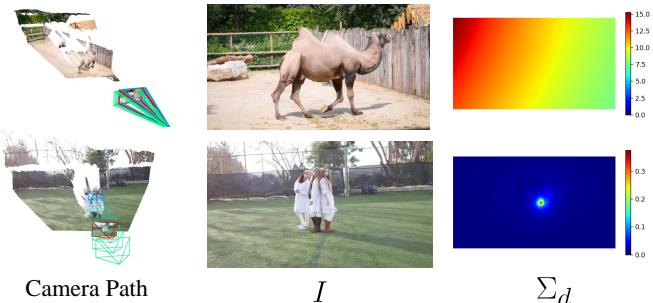  
Figure 4. Visualization of epistemic uncertainty. From left to right, we visualize camera paths, reference image and corresponding epistemic uncertainty of disparity. The geometry is not observable from the top example with little camera parallax, as indicated by the larger uncertainty. The peak on the bottom uncertainty map corresponds to the epipole for forward moving motion.

这个设计提出了一个问题：我们应该（或者何时应该）将第9式中的单深度正则化添加到全局束调整中？一方面，如果输入视频中存在足够的相机基线，我们观察到不需要单深度正则化，因为问题已经得到很好的约束，实际上，单深度的误差可能会降低相机跟踪的准确性。另一方面，如果视频是从具有较小相机基线的旋转相机捕获的，那么仅执行重投影的束调整而不添加额外约束可能会导致退化解，正如图2的第二列所示。为了了解原因，我们探索第4式中的线性系统的近似海森矩阵。如Goli等人所示[14]，给定后验$p ( \boldsymbol { \theta } | \mathcal { T } )$，我们可以使用拉普拉斯近似通过海森矩阵的逆来估计变量的协方差$\Sigma$：$\Sigma _ { \theta } = - \mathbf { H } ( \theta ^ { * } ) ^ { - 1 }$，其中$\theta ^ { * }$是参数的最大后验估计，$\Sigma _ { \theta }$表示估计变量的认知不确定性[23]。由于当输入帧的数量很大时，反转完整的海森矩阵在计算上是昂贵的，我们遵循Ritter等人的方法[48]，通过海森矩阵的对角线来近似$\Sigma _ { \theta }$：

$$
\Sigma _ { \theta } \approx \mathrm { d i a g } \left( - \mathbf { H } ( \theta ^ { * } ) \right) ^ { - 1 }
$$

直观来看，当我们考虑公式 2 中的重投影误差时，估计变量的雅可比矩阵 $\mathbf{J}_{\theta}$ 指示了如果对变量进行扰动，重投影误差将如何变化。因此，当扰动参数对重投影误差的影响较小时，不确定性 $\Sigma_{\theta}$ 会较大。具体而言，考虑视差变量，设想一个极端情况，即输入视频是由静态相机捕获的。在这种情况下，成对重投影误差作为视差的函数不会改变，意味着在估计的视差上有很大的不确定性；也就是说，仅凭视频无法观察到视差。我们在图 4 中可视化了估计的归一化视差的空间不确定性 $\Sigma_{d}$：第一行展示了一个以旋转为主的运动视频，而第二行则是由向前移动的相机捕获的视频。从第三列的色彩条中，我们可以看到，第一例中的视差不确定性范围 $\Sigma_{d}$ 明显更高。

这种不确定性量化为我们提供了摄像机和视差参数可观测性的度量，使我们能够决定在哪里应添加单深度正则化（并且在何时应关闭摄像机焦距优化）。在实践中，我们发现，简单检查归一化视差的中位不确定性和归一化焦距的不确定性在我们测试的所有视频中均表现良好。特别是在完成前端跟踪后，我们从所有关键帧中提取由视差海森矩阵的对角元素并计算其中位数 $\mathrm{med} \left( \mathrm{diag} ( \mathbf{H}_{\mathbf{d}} ) \right)$，以及共享焦距的海森矩阵元素 $H_{f}$。然后，我们根据中位视差海森矩阵设置单深度正则化权重 $w_{d} = \gamma_{d} \exp \left( - \beta_{d} \mathrm{med} \left( \mathrm{diag} ( \mathbf{H_{d}} ) \right) \right)$。换句话说，如果由于摄像机运动视差有限，使得摄像机姿态无法仅通过输入视频进行观测，我们就会启用单深度正则化。此外，如果 $H_{f} < \tau_{f}$，我们会禁用焦距优化，因为这个条件表明焦距可能无法从输入中观测到。

# 3.3. 一致深度优化

可选地，在已估计的相机参数基础上，可以获得比估计的低分辨率视差变量更准确且一致的视频深度。特别地，我们遵循 CasualSAM [78]，并对视频深度以及每帧的随机不确定性图进行额外的一阶优化。我们的目标由三个代价函数组成：

$$
\mathcal { C } _ { \mathrm { c v d } } = w _ { \mathrm { f l o w } } \mathcal { C } _ { \mathrm { f l o w } } + w _ { \mathrm { t e m p } } \mathcal { C } _ { \mathrm { t e m p } } + w _ { \mathrm { p r i o r } } \mathcal { C } _ { \mathrm { p r i o r } }
$$

其中 $\mathcal { C } _ { \mathrm { f l o w } }$ 表示成对的二维光流重投影损失，$\mathcal { C } _ { \mathrm { t e m p } }$ 为时间深度一致性损失，而 $\mathcal { C } _ { \mathrm { p r i o r } }$ 则是尺度不变的单目深度先验损失。我们从一个现成的模块[58]中推导出原始帧分辨率下的二维光学流。需要注意的是，我们的设计与CasualSAM有一些不同之处：(i) 我们构建并优化一系列表示视差和不确定性的变量，而不是进行耗时的单目深度网络微调；(ii) 我们固定相机参数，而不是在优化过程中联合优化相机和深度；(iii) 我们采用表面法线一致性和多尺度深度梯度匹配损失[29, 50]，以替代CasualSAM[78]中使用的深度先验损失。我们发现这些修改使优化时间大大加快，同时视频深度估计更加准确。有关我们损失和优化方案的更多细节，请参阅补充材料。

Table 1. Quantitative comparisons of camera estimation on the Sintel dataset.   

<table><tr><td colspan="4"></td><td colspan="4">Uncalibrated</td></tr><tr><td>Method</td><td></td><td></td><td></td><td></td><td></td><td>ATE RTE RRE ATE RTE RRE Time</td><td></td></tr><tr><td>CasualSAM [78] LEAP-VO [6]</td><td></td><td>0.041 0.023 0.17</td><td></td><td>-</td><td>-</td><td>0.036 0.013 0.20 0.067 0.019 0.47 1.6m -</td><td>1.3s</td></tr><tr><td>ACE-Zero [3] Particle-SfM [79] 0.062 0.032 1.26 0.057 0.038</td><td></td><td>0.053 0.028</td><td></td><td></td><td>0.30 0.065 0.028</td><td>1.92</td><td>10s</td></tr><tr><td></td><td></td><td></td><td></td><td></td><td></td><td>1.64</td><td>21s</td></tr><tr><td>RoDynRF [34]</td><td></td><td>0.110 0.049 1.68 0.109 0.051</td><td></td><td></td><td></td><td>1.32</td><td>15m</td></tr><tr><td>MonST3R [76]</td><td>-</td><td>-</td><td>-</td><td>0.078</td><td>0.038</td><td>0.49</td><td>1.0s</td></tr><tr><td>Ours 0.018 0.008 0.04 0.023 0.008</td><td></td><td></td><td></td><td></td><td></td><td>0.06</td><td>1.0s</td></tr></table>

Table 2. Quantitative comparisons of camera estimation on the DyCheck dataset.   

<table><tr><td colspan="4"></td><td colspan="4">Uncalibrated</td></tr><tr><td>Method</td><td></td><td>ATE RTE RRE</td><td></td><td></td><td></td><td>ATE RTE RRE Time</td><td></td></tr><tr><td>CasualSAM [78] LEAP-VO [6]</td><td></td><td>0.185 0.022 0.167 0.011</td><td>0.23 0.09</td><td>-</td><td>-</td><td>0.209 0.027 0.28 2.8m -</td><td>0.8s</td></tr><tr><td>ACE-Zero [3] Particle-SfM [79]</td><td></td><td>0.062 0.012</td><td>0.11</td><td></td><td></td><td>0.056 0.012 0.12</td><td>1.6s</td></tr><tr><td></td><td></td><td>0.081 0.014</td><td>0.20</td><td></td><td>0.087 0.015</td><td>0.29</td><td>35s</td></tr><tr><td>RoDynRF [34]</td><td></td><td></td><td>0.548 0.074 0.70</td><td></td><td>0.562 0.087</td><td>0.90</td><td>6.6m</td></tr><tr><td colspan="2">MonST3R [76] Ours 0.020 0.005 0.05</td><td>- -</td><td>-</td><td>0.690 0.020 0.005 0.06</td><td>0.078</td><td>0.54</td><td>1.0s</td></tr></table>

# 4. 实验

实现细节。在我们的双阶段训练方案中，首先在静态场景的合成数据上预训练模型，这些数据包括来自TartanAir的163个场景和来自静态Kubric的5K视频。在第二阶段，我们在来自Kubric的11K动态视频上微调运动模块$F_{m}$。每个训练示例由一个7帧的视频序列组成。我们在训练期间设置$w_{\mathrm{flow}} = 0.02, w_{\mathrm{motion}} = 0.1$。使用Adam优化器训练相机跟踪模块[24]大约需要4天，使用8个Nvidia 80G A100s。在初始化和前期阶段，我们设置单目深度正则化权重$w_{d} = 0.05$。在后端阶段，我们设置$\gamma_{d} = 1 \times 10^{-4}, \beta_{d} = 0.05, \tau_{f} = 50$。在一致视频深度优化方面，我们设置$w_{\mathrm{flow}} = w_{\mathrm{prior}} = 1.0, w_{\mathrm{temp}} = 0.2$。我们的优化平均运行时间为1.3 FPS，视频深度分辨率为$336 \times 144$，但我们在$672 \times 288$的分辨率下进行可视化和评估。有关网络架构及其他训练/推理设置的更多细节，请参阅补充材料。

基线。我们将 MegaSaM 与近期的相机姿态估计方法进行比较，涉及已校准（已知焦距）和未校准（未知焦距）视频。ACE-Zero 是一种基于场景坐标回归的最先进相机定位方法，专为静态场景而设计。CasualSAM 和 RoDynRF 通过优化单视深度网络或即时 NGP 联合估计相机参数和稠密场景几何。Particle-SfM 和 LEAP-VO 通过预测来自长期轨迹的运动分割，从动态视频中估计相机，然后利用这些分割在标准视觉里程计或 SfM 流水线中屏蔽动态物体。并行工作 MonST3R 扩展了 Dust3R，以处理动态场景，从输入帧对预测的全局 3D 点云中估计相机参数。为了评估深度精度，我们将我们的输出与 CasualSAM、MonST3R 和 VideoCrafter 的结果进行比较。我们还包括 DepthAnything-V2 的原始单视深度，以确保完整性。我们在同一台装有单个 Nvidia A100 GPU 的机器上运行上述所有基线方法的开源实现。

Table 3. Quantitative comparisons of camera estimation on a dataset of In-the-Wild footage.   

<table><tr><td rowspan="2">Method</td><td colspan="2">Calibrated</td><td colspan="4">Uncalibrated</td></tr><tr><td></td><td>ATE RTE RRE</td><td></td><td>ATE</td><td></td><td>RTE RRE Time</td></tr><tr><td>CasualSAM [78] LEAP-VO [6]</td><td>0.016 0.004</td><td>0.031 0.005 0.31</td><td>0.04</td><td></td><td>0.035 0.005 0.30</td><td>1.1m 0.6s</td></tr><tr><td>ACE-Zero [3] Particle-SfM [79]</td><td>0.091 0.051 0.007</td><td>0.008</td><td>0.08 0.10</td><td>0.091 0.008 0.054 0.007</td><td> 0.09</td><td>4.0s 0.14 49s</td></tr><tr><td></td><td></td><td></td><td></td><td></td><td></td><td>7.6m</td></tr><tr><td>RoDynRF [34]</td><td></td><td>0.116 0.021</td><td>0.34</td><td>0.112 0.031</td><td></td><td>0.39</td></tr><tr><td>MonST3R [76] Ours 0.004 0.001</td><td>-</td><td>-</td><td>-</td><td>0.073</td><td>0.014</td><td>0.18 1.7s</td></tr></table>

Table 4. Quantitative comparisons of video depths. Lower is better for abs-rel and log-rmse, and higher is better for $\delta _ { 1 . 2 5 }$ .   

<table><tr><td colspan="4">Sintel [4]</td><td colspan="3">Dycheck [12]</td></tr><tr><td>Method</td><td></td><td>abs-rel log-rmse</td><td></td><td></td><td>δ1.25 abs-rel log-rmse δ1.25</td><td></td></tr><tr><td>DA-v2 [72]</td><td>0.37</td><td>0.55</td><td>58.6</td><td>0.20</td><td>0.27</td><td>84.7</td></tr><tr><td>DepthCrafter [20]</td><td>0.27</td><td>0.50</td><td>68.2</td><td>0.22</td><td>0.29</td><td>83.7</td></tr><tr><td>CasualSAM [78]</td><td>0.31</td><td>0.49</td><td>64.2</td><td>0.21</td><td>0.30</td><td>78.4</td></tr><tr><td>MonST3R [76]</td><td>0.31</td><td>0.43</td><td>62.5</td><td>0.26</td><td>0.35</td><td>66.5</td></tr><tr><td>Ours</td><td>0.21</td><td>0.39</td><td>73.1</td><td>0.11</td><td>0.20</td><td>94.1</td></tr></table>

# 4.1. 基准测试与指标

MPI Sintel。MPI Sintel [4] 数据集包含由复杂物体运动和摄像机路径组成的动画视频序列。按照 CasualSAM [78] 的方法，我们在数据集中的 18 个序列上评估所有方法，每个序列由 20-50 帧图像组成。DyCheck。DyCheck 数据集 [12] 最初旨在评估新视角合成任务，包含从手持摄像机捕获的动态场景的真实视频。每个视频包含 180-500 帧。我们使用 Shape of Motion [64] 提供的精确相机参数和传感器深度作为真实标注数据。野外数据集。我们进一步在野外动态视频上进行评估。具体而言，我们包含 DynIBaR [32] 使用的 12 个野外视频的比较。这些视频具有较长的时间持续性（100-600 帧）、不受控的摄像机路径和复杂的场景运动。我们通过实例分割 [17] 构建真实标注的运动掩膜，其中实例 ID 由人工指定，并在运行 COLMAP [51] 获得可靠的相机参数之前，用它们来遮蔽移动物体。

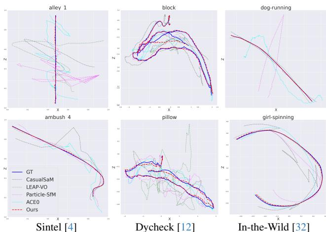  
Figure 5. Visualization of estimated camera trajectories. Due to scene dynamics, our camera estimate (red dash) deviates less from the ground truth camera trajectory (blue solid line) than all other baselines.

指标。我们使用标准误差指标来评估相机位姿估计：绝对平移误差（ATE）、相对平移误差（RTE）和相对旋转误差（RRE）。根据CasualSaM，我们将真实标注的相机轨迹归一化为单位长度，因为不同视频中的相机轨迹可能有显著差异，而轨迹较长的视频在计算指标时可能会有更高的影响。对于所有方法，我们通过利用Umeyama对齐计算全局 $\mathrm{S i m (3)}$ 变换，将估计的相机路径与真实轨迹对齐。我们通过将每种方法的总运行时间除以输入帧数来报告平均运行时间。此外，我们将估计的视频深度的质量与最近的基线进行比较，采用标准深度指标：绝对相对误差、对数均方根误差（log RMSE）和Delta准确度。我们遵循标准评估协议，排除距离超过100米的点。对于所有方法，我们通过全局尺度和偏移估计将预测的视频深度与真实标注对齐。

# 4.2. 定量比较

相机位姿估计在三个基准数据集上的数值结果见表1、表2和表3。我们的方法在所有误差指标上展示了显著的改进，并在标定和未标定的设置下均实现了最佳相机跟踪精度，同时在运行时间上也表现出竞争力。值得注意的是，我们的方法在鲁棒性和准确性方面都超越了同时期的工作MonST3R [76]，尽管MonST3R采用了更先进的动态场景全球3D点云表示。此外，我们在表4中报告了在Sintel和Dycheck上的深度预测结果。我们的深度估计在所有指标上再次显著超越了其他基线。

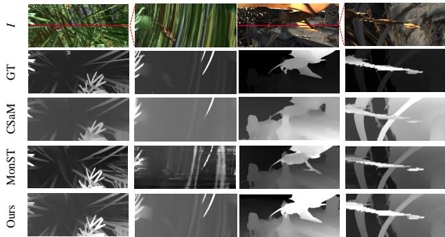  
Figure 6. Visual comparisons of video depths. We compare video depth estimates from our approach and from CasualSAM [78] and MonST3R [76] by visualizing their depth maps (odd columns) and corresponding $x { - } t$ slices (even columns).

Table 5. Ablation study on the Sintel dataset. Sec. 4.3 describes each configuration.   

<table><tr><td></td><td></td><td>Poses</td><td></td><td colspan="2">Depth</td></tr><tr><td>Method</td><td>ATE</td><td>RTE</td><td>RRE</td><td>Abs-Rel</td><td>δ1.25</td></tr><tr><td>Droid-SLAM [59]</td><td>0.030</td><td>0.022</td><td>0.50</td><td></td><td>-</td></tr><tr><td>w/o mono-init.</td><td>0.038</td><td>0.026</td><td>0.49</td><td></td><td></td></tr><tr><td>w/o mi</td><td>0.032</td><td>0.127</td><td>0.14</td><td></td><td>-</td></tr><tr><td>w/o 2-stage train.</td><td>0.035</td><td>0.136</td><td>0.17</td><td></td><td></td></tr><tr><td>w/o u-BA</td><td>0.033</td><td>0.013</td><td>0.11</td><td></td><td>-</td></tr><tr><td>w/ ft-pose</td><td>0.041</td><td>0.018</td><td>0.33</td><td>0.23</td><td>71.2</td></tr><tr><td>w/o new Cprior</td><td>-</td><td>-</td><td>-</td><td>0.36</td><td>72.5</td></tr><tr><td>Full</td><td>0.019</td><td>0.008</td><td>0.04</td><td>0.21</td><td>73.1</td></tr></table>

# 4.3. 消融研究

我们进行了一项消融研究，以验证相机跟踪和深度估计模块的主要设计选择。具体而言，我们评估了不同配置下的相机跟踪结果：1）基础的Droid-SLAM，2）不使用单目深度初始化（w/o mono-init.），3）不进行物体运动图预测 $( \mathbf { w } / \mathbf { o } \ \hat { m } _ { i } )$ ，4）在动态视频上直接训练模型，而不使用提出的两阶段训练方案（w/o 2-stage train.），5）在全局BA期间始终开启单目深度正则化（w/o u-BA）。我们还对视频深度估计的两个主要设计决策进行了消融：1）联合优化相机位姿和深度估计（w/o ft-pose），2）使用原始的CasualSAM单目深度先验损失，而不是我们提议的损失（w/o new $\mathcal { C } _ { p r i o r }$）。如表5所示，我们的完整系统在所有其他替代配置中表现最佳。

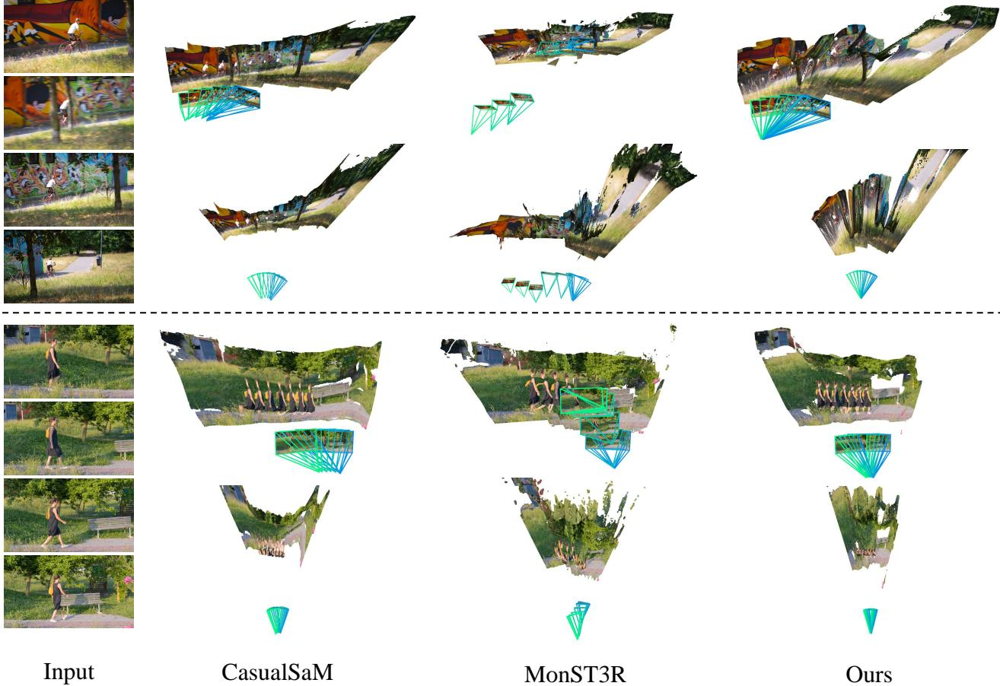  
AV. and MonST3R [76], our system produces moreaccurate camera andgeometry estmates  underlyin dynamiccenes.

# 4.4. 定性比较

# 5. 讨论与结论

图5展示了我们的方法与其他基准在三个基准测试中对估计摄像机轨迹的定性比较，我们的摄像机估计与真实标注数据最为接近。此外，我们在图6中可视化并比较了我们的方法与两种最近的基于优化的技术（CasualSAM [78] 和 MonST3R [76]）的估计视频深度。特别地，我们可视化了参考帧的深度图和整个视频上的相应x-t深度切片。我们的方法再次生成了更准确、更详细且时间上一致的视频深度。局限性。不论在各种自然视频中的出色表现，我们观察到在极具挑战性的场景中我们的方法可能会失效，这与之前的研究发现类似[78]。例如，如果运动物体主导了整个图像，或者系统没有可靠的对象可供跟踪，则摄像机跟踪会失败。关于失败案例的可视化请参见补充材料。此外，我们的系统无法处理焦距变化或视频内强径向失真的视频。将当前视觉基础模型中更好的先验信息融入我们的流程是一个值得探索的未来方向。最后，我们通过可视化来自DAVIS [42] 的具有挑战性实例的估计摄像机和反投影深度图，比较了不同方法在重建和摄像机跟踪质量方面的表现。如图7所示，CasualSaM倾向于产生失真的3D点云，而MonST3R则错误地将旋转摄像机运动视为平移运动。相比之下，我们的方法在这种挑战性输入上生成了更准确的摄像机估计和更一致的几何形状。结论。我们提出了一种能够从动态场景的随意单目视频中生成准确摄像机参数和一致深度的流程。我们的方法有效地扩展到不同时间长度的自然视频，具有不受限制的摄像机路径和复杂的场景动态。我们展示了，通过仔细扩展，之前的深度视觉SLAM和SfM框架能够被扩展以实现对广泛视频的强泛化，并显著超越最近的最先进方法。

参考文献 [1] Sameer Agarwal, Yasutaka Furukawa, Noah Snavely, Ian Simon, Brian Curless, Steven M Seitz, 和 Richard Szeliski. 一天建造罗马. 《美国计算机协会通讯》, 54(10): 105112, 2011. [2] Michael Bloesch, Jan Czarnowski, Ronald Clark, Stefan Leutenegger, 和 Andrew J Davison. Codeslam——学习密集视觉 SLAM 的紧凑可优化表示. 在《IEEE 计算机视觉与模式识别会议论文集》, 页码 2560-2568, 2018. [3] Eric Brachmann, Jamie Wynn, Shuai Chen, Tommaso Cavallari, Áron Monszpart, Daniyar Turmukhambetov, 和 Victor Adrian Prisacariu. 场景坐标重建：通过增量学习重定位器对图像集合进行姿态估计. arXiv 预印本 arXiv:2404.14351, 2024. [4] D. J. Butler, J. Wulff, G. B. Stanley, 和 M. J. Black. 一部自然主义的开源电影用于光流评估. 在《欧洲计算机视觉会议(ECCV)》, 页码 611-625. Springer-Verlag, 2012. [5] Carlos Campos, Richard Elvira, Juan J Gómez Rodríguez, José MM Montiel, 和 Juan D Tardós. Orb-slam3：一个准确的开源库用于视觉、视觉惯性和多图 SLAM. 《IEEE 机器人学与自动化汇刊》, 37(6): 1874-1890, 2021. [6] Weirong Chen, Le Chen, Rui Wang, 和 Marc Pollefeys. Leap-vo：有效的长期任意点跟踪用于视觉里程计. 在《计算机视觉与模式识别会议论文集》, 页码 19844-19853, 2024. [7] Jan Czarnowski, Tristan Laidlow, Ronald Clark, 和 Andrew J Davison. Deepfactors：实时概率密集单目 SLAM. 《IEEE 机器人与自动化信函》, 5(2): 721-728, 2020. [8] Andrew J Davison, Ian D Reid, Nicholas D Molton, 和 Olivier Stasse. Monoslam：实时单相机 SLAM. 《IEEE 模式分析与机器智能汇刊》, 29(6): 1052-1067, 2007. [9] Jakob Engel, Thomas Schöps, 和 Daniel Cremers. Lsd-slam：大规模直接单目 SLAM. 在《欧洲计算机视觉会议论文集》, 页码 834-849. Springer, 2014. [10] Jakob Engel, Vladlen Koltun, 和 Daniel Cremers. 直接稀疏里程计. 《IEEE 模式分析与机器智能汇刊》, 40(3): 611-625, 2017. [11] Yang Fu, Sifei Liu, Amey Kulkarni, Jan Kautz, Alexei A. Efros, 和 Xiaolong Wang. Colmap-free 3d 高斯散射. 在《计算机视觉与模式识别会议论文集》, 页码 20796-20805, 2024. [12] Hang Gao, Ruilong Li, Shubham Tulsiani, Bryan Russell, 和 Angjoo Kanazawa. 单目动态视图合成：现实检查. 《神经信息处理系统进展》, 35: 33768-33780, 2022. [13] Clément Godard, Oisin Mac Aodha, 和 Gabriel J Brostow. 无监督单目深度估计与左右一致性. 在《IEEE 计算机视觉与模式识别会议论文集》, 页码 270-279, 2017. [14] Lily Goli, Cody Reading, Silvia Sellán, Alec Jacobson, 和 Andrea Tagliasacchi. Baves' ravs：神经辐射场的不确定性量化. 在《计算机视觉与模式识别会议论文集》, 页码 20061-20070, 2024. [15] Klaus Greff, Francois Belletti, Lucas Beyer, Carl Doersch, Yilun Du, Daniel Duckworth, David J Fleet, Dan Gnanapragasam, Florian Golemo, Charles Herrmann, Thomas Kipf, Abhijit Kundu, Dmitry Lagun, Issam Laradji, Hsueh-Ti (Derek) Liu, Henning Meyer, Yishu Miao, Derek Nowrouzezahrai, Cengiz Oztireli, Etienne Pot, Noha Radwan, Daniel Rebain, Sara Sabour, Mehdi S. M. Sajjadi, Matan Sela, Vincent Sitzmann, Austin Stone, Deqing Sun, Suhani Vora, Ziyu Wang, Tianhao Wu, Kwang Moo Yi, Fangcheng Zhong, 和 Andrea Tagliasacchi. Kubric：一个可扩展的数据集生成器. 2022. [16] Annika Hagemann, Moritz Knorr, 和 Christoph Stiller. 从视频中深度几何感知相机自校准. 在《IEEE/CVF 国际计算机视觉会议论文集》, 页码 3438-3448, 2023. [17] Kaiming He, Georgia Gkioxari, Piotr Dollár, 和 Ross Girshick. Mask R-CNN. 在《IEEE 国际计算机视觉会议论文集》, 页码 2961-2969, 2017. [18] Xingyi He, Jiaming Sun, Yifan Wang, Sida Peng, Qixing Huang, Hujun Bao, 和 Xiaowei Zhou. 无需检测器的运动结构恢复. 在《IEEE/CVF 计算机视觉与模式识别会议论文集》, 页码 21594-21603, 2024. [19] Aleksander Holynski, David Geraghty, Jan-Michael Frahm, Chris Sweeney, 和 Richard Szeliski. 使用扩展特征减少运动结构恢复中的漂移. 在《2020 国际三维视觉会议(3DV)》, 页码 51-60. IEEE, 2020. [20] Wenbo Hu, Xiangjun Gao, Xiaoyu Li, Sijie Zhao, Xiaodong Cun, Yong Zhang, Long Quan, 和 Ying Shan. Depthcrafter：为开放世界视频生成一致的长期深度序列. arXiv 预印本 arXiv:2409.02095, 2024. [21] Yoni Kasten, Wuyue Lu, 和 Haggai Maron. 通过点跟踪处理从普通视频中快速获取 3D. 在《第三十八届神经信息处理系统年会》. [22] Bingxin Ke, Anton Obukhov, Shengyu Huang, Nando Metzger, Rodrigo Caye Daudt, 和 Konrad Schindler. 重新利用基于扩散的图像生成器进行单目深度估计. 在《IEEE/CVF 计算机视觉与模式识别会议论文集》, 页码 9492-9502, 2024. [23] Alex Kendall 和 Yarin Gal. 在计算机视觉中，贝叶斯深度学习需要哪些不确定性？《神经信息处理系统进展》, 30, 2017. [24] Diederik P. Kingma 和 Jimmy Ba. Adam：随机优化方法. CoRR, abs/1412.6980, 2014. [25] Georg Klein 和 David Murray. 小型增强现实工作空间的并行跟踪与映射. 在《2007 第六届 IEEE 与 ACM 国际混合与增强现实研讨会》, 页码 225-234. IEEE, 2007. [26] Johannes Kopf, Xuejian Rong, 和 Jia-Bin Huang. 稳健一致的视频深度估计. 在《计算机视觉与模式识别会议论文集》, 2021. [27] Jiahui Lei, Yijia Weng, Adam Harley, Leonidas Guibas, 和 Kostas Daniilidis. Mosca：通过4D运动支架进行动态高斯融合. arXiv 预印本 arXiv:2405.17421, 2024. [28] Vincent Leroy, Yohann Cabon, 和 Jérôme Revaud. 使用 mast3r 将图像匹配与 3D 结合. arXiv 预印本 arXiv:2406.09756, 2024. [29] Zhengqi Li 和 Noah Snavely. Megadepth：从互联网照片中学习单视图深度预测. 在《IEEE 计算机视觉与模式识别会议论文集》, 页码 2041-2050, 2018. [30] Zhengqi Li, Tali Dekel, Forrester Cole, Richard Tucker, Noah Snavely, Ce Liu, 和 William T Freeman. 通过观察静止的人学习动态人的深度. 在《计算机视觉与模式识别会议论文集》, 页码 4521-4530, 2019. [31] Zhengqi Li, Simon Niklaus, Noah Snavely, 和 Oliver Wang. 神经场流场用于动态场景的时空视图合成. 在《IEEE/CVF 计算机视觉与模式识别会议论文集》, 页码 6498-6508, 2021. [32] Zhengqi Li, Qianqian Wang, Forrester Cole, Richard Tucker, 和 Noah Snavely. Dynibar：神经动态图像渲染. 在《计算机视觉与模式识别会议论文集》, 页码 4273-4284, 2023. [33] Chen-Hsuan Lin, Wei-Chiu Ma, Antonio Torralba, 和 Simon Lucey. Barf：束调整神经辐射场. 在《计算机视觉与模式识别会议论文集》, 页码 5741-5751, 2021. [34] Yu-Lun Liu, Chen Gao, Andreas Meuleman, Hung-Yu Tseng, Ayush Saraf, Changil Kim, Yung-Yu Chuang, Johannes Kopf, 和 Jia-Bin Huang. 稳健动态辐射场. 在《计算机视觉与模式识别会议论文集》, 页码 1-12, 2023. [35] Xuan Luo, Jia-Bin Huang, Richard Szeliski, Kevin Matzen, 和 Johannes Kopf. 一致的视频深度估计. 《ACM 图形学事务》（ToG）, 39(4): 711, 2020. [36] Thomas Müller, Alex Evans, Christoph Schied, 和 Alexander Keller. 使用多分辨率哈希编码的瞬时神经图形原语. 《ACM 图形学事务》，41(4): 102:1-102:15, 2022. [37] Raul Mur-Artal, Jose Maria Martinez Montiel, 和 Juan D Tardos. Orb-slam：一个多功能且准确的单目 SLAM 系统. 《IEEE 机器人学汇刊》，31(5): 1147-1163, 2015. [38] Richard A Newcombe, Steven J Lovegrove, 和 Andrew J Davison. Dtam：实时稠密跟踪与映射. 在《国际计算机视觉大会》（ICCV）论文集中，页码 2320-2327. IEEE, 2011. [39] Keunhong Park, Utkarsh Sinha, Jonathan T Barron, Sofien Bouaziz, Dan B Goldman, Steven M Seitz, 和 Ricardo Martin-Brualla. Nerfies：可变形的神经辐射场. 在《计算机视觉与模式识别会议论文集》，页码 5865-5874, 2021. [40] Keunhong Park, Utkarsh Sinha, Peter Hedman, Jonathan T Barron, Sofien Bouaziz, Dan B Goldman, Ricardo Martin-Brualla, 和 Steven M Seitz. Hypernerf：用于拓扑变化神经辐射场的高维表示. arXiv 预印本 arXiv:2106.13228, 2021. [41] Keunhong Park, Philipp Henzler, Ben Mildenhall, Jonathan T Barron, 和 Ricardo Martin-Brualla. Camp：神经辐射场的相机预处理. 《ACM 图形学事务》（TOG），42(6): 111, 2023. [42] F. Perazzi, J. Pont-Tuset, B. McWilliams, L. Van Gool, M. Gross, 和 A. Sorkine-Hornung. 一组视频对象分割的基准数据集与评估方法. 在《计算机视觉与模式识别会议》, 2016. [43] Luigi Piccinelli, Yung-Hsu Yang, Christos Sakaridis, Mattia Segu, Siyuan Li, Luc Van Gool, 和 Fisher Yu. UniDepth：通用单目度量深度估计. 在《计算机视觉与模式识别会议论文集》，2024. [44] Marc Pollefeys, Luc Van Gool, Maarten Vergauwen, Frank Verbiest, Kurt Cornelis, Jan Tops, 和 Reinhard Koch. 使用手持相机的视觉建模. 《计算机视觉国际期刊》，59: 207-232, 2004. [45] Marc Pollefeys, David Nistér, J-M Frahm, Amir Akbarzadeh, Philippos Mordohai, Brian Clipp, Chris Engels, David Gallup, S-J Kim, Paul Merrell, 等等. 基于视频的详细实时城市 3D 重建. 《计算机视觉国际期刊》，78: 143-167, 2008. [46] René Ranftl, Katrin Lasinger, David Hafner, Konrad Schindler, 和 Vladlen Koltun. 朝向鲁棒的单目深度估计：混合数据集以实现零-shot 跨数据集转移. 《IEEE 模式分析与机器智能汇刊》，44(3): 1623-1637, 2020. [47] René Ranftl, Alexey Bochkovskiy, 和 Vladlen Koltun. 稠密预测的视觉变换器. 在《计算机视觉与模式识别会议论文集》，页码 12179-12188, 2021. [48] Hippolyt Ritter, Aleksandar Botev, 和 David Barber. 用于神经网络的可扩展拉普拉斯近似. 在第六届国际学习表示会议，ICLR 2018 会议论文集. 国际表示学习会议，2018. [49] Saurabh Saxena, Charles Herrmann, Junhwa Hur, Abhishek Kar, Mohammad Norouzi, Deqing Sun, 和 David J Fleet. 扩散模型在光流和单目深度估计中的惊人有效性. 《神经信息处理系统进展》，36, 2024. [50] Mohamed Sayed, John Gibson, Jamie Watson, Victor Prisacariu, Michael Firman, 和 Clément Godard. Simplerecon：无需 3D 卷积的 3D 重建. 在《欧洲计算机视觉会议》, 页码 1-9. Springer, 2022. [51] Johannes L Schönberger 和 Jan-Michael Frahm. 运动重建再探. 在《IEEE 计算机视觉与模式识别会议论文集》, 页码 4104-4113, 2016. [52] Johannes L Schönberger, Enliang Zheng, Jan-Michael Frahm, 和 Marc Pollefeys. 用于无构造多视图立体的逐像素视图选择. 在《计算机视觉ECCV 2016：第十四届欧洲会议，阿姆斯特丹，荷兰，2016年10月11-14日，会议剪辑，第三部分》14, 页码 501-518. Springer, 2016. [53] Jiahao Shao, Yuanbo Yang, Hongyu Zhou, Youmin Zhang, Yujun Shen, Matteo Poggi, 和 Yiyi Liao. 从视频扩散先验中学习时间一致性视频深度. arXiv 预印本 arXiv:2406.01493, 2024. [54] Shihao Shen, Yilin Cai, Wenshan Wang, 和 Sebastian Scherer. Dytanvo：在动态环境中视觉里程计与运动分割的联合优化. 在2023年IEEE国际机器人与自动化会议（ICRA），页码 4048-4055. IEEE, 2023. [55] Noah Snavely, Steven M Seitz, 和 Richard Szeliski. 摄影旅游：在 3D 中探索照片集合. 在《ACM SIGGRAPH 2006 会议论文集》，页码 835-846. 2006. [56] Chris Sweeney, Aleksander Holynski, Brian Curless, 和 Steve M Seitz. 用于全景样式视频的运动结构恢复. arXiv 预印本 arXiv:1906.03539, 2019. [57] Chengzhou Tang 和 Ping Tan. Ba-net：密集束调整网络. arXiv 预印本 arXiv:1806.04807, 2018. [58] Zachary Teed 和 Jia Deng. Raft：用于光流的递归全配对场变换. 在《计算机视觉ECCV 2020：第十六届欧洲会议，格拉斯哥，英国，2020年8月23-28日，会议论文集，第二部分》16, 页码 402-419. Springer, 2020.

[60] 扎卡里·蒂德、拉哈夫·利普森和贾·邓。深度补丁视觉里程计。神经信息处理系统进展，36，2024年。 [61] 比尔·特里格斯、菲利普·F·麦克劳克兰、理查德·I·哈特利和安德鲁·W·菲茨吉本。束调整——现代合成。在视觉算法：理论与实践：国际视觉算法研讨会，希腊科孚岛，1999年9月21-22日论文集，298-372页。施普林格，2000年。 [62] 梅山·乌梅亚马。两种点模式之间变换参数的最小二乘估计。IEEE模式分析与机器智能杂志，13(04)：376-380，1991年。 [63] 王建元、尼基塔·卡拉耶夫、克里斯蒂安·鲁普雷赫特和大卫·诺沃特尼。Vggsfm：基于视觉几何的深度运动重建。在IEEE/CVF计算机视觉与模式识别会议论文集中，21686-21697页，2024年。 [64] 王倩倩、维基·叶、杭高、杰克·奥斯汀、李铮奇和安久·卡纳扎瓦。运动形状：从单个视频中进行4D重建。arXiv预印本arXiv:2407.13764，2024年。 [65] 王森、罗纳德·克拉克、洪凯·温和尼基·特里戈尼。Deepvo：朝着端到端视觉里程计的发展，利用深度递归卷积神经网络。在2017年IEEE国际机器人与自动化会议（ICRA），2043-2050页。IEEE，2017年。 [66] 王书哲、文森特·勒鲁瓦、约翰·卡彭、博里斯·奇德洛夫斯基和杰罗姆·雷沃德。Dust3r：让几何3D视觉变得简单。在计算机视觉与模式识别会议（CVPR）论文集中，20697-20709页，2024年。 [67] 王志俊、邢翼杨、邱红·申、郑相江和辛超·王。Gflow：从单目视频中恢复4D世界。arXiv预印本arXiv:2405.18426，2024年。 [68] 王文珊、朱德龙、王向伟、胡耀宇、邱宇恒、王晨、胡雅飞、阿希什·卡普尔和塞巴斯蒂安·舍雷。TartanAir：推动视觉SLAM极限的数据集。2020年。 [69] 王怡然、史闽、李佳琪、黄紫昊、曹志国、张建明、谢凯和林国生。神经视频深度稳定器。在计算机视觉与模式识别会议（CVPR）论文集中，9466-9476页，2023年。 [70] 吴润迪、高瑞奇、本·普尔、亚历克斯·特雷维西克、郑长熙、乔纳森·T·巴伦和亚历山大·霍林斯基。Cat4d：利用多视角视频扩散模型创建任何东西的4D。arXiv预印本arXiv:2411.18613，2024年。 [71] 杨立和、康炳毅、黄子龙、徐晓刚、冯佳仕和赵衡霄。Depth anything：释放大规模无标注数据的力量。在CVPR，2024年。 [72] 杨立和、康炳毅、黄子龙、赵震、徐晓刚、冯佳仕和赵恒煌。Depth anything v2。arXiv预印本arXiv:2406.09414，2024年。 [73] 杨楠、卢卡斯·冯·斯图姆贝格、王锐和丹尼尔·克雷默斯。D3vo：深度深度、深度姿态和深度不确定性用于单目视觉里程计。在计算机视觉与模式识别会议（CVPR）论文集中，1281-1292页，2020年。 [74] 尹伟、张建明、王奥利华、西蒙·尼克劳斯、梅龙和陈春华。学习从单张图像恢复3D场景形状。在计算机视觉与模式识别会议（CVPR）论文集中，204-213页，2021年。 [75] 尹伟、张驰、陈昊、蔡志鹏、余刚、王凯旋、陈晓志和陈春华。Metric3d：实现零样本度量3D预测从单张图像。在计算机视觉与模式识别会议（CVPR）论文集中，9043-9053页，2023年。 [76] 张俊义、查尔斯·赫尔曼、洪华·赫、瓦伦·贾帕尼、特雷弗·达雷尔·福雷斯特·科尔、孙德庆和杨明炫。MonST3R：在运动存在下进行几何估计的简单方法。arXiv预印本arXiv:2410.03825，2024年。 [77] 张周通、福雷斯特·科尔、理查德·塔克、威廉·T·弗里曼和塔丽·德凯尔。视频中运动物体的深度一致性。ACM图形学汇刊（ToG），40(4)：112，2021年。 [78] 张周通、福雷斯特·科尔、李铮奇、迈克尔·鲁宾斯坦、诺亚·斯纳维和威廉·T·弗里曼。来自随意视频的结构与运动。在欧洲计算机视觉会议上，2037页。施普林格，2022年。 [79]赵望、刘少辉、郭恒凯、王文平和刘勇进。Particlesfm：利用稠密点轨迹在野外定位运动相机。在欧洲计算机视觉会议上，523-542页。施普林格，2022年。

# A. 实现细节

# A.1. 系统概述

图9展示了我们的MegaSaM系统的概述。我们将相机和场景结构估计的问题分为两个阶段，遵循传统SfM流程的思路。在第一阶段，我们通过可微分的束调整（BA）从输入的单目视频估计相机位姿$\hat { \mathbf { G } }$、焦距$\hat { \hat { f } }$和低分辨率视差$\hat { \mathbf { d } }$，其中我们用从现成模型预测的单目深度图初始化$\hat { \mathbf { d } }$。在第二个一致性视频深度估计阶段，我们固定估计的相机参数，并通过强制施加由成对的2D光流引起的流动和深度损失，对视频深度和不确定性图进行一阶优化。

# A.2. 框架与架构

我们遵循 DROID-SLAM [58] 进行特征提取、相关特征构建，并通过流、置信度和运动概率预测执行迭代的 BA 更新。模型的每个输入是一对视频帧 $( I _ { i } , I _ { j } )$。特征提取。我们使用上下文和特征编码器将每个输入视频帧编码为两个不同的低分辨率特征图，这些特征图的分辨率为输入图像的 $\frac { 1 } { 8 }$，如图 11 所示。相关特征构建。相关层从图像对编码的特征构建一个 4D 相关体，相关体中的每个条目包含来自图像对的一对特征向量的内积。

迭代更新。在每个迭代的 BA 步骤 $k$ 中，我们通过流、置信度和运动概率预测来更新相机参数和低分辨率视差。具体而言，我们首先在合成视频数据上预训练 $F$（在主论文中的自我运动预训练），以学习预测流和相应的流置信度，如图 10 中的灰色方块所示。在第二个动态微调阶段，我们冻结 $F$ 的参数，并微调运动模块 $F _ { m }$，以预测基于 ConvRGU 特征的额外物体运动概率图，如图 10 中的蓝色方块所示。在运动模块中，我们首先执行 2D 空间平均池化，以向模型提供全局空间信息；然后沿时间轴进行平均池化，以融合来自 $I _ { i }$ 及其所有相邻关键帧 $I _ { j }$ （其中 $j \in \mathcal { N } ( i )$）的信息。

# A.3. 一致性视频深度优化

回顾我们主要论文第3.3节，我们遵循CasualSAM [78] 通过对视频视差 $\tilde { \ D _ { i } }$ 进行额外的一阶优化，以及对每帧的自发不确定性图 $\hat { M _ { i } }$ 来估计一致的视频深度。然而，与CasualSAM中联合优化相机参数和场景结构不同，我们将相机参数固定，这与COLMAP [51, 52] 等传统结构从运动(SfM)管道中的做法一致。我们的目标包含三个主要成本函数：

$$
\mathcal { C } _ { \mathrm { c v d } } = w _ { \mathrm { f l o w } } \mathcal { C } _ { \mathrm { f l o w } } + w _ { \mathrm { t e m p } } \mathcal { C } _ { \mathrm { t e m p } } + w _ { \mathrm { p r i o r } } \mathcal { C } _ { \mathrm { p r i o r } }
$$

我们将视频中的物体运动视为流重投影和深度一致性误差的异方差随机不确定性，并假设潜在噪声服从拉普拉斯分布。具体来说，对于每一对选定的 $( I _ { i } , I _ { j } )$，流重投影损失 $\mathcal { C } _ { \mathrm { f l o w } }$ 比较由不确定性 $\hat { M _ { i } }$ 加权的 $l _ { 1 }$ 损失，在离线流估计器获得的流 $\mathsf { f l o w } _ { i \to j }$ 和通过我们的估计的相机运动与视差所诱导的对应关系 $\mathbf { u } _ { i j }$ 之间进行比较，约束为多视图约束：

$$
\mathcal { C } _ { \mathrm { f l o w } } ^ { i  j } = \hat { M } _ { i } | | \mathbf { u } _ { i j } - \mathbf { p } _ { i } , \mathrm { H o w } _ { i  j } ( \mathbf { p } _ { i } ) | | _ { 1 } + \log ( \frac { 1 } { \hat { M } _ { i } } ) ,
$$

$$
\mathbf { u } _ { i j } = \pi \left( \hat { \mathbf { G } } _ { i j } \circ \pi ^ { - 1 } ( \mathbf { p } _ { i } , \hat { D } _ { i } , K ^ { - 1 } ) , K \right)
$$

$\mathcal { C } _ { \mathrm { t e m p } }$ 是一种基于不确定性的时间深度损失，旨在根据估计的二维光流促进像素差异的时间一致性。

$$
\begin{array} { r l r } & { \mathcal { C } _ { \mathrm { t e m p } } ^ { i  j } = \hat { M } _ { i } \delta ( \mathbf { P } _ { z } ^ { i  j } , \hat { D } _ { j } ( \mathbf { p } + \mathrm { f l o w } _ { i  j } ( \mathbf { p } ) ) ) + \log ( \frac { 1 } { \hat { M } _ { i } } ) } & \\ & { \delta ( a , b ) = | | \operatorname* { m a x } ( \frac { a } { b } , \frac { b } { a } ) | | _ { 1 } } & \\ & { \mathbf { P } _ { z } ^ { i  j } = ( D _ { i } ( \mathbf { p } ) \mathbf { R } _ { i  j } \mathbf { K } ^ { - 1 } \mathbf { p } + \mathbf { t } _ { i  j } ) _ { [ z ] } } & { ( 1 5 ) } \end{array}
$$

$\mathbf { R } _ { i j }$ 和 $\mathbf { t } _ { i \to j }$ 分别是$I _ { i }$和$I _ { j }$之间的相对相机旋转和平移；$ _ { [ z ] }$ 是一个操作符，用于提取三维点向量的第三个分量（即$z$值）。$\mathcal { C } _ { \mathrm { p r i o r } }$是一个深度先验损失，用于防止最终估计的视频视差过度偏离来自单目深度网络的初始估计，它由三个损失组成：

$$
\mathcal { C } _ { \mathrm { p r i o r } } = \mathcal { C } _ { \mathrm { s i } } + w _ { \mathrm { g r a d } } \mathcal { C } _ { \mathrm { g r a d } } + w _ { \mathrm { n o r m a l } } \mathcal { C } _ { \mathrm { n o r m a l } }
$$

尺度不变深度损失 $\mathcal { C } _ { \mathrm { s i } }$ 计算优化后的对数视差 $\log \hat { D } _ { i }$ 与初始对数视差之间所有对的均方误差。从度量对齐的单深度预测中得到的对数视差 $\text{log} \mathcal { D } _ { \text{align} }$，$\mathcal { C } _ { \mathrm { g r a d } }$ 是一个多尺度的尺度不变梯度匹配项 [29]，它计算估计对数视差梯度和初始对数视差梯度之间的 $l _ { 1 }$ 差异，其中 $R ^ { s } ( \mathbf { p } )$ 为像素位置 p 和尺度 $s$ 处的对数深度差异图。换句话说，我们仅对当前估计的视差显著偏离原始单深度的像素应用多尺度梯度匹配损失。

$$
\begin{array} { l } { { \displaystyle { \mathcal C } _ { \mathrm { s i } } = \frac { 1 } { n } \sum _ { ( { \bf p } ) } ( R ( { \bf p } ) ) ^ { 2 } - \frac { 1 } { n ^ { 2 } } \left( \sum _ { ( { \bf p } ) } R ( { \bf p } ) \right) ^ { 2 } } \ ~ } \\ { { \displaystyle R _ { i } = \log ( \hat { D } _ { i } ) - \log ( D _ { i } ^ { \mathrm { a l i g n } } ) } . } \end{array}
$$

$$
\begin{array} { c } { { \displaystyle \mathcal { C } _ { \mathrm { g r a d } } = \frac { 1 } { n } \sum _ { s } w _ { \nabla } ^ { s } ( \mathbf { p } ) \sum _ { \mathbf { p } } \left( | \nabla _ { x } R ^ { s } ( \mathbf { p } ) | + | \nabla _ { y } R ^ { s } ( \mathbf { p } ) | \right) } } \\ { { \displaystyle w _ { \nabla } ^ { s } ( \mathbf { p } ) = 1 - \exp \left( - \beta _ { \nabla } \left( \nabla _ { x } R ^ { s } ( \mathbf { p } ) + \nabla _ { y } R ^ { s } ( \mathbf { p } ) \right) \right) } } \end{array} \left( 1 8 \right.
$$

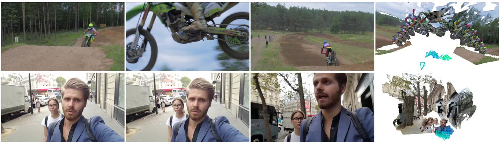

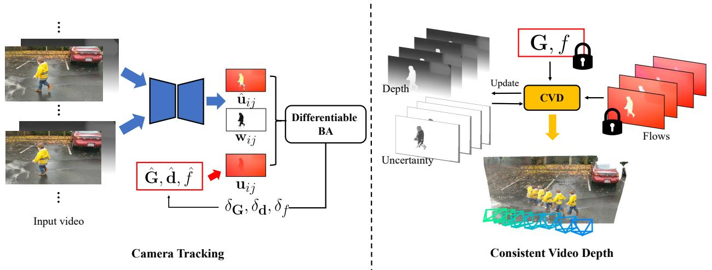  
flow $\hat { \mathbf { u } } _ { i j }$ , confidence, and movement probability maps $\mathbf { w } _ { i j }$ and minimize weighted reprojection error between predicted flow $\hat { \mathbf { u } } _ { i j }$ and flow induced by ego-motion $\mathbf { u } _ { i j }$ .Wealso initializestimated disparity with mono-dept predicted from off-the-shelmodels [43, 1. Right: we minimizing flow and depth losses through pairwise 2D optical flows.

$\mathcal { C } _ { \mathrm { n o r m a l } }$ 是一种表面法向损失，旨在鼓励从估计的视差导出的法向 $\hat { \mathbf { N } } ( \mathbf { p } )$ 与从初始度量对齐的单目视差导出的表面法向 $\mathbf { N } ^ { \mathrm { a l i g n } }$ 之间保持接近。

$$
\mathcal { C } _ { \mathrm { n o r m a l } } = \sum _ { \mathbf { p } } 1 - \hat { \mathbf { N } } ( \mathbf { p } ) \cdot \mathbf { N } ^ { \mathrm { a l i g n } } ( \mathbf { p } )
$$

在我们的实验中，我们设定 $w _ { \mathrm { g r a d } } = 1, w _ { \mathrm { n o r m a l } } = 4, \beta _ { \nabla } = 5$。我们简单地从一组固定的间隔中选择图像对 $( I _ { i } , I _ { j } )$，这遵循了先前的工作 [78]：$j \in ( i + 1 , i + 2 , i + 4 , i + 8 , i + 1 5 )$。在优化过程中，我们从度量对齐的单目深度初始化视差变量，方法是结合来自现成模块的估计，如主文献 [43, 71] 中所述，并用我们摄像头跟踪模块预测的物体运动概率图初始化不确定性图。优化首先进行“热身”阶段，持续100步，通过固定视频视差变量并使用上述损失优化每帧不确定性图、每帧比例和位移变量。然后，视差图和不确定性图将在上述损失的约束下共同优化另一个400步。

# A.4. 附加细节

训练损失。我们通过姿态损失和光流损失的组合对网络进行监督。光流损失适用于相邻帧对。我们计算由预测的深度和姿态引起的光流，以及由真实深度和姿态引起的光流。损失被视为两个光流场之间的平均 L2 距离。

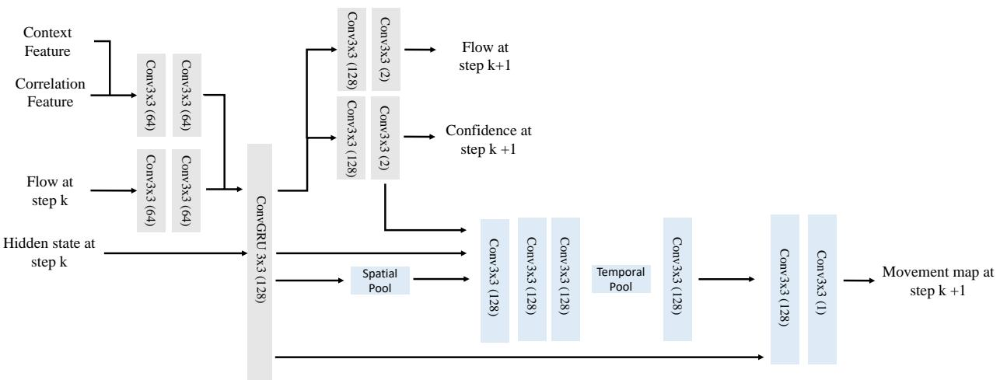  
Figure 10. Architecture of fow, confidence and movement map predictor. The gray blocks belong to the nework $F$ for flow and confidence prediction, and the blue blocks belong to the network $F _ { m }$ for object movement map prediction. In the first stage, we perform ego-motion pretraining for $F$ . In the second stage, we perform dynamic fine-tuning for $F _ { m }$ while fixing the parameters of $F$ .

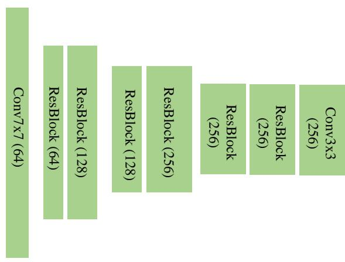  
Figure 11. Architecture of the feature and context encoders. Both encoders extract low-resolution features from input video frames at $\frac { 1 } { 8 }$ of the original resolution.

给定真实标注数据 $\{ \mathbf { T } _ { i } \} _ { i = 1 } ^ { N }$ 和预测位姿 $\{ \mathbf { G } _ { i } \} _ { i = 1 } ^ { N }$ 之间的距离，定义如下损失函数：$\begin{array} { r } { \mathcal { L } _ { p o s e } = \sum _ { i } | | \mathrm { L o g } _ { S E ( 3 ) } ( \mathbf { T } _ { i } ^ { - 1 } \cdot \mathbf { G } _ { i } ) | | _ { 2 } } \end{array}$ 我们对每次束调整(BA)迭代的输出应用损失，其权重以指数方式增加，使用 $\gamma = 0 . 9 ^ { k }$，其中 $k$ 表示第 $k$ 次 BA 迭代。训练与推理细节 在我们的两阶段训练方案中，我们首先在静态场景的合成数据上预训练我们的模型，这些数据包括来自 TartanAir [68] 的 163 个场景和来自静态 Kubric [15] 的 5K 视频。在第二阶段，我们在来自 Kubric [15] 的 11K 动态视频上微调运动模块 $F _ { m }$。每个训练示例由一个 7 帧的视频序列组成。我们首先基于平均自运动引起的光流大小计算每对视频帧之间的距离矩阵。然后根据构造的距离矩阵动态生成训练序列，我们随机采样每帧，使得它们之间的平均光流在 $0 . 5 \mathrm { p x }$ 和 $6 4 \mathrm { p x }$ 之间。在相机跟踪模块中，我们将视频视差 $\hat { \mathbf { d } }$ 进行归一化，使其 98 百分位数为 2；同时在每个束调整阶段通过将其除以输入图像分辨率来归一化焦距。

# B. 限制条件

尽管在各种真实场景的视频中表现优异，但我们观察到在极具挑战性的场景中，我们的方法可能会失败，这与之前的研究结果相似。例如，当移动物体在整个图像中占据主导地位或系统无法可靠追踪任何目标时，相机跟踪会失败，如图8的第一行所示。此外，我们的方法在相机运动和物体运动共线的动态视频上也表现不佳，如图8的第二行所示。