# PaLM-E: An Embodied Multimodal Language Model

Danny Driess 1 2 Fei Xia 1 Mehdi S. M. Sajjadi 3 Corey Lynch 1 Aakanksha Chowdhery 3 Brian Ichter 1 Ayzaan Wahid 1 Jonathan Tompson 1 Quan Vuong 1 Tianhe ${ \bf { V } } { \bf { u } } ^ { 1 }$ Wenlong Huang 1 Yevgen Chebotar1 Pierre Sermanet 1 Daniel Duckworth 3 Sergey Levine 1 Vincent Vanhoucke1 Karol Hausman 1 Marc Toussaint 2 Klaus Greff 3 Andy Zeng 1 Igor Mordatch 3 Pete Florence 1 1Robotics at Google 2TU Berlin 3Google Research https://palm-e.github.io

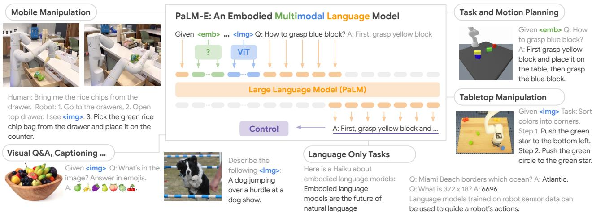  
l green and blue) are inserted alongside text tokens (in orange) as input to an LLM, trained end-to-end.

# Abstract

# 1. Introduction

Large language models have been demonstrated to perform complex tasks. However, enabling general inference in the real world, e.g. for robotics problems, raises the challenge of grounding. We propose embodied language models to directly incorporate real-world continuous sensor modalities into language models and thereby establish the link between words and percepts. Input to our embodied language model are multi-modal sentences that interleave visual, continuous state estimation, and textual input encodings. We train these encodings end-to-end, in conjunction with a pretrained large language model, for multiple embodied tasks including sequential robotic manipulation planning, visual question answering, and captioning. Our evaluations show that PaLM-E, a single large embodied multimodal model, can address a variety of embodied reasoning tasks, from a variety of observation modalities, on multiple embodiments, and further, exhibits positive transfer: the model benefits from diverse joint training across internet-scale language, vision, and visual-language domains. Our largest model, PaLM-E-562B with 562B parameters, in addition to being trained on robotics tasks, is a visual-language generalist with state-of-the-art performance on OK-VQA, and retains generalist language capabilities with increasing scale.

Large language models (LLMs) demonstrate strong reasoning capabilities across various domains, including dialogue (Glaese et al., 2022; Thoppilan et al., 2022), step-by-step reasoning (Wei et al., 2022; Kojima et al., 2022), math problem solving (Lewkowycz et al., 2022; Polu et al., 2022), and code writing (Chen et al., 2021a). However, a limitation of such models for inference in the real world is the issue of grounding: while training LLMs on massive textual data may lead to representations that relate to our physical world, connecting those representations to real-world visual and physical sensor modalities is essential to solving a wider range of grounded real-world problems in computer vision and robotics (Tellex et al., 2020). Previous work (Ahn et al., 2022) interfaces the output of LLMs with learned robotic policies and affordance functions to make decisions, but is limited in that the LLM itself is only provided with textual input, which is insufficient for many tasks where the geometric configuration of the scene is important. Further, in our experiments we show that current state-of-the-art visuallanguage models trained on typical vision-language tasks such as visual-question-answering (VQA) cannot directly solve robotic reasoning tasks. In this paper we propose embodied language models, which

# Visually-conditioned Jokes $^ +$ Few-shot prompting

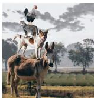

I see (image omitted). Description: A cow sitting on a rug. Joke: Why is the cow sitting on a rug? Because it wants to be a cow-ch! .. I see . Description: a donkey is carrying a dog, cat, and rooster. Joke: what do you call a donkey with a rooster on his back. A rooster booster.

# Zero-shot Multimodal Chain-of-Thought

Given . Q: Can I go down this street on a bicycle, yes or no? A: Let's think step by step. 1. do not enter. 2. except bicycles. 3. do not entry except bicycles. 4. yes.

# Robot Initiative

Given . Q: If a robot wanted to be useful here, what steps should it take? A: clean table..pick up trash.. pick up chairs.. wipe chairs.. put chairs down.

Given . Q: How many championship rings did the player on the left win in his career A: Let's think step by step. 1. kobe bryant is on the left. 2. kobe bryant has won 5 championship rings.

Zero-shot: Multi-image Relationships P5

# Robo Visual Perception, Dialogue, and Planning

Q: Where is <img1> in this scene <img2>? A: a stove top with a pot on it.

Given . Q: Who are the two teams playing in this photo, and which was the last to win a championship, and which year did they win, and who was their star player that year? A: Let's think step by step. 1. team in white is new

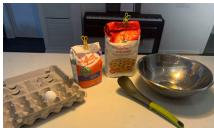

york knick. 2. team in green is boston celtic. 3. last to win championship was boston celtic. 4. year was 2o08. 5. star player was paul pierce. 6. i am not sure if this is correct. i am not basketball fan. i just google it.

Robot: I am a robot operating in a kitchen. Given , what do I see? a bowl of eggs, a bowl of flour, and a bowl of sugar.. and a spatula.. and a spoon.. and a bag of flour.. and a bag of sugar. When a human asks me to do a task, I will respond with the sequence of actions I would do to accomplish the task with only the items I see. Human: Use all of the ingredients you see to make a cake batter. 1. crack egg. 2. put egg in bowl. 3. put flour in bowl.  put sugar in bowl. 5.mix.  put in pan.7. bake. 8.eat. clean up.

# Physical Prediction

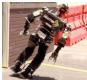

Given  Q: What will the robot do next? A: fall.

# Spatial Grounding

Given . Q: What flavor is the doughnut on the right? Strawberry.. Q: What flavor is the doughnut on the left? A blueberry.

Photo 1: <img1>. Photo 2: <img2>. Q: What is in Photo 1 but NOT in Photo 2? A: sunglasses. Photo 1: <img1>. Photo : <img2>. : What is in Photo 1 but NOT in Photo 2? A: Let's think step by step and explain. Photo 1 has sunglasses on top of folded   
clothes. Photo 2 does not have sunglasses on top of folded clothes. Therefore, sunglasses are in Photo 1 but not in Photo 2. End-to-End Egocentric Q&A, Dialogue

# OCR-free Math Reasoning ocReate yOUR own kiz asparagu

# Given .

Q: I am getting just two custom pizza for me and my friend. How much should I pay in total? A: Let's think step by step. 1st step: 2 custom pizzas. 2nd step: 2 x \$9.99. 3rd step: \$19.98. Photo 1, at 10:30 am: <img1>. Photo 2, at 12:45 pm: <img2>. Photo 3, at 3:45 pm: <img3>. Q: I forget, what did I have for lunch, and what time was it? A: Let's think step by step. 1. you had a sandwich for lunch. 2. it was 12:45 pm.

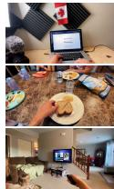

directly incorporate continuous inputs from sensor modalities of an embodied agent and thereby enable the language model itself to make more grounded inferences for sequential decision making in the real world. Inputs such as images and state estimates are embedded into the same latent embedding as language tokens and processed by the self-attention layers of a Transformer-based LLM in the same way as text. We start from a pre-trained LLM in which we inject the continuous inputs through an encoder. These encoders are trained end-to-end to output sequential decisions in terms of natural text that can be interpreted by the embodied agent by conditioning low-level policies or give an answer to an embodied question. We evaluate the approach in a variety of settings, comparing different input representations (e.g. standard vs. object-centric ViT encodings for visual input), freezing vs. finetuning the language model while training the encoders, and investigating whether co-training on multiple tasks enables transfer. To investigate the approach's breadth, we evaluate on three robotic manipulation domains (two of which are closedloop in the real-world), standard visual-language tasks such as VQA and image captioning, as well as language tasks. Our results indicate that multi-task training improves performance compared to training models on individual tasks. We show that this transfer across tasks can lead to high dataefficiency for robotics tasks, e.g. significantly increasing learning success from handfuls of training examples, and even demonstrating one-shot or zero-shot generalization to novel combinations of objects or unseen objects.

We scale PaLM-E up to 562B parameters, integrating the 540B PaLM (Chowdhery et al., 2022) LLM and the 22B Vision Transformer (ViT) (Dehghani et al., 2023) into, to our knowledge, the largest vision-language model currently reported. PaLM-E-562B achieves state-of-the-art performance on the OK-VQA (Marino et al., 2019) benchmark, without relying on task-specific finetuning. Although not the focus of our experimentation, we also find (Fig. 2) that PaLM-E-562B exhibits a wide array of capabilities including zero-shot multimodal chain-of-thought (CoT) reasoning, few-shot prompting, OCR-free math reasoning, and multiimage reasoning, despite being trained on only single-image examples. Zero-shot CoT (Kojima et al., 2022), originally a language-only concept, has been shown on multimodal data with task-specific programs (Zeng et al., 2022) but to our knowledge, not via an end-to-end model. To summarize our main contributions, we (1) propose and demonstrate that a generalist, transfer-learned, multiembodiment decision-making agent can be trained via mixing in embodied data into the training of a multimodal large language model. We show that, (2) while current state-ofthe-art general-purpose visual-language models out-of-thebox (zero-shot) do not well address embodied reasoning problems, it is possible to train a competent general-purpose visual-language model that is also an efficient embodied reasoner. In studying how to best train such models, we (3) introduce novel architectural ideas such as neural scene representations and entity-labeling multimodal tokens. Finally, in addition to our focus on PaLM-E as an embodied reasoner we (4) show that PaLM-E is also a quantitatively competent vision and language generalist, and (5) demonstrate that scaling the language model size enables multimodal finetuning with less catastrophic forgetting.

# 2. Related Work

General vision-language modeling. Building on successes in large language (Brown et al., 2020; Devlin et al., 2018) and vision (Dosovitskiy et al., 2020) models, recent years have seen a growing interest in large vision-language models (VLMs) (Li et al., 2019; Lu et al., 2019; Hao et al., 2022; Gan et al., 2022). Unlike their predecessors, VLMs are capable of simultaneously understanding both images and text, and can be applied to tasks such as visual question answering (Zhou et al., 2020; Zellers et al., 2021b), captioning (Hu et al., 2022), optical character recognition (Li et al., 2021), and object detection (Chen et al., 2021b). The methods by which images are integrated varies. For example, Alayrac et al. (2022) augments pretrained language models with a mechanism to directly attend to a single context image. In contrast, PaLM-E represents images and text as "multimodal sentences" of latent vectors, allowing it to process multiple images in a flexible way within any part of a sentence. More closely related to our work is Frozen (Tsimpoukelli et al., 2021) where vision encoder parameters are optimized via backpropagation through a frozen LLM (Lu et al., 2021). Inspired by this work, we investigate the design in a broader scope by introducing alternative input modalities (e.g. neural scene representations), and our proposed approach empirically outperforms Frozen by more than $4 5 \%$ on the VQAv2 benchmark. More importantly we demonstrate that PaLM-E is applicable not only to perceptual but also embodied tasks.

Actions-output models. Prior works focus on combining vision and language inputs in an embodied setting with the goal of direct action prediction (Guhur et al., 2022; Shridhar et al., 2022b;a; Zhang & Chai, 2021; Silva et al., 2021; Jang et al., 2022; Nair et al., 2022; Lynch et al., 2022; Brohan et al., 2022). Among these methods, VIMA (Jiang et al. 2022) explores multimodal prompts similar to PaLM-E. The role of language is perhaps most aptly described as task specification in these works. In contrast, PaLM-E generates high-level instructions as text; in doing so, the model is able to naturally condition upon its own predictions and directly leverage the world knowledge embedded in its parameters. This enables not only embodied reasoning but also question answering, as demonstrated in our experiments. Among works that output actions, perhaps most similar is the approach proposed in Gato (Reed et al., 2022) which, like PaLM-E, is a generalist multi-embodiment agent. In contrast to Gato, we demonstrate positive transfer across different tasks where the model benefits from diverse joint training across multiple domains.

LLMs in embodied task planning. There have been several methods proposed to leverage LLMs in embodied domains. While many works focus on understanding natural language goals (Lynch & Sermanet, 2020; Shridhar et al., 2022a; Nair et al., 2022; Lynch et al., 2022), fewer consider natural language as a representation for planning the focus of this work. LLMs contain vast amounts of internalized knowledge about the world (Bommasani et al., 2021), but without grounding, generated plans may be impossible to execute. One line of research has employed prompting to elicit a sequence of instructions directly from an LLM either by leveraging semantic similarity between an LLM's generation and an eligible set of instructions (Huang et al., 2022b), incorporating affordance functions (Ahn et al., 2022), visual feedback (Huang et al., 2022c), generating world models (Nottingham et al., 2023; Zellers et al., 2021a), planning over graphs and maps (Shah et al., 2022; Huang et al., 2022a), visual explanations (Wang et al., 2023), program generation (Liang et al., 2022; Singh et al., 2022), or injecting information into the prompt (Zeng et al., 2022). In contrast, PaLM-E is trained to generate plans directly without relying on auxiliary models for grounding. This in turn enables direct integration of the rich semantic knowledge stored in pretrained LLMs into the planning process. With few exceptions, the parameters of the LLMs employed in many of these works are employed as-is without further training. In LID (Li et al., 2022), this constraint is relaxed and LLM parameters are finetuned to produce a planning network for generating high-level instructions. $\mathrm { ( S L ) ^ { 3 } }$ (Sharma et al., 2021) tackles the more challenging task of simultaneously finetuning two LLMs: a planning network, which produces high-level instructions, and a low-level policy network, which selects actions. With PaLM-E, our interests are distinct and complementary: we investigate a generalist, multi-embodiment model, across multiple modalities.

# 3. PaLM-E: An Embodied Multimodal Language Model

The main architectural idea of PaLM-E is to inject continuous, embodied observations such as images, state estimates, or other sensor modalities into the language embedding space of a pre-trained language model. This is realized by encoding the continuous observations into a sequence of vectors with the same dimension as the embedding space of the language tokens. The continuous information is hence injected into the language model in an analogous way to language tokens. PaLM-E is a decoder-only LLM that generates textual completions autoregressively given a prefix or prompt. We call our model PaLM-E, since we use PaLM (Chowdhery et al., 2022) as the pre-trained language model, and make it Embodied.

The inputs to PaLM-E consist of text and (multiple) continuous observations. The multimodal tokens corresponding to these observations are interleaved with the text to form multi-modal sentences. An example of such a multi-modal sentence is $\mathsf Q$ : What happened between  ?$ where $< \mathrm { i } \mathrm { m } 9 . \dot { \imath } >$ represents an embedding of an image. The output of PaLM-E is text generated auto-regressively by the model, which could be an answer to a question, or a sequence of decisions produced by PaLM-E in textual form that should be executed by a robot. When PaLM-E is tasked with producing decisions or plans, we assume that there exists a low-level policy or planner that can translate these decisions into low-level actions. Prior work has discussed a variety of ways to train such low-level policies (Lynch & Sermanet, 2020; Brohan et al., 2022), and we use these prior methods directly without modification. In the following, we describe our approach more formally.

Decoder-only LLMs. Decoder-only large language models (LLMs) are generative models trained to predict the probability $p ( w _ { 1 : L } )$ of a piece of text $w _ { 1 : L } = ( w _ { 1 } , \dots , w _ { L } )$ that is represented as a sequence of tokens $w _ { i } \in \mathcal W$ Typical neural architectures realize this by factorizing into where $p _ { \mathrm { L M } }$ is a large transformer network.

$$
p ( w _ { 1 : L } ) = \prod _ { l = 1 } ^ { L } p _ { \mathrm { L M } } ( w _ { l } | w _ { 1 : l - 1 } ) ,
$$

Prefix-decoder-only LLMs. Since the LLM is autoregressive, a pre-trained model can be conditioned on a prefix $w _ { 1 : n }$ without the necessity to change the architecture

$$
p ( w _ { n + 1 : L } | w _ { 1 : n } ) = \prod _ { l = n + 1 } ^ { L } p _ { \mathrm { L M } } ( w _ { l } | w _ { 1 : l - 1 } ) .
$$

The prefix or prompt $w _ { 1 : n }$ provides the context based on which the LLM continues to predict the subsequent tokens $w _ { n + 1 : L }$ . This is often used for inference to steer the predictions of the model. For example, the prompt can contain a description of the task the LLM should solve or examples of desired text completions for similar tasks.

Token embedding space. The tokens $w _ { i }$ are elements of a fixed vocabulary $\mathcal { W }$ which is a discrete, finite set corresponding to (sub)words in natural language. Internally, the LLM embeds $w _ { i }$ into a word token embedding space $\mathcal { X } \subset \mathbb { R } ^ { k }$ via $\gamma : \mathcal { W } \to \mathcal { X }$ ,i.e. $p _ { \mathrm { L M } } ( w _ { l } | \boldsymbol { x } _ { 1 : l - 1 } )$ with $x _ { i } = \gamma ( w _ { i } ) \in \mathbb { R } ^ { k }$ The mapping $\gamma$ is typically represented as a large embedding matrix of size $k \times | \mathcal { W } |$ and trained end-to-end. In our case, $| \mathcal { W } | = 2 5 6 0 0 0$ (Chowdhery et al., 2022). Multi-modal sentences: injection of continuous observations. Multi-modal information such as image observations can be injected into the LLM by skipping the discrete token level and directly mapping the continuous observations into the language embedding space $\mathcal { X }$ . To this end, we train an encoder $\phi : \mathcal { O }  \mathcal { X } ^ { q }$ that maps a (continuous) observation space $\mathcal { O }$ (refer to Sec. 4 for details) into a sequence of $q$ -many vectors in $\mathcal { X }$ . These vectors are then interleaved with normal embedded text tokens to form the prefix for the LLM. This means that each vector $x _ { i }$ in the prefix is formed from either the word token embedder $\gamma$ or an encoder $\phi _ { i }$ :

$$
x _ { i } = \left\{ \begin{array} { l l } { \gamma ( w _ { i } ) } & { \mathrm { i f ~ } i \mathrm { ~ a ~ i s ~ t e x t ~ t o k e n , ~ o r ~ } } \\ { \phi _ { j } ( O _ { j } ) _ { i } } & { \mathrm { i f ~ } i \mathrm { ~ c o r r e s p o n d s ~ t o ~ o b s e r v a t i o n ~ } O _ { j } . } \end{array} \right.
$$

Note that a single observation $O _ { j }$ is usually encoded into multiple embedding vectors. It is possible to interleave different encoders $\phi _ { i }$ at different locations in the prefix to combine, e.g., information from different observation spaces. Injecting the continuous information this way into the LLM reuses its existing positional encodings. In contrast to other VLM approaches (e.g, (Chen et al., 2022)), the observation embeddings are not inserted at fixed positions, but instead placed dynamically within the surrounding text. Embodying the output: PaLM-E in a robot control loop. PaLM-E is a generative model producing text based on multi-model sentences as input. In order to connect the output of the model to an embodiment, we distinguish two cases. If the task can be accomplished by outputting text only as, e.g., in embodied question answering or scene description tasks, then the output of the model is directly considered to be the solution for the task. Alternatively, if PaLM-E is used to solve an embodied planning or control task, it generates text that conditions lowlevel commands. In particular, we assume to have access to policies that can perform low-level skills from some (small) vocabulary, and a successful plan from PaLM-E must consist of a sequence of such skills. Note that PaLM-E must determine on its own which skills are available based on the training data and the prompt, and no other mechanism is used to constrain or filter its outputs. Although these policies are language conditioned, they are not capable of solving long-horizon tasks or taking in complex instructions. PaLM-E is hence integrated into a control-loop, where its predicted decisions are executed through the low-level policies by a robot, leading to new observations based on which PaLM-E is able to replan if necessary. In this sense, PaLME can be understood as a high-level policy that sequences and controls the low-level policies.

# 4. Input & Scene Representations for Different Sensor Modalities

In this section, we describe the individual modalities that we incorporate into PaLM-E, and how we set up their encoders. We propose different architectural choices for each encoder $\phi : \mathcal { O } \to \mathcal { X }$ to map the corresponding modality into the language embedding space. We investigate state estimation vectors, Vision Transformers (ViTs) (Dosovitskiy et al., 2020; Chen et al., 2022; Ry00 et al., 2021) for 2D image features, and the 3D-aware Object Scene Representation Transformer (OSRT) (Sajjadi et al., 2022a). In addition to encoders that represent the input scene globally, we consider object-centric representations that factor observations into tokens that represent individual objects in the scene. State estimation vectors. State vectors, e.g. from a robot or a state estimate for objects, are perhaps the simplest to input into PaLM-E. Let $\boldsymbol { s } \in \mathbb { R } ^ { S }$ be a vector describing the state of the objects in a scene. For example, $s$ could contain the pose, size, color etc. of those objects. Then, the MLP $\phi _ { \mathrm { s t a t e } }$ maps $s$ into the language embedding space.

Vision Transformer (ViT). ViT $\tilde { \phi } _ { \mathrm { V i T } }$ (Dosovitskiy et al., 2020) is a transformer architecture mapping an image $I$ into a number of token embeddings $\tilde { x } _ { 1 : m } \ = \ \tilde { \phi } _ { \mathrm { v i T } } ( \bar { I } ) \ \in$ $\mathbb { R } ^ { m \times \tilde { k } }$ .We consider several variants, including the 4 billion parameter model from Chen et al. (2022), which we refer to as ViT-4B, and a similar 22 billion parameter model, ViT22B (Dehghani et al., 2023), both of which have been pretrained on image classification. We further investigate the ViT token learner architecture $\mathrm { ( V i T + T L ) }$ (Ryoo et al., 2021) which is trained end-to-end from scratch. Note that the dimensionality $\tilde { k }$ of the ViT embeddings is not necessarily the same as that of the language model. We therefore project each embedding into $x _ { i } = \overset { \vartriangle } { \phi _ { \mathrm { V i T } } } ( I ) _ { i } = \psi ( \widetilde { \phi } _ { \mathrm { V i T } } ( I ) _ { i } )$ with $\psi$ being a learned affine transformation. Object-centric representations. Unlike language, visual input is not pre-structured into meaningful entities and relationships: while ViT may capture semantics, the structure of the representation resembles a static grid rather than a collection of object instances. This poses a challenge both for interfacing with LLMs which have been pre-trained on symbols, and for solving embodied reasoning which requires interaction with physical objects. We therefore also explore structured encoders that aim to separate visual inputs into distinct objects before injecting them into the LLM. Given ground-truth object instance masks $M _ { j }$ , we can decompose ViT's representation into $x _ { 1 : m } ^ { j } = \phi _ { \mathrm { V i T } } \bar { ( M _ { j } \circ I ) }$ for object $j$

Object Scene Representation Transformer (OSRT). An alternative that does not require ground-truth segmentations is OSRT (Sajjadi et al., 2022a): rather than relying on external knowledge about objects, they are discovered in an unsupervised way through inductive biases in the architecture (Locatello et al., 2020). Based on SRT (Sajjadi et al., 2022b), OSRT learns 3D-centric neural scene representations on in-domain data through a novel view synthesis task. Its scene representations consist of object slots $o _ { j } = \bar { \phi } _ { 0 \mathrm { S R T } } ( I _ { 1 : v } ) _ { j } \in \bar { \mathbb R } ^ { \bar { k } }$ .We project each of these slots into $x _ { 1 : m } ^ { j } = \psi ( \bar { \phi } _ { \mathrm { O S R T } } ( I _ { 1 : v } ) _ { j } )$ with an MLP $\psi$ Note that individual objects are always tokenized into multiple embeddings each, i.e. $\psi : \mathbb { R } ^ { \bar { k } }  \mathbb { R } ^ { m \times k }$ for OSRT maps into $m$ -many embeddings.

Entity referrals. For embodied planning tasks, PaLM-E must be able to reference objects in its generated plan. In many cases, including the majority of our experiments, objects in a scene can be identified in natural language by some of their unique properties. However, there also exist settings where objects are not easily identifiable by language in few words, e.g. if there are multiple blocks on a table of the same color at different locations. For object-centric representations such as OSRT, we label the multi-modal tokens corresponding to an object in the input prompt as follows: Object 1 is ${ < } \mathrm { o b j - } 1 >$ ... Object $j \mathrm { i } s < \infty \mathrm { j } \lrcorner j >$ . This enables PaLM-E to reference objects via special tokens of the form obj. $j$ in its generated output sentences. In this case, we assume that the low-level policies operate on these tokens as well.

# 5. Training Recipes

PaLM-E is trained on a dataset of the form $\begin{array} { r l } { D } & { { } = } \end{array}$ $\left\{ \left( I _ { 1 : u _ { i } } ^ { i } , w _ { 1 : L _ { i } } ^ { i } , n _ { i } \right) \right\} _ { i = 1 } ^ { N }$ , where each example $i$ consists of $u _ { i }$ -many continuous observations $I _ { j } ^ { i }$ , a text $w _ { 1 : L _ { i } } ^ { i }$ , and an index $n _ { i }$ . Despite being a decoder-only model, the text consists of a prefix part up to index $n _ { i }$ that is formed from multi-modal sentences, and the prediction target, which only contains text tokens. The loss function is therefore a crossentropy loss averaged over the individual non-prefix tokens ni+1:Li. To form the multi-modal sentences within the model, we have special tokens in the text that get replaced by the embedding vectors of the encoders at the locations in the text of those tokens. We base PaLM-E on the pretrained 8B, 62B, and 540B parameter variants of PaLM as the decoder-only LLM into which we inject the continuous observations through the input encoders. Those encoders are either pre-trained or trained from scratch, see Sec. 4. We refer to an 8B LLM combined with a 4B ViT as PaLM-E12B, similarly a 62B $\mathrm { L L M } + 2 2 \mathrm { B }$ ViT as PaLM-E-84B, and $5 4 0 \mathbf { B } \ \mathbf { L L M } + 2 2 \mathbf { B }$ ViT as PaLM-E-562B.

Variation with Model freezing. Most of our architectures consist of three parts, an encoder $\tilde { \phi }$ , a projector $\psi$ , and the LLM $p _ { \mathrm { L M } }$ When training PaLM-E, one way is to update the parameters of all these components. However, LLMs show impressive reasoning capabilities if supplied with a suitable prompt (Wei et al., 2022). Therefore, we investigate whether it is possible to freeze the LLM and to just train the input encoders, and if so, how different-modality encoders compare. In this case, the encoder has to produce embedding vectors such that the frozen LLM is grounded on the observations, and also propagate information to the LLM about the capabilities of an embodiment. Training such encodings can be understood as a form of input-conditioned soft-prompting (Tsimpoukelli et al., 2021), in relation to normal soft prompts (Lester et al., 2021). In experiments with $\phi _ { \mathrm { O S R T } }$ , we also freeze the slot representation, i.e. we only update the small projector $\psi$ which serves as the interface between OSRT and the LLM. Co-training across tasks. In our experiments, we investigate the effects of co-training our models on a variety of diverse data. The "full mixture", see App. A, consists primarily of a diverse set of internet-scale vision-and-language data, from a variety of tasks. The sampling frequencies are set such that only $8 . 9 \%$ of the full mixture is embodied data, and there are several tasks for each embodiment.

# 6. Experiments

Our experiments consider diverse robotic (mobile) manipulation tasks across three different robot embodiments, in simulation and with two different real robots. We refer to https://palm-e.github.io for videos showing the capabilities of PaLM-E on those tasks. Although not the focus of our work, we evaluate PaLM-E also on general vision-language tasks such as visual-question-answering (VQA), image captioning, and established language modeling tasks.

We split our experimental investigation into two broad categories. First, we compare the different input representations from Sec. 4 with respect to performance, generalization, and data-efficiency. The second thread of experiments focuses on one architecture, the main PaLM-E version, consisting of a pre-trained ViT and PaLM language model that takes in raw images as the continuous inputs. Here we show that a single model, trained on a mixture of many datasets, across diverse tasks, and across robot embodiments, can simultaneously achieve high performance on all of those tasks. Crucially, we investigate whether co-training on these datasets enables transfer (Fig. 3): despite different tasks and embodiments, the performance on the individual tasks increases by training on the mixture of tasks. We study the influence on performance, generalization, and data efficiency with respect to co-training strategies and model parameter size. Finally, we consider if freezing the LLM and just training the ViT that injects vision into the LLM is a viable path. As baselines, we consider the state-of-the art visual language model PaLI (Chen et al., 2022), which has not been trained on embodiment robot data, as well as the SayCan algorithm (Ahn et al., 2022), supplied with oracle affordances.

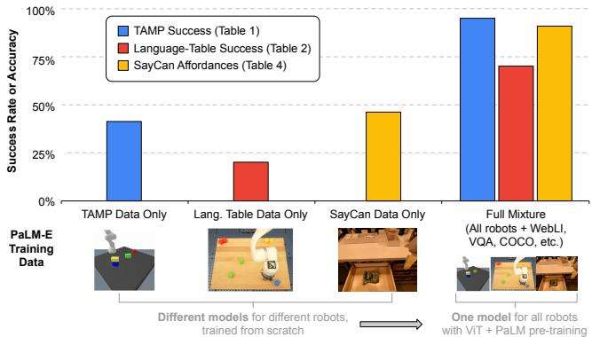  

Figure 3: Overview of transfer learning demonstrated by PaLME: across three different robotics domains, using PaLM and ViT pretraining together with the full mixture of robotics and general visual-language data provides a significant performance increase compared to only training on the respective in-domain data. See Tab. 1, Fig. 4, Tab. 2, Tab. 4 for additional data in each domain.

# 6.1. Robot Environments / Tasks

Our three robot environments (Fig. 1) include a Task and Motion Planning (TAMP) domain where a robot has to manipulate (grasp and stack) objects, a table-top pushing environment, and a mobile manipulation domain. In each domain, PaLM-E is trained on expert data from that domain. In many cases, this is a sparse amount of data per task. The TAMP tasks involve large combinatorics over possible plans, and many decision sequences are infeasible. PaLM-E has to generate plans that consist of multiple steps, with complicated decision boundaries. The multi-object tabletop pushing environment is taken from the publicly available Language-Table dataset (Lynch et al., 2022) and is challenging since it includes several objects, large cardinality of language, and complex pushing dynamics. For both the TAMP and Language-Table environment, PaLM-E has to reason about the poses of the objects. It is not sufficient to know which objects are on the table or knowing their rough relationships, the more fine-grained details about the scene geometry are important for solving the tasks. Finally, we consider a mobile manipulation domain similar to SayCan (Ahn et al., 2022), where a robot has to solve a variety of tasks in a kitchen environment, including finding objects in drawers, picking them, and bringing them to a human. For all domains we consider both planning and VQA tasks in those environments. For the mobile manipulation and Language-Table environments, PaLM-E is integrated into the control loop to execute the plans in the real world, and has to adjust the plan in presence of external disturbances or failures of the low-level control policies.

# 6.2. TAMP Environment

Tab. 7 (appendix) shows planning success rates and VQA performance for the TAMP environment. The LLM is frozen in these experiments (for pre-trained LLM). For the results reported in Tab. 7, the input representations are trained on a dataset containing 96,000 training scenes of solely the TAMP environment, i.e. no other data is part of the mixture. For 3-5 objects in the scene, which is the same number as in the training set, most input representations perform similarly well. However, when increasing the number of objects, it turns out that using a pre-trained LLM improves performance considerably, especially with entity referrals. Furthermore, we show that a 62B LLM shows better out-of-distribution generalization compared to the 8B variant, while a non-pretrained LLM shows basically no outof-distribution generalization. The SayCan baseline (Ahn et al., 2022) utilizes oracle affordance functions and has difficulties solving this environment, since affordance functions only constrain what is possible right now, but are not informative enough for the LLM to construct long-horizon plans in TAMP environments.

Tab. 1 shows results for 3-5 objects when training on $1 \%$ of the dataset, which corresponds to only 320 examples for each of the two planning tasks. Here we see that there are significant differences between the input representations, especially for the planning tasks. First, pre-training the LLM is beneficial in the low data regime for state inputs. Second, both ViT variants $\mathrm { \Delta V i T + T L }$ , ViT-4B) do not perform well in solving the planning tasks for this little data. However, if we co-train on all other robot environments as well as general vision-language datasets (ViT-4B generalist), then the performance of the ViT-4B more than doubles. This shows a significant transfer effect between different robot embodiments and tasks. Finally, using OSRT as the input representation leads to the best performance here, demonstrating the strengths of 3D-aware object representations. We also observe another instance of transfer here: when we remove the TAMP VQA data and only train on the 640 planning tasks examples, there is a (slight) drop in performance. The state-of-the art vision-language model PaLI (Chen et al., 2022) that was not trained on robot data is not able to solve the tasks. We only evaluated it on $\mathrm { { q _ { 2 } } }$ (objects left/right/center on the table) and $\mathrm { { q } _ { 3 } }$ (vertical object relations), since those most resemble typical VQA tasks.

# 6.3. Language-Table Environment

Tab. 2 reports success rates on long-horizon tasks from the Language-Table environment (Lynch et al., 2022). PaLM-E is integrated into a control loop that takes as input the longhorizon task and the current image, and outputs an instruction for the low-level policy. We see that joint training on internet-scale vision and language results in a more effective model for robot planning, particularly in the few-shot regime with only 10 demos per task. Scaling the 12B model to the 84B model leads to improvements on 2 of 3 tasks. As with the TAMP environment, neither SayCan nor zero-shot PaLI are effective, unable to solve the easiest task tested.

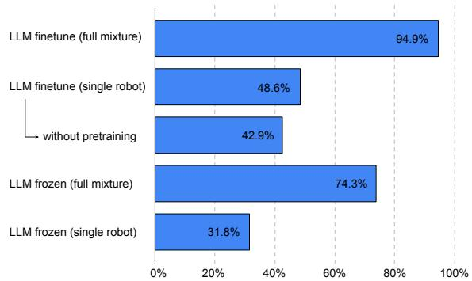  

Figure 4: Planning success results in the TAMP environment $1 \%$ data) for PaLM-E-12B, comparing of the effects of PaLM-E models (i) using the full training mixture, (ii) pre-training (ViT and PaLM), and (iii) freezing or finetuning the language model. Transfer from full mixture is particularly effective. Note that full mixture contains only $1 \%$ of the training data (320 examples each) for the tasks evaluated here. Shown is the mean of tasks $\mathsf { p } _ { 1 } , \mathsf { p } _ { 2 }$ .

Real Robot Results and Few-Shot Generalization. In Fig. 7, a), we see PaLM-E is capable of guiding a real robot through a multi-stage tabletop manipulation task, while remaining robust to adversarial disturbances. Given the observed image and a long-horizon goal, e.g. "sort the blocks by colors into corners", PaLM-E outputs language subgoals at $1 \ \mathrm { H z }$ to the policies from Lynch et al. (2022), that output low-level robot actions at $5 \ : \mathrm { H z }$ .Prior work (Lynch et al., 2022) instead involved a human in the loop to interactively guide subgoals and corrections. In Fig. 5, b) we see PaLME is capable of one-shot and zero-shot learning. Here, we finetuned PaLM-E on 100 different long horizon tasks with a single training example each, e.g. "put all the blocks in the center", "remove the blue blocks from the line". We additionally see that PaLM-E can generalize zero-shot to tasks involving novel object pairs (Fig. 7, c) and to tasks involving objects that were unseen in either the original robot dataset or the finetuning datasets, e.g. a toy turtle (Fig. 5, d).

# 6.4. Mobile Manipulation Environment

We demonstrate the performance of PaLM-E on challenging and diverse mobile manipulation tasks. We largely follow the setup in Ahn et al. (2022), where the robot needs to plan a sequence of navigation and manipulation actions based on an instruction by a human. For example, given the instruction "I spilled my drink, can you bring me something to clean it up?", the robot needs to plan a sequence containing Find a sponge, 2. Pick up the sponge, 3. Bring it to the user, 4. Put down the sponge." Inspired by these tasks, we develop 3 use cases to test the embodied reasoning abilities of PaLM-E: affordance prediction, failure detection, and long-horizon planning. The low-level policies are from RT-1 (Brohan et al., 2022), a transformer model that takes RGB image and natural language instruction, and outputs end-effector control commands.

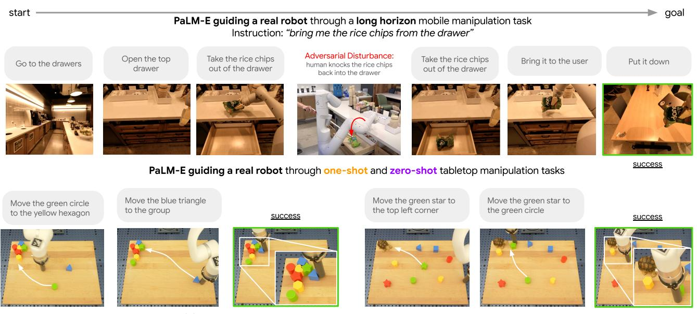  
one-shot: "Move the remaining blocks to the group"   
zero-shot: "Move the green blocks to the turtle"   
a kitchen, and one-shot / zero-shot generalization with a tabletop manipulation robot.

<table><tr><td rowspan="2"></td><td rowspan="2">Object- centric</td><td rowspan="2">LLM pre-train</td><td colspan="4">Embodied VQA</td><td colspan="2">Planning</td></tr><tr><td>q1</td><td>q2</td><td>q3</td><td>q4</td><td>p1</td><td>P2</td></tr><tr><td>SayCan (oracle afford.) (Ahn et al., 2022)</td><td></td><td>✓</td><td></td><td>-</td><td>-</td><td></td><td></td><td>38.7 33.3</td></tr><tr><td>PaLI (zero-shot) (Chen et al., 2022)</td><td></td><td>✓</td><td></td><td>0.0</td><td>0.0</td><td></td><td>-</td><td>-</td></tr><tr><td>PaLM-E (ours) w/ input enc:</td><td></td><td></td><td></td><td></td><td></td><td></td><td></td><td></td></tr><tr><td>State</td><td>(GT)</td><td>X</td><td></td><td>99.4 89.8</td><td>90.3</td><td></td><td></td><td>88.3 45.0 46.1</td></tr><tr><td>State</td><td>(GT)</td><td>✓</td><td></td><td>100.0 96.3</td><td>95.1</td><td></td><td></td><td>93.1 55.9 49.7</td></tr><tr><td>ViT + TL</td><td>(GT)</td><td>✓</td><td>34.7</td><td>54.6</td><td>74.6</td><td></td><td></td><td>91.6 24.0 14.7</td></tr><tr><td>ViT-4B single robot</td><td>X</td><td>✓</td><td>-</td><td>45.9</td><td>78.4</td><td></td><td></td><td>92.2 30.6 32.9</td></tr><tr><td>ViT-4B full mixture</td><td>X</td><td></td><td>-</td><td>70.7</td><td>93.4</td><td></td><td></td><td>92.1 74.1 74.6</td></tr><tr><td>OSRT (no VQA)</td><td>✓</td><td></td><td>-</td><td>-</td><td>-</td><td>-</td><td></td><td>71.9 75.1</td></tr><tr><td>OSRT</td><td>✓</td><td>✓</td><td>99.7</td><td>98.2 100.0 93.7 82.5 76.2</td><td></td><td></td><td></td><td></td></tr></table>

Table 1: Comparison of different input representations on TAMP environment (in terms of success rates), where data from TAMP constitutes only $1 \%$ (i.e., 320 samples for ${ \tt p } _ { 1 }$ , ${ \tt p } _ { 2 }$ each) of total training data size. PaLM-E outperforms both PaLI and SayCan on embodied VQA and planning tasks. Cross-domain transfer is observed, since the PaLM-E with ViT-4B trained on our full data mixture improves planning performance. OSRT, despite using no large-scale data, provides the most effective input encodings for learning. (GT) means ground-truth object-centric information provided. In all experiments, the LLM is frozen. The non-object centric ViT-4B variant utilizes color to reference objects, hence ${ \bf q } _ { 1 }$ cannot be evaluated here. The LLM is frozen in these experiments (except for the case where it is not pre-trained). Sec. B.1 describes the tasks $\mathbf { q } _ { 1 } \mathbf { - q } _ { 4 }$ , ${ \tt p } _ { 1 }$ , $\mathrm { \mathsf { q } _ { 2 } }$ .

Affordance prediction. We investigate PaLM-E's performance at affordance prediction, i.e. whether a sk ill of the low-level policy can be executed in the current environment. This can be formulated as the VQA problem Given . $\mathsf Q$ : Is it possible to <skill> here?. PaLM-E outperforms PaLI (zero-shot), as well as thresholding on value functions trained with QT-OPT (Tab. 4).

Failure detection. For a robot to do closed-loop planning, it is also important to detect failures, as is shown in (Huang et al., 2022c). The multi-modal prompt is Given . Q: Was <skill> successful?. Tab. 4 shows that PaLM-E outperforms PaLI (zero-shot), as well as a finetuned version of CLIP on this dataset. PaLM-E also outperforms the algorithm proposed in Xiao et al. (2022) that leverages two CLIP models trained with hindsight relabeled data. This method has access to more information than our method, and was specifically designed to just solve failure detection on this dataset.

Real robot results: Long-horizon planning. Finally, we use PaLM-E to perform embodied planning end-to-end for mobile manipulation tasks. The prompt structure for this taskis Human: <instruction> Robot: <step history>. I see . PaLM-E is trained to generate the next step of the plan, conditioned on the history of taken steps and the current image observation of the scene. After each step is decoded, we map them to a low-level policy as defined in Ahn et al. (2022). This process is done in an autoregressive manner, until PaLM-E outputs "terminate". We train the model by using the runs from (Ahn et al., 2022), which contains 2912 sequences. We qualitatively evaluated the model in a real kitchen and found the model can carry out long-horizon mobile manipulation tasks, even under adversarial disturbances (Fig. 5).

# 6.5. Performance on General Visual-Language Tasks

Although it is not the focus of our work, we report in Tab. 5 results on general vision-language tasks, including OKVQA (Marino et al., 2019), VQA v2 (Goyal et al., 2017) and COCO captioning (Chen et al., 2015). A single, generalist

Table 2: Results on planning tasks in the simulated environment from Lynch et al. (2022).   

<table><tr><td colspan="7">Zero-shot Baselines</td><td colspan="3">Task 1</td><td colspan="3">Task 2</td><td colspan="3">Task 3</td></tr><tr><td colspan="5">SayCan (oracle afford.) (Ahn et al., 2022) PaLI (Chen et al., 2022)</td><td colspan="3">0.0 0.0</td><td colspan="5"></td><td colspan="2">- -</td></tr><tr><td colspan="5">trained</td><td>Task</td><td colspan="5"># Demos</td><td colspan="5"></td></tr><tr><td>PL-E-</td><td>on</td><td>from scratch</td><td>LLM+ViT pretrain</td><td>LLM frozen</td><td>finetune</td><td>10</td><td>20</td><td>40</td><td>10</td><td>20</td><td>40</td><td>10</td><td>20</td><td></td><td>80</td></tr><tr><td>12B</td><td>Single robot</td><td>✓</td><td>X</td><td>n/a</td><td>✓</td><td>20.0</td><td>30.0</td><td>50.0</td><td>2.5</td><td>6.3</td><td>2.5</td><td>11.3</td><td>16.9</td><td></td><td>28.3</td></tr><tr><td>12B</td><td>Full mixture</td><td>X</td><td>✓</td><td>✓</td><td>X</td><td>-</td><td>-</td><td>20.0</td><td>-</td><td></td><td></td><td>36.3</td><td>-</td><td>-</td><td>29.4</td></tr><tr><td>12B</td><td>Full mixture</td><td>X</td><td>✓</td><td>X</td><td>X</td><td>-</td><td></td><td>80.0</td><td></td><td></td><td></td><td>57.5</td><td></td><td></td><td>50.0</td></tr><tr><td>12B</td><td>Full mixture</td><td>X</td><td>✓</td><td>X</td><td>✓</td><td>70.0</td><td>80.0</td><td>80.0</td><td>31.3</td><td>58.8</td><td></td><td>58.8</td><td>57.5</td><td>54.4</td><td>56.3</td></tr><tr><td>84B</td><td>Full mixture</td><td>X</td><td>✓</td><td>X</td><td>X</td><td>-</td><td>-</td><td>90.0</td><td></td><td></td><td></td><td>53.8</td><td>-</td><td>-</td><td>64.4</td></tr></table>

<table><tr><td>Task 1. Q: There is a block that is closest to {i.e., top right corner}. Push that block to the other block of the same color.</td></tr><tr><td>Task 2. Q: How to sort the blocks by colors into corners?</td></tr><tr><td>Task 3. Q: How to push allthe blocks that are on the {left/right} side together, without bringing over any of the blocks that are on the {right/left} side?</td></tr></table>

Table 4: Mobile manipulation environment: failure detection and affordance prediction (F1 score).   

<table><tr><td colspan="3">Baselines</td><td>Failure det.</td><td>Affordance</td></tr><tr><td colspan="3">PaLI (Zero-shot) (Chen et al., 2022)</td><td>0.73</td><td>0.62</td></tr><tr><td colspan="3">CLIP-FT (Xiao et al., 2022)</td><td>0.65</td><td>-</td></tr><tr><td colspan="3">CLIP-FT-hindsight (Xiao et al., 2022)</td><td>0.89</td><td>-</td></tr><tr><td colspan="3">QT-OPT (Kalashnikov et al., 2018)</td><td>-</td><td>0.63</td></tr><tr><td>PaLM-E-12B trained on</td><td>from scratch</td><td>LLM+ViT pretrain</td><td>LLM frozen</td><td></td></tr><tr><td>Single robot</td><td>✓</td><td>X</td><td>n/a ✓</td><td>0.54 0.91</td></tr><tr><td>Single robot</td><td>X</td><td>✓</td><td></td><td>0.78 0.87</td></tr><tr><td>Full mixture</td><td>X</td><td>✓</td><td>✓</td><td>0.91</td></tr><tr><td>Full mixture</td><td>X</td><td>✓</td><td>X</td><td>0.77</td></tr></table>

Table 5: Results on general visual-language tasks. For the generalist models, they are the same checkpoint across the different evaluations, while task-specific finetuned models use differentfinetuned models for the different tasks. COCO uses Karpathy splits. $\dagger$ is 32-shot on OK-VQA (not finetuned).   

<table><tr><td>Model</td><td colspan="2">VQAv2 test-dev test-std</td><td>OK-VQA val</td><td>COCO Karpathy test</td></tr><tr><td colspan="5">Generalist (one model)</td></tr><tr><td>PaLM-E-12B</td><td>76.2</td><td></td><td>55.5</td><td>135.0</td></tr><tr><td>PaLM-E-562B</td><td>80.0</td><td>-</td><td>66.1</td><td>138.7</td></tr><tr><td colspan="5">Task-specific finetuned models</td></tr><tr><td>Flamingo (Alayrac et al., 2022)</td><td>82.0</td><td>82.1</td><td>57.8†</td><td>138.1</td></tr><tr><td>PaLI (Chen et al., 2022)</td><td>84.3</td><td>84.3</td><td>64.5</td><td>149.1</td></tr><tr><td>PaLM-E-12B</td><td>77.7</td><td>77.9</td><td>60.1</td><td>136.0</td></tr><tr><td>PaLM-E-66B</td><td>-</td><td>-</td><td>62.9</td><td>-</td></tr><tr><td>PaLM-E-84B</td><td>80.5</td><td>-</td><td>63.3</td><td>138.0</td></tr><tr><td colspan="5">Generalist (one model), with frozen LLM</td></tr><tr><td>(Tsimpoukelli et al., 2021)</td><td>48.4</td><td></td><td>-</td><td>-</td></tr><tr><td>PaLM-E-12B frozen</td><td>70.3</td><td></td><td>51.5</td><td>128.0</td></tr></table>

PaLM-E-562B model achieves the highest reported number on OK-VQA, including outperforming models finetuned specifically on OK-VQA. Compared to (Tsimpoukelli et al., 2021), PaLM-E achieves the highest performance on VQA v2 with a frozen LLM to the best of our knowledge. This establishes that PaLM-E is a competitive visual-language generalist, in addition to being an embodied reasoner on robotic tasks.

# 6.6. Performance on General Language Tasks

Tab. 8 reports the averaged performance of PaLM-E on 21 general language benchmarks for Natural Language Understanding (NLU) and Natural Language Generation (NLG) tasks. The notable trend is that with increasing model scale, there is considerably less catastrophic forgetting of language capabilities. As seen in Fig. 6, while for the smallest (PaLM

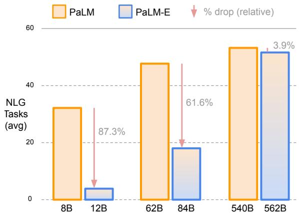  

Table 3: Task prompts for Tab. 2.   

Figure 6: Results on general language tasks ( $\mathbf { N L G } =$ natural language generation): increasing scale leads to less catastrophic forgetting between a corresponding PaLM-E model and its inherited PaLM model. See full suite of tasks and results in Tab. 8.

E-12B) model $8 7 . 3 \%$ of its NLG performance (relative) has degraded during multimodal training, merely $3 . 9 \%$ have been degraded for the largest model (PaLM-E-562B).

# 7. Summary of Experiments & Discussion

Generalist vs specialist models  transfer. As summarized in Fig. 3, we have shown several instances of transfer in this work, meaning that PaLM-E trained on different tasks and datasets at the same time leads to significantly increased performance relative to models trained separately on the different tasks alone. In Fig. 4, co-training on the "full mixture" achieves more than double the performance. In Tab. 9, we see significant improvements in performance if we add LLM/ViT pre-training, and training on the full mixture instead of the mobile manipulation data alone. For the Language-Table experiment in Tab. 2, we observe analogous behaviour. Data efficiency. Compared to available massive language or vision-language datasets, robotics data is significantly less abundant. As discussed in the last paragraph, our model exhibits transfer, which aids PaLM-E to solve robotics tasks from very few training examples in the robotics domain, e.g. between 10 and 80 for Language Table or 320 for TAMP. The OSRT results show another instance of data-efficiency by using a geometric input representation. A promising opportunity for future work is to combine this with a method benefitting from large-scale visual data. Retaining language capabilities. We have shown two paths to retain the language capabilities of the model during multimodal training. As one option, freezing the LLM and only training the input encoders is a viable path for building embodied language models, although this approach occasionally struggled for robotics tasks (Tab. 2). As an alternative route, when the whole model is trained end-to-end, the model retains significantly more of its original language performance with increasing model scale (Fig. 6).

# 8. Conclusion

We proposed to build an embodied language model by injecting multi-modal information such as images into the embedding space of a pre-trained LLM. Experiments showed that off-the-shelf state-of-the-art vision-language models trained on general VQA and captioning tasks are not sufficient for embodied reasoning tasks, as well as limitations of a recent proposal for grounding language models through affordances. To overcome these limitations, we proposed PaLM-E, a single model that is able to control different robots in simulation and in the real world, while at the same time being quantitatively competent at general VQA and captioning tasks. In particular the novel architectural idea of ingesting neural scene representations (i.e., OSRT) into the model is particularly effective, even without large-scale data. PaLM-E is trained on a mixture of diverse tasks across multiple robot embodiments as well as general vision-language tasks. Importantly, we have demonstrated that this diverse training leads to several avenues of transfer from the visionlanguage domains into embodied decision making, enabling robot planning tasks to be achieved data efficiently. While our results indicate that frozen language models are a viable path towards general-purpose embodied multimodal models that fully retain their language capabilities, we have also surfaced an alternative route with unfrozen models: scaling up the language model size leads to significantly less catastrophic forgetting while becoming an embodied agent. Our largest model, PaLM-E-562B, showcases emergent capabilities like multimodal chain of thought reasoning, and the ability to reason over multiple images, despite being trained on only single-image prompts.

# Acknowledgements

The authors would like to thank, for their advice, help and support: Xi Chen, Etienne Pot, Sebastian Goodman, Maria Attarian, Ted Xiao, Keerthana Gopalakrishnan, Kehang Han, Henryk Michalewski, Neil Houlsby, Basil Mustafa, Justin Gilmer, Yonghui Wu, Erica Moreira, Victor Gomes, Tom Duerig, Henning Meyer, and Kendra Byrne.

# References

Ahn, M., Brohan, A., Brown, N., Chebotar, Y., Cortes, O., David, B., Finn, C., Gopalakrishnan, K., Hausman, K., Herzog, A., et al. Do as i can, not as i say: Grounding language in robotic affordances. arXiv preprint arXiv:2204.01691, 2022. Alayrac, J.-B., Donahue, J., Luc, P., Miech, A., Barr, I., Hasson, Y., Lenc, K., Mensch, A., Millican, K., Reynolds, M., et al. Flamingo: a visual language model for few-shot learning. arXiv preprint arXiv:2204.14198, 2022. Bommasani, R., Hudson, D. A., Adeli, E., Altman, R., Arora, S., von Arx, S., Bernstein, M. S., Bohg, J., Bosselut, A., Brunskill, E., et al. On the opportunities and risks of foundation models. arXiv preprint arXiv:2108.07258, 2021. Brohan, A., Brown, N., Carbajal, J., Chebotar, Y., Dabis, J., Finn, C., Gopalakrishnan, K., Hausman, K., Herzog, A., Hsu, J., et al. Rt-1: Robotics transformer for real-world control at scale. arXiv preprint arXiv:2212.06817, 2022. Brown, T., Mann, B., Ryder, N., Subbiah, M., Kaplan, J. D., Dhariwal, P., Neelakantan, A., Shyam, P., Sastry, G., Askell, A., et al. Language models are few-shot learners. Advances in neural information processing systems, 33: 18771901, 2020. Changpinyo, S., Kukliansky, D., Szpektor, I., Chen, X., Ding, N., and Soricut, R. All you may need for vqa are image captions, 2022. URL https: //arxiv.org/ abs/2205.01883. Chen, M., Tworek, J., Jun, H., Yuan, Q., Pinto, H. P. d. O., Kaplan, J., Edwards, H., Burda, Y., Joseph, N., Brockman, G., et al. Evaluating large language models trained on code. arXiv preprint arXiv:2107.03374, 2021a. Chen, T., Saxena, S., Li, L., Fleet, D. J., and Hinton, G. Pix2seq: A language modeling framework for object detection. arXiv preprint arXiv:2109.10852, 2021b. Chen, X., Fang, H., Lin, T., Vedantam, R., Gupta, S., Dollár, P., and Zitnick, C. L. Microsoft COCO captions: Data collection and evaluation server. CoRR, abs/1504.00325, 2015. Chen, X., Wang, X., Changpinyo, S., Piergiovanni, A., Padlewski, P., Salz, D., Goodman, S., Grycner, A. Mustafa, B., Beyer, L., et al. Pali: A jointly-scaled multilingual language-image model. arXiv preprint arXiv:2209.06794, 2022. Chowdhery, A., Narang, S., Devlin, J., Bosma, M., Mishra, G., Roberts, A., Barham, P., Chung, H. W., Sutton, C., Gehrmann, S., et al. Palm: Scaling language modeling with pathways. arXiv preprint arXiv:2204.02311, 2022. Dehghani, M., Djolonga, J., Mustafa, B., Padlewski, P., Heek, J., Gilmer, J., Steiner, A., Caron, M., Geirhos, R., Alabdulmohsin, I., et al. Scaling vision transformers to 22 billion parameters. arXiv preprint arXiv:2302.05442, 2023. Devlin, J., Chang, M.-W., Lee, K., and Toutanova, K. Bert: Pre-training of deep bidirectional transformers for language understanding. arXiv preprint arXiv:1810.04805, 2018. Dosovitskiy, A., Beyer, L., Kolesnikov, A., Weissenborn, D., Zhai, X., Unterthiner, T., Dehghani, M., Minderer, M., Heigold, G., Gelly, S., et al. An image is worth 16x16 words: Transformers for image recognition at scale. arXiv preprint arXiv:2010.11929, 2020. Driess, D., Ha, J.-S., and Toussaint, M. Deep visual reasoning: Learning to predict action sequences for task and motion planning from an initial scene image. In Proc. of Robotics: Science and Systems (R:SS), 2020. Gan, Z., Li, L., Li, C., Wang, L., Liu, Z., Gao, J., et al. Vision-language pre-training: Basics, recent advances, and future trends. Foundations and Trends® in Computer Graphics and Vision, 14(34):163352, 2022. Glaese, A., McAleese, N., Trebacz, M., Aslanides, J., Firoiu, V., Ewalds, T., Rauh, M., Weidinger, L., Chadwick, M., Thacker, P., et al. Improving alignment of dialogue agents via targeted human judgements. arXiv preprint arXiv:2209.14375, 2022. Goyal, Y., Khot, T., Summers-Stay, D., Batra, D., and Parikh, D. Making the V in VQA matter: Elevating the role of image understanding in Visual Question Answering. In Conference on Computer Vision and Pattern Recognition (CVPR), 2017. Guhur, P.-L., Chen, S., Garcia, R., Tapaswi, M., Laptev, I., and Schmid, C. Instruction-driven history-aware policies for robotic manipulations. arXiv preprint arXiv:2209.04899, 2022. Hao, Y., Song, H., Dong, L., Huang, S., Chi, Z., Wang, W. Ma, S., and Wei, F. Language models are general-purpose interfaces. arXiv preprint arXiv:2206.06336, 2022. Hu, X., Gan, Z., Wang, J., Yang, Z., Liu, Z., Lu, Y., and Wang, L. Scaling up vision-language pre-training for image captioning. In Proceedings of the IEEE/CVF Conference on Computer Vision and Pattern Recognition, pp. 1798017989, 2022. Huang, C., Mees, O., Zeng, A., and Burgard, W. Visual language maps for robot navigation. arXiv preprint arXiv:2210.05714, 2022a. Huang, W., Abbeel, P., Pathak, D., and Mordatch, I. Language models as zero-shot planners: Extracting actionable knowledge for embodied agents. arXiv preprint arXiv:2201.07207, 2022b. Huang, W., Xia, F., Xiao, T., Chan, H., Liang, J., Florence, P., Zeng, A., Tompson, J., Mordatch, I., Chebotar, Y., et al. Inner monologue: Embodied reasoning through planning with language models. arXiv preprint arXiv:2207.05608, 2022c. Jang, E., Irpan, A., Khansari, M., Kappler, D., Ebert, F., Lynch, C., Levine, S., and Finn, C. Bc-z: Zero-shot task generalization with robotic imitation learning. In Conference on Robot Learning, pp. 9911002. PMLR, 2022. Jiang, Y., Gupta, A., Zhang, Z., Wang, G., Dou, Y., Chen, Y., Fei-Fei, L., Anandkumar, A., Zhu, Y., and Fan, L. Vima: General robot manipulation with multimodal prompts. arXiv preprint arXiv:2210.03094, 2022. Kalashnikov, D., Irpan, A., Pastor, P., Ibarz, J., Herzog, A., Jang, E., Quillen, D., Holly, E., Kalakrishnan, M., Vanhoucke, V., et al. Scalable deep reinforcement learning for vision-based robotic manipulation. In Conference on Robot Learning, pp. 651673. PMLR, 2018. Kojima, T., Gu, S. S., Reid, M., Matsuo, Y., and Iwasawa, Y. Large language models are zero-shot reasoners. arXiv preprint arXiv:2205.11916, 2022. Lester, B., Al-Rfou, R., and Constant, N. The power of scale for parameter-efficient prompt tuning. arXiv preprint arXiv:2104.08691, 2021. Lewkowycz, A., Andreassen, A., Dohan, D., Dyer, E., Michalewski, H., Ramasesh, V., Slone, A., Anil, C., Schlag, I., Gutman-Solo, T., et al. Solving quantitative reasoning problems with language models. arXiv preprint arXiv:2206.14858, 2022. Li, L. H., Yatskar, M., Yin, D., Hsieh, C.-J., and Chang, K.-W. Visualbert: A simple and performant baseline for vision and language. arXiv preprint arXiv:1908.03557, 2019. Li M., Lv, T., Chen, J., Cui, L., Lu, Y., Flrecio, D., Zha, C., Li, Z., and Wei, F. Trocr: Transformer-based optical character recognition with pre-trained models. arXiv preprint arXiv:2109.10282, 2021. Li, S., Puig, X., Du, Y., Wang, C., Akyurek, E., Torralba, A., Andreas, J., and Mordatch, I. Pre-trained language models for interactive decision-making. arXiv preprint arXiv:2202.01771, 2022. Liang, J., Huang, W., Xia, F., Xu, P., Hausman, K., Ichter, B., Florence, P., and Zeng, A. Code as policies: Language model programs for embodied control. arXiv preprint arXiv:2209.07753, 2022. Locatello, F., Weissenborn, D., Unterthiner, T., Mahendran, A., Heigold, G., Uszkoreit, J., Dosovitskiy, A., and Kipf, T. Object-centric learning with slot attention. Advances in Neural Information Processing Systems, 33:11525 11538, 2020. Lu, J., Batra, D., Parikh, D., and Lee, S. Vilbert: Pretraining task-agnostic visiolinguistic representations for vision-and-language tasks. Advances in neural information processing systems, 32, 2019. Lu, K., Grover, A., Abbeel, P., and Mordatch, I. Pretrained transformers as universal computation engines. arXiv preprint arXiv:2103.05247, 1, 2021. Lynch, C. and Sermanet, P. Language conditioned imitation learning over unstructured data. arXiv preprint arXiv:2005.07648, 2020. Lynch, C., Wahid, A., Tompson, J., Ding, T., Betker, J., Baruch, R., Armstrong, T., and Florence, P. Interactive language: Talking to robots in real time. arXiv preprint arXiv:2210.06407, 2022. Marino, K., Rastegari, M., Farhadi, A., and Mottaghi, R. Okvqa: A visual question answering benchmark requiring external knowledge. In Conference on Computer Vision and Pattern Recognition (CVPR), 2019. Nair, S., Mitchell, E., Chen, K., Savarese, S., Finn, C., et al. Learning language-conditioned robot behavior from offline data and crowd-sourced annotation. In Conference on Robot Learning, pp. 13031315. PMLR, 2022. Nottingham, K., Ammanabrolu, P., Suhr, A., Choi, Y., Hajishirzi, H., Singh, S., and Fox, R. Do embodied agents dream of pixelated sheep?: Embodied decision making using language guided world modelling. arXiv preprint arXiv:2301.12050, 2023. Piergiovanni, A., Kuo, W., and Angelova, A. Pre-training image-language transformers for open-vocabulary tasks, 2022. URL https://arxiv.org/abs/2209. 04372. Polu, S., Han, J. M., Zheng, K., Baksys, M., Babuschkin, I. and Sutskever, I. Formal mathematics statement curriculum learning. arXiv preprint arXiv:2202.01344, 2022. Reed, S., Zolna, K., Parisotto, E., Colmenarejo, S. G., Novikov, A., Barth-Maron, G., Gimenez, M., Sulsky, Y., Kay, J., Springenberg, J. T., et al. A generalist agent. arXiv preprint arXiv:2205.06175, 2022. Ryoo, M. S., Piergiovanni, A., Arnab, A., Dehghani, M., and Angelova, A. Tokenlearner: What can 8 learned tokens do for images and videos? arXiv preprint arXiv:2106.11297, 2021. Sajjadi, M. S. M., Duckworth, D., Mahendran, A., van Steenkiste, S., Paveti, F., Lui, M., Guibas, L. J., Greff, K., and Kipf, T. Object Scene Representation Transformer. NeurIPS, 2022a. URL https: //osrt-paper.github.io/. Sajjadi, M. S. M., Meyer, H., Pot, E., Bergmann, U., Greff, K., Radwan, N., Vora, S., Lui, M., Duckworth, D., Dosovitskiy, A., et al. Scene representation transformer: Geometry-free novel view synthesis through set-latent scene representations. In Proceedings of the IEEE/CVF Conference on Computer Vision and Pattern Recognition, pp. 62296238, 2022b. Shah, D., Osinski, B., Ichter, B., and Levine, S. Lmnav: Robotic navigation with large pre-trained models of language, vision, and action. arXiv preprint arXiv:2207.04429, 2022. Sharma, P., Ding, N., Goodman, S., and Soricut, R. Conceptual captions: A cleaned, hypernymed, image alt-text dataset for automatic image captioning. In Proceedings of ACL, 2018. Sharma, P., Torralba, A., and Andreas, J. Skill induction and planning with latent language. arXiv preprint arXiv:2110.01517, 2021. Shridhar, M., Manuelli, L., and Fox, D. Cliport: What and where pathways for robotic manipulation. In Conference on Robot Learning, pp. 894906. PMLR, 2022a. Shridhar, M., Manuelli, L., and Fox, D. Perceiver-actor: A multi-task transformer for robotic manipulation. arXiv preprint arXiv:2209.05451, 2022b. Silva, A., Moorman, N., Silva, W., Zaidi, Z., Gopalan, N., and Gombolay, M. Lancon-learn: Learning with language to enable generalization in multi-task manipulation. IEEE Robotics and Automation Letters, 7(2):16351642, 2021. Singh, I., Blukis, V., Mousavian, A., Goyal, A., Xu, D., Tremblay, J., Fox, D., Thomason, J., and Garg, A. ProgPrompt: Generating situated robot task plans using large language models. arXiv preprint arXiv:2209.11302, 2022. Tellex, S., Gopalan, N., Kress-Gazit, H., and Matuszek, C. Robots that use language. Annual Review of Control, Robotics, and Autonomous Systems, 3:2555, 2020. Thoppilan, R., De Freitas, D., Hall, J., Shazeer, N., Kulshreshtha, A., Cheng, H.-T., Jin, A., Bos, T., Baker, L., Du, Y., et al. Lamda: Language models for dialog applications. arXiv preprint arXiv:2201.08239, 2022. Tsimpoukelli, M., Menick, J. L., Cabi, S., Eslami, S., Vinyals, O., and Hill, F. Multimodal few-shot learning with frozen language models. Advances in Neural Information Processing Systems, 34:200212, 2021. Wang, Z., Cai, S., Liu, A., Ma, X., and Liang, Y. Describe, explain, plan and select: Interactive planning with large language models enables open-world multi-task agents. arXiv preprint arXiv:2302.01560, 2023.

Wei, J., Wang, X., Schuurmans, D., Bosma, M., Chi, E., Le, Q., and Zhou, D. Chain of thought prompting elicits reasoning in large language models. arXiv preprint arXiv:2201.11903, 2022. Xiao, T., Chan, H., Sermanet, P., Wahid, A., Brohan, A., Hausman, K., Levine, S., and Tompson, J. Robotic skill acquisition via instruction augmentation with visionlanguage models. arXiv preprint arXiv:2211.11736, 2022. Zellers, R., Holtzman, A., Peters, M., Mottaghi, R., Kembhavi, A., Farhadi, A., and Choi, Y. Piglet: Language grounding through neuro-symbolic interaction in a 3d world. arXiv preprint arXiv:2106.00188, 2021a. Zellers, R., Lu, X., Hessel, J., Yu, Y., Park, J. S., Cao, J. Farhadi, A., and Choi, Y. Merlot: Multimodal neural script knowledge models. Advances in Neural Information Processing Systems, 34:2363423651, 2021b. Zeng, A., Wong, A., Welker, S., Choromanski, K., Tombari, F., Purohit, A., Ryoo, M., Sindhwani, V., Lee, J., Vanhoucke, V., et al. Socratic models: Composing zeroshot multimodal reasoning with language. arXiv preprint arXiv:2204.00598, 2022. Zhang, Y. and Chai, J. Hierarchical task learning from language instructions with unified transformers and selfmonitoring. arXiv preprint arXiv:2106.03427, 2021. Zhou, L., Palangi, H., Zhang, L., Hu, H., Corso, J., and Gao, J. Unified vision-language pre-training for image captioning and vqa. In Proceedings of the AAAI Conference on Artificial Intelligence, 2020.

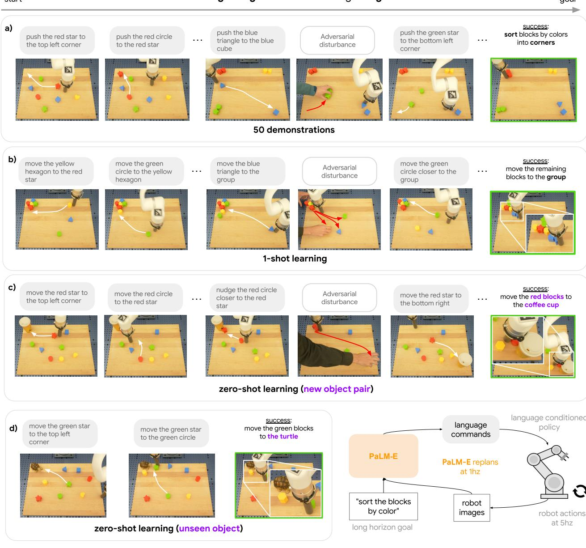  
PaLM-E guiding a real robot through long horizon tasks   
to adversarial disturbances. We find evidence that PaLM- is capableof one-shot and zero shot generalization.

# A. Data Mixture lata distribution is general vision-language tasks, with less than $10 \%$ robot data.

# B. Environment Details

# B.1. Task and Motion Planning (TAMP) joses. Fig. 8 show an example test scene that contains 6 objects.

In the global version, we consider the following three VQA tasks:

Table 6: Dataset sampling frequency and ratio for the "full mixture" referred to in experiments.   

<table><tr><td>Dataset in full mixture</td><td>Sampling frequency</td><td>%</td></tr><tr><td>Webli (Chen et al., 2022)</td><td>100</td><td>52.4</td></tr><tr><td>VQ2A (Changpinyo et al., 2022)</td><td>25</td><td>13.1</td></tr><tr><td>VQG (Changpinyo et al., 2022)</td><td>10</td><td>5.2</td></tr><tr><td>CC3M (Sharma et al., 2018)</td><td>25</td><td>13.1</td></tr><tr><td>Object Aware (Piergiovanni et al., 2022)</td><td>10</td><td>5.2</td></tr><tr><td>OKVQA (Marino et al., 2019)</td><td>1</td><td>0.5</td></tr><tr><td>VQAv2 (Goyal et al., 2017)</td><td>1</td><td>0.5</td></tr><tr><td>COCO (Chen et al., 2015)</td><td>1</td><td>0.5</td></tr><tr><td>Wikipedia text</td><td>1</td><td>0.5</td></tr><tr><td>(robot) Mobile Manipulator, real</td><td>6</td><td>3.1</td></tr><tr><td>(robot) Language Table (Lynch et al., 2022), sim and real</td><td>8</td><td>4.2</td></tr><tr><td>(robot) TAMP, sim</td><td>3</td><td>1.6</td></tr></table>

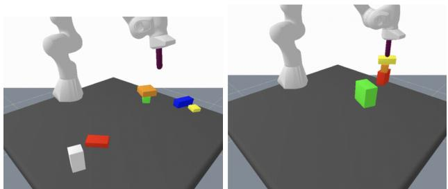  
.

: $\mathrm { q _ { 2 } }$ : object-table relation. Example prompt: Given . Q: Is the red object left, right or center of the table?.Target: A: The red object is in the center of the table.

: ${ \mathrm { q } } _ { 3 }$ : object-object relations. Example prompt: Given . Q: Is the yellow object below the blue object?.Target: A: No, the yellow object is not below the blue object.

: $\mathrm { q _ { 4 } }$ : plan feasibility. Example prompt: Given . Q: Is it possible to first grasp th blue object, then place it on the yellow object, and then grasp the yellow object?.Target: A: No, this is not possible.

as well as the two planning tasks

: ${ \tt p } _ { 1 }$ : grasping. Example prompt: Given . Q: How to grasp the green object?. Target: A: First grasp the orange object and place it on the table, then grasp the green object. : ${ \tt p } _ { 2 }$ : stacking. Example prompt: Given . Q: How to stack the white object on top of the red object?. Target: A: First grasp the green object and place it on the table, then grasp the white object and place it on the red object.

F $=$ obj 1 is <ob $\dot { ] } _ { 1 } >$ . . . . Obj j is ${ < \mathrm { o b j } _ { j } > }$ . , and the VQA task $\mathbf { q } _ { 1 }$ is about the color of an object. The other tasks (except with the different prefix, and entity referrals), remain the same. obtained with the method of Driess et al. (2020). been referenced by their special tokens $\mathrm { o b j } _ { j }$ jeThe Cble, affordance functions.   

<table><tr><td></td><td>φ</td><td>LLM pre-trained</td><td>q1</td><td>q2</td><td>q3</td><td>q4</td><td>P1</td><td>P2</td></tr><tr><td rowspan="10"></td><td>SayCan (w/ oracle affordances)</td><td>✓</td><td>-</td><td>-</td><td>-</td><td>-</td><td>38.7</td><td>33.3</td></tr><tr><td>state</td><td>X</td><td>100.0</td><td>99.3</td><td>98.5</td><td>99.8</td><td>97.2</td><td>95.5</td></tr><tr><td>state</td><td>(unfrozen)</td><td>100.0</td><td>98.8</td><td>100.0</td><td>97.6</td><td>97.7</td><td>95.3</td></tr><tr><td>state</td><td></td><td>100.0</td><td>98.4</td><td>99.7</td><td>98.5</td><td>97.6</td><td>96.0</td></tr><tr><td>state (w/o entity referrals)</td><td></td><td>100.0</td><td>98.8</td><td>97.5</td><td>98.1</td><td>94.6</td><td>90.3</td></tr><tr><td>ViT + TL (obj. centric)</td><td></td><td>99.6</td><td>98.7</td><td>98.4</td><td>96.8</td><td>9.2</td><td>94.5</td></tr><tr><td>ViT + TL (global)</td><td></td><td>-</td><td>60.7</td><td>90.8</td><td>94.3</td><td>70.7</td><td>69.2</td></tr><tr><td>ViT-4B (global)</td><td></td><td>-</td><td>98.2</td><td>99.4</td><td>99.0</td><td>96.0</td><td>93.4</td></tr><tr><td>ViT-4B generalist</td><td></td><td></td><td>97.1</td><td>100.0</td><td>98.9</td><td>97.5</td><td>95.2</td></tr><tr><td>OSRT</td><td>✓</td><td>99.6</td><td>99.1</td><td>100.0</td><td>98.8</td><td>98.1</td><td>95.7</td></tr><tr><td rowspan="3">6 objects</td><td>state</td><td>X</td><td>20.4</td><td>39.2</td><td>71.4</td><td>85.2</td><td>56.5</td><td>34.3</td></tr><tr><td>state</td><td>✓</td><td>100.0</td><td>98.5</td><td>94.0</td><td>89.3</td><td>95.3</td><td>81.4</td></tr><tr><td>state (w/o entity referrals)</td><td>✓</td><td>77.7</td><td>83.7</td><td>93.6</td><td>91.0</td><td>81.2</td><td>57.1</td></tr><tr><td rowspan="3">8 objects</td><td>state</td><td>X</td><td>18.4</td><td>27.1</td><td>38.1</td><td>87.5</td><td>24.6</td><td>6.7</td></tr><tr><td>state</td><td>✓</td><td>100.0</td><td>98.3</td><td>95.3</td><td>89.8</td><td>91.3</td><td>89.3</td></tr><tr><td>state (w/o entity referrals)</td><td>✓</td><td>60.0</td><td>67.1</td><td>94.1</td><td>81.2</td><td>49.3</td><td>49.3</td></tr><tr><td rowspan="3">6 objects + OOD tasks</td><td>state (8B LLM)</td><td>X</td><td>-</td><td>0</td><td>0</td><td>72.0</td><td>0</td><td>0</td></tr><tr><td>state (8B LLM)</td><td></td><td>-</td><td>49.3</td><td>89.8</td><td>68.5</td><td>28.2</td><td>15.7</td></tr><tr><td>state (62B LLM)</td><td>✓</td><td>-</td><td>48.7</td><td>92.5</td><td>88.1</td><td>40.0</td><td>30.0</td></tr></table>

# B.2. Interactive Language Table uab 2022).

a as in Lynch et al. (2022). The policy executes 40 steps ( $1 0 \mathrm { H z }$ for 4 seconds) before requiring another command from the The data collection procedure for the real world experiments are the same as in simulation. Trai nvalationtraeetevos heodels, werai preraie LM-mdelr,00 ale sigtly ifeent erins  theul mixtureFo Tasks  ndation, eplment uat from the prompt alone. C. Natural Language Generation and Understanding Results   

<table><tr><td>1-shot evals</td><td>PaLM-8B</td><td>PaLM-E-12B (unfrozen)</td><td>PaLM-62B</td><td>PaLM-E-84B (unfrozen)</td><td>PaLM-540B</td><td>PaLM-E-562B (unfrozen)</td><td>Category</td></tr><tr><td>TriviaQA (wiki) (EM)</td><td>48.5</td><td>10.1</td><td>72.7</td><td>31.8</td><td>81.4</td><td>74.6</td><td>NLG</td></tr><tr><td>Natural Questions (EM)</td><td>10.6</td><td>1.6</td><td>23.1</td><td>7.6</td><td>29.3</td><td>27.2</td><td>NLG</td></tr><tr><td>WebQuestions (EM)</td><td>12.6</td><td>3.4</td><td>19.8</td><td>7.9</td><td>22.6</td><td>21.8</td><td>NLG</td></tr><tr><td>Lambada</td><td>57.8</td><td>1.4</td><td>75.5</td><td>26.1</td><td>81.8</td><td>83.3</td><td>NLG</td></tr><tr><td>HellaSwag</td><td>68.2</td><td>48.4</td><td>79.7</td><td>75.3</td><td>83.6</td><td>83.5</td><td>NLU</td></tr><tr><td>StoryCloze</td><td>78.7</td><td>68.7</td><td>83.8</td><td>83.9</td><td>86.1</td><td>86.3</td><td>NLU</td></tr><tr><td>Winograd</td><td>82.4</td><td>71.8</td><td>85.3</td><td>86.4</td><td>87.5</td><td>89.0</td><td>NLU</td></tr><tr><td>Winogrande</td><td>68.3</td><td>55.3</td><td>76.8</td><td>72.5</td><td>83.7</td><td>83.0</td><td>NLU</td></tr><tr><td>RACE-M</td><td>57.7</td><td>43.2</td><td>64.1</td><td>57.4</td><td>69.3</td><td>70.3</td><td>NLU</td></tr><tr><td>RACE-H</td><td>41.6</td><td>33.2</td><td>48.7</td><td>42.3</td><td>52.1</td><td>52.8</td><td>NLU</td></tr><tr><td>PIQA</td><td>76.1</td><td>68.1</td><td>80.9</td><td>78.2</td><td>83.9</td><td>84.9</td><td>NLU</td></tr><tr><td>ARC-e</td><td>71.3</td><td>53.4</td><td>78.9</td><td>71.4</td><td>85.0</td><td>86.3</td><td>NLU</td></tr><tr><td>ARC-c</td><td>42.3</td><td>30.9</td><td>51.8</td><td>46.7</td><td>60.1</td><td>62.6</td><td>NLU</td></tr><tr><td>OpenBookQA</td><td>47.4</td><td>41.4</td><td>51.2</td><td>51.6</td><td>53.6</td><td>55.8</td><td>NLU</td></tr><tr><td>BoolQ</td><td>64.7</td><td>61.6</td><td>83.1</td><td>81.6</td><td>88.7</td><td>89.4</td><td>NLU</td></tr><tr><td>Copa</td><td>82.0</td><td>77.0</td><td>93.0</td><td>91.0</td><td>91.0</td><td>93.0</td><td>NLU</td></tr><tr><td>RTE</td><td>57.8</td><td>54.9</td><td>71.5</td><td>59.6</td><td>78.7</td><td>75.1</td><td>NLU</td></tr><tr><td>Wic</td><td>50.6</td><td>50.0</td><td>48.6</td><td>50.2 75.8</td><td>63.2 86.3</td><td>64.1</td><td>NLU</td></tr><tr><td>WSC</td><td>81.4 87.8</td><td>68.4 71.2</td><td>84.9 91.0</td><td>78.5</td><td>92.8</td><td>85.6 92.5</td><td>NLU</td></tr><tr><td>ReCoRD CB</td><td>41.1</td><td>37.5</td><td>55.4</td><td>73.2</td><td>83.9</td><td>80.3</td><td>NLU NLU</td></tr><tr><td></td><td></td><td></td><td></td><td></td><td></td><td></td><td></td></tr><tr><td>Avg NLU Avg NLG</td><td>64.7 32.4</td><td>55.0 4.1</td><td>72.3 47.8</td><td>69.2 18.4</td><td>78.2 53.8</td><td>78.5 51.7</td><td></td></tr><tr><td></td><td></td><td></td><td></td><td>-4.3%</td><td></td><td></td><td></td></tr><tr><td>NLU delta (%, relative) NLG delta (%, relative)</td><td></td><td>-15.0% -87.3%</td><td></td><td>-61.6%</td><td></td><td>+0.4% -3.8%</td><td></td></tr></table>

D. Additional Data for Affordance and Success Detection   
Tabl 9:Mobile manipulation environment: failure detection, showing individual precision and recall scores.

<table><tr><td colspan="3">Model</td><td></td><td>Precision</td><td>Recall</td><td>F1-score</td></tr><tr><td colspan="3">PaLI (Zero-shot) (Chen et al., 2022)</td><td></td><td>0.59</td><td>0.98</td><td>0.73</td></tr><tr><td colspan="3">CLIP-FT (Xiao et al., 2022) CLIP-FT-hindsight (Xiao et al., 2022)</td><td></td><td>0.50</td><td>0.95</td><td>0.65</td></tr><tr><td colspan="3">PaLM-E-12B from</td><td>LLM</td><td>1.0</td><td>0.80</td><td>0.89</td></tr><tr><td>trained on</td><td>scratch</td><td>pretrain</td><td>frozen</td><td></td><td></td><td></td></tr><tr><td>Single robot</td><td>✓</td><td>X ✓</td><td>n/a</td><td>0.52 0.91</td><td>0.55</td><td>0.54</td></tr><tr><td>Single robot</td><td>X</td><td>✓</td><td>✓</td><td>0.89</td><td>0.92</td><td>0.91 0.91</td></tr><tr><td>Full mixture</td><td>X</td><td></td><td>✓</td><td></td><td>0.93</td><td></td></tr><tr><td>Full mixture</td><td>X</td><td>✓</td><td>X</td><td>0.66</td><td>0.91</td><td>0.77</td></tr></table>

<table><tr><td colspan="4">Model</td><td>Precision</td><td>Recall</td><td>F1-score</td></tr><tr><td colspan="4">PaLI (Zero-shot) (Chen et al., 2022) QT-OPT (Kalashnikov et al., 2018)</td><td>0.57 0.60</td><td>0.69</td><td>0.62 0.63</td></tr><tr><td>PLM-E-12B</td><td>from scratch</td><td>LLM+ViT pretrain</td><td>LLM</td><td></td><td>0.67</td><td></td></tr><tr><td>trained on Single robot</td><td>✓</td><td></td><td>frozen</td><td></td><td></td><td></td></tr><tr><td>Single robot</td><td>X</td><td>× ✓</td><td>n/a</td><td>0.67 0.90</td><td>0.35 0.69</td><td>0.46 0.78</td></tr><tr><td>Full mixture</td><td>X</td><td>✓</td><td>✓ ✓</td><td>0.95</td><td>0.80</td><td>0.87</td></tr><tr><td>Full mixture</td><td>X</td><td>✓</td><td>X</td><td>0.92</td><td>0.88</td><td>0.91</td></tr></table>

Tab 10obilmanipulation eviromen:fordance predictio, howindividual preisionanrea res.

# E. Image Attribution

The image of the New York Knicks and Boston Celtics in Figure 2 is under the terms CC-by-2.0 (https: / / creativecommons.org/licenses/by/2.0/),andwaspostedtoFlickrbykowarskiathttps://www.flickr. com/photos/27728232@N00/8666371367. The egocentric video images are from https://youtu.be/ -UXKmqBPk 1w, as in (Zeng et al., 2022), via permission from creator Cody Wanner.