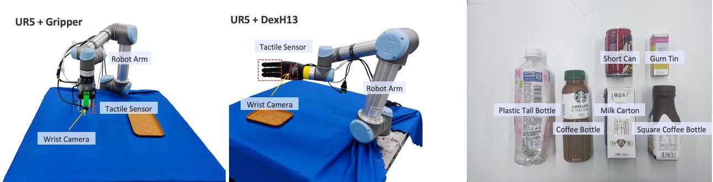

# 1. Bibliographic Information

## 1.1. Title
The central topic of the paper is **"OmniVTLA: Vision-Tactile-Language-Action Model with Semantic-Aligned Tactile Sensing"**. This title indicates a proposed robotic control model that integrates three distinct modalities: vision (sight), tactile sensing (touch), and language (instructions), with a specific focus on aligning tactile data semantically with the other modes.

## 1.2. Authors
The authors of this research are Zhenxue Cheng, Yiqian Zhang, Wenkang Zhan, Haoyu Li, Keyu Wang, Liong, and Hengdi Za. They are affiliated with **Paxini Tech** (specifically for Zhenxue Cheng) and **Shanghai Jiao Tong University** (for the others). Notably, Hengdi Za is listed as the corresponding author, indicating primary responsibility for communication and coordination regarding the paper.

## 1.3. Journal/Conference
The paper was published as a preprint on arXiv on August 12, 2025 (with a version update noted on August 25, 2025). While not yet assigned to a specific peer-reviewed conference (like ICRA or CVPR) at the time of this analysis, arXiv is a widely respected platform for sharing cutting-edge research in computer science and robotics before formal publication.

## 1.4. Publication Year
The publication year is **2025**. This places the work in the context of recent advancements in foundation models for robotics.

## 1.5. Abstract
The abstract outlines the current limitations of Vision-Language-Action (VLA) models, which overlook tactile perception despite its importance in contact-rich tasks. The authors propose **OmniVTLA**, a novel architecture featuring a dual-path tactile encoder. Their contributions include:
1.  A dual-path tactile encoder framework using a pretrained Vision Transformer (ViT) and a Semantically-Aligned ViT (SA-ViT).
2.  Introduction of the **ObjTac** dataset, containing 135K tri-modal samples (text, visual, tactile) for 56 objects across 10 categories.
3.  Training a semantic-aligned tactile encoder using this dataset to serve as better initialization.
    Experiments show substantial improvements over baseline VLA models, achieving 96.9% success rates with grippers and 100% with dexterous hands in pick-and-place tasks.

## 1.6. Original Source Link
*   **Original Source Link:** https://arxiv.org/abs/2508.08706
*   **PDF Link:** https://arxiv.org/pdf/2508.08706v2
*   **Publication Status:** Preprint (arXiv).

# 2. Executive Summary

## 2.1. Background & Motivation
The core problem addressed by this paper is the significant oversight of **tactile perception** in modern Vision-Language-Action (VLA) models. While VLA models leverage large-scale vision-language foundations to generalize across tasks, they struggle in **contact-rich tasks** (tasks requiring physical interaction like grasping fragile objects or manipulating tools). This failure occurs primarily due to two factors: the heterogeneity (diversity) of tactile sensors and the difficulty in acquiring high-quality tactile data. Existing models treat tactile data as low-level signals without aligning them semantically with visual and linguistic contexts.

This problem is important because true robotic dexterity—mimicking human ability to handle objects—requires integrating touch. Humans use tactile feedback to adjust grip strength, detect slip, and feel texture, which vision alone cannot provide. Without this, robots often drop objects, crush them, or fail to grasp unstable items.

The paper's innovative entry point is the creation of a unified model (**OmniVTLA**) that treats tactile data as a first-class citizen, aligned with vision and language. Instead of ignoring touch or treating it merely as raw numbers, the model learns a **semantic representation** of touch, allowing the robot to "understand" what it feels in the context of what it sees and what it is asked to do.

## 2.2. Main Contributions / Findings
The paper makes three primary contributions:
1.  **Proposed OmniVTLA Architecture:** A novel framework using a **dual-encoder path** to address tactile sensor heterogeneity. One path uses a standard pretrained Vision Transformer (ViT), and the other uses a **Semantically-Aligned Tactile ViT (SA-ViT)**.
2.  **Introduced ObjTac Dataset:** A comprehensive force-based tactile dataset with 135K tri-modal samples covering 56 objects across 10 categories, supplementing existing visuo-tactile datasets.
3.  **Semantic-Aligned Tactile Encoder:** A training strategy leveraging ObjTac to learn a unified tactile representation, significantly improving performance over standard approaches.

    Key findings from real-world experiments demonstrate that OmniVTLA achieves a **96.9% success rate** with grippers (21.9% higher than baselines) and **100% success rate** with dexterous hands (6.2% higher than baselines). Additionally, the model reduces task completion time and generates smoother trajectories, adhering to the principle of "moving quickly when clear, only slowing down during contact approach."

# 3. Prerequisite Knowledge & Related Work

## 3.1. Foundational Concepts
To understand this paper, a reader must be familiar with several key concepts:

*   **Vision-Language-Action (VLA) Models:** These are foundational AI architectures for robotics. They take visual inputs (images/video) and language instructions (text prompts) to generate action commands (motor movements). They are built upon Large Language Models (LLMs) and Vision Transformers (ViTs).
*   **Tactile Sensing:** The sense of touch. In robotics, this involves sensors that measure physical properties like force, pressure, vibration, or surface deformation. Types include **vision-based tactile sensors** (e.g., GelSight, which takes pictures of a deformed skin) and **force-based tactile sensors** (e.g., load cells measuring Newtons of force).
*   **Vision Transformer (ViT):** A type of neural network architecture that divides images into patches and processes them using self-attention mechanisms, originally popularized in computer vision for image classification. In this paper, ViTs are adapted to process both images and tactile data.
*   **Contrastive Learning:** A machine learning technique where the model learns by comparing pairs of data. It tries to pull embeddings (numerical representations) of similar items closer together in space and push dissimilar items further apart. For example, matching a picture of a "red cup" with the text label "red cup".
*   **End-to-End Learning:** A design philosophy where the system maps raw inputs directly to outputs (actions) without intermediate human-designed modules.

## 3.2. Previous Works
The paper situates itself within the evolution of robotic policy learning.
*   **Early Tactile Sensing:** Early works focused on specific tasks like **slip detection** (identifying when an object is starting to slide) or **grasp stability prediction** using small-scale models combining visual and tactile features.
*   **Vision-Language-Action (VLA):** Recent advances like **$\pi_0$** (Black et al., 2024) and **OpenVLA** (Kim et al., 2024a) have revolutionized manipulation by transferring web-scale knowledge. However, they rely heavily on vision and language, ignoring touch.
*   **Emerging Tactile-Enhanced Approaches:** Some recent attempts (e.g., TLA, VTA) have tried to incorporate touch. However, many treat tactile data as low-level signals rather than semantically aligned concepts. Table 1 in the paper summarizes the differences between VLA, TLA, VTA, and the proposed VTLA models.

## 3.3. Technological Evolution
The field has evolved from simple reinforcement learning policies (learning through trial and error) to imitation learning (learning from human demonstrations) and now to Foundation Model-based agents (using pre-trained large models).
1.  **Phase 1:** Task-specific RL (e.g., assembly tasks). Limited generalization.
2.  **Phase 2:** VLA Models (e.g., RT-X, OpenVLA). High generalization via language/vision, but poor performance in fine-grained physical interaction.
3.  **Phase 3 (Current Paper):** VTLA Models. Integrating tactile feedback semantically into the VLA framework to enable robust contact-rich manipulation.

## 3.4. Differentiation Analysis
Compared to main methods in related work, OmniVTLA differs in three critical ways:
1.  **Semantic Alignment:** Unlike prior VTA or VTLA models that simply concatenate tactile inputs, OmniVTLA forces tactile, visual, and language tokens into a shared semantic space using contrastive learning.
2.  **Dual-Encoder Path:** To handle diverse sensors (visual vs. force), it uses two parallel encoders instead of a single universal one, addressing the **heterogeneity** of tactile data.
3.  **Dataset Scale:** The introduction of ObjTac provides the large-scale tri-modal data required to train these semantic alignments effectively, which previous works lacked.

# 4. Methodology

## 4.1. Principles
The core idea behind OmniVTLA is to unify three modalities—Vision ($V$), Tactile ($T$), and Language ($L$)—into a common latent space where they can interact to predict Actions ($A$). The theoretical basis is **cross-modal representation learning**. By ensuring that the tactile signal "what the robot feels" corresponds semantically to the visual signal "what the robot sees" and the language "what the robot is told," the robot can generalize better to new objects and environments.

The model builds upon the **$\pi_0$** architecture, which uses a flow-matching model for action generation. The novelty lies in how tactile observations are processed and encoded before being fed into the backbone transformer.

## 4.2. Core Methodology In-depth

### 4.2.1. Problem Formulation
The goal of the action model is to model the probability distribution of future actions given the current observations. Mathematically, the distribution is expressed as:

\$
p(\mathbf{A}_t | \mathbf{o}_t)
\$

where $\mathbf{A}_t = \{a_t, a_{t+1}, \dotsc, a_{t+H-1}\}$ denotes the sequence of actions over a chunk length $H$, and $\mathbf{o}_t$ denotes the observations at the current time. For a typical VLA model, the observation consists of RGB images $\mathbf{I}_t^i$ and a language prompt $l_t$:

\$
O_t = \mathbf{M}_{\text{VLA}} \big( \mathbf{A}_t \mid f_{\phi} (\mathbf{I}_t^i), l_t \big)
\$

Here, $f_{\phi}$ represents a contrastive image encoder (like CLIP or SigLIP) that projects images into a latent embedding space compatible with text tokens. The VLA model then predicts actions conditioned on these embeddings.

Our objective for the VTLA model is to incorporate tactile data $\mathbf{T}_t^j$ (such as data from fingertip sensors or dexterous hand palms) into this formulation:

\$
o_t = \mathbf{M}_{\text{VTLA}} \big( \mathbf{A}_t \ \lvert \ f_{\phi} (\mathbf{I}_t^i), f_{\theta} (\mathbf{T}_t^j), l_t \big)
\$

In this equation, $f_{\theta}$ denotes the tactile encoder. Unlike images, tactile data (especially force-based) has different characteristics and cannot be simply remapped to tensors. Therefore, exploring different tactile encoders is crucial.

### 4.2.2. Overall Architecture with Dual-Encoder Path
As illustrated in Figure 2 (not shown here but described), OmniVTLA consists of tokenizers, a backbone, and an action head. The tokenizers convert inputs into latent tokens:
*   **Language:** PaliGemma tokenizer.
*   **Image:** SigLIP model (inputs resized to $224 \times 224$, yielding 256 tokens per image).
*   **Tactile:** Data normalized to int8 and stitched into single images ($224 \times 224$), processed through a ViT-like encoder to generate 256 tokens.

    The Gemma-2B backbone processes these concatenated tokens to produce action tokens, decoded by an action head trained with a flow matching loss.

To address the **heterogeneity** between tactile and visual data and across different tactile sensors, the authors explore four different tactile encoder designs:
1.  **VTLA-FS (From Scratch):** Trained entirely on limited teleoperated data.
2.  **VTLA-Pre:** Initialized from a pre-trained vision encoder (SigLIP/ViT) and fine-tuned on teleoperated data.
3.  **VTLA-SA (Semantic-Aligned):** First trained via cross-modality contrastive learning, then tuned on teleoperated data.
4.  **OmniVTLA:** Combines paths; one path is VTLA-SA, and the other utilizes the pretrained visual encoder approach.

    The following figure illustrates the architecture highlighting the dual-encoder path for tactile data:

    
    *该图像是示意图，展示了OmniVTLA模型的架构，包括文本标记器、图像编码器和触觉编码器等组件，右侧展示了与触觉数据异构性的相关信息。这些部分通过对比学习相互连接，强调了语义对齐触觉编码的重要性。*

This dual-encoder design enables effective knowledge transfer and consistent representation learning across diverse sensory inputs (visual vs. force-based). Force-based sensors offer high temporal resolution for event characterization, complementing the high spatial resolution of vision-based tactile sensors.

### 4.2.3. Semantic-Aligned Tactile Encoder
Existing encoders (e.g., AnyTouch) perform poorly on force-based datasets (only 40.21% material classification accuracy in one test). To solve this, the authors introduced their own dataset, **ObjTac**, which contains tri-modal data (vision, text, force).

To train the encoder, they employed a second-stage training pipeline based on AnyTouch but added their own data. They employ a multi-modality loss function designed to align visual, tactile, and linguistic modalities. The total alignment loss $\mathcal{L}_{align}$ is defined as:

\$
\begin{aligned}
\mathcal{L}_{align} = \alpha_{VL} * \frac{\mathcal{L}_{V \to L} + \mathcal{L}_{T \to V}}{2} + \alpha_{VT} * \frac{\mathcal{L}_{V \to T} + \mathcal{L}_{T \to V}}{2} + \alpha_{VL} * \frac{\mathcal{L}_{T \to L} + \mathcal{L}_{L \to T}}{2}
\end{aligned}
\$

In addition to the alignment loss, a cross-sensor matching loss with binary cross entropy is added to the total loss to ensure consistency between different sensor types.

Here, the symbols represent the following:
*   $\mathcal{L}_{V \to L}$: Loss between Vision and Language alignment.
*   $\mathcal{L}_{T \to V}$: Loss between Tactile and Vision alignment.
*   $\mathcal{L}_{T \to L}$: Loss between Tactile and Language alignment.
*   $\alpha_{VL}, \alpha_{VT}, \alpha_{TL}$: Hyper-parameters controlling the weight of each alignment term. (Note: The text lists $\alpha_{VL}$ for the third term involving T and L; this may indicate a specific weighting choice or a typographical repetition in the source text, but we adhere to the provided formula).
*   $\mathcal{L}_{L \to T}$: Loss between Language and Tactile alignment.

    By incorporating ObjTac, this semantic-aligned tactile encoder (SA-ViT) adapts better to implemented sensors and aligns semantic representations, reducing tactile signals (e.g., roughness, hardness) to meaningful concepts for the VTLA.

The following figure (Figure 4 from the original paper) shows the experimental setup hardware and environment:

*该图像是展示UR5机器人臂与不同抓取工具（如夹具和DexH13）同时配备触觉传感器和腕部摄像头的示意图。右侧展示了不同类别的物体，如塑料瓶、牛奶盒等。*

# 5. Experimental Setup

## 5.1. Datasets
The experiments utilize both existing public datasets and a newly introduced dataset.
*   **ObjTac (New):** This dataset captures textual, visual, and force-based tactile information. It includes **135K tri-modal samples** for **56 objects across 10 categories**. The objects range from plastic bottles and metal boxes to fabric and leather items.
    *   *Data Collection:* Each object underwent 5 interaction trials. Force data was recorded at 60 Hz (total 270,000 force points), and synchronized video at 30 FPS. Textual annotations included object name, material, roughness, and hardness.
*   **Touch and Go (Existing):** Used for comparison on vision-based tactile tasks.
*   **Teleoperated Demonstrations:** For the real-world manipulation tasks, 40 episodes per object were collected at 30 Hz using UR5 arms and various end-effectors.

    These datasets were chosen because existing visuo-tactile datasets often lack the depth of force-based tactile data required for contact-rich tasks, and existing benchmarks do not adequately cover the semantic alignment needed for VTLA models.

## 5.2. Evaluation Metrics
The paper evaluates performance using several metrics, which are explained below:

### 5.2.1. Mean Squared Error (MSE)
*   **Conceptual Definition:** Measures the average squared difference between the predicted robot state (position, rotation, joint angles) and the ground truth state derived from human demonstrations. Lower MSE indicates more accurate trajectory prediction.
*   **Mathematical Formula:**
    \$
    \mathrm{MSE} = \frac{1}{T} \sum_{t=1}^{T} \| x_t - \hat{x}_t \|^2
    \$
*   **Symbol Explanation:**
    *   $T$: Total timestep in the evaluation window.
    *   $x_t$: Ground truth state vector at time $t$.
    *   $\hat{x}_t$: Predicted state vector at time $t$.
    *   $\| \cdot \|^2$: Squared Euclidean norm (distance).

### 5.2.2. Success Rate (SR)
*   **Conceptual Definition:** The percentage of trials where the robot successfully completed the task (e.g., placing the object in the target location) within the allowed time steps. Higher SR is better.
*   **Mathematical Formula:**
    \$
    \text{SR} (\%) = \left( \frac{\text{Number of Successful Trials}}{\text{Total Number of Trials}} \right) \times 100
    \$
*   **Symbol Explanation:** Standard ratio calculation.

### 5.2.3. Completion Time (CT)
*   **Conceptual Definition:** The number of steps taken from the initiation of the task to the successful placement (and gripper opening). Lower CT indicates faster task execution.
*   **Mathematical Formula:** Counted directly as the number of discrete action steps until task termination.

### 5.2.4. Motion Smoothness
*   **Conceptual Definition:** Quantifies the variance along the end-effector's motion trajectory. Lower variance indicates smoother, less jerky movements. This is critical for handling fragile objects.
*   **Mathematical Formula:** Calculated as end-effector motion variance along trajectories (specific normalization factor $10^{-4}$ used in reporting).
*   **Symbol Explanation:** Derived from the derivative of position data.

## 5.3. Baselines
The proposed method is compared against two main baseline families:
1.  **Diffusion Policy (DP):** A non-VLM baseline that uses diffusion models to predict action distributions from visual observations only. It represents the standard in visuomotor imitation learning.
2.  **$\pi_0$ (PI Zero):** A strong VLA baseline that leverages pre-trained language models. It represents the state-of-the-art in vision-language-action without tactile integration.

    These baselines are representative because DP covers pure visual policy learning, while $\pi_0$ covers the leading VLA paradigm that the authors aim to improve upon by adding tactile capabilities.

# 6. Results & Analysis

## 6.1. Core Results Analysis
The experimental results validate that OmniVTLA significantly outperforms baselines in contact-rich scenarios.
*   **Success Rate:** With a two-finger gripper, OmniVTLA achieved an average success rate of **96.9%**, compared to 75.0% for the VLA ($\pi_0$) baseline. This represents a **21.9% improvement**.
*   **Dexterous Hand:** With a four-finger dexterous hand, OmniVTLA reached **100% success rate**, improving over the VLA baseline's 93.8% by **6.2%**.
*   **Generalization:** Crucially, for unseen objects (Plastic Bottle, Square Coffee Bottle), OmniVTLA maintained 100% success, whereas the VLA baseline dropped to 87.5%. This confirms the model's ability to generalize using tactile cues.
*   **Efficiency:** OmniVTLA reduced the average Completion Time (CT) by roughly **24.2%** compared to the VLA baseline (from 657 steps to 498 steps).
*   **Smoothness:** The Smoothness metric showed an **89.6% reduction** in variance compared to the VLA baseline when using the SA encoder, indicating much smoother, safer interactions.

    The following figure (Figure 5 from the original paper) displays the Mean Squared Error (MSE) results across different models and objects:

    
    *该图像是柱状图，展示了不同模型在几种物体上的均方误差（MSE）。包括VLA、VTLA-Pre、VTLA-FS、VTLA-SA和OmniVTLA的结果，显示OmniVTLA在多项任务中表现优于其他基线模型。*

## 6.2. Data Presentation (Tables)
The following are the results from Table 3 of the original paper: Real-world experimental results on different models using a two-finger gripper.

<table>
<thead>
<tr>
<th rowspan="2">Model</th>
<th colspan="3">Tactile Enc.</th>
<th colspan="4">SR (%) ↑</th>
<th rowspan="2">Avg</th>
<th colspan="5">CT (step) ↓</th>
</tr>
<tr>
<th>FS</th>
<th>Pre</th>
<th>SA</th>
<th>Can</th>
<th>Bottle</th>
<th>Milk</th>
<th>Tin</th>
<th>Avg</th>
<th>Can</th>
<th>Bottle</th>
<th>Milk</th>
<th>Tin</th>
<th>Avg</th>
</tr>
</thead>
<tbody>
<tr>
<td>VLA (π0)</td>
<td>×</td>
<td></td>
<td></td>
<td>62.5</td>
<td>37.5</td>
<td>100</td>
<td>100</td>
<td>75.0</td>
<td>981</td>
<td>562</td>
<td>648</td>
<td>436</td>
<td>657</td>
</tr>
<tr>
<td>VTLA-FS</td>
<td>✓</td>
<td>×</td>
<td></td>
<td>75.0</td>
<td>50.0</td>
<td>100</td>
<td>100</td>
<td>81.2</td>
<td>677</td>
<td>549</td>
<td>498</td>
<td>423</td>
<td>537</td>
</tr>
<tr>
<td>VTLA-Pre</td>
<td>×</td>
<td>✓</td>
<td></td>
<td>62.5</td>
<td>75.0</td>
<td>100</td>
<td>100</td>
<td>84.4</td>
<td>847</td>
<td>526</td>
<td>540</td>
<td>429</td>
<td>586</td>
</tr>
<tr>
<td>VTLA-SA</td>
<td>×</td>
<td>×</td>
<td>✓</td>
<td>87.5</td>
<td>62.5</td>
<td>100</td>
<td>100</td>
<td>87.5</td>
<td>524</td>
<td>553</td>
<td>455</td>
<td>405</td>
<td>484</td>
</tr>
<tr>
<td><b>OmniVTLA</b></td>
<td>×</td>
<td>✓</td>
<td>✓</td>
<td>100</td>
<td>87.5</td>
<td>100</td>
<td>100</td>
<td><b>96.9</b></td>
<td>535</td>
<td>537</td>
<td>527</td>
<td>393</td>
<td><u>498</u></td>
</tr>
</tbody>
</table>

Bold font denotes the best performance, and the underlined font denotes the second best performance.

The following are the results from Table 4 of the original paper: Real-world experimental results on different models using a four-finger dexterous hand.

<table>
<thead>
<tr>
<th rowspan="2">Model</th>
<th colspan="5">SR (%) ↑</th>
<th colspan="5">CT (step) ↓</th>
</tr>
<tr>
<th>Bottle</th>
<th>Milk</th>
<th>Plastic†</th>
<th>Square†</th>
<th>Avg</th>
<th>Bottle</th>
<th>Milk</th>
<th>Plastic†</th>
<th>Square†</th>
<th>Avg</th>
</tr>
</thead>
<tbody>
<tr>
<td>VLA (π0)</td>
<td>100</td>
<td>100</td>
<td>87.5</td>
<td>87.5</td>
<td>93.8</td>
<td>312</td>
<td>324</td>
<td>369</td>
<td>368</td>
<td>343</td>
</tr>
<tr>
<td><b>OmniVTLA</b></td>
<td>100</td>
<td>100</td>
<td>100</td>
<td>100</td>
<td><b>100</b></td>
<td>307</td>
<td>305</td>
<td>339</td>
<td>335</td>
<td><u>322</u></td>
</tr>
</tbody>
</table>

Bold font denotes the best performance. † denotes the object class not in the training set.

The following are the results from Table 5 of the original paper: Real-world experimental results comparing VLA (DP) and VTA (Ours) using a two-finger gripper.

<table>
<thead>
<tr>
<th rowspan="2">Model</th>
<th rowspan="2">Tactile Enc.</th>
<th colspan="5">SR (%) ↑</th>
<th colspan="5">CT (step) ↓</th>
</tr>
<tr>
<th>Can</th>
<th>Bottle</th>
<th>Milk</th>
<th>Tin</th>
<th>Avg.</th>
<th>Can</th>
<th>Bottle</th>
<th>Milk</th>
<th>Tin</th>
<th>Avg.</th>
</tr>
</thead>
<tbody>
<tr>
<td>VLA (DP)</td>
<td></td>
<td>75.0</td>
<td>75.0</td>
<td>50.0</td>
<td>37.5</td>
<td>59.4</td>
<td>767</td>
<td>989</td>
<td>1010</td>
<td>638</td>
<td>851</td>
</tr>
<tr>
<td><b>VTA (Ours)</b></td>
<td>×</td>
<td>100</td>
<td>75.0</td>
<td>75.0</td>
<td>62.5</td>
<td><b>78.1</b></td>
<td>695</td>
<td>658</td>
<td>783</td>
<td>593</td>
<td><b>682</b></td>
</tr>
</tbody>
</table>

Bold font denotes the best-performance. All parameters are trained from scratch.

The following are the results from Table 6 of the original paper: The smoothness of generated trajectories with tactile encoders for the model π0.

<table>
<thead>
<tr>
<th rowspan="2">Model</th>
<th rowspan="2">Tactile Enc.</th>
<th colspan="5">Smoothness (×10−4) ↓</th>
</tr>
<tr>
<th>FS</th>
<th>Pre</th>
<th>SA</th>
<th>Can</th>
<th>Bottle</th>
<th>Milk</th>
<th>Tin</th>
<th>Avg</th>
</tr>
</thead>
<tbody>
<tr>
<td>VLA (π0)</td>
<td>×</td>
<td>×</td>
<td>×</td>
<td>29.3</td>
<td>0.78</td>
<td>6.24</td>
<td>1.95</td>
<td>9.57</td>
</tr>
<tr>
<td>VTLA-FS</td>
<td>✓</td>
<td>×</td>
<td>×</td>
<td>2.57</td>
<td>0.69</td>
<td>1.54</td>
<td>1.69</td>
<td>1.62</td>
</tr>
<tr>
<td>VTLA-Pre</td>
<td>×</td>
<td>✓</td>
<td>×</td>
<td>1.95</td>
<td>0.97</td>
<td>5.09</td>
<td>2.63</td>
<td>2.66</td>
</tr>
<tr>
<td>VTLA-SA</td>
<td>×</td>
<td>×</td>
<td>✓</td>
<td>1.12</td>
<td>0.45</td>
<td>0.92</td>
<td>1.68</td>
<td><u>1.04</u></td>
</tr>
<tr>
<td><b>OmniVTLA</b></td>
<td>×</td>
<td>✓</td>
<td>✓</td>
<td>1.33</td>
<td>1.37</td>
<td>1.90</td>
<td>1.22</td>
<td>1.46</td>
</tr>
</tbody>
</table>

Three settings are conducted for a fair comparison, where ✓ denotes From Scratch, Pre denotes Pretrained model; SA represents the our proposed Semantic-Aligned tactile encoder.

## 6.3. Ablation Studies / Parameter Analysis
The paper conducts extensive ablation studies to determine the contribution of different encoder types.
*   **Encoder Impact:** As shown in Table 3, the **VTLA-SA** (Semantic-Aligned) encoder performs significantly better (87.5% Avg SR) than **VTLA-FS** (81.2%) and **VLA** (75.0%). This validates the hypothesis that semantic alignment is superior to training from scratch or simple fine-tuning.
*   **Dual-Encoder Benefit:** The **OmniVTLA** configuration, which combines the Pretrained and SA paths (dual-encoder), achieves the highest score (96.9%). This demonstrates that the dual-path architecture handles sensor heterogeneity better than a single encoder.
*   **Object Generalization:** Table 4 highlights that OmniVTLA achieves 100% success on unseen objects (Plastic, Square), whereas the baseline drops to 87.5%. This proves the tactile features learned are generalizable properties (hardness, shape) rather than memorized textures.

    The following figure (Figure 6 from the original paper) demonstrates visualization of failed cases for VLA models versus successful OmniVTLA cases:

    
    *该图像是一个示意图，展示了VLA、VTLA-FS、VTLA-Pre、VTLA-SA与OmniVTLA在接触识别能力上的对比。图中标示了各模型在不同接触情况下的失败案例，以及OmniVTLA在稳定接触下的成功示范。*

Qualitative results show that VLA models often fail due to insufficient contact awareness, while VTLA-SA triggers persistent grip adjustments. In contrast, OmniVTLA uses semantic tactile cues to stabilize grasps effectively.

# 7. Conclusion & Reflections

## 7.1. Conclusion Summary
The paper presents **OmniVTLA**, a robust Vision-Tactile-Language-Action model that addresses the critical gap in tactile perception for VLA systems. By introducing a **dual-encoder path** and the large-scale **ObjTac dataset**, the authors enable robots to semantically align tactile sensations with visual and linguistic contexts. Empirical results confirm significant gains: a **21.9% increase in success rate** for grippers and **6.2% for dexterous hands**, alongside faster completion times and smoother trajectories.

## 7.2. Limitations & Future Work
The authors acknowledge several limitations:
*   **Task Scope:** Current evaluations are limited to pick-and-place tasks. More complex tasks (assembly, folding) are not tested.
*   **Robot Diversity:** Evaluations are restricted to specific robots (UR5 arm, Paxini sensors).
*   **Future Directions:** The authors suggest exploring more complex tasks, more efficient tactile representations, and temporally dynamic fusion architectures.

## 7.3. Personal Insights & Critique
The OmniVTLA framework represents a significant step forward in embodied AI. The most compelling insight is the explicit recognition of **sensor heterogeneity**. Most prior works assumed a uniform tactile interface, but the real world involves mixed sensors (force, vision, vibration). The dual-encoder solution pragmatically bridges this gap without forcing incompatible data into a single rigid format.

However, a few areas warrant scrutiny:
1.  **Training Cost:** The alignment loss $\mathcal{L}_{align}$ requires extensive tri-modal data. While ObjTac helps, scaling this to thousands of objects requires massive data collection efforts which may be cost-prohibitive for smaller labs.
2.  **Real-time Performance:** The inclusion of a second encoder path and additional contrastive loss layers increases computational load. The paper reports completion in fewer *steps*, but it does not specify the inference latency per step. For high-speed applications, the overhead of the dual-encoder and SA-ViT processing needs verification.
3.  **Force Sensor Dependency:** The success relies heavily on the quality of the Paxini force sensors. If a robot switches to a different force sensor with different calibration characteristics, the "unified tactile representation" trained on the original sensors might degrade without further fine-tuning. Future work could investigate domain adaptation techniques for force sensors.

    Overall, this paper sets a strong precedent for the next generation of robotic foundation models, moving beyond "vision-only" or "vision-language" towards truly **multimodal** (Visuo-Tacto-Linguistic-Aware) intelligence.