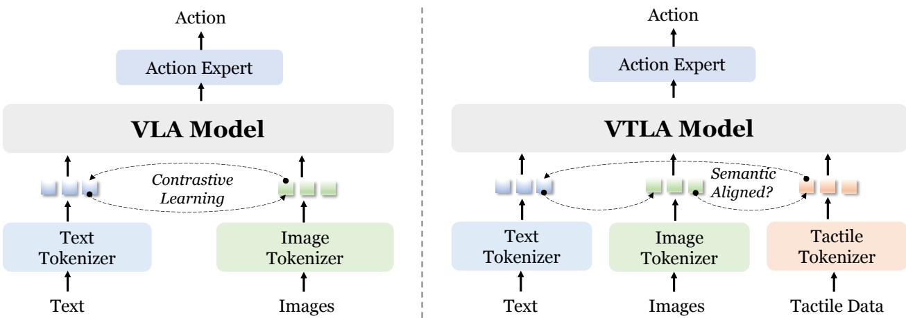
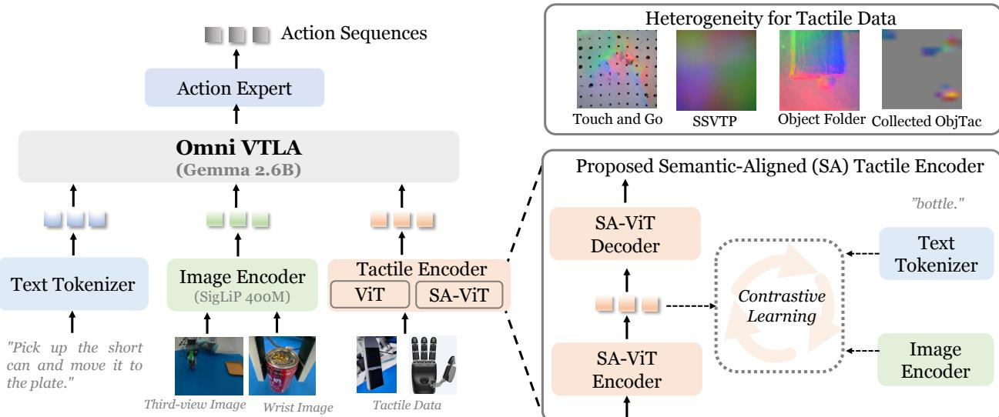
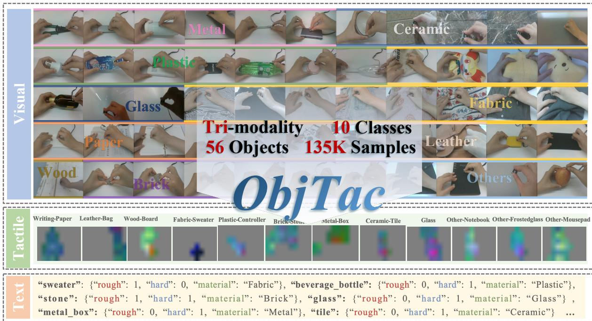
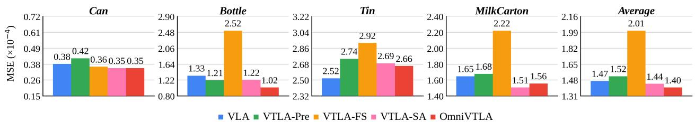
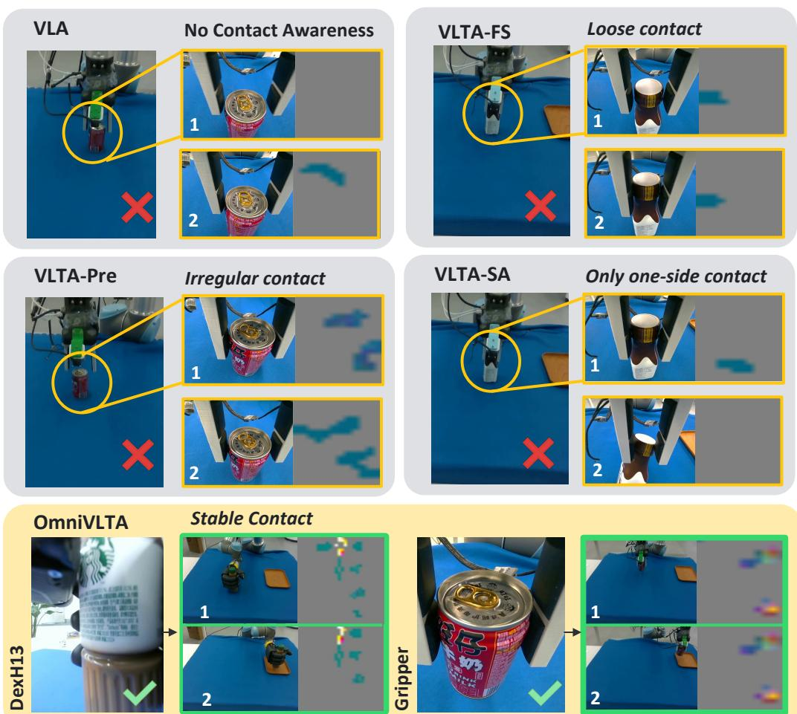

# 1. 论文基本信息

## 1.1. 标题
本文的标题为《OmniVTLA: Vision-Tactile-Language-Action Model with Semantic-Aligned Tactile Sensing》，中文可译为《OmniVTLA：具有语义对齐触觉感知的视觉 - 触觉 - 语言 - 行动模型》。该标题清晰地指出了研究的核心对象（OmniVTLA 模型）、输入模态（视觉、触觉、语言、行动）以及关键技术创新点（语义对齐的触觉感知）。

## 1.2. 作者与机构
论文由来自两个机构的研究人员共同完成：
*   <strong>Paxini Tech（帕克西尼科技）：</strong> 作者包括 Zhenxue Cheng, Wenkang Zhan, Haoyu Li, Keyu Wang, Hengdi Za。
*   <strong>上海交通大学（Shanghai Jiao Tong University）：</strong> 作者包括 Yiqian Zhang, Liong。
    其中，Hengdi Za 被标记为通讯作者（Corresponding author）。这表明该研究结合了学术机构的基础研究与产业界的技术应用背景。

## 1.3. 发表期刊/会议
根据提供的元数据，该论文发表于 **arXiv** 平台，属于预印本状态（Preprint）。
*   **发布时间：** 2025 年 8 月 12 日（UTC）。
*   **当前时间：** 2026 年 3 月 10 日。
    这意味着这是一篇近期发表的前沿研究论文，尚未正式在顶级机器人或计算机视觉会议（如 ICRA, RSS, CVPR）上刊出，但已在学术界广泛传播。其 arXiv 编号为 `2508.08706`。

## 1.4. 摘要
本文针对现有的视觉 - 语言 - 行动（VLA）模型在接触密集型任务中忽略触觉感知的不足，提出了一种名为 **OmniVTLA** 的新型架构。核心贡献包括：(1) 设计了一个双路径触觉编码器框架，利用预训练的视觉 Transformer 和语义对齐的触觉 ViT（SA-ViT）来增强对不同传感器的感知能力；(2) 构建了 **ObjTac** 数据集，包含 56 种物体、10 个类别的文本、视觉和力觉三模态信息（共 135K 样本），填补了现有 visuo-tactile 数据集的空白；(3) 利用该数据集训练了语义对齐的触觉编码器，作为 OmniVTLA 更好的初始化。真实世界实验表明，相比最先进（state-of-the-art）的 VLA 基线，OmniVTLA 在抓取器上的成功率提高了 21.9%（达到 96.9%），在灵巧手上达到了 100% 成功率，且减少了任务完成时间并生成了更平滑的轨迹。

## 1.5. 原文链接
*   **原文链接：** https://arxiv.org/abs/2508.08706
*   **PDF 链接：** https://arxiv.org/pdf/2508.08706v2
*   **发布状态：** 已上传至 arXiv 服务器，目前状态为公开访问。

    ---

# 2. 整体概括

## 2.1. 研究背景与动机
随着具身智能（Embodied AI）的发展，<strong>视觉 - 语言 - 行动（VLA）模型</strong> 已成为实现机器人通用操作的关键范式。这类模型（如 RT-1, OpenVLA, $\pi_0$）利用大规模预训练的视觉 - 语言模型（VLMs）来理解自然语言指令和视觉观察，从而生成机器人动作序列。然而，这些模型存在一个显著的缺陷：它们主要依赖于视觉和语言，而<strong>忽略了触觉感知（Tactile Perception）</strong>的重要性。

触觉在人类灵巧操作中至关重要，它提供了直接的接触动力学反馈（如压力分布、纹理、刚性），这是视觉无法替代的。特别是在“接触密集型”（contact-rich）任务（如插拔、精细抓取、易碎品处理）中，仅靠视觉往往会导致失败。现有的融合触觉的工作通常将触觉数据视为低层信号，未能将其与视觉和语言语境进行<strong>语义对齐（Semantic Alignment）</strong>。此外，触觉传感器种类繁多（视觉式如 GelSight，力觉式如 Paxini Gen2），数据异质性严重，且获取高质量触觉数据的成本较高，这阻碍了通用触觉模型的构建。

因此，本研究旨在解决以下核心问题：如何在一个统一的框架内有效地融合视觉、语言和触觉，特别是如何处理不同触觉传感器的异质性，并让机器人像人一样“理解”它所触摸到的东西？

## 2.2. 核心贡献/主要发现
本文的主要创新点和结论如下：
1.  **提出了 OmniVTLA 架构：** 这是一种全新的端到端接触密集型操作模型。它引入了<strong>双路径触觉编码器（Dual-Path Tactile Encoder）</strong>，分别使用预训练视觉 Transformer（用于兼容视觉式触觉数据）和语义对齐触觉 ViT（SA-ViT，用于学习统一表征），以克服触觉传感器的异构性。
2.  **发布了 ObjTac 数据集：** 这是一个全面的多模态触觉数据集，包含 56 种物体、10 个类别，共计 135K 个三模态样本（文本、视觉、力觉）。该数据集专门用于训练语义对齐的触觉编码器，补充了现有数据的不足。
3.  **实现了显著的性能提升：** 在真实世界的拾取 - 放置任务中，OmniVTLA 展现了优于现有 VLA 基线的性能。使用机械夹爪时成功率达 96.9%（比基线高 21.9%），使用四指灵巧手时达 100%（比基线高 6.2%）。同时，引入触觉反馈后，任务完成时间减少，运动轨迹更加平滑。

    ---

# 3. 预备知识与相关工作

## 3.1. 基础概念
为了深入理解本文，读者需要掌握以下基础概念：

*   <strong>视觉 - 语言 - 行动模型（Vision-Language-Action Model, VLA）：</strong> 一种将视觉图像、自然语言指令映射到机器人动作序列的端到端神经网络模型。它是连接大语言模型（LLM）/多模态大模型与物理机器人的桥梁。
*   <strong>触觉传感器（Tactile Sensor）：</strong> 用于检测物理接触信息的设备。主要分为两类：
    *   <strong>视觉式触觉（Visuo-tactile）：</strong> 如 GelSight，通过摄像头拍摄接触面的形变图像来获取纹理和形状。
    *   <strong>力觉式触觉（Force-based）：</strong> 如压电或应变片传感器，直接测量接触时的力和扭矩，通常具有更高的时间分辨率。
*   <strong>Transformer / ViT（Vision Transformer）：</strong> 一种基于自注意力机制（Self-Attention）的深度学习架构，最初用于自然语言处理，后被广泛应用于计算机视觉。在本文中，它被用作编码视觉和触觉图像的骨干网络。
*   <strong>对比学习（Contrastive Learning）：</strong> 一种自监督学习方法，旨在拉近相似样本（如“苹果”的文字描述和苹果的触觉/视觉图像）在嵌入空间中的距离，推远不相关样本的距离，从而实现多模态的**语义对齐**。
*   <strong>词元（Token）：</strong> 在 NLP 和 VLA 模型中，文本、图像或传感器数据被分割成的基本单元。例如，一段文字被切分为单词 token，一张图片被切分为 Patch token。

## 3.2. 前人工作
作者在引言和相关工作中梳理了该领域的技术脉络：

1.  **早期触觉感知工作：** 早期的研究（如 Calandra et al., 2018; Li et al., 2018）主要集中在小规模模型上，专注于特定任务如滑移检测（slip detection）或抓取稳定性预测。这些工作虽然证明了多模态的价值，但缺乏泛化能力，难以扩展到复杂场景。
2.  <strong>视觉 - 触觉融合（Vision-Tactile Fusion）：</strong> 近年来，强化学习和模仿学习被用于结合视觉和触觉输入。例如，Lee et al. (2020) 利用深度强化学习进行组装任务。然而，这些方法通常在语义推理和泛化能力上不如 VLA 模型。
3.  **VLA 模型演进：** Brohan et al. (2023) 开创了 VLA 方向。后续工作如 OpenVLA (Kim et al., 2024a), $\pi_0$ (Black et al., 2024) 展示了强大的知识迁移能力。但这些模型普遍缺失触觉通道。
4.  **新兴的触觉增强 VLA：** 最近有一些尝试（如 Zhang et al., 2025b; Huang et al., 2025）将触觉融入 VLA 框架，但它们大多将触觉视为低级信号，未探索深层的触觉编码器设计。

## 3.3. 差异化分析
本文工作与前述工作的核心区别在于 <strong>“语义对齐”</strong> 和 <strong>“异构性处理”</strong>。

下表（原文 Table 1）总结了不同 VLA 类模型的差异，清晰展示了 OmniVTLA 的独特性：

以下是原文 [Table 1] 的结果：

<table>
<thead>
<tr>
<th rowspan="2">Model Type</th>
<th rowspan="2">Methods</th>
<th rowspan="2">Input</th>
<th rowspan="2">Output</th>
<th>Semantic-Aligned</th>
</tr>
<tr>
</tr>
</thead>
<tbody>
<tr>
<td>VA</td>
<td>Diffusion Policy (Chi et al., 2023)</td>
<td>V</td>
<td>A</td>
<td>✓</td>
</tr>
<tr>
<td>VTA</td>
<td>RDP (Xue et al., 2025)</td>
<td>V + T</td>
<td>A</td>
<td>X</td>
</tr>
<tr>
<td>VLA</td>
<td>OpenVLA (Kim et al., 2024a), π0 (Black et al., 2024)</td>
<td>V + L</td>
<td>A</td>
<td>✓</td>
</tr>
<tr>
<td>TLA</td>
<td>TLA (Hao et al., 2025)</td>
<td>T + L</td>
<td>A</td>
<td>X</td>
</tr>
<tr>
<td>VTLA</td>
<td>VTLA (Zhang et al., 2025b), Tactile-VLA (Huang et al., 2025)</td>
<td>V + T +L</td>
<td>A</td>
<td>X</td>
</tr>
<tr>
<td>OmniVTLA</td>
<td>Ours</td>
<td>V + T + L</td>
<td>A</td>
<td>√</td>
</tr>
</tbody>
</table>

**分析：**
*   大多数现有的 VTLA 模型（如 Zhang et al., 2025b）虽然集成了三种模态（V, T, L），但在输出表中显示为 "X"，意味着它们缺乏真正的语义对齐。
*   OmniVTLA 明确标记为 "√"，表示其致力于建立视觉、触觉和语言在共享语义空间中对齐的表示。
*   图 1（下图 `images/1.jpg`）直观地展示了这一区别：传统 VLA 模型仅使用视觉编码器（继承 CLIP/SigLIP），而 VTLA 模型需要额外的触觉编码器，并且关键在于该编码器必须能与视觉和语言模态进行语义对齐。

    
    *图 1：左侧为传统 VLA 模型，右侧为 VTLA 模型。关键区别在于新的触觉编码器能否实现与视觉、语言的语义对齐。*

---

# 4. 方法论

## 4.1. 方法原理
OmniVTLA 的核心思想是将触觉信号重新映射为类似图像的张量，并利用 Transformer 架构进行编码，最终通过与视觉和语言的联合训练，使机器人能够“理解”触觉反馈背后的语义（如物体的材质、硬度、粗糙度）。

为了应对触觉传感器的<strong>异质性（Heterogeneity）</strong>（即视觉式传感器和力觉式传感器数据分布差异大），作者没有采用单一编码器，而是设计了<strong>双路径编码器（Dual-Path Encoder）</strong>。一条路径利用预训练的视觉 ViT 继承视觉特征，另一条路径利用新训练的语义对齐 ViT（SA-ViT）学习跨传感器的触觉统一表征。这种设计使得模型既能利用已有的视觉先验，又能适应特定的力觉数据分布。

## 4.2. 核心方法详解
OmniVTLA 的整体架构建立在 $\pi_0$ 模型（Black et al., 2024）的基础上，包含三个核心组件：<strong>Tokenizers（词元化器）</strong>、<strong>Backbone（主干网络）</strong> 和 <strong>Action Head（动作头）</strong>。

### 4.2.1. 问题形式化
首先，定义动作建模的目标是建模条件概率分布 $p (\mathbf { A } _ { t } | \mathbf { o } _ { t })$。
其中，$\mathbf { A } _ { t } = \left\{ a _ { t } , a _ { t + 1 } , \dotsc , a _ { t + H - 1 } \right\}$ 表示动作序列，$H$ 为动作块长度（Chunk Length）。$\mathbf { o } _ { t }$ 表示当前时刻的观察值。

对于典型的 VLA 模型，观察值 $\mathbf { O } _ { t }$ 由 RGB 图像、语言提示和机器人本体感知状态组成，公式表达为：
$$
O _ { t } = \mathbf { M } _ { \mathrm { V L A } } \big ( \mathbf { A } _ { t } \mid f _ { \phi } ( \mathbf { I } _ { t } ^ { i } ) , l _ { t } \big ),
$$
这里，$\mathbf { I } _ { t } ^ { i }$ 表示第 $i$ 个图像（如第三视角图像、手腕相机图像），`l _ { t }` 是语言令牌序列。通常，图像通过基于 ViT 的对比图像编码器 $f _ { \phi}$（如 CLIP, SigLIP）编码，并投影到与文本令牌相同的潜在嵌入空间。

我们的目标是将触觉数据纳入输入。如图 2（下文 `images/2.jpg`）所示，VTLA 模型的数学表达式扩展为：
$$
o _ { t } = \mathbf { M } _ { \mathrm { V T L A } } \big ( \mathbf { A } _ { t } \ \lvert \ f _ { \phi } ( \mathbf { I } _ { t } ^ { i } ) , f _ { \theta } ( \mathbf { T } _ { t } ^ { j } ) , l _ { t } \big ),
$$
其中 $\mathbf { T } _ { t } ^ { j }$ 表示第 $j$ 个触觉数据（如指尖夹具上的触觉传感器或灵巧手的传感器阵列）。$f _ { \phi}$ 在此处代表触觉编码器。直觉上，触觉数据可以重映射为张量，并使用类似 ViT 的结构进行编码，但其特性与传统视觉数据不同。我们需要探索不同的触觉编码器及训练策略。

*图 2：OmniVTLA 的整体架构示意图。包含文本标记器、图像编码器和触觉编码器等组件。右侧展示了触觉数据异构性的相关信息。*

### 4.2.2. 双路径触觉编码器设计
由于触觉传感器之间的异构性（例如，视觉触觉传感器如 GelSight 捕获表面几何，而力觉传感器如 Paxini Gen2 测量力），单一的编码器很难适应所有情况。为此，作者提出了四种不同的触觉编码器配置进行探究，并最终采用 <strong>OmniVTLA（双编码器路径）</strong> 方案：
1.  **VTLA-FS:** 触觉从头开始训练（From Scratch），仅依赖有限的遥操作触觉数据。
2.  **VTLA-Pre:** 触觉编码器使用大规模数据集预训练的视觉编码器初始化，并在少量遥操作数据上进行微调。
3.  **VTLA-SA:** 触觉编码器首先通过跨模态对比学习进行训练，以实现语义级对齐，然后在少量数据上进行微调。
4.  **OmniVTLA:** 双路径设计，一路是 VTLA-Pre，另一路是 VTLA-SA。

    这两种编码器生成的 tokens 会被拼接起来，使模型能够理解跨传感器的触觉信息。视觉触觉传感器通常具有高空间分辨率但低时间分辨率（最高约 30Hz），而力觉传感器具有较低的空间分辨率但较高的时间分辨率。双编码器设计允许模型互补这些信息。

### 4.2.3. 语义对齐触觉编码器 (SA-ViT)
为了进一步统一触觉表征，作者收集了自己的数据集 ObjTac。为了训练更好的语义对齐编码器，他们使用了 AnyTouch 的二阶段训练流程，并结合了自己的数据集，采用了多模态和跨传感器对齐。

由于数据集中包含三模态数据对，对于新增数据，直接使用总损失函数进行优化。总损失函数 $\mathcal { L } _ { a l i g n }$ 如下所示：
$$
\mathcal { L } _ { a l i g n } = \alpha _ { V L } * \frac { \mathcal { L } _ { V  L } + \mathcal { L } _ { T  V } } { 2 } + \alpha _ { V T } * \frac { \mathcal { L } _ { V  T } + \mathcal { L } _ { T  V } } { 2 } + \alpha _ { T L } * \frac { \mathcal { L } _ { T  L } + \mathcal { L } _ { L  T } } { 2}
$$
此外，还加入了带有二元交叉熵的跨传感器匹配损失到总损失中。

**符号解释与公式拆解：**
*   $\mathcal { L } _ { V  L }$: 视觉与语言之间的对比损失。
*   $\mathcal { L } _ { T  V }$: 触觉与视觉之间的对比损失。
*   $\mathcal { L } _ { T  L }$: 触觉与语言之间的对比损失。
*   $\alpha _ { V L }, \alpha _ { V T }, \alpha _ { T L }$: 超参数，用于平衡不同模态对比损失的重要性。
*   该公式的含义是：通过加权平均各个模态对之间的对比损失，强制视觉、触觉和语言在潜在空间中相互靠近，从而实现**语义对齐**。这使得触觉信号不仅仅是原始的压力数值，而是可以被关联到具体的物体属性（如材料、粗糙度）。

    ---

# 5. 实验设置

## 5.1. 数据集
### 5.1.1. ObjTac 数据集
本文提出的核心数据集是 **ObjTac**。
*   **规模：** 包含 56 种物体，分为 10 个类别，共计 **135K** 个三模态样本。
*   **内容：** 捕获了文本（文本描述）、视觉（RGB 视频）和力觉（Force-based tactile）信息。
*   **采集过程：** 对于每个物体，进行 5 次交互试验，每次持续 10-60 秒（采样率 60 Hz）。获得 270,000 条力数据记录和 252 个第一人称视角视频序列（720P, 30 FPS）。
*   **类别详情：** 包括塑料、玻璃、木材、砖块、金属、织物、皮革、陶瓷、纸张等。

    下图（原文 Figure 3）展示了 ObjTac 数据集的示意图，强调了视觉、触觉与文本之间的三模态关系：

    
    *图 3：ObjTac 数据集示意图，展示了 56 种物体在 10 个类别中的视觉和触觉感知信息，包括 135K 个样本。*

完整的物体列表见原文 Table 7（附录部分），涵盖了从硬质金属到软质织物的各种材质。

### 5.1.2. 评估数据集
除了自建数据集，实验还使用了遥操作驱动的验证数据。
*   **任务：** 四个物体的拾取 - 放置任务（短易拉罐、方形咖啡瓶、口香糖盒、牛奶盒）使用夹爪；两个物体（咖啡瓶、牛奶盒）使用灵巧手。
*   **采集方式：** 每种物体收集 40 个遥操作演示片段（30 Hz）。

## 5.2. 评估指标
论文使用了以下指标来评估模型性能：

1.  <strong>成功率 (Success Rate, SR)</strong>
    *   **概念定义：** 衡量机器人在任务结束时是否成功将物体放置在预定目标位置。这是最直观的任务完成度指标。
    *   **计算方式：** 统计成功完成的推演（Rollout）次数除以总推演次数。
    *   **符号解释：** 无复杂公式，直接为百分比。

2.  <strong>均方误差 (Mean Squared Error, MSE)</strong>
    *   **概念定义：** 用于离线验证，衡量模型预测的动作轨迹与真实遥操作轨迹之间的偏差。
    *   **数学公式：**
        $$
        \mathrm { MSE } = \frac { 1 } { T } \sum _ { t = 1 } ^ { T } \| x _ { t } - \hat { x } _ { t } \| ^ { 2 }
        $$
    *   **符号解释：**
        *   $T$：总时间步数。
        *   `x _ { t}`：真实标注数据（Ground Truth）的状态向量（包含末端执行器位置 xyz、6D 旋转、关节角度等）。
        *   $\hat { x } _ { t}$：模型预测的状态向量。

3.  <strong>完成时间 (Completion Time, CT)</strong>
    *   **概念定义：** 从任务开始到成功放置并打开夹爪所需的时间步数。反映了操作的效率。
    *   **计算方式：** 记录动作步数直到任务成功标志触发。

4.  <strong>运动平滑度 (Motion Smoothness)</strong>
    *   **概念定义：** 衡量动作轨迹的平稳程度，避免抖动。计算公式为末端执行器沿轨迹的运动方差。
    *   **数学公式：** 虽然文中未显式列出公式，通常定义为轨迹速度的方差或加速度积分。文中以 $10^{-4}$ 为单位展示。

## 5.3. 对比基线
为了验证 OmniVTLA 的有效性，作者选择了以下模型作为基线：
*   **Diffusion Policy (DP):** 一种非 VLM 的基线模型，使用扩散策略生成动作。用于证明引入 VLM 和触觉的必要性。
*   **$\pi_0$:** 一个先进的 VLA 模型（视觉 - 语言 - 行动），但不包含触觉。作为主要的对比对象，用来证明添加触觉带来的增益。
*   **其他 VTLA 变体：** 如 VTLA-FS, VTLA-Pre, VTLA-SA。用于消融实验，验证双路径和语义对齐的具体贡献。

    ---

# 6. 实验结果与分析

## 6.1. 核心结果分析
实验结果表明，OmniVTLA 在多个维度上均优于基线模型。

### 6.1.1. 离线验证 (MSE)
在遥操作驱动的验证数据上，OmniVTLA 在所有物体上的平均 MSE 最低，为 $1 . 4 0 \times 1 0 ^ { - 4}$。
*   相对于 VLA 模型，OmniVTLA 在短易拉罐任务上 MSE 降低了 7.8%，在瓶子任务上降低了 23.3%。
*   这表明语义对齐的触觉编码器有效整合了触觉信号与视觉/语言线索，使得状态预测更准确，这对于精确操作至关重要。

    图 5（下文 `images/5.jpg`）展示了不同模型在不同物体上的 MSE 比较：

    
    *图 5：不同模型在不同物体上的均方误差（MSE）柱状图。OmniVTLA 显示出最低的 MSE。*

### 6.1.2. 真实世界实验 (Gripper)
使用双指夹爪进行的拾取 - 放置任务结果如表 3（下文 `images/6.jpg` 对应图 6 之前的表格数据）所示。

以下是原文 [Table 3] 的结果（双指夹爪）：

<table>
<thead>
<tr>
<th rowspan="2">Model</th>
<th colspan="3">Tactile Enc.</th>
<th colspan="4">SR (%) ↑</th>
<th rowspan="2"></th>
<th colspan="5">CT (step) ↓</th>
</tr>
<tr>
<th>FS</th>
<th>Pre</th>
<th>SA</th>
<th>Can</th>
<th>Bottle</th>
<th>Milk</th>
<th>Tin</th>
<th>Avg Can</th>
<th>Bottle</th>
<th>Milk</th>
<th>Tin</th>
<th>Avg</th>
</tr>
</thead>
<tbody>
<tr>
<td>VLA (π0)</td>
<td>X</td>
<td></td>
<td></td>
<td>62.5</td>
<td>37.5</td>
<td>100</td>
<td>100</td>
<td>75.0</td>
<td>981</td>
<td>562</td>
<td>648</td>
<td>436</td>
<td>657</td>
</tr>
<tr>
<td>VTLA-FS</td>
<td>✓</td>
<td>×</td>
<td></td>
<td>75.0</td>
<td>50.0</td>
<td>100</td>
<td>100</td>
<td>81.2</td>
<td>677</td>
<td>549</td>
<td>498</td>
<td>423</td>
<td>537</td>
</tr>
<tr>
<td>VTLA-Pre</td>
<td>X</td>
<td>✓</td>
<td></td>
<td>62.5</td>
<td>75.0</td>
<td>100</td>
<td>100</td>
<td>84.4</td>
<td>847</td>
<td>526</td>
<td>540</td>
<td>429</td>
<td>586</td>
</tr>
<tr>
<td>VTLA-SA</td>
<td>X</td>
<td>X</td>
<td>2</td>
<td>87.5</td>
<td>62.5</td>
<td>100</td>
<td>100</td>
<td>87.5</td>
<td>524</td>
<td>553</td>
<td>455</td>
<td>405</td>
<td>484</td>
</tr>
<tr>
<td>OmniVTLA</td>
<td>X</td>
<td>✓</td>
<td></td>
<td>100</td>
<td>87.5</td>
<td>100</td>
<td>100</td>
<td>96.9</td>
<td>535</td>
<td>537</td>
<td>527</td>
<td>393</td>
<td>498</td>
</tr>
</tbody>
</table>

**分析：**
*   **成功率：** OmniVTLA 的平均成功率达到 **96.9%**，远高于 VLA 基线 ($\pi_0$) 的 75.0%（提升 21.9%）。
*   **完成任务时间：** OmniVTLA 的平均步骤数为 498，低于 VLA 基线的 657 步（减少 24.2%）。
*   **双路径优势：** 单独使用 VTLA-SA 已经表现不错（87.5%），但结合 VTLA-Pre 路径后的 OmniVTLA 进一步提升了性能，证明了双编码器设计的价值。

### 6.1.3. 灵巧手实验
对于四指灵巧手，结果如表 4（下文 `images/6.jpg` 之前的表格）所示：

以下是原文 [Table 4] 的结果（灵巧手）：

<table>
<thead>
<tr>
<th rowspan="2">Model</th>
<th colspan="5">SR (%) ↑</th>
<th colspan="5">CT (step) ↓</th>
</tr>
<tr>
<th>Bottle</th>
<th>Milk</th>
<th>Plastic</th>
<th>Square†</th>
<th>Avg</th>
<th>Bottle</th>
<th>Milk</th>
<th>Plastic</th>
<th>Square†</th>
<th>Avg</th>
</tr>
</thead>
<tbody>
<tr>
<td>VLA (π0)</td>
<td>100</td>
<td>100</td>
<td>87.5</td>
<td>87.5</td>
<td>93.8</td>
<td>312</td>
<td>324</td>
<td>369</td>
<td>368</td>
<td>343</td>
</tr>
<tr>
<td>OmniVTLA</td>
<td>100</td>
<td>100</td>
<td>100</td>
<td>100</td>
<td>100</td>
<td>307</td>
<td>305</td>
<td>339</td>
<td>335</td>
<td>322</td>
</tr>
</tbody>
</table>

**分析：**
*   OmniVTLA 在所有测试物体上均达到 **100%** 的成功率。
*   特别是在未见过的物体（Plastic 和 Square）上，VLA 基线只有 87.5% 的成功率，而 OmniVTLA 达到了 100%，展示了极强的泛化能力。

### 6.1.4. 轨迹平滑度
触觉感知显著提高了运动平滑度。表 6 数据显示，SA 编码器实现了最低的平滑度指标（$1 . 0 4 \times 1 0 ^ { - 4}$），比 VLA 基线降低了 89.6%。这符合直觉原则：“在无阻碍时快速移动，仅在接近接触时减速”。

图 7（下文 `images/7.jpg`）展示了动作轨迹的比较：

*图 7：左侧为不同模型在不同动作块长度下的 MSE 比较；右侧为 OmniVTLA 和 VLA 的夹持动作轨迹。纵轴表示更大的夹爪闭合程度。*

从右图可以看出，OmniVTLA 的轨迹更加平滑稳定，而 VLA 的轨迹表现出明显的抖动和不稳定性。

## 6.2. 定性结果可视化
图 6（下文 `images/6.jpg`）展示了失败案例的可视化对比。语言提示为“拿起短易拉罐并将其移动到盘子上”。

*图 6：VLA, VTLA-FS, VTLA-Pre, VTLA-SA 因接触意识不足导致的多种失败案例，以及 OmniVTLA 凭借完整触觉感知实现成功抓取的可视化对比。*

*   **VLA 模型：** 常因接触意识不足而失败。
*   **VTLA-Pre：** 会触发持续的滑动调整，但无法成功提起。
*   **OmniVTLA：** 利用语义触觉线索稳定抓取并执行轨迹。

    ---

# 7. 总结与思考

## 7.1. 结论总结
本文提出了 **OmniVTLA**，一种融合了视觉、触觉和语言的新型机器人操作模型。通过引入**双路径触觉编码器**和**语义对齐触觉编码器**，有效解决了触觉传感器异质性和语义对齐的问题。通过发布 **ObjTac** 数据集，为社区提供了宝贵的资源。实验证明，该方法在接触密集型任务中显著提升了成功率和轨迹质量，为实现更智能的具身智能系统奠定了重要基础。

## 7.2. 局限性与未来工作
尽管成果显著，作者也指出了当前的局限性：
1.  **任务范围有限：** 目前评估的任务主要是简单的拾取 - 放置，尚未涵盖更复杂的动态环境或多物体交互任务。
2.  **机器人限制：** 仅使用了 UR5 机械臂、简单夹爪和一种灵巧手，未验证在其他形态机器人上的通用性。
3.  **实时性：** 未详细讨论双编码器架构带来的计算延迟，这对实时控制至关重要。

    **未来工作方向：** 探索更复杂的任务、更高效的触觉表征以及时间动态融合架构。

## 7.3. 个人启发与批判
**启发：**
这篇论文最大的价值在于它将“触觉”从一个辅助的低级信号提升到了与视觉、语言对等的**语义层级**。很多时候，机器人学研究中我们过度关注视觉，认为视觉足够了。但这篇论文证明了，在处理物理接触时，触觉提供的“手感”是不可或缺的，且可以通过对比学习让其“说话”。

**批判与改进建议：**
1.  **传感器依赖性：** 文章虽然提到了异构传感器，但实验主要聚焦于力觉式（Paxini Gen2）和部分视觉式。如果传感器损坏或更换，模型的鲁棒性如何？双编码器是否真的能完全解耦传感器特异性？
2.  **数据效率：** ObjTac 虽然规模较大，但主要是静态触碰（Touch and Grasp）。真实的机器人操作涉及动态过程中的连续触觉流。未来的训练应更多考虑时间序列上的触觉变化。
3.  **端到端黑箱：** OmniVTLA 是一个端到端的大模型。当机器人触碰到易碎品失败时，很难诊断是视觉没看清还是触觉没理解。增加可解释性模块将是提升信任度的关键。

    总体而言，这是一篇在具身智能领域具有重要影响力的工作，它标志着机器人操作从纯视觉向多模态感知融合迈出了坚实的一步。