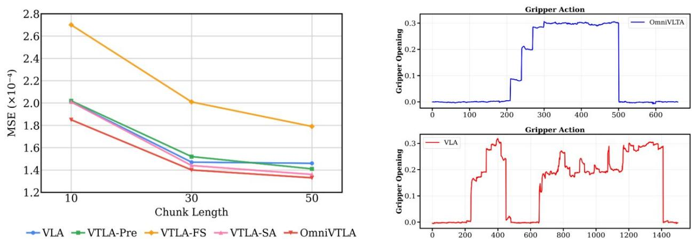

# OmniVTLA: Vision-Tactile-Language-Action Model with Semantic-Aligned Tactile Sensing

Zhenxue Cheng1Yiqian Zhang,Wenkang Zhan, Haoyu Li, Keyu Wang, Liong, Hengdi Za 1Paxini Tech. 2Shanghai Jiao Tong University †Corresponding author

Recent vision-language-action (VLA) models build upon vision-language foundations, and have achieved promising results and exhibit the possibility of task generalization in robot manipulation. However,due to the heterogenety of tactilesensors and thedifficulty oacquiringtactile data,current VLA models significantly overlook the importance of tactile perception and fail in contact-rich tasks. To address this issue, this paper proposes OmnivTLA, a novel architecture involving tactile sensing. Specifically, our contributions are threefold. First, our OmniVTLA features a dual-path tactileencoder framework. This framework enhances tactile perception across diverse vision-based and force-based tactile sensors by using a pretrained vision transformer (ViT) and a semantically-aligned tactile ViT (SA-ViT). Second, we introduce ObjTac, a comprehensive force-based tactile dataset capturing textual, visual, and tactile information for 56 objects across 10 categories. With 135K tri-modal samples, ObjTac supplements existing visuo-tactile datasets. Third, leveraging this dataset, we train a semantically-aligned tactile encoder to learn a unified tactile representation, serving as a better initialization for OmniVTLA. Real-world experiments demonstrate substantial improvements over state-of-the-art VLA baselines, achieving $9 6 . 9 \%$ success rates with grippers, (21.9% higher over baseline) and $1 0 0 \%$ success rates with dexterous hands ( $6 . 2 \%$ higher over baseline) in pick-and-place tasks. Besides, OmniVTLA significantly reduces task completion time and generates smoother trajectories through tactile sensing compared to existing VLA. Our ObjTac dataset can be found at https://readerek.github.io/Objtac.github.io. Date: August 25, 2025

# 1 Introduction

Tactile sensing is fundamental to human dexterity, enabling complex tasks—from threading a needle to handling fragile objects—with remarkable precision and adaptability. Although vision provides a global spatial context, tactile sensing offers complementary advantages: direct measurement of contact dynamics (e. presistrbutin,texture, rbustnessisualcsins, nd ig-equeny ebackorreme control (Dahiya et al, 2009).This biological evidence highlights the critical role f vision-tactile integration for complex manipulation tasks that require physical interaction. In robotics, the integration of vision and tactile sensing has emerged as a promising direction to enhance manipulation capabilities (Cui and Trinkle, 2021). Early works (Calandra et al., 2018; Li et al., 2018; Qi e al 2023; Huanet al., 2024) focused n small-scale models that combinedvisual and tactie features for specific tasks, such as slip detection or grasp stability prediction. Although these approaches demonstrated the value of multimodal sensing, they were limited in scope, oten tailored to narrow applications, and lacked generalization in diverse scenarios.

Recent advances in Vision-Language-Action (VLA) models (Brohan et al., 2023a; Kim et al., 2024a; Black e al 2024; Team et al, 2025) have revolutionized roboticmanipulation.They leverage large-scale pretrained vision-language models (VLMs) (Liu et al., 2023; Li et al., 2024; Zhang et al., 2025a; Bai et al., 2025) to interpretnaturallanguageinstructions and visualbservationsdemonstrating great potential forgeneralization and intelligence. However, these models predominantly rely on vision and language, overlooking the rich semantic and physical feedback provided by tactile sensing. Existing attempts (Zhang et al., 2025b; Huang et al 2025; Yu et al. 2025) to incorporate touch into VLA frameworks often treat tactile data as low-level signals, failing to align them semantically with visual and linguistic contexts.

  

Fu1 Left: The vanlla VLA model, where the mage encoerusually iherits a pretrained CLIP/SigLIP bacone trained with contrastive learning toachieve latent-space semanticalgment.Right:VTLA model.Critica, the des tact ncders n smanticalmeamo visin, lnguage, n tou modalit rarel suied.

To bridge this gap, we propose OmniVTLA (Vision-Tactile-Language-Action Model), a novel architecture that unifies vision, touch, and language into a shared semantic space, as shown in Fig. 1. VTLA leverages contrastivelearning toalignhigh-resolution tactile signal with visual and language concepts, enabling robots to "understand" what they feel in the context of what they see and what they are asked to do. Specifcally, weintroduce a dual-encoder path for tactile data to address the heterogeneity,utilizing a pretrained vision transformer (ViT) and a semantically-aligned tactile ViT (SA-ViT). Second, we build ObjTac, a comprehensive dataset capturing textual visual, and force-based tactile data for 56 objects across 10 categories, a totalo 135K tri-modal samples. Third, we train a semantically-aligned tactile encoder using cross-sensor data to learn a unified tactile representation, serving as a better initialization for OmniTLA. Extensive experiments demonstrate VTLA's superiority over VLA baselines. In pick and place tasks, VTLA improves the success rates by $2 1 . 9 \%$ to reach $9 6 . 9 \%$ with the gripper and improves the success rates by $6 . 2 \%$ to reach $1 0 0 \%$ with the dexterous hand. Moreover, it generates smoother trajectories that adhere to the intuitive principle of "move quickly when clear, only slow down during contact approach." Our contributions are summarized as follows. We propose OmnivTLA, a novel framework that models vision, tactile, and language for end-to-end contact-rich manipulation tasks. OmniVTLA utilizes dual-encoder path to overcome the heterogeneity of different tactile sensors. •We introduce ObjTac, a comprehensive tactile dataset, collecting 135K tri-modal samples for 56 objects across 10 categories. Based on it, we train a semantically-aligned tactile encoder for OmniVTLA. •Real-world experiments reveal the superior performance of OmniVTLA compared to typical VLA models, up to $2 1 . 9 \%$ success rate improvement. Besides, it reduces the completion time and smooths the generated trajectories.

# 2 Related Works

The difference of our proposed VTLA and other VLA models are summarized in Table 1.

Tacle Sensngor erceptionTasks.Eary arch i tactil ensi priary usesn processin -ve physical signals (e.g., force, vibration, deformation) for specific perception tasks, such as grasp stability prcion (Calandra et al 018 Cui al 2020) an slp detection Liet al.(2018. Rect works have ied toward learning general tactile representations for transferability across asks, sensors, and modalities. They demonstrate the importance of cross-modal alignment and generalizable representations for tactile perception through dataset construction (Fu e al. 2024; Cheng et al., 025), shared embedingspaces (Yang et al., 024), transferable architectures (Zhao et al., 2024), and unifed modeling frameworks (Feng et al., 2025). While these methods improve tactile perception, they remain decoupled from action policy generation, limiting their applicability to real-time robotic control Moreover, majority of existing works utilize vision-based tactile data (such as GelSight (Yuan et al., 2017; Johnson and Adelson, 2009), but largely overlook the force-based tactile data, which is also widely used in robotic policy learning. Table 1 Comparason of different VLA models. L: Language; V: Vision; T: Tactile A: Action.   

<table><tr><td>Model Type</td><td>Methods</td><td>Input</td><td></td><td>Output Semantic-Aligned</td></tr><tr><td>VA</td><td>Diffusion Policy (Chi et al., 2023)</td><td>V</td><td>A</td><td>✓</td></tr><tr><td>VTA</td><td>RDP (Xue et al., 2025)</td><td>V + T</td><td>A</td><td>X</td></tr><tr><td>VLA</td><td>OpenVLA (Kim et al., 2024a), π0(Black et al., 2024)</td><td>V + L</td><td>A</td><td>✓</td></tr><tr><td>TLA</td><td>TLA (Hao et al., 2025)</td><td>T + L</td><td>A</td><td>X</td></tr><tr><td>VTLA</td><td>VTLA (Zhang et al., 2025b), Tactile-VLA (Huang et al., 2025)</td><td>V + T +L</td><td>A</td><td>X</td></tr><tr><td>OmniVTLA</td><td>Ours</td><td>V + T + L</td><td>A</td><td>√</td></tr></table>

Vision-Tactile Fusion for Manipulation.Recent advances invision-tactile policy learning have demonstrated remarkable progress in contact-rich manipulation. Reinorcement larningframeworks haveeffectively cobned visual and tactile inputs for assembly tasks (Lee et al., 2020; Hansen et al., 2022) and dexterous in-hand manipulation (Hu et al., 2025). More recently, the field has increasingly adopted imitation learning paradigms u al 2023; Lin et al 2024; Huan et al, 2024; Xue et al 202; Liuetal 2025), explri visntactile representations and system architectures for fine-grained manipulation. While achieving impressive task-speciic performance, these methods remain limited in semantic reasoning and generalization capabilities compared to vision-language-action models, which remains a large gap that our work would like to address through vision-tactile semantic fusion.

Vision-Language-Action Model. Vision-language-action (VLA) models have emerged as a powerful paradigm for generalist robotic policies. Brohan et al. (2023b) pioneers this direction by representing robot actions as language tokens, enabling knowledge transfer from web-scale pretraining. Kim et al. (2024b) offers an open-sourcealternative via LoRA fine-tuning for efficient transfer. Subsequent work (Team et al., 2024; Black 02Liu al202Bjorcka 025exan thecapblrgowbaserdifsa action generation (Chi et al., 2023). Scalability efforts (Wen et al., 2025; Team et al., 2025; Shukor et al, 2025), reasoning mechanisms (Zhao et al., 2025; Lin et al., 2025) and 3D extensions (Zhen et al., 2024; Qu et al 2025) further boost applicability. While VLA models excel at open-world generalization, their reliance on vision and language alone limits performance in contact-rich tasks requiring precise physical interaction. Emerging tactile-enhanced approaches address these limitations through language-based sensor fusion (Jones et al., 2025), tactile-involved VLA learning (Hao et al., 2025; Zhang et al., 2025b), and low-dimensional force-aware control (Huang et al., 2025; Yu et al., 2025). However, these approaches have not fully explored the design of the tactile encoder. Our OmniVTLA framework fundamentally advances this paradigm by establishing dual-encoder path for touch, through unified cross-modal representation learning.

# 3 Methods

# 3.1 Problem Formulation

Formally, the aim of the action model is to model the distribution $p ( \mathbf { A } _ { t } | \mathbf { o } _ { t } )$ , where $\mathbf { A } _ { t } = \left\{ a _ { t } , a _ { t + 1 } , \dotsc , a _ { t + H - 1 } \right\}$ denotes the corresponding sequence of actions ( $\mathrm { H }$ is the chunk length), and $\mathbf { o } _ { t }$ denotes the observations at the current time. For a typical VLA model, the observation consists of several RGB images, a language prompt, and the robot proprioceptive state, then the model is formally expressed as:

$$
O _ { t } = \mathbf { M } _ { \mathrm { V L A } } \big ( \mathbf { A } _ { t } \mid f _ { \phi } ( \mathbf { I } _ { t } ^ { i } ) , l _ { t } \big ) ,
$$

  
a heeeybt viulnact ata  we s tacorsTherst i v pre-trained visual encoder to inherit rich semantic representations from large-scale image data.The second ViT (SATv an textualmodalits.Thisdualencoder desienablesfecivenowleeranseranconsistent reprati learning across diverse sensory inputs.

where $\mathbf { I } _ { t } ^ { i }$ denotes the $i ^ { \mathrm { t h } }$ image, such as the third-view image and the robot wrist image, $l _ { t }$ is a sequence of language tokens. Usually, images $\mathbf { I } _ { t } ^ { i }$ are encoded using a contrastive image encoder $f _ { \phi }$ (e.g., CLIP, SigLIP) based on Vision Transformers (ViT) (Dosovitskiy et al., 2020) and then projected into the latent embeding space with the text token. Meawhil, ur jecivf the TLA model istocrporate the tactie datainto the npu, illustratd as Fig. 2. The VTLA model is expressed as follows.

$$
o _ { t } = \mathbf { M } _ { \mathrm { V T L A } } \big ( \mathbf { A } _ { t } \ \lvert \ f _ { \phi } ( \mathbf { I } _ { t } ^ { i } ) , f _ { \theta } ( \mathbf { T } _ { t } ^ { j } ) , l _ { t } \big ) ,
$$

where $\mathbf { T } _ { t } ^ { j }$ denotes the $j ^ { \mathrm { t h } }$ tactile data, such as the tactile sensor attached to the two-fingertip gripper or the multiple fingers and the palm of the dexterous hand. $f _ { \phi }$ denotes the tactile encoder. Intuitively, the tactile data can be remapped to a tensor and encoded using the ViT-like structure as an image encoder, but the charris theacts nent omheidatInhis workjei explore different tactile encoders and corresponding training strategies to validate the best architecture of VTLA.

# 3.2 Overall Architecture with Dual-Encoder Path

The proposed OmniVTLA, as shown in Fig. 2, is built on the basis of $\pi 0$ (Black et al., 2024). It consists of three core components: tokenizers, backbone, and action head. The tokenizers process: 1) language instructions $l _ { t }$ via a PaliGemma tokenizer (vocabulary size: 257,152), 2) image observations $\mathbf { I } t ^ { i }$ using a SigLiP model (Zhai et al., 2023), and 3) tactile observations $\mathbf { T } t ^ { j }$ , projecting all modalities to latent tokens. Specifically, for images including the third-view and wrist, we resize raw captures to $2 2 4 \times 2 2 4$ , yielding 256 tokens per image. For tactile data,we normalize the data range to int8 and stitc multi-senso inputs into single mages and proces resized $2 2 4 \times 2 2 4$ inputs through an ViT-like encoder to generate 256 tokens. The Gemma-2B backbone processes concatenated tokens to produce action tokens, decoded by an action head trained with a flow matching loss following $\pi 0$ . Action representations vary by end-effector. For two-finger grippers, they are represented as 10 tokens (3 relative positions, 6 relative angles, 1 gripper state). For four-finger hand, they are 25 tokens (3 relative positions, 6 relative angles, 16 absolute joint positions). Existing workadequately dreses thedeig  tactilencoders, priarily ue totwoforms hetergen: (1) betwentactile and visual data, and () acros ierent tactile sensors (as visualized in the let-upper part of Fig. 2). This challenge is exacerbated by the divergent characteristics of tactile datasets, such as Touch and Go (TAG) (Yang et al., 2022), SSVTP (Kerr et al., 2023), ObjectFolder (Gao et al., 2021), complicating uni encoder dsi.Therefore, four different tactilencoders are worthyf exploration and detailedresults are discussed in Sec.4.2:

  
Fo data pairoachieve semantic-level algnment. We alsovisualize par of tactil images after the normalization.

LA-FS: The tactile encoder is trained from scratch and only relies on limited teleoperated tactile data.   
VLA-re:The tactile encoder is initialized from a pre-trained vision encoder from a large-scale dataset and fine-tuned on a few teleoperated data. •VTLA-SA: The tactile encoder is first trained from cross-modality contrastive learning to achieve semantic-level alignment (Sec.3.3) and then tuning on a few data. •OmniVTLA: Dual-encoder path, where one path is VTLA-Pre, and the other path is VTLA-SA. Tacile heterogeneity arises from differing sensing principles:visuo-tactilesensors (e.g. GelSight (Yuan, 2017; Johnson and Adelson, 2009)) capture surface geometry, while others (e.g., Paxini Gen2 (Paxini, 2025)) measure force. Notably, visual-tactile sensors typicaly capture higher spatial resolution but have a low temporal resolution up to 30Hz; whereas force-based sensors, while having relatively low spatial resolution, can capture high temporal resolution for better event characterization. Therefore, force-based sensors can be a better information complement to the visual modality. To address the heterogeneity of different tactile sensors, we propose dual ViT encoders whose concatenated tokens enable cross-sensor understanding, as the tactile encoder of our proposed OmniVTLA model.

# 3.3 Semantic-Aligned Tactile Encoder

While existing work (Fen etal, 025) has explore unifed representations orvisu-tactile sensors, it ailo generalize to force-based tactile sensing. As Table 2 demonstrates, the pre-trained AnyTouch encoder achieves only $4 0 . 2 1 \%$ material classification accuracy in the force-based dataset, indicating severe cross-sensor transfer lmitations.Toaress hissue we collecturowndataset bja wit algned text,videoanforbase l atWe l TacVis atpairor ije i.The dataset comprises 10 object types (i.e., plastic, glass, wood, brick, metal, fabric, leather, ceramic, paper and others), categorized by surface roughness (rough vs. smooth) and material hardness (rigid vs. soft). Our

<table><tr><td rowspan="2">Method</td><td rowspan="2">Our data in training set</td><td colspan="3">Touch and Go</td><td colspan="3">Our Collected Dataset</td></tr><tr><td>Material</td><td>Roughness</td><td>Hardness</td><td>Material</td><td>Roughness</td><td>Hardness</td></tr><tr><td>AnyTouch</td><td>X</td><td>79.39</td><td>86.32</td><td>95.16</td><td>40.21</td><td>68.01</td><td>90.11</td></tr><tr><td>SA-ViT (Ours)</td><td>✓</td><td>74.90</td><td>85.46</td><td>92.10</td><td>70.44</td><td>82.21</td><td>93.91</td></tr></table>

Tabvalati  er apablTou n ata whi is-bsac , actHheu Tu su classification head.

  

Fiur4 Left: Experimental setu hardware and environment. Rights: Objects involve in manipulation tasks. collected dataset will be released soon. The data collection and prosing pipeline is explained below.) For eac object, we cnducted 5interactin trials, with each trial lasting 1060 seconds (sampled at $6 0 ~ \mathrm { H z }$ ). This yielded a total of 270,000 force data recordings. We also capture the first-person-view visual recordings at 720P resolution and 30 FPS, resulting in 252 video sequences with an average duration of 18 seconds. In total, we collect 135K samples with paired tactile and vision data. 2) We added object-level annotations for the language modality, including object name, material type, roughness category, hardness category, video-level metadata, and textual descriptions. 3) Temporal synchronization was performed to align visual and tactile modalities using timestamps.

To train a better semantic-aligned encoder, we add our own collected dataset to existing datasets and employ the second-stage training pipelineof AnyTouch (Fenget al., 2025) to achieve multi-modality and cross-sensor aligment.Since our dataset contains tri-modal data pairs, for the new data added we directly use the total demes the llo aso $\begin{array} { r } { \mathcal { L } _ { a l i g n } = \alpha _ { V L } * \frac { \mathcal { L } _ { V  L } + \mathcal { L } _ { T  V } } { 2 } + \alpha _ { V T } * \frac { \mathcal { L } _ { V  T } + \mathcal { L } _ { T  V } } { 2 } + \alpha _ { V L } * \frac { \mathcal { L } _ { T  L } + \mathcal { L } _ { L  T } } { 2 } } \end{array}$ $\mathcal { L } _ { V  L }$ $\alpha _ { V L }$ $\alpha _ { V T }$ , $\alpha _ { T L }$ are hyper-parameters. Besides, the cross-sensor matching loss with binary cross entropy is also added to the total loss. By incorporating our dataset ObjTac, this semantic-aligned tactile encoder can better adapt to implemented tacil sensors nd alg semanicrepresntations, rondiactil gnals e.material rougneharnes) iunneslatTaevana accuracy in force-based tactile datasets while maintaining near baseline performance in vision-based tactile datasets Touch and Go.

# 4 Experiments

# 4.1 Experimental Setup

Baselines and Training Details We compared our VTLA model with two models, Diffusion Policy (DP) (Chi et al., 2023) as a non-VLM baseline and $\pi 0$ (Black et al., 2024) as a VLA baseline. We trained DP and $\pi 0$ mode following the default settng specifed inthe codebase, except that we e chukaction ize s 64 for DP. For our OmniVTLA model, we add a tactile image input. More training details can be found in the appendix. Implementation and Task Setting Our robotic system comprises an UR5 arm, a jaw gripper equipped with two tactile sensors and a wrist camera, a 11 tactile sensor-equipped dexterous hand with a wrist camera, and a base camera (see Fig. 4). We conduct pick-and-place tasks for four objects (Short Can, Square Coffe Bottle, Gum Tin, Milk Carton) using a gripper and two objects (Coffee Bottle and Milk Carton) using dexterous hand (see Fig. 4), collecting 40 teleoperated demonstration episodes per object at $3 0 \ \mathrm { H z }$ . The plastic bottle and the square bottle are used as unseen objects for generalization evaluation. We processed the tactile data into a 3-channel image representation by max-min force normalization and reshaping it into a 3-channel tensor.

  
FOffevaliai resultf ifftmodes usi iffet bjet whereur proo OmiTLv the lowest MSE between predicted trajectory and GT trajectory.

<table><tr><td rowspan="2">Model</td><td colspan="3">Tactile Enc.</td><td colspan="4">SR (%) ↑</td><td rowspan="2"></td><td colspan="5">CT (step) ↓</td></tr><tr><td>FS</td><td>Pre</td><td>SA</td><td>Can</td><td>Bottle</td><td>Milk</td><td>Tin</td><td>Avg Can</td><td>Bottle</td><td>Milk</td><td>Tin</td><td>Avg</td></tr><tr><td>VLA (π0)</td><td>X</td><td></td><td></td><td>62.5</td><td>37.5</td><td>100</td><td>100</td><td>75.0</td><td>981</td><td>562</td><td>648</td><td>436</td><td>657</td></tr><tr><td>VTLA-FS</td><td>✓</td><td>×</td><td></td><td>75.0</td><td>50.0</td><td>100</td><td>100</td><td>81.2</td><td>677</td><td>549</td><td>498</td><td>423</td><td>537</td></tr><tr><td>VTLA-Pre</td><td>X</td><td>✓</td><td></td><td>62.5</td><td>75.0</td><td>100</td><td>100</td><td>84.4</td><td>847</td><td>526</td><td>540</td><td>429</td><td>586</td></tr><tr><td>VTLA-SA</td><td>X</td><td>X</td><td>2</td><td>87.5</td><td>62.5</td><td>100</td><td>100</td><td>87.5</td><td>524</td><td>553</td><td>455</td><td>405</td><td>484</td></tr><tr><td>OmniVTLA</td><td>X</td><td>✓</td><td></td><td>100</td><td>87.5</td><td>100</td><td>100</td><td>96.9</td><td>535</td><td>537</td><td>527</td><td>393</td><td>498</td></tr></table>

able3 Real-world expermental results ondifferet models using two-fingergripper. The baseline VLA model is $\pi 0$ Bold font denotes the best performance, and the underlined font denotes the second best performance.

<table><tr><td rowspan="2">Model</td><td colspan="5">SR (%) ↑</td><td colspan="5">CT (step) ↓</td></tr><tr><td>Bottle</td><td>Milk</td><td>Plastic</td><td>Square†</td><td>Avg</td><td>Bottle</td><td>Milk</td><td>lastic</td><td>Square†</td><td>Avg</td></tr><tr><td>VLA (π0)</td><td>100</td><td>100</td><td>87.5</td><td>87.5</td><td>93.8</td><td>312</td><td>324</td><td>369</td><td>368</td><td>343</td></tr><tr><td>OmniVTLA</td><td>100</td><td>100</td><td>100</td><td>100</td><td>100</td><td>307</td><td>305</td><td>339</td><td>335</td><td>322</td></tr></table>

TabReal-worl expetal resultnif moel usi ouring exteus handThe basenVLAmel is $\pi 0$ .t ejewhi otclura lasnot he plastall bott Square denotes the square coffee bottle. Bold font denotes the best performance. To study the role of tactile feedback in task execution, we design a multi-stage grasping protocol. Unlike conventional approaches, our method incorporates up to three incremental grasping attempts. Specifically, as the rippe appraches thetargetject,t progressivelycloses ithree stage, achiein succeful ri thethirattempt.Upongasping the rm andtransports the jct to  preefin taret locatin.Fo fair evaluation, we standardize initial object poses using a grid map and tested each model across 32 rollouts for gripper and 16 rollouts for dexterous hand (2 trials per initial state over 4 grid positions per object). The maximum evaluation step is set as 1500 for each trial.

Evaluation Metrics We evaluated our method through two complementary approaches: ofline validation and real-world experiments. For offline validation , we compute the mean squared error (MSE) between ofipreicanrulpeati $\begin{array} { r } { \mathrm { M S E } = \frac { 1 } { T } \sum _ { t = 1 } ^ { T } \| x _ { t } - \hat { x } _ { t } \| ^ { 2 } } \end{array}$ , where $T$ denotes the total timestep and $x _ { t }$ (ground truth) and $\hat { x } _ { t }$ (prediction) represent 10-dimensional or 25-dimensional state vectors comprising end-effector position (xyz), 6D rotation representation (Zhou et al., 2018), and 1 gripper apertureor 16 absolute joints for the dexterous handFor real-word evaluation, we emply three metris ( Success Rate (SR) measuring successful object placement at the end timestamp, (2) Completion Time (CT) from task initiation to successful placement with gripper opening, and (3) Motion Smoothness calculated as end-effector motion variance along trajectories.

<table><tr><td rowspan="2">Model</td><td rowspan="2">Tactile Enc.</td><td colspan="5">SR (%) ↑</td><td colspan="5">CT (step) ↓</td></tr><tr><td>Can</td><td>Bottle</td><td>Milk</td><td>Tin</td><td>Avg.</td><td>Can</td><td>Bottle</td><td>Milk</td><td>Tin</td><td>Avg.</td></tr><tr><td>VA (DP)</td><td></td><td>75.0</td><td>75.0</td><td>50.0</td><td>37.5</td><td>59.4</td><td>767</td><td>989</td><td>1010</td><td>638</td><td>851</td></tr><tr><td>VTA (Ours)</td><td>×</td><td>100</td><td>75.0</td><td>75.0</td><td>62.5</td><td>78.1</td><td>695</td><td>658</td><td>783</td><td>593</td><td>682</td></tr></table>

TabRealworpeal sulhepac i tac usi twfin.The cpare baseline s DP Chi al., 023)and al the parameters aretrained from scratch.Bold font denot h best-performance.

<table><tr><td>Model</td><td colspan="3">Tactile Enc.</td><td colspan="5">Smoothness (×10−4) ↓</td></tr><tr><td></td><td>FS</td><td>Pre</td><td>SA</td><td>Can</td><td>Bottle</td><td>Milk</td><td>Tin</td><td>Avg</td></tr><tr><td>VLA (π0)</td><td>X</td><td>X</td><td>X</td><td>29.3</td><td>0.78</td><td>6.24</td><td>1.95</td><td>9.57</td></tr><tr><td>VTLA-FS</td><td>✓</td><td>X</td><td>X</td><td>2.57</td><td>0.69</td><td>1.54</td><td>1.69</td><td>1.62</td></tr><tr><td>VTLA-Pre</td><td>X</td><td>✓</td><td>X</td><td>1.95</td><td>0.97</td><td>5.09</td><td>2.63</td><td>2.66</td></tr><tr><td>VTLA-SA</td><td>X</td><td>X</td><td>✓</td><td>1.12</td><td>0.45</td><td>0.92</td><td>1.68</td><td>1.04</td></tr><tr><td>OmniVTLA</td><td>X</td><td>✓</td><td>✓</td><td>1.33</td><td>1.37</td><td>1.90</td><td>1.22</td><td>1.46</td></tr></table>

Table 6 The smoothness of generated trajectories with tactile encoders for the model $\pi 0$ . Three settings are conducted for a fair comparison, where  denots From Scratch, Pre denotes Pretrained model; S represents the our proposed Semantic-Aligned tactile encoder.

# 4.2 Evaluation Results

ValidationResultsOffinevalidationnteleoperation-drivenvalidationdatdemonstratethe superior predicive performance of OmniVTLA across diverse objects. As illustrated in Fig. 5 , OmniVTLA achieves the lowest MSE among all models, with an average of $1 . 4 0 \times 1 0 ^ { - 4 }$ . This trend holds across most objects: for the short can, OmniVTLA reduces MSE by $7 . 8 \%$ compared to VLA; for the bottle, the reduction reaches $2 3 . 3 \%$ . Abnormal results for VTLA-FS might result from the overfitting, demonstrate the importance to use large-scale tactile data, instead of only teleoperated-driven data. The results highlight that the semantic-aligned (SA) tactile encoder effectively integrates tactile signals with visual and language cues, enabling more accurate state prediction—critical for precise manipulation.

Real-World Results Real-world experiments validate OmniVTLA's superiority over both $\pi 0$ and DP in contact for pick and place tasks. For $\pi 0$ using the gripper (Table 3), VTLA-SA outperforms other designs with up to one tactile decoder. It hits an $8 7 . 5 \%$ average success rate (SR), 6.3% higher than the From - Scratch (FS) encoder and $3 . 1 \%$ above the Pretrained (Pre) encoder. When the Pre and SA encoders are combined in the proposed OmniVTLA, an outstanding $9 6 . 9 \%$ average SR is achieved, demonstrating the superiority of the dual tactile decoder design. In terms of Completion Time (CT), the SA encoder reduces the average step count by $2 6 . 3 \%$ vs. the VLA baseline (from 657 to 484 steps), proving that tactile feedback optimizes manipulation. Our proposed OmniVTLA achieves the second best performance, reducing the CT by $2 4 . 2 \%$ (from 657 to 498 steps). For $\pi 0$ using the four-finger dexterous hand (Table 4), our OmniVTLA increases the SR by 6.2% (from $9 3 . 8 \%$ to $1 0 0 \%$ ) and cuts the CT by $6 \%$ (from 343 to 322 steps). Especially for unseen objects Plastic and Square, ours achieves the SR of $1 0 0 \%$ , but VLA only achieves the SR of $8 7 . 5 \%$ . For the DP baseline (Table 5), integrating tactile sensing boosts the average SR by 18.7% (from $5 9 . 4 \%$ to $7 8 . 1 \%$ and slashes average CT by $1 9 . 9 \%$ (from 851 to 682 steps). This confirms that tactile signals universally enhance the performance, regardless of the baseline. The Smoothness of Trajectories Tactile sensing significantly improves motion smoothness, as quantifed in Table 6. The SA encoder achieves the lowest average smoothness metric $( 1 . 0 4 \times 1 0 ^ { - 4 }$ , $8 9 . 6 \%$ lower than the VLA baseline. This aligns with the intuitive principle of "move quickly when clear, only slow down during contact approach. semantic-aligned tactile feedback enables the robot to adjust gripper actions more inteligently and subtly, reducin the completion time while avoiding abrupt movements during contac—criical for handling fragile objects.

  
Figure6 Visualization of several failed cases for VLA, VTLA-FS, VTLA-Pre, VTLA-SA due toinsufficient contac awareneo contac gulcntact, andurproos OmiTLA hivesuul raspianble contact owing to full tactile sensing.

QualitativeResults To understand the effectivenessof tactile sensing, we present some qualitative results for real-world experiments. The language prompt is "Pick up the short can and move it to the plate", and we visualize the failed or successful cases for VLA, VTLA-Pre and OmniVTLA models (Fig. 6). VLA models ofte fil to bjects ue toinsuffiet ontcwess, whi VTLA-Pre trggs wi persistent ipp adjustments without successful ifting. In contrast, OmniTLA uses semantic tactile cues to stabilize grasps an execteo trajectore as ee in sucesful ts of the short can using the ripper and bottlui the dexterous hand.

# 5 Conclusion and Future Work

We present OmniVTLA, a novel vision-tactile-language-action model, and propose a semantic-aligned tactile encoder with visual and language modalities. We propose a dual-encoder path to address the heterogeneity of tactile data Besides, we introduce an ObjTac dataset or the cross-modal contrastive learning rameworkthat enablesrobotstonterpret tactiledataintask-relevan contexts.Experimentalresultsdemonstrate iifit improvements over state-of-the-art VLA baselines, including 21.9% higher success rates with two-finger gripper and $6 . 2 \%$ higher success rates with four-finger dexterous hand. Moreover, OmniVTLA reduces the completion time by approximately $2 4 . 2 \%$ and achieves much smoother trajectories through tactile-guided learning. While current evaluated tasks and robots remain limited, our OmniVTLA establishes an important foundation for touch-aware robotic manipulation. Future work willexplore more complex tasks, more efficient tactile representations, and temporally dynamic fusion architectures.

References   
Shuai Bai, Keqin Chen, Xuejing Liu, Jialn Wang, Wenbin Ge, Sibo Song, Kai Dang, Peng Wang, Shije Wang, Jun Tang, et al. Qwen2. 5-vl technical report. arXiv preprint arXiv:2502.13923, 2025.   
Johan Bjorck, Fernando Castañeda, Nikita Cherniadev, Xingye Da, Runyu Ding, Linxi Fan, Yu Fang, Dieter Fox, Fengyuan Hu, Spencer Huang, et al. Gr00t n1: An open foundation model for generalist humanoid robots. arXiv preprint arXiv:2503.14734, 2025.   
Kevin Black, Noah Brown, Danny Driess, Adnan Esmail, Michael Equi, Chelsea Finn, Niccolo Fusai, Lachy Groom, Karol Hausman, Brian Ichter, et al., Szymon Jakubczak, Tim Jones, Liyiming Ke, Sergey Levine, Adrian Li-Bell, Mohith Mothukuri, Suraj Nair, Karl Pertsch, Lucy Xiaoyang Shi, James Tanner, Quan Vuong, Anna Walling, Haohuan Wang, and Ury Zhilinsky. $\pi _ { 0 }$ : A vision-language-action flow model for general robot control, 2024. https://arxiv.org/abs/2410.24164.   
Anthony Brohan, Noah Brown, Justice Carbajal, Yevgen Chebotar, Xi Chen, Krzysztof Choromanski, Tianli Ding, Danny DriesAvinavaDubey, ChelseaFinn, e al.Rt-:Vision-anguage-action modelstranser webknowleget robotic control. arXiv preprint arXiv:2307.15818, 2023a.   
Anthony Brohan, Noah Brown, Justice Carbajal, Yevgen Chebotar, Xi Chen, Krzysztof Choromanski, Tianli Ding, Day Driess, Avinava Dubey,Chelsea Finn, e al.Rt- Vision-anguageaction models transfer web knowlegeo robotic control. arXiv preprint arXiv:2307.15818, 2023b.

Roberto Calandra, Andrew Owens, Dinesh Jayaraman, Justin Lin, Wenzhen Yuan, Jitendra Malik, Edward HAdelson, a Sergey LeviMore than  eelg: Learig o rasp and regrasp usig vision nd touch.EE Roboi nd Automation Letters, 3(4):33003307, 2018.   
Ning Cheng, Jinan Xu, Changhao Guan, Jing Gao, Weihao Wang, You Li, Fandong Meng, Jie Zhou, Bin Fang, and Wenjuan HanTouc100kAlarg-scaletouch-language-isionataset ortouch-centrimultimodal representation. Information Fusion, page 103305, 2025.   
Cheg hi, Zhenj XuSyuan Fng, Ericous,Yilunu, BenjamBurceRus Tdrake, n ShurSn. Difson policy:Visuomoor policylearning via actiondiffsion.The Interatioal Jouralf Robotic Resrch, page 02783649241273668, 2023.   
Jinda Cuiand Jeff Trinkle.Towar next-geneation leared robotmanipulation.Sciece robotics, 654):eab946, 2021.   
Shaowei Cui, Rui Wang, Junhang Wei, Fanrong Li, and Shuo Wang. Grasp state assessment of deformable objects usin visual-tactilusion perception. In 2020 IEEE International Conference n Robotics and Automation (ICRA), pages 538544. IEEE, 2020.   
Ravinder Dahiya, Giorgio Metta, Maurizio Vale, and Giulio Sandini Tactile sensing—from humans to humanoids. IEEE transactions on robotics, 26(1):120, 2009.   
Alexe Dosovitskiy, Lucas Beyer, Alexander Kolesnikov, Dirk Weissenbor, Xiaohua Zhai, Thomas Unterthiner, Mostaa Dehghani, Matthias Minderer, Georg Heigold, Sylvain Gelly, et al. An image is worth 16x16 words:Transformers for image recognition at scale. arXiv preprint arXiv:2010.11929, 2020.   
RuFeng, Jiany Hu, Wenke Xia, Tianci Gao, AShen, Yuh Sun, Bin Fang, and Di Hu.Ayt:Leari unife stati-ynamic representation across ultiplevisuo-tactile sensors.arXiv preprint arXiv:2502.12191, 2025.   
LetinFu, Gaura Datta, Huang Huan WilChung-HoPnit, JaimyDrake, Joseh rtiz, Musa Mukam, Mike Lambeta, Roberto Calandra, and Ken Goldberg. A touch, vision, and language dataset for multimodal alignment. arXiv preprint arXiv:2402.13232, 2024.   
RuaGoYen-uCang ShivMalLiFei-ei and JiajuWuOjeoler:ataejet wip visual, auditory, and tactile representations, 2021. https://arxiv.org/abs/2109.07991.   
Johaa Hanse, Francis Hogan, Dmitry Rivkin, Davi Mger, Michael Jenkin, and Gregory Dudek.Visuotactile-rl: Learning multimodal manipulation policies with deep reinforcement learning. In 2022 International Conference on Robotics and Automation (ICRA), pages 82988304. IEEE, 2022.   
Peng Hao, Chaofan Zhang, Dingzhe Li, Xiaoge Cao, Xiaoshuai Hao, Shaowei Cui, and Shuo Wang. Tla: Tactilelanguage-action model for contact-rich manipulation. arXiv preprint arXiv:2503.08548, 2025.   
Wenbin Hu, Bidan Huang, Wang Wei Lee, Sicheng Yang, Yu Zheng, and Zhibin Li.Dexterous in-hand manipulation osnd cylidrcaljes troug dee reioret lar wih tactile ensin.Robotic anAutomus Systems, 186:104904, 2025.   
Bin Huang, Yixun Wang, Xinyi Yng, Yyue Luo, nd Yunz Li. 3d-ita Lear negrai manipulatin with visuo-tactile sensing. arXiv preprint arXiv:2410.24091, 2024.   
Ja Hua, ShuWang, Fanqi Li Yhan Hu,Chuan Wen, and ang GaoTactile:Unlo ii-age action model's physical knowledge for tactile generalization. arXiv preprint arXiv:2507.09160, 2025.   
Micah K. Johnson and Edward H. Adelson. Retrographic sensing for the measurement of surface texture and shape. In 2009 IEEE Conference on Computer Vision and Pattern Recognition, pages 1070-1077, 2009. doi: 10.1109/CVPR.2009.5206534.   
Joshua Jones, Oier Mees,CarmelSerrazza, Kyle Stachowiz, Pieter Abbee and Sergey Levine Beyond sigh:ine tung generalist robot polics with heterogeneous sensors via languag grounding.arXiv preprint arXiv:2501.069, 2025.   
Justin Kerr, Huang Huang, Albert Wilcox, Ryan Hoque, Jeffrey Ichnowski, Roberto Calandra, and Ken Goldberg. Seupevissac aiatenfour023hs:/ari/ab/2 13042.   
Moo Jin Kim Karl Pertsch, SiddharthKaramcheti, Ted Xiao, Ashwin Balakrishna, Suraj Nair, Rafal Rafailov, Ethan Fote, Grace Lam, Pannag Sanketi et al.Openvla:An open-source vision-language-action model.arXi prerint arXiv:2406.09246, 2024a.   
Moo Jin Kim, Karl Pertsch, Siddharth Karamchei, Ted Xiao, Ashwin Balakrishna, Suraj Nair, Rafal Rafailov, Ethan Foster, Grace Lam Pannag Sanketi, et al.Openvla:Anopen-sourc vision-language-action model.arXiv prerint arXiv:2406.09246, 2024b.   
MichellLeeYuke Zhu, Peter Zachare, Matthew Tan, Krishnan Sinivasan, SilvioSavaree, Li Fei-ei, Animeh G and JeaneBoMak sesvison n tou:Lear multimol reresentations r conta-h tasks. IEEE Transactions on Robotics, 36(3):582596, 2020.   
Bo Li, Yuanhan Zhang, Dong Guo, Renrui Zhang, Feng Li, Hao Zhang, Kaichen Zhang, Peiyuan Zhang, Yanwei Li, Ziwei Liu, et al. Llava-onevision: Easy visual task transfer. arXiv preprint arXiv:2408.03326, 2024.   
JianuaLi SyuanDongandEdward Adelson.Slip detection wi combine tactile andvisualiformation. In 2018 IEEE International Conference on Robotics and Automation (ICRA), pages 77727777. IEEE, 2018.   
Fanqi Lin, Ruiqian Nai, Yingdong Hu, Jiacheng You, Junmig Zhao, and Yang Gao.Onetwovla:Aunifed visionlanguage-action model with adaptive reasoning. arXiv preprint arXiv:2505.11917, 2025.   
Tor Ln, Yu Zhang, Qani, Hoz i, Bret i Sey Levie, nd JtenMalk.Learisakill with two multifingered hands. arXiv preprint arXiv:2404.16823, 2024.   
Fangchen Liu, Chuanyu Li, Yihua Qin, Ankit Shaw, Jing Xu, Pieter Abbeel, and Rui Chen. Vitamin: Learning contac-rich tasks throug robot-free visuo-tactile manipulationnterfacearXiv preprint arXiv:2504.06156,2025.   
HoaLiCuL QWuanYong Je Leisalrual processing systems, 36:3489234916, 2023.   
Songming Liu, Lingxuan Wu, Bangguo Li, Hengkai Tan, Huayu Chen, Zhengyi Wang, Ke Xu, Hang Su, and Jun Zhu. Rdt-1b: a diffusion foundation model for bimanual manipulation. arXiv preprint arXiv:2410.07864, 2024.   
Paxini. Px-6ax: Itpu tactile processing unit, 2025. https://paxini. com/ax/gen2.   
Haozhi Qi, Brent Yi, Sudharshan Suresh, Mike Lambeta, Yi Ma, Roberto Calandra, and Jitendra Malik. General in-hand object rotation with vision and touch. In Conference on Robot Learning, pages 25492564. PMLR, 2023.   
Delin Qu, Haoming Song, Qizhi Chen, Yuanqi Yao, Xinyi Ye, Yan Ding, Zhigang Wang, JiaYuan Gu, Bin Zhao, Do Wang e al. Spatialvl:Exploring spatial representations or visual-language-action mode.arXiv prei arXiv:2501.15830, 2025.   
AlecRadford, Jong Wook Kim, Chris Hallacy, AdityaRamesh, Gabriel Goh, SandhiniAarwal, Girish Sastry, Amanda Aske Pamla Mishki, Jack Clark, . Leari ranrablevisualmoels o natural languag upeisn. In International conference on machine learning, pages 87488763. PmLR, 2021.   
Mustafa Shukor, Dana Aubakirova, Francesco Capuano, Pepijn Kooijmans, Steven Palma, Adil Zouitine, Michel Aractingi, Caroline Pascal, Martino Russi, Andres Marafioti, Simon Alibert, Matthieu Cord, Thomas Wolf, and Remi Cadene. Smolvla: A vision-language-action model for affordable and eficient robotics. arXiv preprint arXiv:2506.01844, 2025.   
GeminiRobotics Team, Saminda Abeyruwan, Joshua Ainslie, Jean-Baptiste Alayrac, Montserrat Gonzalez Arenas, Travis Armstrong, Ashwin Balakrishna, Robert Baruch, Maria Bauza, Michiel Blokzijl, et al. Gemini robotics: Bringing ai into the physical world. arXiv preprint arXiv:2503.20020, 2025.   
Octo Model Team, Dibya Ghosh, Homer Walke, Karl Pertsch, Kevin Black, Oier Mees, Sudeep Dasari, Joey Hejna, Tobas Kreiman, Charles Xu, et al. Octo:An open-source generalist robot policy.arXiv preprint arXiv:2405.12213, 2024.   
Jun Wen, Yichen Zhu, Jini Li, Minje Zhu, Zhibin Tang, Kun Wu,Zhiyn Xu, Ning Liu, Ran Cheng, Chan Shen, et al.Tinyvla:Towards ast, data-effiient vision-anguage-action models for roboticmanipulation.IEEE Robotics and Automation Letters, 2025.   
Han Xue, Jieji Ren, Wendi Chen, Gu Zhang, Yuan Fang, Guoying Gu, Huazhe Xu, and Cewu Lu. Reactive diffusion polSlw-at visual-tactile polyari r ontact-imanipulation.arXivpreprintarXiv:2503.0281, 25.   
Fenyu Yang, Chenyang Ma, Jiacheng Zhang, Jing Zhu, Wenzhen Yuan, and Andrew Owens.Touch and go: Learning from human-collected vision and touch, 2022. https://arxiv.org/abs/2211.12498.   
Fengyu Yang, Chao Feng, Ziyang Chen, Hyoungseob Park, Daniel Wang, Yiming Dou, Ziyao Zeng, Xien Chen, Rit Gangopadhyay, Andrew Owens, et al. Binding touch to everything: Learning unifed multimodal tactile representations. In Procedings of the IEEE/CVF Conference on Computer Vision and Patter Recognition, pages 2634026353, 2024.   
Jiawen Yu, Hairuo Liu, Qiaojun Yu, Jieji Ren, Ce Hao, Haitong Ding, Guangyu Huang, Guofan Huang, Yan Song, Panpan Cai al. Forcevla:Enhancing vamodels with a force-aware mo or contact-rich manipulation.arXiv preprint arXiv:2505.22159, 2025.

Keln Yu, Yuhai Han, Qixian Wang, Vaiav Saxea, Dani Xu, and e Zhao Mimicouc: Levragig ultiodal human tactile demonstrations for contact-rich manipulation. arXiv preprint arXiv:2310.16917, 2023.   
WeYuan SynDonganEdward H.Adelson.Gelsigh:High-resoluti robottactil sensorsor etiai geometry and force. Sensors, 17(12), 2017. ISSN 1424-8220. doi: 10.3390/s17122762. https://www.mdpi.com/ 1424-8220/17/12/2762.   
Xia Zhai BsilMustaa Alexaner Kolesiov,and Lucas Beyer.gmoid oss or langemage pre-trai. In Proceedings of the IEEE/CVF international conference on computer vision, pages 1197511986, 2023.   
Boqang Zhang, Kehan Li, Zesen Cheng, Zhiqiang Hu, Yuqian Yuan, Guanzheng Chen, Sicong Leng, Yuming Jiang, HZha XilVm routal amo ononn. arXiv preprint arXiv:2501.13106, 2025a.   
Chaon Zhang, eng Hao, Xiage o, Xiaoshuai Hao, Shaowei ui, and Shuo Wangtla:Vision-tacie-lange action model with preference learning for insertion manipulation. arXiv preprint arXiv:2505.09577, 2025b.   
Jalia Zhao Yuxian Ma, LirWang, and Edwar AdelsoTanserab tactiransormers or epreetatin learning across diverse sensors and tasks. arXiv preprint arXiv:2406.13640, 2024.   
Qinqig Zhao, Yao Lu, Moo Jin Kim, Zipeng Fu, Zhuoyang Zhang, Yecheng Wu, Zhaoshuo Li, Qianli Ma, Song Han, CelFi Co-Visl chain-hou i -anatimodelIn r the Computer Vision and Pattern Recognition Conference, pages 17021713, 2025.   
Hay Zhen, Xiw Qiu, Peiho Chen, Jinchn Yang, Xin Yan, Yilun Du, Yinig Hong, and Chuang Gan.3dvl: A 3d vision-language-action generative world model. arXiv preprint arXiv:2403.09631, 2024.   
Yi Zhou, Connelly Barnes, Jngwan Lu, Jime Yang, and HaoLiOn the continuity of rotation representations in neural networks. CoRR, abs/1812.07035, 2018. http://arxiv.org/abs/1812.07035.

# 6 Appendix

# 6.1 Dataset and Training Details

Dataset Object List Table 7 provides the complete object inventory for our ObjTac dataset, comprising 56 objects across ten categories. Data Collection Process Data collection consists of two processes: Touch and Grasp. For the Touch process, each object is touched 25 times, with individual interactions lasting between 1060 seconds (sampled at $6 0 \mathrm { H z }$ ). A Python script records finger-tactile sensor data alongside precise timestamps, while an Intel RealSense2 camera captures synchronized first-person RGB video at 720p resolution (30 FPS). Across all 56 objects, this process yields 252 video recordings (averaging 18 seconds each), 135,000 video frames, and 270,000 force data points. The Grasp process is designed to study object manipulation dynamics. When resumed, it will involve systematictestinof gras succe/failure conditions and post-gras stability (slip detection) Plannetrial include successful grasps,failedattempts, stableholding phases, and controlled releasemaneuvers leadito slip events.All trials will maintain consistent data formatting with the touc process, featuring synchronizd 720p video and sensor recordings. Training Details Table 8 list the training details for the models.

# 6.2 More Results

Ablatin Study  Chukig Szes Fig.7 Le illusrate heifuence  theaction aget eng rai from 10 to 50 steps) on the Mean Squared Error (MSE) of different models. Across all chunk sizes, OmniVTLA consistently demonstrates the lowest MSE, underscoring its robustness in handling sequential action dependencies. The overalltrend suggests that modeling longer action sequences allows the VTLA to better anticipate contact dynamics, which is different from VLA, which degrades slightly with increasing chunk length (from 30 to 50). Comparison of Action Trajectories Fig. 7 Right shows the comparative action trajectories between OmniVTLA and VLA. The results demonstrate a clear performance advantage of OmniVTLA in touch-rich manipulation tasks. Specifically, OmniVTLA accomplishes the Pick&Place task with approximately $5 0 \%$ fewer action steps compared to the baseline VLA, indicating significantly higher operational efficiency. More importantly, OmniVTLA exhibits superior motion smoothness throughout the entire process, completing the task succesfully in a single attempt without requiring corrective adjustments. In contrast, VLA's trajectory is more erratic, with noticeable instability and occasional dropping. These results demonstrate that incorporating tactile feedback significantly improves VLA's performance in touch-rich tasks, leading to more stable and reliable grasping behavior.

  

Figure 7 Left: Comparison of Mean Squared Error (MSE) for the VLA, VTLA-Pre, VTLA-FS, VTLA-SA, and OmniVTLA models across varying action chunk lengths. Right: Action trajectories of OmniVTLA and VLA, where higher vertical values indicate greater gripper closure.

<table><tr><td rowspan=1 colspan=1>Material</td><td rowspan=1 colspan=1>Corresponding Items (~56)</td></tr><tr><td rowspan=1 colspan=1>Plastic</td><td rowspan=1 colspan=1>Plastic bulb, Beverage bottle 1,Beverage bottle 2, Remote control,Phone case, Plastic cup lid, Plastic goblet</td></tr><tr><td rowspan=1 colspan=1>Glass</td><td rowspan=1 colspan=1>Glass bottle, Glass 1, Glass 2</td></tr><tr><td rowspan=1 colspan=1>Wood</td><td rowspan=1 colspan=1>Wooden board</td></tr><tr><td rowspan=1 colspan=1>Brick</td><td rowspan=1 colspan=1>Stone 1, Stone 2, Stone 3, Pebble 1, Pebble 2, Pebble 3</td></tr><tr><td rowspan=1 colspan=1>Metal</td><td rowspan=1 colspan=1>Vice, Metal box, Thermos cup, Laptop, Fountain pen, Adapter</td></tr><tr><td rowspan=1 colspan=1>Fabric</td><td rowspan=1 colspan=1>Pure cotton fabric 1, Pure cotton fabric 2, Pure cotton fabric 3,Jeans, Pillowcase, Linen pants, Nylon shirt, Sweater,Sponge 1, Sponge 2, Canvas peaked cap,Plush toy 1, Plush toy 2, Plush toy 3, Plush toy 4</td></tr><tr><td rowspan=1 colspan=1>Leather</td><td rowspan=1 colspan=1>Leather bag 1, Leather bag 2, Leather bag 3</td></tr><tr><td rowspan=1 colspan=1>Ceramic</td><td rowspan=1 colspan=1>Ceramic bowl, Ceramic tile 1,Ceramic tile 2, Ceramic tile 3, Ceramic tile 4</td></tr><tr><td rowspan=1 colspan=1>Paper</td><td rowspan=1 colspan=1>Toilet paper, Newspaper, Writing paper,Business card, Corrugated paper, Paper shopping bag</td></tr><tr><td rowspan=1 colspan=1>Others</td><td rowspan=1 colspan=1>Apple, Frosted glass, Mouse pad, Notebook cover</td></tr></table>

Table 7 List of items in our dataset

<table><tr><td>Parameter</td><td>VTLA &amp; PiO</td><td>VTA &amp; DP</td></tr><tr><td>GPU</td><td>NVIDIA A100 (80 VRAM)</td><td>NVIDIA A100 (80 VRAM)</td></tr><tr><td>training method</td><td>fine-tune 2.5e-5 peak LR</td><td>train from scratch</td></tr><tr><td>learning rate</td><td>(1K steps linear warmup, 29K steps cosine decay to 2.5e-6)</td><td>0.0001</td></tr><tr><td>total batch size train steps</td><td>32 30K</td><td>32 200K</td></tr><tr><td>input image type</td><td>1 third-person camera image, 1 wrist-mounted camera image</td><td>1 third-person camera image, 1 wrist-mounted camera image</td></tr><tr><td>action chunk size</td><td>1 tactile image (VTLA) 50 steps</td><td>1 tactile image (VTA) 64 steps</td></tr><tr><td>input image size</td><td>224x224</td><td>480x640</td></tr><tr><td>observation history robot state</td><td>no yes (use EEF)</td><td>yes (2-step history)</td></tr></table>

Table 8 Training details for VTLA, Pi0, VTA and DP.