# Vision-Language-Action (VLA) Models: Concepts, Progress, Applications and Challenges

Ranjan Sapkota, Yang Caob, Konstantinos I. Roumeliotisc, Manoj Karkeea Cornell University, Biological & Environmental Engineering, Ithaca, New York, USA The Hong Kong University of Science and Technology, Department f Computer Science and Engineering, Hong Kong cUniversity of the Peloponnese, Department of Informatics and Telecommunications, Greece

# Abstract

Viec , VLMs The project repository is available on GitHub(Source Link) Keywords:Vision-Language-Action, Action Tokenization, Artificial Intelligence, Robotics, Vision-Language Models

# . Introduction

Before Vision-Language-Action (VLA) models were developed, progress in robotics and artificial intelligence happened mostly in separate domains: vision systems that could acquire, interpret and recognize images [55, 87, 176], language systems that could understand and generate text [213, 177], and action systems that could control movement [60]. These isolated systems worked well on their own, but struggled to work together and generalize to novel scenarios or adapt to the complexity and unpredictability of real-world challenges [57, 22].

As illustrated in Figure 1, traditional computer vision models, primarily based on convolutional neural networks (CNNs), were tailored for narrowly specified tasks such as object detection [25, 157, 26, 24, 174] or classification [205, 89, 95, 73], requiring extensive labeled datasets and cumbersome retraining for even slight shifts in environment or objectives [200, 77]. These vision models could "see" (e.g., identifying apples in an orchard, as shown in Figure 1) but lacked any understanding of language or the ability to convert visual insights into desired actions. Language models, particularly large language models (LLMs), revolutionized text-based understanding and generation [28]; however, they remained restricted to processing language without the capability to perceive or reason about the physical world [98] ("Ripe apples in orchard" in Figure 1 exemplifies this limitation). Meanwhile, action-based systems in robotics, relying heavily on hand-crafted policies or reinforcement learning [158], enabled specific behaviors like object manipulation but demanded painstaking engineering and failed to generalize beyond specifically designed scenarios [153].

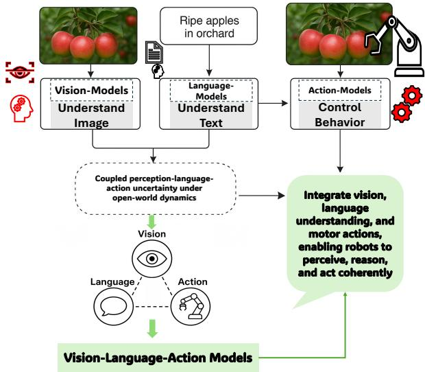  

Figure 1: Evolution from isolated modalities to unified Vision-Language-Action models. Integrated perception, language, and action enable adaptive, generalizable embodied intelligence.

Despite progress with VLMs, which achieved impressive multi-modal understanding by combining vision and language [190, 30, 298, 37, 10, 189], there remained a clear integration gap: the inability to generate or execute coherent actions based on multi-modal input [156, 137]. As further visualized in Figure 1 , most AI systems are specialized in one or two modalities such as vision-language, vision-action, or language-action, which struggled to fully integrate all three into a unified, end-toend frameworks. Consequently, robots could recognize objects visually ("apple"), understand a corresponding textual instruction ("pick the apple"), or perform a predefined motor action (grasping), yet integrating and performing all these abilities into fluid, adaptable behavior has been missing. The result was a pipeline that could not flexibly adapt to new tasks or environments, leading to brittle generalization and labor-intensive engineering efforts. This limitation highlighted a critical bottleneck in embodied AI: without systems that could jointly perceive, understand, and act, intelligent autonomous behavior remained a challenging goal.

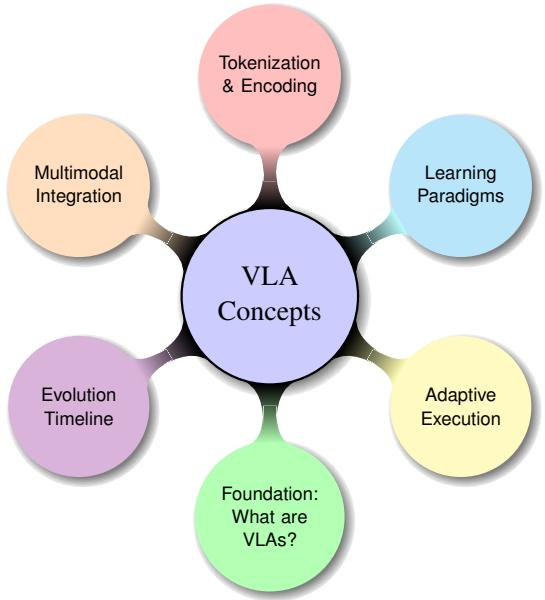  

Figure 2: Mind map of core VLA concepts. Each color-coded branch highlights a foundational dimension: definitions (foundation), historical evolution, multimodal integration, tokenization and encoding, learning paradigms, and adaptive execution in embodied settings.

The pressing need to bridge these gaps catalyzed the emergence of VLA models. VLA models, conceptualized around 2021-2022, and pioneered by efforts such as Google DeepMind's Robotic Transformer 2 (RT-2) [299], introduced a transformative architecture that unified perception, reasoning, and control within a single framework. As a solution to the limitations outlined in Figure 2, VLAs integrate vision inputs, language comprehension, and motor control capabilities, enabling embodied agents to perceive their surroundings, understand complex instructions, and execute appropriate actions dynamically. Early VLA approaches achieved this integration by extending vision-language models to include action tokens numerical or symbolic representations of robot motor commands, thereby allowing the model to learn from paired vision, language, and trajectory data [156]. This methodological innovation dramatically improved robots' ability to generalize to unseen objects, interpret novel language commands, and perform multi-step reasoning in unstructured environments [107].

VLA models represent a transformative step in the development of unified multi-modal intelligence, overcoming the long-standing limitations of treating vision, language, and action as separate domains [156]. By leveraging internet-scale datasets that integrate visual, linguistic, and behavioral information, VLAs empower robots to not only recognize and describe their environments but also to reason contextually and execute appropriate actions in complex, dynamic settings [254]. The progression illustrated in Figures 2 and 3 from isolated vision, language, and action systems to an integrated VLA paradigm-captures a fundamental shift toward the development of truly adaptive and generalizable embodied agents. In light of the transformative potential of this paradigm, a comprehensive and critically informed review of the current literature is both timely and essential. First, such a review is necessary to clarify the foundational concepts and architectural principles that distinguish VLAs from their predecessors. Second, it provides a structured account of the rapid progress and key milestones in the field, enabling researchers and practitioners to appreciate the trajectory of algorithmic and technological advancements. Third, an in-depth review is essential for mapping the diverse range of real-world applications - from household robotics to industrial automation and assistive technologies-where VLAs are already demonstrating transformative potential. Furthermore, by critically examining the current challenges, such as data efficiency, safety, generalization, and ethical considerations, the review identifies barriers that must be addressed for widespread deployment. Finally, synthesizing these insights helps to inform the broader AI and robotics communities about emerging research directions and practical considerations, fostering collaboration and innovation. In this review, we systematically analyze the foundational principles of VLA models. Additionally, we discuss their developmental progress and technical challenges. Our objective is to consolidate the current understanding and applications of VLAs while identifying limitations and proposing future directions for their evolution.The review begins with a detailed examination of key conceptual foundations (Figure 2), including the definition of VLA models, their historical evolution, mechanisms for multimodal integration, and unified tokenization and representation strategies spanning vision, language, and action. These conceptual descriptions set the stage for understanding how VLAs are structured and function across modalities. Building upon this description, we present a unified view of recent progress and training efficiency strategies (Figure 3). This includes architectural innovations adopted and extended within VLA models, along with data-efficient learning frameworks, parameter-efficient modeling techniques, and model acceleration strategies originally developed in broader machine learning and robotics contexts. Together, these advances are critical for scaling VLA systems to real-world applications.

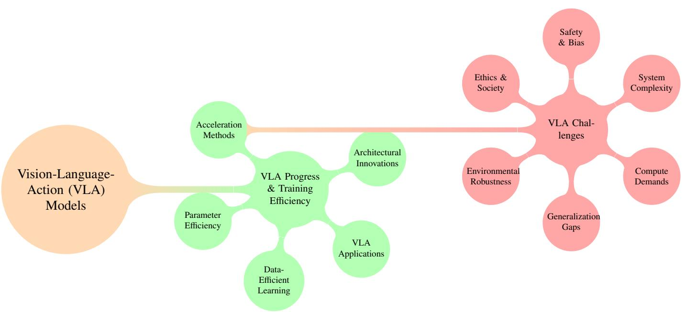

Following this, we present a comprehensive discussion of the current limitations encountered by VLA systems (Figure 3), many of which reflect broader challenges in embodied AI and robotics but arise in distinct and compounded forms due to the tight integration of vision, language, and action. The limitations to be discussed include inference bottlenecks, safety concerns, high computational demands, limited generalization, and ethical implications. We not only highlight these pressing challenges but also provide an analytical discussion on potential solutions to address them. Together, these three figures offer a visual depiction that lays out the framework and supports the textual analysis presented in this review. By outlining the conceptual landscape, recent innovations, and open challenges, this work aims to guide future research and encourage the development of more robust, efficient, and ethically grounded VLA systems.

Figure 4 summarizes the overall structure and logical flow of this review and illustrates how the manuscript is organized to provide a comprehensive and systematic analysis of VLA research. As depicted in the figure, the paper progresses from foundational concepts to recent advances, applications, challenges, and future research directions, ensuring a coherent narrative across sections. To construct this architecture, an extensive and rigorous literature search was conducted using the primary keywords "VisionLanguage—Action" and "VisionLanguage Models," together with the commonly used abbreviation "VLA." These keywords were employed to retrieve candidate studies from major academic and technical repositories, including Hugging Face, arXiv, ScienceDirect, Nature, IEEE Xplore, Wiley, and Springer Nature. The resulting corpus was further refined through manual screening to ensure relevance, technical depth, and alignment with the scope of this review. Only articles that directly contributed to the understanding of VLA concepts, methodological progress, application domains, and open challenges were retained. This multi-stage filtering process enabled a balanced coverage of both foundational and state-of-the-art works while avoiding peripheral or loosely related studies. As a result, Figure 4 not only reflects the thematic organization of the paper but also embodies the underlying review methodology. This paper follows a structured, hierarchical organization that systematically develops the foundations, evolution, and implications of VLA models, as summarized in Figure 4. The presentation begins with an introduction that motivates embodied intelligence and the emergence of VLAs, followed by a concepts section that establishes core principles including multimodal integration, tokenization, learning paradigms, and realtime control. Building on these foundations, the progress section examines architectural innovations, training and efficiency advancements, and parameter-efficient acceleration strategies. The applications section then grounds these developments in real-world domains, including humanoid robotics, autonomous vehicles, healthcare, agriculture, industrial systems, and interactive AR navigation. This is followed by a focused analysis of key challenges, including real-time inference, safety, generalization, system integration, and ethical considerations. The paper concludes with a future roadmap that distills crosscutting research directions in continual learning, scalability, interpretability, and embodied intelligence.

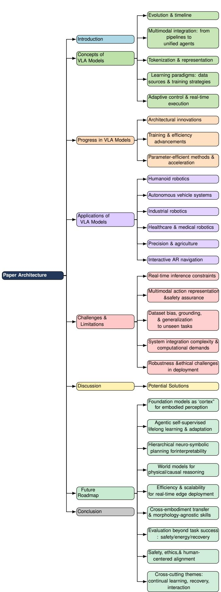  

Figure 4: Flow and structure of this paper, from conclusion and future roadmap back through applications, progress, concepts, to introduction.

# 2. Concepts of Vision-Language-Action Models

VLA models represent a class of intelligent systems that jointly process visual inputs, interpret natural language instructions, and generate executable action representations that can be instantiated on physical robotic hardware operating in dynamic environments. Technically, VLAs combine vision encoders (e.g., CNNs, ViTs), language models (e.g., LLMs, transformers), and policy modules or planners to achieve taskconditioned control. These models typically build upon multimodal fusion techniques established in vision-language models, such as cross-attention, concatenated embeddings, or token unification, and extend them to align sensory observations, linguistic instructions, and action representations. Unlike traditional visuomotor pipelines, VLAs support semantic grounding [154], enabling context-aware reasoning [228], affordance detection [79], and temporal planning [141]. A typical VLA model observes the environment through camera or sensor data, interprets goals expressed in language (e.g., "pick up the red apple") (Figure 5), and outputs lowlevel or high-level action sequences that could be implemented by automated systems to perform the action. Recent advancements integrate imitation learning, reinforcement learning, or retrieval-augmented modules to improve sample efficiency and generalization. This review examines how VLA models have evolved from foundational fusion architectures to general-purpose agents capable of real-world deployment across robotics, navigation, and human-AI collaboration. VLA models are multi-modal artificial intelligence systems that unify visual perception, language comprehension, and physical action generation into a single framework. These models enable robots or AI agents to interpret sensory inputs (e.g., images, text), understand contextual meaning, and autonomously execute tasks in real-world environments - all through end-to-end learning and action rather than isolated subsystems. As shown conceptually in Figure 5, VLA models bridge the historical disconnect between visual recognition, language comprehension, and/or motor execution that limited the capabilities of earlier robotic and AI systems.

# 2.1. Evolution and Timeline

The rapid development of VLA models from 2022-2025 demonstrates three distinct evolutionary phases: 1. Foundational Integration (20222023). Early VLAs established basic visuomotor coordination through multimodal fusion architectures. [202] first combined CLIP embeddings with motion primitives, while [181] demonstrated generalist capabilities across 604 tasks. [19] achieved $9 7 \%$ success rates in manipulation through scaled imitation learning, and [112] introduced temporal reasoning via transformer-based planners. By 2023, [299] enabled visual chain-of-thought reasoning, and [40] advanced stochastic action prediction through diffusion processes. These foundations addressed low-level control but lacked compositional reasoning, the ability to decompose complex tasks into reusable, semantically grounded sub-actions and recombine them across novel contextsprompting subsequent innovations in affordance grounding [287, 100].

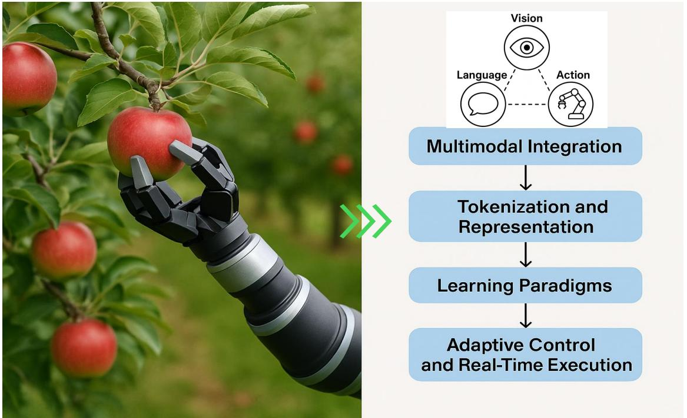  
Learning Paradigms, and Adaptive Control and Real-Time Execution.

2. Specialization and Embodied Reasoning (2024). Second-generation VLAs incorporated domain-specific inductive biases. [269] enhanced few-shot adaptation through retrieval-augmented training, while [280] optimized navigation via 3D scene-graph integration. [48] introduced reversible architectures for memory efficiency, and [239] addressed partial observability with physics-informed attention. Simultaneously, [5] improved compositional understanding through objectcentric disentanglement, and [293] extended applications to autonomous driving via multi-modal sensor fusion. However, these advances required new benchmarking methodologies [254]. 3. Generalization and Safety-Critical Deployment (2025). Latest systems prioritize robustness and human alignment. [274] integrated formal verification for risk-aware decisions, while [53] demonstrated whole-body control through hierarchical VLAs. [20] optimized compute efficiency for embedded deployment, and [131] combined neural-symbolic reasoning for causal inference. Emerging paradigms like [129]'s affordance chaining and [14]'s simto-real transfer learning address cross-embodiment challenges, while [139] bridges VLAs with human-in-the-loop interfaces through natural language grounding. Figure 6 presents a comprehensive timeline highlighting the evolution of 45 VLA models developed between 2022 and 2025. The earliest VLA systems, including CLIPort [202],

Gato [181], RT-1 [19], and VIMA [112], laid the foundation by combining pretrained vision-language representations with task-conditioned policies for manipulation and control. These early VLA systems were followed by ACT [287], RT2 [299], and VoxPoser [100], which integrated visual chainof-thought reasoning and affordance grounding. Models like Diffusion Policy [40] and Octo [218] introduced stochastic modeling and scalable data pipelines. In 2024, systems such as Deer-VLA [269], ReVLA [48], and Uni-NaVid [280] added domain specialization and memory-efficient designs, while Occllama [239] and ShowUI [139] tackled partial observability and user interaction. The trajectory continued with robotics-focused VLAs like Quar-VLA [54] and RoboMamba [143]. Recent innovations emphasize generalization and deployment: SafeVLA [274], Humanoid-VLA [53], and MoManipVLA [246] incorporate verification, full-body control, and memory systems. Models such as $\mathrm { G r 0 0 t } \ : \mathrm { N 1 }$ [14] and SpatialVLA [175] further bridge sim-to-real transfer and spatial grounding. This timeline illustrates how VLAs have advanced from modular learning to general-purpose, safe, and embodied intelligence.

# 2.2. Multimodal Integration: From Isolated Pipelines to Unified Agents

A central advancement in the emergence of VLA models lies in their ability to perform multi-modal integration, the joint processing of vision, language, and action within a unified architecture. Traditional robotic systems treated perception, natural language understanding, and control as discrete modules, often linked through manually defined interfaces or data transformations [140, 21, 219]. For instance, classic pipeline-based frameworks required a perception model to output symbolic labels, which were then mapped by a planner to specific actions frequently with domain-specific hand engineering [178, 117]. These approaches lacked adaptability, failed in ambiguous or unseen environments, and could not generalize instructions beyond pre-defined templates.

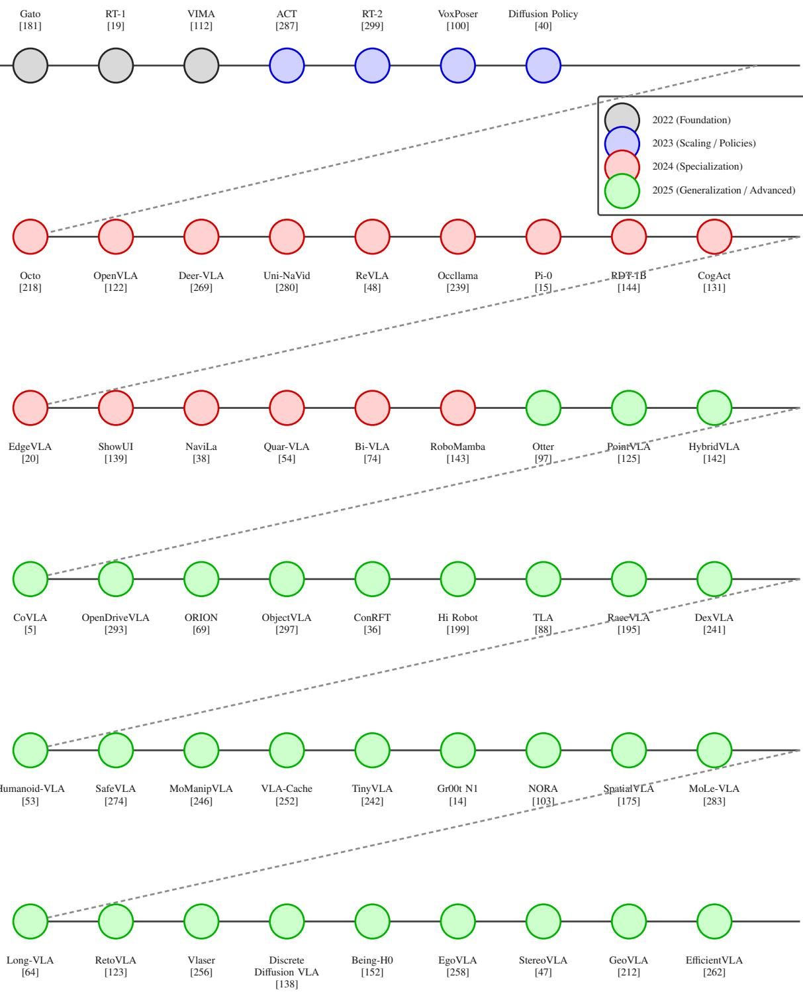  
grouping.

In contrast, modern VLAs fuse modalities end-to-end usin large-scale pretrained encoders and transformer-based architectures [244]. This shift enables the model to interpret visual observations and linguistic instructions within the same computational space, allowing flexible, context-aware reasoning [128]. For example, in the task "Pick the ripe apples" (Figure 5), the vision encoder—typically a Vision Transformer (ViT) or ConvNeXt—parses the scene to localize and categorize relevant objects (e.g., fruit, foliage, background) and infer ripeness-related visual cues based on learned texture, shape, and contextual features rather than fixed color assumptions [243]. Meanwhile, the language model, often a variant of T5, GPT, or BERT, encodes the instruction into a high-dimensional embedding. These representations are then fused via cross-attention or joint tokenization schemes, producing a unified latent space that informs the action policy [86]. This multimodal synergy was first effectively demonstrated in CLIPort [202], which takes an RGB image of a tabletop scene and a natural language instruction (e.g., "place the blue block on the red square") as inputs, encodes them using CLIP for semantic grounding, and outputs pixel-level pick-and-place action distributions via a convolutional transport decoder. By directly conditioning visuomotor policies on language embeddings, CLIPort eliminates explicit language parsing and enables end-to-end language-conditioned manipulation. Similarly, VIMA [112] advanced this approach by employing a transformer encoder to jointly process object-centric visual tokens and instruction tokens, enabling few-shot generalization across spatial reasoning tasks. Recent developments push this fusion further by incorporating temporal and spatial grounding. VoxPoser [100] employs voxel-level reasoning to resolve ambiguities in 3D object selection by composing pretrained vision-language models and classical motion planners, notably achieving zero-shot manipulation without task-specific training data. In contrast, RT2 [299] fuses visual-language tokens and action representations within a unified transformer, co-trained on large-scale internet vision-language corpora and over 100,000 real-robot demonstrations from the RT-1 dataset, enabling zero-shot generalization to unseen instructions. Another noteworthy contribution is Octo [218], which introduces a memory-augmented transformer trained on more than four million robot trajectories collected across diverse robots and environments via the Open XEmbodiment dataset, supporting long-horizon decision-making and demonstrating the scalability of joint perceptionlanguage— action learning. Crucially, VLAs offer robust solutions to challenges faced in real-world grounding. For example, Occllama [239] handles occluded object references through attention-based mechanisms, while ShowUI [139] demonstrates natural language interfaces that allow non-expert users to command agents through voice or typed input. These capabilities are only possible because the integration is not limited to surface-level fusion; rather, it captures semantic, spatial, and temporal alignment across modalities.

# 2.3. Tokenization and Representation: How VLAs Encode the World

A core innovation that sets VLA models apart from conventional vision-language architectures lies in their token-based representation framework, which enables holistic reasoning over perceptual [161, 286], linguistic, and physical action spaces [136]. Inspired by autoregressive generative models like transformers, modern VLAs encode the world using discrete tokens that unify all modalities vision, language, state, and action into a shared embedding space [142]. This allows the model to not only understand "what needs to be done" (semantic reasoning), but also "how to do it" (control policy execution) in a fully learnable and compositional way [248, 150, 221]. •Prefix Tokens: Encoding Context and Instruction: Prefix tokens serve as the contextual backbone of VLA models [252, 107]. These tokens encode the environmental scene (via images or video) and the accompanying natural language instruction into compact embeddings that prime the model's internal representations [17]. For instance, as depicted in Figure 7 in a task such as "stack the green blocks on the red tray," the image of a cluttered tabletop is processed through a vision encoder like ViT or ConvNeXt, while the instruction is embedded by an LLM (e.g., T5 or LLaMA). These are then transformed into a sequence of prefix tokens that establish the model's initial understanding of the goal and environmental layout. This shared representation enables cross-modal grounding, allowing the system to resolve spatial references (e.g., "on the left," "next to the blue cup") and object semantics ("green blocks") across both modalities.

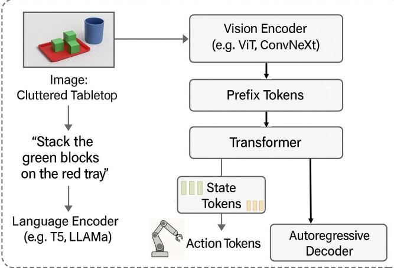  

Figure 7: A diagram illustrating the end-to-end tokenization and representation process in VLA models. Visual input (e.g., cluttered tabletop) is encoded by a vision encoder (e.g., ViT), while natural language instructions (e.g., "stack the green blocks") are processed by a language encoder (e.g., T5). The system fuses prefix, state, and action tokens through a transformer and autoregressively predicts motor actions.

•State Tokens: Embedding the Robot's Configuration: In addition to perceiving external stimuli, VLAs must be aware of their internal physical state [242, 143]. This is achieved through the use of state tokens, which encode real-time information about the agent's configuration joint positions, force-torque readings, gripper status, end-effector pose, and even the locations of nearby objects [126]. These tokens are crucial for ensuring situational awareness and safety, especially during manipulation or locomotion [211, 105].

Figure 8 illustrates how VLA models utilize state tokens to enable dynamic, context-aware decision-making in both manipulation and navigation settings. In Figure 8a, a robot arm is shown partially extended near a fragile object. In such scenarios, state tokens play a critical role by encoding real-time proprioceptive information, such as joint angles, gripper pose, and end-effector proximity. These tokens are continuously fused with visual and language-based prefix tokens, allowing the transformer to reason about physical constraints. The model can thus infer that a collision is imminent and adjust the motor commands accordingly e.g., rerouting the arm trajectory or modulating force output. In mobile robotic platforms, as depicted in Figure 8b, state tokens encapsulate spatial features such as odometry, LiDAR scans, and inertial sensor data. These are essential for terrain-aware locomotion and obstacle avoidance. The transformer model integrates this state representation with environmental and instructional context to generate navigation actions that dynamically adapt to changing surroundings. Whether grasping objects in cluttered environments or autonomously navigating uneven terrain, state tokens provide a structured mechanism for situational awareness, enabling the autoregressive decoder to produce precise, context-informed action sequences that reflect both internal robot configuration and external sensory data.

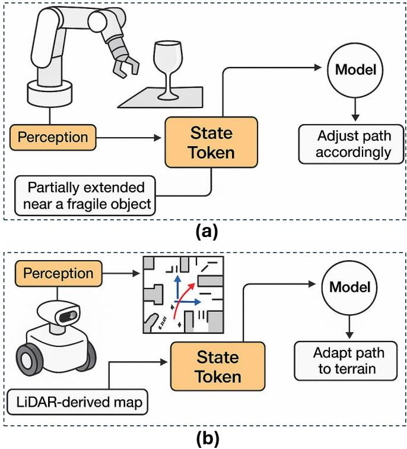  

Figure 8: Illustrating how VLA models utilize prefix, state, and action tokens in real-world scenarios. In robotic manipulation, state tokens detect arm extension near fragile objects, enabling path adjustment. In navigation, they represent LiDAR and odometry data. The apple-picking task shows how prefix tokens guide goal understanding, while action tokens generate motion sequences for targeted grasping and execution.

• Action Tokens: Autoregressive Control Generation: The final layer of the VLA token pipeline involves action tokens [121, 122], which are autoregressively generated by the model to represent the next step in motor control [242]. Each token corresponds to a low-level control signal, such as joint angle updates, torque values, wheel velocities, or high-level movement primitives [81]. During inference, the model decodes these tokens one step at a time, conditioned on prefix and state tokens, effectively turning VLA models into language-driven policy generators [67, 209]. This formulation allows seamless integration with real-world actuation systems, supports variablelength action sequences [11, 99], and enables model finetuning via reinforcement or imitation learning frameworks [285]. Notably, models like RT-2 [299] and PaLM-E [58] exemplify this design, where perception, instruction, and embodiment are merged into a unified token stream. For instance, in the apple-picking task as depicted in Figure 9, the model may receive prefix tokens that include the image of the orchard and the text instruction. The state tokens describe the robot's current arm posture and whether the gripper is open or closed. Action tokens are then predicted step by step to guide the robotic arm toward the apple, adjust the gripper orientation, and execute a grasp with appropriate force. The beauty of this approach is that it allows transformers, which are traditionally used for text generation, to now generate sequences of physical actions in a manner similar to generating a sentence only here, the sentence is the motion.

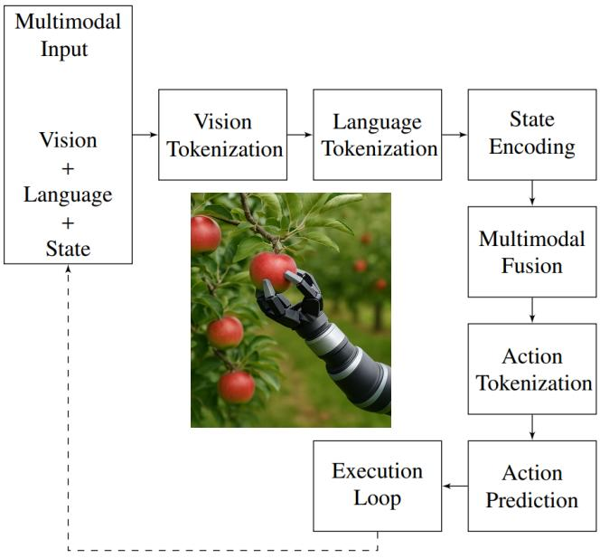  

Figure 9: Ilustrating the process of how VLAs Encode the World. VLAs encode the world by converting vision, language, and sensor inputs into tokens, fusing them through cross-attention, predicting action sequences via transformers, and executing tasks with real-time feedback - enabling robots to interpret scenes, follow instructions, and adapt actions dynamically.

To operationalize the VLA paradigm in robotics, we present in Figure 9 a structured pipeline that demonstrates how multimodal information specifically vision, language, and proprioceptive state is encoded, fused, and converted into executable action sequences. This end-to-end loop allows a robot to interpret complex tasks like "pick the ripe apple near the green leaf" and execute precise, context-sensitive manipulations. The system begins with multimodal input acquisition, where three distinct data streams are collected: visual observations (e.g., RGB-D frames), natural language commands, and real-time robot state information (e.g., joint angles or velocity). These are independently tokenized into discrete embeddings using pretrained modules [51, 282]. As depicted in the diagram, the image is processed through a Vision Transformer (ViT) backbone to generate vision tokens, the instruction is parsed by a language model such as BERT or T5 to produce language tokens, and state inputs are transformed via a lightweight MLP encoder into compact state tokens. These tokens are then fused using a cross-modal attention mechanism, where the model jointly reasons over object semantics, spatial layout, and physical constraints [76]. This fused representation forms the contextual basis for decision-making [96, 149]. In Figure 9, this is denoted as the multi-modal fusion step. The fused embedding is passed into an autoregressive decoder typically a transformer that generates a series of action tokens. These tokens may correspond to joint displacements, gripper force modulation, or high-level motor primitives (e.g., "move to grasp pose", "rotate wrist"). The predicted action tokens are subsequently translated into low-level control commands and executed by an external, hardware-dependent execution loop, which interfaces with the robot controller to close the perception-action cycle by feeding back updated state observations for the next VLA inference step. This closed-loop mechanism enables the model to dynamically adapt to perturbations, object shifts, or occlusions in real time [276, 155, 251].

To provide clear and specific implementation details, Algorithm 1 formalizes the VLA tokenization process. Given an RGB-D frame $I$ , natural language instruction $T$ , and joint angle vector $\theta$ , the algorithm produces a set of action tokens that can be executed in sequence. The image $I$ is processed via a ViT to produce $V$ , a set of 400 visual tokens. In parallel, the instruction $T$ is encoded by a BERT model to yield $L$ , a sequence of 12 semantic language tokens. Simultaneously, the robot state $\theta .$ —including joint angles, end-effector pose, and proprioceptive signals—is encoded by a multilayer perceptron into a compact 64-dimensional state embedding $s$ , providing the model with real-time awareness of the robot's configuration and physical constraints during action generation. These tokens are then fused via a cross-attention module to produce a shared 512- dimensional representation $F$ , capturing the semantics, intent, and situational awareness needed for grounded action. Finally, a policy decoder such as FAST [171] maps the fused features into 50 discrete action tokens, which can then be decoded into motor commands $\tau _ { 1 : N }$ . The decoding process is implemented using a transformerbased architecture, as shown in the code snippet titled Action Prediction Code. A Transformer decoder is instantiated with 12 layers, a model dimension of 512, and 8 attention heads. The fused multimodal tokens are provided as context, and the decoder autoregressively predicts action tokens one step at a time, where each predicted token represents the next control decision conditioned on the full multimodal context and all previously generated actions. The resulting action-token sequence is then detokenized into a continuous motor command trajectory for execution. This implementation mirrors how text generation works in LLMs, but here the "sentence" is a motion trajectory a novel repurposing of natural language generation techniques for physical action synthesis. Together, Figure 9, Algorithm 1, and the pseudocode illustrate how VLAs unify perception, instruction, and embodiment within a coherent and interpretable token space. This modularity allows the framework to generalize across tasks and robot morphologies, facilitating rapid deployment in real-world applications like apple picking, household tasks, and mobile navigation. Importantly, the clarity and separability of the tokenization steps make the architecture extensible, enabling further research on token learning, hierarchical planning, or symbolic grounding in VLA systems. Algorithm 1 VLA Tokenization Pipeline   

<table><tr><td>1: Input: RGB-D frame I, text command T, joint angles θ</td></tr><tr><td>2: V ← ViT(I) 400 vision tokens 3: L ← BERT(T) &gt; 12 language tokens</td></tr><tr><td>4: S ← MLP(θ) 64-dim state encoding</td></tr><tr><td>5: F ← CrossAttention(V, L, S ) &gt; 512-dim fused token</td></tr><tr><td>6: A ← FAST(F) 50 action tokens</td></tr><tr><td>7: Output: Motor commands T1:N</td></tr></table>

# Action Prediction Code

# Python-like pseudocode   
def predict_actions(fused_tokens): transformer $=$ Transformer( num_layers $= 1 2$ , d_model $= 5 1 2$ , nhead $^ { = 8 }$ ) action_tokens $=$ transformer.decode( fused_tokens, memory $=$ fused_tokens ) return detokenize(action_tokens)

# 2.4. Learning Paradigms: Data Sources and Training Strategies

Training VLA models requires a hybrid learning paradigm that integrates both semantic knowledge from the web and taskgrounded information from robotics datasets [35]. As shown in prior sections, the multi-modal architecture of VLAs must be exposed to diverse forms of data that support language understanding, visual recognition, and motor control. This is typically achieved through two primary data sources. First, as depicted in figure 10, large-scale internet-derived corpora form the backbone of the model's semantic prior. These datasets include image-caption pairs (e.g., COCO, LAION400M), instruction-following datasets (e.g., HowTo100M, WebVid), and visual question-answering corpora (e.g., VQA,

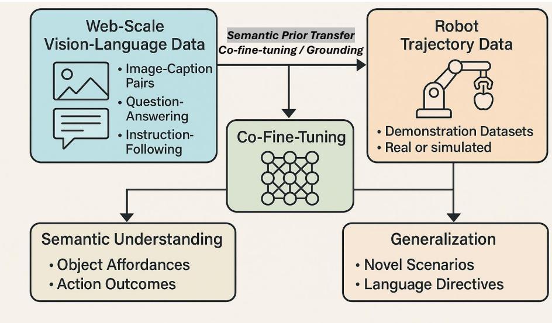  

Figure 10: Learning Paradigms: Data Sources and Training Strategies for VLAs.

GQA). Such datasets enable pretraining of the visual and language encoders, helping the model acquire general representations of objects, actions, and concepts [2]. This phase often uses contrastive or masked modeling objectives, such as CLIP-style contrastive learning or language modeling losses, to align vision and language modalities within a shared embedding space [186, 260]. Importantly, this stage gives VLAs a foundational "understanding of the world" that facilitates compositional generalization, object grounding, and zero-shot transfer [33, 16]. However, semantic understanding alone is insufficient for physical task execution [44, 231, 137]. Thus, the second phase focuses on grounding the model in embodied experience [231]. Robot trajectory datasets collected either from realworld robots or high-fidelity simulators are used to teach the model how language and perception translate into action [67]. These include datasets like RoboNet [45], BridgeData [61], and RT-X [227], which provide video-action pairs, joint trajectories, and environment interactions under natural language instructions [159]. Demonstration data may come from kinesthetic teaching, teleoperation, or scripted policies [115, 13]. This phase typically employs supervised learning (e.g., behavior cloning) [68], reinforcement learning (RL), or imitation learning to train the autoregressive policy decoder to predict action tokens based on fused visual-language-state embeddings [83]. Recent works increasingly adopt multistage or multitask training strategies. For example, models are often pretrained on vision-language datasets using masked language modeling, then fine-tuned on robot demonstration data using tokenlevel autoregressive loss [122, 295, 252]. Others use curriculum learning, where simpler tasks (e.g., object pushing) precede more complex ones (e.g., multistep manipulation) [288]. Some approaches further leverage domain adaptation such as in OpenVLA [122] or sim-to-real transfer to bridge the gap between synthetic and real-world distributions [125]. By unifying semantic priors with task execution data, these learning paradigms allow VLA models to generalize across tasks, domains, and embodiments forming the backbone of scalable, instruction-following agents capable of robust real-world operation. Through co-fine-tuning, these datasets are brought into alignment [232, 63]. The model learns to map from visual and linguistic inputs to appropriate action sequences [175]. This training paradigm not only helps the model understand object affordances (e.g., apples can be grasped) and action outcomes (e.g., lifting requires force and trajectory), but also promotes generalization to novel scenarios [129]. A model trained on kitchen manipulation tasks may be able to infer how to pick an apple in an outdoor orchard if it has learned general principles of object localization, grasping, and following language directives. Recent architectures, such as Google DeepMind's RT-2 (Robotic Transformer 2) [299], have demonstrated this principle in action. RT-2 treats action generation as a form of text generation, where each action token corresponds to a discrete command in a robot's control space. Because the model is trained on both web-scale multi-modal data and thousands of robot demonstrations, it can flexibly interpret novel instructions and perform zero-shot generalization to new objects and tasks something that was largely impossible with traditional control systems or even with early multi-modal models.

# 2.5. Adaptive Control and Real-Time Execution

Another strength of VLAs lies in their ability to perform adaptive control, using real-time feedback from sensors to adjust behavior on the fly [195]. This is particularly important in dynamic, unstructured environments like orchards, homes, or hospitals, where unexpected changes (e.g., wind moving an apple, lighting changes, human presence) can alter the task parameters. During execution, state tokens are updated in real-time, reflecting sensor inputs and joint feedback [252]. The model can then revise its planned actions accordingly. For instance, in the apple-picking scenario, if the target apple shifts slightly or another apple enters the field of view, the model dynamically reinterprets the scene and adjusts the grasp trajectory. This capability mimics human-like adaptability and is a core advantage of VLA systems over pipeline-based robotics.

# 3. Progress in Vision-Language-Action Models

The inception of VLA models was catalyzed by the remarkable success of transformer-based LLMs, notably ChatGPT, released in November 2022, which demonstrated unprecedented semantic reasoning capabilities (ChatGPT) [179]. This breakthrough inspired researchers to extend language models to multimodal domains, integrating perception and action for robotics. By 2023, GPT-4 introduced multimodal capabilities by processing both text and images, which spurred subsequent efforts to extend language-centric multimodal foundation models toward incorporating physical action representations and control interfaces [1]. Concurrently, VLMs like CLIP (2022) [202] and Flamingo (2022) [3] had established robust visual-text alignment through contrastive learning, enabling zero-shot object recognition and laying the groundwork for VLM models (such as CLIP). These models leveraged large-scale labeled datasets to align images with textual descriptions, a critical precursor to integrating actions.

A pivotal development was the creation of large-scale robotic datasets, such as RT-1's 130,000 demonstrations, which provided action-grounding data essential for co-training vision, language, and action components [19]. These datasets captured diverse tasks and environments, enabling models to learn generalizable behaviors. Architectural breakthroughs followed with Google's RT-2 in 2023 [18], a landmark VLA model that unified vision, language, and action tokens, treating robotic control as an autoregressive sequence prediction task (RT-2 Blog(Source Link)). RT-2 discretized actions using Discrete Cosine Transform (DCT) compression and Byte-Pair Encoding (BPE), achieving a $63 \%$ improvement in performance on novel objects. Multimodal fusion techniques, such as cross-attention transformers, integrated Vision Transformer (ViT)-processed images (e.g., 400 patch tokens) with language embeddings, enabling robots to execute complex commands like "Pick the red cup left of the bowl." Additionally, UC Berkeley's Octo model (2023) introduced an open-source approach with 93M parameters and diffusion decoders, trained on 800,000 robot demonstrations from the OpenX-Embodiment dataset, further broadening the research landscape [218].

# 3.1. Architectural Innovations in VLA Models

From 2023 to 2024, VLA models underwent significant architectural advancements and refined training methodologies. Dual-system architectures emerged as a key innovation, exemplified by NVIDIA's GR00T N1 (2025) [14], which combined System 1 (fast diffusion policies with 10ms latency for lowlevel control) and System 2 (LLM-based planners for highlevel task decomposition). This separation enabled efficient coordination between strategic planning and real-time execution, enhancing adaptability in dynamic environments. Other models, like Stanford's OpenVLA (2024) [122], introduced a 7B-parameter open-source VLA trained on 970k real-world robot demonstrations, using dual vision encoders (DINOv2 [164] and SigLIP [271]) and a Llama 2 language model [223], outperforming larger models like RT-2-X (55B) [122]. Training paradigms evolved to leverage co-fine-tuning on web-scale vision-language data (e.g., LAION-5B) [194] and robotic trajectory data (e.g., RT-X) [227], aligning semantic knowledge with physical constraints [194]. Synthetic data generation tools like UniSim addressed data scarcity by creating photorealistic scenarios, such as occluded objects, crucial for robust training (UniSim [264]). Parameter efficiency was enhanced through Low-Rank Adaptation (LoRA) adapters for fine-tuning [93], which allowed domain adaptation without full retraining, reducing GPU hours by $70 \%$ .The introduction of diffusion-based policies, as seen in Physical Intelligence's pi 0 model (2024) [15], offered improved action diversity but required significant computational resources. These advancements democratized VLA technology, fostering collaboration and accelerating innovation. Recent VLA models have converged toward three major architectural paradigms that balance efficiency, modularity, and robustness: early fusion models, dual-system architectures, and self-correcting frameworks. Each of these innovations addresses specific challenges in grounding, generalization, and action reliability in real-world robotic systems.

1. Early Fusion Models: One class of VLA approaches focuses on fusing vision and language representations at the input stage before passing them to the policy module. Huang et al.'s EF-VLA model [96], presented at International Conference on Learning Representations (ICLR 2025), exemplifies this trend by retaining the representational alignment established by CLIP [202]. EF-VLA accepts image-text pairs, encodes them with CLIP's frozen encoders, and fuses the resulting embeddings early in the transformer backbone prior to action prediction. This design ensures that the semantic consistency learned during CLIP pretraining is preserved, reducing overfitting and enhancing generalization. Notably, EF-VLA demonstrated a $20 \%$ performance improvement on compositional manipulation tasks and reached $8 5 \%$ success on previously unseen goal descriptions. By keeping the vision-language backbone frozen, this approach preserves computational efficiency and avoids catastrophic forgetting, while domain-specific training is confined to lightweight policy or action modules, enabling task adaptation without sacrificing the model's general-purpose visual-semantic representations.

2. Dual-System Architectures: Inspired by dual-process theories of human cognition, models like NVIDIA's GR00T N1 (2025) [14] implement two complementary subsystems: a fastreactive module (System 1) and a slow-reasoning planner (System 2). System 1 comprises a diffusion-based control policy that operates at $1 0 ~ \mathrm { m s }$ latency, ideal for fine-grained, low-level control such as end-effector stabilization or adaptive grasping. In contrast, System 2 uses a LLM for task planning, skill composition, and high-level sequencing. The planner parses longhorizon goals (e.g., "clean the table") into atomic subtasks, while the low-level controller ensures real-time execution. This decomposition enables multi-timescale reasoning and improved safety, especially in environments where rapid reaction and deliberation must co-exist. In benchmark tests on multi-stage household manipulation, GR00T N1 outperformed monolithic models such as RT-1, RT-2, and OpenVLA by $17 \%$ in success rate and reduced collision failures by $28 \%$ .

3. Self-Correcting Frameworks: A third architectural evolution is the emergence of self-correcting VLA models, which augment conventional inference pipelines with explicit failure detection and recovery mechanisms. SC-VLA (2024) retains a standard fast inference path similar to earlier end-to-end or hierarchical VLA designs, but introduces an additional, slower correction path that is selectively activated to re-evaluate decisions and generate recovery actions when execution failures or inconsistencies are detected. In this framework, the default behavior is to predict poses or actions directly from the fused embedding using a lightweight transformer. When failures are detected e.g., unsuccessful grasps or obstacle collisions, the model invokes a secondary process that performs chain-of-thought reasoning [281, 270]. This path queries an internal LLM (or external expert system) to diagnose failure modes and generate correction strategies [59]. For example, if the robot repeatedly misidentifies an occluded object, the LLM may suggest an active viewpoint change or gripper reorientation. In closed-loop experiments, SC-VLA reduced task failure rates by $3 5 \%$ and significantly improved recoverability in cluttered and adversarial environments. 4. Architectural Design Space of VLA Models VLA models exhibit a rich diversity of architectural designs and functional emphases, which can be systematically organized along the dimensions of end-to-end versus modular pipelines, hierarchical versus flat policy structures, and the balance between low-level control and high-level planning (Table 1). End-to-end VLAs, such as CLIPort [202], RT-1 [19], and OpenVLA [122], process raw sensory inputs directly into motor commands via a single unified network. By contrast, component-focused models like VLATest [237] and Chain-of-Affordance [129] decouple perception, language grounding, and action modules, enabling targeted improvements in individual submodules. Hierarchical architectures have emerged to tackle complex, long-horizon tasks by separating strategic decision making from reactive control. For instance, CogACT [131] and $\mathrm { N a V _ { \mathrm { - } } }$ ILA [38] employ a two-tier hierarchy where an LLM-based planner issues subgoals to a low-level controller, thereby combining the strengths of System 2 reasoning and System 1 execution. Similarly, ORION [69] integrates a QT-Former for longterm context aggregation with a generative trajectory planner in a cohesive framework. Low-level policy emphasis is typified by diffusion-based controllers (e.g. Pi-0 [15], DexGraspVLA [291]), which excel at producing smooth, diverse motion distributions but often incur higher computational cost. In contrast, high-level planners (e.g. FAST Pi-0 Fast [171], CoVLA [5]) focus on rapid subgoal generation or coarse trajectory prediction, delegating fine-grained control to specialized modules or traditional motion planners. End-to-end dual-system models like HybridVLA [142] and Helix [217] blur these distinctions by jointly training both components while preserving modular interpretability. Table 1 further highlights how recent VLAs balance these trade-offs. Models such as OpenDriveVLA [293] and CombatVLA [34] prioritize hierarchical planning in dynamic, safetycritical domains, whereas lightweight, edge-targeted systems like Edge VLA [20] and TinyVLA [242] emphasize real-time low-level policies at the expense of high-level reasoning. This classification framework not only clarifies the design space of VLAs but also guides future development by pinpointing underexplored combinations such as fully end-to-end, hierarchical models optimized for embedded deployment that promise to advance both the capabilities and the applicability of VLA systems across robotics, autonomous driving, and beyond. The classification in Table 1 is significant because it provides a clear framework for comparing diverse VLA architectures, highlighting how design choices such as end-to-end integration versus hierarchical decomposition impact task performance, scalability, and adaptability. By categorizing models along dimensions such as low-level policy execution and high-level planning, researchers can more clearly identify the strengths and limitations of existing approaches and uncover opportunities for architectural innovation. For example, agricultural robotics tasks such as high-speed fruit harvesting or precision spraying benefit from architectures emphasizing fast, reactive low-level controllers, whereas applications like orchard navigation, multi-row coverage planning, or long-horizon crop monitoring require stronger high-level planning and reasoning capabilities. This taxonomy therefore aids in selecting appropriate VLA architectures for specific use cases and guides future development toward hybrid systems that balance responsiveness with cognitive planning, ultimately accelerating progress in embodied AI.

Additionally, to synthesize recent advancements in VLA models, Table 2 presents a summary of notable systems developed from 2022 through 2025. Building upon architectural innovations such as early fusion, dual-system processing, and self-correcting feedback loops, these models incorporate diverse design philosophy and training strategies. Each table entry explicitly enumerates the model's architectural components—namely the vision encoder, language encoder, and action decoder together with the primary training datasets used to ground and evaluate the model's capabilities. Models like CLIPort [202] and RT-2 [299] laid early foundations by aligning semantic embeddings with action policies, while more recent frameworks like $P i$ -Zero, CogACT [131], and GR00T N1 [14] introduce scalable architectures with diffusion-based or high-frequency controllers. Several models leverage multimodal pretraining with internet-scale vision-language corpora and robot trajectory datasets, enhancing generalization and zero-shot capabilities [297, 291, 289, 257]. This tabulated comparison serves as a reference point for researchers seeking to understand the functional diversity, domain applicability, and emerging trends in VLA design across real and simulated environments. policies versus high-level task planners.   

<table><tr><td>Model Name</td><td>Year</td><td>End-to- End</td><td>Hie rarc hical</td><td>Comp onent Focused</td><td>Low-Level Policy</td><td>High-Level Planner</td></tr><tr><td>CLIPort [202]</td><td>2022</td><td></td><td>X</td><td>X</td><td></td><td>X</td></tr><tr><td>RT-1 [19]</td><td>2022</td><td></td><td>X</td><td>X</td><td></td><td>X</td></tr><tr><td>Gato [181]</td><td>2022</td><td></td><td>X</td><td>X</td><td></td><td>X</td></tr><tr><td>VIMA [112]</td><td>2022</td><td></td><td>X</td><td>X</td><td></td><td>X</td></tr><tr><td>Diffusion Policy [40]</td><td>2023</td><td></td><td>X</td><td>X</td><td>2</td><td>X</td></tr><tr><td>ACT [287]</td><td>2023</td><td>2</td><td>X</td><td>X</td><td>✓</td><td>X</td></tr><tr><td>VoxPoser [100]</td><td>2023</td><td></td><td>X</td><td>X</td><td>✓</td><td>X</td></tr><tr><td>Seer [80]</td><td>2023</td><td>✓</td><td>X</td><td>X</td><td>✓</td><td>X</td></tr><tr><td>Octo [218]</td><td>2024</td><td>✓</td><td>X</td><td>X</td><td>✓</td><td>X</td></tr><tr><td>OpenVLA [122]</td><td>2024</td><td>✓</td><td>X</td><td>X</td><td>✓</td><td>X</td></tr><tr><td>CogACT [131]</td><td>2024</td><td>X</td><td>✓</td><td>X</td><td>✓</td><td>✓</td></tr><tr><td>VLATest [237]</td><td>2024</td><td>X</td><td></td><td>✓</td><td>×</td><td>X</td></tr><tr><td>NaVILA [38]</td><td>2024</td><td>X</td><td>✗</td><td>X</td><td>✓</td><td>✓</td></tr><tr><td>RoboNurse-VLA [132]</td><td>2024</td><td>✓</td><td>X</td><td>X</td><td>✓</td><td>X</td></tr><tr><td>Mobility VLA [42]</td><td>2024</td><td>X</td><td>✓</td><td>X</td><td>✓</td><td>✓</td></tr><tr><td>RevLA [48]</td><td>2024</td><td>X</td><td>X</td><td>✓</td><td>X</td><td>X</td></tr><tr><td>Uni-NaVid [280]</td><td>2024</td><td>X</td><td>✓</td><td>X</td><td>✓</td><td>✓</td></tr><tr><td>RDT-1B [144]</td><td>2024</td><td>✓</td><td>X</td><td>X</td><td>✓</td><td>X</td></tr><tr><td>RoboMamba [143]</td><td>2024</td><td></td><td>X</td><td>*&gt;&gt;</td><td>✓</td><td>X</td></tr><tr><td>Chain-of-Affordance [129]</td><td>2024</td><td>&gt;xx</td><td>X</td><td></td><td></td><td>X</td></tr><tr><td>Edge VLA [20]</td><td>2024</td><td></td><td>X</td><td></td><td></td><td>X</td></tr><tr><td>ShowUI-2B [139]</td><td>2024</td><td>✓</td><td>X</td><td>X</td><td>✓</td><td>X</td></tr><tr><td>Pi-0 [15]</td><td>2024</td><td>✓</td><td>X</td><td>X</td><td>✓</td><td>X</td></tr><tr><td>FAST (Pi-0 Fast) [171]</td><td>2025</td><td>X</td><td>X</td><td>✓</td><td>✓</td><td>X</td></tr><tr><td>OpenVLA-OFT [121]</td><td>2025</td><td>✓</td><td>X</td><td>X</td><td>✓</td><td>X</td></tr><tr><td>CoVLA [5]</td><td>2025</td><td>X</td><td>✓</td><td>X</td><td>✓</td><td>✓</td></tr><tr><td>OpenDriveVLA [293]</td><td>2025</td><td>X</td><td></td><td>X</td><td>✓</td><td>✓</td></tr><tr><td>ORION [69]</td><td>2025</td><td>X</td><td>-</td><td>X</td><td>✓</td><td>✓</td></tr><tr><td>UAV-VLA [191]</td><td>2025</td><td>X</td><td></td><td>X</td><td>✓</td><td>✓</td></tr><tr><td>CombatVLA [34]</td><td>2025</td><td>✓</td><td>X</td><td>X</td><td></td><td>X</td></tr><tr><td>HybridVLA [142]</td><td>2025</td><td>X</td><td>✓</td><td>X</td><td>✓</td><td>✓</td></tr><tr><td>NORA [103]</td><td>2025</td><td>✓</td><td>X</td><td>X</td><td>✓</td><td>X</td></tr><tr><td>SpatialVLA [175]</td><td>2025</td><td>X</td><td>X</td><td>✓</td><td>✓</td><td>X</td></tr><tr><td>MoLe-VLA [283]</td><td>2025</td><td>X</td><td>X</td><td>✓</td><td>✓</td><td>X</td></tr><tr><td>JARVIS-VLA [130]</td><td>2025</td><td>✓</td><td>X</td><td>X</td><td>✓</td><td>X</td></tr><tr><td>UP-VLA [279]</td><td>2025</td><td>&gt;×x</td><td>X</td><td>*&gt;</td><td></td><td>X</td></tr><tr><td>Shake-VLA [120]</td><td>2025</td><td></td><td>X</td><td></td><td></td><td>X</td></tr><tr><td>DexGraspVLA [291]</td><td>2025</td><td></td><td>✓</td><td>X</td><td></td><td>✓</td></tr><tr><td>DexVLA [241]</td><td>2025</td><td>X</td><td>✓</td><td>X</td><td></td><td>✓</td></tr><tr><td>Humanoid-VLA [53]</td><td>2025</td><td></td><td>X</td><td>X</td><td>✓</td><td>X</td></tr><tr><td>ObjectVLA [297]</td><td>2025</td><td>✓</td><td>X</td><td>X</td><td>✓</td><td>X</td></tr><tr><td>Long-VLA [64]</td><td>2025</td><td></td><td>X</td><td>X</td><td>✓</td><td>X</td></tr><tr><td>RetoVLA [123]</td><td>2025</td><td>X</td><td>X</td><td>✓</td><td>✓</td><td>X</td></tr><tr><td>Vlaser [256]</td><td>2025</td><td></td><td>√</td><td>X</td><td>✓</td><td>✓</td></tr><tr><td>Discrete Diffusion VLA [138]</td><td>2025</td><td></td><td>X</td><td>X</td><td>✓</td><td>X</td></tr><tr><td>Being-H0 [152]</td><td>2025</td><td></td><td>X</td><td>X</td><td>✓</td><td>X</td></tr><tr><td>EgoVLA [258]</td><td>2025</td><td></td><td>X</td><td>X</td><td>✓</td><td>X</td></tr><tr><td>StereoVLA [47]</td><td>2025</td><td>✓</td><td>X</td><td>X</td><td>✓</td><td>X</td></tr><tr><td>GeoVLA [212]</td><td>2025</td><td>X</td><td>✓</td><td>X</td><td>✓</td><td>✓</td></tr><tr><td>EfficientVLA [262]</td><td>2025</td><td>X</td><td>X</td><td>✓</td><td>✓</td><td>X</td></tr></table>

Table 2: Compact summary of representative Vision-Language-Action (VLA) models. Each row reports the primary encoders/decoders, training data, and the main distinctive capability.   

<table><tr><td>Model (Ref.)</td><td>Architecture (vision / language / action)</td><td>Training data</td><td>Key strength / uniqueness</td></tr><tr><td>CLIPort [202]</td><td>CLIP-ResNet50 + Transporter-ResNet / CLIP- Self-collected [SC] GPT / LingUNet</td><td></td><td>Aligns semantic CLIP features with Transporter spatial rea- soning for precise SE(2) manipulation.</td></tr><tr><td>RT-1 [19]</td><td>EfficientNet / Universal Sentence Encoder / RT-1-Kitchen [SC] Transformer (discretized actions)</td><td></td><td>Early large-scale transformer policy for multi-task kitchen manipulation with tokenized actions.</td></tr><tr><td>RT-2 [299]</td><td>ViT-22B or ViT-4B / PaLI-X or PaLM-E / VQA + RT-1-Kitchen symbol-tuning (action tokens)</td><td></td><td>Co-finetunes internet-scale VQA with robot data, yielding emergent generalization for embodied tasks.</td></tr><tr><td>Gato [181]</td><td>ViT / SentencePiece / Transformer (unified to- Self-collected [SC] ken stream)</td><td></td><td>Generalist agent unifying robotics, language, and Atari via shared tokenization and a single transformer.</td></tr><tr><td>VIMA [112]</td><td>ViT + Mask R-CNN / T5 / Transformer</td><td>VIMA-Data [SC]</td><td>Prompt-driven VL grounding across multiple composi- tional task types (six prompt modalities).</td></tr><tr><td>ACT [287]</td><td>ResNet-18 / —/ CVAE-Transformer</td><td>ALOHA [SC]</td><td>Temporal ensembling enables smooth bimanual imitation with fine control precision.</td></tr><tr><td>Octo [218]</td><td>CNN / T5-base / Diffusion Transformer</td><td>Open X-Embodiment (OXE)</td><td>Large multi-robot policy trained on 4M+ trajectories span- ning many robot embodiments.</td></tr><tr><td>VoxPoser [100]</td><td>ViLD + MDETR/GPT-4 / MPC (LLM-guided Zero-shot planning)</td><td></td><td>Composes LLM+VLM for constraint-aware motion plan- ning without task-specific training.</td></tr><tr><td>Diffusion Policy [40]</td><td>ResNet-18 / — / U-Net or Transformer diffu- Self-collected [SC] sion</td><td></td><td>Diffusion modeling captures multimodal action distribu- tions for robust visuomotor control.</td></tr><tr><td>OpenVLA [122]</td><td>DINOv2 + SigLIP / Prismatic-7B / symbol- OXE + DROID tuning</td><td></td><td>Open-source RT-2-like VLA; supports efficient LoRA adaptation and broad generalization.&quot;</td></tr><tr><td>π0 (Pi-Zero) [15]</td><td>PaliGemma VLM / PaliGemma (multimodal) / Pi-Cross-Embodiment 300M diffusion action model</td><td></td><td>Lightweight general robot controller (reported ~3B total) with strong cross-robot, open-world generalization and bi- manual skills.</td></tr><tr><td>π0-Fast [171]</td><td>PaliGemma VLM / PaliGemma / autoregres- Pi-Cross-Embodiment sive transformer with FAST tokenization</td><td></td><td>High-frequency real-time control via compressed frequency-space action tokens (reported up to 15× faster inference).</td></tr><tr><td>OpenVLA-OFT [121]</td><td>SigLIP + DINOv2 (multi-view) / Llama-2 7B LIBERO; bimanual ALOHA / parallel decoding + action chunking (L1 re- gression)</td><td></td><td>Fine-tuning recipe with parallel decoding and chunked ac- tions; reported 97.1% LIBERO success and 26× faster in- ference for high-frequency bimanual control.</td></tr><tr><td>RDT-1B [144]</td><td>Multi-view RGB encoder / transformer lan- 46 datasets (&gt;1M episodes) + guage module / Diffusion Transformer (unified ALOHA fine-tune action space)</td><td></td><td>1.2B diffusion foundation model for dexterous bimanual manipulation with strong language conditioning and zero- shot transfer.</td></tr><tr><td>Helix1</td><td>System 2: open-source VLM for multimodal Figure reasoning (79 Hz) / integrated semantics / System 1: transformer visuomotor policy (200 Hz, full upper-body)</td><td>robot E2E (pixels+language→actions)</td><td>Humanoid-focused dual-rate VLA enabling real-time high- DoF control, dexterity, and collaborative multi-robot ma- nipulation with zero-shot generalization.</td></tr><tr><td>CogACT [131]</td><td>/ Llama-2 via Prismatic-7B / DiT-Base (300M tasks</td><td>DINOv2 ViT-L/14 + SigLIP ViT-So400M/14 OXE subset; Realman &amp; Franka</td><td>Componentized VLA with diffusion action transformer; reported +59.1% real-world success vs. OpenVLA and</td></tr><tr><td>Chain-of-Affordance</td><td>diffusion) Affordance-aware visual encoder / transformer LIBERO; real+sim manipulation reasoning prompts / autoregressive + diffusion</td><td></td><td>strong adaptation to unseen robots/objects. Sequential affordance reasoning (object→grasp→spatial→motion) improves spatial plan-</td></tr><tr><td></td><td>policy (affordance-conditioned)</td><td></td><td>ning and obstacle avoidance; reported stronger LIBERO performance than OpenVLA.</td></tr><tr><td>Edge VLA (EVLA) [20]</td><td>SigLIP + DINOv2 / Qwen2 (0.5B) / non- Bridge; OXE; 1.2M textimage pairs autoregressive joint control prediction</td><td></td><td>Edge-optimized VLA (e.g., Jetson-class) with reported 30 50 Hz inference and OpenVLA-comparable performance under low power.</td></tr><tr><td>ShowUI-2B [139]</td><td>UI-guided visual token selection / interleaved 256K GUI instruction-following V-L-A streaming / transformer GUI action predictor</td><td></td><td>Compact 2B VLA for digital automation; strong screenshot grounding and GUI/web navigation with efficient token se- lection.</td></tr><tr><td>GR00T N1 [14]</td><td>NVIDIA Eagle-2 VLM / integrated high-level Human demos + robot trajectories + planning / diffusion transformer (DiT)</td><td>simulation + internet video</td><td>Generalist humanoid dual-system design combining plan- ning and diffusion execution for dexterous multi-step con- trol and broad embodiment generalization.</td></tr><tr><td>Seer [80]</td><td>Grounding-optimized visual backbone / trans- LIBERO former language / autoregressive action head</td><td></td><td>Strong visual grounding for manipulation; competitive on LIBERO but typically below newer fine-tuned variants (e.g., OpenVLA-OFT).</td></tr><tr><td>DiffusionVLA [240]</td><td>Transformer visual encoder / autoregressive reasoning / diffusion action head bin-picking</td><td>LIBERO; factory sorting; zero-shot</td><td>Diffusion control improves robustness and interpretability;</td></tr></table>

<table><tr><td rowspan=1 colspan=16>Continued from previous page</td></tr><tr><td rowspan=1 colspan=16>Model (Ref.)                Architecture (vision / language / action)    Training data                  Key strength / uniqueness</td></tr><tr><td rowspan=1 colspan=8>ChatVLA [295]              Phase-aligned vision encoder / Prismatic MoE Unified chat-action (web+robot)LLM / unified V-L-A planner</td><td></td><td></td><td></td><td></td><td></td><td></td><td></td><td></td></tr><tr><td rowspan=2 colspan=4>PointVLA [125]</td><td rowspan=2 colspan=2></td><td></td><td></td><td></td><td></td><td></td><td></td><td></td><td></td><td></td><td></td></tr><tr><td rowspan=1 colspan=2></td><td rowspan=1 colspan=2>CLIP + 3D point cloud fusion / LLaMA-2 / Few-shot spatial tasks (real+sim)</td><td rowspan=2 colspan=7>CLIP + 3D point cloud fusion / LLaMA-2 / Few-shot spatial tasks (real+sim)</td><td></td></tr><tr><td rowspan=1 colspan=6></td><td rowspan=1 colspan=2>transformer with spatial token fusion</td><td></td></tr><tr><td rowspan=3 colspan=8>VLA-Cache [252]            SigLIP + token memory buffer / Prismatic-7B ALOHA + sim/real fusion/ transformer with dynamic token reuseHybridVLA [142]            CLIP + DINOv2 / LLaMA-2 / hybrid diffusion RT-X + synthetic fusion+ autoregressive ensemble</td><td rowspan=1 colspan=7>SigLIP + token memory buffer / Prismatic-7B ALOHA + sim/real fusion</td><td rowspan=1 colspan=1></td></tr><tr><td rowspan=1 colspan=7></td><td></td></tr><tr><td rowspan=2 colspan=8>HybridVLA [142]            CLIP + DINOv2 / LLaMA-2 / hybrid diffusion RT-X + synthetic fusion+ autoregressive ensembleMoLe-VLA [283]            Multi-stage ViT + STAR router / CogKD-</td><td rowspan=2 colspan=7>RLBench + real-world manipulation</td><td></td></tr><tr><td rowspan=1 colspan=2>Multi-stage ViT + STAR router / CogKD-</td><td></td></tr><tr><td rowspan=2 colspan=6></td><td rowspan=1 colspan=2>enhanced transformer / sparse transformer (dy-</td><td rowspan=4 colspan=7>ViT for aerial imagery / GPT instruction pars Satellie + UAV imagery instructions </td><td></td></tr><tr><td rowspan=1 colspan=2>namic routing)</td><td></td></tr><tr><td rowspan=2 colspan=6>UAV-VLA [191]</td><td rowspan=1 colspan=2>ViT for aerial imagery / GPT instruction pars Satellie + UAV imagery instructions </td><td></td></tr><tr><td rowspan=1 colspan=2>ing / transformer path planner</td><td></td></tr><tr><td rowspan=1 colspan=6>DexGraspVLA [291]</td><td rowspan=1 colspan=2>Object-centric spatial ViT / transformer grasp</td><td rowspan=1 colspan=7>Dexterousgrasping benchmark</td><td></td></tr><tr><td rowspan=3 colspan=6>GraspVLA [46]</td><td rowspan=1 colspan=2>reasoning / diffusion grasp controller</td><td rowspan=1 colspan=7>(sim+real)</td><td></td></tr><tr><td rowspan=1 colspan=2></td><td rowspan=1 colspan=7></td><td></td></tr><tr><td rowspan=1 colspan=2>Multi-view DINOv2 + SigLIP / VLM pre-</td><td rowspan=1 colspan=7>SynGrasp-1B; GRIT</td><td></td></tr><tr><td rowspan=1 colspan=6></td><td rowspan=1 colspan=2>dicts boxes+grasps / flow-matching action ex-</td><td></td><td></td><td></td><td></td><td></td><td></td><td></td><td></td></tr><tr><td rowspan=1 colspan=6></td><td rowspan=1 colspan=2>pert (PAG)</td><td rowspan=1 colspan=7></td><td></td></tr><tr><td rowspan=1 colspan=6>Interleave-VLA [62]</td><td rowspan=1 colspan=2>InternVL2.5 + OWLv2 / Qwen2.5 / continu-</td><td rowspan=1 colspan=7>Open Interleaved X-Embodiment</td><td></td></tr><tr><td rowspan=2 colspan=6></td><td rowspan=1 colspan=1></td><td rowspan=1 colspan=4>ous action predictor (OpenVLA+0-style, dif-</td><td rowspan=1 colspan=4>(210k eps., 11 datasets)</td><td></td></tr><tr><td rowspan=1 colspan=2>fusion controller)</td><td rowspan=1 colspan=7></td><td rowspan=8 colspan=1>from sketches and novel multimodal prompts.Targets long-horizon execution by explicitly separating&quot;moving&quot; vs. &quot;interaction&quot; phases, improving subtaskcompatibility and robustness over extended task horizons.Lightweight spatial-reasoning upgrade by repurposing reg-ister tokens; reported sizable success-rate gains on complexmanipulation with minimal architectural overhead.Bridges embodied reasoning and control: strong perfor-</td></tr><tr><td rowspan=3 colspan=6>Long-VLA [64]</td><td rowspan=1 colspan=2>End-to-end VLA for long-horizon tasks /</td><td rowspan=1 colspan=7>Long-horizon multi-step robot ma-</td></tr><tr><td rowspan=1 colspan=2>phase-aware input masking + transformer pol-</td><td rowspan=1 colspan=7>nipulation demonstrations (task se-</td></tr><tr><td rowspan=1 colspan=3></td><td rowspan=1 colspan=2>icy (subtask phase segmentation)</td><td rowspan=1 colspan=7>quences)</td></tr><tr><td rowspan=4 colspan=6>RetoVLA [123]Vlaser [256]</td><td rowspan=1 colspan=2>VLM-based policy / reuses register tokens as</td><td rowspan=1 colspan=7>Real-robot manipulation on a 7-DoF</td></tr><tr><td rowspan=2 colspan=2>spatial context for action prediction</td><td rowspan=1 colspan=7>arm + task-specific demonstrations</td></tr><tr><td rowspan=1 colspan=7></td></tr><tr><td rowspan=1 colspan=2>VLM-to-VLA pipeline / synergistic embodied</td><td rowspan=1 colspan=7>Vlaser-6M embodied reasoning</td></tr><tr><td rowspan=2 colspan=4></td><td rowspan=2 colspan=3></td><td rowspan=1 colspan=4>reasoning + policy learning (reasoning-aware</td><td rowspan=1 colspan=4>dataset + VLA fine-tuning data</td><td rowspan=19 colspan=1>mance across embodied grounding/QA/planning while im-proving transfer to policy learning under domain shift.Unifies diffusion-style refinement with discrete token inter-faces: adaptive decoding order, error correction via remask-ing, and reduced autoregressive bottlenecks with strongbenchmark success rates.Scales dexterous manipulation by leveraging diversehuman video data; improves generalization to noveltasks/scenes compared with small teleop-only robotdatasets.Uses abundant egocentric videos for scalable pretraining,then aligns embodiments via unified action space to enablepractical robot transfer with limited robot data.Explicitly exploits stereo geometry to improve spatial pre-cision (depth-sensitive grasping/manipulation) and robust-ness to viewpoint/camera variations.Practical deployability: speeds up and reduces com-pute/memory of large VLA policies with minimal accuracydrop, enabling closer-to-real-time inference on constrainedhardware.</td></tr><tr><td rowspan=1 colspan=2>VLA fine-tuning)</td><td rowspan=1 colspan=3>(robot demonstrations)</td><td rowspan=1 colspan=6>(robot demonstrations)</td></tr><tr><td rowspan=1 colspan=6>Discrete Diffusion VLA [138]</td><td rowspan=1 colspan=2>Single-transformer VLA / discretized action</td><td rowspan=1 colspan=7>LIBERO + SimplerEnv (Frac-</td><td rowspan=1 colspan=1>Unifies diffusion-sty</td></tr><tr><td rowspan=10 colspan=6>Being-H0 [152]EgoVLA [258]</td><td rowspan=1 colspan=2>chunks + discrete diffusion refinement (CE</td><td rowspan=1 colspan=7>tal/Bridge) style VLA benchmarks</td></tr><tr><td rowspan=4 colspan=2>training; remasking)Dexterous VLA pretrained from human videos/ explicit hand-motion modeling + VL ground-</td><td rowspan=3 colspan=4>Large-scale human manipulation</td><td rowspan=2 colspan=5></td></tr><tr><td rowspan=1 colspan=3></td><td rowspan=2 colspan=2></td></tr><tr><td rowspan=1 colspan=3>uman mani</td><td rowspan=1 colspan=3>manipulation</td></tr><tr><td rowspan=1 colspan=7>videos (egocentric/third-person) +</td></tr><tr><td rowspan=1 colspan=2>ing for action</td><td rowspan=1 colspan=7>transfer to robot control</td></tr><tr><td rowspan=1 colspan=1></td><td rowspan=1 colspan=1></td><td rowspan=1 colspan=7></td></tr><tr><td rowspan=1 colspan=2>VLM pretraining on egocentric human manip-</td><td rowspan=2 colspan=7>Large-scale egocentric humanvideos + small set of robot demon-</td></tr><tr><td rowspan=1 colspan=2>ulation / unified human-robot action space +</td></tr><tr><td rowspan=1 colspan=2>robot fine-tuning</td><td rowspan=1 colspan=7>strations</td></tr><tr><td rowspan=3 colspan=6>StereoVLA [47]</td><td rowspan=1 colspan=2>Stereo-enhanced VLA / geometric-semantic</td><td rowspan=2 colspan=7>Stereo robot manipulation demon-strations(stereoRGB with</td></tr><tr><td rowspan=1 colspan=2>fusion from stereo pairs (+ auxiliary depth</td><td rowspan=1 colspan=7>strations(stereoRGB with</td></tr><tr><td rowspan=1 colspan=2>cues) for action decoding</td><td rowspan=1 colspan=7>language-conditioned actions)</td><td rowspan=1 colspan=1>b</td></tr><tr><td rowspan=3 colspan=6>EfficientVLA [262]</td><td rowspan=2 colspan=2>Training-free VLA acceleration/compression /structured redundancy removal across VLApipeline (token/interface optimizations)</td><td rowspan=1 colspan=7>Applies to existing VLAs (eval-</td></tr><tr><td rowspan=1 colspan=7>benchmarks; e.g., SIMPLR-style</td></tr><tr><td></td><td></td><td rowspan=1 colspan=7>settings)</td></tr></table>

# 3.2. Training Efficiency Advancements in VisionLanguage—Action Models

VLA models have seen rapid progress in training and optimization techniques to reconcile multimodal inputs, reduce compute requirements, and enable real-time control. Key areas of advancement include:

# Data-Efficient Learning.

Co-fine-tuning on massive vision-language corpora (e.g. LAION-5B) and robotic trajectory collections (e.g. Open X-Embodiment) aligns semantic understanding with motor skills. OpenVLA (7 B parameters) achieves a $1 6 . 5 ~ \%$ higher success rate than a $5 5 \mathrm { ~ B ~ }$ -parameter RT-2 variant, demonstrating that cofine-tuning yields strong generalization with fewer parameters [194, 227, 122] compared to compared to scaling model size alone. Synthetic Data Generation via UniSim produces photorealistic scenes including occlusions and dynamic lighting to augment rare edge-case scenarios, improving model robustness in cluttered environments by over $20 \%$ [264, 218]. Self-Supervised Pretraining adopts contrastive objectives (à la CLIP) to learn joint visualtext embeddings before action fine-tuning, reducing reliance on task-specific labels. Qwen2-VL leverages self-supervised alignment to accelerate downstream grasp-and-place convergence by $12 \%$ [177, 98]. Parameter-Efficient Adaptation. Low-Rank Adaptation (LoRA) inserts lightweight adapter matrices into frozen transformer layers, cutting trainable weights by up to 70 $\%$ while retaining performance [93]. The Pi-0 Fast variant uses merely $1 0 \ \mathbf { M }$ adapter parameters atop a static backbone to deliver continuous $2 0 0 \mathrm { H z }$ control with negligible accuracy loss [171].

# Inference Acceleration.

Compressed Action Tokens (FAST) and parallel decoding in dual-system frameworks (e.g. GR00T N1) achieve up to $2 . 5 \times$ faster policy inference, reducing per-step latency to below $5 \mathrm { m s }$ compared to standard autoregressive decoding in single-policy VLAs evaluated on real-time manipulation and humanoid control benchmarks. This acceleration comes at a modest cost in trajectory smoothness, manifested as slightly higher action discretization error and reduced fine-grained motion continuity under highfrequency control [14, 209]. Together, these methods have transformed VLAs into practical agents capable of handling language-conditioned, visionguided tasks in dynamic, real-world settings.

# 3.3. Parameter-Efficient Methods and Acceleration Techniques in VLA Models

Beyond data-efficient learning strategies, a complementary line of research in VLA models focuses on reducing model size, memory footprint, and inference latency to enable deployment on real robotic platforms with limited computational and power resources. Unlike training-centric efficiency methods discussed earlier, the techniques in this subsection primarily target parameter efficiency at adaptation time and runtime acceleration during policy inference. 1. Parameter-Efficient Adaptation via Low-Rank Modules: Rather than full fine-tuning, many VLAs adopt parameter-efficient adaptation mechanisms such as LowRank Adaptation (LoRA), which was introduced earlier in the context of training efficiency. In this section, we emphasize its role in reducing the effective parameter footprint during deployment. For example, OpenVLA employs lightweight LoRA adapters (approximately $2 0 \mathbf { M }$ parameters) on top of a frozen 7 B-parameter backbone, allowing task adaptation with minimal memory overhead and avoiding duplication of full model weights across tasks [93, 122]. This design enables multiple taskspecialized policies to coexist on resource-constrained systems while preserving the general-purpose visual semantic representations learned during pretraining. 2. Quantization for Edge Deployment: Model quantization reduces numerical precision to improve inference throughput and memory efficiency. Experiments with OpenVLA show that INT8 quantization on embedded platforms such as NVIDIA Jetson Orin preserves approximately $97 \%$ of full-precision task success on pick-and-place benchmarks, with only minor degradation in fine-grained dexterous manipulation [194, 122]. Post-training quantization and perchannel calibration further mitigate accuracy loss under high-dynamic-range sensory inputs [164]. These optimizations enable sustained control frequencies of up to $3 0 \mathrm { H z }$ within strict power budgets typical of mobile robots. 3. Model Pruning and Architectural Slimming: Structured pruning removes redundant architectural components such as attention heads or feed-forward sublayers to reduce memory and compute requirements. Although less explored in VLAs than in standalone vision or language models, early studies on diffusion-based visuomotor policies indicate that pruning up to $20 \%$ of convolutional vision encoders results in negligible degradation in grasp stability [40]. Similar pruning strategies applied to transformer-based VLAs (e.g. RDT-1B) can reduce memory footprint by approximately $25 \%$ with less than $2 \%$ drop in task success, enabling sub-4 GB deployments [144, 131]. 4. Compressed Action Tokenization: To address inference bottlenecks arising from long-horizon control sequences, compressed action representations have been proposed. FAST reformulates continuous action trajectories into compact frequency-domain tokens, substantially reducing decoding length. The Pi-0 Fast variant achieves up to $1 5 \times$ faster inference by compressing $1 0 0 0 \mathrm { m s }$ action windows into 16 discrete tokens, enabling control rates of up to $2 0 0 \mathrm { H z }$ on desktop GPUs [171]. This method trades minimal trajectory granularity for large speedups, making it well suited for high-frequency, reactive manipulation tasks. 5. Parallel Decoding and Action Chunking: Standard autoregressive VLAs decode actions sequentially, leading to cumulative latency. Parallel decoding strategies, as employed in dual-system architectures such as GR00T N1, generate groups of spatio-temporal action tokens concurrently, achieving approximately $2 . 5 \times$ reduction in end-toend inference latency on 7-DoF robotic arms operating at $1 0 0 \mathrm { H z }$ [14, 209]. Action chunking further abstracts multi-step routines (e.g. pick-and-place) into single highlevel tokens, reducing inference steps by up to $40 \%$ in long-horizon manipulation tasks such as kitchen workflows [112]. 6. Hardware-Aware Compilation and Runtime Optimization: Finally, hardware-aware optimizations leverage compiler-level graph rewrites, kernel fusion, and accelerator-specific primitives to maximize throughput. Frameworks such as TensorRT-LLM exploit tensor cores, fused attention kernels, and pipelined memory transfers to accelerate both transformer inference and diffusion sampling. In OpenVLA-OFT, such optimizations reduce inference latency by approximately $30 \%$ and lower energy consumption per inference by $25 \%$ on RTX-class GPUs compared to standard PyTorch execution [121]. These system-level optimizations are critical for deploying realtime VLAs on mobile robots, aerial platforms, and humanoid systems with strict power constraints. Discussion: Parameter-efficient adaptation and inference acceleration techniques collectively democratize VLA deployment: • LoRA and quantization empower smaller labs and research/development programs to fine-tune and operate billion-parameter VLAs on consumer-grade hardware, unlocking cutting-edge semantic understanding for robots [93, 122]. •Pruning and FAST tokenization compress model and action representations, enabling sub-4 GB, sub-5 ms control loops without sacrificing precision in dexterous tasks [144, 171]. • Parallel decoding and action chunking overcome sequential bottlenecks of autoregressive policies, supporting $1 0 0 { - } 2 0 0 ~ \mathrm { H z }$ decision rates needed for agile manipulation and legged locomotion [14, 209]. •Hybrid RL-SL training stabilizes exploration in complex environments, while hardware-aware compilation ensures real-time performance on edge accelerators [159, 121]. Together, these advances make it practical to embed VLA models across industrial manipulators, assistive drones, and consumer robots, bridging the gap from research prototypes to real-world autonomy.

# 3.4. Applications of Vision-Language-Action Models

VLA models are rapidly emerging as foundational building blocks for embodied intelligence, integrating perception, natural language understanding, and motor control within a unified architecture. By encoding visual and linguistic modalities into shared semantic spaces and generating contextually grounded actions, VLA models enable seamless interaction between agents and their environments [131, 293]. By encoding visual and linguistic modalities into shared semantic spaces and generating contextually grounded actions, VLA models enable seamless interaction between agents and their environment. This multimodal capacity has positioned VLAs as transformative agents across a wide spectrum of real-world applications. In humanoid robotics, systems like Helix and RoboNurse-VLA combine vision, language, and dexterous manipulation to assist with domestic tasks and surgical operations, demonstrating real-time reasoning and safety-aware control [132, 242]. In autonomous vehicles, models such as OpenDriveVLA and ORION process dynamic visual streams and natural language instructions to make transparent, adaptive driving decisions in complex urban environments [69, 293]. Industrial deployments leverage VLA architectures for high-precision assembly, inspection, and collaborative manufacturing [131]. In agriculture, VLA-powered robotic systems could enable vision-guided fruit harvesting, plant monitoring, and anomaly detection, reducing labor dependency and increasing sustainability. Furthermore, recent advances in interactive augmented reality systems utilize VLA models for real-time, language-conditioned spatial navigation, guiding users in indoor and outdoor settings based on voice or visual cues [191, 74]. Across these domains, VLAs offer a unified framework for robust, adaptable, and semantically aligned task execution, marking a pivotal shift toward embodied generalist agents. Table 3 shows the recent VLA models by summarizing their methodologies, application domains, and key innovations. The following subsections chronologically explore the application areas in depth as shown in Figure 11.

# 3.4.1. Humanoid Robotics

Humanoid robots, designed to mimic the form and functionality of the human body, represent one of the most demanding yet impactful domains for the deployment of VLA models. These platforms must seamlessly perceive complex environments, understand spoken or written natural language, and perform intricate physical tasks with human-level dexterity [184, 23]. The core strength of VLA models lies in their ability to unify perception, cognition, and control into a single, endto-end trainable framework allowing humanoid robots to interpret visual inputs (e.g., RGB-D imagery of cluttered scenes), comprehend linguistic instructions (e.g., "place the spoon in the drawer"), and generate precise motor trajectories [151, 296]. Compariso represenativ Visin-LnguageActin (VLA)methodologies, aplication areas, and key   

<table><tr><td rowspan=1 colspan=19>Reference (Year)     VLA methodology                         Application area             Strength / key innovation</td></tr><tr><td rowspan=1 colspan=5></td><td rowspan=1 colspan=3></td><td rowspan=1 colspan=1>mani</td><td rowspan=1 colspan=9>manipulation evaluation.</td><td rowspan=1 colspan=1>ing (robustness/reliability).</td></tr><tr><td rowspan=4 colspan=6>NaVILA [38] (2024)RoboNurse-VLA [132]</td><td rowspan=4 colspan=4>Two-level VLA: high-level vision-language gener-ates mid-level navigation commands; RL locomo-tion executes.Vision module (SAM2) + language module Surgical assistance</td><td rowspan=1 colspan=8>Two-level VLA: high-level vision-language gener-</td><td rowspan=1 colspan=1>Legged navigation from natural</td></tr><tr><td rowspan=2 colspan=8>scenes.</td><td></td></tr><tr><td rowspan=1 colspan=4>scenes.</td><td></td></tr><tr><td rowspan=1 colspan=8>(instrument</td><td></td></tr><tr><td rowspan=2 colspan=6>(2024)Mobility VLA [42]</td><td rowspan=1 colspan=4>(Llama2) with real-time voice-to-action pipeline.</td><td rowspan=2 colspan=8>grasp and handover).</td><td></td></tr><tr><td rowspan=1 colspan=4>Hierarchical VLA with long-context VLM for goal Multimodal instruction navigation</td><td></td></tr><tr><td rowspan=2 colspan=6>(2024)CoVLA [5] (2025)</td><td rowspan=1 colspan=4>localization and topological graph navigation.</td><td rowspan=2 colspan=8>with demonstration tours (MINT).Autonomous driving (dataset +</td><td></td></tr><tr><td rowspan=1 colspan=4>CLIP-based vision, Llama-2 language, trajectory</td><td></td></tr><tr><td rowspan=1 colspan=6>OpenDriveVLA [293]</td><td rowspan=1 colspan=4>prediction for action.Hierarchical alignment of 2D/3D visual tokens</td><td rowspan=1 colspan=8>VLA training).End-to-end autonomous driving.</td><td></td></tr><tr><td rowspan=2 colspan=6>(2025)ORION [69] (2025)</td><td rowspan=1 colspan=4>and language embeddings; autoregressive agent</td><td rowspan=2 colspan=8>Holistic end-to-end autonomous</td><td></td></tr><tr><td rowspan=1 colspan=4>environment—ego modeling.QT-Former for history context, LLM reasoning, 1</td><td rowspan=1 colspan=3>environment—ego modeling.</td><td></td></tr><tr><td rowspan=2 colspan=6>QUAR-VLA   [54]</td><td rowspan=1 colspan=4>generative planner for trajectory prediction.</td><td rowspan=1 colspan=8>driving.</td><td></td></tr><tr><td rowspan=1 colspan=2>QUAR-VLA</td><td rowspan=1 colspan=3>[54]</td><td rowspan=1 colspan=4>QUART-based fusion of vision and language for</td><td rowspan=1 colspan=3>Q</td><td rowspan=1 colspan=2></td><td rowspan=1 colspan=1>navigat</td><td rowspan=1 colspan=3>Quadruped navigation, manipula-</td><td></td></tr><tr><td rowspan=1 colspan=6>(2025)</td><td rowspan=1 colspan=4>action generation.</td><td rowspan=1 colspan=3>tion, whol</td><td rowspan=1 colspan=2></td><td rowspan=1 colspan=1>body ta</td><td rowspan=1 colspan=2></td><td rowspan=1 colspan=1></td></tr><tr><td rowspan=2 colspan=6>TinyVLA [242] (2025)UAV-VLA    [191]</td><td rowspan=1 colspan=4>Compact multimodal backbone with diffusion-</td><td rowspan=1 colspan=8>Fast, data-efficient manipulation</td><td></td></tr><tr><td rowspan=1 colspan=4>policy decoder.</td><td rowspan=1 colspan=8>control.</td><td></td></tr><tr><td rowspan=1 colspan=6>UAV-VLA    [191](2025)</td><td rowspan=1 colspan=4>Modular pipeline: GPT for goal extraction, VLMfor object search, GPT for action generation.</td><td rowspan=2 colspan=8>UAV mission planning from lan-guage + satellite imagery.Bimanual household manipula-</td><td></td></tr><tr><td rowspan=3 colspan=6>Bi-VLA [74] (2025)ChatVLA [295] (2025)</td><td rowspan=2 colspan=4>Multimodal transformer linking vision, language,</td><td rowspan=2 colspan=8>Bimanual household manipula-</td><td></td></tr><tr><td rowspan=1 colspan=1>al-world bimanu</td></tr><tr><td rowspan=1 colspan=4>and bimanual action modules.Phased alignment training with Mixture-of-Experts</td><td rowspan=1 colspan=8>tion.Unified multimodal understanding</td><td></td></tr><tr><td rowspan=1 colspan=6></td><td rowspan=1 colspan=4>for VL-A integration.</td><td rowspan=1 colspan=8>and robot control.</td><td></td></tr><tr><td rowspan=1 colspan=2>RoboMamba</td><td rowspan=1 colspan=1></td><td rowspan=1 colspan=3>[143]</td><td rowspan=1 colspan=4>Mamba/SSM-based VLA with co-trained vision</td><td rowspan=1 colspan=8>Efficient robotic reasoning and</td><td></td></tr><tr><td rowspan=1 colspan=2>(2025)</td><td rowspan=1 colspan=2></td><td rowspan=1 colspan=3></td><td rowspan=1 colspan=4>encoder and SE(3) action modeling.</td><td rowspan=1 colspan=7>manipulation.</td><td></td></tr><tr><td rowspan=1 colspan=6>OTTER [97] (2025)</td><td rowspan=1 colspan=4>Text-aware feature extraction using frozen pre-</td><td rowspan=1 colspan=8>Manipulation with zero-shot gen-</td><td></td></tr><tr><td rowspan=1 colspan=6></td><td rowspan=1 colspan=4>trained VLMs.</td><td rowspan=1 colspan=8>eralization.</td><td></td></tr><tr><td rowspan=1 colspan=6>PointVLA    [125]</td><td rowspan=1 colspan=4>Injects 3D point-cloud features into frozen VLA</td><td rowspan=1 colspan=8>Spatial reasoning; few-shot and</td><td></td></tr><tr><td rowspan=1 colspan=6>(2025)</td><td rowspan=1 colspan=4>via modular skip-blocks.</td><td rowspan=1 colspan=8>long-horizon manipulation.</td><td></td></tr><tr><td rowspan=1 colspan=6>VLA-Cache   [252]</td><td rowspan=1 colspan=4>Adaptive token caching with selective reuse of</td><td rowspan=1 colspan=8>Real-time efficient manipulation</td><td></td></tr><tr><td rowspan=1 colspan=6>(2025)</td><td rowspan=1 colspan=4>static visual tokens.</td><td rowspan=1 colspan=8>inference.</td><td></td></tr><tr><td rowspan=2 colspan=6>CombatVLA   [34](2025)</td><td rowspan=2 colspan=4>Video-action AoT training with truncated AoT forfast inference.</td><td rowspan=1 colspan=8>Real-time combatdecision-</td><td></td></tr><tr><td rowspan=1 colspan=8>making in 3D games.</td><td></td></tr><tr><td rowspan=1 colspan=6>HybridVLA   [142]</td><td rowspan=1 colspan=4>Unified LLM with collaborative diffusion and au-</td><td rowspan=1 colspan=8>Single-/dual-arm manipulation</td><td></td></tr><tr><td rowspan=1 colspan=6>(2025)</td><td rowspan=1 colspan=4>toregressive action policies.</td><td rowspan=2 colspan=8>across sim and real tasks.</td><td></td></tr><tr><td rowspan=1 colspan=6>NORA [103] (2025)</td><td rowspan=1 colspan=4>3B-parameter VLA using Qwen-2.5-VL-3B back-</td><td></td></tr><tr><td rowspan=1 colspan=6></td><td rowspan=1 colspan=4>bone with FAST+ tokenizer.</td><td rowspan=1 colspan=8>+ real).</td><td></td></tr><tr><td rowspan=1 colspan=6>SpatialVLA   [175]</td><td rowspan=1 colspan=4>Ego3D position encoding and adaptive action grids</td><td rowspan=2 colspan=8>manipulation.</td><td></td></tr><tr><td rowspan=1 colspan=6>(2025)</td><td rowspan=1 colspan=4>for spatially-aware VLA.</td><td rowspan=1 colspan=1>transfer and generali</td></tr><tr><td rowspan=1 colspan=6>MoLe-VLA   [283]</td><td rowspan=1 colspan=4>Mixture-of-Layers with dynamic layer-skipping</td><td rowspan=1 colspan=8>Efficient manipulation on RL- </td><td></td></tr><tr><td rowspan=1 colspan=6>(2025)</td><td rowspan=1 colspan=4>via router and distillation.</td><td rowspan=1 colspan=8>Bench + real robots.</td><td></td></tr><tr><td rowspan=1 colspan=6>JARVIS-VLA [130</td><td rowspan=1 colspan=4>Post-trained large VLMs with VL guidance and an</td><td rowspan=1 colspan=8>Open-world visual games (e.g.,</td><td></td></tr><tr><td rowspan=1 colspan=6>(2025)</td><td rowspan=1 colspan=4>action head for keyboard/mouse control.</td><td rowspan=1 colspan=4>Minecraft), 1k+ tasks.</td><td rowspan=3 colspan=4>Minecraft), 1k+ tasks.Embodied manipulation with pre-cise spatial reasoning.</td><td></td></tr><tr><td rowspan=1 colspan=6>UP-VLA [279] (2025)</td><td rowspan=1 colspan=4>Unified VLA with joint multimodal understanding</td><td rowspan=1 colspan=4>Embodied man</td><td></td></tr><tr><td rowspan=2 colspan=4>Shake-VLA</td><td rowspan=2 colspan=1>[120]</td><td></td><td rowspan=1 colspan=4>and future prediction objectives.</td><td rowspan=1 colspan=4>cise spatial reasoning.</td><td></td></tr><tr><td rowspan=2 colspan=6>Shake-VLA   [120](2025)</td><td rowspan=1 colspan=4>Modular stack with vision, speech-to-text, RAG,</td><td rowspan=1 colspan=7>Bimanual cocktail mixing in clut-</td><td rowspan=1 colspan=1>clut-</td><td></td></tr><tr><td rowspan=1 colspan=4>anomaly detection, and bimanual arms.</td><td rowspan=3 colspan=8>ter/noise.Quadruped multi-task locomotion,navigation, manipulation.</td><td></td></tr><tr><td rowspan=2 colspan=6>MoRE [285] (2025)DexGraspVLA [291]</td><td rowspan=3 colspan=4>Sparse MoE with LoRA modules and RL-based Q-function training.Hierarchical planner (pre-trained VL) + diffusion General dexterous grasping in di-low-level controller.</td><td></td></tr><tr><td rowspan=1 colspan=1></td><td rowspan=1 colspan=4>navigation, manipulation.</td><td></td></tr><tr><td></td><td></td><td></td><td></td><td></td><td></td><td rowspan=1 colspan=2>verse</td><td rowspan=1 colspan=2>e conditi</td><td rowspan=1 colspan=6>verse conditions.</td><td></td></tr></table>

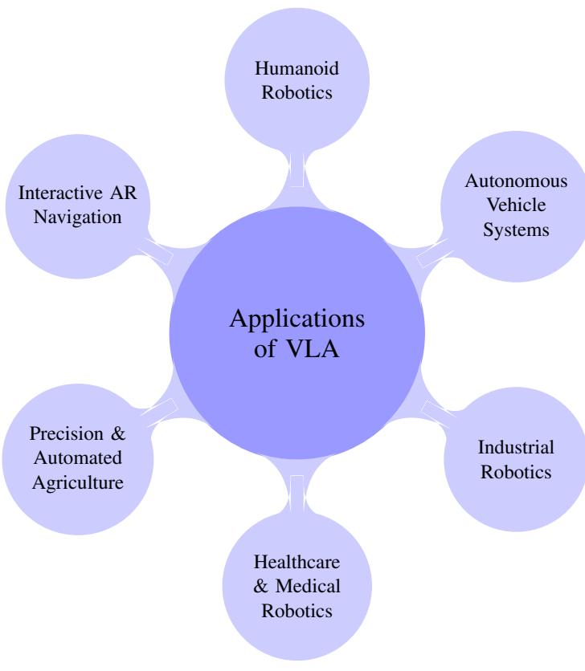  

Figure 11: Mind-map of application domains for VisionLanguage-Action models, with Humanoid Robotics positioned at the top and remaining domains arranged clockwise to match the order of discussion in this section.

Recent advances have significantly accelerated the deployment of VLAs in humanoid robotics. For example, Helix2, a humanoid robot developed by Figure AI, leverages a fully integrated VLA model to perform full-body manipulation at high frequency, controlling arms, hands, torso, and even fine-grained finger motion in real time. The architecture follows a dualsystem design: a multimodal transformer processes inputs such as language commands and vision streams, while a real-time motor policy outputs dense action vectors at $2 0 0 ~ \mathrm { H z }$ This allows Helix to generalize across previously unseen objects and tasks, adapting fluidly to changing environments without the need for task-specific retraining. The key advantage of VLAs in humanoid systems is their ability to scale across diverse tasks using shared representations [8]. Unlike traditional robotic systems that rely on taskspecific programming or modular pipelines, VLA-powered humanoids operate under a unified token-based framework. Vision inputs are encoded via pretrained vision-language models like DINOv2 or SigLIP, while instructions are processed using LLMs such as LLaMA or GPT-style encoders. These representations are fused into prefix tokens that capture the full context of the scene and task. Action tokens are then generated autoregressively, similar to language decoding, but represent motor commands for the robot's joints and end-effectors. This capability enables humanoid robots to operate effectively in human-centric spaces, such as households, hospitals, and retail environments. In domestic settings, VLA-powered robots can clean surfaces, prepare simple meals, or organize objects simply by interpreting voice commands [151, 296]. In healthcare, systems like RoboNurse-VLA [132] have demonstrated the ability to perform precise instrument handovers to surgeons using real-time voice and visual cues. In retail, humanoid platforms equipped with VLAs can assist with customer queries, restock shelves, and navigate store layouts without explicit pre-programming [8]. What distinguishes modern humanoid VLAs is their ability to run on embedded, low-power hardware, making real-world deployment viable. For instance, systems such as TinyVLA [242] and MoManipVLA [246] demonstrate efficient inference pipelines that run on Jetson-class GPUs, enabling mobile deployment without compromising performance. These models exploit techniques like diffusion-based policies, LoRA-based fine-tuning, and dynamic token caching to minimize compute cost while retaining high precision and generalization. In logistics and manufacturing, VLA-enabled humanoids are already making a commercial impact. Robots like Figure 01 are deployed in warehouses to perform repetitive, physically intensive tasks such as picking, sorting, and shelving alongside human workers. Their ability to handle novel object categories and dynamically changing scenes is powered by continual learning and robust multimodal grounding [252, 131]. As VLA models continue to advance in their capacity for diverse action generation, spatial reasoning, and real-time adaptation, humanoid robots are emerging as highly capable assistants across homes, industrial settings, and public spaces. Their strength lies in their ability to unify perception, language comprehension, and motor control through a shared token-based architecture enabling seamless, context-aware behavior in unstructured human environments.

For example, as depicted in the figure 12, consider 'Helix', a state-of-the-art humanoid robot equipped with a nextgeneration VLA model. When instructed verbally, "Please take the water bottle from the fridge," Helix activates its integrated perception system, where a foundation vision-language model (e.g., SigLIP or DINOv2) segments the visual scene to identify the refrigerator, its handle, and the bottle. The language input is processed by an LLM such as LLaMA-4, which tokenizes the instruction and fuses it with the visual context. This fused representation is passed to a hierarchical controller: the high-level policy plans the task sequence (locate handle, pull door, identify bottle, grasp), while a mid-level planner defines motor primitives, such as grasp type and joint trajectories. The low-level VLA controller, often based on diffusion policy networks, executes these actions with sub-second latency. Upon encountering variations (e.g., a tilted bottle or slippery grip), Helix's agentic AI module performs micro-policy refinement in real time, adjusting its grip based on feedback. This example illustrates the transformative potential of VLA-enabled humanoid. From kitchens to clinics, these systems not only interpret complex instructions and execute physical tasks with dexterity but also adapt to environmental unpredictability. By embedding agentic reasoning and safety alignment mechanisms, modern humanoid robots powered by VLAs are transitioning from narrow-task performers to generalist, trustworthy collaborators. As energy-efficient models like TinyVLA and MoManipVLA mature, deployment on mobile, low-power platforms becomes increasingly practical ushering in a new era of embodied, socially aligned AI.

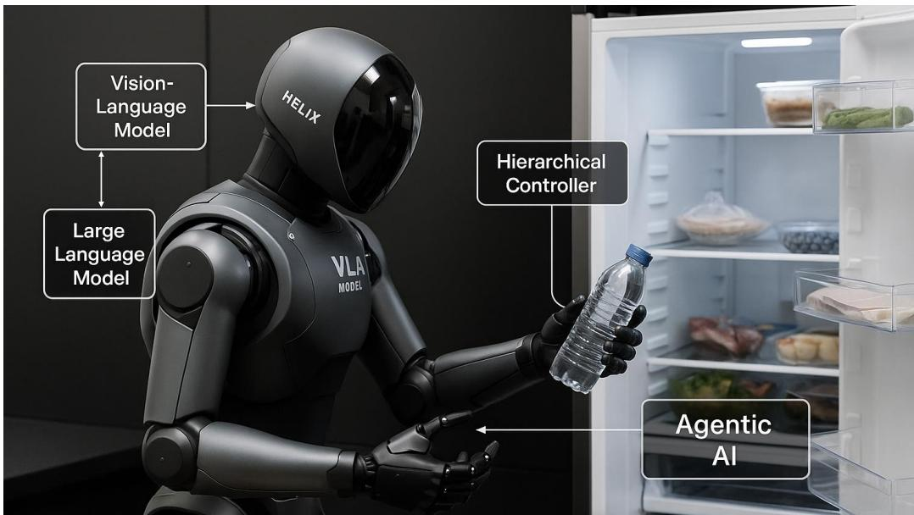  
H VLA VLA-based generalist robotics with dynamic task adaptation and safe, semantically grounded manipulation.

# 3.4.2. Autonomous Vehicle Systems

Autonomous vehicles (AVs), including self-driving cars, trucks, and aerial drones, represent a frontier application domain for VLA models, where safety-critical decision-making demands tightly coupled perception, semantic understanding, and real-time action generation. Unlike traditional modular AV pipelines that explicitly separate perception, planning, and control, VLA frameworks explore tighter architectural coupling by jointly processing visual observations, high-level semantic cues, and internal state representations within a unified model. While such end-to-end formulations have shown promising results in simulation and controlled benchmarks for instruction-conditioned navigation and reasoning, large-scale commercial systems (e.g., Tesla Autopilot (Source Link)) continue to rely on modular or hybrid pipelines, with recent industry efforts focusing on integrating vision-language reasoning components rather than fully deploying VLA-style action generation in safety-critical driving. VLA models empower AVs to comprehend complex environments beyond pixel-level object recognition. For instance, a self-driving car navigating an urban setting must detect traffic signs, understand pedestrian behavior, and interpret navigation commands such as "take the second right after the gas station." These tasks involve fusing visual and linguistic signals to understand spatial relationships, predict intent, and generate context-aware driving actions. VLAs encode this information through token-based representations, where visual encoders (e.g., ViT, CLIP), language models (e.g., LLaMA-4), and trajectory decoders operate in a coherent semantic space, enabling the vehicle to reason about high-level goals and translate them into low-level motion. A notable contribution in this direction is CoVLA [5], which provides a comprehensive dataset pairing over 80 hours of realworld driving videos with synchronized sensor streams (e.g., LiDAR, odometry), detailed natural language annotations, and high-resolution driving trajectories. This dataset enables training VLA models to align perceptual and linguistic features with physical actions. CoVLA employs CLIP for visual grounding, LLaMA-2 for instruction embedding, and trajectory decoders for motion prediction. This configuration allows AVs to interpret verbal cues (e.g., "yield to ambulance") and environmental conditions (e.g., merging traffic) to make transparent and safe driving decisions. OpenDriveVLA [293] advances the state of VLA modeling by integrating hierarchical alignment of 2D/3D multi-view vision tokens with natural language inputs. Its architecture leverages both egocentric spatial perception and external scene understanding to construct a dynamic agent-environment-ego interaction model. Through autoregressive decoding, OpenDriveVLA generates both action plans (e.g. steering angle, acceleration) and trajectory visualizations interpretable to humans. Its end-to-end framework achieves leading performance on public autonomous driving benchmarks, including planning and trajectory prediction tasks on the nuScenes and Waymo Open Motion datasets, as well as visionlanguage question-answering benchmarks for driving scenes, demonstrating strong robustness in urban navigation and behavioral prediction. Another seminal model, ORION [69], pushes the boundaries of closed-loop autonomous driving by incorporating a QT-Former to retain long-horizon visual context, an LLM to reason over traffic narratives, and a generative trajectory planner. ORION excels at aligning the discrete reasoning space of vision-language models with the continuous control space of AV motion. This unified optimization results in accurate visual question answering (VQA) and trajectory planning, crucial for scenarios involving ambiguous human instructions or occluded obstacles (e.g., "take the exit behind the red truck").

For example, as depicted in Figure 13, consider an autonomous delivery vehicle, "AutoNav," operating in a dense urban environment using a next-generation VLA architecture. As AutoNav receives a cloud-based instruction "Drop off the package near the red awning beside the bakery, then return to base avoiding construction zones", its onboard VLM (e.g., CLIP or SigLIP) parses the visual stream from multiple cameras, identifying dynamic landmarks such as bakery signs, red awnings, and traffic cones. Simultaneously, the LLM module grounded in LLaMA-4 decodes the instruction and fuses it with real-time sensory context including LiDAR, GPS, and inertial odometry. A hierarchical control stack processes these multi-modal signals via an autoregressive VLA decoder that integrates egocentric views and world-centric maps to plan adaptive paths. As the vehicle approaches the delivery location, unexpected pedestrian activity prompts an agentic submodule to trigger trajectory replanning using a reinforcement learning-inspired policy refinement routine. At the same time, AutoNav audibly warns pedestrians and recalibrates its speed to maintain safety margins. This interplay of semantic understanding, perceptual grounding, and adaptive control exemplifies the power of VLA-based systems in achieving interpretable, human-aligned behavior in safety-critical scenarios. This scenario illustrates how tightly integrated VLA architectures can surpass traditional perception-planning-control pipelines by enabling end-to-end semantic reasoning, rapid cross-module adaptation, and interpretable decision making. Unlike modular pipelines, where perception outputs, planner updates, and control adjustments are handled by loosely coupled components with limited semantic feedback, the VLAbased system jointly reasons over language intent, visual context, and embodied state, allowing it to dynamically replan trajectories, communicate safety-relevant intentions to humans, and adjust control policies in real time. As a result, the system exhibits greater autonomy, improved transparency through human-interpretable outputs, and enhanced decision-making agility in safety-critical environments. In aerial robotics, VLAs enhance the capabilities of drones or UAVs in delivery and other tasks. Models such as UAVVLA [191] combine satellite imagery, natural language mission descriptions, and onboard sensing to execute high-level commands (e.g., "deliver to the rooftop pad with the blue tarp"). These systems use modular VLA architectures, where a visionlanguage planner parses global context and a flight controller executes precise waypoints, supporting applications in logistics, disaster response, and military reconnaissance.

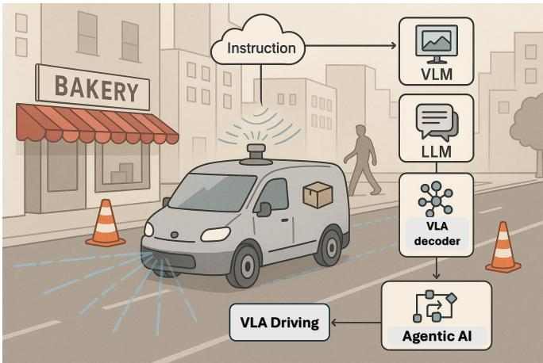  

Figure 13: This illustration depicts an autonomous delivery vehicle powered by a VLA system, integrating VLMs for visual grounding, LLMs for instruction parsing, and a VLA decoder for path planning. Agentic AI enables adaptive trajectory refinement in dynamic environments, exemplifying how multi-modal integration drives safe, interpretable, and autonomous decision-making in realworld navigation tasks.

As autonomous systems increasingly operate in unstructured environments, VLAs provide a scalable, interpretable, and dataefficient alternative to traditional pipelines. By learning from large-scale multimodal datasets and modeling decision-making as token prediction, VLAs align human-level semantics with robotic motion, paving the way for safer, smarter autonomous driving and navigation technologies.

# 3.4.3. Industrial Robotics

Industrial robotics is undergoing a paradigm shift with the integration of VLA models, enabling a new generation of intelligent robots capable of high-level reasoning, flexible task execution, and natural communication with human operators [32, 7]. Traditional industrial robots typically operate in highly structured environments using rigid programming, often requiring extensive reconfiguration and manual intervention when adapting to new assembly lines or product variants [6, 182]. Such systems lack the semantic grounding and adaptability required for modern dynamic manufacturing settings. VLA models, by contrast, offer a more human-interpretable and generalizable framework. Through the joint embedding of visual inputs (e.g., component layout or conveyor belt state), natural language instructions (e.g., "tighten the screw on the red module"), and robot state, VLAs can infer context and execute appropriate control commands in real-time [135, 72, 156]. Vision transformers (e.g., ViT, DINOv2), LLMs (e.g., LLaMA-4), and autoregressive or diffusion-based action decoders form the backbone of these systems, allowing the robot to parse multimodal instructions and perform actions grounded in its environment. One of the most significant contributions in this domain is CogACT [131], a modular VLA framework explicitly designed for industrial robotic manipulation. Unlike early VLAs that relied on frozen language-vision embeddings followed by direct action quantization, CogACT introduces a diffusion-based action transformer that models action sequences more robustly and adaptively. The system uses a visual-language encoder (e.g., Prismatic-7B) to extract high-level scene and instruction embeddings, which are then passed to a diffusion transformer (DiT-Base) to generate fine-grained motor actions. This modular separation enables superior generalization to unseen tools, parts, and layouts while preserving interpretability and robustness under real-world constraints. Furthermore, CogACT demonstrates rapid adaptation across different robot embodiments such as 6-DoF arms or bimanual systems through efficient fine-tuning, making it suitable for deployment across heterogeneous factory environments [131]. Empirical evaluations show that CogACT outperforms prior models like OpenVLA by over $28 \%$ in real-world task success rates [122], especially in complex, high-precision tasks such as multi-step assembly, screw fastening, and part sorting [131, 262]. As manufacturing shifts toward Industry 4.0 paradigms, VLAs promise to reduce programming overhead, support voice-commanded robot programming, and facilitate real-time human-robot collaboration on mixed-initiative tasks. While execution precision, safety guarantees, and latency optimizations remain areas of active research, the use of VLA models marks a substantial step toward autonomous, intelligent, and adaptable robots transforming the factories.

# 3.4.4. Healthcare and Medical Robotics

Healthcare and medical robotics represent a high-stakes domain where precision, safety, and adaptability are critical qualities that VLA models are increasingly well-suited to provide [132, 193]. Traditional medical robotic systems rely heavily on teleoperation or pre-programmed behaviors [166, 204], limiting their autonomy and responsiveness in dynamic surgical or care environments. In contrast, VLA models offer a flexible framework that integrates real-time visual perception, language comprehension, and fine-grained motor control, enabling medical robots to understand high-level instructions and autonomously perform intricate procedures or assistance tasks [131, 54, 225].

In surgical robotics, VLAs can dramatically enhance capabilities in minimally invasive surgeries [50, 230]. These systems can fuse laparoscopic video feeds [127], anatomical maps [147, 50], and voice commands into a unified tokenized representation using vision encoders (e.g., ViT, SAM-2) and language models (e.g., LLaMA, T5) [236]. For instance, as depicted in Figure 14a, in a task like "apply a suture to the left coronary artery," the vision module identifies the anatomical target, while the language module contextualizes the instruction. The action decoder then translates the fused semantic embedding into stepwise motion commands with submillimeter precision. This closed-loop fusion of visual perception, language-grounded intent, and action-level control enables the robot to adaptively reposition tools, apply dynamic force feedback, and avoid critical anatomical structures, thereby reducing the need for surgeon micromanagement and minimizing the risk of human error.

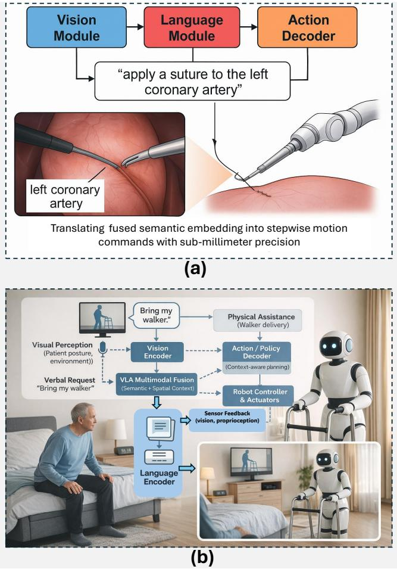  

Figure 14: a) This figure illustrates a VLA surgical system executing the task "apply a suture to the left coronary artery." The vision module identifies anatomical targets, the language model interprets the instruction, and the action decoder generates precise motor commands, enabling adaptive tool control, real-time feedback, and safe autonomous operation; b) A VLA-powered assistive robot perceives patient behavior, processes verbal requests (e.g., "bring my walker"), and autonomously executes context-aware motion plans, enabling real-time assistance in eldercare, rehabilitation, and hospital logistics without relying on predefined scripts or manual oversight.

Beyond the operating room, VLA models are powering a new generation of patient-assistive robots in elderly care, rehabilitation, and hospital logistics. These systems can autonomously perceive patient behavior, understand spoken or gestural input, and execute responsive tasks such as retrieving medication, guiding mobility aids, or notifying caregivers during emergencies. For example, as depicted in Figure 14b, a VLA-enabled robot can visually detect a patient attempting to rise from bed, interpret a verbal request such as "bring my walker," and generate a context-appropriate motion plan to assist without predefined scripts or constant supervision. Recent VLA frameworks such as RoboNurse-VLA [132] highlight the real-world feasibility of this approach. RoboNurse employs SAM-2 for semantic scene segmentation and LLaMA2 for command comprehension, integrated into a real-time voice-to-action pipeline that enables robots to assist with surgical instrument handovers in operating rooms [132]. The system demonstrates robustness to diverse tools, varied lighting conditions, and noisy environments - common challenges in clinical settings. Additionally, VLA architectures offer advantages in explainability and auditability, both critical in regulated medical domains [224, 146]. Scene grounding and trajectory prediction can be visualized and reviewed post-hoc [278], which could facilitate clinical trust and enabling FDA-style validation pipelines. LoRA-based fine-tuning allows adaptation to specific hospital environments or procedural workflows with minimal data and computational infrastructure [9, 229, 147]. Importantly, the multi-modal foundation of VLA models enables cross-domain transferability: the same model trained on surgical tool manipulation can be adapted to patient mobility tasks with modest retraining [56]. This modularity significantly reduces development time and cost compared to task-specific automation systems [94]. As medical robotics transitions from teleoperated assistance to semi-autonomous and collaborative systems, VLA models stand at the core of this transformation. As also discussed earier in other application areas, VLA's capability in combining high-level semantic understanding with low-level control is instrumental to provide a unified solution for scalable, human-aligned, and adaptive robotic healthcare [249, 295, 279]. As healthcare systems face increasing demand and workforce shortages, VLA-driven robotics will play a crucial role in enhancing medical precision, operational efficiency, and patient-centered care.

# 3.4.5. Precision and Automated Agriculture

As illustrated in Figure 15, VLA models are emerging as transformative tools in precision and automated agriculture, offering intelligent, adaptive solutions for labor-intensive tasks across diverse farming landscapes [70, 191]. Unlike traditional agricultural automation systems that depend on rigid, sensor-driven pipelines requiring manual reprogramming for each task or environmental variation [220, 108], VLAs integrate multi-modal perception, natural language understanding, and real-time action generation within a unified framework [168, 84]. This unified multimodal integration enables autonomous ground robots and drones to interpret complex field scenes, follow spoken or text-based farming instructions, and generate context-aware actions such as selective fruit picking or adaptive irrigation. The ability of VLAs to dynamically adjust to occlusions, terrain irregularities, lighting variability, or varying crop types combined with training on synthetic, photorealistic datasets allows them to generalize across crop types, geographies and seasons. By leveraging action tokenization [245], transformer-based policy generation [12, 85], and techniques like LoRA fine-tuning [93], these systems are redefining the scalability and intelligence of agricultural robotics for sustainable and precision-driven farming. In modern fruit orchards and other crop fields, VLAs can process visual inputs from RGB-D cameras, multispectral sensors, or drones to monitor plant growth, detect diseases, and identify nutrient deficiencies. Vision transformers (e.g., ConvNeXt, DINOv2) encode spatial and semantic information from visual scenes, while LLMs (e.g., T5, LLaMA) parse natural language commands such as "inspect the east plot for powdery mildew" or "harvest ripe apples near the irrigation trench." Through token fusion, these modalities are aligned in a shared representation space, allowing robots to execute fine-grained, contextaware actions with precision. For instance, in fruit-picking tasks, as illustrated in Figure 15, a VLA-equipped ground robot can identify ripe produce using image-based ripeness cues, interpret user-specified criteria such as "pick only Grade A fruits," and execute motion sequences via action tokens that control its end-effector. This approach ensures minimal crop damage, optimizes pick rates, and allows real-time adaptation to unexpected variables like occlusions or terrain shifts. In irrigation management, drones guided by VLA models can interpret field maps and verbal instructions to selectively water stressed zones, reducing water usage $\%$ . Beyond immediate task execution, VLA models are expected to support dynamic reconfiguration and lifelong learning through closed-loop feedback mechanisms. In particular, execution outcomes, sensory observations, and task success signals collected during deployment can be logged and periodically incorporated into offine or incremental updates of the VLA policy. When combined with synthetic training data generated from photorealistic simulations of crop environments (e.g., 3D orchard renderings), such feedback-driven adaptation may enable models to progressively improve robustness to new crop varieties, pest conditions, and seasonal variations without extensive manual annotation. Parameter-efficient techniques such as LoRA adapters and diffusion-based policy refinement are anticipated to play a key role in facilitating this continual adaptation while limiting computational overhead. Overall, the integration of VLA models into agricultural workflows is expected to offer several long-term benefits, including reduced reliance on skilled manual labor, improved yields through targeted intervention, and enhanced environmental sustainability via optimized input usage. As global food systems increasingly face climate variability and resource constraints, VLA-enabled agricultural technologies are anticipated to contribute to scalable, intelligent, and context-aware farming practices that better accommodate real-world complexity.

# 3.4.6. Interactive AR Navigation with Vision-Language-Action Models

Interactive Augmented Reality (AR) navigation represents a frontier where VLA models can significantly enhance humanenvironment interaction by providing intelligent, context-aware guidance in real-time [31, 104, 255]. In this paradigm, VLAs process continuous streams of visual data from AR-enabled devices such as smart glasses or smartphones alongside natural language queries to generate dynamic navigational cues overlaid directly onto the user's view of the physical world. Unlike traditional GPS-based systems that rely on rigid maps and limited user input [29, 207], VLA-based AR agents interpret complex visual scenes (e.g., intersections, indoor hallways, signage) and respond to free-form instructions such as "take me to the nearest pharmacy with a wheelchair ramp" or "show the quietest route to the conference room." Technically, these models integrate a vision encoder (.g, ViT, DINOv2) that extracts scene representations from RGB camera frames, a language encoder (e.g., T5 or LLaMA) that processes user prompts or voice commands, and an action decoder that predicts tokenized navigation cues such as directional overlays, waypoints, or voice instructions. A transformer-based architecture fuses these modalities to reason about both the spatial layout and semantic intent, allowing the AR agent to adaptively highlight paths, landmarks, and hazards directly within the user's field of view [211, 165]. For example, as shown in Figure 16, in a crowded airport, the VLA agent could visually identify escalators, gates, or baggage claims while understanding a query like "how do I reach Gate 22 without stairs?", adjusting the route in response to real-time occupancy and obstacles.

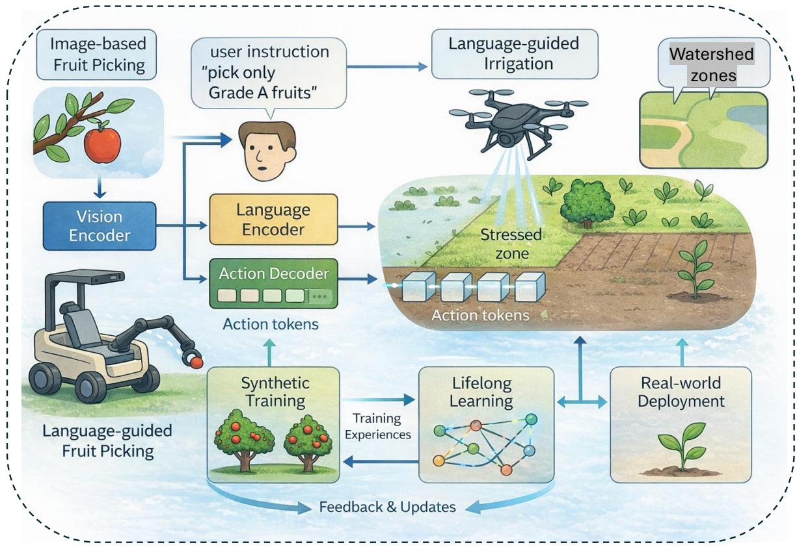  
agricultural automation.

VLAs are expected to support interactive instruction loops in which users can first issue high-level commands (e.g., "navigate to the pharmacy") and subsequently refine them with additional constraints such as "avoid busy areas" or "take the scenic route." Through context-aware feedback and iterative clarification, such interaction paradigms can improve accessibility and usability for visually impaired or cognitively challenged individuals. In logistics and indoor navigation, these systems can be integrated with IoT sensors and digital twins to guide warehouse workers, maintenance teams, or delivery robots through complex environments. Furthermore, personalized navigation can be achieved through continual fine-tuning, where VLA models learn user preferences and local spatial layouts over time.

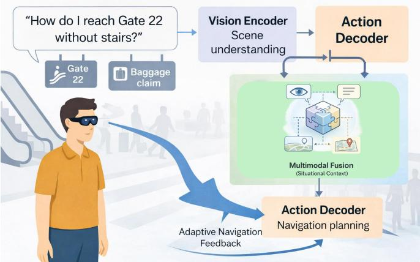  

Figure 16: Showing how VLA models enable interactive AR navigation by fusing real-time visual perception, language understanding, and action planning. In dynamic environments such as airports, VLAs interpret user queries like "avoid stairs to Gate 22," analyze visual scenes (e.g., detecting escalators), and adjust navigational paths accordingly, supporting personalized, accessible, and context-aware mobility guidance.

As AR hardware becomes more affordable and integrated into daily life, VLA-powered navigation systems will enable seamless spatial understanding, multi-modal interaction, and autonomous guidance in public, industrial, and assistive contexts redefining how humans perceive, explore, and interact with physical spaces.

# 4. Challenges and Limitations of Vision-Language-Action Models

VLA models face a spectrum of interrelated challenges that impede their translation from research prototypes to robust, real-world systems. First, achieving real-time, resource-aware inference remains difficult: models like DeeR-VLA leverage dynamic early-exit architectures to cut computation $5 { - } 6 \times$ on manipulation benchmarks while preserving accuracy, yet their gains diminish in complex scenarios [269]. Similarly, UniNaVid compresses egocentric video tokens for $5 \ \mathrm { H z }$ navigation but still struggles under highly ambiguous instructions and longer horizons [280]. Moreover, these efficiency-driven designs often expose a trade-off between computational speed and representational coverage. When operating under aggressive compression or early-exit constraints, even advanced hybrid visionlanguage grounding methods exhibit limited object generalization; for example, ObjectVLA generalizes to only $64 \%$ of novel objects, highlighting how real-time optimization can exacerbate gaps in open-world robustness [297]. Second, adapting VLA models with minimal supervision and ensuring stable policy updates under scarce, noisy data is nontrivial. ConRFT combines behavior cloning and Qlearning with human-in-the-loop fine-tuning to rapidly converge to $9 6 . 3 \%$ success over eight contact-rich tasks, yet it relies heavily on expert interventions and reward shaping [36]. Hierarchical frameworks such as Hi Robot decouple high-level reasoning from low-level execution to improve instruction fidelity, but coordinating these modules and grounding ambiguous feedback remains challenging [199]. Likewise, Tactile-languageaction model model's fusion of tactile streams with language commands achieves over $85 \%$ success on unseen peg-in-hole tasks, but dataset breadth and real-time multi-step decoding still limit broader generalization [88].

Furthermore, ensuring safety, generalization, and end-to-end reliability in dynamic environments demands new modeling and evaluation standards. Occupancy-Language-Action models like OccLLaMA unify 3D scene understanding with action planning, yet they need to scale to richer scene dynamics and semantic consistency across modalities [239]. RaceVLA advances high-speed drone navigation through quantized, iterative control loops; however, its limited visualphysical generalization compared to larger VLAs and dedicated reasoning models raises safety concerns in unseen or rapidly changing environments [195]. Model-merging strategies in ${ \mathrm { R e V L A } }$ recover lost out-of-domain visual robustness improving oriented object detection (OOD) grasp success by up to $77 \%$ but introduce extra computation and complexity [48]. Finally, SafeVLA formulates constraints via constrained Markov decision processes to cut unsafe behavior by over $80 \%$ , yet defining comprehensive, non-restrictive safety rules for diverse real-world tasks remains an open problem [274]. Addressing these intersecting limitations is critical for VLA models to achieve reliable, autonomous operation under the full complexity of real-world robotics.

Building upon the critical limitations outlined above, it is imperative to map each challenge to targeted mitigation strategies and assess their system-level impact. Table 4 presents this map identifying core limitations, potential technical remedies drawn from recent advances, and articulating the anticipated benefits for real-world VLA deployment. For instance, addressing real-time inference constraints leverages parallel decoding and quantized transformer pipelines with hardware acceleration (e.g., TensorRT) to sustain control loop speed in drones and manipulators [129, 122, 75, 142]. Addressing multi-modal action representation via hybrid diffusion—autoregressive policies enriches a model's capacity to produce varied, contextsensitive motor commands for complex tasks [171, 156]. To guarantee safety in open worlds, dynamic risk assessment modules and adaptive planning layers can be integrated, ensuring robust emergency stop behaviors in unpredictable settings [183, 233, 113]. Similarly, dataset bias and grounding can be minimized through curated debiased corpora and advanced contrastive fine-tuning, strengthening fairness and semantic fidelity when generalizing to novel objects and scenes [185, 17, 175]. Together, these strategies and other approaches spanning simulation-to-real transfer, tactile integration, and energy-efficient architectures frame a comprehensive roadmap for transitioning VLA research into reliable, scalable autonomy. The remainder of this section is organized into five focused subsections, each examining a distinct cluster of VLA challenges identified in the literature. First, we analyze realtime inference constraints and the emerging methods to address them. Next, we explore multi-modal action representation alongside safety assurance in open-world settings. We then discuss dataset bias, grounding strategies, and generalization to unseen tasks, followed by an exploration of system integration complexity and computational demands. Finally, we consider robustness and the ethical implications of deploying VLAs in real-world applications.

# 4.1. Real-Time Inference Constraints

Despite recent progress, deploying VLA models in latencycritical settings continues to be constrained by real-time inference requirements, particularly in applications such as robotic manipulation, autonomous driving, and aerial control. VLAs typically depend on autoregressive decoding strategies, which sequentially generate action tokens based on previous predictions. While effective for many tasks, this autoregressive decoding paradigm substantially limits inference speed, typically achieving only $3 { - } 5 \mathrm { H z }$ when deployed on standard GPU-based research platforms (e.g., single high-end consumer or datacenter GPUs) for end-to-end VLA inference [67]. This rate remains substantially below the control frequencies typically required for responsive and stable robotic operation, which often range from tens of hertz for high-level planning to higher update rates for low-level feedback control, depending on the task and hardware platform. For instance, when a robotic arm manipulates delicate objects, frequent positional updates are essential to maintain accuracy and prevent damage. Models such as OpenVLA [122] and Pi-0 [15] face inherent challenges with this sequential token generation approach, thereby limiting their effectiveness in dynamic environments. able 4: Challenges, potential solutions, and expected impact of VLA models   

<table><tr><td colspan="2">Challenge / limitation</td><td>Potential solution</td><td>Expected impact</td></tr><tr><td colspan="2">Real-time inference straints</td><td>Parallel decoding, quantized transformers, and hardware acceleration I (e.g., TensorRT) [129, 122]; reduce autoregressive overhead [75, 142].</td><td>Enables real-time control and deployment in latency-critical domains [251, 191] (e.g., UAVs, manipulators).</td></tr><tr><td colspan="2">Multi-modal action represen- tation</td><td>Hybrid tokenization combining diffusion and autoregressive policies [171]; train on diverse demonstrations and multi-modal outputs [156].</td><td>Improves performance on complex, dynamic manipulation with mul- tiple valid solution modes [74].</td></tr><tr><td colspan="2">Safety assurance in open worlds</td><td>Dynamic risk assessment modules [183, 233]; low-latency emergency- stop and adaptive planning layers [113].</td><td>Improves reliability and safety in unpredictable settings (homes, fac- tories, healthcare); enhances user acceptability.</td></tr><tr><td colspan="2">Dataset bias and grounding</td><td>Curate diverse/debiased datasets [185]; stronger grounding (e.g., CLIP fine-tuning with hard negatives) [282, 17].</td><td>Improves fairness and semantic fidelity [109], and enhances general- ization to novel real-world inputs [227, 288, 175].</td></tr><tr><td colspan="2">Limited 3D perception and reasoning</td><td>clouds with visionlanguage features.</td><td>complex environments [129].</td></tr><tr><td colspan="2">Cross-embodiment general- ization</td><td>Train across diverse morphologies; learn embodiment-agnostic action abstractions; apply cross-domain adaptation [266].</td><td>Facilitates policy transfer across robot platforms and configurations [279, 122].&quot;</td></tr><tr><td colspan="2">Annotation complexity and cost</td><td>Weak supervision, active learning, and synthetic data generation to re- duce manual labeling [148].</td><td>Lowers development cost and accelerates scaling to new tasks/domains [233, 286].</td></tr><tr><td colspan="2">Sim-to-real transfer gap</td><td>Domain adaptation, sim-to-real fine-tuning, and real-world calibration [210, 134].</td><td>Improves reliability and consistency when deploying beyond simula- tion [4, 66].</td></tr><tr><td colspan="2">Integration of physical knowl- edge</td><td>  training pipelines [53].</td><td>[106].</td></tr><tr><td colspan="2">Multi-modal integration (tac- tile, audio)</td><td>Fuse tactile/audio with vision and language [114]; extend multimodal transformer fusion.</td><td>Improves robustness under occlusion/ambiguity and expands the task repertoire [76, 136, 91].</td></tr><tr><td colspan="2">Long-horizon multi-stage tasks</td><td>Hierarchical policies, memory-augmented networks, and trajectory planning modules [136].</td><td>Improves sequential planning, memory, and compositional execution [131, 286, 227, 175].</td></tr><tr><td colspan="2">System integration complexity</td><td>Unified transformer backbones [289]; temporal alignment and sim-to- real transfer strategies [163, 277].</td><td>Enables tighter planning-control coordination and more robust trans- fer to physical robots [187, 208].</td></tr><tr><td colspan="2">Energy and compute demands</td><td>tors.</td><td></td></tr><tr><td colspan="2">Generalization to unseen taks</td><td> , agnostic pretraining [173, 146].</td><td>242, 286].</td></tr><tr><td colspan="2">Robustness to environmental variability</td><td>online recalibration [156].</td><td>ics [285, 242].</td></tr><tr><td colspan="2">Ethical and societal implica- tions</td><td>Privacy via on-device processing/anonymization [149, 198, 252, 34]; fairness audits; regulatory and trust frameworks.</td><td>Promotes equitable and trustworthy adoption across social, medical, and labor domains [160, 180, 217, 172].</td></tr></table>

Emerging solutions such as parallel decoding, exemplified by NVIDIA's GR00T N1 model [14], aim to accelerate inference by predicting multiple tokens simultaneously. GR00T N1 achieves approximately a $2 . 5 2 \times$ speedup over traditional decoding methods; however, this parallelism often introduces tradeoffs in trajectory smoothness, resulting in suboptimal robot movements. Such movements are undesirable in sensitive applications like surgical robotics, where precision, adaptability and flexibility are paramount. Thus, achieving rapid inference without compromising output quality remains an open challenge. Additionally, hardware limitations exacerbate real-time inference constraints. For example, processing high-dimensional visual embeddings, typically involving over 400 vision tokens at 512 dimensions each, requires approximately $1 . 2 \mathrm { G B } / \mathrm { s }$ memory bandwidth. This demand significantly exceeds the capacity of current embedded systems or edge-AI hardware such as NVIDIA Jetson platforms, thereby restricting practical deployment [82, 275]. Even with efficient quantization techniques, which reduce the precision of floating-point operations to alleviate memory constraints, models frequently experience accuracy degradation, especially in tasks demanding sub-millimeter precision, such as bimanual robotic manipulation or medical robotics.

# 4.2. Multi-modal Action Representation and Safety Assurance

Multi-modal Action Representation: One significant limitation of current VLA models is accurately representing multimodal actions, particularly in scenarios requiring continuous and nuanced control [62, 46]. Traditional discrete tokenization methods, such as those dividing actions into 256 distinct bins, inherently lack precision, creating substantial errors in fine-grained tasks like delicate robotic grasping or intricate surgical procedures [171]. For instance, during precise robotic manipulation in assembly tasks, discrete representations can result in misaligned or imprecise actions, undermining performance and reliability. On the other hand, continuous multilayer perceptron (MLP) based approaches face the risk of mode collapse [162, 232], where models converge prematurely to single action trajectories, despite multiple viable paths available. This diminishes the flexibility necessary for adaptive decision-making in highly dynamic environments. Emerging diffusion-based policies, exemplified by models like Pi-Zero and RDT-1B [144], offer richer multi-modal action representation capable of capturing diverse action possibilities. However, their substantial computational overhead, approximately three times that of conventional transformer-based decoders, renders them impractical for real-time deployment. Consequently, VLA models currently struggle with complex dynamic tasks, such as robotic navigation in densely crowded spaces or sophisticated bimanual manipulations [74, 247], where multiple strategic actions may be equally valid and contextually dependent. Safety Assurance in Open World: Another critical challenge facing VLAs is ensuring robust safety in dynamic, unpredictable environments characteristic of real-world scenarios [39, 274]. Many current implementations depend heavily on predefined, hardcoded force and torque thresholds, significantly constraining their adaptability in encountering unforeseen or novel conditions, such as unexpected obstacles or sudden environmental changes [156]. Models used for collision prediction typically attain only about $82 \%$ accuracy in cluttered and dynamic spaces, posing serious risks in applications such as warehouse logistics or household robotics, where safety margins are minimal [288, 122]. Moreover, the essential safety mechanisms like emergency stops incorporate substantial latency often between 200 and 500 milliseconds due to comprehensive safety verifications [170, 122]. This delay, although seemingly minor, can prove hazardous in high-speed operations or critical interventions, such as automated driving or emergency robotic responses.

# 4.3. Dataset Bias, Grounding, and Generalization to Unseen Tasks

A significant obstacle limiting the effectiveness of VLA models is the pervasive presence of dataset bias and grounding deficiencies. Current training datasets, predominantly sourced from web-crawled repositories, frequently exhibit inherent biases [214, 119]. Studies indicate that approximately $17 \%$ of the associations within standard datasets are skewed toward stereotypical interpretations, such as disproportionately associating terms like "doctor" with male figures [222, 124]. These biases propagate through training, resulting in VLAs that produce semantically misaligned or contextually inappropriate responses when deployed in diverse environments. For instance, models such as OpenVLA have been documented to overlook approximately $23 \%$ of object references in novel settings, significantly limiting their practical utility in real-world applications where accurate interpretation of instructions is critical [122]. This grounding issue also extends to challenges in compositional generalization, where VLAs often fail when encountering rare or unconventional combinations, such as interpreting a phrase like "yellow horse" because of underrepresentation in training corpora. These shortcomings highlight an urgent need for carefully curated, balanced, and comprehensive, domainspecific datasets, coupled with advanced grounding algorithms designed to mitigate biases and enhance semantic alignment across varied contexts. Complementing the challenges posed by dataset bias is the broader issue of generalization to unseen tasks, a critical barrier for the practical deployment of VLAs. While existing models demonstrate proficiency in familiar environments or tasks similar to their training scenarios, their performance significantly degrades, often by as much as $40 \%$ , when encountering entirely novel tasks or unfamiliar variations. For example, a VLA trained specifically on domestic tasks may struggle or fail when introduced into industrial or agricultural settings, largely due to discrepancies in object types, environmental dynamics, and operational constraints. This limitation arises primarily from overfitting to narrowly scoped training distributions and insufficient exposure to diverse task representations. Consequently, current VLAs exhibit limited generalization in zero-shot or few-shot learning scenarios, impeding their adaptability and scalability.

# 4.4. System Integration Complexity and Computational Demands

Integrating VLA models within dual-system architectures, which combine high-level cognitive planning (System 2) and real-time physical control (System 1), presents significant complexity in robotic applications. A primary challenge arises from temporal mismatches between these two systems. Typically, System 2 leverages LLMs such as GPT or LLaMA-4 for complex task decomposition and strategic planning. These models, due to their substantial computational requirements, often incur inference latencies on the order of ${ \sim } 8 0 0 \mathrm { m s }$ or more when executed on standard GPU-based inference platforms (e.g., single high-end consumer or datacenter GPUs) commonly used for LLM deployment. Conversely, System 1 components responsible for low-level motor execution typically run within tightly constrained control loops implemented on real-time CPUs, microcontrollers, or dedicated robot controllers, where update intervals on the order of several milliseconds are common, depending on the platform and task. This stark discrepancy in operational cadence leads to synchronization difficulties, causing delays and potentially suboptimal execution trajectories. For example, NVIDIA's GR00T N1 model demonstrates an effective integration of these two systems but still suffers from occasional jerkiness in motion due to asynchronous interaction, highlighting this intrinsic challenge. Furthermore, the feature space misalignment between highdimensional vision encoders, such as Vision Transformers (ViT), and lower-dimensional action decoders exacerbates integration complexity. When attempting to reconcile these disparate embeddings, the coherence between perceptual understanding and actionable commands can deteriorate significantly. OpenVLA [122] and RoboMamba [143], which utilize transformer-based visual processing and subsequent action decoding, illustrate these integration challenges resulting in diminished performance when ported from simulation environments to physical hardware deployments. Such discrepancies may lead to reduction in performance, primarily due to mismatches between simulated dynamics and real-world sensor noise or calibration issues[122, 49, 92]. Energy and compute demands constitute another significant barrier for VLA deployment, particularly in edge computing contexts typical of autonomous drones, mobile robots, and wearable robotic systems. The substantial parameter counts typical of advanced VLAs (e.g.,models possessing upwards of 7 billion parameters) necessitate computational resources often exceeding 28 GB of VRAM in their native form. These requirements are substantially higher than the capabilities of most current edge-oriented processors and GPUs, restricting the practical applicability of sophisticated VLAs outside specialized, high-resource environments.

# 4.5. Robustness and Ethical Challenges in VLA Deployment

A central barrier to the real-world deployment of VLA models lies in their limited robustness to environmental variability, which in turn raises important ethical and safety considerations. Environmental robustness refers to a system's ability to sustain reliable perception, reasoning, and action generation under dynamically changing and partially observable conditions. In practice, real-world environments introduce significant uncertainty through factors such as fluctuating illumination, adverse weather, sensor noise, and object occlusions. Empirical evidence highlights these limitations across multiple VLA components. For example, vision modules employed in systems such as OpenDriveVLA [293] experience accuracy degradations of approximately $2 0 { - } 3 0 \%$ in low-contrast or shadow-dominated scenes, reflecting the sensitivity of current visual encoders to challenging lighting conditions. Similarly, language understanding in VLAs such as CoVLA [5] deteriorates in acoustically noisy or semantically ambiguous settings, where instruction misinterpretation can propagate into incorrect action execution. In manipulation-centric scenarios, VLA-enabled robotic systems like RoboMamba [143] struggle in cluttered environments, frequently misestimating the pose or orientation of partially occluded objects and thereby reducing task success rates. These robustness limitations have direct ethical implications in safety-critical deployments, as performance degradation under real-world variability can lead to unintended behaviors, reduced reliability, and loss of user trust. Addressing robustness is therefore not only a technical challenge but also a prerequisite for responsible and ethical deployment of VLA systems in human-centered environments.

# 5. Discussion

As illustrated in Figure 17, VLA models face a multifaceted set of challenges that span algorithmic, computational, and ethical dimensions. First, achieving real-time inference on resource-constrained hardware remains difficult due to the sequential nature of autoregressive decoders and the high dimensionality of multi-modal inputs. Second, fusing vision, language, and action into coherent policies introduces safety vulnerabilities when encountering unanticipated environmental changes. Third, dataset bias and grounding errors compromise generalization, often causing models to fail on outof-distribution tasks. Fourth, integrating diverse components perception, reasoning, and control yields complex architectures that are hard to optimize and maintain. Fifth, the energy and compute demands of large VLA systems hinder the deployment on embedded or mobile platforms. Finally, limited robustness to environmental variability can result in unsafe or unreliable behavior, which in turn raises ethical and regulatory concerns related to safety assurance, accountability, privacy, and bias mitigation. Collectively, these limitations constrain the practical adoption of VLA models in real-world robotics, autonomous systems, and interactive applications. The potential solutions to these challenges are discussed below.

# 5.1. Potential Solutions

Real-Time Inference Constraints. Future research must develop VLA architectures that harmonize latency, throughput, and task-specific accuracy. One promising direction is the integration of specialized hardware accelerators such as FPGA-based vision processors and tensor cores optimized for sparse matrix operations to execute convolutional and transformer layers at sub-millisecond scales [122, 129]. Model compression techniques like Low-Rank Adaptation (LoRA) [93] and knowledge distillation can shrink parameter counts by up to $90 \%$ , reducing both memory footprint and inference time while retaining over $9 5 \%$ of original performance on benchmark tasks. Progressive quantization strategies that combine mixed-precision arithmetic (e.g., FP16/INT8) with blockwise calibration can further cut computation by $2 { - } 4 \times$ with minimal accuracy loss [121]. Adaptive inference architectures that dynamically adjust network depth or width based on input complexity akin to early-exit branches in DeeR-VLA [269] can reduce average compute by selectively bypassing transformer layers when visual scenes or linguistic commands are simple. Finally, efficient tokenization schemes leveraging subword patch embeddings and dynamic vocabulary allocation can compress visual and linguistic input into compact representations, minimizing token counts without sacrificing semantic richness [171]. Together, these innovations can enable sub$5 0 ~ \mathrm { m s }$ end-to-end inference on commodity edge GPUs, paving the way for latency-sensitive applications in autonomous drone flight, real-time teleoperation, and collaborative manufacturing.

• Multi-modal Action Representation and Safety Assurance. Addressing multi-modal action representation and robust safety requires end-to-end frameworks that unify perception, reasoning, and control under stringent safety constraints. Hybrid policy architectures combining diffusion-based sampling for low-level motion primitives [40] with autoregressive high-level planners [242] enable compact stochastic representations of diverse action trajectories, improving adaptability in dynamic environments. Safety can be enforced via real-time risk assessment modules that ingest multi-sensor fusion streams including visual, depth, and proprioceptive data to predict collision probability and joint stress thresholds, triggering emergency stop circuits when predefined safety envelopes are breached [183, 233]. Reinforcement learning algorithms augmented with constrained optimization (e.g., Lagrangian methods in SafeVLA [274]) can learn policies that maximize task success while strictly respecting safety constraints. Online model adaptation techniques such as rule-based RL (GRPO) and Direct Preference Optimization (DPO) further refine action selection under new environmental conditions, ensuring consistent safety performance across scenarios [113]. Crucially, embedding formal verification layers that symbolically analyze planner outputs before execution can guarantee compliance with safety invariants, even for neural-networkbased controllers. Integrating these methodologies will produce VLA systems that not only execute complex, multi-modal actions but do so with provable safety in unstructured, realworld settings.

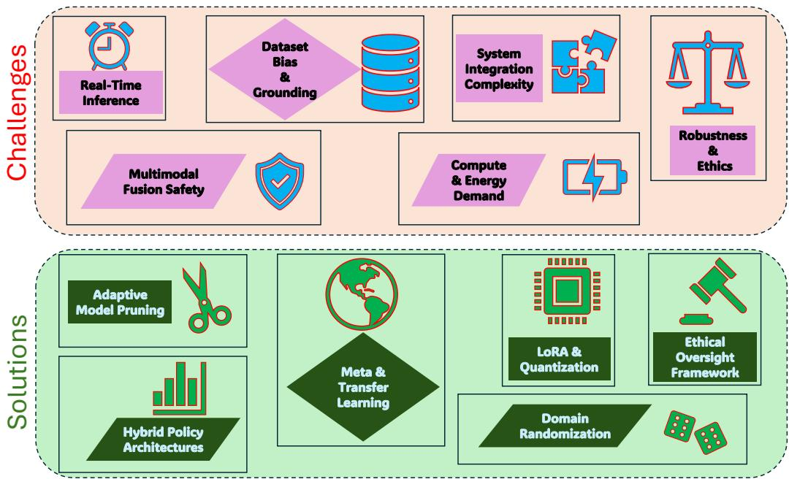

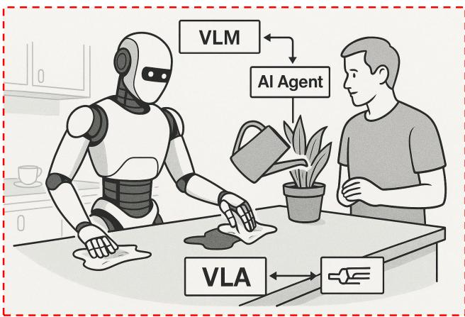  

Figure 18: This conceptual illustration presents "Eva," a future humanoid assistant powered by Vision-Language Models (VLMs), VLA frameworks, and agentic AI systems. VLMs enable semantic scene understanding and object affordance prediction, while VLAs translate language-grounded instructions into hierarchical motor plans. Agentic AI modules ensure adaptive learning, selfrefinement, and interactive decision-making in open-ended environments. Together, these components represent a foundational blueprint for Artificial General Intelligence (AGI) in robotics, where perception, language understanding, planning, and safe autonomous behavior converge in real-world, socially aware tasks.

• Dataset Bias, Grounding, and Generalization to Unseen Tasks. Robust generalization demands both broadened data diversity and advanced learning paradigms. Curating large-scale, debiased multi-modal datasets combining web-scale image—text corpora like LAION-5B [194] with robot-centric trajectory archives such as Open XEmbodiment [227] lays the groundwork for equitable semantic grounding. Hard-negative sampling and contrastive fine-tuning of visionlanguage backbones (e.g., CLIP variants) can mitigate spurious correlations and enhance semantic fidelity [17, 282]. Meta-learning frameworks enable rapid adaptation to novel tasks by learning shared priors across task families, as demonstrated in vision-language robotic navigation models [175]. Continual learning algorithms with replay buffers and regularization strategies preserve old knowledge while integrating new concepts, addressing catastrophic forgetting in VLA models [48]. Transfer learning from 3D perception domains (e.g., point cloud reasoning in 3D-VLA [288]) can endow models with stronger spatial inductive biases, thereby improving robustness to out-of-distribution scenarios. Finally, simulation-to-real (sim2real) fine-tuning with domain randomization and real-world calibration such as dynamic lighting, texture, and physics variations ensures that policies learned in synthetic environments transfer effectively to physical robots [4, 66]. These combined strategies will empower VLAs to generalize confidently to unseen objects, scenes, and tasks in real-world deployments.

System Integration Complexity and Computational Demands. To manage the intricate orchestration of multi-modal pipelines under tight compute budgets, researchers must embrace model modularization and hardware—software co-design. Low-Rank Adaptation (LoRA) adapters can be injected into pre—trained transformer layers, enabling task-specific finetuning without modifying core weights [93]. Knowledge distillation from large "teacher" VLAs to lightweight "student" networks, guided by mutual information-based objectives that encourage the student to match the teacher's intermediate representations and action distributions, produces compact models with $5 \mathrm { - } 1 0 \times$ fewer parameters while retaining $9 0 { - } 9 5 \%$ of task performance [121]. Mixed-precision quantization augmented by quantization-aware training can compress weights to 48 bits, cutting memory bandwidth and energy consumption by over $60 \%$ [122]. Hardware accelerators tailored for VLA workloads supporting sparse tensor operations, dynamic token routing, and fused visionlanguage kernels can deliver sustained $^ { 1 0 0 + }$ TOPS throughput within a $2 0 { - } 3 0 \mathrm { ~ W ~ }$ power envelope, meeting the demands of embedded robotic platforms [171, 242]. Toolchains like TensorRT-LLM [129] and TVM can optimize end-to-end VLA graphs for specific edge devices, fusing layers and precomputing static subgraphs. Emerging architectures such as TinyVLA demonstrate that sub1 B parameter VLAs can achieve near-state-of-the-art performance on manipulation benchmarks with realtime inference, charting a path for widespread deployment in resource-constrained settings. • Robustness to Environmental Variability in VLA Deployment. Ensuring robust VLA performance in realworld settings requires targeted technical interventions to handle environmental uncertainty and long-term system drift. Domain randomization and synthetic data augmentation pipelines, such as UniSim's closed-loop sensor simulator, generate photorealistic variations in lighting, occlusion, and sensor noise, thereby improving resilience to distributional shifts [264]. In addition, adaptive recalibration modules that dynamically adjust perception thresholds and control gains based on real-time feedback can mitigate performance degradation caused by sensor aging or changing operating conditions. Together, these approaches aim to enhance the stability and reliability of VLA systems under diverse and evolving deployment scenarios.

# •Ethical, Privacy, and Societal Considerations in VLA

Deployment. Beyond technical robustness, the deployment of VLA systems raises important ethical and societal challenges that require governance-oriented solutions. Bias auditing tools are needed to identify skewed demographic or semantic distributions in training data, followed by corrective strategies such as adversarial debiasing and counterfactual data augmentation [185, 282]. Privacy-preserving inference mechanisms, including ondevice processing, homomorphic encryption for sensitive data streams, and differential privacy during training, are critical for safeguarding user data in domains such as healthcare and smart homes [160, 180]. Furthermore, transparent impact assessments, stakeholder engagement, and workforce upskilling initiatives can help manage socioeconomic effects, while regulatory frameworks and industry standards are essential to ensure accountability and responsible VLA adoption.

# 5.2. Future Roadmap

The future of VLA-based systems are expected to evolved at the intersection of increasingly capable multi-modal foundations, agentic reasoning, and embodied continual learning. Over the next decade, we anticipate several converging trends that will propel VLAs from capable yet brittle task specialists toward dependable, generalist robotic intelligence. However, this trajectory will be shaped by persistent constraints/limitations highlighted earlier: (i) real-time inference bottlenecks in closed-loop control, (ii) incomplete multi-modal action representations and weak safety assurance, (iii) dataset bias and grounding failures under distribution shift, (iv) integration complexity across perception-memory-reasoning-control, (v) high compute and energy demands that hinder edge deployment, and (vi) robustness, transparency, and ethical concerns in open-world settings. To address these issues holistically, Figure 19 summarizes a system-level research roadmap, while Figure 18 provides an intuitive conceptual illustration of how VLMs, VLA architectures, and agentic AI modules may coevolve toward embodied AGI in robotics.

Multi-modal foundation models as the "cortex" for embodied perception:. Today's VLA stacks often rely on a visionlanguage backbone coupled to task-specific policy heads, which limits reuse of general knowledge and increases retraining cost across domains. A plausible next step is a unified multimodal foundation model trained on web-scale image, video, text, and interaction/affordance traces to function as a shared "cortex" that encodes not only static semantics but also dynamics, contact priors, and commonsense physical knowledge [295, 289, 272]. Such a cortex can reduce failure modes caused by shallow correlations by grounding language in object-centric representations and persistent scene structure [206]. As emphasized in Figure 18, this foundation-model cortex would enable robots to segment environments into actionable entities (objects, regions, affordances) and provide stable semantic anchors to downstream planners and controllers. Yet, to prevent overconfidence and hallucinated grounding, these models must incorporate calibrated uncertainty and evidence-linked reasoning to ensure that perception-driven plans remain verifiable under occlusion, clutter, and ambiguous instructions [145].

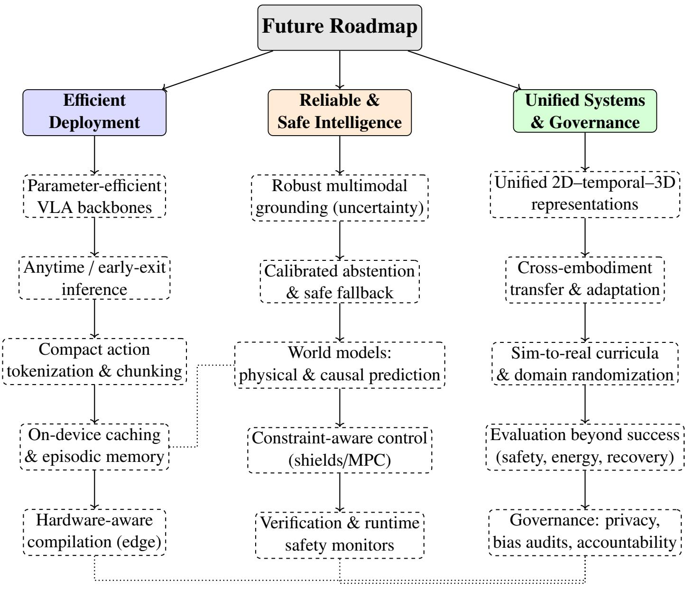  
s ehi orEfit De ate, e,  Re $\boldsymbol { \mathcal { E } } _ { \mathcal { F } }$ Safe Intelligence (grounding, uncertainty. safety assurance), and (iii) Unified Systems $\boldsymbol { \mathcal { E } } _ { \mathcal { F } }$ Governance (2D-temporal-3D integration, transfer, evaluation, and responsible deployment).

Agentic, self-supervised, lifelong learning and continual adaptation:. A defining limitation of current VLAs is their static nature: policies trained once are deployed unchanged, despite operating in non-stationary environments. Future VLAs should adopt agentic learning loops where models propose exploration objectives, hypothesize outcomes, and self-correct through simulated and real rollouts, enabling continual skill growth over months or years [43, 90]. This direction is expected to mitigate distribution shift, dataset bias, and long-horizon brittleness by allowing models to adapt over time; however, continual policy updates introduce new risks. In particular, repeated online or incremental learning can overwrite previously acquired competencies (catastrophic forgetting), induce unintended behavioral regressions, and increase susceptibility to noisy, adversarial, or unintended environmental feedback that may corrupt the learned policy [292, 263]. Therefore, lifelong learning must be coupled with replay and safety-aware updates, modular adapters, and verification-informed policy revisions [121]. Within the roadmap of Figure 19, this agentic lifelong learning paradigm falls naturally at the intersection of Reliable & Safe Intelligence and Unified Systems & Governance, where continual learning is treated as a controlled, auditable lifecycle process rather than an ad hoc fine-tuning step. Hierarchical, neuro-symbolic planning for scalability and interpretability:. Scaling from low-level motor primitives to long-horizon objectives requires explicit hierarchy [261, 265]. Next-generation VLA systems will likely use languagegrounded planners (LLM-style modules fine-tuned for affordances and constraints) that decompose goals into structured sub-tasks, followed by mid-level skill policies and low-level controllers that ensure compliant motion [94, 253]. This neurosymbolic blend helps bridge integration complexity by imposing interfaces that are easier to debug, monitor, and certify [201]. Importantly, hierarchy also enables selective verification: high-level plans can be checked for constraint violations (unsafe steps, forbidden regions) [192, 71], while low-level trajectories can be shielded by control barrier functions, MPC, and runtime safety monitors [188, 196]. These components align with Figure 19 under the pillar of Reliable & Safe Intelligence, where safety is enforced through both planning-time constraints and execution-time guards rather than post hoc evaluation alone [101, 274].

Real-time adaptation via world models and physical/causal reasoning:. Robust deployment in unstructured settings demands that VLAs maintain internal predictive models of objects, contacts, and dynamics. World models that forecast near-term state transitions and failure likelihoods can support counterfactual evaluation ("if I push here, what collides?") and rapid corrective actions when reality deviates from expectation (e.g., slipping grasp, unexpected friction) [203]. This capability is central to safe manipulation, navigation, and human-robot interaction, where small errors compound quickly [156]. Yet, world models must be efficient enough for on-board use and consistent with multi-sensor evidence. Thus, a major future direction is hardware-aware, memory-efficient predictive modeling such as temporal token compression [267, 216], event-driven state updates [250, 226], and hybrid physics-learning models that combine differentiable physical simulators with learned dynamics to enable control-relevant update rates [102, 52]. In Figure 19, these needs appear jointly in the Efficient Deployment pillar (real-time constraints) and the Reliable & Safe Intelligence pillar (physics/causality for grounded decision-making).

Efficiency and scalability: bridging generality with edge deployment:. A central barrier to VLA adoption remains the mismatch between the computational footprint of large multimodal backbones and the latency/energy constraints of closedloop control [268, 238]. Future VLAs should prioritize parameter-efficient designs (structured sparsity, low-rank adaptation, modular experts) that preserve generalization while reducing inference cost [65, 197]. Beyond training-time efficiency, anytime/early-exit policies can allocate computation adaptively, ensuring that safety-critical steps retain high fidelity while routine steps use cheaper pathways [41, 274]. Equally important is action-space efficiency: compact action tokenization and chunked control representations shorten autoregressive horizons, enabling higher control rates without sacrificing temporal smoothness [171]. These modellevel choices must be paired with hardware-aware compilation across GPU/NPU/edge accelerators, including quantizationaware scheduling and memory-optimized attention kernels [65, 167]. Compute-aware caching and episodic memory further reduce redundant forward passes and improve responsiveness in long-horizon tasks [27, 133]. Collectively, these directions operationalize the Efficient Deployment pillar of Figure 19 and directly address the compute/energy limitations emphasized earlier. Cross-embodiment transfer and morphology-agnostic skill representations:. The approach of training separate VLAs for each robot morphology is unlikely to scale. A key future theme is embodiment-agnostic policy learning, where skills are expressed in abstract action spaces (e.g., contact goals, affordance-point manipulation, task-space constraints) that transfer across wheeled platforms, quadrupeds, and humanoids [275, 118]. Meta-learning and few-shot calibration can allow rapid bootstrapping on new robots with minutes of data rather than weeks of training [35]. This direction also mitigates dataset bias by enforcing invariances across embodiments and environments, but it demands standardized representations, common interfaces, and reproducible evaluation protocols [118, 275]. In Figure 19, this embodiment-agnostic skill learning paradigm sits under Unified Systems $\boldsymbol { \mathcal { E } } _ { \mathcal { F } }$ Governance, linking architectural unification with principled transfer and benchmarking. Evaluation beyond task success: safety, recovery, and resourceaware metrics:. Progress in VLA requires measurement that reflects deployment realities. Task success alone does not clearly represent failure severity, temporal inconsistency, unsafe near-misses, and energy inefficiency. Future benchmarks should quantify safety violations, uncertainty calibration, recovery behavior, temporal coherence, energy consumption, and downstream utility under human constraints [274, 78]. Moreover, evaluations should report compute budgets, dataset composition, and deployment conditions to enable fair comparisons and diagnose bias-driven gains [215, 273, 118]. Such measurement is not merely scientific hygiene: it is the foundation for auditing and governance, and it determines whether a system can be responsibly deployed at scale [274, 275]. This motivation underlies the evaluation branch of Figure 19 and complements the conceptual deployment narrative in Figure 18. Safety, ethics, and human-centered alignment as first-class design objectives:. As VLAs gain autonomy, built-in safety and value alignment become critical. Future systems should integrate real-time risk estimators that assess potential harm before executing high-risk actions, request natural-language confirmation under ambiguity, and maintain transparent logs for accountability [274, 118]. Privacy-aware sensing, bias audits, and human-in-the-loop oversight must be embedded into the lifecycle, especially for assistive robotics and safety-critical autonomy [284, 235]. Regulatory-aligned evaluation protocols and standardization efforts will be essential to translate VLA advances into trusted real-world systems [169, 294, 234]. This governance perspective is explicitly captured in Figure 19 and is implicitly reflected by the socially aware humanoid setting illustrated in Figure 18.

Cross-cutting themes: continual learning, failure recovery, interaction, and control fidelity:. Across all pillars in Figure 19, several cross-cutting themes are expected to shape the next decade of VLA research. First, continual and lifelong learning must be safe, auditable, and resistant to forgetting, enabling long-term adaptation without destabilizing deployed systems [290]. Second, failure detection and recovery should be treated as first-class capabilities, incorporating introspective monitoring, uncertainty-aware perception, and structured recovery behaviors when execution deviates from expected outcomes [116, 259]. Third, improving the precision and reliability of action generation remains critical: while VLAbased planners enable flexible, language-conditioned decision making, their trajectory accuracy and control stability currently lag behind conventional analytical approaches such as model predictive control, sampling-based motion planning, and feedback-linearized controllers. As a result, hybrid architectures that combine VLA-driven high-level planning with classical or learned low-level controllers are expected to play a central role in achieving both semantic flexibility and control-level precision. Finally, human alignment and interaction require mechanisms for intent clarification, shared autonomy, and explainable action rationales, supporting trust and usability across diverse real-world settings [111, 110]. In summary, Figure 19 emphasizes that closing the gap between laboratory demonstrations and robust real-world deployment will require coordinated advances in efficiency, safety, data and generalization, system integration, evaluation, and governance. Complementarily, Figure 18 illustrates how these advances may converge toward generalist embodied agents across multiple platforms including mobile robots, manipulators, assistive systems, and humanoids where multi-modal perception, hierarchical planning, continual adaptation, and human-aligned safety are integrated within a unified intelligence stack. Addressing these directions collectively is expected to transform VLAs from promising research prototypes into dependable, broadly applicable embodied systems rather than solutions limited to any single robot morphology.

# 6. Conclusion

In this comprehensive review, we systematically evaluated the recent developments, methodologies, and applications of Vision-Language-Action (VLA) models published over the last three years. Our analysis began with the foundational concepts of VLAs, defining their role as multi-modal systems that unify visual perception, natural language understanding, and action generation in physical or simulated environments. We traced their evolution and timeline, detailing key milestones that marked the transition from isolated perception-action modules to fully unified, instruction-following robotic agents. We highlighted how multi-modal integration has matured from loosely coupled pipelines to transformer-based architectures that enable seamless coordination between modalities. Next, we examined tokenization and representation techniques, focusing on how VLAs encode visual and linguistic information, including action primitives and spatial semantics.

We explored learning paradigms, detailing the datasets and training strategies from supervised learning and imitation learning to reinforcement learning and multi-modal pretraining that have shaped VLA performance. In 'adaptive control and realtime execution' section, we discussed how modern VLAs are optimized for dynamic environments, analyzing policies that support latency-sensitive tasks. We then categorized major architectural innovations, surveying over 50 recent VLA models. This discussion included advancements in model design, memory systems, and interaction fidelity. We further studied strategies for training efficiency improvement, including parameterefficient methods like LoRA, quantization, and model pruning, alongside acceleration techniques such as parallel decoding and hardware-aware inference. Our analysis of real-world applications highlighted both the promise and current limitations of VLA models across six domains: humanoid robotics, autonomous vehicles, industrial automation, healthcare, agriculture, and augmented reality (AR) navigation. Across these settings, VLAs demonstrated strong capabilities in high-level semantic reasoning, instruction-following, and task generalization, particularly in structured or partially controlled environments. However, their effectiveness was often constrained by real-time inference latency, limited robustness under environmental variability, and reduced precision in long-horizon or safety-critical control when compared to conventional analytical planning and control pipelines. Moreover, applicationspecific adaptations and extensive data curation were frequently required to achieve reliable performance, underscoring challenges in scalability and deployment. These findings suggest that while VLAs are well-suited for semantic decision making and flexible task specification, hybrid architectures that integrate VLA reasoning with classical or learned low-level controllers remain essential for practical, real-world operation. In addressing challenges and limitations, we focused on five core areas: real-time inference, multi-modal action representation and safety, bias and generalization, system integration and compute constraints, and ethical deployment. We proposed potential solutions drawn from current literature, including model compression, cross-modal grounding, domain adaptation, and agentic learning frameworks. Finally, our discussion and future roadmap articulated how the convergence of VLMs, VLA architectures, and agentic AI systems is steering robotics toward artificial general intelligence (AGI). This review provides a unified understanding of VLA advancements, identifies unresolved challenges, and outlines a structured path forward for developing intelligent, embodied, and human-aligned agents in the future.

# Funding Declaration

This work was supported in part by the National Science Foundation (NSF) and the United States Department of Agriculture (USDA), National Institute of Food and Agriculture (NIFA), through the "Artificial Intelligence (AI) Institute for Agriculture" program under Award Numbers AWD003473 and AWD004595, and USDA-NIFA Accession Number 1029004 for the project titled "Robotic Blossom Thinning with Soft Manipulators." Additional support was provided through USDA/NIFA Grant Number 2024-67022-41788, Accession Number 1031712, under the project "ExPanding UCF AI Research To Novel Agricultural EngineeRing Applications (PARTNER).

# Declarations

The authors declare no conflicts of interest.

# Statement on AI Writing Assistance

ChatGPT and Perplexity were utilized to enhance grammatical accuracy and refine sentence structure; all AI-generated revisions were thoroughly reviewed and edited for relevance.

# References

[1] Achiam, J., Adler, S., Agarwal, S., Ahmad, L., Akkaya, I., Aleman, F.L., Almeida, D., Altenschmidt, J., Altman, S., Anadkat, S., et al., 2023. Gpt-4 technical report. arXiv preprint arXiv:2303.08774 .   
[2] Agarwal, L., Verma, B., 2024. From methods to datasets: A survey on image-caption generators. Multimedia Tools and Applications 83, 2807728123.   
[3] Alayrac, J.B., Donahue, J., Luc, P., Miech, A., Barr, I., Hasson, Y., Lenc, K., Mensch, A., Millican, K., Reynolds, M., et al., 2022. Flamingo: a visual language model for few-shot learning. Advances in neural information processing systems 35, 2371623736.   
[4] Anderson, P., Shrivastava, A., Truong, J., Majumdar, A., Parikh, D., Batra, D., Lee, S., 2021. Sim-to-real transfer for vision-and-language navigation, in: Conference on Robot Learning, PMLR. pp. 671681.   
[5] Arai, H., Miwa, K., Sasaki, K., Watanabe, K., Yamaguchi, Y., Aoki, S., Yamamoto, I., 2025. Covla: Comprehensive vision-language-action dataset for autonomous driving, in: 2025 IEEE/CVF Winter Conference on Applications of Computer Vision (WACV), IEEE. pp. 19331943.   
[6] Asif, S., Bueno, M., Ferreira, P., Anandan, P., Zhang, Z., Yao, Y., Ragunathan, G., Tinkler, L., Sotoodeh-Bahraini, M., Lohse, N., et al., 2025. Rapid and automated configuration of robot manufacturing cells. Robotics and Computer-Integrated Manufacturing 92, 102862.   
[7] Assres, G., Bhandari, G., Shalaginov, A., Gronli, T.M., Ghinea, G., 2025. State-of-the-art and challenges of engineering ml-enabled software systems in the deep learning era. ACM Computing Surveys .   
[8] Asuzu, K., Singh, H., Idrissi, M., 2025. Humanrobot interaction through joint robot planning with large language models. Intelligent Service Robotics , 117.   
[9] Ayaz, M., Khan, M., Saqib, M., Khelifi, A., Sajjad, M., Elsadik, A. 0Medvlm: Medical vision-agge model for consumer devices. IEEE Consumer Electronics Magazine .   
[10] Bai, S., Chen, K., Liu, X., Wang, J., Ge, W., Song, S., Dang, K., Wang, P., Wang, S., Tang, J., Zhong, H., Zhu, Y., Yang, M., Li, Z., Wan, J., Wang, P., Ding, W., Fu, Z., Xu, Y., Ye, J., Zhang, X., Xie, T., Cheng, Z., Zhang, H., Yang, Z., Xu, H., Lin, J., 2025. Qwen2.5-vl technical report. arXiv preprint arXiv:2502.13923   
[11] Bartoccioni, F., Ramzi, E., Besnier, V., Venkataramanan, S., Vu, T.H., Xu, Y., Chambon, L., Gidaris, S., Odabas, S., Hurych, D., et al., 2025. Vavim and vavam: Autonomous driving through video generative modeling. arXiv preprint arXiv:2502.15672 .   
[12] Bathula, N.V., Paleti, I., Pagidi, S., Akkumahanthi, S.S., Guduru, N.T., 2024. Policy learning-based image captioning with vision transformer, in: 2024 IEEE International Students' Conference on Electrical, Electronics and Computer Science (SCEECS), IEEE. pp. 16.   
[13] Belkhale, S., Ding, T., Xiao, T., Sermanet, P., Vuong, Q., Tompson, J., Chebotar, Y., Dwibedi, D., Sadigh, D., 2024. Rt-h: Action hierarchies using language. arXiv preprint arXiv:2403.01823 .   
[14] Bjorck, J., Castañeda, F., Cherniadev, N., Da, X., Ding, R., Fan, L., Fang, Y., Fox, D., Hu, F., Huang, S., et al., 2025. Gr00t n1: An open foundation model for generalist humanoid robots. arXiv preprint arXiv:2503.14734   
[15] Black, K., Brown, N., Driess, D., Esmail, A., Equi, M., Finn, C., Fusai, N., Groom, L., Hausman, K. Ichter, B., et al., 2024. Pi-0: A vision-language-action flow model for general robot control. arXiv preprint arXiv:2410.24164 .   
[16] Bolya, D., Huang, P.Y., Sun, P., Cho, J.H., Madotto, A., Wei, C., Ma, T., Zhi, J., Rajasegaran, J., Rasheed, H., et al., 2025. Perception encoder: The best visual embeddings are not at the output of the network. arXiv preprint arXiv:2504.13181 .   
[17] Bordes, F., Pang, R.Y., Ajay, A., Li, A.C., Bardes, A., Petryk, S., Mañas, O., Lin, Z., Mahmoud, A., Jayaraman, B. al. Ani visi-a modeling. arXiv preprint arXiv:2405.17247 .   
[18] Brohan, A., Brown, N., Carbajal, J., Chebotar, Y., Chen, X., Choromanski, K., Ding, T., Driess, D., Dubey, A., Finn, C., et al., 2023. Rt-2: Vision-language-action models transfer web knowledge to robotic control. arXiv preprint arXiv:2307.15818 . [19] Brohan, A., Brown, N., Carbajal, J., Chebotar, Y., Dabis, J., Finn, C., Gopalakrishnan, K., Hausman, K., Herzog, A., Hsu, J., et al., 2022. Rt-1: Robotics transformer for real-world control at scale. arXiv preprint arXiv:2212.06817 . [20] Budzianowski, P., Maa, W., Freed, M., Mo, J., Xie, A., Tipnis, V., Bolte, B., 2024. Edgevla: Efficient visionlanguage-action models. environments 20, 3. [21] Cangelosi, A., Metta, G., Sagerer, G., Nolfi, S., Nehaniv, C., Fischer, K., Tani, J., Belpaeme, T., Sandini, G., Nori, F., et al., 2010. Integration of action and language knowledge: A roadmap for developmental robotics. IEEE Transactions on Autonomous Mental Development 2, 167195. [22] Cao, J., Gan, Z., Cheng, Y., Yu, L., Chen, Y.C., Liu, J., 2020. Behind the scene: Revealing the secrets of pre-trained vision-and-language models, in: Computer VisionECCV 2020: 16th European Conference, Glasgow, UK, August 2328, 2020, Proceedings, Part VI 16, Springer. pp. 565580. [23] Cao, L., 2024. Ai robots and humanoid ai: Review, perspectives and directions. arXiv preprint arXiv:2405.15775 . [24] Cao, Y., Ju, Y., Xu, D., 2024a. 3dgs-det: Empower 3d gaussian splatting with boundary guidance and boxfocused sampling for 3d object detection. arXiv preprint arXiv:2410.01647 . [25] Cao, Y., Zeng, Y., Xu, H., Xu, D., 2023. Coda: Collaborative novel box discovery and cross-modal alignment for open-vocabulary 3d object detection, in: NeurIPS. [26] Cao, Y., Zeng, Y., Xu, H., Xu, D., 2024b. Collaborative novel object discovery and box-guided crossmodal alignment for open-vocabulary 3d object detection. arXiv preprint arXiv:2406.00830 . [27] Chang, C., Shi, Y., Cao, D., Yang, W., Hwang, J., Wang, H., Pang, J., Wang, W., Liu, Y., Peng, W.C., et al., 2025. A survey of reasoning and agentic systems in time series with large language models. arXiv preprint arXiv:2509.11575 . [28] Chang, Y., Wang, X., Wang, J., Wu, Y., Yang, L., Zhu, K., Chen, H., Yi, X., Wang, C., Wang, Y., et al., 2024. A survey on evaluation of large language models. ACM transactions on intelligent systems and technology 15, 145. [29] Chatzopoulos, D., Bermejo, C., Huang, Z., Hui, P., 2017. Mobile augmented reality survey: From where we are to where we go. Ieee Access 5, 69176950.

[30] Chen, B., Xu, Z., Kirmani, S., Ichter, B., Sadigh, D., Guibas, L., Xia, F., 2024a. Spatialvlm: Endowing vision-language models with spatial reasoning capabilities, in: Proceedings of the IEEE/CVF Conference on Computer Vision and Pattern Recognition, pp. 14455 14465.   
[31] Chen, H., Hou, L., Wu, S., Zhang, G., Zou, Y., Moon, S., Bhuiyan, M., 2024b. Augmented reality, deep learning and vision-language query system for construction worker safety. Automation in Construction 157, 105158.   
[32] Chen, H., Li, S., Fan, J., Duan, A., Yang, C., NavarroAlarcon, D., Zheng, P., 2025a. Human-in-the-loop robot learning for smart manufacturing: A human-centric perspective. IEEE Transactions on Automation Science and Engineering .   
[33] Chen, H., Liu, B., Wang, S., Wang, X., Han, W., Zhu, Y., Wang, X., Bi, Y., 2025b. Language modulates vision: Evidence from neural networks and human brain-lesion models. arXiv preprint arXiv:2501.13628   
[34] Chen, P., Bu, P., Wang, Y., Wang, X., Wang, Z., Guo, J., Zhao, Y., Zhu, Q., Song, J., Yang, S., et al., 2025c. Combatvla: An efficient vision-language-action model for combat tasks in 3d action role-playing games. arXiv preprint arXiv:2503.09527 .   
[35] Chen, X., Xu, W., Kan, S., Zhang, L., Jin, Y., Cen, Y., Li, Y., 2025d. Vision-semantics-label: A new twostep paradigm for action recognition with large language model. IEEE Transactions on Circuits and Systems for Video Technology .   
[36] Chen, Y., Tian, S., Liu, S., Zhou, Y., Li, H., Zhao, D., 2025e. Conrft: A reinforced fine-tuning method for vla models via consistency policy. arXiv preprint arXiv:2502.05450 .   
[37] Chen, Z., Wu, J., Wang, W., Su, W., Chen, G., Xing, S., Zhong, M., Zhang, Q., Zhu, X., Lu, L., et al., 2024c. Internvl: Scaling up vision foundation models and aligning for generic visual-linguistic tasks, in: Proceedings of the IEEE/CVF Conference on Computer Vision and Pattern Recognition, pp. 2418524198.   
[38] Cheng, A.C., Ji, Y., Yang, Z., Gongye, Z., Zou, X., Kautz, J., B1yk, E., Yin, H., Liu, S., Wang, X., 2024a. Navila: Legged robot vision-language-action model for navigation. arXiv preprint arXiv:2412.04453 .   
[39] Cheng, H., Xiao, E., Yu, C., Yao, Z., Cao, J., Zhang, Q., W, J. Su M., Xu K. Gu, J, l - ulation facing threats: Evaluating physical vulnerabilities in end-to-end vision language action models. arXiv preprint arXiv:2409.13174 .   
[40] Chi, C., Xu, Z., Feng, S., Cousineau, E., Du, Y., Burchfiel, B., Tedrake, R., Song, S., 2023. Diffusion policy: Visuomotor policy learning via action diffusion. The International Journal of Robotics Research , 02783649241273668. [1] Chi, H., Gao, H.a. Liu, Z., Liu, J., Liu, C., Li, J.,ang, K., Yu, Y., Wang, Z., Li, W., et al., 2025. Impromptu vla: Open weights and open data for driving vision-languageaction models. arXiv preprint arXiv:2505.23757 . [42] Chiang, H.T.L., Xu, Z., Fu, Z., Jacob, M.G., Zhang, T., Lee, T.W.E., Yu, W., Schenck, C., Rendleman, D., Shah, D., et al., 2024. Mobility vla: Multimodal instruction navigation with long-context vlms and topological graphs. arXiv preprint arXiv:2407.07775 . [43] Chowa, S.S., Alvi, R., Rahman, S.S., Rahman, M.A., Raiaan, M.A.K., Islam, M.R., Hussain, M., Azam, S., 2026. From language to action: a review of large language models as autonomous agents and tool users. Artificial Intelligence Review . [44] Dang, R., Yuan, Y., Zhang, W., Xin, Y., Zhang, B., Li, L., Wang, L., Zeng, Q., Li, X., Bing, L., 2025. Ecbench: Can multi-modal foundation models understand the egocentric world? a holistic embodied cognition benchmark. arXiv preprint arXiv:2501.05031 . [45] Dasari, S., Ebert, F., Tian, S., Nair, S., Bucher, B., Schmeckpeper, K., Singh, S., Levine, S., Finn, C., 2019. Robonet: Large-scale multi-robot learning. arXiv preprint arXiv:1910.11215 . [46] Deng, S., Yan, M., Wei, S., Ma, H., Yang, Y., Chen, J., Zhang, Z., Yang, T., Zhang, X., Cui, H., Zhang, Z., Wang, H., 2025a. Graspvla: a grasping foundation model pre-trained on billion-scale synthetic action data. URL: https://arxiv.org/abs/2505.03233, arXiv:2505.03233. [47] Deng, S., Yan, M., Zheng, Y., Su, J., Zhang, W., Zhao, X., Cui, H., Zhang, Z., Wang, H., 2025b. Stereovla: Enhancing vision-language-action models with stereo vision. arXiv preprint arXiv:2512.21970 . [48] Dey, S., Zaech, J.N., Nikolov, N., Van Gool, L., Paudel, D.P., 2024. Revla: Reverting visual domain limitation of robotic foundation models. arXiv preprint arXiv:2409.15250 . [49] Din, M.U., Akram, W., Saoud, L.S., Rosell, J., Hussain, I., 2025. Vision language action models in robotic manipulation: A systematic review. arXiv preprint arXiv:2507.10672 . [50] Ding, D., Yao, T., Luo, R., Sun, X., 2025a. Visual question answering in robotic surgery: A comprehensive review. IEEE Access . [51] Ding, J., Zhang, Y., Shang, Y., Zhang, Y., Zong, Z. Feng, J., Yuan, Y., Su, H., Li, N., Sukiennik, N., et al., 2024a. Understanding world or predicting future? a comprehensive survey of world models. arXiv preprint arXiv:2411.14499 . [52] Ding, M., Chen, Z., Du, T., Luo, P., Tenenbaum, J., Gan, C., 2021. Dynamic visual reasoning by learning differentiable physics models from video and language. Advances in Neural Information Processing Systems 34, 887899. [53] Ding, P., Ma, J., Tong, X., Zou, B., Luo, X., Fan, Y., Wang, T., Lu, H., Mo, P., Liu, J., et al., 2025b. Humanoid-vla: Towards universal humanoid control with visual integration. arXiv preprint arXiv:2502.14795 [54] Ding, P., Zhao, H., Zhang, W., Song, W., Zhang, M., Huang, S., Yang, N., Wang, D., 2024b. Quar-vla: Visionlanguage-action model for quadruped robots, in: European Conference on Computer Vision, Springer. pp. 352367. [55] Donahue, J., Anne Hendricks, L., Guadarrama, S., Rohrbach, M., Venugopalan, S., Saenko, K., Darrell, T., 2015. Long-term recurrent convolutional networks for visual recognition and description, in: Proceedings of the IEEE conference on computer vision and pattern recognition, pp. 26252634. [56] Dong, H., Liu, M., Zhou, K., Chatzi, E., Kannala, J., Stachniss, C., Fink, O., 2025. Advances in multimodal adaptation and generalization: From traditional approaches to foundation models. arXiv preprint arXiv:2501.18592 . [57] Doveh, S., Arbelle, A., Harary, S., Schwartz, E., Herzig, R., Giryes, R., Feris, R., Panda, R., Ullman, S., Karlinsky, L., 2023. Teaching structured vision & language concepts to vision & language models, in: Proceedings of the IEEE/CVF Conference on Computer Vision and Pattern Recognition, pp. 26572668. [58] Driess, D., Xia, F., Sajjadi, M.S., Lynch, C., Chowdhery, A., Wahid, A., Tompson, J., Vuong, Q., Yu, T., Huang, W., et al., 2023. Palm-e: An embodied multimodal language model. Openreview . [59] Duan, J., Pumacay, W., Kumar, N., Wang, Y.R., Tian, S., Yuan, W., Krishna, R., Fox, D., Mandlekar, A., Guo, Y., 2024. Aha: A vision-language-model for detecting and reasoning over failures in robotic manipulation. arXiv preprint arXiv:2410.00371 . [60] Duarte, N.F., Rakovi, M., Tasevski, J., Coco, M.I., Billard, A., Santos-Victor, J., 2018. Action anticipation: Reading the intentions of humans and robots. IEEE Robotics and Automation Letters 3, 41324139. [61] Ebert, F., Yang, Y., Schmeckpeper, K., Bucher, B., Georgakis, G., Daniilidis, K., Finn, C., Levine, S., 2021. Bridge data: Boosting generalization of robotic skills with cross-domain datasets. arXiv preprint arXiv:2109.13396 . [62] Fan, C., Jia, X., Sun, Y., Wang, Y., Wei, J., Gong, Z., Zhao, X., Tomizuka, M., Yang, X., Yan, J., Ding, M., 2025a. Interleave-vla: Enhancing robot manipulation with interleaved image-text instructions. URL: https://arxiv.org/abs/2505.02152, arXiv:2505.02152. [63] Fan, L., Chen, K., Xu, Z., Yuan, M., Huang, P., Huang, W., 2024. Language reasoning in vision-language-action model for robotic grasping, in: 2024 China Automation Congress (CAC), IEEE. pp. 66566661. [64] Fan, Y., Ding, P., Bai, S., Tong, X., Zhu, Y., Lu, H., Dai, F., Zhao, W., Liu, Y., Huang, S., et al., 2025b. Long-vla: Unleashing long-horizon capability of vision language action model for robot manipulation. arXiv preprint arXiv:2508.19958 . [5] Fang, H., Liu, Y., Du, Y., Du, L., Yang, H., 2025a. Sqapvla: A synergistic quantization-aware pruning framework for high-performance vision-language-action models. arXiv preprint arXiv:2509.09090 . [66] Fang, Y., Yang, Y., Zhu, X., Zheng, K., Bertasius, G., Szafir, D., Ding, M., 2025b. Rebot: Scaling robot learning with real-to-sim-to-real robotic video synthesis. arXiv preprint arXiv:2503.14526 . [67] Firoozi, R., Tucker, J., Tian, S., Majumdar, A., Sun, J., Liu, W., Zhu, Y., Song, S., Kapoor, A., Hausman, K., et al., 2023. Foundation models in robotics: Applications, challenges, and the future. The International Journal of Robotics Research , 02783649241281508. [68] Foster, D.J., Block, A., Misra, D., 2024. Is behavior cloning all you need? understanding horizon in imitation learning. arXiv preprint arXiv:2407.15007 . [69] Fu, H., Zhang, D., Zhao, Z., Cui, J., Liang, D., Zhang, C., Zhang, D., Xie, H., Wang, B., Bai, X., 2025. Orion: A holistic end-to-end autonomous driving framework by vision-language instructed action generation. arXiv preprint arXiv:2503.19755 . [70] Gao, B., Liu, Y., Li, Y., Li, H., Li, M., He, W., 2025a. A vision-language model for predicting potential distribution land of soybean double cropping. Frontiers in Environmental Science 12, 1515752. [71] Gao, C., Liu, Z., Chi, Z., Huang, J., Fei, X., Hou, Y., Zhang, Y., Lin, Y., Fang, Z., Jiang, Z., et al., 2025b. Vlaos: Structuring and dissecting planning representations and paradigms in vision-language-action models. arXiv preprint arXiv:2506.17561 . [72] Gao, J., Belkhale, S., Dasari, S., Balakrishna, A., Shah, D., Sadigh, D., 2025c. A taxonomy for evaluating generalist robot policies. arXiv preprint arXiv:2503.01238 [73] Gao, S.H., Cheng, M.M., Zhao, K., Zhang, X.Y., Yang, M.H., Torr, P., 2019. Res2net: A new multi-scale backbone architecture. IEEE TPAMI . [74] Gbagbe, K.F., Cabrera, M.A., Alabbas, A., Alyunes, O., Lykov, A., Tsetserukou, D., 2024. Bi-vla: Vision-language-action model-based system for bimanual robotic dexterous manipulations, in: 2024 IEEE International Conference on Systems, Man, and Cybernetics (SMC), IEEE. pp. 28642869. [75] Geens, R., 2024. Bringing generative ai to edge devices through interoperable compute cores, in: Flanders AI Research Day, Location: Ghent. [76] Ghosh, A., Acharya, A., Saha, S., Jain, V., Chadha, A., 2024. Exploring the frontier of vision-language models: A survey of current methodologies and future directions. arXiv preprint arXiv:2404.07214 . [77] Gu, J., Wang, Z., Kuen, J., Ma, L., Shahroudy, A., Shuai, B., Liu, T., Wang, X., Wang, G., Cai, J., et al., 2018. Recent advances in convolutional neural networks. Pattern recognition 77, 354377. [78] Gu, Q., Ju, Y., Sun, S., Gilitschenski, I., Nishimura, H., Itkina, M., Shkurti, F., 2025a. Safe: Multitask failure detection for vision-language-action models. arXiv preprint arXiv:2506.09937 . [79] Gu, Q., Su, J., Yuan, L., 2021. Visual affordance detection using an efficient attention convolutional neural network. Neurocomputing 440, 3644. doi:https: //doi.org/10.1016/j.neucom.2021.01.018. [80] Gu, X., Wen, C., Ye, W., Song, J., Gao, Y., 2023. Seer: Language instructed video prediction with latent diffusion models. arXiv preprint arXiv:2303.14897 . [81] Gu, Z., Li, J., Shen, W., Yu, W., Xie, Z., McCrory, S., Cheng, X., Shamsah, A., Griffin, R., Liu, C.K., et al., 2025b. Humanoid locomotion and manipulation: Current progress and challenges in control, planning, and learning. arXiv preprint arXiv:2501.02116 . [82] Guan, W., Hu, Q., Li, A., Cheng, J., 2025. Efficient vision-language-action models for embodied manipulation: A systematic survey. arXiv preprint arXiv:2510.17111 . [83] Guo, Y., Zhang, J., Chen, X., Ji, X., Wang, Y.J., Hu, Y., Chen, J., 2025. Improving vision-language-action model with online reinforcement learning. arXiv preprint arXiv:2501.16664 . [84] Guruprasad, P., Sikka, H., Song, J., Wang, Y., Liang, P.P., 2024. Benchmarking vision, language, & action models on robotic learning tasks. arXiv preprint arXiv:2411.05821 . [85] Haldar, S., Peng, Z., Pinto, L., 2024. Baku: An efficient transformer for multi-task policy learning. arXiv preprint arXiv:2406.07539 .

[86] Han, S., Wang, M., Zhang, J., Li, D., Duan, J., 2024. A review of large language models: Fundamental architectures, key technological evolutions, interdisciplinary technologies integration, optimization and compression techniques, applications, and challenges. Electronics 13, 5040. [87] Hanson, A., Riseman, E., 2014. The visions imageunderstanding system, in: Advances in Computer Vision. Psychology Press, pp. 1114. [88] Hao, P., Zhang, C., Li, D., Cao, X., Hao, X., Cui, S., Wang, S., 2025. Tla: Tactile-language-action model for contact-rich manipulation. arXiv preprint arXiv:2503.08548 . [89] He, K., Zhang, X., Ren, S., Sun, J., 2016. Deep residual learning for image recognition, pp. 770778. [90] Holldack, F., Banh, L., Strobel, G., 2026. Agentic information systems. Electronic Markets 36, 5. [91] Hong, Y., 2025. Building 3D Foundation Models for the Embodied Minds. Ph.D. thesis. University of California, Los Angeles. [92] Hou, Z., Zhang, T., Xiong, Y., Duan, H., Pu, H., Tong, R., Zhao, C., Zhu, X., Qiao, Y., Dai, J., et al., 2025. Dita: Scaling diffusion transformer for generalist vision-language-action policy. arXiv preprint arXiv:2503.19757 . [93] Hu, E.J., Shen, Y., Wallis, P., Allen-Zhu, Z., Li, Y. Wang, S., Wang, L., Chen, W., et al., 2022. Lora: Lowrank adaptation of large language models. ICLR 1, 3. [94] Hu, Y., Tang, J., Gong, X., Zhou, Z., Zhang, S., Elvitigala, D.S., Mueller, F., Hu, W., Quigley, A.J., 2025. Vision-based multimodal interfaces: A survey and taxonomy for enhanced context-aware system design. arXiv preprint arXiv:2501.13443 . [95] Huang, G., Liu, Z., Van Der Maaten, L., Weinberger, K.Q., 2017. Densely connected convolutional networks, in: Proceedings of the IEEE conference on computer vision and pattern recognition, pp. 47004708. [96] Huang, H., Liu, F., Fu, L., Wu, T., Mukadam, M., Malik, J., Goldberg, K., Abbeel, P., 2024. Early fusion helps vision language action models generalize better, in: 1st Workshop on X-Embodiment Robot Learning. [97] Huang, H., Liu, F., Fu, L., Wu, T., Mukadam, M., Malik, J., Goldberg, K., Abbeel, P., 2025a. Otter: A visionlanguage-action model with text-aware visual feature extraction. arXiv preprint arXiv:2503.03734 . [98] Huang, S., Dong, L., Wang, W., Hao, Y., Singhal, S., Ma, S., Lv, T., Cui, L., Mohammed, O.K., Patra, B., et al., 2023a. Language is not all you need: Aligning perception with language models. Advances in Neural Information Processing Systems 36, 7209672109. [99] Huang, W., Gu, Q., Ye, N., 2025b. Decision spikeformer: Spike-driven transformer for decision making. arXiv preprint arXiv:2504.03800 . [100] Huang, W., Wang, C., Zhang, R., Li, Y., Wu, J., FeiFei, L., 2023b. Voxposer: Composable 3d value maps for robotic manipulation with language models. arXiv preprint arXiv:2307.05973 . [101] Huang, Y., Hua, H., Zhou, Y., Jing, P., Nagireddy, M., Padhi, I., Dolcetti, G., Xu, Z., Chaudhury, S., Rawat, A., et al., 2025c. Building a foundational guardrail for general agentic systems via synthetic data. arXiv preprint arXiv:2510.09781 . [102] Huang, Z., Chen, F., Pu, Y., Lin, C., Su, H., Gan, C., 2023c. Diffvl: Scaling up soft body manipulation using vision-language driven differentiable physics. Advances in Neural Information Processing Systems 36, 29875 29900. [103] Hung, C.Y., Sun, Q., Hong, P., Zadeh, A., Li, C., Tan, U., Majumder, N., Poria, S., et al., 2025. Nora: A small open-sourced generalist vision language action model for embodied tasks. arXiv preprint arXiv:2504.19854 . [104] Ikeda, B., Gramopadhye, M., Nekervis, L., Szafir, D., 2025. Marcer: Multimodal augmented reality for composing and executing robot tasks, in: 2025 20th ACM/IEEE International Conference on Human-Robot Interaction (HRI), IEEE. pp. 529539. [105] Imran, A., Gopalakrishnan, K., 2025. Foundation models in robotics, in: AI for Robotics: Toward Embodied and General Intelligence in the Physical World. Springer, pp. 139210. [106] Intelligence, P., Black, K., Brown, N., Darpinian, J., Dhabalia, K., Driess, D., Esmail, A., Equi, M., Finn, C., Fusai, N., et al., 2025. pi0.5: a vision-language-action model with open-world generalization. arXiv preprint arXiv:2504.16054 . [107] Jeong, H., Lee, H., Kim, C., Shin, S., 2024. A survey of robot intelligence with large language models. Applied Sciences 14, 8868. [108] Jha, K., Doshi, A., Patel, P., Shah, M., 2019. A comprehensive review on automation in agriculture using artificial intelligence. Artificial Intelligence in Agriculture 2, 112. [109] Jiang, J., Xiao, W., Lin, Z., Zhang, H., Ren, T., Gao, Y., Lin, Z., Cai, Z., Yang, L., Liu, Z., 2024. Solami: Social vision-language-action modeling for immersive interaction with 3d autonomous characters. arXiv preprint arXiv:2412.00174 . [110] Jiang, J., Xiao, W., Lin, Z., Zhang, H., Ren, T., Gao, Y., Lin, Z., Cai, Z., Yang, L., Liu, Z., 2025a. Solami: Social vision-language-action modeling for immersive interaction with 3d autonomous characters, in: Proceedings of the Computer Vision and Pattern Recognition Conference, pp. 2688726898. [111] Jiang, S., Huang, Z., Qian, K., Luo, Z., Zhu, T., Zhong, Y., Tang, Y., Kong, M., Wang, Y., Jiao, S., et al., 2025b. A survey on vision-language-action models for autonomous driving. arXiv preprint arXiv:2506.24044 . [112] Jiang, Y., Gupta, A., Zhang, Z., Wang, G., Dou, Y., Chen, Y., Fei-Fei, L., Anandkumar, A., Zhu, Y., Fan, L., 2022. Vima: General robot manipulation with multimodal prompts. arXiv preprint arXiv:2210.03094 2, 6. [113] Jiang, Y., Zhang, R., Wong, J., Wang, C., Ze, Y., Yin, H., Gokmen, C., Song, S., Wu, J., Fei-Fei, L., 2025c. Behavior robot suite: Streamlining real-world whole-body manipulation for everyday household activities. arXiv preprint arXiv:2503.05652 . [114] Jones, J., Mees, O., Sferrazza, C., Stachowicz, K., Abbeel, P., Levine, S., 2025. Beyond sight: Finetuning generalist robot policies with heterogeneous sensors via language grounding. arXiv preprint arXiv:2501.04693 . [115] Karamcheti, S., Zhai, A.J., Losey, D.P., Sadigh, D., 2021. Learning visually guided latent actions for assistive teleoperation, in: Learning for dynamics and control, PMLR. pp. 12301241. [116] Karli, U.B., Kurumisawa, T., Fitzgerald, T., 2025. Ask before you act: Token-level uncertainty for intervention in vision-language-action models, in: Second Workshop on Out-of-Distribution Generalization in Robotics at RSS 2025. [117] Katiyar, N., 2023. A Model-Driven Framework for Domain-Specific Adaptation of Time Series Forecasting Pipeline. McGill University (Canada). [118] Kawaharazuka, K., Oh, J., Yamada, J., Posner, I., Zhu, Y., 2025. Vision-language-action models for robotics: A review towards real-world applications. IEEE Access . [119] Kelly, C., Hu, L., Yang, B., Tian, Y., Yang, D., Yang, C., Huang, Z., Li, Z., Hu, J., Zou, Y., 2024. Visiongpt: Vision-language understanding agent using generalized multimodal framework. arXiv preprint arXiv:2403.09027 . [120] Khan, M.H., Asfaw, S., Iarchuk, D., Cabrera, M.A., Moreno, L., Tokmurziyev, I., Tsetserukou, D., 2025. Shake-vla: Vision-language-action model-based system for bimanual robotic manipulations and liquid mixing. arXiv preprint arXiv:2501.06919 . [121] Kim, M.J., Finn, C., Liang, P., 2025. Fine-tuning visionlanguage-action models: Optimizing speed and success. arXiv preprint arXiv:2502.19645 . [122] Kim, M.J., Pertsch, K., Karamcheti, S., Xiao, T., Balakrishna, A., Nair, S., Rafailov, R., Foster, E., Lam, G., Sanketi, P., et al., 2024. Openvla: An opensource vision-language-action model. arXiv preprint arXiv:2406.09246 . [123] Koo, J., Cho, T., Kang, H., Pyo, E., Oh, T.G., Kim, T., Choi, A.J., 2025. Retovla: Reusing register tokens for spatial reasoning in vision-language-action models. arXiv preprint arXiv:2509.21243 . [124] Lee, N., Bang, Y., Lovenia, H., Cahyawijaya, S., Dai, W., Fung, P., 2023. Survey of social bias in vision-language models. arXiv preprint arXiv:2309.14381 . [125] Li, C., Wen, J., Peng, Y., Peng, Y., Feng, F., Zhu, Y., 2025a. Pointvla: Injecting the 3d world into vision-language-action models. arXiv preprint arXiv:2503.07511 . [126] Li, D., Jin, Y., Sun, Y., Yu, H., Shi, J., Hao, X., Hao, P., Liu, H., Sun, F., Zhang, J., et al., 2024a. What foundation models can bring for robot learning in manipulation: A survey. arXiv preprint arXiv:2404.18201 . [127] Li, J., Skinner, G., Yang, G., Quaranto, B.R., Schwaitzberg, S.D., Kim, P.C., Xiong, J., 2024b. Llava-surg: towards multimodal surgical assistant via structured surgical video learning. arXiv preprint arXiv:2408.07981 [128] Li, J., Wei, P., Han, W., Fan, L., 2023. Intentqa: Contextaware video intent reasoning, in: Proceedings of the IEEE/CVF international conference on computer vision, pp. 1196311974. [129] Li, J., Zhu, Y., Tang, Z., Wen, J., Zhu, M., Liu, X., Li, C., Cheng, R., Peng, Y., Feng, F., 2024c. Improving visionlanguage-action models via chain-of-affordance. arXiv preprint arXiv:2412.20451 . [130] Li, M., Wang, Z., He, K., Ma, X., Liang, Y., 2025b. Jarvis-vla: Post-training large-scale vision language models to play visual games with keyboards and mouse. arXiv preprint arXiv:2503.16365 . [131] Li, Q., Liang, Y., Wang, Z., Luo, L., Chen, X., Liao, M., Wei, F., Deng, Y., Xu, S., Zhang, Y., et al., 2024d. Cogact: A foundational vision-language-action model for synergizing cognition and action in robotic manipulation. arXiv preprint arXiv:2411.19650 . [132] Li, S., Wang, J., Dai, R., Ma, W., Ng, W.Y., Hu, Y., Li, Z., 2024e. Robonurse-vla: Robotic scrub nurse system based on vision-language-action model. arXiv preprint arXiv:2409.19590 . [133] Li, S., Wu, H., Shao, J., Ma, Y., Gan, Y., Luo, Y., Wang, Y., Nie, D., Wang, L., Wu, W., et al., 2025c. Seeing the forest and the trees: Query-aware tokenizer for long-video multimodal language models. arXiv preprint arXiv:2511.11910 . [134] Li, Y., Deng, Y., Zhang, J., Jang, J., Memmel, M., Yu, R., Garrett, C.R., Ramos, F., Fox, D., Li, A., et al., 2025d. Hamster: Hierarchical action models for open-world robot manipulation. arXiv preprint arXiv:2502.05485 . [135] Li, Y., Gong, Z., Li, H., Huang, X., Kang, H., Bai, G., Ma, X., 2025e. Robotic visual instruction. arXiv preprint arXiv:2505.00693 . [136] Li, Y., Lai, Z., Bao, W., Tan, Z., Dao, A., Sui, K., Shen, J., Liu, D., Liu, H., Kong, Y., 2025f. Visual large language models for generalized and specialized applications. arXiv preprint arXiv:2501.02765 . [137] Li, Z., Wu, X., Du, H., Nghiem, H., Shi, G., $2 0 2 5 \mathrm { g }$ . Benchmark evaluations, applications, and challenges of large vision language models: A survey. arXiv preprint arXiv:2501.02189 1. [138] Liang, Z., Li, Y., Yang, T., Wu, C., Mao, S., Nian, T., Pei, L., Zhou, S., Yang, X., Pang, J., et al., 2025. Discrete diffusion vla: Bringing discrete diffusion to action decoding in vision-language-action policies. arXiv preprint arXiv:2508.20072 . [139] Lin, K.Q., Li, L., Gao, D., Yang, Z., Wu, S., Bai, Z., Lei, W., Wang, L., Shou, M.Z., 2024. Showui: One vision-language-action model for gui visual agent. arXiv preprint arXiv:2411.17465 . [140] Lin, Y., Zhou, H., Chen, M., Min, H., 2019. Automatic sorting system for industrial robot with 3d visual perception and natural language interaction. Measurement and Control 52, 100115. [141] Liu, H., Yao, R., Liu, W., Huang, Z., Shen, S., Ma, J. 2025a. Codrivevlm: Vlm-enhanced urban cooperative dispatching and motion planning for future autonomous mobility on demand systems. URL: https://arxiv. org/abs/2501.06132,arXiv:2501.06132. [142] Liu, J., Chen, H., An, P., Liu, Z., Zhang, R., Gu, C., Li, X., Guo, Z., Chen, S., Liu, M., et al., 2025b. Hybridvla: Collaborative diffusion and autoregression in a unified vision-language-action model. arXiv preprint arXiv:2503.10631 . [143] Liu, J., Liu, M., Wang, Z., An, P., Li, X., Zhou, K., Yang, S., Zhang, R., Guo, Y., Zhang, S., 2024a. Robomamba: Efficient vision-language-action model for robotic reasoning and manipulation. Advances in Neural Information Processing Systems 37, 4008540110. [144] Liu, S., Wu, L., Li, B., Tan, H., Chen, H., Wang, Z., Xu, K., Su, H., Zhu, J., 2024b. Rdt-1b: a diffusion foundation model for bimanual manipulation. arXiv preprint arXiv:2410.07864 .

[145] Liu, S., Yang, S., Fang, D., Jia, S., Tang, Y., Su, L., Peng, R., Yan, Y., Zou, X., Hu, X., 2026. Vision-language introspection: Mitigating overconfident hallucinations in mllms via interpretable bi-causal steering. arXiv preprint arXiv:2601.05159 . [146] Liu, Y., Cao, X., Chen, T., Jiang, Y., You, J., Wu, M., Wang, X., Feng, M., Jin, Y., Chen, J., 2025c. From screens to scenes: A survey of embodied ai in healthcare. arXiv preprint arXiv:2501.07468 . [147] Liu, Y., Cao, X., Chen, T., Jiang, Y., You, J., Wu, M., Wang, X., Feng, M., Jin, Y., Chen, J., 2025d. A survey of embodied ai in healthcare: Techniques, applications, and opportunities. arXiv preprint arXiv:2501.07468 . [148] Liu, Z., Liang, H., Huang, X., Xiong, W., Yu, Q., Sun, L., Chen, C., He, C., Cui, B., Zhang, W., 2024c. Synthvlm: High-efficiency and high-quality synthetic data for vision language models. arXiv preprint arXiv:2407.20756 [149] Lu, H., Li, H., Shahani, P.S., Herbers, S., Scheutz, M., 2025. Probing a vision-language-action model for symbolic states and integration into a cognitive architecture. arXiv preprint arXiv:2502.04558 . [150] Lu, J., Clark, C., Lee, S., Zhang, Z., Khosla, S., Marten, R., Hoiem, D., Kembhavi, A., 2024. Unifiedio 2: Scaling autoregressive multimodal models with vision language audio and action, in: Proceedings of the IEEE/CVF Conference on Computer Vision and Pattern Recognition, pp. 2643926455. [151] Lu, Y., Liao, Z., 2023. Towards happy housework: Scenario-based experience design for a household cleaning robotic system. EAI Endorsed Transactions on Scalable Information Systems 10. [152] Luo, H., Feng, Y., Zhang, W., Zheng, S., Wang, Y., Yuan, H., Liu, J., Xu, C., Jin, Q., Lu, Z., 2025. Being-hO: vision-language-action pretraining from large-scale human videos. arXiv preprint arXiv:2507.15597 . [153] Luo, J., Xu, C., Wu, J., Levine, S., 2024. Precise and dexterous robotic manipulation via humanin-the-loop reinforcement learning. arXiv preprint arXiv:2410.21845 . [154] Lyre, H., 2024. "understanding ai": Semantic grounding in large language models. URL: https: //arxiv. org/ abs/2402.10992, arXiv:2402.10992. [155] Lyu, J., Li, Z., Shi, X., Xu, C., Wang, Y., Wang, H., 2025. Dywa: Dynamics-adaptive world action model for generalizable non-prehensile manipulation. arXiv preprint arXiv:2503.16806 . [156] Ma, Y., Song, Z., Zhuang, Y., Hao, J., King, I., 2024. A survey on vision-language-action models for embodied ai. arXiv preprint arXiv:2405.14093 . [157] Misra, I., Girdhar, R., Joulin, A., 2021. An end-to-end transformer model for 3d object detection, in: ICCV. [158] Mohammed, M.Q., Chung, K.L., Chyi, C.S., 2020. Review of deep reinforcement learning-based object grasping: Techniques, open challenges, and recommendations. Ieee Access 8, 178450178481. [159] Moroncelli, A., Soni, V., Shahid, A.A., Maccarini, M., Forgione, M., Piga, D., Spahiu, B., Roveda, L., 2024. Integrating reinforcement learning with foundation models for autonomous robotics: Methods and perspectives. arXiv preprint arXiv:2410.16411 . [160] Mumuni, A., Mumuni, F., 2025. Large language models for artificial general intelligence (agi): A survey of foundational principles and approaches. arXiv preprint arXiv:2501.03151 . [161] Ni, F., Hao, J., Wu, S., Kou, L., Yuan, Y., Dong, Z., Liu, J., Li, M., Zhuang, Y., Zheng, Y., 2024. Peria: Perceive, reason, imagine, act via holistic language and vision planning for manipulation. Advances in Neural Information Processing Systems 37, 1754117571. [162] Nie, Y., Li, L., Gan, Z., Wang, S., Zhu, C., Zeng, M., Liu, Z., Bansal, M., Wang, L., 2021. Mlp architectures for vision-and-language modeling: An empirical study. arXiv preprint arXiv:2112.04453 . [163] Noorani, E., Serlin, Z., Price, B., Velasquez, A., 2025. From abstraction to reality: Darpa's vision for robust sim-to-real autonomy. arXiv preprint arXiv:2503.11007 [164] Oquab, M., Darcet, T., Moutakanni, T., Vo, H., Szafraniec, M., Khalidov, V., Fernandez, P., Haziza, D., Massa, F., El-Nouby, A., et al., 2023. Dinov2: Learning robust visual features without supervision. arXiv preprint arXiv:2304.07193 . [165] Pang, J., Zheng, P., Fan, J., Liu, T., 2025. Towards cognition-augmented human-centric assembly: A visual computation perspective. Robotics and ComputerIntegrated Manufacturing 91, 102852. [166] Pantalone, D., Faini, G.S., Cialdai, F., Sereni, E., Bacci, S., Bani, D., Bernini, M., Pratesi, C., Stefano, P., Orzalesi, L., et al., 2021. Robot-assisted surgery in space: pros and cons. a review from the surgeon's point of view. npj Microgravity 7, 56. [167] Park, S., Kim, H., Kim, S., Jeon, W., Yang, J., Jeon, B., Oh, Y., Choi, J., 2025. Saliency-aware quantized imitation learning for efficient robotic control, in: Proceedings of the IEEE/CVF International Conference on Computer Vision, pp. 1314013150. [168] Park, S.M., Kim, Y.G., 2023. Visual language integration: A survey and open challenges. Computer Science Review 48, 100548. [169] Pasas-Farmer, S., Jain, R., 2025. From discovery to delivery: Governance of ai in the pharmaceutical industry. Green Analytical Chemistry 13, 100268. [170] Patel, D., Eghbalzadeh, H., Kamra, N., Iuzzolino, M.L., Jain, U., Desai, R., 2023. Pretrained language models as visual planners for human assistance, in: Proceedings of the IEEE/CVF International Conference on Computer Vision, pp. 1530215314. [171] Pertsch, K., Stachowicz, K., Ichter, B., Driess, D., Nair, S., Vuong, Q., Mees, O., Finn, C., Levine, S., 2025. Fast: Efficient action tokenization for vision-language-action models. arXiv preprint arXiv:2501.09747 . [172] Plaat, A., van Duijn, M., van Stein, N., Preuss, M., van der Putten, P., Batenburg, K.J., 2025. Agentic large language models, a survey. arXiv preprint arXiv:2503.23037 . [173] Polubarov, A., Lyubaykin, N., Derevyagin, A., Zisman, I., Tarasov, D., Nikulin, A., Kurenkov, V., 2025. Vintix: Action model via in-context reinforcement learning. arXiv preprint arXiv:2501.19400 . [174] Qi, C.R., Litany, O., He, K., Guibas, L.J., 2019. Deep hough voting for 3d object detection in point clouds, in: ICCV. [175] Qu, D., Song, H., Chen, Q., Yao, Y., Ye, X., Ding, Y., Wang, Z., Gu, J., Zhao, B., Wang, D., et al., 2025. Spatialvla: Exploring spatial representations for visual-language-action model. arXiv preprint arXiv:2501.15830 . [176] Radford, A., Kim, J.W., Hallacy, C., Ramesh, A., Goh, G., Agarwal, S., Sastry, G., Askell, A., Mishkin, P., Clark, J., et al., 2021. Learning transferable visual models from natural language supervision, in: ICML, PMLR. [177] Radford, A., Narasimhan, K., Salimans, T., Sutskever, I., et al., 2018. Improving language understanding by generative pre-training . [178] Rawal, P.K., 2025. An Intelligent Versatile Pipeline for 6D Localization of Industrial Components in a Production Environment. Ph.D. thesis. Fraunhofer Verlag. [179] Ray, P.P., 2023. Chatgpt: A comprehensive review on background, applications, key challenges, bias, ethics, limitations and future scope. Internet of Things and Cyber-Physical Systems 3, 121154. [180] Raza, S., Qureshi, R., Zahid, A., Fioresi, J., Sadak, F., Saeed, M., Sapkota, R., Jain, A., Zafar, A., Hassan, M.U., et al., 2025. Who is responsible? the data, models, users or regulations? responsible generative ai for a sustainable future. arXiv preprint arXiv:2502.08650 . [181] Reed, S., Zolna, K., Parisotto, E., Colmenarejo, S.G., Novikov, A., Barth-Maron, G., Gimenez, M., Sulsky, Y., Kay, J., Springenberg, J.T., et al., 2022. A generalist agent. arXiv preprint arXiv:2205.06175 . [182] Rodriguez-Guerra, D., Sorrosal, G., Cabanes, I., Calleja, C., 2021. Human-robot interaction review: Challenges and solutions for modern industrial environments. Ieee Access 9, 108557108578. [183] Rodriguez-Juan, J., Ortiz-Perez, D., Garcia-Rodriguez, J., Tomás, D., Nalepa, G.J., 2025. Integrating advanced vision-language models for context recognition in risks assessment. Neurocomputing 618, 129131. [184] Roychoudhury, A., Khorshidi, S., Agrawal, S., Bennewitz, M., 2023. Perception for humanoid robots. Current Robotics Reports 4, 127140. [185] Sahili, Z.A., Patras, I., Purver, M., 2025. Scaling for fairness? analyzing model size, data composition, and multilinguality in vision-language bias. arXiv preprint arXiv:2501.13223 . [186] Sameni, S., Kafle, K., Tan, H., Jenni, S., 2024. Building vision-language models on solid foundations with masked distillation, in: Proceedings of the IEEE/CVF Conference on Computer Vision and Pattern Recognition, pp. 1421614226. [187] Samson, M., Muraccioli, B., Kanehiro, F., 2025. Scalable, training-free visual language robotics: a modular multi-model framework for consumer-grade gpus, in: 2025 IEEE/SICE International Symposium on System Integration (SII), IEEE. pp. 193198. [188] Sanyal, S., Roy, K., 2025. Asma: An adaptive safety margin algorithm for vision-language drone navigation via scene-aware control barrier functions. IEEE Robotics and Automation Letters . [189] Sapkota, R., Karkee, M., 2025. Object detection with multimodal large vision-language models: An in-depth review. Available at SSRN 5233953 . [190] Sapkota, R., Roumeliotis, K.I., Cheppally, R.H., Calero, M.F., Karkee, M., 2025. A review of 3d object detection with vision-language models. arXiv preprint arXiv:2504.18738 . [191] Sautenkov, O., Yaqoot, Y., Lykov, A., Mustafa, M.A., Tadevosyan, G., Akhmetkazy, A., Cabrera, M.A., Martynov, M., Karaf, S., Tsetserukou, D., 2025. Uav-vla: Vision-language-action system for large scale aerial mission generation. arXiv preprint arXiv:2501.05014 . [192] Schakkal, A., Zandonati, B., Yang, Z., Azizan, N., 2025. Hierarchical vision-language planning for multi-step humanoid manipulation. arXiv preprint arXiv:2506.22827 [193] Schmidgall, S., Cho, J., Zakka, C., Hiesinger, W., 2024. Gp-vls: A general-purpose vision language model for surgery. arXiv preprint arXiv:2407.19305 . [194] Schuhmann, C., Beaumont, R., Vencu, R., Gordon, C., Wightman, R., Cherti, M., Coombes, T., Katta, A., Mullis, C., Wortsman, M., et al., 2022. Laion-5b: An open large-scale dataset for training next generation image-text models. Advances in neural information processing systems 35, 2527825294. [195] Serpiva, V., Lykov, A., Myshlyaev, A., Khan, M.H., Abdulkarim, A.A., Sautenkov, O., Tsetserukou, D., 2025. Racevla: Vla-based racing drone navigation with human-like behaviour. arXiv preprint arXiv:2503.02572 [196] Shadab Siddiqui, M., Rabbi, M., Islam, M.J., Ahmed, R.U., 2025. Comparison of different controller architectures for autonomous driving and recommendations for robust and safe implementations. Journal of Advanced Transportation 2025, 9995539. [197] Shao, R., Li, W., Zhang, L., Zhang, R., Liu, Z., Chen, R., Nie, L., 2025. Large vlm-based vision-languageaction models for robotic manipulation: A survey. arXiv preprint arXiv:2508.13073 . [198] Sharshar, A., Khan, L.U., Ullah, W., Guizani, M., 2025. Vision-language models for edge networks: A comprehensive survey. arXiv preprint arXiv:2502.07855 . [199] Shi, L.X., Ichter, B., Equi, M., Ke, L., Pertsch, K. Vuong, Q., Tanner, J., Walling, A., Wang, H., Fusai, N., et al., 2025. Hi robot: Open-ended instruction following with hierarchical vision-language-action models. arXiv preprint arXiv:2502.19417 . [200] Shin, H.C., Roth, H.R., Gao, M., Lu, L., Xu, Z., Nogues, I., Yao, J., Mollura, D., Summers, R.M., 2016. Deep convolutional neural networks for computer-aided detection: Cnn architectures, dataset characteristics and transfer learning. IEEE transactions on medical imaging 35, 12851298. [201] Shivadekar, S., 2025. Artificial Intelligence for Cognitive Systems: Deep Learning, Neuro-symbolic Integration, and Human-Centric Intelligence. Deep Science Publishing. [202] Shridhar, M., Manuelli, L., Fox, D., 2022. Cliport: What and where pathways for robotic manipulation, in: Conference on robot learning, PMLR. pp. 894906. [203] Shukor, M., Aubakirova, D., Capuano, F., Kooijmans, P., Palma, S., Zouitine, A., Aractingi, M., Pascal, C., Russi, M., Marafioti, A., et al., 2025. Smolvla: A vision-language-action model for affordable and efficient robotics. arXiv preprint arXiv:2506.01844 . [204] Si, W., Wang, N., Yang, C., 2021. A review on manipulation skill acquisition through teleoperation-based learning from demonstration. Cognitive Computation and Systems 3, 116. [205] Simonyan, K., Zisserman, A., 2014. Very deep convolutional networks for large-scale image recognition. arXiv preprint arXiv:1409.1556 . [206] Singh, G., 2025. Neural Object-Centric Scene Representation and Generation. Ph.D. thesis. Rutgers The State University of New Jersey, School of Graduate Studies.

[207] Singh, S., Singh, J., Shah, B., Sehra, S.S., Ali, F., 2022. Augmented reality and gps-based resource efficient navigation system for outdoor environments: Integrating device camera, sensors, and storage. Sustainability 14, 12720. [208] Song, M., Deng, X., Zhou, Z., Wei, J., Guan, W., Nie, L., 2025a. A survey on diffusion policy for robotic manipulation: Taxonomy, analysis, and future directions. Authorea Preprints . [209] Song, W., Chen, J., Ding, P., Zhao, H., Zhao, W., Zhong, Z., Ge, Z., Ma, J., Li, H., 2025b. Accelerating visionlanguage-action model integrated with action chunking via parallel decoding. arXiv preprint arXiv:2503.02310 . [210] Sun, H., Wang, H., Ma, C., Zhang, S., Ye, J., Chen, X., Lan, X., 2025a. Prism: Projection-based reward integration for scene-aware real-to-sim-to-real transfer with few demonstrations. arXiv preprint arXiv:2504.20520 . [211] Sun, J., Mao, P., Kong, L., Wang, J., 2025b. A review of embodied grasping. Sensors (Basel, Switzerland) 25, 852. [212] Sun, L., Xie, B., Liu, Y., Shi, H., Wang, T., Cao, J., 2025c. Geovla: Empowering 3d representations in vision-language-action models. arXiv preprint arXiv:2508.09071 . [213] Sutskever, I., Martens, J., Hinton, G.E., 2011. Generating text with recurrent neural networks, in: Proceedings of the 28th international conference on machine learning (ICML-11), pp. 10171024. [214] Szot, A., Mazoure, B., Agrawal, H., Hjelm, R.D., Kira, Z., Toshev, A., 2024. Grounding multimodal large language models in actions. Advances in Neural Information Processing Systems 37, 2019820224. [215] Taherin, A., Lin, J., Akbari, A., Akbari, A., Zhao, P., Chen, W., Kaeli, D., Wang, Y., 2025. Cross-platform scaling of vision-language-action models from edge to cloud gpus. arXiv preprint arXiv:2509.11480 . [216] Tan, X., Yang, Y., Ye, P., Zheng, J., Bai, B., Wang, X., Hao, J., Chen, T., 2025. Think twice, act once: Tokenaware compression and action reuse for efficient inference in vision-language-action models. arXiv preprint arXiv:2505.21200 . [217] Team, G.R., Abeyruwan, S., Ainslie, J., Alayrac, J.B., Arenas, M.G., Armstrong, T., Balakrishna, A., Baruch, R., Bauza, M., Blokzijl, M., et al., 2025. Gemini robotics: Bringing ai into the physical world. arXiv preprint arXiv:2503.20020 . [218] Team, O.M., Ghosh, D., Walke, H., Pertsch, K., Black, K., Mees, O., Dasari, S., Hejna, J., Kreiman, T., Xu, C., et al., 2024. Octo: An open-source generalist robot policy. arXiv preprint arXiv:2405.12213 . [219] Tellex, S., Gopalan, N., Kress-Gazit, H., Matuszek, C., 2020. Robots that use language. Annual Review of Control, Robotics, and Autonomous Systems 3, 2555. [220] Tian, H., Wang, T., Liu, Y., Qiao, X., Li, Y., 2020. Computer vision technology in agricultural automation—a review. Information processing in agriculture 7, 119. [221] Tian, K., Jiang, Y., Yuan, Z., Peng, B., Wang, L., 2024. Visual autoregressive modeling: Scalable image generation via next-scale prediction. Advances in neural information processing systems 37, 8483984865. [222] Torres, N., Ulloa, C., Araya, I., Ayala, M., Jara, S., 2024. A comprehensive analysis of gender, racial, and promptinduced biases in large language models. International Journal of Data Science and Analytics , 138. [223] Touvron, H., Martin, L., Stone, K., Albert, P., Almahairi, A., Babaei, Y., Bashlykov, N., Batra, S., Bhargava, P., Bhosale, S., et al., 2023. Llama 2: Open foundation and fine-tuned chat models. arXiv preprint arXiv:2307.09288 . [224] Trivedi, C., Bhattacharya, P., Prasad, V.K., Patel, V., Singh, A., Tanwar, S., Sharma, R., Aluvala, S., Pau, G., Sharma, G., 2024. Explainable ai for industry 5.0: vision, architecture, and potential directions. IEEE Open Journal of Industry Applications . [225] Verbaan, L., 2024. Perception and control with large language models in robotic manipulation. TU Delft Library [226] Vinod, K., Ramesh, P.J., Chakravarthi, B., et al., 2025. Sebvs: Synthetic event-based visual servoing for robot navigation and manipulation. arXiv preprint arXiv:2508.17643 . [227] Vuong, Q., Levine, S., Walke, H.R., Pertsch, K., Singh, A., Doshi, R., Xu, C., Luo, J., Tan, L., Shah, D., et al., 2023. Open x-embodiment: Robotic learning datasets and rt-x models, in: Towards Generalist Robots: Learning Paradigms for Scalable Skill Acquisition $@$ CoRL2023. [228] Waite, J.R., Hasan, M.Z., Liu, Q., Jiang, Z., Hegde, C., Sarkar, S., 2025. Rls3: R1-based synthetic sample selection to enhance spatial reasoning in vision-language models for indoor autonomous perception, in: Proceedings of the ACM/IEEE 16th International Conference on Cyber-Physical Systems (with CPS-IoT Week 2025), Association for Computing Machinery, New York, NY, USA. doi:10.1145/3716550.3722033. [229] Wang, G., Bai, L., Nah, W.J., Wang, J., Zhang, Z., Chen, Z., Wu, J., Islam, M., Liu, H., Ren, H., 2024a. Surgicallvlm: Learning to adapt large vision-language model for grounded visual question answering in robotic surgery. arXiv preprint arXiv:2405.10948 . [230] Wang, H., Xing, Z., Wu, W., Yang, Y., Tang, Q., Zhang, M., Xu, Y., Zhu, L., 2024b. Non-invasive to invasive: Enhancing ffa synthesis from cfp with a benchmark dataset and a novel network, in: Proceedings of the 1st International Workshop on Multimedia Computing for Health and Medicine, pp. 715. [231] Wang, J., Guo, D., Liu, H., 2025a. Where to learn: Embodied perception learning planned by vision-language models. IEEE Transactions on Cognitive and Developmental Systems . [232] Wang, S., 2025. Roboflamingo-plus: Fusion of depth and rgb perception with vision-language models for enhanced robotic manipulation. arXiv preprint arXiv:2503.19510 . [233] Wang, T., Han, C., Liang, J.C., Yang, W., Liu, D., Zhang, L.X., Wang, Q., Luo, J., Tang, R., 2024c. Exploring the adversarial vulnerabilities of vision-language-action models in robotics. arXiv preprint arXiv:2411.13587 . [234] Wang, Y., Liu, Q., Jiang, Z., Wang, T., Jiao, J., Chu, H., Gao, B., Chen, H., 2025b. Rad: Retrieval-augmented decision-making of meta-actions with vision-language models in autonomous driving, in: Proceedings of the Computer Vision and Pattern Recognition Conference, pp. 38383848. [235] Wang, Y., Niu, X., Ba, J., Su, Z., Du, L., 2025c. Navigating embodied intelligence: Enabling technologies, security and privacy, and emerging trends. IEEE Internet of Things Journal . [236] Wang, Y., Wu, S., Zhang, Y., Yan, S., Liu, Z., Luo, J., Fei, H., 2025d. Multimodal chain-of-thought reasoning: A comprehensive survey. arXiv preprint arXiv:2503.12605 . [237] Wang, Z., Zhou, Z., Song, J., Huang, Y., Shu, Z., Ma, L., 2024d. Towards testing and evaluating vision-languageaction models for robotic manipulation: An empirical study. arXiv preprint arXiv:2409.12894 . [238] Wei, C., Guo, C., Zhang, J., Shan, H., Xu, Y., Zhang, Z. Liu, Y., Wang, Q., Zhou, C., Li, H., et al., 2025. Focus: A streaming concentration architecture for efficient visionlanguage models. arXiv preprint arXiv:2512.14661 . [239] Wei, J., Yuan, S., Li, P., Hu, Q., Gan, Z., Ding, W., 2024. Occllama: An occupancy-language-action generative world model for autonomous driving. arXiv preprint arXiv:2409.03272 . [240] Wen, J., Zhu, M., Zhu, Y., Tang, Z., Li, J., Zhou, Z., Li, C., Liu, X., Peng, Y., Shen, C., et al., 2024. Diffusion-vla: Scaling robot foundation models via unified diffusion and autoregression. arXiv preprint arXiv:2412.03293 . [241] Wen, J., Zhu, Y., Li, J., Tang, Z., Shen, C., Feng, F., 2025a. Dexvla: Vision-language model with plug-in diffusion expert for general robot control. arXiv preprint arXiv:2502.05855 . [242] Wen, J., Zhu, Y., Li, J., Zhu, M., Tang, Z., Wu, K., Xu, Z., Liu, N., Cheng, R., Shen, C., et al., 2025b. Tinyvla: Towards fast, data-efficient vision-language-action models for robotic manipulation. IEEE Robotics and Automation Letters . [243] Woo, S., Debnath, S., Hu, R., Chen, X., Liu, Z., Kweon, I.S., Xie, S., 2023. Convnext v2: Co-designing and scaling convnets with masked autoencoders, in: Proceedings of the IEEE/CVF conference on computer vision and pattern recognition, pp. 1613316142. [244] Wu, J., Zhong, M., Xing, S., Lai, Z., Liu, Z., Chen, Z., Wang, W., Zhu, X., Lu, L., Lu, T., et al., 2024a. Visionllm v2: An end-to-end generalist multimodal large language model for hundreds of vision-language tasks. Advances in Neural Information Processing Systems 37, 6992569975. [245] Wu, W., Feng, X., Gao, Z., Kan, Y., 2024b. Smart: scalable multi-agent real-time motion generation via nexttoken prediction. Advances in Neural Information Processing Systems 37, 114048114071. [246] Wu, Z., Zhou, Y., Xu, X., Wang, Z., Yan, H., 2025. Momanipvla: Transferring vision-language-action models for general mobile manipulation. arXiv preprint arXiv:2503.13446 . [247] Xiang, T.Y., Jin, A.Q., Zhou, X.H., Gui, M.J., Xie, X.L., Liu, S.Q., Wang, S.Y., Duang, S.B., Wang, S.C., Lei, Z., et al., 2025. Vla model-expert collaboration for bi-directional manipulation learning. arXiv preprint arXiv:2503.04163 . [248] Xiong, J., Liu, G., Huang, L., Wu, C., Wu, T., Mu, Y., Yao, Y., Shen, H., Wan, Z., Huang, J., et al., 2024. Autoregressive models in vision: A survey. arXiv preprint arXiv:2411.05902 . [249] Xu, D., Chen, Y., Wang, J., Huang, Y., Wang, H., Jin, Z., Wang, H., Yue, W., He, J., Li, H., et al., 2024a. Mlevlm: Improve multi-level progressive capabilities based on multimodal large language model for medical visual question answering, in: Findings of the Association for Computational Linguistics ACL 2024, pp. 4977 4997. [250] Xu, F., Zhai, G., Kong, X., Fu, T., Gordon, D.F., An, X., Busam, B., 2025a. Stare-vla: Progressive stageaware reinforcement for fine-tuning vision-languageaction models. arXiv preprint arXiv:2512.05107 . [251] Xu, J., Sun, Q., Han, Q.L., Tang, Y., 2025b. When embodied ai meets industry 5.0: human-centered smart manufacturing. IEEE/CAA Journal of Automatica Sinica 12, 485501. [252] Xu, S., Wang, Y., Xia, C., Zhu, D., Huang, T., Xu, C., 2025c. Vla-cache: Towards efficient vision-languageaction model via adaptive token caching in robotic manipulation. arXiv preprint arXiv:2502.02175 . [253] Xu, Y., Liu, G., Kompella, R.R., Hu, S., Huang, T., I1- han, F., Tekin, S.F., Yahn, Z., Liu, L., 2025d. Languagevision planner and executor for text-to-visual reasoning. arXiv preprint arXiv:2506.07778 . [254] Xu, Z., Wu, K., Wen, J., Li, J., Liu, N., Che, Z., Tang, J., 2024b. A survey on robotics with foundation models: toward embodied ai. arXiv preprint arXiv:2402.02385 . [255] Xue, H., Ren, J., Chen, W., Zhang, G., Fang, Y., Gu, G., Xu, H., Lu, C., 2025. Reactive diffusion policy: Slowfast visual-tactile policy learning for contact-rich manipulation. arXiv preprint arXiv:2503.02881 . [256] Yang, G., Zhang, T., Hao, H., Wang, W., Liu, Y., Wang, D., Chen, G., Cai, Z., Chen, J., Su, W., et al., 2025a. Vlaser: Vision-language-action model with synergistic embodied reasoning. arXiv preprint arXiv:2510.11027 . [257] Yang, R., Chen, G., Wen, C., Gao, Y., 2025b. Fp3: A 3d foundation policy for robotic manipulation. arXiv preprint arXiv:2503.08950 . [260] Yang, Y., Huang, W., Wei, Y., Peng, H., Jiang, X., Jiang, H., Wei, F., Wang, Y., Hu, H., Qiu, L., et al., 2023a. Attentive mask clip, in: Proceedings of the IEEE/CVF International Conference on Computer Vision, pp. 2771 2781. [261] Yang, Y., Sun, J., Kou, S., Wang, Y., Deng, Z., 2025e. Lohovla: A unified vision-language-action model for long-horizon embodied tasks. arXiv preprint arXiv:2506.00411 . [262] Yang, Y., Wang, Y., Wen, Z., Zhongwei, L., Zou, C., Zhang, Z., Wen, C., Zhang, L., 2025f. Efficientvla: Training-free acceleration and compression for vision-language-action models. arXiv preprint arXiv:2506.10100 . [263] Yang, Y., Zhou, J., Ding, X., Huai, T., Liu, S., Chen, Q., Xie, Y., He, L., 2025g. Recent advances of foundation language models-based continual learning: A survey. ACM Computing Surveys 57, 138. [264] Yang, Z., Chen, Y., Wang, J., Manivasagam, S., Ma, W.C., Yang, A.J., Urtasun, R., 2023b. Unisim: A neural closed-loop sensor simulator, in: Proceedings of the IEEE/CVF Conference on Computer Vision and Pattern Recognition, pp. 13891399. [258] Yang, R., Yu, Q., Wu, Y., Yan, R., Li, B., Cheng, A.C., Zou, X., Fang, Y., Cheng, X., Qiu, R.Z., et al., 2025c. Egovla: Learning vision-language-action models from egocentric human videos. arXiv preprint arXiv:2507.12440 .

[265] Yang, Z., Garrett, C., Fox, D., Lozano-Pérez, T., Kaelbling, L.P., 2025h. Guiding long-horizon task and motion planning with vision language models, in: 2025 IEEE International Conference on Robotics and Automation (ICRA), IEEE. pp. 1684716853. [259] Yang, S., Li, Y.L., Wang, S., 2025d. Upl-net: Uncertainty-aware prompt learning network for semisupervised action recognition. Neurocomputing 619, 129126. [266] Ye, S., Jang, J., Jeon, B., Joo, S., Yang, J., Peng, B., Mandlekar, A., Tan, R., Chao, Y.W., Lin, B.Y., et al., 2024. Latent action pretraining from videos. arXiv preprint arXiv:2410.11758 . [267] Ye, Y., Ma, J., Cen, J., Lu, Z., 2025. Token expand-merge: Training-free token compression for vision-language-action models. arXiv preprint arXiv:2512.09927 . [268] Yu, Z., Wang, B., Zeng, P., Zhang, H., Zhang, J., Gao, L., Song, J., Sebe, N., Shen, H.T., 2025. A survey on efficient vision-language-action models. arXiv preprint arXiv:2510.24795 . [269] Yue, Y., Wang, Y., Kang, B., Han, Y., Wang, S., Song, S., Feng, J., Huang, G., 2024. Deer-vla: Dynamic inference of multimodal large language models for efficient robot execution. Advances in Neural Information Processing Systems 37, 5661956643. [270] Zawalski, M., Chen, W., Pertsch, K., Mees, O., Finn, C., Levine, S., 2024. Robotic control via embodied chainof-thought reasoning. arXiv preprint arXiv:2407.08693

[271] Zhai, X., Mustafa, B., Kolesnikov, A., Beyer, L., 2023. Sigmoid loss for language image pre-training, in: Proceedings of the IEEE/CVF international conference on computer vision, pp. 1197511986.   
[] Zhan, Z.Cen, Y. Zou, J., Lv, Q. Liu, H. K., Lin, L., Wang, G., 2026. Stable language guidance for vision-language-action models. arXiv preprint arXiv:2601.04052 .   
[273] Zhang, B., Li, J., Shen, J., Cai, Y., Zhang, Y., Chen, Y., Dai, J., Ji, J., Yang, Y., 2025a.Va-area:An opensource framework for benchmarking vision-languageaction models. arXiv preprint arXiv:2512.22539   
[274] Zhang, B., Zhang, Y., Ji, J., Lei, Y., Dai, J., Chen, Y., Yang, Y., 2025b. Safevla: Towards safety alignment of vision-language-action model via safe reinforcement learning. arXiv preprint arXiv:2503.03480 .   
[275] Zhang, D., Sun, J., Hu, C., Wu, X., Yuan, Z., Zhou, R., Shen, F., Zhou, Q., 2025c. Pure vision language action (vla) models: A comprehensive survey. arXiv preprint arXiv:2509.19012 .   
[276] Zhang, H., Ding, P., Lyu, S., Peng, Y., Wang, D., 2025d. Gevrm: Goal-expressive video generation model for robust visual manipulation. arXiv preprint arXiv:2502.09268 .   
[277] Zhang, H., Yu, H., Zhao, L., Choi, A., Bai, Q., Yang, B., Xu, W., 2025e. Slim: Sim-to-real legged instructive manipulation via long-horizon visuomotor learning. arXiv preprint arXiv:2501.09905 .   
[78] ag, H. Z, N.Ka, P. , Z.g, J., Wang, W., 2024a. Vla-3d: A dataset for 3d semantic scene understanding and navigation. arXiv preprint arXiv:2411.03540 .   
[279] Zhang, J., Guo, Y., Hu, Y., Chen, X., Zhu, X., Chen, J., 2025f. Up-vla: A unified understanding and prediction model for embodied agent. arXiv preprint arXiv:2501.18867 .   
[280] Zhang, J., Wang, K., Wang, S., Li, M., Liu, H., Wei, S., Wang, Z., Zhang, Z., Wang, H., 2024b. Uninavid: A video-based vision-language-action model for unifying embodied navigation tasks. arXiv preprint arXiv:2412.06224 .   
[281] Zhang, K., Yin, Z.H., Ye, W., Gao, Y., 2024c. Learning manipulation skills through robot chain-ofthought with sparse failure guidance. arXiv preprint arXiv:2405.13573 .   
[282] Zhang, K., Yun, P., Cen, J., Cai, J., Zhu, D., Yuan, H., Zhao, C., Feng, T. Wang, M.Y., Chen, Q., et al., 25. Generativertificial intelligencn robotimanipulation: A survey. arXiv preprint arXiv:2503.03464 .   
[283] Zhang, R., Dong, M., Zhang, Y., Heng, L., Chi, X., Dai, G., Du, L., Wang, D., Du, Y., Zhang, S., 2025h. Mole-vla: Dynamic layer-skipping vision language action model via mixture-of-layers for efficient robot manipulation. arXiv preprint arXiv:2503.20384 .   
[284] Zhang, Z., Bao, C., Pan, X., Chang, C.M., Igarashi, T., Zhang, G., 2025i. Through the lens of privacy: Exploring privacy protection in vision-language model interactions on smart glasses, in: Proceedings of the Extended Abstracts of the CHI Conference on Human Factors in Computing Systems, pp. 18.   
[285] Zhao, H., Song, W., Wang, D., Tong, X., Ding, P.Cheng, X. Ge, Z., 2025a. More: Unlocin scalability in reinforcement learning for quadruped vision-language-action models. arXiv preprint arXiv:2503.08007 .   
[286] Zhao, Q., Lu, Y., Kim, M.J., Fu, Z., Zhang, Z., Wu, Y., Li, Z., Ma, Q., Han, S., Finn, C., et al., 2025b. Cot-vla: Visual chain-of-thought reasoning for vision-languageaction models. arXiv preprint arXiv:2503.22020 .   
[287] Zhao, T.Z., Kumar, V., Levine, S., Finn, C., 2023. Learning fine-grained bimanual manipulation with low-cost hardware. arXiv preprint arXiv:2304.13705 .   
[288] Zhen, H., Qiu, X., Chen, P., Yang, J., Yan, X., Du, Y., Hong, Y., Gan, C., 2024. 3d-vla: A 3d visionlanguage-action generative world model. arXiv preprint arXiv:2403.09631 .   
[289] Zheng, J., Li, J., Liu, D., Zheng, Y., Wang, Z., Ou, Z., Liu, Y., Liu, J., Zhang, Y.Q., Zhan, X., 2025. Universal actions for enhanced embodied foundation models. arXiv preprint arXiv:2501.10105 .   
[290] Zheng, J., Shi, C., Cai, X., Li, Q., Zhang, D., Li, C., Yu, D Ma, Q model based agents: A roadmap. IEEE Transactions on Pattern Analysis and Machine Intelligence .   
[1] Zhong, Y., Huang, X., Li, R., Zhang, C., Liang, Y., Yang, Y., Chen, Y., 2025. Dexgraspvla: A vision-languageaction framework towards general dexterous grasping. arXiv preprint arXiv:2502.20900 .   
[292] Zhou, D.W., Zhang, Y., Wang, Y., Ning, J., Ye, H.J., Zhan, D.C., Liu, Z., 2025a. Learning without forgetting for vision-language models. IEEE Transactions on Pattern Analysis and Machine Intelligence .   
[293] Zhou, X., Han, X., Yang, F., Ma, Y., Knoll, A.C., 2025b. Opendrivevla: Towards end-to-end autonomous driving with large vision language action model. arXiv preprint arXiv:2503.23463 .   
[294] Zhou, Z., Cai, T., Zhao, S.Z., Zhang, Y., Huang, Z., Zhou, B., Ma, J., 2025c. Autovla: A vision-languageaction model for end-to-end autonomous driving with adaptive reasoning and reinforcement fine-tuning. arXiv preprint arXiv:2506.13757 . [295] Zhou, Z., Zhu, Y., Zhu, M., Wen, J., Liu, N., Xu, Z., Meng, W., Cheng, R., Peng, Y., Shen, C., et al., 2025d. Chatvla: Unified multimodal understanding and robot control with vision-language-action model. arXiv preprint arXiv:2502.14420 . [296] Zhu, D.H., Chang, Y.P., 2020. Robot with humanoid hands cooks food better? effect of robotic chef anthropomorphism on food quality prediction. International Journal of Contemporary Hospitality Management 32, 1367 1383. [297] Zhu, M., Zhu, Y., Li, J., Zhou, Z., Wen, J., Liu, X., Shen, C., Peng, Y., Feng, F., 2025. Objectvla: End-to-end open-world object manipulation without demonstration. arXiv preprint arXiv:2502.19250 . [298] Zhu, Y., Zhou, Y., Wang, C., Cao, Y., Han, J., Hou, L., Xu, H., 2024. Unit: Unifying image and text recognition in one vision encoder, in: NeurIPS. [299] Zitkovich, B., Yu, T., Xu, S., Xu, P., Xiao, T., Xia, F., Wu, J., Wohlhart, P., Welker, S., Wahid, A., et al., 2023. Rt-2: Vision-language-action models transfer web knowledge to robotic control, in: Conference on Robot Learning, PMLR. pp. 21652183.