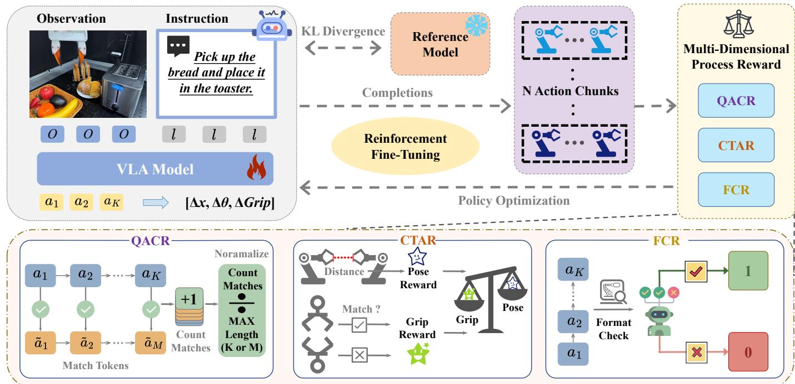
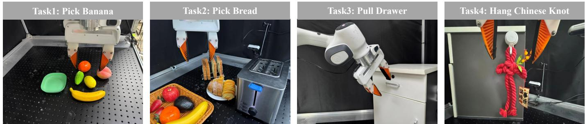
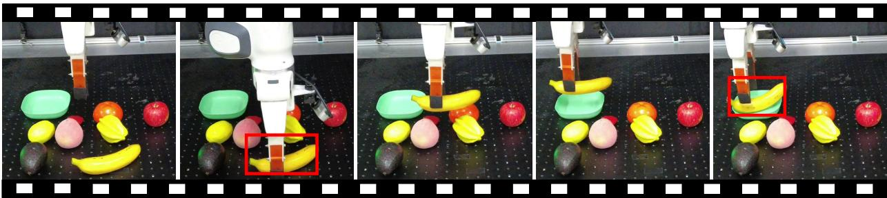
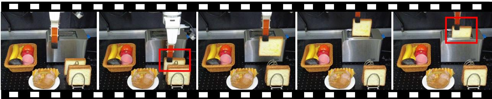
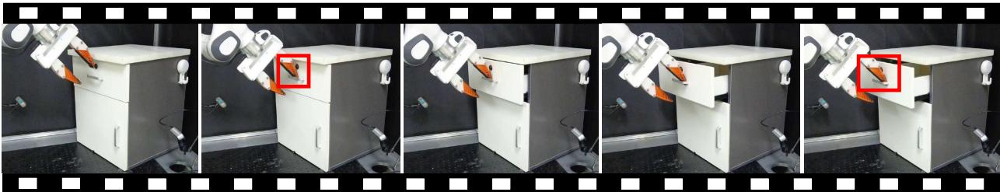
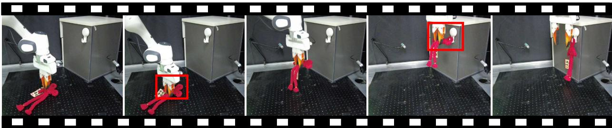
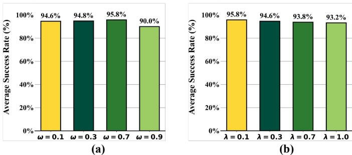
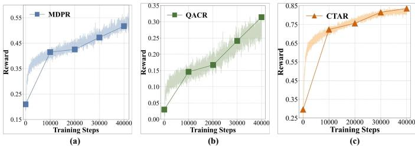

# 1. 论文基本信息

## 1.1. 标题与核心主题
本论文的标题为《**Towards Long-Lived Robots: Continual Learning VLA Models via Reinforcement Fine-Tuning**》（迈向长寿机器人：通过强化微调实现 VLA 模型的持续学习）。其核心主题是解决视觉 - 语言 - 动作（Vision-Language-Action, VLA）模型在适应新任务时面临的“灾难性遗忘”问题，并提出一种无需环境交互的强化微调策略。

## 1.2. 作者与机构
论文的主要作者是 **Yuan Liu** 和 **Haoran Li**（通讯作者）。他们的研究背景深厚，隶属于以下顶尖科研机构：
- **北京师范大学人工智能学院** (School of Artificial Intelligence, Beijing Normal University)
- **中国科学院自动化研究所** (Institute of Automation, Chinese Academy of Sciences, CASIA)
- **中国科学院大学人工智能学院** (School of Artificial Intelligence, University of Chinese Academy of Sciences)
- **北京智源人工智能研究院** (Beijing Academy of Artificial Intelligence)

  这些机构的参与表明该研究依托于中国在人工智能及机器人领域强大的科研实力。

## 1.3. 发表信息与来源
- **发布时间：** 2026-02-11 (UTC)
- **发布状态：** 预印本 (Preprint)，发布于 arXiv。
- **原文链接：** https://arxiv.org/abs/2602.10503
- **PDF 链接：** https://arxiv.org/pdf/2602.10503v1

## 1.4. 摘要概述
本文针对传统监督微调（Supervised Fine-Tuning, SFT）在适配 VLA 模型时存在的数据需求大以及容易导致灾难性遗忘的问题，提出了一种名为 **LifeLong-RFT** 的强化微调（Reinforcement Fine-Tuning, RFT）策略。该方法结合了<strong>分块级的同策略强化学习 (Chunking-Level On-Policy RL)</strong> 与提出的<strong>多维过程奖励 (Multi-Dimensional Process Reward, MDPR)</strong> 机制。MDPR 包含三个部分：量化动作一致性奖励（QACR）、连续轨迹对齐奖励（CTAR）和格式合规奖励（FCR）。实验表明，该方法在多任务和持续学习场景中均优于 SFT，特别是在 LIBERO 基准上实现了 22% 的平均成功率提升，且仅需 20% 的训练数据即可有效适应新任务。

# 2. 整体概括

## 2.1. 研究背景与动机
### 核心问题
随着大型数据集训练的进展，VLA 模型已成为通用机器人策略的重要方法。然而，将 VLA 模型适配到下游领域（即后训练阶段）主要依赖监督微调（SFT）。这种方法存在两个核心缺陷：
1.  **数据依赖高：** SFT 需要大量的特定任务数据，限制了其在低数据或少样本设置下的快速适应能力。
2.  <strong>灾难性遗忘 (Catastrophic Forgetting)：</strong> 学习新技能会严重削弱模型之前已掌握的知识。这使得 VLA 模型难以进化为能够持续获取新技能的“长寿”智能体。

### 挑战与空白
现有的解决方案往往需要在“可塑性”（学习新任务的能力）和“稳定性”（保留旧知识的能力）之间做权衡。虽然基础模型（Foundation Models）的出现改善了可迁移性，但直接应用 SFT 仍会导致严重的遗忘。此外，现有的强化微调方法通常依赖在线环境反馈或预训练的奖励模型，这增加了计算成本和部署难度（如仿真到现实的差距）。因此，如何设计高效、可靠且可扩展的奖励信号，以支持 VLA 模型的持续适应且不破坏原有能力，是当前领域的关键空白。

## 2.2. 核心贡献与主要发现
### 主要贡献
1.  **提出了 LifeLong-RFT 框架：** 这是一种结合分块级同策略强化学习与多维过程奖励（MDPR）的后训练策略，使 VLA 能够在有限演示下持续掌握新任务，同时保留原有能力。
2.  **设计了 MDPR 机制：** 包含 QACR、CTAR 和 FCR 三个维度，分别确保离散空间的动作准确性、连续控制的对齐性以及输出格式的结构性有效性。
3.  **实证验证了优越性能：** 在 SimplerEnv、LIBERO 和真实世界任务上的综合实验表明，该方法在多任务学习和持续学习方面显著优于 SFT 基线。

### 关键发现
- 在 LIBERO 基准的持续学习中，LifeLong-RFT 相较于 SFT 取得了 **22%** 的平均成功率提升（原文摘要提及 22%，正文实验部分提及 23% 提升，此处取实验详细数据为准）。
- 模型能够在使用 **20%** 训练数据的情况下有效适应新任务，展示了极高的数据效率。
- 多维奖励中的每一个组件（特别是 CTAR）对于任务完成都至关重要，缺一不可。

# 3. 预备知识与相关工作

## 3.1. 基础概念解析
为了深入理解本文，我们需要先明确以下几个核心技术术语：

- <strong>视觉 - 语言 - 动作模型 (Vision-Language-Action Models, VLA):</strong>
  VLA 模型是一种端到端的学习范式，它直接将多模态感知输入（图像、视频等视觉信息）和自然语言指令映射为机器人的控制动作。与传统分层架构不同，VLA 利用大规模预训练来获取操作先验，再通过微调适配具体任务。

- <strong>监督微调 (Supervised Fine-Tuning, SFT):</strong>
  这是目前 VLA 模型最常用的后训练方法。它利用专家演示数据（Observation-Instruction-Action pairs），通过最小化预测动作与真实动作之间的误差（通常是交叉熵损失）来更新模型参数。然而，SFT 倾向于过度拟合当前任务数据，导致对旧任务的记忆被覆盖。

- <strong>灾难性遗忘 (Catastrophic Forgetting):</strong>
  指在学习新任务的过程中，神经网络参数发生剧烈变化，导致模型在旧任务上的表现急剧下降的现象。这在持续学习（Continual Learning）场景中被视为最大障碍之一。

- <strong>强化微调 (Reinforcement Fine-Tuning, RFT):</strong>
  区别于 SFT，RFT 利用强化学习算法更新策略。模型通过与环境交互或自我生成样本，根据获得的奖励（Reward）来优化预期回报。本文强调的是不依赖环境交互的 RFT。

- <strong>同策略 (On-Policy) 与异策略 (Off-Policy):</strong>
  - <strong>同策略 (On-Policy):</strong> 策略更新所使用的数据是由当前策略本身生成的。这意味着数据分布会随着策略优化而改变。本文使用的 GRPO 属于此类。
  - <strong>异策略 (Off-Policy):</strong> 数据可以由旧策略或回放缓存收集，不一定来自当前策略。

- <strong>分块 (Chunking):</strong>
  在 VLA 模型中，动作序列通常被分成较小的片段（Chunks）进行预测。分块级处理允许模型独立评估每个时间步或动作片段的奖励，而不必等待整个长轨迹结束。

- <strong>词元 (Token):</strong>
  在 VLM 骨干网络中，文本和动作都被转化为离散的词元序列。模型通过自回归方式逐个预测下一个动作词元。

## 3.2. 前人工作与技术演进
### VLA 模型发展
早期的机器人策略模型多基于层级架构（感知层 + 规划层 + 执行层）。近年来，以 **RT-2**, **OpenVLA**, **$\pi_0$** 为代表的 VLA 模型通过端到端学习，直接将感知映射到动作，极大地提升了泛化能力。

### 强化微调现状
现有的 VLA 强化微调主要分为三类：
1.  <strong>基于仿真的方法 (Simulation-based):</strong> 利用模拟环境的高并行性和特权状态构建密集奖励。缺点是存在仿真到现实的差距（Sim-to-Real Gap）。
2.  <strong>基于真实世界的方法 (Real-world-based):</strong> 通过在线适应物理环境增强泛化，但成本高且难以获取奖励。
3.  <strong>世界模型驱动 (World Model-driven):</strong> 利用未来状态预测提供奖励信号。缺点是预测误差可能导致奖励黑客行为（Reward Hacking）。

### 持续学习 (Continual Learning)
在机器人持续学习方面，现有方法包括：
- **参数隔离:** 为每个任务分配特定参数（如 PackNet）。
- **模型融合:** 如 **MergeVLA**，解决多专家模型融合时的参数冲突。
- **知识驱动模仿:** 如 **Stellar VLA**，构建知识驱动的持续模仿学习框架。

  本文的创新在于**不依赖环境交互**，而是利用**MDPR 机制**结合**GRPO 算法**来解决持续学习问题，填补了无环境反馈下的 VLA 持续学习空白。

## 3.3. 差异化分析

| 特性 | 传统 SFT | 现有 RFT 方法 (如 $\pi_{rl}$, NORA) | 本文方法 (LifeLong-RFT) |
| :--- | :--- | :--- | :--- |
| **数据依赖** | 大量任务特定数据 | 通常需要环境交互或世界模型 | **仅需离线演示数据，无需环境交互** |
| **遗忘缓解** | 差 (易遗忘) | 较好 (取决于奖励设计) | <strong>强 (同策略 RL 特性 + MDPR)</strong> |
| **奖励来源** | 标签匹配 (Hard Label) | 环境真值、奖励模型 | <strong>多维过程奖励 (QACR+CTAR+FCR)</strong> |
| **应用场景** | 单次任务适配 | 复杂环境训练 | <strong>多任务与持续学习 (Long-Lived)</strong> |

# 4. 方法论

## 4.1. LifeLong-RFT 核心原理
本文提出的 **LifeLong-RFT** 是一种后训练范式，旨在让 VLA 模型在不与环境交互的情况下实现持续学习。其核心直觉是：<strong>利用分块级的同策略强化学习（On-Policy RL），并通过精心设计的多维过程奖励来量化每一步动作的质量，从而在不依赖环境反馈的情况下优化策略。</strong>

该方法整合了两个关键技术模块：
1.  <strong>分块级同策略强化学习 (Chunking-Level On-Policy Reinforcement Learning):</strong> 替代传统的全轨迹优化，独立评估每个动作分块的生成质量。
2.  <strong>多维过程奖励 (Multi-Dimensional Process Reward, MDPR):</strong> 一个不依赖环境的奖励函数，从三个维度（离散一致性、连续对齐、格式合规）提供反馈。

## 4.2. 核心方法详解：分块级强化学习
首先，我们介绍策略优化的基本框架。为了消除对环境交互的依赖，本文采用 **Group Relative Policy Optimization (GRPO)** 算法。与传统的 PPO 相比，GRPO 不需要显式的 Critic 网络，而是通过一组采样输出的比较来估计优势值，从而降低计算开销。

对于每个观测 $o$ 和指令 $l$，模型首先从旧策略 $\pi_{\theta_{\mathrm{old}}}(\mathbf{a}|o, l)$ 中采样一组 $G$ 个动作输出 $\{\mathbf{a}_{i}\}_{i=1}^{G}$。然后，针对每个输出计算任务特定的奖励 $r_i$。

基于组内奖励的均值和标准差，计算每个输出的相对优势 $A_i$。公式如下所示：

$$
A_{i} = \frac{r_{i} - \operatorname*{mean}(\{r_{1}, \dots, r_{G}\})}{\operatorname*{std}(\{r_{1}, \dots, r_{G}\})}
$$

其中，$\operatorname*{mean}(\cdot)$ 和 $\operatorname*{std}(\cdot)$ 分别表示组内所有奖励的统计量。这个归一化过程使得模型能更清晰地识别出相对较好的生成结果。

得到优势 $A_i$ 后，策略参数 $\theta$ 通过最大化以下目标函数进行优化：

$$
\begin{array} { l } { { \displaystyle { \cal J } _ { \mathrm { G R P O } } ( \theta ) = \mathbb { E } _ { ( o , l ) \sim \mathcal { B } , \{ { \bf a } _ { i } \} _ { i = 1 } ^ { G } \sim \pi _ { \theta _ { \mathrm { o l d } } } ( \cdot \vert o , l ) } } } \\ { { \displaystyle ~ \frac { 1 } { G } \sum _ { i = 1 } ^ { G } \lbrace \operatorname* { m i n } \lbrack \frac { \pi _ { \theta } \left( { \bf a } _ { i } \vert o , l \right) } { \pi _ { \theta _ { \mathrm { o l d } } } \left( { \bf a } _ { i } \vert o , l \right) } A _ { i } , } } \\ { { \displaystyle ~ \mathrm { c l i p } \left( \frac { \pi _ { \theta } \left( { \bf a } _ { i } \vert o , l \right) } { \pi _ { \theta _ { \mathrm { o l d } } } \left( { \bf a } _ { i } \vert o , l \right) } , 1 - \epsilon , 1 + \epsilon \right) A _ { i } \rbrack } } \\ { { \displaystyle ~ - \gamma D _ { K L } \left[ \pi _ { \theta } | | \pi _ { \mathrm { r e f } } \vert . } } \end{array}
$$

在此公式中：
- $\mathcal{B}$ 表示专家演示数据集，包含观测 $o$ 和语言指令 $l$。
- $\pi_{\theta}(\mathbf{a}_{i}|o,l)$ 是新策略的概率分布。
- $\pi_{\theta_{\mathrm{old}}}(\mathbf{a}_{i}|o,l)$ 是旧策略的概率分布。
- **clip 函数** 限制概率比率在 $[1-\epsilon, 1+\epsilon]$ 范围内，防止策略更新幅度过大。
- $\gamma$ 调节 KL 散度正则项 $D_{KL}[\pi_{\theta}||\pi_{\mathrm{ref}}]$ 的强度，防止新策略 $\pi_{\theta}$ 过度偏离参考策略 $\pi_{\mathrm{ref}}$（通常指初始模型）。

## 4.3. 核心方法详解：多维过程奖励 (MDPR)
由于无法像传统 RL 那样从环境中获得真实反馈，构造高效的奖励函数 $r_i$ 成为关键。本文设计了 **Multi-Dimensional Process Reward (MDPR)** 机制，将动作分块的评估分解为三个互补的维度。

### 4.3.1. 量化动作一致性奖励 (Quantized Action Consistency Reward, QACR)
VLA 模型基于 VLM 骨干网络生成离散动作词元。QACR 旨在确保生成的离散词元与真实标注数据（Ground Truth）的一致性。

**算法流程：**
1.  **格式检查：** 验证生成的动作序列是否符合预设的动作分词器 Fast+ [56] 规范（即动作分块大小和维度）。若无效，直接奖励为 0。
2.  **位置匹配：** 对有效的生成序列 $\mathbf{a} = \{a_{u}\}_{u=1}^{U}$ 和真实标注 $\tilde{\mathbf{a}} = \{\tilde{a}_{v}\}_{v=1}^{V}$，按位置计算匹配数量。

**计算公式：**

$$
\mathrm { Q A C R } = \left\{ \begin{array} { l l } { \displaystyle \frac { \sum _ { \ell = 1 } ^ { \operatorname* { m i n } ( U , V ) } \mathbb { I } ( a _ { \ell } = \tilde { a } _ { \ell } ) } { \operatorname* { m a x } ( U , V ) } , } & { \mathrm { i f ~ v a l i d } } \\ { \displaystyle 0 , } & { \mathrm { o t h e r w i s e } } \end{array} \right.
$$

**符号解释：**
- $\mathbb{I}(\cdot)$ 是指示函数，当条件成立返回 1，否则返回 0。
- $a_{\ell}$ 是第 $\ell$ 个预测的动作词元，$\tilde{a}_{\ell}$ 是对应的真实词元。
- $\operatorname*{max}(U, V)$ 用于归一化，使得无论序列长短，得分都在 `[0, 1]` 之间。
- "valid" 表示预测序列满足 Fast+ 分词器的解码要求。

### 4.3.2. 连续轨迹对齐奖励 (Continuous Trajectory Alignment Reward, CTAR)
QACR 仅保证了离散空间内的准确性，但物理执行需要连续的轨迹。CTAR 评估解码后的连续动作与参考轨迹的空间对齐程度。

**算法流程：**
1.  **格式验证：** 与 QACR 相同，无效序列奖励为 0。
2.  **解码：** 使用 Fast+ 分词器将预测的词元 $\mathbf{a}$ 解码为连续动作分块 $\mathbf{y}$，包含 $H$ 个时间步。每个动作向量 $\mathbf{y}_{t}$ 包含姿态分量 $\mathbf{y}_{t}^{\mathrm{pose}}$ 和夹爪分量 $\mathbf{y}_{t}^{\mathrm{grip}}$。
3.  **姿态奖励：** 计算预测姿态与真实姿态的归一化 L1 距离 $d_t$，并通过指数衰减函数转换为奖励 $r_{t}^{\mathrm{pose}} = \exp(-\alpha \cdot d_t)$。
4.  **夹爪奖励：** 使用二元奖励 $r_{t}^{\mathrm{grip}}$，若预测的夹爪状态与真实状态匹配则为 1，否则为 0。
5.  **加权平均：** 组合两者并平均得到最终得分。

**计算公式：**

$$
\mathrm { C T A R } = \left\{ \begin{array} { l l } { \displaystyle \frac { 1 } { H } \sum _ { t = 1 } ^ { H } \left( \beta \cdot r _ { t } ^ { \mathrm { p o s e } } + \left( 1 - \beta \right) \cdot r _ { t } ^ { \mathrm { g r i p } } \right) , } & { \mathrm { i f ~ v a l i d } } \\ { 0 , } & { \mathrm { o t h e r w i s e } } \end{array} \right.
$$

**符号解释：**
- $r_{t}^{\mathrm{pose}} = \exp(-\alpha \cdot d_{t})$，其中 $\alpha$ 调节对姿态偏差的敏感度。
- $r_{t}^{\mathrm{grip}} = \mathbb{I}(\mathbf{y}_{t}^{\mathrm{grip}} = \tilde{\mathbf{y}}_{t}^{\mathrm{grip}})$。
- $\beta \in [0, 1]$ 调制姿态奖励和夹爪奖励的相对重要性。

### 4.3.3. 格式合规奖励 (Format Compliance Reward, FCR)
为了确保动作的可执行性，生成的输出必须符合结构化要求。FCR 作为一个二元奖励，鼓励模型生成结构正确的 token 序列。

**计算公式：**

$$
\mathrm { F C R } = \left\{ { \begin{array} { l l } { 1 , } & { { \mathrm { i f ~ } } { \mathrm { v a l i d } } } \\ { 0 , } & { { \mathrm { o t h e r w i s e } } } \end{array} } \right.
$$

其中 "valid" 指模型输出遵循了预定义的输出格式，使 Fast+ 分词器能够将其成功解码。

### 4.3.4. MDPR 合成
最后，将上述三个奖励合成为最终的总奖励：

$$
{ \bf M D P R } = \boldsymbol { \omega } \cdot { \bf Q A C R } + ( 1 - \boldsymbol { \omega } ) \cdot { \bf C T A R } + \boldsymbol { \lambda } \cdot { \bf F C R }
$$

其中 $\omega \in [0, 1]$ 控制离散一致性与连续对齐之间的权衡，$\lambda$ 缩放格式合规性的权重。在实验中，设定 $\omega = 0.7, \lambda = 0.1$。

下图（原文 Figure 2）展示了 LifeLong-RFT 的整体策略及其与多维过程奖励机制的结合：

*该图像是示意图，展示了使用多维过程奖励机制优化强化学习的策略。图中包含了 VLA 模型的观察和指令输入，涵盖了 QACR、CTAR 和 FCR 三个奖励机制，用于确保精确的行为预测、对齐连续动作和格式合规性。*

# 5. 实验设置

## 5.1. 数据集与实验环境
为了全面评估方法的有效性，作者在仿真和真实世界环境中进行了测试。
- **SimplerEnv:** 包含 WidowX 和 Google Robot 平台。使用 BridgeData V2 和 Fractal 数据集进行预训练。
- **LIBERO:** 一个针对持续学习的基准测试，包含 Object、Spatial、Goal 和 Long 四个任务套件。
- **真实世界任务:** 在 Franka 机械臂上进行，包含四个任务：Pick Banana（捡香蕉）、Pick Bread（捡面包）、Pull Drawer（拉抽屉）、Hang Chinese Knot（挂中国结）。

  图（原文 Figure 3）展示了这四个真实世界任务的示例，直观呈现了任务的多样性：

  
  *该图像是示意图，展示了四个不同的机器人任务：任务1是捡香蕉，任务2是捡面包，任务3是拉抽屉，任务4是挂中国结。这些任务是针对VLA模型在多任务学习中的应用进行评估的。*

## 5.2. 评估指标
论文使用了多个指标来评估多任务学习和持续学习能力。以下是各指标的详细定义与公式：

### 5.2.1. 成功率 (Success Rate, SR)
- **概念定义:** 衡量模型完成任务成功的比例，是多任务学习的主要指标。
- **计算方式:** $\text{SR} = \frac{\text{Successful Trials}}{\text{Total Trials}} \times 100\%$。
- **解释:** 重复多次试验（如 24 次或 50 次），统计成功完成的次数占比。

### 5.2.2. 前向转移 (Forward Transfer, FWT)
- **概念定义:** 衡量模型在学到新任务后，对新任务本身的适应能力。数值越高，说明适应新任务越快。
- **数学公式:**
  $$
\mathrm { F W T } = \sum _ { k \in [ K ] } \frac { s _ { k , k } } { K }
$$
- **符号解释:**
    - $K$ 是任务总数。
    - $s_{k,k}$ 表示模型在学到第 $k$ 个任务后，在第 $k$ 个任务上的成功率。
    - 该公式实际上计算的是每个任务在刚学会时的平均表现。

### 5.2.3. 负向后向转移 (Negative Backward Transfer, NBT)
- **概念定义:** 衡量灾难性遗忘的程度。数值越低越好（最好是负数，表示能力提升；或者接近 0，表示无遗忘）。它计算后续学习任务完成后，对之前任务表现下降的幅度。
- **数学公式:**
  $$
\mathrm { N B T } = \sum _ { k \in [ K ] } \frac { \mathrm { N B T } _ { k } } { K }, \quad \mathrm { N B T } _ { k } = \frac { 1 } { K - k } \sum _ { q = k + 1 } ^ { K } ( s _ { k , k } ~ - ~ s _ { q , k } )
$$
- **符号解释:**
    - $s_{q,k}$ 表示在学到第 $q$ 个任务后，在第 $k$ 个旧任务上的成功率。
    - $s_{k,k}$ 是在第 $k$ 个任务刚学完时的表现。
    - $(s_{k,k} - s_{q,k})$ 代表遗忘量。
    - 如果 $\mathrm{NBT}$ 为负，表示不仅没遗忘，甚至因为新知识辅助旧知识而变强（正向后向转移）。

### 5.2.4. 曲线下面积 (Area Under Curve, AUC)
- **概念定义:** 衡量在整个学习周期内，模型在所有任务上的平均表现。反映了整体的稳定性和有效性。
- **数学公式:**
  $$
\mathsf { A U C } = \sum _ { k \in [ K ] } \frac { \mathsf { A U C } _ { k } } { K }, \quad \mathrm { A U C } _ { k } = \frac { 1 } { K - k + 1 } \big ( s _ { k , k } + \sum _ { q = k + 1 } ^ { K } s _ { q , k } \big )
$$
- **符号解释:**
    - 对于每个时刻 $k$，计算从当前学到所有历史任务（共 `K-k+1` 个任务）的平均成功率。
    - 对所有时刻 $k$ 取平均。

## 5.3. 对比基线
为了验证方法的优越性，作者将 LifeLong-RFT 与多种基线进行了对比：
- **连续动作模型:** Octo-Base, GRO0T N1, $\pi_0$, OpenVLA-OFT, ThinkAct 等。
- **离散动作模型:** TraceVLA, RT-1-X, OpenVLA, SpatialVLA, $\pi_0$-FAST, MolmoAct 等。
- **持续学习方法:** BUDS, LOTUS, SPECI, OpenVLA-OFT (Fine-tuning)。
- **SFT 基线:** 最基础的监督微调方法。

# 6. 实验结果与分析

## 6.1. 多任务学习结果
在 SimplerEnv 和 LIBERO 数据集上，LifeLong-RFT 展现了强大的多任务处理能力。

### 6.1.1. SimplerEnv 表现
以下是原文 **Table I** 中 SimplerEnv 上多任务学习性能的完整结果：

<table>
<thead>
<tr>
<th rowspan="2">Method</th>
<th rowspan="2">Training Strategy</th>
<th colspan="5">WidowX (Visual Matching)</th>
<th colspan="4">Google Robot (Visual Matching)</th>
</tr>
<tr>
<th>Put Carrot on Plate</th>
<th>Stack Blocks</th>
<th>Put Spoon on Towel</th>
<th>Put Eggplant in Basket</th>
<th>Avg</th>
<th>Pick Coke Can</th>
<th>Move Near</th>
<th>Open/Close Drawer</th>
<th>Avg</th>
</tr>
</thead>
<tbody>
<tr><td colspan="11"><strong>Continuous Action Models</strong></td></tr>
<tr><td>Octo-Base [66]</td><td>SFT</td><td>8.3</td><td>0.0</td><td>12.5</td><td>43.1</td><td>16.0</td><td>17.0</td><td>4.2</td><td>22.7</td><td>16.8</td></tr>
<tr><td>RoboVLM [39]</td><td>SFT</td><td>25.0</td><td>12.5</td><td>29.2</td><td>58.3</td><td>31.3</td><td>77.3</td><td>61.7</td><td>43.5</td><td>63.4</td></tr>
<tr><td>GROOT N1.5 [53]</td><td>SFT</td><td>−</td><td>−</td><td>−</td><td>−</td><td>−</td><td>69.3</td><td>68.7</td><td>35.8</td><td>52.4</td></tr>
<tr><td>$\pi_0$ [6]</td><td>SFT</td><td>58.8</td><td>21.3</td><td>63.3</td><td>79.2</td><td>55.7</td><td>72.7</td><td>65.3</td><td>38.3</td><td>58.7</td></tr>
<tr><td>ThinkAct [22]</td><td>SFT + RFT</td><td>37.5</td><td>8.7</td><td>58.3</td><td>70.8</td><td>43.8</td><td>92.0</td><td>72.4</td><td>50.0</td><td>71.5</td></tr>
<tr><td>NORA-1.5 [24]</td><td>SFT</td><td>−</td><td>−</td><td>−</td><td>−</td><td>−</td><td>92.8</td><td>78.7</td><td>62.2</td><td>77.9</td></tr>
<tr><td>NORA-1.5 [24] (DPO)</td><td>SFT+RFT</td><td>−</td><td>−</td><td>−</td><td>−</td><td>−</td><td>94.0</td><td>88.0</td><td>66.4</td><td>82.8</td></tr>
<tr><td colspan="11"><strong>Discrete Action Models</strong></td></tr>
<tr><td>TraceVLA [80]</td><td>SFT</td><td>−</td><td>−</td><td>−</td><td>−</td><td>−</td><td>28.0</td><td>53.7</td><td>57.0</td><td>42.0</td></tr>
<tr><td>RT-1-X [7]</td><td>SFT</td><td>4.2</td><td>0.0</td><td>0.0</td><td>0.0</td><td>1.1</td><td>56.7</td><td>31.7</td><td>59.7</td><td>53.4</td></tr>
<tr><td>OpenVLA [28]</td><td>SFT</td><td>0.0</td><td>0.0</td><td>0.0</td><td>4.1</td><td>1.0</td><td>16.3</td><td>46.2</td><td>35.6</td><td>27.7</td></tr>
<tr><td>SpatialVLA [57]</td><td>SFT</td><td>25.0</td><td>29.2</td><td>16.7</td><td>100.0</td><td>42.7</td><td>86.0</td><td>77.9</td><td>57.4</td><td>73.7</td></tr>
<tr><td>$\pi_0$-FAST [56]</td><td>SFT</td><td>22.0</td><td>83.0</td><td>29.0</td><td>48.0</td><td>45.5</td><td>75.3</td><td>67.5</td><td>42.6</td><td>61.9</td></tr>
<tr><td>NORA-1.5-FAST [24]</td><td>SFT</td><td>−</td><td>−</td><td>−</td><td>−</td><td>−</td><td>88.6</td><td>86.4</td><td>41.2</td><td>72.1</td></tr>
<tr><td>NORA-Long [25] (Baseline)</td><td>SFT</td><td>46.0</td><td>60.3</td><td>80.2</td><td>75.7</td><td>65.5</td><td>86.0</td><td>82.3</td><td>56.0</td><td>74.7</td></tr>
<tr><td><strong>NORA-Long [25] (Ours)</strong></td><td><strong>RFT</strong></td><td><strong>50.2</strong></td><td><strong>64.4</strong></td><td><strong>84.3</strong></td><td><strong>77.0</strong></td><td><strong>69.0</strong></td><td><strong>94.0</strong></td><td><strong>84.7</strong></td><td><strong>58.5</strong></td><td><strong>79.1</strong></td></tr>
<tr><td>$\Delta$</td><td></td><td>+4.2</td><td>+4.1</td><td>+4.1</td><td>+1.3</td><td>+3.5</td><td>+8.0</td><td>+2.4</td><td>+2.5</td><td>+4.4</td></tr>
</tbody>
</table>

结果显示，相比于 SFT 基线（NORA-Long），我们的方法在 WidowX 平台上平均成功率提升了 3.5%，在 Google Robot 平台上提升了 4.4%。

### 6.1.2. LIBERO 表现
在 LIBERO 基准上，LifeLong-RFT 同样表现出色。以下是原文 **Table II** 的结果：

<table>
<thead>
<tr>
<th rowspan="2">Method</th>
<th rowspan="2">Training Strategy</th>
<th colspan="4">LIBERO</th>
<th rowspan="2">Avg</th>
</tr>
<tr>
<th>Object</th>
<th>Spatial</th>
<th>Goal</th>
<th>Long</th>
</tr>
</thead>
<tbody>
<tr><td colspan="7"><strong>Continuous Action Models</strong></td></tr>
<tr><td>Octo-Base [66]</td><td>SFT</td><td>85.7</td><td>78.9</td><td>84.6</td><td>51.1</td><td>75.1</td></tr>
<tr><td>GRO0T N1 [5]</td><td>SFT</td><td>97.6</td><td>94.4</td><td>93.0</td><td>90.6</td><td>93.9</td></tr>
<tr><td>$\pi_0$ [6]</td><td>SFT</td><td>98.8</td><td>96.8</td><td>95.8</td><td>85.2</td><td>94.2</td></tr>
<tr><td>OpenVLA-OFT [29]</td><td>SFT</td><td>98.1</td><td>96.9</td><td>95.5</td><td>91.1</td><td>95.4</td></tr>
<tr><td>ThinkAct [22]</td><td>SFT + RFT</td><td>91.4</td><td>88.3</td><td>87.1</td><td>70.9</td><td>84.4</td></tr>
<tr><td>VLA-RFT [35]</td><td>SFT + RFT</td><td>94.4</td><td>94.4</td><td>95.4</td><td>80.2</td><td>91.1</td></tr>
<tr><td>NORA-1.5 [24]</td><td>SFT</td><td>96.4</td><td>97.3</td><td>94.5</td><td>89.6</td><td>94.5</td></tr>
<tr><td>NORA-1.5 [24] (DPO)</td><td>SFT + RFT</td><td>96.0</td><td>98.0</td><td>95.4</td><td>90.5</td><td>95.0</td></tr>
<tr><td colspan="7"><strong>Discrete Action Models</strong></td></tr>
<tr><td>TraceVLA [80]</td><td>SFT</td><td>85.2</td><td>84.6</td><td>−</td><td>54.1</td><td>74.8</td></tr>
<tr><td>OpenVLA [28]</td><td>SFT</td><td>88.4</td><td>84.7</td><td>79.2</td><td>53.7</td><td>76.5</td></tr>
<tr><td>SpatialVLA [57]</td><td>SFT</td><td>89.9</td><td>88.2</td><td>78.6</td><td>55.5</td><td>78.1</td></tr>
<tr><td>CoT-VLA [78]</td><td>SFT</td><td>91.6</td><td>87.5</td><td>87.6</td><td>69.0</td><td>83.9</td></tr>
<tr><td>WorldVLA [8]</td><td>SFT</td><td>96.2</td><td>87.6</td><td>83.4</td><td>60.0</td><td>79.1</td></tr>
<tr><td>$\pi_0$-Fast [56]</td><td>SFT</td><td>96.8</td><td>96.4</td><td>88.6</td><td>60.2</td><td>85.5</td></tr>
<tr><td>MolmoAct-7B-D [32]</td><td>SFT</td><td>95.4</td><td>87.0</td><td>87.6</td><td>77.2</td><td>86.6</td></tr>
<tr><td>TGRPO [15]</td><td>SFT + RFT</td><td>92.2</td><td>90.4</td><td>81.0</td><td>59.2</td><td>80.7</td></tr>
<tr><td>NORA-Long [25] (Baseline)</td><td>SFT</td><td>97.5</td><td>96.4</td><td>91.0</td><td>82.4</td><td>91.8</td></tr>
<tr><td><strong>NORA-Long [25] (Ours)</strong></td><td><strong>RFT</strong></td><td><strong>99.2</strong></td><td><strong>98.2</strong></td><td><strong>95.8</strong></td><td><strong>89.0</strong></td><td><strong>95.6</strong></td></tr>
<tr><td>$\Delta$</td><td></td><td>+1.7</td><td>+1.8</td><td>+4.8</td><td>+6.6</td><td>+3.8</td></tr>
</tbody>
</table>

LifeLong-RFT 的平均成功率达到了 **95.6%**，超过了所有连续的离散动作模型基线。

### 6.1.3. 真实世界表现
在 Franka 机械臂的真实实验中，LifeLong-RFT 同样优于 SFT。原文 **Table III** 显示，相对于 SFT 基线，平均成功率提升了 **8.7%**，在精细操作任务 "Hang Chinese Knot" 上提升了 15%。

<table>
<thead>
<tr>
<th rowspan="2">Task Split</th>
<th colspan="1">$π_0$ [6]</th>
<th colspan="1">OpenVLA [28]</th>
<th colspan="3">NORA-Long [24]</th>
</tr>
<tr>
<th>SFT</th>
<th>SFT</th>
<th>SFT</th>
<th>RFT (Ours)</th>
<th>∆</th>
</tr>
</thead>
<tbody>
<tr><td>Pick Banana</td><td>90.0</td><td>75.0</td><td>85.0</td><td>90.0</td><td>+5.0</td></tr>
<tr><td>Pick Bread</td><td>75.0</td><td>70.0</td><td>75.0</td><td>85.0</td><td>+10.0</td></tr>
<tr><td>Pull Drawer</td><td>95.0</td><td>85.0</td><td>95.0</td><td>100.0</td><td>+5.0</td></tr>
<tr><td>Hang Chinese Knot</td><td>65.0</td><td>55.0</td><td>60.0</td><td>75.0</td><td>+15.0</td></tr>
<tr><td>Overall</td><td>81.3</td><td>71.3</td><td>78.8</td><td>87.5</td><td>+8.7</td></tr>
</tbody>
</table>

图（原文 Figure 7, Figure 8, Figure 9, Figure 10）展示了真实世界中四个任务的执行示例，直观验证了方法的鲁棒性：

*该图像是执行“拾取香蕉”任务的代表性截图。图中展示了一个机械手臂在不同阶段的操作过程，包括选择香蕉和成功放置在指定位置的步骤。*

*该图像是展示 Pick Bread 任务的执行过程，包括六个步骤。每个步骤展示了机器人如何从多个食物选项中精确地拾起面包。关键动作被高亮显示，以便清晰展示操作流程。*

*该图像是Pull Drawer任务的执行示例，展示了机械臂在不同阶段抓取和拉动抽屉的过程。图中使用红框标识了关键动作阶段，显示了动作的连续性和精确性。*

*该图像是展示了执行中国结任务的过程，包括机械臂逐步操作的多个帧画面，重点演示了如何正确挂置物体，并确保每个步骤的准确性。*

## 6.2. 持续学习结果
持续学习是本文的核心关注点。在 LIBERO 和真实世界上的持续学习实验结果如下。

### 6.2.1. LIBERO 持续学习
以下是原文 **Table IV** 中 LIBERO 基准上的持续学习性能对比：

<table>
<thead>
<tr>
<th rowspan="2">Task Split</th>
<th rowspan="2">Metrics</th>
<th>BUDS [82] BC</th>
<th>LOTUS [68] BC</th>
<th>SPECI [72] BC</th>
<th>$π_0$ [6] SFT</th>
<th>OpenVLA [28] SFT</th>
<th>OpenVLA-OFT [29] SFT</th>
<th colspan="3">NORA-Long [25]</th>
</tr>
<tr>
<th>SFT</th>
<th>RFT (Ours)</th>
<th>∆</th>
</tr>
</thead>
<tbody>
<tr><td rowspan="4">LIBERO-Object</td><td>FWT (↑)</td><td>52.0</td><td>74.0</td><td>83.0</td><td>73.0</td><td>59.4</td><td>89.8</td><td>84.8</td><td>96.0</td><td>+11.2</td></tr>
<tr><td>NBT (↓)</td><td>21.0</td><td>11.0</td><td>10.0</td><td>16.2</td><td>17.9</td><td>3.1</td><td>6.8</td><td>1.5</td><td>-5.3</td></tr>
<tr><td>AUC (↑)</td><td>47.0</td><td>65.0</td><td>78.0</td><td>59.3</td><td>45.1</td><td>87.4</td><td>79.7</td><td>94.8</td><td>+15.1</td></tr>
<tr><td>FWT (↑)</td><td>−</td><td>−</td><td>67.0</td><td>74.4</td><td>64.2</td><td>88.6</td><td>82.8</td><td>94.0</td><td>+11.2</td></tr>
<tr><td rowspan="2">LIBERO-Spatial</td><td>NBT (↓)</td><td>−</td><td>−</td><td>6.0</td><td>23.7</td><td>17.6</td><td>9.4</td><td>14.0</td><td>3.7</td><td>-10.3</td></tr>
<tr><td>AUC (↑)</td><td>−</td><td>−</td><td>66.0</td><td>55.5</td><td>50.8</td><td>81.7</td><td>71.7</td><td>91.2</td><td>+19.5</td></tr>
<tr><td rowspan="4">LIBERO-Goal</td><td>FWT (↑)</td><td>50.0</td><td>61.0</td><td>74.0</td><td>74.6</td><td>58.6</td><td>90.2</td><td>72.8</td><td>92.4</td><td>+19.6</td></tr>
<tr><td>NBT (↓)</td><td>39.0</td><td>30.0</td><td>20.0</td><td>23.9</td><td>5.8</td><td>13.8</td><td>25.2</td><td>3.1</td><td>-22.1</td></tr>
<tr><td>AUC (↑)</td><td>42.0</td><td>56.0</td><td>65.0</td><td>56.3</td><td>53.5</td><td>79.2</td><td>54.4</td><td>90.3</td><td>+35.9</td></tr>
<tr><td>FWT (↑)</td><td>−</td><td>−</td><td>58.0</td><td>53.8</td><td>32.0</td><td>64.0</td><td>61.0</td><td>74.2</td><td>+13.2</td></tr>
<tr><td rowspan="2">LIBERO-Long</td><td>NBT (↓)</td><td>−</td><td>−</td><td>21.0</td><td>14.2</td><td>14.1</td><td>31.4</td><td>17.3</td><td>12.8</td><td>-4.5</td></tr>
<tr><td>AUC (↑)</td><td>−</td><td>−</td><td>46.0</td><td>42.5</td><td>20.8</td><td>38.7</td><td>47.3</td><td>64.5</td><td>+17.2</td></tr>
</tbody>
</table>

在 LIBERO-Goal 套件中，LifeLong-RFT 在 AUC 指标上获得了 **+35.9** 的巨大提升，远高于 SFT 基线（72.8 -> 92.4 对应 Task Split 行略有不同，这里看 Overall AUC 趋势）。这表明在长期任务序列中，MDPR 机制极大地缓解了遗忘。

### 6.2.2. 真实世界持续学习
原文 **Table V** 展示了真实世界环境下的持续学习结果：

<table>
<thead>
<tr>
<th rowspan="2">Task Split</th>
<th rowspan="2">Metrics</th>
<th>$π_0$ [6] SFT</th>
<th>OpenVLA [28] SFT</th>
<th colspan="3">NORA-Long [25]</th>
</tr>
<tr>
<th>SFT</th>
<th>RFT (Ours)</th>
<th>∆</th>
</tr>
</thead>
<tbody>
<tr><td rowspan="3"></td><td>FWT (↑)</td><td>58.8</td><td>46.3</td><td>56.3</td><td>80.0</td><td>+23.7</td></tr>
<tr><td>Real-World NBT (↓)</td><td>16.3</td><td>17.8</td><td>18.3</td><td>6.1</td><td>-12.2</td></tr>
<tr><td>AUC (↑)</td><td>47.9</td><td>35.1</td><td>44.2</td><td>75.9</td><td>+31.7</td></tr>
</tbody>
</table>

结果表明，在真实世界中，LifeLong-RFT 的 FWT 比 SFT 基线高出 **23.7**，NBT 仅为 **6.1**（远低于 SFT 的 18.3），证明模型极有效地保留了旧知识。

## 6.3. 消融实验与参数分析
### 6.3.1. MDPR 组件有效性
下表（原文 **Table VI**）展示了移除各个奖励组件后的性能下降情况，验证了 MDPR 各部分的必要性：

<table>
<thead>
<tr>
<th rowspan="2">Settings</th>
<th colspan="2">Object</th>
<th colspan="2">Spatial</th>
<th colspan="2">Goal</th>
<th colspan="2">Long</th>
<th colspan="2">Avg</th>
</tr>
<tr>
<th>SR</th>
<th>Δ</th>
<th>SR</th>
<th>Δ</th>
<th>SR</th>
<th>Δ</th>
<th>SR</th>
<th>Δ</th>
<th>SR</th>
<th>Δ</th>
</tr>
</thead>
<tbody>
<tr><td>w/o QACR</td><td>97.0</td><td>-2.2</td><td>96.4</td><td>-1.8</td><td>92.2</td><td>-3.6</td><td>85.6</td><td>-3.4</td><td>92.8</td><td>-2.8</td></tr>
<tr><td>w/o CTAR</td><td>8.0</td><td>-91.2</td><td>6.2</td><td>-92.0</td><td>2.4</td><td>-93.4</td><td>2.0</td><td>-87.0</td><td>4.7</td><td>-90.9</td></tr>
<tr><td>w/o FCR</td><td>98.0</td><td>-1.2</td><td>96.2</td><td>-2.0</td><td>93.2</td><td>-2.6</td><td>84.6</td><td>-4.4</td><td>93.0</td><td>-2.6</td></tr>
<tr><td>RFT (Ours)</td><td>99.2</td><td>-</td><td>98.2</td><td>-</td><td>95.8</td><td>-</td><td>89.0</td><td>-</td><td>95.6</td><td>-</td></tr>
</tbody>
</table>

分析显示：
- **CTAR 至关重要:** 移除 CTAR 导致成功率暴跌至 4.7%（平均），说明连续轨迹对齐是任务完成的关键。
- **QACR 和 FCR:** 移除它们也会导致 2-4% 左右的性能下降，说明离散一致性和格式合规性是基础保障。

### 6.3.2. 超参数敏感性
原文 Figure 5 分析了奖励权重 $\omega$ 和 $\lambda$ 的影响。结果显示模型在较宽的参数范围内具有鲁棒性。例如 $\omega$ 在 0.1 到 0.7 之间表现稳定，但当 $\omega=0.9$（意味着 CTAR 权重过低）时性能下降明显。

*该图像是条形图，展示了在不同权重组合下的平均成功率。图中分为两部分：(a) 显示了不同 $\omega$ 值（0.1、0.3、0.7、0.9）对平均成功率的影响，成功率从94.6%到95.8%；(b) 显示了不同 $\lambda$ 值（0.1、0.3、0.7、1.0）的影响，成功率在93.2%到95.8%之间。数据可视化帮助分析奖励组合对性能的作用。*

### 6.3.3. 训练动态
图（原文 Figure 6）展示了训练过程中 MDPR、QACR 和 CTAR 的变化曲线。可以看到，随着训练步骤的增加，所有奖励分数均呈持续增长趋势，表明策略在各个维度上都在不断优化。

*该图像是图表，展示了训练阶段中不同奖励机制的代表性曲线。具体而言，图中包含了MDPR、QACR和CTAR的训练演变过程，横轴为训练步骤，纵轴为奖励值。*

# 7. 总结与思考

## 7.1. 结论总结
本文提出了一种名为 **LifeLong-RFT** 的新范式，旨在解决 VLA 模型在持续学习中的关键挑战。通过创新性地结合分块级同策略强化学习与多维过程奖励（MDPR）机制，该工作成功地在无需环境交互的前提下实现了高效的策略优化。
主要结论如下：
1.  **克服遗忘:** LifeLong-RFT 在 LIBERO 和真实世界任务上显著优于 SFT，证明了强化微调在保持知识稳定性方面的优势。
2.  **数据效率:** 方法仅需少量数据（20%）即可有效适应新任务，适合资源受限的场景。
3.  **模块化奖励设计:** MDPR 的三个组件（QACR, CTAR, FCR）共同作用，缺一不可，确保了从离散词元到连续控制的全面优化。

## 7.2. 局限性与未来工作
尽管成果显著，作者也诚实地指出了局限性：
- **离散动作模型限制:** 当前工作主要集中在离散动作模型上，其性能上限可能低于连续动作模型。
- **软物体操作:** 在真实世界的 "Hang Chinese Knot"（挂中国结）任务中，涉及变形物体操作的成功率相对较低（60%），表明对柔性物体的控制仍需改进。
- **未来方向:** 计划将 LifeLong-RFT 扩展至连续动作模型，并进一步探索复杂环境下的自适应能力。

## 7.3. 个人启发与批判性思考
作为一名研究者，本文给我带来了以下几点深刻启发：
1.  **奖励函数的设计哲学:** 以往 RL 往往依赖复杂的 Reward Model 或环境反馈。本文展示了如何通过<strong>过程奖励（Process Reward）</strong>而非仅仅是最终结果奖励（Outcome Reward）来指导训练。这种思路特别适合没有精确环境交互的离线或半离线场景。将奖励分解为离散、连续、格式三个层面是非常巧妙的工程实践。
2.  **GRPO 在机器人领域的应用:** 本文验证了 GRPO（原本在 LLM 推理中流行）在机器人控制策略优化中的潜力。它避免了训练 Critic 网络的开销，这对于高维度的机器人动作空间尤为重要。
3.  **潜在风险与改进:**
    - **过拟合风险:** 虽然强调了持续学习，但如此高度依赖 MDPR 的设计是否会导致模型在未见过的任务分布上过拟合？MDPR 完全基于演示数据的 Ground Truth，这本质上仍然是一种有监督的信号强化版，而非纯粹的探索式 RL。
    - **连续动作的衔接:** 既然离散动作模型有瓶颈，未来如何将 MDPR 无缝扩展到 Flow Matching 或 Diffusion Policies 是一个巨大的挑战。例如，CTAR 在连续扩散模型中如何定义为可微分的奖励？
    - **真实性检验:** 虽然提到了 60% 的中国结成功率，但作为“长寿机器人”的核心指标，变形物体操作的稳定性目前仍是行业痛点。未来的工作若能结合触觉反馈或其他传感器模态，可能会进一步提升这一指标。

      总体而言，这是一篇在方法论设计与工程实现上都具备高度严谨性的论文，为 VLA 模型的持续学习提供了一个极具潜力的技术路线。