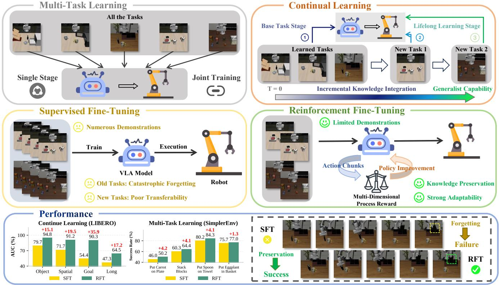
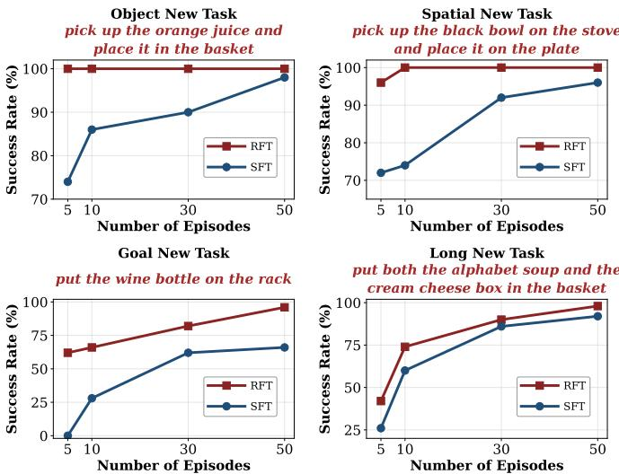

# 朝向长寿机器人的发展：通过强化微调实现的持续学习 VLA 模型

袁刘1,2 +, Haoran $\operatorname { L i } ^ { 2 , 3 , 4 \boxtimes }$ , 帅天2,3, 余兴 $\mathrm { Q i n } ^ { 2 , 3 }$ , 裕晖陈2,3, 愈朋郑2,3, 雍贞黄1, 董彬赵2,3 1北京师范大学人工智能学院，中国北京 2中国科学院自动化研究所（CASIA），中国北京 3中国科学院大学人工智能学院，中国北京 4北京人工智能研究院，中国北京

  
FOvLApt-aihiphavolgstulasptaceal LifeLong-RFT, which combines on-policy RL with the Multi-Dimensional Process Reward mechanism.

摘要——在大规模多样化数据集上进行预训练的VLA模型展示了作为通用机器人策略的强大泛化能力和适应性。然而，作为将VLA适应于下游领域的主要机制的监督微调（SFT），需要大量任务特定数据，并且容易导致灾难性遗忘。为了解决这些限制，我们提出了LifeLong-RFT，这是一种简单而有效的强化学习微调（RFT）策略，旨在使VLA模型独立于在线环境反馈和预训练的奖励模型。通过将块级的在线强化学习与提议的多维过程奖励（MDPR）机制结合，LifeLong-RFT量化了三个维度中间行动块的异质贡献，以促进策略优化。具体而言，（1）量化动作一致性奖励（QACR）确保在离散动作空间内进行准确的动作预测；（2）连续轨迹对齐奖励（CTAR）将解码的连续行动块与参考轨迹对齐，以确保精确控制；（3）格式合规奖励（FCR）确保输出的结构有效性。在SimperEnv、LIBERO和实际任务中的综合实验表明，LifeLong-RFT在多任务学习中表现出色。此外，在LIBERO基准上的持续学习中，我们的方法在平均成功率上比SFT提高了$23\%$，同时在仅使用$20\%$训练数据的情况下有效适应新任务。总体而言，我们的方法为VLA提供了一种有前景的后期训练范式。

# I. 引言

基于大规模数据集训练的视觉-语言-动作（VLA）模型逐渐成为实现通用机器人策略的关键方法。尽管取得了这些进展，通过监督微调（SFT）将VLA模型适应新任务仍然面临挑战，如图1所示。首先，SFT通常需要大量特定于任务的数据，这限制了VLA模型在低数据或少样本环境下的快速适应能力。其次，SFT往往导致灾难性遗忘，即学习新技能会降低之前获得的知识。这些问题阻碍了SFT支持VLA演变为能够不断获取新技能的长效智能体。

这两个挑战并不是独立的 [65]：数据高效适应的改进常常加剧遗忘，而保存先前知识又限制了从有限新数据中有效学习的能力。实现塑性和稳定性之间的有效平衡对于机器人从有限数据中学习而不抹去先前知识至关重要。在早期基于专用模型的研究中，这种权衡被广泛视为内在的 [50]，激励了基于任务特定适配器或手工特征的解决方案 [31, 41, 69, 51]。随着基础模型的出现，从大量多样化数据集中学习到的表征表现出显著提高的迁移能力，重塑了塑性-稳定性困境，但并未消除它 [55]。虽然这样的表征显著降低了学习新任务所需的数据量，但直接应用 SFT 仍然会导致严重的灾难性遗忘 [46]。因此，为专用模型开发的持续学习技术通常被重新用于减轻基础模型中的遗忘 [68, 70, 62]。然而，这些技术在处理涉及大量任务和高容量参数化的 VLA 设置时往往难以扩展。与从注释数据集中学习的 SFT 相比，最近在大型语言模型中的进展表明，基于当前分布的样本进行更新的在线策略强化学习 (RL) 可以表现出更强的对遗忘的鲁棒性 [61, 10, 30]。这一观察提出了一个重要的问题：在线策略强化学习能否被利用来促进 VLA 基础模型的持续适应，支持其演变为长寿命智能体？回答这一问题的中心挑战在于为 VLA 模型设计高效、可靠且可扩展的奖励信号，以进行强化微调。

现有的强化学习微调 VLA 模型的方法主要依赖两类奖励信号。第一类使用环境提供的真实奖励，这通常只在仿真中可用，并依赖于特权信息。这类方法在真实世界部署中面临重大障碍，因为存在仿真到现实的差距，并且在无法获取特权状态的情况下，计算奖励较为困难。第二类则采用基于模型的奖励估计，例如预测任务成功率、任务进展或基于距离的稠密奖励。然而，奖励模型中的不准确性和泛化误差使这些方法在奖励操控方面极其脆弱。此外，这两类方法都需要与环境进行广泛的交互——无论是仿真器、世界模型还是真实机器人——在扩展到大任务集时，导致训练成本非常高。重要的是，现有方法主要优化微调任务本身的性能，同时在很大程度上忽视了长期 VLA 智能体所需的持续学习特性。

在这项工作中，我们提出了一种简单而有效的针对VLA模型的后训练范式，名为LifeLong-RFT。通过设计多维过程奖励（MDPR）机制，我们实现了无需与环境交互的块级策略强化微调。具体而言，我们将该机制分解成三个维度，以提供全面的奖励。首先，我们引入了量化动作一致性奖励（QACR）。考虑到VLA是基于VLM主干生成离散动作词元的，QACR通过测量预测词元与目标词元之间的一致性来确保在量化动作空间内的精确预测。其次，我们设计了连续轨迹对齐奖励（CTAR）。虽然QACR确保了在量化动作空间内的准确性，但物理执行需要与连续轨迹对齐。为此，CTAR利用解码的动作块基于与参考轨迹的空间偏差计算块级奖励，激励模型探索最佳运动。第三，我们引入了格式合规奖励（FCR）。由于VLA主干的生成多样性，模型容易产生结构上无效的输出（例如，动作维度不匹配和预测时间范围不一致）。为了减轻这种不稳定性，FCR作为一种二进制奖励，促进遵循有效格式，确保动作可执行性并提高推理效率。我们的主要贡献总结如下：1）我们提出了LifeLong-RFT，这是一种将块级策略强化学习与多维过程奖励（MDPR）相结合的后训练策略。该方法使VLA能够在有限示例下不断掌握新任务，同时保持原有能力。2）多维过程奖励（MDPR）由量化动作一致性奖励（QACR）、连续轨迹对齐奖励（CTAR）和格式合规奖励（FCR）组成，量化中间动作块在三个维度上的异构贡献，以促进策略优化。3）针对模拟和实际任务的全面实验表明，LifeLong-RFT在多任务学习中的优越性能。值得注意的是，在LIBERO上的持续学习中，我们的方法在平均成功率上比SFT提高了$22\%$，使得仅用$20\%$的训练数据就能高效适应新任务。

# II. 相关工作

# A. 视觉-语言-动作模型

作为范式转变，VLA模型偏离了传统的层级架构，采用端到端的学习方法，将多模态感知输入直接映射到机器人控制动作。一般来说，这些模型可以根据其动作表示分为两个流派：离散动作模型和连续动作模型。离散动作模型通常利用VLM主干网络生成离散动作词元，以自回归的方式执行操作任务。相反，连续动作模型探索将扩散策略或流匹配与VLM结合，以直接输出连续动作，实现灵活控制。在这些架构的基础上，目前的模型通常利用大规模预训练以获取操作先验，然后通过微调适应特定的下游任务。尽管表现出良好的性能，这种基于微调的后训练范式仍受到对大量特定任务数据需求的限制，并容易出现灾难性遗忘。

# B. 强化微调大语言模型

为了进一步增强视觉语言模型（VLA）的鲁棒性和自我修正能力，近期研究越来越多地探讨强化学习微调策略。当前的策略主要包括三种范式：基于模拟的方法、基于现实世界的方法以及基于世界模型的方法。基于模拟的方法通过大规模并行化受益，显著提高样本效率，并利用特权状态构建密集奖励。然而，由于受限于模拟与现实之间的差距，这些方法在实际部署中面临挑战。基于现实世界的策略通过在线适应物理环境有效增强模型的泛化能力。然而，这些方法通常涉及高昂的人力成本，并且在获取奖励方面存在困难。值得注意的是，前沿研究利用世界模型进行VLA的强化学习微调。通过利用未来状态预测的能力，该方法为策略优化提供密集的奖励信号。不过，世界模型固有的预测误差增加了VLA对奖励劫持的敏感性。总体而言，这些方法需要广泛的环境互动，由于训练成本高，限制了其可扩展性。

# C. 机器人中的持续学习

机器人领域的持续学习旨在构建能够适应动态环境变化的通用策略，同时保留现有能力。若干研究通过为每个新的学习阶段分配特定参数来应对遗忘。此外，替代方法依赖于通过聚类或多阶段学习进行任务分解。随着变换学习算法的出现，最近的研究集中在使其实现持续适应。在这方面，MergeVLA 提出了模型合并范式，旨在通过解决多专家模型融合中的参数冲突来实现高效的技能扩展。另一方面，Stellar VLA 构建了一个知识驱动的持续模仿学习框架，有效减少了灾难性遗忘。与上述方法不同，我们将基于策略的强化学习与提出的 MDPR 机制相结合，以有效适应新任务，同时保留之前学习的知识。

# III. 问题表述与准备知识

VLA 和后训练。VLA 建模的目标是学习一种通用的机器人策略 $\pi _ { \boldsymbol { \theta } } ( \mathbf { a } | o , l )$，该策略将观察 $o$ 和自然语言指令 $l$ 映射到机器人动作 $a$。在实际中，VLA 模型首先在大规模和多样化的数据集上进行预训练，以获得丰富的语义理解和可迁移的表示。然后使用与任务相关的数据对预训练参数 $\theta$ 进行后训练，以使动作输出 $a$ 适应目标机器人构型和下游任务。持续学习。SFT 仍然是后训练 VLA 模型的主要方法。然而，SFT 主要优化当前训练数据集中存在的任务性能，而在很大程度上忽视了先前获得能力的退化。在现实世界中，长期存在的智能体预计将在保持早期学习技能的同时获取新技能，这一要求通常被称为持续学习。从形式上讲，这涉及一个智能体从一系列任务 $\{ \mathcal { T } _ { k } \} _ { k = 1 } ^ { \infty }$ 中学习，其中每个任务 $\mathcal { T } _ { k }$ 与 $N$ 个专家示范 $\{ \tau _ { k } ^ { n } \} _ { n = 1 } ^ { N }$ 相关联。与假设可以同时访问所有任务数据的单一适应阶段不同，持续学习需要在有限访问历史数据的约束下持续获取知识。基于策略的强化学习。虽然 SFT 可以有效提高当前目标任务的性能，但它往往会导致以前获得的能力迅速退化，这种现象通常被称为灾难性遗忘。相比之下，最近的研究 [61, 10, 30] 表明，基于策略的强化学习对于遗忘表现出更强的抵抗力。与依赖固定标注数据集的 SFT 不同，基于策略的强化学习使用自生成的答案来更新策略，并在这些答案上优化期望回报。

# 四、方法

为了支持非常大型语言模型（VLA）演变为能够持续获取新技能的长寿命智能体，我们提出了LifeLong-RFT，这是一种强化微调策略，如图 2 所示。该策略将基于块的在线强化学习与所提议的多维过程奖励（MDPR）机制相结合，后者在不需要环境交互的情况下，量化中间动作块在三个维度上的异质性贡献。

# A. 分块级别的在线强化学习

现有的大多数基于策略的强化学习方法 [40, 34, 64, 11] 在 VLA 后训练中通过收集完整轨迹并依赖环境提供的奖励来优化模型参数。尽管这类方法能够达到很强的性能，但在训练过程中需要与环境进行大量互动，这导致高昂的训练成本，并限制了在大规模和多任务场景中的可扩展性。为了消除与环境互动的需求，我们采用了一种简单的替代方法：不再沿完整轨迹评估动作，而是独立评估 VLA 模型采样的每个动作块，从而消除了对环境互动的依赖。在本工作中，我们采用了群体相对策略优化（GRPO）[60]。与依赖于显式评价网络的传统算法（如 PPO [59]）相比，GRPO 通过对采样输出进行群体比较来估计优势，从而显著降低了计算开销。具体来说，对于每个观测 $o$ 和指令 $l$，首先从旧策略 $\pi _{ \theta_{ \mathrm { old } } } ( \mathbf { a } | o , l )$ 中采样一组 $G$ 个动作输出 $\{ \mathbf { a } _ { i } \} _ { i = 1 } ^ { G }$，通过任务特定的奖励函数计算出 $\{ r _ { i } \} _ { i = 1 } ^ { G }$。基于组内奖励的均值和标准差，每个输出的相对优势 $A _ { i }$ 的计算如下：

  
algorithm with the Multi-Dimensional Process Reward mechanism to facilitate policy optimization.

$$
A _ { i } = { \frac { r _ { i } - \operatorname* { m e a n } ( \{ r _ { 1 } , \dots , r _ { G } \} ) } { \operatorname { s t d } ( \{ r _ { 1 } , \dots , r _ { G } \} ) } } .
$$

给定优势 $A_{i}$，策略参数 $\theta$ 通过最大化以下目标进行优化：

$$
\begin{array} { l } { { \displaystyle { \cal J } _ { \mathrm { G R P O } } ( \theta ) = \mathbb { E } _ { ( o , l ) \sim \mathcal { B } , \{ { \bf a } _ { i } \} _ { i = 1 } ^ { G } \sim \pi _ { \theta _ { \mathrm { o l d } } } ( \cdot \vert o , l ) } } } \\ { { \displaystyle ~ \frac { 1 } { G } \sum _ { i = 1 } ^ { G } \lbrace \operatorname* { m i n } \lbrack \frac { \pi _ { \theta } \left( { \bf a } _ { i } \vert o , l \right) } { \pi _ { \theta _ { \mathrm { o l d } } } \left( { \bf a } _ { i } \vert o , l \right) } A _ { i } , } } \\ { { \displaystyle ~ \mathrm { c l i p } \left( \frac { \pi _ { \theta } \left( { \bf a } _ { i } \vert o , l \right) } { \pi _ { \theta _ { \mathrm { o l d } } } \left( { \bf a } _ { i } \vert o , l \right) } , 1 - \epsilon , 1 + \epsilon \right) A _ { i } \rbrack } } \\ { { \displaystyle ~ - \gamma D _ { K L } \left[ \pi _ { \theta } \vert \vert \pi _ { \mathrm { r e f } } \vert \right. } , } \end{array}
$$

其中 $\boldsymbol { B }$ 表示专家示范的数据集，每个示范由一个观察 $o$ 和一个语言指令 $l$ 组成。为稳定训练过程，clip 限制了策略概率比率，1 $\gamma$ 调节 KL 散度正则化项 $D _ { K L } \left[ \pi _ { \theta } || \pi _ { \mathrm { r e f } } \right]$ 的强度，有效地防止新策略 $\pi _ { \theta }$ 过度偏离参考策略 $\pi _ { \mathrm { r e f } }$。基于此公式，构建一个高效且可验证的奖励 $r _ { i }$ 成为优化的关键。

# B. 多维过程奖励

为了有效指导在不需要环境交互的情况下的在线强化学习过程，我们设计了多维过程奖励（MDPR）机制。该机制将动作块的评估分解为三个互补维度，架起离散词元生成与连续机器人控制之间的桥梁。在这一部分，我们详细说明这三个维度特定奖励的设计。 1) 量化动作一致性奖励：基于VLM主干网络，当前的视觉语言模型（VLA）[25, 28, 56] 解释语言指令和多模态观察以生成动作词元。这种范式需要设计一个专门的奖励函数，以评估生成词元与真实标注数据之间的一致性，从而促进在量化动作空间内的精确预测。为此，我们提出了量化动作一致性奖励（QACR）函数，如算法1所示。首先，我们对模型生成的结果进行格式检查，以验证其是否符合动作词元器Fast+ [56] 的预定义规格（即动作块大小和动作维度）。只有验证通过的结果才能进入后续的一致性评估阶段，而未通过验证的结果则获得零奖励。其次，我们通过逐位置匹配生成的动作 $\mathbf { a } = \{ a _ { u } \} _ { u = 1 } ^ { U }$ 与其真实标注数据来计算一致性奖励。 算法1 QACR函数的伪代码

输入：编辑后的序列 $\begin{array} { r l } { \mathbf { a } } & { { } = \ \{ a _ { u } \} _ { u = 1 } ^ { U } ; } \end{array}$ $\tilde { \mathbf { a } } = \{ \tilde { a } _ { v } \} _ { v = 1 } ^ { V }$ 1: is_valid FORMaTCHECK(a) 2: 如果 is_valid $=$ False 则 3: $\mathrm { Q A C R } 0$ $\triangleright$ 无效格式输出零奖励 4: 否则 5: $\begin{array} { r } { \mathsf { \bar { \rho } } } \\ { \mathsf { Q A C R } \gets \frac { \sum _ { \ell = 1 } ^ { \operatorname* { m i n } ( U , V ) } \mathbb { I } ( a _ { \ell } = \tilde { a } _ { \ell } ) } { \operatorname* { m a x } ( U , V ) } } \end{array}$ 6: 结束如果 7: 返回 QACR 的真实对应 $\tilde { \mathbf { a } } = \{ \tilde { a } _ { v } \} _ { v = 1 } ^ { V }$，其正式定义为：

$$
\mathrm { Q A C R } = \left\{ \begin{array} { l l } { \displaystyle \frac { \sum _ { \ell = 1 } ^ { \operatorname* { m i n } ( U , V ) } \mathbb { I } ( a _ { \ell } = \tilde { a } _ { \ell } ) } { \operatorname* { m a x } ( U , V ) } , } & { \mathrm { i f ~ v a l i d } } \\ { \displaystyle 0 , } & { \mathrm { o t h e r w i s } } \end{array} \right.
$$

其中 $\mathbb { I } ( \cdot )$ 是指示函数，当预测的动作词元 $a \ell$ 与真实值 $\tilde { a } _ { \ell }$ 匹配时返回 1，否则返回 0。此外，“有效”一词表示预测序列满足 Fast+ 分词器的解码要求。基于这一公式，QACR 提供了对序列一致性的稳健评估。2) 连续轨迹对齐奖励：虽然 QACR 确保在量化动作空间内的准确性，物理执行却需要与连续轨迹对齐。为此，我们引入连续轨迹对齐奖励（CTAR）。该机制评估解码后的连续动作片段与参考轨迹之间的空间对齐，提供密集反馈，以便于灵巧操作。该奖励函数的实现详见算法 2。

与 QACR 一致，我们首先对预测动作 $\mathbf { a } = \{ a _ { u } \} _ { u = 1 } ^ { U }$ 进行格式验证。只有通过该验证的序列才能继续进行后续的奖励计算，而无效序列则直接被赋予零奖励。随后，我们利用 Fast+ [56] 分词器将预测的动作词元解码为连续动作块 $y$，包含一个 $H$ 动作的序列。对于动作块 $y$，每个时间步的动作向量 $\mathbf { y } _ { t }$ 包含一个姿势组件 $\mathbf { y } _ { t } ^ { \mathrm { p o s e } }$ 和一个夹具组件 $\mathbf { y } _ { t } ^ { \mathrm { g r i p } }$。其中，$\mathbf { y } _ { t } ^ { \mathrm { p o s e } }$ 表示时间步 $t$ 的姿势，而 $\mathbf { y } _ { t } ^ { \mathrm { g r i p } }$ 表示夹具的开合状态。在此基础上，我们将 CTAR 的计算分解为以下步骤：（1）为鼓励精确的姿势对齐，我们将姿势奖励 $r_{pose}$ 制定为相对于真实值的误差的指数衰减函数。具体而言，我们计算预测姿势向量 $\mathbf { y } _ { t } ^ { \mathrm { p o s e } }$ 与真实值 $\tilde { \mathbf { y } } _ { t } ^ { \mathrm { p o s e } }$ 之间的归一化 L1 距离 $d _ { t }$，利用指数衰减函数 $\exp ( - { \boldsymbol { \alpha } } \cdot { \boldsymbol { d } } _ { t } )$ 将其转换为奖励信号，其中超参数 $\alpha$ 调节灵敏度。算法 2 CTAR 函数的伪代码

I: $\begin{array} { r c l } { \mathbf { a } } & { = } & { \{ a _ { u } \} _ { u = 1 } ^ { U } ; } \end{array}$ $\tilde { \mathbf { a } } = \{ \tilde { a } _ { v } \} _ { v = 1 } ^ { V }$ 1: is_valid $\gets$ FORMATCHECK(a) 2: 如果 is_valid $=$ False 那么 3: $\mathrm { C T A R } \gets 0$ $\triangleright$ 无效格式导致奖励为零 4: 否则 5: $\mathbf { y } \triangleq ( \mathbf { y } ^ { \mathrm { p o s e } } , \mathbf { y } ^ { \mathrm { g r i p } } ) \xleftarrow { } \operatorname { D E C O D E } ( \mathbf { a } )$ 6: $\tilde { \mathbf { y } } \triangleq ( \tilde { \mathbf { y } } ^ { \mathrm { p o s e } } , \tilde { \mathbf { y } } ^ { \mathrm { g r i p } } ) \xleftarrow { } \mathrm { D E C O D E } ( \tilde { \mathbf { a } } )$ 7: $H \gets \mathrm { L e n g t h } ( \tilde { \mathbf { y } } )$ 8: $R _ { \mathrm { s u m } } 0$ 9: 对于 $t = 1$ 到 $H$ 进行循环 10: dt ← dim(y pse) | /se yose | 11: rpose $r _ { t } ^ { \mathrm { p o s e } } \exp ( - \alpha \cdot d _ { t } )$ 12: rerip ← I(yerip yarp) 13: rt ← β · rp + (1 − β) · grip 14: Rsum ← Rsum + rt 15: 循环结束 16: $\mathrm { C T A R } R _ { \mathrm { s u m } } / H$ 17: 结束 18: 返回 CTAR 输出: CTAR 分数 $\in [ 0 , 1 ]$ 表示姿态偏差。 (2) 为了激励精确的抓取动作，我们采用二元奖励 $r _ { t } ^ { \mathrm { g r i p } }$ 这个奖励被定义为指示函数 $\mathbb { I } ( \cdot )$，当预测的抓取状态 $\mathbf { y } _ { t } ^ { \mathrm { g r i p } }$ 与真实情况 $\tilde { \mathbf { y } } _ { t } ^ { \mathrm { g r i p } }$ 匹配时赋值为 1，否则为 0。 (3) 最后，归一化的 CTAR 通过对动作块大小 $H$ 上的姿态和抓取奖励的加权组合进行平均来计算，正式定义为：

$$
\mathrm { C T A R } = \left\{ \begin{array} { l l } { \displaystyle \frac { 1 } { H } \sum _ { t = 1 } ^ { H } \left( \beta \cdot r _ { t } ^ { \mathrm { p o s e } } + \left( 1 - \beta \right) \cdot r _ { t } ^ { \mathrm { g r i p } } \right) , } & { \mathrm { i f ~ v a l i d } } \\ { 0 , } & { \mathrm { o t h e r w i s e } } \end{array} \right.
$$

其中超参数 $\beta \in [ 0 , 1 ]$ 调节每个时间步 $t$ 上姿态奖励 $r _ { t } ^ { \mathrm { p o s e } }$ 和抓握奖励 $r _ { t } ^ { \mathrm { g r i p } }$ 的相对重要性。总之，CTAR 函数通过量化机器人姿态和抓握状态的预测差异建立了一个密集奖励机制。3) 格式合规奖励：虽然 QACR 和 CTAR 重点关注优化预测准确性和控制精度，但它们的有效性依赖于生成输出的结构有效性。具体而言，预测序列必须遵循特定的行动维度和行动块大小。为此，我们提出了格式合规奖励（FCR），以引导模型生成结构合理的词元序列。具体来说，我们使用 Fast+ 分词器来验证生成的词元序列与所需输出形状的合规性。相应地，我们将 FCR 定义为一个二元奖励函数，如果验证通过则返回 1，否则返回 0。具体公式定义如下：表 I：在 SimplerEnv 上的多任务学习性能，其中条件“有效”表示模型输出遵循预定义的输出格式，使得 Fast+ 分词器能够将其解码为连续的行动块。通过明确激励模型获得结构有效的输出模式，该奖励为有效的轨迹探索建立了必要的前提条件。

<table><tr><td rowspan="2">Method</td><td rowspan="2">Training Strategy</td><td colspan="5">WidowX (Visual Matching)</td><td colspan="4">Google Robot (Visual Matching)</td></tr><tr><td>Put Carrot on Plate</td><td>Stack Blocks</td><td>Put Spoon on Towel</td><td>Put Eggplant in Basket</td><td>Avg</td><td>Pick Coke Can</td><td>Move Near</td><td>Open/Close Drawer</td><td>Avg</td></tr><tr><td>Continuous Action Models</td><td></td><td></td><td></td><td></td><td></td><td></td><td></td><td></td><td></td><td></td></tr><tr><td>Octo-Base [66]</td><td>SFT</td><td>8.3</td><td>0.0</td><td>12.5</td><td>43.1</td><td>16.0</td><td>17.0</td><td>4.2</td><td>22.7</td><td>16.8</td></tr><tr><td>RoboVLM [39]</td><td>SFT</td><td>25.0</td><td>12.5</td><td>29.2</td><td>58.3</td><td>31.3</td><td>77.3</td><td>61.7</td><td>43.5</td><td>63.4</td></tr><tr><td>GROOT N1.5 [53]</td><td>SFT</td><td>−</td><td>−</td><td>−</td><td>−</td><td>−</td><td>69.3</td><td>68.7</td><td>35.8</td><td>52.4</td></tr><tr><td>πo6}]</td><td>SFT</td><td>58.8</td><td>21.3</td><td>63.3</td><td>79.2</td><td>55.7</td><td>72.7</td><td>65.3</td><td>38.3</td><td>58.7</td></tr><tr><td>ThinkAct [22]</td><td>SFT + RFT</td><td>37.5</td><td>8.7</td><td>58.3</td><td>70.8</td><td>43.8</td><td>92.0</td><td>72.4</td><td>50.0</td><td>71.5</td></tr><tr><td>NORA-1.5 [24]</td><td>SFT</td><td>−</td><td>−</td><td>−</td><td>−</td><td>−</td><td>92.8</td><td>78.7</td><td>62.2</td><td>77.9</td></tr><tr><td>NORA-1.5 [24] (DPO)</td><td>SFT+RFT</td><td>−</td><td>−</td><td>−</td><td>−</td><td></td><td>94.0</td><td>88.0</td><td>66.4</td><td>82.8</td></tr><tr><td>Discrete Action Models</td><td></td><td></td><td></td><td></td><td></td><td></td><td></td><td></td><td></td><td></td></tr><tr><td>TraceVLA [80]</td><td>SFT</td><td>−</td><td>−</td><td>−</td><td>−</td><td>−</td><td>28.0</td><td>53.7</td><td>57.0</td><td>42.0</td></tr><tr><td>RT-1-X [7]</td><td>SFT</td><td>4.2</td><td>0.0</td><td>0.0</td><td>0.0</td><td>1.1</td><td>56.7</td><td>31.7</td><td>59.7</td><td>53.4</td></tr><tr><td>OpenVLA [28]</td><td>SFT</td><td>0.0</td><td>0.0</td><td>0.0</td><td>4.1</td><td>1.0</td><td>16.3</td><td>46.2</td><td>35.6</td><td>27.7</td></tr><tr><td>SpatialVLA [57]</td><td>SFT</td><td>25.0</td><td>29.2</td><td>16.7</td><td>100.0</td><td>42.7</td><td>86.0</td><td>77.9</td><td>57.4</td><td>73.7</td></tr><tr><td>π0-FAST [56]</td><td>SFT</td><td>22.0</td><td>83.0</td><td>29.0</td><td>48.0</td><td>45.5</td><td>75.3</td><td>67.5</td><td>42.6</td><td>61.9</td></tr><tr><td>NORA-1.5-FAST [24]</td><td>SFT</td><td>−</td><td>−</td><td></td><td>−</td><td></td><td>88.6</td><td>86.4</td><td>41.2</td><td>72.1</td></tr><tr><td>NORA-Long [25] (Baseline)</td><td>SFT</td><td>46.0</td><td>60.3</td><td>80.2</td><td>75.7</td><td>65.5</td><td>86.0</td><td>82.3</td><td>56.0</td><td>74.7</td></tr><tr><td>NORA-Long [25]</td><td>RFT (Ours)</td><td>50.2</td><td>64.4</td><td>84.3</td><td>77.0</td><td>69.0</td><td>94.0</td><td>84.7</td><td>58.5</td><td>79.1</td></tr><tr><td>∆</td><td></td><td>+4.2</td><td>+4.1</td><td>+4.1</td><td>+1.3</td><td>+3.5</td><td>+8.0</td><td>+2.4</td><td>+2.5</td><td>+4.4</td></tr></table>

$$
\mathrm { F C R } = \left\{ { \begin{array} { l l } { 1 , } & { { \mathrm { i f ~ } } { \mathrm { v a l i d } } } \\ { 0 , } & { { \mathrm { o t h e r w i s e } } } \end{array} } \right.
$$

最后，我们综合 QACR、CTAR 和 FCR，制定多维过程奖励（MDPR），具体如下：

$$
{ \bf M D P R } = \boldsymbol { \omega } \cdot { \bf Q A C R } + ( 1 - \boldsymbol { \omega } ) \cdot { \bf C T A R } + \boldsymbol { \lambda } \cdot { \bf F C R } ,
$$

其中 $\omega \in [ 0 , 1 ]$ 控制离散动作一致性和连续轨迹对齐之间的权衡，而 $\lambda$ 则调整结构格式合规性的显著性。

# V. 实验

在本节中，我们通过在模拟和现实环境中进行全面实验来研究 LifeLongRFT 的性能。首先，我们介绍该方法的实施细节，然后详细说明多任务学习和持续学习的实验配置和结果。

# A. 实施细节

在我们的实验中，我们采用 NORA-Long [25] 作为基础 VLA 模型，该模型利用 Fast $^ +$ [56] 分词器进行动作表示。在强化微调阶段，模型经历全参数优化。具体而言，我们将 GRPO 的推演组大小设置为 8，并采用 AdamW [42] 优化器，峰值学习率为 $1 \times 10 ^ { - 6 }$。对于 CTAR 配置，超参数 $\alpha$ 和 $\beta$ 分别设置为 5 和 0.8。最后，MDPR 被制定为三个维度奖励的加权组合，加权系数 $\omega = 0.7$ 和 $\lambda = 0.1$。所有实验在 8 张 NVIDIA H20 GPU 上进行。

# B. 多任务学习实验

# 1) 实验设置：

a) 训练设置：为评估仿真中的多任务学习，我们利用了 SimplerEnv [37] 和 LIBERO [38]。在 SimplerEnv 中，我们在 BridgeData V2 [67] 上为 WidowX 进行模型训练，在 Fractal [7] 上为 Google Robot 进行训练。对于 LIBERO，我们对每个任务套件（即对象、空间、目标和长任务）进行微调，利用所有 10 个任务的第三人称视角和腕部输入。此外，我们在实际环境中对 Franka 机器人进行实验，如图 3 所示。具体而言，我们针对前两个任务共同训练模型，每个任务使用 40 个示例，而最后一个任务使用 50 个示例。 b) 评估协议：在 SimplerEnv 中，我们在 Visual Matching 设置下评估模型在 WidowX 和 Google Robot 平台上的性能。为确保评估的可靠性，每个任务在不同的初始物体姿态和环境配置下重复进行 24 次实验。对于 LIBERO，我们在每个任务套件上进行了 500 次实验。此外，在实际实验中，每个任务进行了 20 次实验。在所有上述实验中，我们报告平均成功率 (SR) 作为评估指标。 2) 仿真性能：表 I 和表 II 展示了在 SimplerEnv 和 LIBERO 上的比较。具体而言，在表 I 中，LifeLong-RFT 在各种评估场景中持续提升 SFT 基线的性能。与 SFT 基线相比，我们的方法在 WidowX 上实现了 $3.5\%$ 的平均成功率提升，在 Google Robot 上达到了 $4.4\%$ 的提升。此外，表 II 中的结果显示，我们的方法超越了所有竞争的连续和离散动作模型，取得了 $95.6\%$ 的优越平均成功率。 3) 实际性能：除了仿真外，我们还进行了实际实验。表 III 显示我们的方法在四个任务上持续优于所有竞争方法。具体而言，当使用 NORALong 作为主干网络时，LifeLong-RFT 在 SFT 基线之上实现了 $8.7\%$ 的平均成功率提升。特别是对于灵巧任务“挂中国结”，该方法比 SFT 基线提高了 $15\%$。

  
Overv  real-worl experetal tasks:ick &PlaceBana Bread u Drawer, and HanChinot.

表 II：LIBERO上的多任务学习性能。

<table><tr><td rowspan="2">Method</td><td rowspan="2">Training Strategy</td><td colspan="4">LIBERO</td><td rowspan="2">Avg</td></tr><tr><td></td><td>Object Spatial Goal Long|</td><td></td><td></td></tr><tr><td colspan="7">Continuous Action Models</td></tr><tr><td>Octo-Base [66]</td><td>SFT</td><td>85.7</td><td>78.9</td><td>84.6</td><td>51.1</td><td>| 75.1</td></tr><tr><td>GRO0T N1 [5]</td><td>SFT</td><td>97.6</td><td>94.4</td><td>93.0</td><td>90.6</td><td>93.9</td></tr><tr><td>π0 [6]</td><td>SFT</td><td>98.8</td><td>96.8</td><td>95.8</td><td>85.2</td><td>94.2</td></tr><tr><td>OpenVLA-OFT [29]</td><td>SFT</td><td>98.1</td><td>96.9</td><td>95.5</td><td>91.1</td><td>95.4</td></tr><tr><td>ThinkAct [22]</td><td>SFT + RFT</td><td>91.4</td><td>88.3</td><td>87.1</td><td>70.9</td><td>|84.4</td></tr><tr><td>VLA-RFT [35]</td><td>SFT + RFT</td><td>94.4</td><td>94.4</td><td>95.4</td><td>80.2</td><td>91.1</td></tr><tr><td>NORA-1.5 [24]</td><td>SFT</td><td>96.4</td><td>97.3</td><td>94.5</td><td>89.6</td><td>94.5</td></tr><tr><td>NORA-1.5 [24] (DPO)</td><td>SFT + RFT</td><td>96.0</td><td>98.0</td><td>95.4</td><td>90.5</td><td>95.0</td></tr><tr><td colspan="7">Discrete Action Models</td></tr><tr><td>TraceVLA [80]</td><td>SFT</td><td>85.2</td><td>84.6</td><td></td><td>75.1 54.1</td><td>| 74.8</td></tr><tr><td>OpenVLA [28]</td><td>SFT</td><td>88.4</td><td>84.7</td><td>79.2</td><td>53.7</td><td>76.5</td></tr><tr><td>SpatialVLA [57]</td><td>SFT</td><td>89.9</td><td>88.2</td><td>78.6</td><td>55.5</td><td>78.1</td></tr><tr><td>CoT-VLA [78]</td><td>SFT</td><td>91.6</td><td>87.5</td><td>87.6</td><td>69.0</td><td>|83.9</td></tr><tr><td>WorldVLA [8]</td><td>SFT</td><td>96.2</td><td>87.6</td><td>83.4</td><td>60.0</td><td>79.1</td></tr><tr><td>π0-Fast [56]</td><td>SFT</td><td>96.8</td><td>96.4</td><td>88.6</td><td>60.2</td><td>85.5</td></tr><tr><td>MolmoAct-7B-D [32]</td><td>SFT</td><td>95.4</td><td>87.0</td><td>87.6</td><td>77.2</td><td>86.6</td></tr><tr><td>TGRPO [15]</td><td>SFT + RFT</td><td>92.2</td><td>90.4</td><td>81.0</td><td>59.2</td><td>80.7</td></tr><tr><td>NORA-Long [25] (Baseline)</td><td>SFT</td><td>97.5</td><td>96.4</td><td>91.0</td><td>82.4</td><td>91.8</td></tr><tr><td>NORA-Long [25]</td><td>RFT (Ours)</td><td>99.2</td><td>98.2</td><td>95.8</td><td>89.0</td><td>| 95.6</td></tr><tr><td>∆</td><td></td><td>+1.7</td><td>+1.8</td><td></td><td>+4.8 +6.6</td><td>| +3.8</td></tr></table>

# C. 持续学习实验

# 1) 实验设置：

a) 训练设置：我们利用 LIBERO [38] 在模拟环境中进行实验。按照 LOTUS [68] 的方法，训练过程分为基础任务阶段和终身学习阶段。对于每个任务套件，我们使用其前六个任务进行基础任务阶段的训练，每个任务包含 50 次演示。随后，终身学习阶段专注于剩余四个任务的增量学习。在此阶段，每个新任务仅由 10 次演示组成，而之前学习的每个任务保留 5 次演示用于经验重放（ER）[9]。总体而言，一个完整的实验周期包括一个基础学习步骤和四个连续的终身学习步骤。此外，对于实际实验，我们依次对四个任务进行训练，如图 3 所示，每个新任务利用 20 次演示，并为每个之前的任务保留 5 次演示。表 III：实际场景下的多任务学习性能。

<table><tr><td rowspan="2">Task Split</td><td>π0 [6]</td><td>OpenVLA [28]</td><td colspan="3">NORA-Long [24]</td></tr><tr><td>SFT</td><td>SFT</td><td>SFT</td><td>RFT (Ours)</td><td>∆</td></tr><tr><td>Pick Banana</td><td>90.0</td><td>75.0</td><td>85.0</td><td>90.0</td><td>+5.0</td></tr><tr><td>Pick Bread</td><td>75.0</td><td>70.0</td><td>75.0</td><td>85.0</td><td>+10.0</td></tr><tr><td>Pull Drawer</td><td>95.0</td><td>85.0</td><td>95.0</td><td>100.0</td><td>+5.0</td></tr><tr><td>Hang Chinese Knot</td><td>65.0</td><td>55.0</td><td>60.0</td><td>75.0</td><td>+15.0</td></tr><tr><td>Overall</td><td>81.3</td><td>71.3</td><td>78.8</td><td>87.5</td><td>+8.7</td></tr></table>

b) 评估协议：我们利用三个指标来评估模型的连续学习能力：前向迁移（FWT）、负向后向迁移（NBT）和成功率曲线下面积（AUC）。这三个指标均源自任务成功率。具体而言，更高的FWT表示对新任务的适应能力增强；较低的NBT意味着有效缓解了之前学习任务的灾难性遗忘；而更高的AUC反映了所有评估任务的平均成功率更好。考虑到$K$个任务 $\{ \mathcal { T } _ { k } \} _ { k = 1 } ^ { K }$，令$s _ { k , j }$表示智能体在学习前$k$个任务后的第$j$个任务的成功率，定义为$\mathbf { \sum } _ { k \in \left[ K \right] } \frac { s _ { k , k } } { K } $和$\mathbf { N B T } ~ = ~ \sum _ { k \in [ K ] } \frac { \mathbf { N B T } _ { k } } { K } $，其中NBTk, NBTk = $\frac { 1 } { K - k } \sum _ { q = k + 1 } ^ { K } ( s _ { k , k } ~ - ~ s _ { q , k } )$，而$\mathrm { A U C } = \sum _ { k \in [ K ] } \frac { \mathsf { A U C } _ { k } } { K } $，$\mathrm { A U C } _ { k } = \frac { 1 } { K - k + 1 } \big ( s _ { k , k } + \sum _ { q = k + 1 } ^ { K } s _ { q , k } \big )$。在我们的实验中，我们对所有学习任务评估策略，LIBERO进行50轮实验，现实世界实验进行20轮。2) 模拟性能：首先，我们在LIBERO上评估LifeLong-RFT以验证其连续学习能力。我们与训练使用行为克隆（BC）损失的模型进行比较。此外，我们评估由SFT优化的大规模VLA。正如表IV所示，我们的方法在所有任务套件中始终优于其他方法。值得注意的是，在LIBERO-Goal上，LifeLong-RFT表现出显著优势，相较于SFT基线AUC获得了35.9的显著提升。3) 现实世界性能：此外，我们评估现实世界的连续学习性能。如表V所示，我们的方法在FWT上相较于SFT基线提升23.7，显著优于另外两个模型。此外，该方法的NBT仅为6.1，展示了在保持已学任务性能方面的强大能力。总体而言，经过LifeLong-RFT微调的模型在学习周期中达到了平均成功率75.9%，展现了强健的连续学习能力。表IV：在LIBERO上的连续学习性能。

<table><tr><td rowspan="2">Task Split</td><td rowspan="2">Metrics</td><td>BUDS [82]</td><td>LOTUS [68]</td><td>SPECI [72]</td><td>π0 [6</td><td>OpenVLA [28]</td><td>OpenVLA-OFT [29]</td><td colspan="3">NORA-Long [25]</td></tr><tr><td>BC</td><td>BC</td><td>BC</td><td>SFT</td><td>SFT</td><td>SFT</td><td>| SFT</td><td>RFT (Ours)</td><td>∆</td></tr><tr><td rowspan="4">LIBERO-Object</td><td>FWT ()</td><td>52.0</td><td>74.0</td><td>83.0</td><td>73.0</td><td>59.4</td><td>89.8</td><td>| 84.8</td><td>96.0</td><td>+11.2</td></tr><tr><td>NBT ()</td><td>21.0</td><td>11.0</td><td>10.0</td><td>16.2</td><td>17.9</td><td>3.1</td><td>6.8</td><td>1.5</td><td>-5.3</td></tr><tr><td>AUC)</td><td>47.0</td><td>65.0</td><td>78.0</td><td>59.3</td><td>45.1</td><td>87.4</td><td>79.7</td><td>94.8</td><td>+15.1</td></tr><tr><td>FWT (↑)</td><td>−</td><td>−</td><td>67.0</td><td>74.4</td><td>64.2</td><td>88.6</td><td>| 82.8</td><td>94.0</td><td>+11.2</td></tr><tr><td rowspan="3">LIBERO-Spatial LIBERO-Goal</td><td>NBT ()</td><td>−</td><td>−</td><td>6.0</td><td>23.7</td><td>17.6</td><td>9.4</td><td>14.0</td><td>3.7</td><td>-10.3</td></tr><tr><td>AUC)</td><td></td><td></td><td>66.0</td><td>55.5</td><td>50.8</td><td>81.7</td><td>71.7</td><td>91.2</td><td>+19.5</td></tr><tr><td>FWT ()</td><td>50.0</td><td>61.0</td><td>74.0</td><td>74.6</td><td>58.6</td><td>90.2</td><td>| 72.8</td><td>92.4</td><td>+19.6</td></tr><tr><td rowspan="4"></td><td>NBT ()</td><td>39.0</td><td>30.0</td><td>20.0</td><td>23.9</td><td>5.8</td><td>13.8</td><td>25.2</td><td>3.1</td><td>-22.1</td></tr><tr><td>AUC ()</td><td>42.0</td><td>56.0</td><td>65.0</td><td>56.3</td><td>53.5</td><td>79.2</td><td>54.4</td><td>90.3</td><td>+35.9</td></tr><tr><td>FWT ()</td><td>−</td><td></td><td>58.0</td><td>53.8</td><td>32.0</td><td>64.0</td><td>61.0</td><td>74.2</td><td>+13.2</td></tr><tr><td>NBT (</td><td>-</td><td>—</td><td>21.0</td><td>14.2</td><td>14.1</td><td>31.4</td><td>17.3</td><td>12.8</td><td>-4.5</td></tr><tr><td>LIBERO-Long</td><td>AUC </td><td></td><td></td><td>46.0</td><td>42.5</td><td>20.8</td><td>38.7</td><td>47.3</td><td>64.5</td><td>+17.2</td></tr></table>

表 V：在真实世界中的持续学习表现。

<table><tr><td rowspan="2">Task Split</td><td rowspan="2">Metrics</td><td>π0 [6]</td><td>OpenVLA [28]</td><td colspan="3">NORA-Long [25]</td></tr><tr><td>SFT</td><td>SFT</td><td>SFT</td><td>RFT (Ours)</td><td>∆</td></tr><tr><td rowspan="3"></td><td>FWT (↑)</td><td>58.8</td><td>46.3</td><td>56.3</td><td>80.0</td><td>+23.7</td></tr><tr><td>Real-World NBT (↓)</td><td>16.3</td><td>17.8</td><td>18.3</td><td>6.1</td><td>-12.2</td></tr><tr><td>AUC()</td><td>47.9</td><td>35.1</td><td>44.2</td><td>75.9</td><td>+31.7</td></tr></table>

表 VI：多维过程奖励的消融实验。

<table><tr><td rowspan="2">Settings</td><td colspan="2">Object</td><td colspan="2">Spatial</td><td colspan="2">Goal</td><td colspan="2">Long</td><td colspan="2">Avg</td></tr><tr><td>SR</td><td>Δ</td><td>SR</td><td>∆</td><td>SR</td><td>∆</td><td>SR</td><td>∆</td><td>SR</td><td>∆</td></tr><tr><td>w/o QACR</td><td>| 97.0</td><td>-2.2</td><td>96.4</td><td>-1.8</td><td>| 92.2</td><td>-3.6</td><td>85.6</td><td>-3.4</td><td>92.8</td><td>-2.8</td></tr><tr><td>w/o CTAR</td><td>8.0</td><td>-91.2</td><td>6.2</td><td>-92.0</td><td>2.4</td><td>-93.4</td><td>2.0</td><td>-87.0</td><td>4.7</td><td>-90.9</td></tr><tr><td>w/o FCR</td><td>98.0</td><td>-1.2</td><td>| 96.2</td><td>-2.0</td><td> 93.2</td><td>-2.6</td><td>84.6</td><td>-4.4</td><td>93.0</td><td>-2.6</td></tr><tr><td>RFT (Ours)</td><td>| 99.2</td><td>-</td><td>98.2</td><td>-</td><td>| 95.8</td><td>•</td><td>| 89.0</td><td>-</td><td>95.6</td><td>•</td></tr></table>

# D. 消融研究

1) 多维过程奖励的有效性：为了验证多维过程奖励（MDPR）的有效性，我们在 LIBERO 上进行了多任务学习实验。表 VI 的第一行显示，去除 QACR 会导致四个任务套件的平均性能下降 $2 . 8 \%$。这一结果确认了 QACR 对于确保量化动作空间内准确的动作预测至关重要。第二行进一步强调了 CTAR 的关键作用，去除它会导致 $9 0 . 9 \%$ 的性能下降，导致模型几乎无法完成任务。此外，第三行显示 FCR 对于保证输出的结构有效性至关重要，特别是在 LIBERO-Long 任务中，缺少 FCR 会导致 $4 . 4 \%$ 的性能下降。总之，所提出的 MDPR 机制中的每个奖励组件均表现出一致的有效性，共同促进了模型性能的提升。

2) 新任务适应效率：为了评估 LifeLong-RFT 在获得新任务方面的适应效率，我们在 LIBERO 基准的四个任务套件上进行实验。具体来说，我们首先通过多任务学习在每个套件的前六个初始任务上训练模型。随后，我们从每个套件中剩余的四个保留任务中选择一个代表性任务，以评估模型在新任务适应方面的效率。在图 4 中，LifeLong-RFT 显示出比 SFT 更优越的适应效率。在“选择橙汁”任务上，它仅用 5 个示例就达到了 $100 \%$ 的成功率，而 SFT 即使训练了 50 个示例也仅达到了 $98 \%$。同样，在“选择碗”任务上，LifeLong-RFT 仅用 5 个示例就匹配了 SFT 基线在 50 个示例上训练的性能，并在只用 10 个示例时提升到了 $100 \%$ 的成功率。除了少量示例场景外，我们的方法在完整示例集上也保持了优势：在“放置葡萄酒瓶”任务上超越了 SFT达 $30 \%$，并在长期任务“放置字母汤和奶油奶酪”中表现优异。

  
Fig. 4: Adaptation efficiency on representative new tasks.

# VI. 结论与未来展望

在本研究中，我们引入了LifeLong-RFT，这是一种强化微调策略，用于克服与标准微调（SFT）相关的大量数据需求和灾难性遗忘。与现有方法不同，我们的方法结合了基于块的在线强化学习与多维过程奖励机制，实现了高效的新任务适应，同时保留了先前的知识。具体来说，该机制采用量化动作一致性奖励、连续轨迹对齐奖励和格式合规奖励，量化跨三个维度的动作块的异质贡献，与环境反馈和预训练奖励模型无关。综合实验表明，LifeLong-RFT在多任务和持续学习中均 consistently 超越基于SFT的方法，突显其实现长寿命机器人的潜力。局限性与未来工作。本研究主要关注离散动作模型，但其性能未能达到连续动作模型的水平。未来研究将LifeLong-RFT训练策略扩展到连续动作模型，将显著加速视觉语言模型（VLA）从实验室研究到工业应用的过渡。

# REFERENCES

[1] Shuai Bai, Keqin Chen, Xuejing Liu, Jialin Wang, Wenbin Ge, Sibo Song, Kai Dang, Peng Wang, Shijie Wang, Jun Tang, et al. Qwen2. 5-vl technical report. arXiv preprint arXiv:2502.13923, 2025.   
[2] Jacob Beck, Risto Vuorio, Evan Zheran Liu, Zheng Xiong, Luisa Zintgraf, Chelsea Finn, and Shimon Whiteson. A survey of meta-reinforcement learning. arXiv preprint arXiv:2301.08028, 2023.   
[3] Jacob Beck, Risto Vuorio, Evan Zheran Liu, Zheng Xiong, Luisa Zintgraf, Chelsea Finn, and Shimon Whiteson. A tutorial on meta-reinforcement learning. Foundations and Trends in Machine Learning, 18(2-3):224384, 2025.   
[4] Lucas Beyer, Andreas Steiner, André Susano Pinto, Alexander Kolesnikov, Xiao Wang, Daniel Salz, Maxim Neumann, Ibrahim Alabdulmohsin, Michael Tschannen, Emanuele Bugliarello, et al. Paligemma: A versatile 3b vlm for transfer. arXiv preprint arXiv:2407.07726, 2024.   
[5] Johan Bjorck, Fernando Castañeda, Nikita Cherniadev, Xingye Da, Runyu Ding, Linxi Fan, Yu Fang, Dieter Fox, Fengyuan Hu, Spencer Huang, et al. Gr00t n1: An open foundation model for generalist humanoid robots. arXiv preprint arXiv:2503.14734, 2025.   
[6] Kevin Black, Noah Brown, Danny Driess, Adnan Esmail, Michael Equi, Chelsea Finn, Niccolo Fusai, Lachy Groom, Karol Hausman, Brian Ichter, et al. $\pi _ { 0 }$ : A visionlanguage-action flow model for general robot control. arXiv preprint arXiv:2410.24164, 2024.   
[7] Anthony Brohan, Noah Brown, Justice Carbajal, Yevgen Chebotar, Joseph Dabis, Chelsea Finn, Keerthana Gopalakrishnan, Karol Hausman, Alex Herzog, Jasmine Hsu, et al. Rt-1: Robotics transformer for real-world control at scale. arXiv preprint arXiv:2212.06817, 2022.   
[8] Jun Cen, Chaohui Yu, Hangjie Yuan, Yuming Jiang, Siteng Huang, Jiayan Guo, Xin Li, Yibing Song, Hao Luo, Fan Wang, et al. Worldvla: Towards autoregressive action world model. arXiv preprint arXiv:2506.21539, 2025.   
[9] Arslan Chaudhry, Marcus Rohrbach, Mohamed Elhoseiny, Thalaiyasingam Ajanthan, Puneet K Dokania, Philip HS Torr, and Marc'Aurelio Ranzato. On tiny episodic memories in continual learning. arXiv preprint arXiv:1902.10486, 2019.   
[10] Howard Chen, Noam Razin, Karthik Narasimhan, and Danqi Chen. Retaining by doing: The role of onpolicy data in mitigating forgetting. arXiv preprint arXiv:2510.18874, 2025.   
[11] Kang Chen, Zhihao Liu, Tonghe Zhang, Zhen Guo, Si Xu, Hao Lin, Hongzhi Zang, Quanlu Zhang, Zhaofei Yu, Guoliang Fan, Tiejun Huang, Yu Wang, and Chao Yu. $\pi _ { \mathrm { r l } }$ Onine  ie-tuning or ow based vision-language-action models. arXiv preprint arXiv:2510.25889, 2025.   
[12] Yuhui Chen, Haoran Li, Zhennan Jiang, Haowei Wen, and Dongbin Zhao. Tevir: Text-to-video reward with diffusion models for efficient reinforcement learning. arXiv preprint arXiv:2505.19769, 2025.   
[13] Yuhui Chen, Shuai Tian, Shugao Liu, Yingting Zhou, Haoran Li, and Dongbin Zhao. Conrft: A reinforced fine-tuning method for vla models via consistency policy. arXiv preprint arXiv:2502.05450, 2025.   
[14] Zengjue Chen, Runliang Niu, He Kong, and Qi Wang. TGRPO :fine-tuning vision-language-action model via trajectory-wise group relative policy optimization. arXiv preprint arXiv:2506.08440, 2025.   
[15] Zengjue Chen, Runliang Niu, He Kong, Qi Wang, Qianli Xing, and Zipei Fan. Tgrpo: Fine-tuning visionlanguage-action model via trajectory-wise group relative policy optimization. arXiv preprint arXiv:2506.08440, 2025.   
[16] Paul F. Christiano, Jan Leike, Tom B. Brown, Miljan Martic, Shane Legg, and Dario Amodei. Deep reinforcement learning from human preferences. In Isabelle Guyon, Ulrike von Luxburg, Samy Bengio, Hanna M. Wallach, Rob Fergus, S. V. N. Vishwanathan, and Roman Garnett, editors, Advances in Neural Information Processing Systems 30: Annual Conference on Neural Information Processing Systems 2017, December 4-9, 2017, Long Beach, CA, USA, pages 42994307, 2017.   
[17] Alejandro Escontrela, Ademi Adeniji, Wilson Yan, Ajay Jain, Xue Bin Peng, Ken Goldberg, Youngwoon Lee, Danijar Hafner, and Pieter Abbeel. Video prediction models as rewards for reinforcement learning. In Alice Oh, Tristan Naumann, Amir Globerson, Kate Saenko, Moritz Hardt, and Sergey Levine, editors, Advances in Neural Information Processing Systems 36: Annual Conference on Neural Information Processing Systems 2023, NeurIPS 2023, New Orleans, LA, USA, December 10 - 16, 2023, 2023.   
[18] Senyu Fei, Siyin Wang, Li Ji, Ao Li, Shiduo Zhang, Liming Liu, Jinlong Hou, Jingjing Gong, Xianzhong Zhao, and Xipeng Qiu. SRPO: self-referential policy optimization for vision-language-action models. arXiv preprint arXiv:2511.15605, 2025.   
[19] Senyu Fei, Siyin Wang, Li Ji, Ao Li, Shiduo Zhang, Liming Liu, Jinlong Hou, Jingjing Gong, Xianzhong Zhao, and Xipeng Qiu. Srpo: Self-referential policy optimization for vision-language-action models. arXiv preprint arXiv:2511.15605, 2025.   
[20] Yuxia Fu, Zhizhen Zhang, Yuqi Zhang, Zijian Wang, Zi Huang, and Yadan Luo. Mergevla: Cross-skill model merging toward a generalist vision-languageaction agent. arXiv preprint arXiv:2511.18810, 2025.   
[21] Yanjiang Guo, Jianke Zhang, Xiaoyu Chen, Xiang Ji, Yen-Jen Wang, Yucheg Hu, and Jiau Chen. Ip vision-language-action model with online reinforcement learning. arXiv preprint arXiv:2501.16664, 2025.   
[22] Chi-Pin Huang, Yueh-Hua Wu, Min-Hung Chen, YuChiang Frank Wang, and Fu-En Yang. Thinkact: Visionlanguage-action reasoning via reinforced visual latent planning. arXiv preprint arXiv:2507.16815, 2025.   
[23] Tao Huang, Guangqi Jiang, Yanjie Ze, and Huazhe Xu. Diffusion reward: Learning rewards via conditional video diffusion. In Ales Leonardis, Elisa Ricci, Stefan Roth, Olga Russakovsky, Torsten Sattler, and Gül Varol, editors, Computer Vision - ECCV 2024 - 18th European Conference, Milan, Italy, September 29-October 4, 2024, Proceedings, Part XLII, volume 15100 of Lecture Notes in Computer Science, pages 478495. Springer, 2024.   
[24] Chia-Yu Hung, Navonil Majumder, Haoyuan Deng, Liu Renhang, Yankang Ang, Amir Zadeh, Chuan Li, Dorien Herremans, Ziwei Wang, and Soujanya Poria. Nora-1.5: Avisin-anguage-action model train usin world model-and action-based preference rewards. arXiv preprint arXiv:2511.14659, 2025.   
[25] Chia-Yu Hung, Qi Sun, Pengfei Hong, Amir Zadeh, Chuan Li, U Tan, Navonil Majumder, Soujanya Poria, et al. Nora: A small open-sourced generalist vision language action model for embodied tasks. arXiv preprint arXiv:2504.19854, 2025.   
[26] Physical Intelligence, Kevin Black, Noah Brown, James Darpinian, Karan Dhabalia, Danny Driess, Adnan Esmail, Michael Equi, Chelsea Finn, Niccolo Fusai, et al. $\pi _ { 0 . 5 }$ : a vision-language-action model with open-world generalization. arXiv preprint arXiv:2504.16054, 2025.   
[27] Zhennan Jiang, Kai Liu, Yuxin Qin, Shuai Tian, Yupeng Zheng, Mingcai Zhou, Chao Yu, Haoran Li, and Dongbin Zhao. World4rl: Diffusion world models for policy refinement with reinforcement learning for robotic manipulation. arXiv preprint arXiv:2509.19080, 2025.   
[28] Moo Jin Kim, Karl Pertsch, Siddharth Karamcheti, Ted Xiao, Ashwin Balakrishna, Suraj Nair, Rafael Rafailov, Ethan Foster, Grace Lam, Pannag Sanketi, et al. Openvla: An open-source vision-language-action model. arXiv preprint arXiv:2406.09246, 2024.   
[29] Moo Jin Kim, Chelsea Finn, and Percy Liang. Finetuning vision-language-action models: Optimizing speed and success. arXiv preprint arXiv:2502.19645, 2025.   
[30] Song Lai, Haohan Zhao, Rong Feng, Changyi Ma, 11..._.. II . . 71. v: 1 :. V: A M :.. Xie, Qingfu Zhang, Hongbin Liu, Gaofeng Meng, and Fei Zhu. Reinforcement fine-tuning naturally mitigates forgetting in continual post-training. arXiv preprint arXiv:2507.05386, 2025.   
[31] Daehee Lee, Minjong Yoo, Woo Kyung Kim, Wonje Choi, and Honguk Woo. Incremental learning of retrievable skills for efficient continual task adaptation. Advances in Neural Information Processing Systems, 37: 1728617312, 2024.   
[32] Jason Lee, Jiafei Duan, Haoquan Fang, Yuquan Deng, Shuo Liu, Boyang Li, Bohan Fang, Jieyu Zhang, Yi Ru Wang, Sangho Lee, et al. Molmoact: Action reasoning models that can reason in space. arXiv preprint arXiv:2508.07917, 2025.   
[33] Tony Lee, Andrew Wagenmaker, Karl Pertsch, Percy Liang, Sergey Levine, and Chelsea Finn. Roboreward: General-purpose vision-language reward models for robotics. arXiv preprint arXiv:2601.00675, 2026.   
[34] Haozhan Li, Yuxin Zuo, Jiale Yu, Yuhao Zhang, Zhaohui Yng, Kaiyan Zhang, Xuekai Zhu, Yuchen Zang, Chen, Gau ui Sva-S vla training via reinforcement learning. arXiv preprint arXiv:2509.09674, 2025.   
[35] Hengtao Li, Pengxiang Ding, Runze Suo, Yihao Wang, Zirui Ge, Dongyuan Zang, Kexian Yu, Mingyang Sun, Hongyin Zhang, Donglin Wang, et al. Vla-rft: Visionlanguage-action reinforcement fine-tuning with verified rewards in world simulators. arXiv preprint arXiv:2510.00406, 2025.   
[36] Xilai Li, Yingbo Zhou, Tianfu Wu, Richard Socher, and Caiming Xiong. Learn to grow: A continual structure learning framework for overcoming catastrophic forgetting. In International conference on machine learning, pages 39253934. PMLR, 2019.   
[37] Xuanlin Li, Kyle Hsu, Jiayuan Gu, Karl Pertsch, Oier Mees, Homer Rich Walke, Chuyuan Fu, Ishikaa Lunawat, Isabel Sieh, Sean Kirmani, et al. Evaluating real-world robot manipulation policies in simulation. arXiv preprint arXiv:2405.05941, 2024.   
8 Bo u,  Zu, C o,YioFg Liu, Yuke Zhu, and Peter Stone. Libero: Benchmarking knowledge transfer for lifelong robot learning. Advances in Neural Information Processing Systems, 36:44776 44791, 2023.   
[39] Huaping Liu, Xinghang Li, Peiyan Li, Minghuan Liu, Dong Wang, Jirong Liu, Bingyi Kang, Xiao Ma, Tao Kong, and Hanbo Zhang. Towards generalist robot policies: What matters in building vision-language-action models. 2025.   
[40] Jijia Liu, Feng Gao, Bingwen Wei, Xinlei Chen, Qingmin Liao, Yi Wu, Chao Yu, and Yu Wang. What can RL bring to VLA generalization? an empirical study. arXiv preprint arXiv:2505.19789, 2025.   
[41] Zuxin Liu, Jesse Zhang, Kavosh Asadi, Yao Liu, Ding Zhao, Shoham Sabach, and Rasool Fakoor. Tail: Task2 ·1 trained models. arXiv preprint arXiv:2310.05905, 2023.   
[42] Ilya Loshchilov and Frank Hutter. Decoupled weight decay regularization. arXiv preprint arXiv:1711.05101, 2017.   
[43] Guanxing Lu, Wenkai Guo, Chubin Zhang, Yuheng Zhou, Haonan Jiang, Zifeng Gao, Yansong Tang, and Zi-wei Wang. VLA-RL: towards masterful and general robotic manipulation with scalable reinforcement learning. arXiv preprint arXiv:2505.18719, 2025.   
[44] Guanxing Lu, Wenkai Guo, Chubin Zhang, Yuheng Zhou, Haonan Jiang, Zifeng Gao, Yansong Tang, and Ziwei Wang. Vla-rl: Towards masterful and general robotic manipulation with scalable reinforcement learning. arXiv preprint arXiv:2505.18719, 2025.   
[45] Jianlan Luo, Charles Xu, Jeffrey Wu, and Sergey Levine. Precise and dexterous robotic manipulation via humanin-the-loop reinforcement learning. Sci. Robotics, 10 (105), 2025.   
[46] Yun Luo, Zhen Yang, Fandong Meng, Yafu Li, Jie Zhou, and Yue Zhang. An empirical study of catastrophic forgetting in large language models during continual finetuning. arXiv preprint arXiv:2308.08747, 2023.   
[47] Mingyang Lyu, Yinqian Sun, Erliang Lin, Huangrui Li, Ruolin Chen, Feifei Zhao, and Yi Zeng. Reinforcement fine-tuning of flow-matching policies for vision-language-action models. arXiv preprint arXiv:2510.09976, 2025.   
[48] Mingyang Lyu, Yinqian Sun, Erliang Lin, Huangrui Li, Ruolin Chen, Feifei Zhao, and Yi Zeng. Reinforcement fine-tuning of flow-matching policies for vision-language-action models. arXiv preprint arXiv:2510.09976, 2025.   
[49] Arun Mallya and Svetlana Lazebnik. Packnet: Adding multiple tasks to a single network by iterative pruning. In Proceedings of the IEEE conference on Computer Vision and Pattern Recognition, pages 77657773, 2018.   
[50] M. Anwar Ma'sum, Mahardhika Pratama, and Igor Skrjanc. Latest advancements towards catastrophic forgetting under data scarcity: A comprehensive survey on few-shot class incremental learning. arXiv preprint arXiv:2502.08181, 2025.   
[51] Yuan Meng, Zhenshan Bing, Xiangtong Yao, Kejia Chen, Kai Huang, Yang Gao, Fuchun Sun, and Alois Knoll. Prervinnd cmbi owl  obotic lon reinforcement learning. Nat. Mac. Intell., 7(2):256269, 2025.   
[52] Yuan Meng, Zhenshan Bing, Xiangtong Yao, Kejia Chen, Kai Huang, Yang Gao, Fuchun Sun, and Alois Knoll. Preserving and combining knowledge in robotic lifelong reinforcement learning. Nature Machine Intelligence, pages 114, 2025.   
[53] NVIDIA Isaac Robotics Team. Gr00t n1.5: An upgraded foundation model for humanoid robots. https://research. nvidia.com/labs/gear/gr00t-n1_5/, 2025.   
[54] Mingjie Pan, Siyuan Feng, Qinglin Zhang, Xinchen Li, Jianheng Song, Chendi Qu, Yi Wang, Chuankang Li, Ziyu Xiong, Zhi Chen, et al. Sop: A scalable online post-training system for vision-language-action models. arXiv preprint arXiv:2601.03044, 2026.   
[55] Keon-Hee Park, Kyungwoo Song, and Gyeong-Moon Park. Pre-trained vision and language transformers are few-shot incremental learners. In IEEE/CVF Conference on Computer Vision and Pattern Recognition, CVPR 2024, Seattle, WA, USA, June 16-22, 2024, pages 23881 23890. IEEE, 2024.   
[56] Karl Pertsch, Kyle Stachowicz, Brian Ichter, Danny Driess, Suraj Nair, Quan Vuong, Oier Mees, Chelsea Finn, and Sergey Levine. Fast: Efficient action tokenization for vision-language-action models. arXiv preprint arXiv:2501.09747, 2025.   
[57] Delin Qu, Haoming Song, Qizhi Chen, Yuanqi Yao, Xinyi Ye, Yan Ding, Zhigang Wang, JiaYuan Gu, Bin Zhao, Dong Wang, et al. Spatialvla: Exploring spatial representations for visual-language-action model. arXiv preprint arXiv:2501.15830, 2025.   
[58] Dushyant Rao, Francesco Visin, Andrei Rusu, Razvan Pascanu, Yee Whye Teh, and Raia Hadsell. Continual unsupervised representation learning. Advances in neural information processing systems, 32, 2019.   
[59] John Schulman, Filip Wolski, Prafulla Dhariwal, Alec Radford, and Oleg Klimov. Proximal policy optimization algorithms. arXiv preprint arXiv:1707.06347, 2017.   
[60] Zhihong Shao, Peiyi Wang, Qihao Zhu, Runxin Xu, Junxiao Song, Xiao Bi, Haowei Zhang, Mingchuan Zhag, YK Li, Yang Wu, et al. Deepseekmah: Pushing the limits of mathematical reasoning in open language models. arXiv preprint arXiv:2402.03300, 2024.   
[61] Idan Shenfeld, Jyothish Pari, and Pulkit Agrawal. Rl's razor: Why online reinforcement learning forgets less. arXiv preprint arXiv:2509.04259, 2025.   
[62] Mingchen Song, Xiang Deng, Guoqiang Zhong, Qi Lv, Jia Wan, Yinchuan Li, Jianye Hao, and Weili Guan. Fewshot vision-language action-incremental policy learning. arXiv preprint arXiv:2504.15517, 2025.   
[63] Sumedh Sontakke, Jesse Zhang, Sébastien M. R. Arnold, Karl Pertsch, Erdem Biyik, Dorsa Sadigh, Chelsea Finn, and Laurent Itti. Roboclip: One demonstration is enough to learn robot policies. In Alice Oh, Tristan Naumann, Amir Globerson, Kate Saenko, Moritz Hardt, and Sergey Levine, editors, Advances in Neural Information Processing Systems 36: Annual Conference on Neural Information Processing Systems 2023, NeurIPS 2023, New Orleans, LA, USA, December 10 - 16, 2023, 2023.   
[64] Shuhan Tan, Kairan Dou, Yue Zhao, and Philipp Krähenbühl. Interactive post-training for vision-language-action models. arXiv preprint arXiv:2505.17016, 2025.   
[65] Xiaoyu Tao, Xiaopeng Hong, Xinyuan Chang, Songlin Dong, Xing Wei, and Yihong Gong. Few-shot classincremental learning. In 2020 IEEE/CVF Conference on Computer Vision and Pattern Recognition, CVPR 2020, Seattle. WA. USA. June 13-19. 2020. pages 1218012189. Computer Vision Foundation / IEEE, 2020.   
[66] Octo Model Team, Dibya Ghosh, Homer Walke, Karl Pertsch, Kevin Black, Oier Mees, Sudeep Dasari, Joey Hejna, Tobias Kreiman, Charles Xu, et al. Octo: An open-source generalist robot policy. arXiv preprint arXiv:2405.12213, 2024.   
[67] Homer Rich Walke, Kevin Black, Tony Z Zhao, Quan Vuong, Chongyi Zheng, Philippe Hansen-Estruch, Andre Wang He, Vivek Myers, Moo Jin Kim, Max Du, et al. Bridgedata v2: A dataset for robot learning at scale. In Conference on Robot Learning, pages 1723 1736. PMLR, 2023.   
[68] Weikang Wan, Yifeng Zhu, Rutav Shah, and Yuke Zhu. Lotus: Continual imitation learning for robot manipulation through unsupervised skill discovery. In 2024 IEEE International Conference on Robotics and Automation (ICRA), pages 537544. IEEE, 2024.   
[69] Yixiao Wang, Yifei Zhang, Mingxiao Huo, Ran Tian, Xiang Zhang, Yichen Xie, Chenfeng Xu, Pengliang Ji, Wei Zhan, Mingyu Ding, et al. Sparse diffusion policy: A sarse, abe,  xible polorbot . arXiv preprint arXiv:2407.01531, 2024.   
[70] Yuxuan Wu, Guangming Wang, Zhiheng Yang, Maoqing Yao, Brian Sheil, and Hesheng Wang. Continually evolving skill knowledge in vision language action model. arXiv preprint arXiv:2511.18085, 2025.   
[71] Junjin Xiao, Yandan Yang, Xinyuan Chang, Ronghan Chen, Feng Xiong, Mu Xu, Wei-Shi Zheng, and Qing Zhang. World-env: Leveraging world model as a virtual environment for vla post-training. arXiv preprint arXiv:2509.24948, 2025.   
[72] Jingkai Xu and Xiangli Nie. Speci: Skill prompts based hierarchical continual imitation learning for robot manipulation. arXiv preprint arXiv:2504.15561, 2025.   
[73] Xiu Yuan, Tongzhou Mu, Stone Tao, Yunhao Fang, Mengke Zhang, and Hao Su. Policy decorator: Modelagnostic online refinement for large policy model. arXiv preprint arXiv:2412.13630, 2024.   
[74] Hongzhi Zang, Mingjie Wei, Si Xu, Yongji Wu, Zhen Guo, Yuanqing Wang, Hao Lin, Liangzhi Shi, Yuqing Xie, Zhexuan Xu, et al. Rlinf-vla: A unified and efficient framework for vla+ rl training. arXiv preprint arXiv:2510.06710, 2025.   
[75] Shaopeng Zhai, Qi Zhang, Tianyi Zhang, Fuxian Huang, Haoran Zhang, Ming Zhou, Shengzhe Zhang, Litao Liu, Sixu Lin, and Jiangmiao Pang. A vision-languageaction-critic model for robotic real-world reinforcement learning. arXiv preprint arXiv:2509.15937, 2025.   
[76] Jiahui Zhang, Ze Huang, Chun Gu, Zipei Ma, and Li Zhang Reircig action polics by propheig. arXiv preprint arXiv:2511.20633, 2025.   
[77] Jiahui Zhang, Yusen Luo, Abrar Anwar, Sumedh Anand Sontakke, Joseph J Lim, Jesse Thomason, Erdem Biyik, and Jesse Zhang. Rewind: Language-guided rewards teach robot policies without new demonstrations. arXiv preprint arXiv:2505.10911, 2025.   
[78] Qingqing Zhao, Yao Lu, Moo Jin Kim, Zipeng Fu, Zhuoyang Zhang, Yecheng Wu, Zhaoshuo Li, Qianli Ma, Song Han, Chelsea Finn, et al. Cot-vla: Visual chainof-thought reasoning for vision-language-action models. In Proceedings of the Computer Vision and Pattern Recognition Conference, pages 17021713, 2025.   
[79] Jinliang Zheng, Jianxiong Li, Zhihao Wang, Dongxiu Liu, Xirui Kang, Yuchun Feng, Yinan Zheng, Jiayin Zou, Yilun Chen, Jia Zeng, et al. X-vla: Soft-prompted transformer as scalable cross-embodiment vision-languageaction model. arXiv preprint arXiv:2510.10274, 2025.   
[80] Ruijie Zheng, Yongyuan Liang, Shuaiyi Huang, Jianfeng Gao, Hal Daumé III, Andrey Kolobov, Furong Huang, and Jianwei Yang. Tracevla: Visual trace prompting enhances spatial-temporal awareness for generalist robotic policies. arXiv preprint arXiv:2412.10345, 2024.   
[81] Fangqi Zhu, Zhengyang Yan, Zicong Hong, Quanxin Shou, Xiao Ma, and Song Guo. WMPO: world modelbased policy optimization for vision-language-action models. arXiv preprint arXiv:2511.09515, 2025.   
[82] Yifeng Zhu, Peter Stone, and Yuke Zhu. Bottom-up skill discovery from unsegmented demonstrations for long-horizon robot manipulation. IEEE Robotics and Automation Letters, 7(2):41264133, 2022.   
[83] Brianna Zitkovich, Tianhe Yu, Sichun Xu, Peng Xu, Ted Xiao, Fei Xia, Jialin Wu, Paul Wohlhart, Stefan Welker, Ayzaan Wahid, et al. Rt-2: Vision-languageaction models transfer web knowledge to robotic control. In Conference on Robot Learning, pages 21652183. PMLR, 2023.

# Towards Long-Lived Robots: Continual Learning VLA Models via Reinforcement Fine-Tuning

Supplementary Material

# APPENDIX

# A. Training Details

In this section, we detail the training settings for multi-task learning and continual learning in both simulation (i.e., SimplerEnv [37] and LIBERO [38]) and real-world environments.

1) Multi-Task Learning: The training settings for multi-task learning on SimplerEnv are detailed in Table VII. Notably, the WidowX setup utilizes a global batch size of 512 for 30 epochs, whereas the Google Robot employs a batch size of 1024 for 40 epochs. Apart from these specific adjustments, the remaining hyperparameters are kept consistent, highlighting the cross-platform robustness of our approach.

TABLE VII: Multi-Task learning settings on SimplerEnv.   

<table><tr><td>Hyperparameter</td><td>WidowX</td><td>Google Robot</td></tr><tr><td colspan="3">Platform-Specific Settings</td></tr><tr><td>Global Batch Size</td><td>512</td><td>1024</td></tr><tr><td>Epochs</td><td>30</td><td>40</td></tr><tr><td>Shared Settings</td><td></td><td></td></tr><tr><td>Learning Rate</td><td>1 × 10−6</td><td></td></tr><tr><td>Optimizer</td><td></td><td>AdamW [42]</td></tr><tr><td>Group Size</td><td></td><td>8</td></tr><tr><td>Temperature</td><td></td><td>0.8</td></tr><tr><td>(α, β,ω, λ, γ)</td><td>(5, 0.8, 0.7, 0.1, 0.001)</td><td></td></tr></table>

Table VIII details the hyperparameter settings for multi-task learning on LIBERO. Specifically, for the long-horizon task suite LIBERO-Long, we set the global batch size to 256 and train for 35 epochs. The remaining three task suites share a unified parameter configuration with 15 training epochs.

TABLE VIII: Multi-Task learning settings on LIBERO.   

<table><tr><td>Hyperparameter</td><td>Object / Spatial / Goal</td><td>Long</td></tr><tr><td colspan="3">Task-Specific Settings</td></tr><tr><td>Global Batch Size Epochs</td><td>128 15</td><td>256 35</td></tr><tr><td colspan="3">Shared Settings</td></tr><tr><td>Learning Rate Optimizer</td><td>1 × 10-6 AdamW [42]</td><td></td></tr><tr><td>Group Size</td><td>8</td><td></td></tr><tr><td>Temperature (α, β, ω, λ,γ)</td><td>0.8 (5, 0.8, 0.7, 0.1, 0.001)</td><td></td></tr></table>

For the four real-world tasks on the Franka robot, totaling 170 demonstrations, the training parameters are provided in Table IX. We set the global batch size to 128 and train for 20 epochs, while all other parameters remain consistent with the simulation experiments.

TABLE IX: Multi-Task learning settings on real-world tasks.   

<table><tr><td>Hyperparameter</td><td>Real-World</td></tr><tr><td>Shared Settings</td><td></td></tr><tr><td>Global Batch Size</td><td>128</td></tr><tr><td>Epochs</td><td>20</td></tr><tr><td>Learning Rate</td><td>1 × 10-6</td></tr><tr><td>Optimizer</td><td>AdamW [42]</td></tr><tr><td>Group Size</td><td>8</td></tr><tr><td>Temperature</td><td>0.8</td></tr><tr><td>(α, β, ω, λ, γ)</td><td>(5, 0.8, 0.7, 0.1, 0.001)</td></tr></table>

2) Continual Learning: (1) The continual learning protocol in LIBERO consists of an initial base task stage and a subsequent lifelong learning stage. For the base task stage, the training parameters remain consistent with Table VIII, while the configurations for the four task suites in the lifelong learning stage are presented in Table X. Given that the lifelong learning stage utilizes limited demonstrations to learn new tasks, we set the global batch size to 32 and train for 10 epochs. (2) The real-world continual learning experiment includes only the lifelong learning stage, requiring the model to learn four tasks sequentially. As demonstrated in Table X, the training configurations remain consistent with LIBERO.

TABLE X: Continual learning settings for LIBERO and realworld experiments.   

<table><tr><td>Hyperparameter</td><td>LIBERO / Real-World</td></tr><tr><td>Shared Settings</td><td></td></tr><tr><td>Global Batch Size</td><td>32</td></tr><tr><td>Epochs</td><td>10</td></tr><tr><td>Learning Rate</td><td>1× 10−6</td></tr><tr><td>Optimizer</td><td>AdamW [42]</td></tr><tr><td>Group Size</td><td>8</td></tr><tr><td>Temperature</td><td>0.8</td></tr><tr><td>(α, β, ω, λ,γ)</td><td>(5, 0.8, 0.7, 0.1, 0.001)</td></tr></table>

# B. Additional Experimental Results and Analysis

1) Detailed Continual Learning Results: To comprehensively analyze the continual learning effectiveness of LifeLong-RFT, we report detailed results for the model on all learned tasks at each training phase. As shown in Table XI, our method exhibits strong performance in adapting to new tasks and retaining prior knowledge. Notably, following the training of Task 8 in the LIBERO-Goal suite, the model exhibits performance improvements on previously learned tasks (i.e., Tasks 2, 3, and 7), demonstrating strong backward transfer capabilities. However, within the long-horizon LIBERO-Long suite, it exhibits suboptimal performance on certain tasks (such as Task 7 at $36 \%$ and Task 9 at $34 \%$ with limited demonstrations. This underscores a challenge worthy of further exploration in future work.

TABLE XI: Detailed continual learning results on four LIBERO task suites (Object, Spatial, Goal, and Long).   

<table><tr><td rowspan="2">Task Split</td><td colspan="10">LIBERO-Object</td><td colspan="10">LIBERO-Spatial</td></tr><tr><td>T-1</td><td>T-2</td><td>T-3</td><td>T-4</td><td>T-5</td><td>T-6</td><td>T-7</td><td>T-8</td><td>T-9 T-10 |</td><td></td><td>T-1</td><td>T-2</td><td>T-3</td><td>T-4 T-5 T-6</td><td></td><td></td><td>T-7</td><td></td><td>T-8 T-9 T-10</td></tr><tr><td colspan="10">Base Task Stage</td><td colspan="10"></td></tr><tr><td>Base Task 1-6 | 100% 100% 100% 98% 98% 100%</td><td></td><td></td><td></td><td></td><td></td><td></td><td>−</td><td>−</td><td></td><td>−</td><td>90%</td><td>100%</td><td>98%</td><td>98% 96% 84%</td><td></td><td></td><td>−</td><td>−</td><td>−</td><td></td></tr><tr><td colspan="10">LifeLong Learning Stage</td><td></td><td></td><td></td><td></td><td></td><td></td><td></td><td></td><td></td><td></td></tr><tr><td>New Task 7</td><td>92%</td><td>96%</td><td>98%</td><td></td><td>96% 98%</td><td>100%</td><td>96%</td><td>−</td><td>−</td><td>−</td><td>94%</td><td>92%</td><td>98%</td><td>84% 94% 96%</td><td></td><td></td><td>100%</td><td>−</td><td></td><td>−</td></tr><tr><td>New Task 8</td><td>98%</td><td>100%</td><td>94%</td><td>98%</td><td>96%</td><td>100%</td><td>100%</td><td>82%</td><td></td><td></td><td>100%</td><td>97%</td><td>100%</td><td>94% 86%</td><td></td><td>92%</td><td></td><td>98% 90%</td><td>−</td><td></td></tr><tr><td>New Task 9</td><td>96%</td><td>96%</td><td>96%</td><td>86%</td><td>96%</td><td>100%</td><td>98%</td><td>92%</td><td>96%</td><td></td><td>70%</td><td>80%</td><td>98%</td><td>92%</td><td>92%</td><td>88%</td><td>96%</td><td></td><td>94% 90%</td><td></td></tr><tr><td rowspan="2">New Task 10</td><td colspan="10">94%</td><td colspan="10">98% 98% 88% 88% 92%</td></tr><tr><td>100%</td><td></td><td>100%</td><td></td><td>96% 96% LIBERO-Goal</td><td>94%</td><td>100%</td><td>76%</td><td>92%</td><td>90%</td><td>78%</td><td></td><td></td><td>LIBERO-Long</td><td></td><td></td><td>80%</td><td></td><td>62% 92% 94%</td><td></td></tr><tr><td rowspan="2">Task Split T-1 Base Task Stage</td><td colspan="10">T-3</td><td colspan="10">T-4 T-5 T-6 T-7 T-8 T-9 T-10</td></tr><tr><td></td><td>T-2</td><td></td><td></td><td>T-4 T-5</td><td>T-6</td><td>T-7</td><td>T-8</td><td></td><td>T-9 T-10 |</td><td>T-1</td><td>T-2</td><td>T-3</td><td></td><td></td><td></td><td></td><td></td><td></td><td></td></tr><tr><td>Base Task 1-6 | 100% 98%</td><td></td><td></td><td>94%</td><td></td><td></td><td>86% 94% 96%</td><td>−</td><td>−</td><td>−</td><td>−</td><td>78%</td><td>86%</td><td>92%</td><td>96% 88% 92%</td><td></td><td></td><td>−</td><td></td><td></td><td>−</td></tr><tr><td colspan="10">LifeLong Learning Stage</td><td colspan="10"></td></tr><tr><td>New Task 7</td><td></td><td>90%</td><td>86%</td><td></td><td>88% 98%</td><td>94%</td><td>72%</td><td></td><td></td><td></td><td>58%</td><td>78%</td><td>74%</td><td>94% 44% 86%</td><td></td><td></td><td></td><td></td><td></td><td></td></tr><tr><td>New Task 8</td><td>90% 88%</td><td>96%</td><td>90%</td><td></td><td>76% 96%</td><td>90%</td><td>80%</td><td>100%</td><td></td><td></td><td>52%</td><td>70%</td><td>60%</td><td>84% 30% 80%</td><td></td><td></td><td>36%</td><td>b44% 82%</td><td></td><td></td></tr><tr><td>New Task 9</td><td>94%</td><td>94%</td><td>98%</td><td></td><td>80% 94%</td><td>96%</td><td>82%</td><td>98%</td><td>100%</td><td></td><td>60%</td><td>70%</td><td>82%</td><td>88% 44% 94%</td><td></td><td></td><td>50%</td><td></td><td>80% 34%</td><td></td></tr><tr><td>New Task 10</td><td>86%</td><td>100%</td><td>92%</td><td></td><td>80% 98%</td><td>90%</td><td>78%</td><td>96%</td><td></td><td>86% 84%</td><td>58%</td><td>80%</td><td>70%</td><td></td><td></td><td></td><td></td><td></td><td></td><td>82% 38% 88% 38% 76% 18% 58%</td></tr></table>

TABLE XII: Detailed continual learning results in real-world experiments.   

<table><tr><td></td><td colspan="3">Task Split Pick Banana Pick Bread Pull Drawer Hang Chinese Knot</td></tr><tr><td colspan="5">LifeLong Learning Stage</td></tr><tr><td>New Task 1</td><td>85%</td><td>−</td><td></td><td></td></tr><tr><td>New Task 2</td><td>80%</td><td>75%</td><td>−</td><td></td></tr><tr><td>New Task 3</td><td>70%</td><td>65%</td><td>100%</td><td>−</td></tr><tr><td>New Task 4</td><td>70%</td><td>70%</td><td>95%</td><td>60%</td></tr></table>

Additionally, Table XII details the evaluation results of the real-world experiments. In particular, our method achieves a $100 \%$ success rate on the Pull Drawer task with only 20 demonstrations, demonstrating its superior plasticity and stability. Nevertheless, for the deformable task (Hang Chinese Knot), the success rate remains at $60 \%$ , suggesting the need for further improvement.

2) Further Analysis of Continual Learning: To further validate the effectiveness of LifeLong-RFT in learning extended task sequences, we conduct lifelong learning experiments across 10 tasks on the LIBERO-Goal suite. Specifically, the training for each new task utilizes only 10 demonstrations, with 5 demonstrations per previous task preserved for experience replay. As demonstrated in Table XIII, despite the dual challenges of an increasing number of new tasks and limited training samples, our method exhibits strong adaptability to new tasks (e.g., achieving a $100 \%$ success rate on Task 8) while maintaining stability on prior knowledge.

# C. Analysis of Reward Combinations within MDPR

To evaluate the impact of reward combination weights within MDPR, we conduct multi-task learning experiments on LIBERO-Goal, performing a detailed parameter sensitivity analysis of $\omega$ and $\lambda$ . As shown in Fig. 5 (a), the model maintains comparable performance with $\omega$ values of 0.1, 0.3, and 0.7. Specifically, when $\omega$ increases to 0.9, the weight of

TABLE XIII: Continual learning performance on LIBEROGoal during the lifelong learning stage.   

<table><tr><td>Task Split | T-1 T-2 T-3 T-4 T-5 T-6 T-7 T-8 T-9 T-10</td><td></td><td></td><td></td><td></td><td></td><td></td><td></td><td></td><td></td><td></td></tr><tr><td colspan="9">LifeLong Learning Stage</td></tr><tr><td>New Task 1</td><td>|48%</td><td>−</td><td></td><td></td><td></td><td></td><td></td><td></td><td></td></tr><tr><td>New Task 2</td><td></td><td>44% 76%</td><td>—</td><td>—</td><td></td><td></td><td></td><td></td><td></td></tr><tr><td>New Task 3</td><td>30% 48%</td><td></td><td>94%</td><td></td><td></td><td></td><td></td><td></td><td></td></tr><tr><td>New Task 4</td><td>54% 56%</td><td></td><td>96%</td><td>86%</td><td>−</td><td></td><td></td><td></td><td></td></tr><tr><td>New Task 5</td><td>48% 56%</td><td></td><td>98%</td><td>82%</td><td>98%</td><td></td><td></td><td></td><td></td></tr><tr><td>New Task 6</td><td>38% 74%</td><td></td><td>88%</td><td>76%</td><td>72%</td><td>90%</td><td></td><td></td><td></td></tr><tr><td>New Task 7</td><td>40% 72%</td><td></td><td></td><td>54% 78% 76% 76%</td><td></td><td></td><td>54%</td><td></td><td></td></tr><tr><td>New Task 8</td><td>44% 76% 68% 62% 80% 72% 60% 100%</td><td></td><td></td><td></td><td></td><td></td><td></td><td></td><td></td></tr><tr><td>New Task 9</td><td>26% 84% 88% 74% 96% 86% 60% 100% 96%</td><td></td><td></td><td></td><td></td><td></td><td></td><td></td><td></td></tr><tr><td>New Task 10</td><td></td><td></td><td></td><td>34% 76% 88% 70% 94% 80% 64% 100% 98% 70%</td><td></td><td></td><td></td><td></td><td></td></tr></table>

CTAR (i.e., $1 - \omega = 0 . 1$ )within the total reward significantly decreases, diminishing its guidance for model exploration and leading to a drop in the average success rate to $9 0 . 0 \%$ . Furthermore, the influence of the FCR-weighting hyperparameter $\lambda$ on model performance is illustrated in Fig. 5 (b). Experimental results demonstrate that our method also exhibits strong robustness to variations in this parameter. In particular, we set $\lambda$ to 0.1, achieving optimal model performance.

  
Fig. 5: Ablation study on the reward combination weights.

# D. Visualization of Training Process

To intuitively demonstrate the effectiveness of our proposed rewards during the reinforcement fine-tuning phase, Fig. 6 presents the multi-task learning dynamics on LIBERO-Goal. As shown in Fig. 6 (a), MDPR exhibits a continuous growth trend during training, confirming that it achieves synergistic optimization of the policy across multiple dimensions. Furthermore, Fig. 6 (b) and (c) illustrate that QACR and CTAR maintain consistent growth, indicating that they effectively incentivize the model to achieve precise manipulation.

  
Fig. 6: Representative reward curves during the training phase. The visualizations illustrate the training evolution of (a) MDPR, (b) QACR, and (c) CTAR.

# E. Real-World Case Studies

To qualitatively analyze the performance of our method in real-world experiments, this section presents representative examples of execution across four tasks.

1) Pick Banana: As illustrated in Fig. 7, the task requires the model to accurately identify and grasp the banana from a cluttered scene containing various fruits, and subsequently place it stably into the blue plate. Notably, our method effectively overcomes interference from distractor objects and robustly completes the pick-and-place task.

2) Pick Bread: Fig. 8 demonstrates a representative execution of the Pick Bread task. The core challenge of this task lies in the precise insertion of the bread into the narrow toaster slot. The illustrated examples indicate that the model fine-tuned with LifeLong-RFT exhibits strong fine-grained manipulation capabilities, successfully completing this task.

3) Pull Drawer: As shown in Fig. 9, the Pull Drawer task involves interacting with an articulated object, requiring the model to accurately grasp the handle and pull the drawer. The primary difficulty stems from the requirement for strict coordination between the end-effector and the drawer's linear motion to avoid jamming. Specifically, our approach demonstrates robust manipulation in constrained environments.

4) Hang Chinese Knot: Fig. 10 illustrates the execution of the Hang Chinese Knot task, which centers on manipulating a deformable object. The goal is to grasp the knot from the table and suspend it onto a cabinet-mounted hook. This task necessitates superior fine-grained manipulation skills, enabling the model to execute the hanging operation while adapting to the dynamic deformations of the Chinese knot. While our method demonstrates significant effectiveness, it also exhibits certain limitations, offering directions for future research.

  
Fig. 7: A representative execution of the Pick Banana task.

  
Fig. 8: A representative execution of the Pick Bread task.

  
Fig. 9: A representative execution of the Pull Drawer task.

  
Fig. 10: A representative execution of the Hang Chinese Knot task.