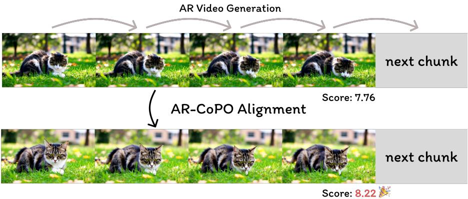
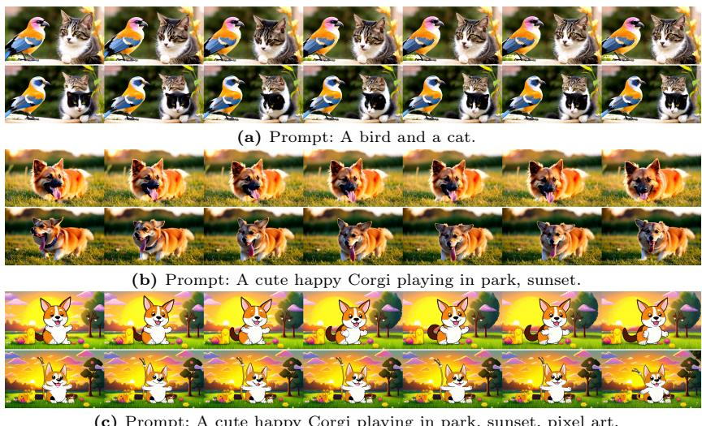
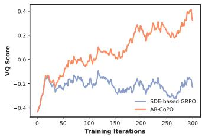
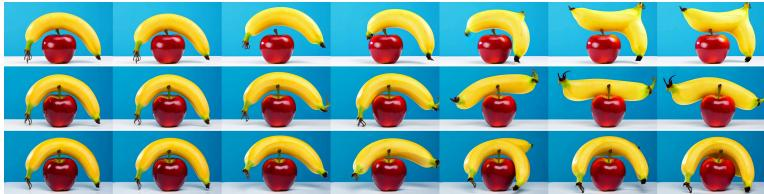
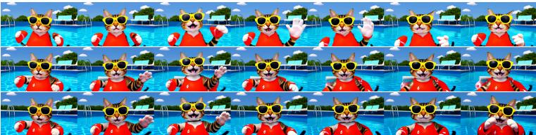
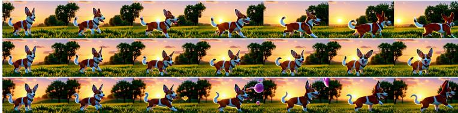
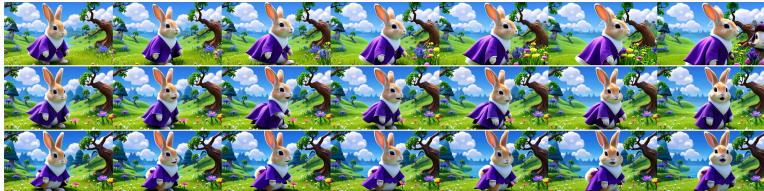
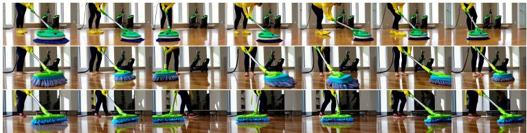

# 1. 论文基本信息

## 1.1. 标题
论文标题为 **AR-CoPO: Align Autoregressive Video Generation with Contrastive Policy Optimization**（AR-CoPO：通过对比策略优化对齐自回归视频生成）。该标题清晰地表明了论文的核心任务：利用一种名为“对比策略优化（Contrastive Policy Optimization, CoPO）”的方法，对“自回归（Autoregressive, AR）”架构的视频生成模型进行对齐（Align），使其更符合人类偏好。

## 1.2. 作者
论文作者包括 Dailan He, Guanlin Feng, Xingtong Ge, Yi Zhang, Bingqi Ma, Guanglu Song, Yu Liu, Hongsheng Li。
*   **研究背景与隶属机构：** 作者主要来自 **CUHK MMLab**（香港中文大学多媒体实验室）、**Vivix Group Limited**、**HKUST**（香港科技大学）、**Shenzhen Loop Area Institute**（深圳LOOP区域研究所）以及 **CPII under InNoHK**。这表明该研究是由学术界顶尖实验室与产业界研究团队共同合作完成的，兼具理论深度与工程落地能力。

## 1.3. 发表期刊/会议
该论文发表于 **arXiv** 预印本平台，发布时间为 **2026-03-18**。
*   **声誉与影响力：** arXiv 是计算机科学、物理学等领域最权威的预印本 repository。虽然尚未经过同行评审（Peer Review），但鉴于作者团队在视频生成和强化学习领域的过往影响力（如 MMLab 在 CVPR/ICCV 等顶会的表现），该工作具有极高的关注度和潜在影响力。

## 1.4. 发表年份
2026 年。

## 1.5. 摘要
*   **研究目的：** 解决流式自回归（Streaming AR）视频生成器结合少步蒸馏（Few-step Distillation）后，难以通过人类反馈强化学习（RLHF）进行对齐的问题。
*   **核心方法：** 提出 **AR-CoPO** 框架。该方法将 Neighbor GRPO 的对比视角适配到流式 AR 生成中，引入了基于“分叉（Forking）”机制的片段级（Chunk-level）对齐，并在随机选择的片段处构建邻居候选，分配序列级奖励，执行局部 GRPO 更新。此外，提出了一种“半在线策略（Semi-on-policy）”训练策略，结合在线探索与基于参考推演（Reference Rollouts）回放缓冲区的利用。
*   **主要结果：** 在 Self-Forcing 模型上的实验表明，AR-CoPO 在域外泛化性（Out-of-domain Generalization）和域内人类偏好对齐（In-domain Human Preference Alignment）上均优于基线。
*   **关键结论：** 该方法提供了真正的对齐证据，而非奖励黑客（Reward Hacking）。

## 1.6. 原文链接
*   **ArXiv 链接：** https://arxiv.org/abs/2603.17461
*   **PDF 链接：** https://arxiv.org/pdf/2603.17461v1
*   **发布状态：** 预印本（Preprint）。

# 2. 整体概括

## 2.1. 研究背景与动机
*   **核心问题：** 随着扩散模型（Diffusion Models）和流匹配（Flow Matching）模型在图像和视频合成上的成功，其推理成本（尤其是双向生成）随采样步数和视频长度线性增长，难以满足低延迟、可变长度和流式生成的需求。虽然通过蒸馏技术（如分布匹配蒸馏 DMD）将模型转化为因果自回归（AR）生成器并压缩为少步（Few-step）采样解决了效率问题，但这使得传统的基于随机微分方程（SDE）的强化学习对齐方法（如 GRPO）失效。
*   **具体挑战：**
    1.  **模型偏差：** 少步生成器（通常是蒸馏的 ODE 或一致性模型）偏离了标准的流匹配 ODE，使得为连续流匹配设计的 SDE 方法难以适用。
    2.  **探索失效：** 少步 AR 模型的轨迹短且随机性低，对初始化噪声高度敏感。现有的 SDE-based GRPO 方法依赖中间噪声注入进行探索，但在少步模型中，中间噪声对输出影响微乎其微，导致探索无效。
*   **切入点：** 借鉴 Neighbor GRPO 的思想，将 SDE-GRPO 更新重新解释为基于距离的对比目标，通过在训练时构建初始噪声的邻居候选来控制探索，而非依赖采样时的随机性。

## 2.2. 核心贡献/主要发现
*   **AR-CoPO 框架：** 提出了首个专为流式 AR 视频生成器设计的对比策略优化框架。
*   <strong>片段级对齐（Chunk-level Alignment）：</strong> 引入分叉机制，在随机选择的视频片段（Chunk）处构建邻居，实现局部信用分配（Credit Assignment），大幅降低训练成本并提高稳定性。
*   <strong>半在线策略训练（Semi-On-Policy Training）：</strong> 结合在线探索（On-policy Exploration）和基于回放缓冲区的利用（Exploitation），解决了纯在线策略在语义对齐（如文本一致性）上容易导致的奖励黑客和质量崩溃问题。
*   **实验验证：** 在 Self-Forcing 基线上，AR-CoPO 同时提升了 VideoAlign（域内偏好）和 VBench（域外质量）分数，证明了其有效性和泛化能力。

    下图（原文 Figure 1）直观展示了 AR-CoPO 的目标，即通过对齐提升少步自回归视频生成模型的采样质量：

    
    *该图像是一个示意图，展示了AR-CoPO方法如何通过增强生成质量来对比和优化少步自回归视频生成模型。上方为传统的AR视频生成方法，下方为AR-CoPO对齐后的结果，分别显示评分7.76和8.22。*

# 3. 预备知识与相关工作

## 3.1. 基础概念
为了理解本文，读者需要掌握以下核心概念：

1.  <strong>自回归视频生成（Autoregressive Video Generation）：</strong>
    *   **解释：** 传统的视频生成模型通常是双向的（Bidirectional），即生成某一帧时可以看见过去和未来的信息。而自回归模型是因果的（Causal），按时间顺序逐帧或逐块（Chunk）生成，类似于语言模型生成文本。这种方式支持流式输出，延迟更低。
    *   **挑战：** 容易产生误差累积（Error Accumulation）和暴露偏差（Exposure Bias）。

2.  <strong>流匹配与一致性模型（Flow Matching &amp; Consistency Models）：</strong>
    *   <strong>流匹配（Flow Matching）：</strong> 一种生成模型范式，通过学习一个向量场将噪声分布映射到数据分布。它通常比扩散模型更稳定，且支持确定性常微分方程（ODE）采样。
    *   <strong>一致性模型（Consistency Models, CM）：</strong> 一种通过蒸馏技术训练模型，使其能够直接从任意噪声步长一步映射到干净数据的模型。这使得采样步数可以极少（如 1-4 步），极大加速推理。
    *   **本文语境：** 本文针对的是经过蒸馏的、少步采样的 AR 视频模型（如 Self-Forcing）。

3.  <strong>人类反馈强化学习（RLHF）：</strong>
    *   **解释：** 一种利用人类偏好数据（或奖励模型）来微调生成模型的技术。在文本领域（如 LLM）非常成功，用于让模型输出更符合人类价值观。
    *   **在视频中的应用：** 用于提升视频的美学、运动连贯性和指令遵循能力。

4.  <strong>GRPO (Group Relative Policy Optimization)：</strong>
    *   **解释：** 一种无需训练显式评论家（Critic）网络的强化学习算法。它通过对一组采样轨迹（Group）计算相对优势（Advantage）来更新策略。
    *   **SDE-based GRPO：** 传统方法通常将确定性的 ODE 采样转换为随机性的 SDE 采样，以便在采样过程中注入噪声进行探索。

5.  <strong>推演（Rollout）：</strong>
    *   **解释：** 在强化学习中，指智能体根据当前策略从初始状态执行一系列动作直到终止状态的过程。在生成模型中，指从噪声开始生成完整视频序列的过程。
    *   **注意：** 此处不能翻译为“部署”，而是指采样轨迹的生成。

## 3.2. 前人工作
*   **Flow Matching & Distillation:** 论文引用了 Flow Matching [9] 和 Distribution Matching Distillation (DMD) [28,29] 作为基础，这些技术使得少步 ODE 采样成为可能。
*   **AR Video Generation:** 引用了 Self-Forcing [4], Causal-Forcing [33], LongLive [27] 等工作，这些是将双向模型蒸馏为因果 AR 模型的代表。
*   **Post-training Alignment:** 提到了 Dance-GRPO [26], FlowGRPO [10] 等基于 SDE 的 GRPO 变体。这些方法通常通过将 ODE 转为 SDE 来引入随机性。
*   **Neighbor GRPO [2]:** 这是本文的直接灵感来源。它提出 SDE-GRPO 更新可以数学上重构为基于距离的对比学习目标，允许在训练时通过扰动初始噪声构建邻居，而推理时保持确定性 ODE。

## 3.3. 技术演进
视频生成对齐技术经历了从直接微调（Supervised Fine-tuning）到基于奖励模型的强化学习（RLHF）的演变。在扩散/流模型领域，早期尝试直接应用 PPO，后来发展为无需 Critic 的 GRPO 类方法。然而，随着模型向“少步”、“自回归”演进，传统的 SDE 探索机制失效，本文提出的 AR-CoPO 正是为了填补这一技术空白，适应新一代高效视频生成架构的对齐需求。

## 3.4. 差异化分析
*   **与 SDE-GRPO 的区别：** SDE-GRPO 依赖中间步骤的噪声注入进行探索，而 AR-CoPO 指出少步 AR 模型对中间噪声不敏感，因此改为在片段初始噪声处进行分叉（Forking）探索。
*   **与 Neighbor GRPO 的区别：** Neighbor GRPO 主要针对连续时间流匹配模型，在中间时间步 $t$ 构建邻居。AR-CoPO 将其适配为离散的“片段（Chunk）”级别，并针对一致性模型（CM）设计了基于 $\hat{x}_0$ 预测空间的距离度量，而非中间潜变量空间。
*   **训练策略：** 引入了独特的“半在线（Semi-on-policy）”策略，通过 LoRA 合并结合探索与利用，解决了纯在线策略在语义奖励上的不稳定性。

# 4. 方法论

## 4.1. 方法原理
AR-CoPO 的核心直觉在于：对于少步自回归视频模型，生成的多样性主要由每个片段的**初始噪声**决定，而非采样过程中的中间噪声。因此，有效的探索应当集中在初始噪声的扰动上，并通过对比不同噪声产生的结果来优化策略。同时，为了平衡探索（发现新的高质量模式）和利用（保持已有的高质量分布），采用了双适配器（Dual-Adapter）训练策略。

## 4.2. 核心方法详解

### 4.2.1. 预备：Neighbor GRPO
在介绍 AR-CoPO 之前，需理解其基础 Neighbor GRPO。该方法避免随机 SDE 转换，而是通过扰动共享初始噪声 $\epsilon^*$ 构建邻居候选：

$$
\epsilon^{(i)} = \sqrt{1 - \sigma^2} \epsilon^* + \sigma \delta^{(i)}, \quad \delta^{(i)} \sim \mathcal{N}(0, I), \quad i = 1, \ldots, G
$$

其中 $\sigma \in (0, 1)$ 控制探索半径。这些噪声通过参考策略和 ODE 求解器确定性推演，收集中间潜变量 $\{ x_t^{(i)} \}_{i=1}^G$ 作为候选。

为了进行策略梯度更新，定义基于锚点潜变量 $x_t^{(\theta)}$（由当前策略 $\theta$ 生成）与候选之间距离的代理转移分布：

$$
d^{(i)} = \left\| x_t^{(i)} - x_t^{(\theta)} \right\|_2^2, \qquad \pi_\theta(i) = \frac{\exp\left(-d^{(i)}/\tau\right)}{\sum_{k=1}^G \exp\left(-d^{(k)}/\tau\right)}
$$

其中 $\tau$ 是温度超参数。给定候选的奖励 $\{ r^{(i)} \}_{i=1}^G$，计算优势 $A^{(i)} = \frac{r^{(i)} - \bar{r}}{\sigma_{\bar{r}}}$。模型优化目标为最大化：

$$
J(\theta) = \frac{1}{G} \sum_{i=1}^G \min\left( \frac{\pi_\theta(i)}{\pi_{\text{old}}(i)} A^{(i)}, \text{clip}\left( \frac{\pi_\theta(i)}{\pi_{\text{old}}(i)}, 1 - \epsilon, 1 + \epsilon \right) A^{(i)} \right)
$$

该目标将锚点拉向正优势候选，推离负优势候选。

### 4.2.2. AR-CoPO 训练流程
AR-CoPO 的训练流水线包含三个阶段，如下图所示（原文 Figure 3）：

![Fig. 3: The AR-CoPO training pipeline. (1) Rollout: The model autoregressively generates a shared context up to a randomly selected pivot chunk $p$ At chunk $p$ , the base initial noise is perturbed into $G$ neighbors; each neighbor is forked into an independent branch and autoregressively completed to produce a full video sequence. (2) Reward: Each completed sequence is decoded and scored by a reward model, yielding a sequence-level reward per branch. (3) Replay $\\&$ Update: The saved pivotchunk trajectories are replayed through the current policy; distances between current and old $\\scriptstyle { \\hat { x } } _ { 0 }$ predictions induce surrogate policy ratios, which are used in a clipped GRPO update confined to the pivot chunk.](images/3.jpg)
*该图像是AR-CoPO训练流水线的示意图，展示了模型如何通过自回归生成共享上下文，利用随机扰动生成邻居，并通过评分模型计算序列奖励。图中分为三个部分：1. 回放：生成初始噪声和共享上下文，进行自回归采样；2. 奖励：对完成序列进行解码和评分；3. 回放与更新：通过GRPO更新策略，使用旧预测与新预测之间的距离来生成奖励。*

1.  <strong>推演（Rollout）：</strong> 模型自回归生成共享上下文直到随机选择的枢轴片段（Pivot Chunk）$p$。在片段 $p$ 处，基础初始噪声被扰动为 $G$ 个邻居；每个邻居分叉为独立分支，自回归完成以产生完整视频序列。
2.  <strong>奖励（Reward）：</strong> 每个完成序列被解码并由奖励模型评分，产生每个分支的序列级奖励。
3.  <strong>回放与更新（Replay &amp; Update）：</strong> 保存的枢轴片段轨迹通过当前策略回放；当前预测与旧预测 $\hat{x}_0$ 之间的距离诱导代理策略比率，用于限制在枢轴片段上的裁剪 GRPO 更新。

#### 片段级对齐与分叉机制（Chunk-level Alignment via Forking）
由于流式 AR 生成的特性， naive 的序列级 GRPO 成本过高且信用分配困难。AR-CoPO 在随机选择的片段 $p$ 处执行动作空间采样（分叉），并通过序列级奖励评估生成。

具体优化步骤如下：
1.  **共享上下文生成：** 随机采样枢轴片段索引 $p \in \{1, \ldots, L\}$。模型顺序生成前 `p-1` 个片段以建立共享历史上下文 $h_{p-1}$（如缓存的 KV 状态）。
2.  **动作空间分叉：** 在第 $p$ 个片段处，基于共享初始噪声 $\epsilon_p^*$ 分支生成 $G$ 个邻居 $\{ \epsilon_p^{(i)} \}_{i=1}^G$。对于每个分支，模型完成 $T$ 步去噪生成以产生片段潜变量 $x_p^{(i)}$。该 $T$ 步轨迹的状态存储在回放缓冲区中。
3.  **推演与序列级奖励：** 对于 $G$ 个分支中的每一个，模型确定性生成剩余 `L-p` 个片段（无进一步扰动）。序列完成后，计算每个分支的序列级奖励 $r^{(i)}$。

    <strong>受控噪声共享（Controlled Noise Sharing）：</strong> 关键设计在于，每个训练迭代中，分支间唯一的随机性来源是枢轴片段的初始噪声 $\epsilon_p^{(i)}$。所有非枢轴片段的初始噪声以及每个片段内每个去噪时间步的 CM 求解器噪声在所有 $G$ 个分支中只绘制一次并复用。这确保了 $G$ 个完成序列仅在片段 $p$ 生成的内容上不同，奖励差异可直接归因于该片段的生成选择。

在策略更新阶段，从回放缓冲区检索第 $p$ 个片段的保存轨迹。使用序列级奖励 $r^{(i)}$ 计算优势 $A^{(i)}$。然后，利用距离诱导的代理策略 $\pi_\theta(i \mid s_p)$（距离使用片段潜变量 $x_p$ 计算），执行标准的 Neighbor GRPO 参数更新，优化公式限制在第 $p$ 个片段上。

#### 一致性模型的 CoPO 对齐（CoPO for Consistency Model Alignment）
对于流匹配（FM）模型，上述距离定义直接适用。但对于一致性模型（CM）如 Self-Forcing，ODE 求解器距离不适用，因为 CM 的关键操作是从噪声潜变量直接到干净预测 $\hat{x}_0$ 的一步映射。在中间 $x_t$ 空间测量距离会混淆噪声尺度与语义内容。

因此，AR-CoPO 在 $\hat{x}_0$ 预测空间定义距离：

$$
d_{0,t}^{(i)} = \left\| \hat{x}_{0,t}^{(i)} - \hat{x}_{0,t}^{(\theta)} \right\|_2^2, \qquad \pi_\theta(i \mid s_t) = \frac{\exp\left(-d_{0,t}^{(i)}/\tau_0\right)}{\sum_{k=1}^G \exp\left(-d_{0,t}^{(k)}/\tau_0\right)}
$$

其中 $\hat{x}_{0,t}^{(i)} = F_{\theta_{\text{old}}}(x_t^{(i)}, h_{t-1}, t)$ 由旧参数在候选输入上产生，$\hat{x}_{0,t}^{(\theta)}$ 由当前参数产生，$\tau_0$ 是温度。

算法 1 总结了 AR-CoPO 的一次训练迭代：

**Algorithm 1 AR-CoPO Training (one iteration)**
*   **Require:** Policy $\theta$, reward $r(\cdot)$, sequence length $L$, group size $G$
*   1: Sample pivot $p \sim \text{Uniform}(1, L)$
*   2: Generate shared context $h_{p-1}$ by running $\theta$ on chunks $1, \ldots, p-1$
*   3: **for** $i = 1, \dots, G$ **do** $\triangleright$ Fork at chunk $p$
*   4: $\epsilon_p^{(i)} \gets \sqrt{1 - \sigma^2} \epsilon_p^* + \sigma \delta^{(i)}, \quad \delta^{(i)} \sim \mathcal{N}(0, I)$
*   5: Denoise chunk $p$ from $\epsilon_p^{(i)}$; complete remaining chunks; compute $r^{(i)}$
*   6: **end for**
*   7: $A^{(i)} \gets (r^{(i)} - \bar{r}) / \sigma_r$
*   8: Replay chunk $p$, compute $\pi_\theta(i) \propto \exp(-\| \hat{x}_0^{(i)} - \hat{x}_0^{(\theta)} \|^2 / \tau_0)$
*   9: Update $\theta$ via GRPO (Eq. 3) on chunk $p$ only

### 4.2.3. 半在线策略对齐（Semi-On-Policy Alignment）
**纯在线探索的局限性：** 在线 AR-CoPO 通过初始噪声扰动生成多样候选，但并非所有奖励信号都对探索驱动的训练响应相同。特别是文本对齐（TA），这是一种全局语义级奖励，难以仅通过局部噪声扰动改善。小扰动通常产生语义相似的输出，奖励方差可忽略，导致梯度信号弱且噪声大。

**半在线策略作为利用：** 为了补充在线探索，引入了专门的利用范式。如下图所示（原文 Figure 4），所有推演固定为参考策略 $\pi_{\text{ref}}$（初始化检查点），并预收集大量参考候选的回放缓冲区。对比 AR-CoPO 目标应用于这些固定推演：高奖励候选被加权，低奖励候选被抑制，无需依赖随机探索发现新模式。

![Fig. 4: On-policy vs. semi-on-policy training under AR-CoPO. Left: On-policy training rolls out fresh candidates from the evolving policy $\\pi \\theta$ at each iteration, enabling active exploration of new generation modes guided by the reward signal. Right: Semion-policy training fixes all rollouts to a reference policy $\\pi _ { \\mathrm { r e f } }$ ; the contrastive objective upweights high-reward candidates and suppresses low-reward ones within a trust region maintained by ratio clipping, enhancing exploitation without sacrificing stability. Each paradigm trains an independent LoRA adapter; merging the two adapters yields the final aligned model that benefits from both exploration and exploitation.](images/4.jpg)
*该图像是示意图，展示了AR-CoPO中的两种训练方式：左侧为On-Policy训练，候选生成模式通过奖励信号进行主动探索；右侧为Semi-On-Policy训练，样本固定，增强了对高奖励候选的利用，双方各自训练独立的LoRA适配器。*

<strong>通过比率裁剪的信任区域（Trust Region via Ratio Clipping）：</strong> 朴素的离线方案风险在于分布偏移。AR-CoPO 目标中保留比率裁剪，强制执行围绕 $\pi_{\text{ref}}$ 的信任区域，防止策略漂移过远导致崩溃。

**通过 LoRA 合并结合探索与利用：** 在线和半在线目标互补，最好独立优化。因此训练两个独立的 LoRA 适配器：一个用于在线 AR-CoPO（探索），一个用于半在线 AR-CoPO（利用）。在推理时合并它们。合并后的模型受益于两者：半在线适配器重塑参考策略的分布内质量，而在线适配器通过主动探索将模型导向高奖励区域。

# 5. 实验设置

## 5.1. 数据集
*   **训练数据：** 实验在 **MovieGen Video Bench [15]** 上进行。这是一个用于评估视频生成模型的大规模基准数据集，包含多样化的文本提示和视频样本。
*   **选择理由：** 该数据集广泛用于视频生成评估，能够有效验证模型在指令遵循、美学和运动质量上的表现。

## 5.2. 评估指标
论文使用了两个主要基准套件：**VBench** 和 **VideoAlign**。

1.  **VBench:**
    *   **概念定义：** 一个全面的视频生成评估基准，涵盖质量（Quality）、语义（Semantic）等多个维度。
    *   **指标：** Quality（视觉质量）, Semantic（语义一致性）, Total（综合得分）。
    *   **公式：** 具体计算公式参考 VBench 原论文，通常为多个子指标的加权平均。

2.  **VideoAlign [11]:**
    *   **概念定义：** 专门用于评估视频对齐人类反馈的奖励套件。
    *   **指标：**
        *   **VQ (Video Quality):** 视频质量。
        *   **MQ (Motion Quality):** 运动质量，评估动作的流畅性和物理合理性。
        *   **TA (Text Alignment):** 文本对齐，评估视频内容与提示词的一致性。
        *   **Overall:** 综合得分。
    *   **公式：** 同样基于预训练的奖励模型打分，具体为 $Score = \text{RewardModel}(Video, Prompt)$。

## 5.3. 对比基线
*   **Self-Forcing [4]:** 主要基线模型，一种少步自回归视频生成器。
*   **Causal-Forcing [33]:** 另一种因果蒸馏模型，用于验证泛化性。
*   **LongLive [27]:** 代表性的少步流式 AR 视频生成器，作为强基线。
*   **SDE-based GRPO:** 如 Dance-GRPO [26] 和 FlowGRPO [10] 的设计，用于证明传统方法在少步 AR 设置下的失效。

## 5.4. 训练细节
*   **优化器：** 使用 LoRA（rank 64, $\alpha=128$）进行微调。
*   **硬件：** 24 GPUs。
*   **超参数：** 组大小 $G=12$，学习率 $1 \times 10^{-5}$，锚点批次大小 4，初始噪声扰动强度 0.5。
*   **迭代次数：** 所有模型评估前训练 100 次迭代。
*   **半在线策略：** 收集 100 个推演组的回放缓冲区。

# 6. 实验结果与分析

## 6.1. 核心结果分析
### 与 AR 模型的比较
定量结果如下表所示（原文 Table 1）。半在线训练 Alone 在 VBench Total 上超越了所有流式 AR 基线。合并在线 LoRA 适配器后，VideoAlign Overall 显著提升，同时保持 VBench Total 不降，证明是真正的对齐而非分数膨胀。

以下是原文 Table 1 的结果：

<table>
<thead>
<tr>
<th rowspan="2">Method</th>
<th colspan="3">VBench</th>
<th colspan="4">VideoAlign</th>
</tr>
<tr>
<th>Quality</th>
<th>Semantic</th>
<th>Total</th>
<th>VQ</th>
<th>MQ</th>
<th>TA</th>
<th>Overall</th>
</tr>
</thead>
<tbody>
<tr>
<td>Self-Forcing</td>
<td>84.87</td>
<td>71.27</td>
<td>82.15</td>
<td>3.80</td>
<td>1.68</td>
<td>2.28</td>
<td>7.76</td>
</tr>
<tr>
<td>Causal-Forcing</td>
<td>85.27</td>
<td>70.35</td>
<td>82.28</td>
<td>3.97</td>
<td>1.43</td>
<td>2.40</td>
<td>7.79</td>
</tr>
<tr>
<td>LongLive</td>
<td>85.10</td>
<td>71.16</td>
<td>82.31</td>
<td>3.87</td>
<td>1.76</td>
<td>2.43</td>
<td>8.06</td>
</tr>
<tr>
<td>Self-Forcing</td>
<td>84.87</td>
<td>71.27</td>
<td>82.15</td>
<td>3.80</td>
<td>1.68</td>
<td>2.28</td>
<td>7.76</td>
</tr>
<tr>
<td>+ ours (semi)</td>
<td>85.15</td>
<td>71.68</td>
<td>82.45</td>
<td>3.70</td>
<td>1.60</td>
<td>2.30</td>
<td>7.61</td>
</tr>
<tr>
<td>+ ours (on-policy)</td>
<td>84.81</td>
<td>70.71</td>
<td>81.99</td>
<td>4.15</td>
<td>2.06</td>
<td>2.30</td>
<td>8.51</td>
</tr>
<tr>
<td>+ ours (merged)</td>
<td>85.07</td>
<td>70.55</td>
<td>82.17</td>
<td>4.00</td>
<td>1.86</td>
<td>2.36</td>
<td>8.22</td>
</tr>
</tbody>
</table>

定性结果方面，下图（原文 Figure 5）展示了 AR-CoPO 与 Self-Forcing 的对比。AR-CoPO 生成的视频具有更好的美学质量、更生动的appearance、更连贯的运动以及更好的文本描述遵循度。

*该图像是示意图，展示了三个不同的生成示例：第一部分是根据提示“鸟和猫”生成的鸟类与猫咪的图像；第二部分基于提示“A cute happy Corgi playing in park, sunset”生成了可爱的柯基犬的图像；第三部分则是根据相同提示生成的像素艺术风格的柯基犬图像。*

### 与 SDE-GRPO 的比较
训练曲线显示（原文 Figure 2 左侧），基于 SDE 的 GRPO 在训练过程中无法提高奖励，而 AR-CoPO 始终获得更高分数。

![Fig. 2: Left: Training curves comparing SDE-based GRPO and AR-CoPO on Self-Forcing. SDE-based GRPO fails to improve the reward, while AR-CoPO consistently achieves higher scores throughout training. Right: Perturbing only the intermediate CM solver noise (Rows 35) produces nearly identical outputs, whereas replacing the initial noise (Row 2) causes significant variation, confirming that few-step AR models (e.g. Self-Forcing \[4\]) are near-deterministic and driven primarily by initial noise.](images/2.jpg)
*该图像是图表与样例图的组合。左侧展示了SDE-based GRPO与AR-CoPO在Self-Forcing上的训练曲线对比，AR-CoPO的表现优于SDE-based GRPO。右侧显示不同步骤生成的视频样本，初始噪声的变化显著影响最终输出，显示了少步AR模型对初始噪声的敏感性。*

原因分析：少步一致性模型（CM）是近确定性的。下图（原文 Figure 6）的噪声替换研究证实：仅替换初始片段噪声会导致输出大幅变化，而替换中间 CM 求解器噪声几乎不产生可见变化。这使得依赖中间噪声注入的 SDE-GRPO 策略梯度信号接近于零。

![Fig. 6: Analysis of entropy sources in Self-Forcing. Each sub-figure corresponds to forking at a different chunk position. Row 1: Reference sample with all noise frozen. Row 2: Only the initial noise of the forked chunk is replaced—the output changes substantially. Rows 35: Only the CM solver noise at a specific denoising timestep within the chunk is replaced—the output changes marginally. This confirms that sample diversity in Self-Forcing is governed almost entirely by the initial noise, making intermediate SDE-style noise injection ineffective as an exploration mechanism.](images/7.jpg)
*该图像是示意图，展示了在自我增强(Self-Forcing)中不同位置分叉的分析。每个子图展示了参考样本、初始噪声替换以及在各时间步下的变化，说明样本多样性主要受初始噪声的影响。图中包含的核心信息为（a）和（b）所示的分叉位置。*

下图（原文 Figure 7）展示了 VQ 训练曲线，AR-CoPO 显著优于 SDE-based GRPO 基线。

*该图像是图表，展示了AR-CoPO方法（橙色曲线）与SDE-based GRPO基线（蓝色曲线）在VQ评分上的训练迭代情况。图中可见AR-CoPO在训练过程中表现出更高的VQ分数，表明其在動画生成任务中的优势。*

## 6.2. 消融实验/参数分析
### 半在线策略训练的效果
为了隔离每种训练范式对语义对齐的影响，作者在仅优化 TA 奖励的情况下消融了三种策略：在线、半在线和完全离线（无比率裁剪）。结果如下表（原文 Table 2）：

<table>
<thead>
<tr>
<th rowspan="2">Method</th>
<th colspan="3">VBench</th>
<th colspan="4">VideoAlign</th>
</tr>
<tr>
<th>Quality</th>
<th>Semantic</th>
<th>Total</th>
<th>VQ</th>
<th>MQ</th>
<th>TA</th>
<th>Overall</th>
</tr>
</thead>
<tbody>
<tr>
<td>Self-Forcing</td>
<td>84.87</td>
<td>71.27</td>
<td>82.15</td>
<td>3.80</td>
<td>1.68</td>
<td>2.28</td>
<td>7.76</td>
</tr>
<tr>
<td>on-policy</td>
<td>81.66</td>
<td>69.68</td>
<td>79.26</td>
<td>3.53</td>
<td>0.25</td>
<td>2.63</td>
<td>6.42</td>
</tr>
<tr>
<td>off-policy</td>
<td>69.78</td>
<td>60.84</td>
<td>67.99</td>
<td>2.22</td>
<td>-0.15</td>
<td>2.16</td>
<td>4.23</td>
</tr>
<tr>
<td>semi-on-policy</td>
<td>85.15</td>
<td>71.68</td>
<td>82.45</td>
<td>3.70</td>
<td>1.60</td>
<td>2.30</td>
<td>7.61</td>
</tr>
</tbody>
</table>

**分析：**
*   <strong>在线策略（On-policy）：</strong> 虽然提高了域内 TA 分数，但导致其他指标严重退化，MQ 从 1.68 崩溃至 0.25。这是奖励黑客（Reward Hacking）的典型表现：模型为了优化全局语义奖励而牺牲了时间连贯性。下图（原文 Figure 8）展示了在线策略产生的可见时间不一致性。
*   <strong>半在线策略（Semi-on-policy）：</strong> 避免了崩溃，VideoAlign 分数与基线持平，VBench 质量提升。比率裁剪约束至关重要。
*   <strong>完全离线（Off-policy）：</strong> 无信任区域约束导致模型漂移，分数恶化。

    
    *该图像是插图，展示了一对情侣在户外雨天共享伞下的亲密瞬间。图中情侣表现出不同的情感互动与互动细节，体现了温馨的氛围和浪漫的场景。*

### LoRA 合并比例分析
在线和半在线适配器独立训练，推理时通过缩放在线 LoRA 权重后相加进行合并。不同合并比例的结果如下表（原文 Table 3）：

<table>
<thead>
<tr>
<th rowspan="2">Scale</th>
<th colspan="3">VBench</th>
<th colspan="4">VideoAlign</th>
</tr>
<tr>
<th>Quality</th>
<th>Semantic</th>
<th>Total</th>
<th>VQ</th>
<th>MQ</th>
<th>TA</th>
<th>Overall</th>
</tr>
</thead>
<tbody>
<tr>
<td>1.0</td>
<td>84.90</td>
<td>70.38</td>
<td>81.99</td>
<td>4.13</td>
<td>1.86</td>
<td>2.34</td>
<td>8.33</td>
</tr>
<tr>
<td>0.8</td>
<td>85.07</td>
<td>70.55</td>
<td>82.17</td>
<td>4.00</td>
<td>1.86</td>
<td>2.36</td>
<td>8.22</td>
</tr>
<tr>
<td>0.6</td>
<td>85.11</td>
<td>70.72</td>
<td>82.23</td>
<td>3.86</td>
<td>1.78</td>
<td>2.36</td>
<td>7.99</td>
</tr>
<tr>
<td>0.4</td>
<td>85.14</td>
<td>71.44</td>
<td>82.40</td>
<td>3.76</td>
<td>1.62</td>
<td>2.34</td>
<td>7.72</td>
</tr>
<tr>
<td>0 (Semi)</td>
<td>85.15</td>
<td>71.68</td>
<td>82.45</td>
<td>3.70</td>
<td>1.60</td>
<td>2.30</td>
<td>7.61</td>
</tr>
</tbody>
</table>

**比例选择标准：** 必须同时提升域内基准（VideoAlign Overall）和独立域外基准（VBench Total）。Scale = 0.8 是满足双重提升标准的最大比例（VideoAlign 7.76→8.22，VBench 82.15→82.17），因此被选为默认设置。

### Causal-Forcing 上的表现
在附录中，作者还在 Causal-Forcing 基线上评估了 AR-CoPO。结果如下表（原文 Table 4）：

<table>
<thead>
<tr>
<th rowspan="2">Scale</th>
<th colspan="3">VBench</th>
<th colspan="4">VideoAlign</th>
</tr>
<tr>
<th>Quality</th>
<th>Semantic</th>
<th>Total</th>
<th>VQ</th>
<th>MQ</th>
<th>TA</th>
<th>Overall</th>
</tr>
</thead>
<tbody>
<tr>
<td>1.0</td>
<td>84.00</td>
<td>70.70</td>
<td>81.34</td>
<td>4.39</td>
<td>1.75</td>
<td>2.45</td>
<td>8.59</td>
</tr>
<tr>
<td>0.8</td>
<td>84.61</td>
<td>70.72</td>
<td>81.83</td>
<td>4.26</td>
<td>1.66</td>
<td>2.44</td>
<td>8.36</td>
</tr>
<tr>
<td>0.6</td>
<td>84.91</td>
<td>70.43</td>
<td>82.01</td>
<td>4.15</td>
<td>1.56</td>
<td>2.45</td>
<td>8.18</td>
</tr>
<tr>
<td>0.5</td>
<td>85.13</td>
<td>70.70</td>
<td>82.25</td>
<td>4.10</td>
<td>1.50</td>
<td>2.40</td>
<td>8.01</td>
</tr>
<tr>
<td>0.4</td>
<td>85.52</td>
<td>70.61</td>
<td>82.54</td>
<td>4.07</td>
<td>1.48</td>
<td>2.40</td>
<td>7.95</td>
</tr>
<tr>
<td>0 (Semi)</td>
<td>85.73</td>
<td>70.33</td>
<td>82.65</td>
<td>3.97</td>
<td>1.42</td>
<td>2.41</td>
<td>7.81</td>
</tr>
<tr>
<td>Causal-Forcing</td>
<td>85.27</td>
<td>70.35</td>
<td>82.28</td>
<td>3.97</td>
<td>1.43</td>
<td>2.40</td>
<td>7.79</td>
</tr>
</tbody>
</table>

观察到 Causal-Forcing 比 Self-Forcing 更容易受到奖励黑客的影响；LoRA 合并比例 0.5 在域内和域外基准上实现了最佳整体性能。这证实了 AR-CoPO 的广泛适用性。

下图（原文 Figure 9）展示了 Causal-Forcing 与 AR-CoPO 的定性比较：

*该图像是一个展示了红色苹果和黄色香蕉的排列的插图，共有六行四列，背景为蓝色。水果在不同位置的组合展示了多种排列方式，有助于理解水果的视觉特点。*

*该图像是示意图，展示了多个视频帧的生成效果，其中包含了埃菲尔铁塔及周边的自然场景，突出了AR-CoPO框架在视频生成中的应用。*

*该图像是插图，展示了一只戴着黄色太阳镜的卡通猫在泳池旁的多种姿势，共包含多个表情和动作，表现出欢乐的氛围。*

*该图像是一个插图，展示了一只可爱的狗在夕阳下奔跑的动画场景，共有多帧表现了不同的动作，背景是绿草和树木，渲染出宁静的自然氛围。*

*该图像是动画插图，展示了一只穿着紫色外套的兔子在自然场景中不同姿势的变化。整体构图生动，展示了兔子在树木与草地之间的活动。*

*该图像是一个示意图，展示了清洁工具在不同步态下的使用过程，多个图像按时间顺序排列，展示了流畅的动作。图中所示的清洁工具具有快速清洁的特点，整体呈现出动态感。*

# 7. 总结与思考

## 7.1. 结论总结
本文提出了 **AR-CoPO**，一个用于对齐少步流式自回归视频生成器的片段级对比策略优化框架。
1.  **机制创新：** 通过在随机选择的枢轴片段处构建邻居候选的分叉机制，规避了 SDE 探索与一致性模型采样器近确定性动力学之间的根本不匹配。
2.  **策略创新：** 互补的半在线策略通过信任区域内利用高质量参考推演，进一步提高了生成质量，未牺牲在线训练的探索优势。
3.  **效果验证：** Self-Forcing 上的实验证明了在 VBench 和 VideoAlign 上的一致改进，验证了 AR-CoPO 对流式 AR 视频生成后训练对齐的有效性。

## 7.2. 局限性与未来工作
*   **计算成本：** 尽管片段级更新降低了成本，但构建 $G$ 个邻居并进行完整序列推演仍然需要显著的 GPU 资源，特别是在长视频生成中。
*   **奖励模型依赖：** 方法的有效性高度依赖于奖励模型（如 VideoAlign）的质量。如果奖励模型存在偏差，模型仍可能学到错误的对齐。
*   **超参数敏感性：** LoRA 合并比例需要仔细调整以平衡质量和偏好，这增加了部署的复杂性。
*   **未来方向：** 探索更高效的邻居构建方法（如潜空间插值），以及研究无需显式奖励模型的无监督对齐方法。

## 7.3. 个人启发与批判
*   **启发：** 本文对“探索机制”的重新思考非常有价值。在少步生成模型中，盲目套用传统的 SDE 噪声注入是无效的，必须根据模型的归纳偏置（Initial Noise Driven）设计探索策略。这种“模型感知（Model-Aware）”的 RLHF 设计思路可迁移到其他高效生成模型（如 LCM, Distilled Diffusion）的对齐中。
*   **批判：**
    1.  **双适配器部署：** 推理时需要合并两个 LoRA 适配器，虽然可行，但增加了工程复杂度。是否可以直接在单一策略中通过损失函数加权实现探索与利用的平衡？
    2.  **片段级信用的局限：** 虽然片段级更新降低了方差，但视频是一个强时序依赖的整体。仅优化单个片段可能忽略长程依赖（Long-term Dependency），例如视频开头与结尾的逻辑一致性。未来的工作可以考虑多片段联合分叉或引入记忆机制。
    3.  **评估指标的权衡：** 实验显示 VideoAlign 提升往往伴随 VBench 下降（见表 3），这暗示了当前奖励模型与人类感知的通用质量指标之间仍存在冲突。如何设计更全面的奖励函数以消除这种 Trade-off 是未来的关键挑战。