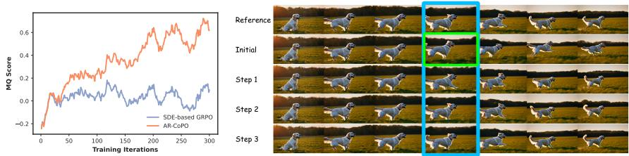
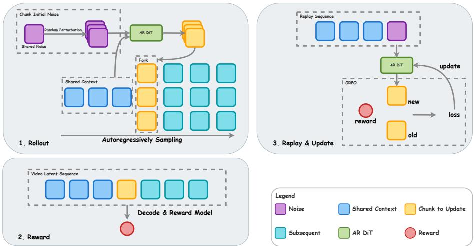
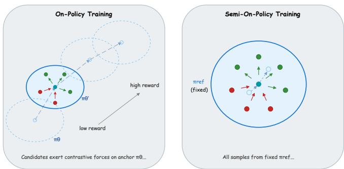
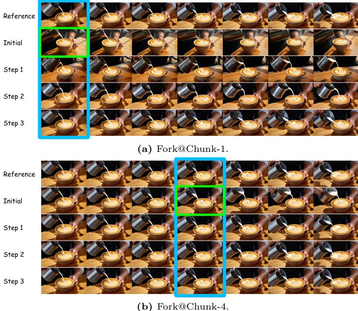

# AR-CoPO: 将自回归视频生成与对比策略优化对齐

戴岚 $\mathbf{H e}^{1,2}$ 冯光霖2 邢彤 $\mathbf{G e^{2,3}}$ 易张2 邓碧琦2 宋光璐2 刘宇2 李洪生1,4,5 1 香港中文大学 MMLab hedailan@link.cuhk.edu.hk 2 Vivix集团有限公司 3 香港科技大学 4 深圳环道研究所 5 在 InnoHK 下的 CPII

摘要。流式自回归（AR）视频生成器结合少步蒸馏技术实现了低延迟、高质量的合成，然而在通过人类反馈的强化学习（RLHF）进行对齐时仍然面临挑战。现有的基于随机微分方程（SDE）的GRPO方法在这种情况下遇到困难：少步常微分方程（ODE）和一致性模型采样器偏离了标准的流匹配ODE，其短小、低随机性的轨迹对初始化噪声高度敏感，导致中间SDE探索效果不佳。我们提出了AR-CoPO（自回归对比策略优化），一个将邻居GRPO对比视角适应于流式AR生成框架。AR-CoPO通过一种分叉机制引入了块级对齐，在随机选择的块处构建邻域候选、分配序列级奖励，并执行局部GRPO更新。我们进一步提出了一种半在线策略训练策略，该策略通过对参考回放缓冲区的探索与利用来补充在线探索，提高了跨领域的生成质量。在Self-Forcing的实验中表明，AR-CoPO在领域外泛化和领域内人类偏好对齐方面均优于基线，提供了真正对齐而非奖励操纵的证据。

# 1 引言

扩散模型和流匹配模型在图像和视频合成方面取得了显著进展，能够提供高质量和多样化的结果。尽管它们取得了成功，双向生成的推理成本通常随采样步骤数和目标视频长度线性增长。这种增长行为使得在低延迟、可变长度和流式生成场景中部署这些模型变得困难。为了解决这个问题，越来越多的研究工作将强大的双向视频模型提炼为自回归（AR）和分块方式操作的因果生成器。此外，像分布匹配蒸馏（DMD）这样的技术将采样过程压缩至仅需几步。这些通常通过少步常微分方程求解器或一致性模型实现，同时工程优化，例如KV缓存，进一步提高了吞吐量和响应速度。

  
Fig. 1: AR-CoPO is a reinforcement learning for human preference (RLHF) method, aligning few-step autoregressive (AR) video generative models to better sample quality.

  
Fig. 2: Left: Training curves comparing SDE-based GRPO and AR-CoPO on Self-Forcing. SDE-based GRPO fails to improve the reward, while AR-CoPO consistently achieves higher scores throughout training. Right: Perturbing only the intermediate CM solver noise (Rows 35) produces nearly identical outputs, whereas replacing the initial noise (Row 2) causes significant variation, confirming that few-step AR models (e.g. Self-Forcing [4]) are near-deterministic and driven primarily by initial noise.

然而，流式自回归结构与少步蒸馏的结合给后训练对齐带来了重大挑战，尤其是在基于人类反馈的强化学习（RLHF）方面。RLHF 对于可控的高质量视频生成至关重要。与语言建模类似，视频生成器通常与捕捉指令遵循、主题一致性、动作合理性和美学的奖励模型或验证器对齐。对于流匹配风格的生成器来说，策略梯度后训练（例如，类 GRPO 的目标）通过将采样过程视为策略推演并利用奖励反馈优化诱导分布提供了一条自然的路径。然而，许多为流匹配模型设计的实用 GRPO 变体依赖于一个重要的实现选择：将确定性常微分方程（ODE）采样转换为随机微分方程（SDE）形式，从而引入马尔可夫决策过程（MDP）。将这些基于 SDE 的 GRPO 方法应用于少步流式生成器存在重大挑战。首先，少步生成器——通常被表述为蒸馏少步 ODE 或一致性模型——偏离了标准的流匹配 ODE，使得它们在使用为连续流匹配设计的基于 SDE 的方法进行训练时固有地困难。其次，由于这些模型跟随有限随机性的短采样轨迹，因此对初始化噪声和模型近似误差高度敏感。相比之下，基于 SDE 的方法严重依赖中间噪声注入来引导探索，同时通常保持初始噪声不变，导致根本的不匹配。因此，本文解决了一个关键问题：我们如何有效地使用类 GRPO 的目标对流式自回归视频生成器进行对齐？我们从最近提出的邻居 GRPO 视角中汲取灵感，这一视角提供了一种新的解释：SDE-GRPO 更新可以在数学上重新表述为对一组邻居候选轨迹的基于距离的对比目标。重要的是，这一观点表明，可以在采样过程中不依赖于随机 SDE 探索获得信息丰富的偏好信号。相反，通过在 ODE 采样器的初始噪声周围构建邻域候选，并定义基于 softmax 距离的替代转移分布，可以在训练过程中完全控制探索。基于这一见解，我们提出了一种自回归对比策略优化（AR-CoPO）框架，用于流式自回归视频生成器的后训练对齐。为了匹配流式自回归生成的结构特性，我们引入了一致块级对齐作为邻域构建和优化的基本单元。这建立了一个响应序列级奖励的块级动作空间，实现了自然和局部的信用分配。此外，除了鼓励探索的标准在政策训练外，我们在 AR-CoPO 目标下采用了半在政策训练策略，以增强利用性。通过结合这两种训练范式，我们有效提高了跨领域性能和整体生成质量。总之，我们的贡献包括：

# 2 相关工作

# 2.1 自回归视频生成

流匹配（FM）[9]及相关概率流常微分方程（ODE）为随机扩散采样提供了一种确定性替代方案，结合分布匹配蒸馏（DMD）[28,29]等蒸馏技术，可以通过少量步骤的ODE求解器快速生成样本。虽然ODE的确定性使得推理高效且稳定，但它限制了通常在基于强化学习的对齐中所需的随机探索。我们的工作旨在开发能够在训练期间实现可控探索的对齐机制，同时保持快速的确定性推理。为了支持流媒体应用并减少延迟，最近的方法将双向视频生成器蒸馏为因果自回归（AR）生成器，逐块合成视频[4, 27, 30, 33]。然而，AR设置带来了新的挑战，如跨块误差累积和由于训练与推理环境不匹配导致的曝光偏差。这些挑战促使我们专注于开发针对流媒体AR生成和短期少步ODE推理的稳定且局部的对齐方法。

# 2.2 后训练流程对齐与邻域 GRPO

生成模型的后训练对齐通常利用人类偏好或可计算的奖励，以改善指令遵循、美学和时序一致性。对于扩散和流基础生成器，可以通过将采样视为策略推演并利用策略梯度优化引导分布，应用强化学习风格的目标，通常采用避免训练显式评论者的变体（例如，类 GRPO 方法）。一个常见的实用选择是将确定性常微分方程（ODE）采样转换为随机性随机微分方程（SDE）过程，以注入探索并获得较低方差的更新，但这种转换可能限制求解器的选择，并且在较长轨迹上通常更为有效。替代方法通过直接偏好优化或奖励监督微调来对齐扩散模型。邻近 GRPO 提供了一种替代视角，通过将基于 SDE 的 GRPO 更新 reinterpret 视为对候选轨迹邻域的距离驱动对比目标。通过对初始噪声进行扰动来构造邻域，并在轨迹/潜在空间中基于 softmax 距离定义训练时间的替代转移分布，从而在保持推断时采样纯粹为 ODE 并兼容高阶求解器的同时，能够提供有意义的偏好信号。我们的方法遵循这个高层原则——训练时间可控探索与推断时间确定性——但将其调整到流媒体自回归视频场景。特别地，我们在块级别制定对齐，以更好地匹配自回归结构，旨在在跨块误差传播下提供更局部和稳定的信号，并引入一种半在线策略，以提高数据重用和时钟效率。

# 3.1 初步：邻居GRPO

邻居 GRPO [2] 通过将基于 SDE 的策略优化重新解释为距离驱动的对比学习目标，从而对基于流的生成模型进行对齐，并采用对比策略优化 (CoPO)。为了保持 ODE 采样的快速确定性推理，它避免了随机的 SDE 转换。相反，它通过扰动共享的初始噪声 $\epsilon ^ { * } \sim \mathcal { N } ( 0 , I )$ 来构建候选轨迹的邻域：

$$
\epsilon ^ { ( i ) } = \sqrt { 1 - \sigma ^ { 2 } } \epsilon ^ { * } + \sigma \delta ^ { ( i ) } , \quad \delta ^ { ( i ) } \sim \mathcal { N } ( 0 , I ) , \quad i = 1 , \ldots , G ,
$$

其中 $\sigma \in ( 0 , 1 )$ 控制探索半径。这些噪声通过 ODE 求解器使用参考策略确定性地推演，并在选定的时间步 $t$ 收集中间潜变量 $\{ x _ { t } ^ { ( i ) } \} _ { i = 1 } ^ { G }$ 作为候选。为了实现策略梯度更新，Neighbor GRPO 定义了一个基于锚定潜变量 $x _ { t } ^ { ( \theta ) }$（由同一时间步的活跃策略 $\theta$ 生成）与候选之间距离的替代训练时转换分布：

$$
d ^ { ( i ) } = \left\| x _ { t } ^ { ( i ) } - x _ { t } ^ { ( \theta ) } \right\| _ { 2 } ^ { 2 } , \qquad \pi _ { \theta } ( i ) = \frac { \exp \bigl ( - d ^ { ( i ) } / \tau \bigr ) } { \sum _ { k = 1 } ^ { G } \exp \bigl ( - d ^ { ( k ) } / \tau \bigr ) } ,
$$

温度超参数的位置。给定奖励 $\{ r ^ { ( i ) } \} _ { i = 1 } ^ { G }$，对于可通道化的 $\begin{array} { r } { A ^ { ( i ) } = \frac { r ^ { ( i ) } - \bar { r } } { \sigma _ { \bar { r } } } } \end{array}$，将代理策略和优势带入 GRPO 目标中，模型被优化以最大化：

$$
J ( \theta ) = \frac { 1 } { G } \sum _ { i = 1 } ^ { G } \operatorname* { m i n } \left( \frac { \pi _ { \theta } ( i ) } { \pi _ { \mathrm { o l d } } ( i ) } A ^ { ( i ) } , \mathrm { c l i p } \left( \frac { \pi _ { \theta } ( i ) } { \pi _ { \mathrm { o l d } } ( i ) } , 1 - \epsilon , 1 + \epsilon \right) A ^ { ( i ) } \right) .
$$

这个目标自然会把锚点拉向有积极优势的候选者，并将其推离那些具有消极优势的候选者。此外，邻域 GRPO 通过将多个候选者视为锚点而无需额外的前向传递，采用了对称锚点采样以降低训练成本。

# 3.2 增强现实共生优化流程

在本节中，我们介绍AR-CoPO。如图3所示，训练流程包括三个阶段：（1）通过在随机选择的核心块上进行分叉，推出邻域候选；（2）计算每个已完成分支的序列级奖励；（3）通过当前策略重放核心块，并执行对比GRPO更新。我们将在下面详细说明每个组件。

  
Fig. 3: The AR-CoPO training pipeline. (1) Rollout: The model autoregressively generates a shared context up to a randomly selected pivot chunk $p$ At chunk $p$ , the base initial noise is perturbed into $G$ neighbors; each neighbor is forked into an independent branch and autoregressively completed to produce a full video sequence. (2) Reward: Each completed sequence is decoded and scored by a reward model, yielding a sequence-level reward per branch. (3) Replay $\&$ Update: The saved pivotchunk trajectories are replayed through the current policy; distances between current and old $\scriptstyle { \hat { x } } _ { 0 }$ predictions induce surrogate policy ratios, which are used in a clipped GRPO update confined to the pivot chunk.

基于分叉的块级对齐 由于自回归（AR）生成的流式特性，简单应用序列级GRPO的成本极高，并且面临严重的信用分配问题。为了解决这个问题，我们提出了一种块级对齐策略，该策略在随机选择的块上执行动作空间采样（分叉），并通过序列级奖励评估生成。具体来说，对于长度为 $L$ 的目标序列，每次优化迭代的流程如下： 1. 共享上下文生成：我们随机采样一个主块索引 $p \in \{ 1 , \ldots , L \}$。模型依次生成前 $p - 1$ 个块，以建立共享的历史上下文 $h _ { p - 1 }$（例如，缓存的KV状态）。 2. 动作空间分叉：在第 $p$ 个块处，我们将生成过程分支，以在共享策略 $\epsilon _ { p } ^ { * }$ 上进行动作空间采样 $\{ \epsilon _ { p } ^ { ( i ) } \} _ { i = 1 } ^ { G }$。对于每个分支，模型完成 $T$ 步去噪生成，以生成块潜变量 $x _ { p } ^ { ( i ) }$。沿着这个 $T$ 步轨迹的状态被存储在重放缓冲区中。 3. 推演和序列级奖励：对于每个 $G$ 分支，模型确定性地生成剩余的 $L - p$ 个块（没有进一步扰动）。在完整序列完成后，我们为每个分支计算序列级奖励 $r ^ { ( i ) }$。 控制噪声共享。在每个训练迭代中，跨分支唯一不同的随机源是主块的初始噪声 $\epsilon _ { p } ^ { ( i ) }$，而每个非主块的初始噪声和每个去噪时间步内所有CM求解器的噪声都是一次抽取并在所有 $G$ 分支中重用。这一设计确保完成的 $G$ 个序列在各处都是相同的，除生成块内容外，因此任何奖励差异 $r ^ { ( i ) } - r ^ { ( j ) }$ 仅源自主块的初始噪声 $\epsilon _ { p } ^ { ( i ) }$ 及其导致的潜变量 $x _ { p } ^ { ( i ) }$，而没有来自后续生成阶段的混杂随机性。在策略更新阶段，我们从重放缓冲区中检索第 $p$ 个块的保存轨迹。我们利用序列级奖励 $r ^ { ( i ) }$ 计算优势 $A ^ { ( i ) }$。然后，利用距离诱导的替代策略 $\pi _ { \boldsymbol { \theta } } ( i \mid s _ { p } )$（其中距离是使用块潜变量 $x _ { p }$ 计算的），我们执行标准的邻居GRPO参数更新，优化限制在第 $p$ 个块的方程式3。此块级分叉机制提供了两个主要优势。首先，它显著降低了训练成本：在重放样式的梯度更新期间，反向传播严格限定于单个 $p$ 个块的 $T$ 步，避免了全序列多分支反向传播的高昂成本。其次，它提供了稳定且局部的信用分配信号：通过将所有跨分支的随机性隔离到块 $p$ 的初始噪声，同时在组内共享所有其他噪声源（见上文），分支间的奖励差异不受混淆，能够直接归因于特定块的生成选择。 CoPO用于一致性模型对齐 上述分叉机制提供了一个通用的块级对齐框架，但未解决如何为不同采样器类型定义替代过渡分布 $\pi _ { \boldsymbol { \theta } } ( i \mid s _ { p } )$ 的问题。邻居GRPO最初是为在中间时间步 $t$ 由确定性ODE求解器生成的流匹配（M） $\boldsymbol { x } _ { t } ^ { ( i ) }$ 设计的（方程式2），当模型为连续时间速度场时，这是一个自然的选择。对于基于FM的自回归生成器，这一原始距离定义直接适用于我们的块级框架。然而，对于一致性模型（CM），如自我强迫 [4]，ODE求解器距离并不适用。CM并不遵循标准的DDIM/ODE轨迹；它们的关键操作是在噪声潜变量和干净预测 $\hat { x } _ { 0 }$ 之间进行一步映射。在中间 $x _ { t }$ 空间中测量距离将噪声尺度与语义内容混合，因此信息量较少。我们将应用相同的CoPO原理，但在 $\hat { x } _ { 0 }$ 预测中定义距离。

# 算法 1 AR-CoPO 训练（一次迭代）

要求：策略 $\theta$，奖励 $r ( \cdot )$，序列长度 $L$，组大小 $G$ 1: 从 $\mathrm { U n i f o r m } ( 1 , L )$ 中采样支点 $p$ 2: 通过在块 $1, \ldots, p { - } 1$ 上运行 $\theta$ 生成共享上下文 $h _ { p - 1 }$ 3: 对于 $i = 1 , \dots , G$ 执行 $\triangleright$ 在块 $p$ 进行分叉 4: $\epsilon _ { p } ^ { ( i ) } \gets \sqrt { 1 - \sigma ^ { 2 } } \epsilon _ { p } ^ { * } + \sigma \delta ^ { ( i ) } , \quad \delta ^ { ( i ) } \sim \mathcal { N } ( 0 , I )$ 5: 从 $\epsilon _ { p } ^ { ( i ) }$ 中去噪块 $p$；完成剩余块；计算 $r ^ { ( i ) }$ 6: 结束循环 7: $A ^ { ( i ) } ( r ^ { ( i ) } - \bar { r } ) / \sigma _ { r }$ 8: 重放块 $p$ 计算 $\pi _ { \theta } ( { i } ) \propto \exp ( - \| \hat { x } _ { 0 } ^ { ( i ) } - \hat { x } _ { 0 } ^ { ( \theta ) } \| ^ { 2 } / \tau _ { 0 } )$ 9: 仅使用 CM 一步预测 $\hat { x } _ { 0 , t } = F _ { \theta } ( x _ { t } , h _ { t - 1 } , t )$ 在块 $p$ 上通过 GRPO 更新 $\theta$ (公式 3)。

  
Fig. 4: On-policy vs. semi-on-policy training under AR-CoPO. Left: On-policy training rolls out fresh candidates from the evolving policy $\pi \theta$ at each iteration, enabling active exploration of new generation modes guided by the reward signal. Right: Semion-policy training fixes all rollouts to a reference policy $\pi _ { \mathrm { r e f } }$ ; the contrastive objective upweights high-reward candidates and suppresses low-reward ones within a trust region maintained by ratio clipping, enhancing exploitation without sacrificing stability. Each paradigm trains an independent LoRA adapter; merging the two adapters yields the final aligned model that benefits from both exploration and exploitation.

$$
d _ { 0 , t } ^ { ( i ) } = \left\| \hat { x } _ { 0 , t } ^ { ( i ) } - \hat { x } _ { 0 , t } ^ { ( \theta ) } \right\| _ { 2 } ^ { 2 } , \qquad \pi _ { \theta } ( i \mid s _ { t } ) = \frac { \exp \Bigl ( - d _ { 0 , t } ^ { ( i ) } / \tau _ { 0 } \Bigr ) } { \sum _ { k = 1 } ^ { G } \exp \Bigl ( - d _ { 0 , t } ^ { ( k ) } / \tau _ { 0 } \Bigr ) } ,
$$

其中 \( x(0,t) \) 的估计值 \( \hat{x}_{0,t}^{(i)} = F_{\theta_{\mathrm{old}}}(x_t^{(i)}, h_{t-1}, t) \) 是通过旧参数在候选输入上生成的，\( \hat{x}_{0,t}^{(\theta)} \) 和 \( \tau_{0} \) 是温度。

# 3.3 半在线策略对齐

纯基于策略探索的局限性。上述描述的基于策略的AR-CoPO框架通过初始噪声扰动生成多样的候选推演，从而实现生成空间的主动探索。然而，并非所有奖励信号对基于探索的训练都有同样的反应。特别是文本对齐（TA）——一种全球性、语义层面的奖励，用于衡量生成的视频是否忠实反映输入提示——仅通过局部噪声扰动来改进是 inherently 困难的。由于TA捕捉的是从整个视频中浮现的高层次语义连贯性，对初始块噪声的小扰动通常产生语义上相似的输出，且奖励方差极小，从而提供了微弱且噪声较大的梯度信号。这一观察与先前有关双向视频生成器对齐的研究一致，其中出于不稳定性或奖励操控，往往完全省略了向TA奖励的训练。我们认为根本原因在于基本的不匹配：基于探索的梯度是在噪声空间中局部操作的，而语义质量则是整个序列的全局属性，无法通过随机扰动可靠地塑造。

半在线政策训练作为利用。为了解决这个问题，我们将在线探索与专门的利用模式结合起来。如图4（右）所示，我们不是从演变的策略中推演，而是将所有推演固定为参考策略 $\pi _ { \mathrm { r e f } }$（初始化检查点），并预先收集大量参考候选的重放缓冲区。这个参考模型已经捕捉到了合理的生成分布。接着，在这些固定的推演上应用对比AR-CoPO目标：高奖励候选被加权，而低奖励候选被抑制，而不依赖随机探索来发现新的生成模式。具体而言，重放缓冲区存储 cuk-lve f $h _ { p - 1 }$ , $\epsilon _ { p } ^ { * }$ , $\{ \epsilon _ { p } ^ { ( i ) } \} _ { i = 1 } ^ { G }$ , $\{ x _ { p } ^ { ( i ) } \} _ { i = 1 } ^ { G }$ , $\{ r ^ { ( i ) } \} _ { i = 1 } ^ { G } )$ 。在每个梯度步骤中，我们检索一批这些条目，从当前策略重新计算锚点预测 x0,t，并使用缓存的候选和奖励优化公式3中的AR-CoPO目标。通过比例剪切进行信任区控制。一种天真的离线策略方案——将对比目标应用于固定的参考推演而不受任何约束——存在分布转移的风险：策略可能远离参考分布并崩溃。我们通过在AR-CoPO目标中保留比例剪切来防止这种情况，这一约束确保策略对任何单个参考推演的响应始终是有限的，从而维护训练的稳定性，即使缓冲区数据变得过时。我们在第4.3节中进行了实证验证：去除比例剪切会导致性能迅速下降，而剪切变体保留了生成质量，同时提高了VBench分数。通过LoRA合并结合探索和利用。在线和半在线政策目标具有互补的作用，并且最好独立优化。因此，我们训练两个独立的LoRA适配器——一个在在线AR-CoPO下（用于探索和奖励改进），另一个在半在线AR-CoPO下（用于利用和整体质量）——并在推理时合并它们。如图4所示，这种分离避免了训练过程中两个目标之间的干扰。合并模型同时受益于两种范式：半在线适配器重塑参考策略的内部质量，而在线适配器则通过主动探索将模型引导至更高的奖励区域。

Table 1: Quantitative comparison of streaming AR video generation models on VBench (Quality, Semantic, Total) and VideoAlign (VQ, MQ, TA, Overall) benchmarks. "+ ours (Semi)" denotes the model after semi-on-policy alignment; " $^ +$ ours (Merged)" denotes the final model obtained by merging the semi-on-policy and onpolicy LoRA adapters.   

<table><tr><td></td><td colspan="3">VBench</td><td colspan="4">VideoAlign</td></tr><tr><td>Method</td><td>Quality</td><td>Semantic</td><td>Total</td><td>VQ</td><td>MQ</td><td>TA</td><td>Overall</td></tr><tr><td>Self-Forcing</td><td>84.87</td><td>71.27</td><td>82.15</td><td>3.80</td><td>1.68</td><td>2.28</td><td>7.76</td></tr><tr><td>Causal-Forcing</td><td>85.27</td><td>70.35</td><td>82.28</td><td>3.97</td><td>1.43</td><td>2.40</td><td>7.79</td></tr><tr><td>LongLive</td><td>85.10</td><td>71.16</td><td>82.31</td><td>3.87</td><td>1.76</td><td>2.43</td><td>8.06</td></tr><tr><td>Self-Forcing</td><td>84.87</td><td>71.27</td><td>82.15</td><td>3.80</td><td>1.68</td><td>2.28</td><td>7.76</td></tr><tr><td>+ ours (semi)</td><td>85.15</td><td>71.68</td><td>82.45</td><td>3.70</td><td>1.60</td><td>2.30</td><td>7.61</td></tr><tr><td>+ ours (on-policy)</td><td>84.81</td><td>70.71</td><td>81.99</td><td>4.15</td><td>2.06</td><td>2.30</td><td>8.51</td></tr><tr><td>+ ours (merged)</td><td>85.07</td><td>70.55</td><td>82.17</td><td>4.00</td><td>1.86</td><td>2.36</td><td>8.22</td></tr></table>

# 4 实验

我们在 Self-Forcing [4] 上评估 AR-CoPO，该模型是许多变体的基线模型。我们还评估了 Causal-Forcing [33] 并在补充材料中报告结果。我们进一步报告了代表性的少步流媒体 AR 视频生成器，如 LongLive [27]，作为强基线。训练在 MovieGen Video Bench [15] 上进行。我们优化 VideoAlign [11] 奖励套件，该套件包括文本对齐（TA）、视频质量（VQ）和运动质量（MQ）。在主要实验中，三个奖励（TA、MQ、VQ）是共同优化的。为了进行整体评估，我们还报告了 VBench 分数（质量、语义、总分）。所有模型都使用 LoRA（秩 64，$\alpha =$ 128）进行了微调，使用了 24 个 GPU。我们使用的组大小为 $G = 1 2$，学习率为 $1 \times 1 0 ^ { - 5 }$ 。根据 Neighbor GRPO [2] 的做法，我们采用对称锚点采样，锚点批量大小为 4。对于半在线策略，我们从初始化模型收集了 100 个推演组的重放缓存。

# 4.1 与自回归模型的比较

定量结果。表1报告了主要的定量比较。仅依靠半知识策略训练的结果超过了VBench Total上的所有流式自回归基线（82.45与LongLive的82.31相比），在质量和语义维度上都有持续的提升，证明了以利用为中心的对齐的有效性。在合并了在策略LoRA适配器后，VideoAlign Overall 从7.76提升至8.22。重要的是，这一改善伴随着VBench Total的保持（82.15→82.17），确认了增益反映了真实的对齐，而非领域内分数的膨胀。我们将在第4.4节详细阐述为何这一双基准标准是衡量对齐质量的合适方法。

  

图5：AR-CoPO（上）与Self-Forcing（下）在多样文本提示下的定性比较。AR-CoPO生成的影片在视觉真实感、运动质量以及对文本提示的遵循上都有所提高。定性结果。图5展示了AR-CoPO与Self-Forcing在不同提示下的逐帧比较。AR-CoPO生成的影片具有更好的美学质量、更生动的外观、更连贯的运动及对文本描述的更好遵循。

# 4.2 与 SDE-GRPO 的比较

我们将 AR-CoPO 与基于 SDE 的 GRPO 基线进行比较，采用了 Dance-GRPO [26] 和 FlowGRPO [10] 的设计。训练曲线如图 2 和图 7 所示。基于 SDE 的变体在训练过程中未能提高奖励，而 AR-CoPO 稳定地获得更高的分数。我们将这一失败归因于抽取的少步一致性模型（CMs）的近确定性特性。尽管 CM 求解器在推理过程中注入了中间重噪声，但自强式[4]中的样本多样性几乎完全由初始块噪声决定，而不是由中间求解器噪声决定。换句话说，该模型表现为从初始噪声到干净帧的近似确定性映射，中间随机性所起的作用微乎其微。

  
Fig. 7: VQ training curves for AR-CoPO (ours) and the SDE-based GRPO baseline.

为了验证这一点，我们进行了一项受控噪声替换研究（图6）：我们在采样器中冻结所有随机抽样，选择性地替换单个噪声张量。仅替换初始块噪声（第2行）会导致输出产生显著变化，而在任何单独去噪步骤中替换中间的CM求解器噪声（第35行）几乎不会产生可见的变化。重要的是，这种效应在后续块中更加明显，因为累积的自回归上下文进一步限制了生成，并使其对初始噪声更加敏感。

  
Fig. 6: Analysis of entropy sources in Self-Forcing. Each sub-figure corresponds to forking at a different chunk position. Row 1: Reference sample with all noise frozen. Row 2: Only the initial noise of the forked chunk is replaced—the output changes substantially. Rows 35: Only the CM solver noise at a specific denoising timestep within the chunk is replaced—the output changes marginally. This confirms that sample diversity in Self-Forcing is governed almost entirely by the initial noise, making intermediate SDE-style noise injection ineffective as an exploration mechanism.

基于SDE的GRPO方法，如DanceGRPO，通常会冻结初始噪声，并在中间SDE噪声注入上定义动作空间。由于这些中间注入在少步自回归模型中携带的熵极小，导致生成的策略梯度信号接近零，这解释了为何基于SDE的训练无法在此设置中推动奖励的提升。

# 4.3 半在线策略训练的影响

为了孤立每种训练范式对语义对齐的影响，我们在仅优化 TA 奖励的 AR-CoPO 目标下，消融了三种训练策略： on-policy、semi-on-policy 和 fully off-policy（不进行比率剪裁）。

Table 2: Ablation of training strategies on VideoAlign and VBench metrics.   

<table><tr><td></td><td colspan="3">VBench</td><td colspan="4">VideoAlign</td></tr><tr><td>Method</td><td>Quality</td><td>Semantic</td><td>Total</td><td>VQ</td><td>MQ</td><td>TA</td><td>Overall</td></tr><tr><td>Self-Forcing</td><td>84.87</td><td>71.27</td><td>82.15</td><td>3.80</td><td>1.68</td><td>2.28</td><td>7.76</td></tr><tr><td>on-policy</td><td>81.66</td><td>69.68</td><td>79.26</td><td>3.53</td><td>0.25</td><td>2.63</td><td>6.42</td></tr><tr><td>off-policy</td><td>69.78</td><td>60.84</td><td>67.99</td><td>2.22</td><td>-0.15</td><td>2.16</td><td>4.23</td></tr><tr><td>semi-on-policy</td><td>85.15</td><td>71.68</td><td>82.45</td><td>3.70</td><td>1.60</td><td>2.30</td><td>7.61</td></tr></table>

  
(a) A couple in formal evening wear going home get caught in a heavy downpour with umbrellas.

  
(b) An astronaut flying in space, featuring a steady and smooth perspective.   
Fig. 8: Comparison of generated samples under semi-on-policy (top for each) and onpolicy (bottom for each) training. On-policy training introduces visible temporal inconsistencies, whereas semi-on-policy training preserves generation quality.

这种受控环境使我们能够直接评估半在线策略训练是否能在不同时优化 VQ 和 MQ 的混淆效应下提高 TA。结果在表 2 中进行了总结。在线策略训练提高了领域内的 TA 分数，但导致所有其他指标严重退化，并引入了明显的生成伪影（见图 8）。最显著的是 MQ 从 1.68 降至 0.25，同时 VBench Total 也急剧下降（82.15→79.26）。我们将其视为在线策略 TA 优化的核心失败模式。TA 是一种全局的语义级奖励：它衡量生成的视频整体是否忠实地反映了输入提示。通过局部噪声空间探索来优化这种信号会使模型走向语义捷径，即奖励黑客行为，牺牲时间连贯性和结构连续性。这表现为图 8 中所示的严重运动不连续性和帧不一致性，直接导致 MQ 和 VQ 崩溃。这种不稳定性与已有研究[8, 26]一致，后者常常完全省略 TA 优化，因为出现了类似的失败模式。半在线策略训练避免了这种崩溃：VideoAlign 分数与自我强制基线相当，而 VBench 质量和语义分数相对其有所提高。比率裁剪约束在这里至关重要——它使策略保持在参考推演的信任区域内，并防止分布外漂移。我们通过与完全离线策略训练（无比率裁剪）进行比较来验证这一点：没有信任区域约束，模型会远离参考分布，导致大多数分数恶化。

Table 3: Scores when merging on-policy weights with different strength   

<table><tr><td></td><td colspan="3">VBench</td><td colspan="4">VideoAlign</td></tr><tr><td>Scale</td><td>Quality</td><td>Semantic</td><td>Total</td><td>VQ</td><td>MQ</td><td>TA</td><td>Overall</td></tr><tr><td>1.0</td><td>84.90</td><td>70.38</td><td>81.99</td><td>4.13</td><td>1.86</td><td>2.34</td><td>8.33</td></tr><tr><td>0.8</td><td>85.07</td><td>70.55</td><td>82.17</td><td>4.00</td><td>1.86</td><td>2.36</td><td>8.22</td></tr><tr><td>0.6</td><td>85.11</td><td>70.72</td><td>82.23</td><td>3.86</td><td>1.78</td><td>2.36</td><td>7.99</td></tr><tr><td>0.4</td><td>85.14</td><td>71.44</td><td>82.40</td><td>3.76</td><td>1.62</td><td>2.34</td><td>7.72</td></tr><tr><td>0 (Semi)</td><td>85.15</td><td>71.68</td><td>82.45</td><td>3.70</td><td>1.60</td><td>2.30</td><td>7.61</td></tr></table>

# 4.4 LoRA 合并

在线策略和半在线策略适配器独立训练，并在推理时通过在加法之前对在线策略LoRA权重进行缩放进行合并。如表3所示，改变缩放比例揭示了一个明确的单调权衡：增加在线策略的贡献单调提高了VideoAlign Overall（7.61→8.33），同时降低了VBench Total（82.45→81.99），反之亦然。这反映了两个适配器的互补特性——半在线策略适配器利用高质量的参考推演以保持生成质量，而在线策略适配器则驱动寻求奖励的探索，从而提高人类偏好评分。

尺度选择标准。如第4.3节所述，直接优化AR视频生成器以适应奖励模型容易导致领域内奖励操控：在策略测试实验中更高的奖励分数并不一定表示更好的生成质量。因此，仅靠更高的VideoAlign整体得分作为模型选择的标准是不可靠的。我们采用了更严格的标准：所选配置必须相对于基线，同时提高领域内基准（VideoAlign整体得分）和独立领域外基准（VBench总分）。在表3中的所有尺度中，尺度$=~1.0$获得了最高的VideoAlign整体得分（8.33），但以VBench总分的下降为代价（81.99对比基线的82.15），我们将其解读为过度优化的迹象，而非真正的质量提升。尺度=0.8是满足双重提升标准的最大尺度——VideoAlign整体得分从7.76上升到8.22，同时维持VBench总分（82.15→82.17）——因此被选为默认报告设置。

# 5 结论

在本文中，我们提出了AR-CoPO，一种用于将少步流式自回归视频生成器与人类偏好对齐的块级对比策略优化框架。通过在随机选择的枢轴块处构建邻域候选，AR-CoPO规避了基于SDE的探索与一致性模型采样器的近确定性动态之间的基本不匹配。互补的半在线策略进一步通过在信任区域内利用高质量参考推演来提高生成质量，而不牺牲在线训练的探索优势。在自我强迫实验中，AR-CoPO在VBench和VideoAlign上均表现出一致的提升，验证了其在流式自回归视频生成后训练对齐中的有效性。

# 附录

Table 4: Scores when merging on-policy weights at varying merging strengths.   

<table><tr><td></td><td colspan="3">VBench</td><td colspan="4">VideoAlign</td></tr><tr><td>Scale</td><td>Quality</td><td>Semantic</td><td>Total</td><td>VQ</td><td>MQ</td><td>TA</td><td>Overall</td></tr><tr><td>1.0</td><td>84.00</td><td>70.70</td><td>81.34</td><td>4.39</td><td>1.75</td><td>2.45</td><td>8.59</td></tr><tr><td>0.8</td><td>84.61</td><td>70.72</td><td>81.83</td><td>4.26</td><td>1.66</td><td>2.44</td><td>8.36</td></tr><tr><td>0.6</td><td>84.91</td><td>70.43</td><td>82.01</td><td>4.15</td><td>1.56</td><td>2.45</td><td>8.18</td></tr><tr><td>0.5</td><td>85.13</td><td>70.70</td><td>82.25</td><td>4.10</td><td>1.50</td><td>2.40</td><td>8.01</td></tr><tr><td>0.4</td><td>85.52</td><td>70.61</td><td>82.54</td><td>4.07</td><td>1.48</td><td>2.40</td><td>7.95</td></tr><tr><td>0 (Semi)</td><td>85.73</td><td>70.33</td><td>82.65</td><td>3.97</td><td>1.42</td><td>2.41</td><td>7.81</td></tr><tr><td>Causal-Forcing</td><td>85.27</td><td>70.35</td><td>82.28</td><td>3.97</td><td>1.43</td><td>2.40</td><td>7.79</td></tr></table>

# 5.1 详细训练设置

我们遵循NeighborGRPO和Dance-GRPO相关的强化学习超参数设置。具体而言，我们使用学习率$1 \times 1 0 ^ { - 5 }$，比率裁剪阈值$1 \times 1 0 ^ { - 4 }$，GRPO组大小为12，以及所有实验的初始噪声扰动强度为0.5。对于所有训练运行，我们使用锚点批次大小为4，每次GRPO迭代进行2次策略更新步骤。所有模型在经过100次训练迭代后进行评估。

# 5.2 因果强迫下的性能

为了进一步证明我们方法的普遍性，我们在因果强制基准上评估了AR-CoPO。定量结果见表4，定性比较见图9。我们观察到，相较于自我强制，因果强制在奖励操纵方面更为脆弱；合并比例为0.5的LoRA在领域内（VideoAlign）和领域外（VBench）基准测试中均取得了最佳整体表现。值得注意的是，在采用半在线策略训练后，模型在VBench上获得的总分超越了最先进的LongLive模型。这些结果在自我强制设置（主文章）和因果强制设置中均显示出一致的性能提升，确认了AR-CoPO的广泛适用性。

# References

1Christiano, P.F., Leike, J., Brown, T., Martic, M., Legg, S., Amodei, D.: Deep reinforcement learning from human preferences. Advances in neural information processing systems 30 (2017)   
2. He, D., Feng, G., Ge, X., Niu, Y., Zhang, Y., Ma, B., Song, G., Liu, Y., Li, H.: Neighbor grpo: Contrastive ode policy optimization aligns flow models. arXiv preprint arXiv:2511.16955 (2025)   
3. Ho, J., Jain, A., Abbeel, P.: Denoising diffusion probabilistic models. Advances in neural information processing systems 33, 68406851 (2020)   
4. Huang, X., Li, Z., He, G., Zhou, M., Shechtman, E.: Self forcing: Bridging the train-test gap in autoregressive video diffusion. arXiv preprint arXiv:2506.08009 (2025)   
Kong, W., Tian, Q., Zhang, Z. Min, R., Dai, Z., Zhou, J., Xiong, J., Li, X., Wu, B., Zhang, J., et al.: Hunyuanvideo: A systematic framework for large video generative models. arXiv preprint arXiv:2412.03603 (2024)   
6. Labs, B.F., Batifol, S., Blattmann, A., Boesel, F., Consul, S., Diagne, C., Dockhorn, T. English, J., English, Z., Esser, P., Kulal, S., Lacey, K., Levi, Y., Li, C., Lorenz, D., Müller, J., Podell, D., Rombach, R., Saini, H., Sauer, A., Smith, L.: Flux.1 kontext: Flow matching for in-context image generation and editing in latent space (2025), https://arxiv.org/abs/2506.15742   
7.Li, J., Cui, Y., Huang, T., Ma, Y., Fan, C., Yang, M., Zhong, Z.: Mixgrpo: Unlocking flow-based grpo efficiency with mixed ode-sde. arXiv preprint arXiv:2507.21802 (2025)   
8. Li, Y., Wang, Y., Zhu, Y., Zhao, Z., Lu, M., She, Q., Zhang, S.: Branchgrpo: Stable and efficient grpo with structured branching in diffusion models. arXiv preprint arXiv:2509.06040 (2025)   
9. Lipman, Y., Chen, R.T., Ben-Hamu, H., Nickel, M., Le, M.: Flow matching for generative modeling. arXiv preprint arXiv:2210.02747 (2022)   
1Liu, J. Liu G., Liag, J., Li, Y., Liu, J. Wag, X. Wan, P., Za, D., Ouy, W.: Flow-grpo: Training flow matching models via online rl. arXiv preprint arXiv:2505.05470 (2025)   
1Liu, J., Liu, G., Li, J., Yuan, Z., Liu, X., Zheg, M. Wu, X., Wag, Q., Qin, W., Xia, M., et al.: Improving video generation with human feedback. arXiv preprint arXiv:2501.13918 (2025)   
1Lu, C., Zhou, Y., Bao, F., Chen, J., Li, C., Zhu, J.: Dpm-solver: A fast ode solver for diffusion probabilistic model sampling in around 10 steps. Advances in neural information processing systems 35, 57755787 (2022)   
13. Ma, B., ZONG, Z., Song, G., Li, H., Liu, Y.: Exploring the role of large language models in prompt encoding for diffusion models. Advances in Neural Information Processing Systems 37, 118428118455 (2024)   
1Ouyang, L., Wu, J., Jiang, X., Almeida, D., Wainwright, C., Mishkin, P., Zhang, C., Agarwal, S., Slama, K., Ray, A., et al.: Training language models to follow instructions with human feedback. Advances in neural information processing systems 35, 2773027744 (2022)   
15. Polyak, A., Zohar, A., Brown, A., Tjandra, A., Sinha, A., Lee, A., Vyas, A., Shi, B., Ma, C.Y., Chuang, C.Y., et al.: Movie gen: A cast of media foundation models. arXiv preprint arXiv:2410.13720 (2024)   
16. Rombach, R., Blattmann, A., Lorenz, D., Esser, P., Ommer, B.: High-resolution image synthesis with latent diffusion models. In: Proceedings of the IEEE/CVF conference on computer vision and pattern recognition. pp. 1068410695 (2022)   
17. Schulman, J., Levine, S., Abbeel, P., Jordan, M., Moritz, P.: Trust region policy optimization. In: International conference on machine learning. pp. 1889-1897. PMLR (2015)   
Schulman, J., Wolski, F., Dhariwal, P., Radford, A., Klimov, O. Proximal policy optimization algorithms. arXiv preprint arXiv:1707.06347 (2017)   
19. Shao, Z., Wang, P., Zhu, Q., Xu, R., Song, J., Bi, X., Zhang, H., Zhang, M., Li, Y., Wu, Y., et al.: Deepseekmath: Pushing the limits of mathematical reasoning in open language models. arXiv preprint arXiv:2402.03300 (2024)   
20. Song, J., Meng, C., Ermon, S.: Denoising diffusion implicit models. arXiv preprint arXiv:2010.02502 (2020)   
21. Stiennon, N., Ouyang, L., Wu, J., Ziegler, D., Lowe, R., Voss, C., Radford, A., Amodei, D., Christiano, P.F.: Learning to summarize with human feedback. Advances in neural information processing systems 33, 30083021 (2020)   
Walace, B. an, M. Rafaiov, R., Zhou, L., Lou, A., Purushwalkam, S., ron, S., Xiong, C., Joty, S., Naik, N.: Diffusion model alignment using direct preference optimization. In: Proceedings of the IEEE/CVF Conference on Computer Vision and Pattern Recognition. pp. 82288238 (2024)   
23. Wang, Y., Li, Z., Zang, Y., Zhou, Y., Bu, J., Wang, C., Lu, Q., Jin, C., Wang, J.: Pref-grpo: Pairwise preference reward-based grpo for stable text-to-image reinforcement learning. arXiv preprint arXiv:2508.20751 (2025)   
24. Wu, B., Zou, C., Li, C., Huang, D., Yang, F., Tan, H., Peng, J., Wu, J., Xiong, J., Jiang, J., et al.: Hunyuanvideo 1.5 technical report. arXiv preprint arXiv:2511.18870 (2025)   
2.Wu, X., Hao, Y., Zhang, M., Sun, K., Huang, Z., Song, G., Liu, Y., Li, H.: Deep reward supervisions for tuning text-to-image diffusion models. In: European Conference on Computer Vision. pp. 108124. Springer (2024)   
26. Xue, Z., Wu, J., Gao, Y., Kong, F., Zhu, L., Chen, M., Liu, Z., Liu, W., Guo, Q. Huang, W., et al.: Dancegrpo: Unleashing grpo on visual generation. arXiv preprint arXiv:2505.07818 (2025)   
27. Yang, S., Huang, W., Chu, R., Xiao, Y., Zhao, Y., Wang, X., Li, M., Xie, E., Chen, Y., Lu, Y., Chen, S.H.Y.: Longlive: Real-time interactive long video generation (2025)   
28. Yin, T., Gharbi, M., Park, T., Zhang, R., Shechtman, E., Durand, F., Freeman, W.T.: Improved distribution matching distillation for fast image synthesis. In: NeurIPS (2024)   
29. Yin, T., Gharbi, M., Zhang, R., Shechtman, E., Durand, F., Freeman, W.T., Park, T.: One-step diffusion with distribution matching distillation. In: CVPR (2024)   
30. Yin, T., Zhang, Q., Zhang, R., Freeman, W.T., Durand, F., Shechtman, E., Huang, X.: From slow bidirectional to fast autoregressive video diffusion models. In: CVPR (2025)   
3Za,Y., Yag, H. Zha, Y. Hu Y.Zhu, F., Lin, C. Mei, X. Jiag, Y., e, B., Yuan, Z.: Waver: Wave your way to lifelike video generation. arXiv preprint arXiv:2508.15761 (2025)   
32. Zheng, Z., Peng, X., Yang, T., Shen, C., Li, S., Liu, H., Zhou, Y., Li, T., You, Y.: Open-sora: Democratizing efficient video production for all. arXiv preprint arXiv:2412.20404 (2024)   
33. Zhu, H., Zhao, M., He, G., Su, H., Li, C., Zhu, J.: Causal forcing: Autoregressive diffusion distillation done right for high-quality real-time interactive video generation. arXiv preprint arXiv:2602.02214 (2026)

34. Zong, Z., Jiang, D., Ma, B., Song, G., Shao, H., Shen, D., Liu, Y., Li, H.: Easyref: Omni-generalized group image reference for diffusion models via multimodal llm. In: Forty-second International Conference on Machine Learning (2024)

  
(a) Prompt: A banana on the top of an apple, front view.

  
(b) Prompt: A boat sailing leisurely along the Seine River with the Eiffel Tower in background.

  
(c) Prompt: A cat wearing sunglasses and working as a lifeguard at a pool.

  
(d) Prompt: A cute happy Corgi playing in park, sunset, surrealism style.

  
(e) Prompt: A fat rabbit wearing a purple robe walking through a fantasy landscape.   
(f) Prompt: A person is sweeping floor.

Fig. 9: Qualitative comparison between Causal-Forcing (top row) and AR-CoPO at LoRA scale 0.5 (second row) and scale 0.8 (third row). The scale-0.5 configuration best balances visual quality and semantic fidelity, while scale 0.8 achieves slightly higher visual quality at the cost of minor semantic degradation.