# Prompt-to-Prompt Image Editing with Cross Attention Control

Amir Hertz\*1,2, Ron Mokady\*1,2, Jay Tenebaum, Kfir Aberman, Yael Pritch1, and Daniel Cohen-\*1, 1 Google Research 2The Blavatnik School of Computer Science, Tel Aviv University

# Abstract

Recent large-scale text-driven synthesis models have attracted much attention thanks to their remarkable capabilities of generating highly diverse images that follow given text prompts. Such text-based synthesis methods are particularly appealing to humans who are used to verbally describe their intent. Therefore, it is only natural to extend the text-driven image synthesis to text-driven image editing. Editing is challenging for these generative models, since an innate property of an editing technique is to preserve most of the original image, while in the text-based models, even a small modification of the text prompt often leads to a completely different outome.State-o-the-art methods mitiate this by requiring the users to provide a spatial mask to localize the edit, hence, ignoring the original structure and content within the masked region. In this paper, we pursue an intuitive prompt-toprompt editing framework, where the edits are controlled by text only. To this end, we analyze a text-conditioned model in depth and observe that the cross-attention layers are the key to controlling the relation between the spatial layout of the image to each word in the prompt. With this observation, we present several applications which monitor the image synthesis by editing the textual prompt only. This includes localized editing by replacing a word, global editing by adding a specification, and even delicately controlling the extent to which a word is reflected in the image. We present our results over diverse images and prompts, demonstrating high-quality synthesis and fidelity to the edited prompts.

# 1 Introduction

Recently, large-scale language-image (LLI) models, such as Imagen [38], DALL·E 2 [33] and Parti [48], have shown phenomenal generative semantic and compositional power, and gained unprecedented atention from the research community and the public eye. These LLI models are trained on extremely large language-image datasets and use state-of-the-art image generative models including auto-regressive and diffusion models. However, these models do not provide simple editing means, and generally lack control over specific semantic regions of a given image. In particular, even the slightest change in the textual prompt may lead to a completely different output image. To circumvent this, LLI-based methods [28, 4, 33] require the user to explicitly mask a part of the image to be inpainted, and drive the edited image to change in the masked area only, while matching the background of the original image. This approach has provided appealing results, however, the masking procedure is cumbersome, hampering quick and intuitive text-driven editing. Moreover, masking the image content removes important structural information, which is completely ignored in the inpainting process. Therefore, some editing capabilities are out of the inpainting scope, such as modifying the texture of a specific object. In this paper, we introduce an intuitive and powerful textual editing method to semantically edit images in pre-trained text-conditioned diffusion models via Prompt-to-Prompt manipulations. To do so, we dive deep into the cross-attention ayers and explore thei semanticstrengt as ahandle to control thegeneratimage.

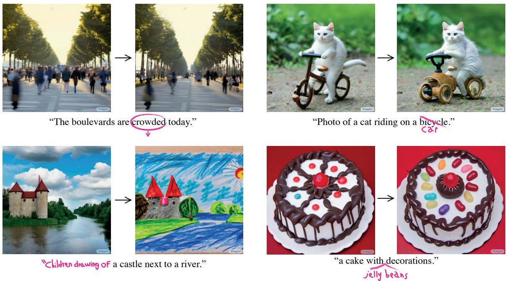  

Figure 1: Our method provides variety of Prompt-to-Prompt editing capabilities. The user can tune the level jeo-ee  he -h esy (bot-left), or make urther refinement ove the enerate image (bottm-riht). The manipulationsfiltratd through the cross-attention mechanism of the diffusion model without he need for any specifiations over the image pixel space.

Specifically, we consider the internal cross-attention maps, which are high-dimensional tensors that bind pixels and tokens extracted from the prompt text. We find that these maps contain rich semantic relations which critically affect the generated image. Our key idea is that we can edit images by injecting the cross-attention maps during the diffusion process, controlling which pixels attend to which tokens of the prompt text during which diffusion steps. To apply our method to various creative editing applications, we show several methods to control the cross-attention maps hrouh a simple andsemantinterfce (see g ) The frst is to change a sngle token' value  the propt ( "og" to "cat, while fixing the cross-ttention aps, to preserve the scne compositio. The ss o lobay dit  age  hange the tyle by di  wors to the roptnee the attention on previous tokens, while allowing new attention to fow to the new tokens. The third is to amplify or attenuate the semantic effect of a word in the generated image. Our approach constitutes an intuitiv image editing interface through editing only the textual prompt, therefore called Prompt-to-Prompt. This method enables various editing tasks, which are challenging otherwise, and does not requires model training, fine-tuning, extra data, or optimization. Throughout our analysis, we discover even more control over the generation process, recognizing a trade-off between the fidelity to the edited prompt and the source image. We even demonstrate that our method can be applied to real images by using an existing inversion process. Our experiments and numerous results show that our method enables seamless editing in an intuitive text-based manner over extremely diverse images.

# 2 Related work

Image editing is one of the most fundamental tasks in computer graphics, encompassing the process of modiyig an input image throug the useof an auxiliary input, such as a label, scribble, mask,or reference image. A specifically intuitive way to edit an image is through textual prompts provided by the user. Recently, text-driven image manipulation has achieved significant progress using GANs [15, 8, 1921], which are known for their high-quality eneration, in tandem with CLIP [32], which consists of a semantically rich joint image-text representation, trained over millions of text-image pairs. Seminal works [29, 14, 46, 2] which combined these components were revolutionary, since they did not require extra manual labor, and produced higly realistic manipulations using text only. Bau et al. [7] further demonstrated how to use masks provided by the user, tolocalize thetext-base editng and resrict the change to a specic spatial region.Hwver, while GAN-based image editing approaches succeed on highly-curated datasets [27], e.g., human faces, they struggle over large and diverse datasets.

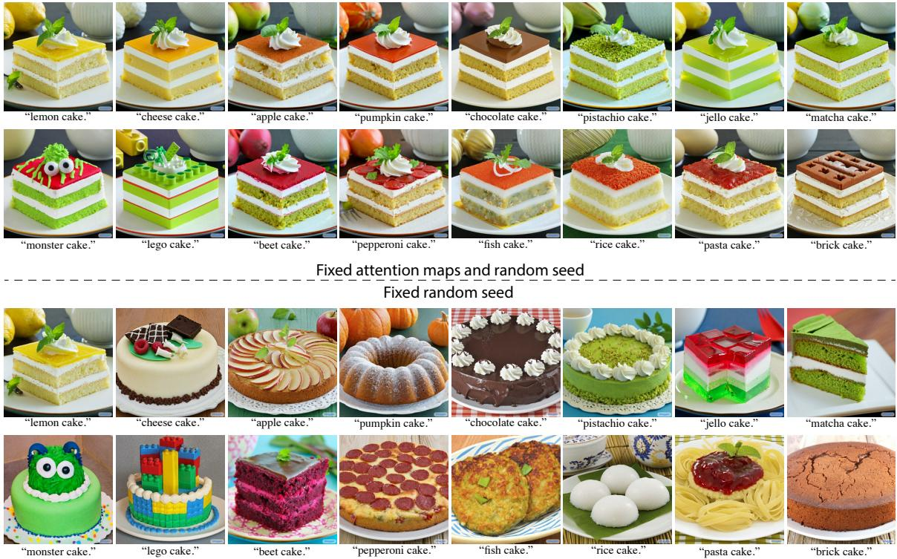  

Figure : Content modification through attention injection. We start from an original image generated from the prompt "lemon cake", and modify the text prompt to a variety of other cakes. On the top rows, weinjec theattentin weigts  theoral age durg the diffusin proes.On the bott, we nly use the e random seeds as the original image, without injecting the attention weights. The latter leads to a completely new structure that is hardly related to the original image. To obtain more expressive generation capabilities, Crowson et al. [9] use VQ-GAN [12], trained over diverse data, as a backbone. Other works [5, 22] exploit the recent Diffusion models [17, 39, 41, 17, 40, 36], which achieve state-of-the-art generation quality over highly diverse datasets, often surpassing GANs [10]. Kim et al. [22] show how to perform global changes, whereas Avrahami et al. [5] successfully perform local manipulations using user-provided masks for guidance. While most works that require only text (ie., no masks) are lmited to global editing [9, 23], Bar-Tale al. [6] proposed a text-based localized editing technique without using any mask, showing impressive results. Yet, their techniques mainly allow changing textures, but not modifying complex structures, such as changing a bicycle to a car. Moreover, unlike our method, their approach requires training a network for each input. Numerous works [11, 16, 42, 25, 26, 30, 31, 34, 49, 9, 13, 36] significantly advanced the generation of images conditioned on plain text, known as text-to-image synthesis.Several large-scale text-image models have recently emerged, such as Imagen [38], DALL-E2 [33], and Parti [48], demonstrating unprecedented semantic generation. However, thesemodels d not provide control over  generateimage, specificallyusing text guidance only. Changing a single word in the original prompt associated with the image often leads to a completely different outcome. For instance, adding the adjective "white" to "dog" often changes the dog's shape. To overcome this, several works [28, 4] assume that the user provides a mask to restrict the area in which the changes are applied. Unlike previous works, our method requires textual input only, by using the spatial information from the ital lyer thenerativemoeeThierheus mumoretuiiv diteeic modifying local or global details by merely modifying the text prompt.

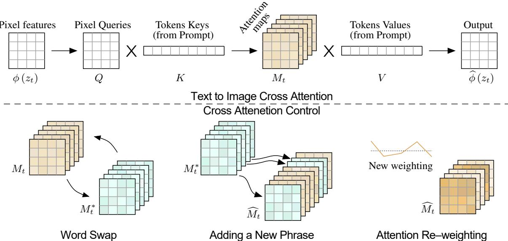  

Figure 3: Method overview. Top: visual and textual embedding are fused using cross-attention layers that proue spatial attention maps for each textual token. Bottom: we control the spatial layout and geomery o the generated image using the attention maps of a source image. This enables various editing tasks through editing the textual prompt only. When swapping a word in the prompt, we inject the source image maps $M _ { t }$ , overriding the target image maps $M _ { t } ^ { * }$ , to preserve the spatial layout. Where in the case of adding a new phrase, we inject only the maps that correspond to the unchanged part of the prompt. Amplify or attenuate the semantic effect of a word achieved by re-weighting the corresponding attention map.

# 3 Method

Let $\mathcal { T }$ be an image which was generated by a text-guided diffusion model [38] using the text prompt $\mathcal { P }$ and a random seed $s$ Our goal is editing the input image guided only by the edited prompt ${ \mathcal { P } } ^ { * }$ , resulting in an edited image $\mathcal { T } ^ { * }$ . For example, consider an image generated from the prompt "my new bicycle", and a n preriheperanrucurheialmtuiivteacor heus oy change the text prompt by further describing the appearance of the bikes, or replacing it with another word. As opposed to previous works, we wish to avoid relying on any user-defined mask to assist or signify where theedit shouloccur. A simpl, but annsucesul attept  tox theinteral rndoness andreerate usig the edited text prompt. Unfortunately, as fig. 2 shows, this results in a completely different image with a different structure and composition. Our key observationis that the structureand appearances of the generated image depend not only on the random seed, but also on the interaction between the pixels to the text embedding through the diffusion process. By modifying the pixel-to-text interaction that occurs in cross-attention layers, we provide Prompt-to-Prompt image editing capabilities. More specifically, injecting the cross-attention maps of the input image $\mathcal { T }$ enables us to preserve the original composition and structure. In section 3.1, we review how cross-attention is used, and in section 3.2 we describe how to exploit the cross-attention for editing. For additional background on diffusion models, please refer to appendix A.

# 3.1 Cross-attention in text-conditioned Diffusion Models

We use the Imagen [38] text-guided synthesis model as a backbone. Since the composition and geometry are mostly determined at the $6 4 \times 6 4$ resolution, we only adapt the text-to-image diffusion model, using the super-resolution process as is. Recall that each diffusion step $t$ consists of predicting the noise $\epsilon$ from a noisy image $z _ { t }$ and text embedding $\psi ( \mathcal P )$ using a U-shaped network [37]. At the final step, this process yields the generated image $\mathcal { T } = z _ { 0 }$ M pan h tein  the t moali the noise prediction where the embeddings of the visual and textual features are fused using Cross-attention layers that produce spatial attention maps for each textual token.

More formally, as illustrated in fig. 3(Top), the deep spatial features of the noisy image $\phi \big ( z _ { t } \big )$ are projected to a query matrix $Q = \ell _ { Q } ( \phi ( z _ { t } ) )$ , and the textual embedding is projected to a key matrix $\dot { K } = \ell _ { K } \mathsf { \bar { ( } } \psi ( \mathcal { P } ) )$ and a value matrix $V = \ell _ { V } ( \psi ( \mathcal { P } ) )$ , via learned linear projections $\ell _ { Q } , \ell _ { K } , \ell _ { V }$ The attention maps are then where the cell $M _ { i j }$ defines the weight of the value of the $j$ -th token on the pixel $i$ , and where $d$ is the latent projection dimension of the keys and queries. Finally, the cross-attention output is defined to be $\widehat { \phi } \left( z _ { t } \right) =$ $\bar { M V }$ , which is then used to update the spatial features $\phi \big ( z _ { t } \big )$ .

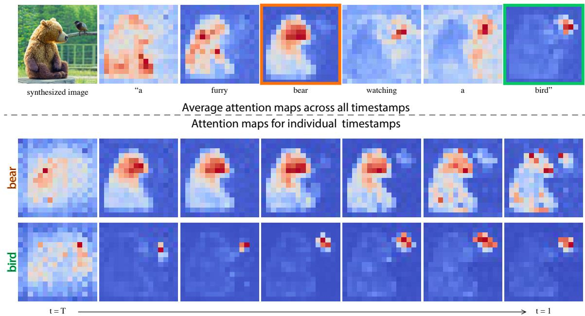  

Figure 4: Cross-attention maps of a text-conditioned diffusion image generation. The top row displays the average attention masks for each word in the prompt that synthesized the image on the let. The bottom rows display the attention maps from different diffusion steps with respect to the words "bear" and "bird".

$$
M = \mathrm { S o f t m a x } \left( \frac { Q K ^ { T } } { \sqrt { d } } \right) ,
$$

Intuitively, the cross-attention output $M V$ is a weighted average of the values $V$ where the weights are the attention maps $M$ , which are correlated to the similarity between $Q$ and $K$ . In practice, to increase their exressiveness, multi-head attention [44] is used in parallel, and then he results are concatenated and passd through a learned linear layer to get the final output. Imagen [38], similar to GLIDE [28], conditions on the text prompt in the noise prediction of each diffusion s eepend.hroh two types attention layerscosattenti yershyriatti that acts both as self-attention and cross-attention by simply concatenating the text embedding sequence to the key-value pairs o eac sel-attentin ayer Throuhout the rest o the pape, we refer to both o them as cross-attention since our method nly intervenes in the cross-attention part of the hybrid attention.That is, only the last channels, which refer to text tokens, are modified in the hybrid attention modules.

# 3.2 Controlling the Cross-attention

We return to our key observation — the spatial layout and geometry of the generated image depend on the crss-attention maps.This interaction between pixels and text is illustrated in fg. 4, where the averge attn aps ae plotAs cn be een, pixs aemoatted t the wors that dece he . pi o th bear recoelate with the word "bearNote that averagigis done or isalizatin purpo, an attention maps are kept separate or each head n ur metho. Interetingy, we can  that thestrucue of the image is already determined in the early steps of the diffusion process. Since the attention reflects the overall composition, we can inject the attention maps $M$ that were obtained from the generation with the original prompt $\mathcal { P }$ , into a second generation with the modified prompt ${ \mathcal { P } } ^ { * }$ .This allows the synthesis of an edited image $\mathcal { T } ^ { * }$ that is not only manipulated according to the edited prompt, but also preserves the structure of the input image $\mathcal { T }$ . This example is a specific instance of a broader set of "A photo of a butterfly on..

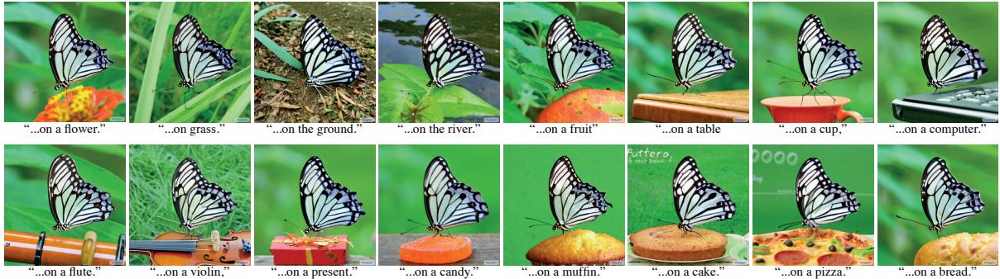  
Fur Object preervation. By injecting only the attention weights of the word "buterly, taken rom the top-et mag we can prerve he utureand apearan  sigle te whil replaci  cnxt. Note how the butterfly sits on top of all objects in a very plausible manner.

attn-asaulatis edieent yivitWe hereoe art y po a general framework, followed by the details of the specific editing operations.

Let $D M ( \boldsymbol { z } _ { t } , \mathcal { P } , t , \boldsymbol { s } )$ be the computation of a single step $t$ of the diffusion process, which outputs the noisy image $z _ { t - 1 }$ , and the attention map $M _ { t }$ (omitted if not used). We denote by ${ \cal D } M ( z _ { t } , \mathcal { P } , t , s ) \{ M  \widehat { M } \}$ the diffusion step where we override the attention map $M$ with an additional given map $\widehat { M }$ , but keep the values $V$ from the supplied prompt. We also denote by $M _ { t } ^ { * }$ the produced attention map using the edited prompt ${ \mathcal { P } } ^ { * }$ . Lastly, we define $E d i t ( M _ { t } , M _ { t } ^ { * } , t )$ to be a general edit function, receiving as input the $t ^ { \because }$ th attention maps of the original and edited images during their generation. Our general algorithm for controlledimage generation consists of performing the iterativediffusion process for both prompts simultaneously, where an attention-based manipulation is applied in each step according to the desired editing task. We note that for the method above to work, we must fix the internal randomness. This is due to the nature of diffusion models, where even for the same prompt, two random seeds produce drastically different outputs. Formally, our general algorithm is:

# Algorithm 1: Prompt-to-Prompt image editing

1 Input: A source prompt $\mathcal { P }$ , a target prompt ${ \mathcal { P } } ^ { * }$ , and a random seed $s$   
2 Output: A source image $x _ { s r c }$ and an edited image $x _ { d s t }$ .   
3 $z _ { T } \sim N ( 0 , I )$ a unit Gaussian random variable with random seed $s$ ;   
4 $z _ { T } ^ { * } \gets z _ { T }$ ;   
5 for $t = T , T - 1 , \dots , 1$ do   
6 $z _ { t - 1 } , M _ { t } \gets D M ( z _ { t } , \mathcal { P } , t , s )$   
7 $M _ { t } ^ { * } \gets D M ( z _ { t } ^ { * } , \mathcal { P } ^ { * } , t , s )$ ;   
8 $\widehat { M _ { t } } \gets E d i t ( M _ { t } , M _ { t } ^ { * } , t ) ;$ .   
9 $z _ { t - 1 } ^ { * }  D M ( z _ { t } ^ { * } , \mathcal { P } ^ { * } , t , s _ { t } ) \{ M  \widehat { M } _ { t } \} ;$   
10 end   
11 Return $( z _ { 0 } , z _ { 0 } ^ { * } )$ Notice that we can also define image $\mathcal { T }$ , which is generated by prompt $\mathcal { P }$ and random seed $s$ , as an additional input. Yet, the algorithm would remain the same. For editing real images, see section 4. Also, note that we can skip the forward call in line 7 by applying the edit function inside the diffusion forward function. Moreover, a diffusion step can be applied on both $z _ { t - 1 }$ and $z _ { t } ^ { * }$ in the same batch (i.e., in parallel), and so there is only one step overhead with respect to the original inference of the diffusion model. We now turn to address specific editing operations, flling the missing definition of the $E d i t ( M _ { t } , M _ { t } ^ { * } , t )$ function. An overview is presented in fig. 3(Bottom). Word Swap. In this case, the user swaps tokens of the original prompt with others, e.g., $\mathcal { P } = ^ { \bullet } \mathrm { { a } }$ big red bicycle" to ${ \mathcal { P } } ^ { * } = ^ { * }$ 'a big red car". The main challenge is to preserve the original composition while also addressing the content of the new prompt. To this end, we inject the attention maps of the source image into the generation with the modified prompt. However, the proposed attention injection may over constrain the Source image and prompt:

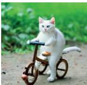

photo of a cat riding on a bicycle.

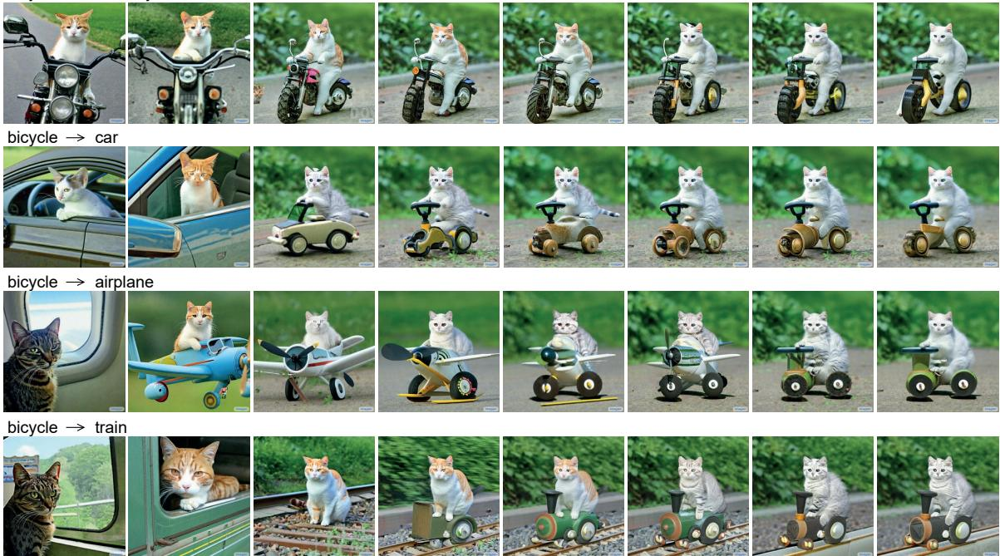  
Figure 6:Attention injection through a varied number of diffusion steps.On the top, we show the source image and prompt. In each row, we modiy the content of the mage by replacing a sgle word in the text nd injecting the cross-attention maps of the source image ranging from $0 \%$ (on the left) to $100 \%$ (on the right) of the diffusion steps.Notice that on one hand, without our method, none of the source image content is guaranted to be preerveOn the other hand njecng the ros-attentihrohoutll the ifusion seps may over-constrain the geomery, resulting in low fidelity to the text prompt, e.g the car (3rd row) becomes a bicycle with full cross-attention injection.

y peally whrrcu sucs ar ice sivoWe this by suggesting a softer attention constrain:

$$
\begin{array} { r } { E d i t ( M _ { t } , M _ { t } ^ { * } , t ) : = \left\{ \begin{array} { l l } { M _ { t } ^ { * } \quad } & { \mathrm { i f ~ } t < \tau } \\ { M _ { t } \quad } & { \mathrm { o t h e r w i s e . } } \end{array} \right. } \end{array}
$$

where $\tau$ is a timestamp parameter that determines until which step the injection is applied. Note that the composition is determined in the early steps of the diffusion process. Therefore, by limiting the number o injection steps, we can guide the composition of the newly generated image while allowing the necessary geometry freedom for adapting to the new prompt.An illustration is provided in section 4.Another natural relaxation for our algorithm is to assign a different number of injection timestamps for the different tokens in the prompt. In case the two words are represented using a different number of tokens, the maps can be duplicated/averaged as necessary using an alignment function as described in the next paragraph. Adding a New Phrase. In another setting, the user adds new tokens to the prompt, e.g., $\mathcal { P } = ^ { 6 } \mathrm { { a } }$ castle next to a river" to ${ \mathcal { P } } ^ { * } =$ "children drawing of a castle next to a river". To preserve the common details, we apply the attention injection only over the common tokens from both prompts. Formally, we use an alignment function $A$ that receives a token index from target prompt ${ \mathcal { P } } ^ { * }$ and outputs the corresponding token index in $\mathcal { P }$ or None if there isn't a match. Then, the editing function is given by: A car on the side of the street.

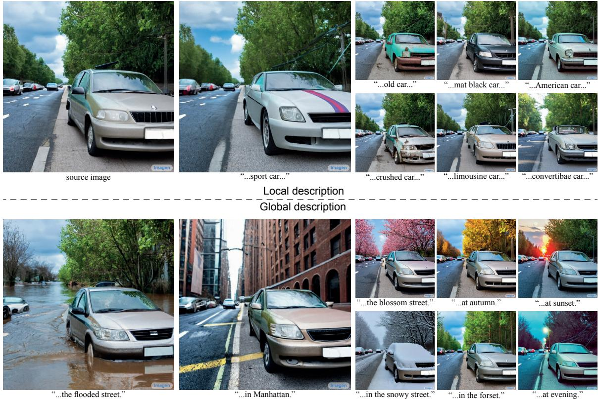  

Figure 7: Editing by prompt refinement. By extending the description of the initial prompt, we can make local edits to the car (top rows) or global modifications (bottom rows).

$$
\begin{array} { r } { \big ( E d i t \left( M _ { t } , M _ { t } ^ { * } , t \right) \big ) _ { i , j } : = \left\{ \begin{array} { l l } { \big ( M _ { t } ^ { * } \big ) _ { i , j } \quad } & { \mathrm { ~ i f ~ } A ( j ) = N o n e } \\ { \big ( M _ { t } \big ) _ { i , A ( j ) } \quad } & { \mathrm { ~ o t h e r w i s e . } } \end{array} \right. } \end{array}
$$

Recall that index $i$ corresponds to a pixel value, where $j$ corresponds to a text token. Again, we may set a timestamp $\tau$ to control the number of diffusion steps in which the injection is applied. This kind of editing enabes divers Propt-to-Prompt capabiliies such a stylization, peciicatiobjecattriutes,orgobal manipulations as demonstrated in section 4. Attention Re-weighting. Lastly, the user may wish to strengthen or weakens the extent to which each token is affecting the resulting image. For example, consider the prompt $\mathcal { P } = { } ^ { 6 } \mathrm { \textbar { a } }$ fluffy red ball", and assume we want t make he ball moreor less fuff To achieve such manipulation, we scale theattention ma the assigned token $j ^ { * }$ with parameter $c \in [ - 2 , 2 ]$ , resulting in a stronger/weaker effect. The rest of the attention maps remain unchanged. That is:

$$
\big ( E d i t ( M _ { t } , M _ { t } ^ { * } , t ) \big ) _ { i , j } : = \left\{ \begin{array} { l l } { c \cdot ( M _ { t } ) _ { i , j } \quad } & { \mathrm { i f ~ } j = j ^ { * } } \\ { ( M _ { t } ) _ { i , j } \quad } & { \mathrm { o t h e r w i s e . } } \end{array} \right.
$$

As described in section 4, the parameter $c$ allows fine and intuitive control over the induced effect.

# 4 Applications

Ourmethod,described in section 3, enables intuitivetext-only editing by controlling the spatal layout coresponding to each word in the user-provided prompt. In this section, we show several applications using this technique.

Text-Only Localized Editing. We first demonstrate localized editing by modifying the user-provided prompt without requiring any user-provided mask. In fg.2, we depict an example where we generate an image using the prompt "emon cake". Our method allows us to retain the spatial layout, geometry, and semantics when replacing the word "lemon" with "pumpkin" (top row).Observe that the background is wel-preserved, including the top-let lemons transforming into pumpkins.On the other hand, naively feeding the synthesis model with the prompt "pumpkin cake" results in a completely different geometry (3rd row), even when using the same random seed in a deterministic setting (i.e., DDIM [40]). Our method succeeds even for a challenging prompt such as "pasta cake." (2nd row)—the generated cake consists of pasta layers with tomato saueon top. Another example is provided in fg.5 where we do not inject the attention of the entire prompt bu ny theattentin  a spec wor utterThis eables e prevatin therigial bu while changing the rest of the content. Additional results are provided in the appendix (fig. 13).

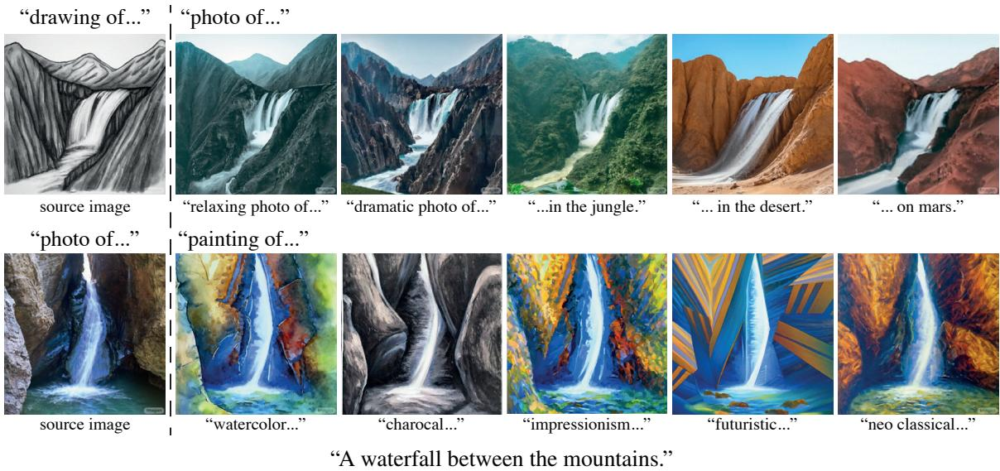  

Fiur : Imagestylization.By adding a style description to the prompt while injecting the source attentin maps, we ncea variuage he  desi yle that preevhe utu thena As can be seen in fg. 6, our method is not confined to modifying ony textures, and it can perform structural moatins, echange  "icycle"t "car"To analyze our attenton injectin, in the let colu we show the results without cross-attention injection, where changing a single word leads toan entirely different oroe h we then howhereult neragebjetintn c numbr diffusion ses. Note that the orediffusion steps n which we apply cross-attention njectin, the higer the fidelity to the original image. However, the optial result is not necesarily achieved by appng the injection throughout all diffusion steps.Therefore, we can provide the user with even better control over the fidelity to the original image by changing the number of injection steps. Instead of replacing one word with another, the user may wish to add a new specification to the generated image. In this case, we keep the attention maps of the original prompt, while allowing the generator to s he newy  worFor eaple, . o whewerhed  h r" r in the generation dditional details over theoriginal image while the background issti preserved.See the appendix (fig. 14) for more examples. Global editing. Preserving the image composition is not only valuable for localized editing, but also an imnt aspec  globaleditIn thi stng theedit shoul affect all part  the mage, bu il retai theorginal coposition, such as the lcation and identiy  theobjects.As shown in g. (ot), we retain the image content while adding "snow" or changing the lightning.Additional examples appear in fig. 8, including translating a sketch into a photo-realistic image and inducing an artistic style. Fader Control using Attention Re-weighting. While controlling the image by editing the prompt is very effective, we find that it still does not allow full control over the generated image.Consider the prompt snowy mountain".A user may want to control the amount of snow on the mountain.However, it is quite diffcult to describe the desired amount of sow through text. Instead, we suggest a fader control [24], where the user controls the magnitude of the effect induced by a speciic word, as depicted in fg. 9.As described in section 3, we achieve such control by re-scaling the attention of the specifed word.Additional results re in the appendix (fig. 15).

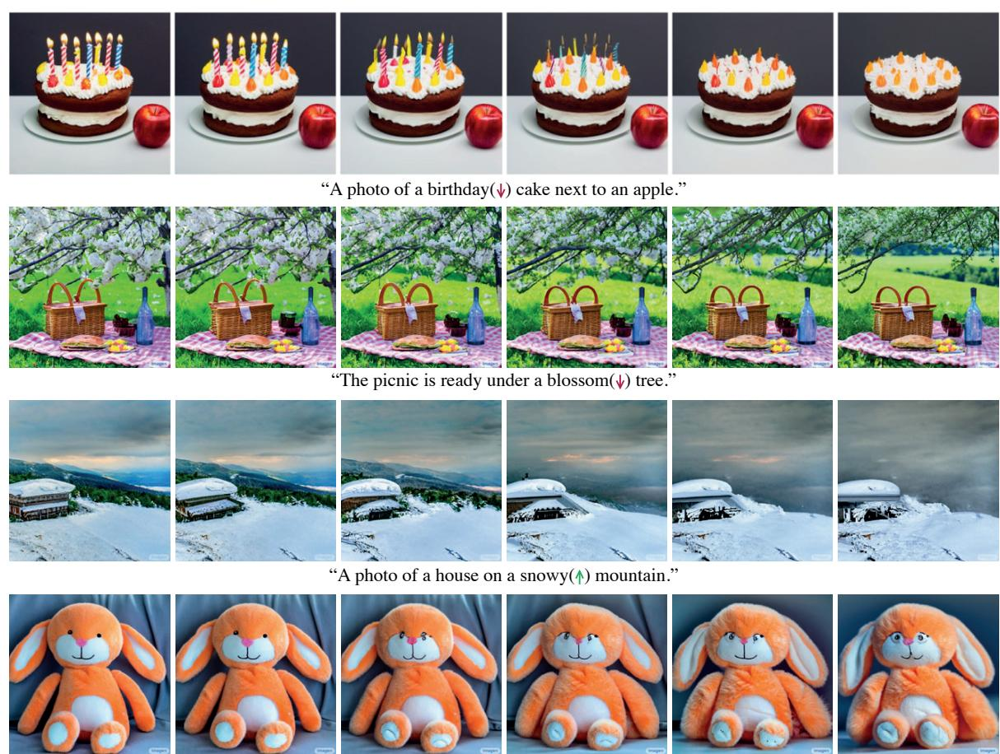  
"My fluffy(↑) bunny doll.   

Figure 9: Text-based image editing with fader control. By reducing (top rows) or increasing (bottom) the cros-attenion  the specd word (mark wit a aow), we cancontrol the extent to which it incs the generated image.

Real ImageEditingEditing areal imagerequires finding an initial noise vector that produces the given input image when fed into the diffusion process. This proces, kown as inversion, has recently drawn considerable attetion for GANs, e.g., [51, 1, 3, 35, 50, 43, 45, 47], but has not yet been fully addressed for text-guided diffusion models. In the following, we show preliminary editing results on real images, based on common inversion techniques for diffusion models. First, a rather naïve approach is to add Gaussian noise to the input image, and then perform a predefined number of diffusion steps. Since this approach results in significant distortions, we adopt an improved inversion approach [10, 40], which is based on the deterministic DDIM model rather than the DDPM model. We perform the diffusion process in the reverse direction, that is $x _ { 0 } \longrightarrow x _ { T }$ instead of $x _ { T } \longrightarrow x _ { 0 }$ ,where $x _ { 0 }$ is set to be the given real image. This inversion process often produces satisfying results, as presented in fig. 10. However, the inversion is not sunra hecas h prtuis-tabiy [43], where we recognize that reducing the classifer-free guidance [18] parameter (i.e., reducing the prompt influence) improves reconstruction but constrains our ability to perform significant manipulations. To alleviate this limitation, we propose to restore the unedited regions of the original image using a mask, directly extracted from the attention maps. Note that here the mask is generated with no guidance from the user. As presented in fig. 12, this approach works well even using the naïve DDPM inversion scheme (adding nois folowed by denoising). Note that the cat's identity is well-preserved under various editing operations, while the mask is produced only from the prompt itself.

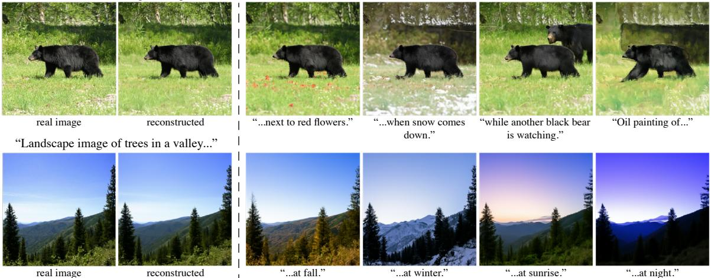  

Figure 10: Editing of real images. On the left, inversion results using DDIM [40] sampling. We reverse the diin pros alize  iven elmage n text pompt. This sultlaten  that p an approximation to the input image when ed to the diffusion process.Afterwar, on the right, we appy our Prompt-to-Prompt technique to edit the images.

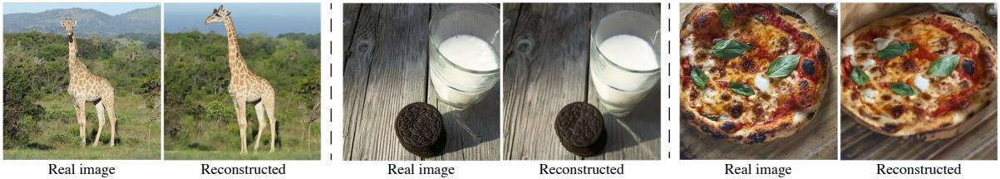  

Figure 11: Inversion Failure Cases.Current DDIM-based inversion of real images might result in unsatisfied reconstructions.

# 5 Conclusions

In this work, we uncovered the powerful capabilities of the cross-ttention layers within text-to-image diffusion models. We showed that these high-dimensional layers have an interpretable representation of spatial mps that py  key ol n tying the wor  the text popt he spatl yout the ynheiz With this observation, we showed how various manipulations of the prompt can directly control attributes in the synthesized image, paving the way to various applications including local and global editing. This work is a first step towards providing users with simple and intuitive means to editimages, leveraging textual semantic power. It enables users to navigate through a semantic, textual, space, which exhibits incremental changes after each step, rather than producing the desired image from scratch after each text manipulation.

While we have demonstrate semantic control by changing only textual prompts, our technique is stil subject iatns  eessi oll work.irshe versi po eslt distortion over somethe tesages. In diton, th nversion equire the user  come u wih a e prompt. This could be challenging for complicated compositions. Note that the challenge of inversion for text-guided diffusion models is an orthogonal endeavor to our work, which will be thoroughly studied in the future.Second, the current attention maps areof low resolution, as the cross-attention is placed in the network's bottleneck. This bounds our ability to perform even more precise localized editing. To alleviate this, we suggest incorporating cross-attention also in higher-resolution layers.We leave this for future works sinc it requires analyzing the training procedure which is out o our current scope.Finally, we reconize thaour current method canot b used to spatialy move existig object across th mage and also leav this kind of control for future work.

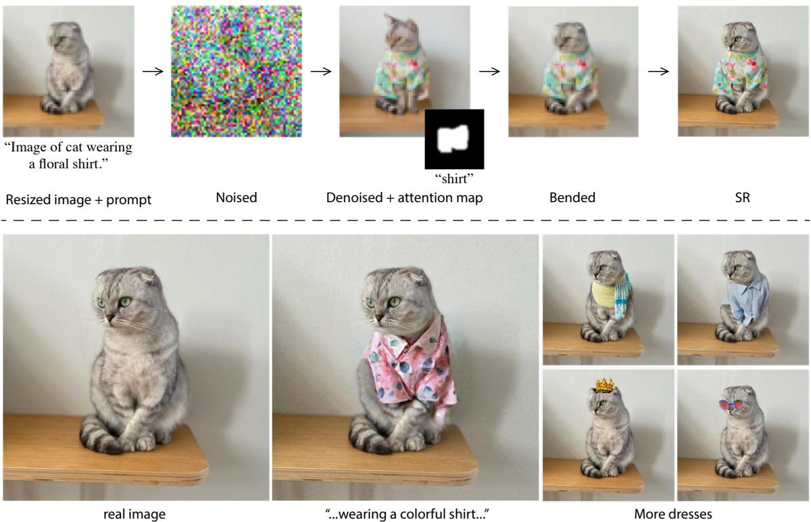  

Figure 12: Mask-based editing. Using the atention maps, we preserve the unedited parts of the image when the inversiondistortion issgnificant This does not require ny user-providedmasks, as we extract the paia inomation rom themodelusing urmethod.Note how the at'identiys retaine ter he ditg process.

# 6 Acknowledgments

We thank Noa Glaser, Adi Zicher, Yaron Brodsky and Shlomi Fruchter for their valuable inputs that helped improve this work, and to Mohammad Norouzi, Chitwan Saharia and William Chan for providing us with their support and the pretrained models of Imagen [38]. Special thanks to Yossi Matias for early inspiring discussion on the problem and for motivating and encouraging us to develop technologies along the avenue of intuitive interaction.

# References

[1] Rameen Abdal, Yipeng Qin, and Peter Wonka. Image2stylegan: How to embed images into the stylegan latent space? In Proceedings of the IEEE/CVF International Conference on Computer Vision, pages 44324441, 2019.   
[2] Rameen Abdal, Peihao Zhu, John Femiani, Niloy J Mitra, and Peter Wonka. Clip2stylegan: Unsupervised extraction of stylegan edit directions. arXiv preprint arXiv:2112.05219, 2021.   
[3] Yuval Alaluf, Omer Tov, Ron Mokady, Rinon Gal, and Amit Bermano. Hyperstyle: Stylegan inversion with hypernetworks for real image editing. In Proceedings of the IEEE/CVF Conference on Computer Vision and Pattern Recognition, pages 1851118521, 2022.   
[4] Omri Avrahami, Ohad Fried, and Dani Lischinski. Blended latent diffusion. arXiv preprint arXiv:2206.02779, 2022.   
[5] Omri Avrahami, Dani Lischinski, and Ohad Fried. Blended diffusion for text-driven editing of natural images. In Proceedings of the IEEE/CVF Conference on Computer Vision and Pattern Recognition, pages 1820818218, 2022.   
[6] Omer Bar-Tal, Dolev Ofri-Amar, Rafail Fridman, Yoni Kasten, and Tali Dekel. Text2live: Text-driven layered image and video editing. arXiv preprint arXiv:2204.02491, 2022. [7] David Bau, Alex Andonian, Audrey Cui, YeonHwan Park, Ali Jahanian, Aude Oliva, and Antonio Torralba. Paint by word, 2021. [8] Andrew Brock, Jeff Donahue, and Karen Simonyan. Large scale gan training for high fidelity natural image synthesis. arXiv preprint arXiv:1809.11096, 2018.   
[9] Katherine Crowson, Stella Biderman, Daniel Kornis, Dashiell Stander, Eric Hallahan, Louis Castricato, and Edward Raff. Vqgan-clip: Open domain image generation and editing with natural language guidance. arXiv preprint arXiv:2204.08583, 2022.   
[10] Prafulla Dhariwal and Alexander Nichol. Diffusion models beat gans on image synthesis. Advances in Neural Information Processing Systems, 34:87808794, 2021.   
[11] Ming Ding, Zhuoyi Yang, Wenyi Hong, Wendi Zheng, Chang Zhou, Da Yin, Junyang Lin, Xu Zou, Zhou Shao, Hongxia Yang, et al. Cogview: Mastering text-to-image generation via transformers. Advances in Neural Information Processing Systems, 34:1982219835, 2021.   
[12] Patrick Esser, Robin Rombach, and Bjorn Ommer. Taming transformers for high-resolution image synthesis. In Proceedings of the IEEE/CVF conference on computer vision and pattern recognition, pages 1287312883, 2021.   
[13] Oran Gafni, Adam Polyak, Oron Ashual, Shelly Sheynin, Devi Parikh, and Yaniv Taigman. Makea-scene: Scene-based text-to-image generation with human priors. arXiv preprint arXiv:2203.13131, 2022.   
[14] Rinon Gal, Or Patashnik, Haggai Maron, Gal Chechik, and Daniel Cohen-Or. Stylegan-nada: Clipguided domain adaptation of image generators. arXiv preprint arXiv:2108.00946, 2021.   
[15] Ian Goodfelow, Jean Pouget-Abadie, Mehdi Mirza, Bing Xu, David Warde-Farley, Sherjil Ozair, Aaron Courville, and Yoshua Bengio. Generative adversarial nets. Advances in neural information processing systems, 27, 2014.   
[16] Tobias Hinz, Stefan Heinrich, and Stefan Wermter. Semantic object acuracy for generative text-toimage synthesis. IEEE transactions on pattern analysis and machine intelligence, 2020.   
[17] Jonathan Ho, Ajay Jain, and Pieter Abbeel. Denoising diffusion probabilistic models. Advances in Neural Information Processing Systems, 33:68406851, 2020.   
[18 Jonahan Ho nd im Salans. lassifer-ee iffun dn. In NeurI 021 Workho n Dee Generative Models and Downstream Applications, 2021.   
[19] Tero Karras, Miika Aittala, Samuli Laine, Erik Härkönen, Janne Hellsten, Jaakko Lehtinen, and Timo Aila. Alias-free generative adversarial networks. Advances in Neural Information Processing Systems, 34:852863, 2021.   
[20] Tero Karras, Samuli Laine, and Timo Aila. A style-based generator architecture for generative adversarial networks. In Proceedings of the IEEE conference on computer vision and pattern recognition, pages 44014410, 2019.   
[21] Tero Karras, Samuli Laine, Miika Aittala, Janne Hellsten, Jaakko Lehtinen, and Timo Aila. Analyzing and improving the image quality of stylegan. In Proceedings of the IEEE/CVF Conference on Computer Vision and Pattern Recognition, pages 81108119, 2020.   
[22] Gwanghyun Kim, Taesung Kwon, and Jong Chul Ye. Diffusionclip: Text-guided diffusion models for robust image manipulation. In Procedings of the IEEE/CVF Conference on Computer Vision and Pattern Recognition, pages 24262435, 2022.   
[23] Gihyun Kwon and Jong Chul Ye. Clipstyler: Image style transfer with a single text condition. arXiv preprint arXiv:2112.00374, 2021.   
[24] Guillaume Lample, Neil Zeghidour, Nicolas Usunier, Antoine Bordes, Ludovic Denoyer, and Marc'Aurelio Ranzato. Fader networks: Manipulating images by sliding atributes. Advances in neural information processing systems, 30, 2017.   
[25] Bowen Li, Xiaojuan Qi, Thomas Lukasiewicz, and Philip Torr. Controllable text-to-image generation. Advances in Neural Information Processing Systems, 32, 2019.   
[26] Wenbo Li, Pengchuan Zhang, Lei Zhang, Qiuyuan Huang, Xiaodong He, Siwei Lyu, and Jianfeng Gao. Object-driven text-to-image synthesis via adversarial training. In Proceedings of the IEEE/CVF Conference on Computer Vision and Pattern Recognition, pages 1217412182, 2019.   
[27] Ron Mokady, Omer Tov, Michal Yarom, Oran Lang, Inbar Mosseri, Tali Dekel, Daniel Cohen-Or, and T on Computer Graphics and Interactive Techniques Conference Proceedings, pages 19, 2022.   
[28] Alex Nichol, Prafulla Dhariwal, Aditya Ramesh, Pranav Shyam, Pamela Mishkin, Bob McGrew, Ilya diffusion models. arXiv preprint arXiv:2112.10741, 2021.   
[29] Or Patashnik, Zongze Wu, Eli Shechtman, Daniel Cohen-Or, and Dani Lischinski. Styleclip: Textdriven manipulation of stylegan imagery. arXiv preprint arXiv:2103.17249, 2021.   
0T Qo, Ji Z  Xu,    ex generation from prior knowledge. Advances in neural information processing systems, 32, 2019.   
[1] Tingting Qiao, Jing Zhang, Duanqig Xu, and Dacheng Tao. Mirrorgan: Learnig text-to-image generation by redescription. In Proceedings of the IEEE/CVF Conference on Computer Vision and Pattern Recognition, pages 15051514, 2019.   
[32] Alec Radford, Jong Wook Kim, Chris Hallacy, Aditya Ramesh, Gabriel Goh, Sandhini Agarwal, Girish Sastry, Amanda Askell, Pamela Mishkin, Jack Clark, et al. Learning transferable visual models from natural language supervision. arXiv preprint arXiv:2103.00020, 2021.   
[33] Aditya Ramesh, Prafulla Dhariwal, Alex Nichol, Casey Chu, and Mark Chen. Hierarchical textconditional image generation with clip latents. arXiv preprint arXiv:2204.06125, 2022.   
[34] Aditya Ramesh, Mikhail Pavlov, Gabriel Goh, Scott Gray, Chelsea Voss, Alec Radford, Mark Chen, and Ilya Sutskever. Zero-shot text-to-image generation. In International Conference on Machine Learning, pages 88218831. PMLR, 2021.   
[35] Daniel Roich, Ron Mokady, Amit H. Bermano, and Daniel Cohen-Or. Pivotal tuning for latent-based editing of real images. ACM Transactions on Graphics (TOG), 2022.   
[36] Robin Rombach, Andreas Blattmann, Dominik Lorenz, Patrick Esser, and Björn Ommer. Highresolution image synthesis with latent diffusion models, 2021.   
[37] Olaf Ronneberger, Philipp Fischer, and Thomas Brox. U-net: Convolutional networks for biomedical ig segmentation. In International Conference onMedical imagecomputing and computer-assisted intervention, pages 234241. Springer, 2015.   
[38] Chitwan Saharia, William Chan, Saurabh Saxena, Lala Li, Jay Whang, Emily Denton, Seyed Kamyar Seyed Ghasemipour, Burcu Karagol Ayan, S Sara Mahdavi, Rapha Gontijo Lopes, Tim Salimans, Tim Salimans, Jonathan Ho, David J Fleet, and Mohammad Norouzi. Photorealistic text-to-image diffusion models with deep language understanding. arXiv preprint arXiv:2205.11487, 2022.   
[39] Jascha Sohl-Dickstein, Eric Weiss, Niru Maheswaranathan, and Surya Ganguli. Deep unsupervised learing usoequilbrium herynam.I Inteatinal Conrenc on MachLea pages 22562265. PMLR, 2015.   
[40] Jiaming Song, Chenlin Meng, and Stefano Ermon. Denoising diffusion implicit models. In International Conference on Learning Representations, 2020.   
[41] Yang Song and Stefano Ermon. Generative modeling by estimating gradients of the data distribution. Advances in Neural Information Processing Systems, 32, 2019.   
[42] Ming Tao, Hao Tang, Songsong Wu, Nicu Sebe, Xiao-Yuan Jing, Fei Wu, and Bingkun Bao. n Dee usion geneativ dveraal etworks o ext-to-mag nhes. Xi t arXiv:2008.05865, 2020.   
[43] Omer Tov, Yuval Alaluf, Yotam Nitzan, Or Patashnik, and Daniel Cohen-Or. Designing an encoder for stylegan image manipulation. arXiv preprint arXiv:2102.02766, 2021.   
[44] Ashish Vaswani, Noam Shazeer, Niki Parmar, Jakob Uszkoreit, Llion Jones, Aidan N Gomez, Lukasz Kaiser, and Ilia Polosukhin.Attention is all you need. In Advances in Neural Information Processing Systems, volume 30, 2017.   
[45] Tengfei Wang, Yong Zhang, Yanbo Fan, Jue Wang, and Qifeng Chen. High-fidelity gan inversion for image attribute editing. ArXiv, abs/2109.06590, 2021.   
[46] Weihao Xia, Yujiu Yang, Jing-Hao Xue, and Baoyuan Wu. Tedigan: Text-guided diverse face image generation and manipulation. In Proceedings of the IEEE/CVF conference on computer vision and pattern recognition, pages 22562265, 2021.   
[47] Weihao Xia, Yulun Zhang, Yujiu Yang, Jing-Hao Xue, Bolei Zhou, and Ming-Hsuan Yang. Gan inversion: A survey, 2021.   
[48] Jiahui Yu, Yuanzhong Xu, Jing Yu Koh, Thang Luong, Gunjan Baid, Zirui Wang, Vijay Vasudevan, Alexander Ku, Yinfei Yang, Burcu Karagol Ayan, et al. Scaling autoregressive models for content-rich text-to-image generation. arXiv preprint arXiv:2206.10789, 2022.   
[49] Zizhao Zhang, Yuanpu Xie, and Lin Yang. Photographic text-to-image synthesis with a hierarchicallynested adversarial network. In Proceedings of the IEEE conference on computer vision and pattern recognition, pages 61996208, 2018.   
[50] Jiapeng Zhu, Yujun Shen, Deli Zhao, and Bolei Zhou. In-domain gan inversion for real image editing. arXiv preprint arXiv:2004.00049, 2020.   
[51] Jun-Yan Zhu, Philipp Krähenbühl, Eli Shechtman, and Alexei A Efros. Generative visual manipulation on the natural image manifold. In European conference on computer vision, pages 597613. Springer, 2016.

# A Background

# A.1 Diffusion Models

Diffusion Denoising Probabilistic Models (DDPM) [39, 17] are generative latent variable models that aim to model a distribution $p _ { \theta } ( x _ { 0 } )$ that approximates the data distribution $q ( x _ { 0 } )$ and easy to sample from. DDPMs model a "forward process" in the space of $x _ { 0 }$ from data to noise.† This process is a Markov chain starting from $x _ { 0 }$ , where we gradually add noise to the data to generate the latent variables $x _ { 1 } , \dots , x _ { T } \ \in \ X$ . The sequence of latent variables therefore follows $\textstyle q ( x _ { 1 } , \dotsc , x _ { t } \mid x _ { 0 } ) = \prod _ { i = 1 } ^ { t } q ( x _ { t } \mid x _ { t - 1 } )$ ,where a step in the forward process is defined as a Gaussian transition $q ( x _ { t } \mid x _ { t - 1 } ) : = N ( x _ { t } ; { \sqrt { 1 - \beta _ { t } } } x _ { t - 1 } , \beta _ { t } I )$ parameterized by a schedule $\beta _ { 0 } , \dots , \beta _ { T } \ \in \ ( 0 , 1 )$ . When $T$ is large enough, the last noise vector $x _ { T }$ nearly follows an isotropic Gaussian distribution. An interesting property of the forward process is that one can express the latent variable $x _ { t }$ directly as the following linear combination of noise and $x _ { 0 }$ without sampling intermediate latent vectors:

$$
x _ { t } = \sqrt { \alpha _ { t } } x _ { 0 } + \sqrt { 1 - \alpha _ { t } } w , w \sim N ( 0 , I ) ,
$$

where $\begin{array} { r } { \alpha _ { t } : = \prod _ { i = 1 } ^ { t } ( 1 - \beta _ { i } ) } \end{array}$

In order to sample from the distribution $q ( x _ { 0 } )$ , we define the dual "reverse process" $p ( x _ { t - 1 } \mid x _ { t } )$ from isotropic Gaussian noise $x _ { T }$ to data by sampling the posteriors $q ( x _ { t - 1 } \mid x _ { t } )$ .Since the intractable reverse process $q ( x _ { t - 1 } \mid x _ { t } )$ depends on the unknown data distribution $q ( x _ { 0 } )$ , we approximate it with a parameterized Gaussian transition network $p _ { \theta } ( x _ { t - 1 } \mid x _ { t } ) : = N ( x _ { t - 1 } \mid \bar { \mu _ { \theta } } ( x _ { t } , t ) , \Sigma _ { \theta } ( \bar { x } _ { t } , t ) )$ . The $\mu _ { \theta } ( x _ { t } , t \bar { ) }$ can be replaced [17] by predicting the noise $\varepsilon _ { \boldsymbol { \theta } } ( x _ { t } , t )$ added to $x _ { 0 }$ using equation 2. Under this definition, we use Bayes' theorem to approximate

$$
\mu _ { \theta } ( x _ { t } , t ) = \frac { 1 } { \sqrt { \alpha _ { t } } } \left( x _ { t } - \frac { \beta _ { t } } { \sqrt { 1 - \alpha _ { t } } } \varepsilon _ { \theta } ( x _ { t } , t ) \right) .
$$

Once we have a trained $\varepsilon _ { \boldsymbol { \theta } } ( x _ { t } , t )$ , we can using the following sample method

$$
x _ { t - 1 } = \mu _ { \theta } ( x _ { t } , t ) + \sigma _ { t } z , \ z \sim N ( 0 , I ) .
$$

We can control $\sigma _ { t }$ of each sample stage, and in DDIMs [40] the sampling process can be made deterministic using $\sigma _ { t } = 0$ in all the steps. The reverse process can finally be trained by solving the following optimization problem:

$$
\operatorname* { m i n } _ { \theta } L ( \theta ) : = \operatorname* { m i n } _ { \theta } E _ { x _ { 0 } \sim q ( x _ { 0 } ) , w \sim N ( 0 , I ) , t } \left\| w - \varepsilon _ { \theta } ( x _ { t } , t ) \right\| _ { 2 } ^ { 2 } ,
$$

teaching the parameters $\theta$ to fit $q ( x _ { 0 } )$ by maximizing a variational lower bound.

# A.2 Cross-attention in Imagen

Imagen [38] consists of three text-conditioned diffusion models: A text-to-image $6 4 \times 6 4$ model, and two super-resolution models $- 6 4 \times 6 4 \to 2 5 6 \times 2 5 6$ and $2 5 6 \times 2 5 6 \to 1 0 2 4 \times 1 0 2 4$ .These predict the noise $\boldsymbol { \varepsilon } _ { \boldsymbol { \theta } } \big ( \boldsymbol { z } _ { t } , \boldsymbol { c } , t \big )$ via a U-shaped network, for $t$ ranging from $T$ to 1. Where $z _ { t }$ is the latent vector and $c$ is the text embedding. We highlight the differences between the three models:

• $6 4 \times 6 4 -$ starts from a random noise, and uses the U-Net as in [10]. This model is conditioned on text embeddings via both cross-attention layers at resolutions [16, 8] and hybrid-attention layers at resolutions [32, 16, 8] of the downsampling and upsampling within the U-Net. : $6 4 \times 6 4  2 5 6 \times 2 5 6 -$ conditions on a naively upsampled $6 4 \times 6 4$ image. An efficient version of a U-Net is used, which includes Hybrid attention layers in the bottleneck (resolution of 32). : $2 5 6 \times 2 5 6 \to 1 0 2 4 \times 1 0 2 4 -$ conditions on a naively upsampled $2 5 6 \times 2 5 6$ image. An efficient version of a U-Net is used, which only includes cross-attention layers in the bottleneck (resolution of 64).

# B Additional results

We provide additional examples, demonstrating our method over different editing operations. fig. 13 show word swap results, fig. 14 showadding specication to animage, and fig 15 show attention re-weiting.

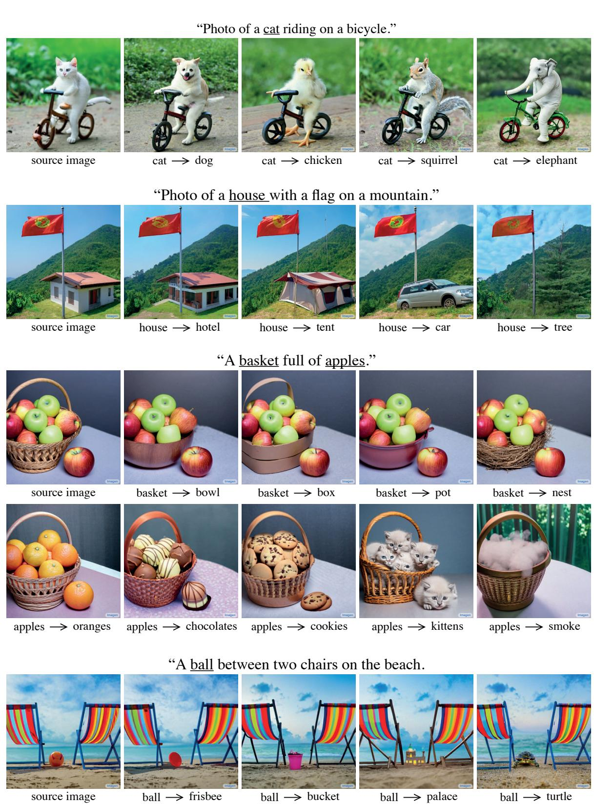  

Figure 13: Additional results for Prompt-to-Prompt editing by word swap.

"A photo of a bear wearing sunglasses on and having a drink.

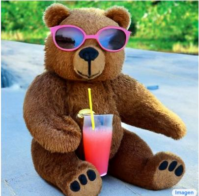  
source image

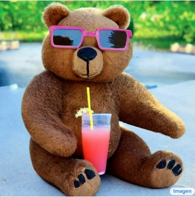  
..wearing a squared sunglasses..."

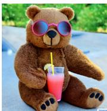  
"...geeky sunglasses..

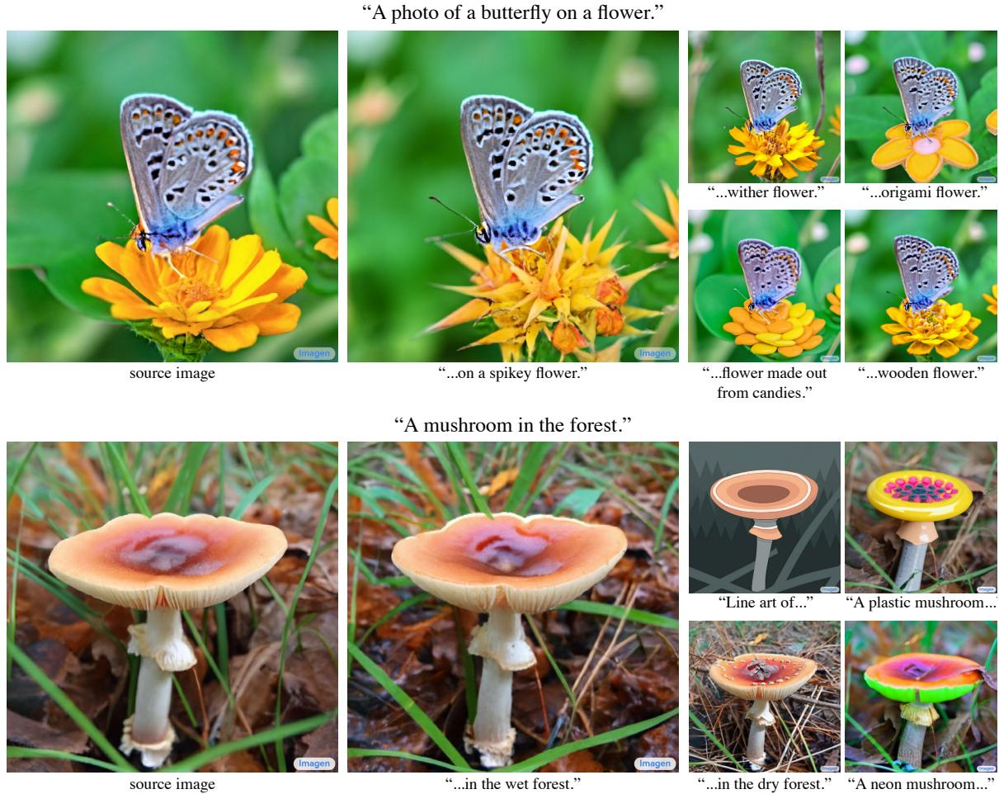  
Figure 14:Additional results for Prompt-to-Prompt editing by adding a specification.

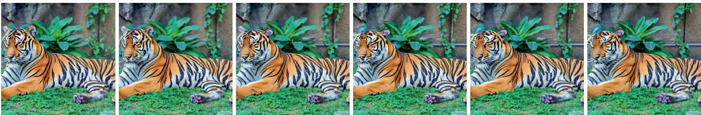

A tiger is sleeping(1) in a field. 888888

Photo of a cubic(↓) sushi.

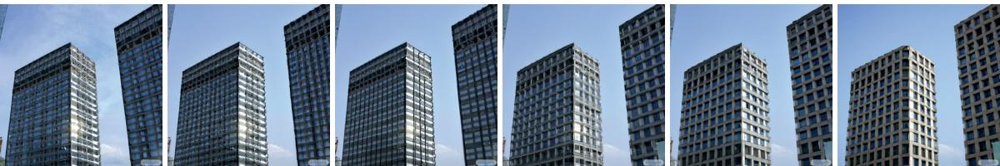

The modern(√) city.

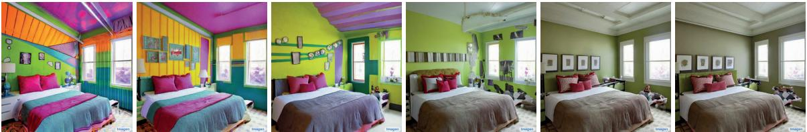  
My colorful(√) bedroom.

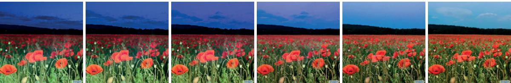  
Fure1:Aditinal results r Promt--rot editi by attention re-we.

Photo of a field of poppies at night(.