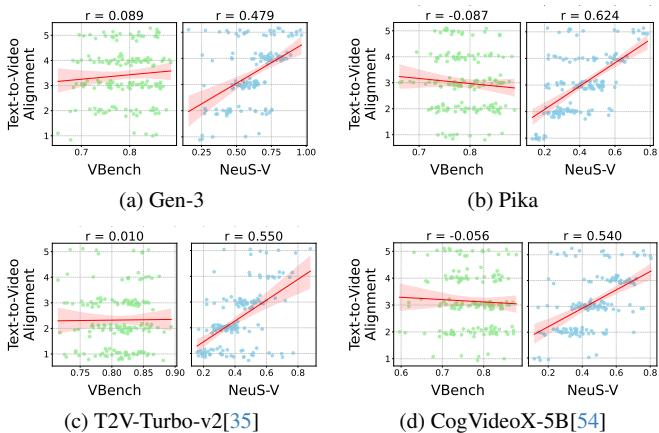
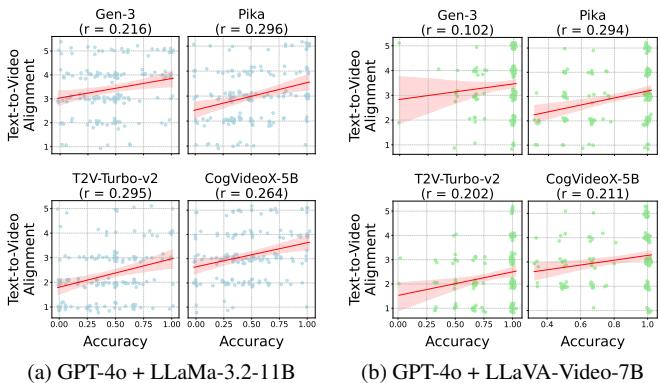

# 1. Bibliographic Information
## 1.1. Title
The paper is titled *Neuro-Symbolic Evaluation of Text-to-Video Models using Formal Verification*. Its central topic is the development of a rigorous, interpretable metric for evaluating how well videos generated by text-to-video (T2V) models align with the temporal, spatial, and semantic requirements of their input prompts, using neuro-symbolic formal verification techniques.
## 1.2. Authors
The authors are S P Sharan, Minkyu Choi, Sahil Shah, Harsh Goel, Mohammad Omama, and Sandeep Chinchali, all affiliated with the Swarm Lab at The University of Texas at Austin, United States. The research group focuses on neuro-symbolic systems, robotics, and formal verification for AI systems.
## 1.3. Publication Venue & Status
As of 2024, the paper is published as a preprint on arXiv, a leading open-access preprint repository for computer science and related fields. It has not yet been formally accepted to a peer-reviewed conference or journal, but its contributions have already gained attention in the T2V research community.
## 1.4. Publication Year
The paper was published on November 22, 2024 (UTC).
## 1.5. Abstract
The paper addresses the gap that existing T2V evaluation metrics prioritize visual quality and smoothness, while neglecting temporal fidelity and text-to-video alignment that are critical for safety-critical applications (e.g., autonomous driving, robotics). The authors introduce **NeuS-V**, a novel evaluation metric that converts input prompts to formal Temporal Logic (TL) specifications, translates generated videos to automaton representations, and uses formal verification to compute the degree of alignment between the video and the prompt. The authors also release a dataset of temporally extended prompts for benchmarking T2V models. Experiments show that NeuS-V has over 5x higher correlation with human evaluations than existing metrics, and that current state-of-the-art T2V models perform poorly on temporally complex prompts.
## 1.6. Original Source Links
- Preprint landing page: https://arxiv.org/abs/2411.16718
- Full PDF: https://arxiv.org/pdf/2411.16718v5
- Official project repository: utaustin-swarmlab.github.io/NeuS-V

  ---

# 2. Executive Summary
## 2.1. Background & Motivation
### Core Problem
Recent T2V models (e.g., Sora, Gen-3, CogVideoX) are increasingly used in safety-critical domains such as autonomous driving simulation and robotics training. For these use cases, generated videos must not only be visually appealing but also strictly adhere to the temporal sequence of events, spatial relationships between objects, and semantic requirements specified in the input prompt. For example, a synthetic video for training an autonomous driving system that incorrectly depicts a truck veering into the ego lane 2 seconds later than specified in the prompt could lead to catastrophic failures in real-world deployment.
### Existing Gaps
Current T2V evaluation metrics (e.g., VBench, EvalCrafter, FVD) focus almost exclusively on visual quality, smoothness, and coarse semantic alignment. Even metrics that claim to evaluate temporal aspects only assess playback speed or motion smoothness, not the correctness of event ordering or temporal logic adherence. Black-box VLM-based evaluation methods (e.g., using a VLM to score video-prompt alignment directly) lack rigor and interpretability, and often fail to capture fine-grained temporal relationships.
### Innovative Entry Point
The authors leverage neuro-symbolic methods: combining the strong perception capabilities of modern VLMs with the rigor of formal verification using temporal logic. This approach enables quantitative, interpretable, and rigorous evaluation of temporal alignment, which was not available in prior work.
## 2.2. Main Contributions / Findings
The paper makes four key contributions:
1. **NeuS-V Metric**: A novel T2V evaluation metric that uses neuro-symbolic formal verification to assess alignment across four dimensions: object existence, spatial relationships, object-action alignment, and overall temporal consistency.
2. **PULS Framework**: A prompt understanding pipeline that automatically converts natural language prompts to formal TL specifications, without manual prompt engineering, using LLM few-shot optimization.
3. **Temporal Prompt Benchmark**: A dataset of 160 temporally extended prompts across four themes (Nature, Human & Animal Activities, Object Interactions, Driving Data) and three complexity levels, designed to test T2V models' ability to follow temporal event sequences.
4. **Empirical Findings**:
   - NeuS-V achieves over 5x higher correlation with human text-to-video alignment evaluations than the state-of-the-art VBench metric.
   - Current T2V models perform poorly on temporally complex prompts, even top closed-source models like Gen-3 only achieve a 0.692 score on advanced prompts with 3 TL operators.
   - Formal grounding in TL and automaton representation significantly improves evaluation robustness compared to pure VLM-based baselines.

     ---

# 3. Prerequisite Knowledge & Related Work
## 3.1. Foundational Concepts
We define all core concepts required to understand the paper for beginners:
### 3.1.1. Text-to-Video (T2V) Generative Models
T2V models are deep learning systems that generate realistic video content from natural language input prompts. Recent state-of-the-art models use diffusion architectures to generate high-resolution, smooth videos, but often struggle to follow complex temporal instructions.
### 3.1.2. Temporal Logic (TL)
TL is a formal, expressive language for describing sequences of events over time. It consists of three components:
1. **Atomic propositions**: Indivisible true/false statements (e.g., "there is a car", "the cyclist turns left")
2. **First-order logic operators**: AND ($\wedge$), OR ($\vee$), NOT ($\neg$), IMPLY ($\Rightarrow$)
3. **Temporal operators**: ALWAYS ($\square$, meaning the proposition is true at all time steps), EVENTUALLY ($\diamondsuit$, meaning the proposition becomes true at some future time step), NEXT ($X$, meaning the proposition is true at the next time step), UNTIL ($U$, meaning the first proposition is true until the second becomes true)
### 3.1.3. Discrete-Time Markov Chain (DTMC)
A DTMC is a stochastic model for sequences of state transitions that occur at discrete time steps. It is defined as a tuple $\mathcal{A} = (Q, q_0, \delta, \lambda)$ where:
- $Q$ is a finite set of possible states
- $q_0 \in Q$ is the initial state
- $\delta: Q \times Q \to [0,1]$ is the transition function, giving the probability of moving from one state to another
- $\lambda: Q \to 2^{|\mathcal{P}|}$ is the label function, mapping each state to the set of atomic propositions that are true in that state
  DTMCs are used in this paper to represent generated videos as structured state transition systems.
### 3.1.4. Formal Verification
Formal verification is a set of techniques for mathematically proving that a system (represented as a formal model like a DTMC) meets a desired set of specifications (represented as TL formulas). Probabilistic model checking, a subset of formal verification, computes the probability that a stochastic system (like a DTMC) satisfies its specification.
### 3.1.5. Vision-Language Models (VLMs)
VLMs are multimodal deep learning models that can process both visual inputs (images, video frames) and text inputs, and perform tasks like visual question answering, object detection, and image captioning.
## 3.2. Previous Works
### 3.2.1. T2V Model Evaluation
Early T2V evaluation metrics adapted image generation metrics:
- **FID (Fréchet Inception Distance)**: Measures the similarity between the distribution of generated images/videos and real images/videos using features from a pre-trained CNN. It only captures overall visual quality, not alignment with prompts.
- **FVD (Fréchet Video Distance)**: Extends FID to video by capturing temporal consistency of features across frames, but still does not assess prompt alignment.
- **CLIPSIM**: Computes the cosine similarity between CLIP embeddings of the prompt and generated video frames, but fails at complex temporal reasoning.

  More recent work uses VLM-based evaluation:
- **VBench**: The current de facto T2V benchmark, evaluating across 16 dimensions including visual quality, motion smoothness, and coarse alignment, but does not assess temporal event ordering or logical adherence.
- **Prompt-to-VQA methods**: Break prompts into yes/no questions and use VLMs to answer them per frame, but do not model temporal relationships between events across frames.

  All prior work lacks formal rigor for temporal alignment evaluation.
### 3.2.2. Video Event Understanding
Prior work on structured video understanding includes:
- **NSVS-TL**: A neuro-symbolic system for finding scenes of interest in videos using TL, but not designed for T2V evaluation.
- **DTMC video representation**: Prior work has represented videos as DTMCs for event sequence modeling, but not combined with formal verification for T2V alignment scoring.
## 3.3. Technological Evolution
The field of T2V evaluation has evolved in three phases:
1. **2022 and earlier**: Adaptation of image generation metrics (FID, FVD, CLIPSIM) that ignore prompt alignment entirely.
2. **2023-early 2024**: VLM-based metrics (VBench, EvalCrafter) that assess coarse semantic alignment but lack temporal reasoning and rigor.
3. **Late 2024 onwards (this paper)**: Neuro-symbolic formal verification-based metrics that enable rigorous, interpretable evaluation of temporal and logical alignment.

   This paper is the first work to introduce formal verification to the T2V evaluation domain.
## 3.4. Differentiation Analysis
Compared to prior methods, NeuS-V has three core differentiators:
1. **Formal temporal grounding**: Unlike black-box VLM metrics, NeuS-V converts prompts to explicit TL specifications that capture all temporal, spatial, and semantic requirements of the prompt.
2. **Structured video representation**: Videos are converted to DTMC automata that explicitly model event sequences and transition probabilities, rather than being treated as unstructured sequences of frames.
3. **Interpretability**: The satisfaction probability output by NeuS-V can be traced to specific states and transitions in the automaton, so users can identify exactly which part of the prompt the video fails to meet, rather than getting a black-box score.

   ---

# 4. Methodology
## 4.1. Principles
The core principle of NeuS-V is to combine the strengths of neural perception (VLMs for detecting objects, actions, and spatial relationships in video frames) with the rigor of symbolic formal verification (TL for specifying requirements, model checking for verifying adherence to requirements). The method evaluates alignment across four complementary dimensions:
1. `Object existence`: Whether all objects mentioned in the prompt appear in the video
2. `Spatial relationship`: Whether the relative positions of objects match the prompt
3. `Object-action alignment`: Whether objects perform the specified actions in the correct order
4. `Overall consistency`: Whether the full sequence of events matches the entire prompt

   The overall pipeline of NeuS-V is shown in the figure below (Figure 3 from the original paper):

   
   *该图像是示意图，展示了通过NeuS-V进行文本提示与生成视频之间的时空和语义测量。图中包括文本提示、时间逻辑规范 $oldsymbol{ ext{Φ}}$、生成的视频以及模型检查过程，通过计算满意度概率来评估视频与文本规范的对齐程度。*

## 4.2. Core Methodology In-depth
We break down the 5 core steps of NeuS-V in detail, integrating all formulas exactly as presented in the original paper:
### 4.2.1. Step 1: Prompt to Temporal Logic Conversion via PULS
The Prompt Understanding via Temporal Logic Specification (PULS) framework converts a natural language input prompt to a set of atomic propositions $\mathcal{P}$ and a TL specification $\Phi$ for each of the four evaluation modes. PULS is a two-module LLM-based pipeline optimized using DSPy and MIPROv2 for few-shot example selection, eliminating manual prompt engineering.
#### 4.2.1.1. Text-to-Proposition (T2P) Module
The T2P module extracts the set of atomic propositions $\mathcal{P}$ from the input prompt $T$ for a given evaluation mode $m$, using an optimized few-shot prompt $\theta_{T2P}^\star$:
$$
LM_{\mathrm{T2P}}: \mathcal{T} \times M \xrightarrow{\theta_{\mathrm{T2P}}^\star} \mathcal{P}
$$
Where:
- $\mathcal{T}$ is the space of all text prompts
- $M$ is the set of four evaluation modes
- $\theta_{T2P}^\star$ is optimized on a training dataset $\mathfrak{D}_{\mathrm{T2P|train}}$ of prompt-proposition pairs selected to maximize conversion accuracy.
#### 4.2.1.2. Text-to-TL (T2TL) Module
The T2TL module generates the TL specification $\Phi$ from the input prompt $T$, the extracted atomic propositions $\mathcal{P}$, and the evaluation mode $m$, using an optimized few-shot prompt $\theta_{T2TL}^\star$:
$$
LM_{\mathrm{T2TL}}: \mathcal{T} \times \mathcal{P} \times M \xrightarrow{\theta_{\mathrm{T2TL}}^\star} \Phi
$$
Where $\theta_{T2TL}^\star$ is optimized on a training dataset $\mathfrak{D}_{\mathrm{T2TL|train}}$ of prompt-proposition-TL specification triples.
### 4.2.2. Step 2: Semantic Confidence Score Calculation
For each atomic proposition $p_i \in \mathcal{P}$, the VLM computes a confidence score $c_i \in [0,1]$ representing the probability that $p_i$ is true in a given sequence of frames $\mathcal{F}$. The score is computed as the product of the probabilities of each token in the VLM's yes/no response to the query "Is there $p_i$ present in the sequence of frames?":
$$
c_i = \mathcal{M}_{\mathrm{VLM}}(p_i, \mathcal{F}) = \prod_{j=1}^k P\left(t_j \mid p_i, \mathcal{F}, t_1, \dots, t_{j-1}\right) \quad \forall p_i \in \mathcal{P}
$$
Where:
- $k$ is the number of tokens in the VLM's response
- $P(t_j | \cdot)$ is the probability of the $j$-th response token, computed by applying softmax to the VLM's output logits: $P(t_j | \cdot) = \frac{e^{l_{j,t_j}}}{\sum_z e^{l_{j,z}}}$, where $l_{j,*}$ is the logit vector for the $j$-th token position.

  The raw confidence scores are then calibrated using a false positive threshold $\gamma_{fp}$ to reduce VLM overconfidence, producing the calibrated confidence $c_i^\star$:
$$
c_i^\star \gets f_{\mathsf{VLM}}(c_i; \gamma_{fp})
$$
The calibration process is visualized in the figure below (Figure 7 from the original paper):


*该图像是一个示意图，展示了不同阈值下的准确率与阈值关系（左上）、真正例率与假正例率的关系（右上），以及校准前后的准确率与置信度的对比（左下和右下）。*

### 4.2.3. Step 3: Video Automaton Construction
The generated video is represented as a DTMC automaton $\mathcal{A}_\mathcal{V}$ using the calibrated confidence scores $c_i^\star$ for all atomic propositions across all frames. The automaton is constructed by the function:
$$
\mathcal{A}_\mathcal{V} = \xi(\mathcal{P}, C^\star) = \mathcal{A} = (Q, q_0, \delta, \lambda)
$$
Where $C^\star$ is the set of all calibrated confidence scores across all frames and propositions. The transition function $\delta(q, q')$, which gives the probability of transitioning from state $q$ to state $q'$, is computed as:
$$
\delta(q, q') = \prod_{i=1}^{|\mathcal{P}|} (C_i^\star)^{\mathbf{1}_{\{q_i' = 1\}}} (1 - C_i^\star)^{\mathbf{1}_{\{q_i' = 0\}}}
$$
Where $\mathbf{1}_{\{condition\}}$ is the indicator function that equals 1 if the condition is true, 0 otherwise. $q_i'$ is the truth value of proposition $p_i$ in state $q'$.

An example of a constructed video automaton is shown in the figure below (Figure 2 from the original paper):

![Figure 2. Video automaton from the running example. Above is an automaton of a video generated by the Gen-3 model constructed with a TL specification (See Eq. (1)). Every state `q _ { t }` from a frame $\\mathcal { F }$ is labeled and has incoming and outgoing transition probabilities $\\delta ( q , q ^ { \\prime } ) \\in \[ 0 , 1 \]$ . For example, in frame $\\mathcal { F } _ { 8 }$ , we have probabilities $P ( p _ { 4 } ) = 0 . 8$ and $P ( p _ { 5 } ) = 0 . 9$ ,where `p _ { 4 }` represents the atomic proposition "cyclist turns", and `p 5` represents "cyclist avoids obstacle". These probabilities are assigned because the cyclist (red-dotted circle) has turned left to avoid obstacles on the road. In the state `q _ { 2 5 6 }` , we have an incoming probability $0 . 7 2 = P ( p _ { 1 } ) \\times P ( p _ { 2 } ) \\times P ( p _ { 4 } ) \\times P ( p _ { 5 } ) \\times ( 1 - P ( p _ { 3 } ) )$ from the previous state `q _ { 2 2 4 }` , where that label is true for `p _ { 1 } , p _ { 2 } , p _ { 4 }` , and `p _ { 5 }` , and false for `p _ { 3 }` denoted as $\\neg \\{ p _ { 3 } \\}$ .](images/2.jpg)
*该图像是一个示意图，展示了由Gen-3模型生成的视频自动机。上方展示了三个帧（$F_1$, $F_8$, $F_{11}$）及其对应的概率信息，标记了骑行者的动作。下方为该视频的状态转移图，其中每个状态$q_t$均标记，并显示了状态之间的转移概率，如$P(p_4)=0.8$和$P(p_5)=0.9$。图中还包括初始状态和终止状态的表示。*

### 4.2.4. Step 4: Formal Verification
The STORM probabilistic model checker is used to compute the satisfaction probability $\mathbb{P}[\mathcal{A}_\mathcal{V} \models \Phi]$, which is the probability that the video automaton $\mathcal{A}_\mathcal{V}$ satisfies the TL specification $\Phi$:
$$
\mathbb{P}[\mathcal{A}_\mathcal{V} \models \Phi] = \Psi(\mathcal{A}_\mathcal{V}, \Phi)
$$
Where $\Psi(\cdot)$ is the probabilistic model checking function that analyzes the state transitions and labels in $\mathcal{A}_\mathcal{V}$ to compute the satisfaction probability.
### 4.2.5. Step 5: Score Calibration
The raw satisfaction probability is calibrated to the final NeuS-V score using an empirical cumulative distribution function (ECDF) mapping $f_{\mathrm{ECDF}}$, which adjusts the score based on the distribution of satisfaction probabilities across a large sample of synthetic videos for each evaluation mode:
$$
s_m = f_{\mathrm{ECDF}}(\mathbb{P}[\mathcal{A}_\mathcal{V} \models \Phi], D_m) \quad \forall m \in M
$$
Where $D_m$ is the distribution of satisfaction probabilities for evaluation mode $m$. The final overall NeuS-V score is the average of the scores across the four evaluation modes:
$$
S_{NeuS-V} = \frac{\sum S}{|S|}
$$
Where $S = \{s_1, s_2, s_3, s_4\}$ is the set of scores for the four evaluation modes.

The full end-to-end algorithm for NeuS-V is shown below:
```
Algorithm 1: NeuS-V
Require: Frame window size w, evaluation mode M , PULS
semantic score mapping function fVLM(·), video automaton generation function ξ(·)
probabilistic model checking function Ψ(·), probability mapping function fECDF(·), probability distribution D
Input : Text prompt T, text-to-video model MT2V
Output : NeuS-V score SNeuS-V
1 begin
2   S ← {} // Initialize an empty set for NeuS-V scores of each evaluation mode
3   V ← MT2V(T) // Generate a video
4   for m ∈ M do
5       for n = 0 to length(V) − w step w do
6           C*←{} // Initialize an empty set for semantic confidence
7           F ← {V[n], V[n + 1], . . . , V[n + w − 1]} // Select a sequence of frames
8           P, Φ ← LMPULS(T, m) // Translate the T to P and Φ for m
9           for pi ∈ P do
10              ci ← MvLM(pi, F) // Obtain semantic confidence scores
11              c ← fVLM(ci; γf p) // Calibrate ci with false positive threshold γfp
12              C*[pi,n] ← c // Append c to the semantic confidence set
13          end for
14      end for
15      A_V ← ξ(P, C*) // Construct automaton
16      P[A_V |= Φ] = Ψ(A_V, Φ) // Obtain satisfaction probability
17      sm = fECDF(P[A_V |= Φ], Dm) // Calculate the calibrated score
18      S← S ∪ {sm} // Append the score sm to the set S
19   end for
20   SNeus-V ← ∑ S / |S|
```

---

# 5. Experimental Setup
## 5.1. Datasets
### 5.1.1. NeuS-V Prompt Suite
The authors constructed a custom benchmark of 160 temporally extended prompts across four themes, with three complexity levels based on the number of TL operators required to represent the prompt:

| Theme | Basic (1 TL op) | Intermediate (2 TL ops) | Advanced (3 TL ops) | Total |
|---|---|---|---|---|
| Nature | 20 | 15 | 5 | 40 |
| Human & Animal Activities | 20 | 15 | 5 | 40 |
| Object Interactions | 20 | 15 | 5 | 40 |
| Driving Data | 20 | 15 | 5 | 40 |
| Total | 80 | 60 | 20 | 160 |

Example prompts from the suite:
- Basic (Driving Data): "The vehicle moving forward until it reaches a stop sign"
- Intermediate (Nature): "The sun shining until the clouds gather, and then rain begins to fall"
- Advanced (Object Interactions): "A lightbulb flickering intermittently until the switch is turned off, and then the room is cast into darkness"

  The dataset is designed specifically to test T2V models' ability to follow temporal event sequences, which is missing from existing benchmarks.
### 5.1.2. MSR-VTT Dataset
To test the robustness of NeuS-V on real-world data, the authors use the MSR-VTT dataset, a large-scale video-captioning dataset with 10,000 video-caption pairs annotated by human workers. The authors create two splits:
- Positive set: Aligned video-caption pairs (original pairs from the dataset)
- Negative set: Misaligned pairs (videos randomly paired with captions from other videos)
## 5.2. Evaluation Metrics
### 5.2.1. Pearson Correlation Coefficient
This is the primary metric used to measure how well the automated evaluation scores align with human text-to-video alignment annotations.
#### Conceptual Definition
The Pearson correlation coefficient $r$ quantifies the linear correlation between two sets of values, ranging from -1 (perfect negative correlation) to 1 (perfect positive correlation). A higher $r$ value means the automated metric's scores are more consistent with human judgments.
#### Mathematical Formula
$$
r = \frac{n\sum xy - (\sum x)(\sum y)}{\sqrt{[n\sum x^2 - (\sum x)^2][n\sum y^2 - (\sum y)^2]}}
$$
#### Symbol Explanation
- $n$: Number of sample pairs (video-prompt pairs with both automated and human scores)
- $x$: Automated evaluation scores (e.g., NeuS-V scores, VBench scores)
- $y$: Human evaluation scores (collected via crowdsourcing)
### 5.2.2. NeuS-V Score
The 0-1 score output by the NeuS-V pipeline, representing the degree of alignment between the video and the prompt, with higher values indicating better alignment.
## 5.3. Baselines
The authors compare NeuS-V against two categories of baselines:
1. **State-of-the-art T2V evaluation benchmark**: `VBench`, the current de facto standard for T2V evaluation, which focuses on visual quality and coarse alignment.
2. **VLM-only baselines**: Two pure VLM-based evaluation approaches that lack formal grounding:
   - `LLaMa-3.2-11B-Vision-Instruct`: An image VLM that scores each frame independently based on yes/no questions generated from the prompt
   - `LLaVA-Video-7B-Qwen2`: A video VLM that scores the full video directly against the prompt

     These baselines are representative of the current dominant approaches to T2V evaluation, making them appropriate for comparison.

---

# 6. Results & Analysis
## 6.1. Core Results Analysis
### 6.1.1. Correlation with Human Annotations
The figure below (Figure 4 from the original paper) shows the correlation between NeuS-V, VBench, and human annotations across all tested T2V models:


*该图像是图表，展示了不同视频生成模型（如Gen-3、Pika、T2V-Turbo-v2和CogVideoX-5B）在文本与视频对齐评估中的相关性。左侧为VBench，右侧为NeuS-V，显示其与人类标注的Pearson相关系数。*

NeuS-V achieves consistently higher Pearson correlation coefficients with human evaluations than VBench across all models, with an average improvement of over 5x, validating that NeuS-V captures the aspects of text-to-video alignment that humans care about.
### 6.1.2. Model Performance on NeuS-V Prompt Suite
The table below (Table 1 from the original paper) shows the performance of four state-of-the-art T2V models on the NeuS-V prompt suite (values in parentheses are Pearson correlation with human annotations):

<table>
<thead>
<tr>
<th colspan="2">Prompts</th>
<th>Gen-3</th>
<th>Pika</th>
<th>T2V-Turbo-v2[35]</th>
<th>CogVideoX-5B[54]</th>
</tr>
</thead>
<tbody>
<tr>
<td rowspan="4">By Theme</td>
<td>Nature</td>
<td>0.716 (0.47)</td>
<td>0.479 (0.70)</td>
<td>0.564 (0.46)</td>
<td>0.580 (0.53)</td>
</tr>
<tr>
<td>Human & Animal Activities</td>
<td>0.752 (0.80)</td>
<td>0.531(0.67)</td>
<td>0.564 (0.66)</td>
<td>0.623(0.43)</td>
</tr>
<tr>
<td>Object Interactions</td>
<td>0.710 (0.16)</td>
<td>0.500 (0.40)</td>
<td>0.553(0.66)</td>
<td>0.573(0.65)</td>
</tr>
<tr>
<td>Driving Data</td>
<td>0.716 (0.48)</td>
<td>0.525 (0.66)</td>
<td>0.525 (0.30)</td>
<td>0.580 (0.52)</td>
</tr>
<tr>
<td rowspan="3">By Complexity</td>
<td>Basic (1 TL op.)</td>
<td>0.774 (0.60)</td>
<td>0.589 (0.70)</td>
<td>0.610 (0.58)</td>
<td>0.641 (0.65)</td>
</tr>
<tr>
<td>Intermediate (2 TL ops.)</td>
<td>0.680 (0.27)</td>
<td>0.464 (0.44)</td>
<td>0.508 (0.38)</td>
<td>0.549 (0.28)</td>
</tr>
<tr>
<td>Advanced (3 TL ops.)</td>
<td>0.692(-0.01)</td>
<td>0.400 (0.33)</td>
<td>0.494 (0.42)</td>
<td>0.550 (0.78)</td>
</tr>
<tr>
<td colspan="2">Overall Score</td>
<td>0.723 (0.48)</td>
<td>0.508 (0.62)</td>
<td>0.552 (0.55)</td>
<td>0.589 (0.54)</td>
</tr>
</tbody>
</table>

Key observations:
1. Closed-source model Gen-3 achieves the highest overall score of 0.723, followed by open-source model CogVideoX-5B (0.589), T2V-Turbo-v2 (0.552), and Pika (0.508).
2. All models perform significantly worse on higher complexity prompts: Gen-3's score drops from 0.774 on basic prompts to 0.692 on advanced prompts, while Pika's score drops from 0.589 to 0.400. This highlights that current T2V models struggle to follow complex temporal instructions.
### 6.1.3. Robustness Testing on MSR-VTT
The table below (Table 2 from the original paper) compares NeuS-V and VBench on the MSR-VTT dataset, measuring their ability to distinguish between aligned and misaligned video-caption pairs:

<table>
<thead>
<tr>
<th>Metric</th>
<th>Aligned Captions</th>
<th>Misaligned Captions</th>
<th>Difference (↑)</th>
</tr>
</thead>
<tbody>
<tr>
<td>VBench</td>
<td>0.78 (± 0.12)</td>
<td>0.40 (± 0.24)</td>
<td>0.38</td>
</tr>
<tr>
<td>NeuS-V</td>
<td>0.82 (± 0.10)</td>
<td>0.30 (± 0.18)</td>
<td>0.52</td>
</tr>
</tbody>
</table>

NeuS-V has a 0.52 difference between aligned and misaligned scores, compared to 0.38 for VBench, demonstrating that NeuS-V is more effective at capturing meaningful text-to-video alignment even on real-world, non-synthetic data.
## 6.2. Ablation Studies
### 6.2.1. Importance of Formal Temporal Grounding
The authors ablate the formal verification components of NeuS-V, replacing them with pure VLM-based evaluation. The results are shown in the figure below (Figure 6 from the original paper):


*该图像是一个散点图，展示了不同文本到视频生成模型的对齐程度与准确率的关系。图中包含四组模型的评估结果，标出皮尔逊相关系数(r)值，以比较它们在文本到视频对齐方面的表现。*

The VLM-only baselines achieve much lower Pearson correlation coefficients with human annotations (0.23 for LLaVA-Video, 0.31 for LLaMa-3.2-11B) than NeuS-V (average 0.55 across models), validating that formal grounding in TL and automaton representation significantly improves evaluation robustness.
### 6.2.2. Architectural Ablations
#### 6.2.2.1. VLM Context Window Size
The table below (Table 3 from the original paper) compares the performance of NeuS-V using 1 frame vs 3 frames as context for the VLM:

<table>
<thead>
<tr>
<th>VLM Context</th>
<th>Gen-3</th>
<th>Pika</th>
<th>T2V-Turbo-v2</th>
<th>CogVideoX-5B</th>
</tr>
</thead>
<tbody>
<tr>
<td>1 Frame</td>
<td>0.859 (0.29)</td>
<td>0.613(0.51)</td>
<td>0.590 (0.34)</td>
<td>0.715 (0.32)</td>
</tr>
<tr>
<td>3 Frames</td>
<td>0.614(0.48)</td>
<td>0.409(0.62)</td>
<td>0.417(0.55)</td>
<td>0.461 (0.54)</td>
</tr>
</tbody>
</table>

Using 3 frames of context results in significantly higher correlation with human annotations across all models, as it provides the VLM with temporal context to detect actions and state changes.
#### 6.2.2.2. Choice of VLM
The table below (Table 4 from the original paper) compares the performance of NeuS-V using two different VLMs for automaton construction:

<table>
<thead>
<tr>
<th>Choice of VLM</th>
<th>Gen-3</th>
<th>Pika</th>
<th>T2V-Turbo-v2</th>
<th>CogVideoX-5B</th>
</tr>
</thead>
<tbody>
<tr>
<td>LLaMa3.2-11B</td>
<td>0.921(0.15)</td>
<td>0.660 (0.16)</td>
<td>0.730 (0.08)</td>
<td>0.785 (-0.02)</td>
</tr>
<tr>
<td>InternVL2-8B</td>
<td>0.859(0.29)</td>
<td>0.613(0.51)</td>
<td>0.590 (0.34)</td>
<td>0.715(0.3)</td>
</tr>
</tbody>
</table>

InternVL2-8B achieves consistently higher correlation with human annotations, as LLaMa3.2-11B suffers from overconfidence in its predictions even after calibration.

---

# 7. Conclusion & Reflections
## 7.1. Conclusion Summary
This paper introduces NeuS-V, the first neuro-symbolic formal verification-based metric for T2V evaluation. By converting prompts to formal TL specifications and videos to DTMC automata, NeuS-V provides rigorous, interpretable, and human-aligned evaluation of text-to-video alignment, especially for temporal and logical requirements that are critical for safety-critical applications. Experiments show that NeuS-V outperforms existing state-of-the-art metrics by a large margin, and reveal that current T2V models still struggle significantly with temporally complex prompts. The released benchmark dataset and open-source code will enable future advances in T2V model development and evaluation.
## 7.2. Limitations & Future Work
The authors identify two key limitations of the current work:
1. NeuS-V does not currently penalize unintended elements or artifacts in generated videos that are not mentioned in the prompt, so it cannot distinguish between videos that only contain the requested content and videos that contain the requested content plus irrelevant or harmful artifacts.
2. The current prompt suite is limited to 160 prompts, and future work will expand it to cover more domains and higher complexity levels.

   The authors suggest three future research directions:
1. Use NeuS-V as a reward signal for iterative refinement of generated videos, improving prompt adherence without retraining T2V models.
2. Use NeuS-V scores for prompt optimization, automatically rewriting prompts to improve the quality of generated videos.
3. Integrate NeuS-V into the T2V model training process as a alignment loss to improve temporal adherence of the models.
## 7.3. Personal Insights & Critique
This work represents a significant paradigm shift in T2V evaluation, moving from black-box, quality-focused metrics to rigorous, alignment-focused evaluation that is essential for the safe deployment of T2V models in high-stakes domains. The formal grounding of NeuS-V makes its scores far more trustworthy than pure VLM-based metrics, as the output can be traced to specific failures in the video.

Potential improvements to the work include:
1. Adding a counterfactual verification step to detect and penalize unintended content in generated videos, addressing the current limitation.
2. Extending the TL specification to support quantitative temporal requirements (e.g., "the truck appears at frame 10" rather than just "eventually the truck appears"), which would be especially useful for autonomous driving simulation use cases.
3. Supporting longer videos by optimizing the automaton construction and model checking steps to scale to videos with thousands of frames.

   The method can also be extended to other generative media evaluation tasks, such as text-to-3D scene generation, where temporal or spatial logical adherence is critical for real-world use.