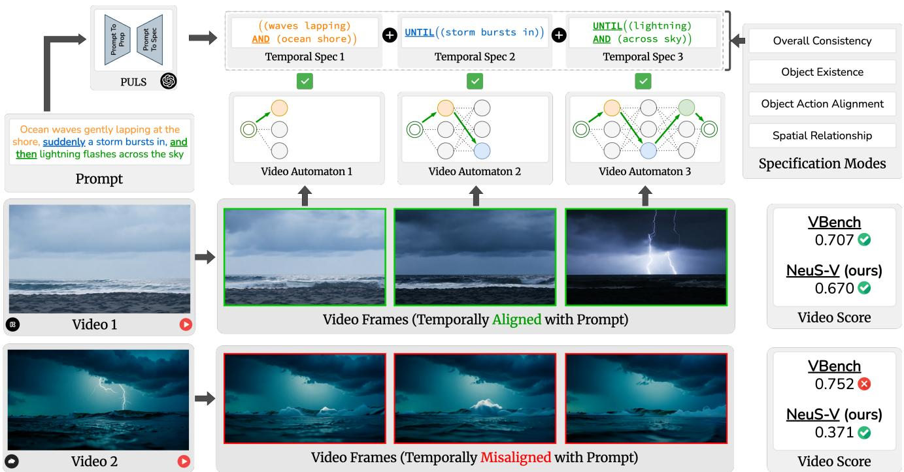
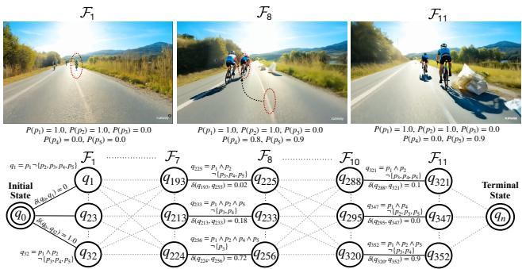
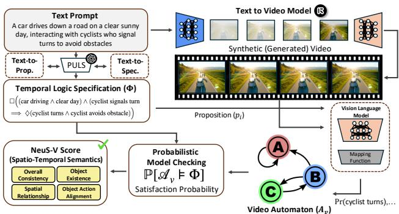
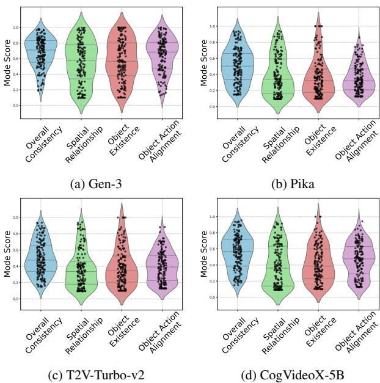
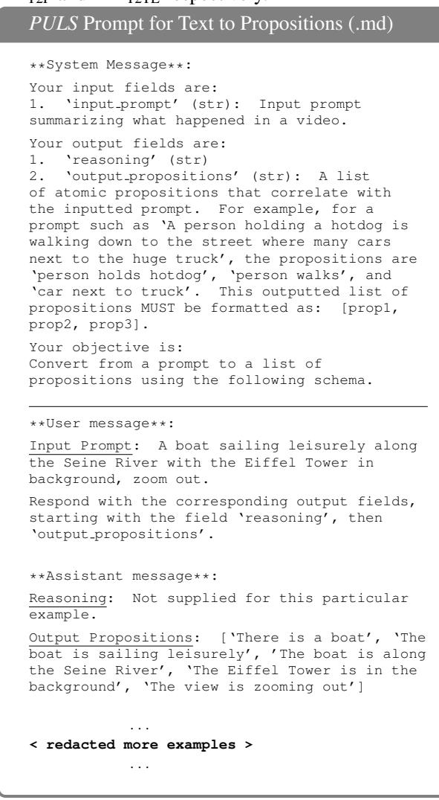
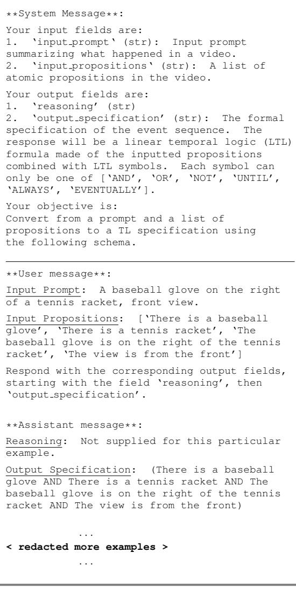
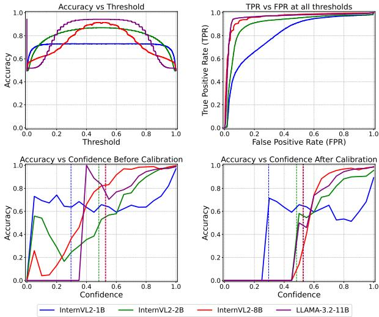
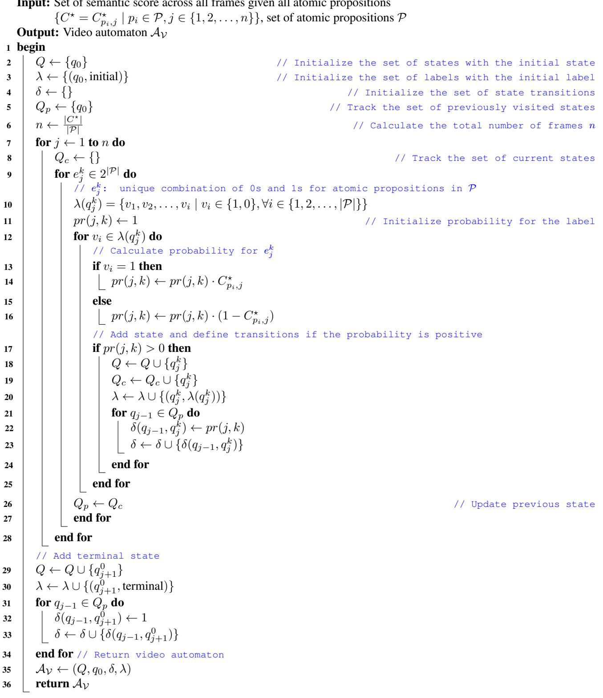
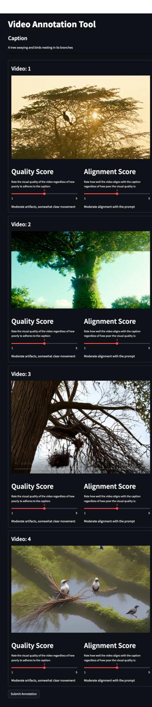

# 基于形式验证的文本到视频模型的神经符号评估

S P Sharan\* Minkyu Choi\*\* Sahil Shah Harsh Goel Mohammad Omama Sandeep Chinchali 德克萨斯大学奥斯丁分校，美国

  
t

# 摘要

近期在文本到视频模型（如 Sora、Gen-3、MovieGen 和 CogVideoX）方面的进展正在推动合成视频生成的边界，这些模型在机器人技术、自动驾驶及娱乐等领域得到了应用。随着这些模型的普及，各种评估生成视频质量的指标和基准应运而生。然而，这些指标强调视觉质量和流畅性，而忽视了时间保真度和文本到视频的对齐度，这对于安全关键应用至关重要。为了解决这一问题，我们提出了 NeuS-V，一种新颖的合成视频评估指标，使用神经符号形式验证技术严格评估文本到视频的对齐度。我们的方法首先将提示转换为形式定义的时序逻辑（TL）规范，并将生成的视频转换为自动机表示。然后，通过形式检查视频自动机与 TL 规范的匹配来评估文本到视频的对齐度。此外，我们还提供了一套时序扩展提示的数据集，以评估最先进的视频生成模型在我们的基准下的表现。我们发现，与现有指标相比，NeuS-V 与人类评估的相关性提高了超过 $5 \times$。我们的评估进一步揭示当前视频生成模型在这些时间复杂提示上的表现相当差，突显出未来在提升文本到视频生成能力方面的必要性。我们已将我们的基准、代码和数据集开源，地址为 utaustin-swarmlab.github.io/NeuS-V。

# 1. 引言

我们设想需要对自主驾驶（AD）中的运动规划系统进行压力测试或重训练，模拟一个场景："在第10帧中，一辆卡车出现在我的视野中，并在2秒内驶入我的车道"。随着文本生成视频（T2V）模型的最新发展，为此类场景生成合成视频为改善这些工程系统提供了巨大潜力。然而，为了使这些合成视频有效，它们必须在三个关键维度上与所需提示对齐：$\bullet$ 语义，$\pmb { \varrho }$ 空间关系，以及 $\pmb { \Theta }$ 时间一致性。例如，如果合成视频在自主车辆面前不准确地生成了卡车的运动，或者未能遵循正确的换车时间，则可能会在重训练过程中误导运动规划系统，导致在关键情况下做出错误决策。为了识别与提示良好对齐的合成视频，近来开发的 T2V 模型中出现了各种评估指标[4, 14, 20, 33, 57]。尽管许多视频评估工具[23, 39, 41]关注于视觉质量，但一些方法利用视觉-语言模型[50, 51]或视频字幕模型[9]来评估生成视频与原始提示之间的语义对齐。更值得注意的是，VBench [23]对视频进行了多个维度和类别的评估，最近被用作评估 T2V 模型的排行榜\*。然而，使用一个神经网络生成的视频通过另一个进行简单评估既不严格也不可解释。此外，当前的评估指标仍然缺乏视频数据固有的关键时空方面（见图1）。我们的关键见解是利用最近在视频理解系统中的进展，这些系统使用结构化符号验证方法与神经网络结合[10]。我们引入了神经符号验证（NeuS-V），这是一种新颖的 T2V 模型评估方法，将神经网络输出与通过时间逻辑（TL）规范的结构化符号验证相结合。首先，我们利用视觉-语言模型（VLM）来解释视频的空间和语义内容。其次，通过顺序处理帧，我们捕捉这些识别语义之间的时间关系。最后，我们构建合成视频的自动机表示，建立视频事件的结构化时间序列。该结构确保符合指定的 TL 要求，从而实现严格且可解释的视频评估。此外，我们引入了一组扩展时序提示的数据集，用于基准测试 T2V 模型在忠实表现时间一致性和准确反映事件序列方面的能力。我们计划开源 NeuS- $V$、我们的提示套件以及人类评估结果，并发布最新的 T2V 模型公共排行榜。

# 2. 相关工作

文本到视频模型的评估。近年来T2V模型的激增造成了对专门指标的需求，以评估生成视频的质量和连贯性。该领域的一些初步工作利用诸如FID、FVD和CLIPSIM等指标，但这些方法在处理需要复杂推理和逻辑的提示时表现不佳。最近的研究依赖于大语言模型（LLMs）将提示拆解为视觉问答（VQA）对，然后由视觉语言模型（VLM）进行评分。少数方法还利用视觉变换器和时间网络。一些工作，包括EvalCrafter、FETV、T2V-Bench等，结合了多种视觉质量指标的集成。其中，VBench正在成为该领域的事实标准，跨越多个维度和类别进行评估。然而，当前所有评估方法都强调视觉质量，忽视视频的时间顺序。尽管一些方法声称进行时间评估，它们往往关注播放（如慢动作、延时摄影）或运动速度等方面，而非真正的时间推理，并且缺乏严谨性。相比之下，NeuS-V通过在合成视频的自动机表示上进行时间保真性的形式验证，解决了这些不足。 视频事件理解。近年来的方法通常依赖于感知模型或视觉语言模型（VLM）分析视频中的事件。尽管这些模型能够有效检测对象和动作，但并不能保证对视频时间动态的可靠理解。Yang等人专注于将视频表示为一种形式模型，具体为离散马尔可夫链，提供了一种更结构化的方法来捕捉跨时间的事件。其中一个应用是NSVS-TL，该方法使用神经符号学的方法找到感兴趣的场景。在类似的思路下，NeuS-V利用视觉语言模型和形式验证来增强对生成视频中时间关系的理解，并评估视频质量，从而为视频评估建立可靠基础。

# 3. 前言

在接下来的部分，我们将提供一个运行示例来帮助说明我们的方法。假设我们使用 T2V 模型生成一个自动驾驶视频，提示词为“在晴朗的阳光明媚的日子里，一辆车沿着道路行驶，与指示转弯以避开障碍物的自行车骑行者互动”。时态逻辑。简而言之，TL 是一种具有逻辑和时态运算符的表现能力强的形式语言 [13, 43]。一个 TL 公式由三部分组成：$\bullet$ 一组原子命题，$\pmb { \varrho }$ 一阶逻辑运算符，以及 $\otimes$ 时态运算符。原子命题是不可分割的陈述，可以是真或假，并用于构建更复杂的表达式。一阶逻辑运算符包括与 $( \wedge )$、或 (V)、非 $( \neg )$、蕴含 $( \Rightarrow )$ 等，而时态运算符包括始终 $( \sqsubseteq )$、最终 $( \diamondsuit )$、下一个 (X)、直到 (U) 等。我们的示例中的原子命题 $\mathcal { P }$ 和 TL 规范 $\Phi$ 为：

$$
\begin{array} { r l } { \mathcal { P } } & { = \{ \mathrm { c a r d r i v i n g , ~ c l e a r d a y , ~ c y c l i s t ~ s i g n a l s ~ t u r n } , } \\ & { \mathrm { ~ \mathrm { c y c l i s t ~ t u r n s } , ~ c y c l i s t ~ a v o i d s ~ o b s t a c l e } \} , } \\ { \Phi } & { = \square \Big ( \mathrm { ( c a r d r i v i n g \wedge c l e a r d a y ) } \wedge \mathrm { ( c y c l i s t ~ s i g n a l s ~ t u r n ) } } \end{array}
$$

该 TL 规范说明，如果一辆汽车在晴朗的天气下行驶，且骑自行车的人发出转向信号，则意味着最终骑自行车的人将转向并避免障碍物。

离散时间马尔可夫链，简称DTMC，用于建模状态之间在离散时间步骤发生转移的随机过程 [29, 44]。我们使用DTMC来建模合成视频，因为帧的顺序是离散且有限的，如图2所示。DTMC定义为一个元组 $\mathcal { A } = ( Q , q _ { 0 } , \delta , \lambda )$，其中 $Q$ 是一个有限状态集合，$q _ { 0 } \in Q$ 是初始状态，$\lambda : Q \to 2 ^ { | \mathcal { P } | }$ 是标签函数，$\mathcal { P }$ 是原子命题的集合，$\delta : Q \times Q \to [ 0 , 1 ]$ 是转移函数。对于任何两个状态 $q , q ^ { \prime } \in Q$，转移函数 $\delta ( q , q ^ { \prime } ) \in [ 0 , 1 ]$ 给出了从 $q$ 转移到 $q ^ { \prime }$ 的概率。对于每个状态，所有外发转移的概率之和为1。

形式验证。这提供了正式的保证，确保系统满足期望的规范。它要求对系统进行形式化表示，例如有限状态自动机（FSA）或马尔可夫决策过程（MDP）。从离散时间马尔可夫链（DTMC）出发，我们将路径定义为从初始状态出发的一系列状态，例如，$q _ { 0 } q _ { 1 } ( q _ { 2 } ) ^ { \omega }$，其中 $\omega$ 表示无限重复。轨迹是状态标签的序列，表示为 $\lambda ( q _ { 0 } ) \lambda ( q _ { 1 } ) \lambda ( q _ { 2 } ) \cdots \in ( 2 ^ { | \mathcal { P } | } ) ^ { \omega }$，它捕捉随时间变化的事件。接下来，我们应用概率模型检查来计算概率 $\mathbb { P } [ \mathcal { A } \models \Phi ]$，该概率给出了从初始状态开始的轨迹满足时间逻辑规范 $\Phi$ 的满足概率。通过这种形式化表示，我们评估合成视频。

  
Figure 2. Video automaton from the running example. Above is an automaton of a video generated by the Gen-3 model constructed with a TL specification (See Eq. (1)). Every state $q _ { t }$ from a frame $\mathcal { F }$ is labeled and has incoming and outgoing transition probabilities $\delta ( q , q ^ { \prime } ) \in [ 0 , 1 ]$ . For example, in frame $\mathcal { F } _ { 8 }$ , we have probabilities $P ( p _ { 4 } ) = 0 . 8$ and $P ( p _ { 5 } ) = 0 . 9$ ,where $p _ { 4 }$ represents the atomic proposition "cyclist turns", and $p 5$ represents "cyclist avoids obstacle". These probabilities are assigned because the cyclist (red-dotted circle) has turned left to avoid obstacles on the road. In the state $q _ { 2 5 6 }$ , we have an incoming probability $0 . 7 2 = P ( p _ { 1 } ) \times P ( p _ { 2 } ) \times P ( p _ { 4 } ) \times P ( p _ { 5 } ) \times ( 1 - P ( p _ { 3 } ) )$ from the previous state $q _ { 2 2 4 }$ , where that label is true for $p _ { 1 } , p _ { 2 } , p _ { 4 }$ , and $p _ { 5 }$ , and false for $p _ { 3 }$ denoted as $\neg \{ p _ { 3 } \}$ .

  
Figure 3. Spatio-temporal and semantic measurements between a text prompt and a video by NeuS-V. We first decompose the text prompt to TL specification $\Phi$ , then transform the synthetic video into an automaton representation $\mathbf { \mathcal { A } } _ { \nu }$ . Finally, we calculate the satisfaction probability by probabilistically checking the extent to which $\mathbf { \mathcal { A } } _ { \nu }$ satisfies $\Phi$ .

# 4. 方法论

考虑到从T2V模型$\mathcal { M } _ { \mathrm { T 2 V } } : T $ $\nu$生成的合成视频，其中$T$是文本提示，我们旨在为每个评估模式$m \in M = \{$目标存在、空间关系、目标与动作对齐、整体一致性}计算评估分数$S : T \times \mathcal { V } \to \mathbb { R } ^ { m }$。我们引入NeuS-$V$，这是一种使用神经符号形式验证框架评估T2V模型的创新方法。NeuS-V通过以下步骤对合成视频在四种不同的评估模式下进行评估：目标存在、空间关系、目标与动作对齐及整体一致性：•步骤1：通过基于时间逻辑规范的提示理解（PULS），我们将文本提示转化为一组原子命题和TL规范。•步骤2：我们使用应用于每帧序列的视觉语言模型（VLM）为每个原子命题获得语义置信分数。•步骤3：我们为合成视频构建视频自动机表示。•步骤4：通过对构造的视频自动机与TL规范进行形式验证，计算满足概率。•步骤5：最后，我们通过将满足概率映射到NeuS-V的最终评估分数上来校准该概率。

# 4.1. 通过时间逻辑规范理解提示

我们提出了一种通过时序逻辑实现的提示理解方法（PULS），这是一种新颖的方法，能够高效准确地将文本提示转换为时序逻辑规范。它保留了提示的所有语义细节，以便制定其时序逻辑规范。与之前仅专注于单个对象、孤立事件之间关系的公式化[5, 8, 17]，或编码空间信息[37, 47]的工作不同，我们的方法PULS完全捕捉时间和空间细节。通过结合四种评估模式，我们提供了更全面的跨时空维度的评估。 评估模式。PULS将文本提示编译成不同集合的命题$\mathcal{P}$和时序逻辑规范$\Phi$，涉及四种评估模式： • 对象存在：该模式评估文本提示中指定对象的存在。例如，在我们的运行示例（第3节）中，对象存在模式的时序逻辑规范可以定义为$\Phi = \diamondsuit$（汽车$\wedge$骑自行车者$\wedge$障碍物）。 • 空间关系：该评估模式捕捉现有对象之间的空间关系。在我们的运行示例中，由于我们关注骑自行车者发信号然后转弯，这意味着骑自行车者位于汽车前面。因此，时序逻辑规范定义为$\Phi = \boxed { \begin{array} { r l } \end{array} }$（骑自行车者在汽车前面）$\wedge$ $\diamondsuit$（障碍物在骑自行车者旁边）。 • 对象与行为对齐：它确保生成视频中的对象执行文本提示中指定的行为。例如，时序逻辑规范可以定义为$\Phi \ : = \ : \diamond$（骑自行车者发信号转弯$\wedge$骑自行车者转U型$\wedge$骑自行车者避免障碍物）。 • 整体一致性：最后，我们评估生成视频中事件的整体语义和时间一致性，确保与完整的文本提示对齐（见公式（1）中的示例）。 功能模块。PULS是一个由大型语言模型（LLMs）驱动的两步算法。给定用于视频生成的文本提示$\tau$，它被转换为任何给定评估模式$m \in M$下的$\mathcal{P}$和$\Phi$。这个转换过程定义为$L M _ { P U L S } : \mathcal{T} \times M \to ( \mathcal{P} , \Phi )$。PULS由两个模块组成，文本到命题模块（T2P）和文本到时序逻辑模块（T2TL）。这些模块分别使用优化的提示$\theta _ { T 2 P } ^ { \star }$和$\theta _ { T 2 T L } ^ { \star }$。每个优化提示包括从编制的训练数据集$\mathfrak{D} _ { \mathrm{T 2 T L | train} }$中精心选择的少量示例，以最大化在给定$m \in M$时获得正确的$\mathcal{P}$和$\Phi$的准确性。 1. 文本到命题模块：该模块提取给定$M$的$\mathcal{P}$，使用$\theta _ { \mathrm{T 2 P}} ^ { \star }$，并定义为：

$$
\begin{array} { r } { L M _ { \mathrm { T 2 P } } : \mathcal { T } \times M \xrightarrow { \theta _ { \mathrm { T 2 P } } ^ { \star } } \mathcal { P } . } \end{array}
$$

经过优化的提示 $\theta _ { \mathrm { T 2 P } } ^ { \star }$ 是从 $\mathfrak { D } _ { \mathrm { T 2 T L | t r a i n } }$ 中获得的，该集合包含 $\mathcal { N }$ 个选定的文本示例 $\mathcal { T } _ { i }$ 和命题 $\mathcal { P } _ { i }$ 的配对：

$$
\mathfrak { D } _ { \mathrm { T 2 P } | \mathrm { t r a i n } } = \{ ( \mathcal { T } _ { i } , \mathcal { P } _ { i } ) \} _ { i = 1 } ^ { \mathcal { N } } , \quad \mathfrak { D } _ { \mathrm { T 2 P } | \mathrm { t r a i n } } \subset \mathfrak { D } _ { \mathrm { t r a i n } } .
$$

2. 文本到目标语言规格模块：该模块利用优化的提示 $\theta _ { \mathrm { T 2 T L } } ^ { \star }$ 从 $\mathcal { T }$, $\mathcal { P }$ 和 $M$ 生成 $\Phi$，其定义为：

$$
\begin{array} { r } { L M _ { \mathrm { T 2 T L } } : \mathcal { T } \times \mathcal { P } \times M \xrightarrow { \theta _ { \mathrm { T 2 T L } } ^ { \star } } \Phi . } \end{array}
$$

优化后的提示 $\theta _ { \mathrm { T 2 T L } } ^ { \star }$ 是从 $\mathfrak { D } _ { \mathrm { T 2 T L | t r a i n } }$ 中获得的，其中包含 $\mathcal { N }$ 对示例文本 $\mathcal { T } _ { i }$、命题 $\mathcal { P } _ { i }$，以及相应的 $\mathrm { T L }$ 规范 $\Phi _ { i }$：

$$
\mathfrak { D } _ { \mathrm { T 2 T L } | \mathrm { t r a i n } } = \{ ( \mathcal { T } _ { i } , \mathcal { P } _ { i } , \Phi _ { i } ) \} _ { i = 1 } ^ { \mathcal { N } } , \quad \mathfrak { D } _ { \mathrm { T 2 T L } | \mathrm { t r a i n } } \subset \mathfrak { D } _ { \mathrm { t r a i n } } .
$$

我们使用 MIPROv2 [46] 和 DSPy [30] 来确保数据集 $\mathfrak { D } _ { \mathrm { t r a i n } }$ 中的 $\mathcal { N }$ 例少量样本足以最大化每个模块的准确性。我们在附录中详细说明了优化过程。

# 4.2. 来自神经感知模型的语义分数

给定 $\mathcal { P } , \Phi = L M _ { \mathrm { P U L S } } ( T )$ ，其中 $T$ 是用于合成视频 $\nu$ 的文本提示，我们首先使用 VLM $\mathcal { M } _ { \mathrm { V L M } } : p \times \mathcal { F } C$ 为每个原子命题 $p _ { i } \in \mathcal { P }$ 获取语义置信度得分 $C \in [ 0 , 1 ]$ ，其中 $\mathcal { F }$ 表示一系列帧。我们使用 VLM 来解释语义 [2, 36, 45, 56] 并根据文本查询 $T$ 从 $\mathcal { F }$ 中提取置信度得分。我们将每个 $p _ { i } \in \mathcal { P }$ 以及提示传递给 VLM，并计算输出响应的词元概率，该响应为真或 $\mathbb { F } \ a \mathrm { 1 } s \in$ 。为了计算词元概率，我们检索响应词元的 logits，并在应用 softmax 后计算该词元的概率。接下来，语义置信度得分是这些概率的乘积，如下所示：

$$
\begin{array} { r l } & { c _ { i } = \mathcal { M } _ { \mathrm { V L M } } ( p _ { i } , { \mathcal F } ) } \\ & { \quad = \displaystyle \prod _ { j = 1 } ^ { k } P \left( t _ { j } \mid p _ { i } , { \mathcal F } , t _ { 1 } , \ldots , t _ { j - 1 } \right) \forall p _ { i } \in { \mathcal P } , } \end{array}
$$

其中 $( t _ { 1 } , \ldots , t _ { k } )$ 是响应中的词元序列。第 $j ^ { \dagger }$ 个响应词元的概率为 $\begin{array} { r } { P ( t _ { j } | \cdot ) = \frac { e ^ { l _ { j , t _ { j } } } } { \sum _ { z } e ^ { l _ { j , z } } } } \end{array}$，其中 $l _ { j , * }$ 是对数几率向量，$l _ { j , t _ { j } }$ 是对应于词元 $t _ { j }$ 的对数几率。最后，我们对 VLM 进行校准，以使用语义分数映射函数 $c _ { i } ^ { \star } \gets f _ { \mathsf { V L M } } ( c _ { i } ; \gamma _ { f p } )$ 将置信度映射到概率，其中 $c _ { i } ^ { \star }$ 是经过校准的置信度，$\gamma _ { f p }$ 是假阳性阈值。关于语义检测器 VLM 的校准过程和提示设计的更多详细信息可以在附录中找到。

<table><tr><td colspan="2">Algorithm 1: NeuS-V Require: Frame window size w, evaluation mode M , PULS</td></tr><tr><td colspan="2">semantic score mapping function fvLM(·), video automaton generation function ξ(·) probabilistic model checking function Ψ(·), probability mapping function fECDF(·), probability distribution D Input : Text prompt T, text-to-video model MT2V</td></tr><tr><td colspan="2">Output : NeuS-V score SNeuS-V 1 begin</td></tr><tr><td>2 S ← {}</td><td>// Initialize an empty set for NeuS-V scores of each evaluation mode</td></tr><tr><td>3</td><td>V ← MT2v(T) // Generate a video</td></tr><tr><td>4 5</td><td>for m  M do for n = 0 to length(V) − w step w do</td></tr><tr><td>6</td><td>C*←{} 7/ Initialize an empty set for semantic confidence</td></tr><tr><td>7</td><td>F ← {V[n], V[n + 1], . . . , V[n + w − 1]} // Select a sequence of</td></tr><tr><td>8</td><td>P, Φ ← LMPULs(T, m) // Translate the T to P and Φ for m</td></tr><tr><td>9</td><td>for pi  P do ci ← MvLM(pi, F) // Obtain</td></tr><tr><td>10</td><td>semantic confidence scores c ← fVLM(ci; γf p) // Calibrate Ci</td></tr><tr><td>11</td><td>with false positive threshold Yfp</td></tr><tr><td>12</td><td>C*[pi,n] ← c // Append c to the semantic confidence set</td></tr><tr><td>13</td><td>end for end for</td></tr><tr><td>14 15</td><td>AV ← ξ(P, C*) // Construct Av</td></tr><tr><td>16</td><td>P[Aν = Φ] = Ψ(Aν, Φ) // Obtain satisfaction probability</td></tr><tr><td>17</td><td>sm = fECDF(P[AV = Φ], Dm) // Calculate</td></tr><tr><td></td><td>the calibrated score S← SU{sm} // Append the score Sm to</td></tr><tr><td>18</td><td>the set S</td></tr><tr><td></td><td>end for</td></tr><tr><td>19 20</td><td>SNeus-V ← ∑ S |S|</td></tr></table>

# 4.3. 合成视频的自动机表示

接下来，给定所有帧和命题中的 $C^{\star}$，我们构建视频自动机 $\mathbf{\mathcal{A}}_{v{\nu}}$ 以将合成视频表示为离散时间马尔可夫链（DTMC） $\mathcal{A}$。这种表示至关重要，因为它使得对合成视频的评估成为可能，从而确定其是否满足与原始文本提示对应的 $\Phi$。我们使用自动机生成函数 $\xi : \mathcal{P} \times C^{\star} \to \mathcal{A}_{\mathcal{V}}$ 来构建 $\mathbf{\mathcal{A}}_{v{\nu}}$，定义为 $Q = \{ q_{0} \ldots q_{t} \}$ 是可能状态的集合，每个 $q \in Q$ 表示 $\mathcal{P}$ 的真值独特配置，其中 $q_{0}$ 表示初始状态。考虑到合成视频中每个帧序列中所有原子命题的 $C^{\star}$，转移函数 $\delta(q, q^{\prime})$ 被定义为 $\mathbf{1}_{\{q_{i}^{\prime} = 1\}}$ 是一个指示函数，当且仅当 $p_{i}$ 在 $q^{\prime}$ 中为真时其值为 1，否则为 0。同样地，$\mathbf{1}_{\{q_{i}^{\prime} = 0\}}$ 仅在 $p_{i}$ 在 $q^{\prime}$ 中为假时取值 1。通过标记函数 $\lambda(q)$ 获得这一结果，该函数将每个状态 $q$ 映射到其命题的布尔值。关于 $\mathbf{\mathcal{A}}_{\nu}$ 构建过程的更多细节请参见附录。

$$
\begin{array} { r } { \mathcal { A } _ { \mathcal { V } } = \xi ( \mathcal { P } , C ^ { \star } ) = \mathcal { A } = ( Q , q _ { 0 } , \delta , \lambda ) , } \end{array}
$$

$$
\delta ( q , q ^ { \prime } ) = \prod _ { i = 1 } ^ { | \mathcal { P } | } ( C _ { i } ^ { \star } ) ^ { \mathbf { 1 } _ { \{ q _ { i } ^ { \prime } = 1 \} } } ( 1 - C _ { i } ^ { \star } ) ^ { \mathbf { 1 } _ { \{ q _ { i } ^ { \prime } = 0 \} } } ,
$$

# 4.4. 正式验证合成视频

给定 $\mathbf { \mathcal { A } } _ { \ v { \nu } }$，我们通过对 $\mathbf { \mathcal { A } } _ { \ v { \nu } }$ 进行形式化验证，以计算满足概率 $\mathbb { P } [ A _ { \mathcal { V } } \vdash \Phi ]$。具体而言，我们使用模型检测方法 STORM [19, 28]，该方法利用概率计算树逻辑 (PCTL) 的变体来计算 $\mathbf { \mathcal { A } } _ { \ v { \nu } }$ 对于 $\Phi$ 的满足概率。该概率定义为 $\mathbb { P } [ \mathcal { A } _ { \mathcal { V } } \mid = \Phi ] = \Psi ( \mathcal { A } _ { \mathcal { V } } , \Phi )$，其中 $\Psi ( \cdot )$ 是概率模型检测函数。这是通过分析 $\mathcal { A } _ { \mathcal { V } }$ 中的概率转移和状态标签来实现的。最终评分校准。最后，我们使用基于其经验累积分布的满足概率映射函数，将满足概率校准为 NeuS- $V$ 评分，定义为其中 $D _ { m }$ 是来自广泛合成视频样本的每种评估模式的满足概率分布，而 $S$ 是每种评估模式得分 $s _ { m }$ 的集合。我们对这些得分取平均值，以全面捕捉提示中时间规格的多样性。

$$
S = \left\{ s _ { 1 } , \ldots , s _ { m } \right\} = f _ { \mathrm { E C D F } } ( \mathbb { P } [ \mathcal { A } _ { \mathcal { V } } \vdash \Phi ] , D _ { m } ) \forall m \in M ,
$$

$$
S _ { N e u S – V }  \frac { \sum S } { \mid S \mid } .
$$

# 5. 实验设置

PULS使用GPT-4o和o1-preview进行提示到$\mathrm{T L}$的翻译，而NeuS-V依赖于InternVL2-8B[25]作为其选择的视觉语言模型（VLM）进行自动化构建。我们在提示VLM时使用三帧的上下文。所有系统提示和示例输出均可在附录中找到。我们还使用GPT-4o构建提示套件。 T2V模型。我们使用两个不同的提示集评估闭源和开源文本到视频（T2V）模型的性能。对于闭源模型，我们选择Gen $^{3^{\dag}}$和$\mathrm{P i k a^{\ddag}}$，并使用开源的T2V-Turbo-v2[35]和CogVideoX-5B[54]。我们在$8 \times$ A100 GPU上以默认超参数运行它们。 提示和评估套件。我们观察到现有的T2V评估基准[23, 26, 41]缺乏明确的时间指令，因此我们提出了NeuS-V提示套件，总计360个提示。这些提示旨在严格评估模型在保持时间一致性和准确遵循事件序列方面的能力。该套件涵盖了四个主题（“自然”，“人类与动物活动”，“物体交互”，和“驾驶数据”），并根据时间和逻辑运算符的数量分为三个复杂度等级（基础、中级和高级）。为了确保无偏基准，我们开展了一项人类研究，指导评估者明确区分视觉质量与文本到视频对齐。我们的提示套件和人类评估研究的结果将在接受后公开。具体细节见补充材料。

  
Figure 4. Correlation with Human Annotations. NeuS-V consistently shows a stronger alignment with human text-to-video annotations (Pearson coefficients displayed at the top of each plot).

与人类标注的相关性。我们使用 NeuS- $V$ 和 VBench 这两个专注于视觉质量的成熟基准，评估所选的视频生成模型。为了评估与人类对文本与视频对齐评分的相关性，我们在图 4 中绘制了这些指标。在所有模型中，NeuS-V 显示出与人类标注之间的持续较强相关性，最佳拟合线和皮尔逊系数表明其优于 VBench。通过结合时间逻辑规范和合成视频的自动机表示，NeuS-V 提供了对文本与视频对齐的严格评估。

# 6. 结果

基于我们的实验设置，我们现在转向对NeuS-V的实证评估。我们的实验旨在解决三个核心问题，这些问题突显了我们方法的必要性。1. 相比于强调视觉质量的基线，NeuS-V对时间保真度的关注是否会转化为与人类标注之间更高的相关性？2. 在多大程度上，扎根于时间逻辑和形式验证的评估框架比 solely 基于VLM的方法提供了更强的鲁棒性？3. NeuS-V的可靠性是否可以超越我们的合成提示套件，适用于已经建立的大规模数据集？

# 6.1. 文本到视频模型的正式评估

如第5节所述，我们对闭源和开源的最先进模型进行了基准测试：Gen-3和Pika（闭源），以及T2V-Turbo-v2 [34, 35]和CogVideoX-5B [54]（开源）。在我们的提示套件上的性能。我们对每个T2V模型在我们的评估套件上的表现进行了细致分析，如表1所示，按主题和复杂性对160个提示的子集进行了组织。结果表明，大多数模型在生成“自然”和“人类与动物活动”主题的视频时表现最佳。Gen-3模型在整个套件中获得了最高分，这一结果得到了人工标注者的证实。此外，图5展示了PULS中四种评估模式在模型之间的利用情况。不同的提示依赖于不同的模式，表明这些模式的组合全面捕捉了提示中的时间规范的多样性。

# 6.2. 基于时序逻辑和验证的消融研究 形式语言的重要性如何？

在本次消融研究中，我们探讨了形式化构 grounding 在时间逻辑和模型检验中的作用，通过用缺乏这种严格性的基于视觉语言模型（VLM）的替代方案替换这些组件。具体而言，我们并不使用 PULS 将提示翻译为原子命题和规范，而是直接查询大型语言模型（LLM），将提示分解为一组涵盖每个提示内容和视觉特征的是/否问题。接下来，我们不再使用 NeuS-V 进行验证，而是使用 VLM 根据之前生成的问题独立为每一帧打分。该消融研究同样反映了现有的提示到视觉问答（VQA）的基线 [31, 32, 40, 58]。

<table><tr><td colspan="2">Prompts</td><td>Gen-3</td><td>Pika</td><td>T2V-Turbo-v2[35]</td><td>CogVideoX-5B[54]</td></tr><tr><td rowspan="4">By Theme</td><td>Nature</td><td>0.716 (0.47)</td><td>0.479 (0.70)</td><td>0.564 (0.46)</td><td>0.580 (0.53)</td></tr><tr><td>Human &amp; Animal Activities</td><td>0.752 (0.80)</td><td>0.531(0.67)</td><td>0.564 (0.66)</td><td>0.623(0.43)</td></tr><tr><td>Object Interactions</td><td>0.710 (0.16)</td><td>0.500 (0.40)</td><td>0.553(0.66)</td><td>0.573(0.65)</td></tr><tr><td>Driving Data</td><td>0.716 (0.48)</td><td>0.525 (0.66)</td><td>0.525 (0.30)</td><td>0.580 (0.52)</td></tr><tr><td rowspan="3">By Complexity</td><td>Basic (1 TL op.)</td><td>0.774 (0.60)</td><td>0.589 (0.70)</td><td>0.610 (0.58)</td><td>0.641 (0.65)</td></tr><tr><td>Intermediate (2 TL ops.)</td><td>0.680 (0.27)</td><td>0.464 (0.44)</td><td>0.508 (0.38)</td><td>0.549 (0.28)</td></tr><tr><td>Advanced (3 TL ops.)</td><td>0.692(-0.01)</td><td>0.400 (0.33)</td><td>0.494 (0.42)</td><td>0.550 (0.78)</td></tr><tr><td colspan="2">Overall Score</td><td>0.723 (0.48)</td><td>0.508 (0.62)</td><td>0.552 (0.55)</td><td>0.589 (0.54)</td></tr></table>

  
Figure 5. Distribution of scores across the four modes of PULS

在我们的设置中，我们使用 GPT-4o 作为大语言模型（LLM），并配置了两个视觉语言模型（VLM）：LLaMa-3.2-11B-Vision-Instruct§（能够处理图像）和 LLaVA-Video-7B-Qwen $2 ^ { \ P }$（能够处理完整视频）。我们使用我们的提示套件对这些方法进行了评估，结果如图 6 所示。我们的研究表明，尽管这两种方法与人工标注之间存在正相关（如皮尔逊系数所示），但其相关性强度不及图 4 中的正式方法。此外，LLaVA-Video 表现出过于自信，导致其相关性弱于仅处理图像的 LLaMa-3.2。这些结果强调了相同的 VLM 在以时间逻辑和形式验证为基础时，提供了更稳健的评估框架。

  
Figure 6. Is Formal Language Important? VLMs without grounding in formal temporal logic lead to lower pearson coefficients (in brackets) as compared to NeuS-V from Figure 4.

# 6.3. 在真实世界视频字幕数据集上展示鲁棒性

我们的提示评估套件虽然有效，但规模较小，仅包含160个提示。有人可能会认为，这种有限的规模以及使用合成的视频字幕可能会引发对我们指标可靠性的质疑。为了解决这个问题，我们使用了 MSR-VTT [52]，这是一个公认的视频字幕数据集，该任务还涉及评估视频与给定文本描述的匹配程度。MSR-VTT 包含大量的视频-字幕对，由 MTurk 工作者进行标注。我们利用其可信度，并重新利用其验证集来评估我们指标的可靠性。我们创建了两个数据集：正集（字幕与视频匹配）和负集（字幕与视频不匹配）。然后，我们测试 NeuS-V 指标能否有效区分匹配和不匹配的视频-字幕对。在表 2 中，我们将 NeuS-V 与 VBench 进行比较，并报告匹配和不匹配对的得分均值和标准差。我们的结果表明，NeuS-V 成功地区分了正集和负集，为匹配对分配了更高的分数，而为不匹配对分配了较低的分数。相比之下，VBench 在匹配和不匹配得分之间的差异较小，这突显了 NeuS-V 在捕捉有意义的文本到视频对齐能力方面的优越性。

Table 2. Evaluating reliability on MSR-VTT. NeuS-V distinguishes aligned and misaligned captions better than VBench.   

<table><tr><td>Metric</td><td>Aligned Captions</td><td>Misaligned Captions</td><td>Difference (↑)</td></tr><tr><td>VBench</td><td>0.78 (± 0.12)</td><td>0.40 (± 0.24)</td><td>0.38</td></tr><tr><td>NeuS-V</td><td>0.82 (± 0.10)</td><td>0.30 (± 0.18)</td><td>0.52</td></tr></table>

# 6.4. 架构选择的消融实验

视觉上下文与视觉语言模型。在这项关于结构选择的首次消融实验中，我们研究了使用更多帧是否必然提高NeuS-V的性能。为了衡量这一点，我们比较了在提示我们的视觉语言模型（InternVL2-8B）时使用单帧和三帧的效果。如表3所示，使用三帧始终与文本到视频的对齐注释具有更高的相关性。我们没有测试超过三帧的情况，因为这将超出大语言模型的上下文窗口。 视觉语言模型的选择。在第二项消融实验中，我们考察视觉语言模型的选择是否影响自动机构建。我们测试了两个较新的视觉语言模型：InternVL2-8B[45]和LLaMa3.2-11B-Vision，使用单帧上下文。如表4所示，InternVL2-8B始终与文本到视频的对齐注释具有更高的相关性。尽管LLaMa3.2模型进行了标定尝试，但由于概率严重倾斜，其输出往往显得过于自信，导致与人工标签的相关性较低。

# 7. 讨论

严格的形式主义是否关键？一个自然的问题是，形式时间逻辑是否可以用更简单的条件-结果检查和断言来替代。从原则上讲，是的。然而，随着提示长度和复杂性的增加，这种基于规则的方法表现出扩展性挑战，使其变得不切实际。相比之下，符号时间算子提供了近乎线性的扩展能力，以验证对自动机的遵循。如第6.2节图6所示，尽管这种替代方法可能有前景，但它们最终未能达到形式时间逻辑所提供的鲁棒性。NeuS $V$ 是第一个将形式主义引入 T2V 评估的工作，超越了基于质量的指标。重新思考文本到视频模型。表1中的评估揭示了当前文本到视频模型在处理时间扩展提示时的重大局限性。尽管被宣传为文本驱动的视频生成，这些模型往往未能创造出真正遵循给定提示的运动和序列。大部分被感知的“运动”仅来自于简单的效果，例如平移和变焦，生成互动或有意义场景过渡的能力有限。在实践中，视频生成工作流程需要多轮重新提示才能实现对提示的遵循，而理想情况下，我们应该期待大多数情况下与提示对齐。

Table 3. Impact of contextual frames to VLM. More contextual information results in higher correlation with human annotations.   

<table><tr><td>VLM Context</td><td>Gen-3</td><td>Pika</td><td>T2V-Turbo-v2</td><td>CogVideoX-5B</td></tr><tr><td>1 Frame</td><td>0.859 (0.29)</td><td>0.613(0.51)</td><td>0.590 (0.34)</td><td>0.715 (0.32)</td></tr><tr><td>3 Frames</td><td>0.614(0.48)</td><td>0.409(0.62)</td><td>0.417(0.55)</td><td>0.461 (0.54)</td></tr></table>

Table 4. Impact of choice of VLM on correlation. InternVL2-8B for automaton construction shows higher correlation with human annotations.   

<table><tr><td>Choice of VLM</td><td>Gen-3</td><td>Pika</td><td>T2V-Turbo-v2</td><td>CogVideoX-5B</td></tr><tr><td>LLaMa3.2-11B</td><td>0.921(0.15)</td><td>0.660 (0.16)</td><td>0.730 (0.08)</td><td>0.785 (-0.02)</td></tr><tr><td>InternVL2-8B</td><td>0.859(0.29)</td><td>0.613(0.51)</td><td>0.590 (0.34)</td><td>0.715(0.3)</td></tr></table>

限制与未来工作。NeuS-V 目前缺乏对生成视频中不必要元素进行惩罚的机制，这使得难以区分无关的伪影和潜在有用的未在提示中明确请求的辅助内容。未来，我们的方法可以用于精炼生成的视频，直到其达到设定的阈值，从而提高对提示的遵循，而无需重新训练。此外，NeuS-V 的反馈也可以用于提示优化或模型训练。

# 8. 结论

文本到视频模型正越来越多地应用于安全关键领域，如自动驾驶、教育和机器人技术，其中维持时间保真度至关重要。然而，我们发现大多数当前的评估方法优先考虑视觉质量，而非文本到视频的对齐。为此，我们引入了NeuS-V，这是一种新颖的度量指标，它将提示转换为时间逻辑规范，并将视频表示为自动机，从而通过形式验证对其进行评分。与NeuS-V一起，我们呈现了一套具有时间挑战性的提示基准，以评估最先进的T2V模型遵循指定事件序列的能力。我们的评估揭示了这些模型的局限性，它们经常依赖于简单的摄像机移动，而非真正的时间动态。我们旨在为未来T2V模型的开发铺平道路，以实现与时间要求的更好对齐。

# 致谢

本材料部分基于海军研究办公室（ONR）资助的工作，资助编号为 N00014-22-1-2254。此外，此项工作得到了国防高级研究计划局（DARPA）合同 DARPA ANSR: RTX CW2231110 的支持。经批准可公开发布，分发无限制。

# References

[1] Josh Achiam, Steven Adler, Sandhini Agarwal, Lama Ahmad, Ilge Akkaya, Florencia Leoni Aleman, Diogo Almeida, Janko Altenschmidt, Sam Altman, Shyamal Anadkat, et al. Gpt-4 technical report. arXiv preprint arXiv:2303.08774, 2023. 7   
[2] Meta AI. Llama 3.2: Revolutionizing edge ai and vision with open, customizable models. Meta AI Blog, 2024. Available at https://ai.meta.com/blog/llama-3-2-connect-2024-vision-edge-mobiledevices/.4,3   
[3] Christel Baier and Joost-Pieter Katoen. Principles of Model Checking. The MIT Press, 2008. 3   
[4] Andreas Blattmann, Robin Rombach, Huan Ling, Tim Dockhorn, Seung Wook Kim, Sanja Fidler, and Karsten Kreis. Align your latents: High-resolution video synthesis with latent diffusion models. In Proceedings of the IEEE/CVF Conference on Computer Vision and Pattern Recognition, pages 2256322575, 2023. 2   
[5] Andrea Brunello, Angelo Montanari, and Mark Reynolds. Synthesis of LTL Formulas from Natural Language Texts: State of the Art and Research Directions. In 26th International Symposium on Temporal Representation and Reasoning (TIME 2019), pages 17:117:19, Dagstuhl, Germany, 2019. Schloss Dagstuhl  Leibniz-Zentrum für Informatik. 4   
[6] Emanuele Bugliarello, Hernan Moraldo, Ruben Villegas, Mohammad Babaeizadeh, Mohammad Taghi Saffar, Han Zhang, Dumitru Erhan, Vittorio Ferrari, Pieter-Jan Kindermans, and Paul Voigtlaender. Storybench: A multifaceted benchmark for continuous story visualization, 2023. 2   
[7] Xinlei Chen, Hao Fang, Tsung-Yi Lin, Ramakrishna Vedantam, Saurabh Gupta, Piotr Dollár, and C Lawrence Zitnick. Microsoft coco captions: Data collection and evaluation server. arXiv preprint arXiv:1504.00325, 2015. 3   
[8] Yongchao Chen, Rujul Gandhi, Yang Zhang, and Chuchu Fan. N12tl: Transforming natural languages to temporal logics using large language models, 2024. 4   
[9] Iya Chivileva, Philip Lynch, Tomas E Ward, and Alan F Smeaton. Measuring the quality of text-to-video model outputs: Metrics and dataset. arXiv preprint arXiv:2309.08009, 2023. 2   
10] Minkyu Choi, Harsh Goel, Mohammad Omama, Yunhao Yang, Sahil Shah, and Sandeep Chinchali. Towards neurosymbolic video understanding. In European Conference on Computer Vision, pages 220236. Springer, 2025. 2   
11] Zhixuan Chu, Lei Zhang, Yichen Sun, Siqiao Xue, Zhibo Wang, Zhan Qin, and Kui Ren. Sora detector: A unified hallucination detection for large text-to-video models. arXiv preprint arXiv:2405.04180, 2024. 2   
[12] Edmund M. Clarke, Orna Grumberg, and Doron A. Peled. Model Checking. MIT Press, 1999. 3   
[13] E. Allen Emerson. Temporal and modal logic. In Handbook of Theoretical Computer Science, Volume B: Formal Models and Sematics, 1991. 3   
[14] Patrick Esser, Johnathan Chiu, Parmida Atighehchian, Jonathan Granskog, and Anastasis Germanidis. Structure and content-guided video synthesis with diffusion models. In Proceedings of the IEEE/CVF International Conference on Computer Vision, pages 73467356, 2023. 2   
[15] Haoqi Fan, Tullie Murrell, Heng Wang, Kalyan Vasudev Alwala, Yanghao Li, Yilei Li, Bo Xiong, Nikhila Ravi, Meng Li, Haichuan Yang, et al. Pytorchvideo: A deep learning library for video understanding. In Proceedings of the 29th ACM international conference on multimedia, pages 3783 3786, 2021. 2   
[16] Weixi Feng, Jiachen Li, Michael Saxon, Tsu-jui Fu, Wenhu Chen, and William Yang Wang. Tc-bench: Benchmarking temporal compositionality in text-to-video and image-tovideo generation. arXiv preprint arXiv:2406.08656, 2024. 2   
[17] Francesco Fuggitti and Tathagata Chakraborti. Nl2ltl  a python package for converting natural language (nl) instructions to linear temporal logic (ltl) formulas. Proceedings of the AAAI Conference on Artificial Intelligence, 37(13): 1642816430, 2024. 4   
[18] Xuan He, Dongfu Jiang, Ge Zhang, Max Ku, Achint Soni, Aaran Arulraj, Kai Wang, Quy Duc Do, Yuansheng Ni, Bohan Lyu, Yaswanth Narsupalli, Rongqi Fan, Zhiheng Lyu, Yuchen Lin, and Wenhu Chen. Videoscore: Building automatic metrics to simulate fine-grained human feedback for video generation, 2024. 2   
[19] Christian Hensel, Sebastian Junges, Joost-Pieter Katoen, Tim Quatmann, and Matthias Volk. The probabilistic model checker storm. CoRR, abs/2002.07080, 2020. 5   
[20] Jonathan Ho, Ajay Jain, and Pieter Abbeel. Denoising diffusion probabilistic models. Advances in neural information processing systems, 33:68406851, 2020. 2   
[21] Yaosi Hu, Chong Luo, and Zhenzhong Chen. Make it move: Controllable image-to-video generation with text descriptions, 2022. 2   
[22] Kaiyi Huang, Kaiyue Sun, Enze Xie, Zhenguo Li, and Xihui Liu. T2i-compbench: A comprehensive benchmark for open-world compositional text-to-image generation. Advances in Neural Information Processing Systems, 36:7872378747, 2023. 2   
[23] Ziqi Huang, Yinan He, Jiashuo Yu, Fan Zhang, Chenyang Si, Yuming Jiang, Yuanhan Zhang, Tianxing Wu, Qingyang Jin, Nattapol Chanpaisit, et al. Vbench: Comprehensive benchmark suite for video generative models. In Proceedings of the IEEE/CVF Conference on Computer Vision and Pattern Recognition, pages 2180721818, 2024. 2, 6   
[24] Michael Huth and Mark Ryan. Logic in Computer Science: Modelling and Reasoning about Systems. Cambridge University Press, 2004. 3   
[25] Yash Jain, Anshul Nasery, Vibhav Vineet, and Harkirat Behl. Peekaboo: Interactive video generation via maskeddiffusion, 2024. 2, 5   
[26] Pengliang Ji, Chuyang Xiao, Huilin Tai, and Mingxiao Huo. T2vbench: Benchmarking temporal dynamics for text-tovideo generation. In Proceedings of the IEEE/CVF Conference on Computer Vision and Pattern Recognition (CVPR) Workshops, pages 53255335, 2024. 2, 6   
[27] Pengliang Ji, Chuyang Xiao, Huilin Tai, and Mingxiao Huo. T2vbench: Benchmarking temporal dynamics for text-tovideo generation. In Proceedings of the IEEE/CVF Conference on Computer Vision and Pattern Recognition, pages 53255335, 2024. 2   
[28] Sebastian Junges and Matthias Volk. Stormpy - python bindings for storm, 2021. 5   
[29] J.G.Kmey and J.L.Sell. Finite arko Chains. Sriner, 1960. 3   
[30] Omar Khattab, Arnav Singhvi, Paridhi Maheshwari, Zhiyuan Zhang, Keshav Santhanam, Sri Vardhamanan, Saiful Haq, Ashutosh Sharma, Thomas T. Joshi, Hanna Moazam, Heather Miller, Matei Zaharia, and Christopher Potts. Dspy: Compiling declarative language model calls into selfimproving pipelines, 2023. 4   
[31] Tengchuan Kou, Xiaohong Liu, Zicheng Zhang, Chunyi Li, Haoning Wu, Xiongkuo Min, Guangtao Zhai, and Ning Liu. Subjective-aligned dataset and metric for text-to-video quality assessment, 2024. 2, 7   
[32] Baiqi Li, Zhiqiu Lin, Deepak Pathak, Jiayao Li, Yixin Fei, Kewen Wu, Xide Xia, Pengchuan Zhang, Graham Neubig, and Deva Ramanan. Evaluating and improving compositional text-to-visual generation. In Proceedings of the IEEE/CVF Conference on Computer Vision and Pattern Recognition (CVPR) Workshops, pages 52905301, 2024. 2,   
[33] Jiachen Li, Weixi Feng, Wenhu Chen, and William Yang Wang. Reward guided latent consistency distillation. arXiv preprint arXiv:2403.11027, 2024. 2   
[34] Jiachen Li, Weixi Feng, Tsu-Jui Fu, Xinyi Wang, Sugato Basu, Wenhu Chen, and William Yang Wang. T2vturbo: Breaking the quality bottleneck of video consistency model with mixed reward feedback. arXiv preprint arXiv:2405.18750, 2024. 6   
[35] Jiachen Li, Qian Long, Jian Zheng, Xiaofeng Gao, Robinson Piramuthu, Wenhu Chen, and William Yang Wang. T2vturbo-v2: Enhancing video generation model post-training through data, reward, and conditional guidance design. arXiv preprint arXiv:2410.05677, 2024. 6, 7   
[36] Haotian Liu, Chunyuan Li, Qingyang Wu, and Yong Jae Lee. Visual instruction tuning. arXiv preprint arXiv:2304.08485, 2023.https://arxiv.org/abs/2304.08485.4   
[37] Jason Xinyu Liu, Ziyi Yang, Ifrah Idrees, Sam Liang, Benjamin Schornstein, Stefanie Tellex, and Ankit Shah. Grounding complex natural language commands for temporal tasks in unseen environments. In Conference on Robot Learning (CoRL), 2023. 4   
[38] Yuanxin Liu, Lei Li, Shuhuai Ren, Rundong Gao, Shicheng Li, Sishuo Chen, Xu Sun, and Lu Hou. Fetv: A benchmark for fine-grained evaluation of open-domain text-tovideo generation, 2023. 2   
[39] Yaofang Liu, Xiaodong Cun, Xuebo Liu, Xintao Wang, Yong Zhang, Haoxin Chen, Yang Liu, Tieyong Zeng, Raymond Chan, and Ying Shan. Evalcrafter: Benchmarking and evaluating large video generation models. In Proceedings of the IEEE/CVF Conference on Computer Vision and Pattern Recognition, pages 2213922149, 2024. 2   
[40] Yaofang Liu, Xiaodong Cun, Xuebo Liu, Xintao Wang, Yong Zhang, Haoxin Chen, Yang Liu, Tieyong Zeng, Raymond Chan, and Ying Shan. Evalcrafter: Benchmarking and evaluating large video generation models, 2024. 2, 7   
[41] Yuanxin Liu, Lei Li, Shuhuai Ren, Rundong Gao, Shicheng Li, Sishuo Chen, Xu Sun, and Lu Hou. Fetv: A benchmark for fine-grained evaluation of open-domain text-tovideo generation. Advances in Neural Information Processing Systems, 36, 2024. 2, 6   
[42] Muhammad Maaz, Hanoona Rasheed, Salman Khan, and Fahad Shahbaz Khan. Video-chatgpt: Towards detailed video understanding via large vision and language models. arXiv preprint arXiv:2306.05424, 2023. 2   
[43] Zohar Manna and Amir Pnueli. The Temporal Logic of Reactive and Concurrent Systems: Specification. Springer-Verlag, 1992. 3   
[44] J.R. Norris. Markov Chains. Cambridge University Press, 1998. 3   
[45] OpenGVLab. Internvl 2.0: A suite of multimodal large language models for vision and language tasks. OpenGVLab Blog, 2024. Available at https: //internvl.github. io/blog/2024-07-02-InternVL-2.0/.4,8,3   
[46] Krista Opsahl-Ong, Michael J Ryan, Josh Purtell, David Broman, Christopher Potts, Matei Zaharia, and Omar Khattab. Optimizing instructions and demonstrations for multi-stage language model programs, 2024. 4   
[47] Jiayi Pan, Glen Chou, and Dmitry Berenson. Data-efficient learning of natural language to linear temporal logic translators for robot task specification, 2023. 4   
[48] P Pradhyumna, GP Shreya, et al. Graph neural network (gnn) in image and video understanding using deep learning for computer vision applications. In 2021 Second International Conference on Electronics and Sustainable Communication Systems (ICESC), pages 11831189. IEEE, 2021. 2   
[49] Andrew Shin, Yusuke Mori, and Kunitake Kaneko. The lost melody: Empirical observations on text-to-video generation from a storytelling perspective, 2024. 2   
[50] Kaiyue Sun, Kaiyi Huang, Xian Liu, Yue Wu, Zihan Xu, Zhenguo Li, and Xihui Liu. T2v-compbench: A comprehensive benchmark for compositional text-to-video generation. arXiv preprint arXiv:2407.14505, 2024. 2   
[51] Jay Zhangjie Wu, Guian Fang, Haoning Wu, Xintao Wang, Yixiao Ge, Xiaodong Cun, David Junhao Zhang, Jia-Wei Liu, Yuchao Gu, Rui Zhao, et al. Towards a better metric for text-to-video generation. arXiv preprint arXiv:2401.07781, 2024. 2   
[52] Jun Xu, Tao Mei, Ting Yao, and Yong Rui. Msr-vtt: A large video description dataset for bridging video and language. In Proceedings of the IEEE conference on computer vision and pattern recognition, pages 52885296, 2016. 7   
[53] Yunhao Yang, Jean-Raphaël Gaglione, Sandeep Chinchali, and Ufuk Topcu. Specification-driven video search via foundation models and formal verification. arXiv preprint arXiv:2309.10171, 2023. 2   
[54] Zhuoyi Yang, Jiayan Teng, Wendi Zheng, Ming Ding, Shiyu Huang, Jiazheng Xu, Yuanming Yang, Wenyi Hong, Xiaohan Zhang, Guanyu Feng, et al. Cogvideox: Text-to-video diffusion models with an expert transformer. arXiv preprint arXiv:2408.06072, 2024. 6, 7   
[55] Jianhui Yu, Hao Zhu, Liming Jiang, Chen Change Loy, Weidong Cai, and Wayne Wu. Celebv-text: A large-scale facial text-video dataset, 2023. 2   
[56] Hang Zhang, Xin Li, and Lidong Bing. Video-llama: An instruction-tuned audio-visual language model for video understanding. arXiv preprint arXiv:2306.02858, 2023. 2, 4   
[57] Shiwei Zhang, Jiayu Wang, Yingya Zhang, Kang Zhao, Hangjie Yuan, Zhiwu Qin, Xiang Wang, Deli Zhao, and Jingren Zhou. I2vgen-xl: High-quality image-to-video synthesis via cascaded diffusion models. arXiv preprint arXiv:2311.04145, 2023. 2   
[58] Zhichao Zhang, Xinyue Li, Wei Sun, Jun Jia, Xiongkuo Min, Zicheng Zhang, Chunyi Li, Zijian Chen, Puyi Wang, Zhongpeng Ji, Fengyu Sun, Shangling Jui, and Guangtao Zhai. Benchmarking aigc video quality assessment: A dataset and unified model, 2024. 2, 7

# Appendix

# Supplementary Material

# 9. Temporal Logic Operation Example

Given a set of atomic propositions $\begin{array} { r l r } { { \mathcal P } } & { { } = } & { \{ \mathrm { E v e n t ~ A } , }  \end{array}$ Event $\mathbf { B } \}$ , the TL specification $\Phi = \sqsupset$ Event A (read as Always Event A") means that 'Event $\mathbf { A } '$ is True for every step in the sequence. Additionally, $\Phi = \diamondsuit$ Event B (read as "eventually event b") indicates that there exists at least one 'Event $\mathbf { B } ^ { \ast }$ in the sequence. Lastly, $\Phi =$ Event A U Event B (read as "Event A Until Event $\mathbf { B } ^ { \ast }$ ) means that 'Event $\mathbf { A } '$ exists until 'Event $\mathbf { B } ^ { \ast }$ becomes True, and then 'Event $\mathbf { B } ^ { \prime }$ remains True for all future steps.

# 10. Prompt Understanding via Temporal Logic Specification (PULS)

In order to obtain $\mathfrak { D } _ { \mathrm { t r a i n } }$ , we first begin with the larger dataset $\mathfrak { D }$ with size $\boldsymbol { B }$ where $\mathfrak { D } \ = \ \mathfrak { D } _ { \mathrm { T 2 P } } \cup \mathfrak { D } _ { \mathrm { T 2 T L } }$ . ${ \mathfrak { D } } _ { \mathrm { T 2 P } }$ and $\mathfrak { D } _ { \mathrm { T 2 T L } }$ are defined as the following:

$$
\mathfrak { D } _ { \mathrm { T 2 P } } = \{ ( \mathcal { T } _ { i } , \mathcal { P } _ { i } ) \} _ { i = 1 } ^ { \mathcal { B } } , \quad \mathfrak { D } _ { \mathrm { T 2 P } } \subset \mathfrak { D } ,
$$

$$
\mathfrak { D } _ { \mathrm { T 2 T L } } = \{ ( \mathcal { T } _ { i } , \mathcal { P } _ { i } , \Phi _ { i } ) \} _ { i = 1 } ^ { \mathcal { B } } , \quad \mathfrak { D } _ { \mathrm { T 2 T L } } \subset \mathfrak { D } .
$$

Using these datasets, we use $P U L S$ to find a specification $\Phi$ for each mode and for a given text prompt $\tau$ using the following algorithm.

# Algorithm 2: PULS

<table><tr><td colspan="2">Input: List of mode M , text prompt T , training examples DT2P and DT2TL, number of few shot examples N Prompts: Modules LMT2p and LMT2TL Output: TL Specification $ begin</td></tr><tr><td>$ ← {} 2</td><td>// Initialize empty set Φ</td></tr><tr><td>3</td><td>for m  M do</td></tr><tr><td>4</td><td>DT2P|train = MIPROv2 . opt imize (②T2P, m, N ) Find optimal fewshot dataset</td></tr><tr><td>5</td><td>DT2TL|train = MIPROv2 .optimize (DT2TL, m, N )</td></tr><tr><td>6</td><td>// Find optimal fewshot dataset θ2P ← {(Ti, Pi) | Ti, Pi  DT2P|train}i=1 }N</td></tr><tr><td></td><td>Update parameters θ2L ← {(Ti, Pi, Φi) |Ti, Pi, Φi  T2TL|rai}1 }N</td></tr><tr><td>8</td><td>// Update parameters P = LMT2P (T , m, θ2P) // Compute</td></tr><tr><td>9</td><td>propositions Φ ← Φ ∪ {LMT2TL (T , P, m, θ2TL)}</td></tr><tr><td>10</td><td>Compute specification end for</td></tr><tr><td>11</td><td colspan="2">return $</td></tr></table>

# 10.1. DSPy & MIPROv2

To evaluate L4-5 of Algorithm 2, PULS uses DSPy and MIPROv2 to optimize the prompts by selecting the appropriate subset of ${ \mathfrak { D } } _ { \mathrm { T 2 P } }$ and $\mathfrak { D } _ { \mathrm { T 2 T L } }$ respectively. First, it creates a bootstrap dataset ${ \mathfrak { D } } ^ { \prime }$ from the original dataset $\mathfrak { D }$ . This dataset comprises effective few-shot examples that are generated using rejection sampling. Since the bootstrapping process is done for both ${ \mathfrak { D } } _ { \mathrm { T 2 P } }$ and $\mathfrak { D } _ { \mathrm { T 2 T L } }$ , we can say $\mathfrak { D } ^ { \prime } = \mathfrak { D } _ { \mathrm { T 2 P } } ^ { \prime } \cup \mathfrak { D } _ { \mathrm { T 2 T L } } ^ { \prime }$ .

Next, PULS proposes $k$ different instructions using an LLM depending on the properties of the original dataset $\mathfrak { D }$ and the original instruction, yielding the instruction sets $\mathbf { x } _ { \mathrm { T 2 P } } = \{ x _ { \mathrm { T 2 P } _ { j } } \} _ { j = 0 } ^ { k }$ and $\mathbf { x } _ { \mathrm { { T 2 T L } } } = \{ x _ { \mathrm { { T 2 T L } } _ { j } } \} _ { j = 0 } ^ { k }$ Thus, given a particular dataset entry $i$ and instruction $j$ :

$$
\mathcal { P } _ { i , j } ^ { \mathrm { p r e d } } = \mathrm { L L M } ( \mathcal { T } _ { i } , x _ { \mathrm { T 2 P } _ { j } } , \theta _ { l l m } ) , \quad \mathcal { T } _ { i } \in \mathfrak { D } _ { \mathrm { T 2 P } } ^ { \prime }
$$

$$
\Phi _ { i , j } ^ { \mathrm { p r e d } } = \mathrm { L L M } ( \mathcal { T } _ { i } , \mathcal { P } _ { i } , x _ { \mathrm { T 2 T L } _ { j } } , \theta _ { l l m } ) , \quad \mathcal { T } _ { i } , \mathcal { P } _ { i } \in \mathfrak { D } _ { \mathrm { T 2 T L } } ^ { \prime }
$$

Accuracy functions are defined as the following, where $\pi$ is an evaluation metric that returns a similarity score between 0 and 1 of its inputs:

$$
f _ { \mathrm { T 2 P } } ( \mathcal { D } _ { \mathrm { T 2 P } } ^ { \prime } , i , j ) = \pi ( \mathcal { P } _ { i } , \mathcal { P } _ { i , j } ^ { p r e d } ) , \quad \mathcal { P } _ { i } \in \mathfrak { D } _ { \mathrm { T 2 P } } ^ { \prime }
$$

$$
f _ { \mathrm { T 2 T L } } ( \mathcal { D } _ { \mathrm { T 2 T L } } ^ { \prime } , i , j ) = \pi ( \Phi _ { i } , \Phi _ { i , j } ^ { p r e d } ) , \quad \Phi _ { i } \in \mathfrak { D } _ { \mathrm { T 2 T L } } ^ { \prime }
$$

Bayesian Optimization is used to create an optimal subset, $\mathfrak { D } _ { \mathrm { t r a i n } }$ of size $\mathcal { N }$ , with the following operation:

$$
\begin{array} { r l } { \mathfrak { D } _ { \mathrm { T 2 P } } | \mathrm { t r a i n } = \operatorname { a r g } _ { \mathfrak { D } _ { s } \subset \mathfrak { D } _ { \mathrm { T 2 P } } ^ { \prime } , | \mathfrak { D } _ { s } | = \mathcal { N } } } & { } \\ { \quad } & { \left[ \displaystyle \sum _ { i \in \mathfrak { D } _ { s } } \operatorname* { m a x } _ { 0 \le j \le k } f _ { \mathrm { T 2 P } } ( \mathfrak { D } _ { s } , i , j ) \right] } \end{array}
$$

$$
\begin{array} { r l } & { \mathfrak { D } _ { \mathrm { T 2 T L } | \mathrm { t r a i n } } = \arg \underset { \mathfrak { D } _ { s } \subset \mathfrak { D } _ { \mathrm { T 2 T L } } ^ { \prime } , | \mathfrak { D } _ { s } | = { \mathcal N } } { \operatorname* { m a x } } } \\ & { \quad \quad \quad \left[ \displaystyle \sum _ { i \in \mathfrak { D } _ { s } } \underset { 0 \leq j \leq k } { \operatorname* { m a x } } f _ { \mathrm { T 2 T L } } ( \mathfrak { D } _ { s } , i , j ) \right] } \end{array}
$$

$$
\mathfrak { D } _ { \mathrm { t r a i n } } = \mathfrak { D } _ { \mathrm { T 2 P } | \mathrm { t r a i n } } \cup \mathfrak { D } _ { \mathrm { T 2 T L } | \mathrm { t r a i n } } .
$$

With this process, $\mathfrak { D } _ { \mathrm { t r a i n } }$ can be used as an effective fewshot dataset for PULS. $L M _ { \mathrm { T 2 P } }$ uses ${ \mathfrak { D } } _ { \mathrm { T 2 P | t r a i n } }$ and $L M _ { \mathrm { T 2 T L } }$ uses $\mathfrak { D } _ { \mathrm { T 2 T L | t r a i n } }$ as their datasets. Prompt 1 and Prompt 2

detail the system prompts for the overall consistency mode in $L M _ { \mathrm { T 2 P } }$ and $L M _ { \mathrm { T 2 T L } }$ respectively.

  
Prompt 1. T2P Prompt for PULS. System prompt to map prompts to the propositions for the "Overall Consistency" mode. Other modes follow a similar structure, albeit with minor changes in instructions and few-shot examples.

# 11. Vision Language Model Calibration

In this section, we provide the implementation details to detect the existence of propositions obtained by PULS to label each frame in the synthetic video. First, we describe how VLMs conduct inference and then describe the methodology for obtaining the optimal thresholds for calibrating the vision language model.

# 11.1. Inference Via Vision Language Models

We use VLM as a semantic detector as explained in Section 4.2. We pass each atomic proposition $p _ { i } \in \mathcal { P }$ such as "person", "car", "person in the car", etc. along with Section 11.1. Once the VLM outputs either 'Yes' or $\mathbf { \tilde { \Delta } } ^ { 6 } \mathbf { N o } ^ { \prime }$ , we compute the token probability of the response and use it as a confidence score for the detection.

# PULS Prompt for Text to Temporal Logic (.md)

  
Prompt 2. T2TL Prompt for PULS. System prompt to map prompts and propositions for the "Overall Consistency" mode. Other modes follow a similar structure, albeit with minor changes in instructions and few-shot examples.

# Prompt for Semantic Detector (VLM)

Is there {atomic proposition (pi)} present in the sequence of frames?   
[PARSING RULE] 1. You must only return a Yes or No, and not both, to any question asked. 2. You must not include any other symbols, information, text, or justification in your answer or repeat Yes or No multiple times. 3. For example, if the question is 'Is there a cat present in the Image?', the answer must only be 'Yes' or 'No'.

Prompt 3. Semantic Detector VLM. Used to identify the atomic proposition within the frame by initiating VLM with a single frame or a series of frames.

# 11.2. False Positive Threshold Identification

Dataset for Calibration: We utilize the COCO Captions [7] dataset to calibrate the following open-source vision language models  InternVL2 Series (1B, 2B, 8B) [45] and LLaMA-3.2 Vision Instruct [2]  for NeuS-V. Given that each image-caption pair in the dataset is positive coupling, we construct a set of negative image-caption pairs by randomly pairing an image with any other caption corresponding to a different image in the dataset. Once we construct the calibration dataset, which comprises 40000 image caption pairs, we utilize the VLM to output a 'Yes' or a 'No' for each pair.

Thresholding Methodology We can identify the optimal threshold for the VLM by treating the above problem as either a single-class or multi-class classification problem. We opt to do the latter. The process involves first compiling detections into a list of confidence scores and one-hot encoded ground truth labels. We then sweep through all available confidence scores to identify the optimal threshold. Here, we calculate the proportion of correct predictions by applying each threshold (see Figure 7). The optimal threshold is identified by maximizing accuracy, which is the ratio of the true positive and true negative predictions. Additionally, to comprehensively evaluate model behavior, we compute Receiver Operating Characteristics (ROC) as shown in Figure 7, by computing the true positive rate (TPR), and false positive rate (FPR) across all thresholds. Once we obtain the optimal threshold, we utilize it to calibrate the predictions from the VLM. We show the accuracy vs confidence plots before and after calibration in Figure 7.

# 12. Video Automaton Generation Function

Given a calibrated score set (see Equation (20)) across all frames ${ \mathcal { F } } _ { n }$ (where $n$ is the frame index of the video) and propositions in $\mathcal { P }$ , we construct the video automaton $\mathbf { \mathcal { A } } _ { \ v { \nu } }$ using the video automaton generation function (see Equa-

  
Figure 7. Calibration Plots. We plot the accuracy vs threshold for all VLMs on our calibration dataset constructed from the COCO Caption dataset (top left). We plot the True Positive Rate (TPR) vs False Positive Rate (FPR) across all thresholds on the top right. Finally, the bottom plots show the confidence vs accuracy of the model before and after calibration, respectively.

tion (7)).

$$
C ^ { \star } = \{ C _ { p _ { i } , j } ^ { \star } \mid p _ { i } \in \mathcal { P } , j \in \{ 1 , 2 , \ldots , n \} \} .
$$

As shown in Algorithm 3, we first initialize the components of the automaton, including the state set $Q$ , the label set $\lambda$ , and the transition probability set $\delta$ , all with the initial state $q _ { 0 }$ . Next, we iterate over $C ^ { \star }$ , incrementally constructing the video automaton by adding states and transitions for each frame. This process incorporates the proposition set and associated probabilities of all atomic propositions. We compute possible labels for each frame as binary combinations of $\mathcal { P }$ and calculate their probabilities using the $C ^ { \star }$ .

# 13. NeuS-V Prompt Suite

Creating the Dataset: Our dataset is carefully designed to evaluate temporal fidelity and event sequencing in generated videos. It spans four themes  "Nature", "Human & Animal Activities", "Object Interactions", and "Driving Data", with each theme containing 40 prompts. These prompts vary in complexity, categorized into 20 basic, 15 intermediate, and five advanced prompts based on the number of temporal and logical operators (see Table 5). These prompts were generated using GPT-4o with the system prompt in Prompt 4. To ensure quality, each prompt was manually verified for clarity, completeness, and relevance.

Generating Videos from Prompts: We generated videos for all 160 prompts using both open-source and closedsource models. For open-source models, we utilized pretrained weights and code by cloning their HuggingFace Spaces and querying them using huggingface_client. For closed-source models (Gen3 and Pika), we implemented a custom CLI that reverse-engineers their front-end interfaces to automate video generation requests. In total, we produced 640 videos (160 prompts $\times$ four models). We also plan to launch a publicly available leaderboard on HuggingFace after acceptance, which will allow continuous evaluation of new T2V models as they emerge.

Annotations: Annotations were crowdsourced from 20 participants, including contributors from social media platforms like X (formerly Twitter) and LinkedIn. As shown in Figure 8, annotators were instructed to evaluate the alignment of videos with their corresponding prompts while disentangling visual quality from text-to-video alignment.

Insights into Prompts: We showcase representative examples from our dataset in Table 6 and Table 7, highlighting the diversity and complexity of prompts. These examples provide prompts to represent them in different modes. In the future, we plan to expand the dataset by adding more prompts across existing themes and introducing new categories to further enhance its utility and scope.

Table 5. Statistics of NeuS-V Prompt Suite. We include prompts from various themes across different complexities to evaluate T2V models on a total of 160 prompts.   

<table><tr><td rowspan="2">Theme</td><td colspan="3">Complexity</td><td rowspan="2">Total Prompts</td></tr><tr><td>Basic</td><td>Intermediate</td><td>Advanced</td></tr><tr><td>Nature</td><td>20</td><td>15</td><td>5</td><td>40</td></tr><tr><td>Human &amp; Animal Activities</td><td>20</td><td>15</td><td>5</td><td>40</td></tr><tr><td>Object Interactions</td><td>20</td><td>15</td><td>5</td><td>40</td></tr><tr><td>Driving Data</td><td>20</td><td>15</td><td>5</td><td>40</td></tr><tr><td>Total</td><td>80</td><td>60</td><td>20</td><td>160</td></tr></table>

# Generating Temporally Extended Prompts (.md)

\*\*Objective\*\*: Generate individual prompts for a text-to-video generation benchmark. Each prompt should focus on specific temporal operators and adhere to the given theme and complexity level. Your goal is to create clear, vivid prompts that illustrate events occurring in time, with a strong emphasis on temporal relationships.

#### \*\*Instructions for Prompt Generation $\star \star$ 1. \*\*Theme\*\*: One of the following themes: Nature, Human and Animal Activities, Object Interactions, or Driving Data

2. $\star \star$ Complexity Level $\star \star$ :

- \*\*Basic (1 Operator) $\star \star$ : Use only \*\*one temporal operator\*\* ("Always," "And," or   
"Until") in the prompt.   
- \*\*Intermediate (2 Operators) $\star \star$ : Use \*\*two temporal operators\*\* in a sequence. The   
prompt should clearly connect the events with each operator in a natural, coherent way. − $\star \star$ Advanced (3 Operators) $\star \star$ : Use \*\*three temporal operators\*\* in a chain, showing a progression of events. Each part should flow logically to the next.

3. $^ { \star }$ \*Available Temporal Operators $\star \star$ : - \*\*"Always"\*\*: Describes an event that continuously occurs in the background or context.

$\star \star$ "And" $\star \star$ : Combines two events happening simultaneously or in coordination. - \*\*"Until"\*\*: Describes an event that occurs until another event starts.

#### \*\*Examples\*\* ##### \*\*Theme: Nature;

\*\*Basic (1 Operator) $\star \star$ : "Always a river flowing gently." "Rain pouring until the sun comes out." - "A bird chirping and a dog barking nearby."

< redacted more examples > \*\*Ensure\*\* that each prompt uses only the specified number of operators based on complexity, with clear temporal transitions between events. Use vivid language to create a realistic and engaging scenario. Try not to use language that is too abstract or ambiguous, focusing on concrete actions and events. Do not include any acoustic information in the prompts, as they are meant to describe visual scenes only.

I shall provide you with a theme, complexity level, and the number of prompts you need to generate. You must only output the prompts, each on a new line, without any additional information.

Are you ready?

  
Prompt 4. System Prompt for NeuS-V Prompt Suite. Used to query GPT-4o to generate temporally extended prompts across different themes and complexities.   
Figure 8. Tool for Annotating Videos. Subjects are instructed to disambiguate quality and alignment during annotation, scoring each from a range of 1 through 5.

<table><tr><td rowspan=1 colspan=1>Theme     Complexity</td><td rowspan=1 colspan=1>Prompts and Specification Modes</td></tr><tr><td rowspan=3 colspan=2>Nature        Basic                         Prompt: Snow falling until it covers the groundObject Existence: (&quot;snow&quot;) U (&quot;ground&quot;)Object Action Alignment: (&quot;snow_falls&quot; U &quot;ground_is_covered&quot;)Spatial Relationship: F (&quot;snow_covers_ground&quot;)Overall Consistency: (&quot;snow_falling&quot; U &quot;it_covers_the_ground&quot;)Prompt: Always waves crashing against the rocky shoreObject Existence: G (&quot;waves&quot; &amp; &quot;shore&quot;)Object Action Alignment: G (&quot;waves_crash_against_rocky_shore&quot;)Spatial Relationship: G (&quot;waves_on_shore&quot;)Overall Consistency: G (&quot;waves_crashing_against_the_rocky_shore&quot;)Intermediate             Prompt: The sun shining until the clouds gather, and then rain begins to fallObject Existence: (&quot;sun_shining&quot; U &quot;clouds_gather&quot;) &amp; F (&quot;rain_begins_to_fall&quot;)Object Action Alignment: (&quot;sun_shines&quot; U &quot;clouds_gather&quot;) &amp; F (&quot;rain_falls&quot;)Spatial Relationship: G (&quot;sun_over _horizon&quot; &amp; &quot;dew_on_grass&quot;)Overall Consistency: (&quot;sun_shining&quot; U &quot;clouds_gather&quot;) &amp; F (&quot;rain_begins_to_fall&quot;)Prompt: A butterfly resting on a flower until a gust of wind comes, and then it flies awayObject Existence: (&quot;butterfly&quot; &amp; &quot;flower&quot;) U (&quot;wind&quot;)OjeActioAligent:butterlyrestsonower&quot; gustwidcomes&quot;&amp;uttery_iesSpatial Relationship: (&quot;butterfly_on_flower&quot;) U (&quot;butterfly_flies_away&quot;)Overall Consistency:(&quot;butterflyresting_onaflower&quot;U &quot;gust_of_wind_comes&quot;) &amp; F (it_flies_away&quot;</td></tr><tr><td rowspan=1 colspan=1>Prompt: The sun shining until the clouds gather, and then rain begins to fallObject Existence: (&quot;sun_shining&quot; U &quot;clouds_gather&quot;) &amp; F (&quot;rain_begins_to_fall&quot;)Object Action Alignment: (&quot;sun_shines&quot; U &quot;clouds_gather&quot;) &amp; F (&quot;rain_falls&quot;)Spatial Relationship: G (&quot;sun_over _horizon&quot; &amp; &quot;dew_on_grass&quot;)Overall Consistency: (&quot;sun_shining&quot; U &quot;clouds_gather&quot;) &amp; F (&quot;rain_begins_to_fall&quot;)</td></tr><tr><td rowspan=1 colspan=1>Prompt: A butterfly resting on a flower until a gust of wind comes, and then it flies awayObject Existence: (&quot;butterfly&quot; &amp; &quot;flower&quot;) U (&quot;wind&quot;)OjeActioAligent:butterlyrestsonower&quot; gustwidcomes&quot;&amp;uttery_iesSpatial Relationship: (&quot;butterfly_on_flower&quot;) U (&quot;butterfly_flies_away&quot;)Overall Consistency:(&quot;butterflyresting_onaflower&quot;U &quot;gust_of_wind_comes&quot;) &amp; F (it_flies_away&quot;</td></tr><tr><td rowspan=1 colspan=1>Advanced</td><td rowspan=1 colspan=1>Propt:Always a riverfowing quietly hrough the valley,until the sky darkens with storm clouds, and rainbegins to pour heavilyObject Existence: G (&quot;river&quot; &amp; &quot;storm_clouds&quot;)Object Action Alignment: ((&quot;river_flows_quietly&quot; U &quot;sky_darkens&quot;)) &amp; F(&quot;rain_pours&quot;)Spatial Relationship: G(&quot;river_flowing_through_valley&quot;) U (&quot;sky_darkens_with_storm_clouds&quot;) &amp; F&quot;rain_begins_to_pour_heavily&quot;OverallConsistency:G((&quot;riverowing_quietly_hrough_the_valley&quot;U &quot;sky_darkens_with_storm_clouds&quot; &amp;F&quot;rain_begins_to_pour_heavily&quot;</td></tr><tr><td rowspan=2 colspan=1>Human and      BasicAnimalActivities</td><td rowspan=1 colspan=1>Prompt: A dog barking until someone throws a ballObject Existence: (&quot;dog&quot;) U (&quot;ball&quot;)Object Action Alignment: (&quot;dog_barks&quot; U &quot;someone_throws_ball&quot;)Spatial Relationship: G (&quot;clock_on_mantle&quot; &amp; &quot;fireplace_beneath_mantle&quot;)Overall Consistency: (&quot;dog_barking&quot; U &quot;someone_throws_a_ball&quot;)</td></tr><tr><td rowspan=1 colspan=1>Prompt: A bird singing until it flies away to another branchObject Existence: (&quot;bird&quot;) U (&quot;branch&quot;)Object Action Alignment: (&quot;bird_sings&quot; U &quot;bird_flies_away_to_another_branch&quot;)Spatial Relationship: (&quot;bird_on_branch&quot;) U (&quot;bird_on_different_branch&quot;)Overall Consistency: (&quot;bird_singing&quot; U &quot;it_flies_away_to_another_branch&quot;)</td></tr><tr><td rowspan=2 colspan=1>Intermediate</td><td rowspan=1 colspan=1>Prompt: A child building a sandcastle until the tide rises, and then they watch it wash awayObject Existence: (&quot;child&quot; &amp; &quot;sandcastle&quot;) U &quot;tide&quot;Object Action Alignment:(&quot;child_builds_sandcastle&quot;U &quot;tiderises&quot; &amp;F(&quot;child_watchesit_washaway&quot;Spatial Relationship: (&quot;child_building_sandcastle&quot; U &quot;tide_rises&quot;)OveralConsistency:child_buildingasandcaste&quot;ideises&quot;&amp; child_watches_sandcastle_washw</td></tr><tr><td rowspan=1 colspan=1>Prompt: Always a cat lounging on the porch, and butterflies fluttering aroundObject Existence: G (&quot;cat&quot; &amp; &quot;butterflies&quot;)Object Action Alignment: G(&quot;cat_lounges&quot; &amp; &quot;butterflies_flutter&quot;))Spatial Relationship: G(&quot;cat_lounging_on_porch&quot; &amp; &quot;butterflies_fluttering_around&quot;)Overall Consistency: G (&quot;cat_lounging_on_the_porch&quot; &amp; &quot;butterflies_fluttering_around&quot;)</td></tr><tr><td rowspan=1 colspan=1>Advanced</td><td rowspan=1 colspan=1>Prompt: A dog digging in the backyard, until its owner arrives, and then they play fetch togetherObject Existence: (&quot;dog&quot; &amp; &quot;backyard&quot;) U (&quot;owner&quot; &amp; &quot;ball&quot;)Object Action Alignment:(dog_digs_in_backyard&quot;U &quot;owner_arrives&quot; &amp;F (dog-plays_fetch_with_owner&quot;Spatial Relationship: (&quot;dog_in_backyard&quot;) U (&quot;owner_arrives&quot;)Overa Consistency:dogdiggiinthebackyard&quot; itswnearrives&quot;&amp;F (hey-layfetchtoger&quot;</td></tr></table>

within the "Nature" and "Human and Animal Activities" themes.

Table 7. NeuS $V$ Prt Sui tltraiv potsnhetaisats  luroe r complexities within the "Object Interactions" and "Driving Data" themes.   

<table><tr><td rowspan=1 colspan=2>Theme     Complexity</td><td rowspan=1 colspan=1>Prompts and Specification Modes</td></tr><tr><td rowspan=4 colspan=2>Object        BasicInteractionsIntermediate</td><td rowspan=1 colspan=1>Prompt: A lamp glowing until it is turned offObject Existence: (&quot;lamp&quot;) U (i &#x27;lamp&quot;)Object Action Alignment: (&quot;lamp_glows&quot; U &quot;lamp_is_turned_off&quot;)Spatial Relationship: (&quot;cars_passing_by_person&quot;)Overall Consistency: (&quot;lamp_glowing&quot; U &quot;it_is_turned_off&quot;)</td></tr><tr><td rowspan=1 colspan=1>Prompt: A car engine running and the dashboard lights flashingObject Existence: (&quot;car_engine&quot; &amp; &quot;dashboard_lights&quot;)Object Action Alignment: (&quot;car_engine_runs&quot;&amp;&quot;dashboard_flashes&quot;)Spatial Relationship: (&quot;car_engine_running&quot; &amp; &quot;dashboard_lights_flashing&quot;)Overall Consistency: (&quot;car_engine_running&quot; &amp; &quot;dashboard_lights_flashing&quot;)</td></tr><tr><td rowspan=1 colspan=1>Prompt: Always a record player spinning a vinyl, and light glowing softly from a nearby lampObject Existence: G (&quot;record_player&quot; &amp; &quot;lamp&quot;)Object Action Alignment: G(&quot;record_player_spins&quot;&amp;&quot;lamp_glows&quot;))Spatial Relationship: G(&quot;vinyl_on_record_player&quot; &amp; &quot;light_glowing_from_nearby_lamp&quot;)Overall Consistency:G(&quot;record_player_spinning_a_vinyl&quot; &amp; &quot;ight_glowing_softly_from_a_nearby_lamp&quot;</td></tr><tr><td rowspan=1 colspan=1>Prompt: A drone hovering in the air until it reaches its next waypoint, and then it continues to flyObject Existence: (&quot;drone&quot;) U (&quot;waypoint&quot;)Object Action Alignment: (&quot;drone_hovers_in_air&quot; U &quot;drone_reaches_next_waypoint&quot;) &amp; F(&quot;drone_continues_to_fly&quot;)Spatial Relationship: (&quot;drone_in_air&quot;) U (&quot;drone_reaches_waypoint&quot;)OveralConsistency:dronehovering_inair&quot; &quot;dronereaches_nextwaypoint&quot;&amp;F(drone_continues_</td></tr><tr><td rowspan=1 colspan=2>Advanced</td><td rowspan=1 colspan=1>Object Existence: (&quot;lightbulb&quot;) U &quot;switch&quot;Object Action Alignment: ((&quot;lightbulb_flickers&quot; U &quot;switch_turned_off&quot;)) &amp; F(&quot;room_darkens&quot;)Spatial Relationship: (&quot;lightbulb_flickering&quot; U &quot;switch_is_turned_off&quot;)Overall Consistency: (&quot;ightbulb_flickering_intermittently&quot; U &quot;switchis_turned_off&quot;) &amp; F&quot;room_is_cast_into_darkness&quot;</td></tr><tr><td rowspan=2 colspan=2>Driving Data     Basic</td><td rowspan=1 colspan=1>Prompt: The vehicle moving forward until it reaches a stop signObject Existence: &quot;vehicle&quot; U &quot;stop_sign&quot;Object Action Alignment: (&quot;vehicle_moves&quot; U &quot;vehicle_reaches_stop_sign&quot;)Spatial Relationship: (&quot;vehicle_moving_forward&quot; U &quot;vehicle_at_stop_sign&quot;)Overall Consistency: (&quot;vehicle_moving_forward&quot; U &quot;vehicle_reaches_a_stop_sign&quot;)</td></tr><tr><td rowspan=1 colspan=1></td><td rowspan=1 colspan=1>Prompt: A motorcycle revving and a bus pulling up beside itObject Existence: (&quot;motorcycle&quot; &amp; &quot;bus&quot;)Object Action Alignment: (&quot;motorcycle_revs&quot;&amp;&quot;bus_pulls_up&quot;)Spatial Relationship: (&quot;motorcycle_revving&quot; &amp; &quot;bus_pulling_up_beside&quot;)Overall Consistency: (&quot;motorcycle_revving&quot; &amp; &quot;bus_pulling_up_beside&quot;)</td></tr><tr><td rowspan=3 colspan=2>IntermediateAdvanced</td><td rowspan=1 colspan=1>Prompt: A traffic light turning red until pedestrians finish crossing, and then it shifts to greenObject Existence: (&quot;traffic_light&quot;) U &quot;pedestrians&quot;Object Action Alignment: (&quot;traffic_lightisred&quot; U &quot;pedestrians_finish_crossing&quot;)) &amp;F(&quot;traffic_light_turns_green&quot;)Spatial Relationship: (&quot;traffic_light_turning_red&quot; U &quot;pedestrians_finish_crossing&quot;)Overall Consistency: (&quot;traffic_light_turning_red&quot; U &quot;pedestrians_finish_crossing&quot;) &amp; F&quot;traffic_light_shifts_to_green&quot;</td></tr><tr><td rowspan=1 colspan=1>Prompt: Always an electric vehicle charging at the station, and its driver reading a book nearbyObject Existence: G (&quot;vehicle&quot; &amp; &quot;driver&quot;)Object Action Alignment: G((&quot;electric_vehicle_charges&quot;&amp;&quot;driver_reads&quot;))Spatial Relationship: G(&quot;electric_vehicle_charging-at_station&quot; &amp; &quot;driver_reading_book_nearby&quot;)Overall Consistency: G (&quot;electric_vehicle_charging_at_the_station&quot; &amp; &quot;driverreading_abook_nearby&quot;)</td></tr><tr><td rowspan=1 colspan=1>r u zoehalternate pathObject Existence: (&quot;car&quot; &amp; &quot;streets&quot;) U (&quot;construction_zone&quot; &amp; &quot;path&quot;)Object Action Alignment: (&quot;car_drives_through_city_streets&quot; U &quot;car_encounters_construction_zone&quot;) &amp;F(&quot;car_reroutes_to_alternate_path&quot;)Spatial Relationship: (&quot;car_on_city_streets&quot;) U (&quot;car_at_construction_zone&quot;)OverallConsistency: (&quot;car_driving_through_city_streets&quot;U it_encounters_a_construction_zone&quot;) &amp; F(&quot;it_reroutes_to_an_alternate_path&quot;)</td></tr></table>