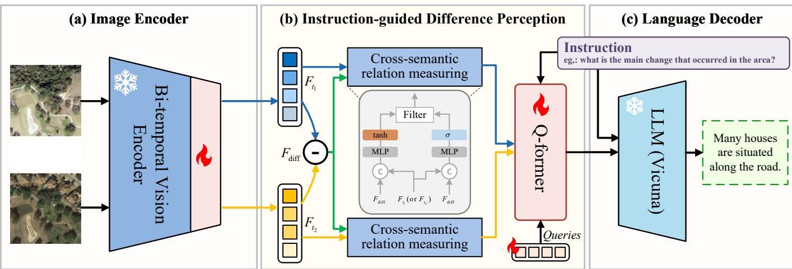
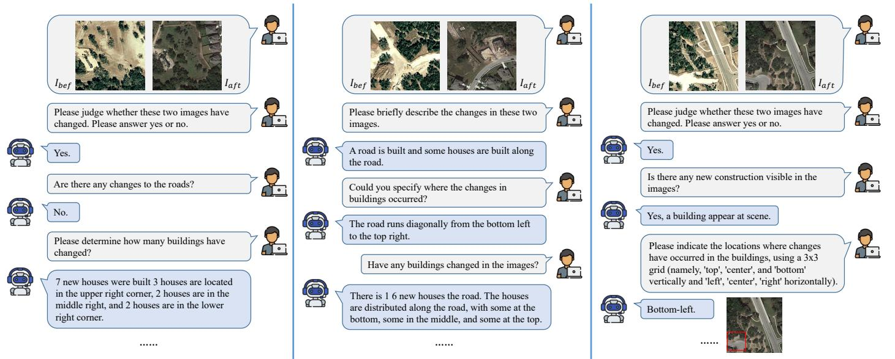

# 1. Bibliographic Information
## 1.1. Title
The paper is titled *DeltaVLM: Interactive Remote Sensing Image Change Analysis via Instruction-guided Difference Perception*. Its central topic is the development of a specialized interactive vision-language model (VLM) that enables user query-driven analysis of changes between pairs of bi-temporal remote sensing (RS) images, supporting multi-turn dialogue and diverse change-related tasks.
## 1.2. Authors
The authors are:
- Pei Deng: Core contributor to the model architecture and dataset construction.
- Wenqian Zhou: Student Member, IEEE, focused on remote sensing image processing and vision-language tasks.
- Hanlin Wu: Member, IEEE, corresponding author, leading research in remote sensing vision-language models and geospatial AI.
  No explicit institutional affiliations are provided in the preprint, but the associated public code repository confirms the team focuses on domain-adapted VLMs for remote sensing applications.
## 1.3. Journal/Conference
This work is published as a preprint on arXiv, the leading open-access preprint server for computer science, electrical engineering, and related fields. As of March 2026, it has not yet undergone formal peer review for publication in a conference or journal. arXiv preprints are widely shared and cited in the AI and remote sensing communities to disseminate early research findings.
## 1.4. Publication Year
The preprint was released on 30 July 2025.
## 1.5. Abstract
The paper addresses the limitation of existing RS change analysis methods, which only output static one-shot change masks or fixed captions and cannot support interactive, user-specific queries about temporal changes. It introduces Remote Sensing Image Change Analysis (RSICA), a new task that unifies change detection and visual question answering (VQA) to enable multi-turn, instruction-guided exploration of bi-temporal RS images. To support this task, the authors build ChangeChat-105k, a large-scale instruction-following dataset with 105,107 instruction-response pairs covering 6 interaction types. They propose DeltaVLM, an end-to-end VLM with three key innovations: a fine-tuned bi-temporal vision encoder, a cross-semantic relation measuring (CSRM) module to filter irrelevant change noise, and an instruction-guided Q-former to align change features with user queries. Trained with a frozen large language model (LLM) to optimize efficiency, DeltaVLM achieves state-of-the-art (SOTA) performance on both single-turn captioning and multi-turn interactive change analysis, outperforming general-purpose VLMs and existing RS vision-language models.
## 1.6. Original Source Link
- Preprint source: https://arxiv.org/abs/2507.22346
- PDF link: https://arxiv.org/pdf/2507.22346
- Code, dataset, and pre-trained weights: https://github.com/hanlinwu/DeltaVLM
- Publication status: Preprint, not yet formally peer-reviewed.

# 2. Executive Summary
## 2.1. Background & Motivation
### Core Problem
Existing RS change analysis tools are limited to static, predefined outputs: change detection models generate binary change masks, while change captioning models generate fixed, one-size-fits-all text descriptions of changes. None support flexible, interactive, user-specific queries about changes (e.g., "How many new buildings were built in the bottom-left grid?" or "Are there any changes to roads in this area?"), which limits their utility for real-world end users.
### Importance of the Problem
RS change analysis is critical for high-impact applications including disaster damage assessment, deforestation monitoring, urban planning, and environmental surveillance. Enabling interactive query-driven analysis would allow non-expert users to extract tailored insights from RS data without requiring specialized technical skills.
### Gaps in Prior Research
1. **Task Gap**: No unified task framework exists for interactive, multi-turn bi-temporal RS change analysis that combines change detection, captioning, and VQA capabilities.
2. **Data Gap**: No large-scale instruction-following dataset exists for training interactive RS change analysis models.
3. **Model Gap**: Existing RS VLMs are designed for single-image analysis and cannot process bi-temporal change data. General-purpose VLMs perform poorly on RS tasks due to large domain gaps (e.g., unfamiliarity with RS scene semantics, sensitivity to atmospheric/sensor noise).
### Innovative Entry Point
The work combines the strengths of change detection (spatial localization of changes) and VQA (interactive query support) into a single task paradigm, and designs a specialized VLM architecture that dynamically extracts only change features relevant to the user's instruction, filtering out irrelevant noise from seasonal, lighting, or sensor differences.
## 2.2. Main Contributions / Findings
### Primary Contributions
1. **New Task Definition**: Propose RSICA, a unified interactive task for user-driven bi-temporal RS change analysis supporting multi-turn dialogue and diverse subtasks.
2. **Large-Scale Dataset**: Construct ChangeChat-105k, the first large-scale instruction dataset for RSICA, with 105,107 instruction-response pairs covering 6 interaction types: change captioning, binary change classification, category-specific change quantification, change localization, open-ended QA, and multi-turn dialogue.
3. **Novel Model Architecture**: Propose DeltaVLM, an end-to-end VLM tailored for RSICA with three core innovations:
   - Selectively fine-tuned bi-temporal vision encoder for RS-specific feature extraction
   - CSRM module to filter irrelevant change noise and retain semantically meaningful changes
   - Instruction-guided Q-former to align change features with user queries
4. **SOTA Performance**: Comprehensive experiments confirm DeltaVLM outperforms both general-purpose SOTA VLMs and specialized RS change captioning models across all RSICA subtasks.
### Key Findings
- Domain-specific architectural components (CSRM, bi-temporal encoder fine-tuning) deliver far stronger performance on RS change tasks than off-the-shelf VLMs.
- Instruction tuning on domain-specific data eliminates the performance gap between general VLMs and specialized RS models while adding interactive capabilities.
- The CSRM module is critical for distinguishing meaningful land cover changes from irrelevant noise caused by atmospheric conditions, sensor differences, or seasonal variations.

# 3. Prerequisite Knowledge & Related Work
## 3.1. Foundational Concepts
We define all core technical terms for beginners below:
- **Remote Sensing Image (RSI)**: An image of the Earth's surface captured by satellite or aerial sensors, used to monitor land cover, environmental changes, and human activity.
- **Bi-temporal RSIs**: A pair of RS images of the exact same geographic location captured at two different points in time, used to identify changes over time.
- **Change Detection**: A RS task that identifies regions where land cover has changed between two bi-temporal images, typically outputting a binary mask where 1 indicates changed pixels and 0 indicates unchanged pixels.
- **Change Captioning**: A RS task that generates natural language descriptions of the changes between two bi-temporal images (e.g., "10 new residential buildings were constructed in the southern region, and a new road was built connecting them").
- **Visual Question Answering (VQA)**: A vision-language task where a model takes an image and a natural language question as input, and outputs a natural language answer corresponding to the image content.
- **Vision-Language Model (VLM)**: A type of AI model that processes both visual and textual inputs, trained to understand cross-modal relationships to perform tasks like image captioning, VQA, and multimodal dialogue.
- **Large Language Model (LLM)**: A large transformer-based model trained on massive text corpora, capable of generating coherent natural language, understanding user instructions, and performing reasoning tasks.
- **Instruction Tuning**: A training paradigm where a model is fine-tuned on a dataset of instruction-response pairs to improve its ability to follow diverse user instructions across multiple tasks.
- **Q-Former**: A query-based transformer module first introduced in InstructBLIP, used to extract visual features relevant to a given user instruction, aligning visual and textual modalities efficiently.
- **Cross-Attention**: A transformer attention mechanism where queries from one modality (e.g., text instructions) attend to keys and values from another modality (e.g., image features), enabling cross-modal alignment. The standard scaled dot-product attention formula used in cross-attention is:
  \$
  \mathrm{Attention}(Q, K, V) = \mathrm{softmax}\left(\frac{QK^T}{\sqrt{d_k}}\right)V
  \$
  Where $Q$ = query matrix, $K$ = key matrix, $V$ = value matrix, and $d_k$ = dimension of the key vectors. The $\sqrt{d_k}$ scaling factor prevents large dot product values from making the softmax output overly sharp.
## 3.2. Previous Works
The paper builds on four core areas of prior research:
1. **Change Detection**:
   - Traditional methods: Early algebraic methods (image differencing, change vector analysis) were simple but sensitive to noise. Later index-based, transformation-based, and object-based methods improved robustness but lacked semantic understanding of changes.
   - Deep learning methods: Siamese CNNs, U-Net architectures, and transformer-based models significantly improved change localization accuracy, but only output binary masks with no semantic interpretation.
2. **Change Captioning**:
   - Early encoder-decoder models used CNNs for visual encoding and RNNs for text generation, but failed to model global semantic relationships.
   - Recent three-stage models (visual encoding → bi-temporal feature fusion → transformer-based language decoding) improved caption quality, but only generate fixed static captions with no interactive support.
   - LLM-based change captioning models leverage pre-trained LLMs for better generation quality, but still only support fixed captioning tasks, not diverse user queries.
3. **RS Visual Question Answering (RSVQA)**:
   - RSVQA extends VQA to RS images, allowing users to query single RS images with natural language. Existing methods use encoder-fusion-decoder architectures, but all are designed for single-image analysis and cannot process bi-temporal change data.
4. **RS Vision-Language Models**:
   - Recent RS-specific VLMs (GeoChat, RSGPT, RS-LLaVA) adapt general VLMs to RS tasks via domain instruction tuning, but all support only single-image analysis and cannot handle bi-temporal change tasks. The closest prior work is ChangeChat (by the same authors), an initial interactive change analysis model, but it lacks instruction-guided difference feature extraction, leading to subpar performance.
## 3.3. Technological Evolution
The evolution of RS change analysis follows this timeline:
1. **1990s–2010s**: Only change detection methods exist, outputting binary masks with no semantic interpretation.
2. **2020s**: Change captioning emerges, generating static text descriptions of changes, but no interactivity.
3. **2021–2023**: RSVQA enables querying of single RS images, but no temporal change support.
4. **2023–2024**: General VLMs (GPT-4V, LLaVA) demonstrate interactive capabilities, but perform poorly on RS tasks due to domain gaps. RS-specific VLMs are developed for single-image tasks, but do not support bi-temporal analysis.
5. **2025 (this work)**: First interactive VLM for bi-temporal RS change analysis, filling the gap between static change analysis and interactive query support.
## 3.4. Differentiation Analysis
Compared to prior work, DeltaVLM has three core differentiators:
- vs general-purpose VLMs (GPT-4o, Qwen-VL): DeltaVLM is fine-tuned on RS domain data, has specialized bi-temporal difference perception modules, and outperforms general VLMs by 30–60% across most RS change tasks.
- vs specialized RS change captioning models (RSICCFormer, SFT): These models only generate fixed static captions, while DeltaVLM supports diverse interactive queries, multi-turn dialogue, and still outperforms them on captioning metrics.
- vs RS single-image VLMs (GeoChat, RSGPT): These models cannot process bi-temporal images or analyze temporal changes, and lack the CSRM module to filter change-related noise.
- vs prior ChangeChat work: DeltaVLM adds the CSRM module and instruction-guided Q-former to extract query-relevant difference features, improving performance by 4–9% across all tasks, and the new ChangeChat-105k dataset is larger and covers more task types.

# 4. Methodology
## 4.1. Principles
The core idea of DeltaVLM is to build an end-to-end interactive VLM that dynamically extracts only change features relevant to the user's instruction, filters out irrelevant noise (from atmospheric, seasonal, or sensor differences), and generates natural language responses aligned with the user's query.
### Theoretical Basis
The architecture leverages three well-established principles:
1. **Selective fine-tuning**: Only fine-tuning the top layers of a pre-trained vision encoder adapts it to the RS domain without catastrophic forgetting of general visual features.
2. **Gated feature filtering**: Gating mechanisms (inspired by GRUs) are used to suppress irrelevant change noise and retain only semantically meaningful land cover changes.
3. **Query-based cross-modal alignment**: A Q-former module uses learnable queries to extract only visual features relevant to the user's instruction, reducing computational overhead and improving alignment between visual and textual modalities.
4. **Frozen LLM decoding**: Using a frozen pre-trained LLM for text generation maximizes efficiency by avoiding full LLM fine-tuning, while still leveraging strong language generation capabilities.
## 4.2. Core Methodology In-depth
The following figure (Figure 4 from the original paper) shows the end-to-end architecture of DeltaVLM:

*该图像是示意图，展示了 DeltaVLM 模型的结构，包括三个组件：图像编码器、指令引导的差异感知模块和语言解码器。图像编码器使用双时间视觉编码器处理多时相卫星影像，指令引导模块通过交叉语义关系测量提取差异信息，最终将结果传递给语言解码器以生成文本响应。*

DeltaVLM follows three sequential stages: (1) bi-temporal visual feature encoding, (2) instruction-guided difference feature extraction, (3) LLM-based language decoding. We break down each stage below, integrating all formulas exactly as presented in the original paper.
---
### Stage 1: Bi-temporal Vision Encoding (Bi-VE)
This stage extracts semantic visual features from the input bi-temporal image pair, using a selectively fine-tuned vision transformer backbone.
1. **Backbone Selection**: The EVA-ViT-g/14 pre-trained vision transformer is used as the encoder backbone. To avoid catastrophic forgetting of general visual features, only the final 2 transformer layers are fine-tuned, while the first 37 layers are frozen.
2. **Input Processing**: The input is a pair of bi-temporal RS images $I_{t_1}, I_{t_2} \in \mathbb{R}^{H \times W \times 3}$, where $t_1$ is the earlier time, $t_2$ is the later time, $H$ and $W$ are the image height and width, and 3 corresponds to RGB channels. Each image is processed independently to avoid early fusion bias in initial feature extraction.
3. **Feature Extraction**: Each image is split into 16×16 patch embeddings, then passed through the ViT encoder. Features are extracted from the second-to-last layer (bypassing the classification head) to get task-specific semantic features. The exact formulas from the paper are:
   \$
   F_{t_1} = \Phi_{\mathrm{ViT}}(I_{t_1}; \Theta_{\mathrm{fine-tuned}}) \in \mathbb{R}^{\frac{H}{16} \times \frac{W}{16} \times D}
   \$
   \$
   F_{t_2} = \Phi_{\mathrm{ViT}}(I_{t_2}; \Theta_{\mathrm{fine-tuned}}) \in \mathbb{R}^{\frac{H}{16} \times \frac{W}{16} \times D}
   \$
   Where:
   - $\Phi_{\mathrm{ViT}}$ = EVA-ViT-g/14 encoder function
   - $\Theta_{\mathrm{fine-tuned}}$ = parameters of the 2 fine-tuned top layers of the ViT
   - $D$ = hidden dimension of the ViT feature output
   - The spatial resolution of the output features is reduced by a factor of 16 due to patch-based processing.
     ---
### Stage 2: Instruction-guided Difference Perception Module (IDPM)
This module extracts change features relevant to the user's instruction, filtering out irrelevant noise. It has two sub-components: the Cross-Semantic Relation Measuring (CSRM) mechanism, and the instruction-guided Q-former.
#### Sub-component 2.1: Cross-Semantic Relation Measuring (CSRM)
The CSRM module filters out irrelevant change noise (e.g., from lighting, seasonal changes, sensor differences) and retains only semantically meaningful land cover changes. It follows four steps:
1. **Raw Difference Calculation**: Compute the pixel-level difference between the two temporal feature maps:
   \$
   F_{\mathrm{diff}} = F_{t_2} - F_{t_1}
   \$
   Where $F_{\mathrm{diff}} \in \mathbb{R}^{N \times D}$ (with $N = \frac{H}{16} \times \frac{W}{16}$) captures all pixel-level changes between the two images, including both meaningful changes and noise.
2. **Contextualizing**: Fuse difference features with original features to generate context vectors that capture how changes relate to each temporal state:
   \$
   C_{t_1} = \tanh(W_c [F_{\mathrm{diff}}; F_{t_1}] + b_c)
   \$
   \$
   C_{t_2} = \tanh(W_c' [F_{\mathrm{diff}}; F_{t_2}] + b_c')
   \$
   Where:
   - $[\cdot; \cdot]$ = channel-wise concatenation of feature tensors
   - $W_c, W_c' \in \mathbb{R}^{D \times 2D}$ and $b_c, b_c' \in \mathbb{R}^D$ = learnable weight and bias parameters
   - $\tanh$ activation compresses output values to the range $[-1, 1]$, emphasizing semantic connections between difference features and original temporal features.
3. **Gating**: Generate relevance gate vectors to weight each detected change by its semantic importance, inspired by gated recurrent unit (GRU) gates:
   \$
   G_{t_1} = \sigma(W_g [F_{\mathrm{diff}}; F_{t_1}] + b_g)
   \$
   \$
   G_{t_2} = \sigma(W_g' [F_{\mathrm{diff}}; F_{t_2}] + b_g')
   \$
   Where:
   - $\sigma$ = sigmoid activation function, which outputs values in the range $(0,1)$ as relevance scores (higher values mean the change is more semantically relevant)
   - $W_g, W_g' \in \mathbb{R}^{D \times 2D}$ and $b_g, b_g' \in \mathbb{R}^D$ = learnable weight and bias parameters
4. **Filtering**: Selectively retain only semantically relevant changes via element-wise multiplication of gate vectors and context vectors:
   \$
   F_{t_1}' = G_{t_1} \odot C_{t_1}
   \$
   \$
   F_{t_2}' = G_{t_2} \odot C_{t_2}
   \$
   Where $\odot$ = element-wise multiplication operation. This step suppresses irrelevant noise components with low gate values, while preserving important changes (e.g., new buildings, road construction) with high gate values. The filtered features $F_{t_1}'$ and $F_{t_2}'$ are passed to the Q-former module.
#### Sub-component 2.2: Instruction-guided Q-former
The Q-former aligns filtered visual features with the user's instruction, extracting only change features relevant to the user's query, inspired by the InstructBLIP Q-former design.
1. **Input**: The module takes three inputs:
   - Concatenated filtered features $[F_{t_1}'; F_{t_2}']$
   - User instruction text $P$
   - Learnable query embeddings $Q \in \mathbb{R}^{L \times d}$, where $L=32$ (fixed number of queries) and $d$ is the feature dimension matching the LLM's input space.
2. **Self-Attention Refinement**: First, the learnable queries are refined via self-attention to capture global query relationships:
   \$
   Q_{\mathrm{SA}} = \mathrm{SelfAttention}(Q)
   \$
   Where $\mathrm{SelfAttention}$ uses the standard scaled dot-product attention formula defined in Section 3.1.
3. **Cross-Attention Alignment**: The refined queries attend to both the concatenated filtered visual features and the instruction embeddings via cross-attention, dynamically aligning change features with the user's query:
   \$
   Q_{\mathrm{CA}} = \mathrm{CrossAttention}(Q_{\mathrm{SA}}, [F_{t_1}'; F_{t_2}'], P)
   \$
4. **Final Feature Projection**: The aligned queries are passed through a feed-forward network (FFN) to generate compact, instruction-aligned difference features:
   \$
   \hat{F}_{\mathrm{diff}} = \mathrm{FFN}(Q_{\mathrm{CA}}) \in \mathbb{R}^{32 \times d}
   \$
   These features are ready for input to the LLM decoder.
---
### Stage 3: LLM-based Language Decoder
A frozen Vicuna-7B LLM is used for language generation to optimize training efficiency (only alignment modules are trained, not the full LLM).
1. **Instruction Embedding**: The user's text instruction $P$ is tokenized and embedded using the LLM's built-in embedding function:
   \$
   E = \Phi_{\mathrm{embedding}}(P)
   \$
   Where $\Phi_{\mathrm{embedding}}$ is the LLM's tokenizer and embedding layer, converting raw text into a sequence of token embeddings $E$.
2. **Response Generation**: The concatenated instruction-aligned visual features $\hat{F}_{\mathrm{diff}}$ and instruction embeddings $E$ are fed into the frozen LLM to generate the natural language response:
   \$
   T = \Phi_{\mathrm{LLM}}(\hat{F}_{\mathrm{diff}}, E) \in \mathcal{C}^N
   \$
   Where:
   - $\Phi_{\mathrm{LLM}}$ = frozen Vicuna-7B decoder function
   - $\mathcal{C}$ = LLM vocabulary set
   - $T$ = output sequence of $N$ tokens, the natural language response to the user's query.
     ---
### Training Objective
DeltaVLM is trained on instruction-response pairs using standard cross-entropy loss:
\$
\mathcal{L}_{\mathrm{train}} = -\frac{1}{K} \sum_{i=1}^{K} w_i \log(\hat{w}_i)
\$
Where:
- $K$ = total number of tokens in the target response
- $w_i$ = one-hot encoded ground truth token at position $i$
- $\hat{w}_i$ = model's predicted probability for the token at position $i$
  Minimizing this loss trains the model to generate accurate, instruction-aligned natural language responses.

# 5. Experimental Setup
## 5.1. Datasets
The experiments use the self-constructed ChangeChat-105k dataset, built from two public RS change datasets:
1. **LEVIR-CC**: A public RS change captioning dataset with 10,077 bi-temporal 256×256 RS image pairs (0.5m/pixel resolution), each annotated with 5 human-written change captions.
2. **LEVIR-MCI**: An extension of LEVIR-CC that adds pixel-level change maps and object-level change annotations for roads and buildings.
### Dataset Construction
ChangeChat-105k is generated via a hybrid pipeline:
- Rule-based generation for structured tasks (change captioning, binary classification, quantification, localization, multi-turn dialogue) using LEVIR-MCI's pixel-level annotations and OpenCV-based contour detection.
- GPT-assisted generation for open-ended QA tasks, using ChatGPT's in-context learning with seed examples derived from captions and change annotations.
### Dataset Statistics
ChangeChat-105k contains 105,107 instruction-response pairs, split into 87,935 training samples and 17,172 test samples, covering 6 interaction types. The following are the statistics from Table 1 of the original paper:

<table>
<thead>
<tr>
<th>Instruction Type</th>
<th>Source Data</th>
<th>Generation Method</th>
<th>Response Format</th>
<th>Training Set</th>
<th>Test Set</th>
</tr>
</thead>
<tbody>
<tr>
<td>Change Captioning</td>
<td>LEVIR-CC</td>
<td>Rule-based</td>
<td>Descriptive Text</td>
<td>34,075</td>
<td>1,929</td>
</tr>
<tr>
<td>Binary Change Classification</td>
<td>LEVIR-MCI</td>
<td>Rule-based</td>
<td>Yes/No Response</td>
<td>6,815</td>
<td>1,929</td>
</tr>
<tr>
<td>Category-specific Change Quantification</td>
<td>LEVIR-MCI</td>
<td>Rule-based</td>
<td>Object Count</td>
<td>6,815</td>
<td>1,929</td>
</tr>
<tr>
<td>Change Localization</td>
<td>LEVIR-MCI</td>
<td>Rule-based</td>
<td>Grid Location</td>
<td>6,815</td>
<td>1,929</td>
</tr>
<tr>
<td>Open-ended QA</td>
<td>Derived (LEVIR-CC/MCI)</td>
<td>GPT-assisted</td>
<td>Q&A Pair</td>
<td>26,600</td>
<td>7,527</td>
</tr>
<tr>
<td>Multi-turn Conversation</td>
<td>Derived (LEVIR-MCI)</td>
<td>Rule-based</td>
<td>Multi-turn Dialogue</td>
<td>6,815</td>
<td>1,929</td>
</tr>
<tr>
<td>Total</td>
<td>−</td>
<td>−</td>
<td>−</td>
<td>87,935</td>
<td>17,172</td>
</tr>
</tbody>
</table>

### Dataset Example
A sample multi-turn dialogue instruction sequence from the dataset is:
1. Q1: "Please judge whether these two images have changed. Please answer yes or no."
2. Q2: "If changes have occurred, count the number of road and building changes separately."
3. Q3: "Based on the above analysis, please describe the changes of these two images in detail."
### Rationale for Dataset Selection
ChangeChat-105k is the first large-scale instruction dataset for interactive RS change analysis, covering all subtasks of the proposed RSICA task. It is specifically designed to validate interactive change analysis capabilities, making it the ideal choice for the experiments.
## 5.2. Evaluation Metrics
We explain each evaluation metric used in the paper with its definition, formula, and symbol explanations:
### Change Captioning Metrics
All captioning metrics range from 0 to 100, with higher values indicating better performance.
1. **BLEU (Bilingual Evaluation Understudy)**: Measures n-gram overlap between generated captions and ground truth reference captions, with BLEU-1/2/3/4 corresponding to 1-gram (single word) to 4-gram (four-word phrase) overlap.
   Formula:
   \$
   \mathrm{BLEU-N} = \mathrm{BP} \times \exp\left(\sum_{n=1}^{N} w_n \log p_n\right)
   \$
   Where:
   - $\mathrm{BP} = \min(1, \exp(1 - \frac{\text{length of reference caption}}{\text{length of generated caption}}))$ = brevity penalty, penalizes excessively short generated captions
   - $p_n$ = n-gram precision, the fraction of n-grams in the generated caption that appear in any reference caption
   - $w_n$ = weight for each n-gram, set to $1/N$ for equal weighting.
2. **METEOR (Metric for Evaluation of Translation with Explicit Ordering)**: Measures unigram overlap, synonym matching, and word order alignment, with higher correlation to human judgment than BLEU.
   Formula:
   \$
   \mathrm{METEOR} = F \times (1 - \text{Penalty})
   \$
   Where:
   - $F = \frac{PR}{(\alpha P + (1-\alpha) R)}$ with $\alpha=0.9$, $P$ = unigram precision, $R$ = unigram recall
   - Penalty = penalty for word order differences between generated and reference captions.
3. **ROUGE-L (Recall-Oriented Understudy for Gisting Evaluation - Longest Common Subsequence)**: Measures the longest common subsequence between generated and reference captions, focusing on recall of core content.
   Formula:
   \$
   \mathrm{ROUGE-L} = \frac{(1+\beta^2) R_L P_L}{R_L + \beta^2 P_L}
   \$
   Where:
   - $R_L$ = recall of longest common subsequence (length of LCS / length of reference caption)
   - $P_L$ = precision of longest common subsequence (length of LCS / length of generated caption)
   - $\beta=1.2$ to weight recall more heavily than precision.
4. **CIDEr (Consensus-based Image Description Evaluation)**: Measures consensus of the generated caption against multiple reference captions, using TF-IDF weighting for n-grams to prioritize rare, meaningful phrases.
   Formula:
   \$
   \mathrm{CIDEr}(c_i, C_i) = \frac{1}{N} \sum_{n=1}^{N} \frac{g^n(c_i) \cdot g^n(C_i)}{||g^n(c_i)|| ||g^n(C_i)||}
   \$
   Where:
   - $g^n(x)$ = TF-IDF vector of n-grams for sequence $x$
   - $c_i$ = generated caption, $C_i$ = set of reference captions, $N=4$.
     ---
### Binary Change Classification Metrics
All classification metrics range from 0 to 100%, with higher values indicating better performance.
1. **Accuracy**: Percentage of total predictions that are correct.
   Formula: $\mathrm{Accuracy} = \frac{TP + TN}{TP + TN + FP + FN}$
   Where:
   - `TP` = True Positive: correctly predicted changed sample
   - `TN` = True Negative: correctly predicted unchanged sample
   - `FP` = False Positive: predicted change when no change occurred
   - `FN` = False Negative: predicted no change when change occurred.
2. **Precision**: Percentage of predicted change samples that are actual changes, measuring the model's ability to avoid false positives.
   Formula: $\mathrm{Precision} = \frac{TP}{TP + FP}$
3. **Recall**: Percentage of actual change samples that are correctly predicted, measuring the model's ability to avoid false negatives.
   Formula: $\mathrm{Recall} = \frac{TP}{TP + FN}$
4. **F1-Score**: Harmonic mean of precision and recall, balancing both metrics for imbalanced datasets.
   Formula: $\mathrm{F1} = \frac{2 \times \mathrm{Precision} \times \mathrm{Recall}}{\mathrm{Precision} + \mathrm{Recall}}$
---
### Change Quantification Metrics
All quantification metrics are error values, with lower values indicating better performance.
1. **MAE (Mean Absolute Error)**: Average absolute difference between predicted object counts and ground truth counts.
   Formula: $\mathrm{MAE} = \frac{1}{M} \sum_{i=1}^{M} |y_i - \hat{y}_i|$
   Where $M$ = number of samples, $y_i$ = ground truth count, $\hat{y}_i$ = predicted count.
2. **RMSE (Root Mean Squared Error)**: Square root of the average squared difference between predicted and ground truth counts, penalizing large counting errors more heavily than MAE.
   Formula: $\mathrm{RMSE} = \sqrt{\frac{1}{M} \sum_{i=1}^{M} (y_i - \hat{y}_i)^2}$
---
### Change Localization Metrics
1. **Precision, Recall, F1-Score**: Same definition as classification metrics, applied to 3×3 grid cell change predictions.
2. **Jaccard Similarity (Intersection over Union)**: Intersection of predicted changed grid cells and ground truth changed grid cells divided by their union, measuring spatial overlap. Ranges from 0 to 100%, higher is better.
   Formula: $\mathrm{Jaccard} = \frac{|A \cap B|}{|A \cup B|} \times 100\%$
   Where $A$ = set of predicted changed cells, $B$ = set of ground truth changed cells.
3. **Subset Accuracy**: Percentage of samples where all predicted changed grid cells exactly match the ground truth, ranging from 0 to 100%, higher is better.
## 5.3. Baselines
The paper compares DeltaVLM against two groups of representative baselines:
1. **General-purpose SOTA VLMs**: GPT-4o, Qwen-VL-Plus, GLM-4V-Plus, Gemini-1.5-Pro. These are leading general VLMs tested in zero-shot settings to quantify the performance gap between general and domain-specific models for RS change tasks.
2. **Specialized RS change captioning models**: RSICCFormer, PromptCC, PSNet, SFT. These are SOTA static change captioning models designed specifically for RS imagery, used to compare DeltaVLM's captioning performance against existing specialized methods.

# 6. Results & Analysis
## 6.1. Core Results Analysis
The following figure (Figure 1 from the original paper) provides a high-level overview of DeltaVLM's performance compared to SOTA VLMs across 5 core RS change tasks:

*该图像是一个雷达图，展示了 DeltaVLM 与其他前沿 VLM 在五个遥感变化分析任务上的性能对比。图中每个轴对应一个特定任务的指标，包括标题生成（BLEU-1）、分类（精确度）、量化（Road's MAE）、定位（F1-score）和开放式问答（BLEU-1）。*

DeltaVLM outperforms all baselines across all task axes, confirming its strong overall performance. We analyze task-specific results in detail below.
---
### Change Captioning Task Results
The following are the results from Table 2 of the original paper:

<table>
<thead>
<tr>
<th>Category</th>
<th>Method</th>
<th>BLEU-1</th>
<th>BLEU-2</th>
<th>BLEU-3</th>
<th>BLEU-4</th>
<th>METEOR</th>
<th>ROUGE-L</th>
<th>CIDEr-D</th>
</tr>
</thead>
<tbody>
<tr>
<td rowspan="4">VLMs</td>
<td>GPT-4o [49]</td>
<td>46.03</td>
<td>33.09</td>
<td>24.66</td>
<td>18.05</td>
<td>22.50</td>
<td>56.49</td>
<td>90.92</td>
</tr>
<tr>
<td>Qwen-VL-Plus [50]</td>
<td>41.31</td>
<td>33.19</td>
<td>27.96</td>
<td>22.95</td>
<td>18.04</td>
<td>51.24</td>
<td>92.99</td>
</tr>
<tr>
<td>GLM-4V-Plus [51]</td>
<td>35.59</td>
<td>24.26</td>
<td>18.54</td>
<td>13.85</td>
<td>20.13</td>
<td>54.39</td>
<td>93.16</td>
</tr>
<tr>
<td>Gemini-1.5-Pro [52]</td>
<td>45.68</td>
<td>33.59</td>
<td>25.53</td>
<td>19.01</td>
<td>22.64</td>
<td>56.25</td>
<td>91.37</td>
</tr>
<tr>
<td rowspan="4">RS Change Captioning Models</td>
<td>RSICCFormer [8]</td>
<td>84.72</td>
<td>76.27</td>
<td>68.87</td>
<td>62.77</td>
<td>39.61</td>
<td>74.12</td>
<td>134.12</td>
</tr>
<tr>
<td>PromptCC [35]</td>
<td>83.66</td>
<td>75.73</td>
<td>69.10</td>
<td>63.54</td>
<td>38.82</td>
<td>73.72</td>
<td>136.44</td>
</tr>
<tr>
<td>SNet [34]</td>
<td>83.86</td>
<td>75.13</td>
<td>67.89</td>
<td>62.11</td>
<td>38.80</td>
<td>73.60</td>
<td>132.62</td>
</tr>
<tr>
<td>SFT [33]</td>
<td>84.56</td>
<td>75.87</td>
<td>68.64</td>
<td>62.87</td>
<td>39.93</td>
<td>74.69</td>
<td>137.05</td>
</tr>
<tr>
<td></td>
<td>Ours</td>
<td>85.78</td>
<td>77.15</td>
<td>69.24</td>
<td>62.51</td>
<td>39.47</td>
<td>75.01</td>
<td>136.72</td>
</tr>
</tbody>
</table>

Analysis:
- General VLMs perform very poorly, with BLEU-4 scores ranging from 13.85 to 22.95, compared to ~62 for RS-specific models, confirming the large domain gap between general VLMs and RS tasks.
- DeltaVLM achieves SOTA performance in BLEU-1, BLEU-2, BLEU-3, and ROUGE-L, outperforming all other RS change captioning models. While SFT has slightly higher BLEU-4, METEOR, and CIDEr scores (likely due to its optimization for n-gram consensus during training), DeltaVLM's higher early n-gram scores indicate it generates more accurate word-level and phrase-level descriptions aligned with user queries. Critically, unlike all other RS change captioning models, DeltaVLM also supports interactive queries and multi-turn dialogue, not just fixed caption generation.
  ---
### Binary Change Classification Results
The following are the results from Table 3 of the original paper:

<table>
<thead>
<tr>
<th>Method</th>
<th>Accuracy (%)</th>
<th>Precision (%)</th>
<th>Recall (%)</th>
<th>F1 (%)</th>
</tr>
</thead>
<tbody>
<tr>
<td>GPT-4o [49]</td>
<td>84.81</td>
<td>83.58</td>
<td>86.62</td>
<td>85.07</td>
</tr>
<tr>
<td>Qwen-VL-Plus [50]</td>
<td>58.22</td>
<td>73.65</td>
<td>25.52</td>
<td>37.90</td>
</tr>
<tr>
<td>GLM-4V-Plus [51]</td>
<td>79.83</td>
<td>88.38</td>
<td>68.67</td>
<td>77.29</td>
</tr>
<tr>
<td>Gemini-1.5-Pro [52]</td>
<td>83.83</td>
<td>84.03</td>
<td>83.51</td>
<td>83.77</td>
</tr>
<tr>
<td>Ours</td>
<td>93.99</td>
<td>96.29</td>
<td>91.49</td>
<td>93.83</td>
</tr>
</tbody>
</table>

Analysis:
- DeltaVLM outperforms all general VLMs by large margins: 8.76% higher F1 score than the best baseline (GPT-4o), and 9.18% higher accuracy. Its balanced precision (96.29%) and recall (91.49%) indicate it correctly identifies changes with very few false positives or false negatives.
- Qwen-VL-Plus shows extreme bias toward predicting "no change", leading to very low recall (25.52%) and poor overall performance.
  ---
### Change Quantification Results
The following are the results from Table 4 of the original paper:

<table>
<thead>
<tr>
<th>Method</th>
<th colspan="2">Roads</th>
<th colspan="2">Buildings</th>
</tr>
<tr>
<th></th>
<th>MAE</th>
<th>RMSE</th>
<th>MAE</th>
<th>RMSE</th>
</tr>
</thead>
<tbody>
<tr>
<td>GPT-4o [49]</td>
<td>0.49</td>
<td>1.00</td>
<td>1.86</td>
<td>4.57</td>
</tr>
<tr>
<td>Qwen-VL-Plus [50]</td>
<td>0.90</td>
<td>1.50</td>
<td>4.41</td>
<td>9.03</td>
</tr>
<tr>
<td>GLM-4V-Plus [51]</td>
<td>0.82</td>
<td>1.62</td>
<td>2.05</td>
<td>4.61</td>
</tr>
<tr>
<td>Gemini-1.5-Pro [52]</td>
<td>0.58</td>
<td>1.25</td>
<td>2.56</td>
<td>8.71</td>
</tr>
<tr>
<td>Ours</td>
<td>0.24</td>
<td>0.70</td>
<td>1.32</td>
<td>2.89</td>
</tr>
</tbody>
</table>

Analysis:
- DeltaVLM achieves the lowest errors for both road and building counting: 51% lower MAE for roads than the best baseline (GPT-4o), and 29% lower MAE for buildings than GPT-4o, with an average 35% improvement across all quantification metrics.
- All models perform worse on building counting than road counting, because buildings have diverse shapes, sizes, and occlusion patterns, while roads are relatively uniform linear structures. This result confirms the CSRM module effectively filters irrelevant noise and focuses on counting task-relevant objects.
  ---
### Change Localization Results
The following are the results from Table 5 of the original paper:

<table>
<thead>
<tr>
<th>Category</th>
<th>Method</th>
<th>Prec.¹</th>
<th>Rec.²</th>
<th>F1³</th>
<th>J. Sim.⁴</th>
<th>S. Acc.⁵</th>
</tr>
</thead>
<tbody>
<tr>
<td rowspan="5">Roads</td>
<td>GPT-4o [49]</td>
<td>30.44</td>
<td>27.01</td>
<td>28.62</td>
<td>7.80</td>
<td>33.85</td>
</tr>
<tr>
<td>Qwen-VL-Plus [50]</td>
<td>15.42</td>
<td>1.40</td>
<td>2.56</td>
<td>0.25</td>
<td>67.19</td>
</tr>
<tr>
<td>GLM-4V-Plus [51]</td>
<td>21.99</td>
<td>33.32</td>
<td>26.49</td>
<td>7.93</td>
<td>6.79</td>
</tr>
<tr>
<td>Gemini-1.5-Pro [52]</td>
<td>43.01</td>
<td>40.55</td>
<td>41.74</td>
<td>9.62</td>
<td>48.63</td>
</tr>
<tr>
<td>Ours</td>
<td>69.63</td>
<td>66.32</td>
<td>67.94</td>
<td>14.00</td>
<td>70.92</td>
</tr>
<tr>
<td rowspan="5">Buildings</td>
<td>GPT-4o [49]</td>
<td>55.63</td>
<td>33.70</td>
<td>41.98</td>
<td>14.09</td>
<td>41.47</td>
</tr>
<tr>
<td>Qwen-VL-Plus [50]</td>
<td>22.23</td>
<td>20.78</td>
<td>21.48</td>
<td>6.52</td>
<td>7.26</td>
</tr>
<tr>
<td>GLM-4V-Plus [51]</td>
<td>38.98</td>
<td>57.83</td>
<td>46.57</td>
<td>17.93</td>
<td>17.11</td>
</tr>
<tr>
<td>Gemini-1.5-Pro [52]</td>
<td>65.71</td>
<td>51.75</td>
<td>57.90</td>
<td>18.62</td>
<td>45.62</td>
</tr>
<tr>
<td>Ours</td>
<td>77.79</td>
<td>80.22</td>
<td>78.99</td>
<td>23.15</td>
<td>65.53</td>
</tr>
</tbody>

<tfoot>
<tr>
<td colspan="7">¹ Precision (%), ² Recall (%), ³ F1-Score (%), ⁴ Jaccard similarity (%), ⁵ Subset accuracy (%)</td>
</tr>
</tfoot>
</table>
Analysis:
- DeltaVLM outperforms all baselines by large margins: 26.2% higher F1 score for roads than the best baseline (Gemini-1.5-Pro), and 21.09% higher F1 score for buildings than Gemini-1.5-Pro.
- General VLMs perform very poorly on localization, as they lack dedicated change localization mechanisms for RS imagery. DeltaVLM's strong performance confirms its ability to accurately locate changed regions aligned with user queries.
  ---
### Open-ended QA Results
The following are the results from Table 6 of the original paper:

<table>
<thead>
<tr>
<th>Method</th>
<th>B-1¹</th>
<th>B-2¹</th>
<th>B-3¹</th>
<th>B-4¹</th>
<th>MTR²</th>
<th>R-L³</th>
<th>C-D⁴</th>
</tr>
</thead>
<tbody>
<tr>
<td>GPT-4o [49]</td>
<td>33.08</td>
<td>21.08</td>
<td>14.06</td>
<td>9.68</td>
<td>22.24</td>
<td>35.53</td>
<td>72.58</td>
</tr>
<tr>
<td>Qwen-VL-Plus [50]</td>
<td>24.75</td>
<td>12.55</td>
<td>6.70</td>
<td>3.88</td>
<td>16.69</td>
<td>27.74</td>
<td>27.22</td>
</tr>
<tr>
<td>GLM-4V-Plus [51]</td>
<td>34.27</td>
<td>22.38</td>
<td>15.66</td>
<td>11.43</td>
<td>22.48</td>
<td>37.11</td>
<td>100.66</td>
</tr>
<tr>
<td>Gemini-1.5-Pro [52]</td>
<td>32.90</td>
<td>20.44</td>
<td>13.38</td>
<td>9.06</td>
<td>21.85</td>
<td>35.19</td>
<td>68.64</td>
</tr>
<tr>
<td>Ours</td>
<td>36.67</td>
<td>27.09</td>
<td>20.62</td>
<td>16.21</td>
<td>17.85</td>
<td>32.60</td>
<td>127.38</td>
</tr>
</tbody>

<tfoot>
<tr>
<td colspan="8">¹ BLEU-1/2/3/4, ² METEOR, ³ ROUGE-L, ⁴ CIDEr-D</td>
</tr>
</tfoot>
</table>
Analysis:
- DeltaVLM outperforms all baselines in BLEU-1/2/3/4 and CIDEr-D, which measure n-gram overlap and consensus with human-written answers, indicating it generates more accurate and relevant responses to open-ended user queries.
- GLM-4V-Plus has higher METEOR and ROUGE-L scores but lower CIDEr scores, meaning its responses are less aligned with human consensus for RS-specific queries.
  ---
### Multi-turn Dialogue Capability
The following figure (Figure 5 from the original paper) demonstrates DeltaVLM's unique multi-turn dialogue capability, which no baseline model supports:

*该图像是示意图，展示了DeltaVLM在多轮对话中的能力。图中显示了三轮关于卫星图像变化的对话，用户询问了道路和建筑物的变化，系统根据给定的图像提供了详细的描述和判断。*

The example shows DeltaVLM can maintain conversational context across multiple sequential queries, answering questions about change detection, counting, localization, and description in a single dialogue session.
## 6.2. Ablation Studies
The authors conducted ablation studies to verify the effectiveness of two core components: the CSRM module and bi-temporal vision encoder (Bi-VE) fine-tuning.
### Change Captioning Ablation Results
The following are the results from Table 7 of the original paper:

<table>
<thead>
<tr>
<th>Method</th>
<th>B-1¹</th>
<th>B-2¹</th>
<th>B-3¹</th>
<th>B-4¹</th>
<th>MTR²</th>
<th>R-L³</th>
<th>C-D⁴</th>
</tr>
</thead>
<tbody>
<tr>
<td>w/o CSRM</td>
<td>64.42</td>
<td>56.52</td>
<td>53.08</td>
<td>51.40</td>
<td>29.31</td>
<td>60.54</td>
<td>101.92</td>
</tr>
<tr>
<td>w/o Bi-VE FT</td>
<td>84.24</td>
<td>75.62</td>
<td>67.91</td>
<td>61.40</td>
<td>39.29</td>
<td>74.73</td>
<td>134.76</td>
</tr>
<tr>
<td>DeltaVLM</td>
<td>85.78</td>
<td>77.15</td>
<td>69.24</td>
<td>62.51</td>
<td>39.47</td>
<td>75.01</td>
<td>136.72</td>
</tr>
</tbody>

<tfoot>
<tr>
<td colspan="8">¹ BLEU-1/2/3/4, ² METEOR, ³ ROUGE-L, ⁴ CIDEr-D</td>
</tr>
</tfoot>
</table>
### Binary Change Classification Ablation Results
The following are the results from Table 8 of the original paper:

<table>
<thead>
<tr>
<th>Method</th>
<th>Accuracy (%)</th>
<th>Precision (%)</th>
<th>Recall (%)</th>
<th>F1 (%)</th>
</tr>
</thead>
<tbody>
<tr>
<td>w/o CSRM</td>
<td>50.13</td>
<td>75.00</td>
<td>0.31</td>
<td>0.62</td>
</tr>
<tr>
<td>w/o Bi-VE FT</td>
<td>90.57</td>
<td>99.49</td>
<td>81.54</td>
<td>89.62</td>
</tr>
<tr>
<td>DeltaVLM</td>
<td>93.99</td>
<td>96.29</td>
<td>91.49</td>
<td>93.83</td>
</tr>
</tbody>
</table>

Analysis:
1. **Impact of CSRM Module**: Removing the CSRM module causes catastrophic performance degradation: F1 score for classification drops to 0.62% (near random chance), and BLEU-1 for captioning drops by 21.36%. Without CSRM, the model cannot distinguish meaningful land cover changes from irrelevant noise, leading to a strong bias toward predicting "no change". This confirms CSRM is a critical core component of DeltaVLM.
2. **Impact of Bi-VE Fine-tuning**: Freezing all layers of the vision encoder (removing fine-tuning of the top 2 layers) causes a smaller but still significant performance drop: F1 score for classification drops by 4.21%, and BLEU-1 for captioning drops by 1.54%. This confirms selective fine-tuning of the vision encoder adapts it to the RS domain, improving feature extraction quality for change tasks.
   Both components are essential for DeltaVLM's SOTA performance.

# 7. Conclusion & Reflections
## 7.1. Conclusion Summary
This work makes three landmark contributions to remote sensing image analysis:
1. It defines RSICA, the first unified interactive task for bi-temporal RS change analysis, bridging the gap between static change detection/captioning and user-centric query support.
2. It provides ChangeChat-105k, the first large-scale instruction dataset for RSICA, enabling future research on interactive RS vision-language models.
3. It proposes DeltaVLM, a specialized VLM for RSICA with novel components for instruction-guided difference perception, which achieves SOTA performance across all RSICA subtasks while supporting multi-turn dialogue.
   The work demonstrates that domain-specific architectural adaptations and instruction tuning can enable VLMs to outperform both general VLMs and specialized static RS models, while adding flexible interactive capabilities that unlock new real-world use cases for RS data.
## 7.2. Limitations & Future Work
The authors explicitly identify the following limitations:
1. **Output Limitation**: The model currently only generates text outputs, and cannot produce structured outputs like change masks, bounding boxes, or geospatial maps.
2. **Reasoning Limitation**: The model has limited reasoning capabilities for complex queries, such as causal inference about why changes occurred, or trend analysis across more than two time points.
3. **Efficiency Limitation**: The 7B parameter LLM backbone has relatively high inference latency, limiting its use for real-time edge applications (e.g., on-site disaster response).
   Proposed future work directions:
1. Develop architectures that support unified multimodal outputs (text + change masks + geospatial visualizations).
2. Enhance the model's reasoning capabilities, including causal inference about change drivers and multi-temporal trend analysis across more than two time points.
3. Optimize model efficiency via distillation and quantization to enable deployment on edge devices with limited computing power.
4. Expand the ChangeChat-105k dataset to cover more change categories (e.g., vegetation changes, water body changes, disaster damage) beyond roads and buildings, and cover more geographic regions beyond the urban areas in the LEVIR dataset.
## 7.3. Personal Insights & Critique
### Key Inspirations
This work highlights a valuable generalizable approach for adapting VLMs to specialized domains: instead of fine-tuning entire general VLMs, combining selective fine-tuning of vision encoders with task-specific cross-modal alignment modules and domain-specific instruction tuning can deliver far better performance at lower computational cost. The hybrid rule-based + GPT-assisted dataset construction method is also a cost-effective template for building large instruction datasets for specialized domains, avoiding the prohibitive cost of full manual annotation.
### Practical Applications
DeltaVLM has immediate high-impact use cases:
- Disaster response: Emergency responders can interactively query post-disaster satellite images to assess damage to infrastructure, identify affected regions, and prioritize response efforts.
- Urban planning: City administrators can monitor construction progress, identify illegal building activity, and assess the impact of infrastructure projects via interactive queries.
- Environmental protection: Regulators can monitor deforestation, illegal mining, and wetland loss by querying time-series RS images.
### Potential Limitations & Improvements
1. **Generalization Gap**: The dataset is limited to urban areas with only road and building change annotations, so the model will likely perform poorly on rural, forest, or coastal regions, or for change types like vegetation loss or flood damage. Expanding the dataset to cover more regions and change categories is a critical next step.
2. **Lack of Human Evaluation**: All experiments use only automated metrics, which may not fully capture the quality of open-ended or multi-turn responses. Human evaluation with end users (e.g., disaster responders, urban planners) is needed to validate real-world utility.
3. **Language Limitation**: The dataset only contains English instructions, so the model does not support other languages, limiting its utility in non-English speaking regions.
4. **Edge Deployment Gap**: The 7B parameter model is too large for deployment on low-power edge devices, which are commonly used in field disaster response scenarios. Model distillation to smaller sizes (e.g., 1B or 3B parameters) with minimal performance loss would greatly expand its real-world applicability.
   Overall, this work represents a major step forward in making RS data accessible to non-expert users via natural language interaction, with enormous potential for positive real-world impact.