# EagleVision：用于遥感的对象级属性多模态大语言模型

洪翔江1，殷继浩1\*，王奇雄1，冯佳琪1，陈国1 1北京航空航天大学 [jianghongxiang, jihaoyin, fengjiaqi, chenguo777}@buaa.edu.cn，wangqixiong@xiaohongshu.com

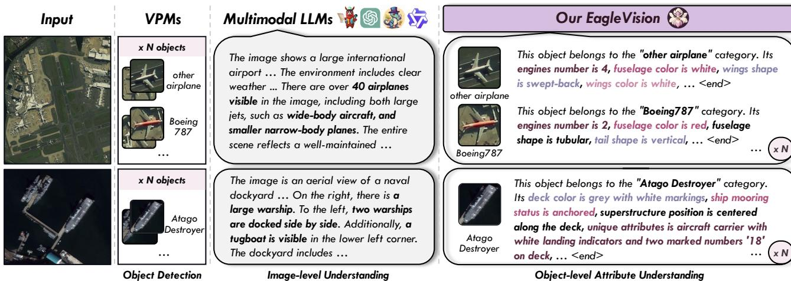  
Fi variu attbutes all detecte bjecs.The prompt r eneratingthe LLMs results  hown  the.

# 摘要

最近多模态大语言模型（MLLMs）的进展在各种视觉任务中显示了令人瞩目的成果。然而，在遥感（RS）领域，高分辨率和对象比例小给现有的MLLMs带来了挑战，这些模型在以对象为中心的任务中，尤其是在精确定位和细粒度属性描述方面表现不佳。这些RS MLLMs尚未超越经典的视觉感知模型，因为它们仅提供粗略的图像理解，导致在实际场景中获得有限的提升。为了解决这一差距，我们建立了EagleVision，这是一种针对遥感定制的MLLM，在目标检测和属性理解方面表现优异。借助属性解缠模块，EagleVision学习解缠的视觉词元，以表达不同的属性。为了支持基于对象的视觉语言对齐，我们构建了EVAttrs-95K，这是第一个用于遥感指令调优的大规模对象属性理解数据集，以及一个新的评估基准，EVBench。EagleVision在细粒度目标检测和对象属性理解任务上实现了最先进的性能，突显了MLLMs中检测与理解能力的相互促进。代码、模型、数据和演示将可在 https://github.com/XiangTodayEatsWhat/EagleVision 获取。

# 1. 引言

近年来，大语言模型（LLMs）的出现对研究社区产生了显著影响，显示出在遵循人类指令方面的卓越成就。通过整合多模态输入（例如图像、视频或表格）和指令微调数据，这些模型进一步获得了令人印象深刻的视觉推理能力，通常被称为多模态大语言模型（MLLMs）。这些方法在视觉和语言模态之间建立了强有力的对齐，以执行广泛的视觉任务，如视觉理解和定位。

尽管这些通用多语言模型（MLLMs）已经广泛应用于各个垂直领域，但它们在遥感（RS）领域仍处于早期阶段。一些研究，例如RSGPT和GeoChat，仅探讨了多任务对话，执行的任务包含场景分类和类似自然图像的图像描述。实际上，在遥感领域，基于对象的解释更为实用，但现有的MLLMs在精确的对象检测和理解方面面临挑战。特别是对于更深层次、细粒度的以对象为中心的任务，MLLMs和传统的对象检测方法都表现出严重的局限性。具体来说，如图1所示，经典视觉感知模型（VPMs）仅能依赖预定义类别来定位对象。然而，由于缺乏可解释性，这种方法在实际应用中显得不足，尤其是当对象类型未知或是新的时，往往会导致模糊的标签，如“其他-飞机”，而没有其他有意义的理解。同样，由于遥感图像的高分辨率和对象的比例偏小，MLLMs通常提供稀疏和粗略的描述，例如“可见超过40架飞机”或“较小的窄体飞机”。这些模型难以描述每个对象的细粒度属性，导致对象中心理解不足，并且在定位方面没有有效的改进。因此，增强对象级属性理解是推动遥感MLLMs发展的关键步骤，有助于应用范围的扩展。

受此启发，我们提出了EagleVision，一种用于遥感的新型对象级属性多模态大语言模型，能够实现对象定位和细粒度属性描述。为了确保EagleVision对对象级属性的理解，我们提出了一个属性解耦模块，通过正交子空间学习获得解耦的对象视觉词元。与原始词元固有地混合多种属性并倾向于表达全局内容不同，这些解耦的词元能够明确捕捉不同的属性特征，从而促进对对象细粒度属性的进一步理解。为支持EagleVision在对象属性理解任务上的训练，我们构建了EVAttrs-95K数据集用于指令微调，将对象视觉特征与其对应的详细描述对齐。具体而言，我们设计了一个创新的标注管道，为$9 5 . 1 \mathrm { k }$个来自FAIR1M、MAR20和ShipRSImageNet数据集的对象提供开放式的详细属性注释。最后，我们提出了EVBench，这是第一个评估遥感中对象属性理解能力的基准。实验结果表明，EagleVision在对象检测上不仅实现了最先进的性能，在三个数据集上分别提高了mAP $1 1 . 2 \%$、$2 . 7 \%$和$0 . 3 \%$，而且在EVBench中也表现出了显著的优势。主要贡献如下：• 我们构建并微调了一种新型的多模态大语言模型架构EagleVision，该架构同时结合了对象检测和对象属性理解。为了克服对象视觉词元的属性混合，确保在EagleVision中实现细粒度理解，我们提出了属性解耦，这有助于解耦属性学习，并惠及多个任务。

Table 1. Comparison of related works. "Reference" indicates whether the reference text is required for detection or segmentation. "Image" and "Sparse" refer to perform image-level and sparse object-level understanding.   

<table><tr><td>Method</td><td>Reference Description</td><td></td></tr><tr><td colspan="3">Visual Perception Models</td></tr><tr><td>DETR (ECCV 2020)</td><td>X</td><td>X</td></tr><tr><td>KFIoU (ICLR 2023)</td><td>X</td><td>X</td></tr><tr><td>PolyFormer (CVPR 2023)</td><td></td><td>X</td></tr><tr><td>Grounding-DINO (ECCV 2024)</td><td>:</td><td>X</td></tr><tr><td colspan="3">Multimodal LLMs</td></tr><tr><td>LLaVA (NIPS 2023)</td><td></td><td>Image</td></tr><tr><td>LLaVA-Grounding (ECCV 2024)</td><td>✗</td><td>Sparse</td></tr><tr><td>GeoChat (CVPR 2024)</td><td>✓</td><td>Sparse</td></tr><tr><td>GPT-40</td><td>✓</td><td>Sparse</td></tr><tr><td>EagleVision</td><td>X</td><td>Dense</td></tr></table>

我们首次开发了大规模遥感对象属性理解数据集 EVAttrs-95K 和评估基准 EVBench，这为全面支持并展示我们 EagleVision 的卓越性能提供了基础。

# 2. 相关工作

# 2.1. 视觉感知模型

传统的视觉感知模型，如目标检测，主要关注目标定位和分类。代表性的工作系列包括基于锚点的 Faster R-CNN、无锚点的 CenterNet 和基于变压器的 DETR。基于这些工作，遥感检测方法进一步强调解决如任意旋转和小目标尺寸等挑战，以两阶段的 Oriented R-CNN 和一阶段的 R3Det 为例。尽管检测性能有所提高，但它们都有一个共同的问题：只能支持粗略的类别预测，缺乏对每个目标的细致理解。换句话说，目标只能被分类为“飞机”，而没有任何详细的解释。在实际的遥感应用中，这个问题使得发现和分析新类型目标变得困难，也阻碍了检测能力的提升。近年来，视觉绑定（VG）和指称表达分割（RES）的视觉前置模型，如 PolyFormer 和 Grounding-DINO，由于其超越预定义类别的灵活性而受到广泛关注。然而，这些方法严重依赖已知目标的参考文本（例如，“右侧的蓝色飞机”）进行匹配和定位。事实上，这种方法更适合于与特定对象的交互，而不适合于遥感场景，因为它们无法理解多种未知的地表覆盖对象，并无法增强对它们的检测。

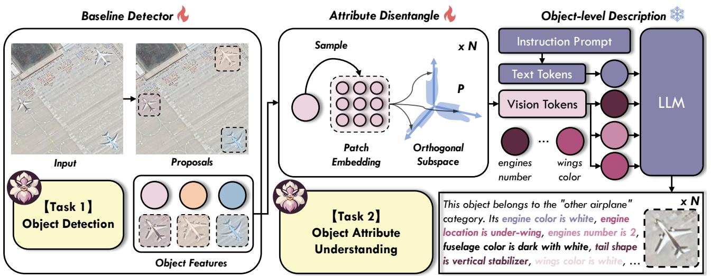  
tangle and Object-level Description, enabling object detection and object attribute understanding tasks.

值得注意的是，OvarNet [8]、TAP [35] 等模型也试图在自然图像中识别检测到的对象属性。然而，这些模型涉及相对复杂的多阶段训练过程，并完全依赖于 CLIP [36] 的对比检索，而没有自由形式的描述，这使得它们在遥感领域的泛化能力较弱。为了解决这些局限性，EagleVision 旨在针对每个对象执行无参考的检测和细粒度属性理解。这种对对象的深入理解也显著提高了检测能力。

# 2.2. 多模态大语言模型

得益于近期 LLM 的进展，MLLMs 在视觉理解领域展现出了卓越的能力。早期的 MLLM LLaVA 引入了一种新颖的学习范式和指令调优数据构建方法，在后续的研究中被广泛采用和扩展。然而，这些相关研究主要集中于全局图像理解，在局部物体理解和视觉感知方面表现有限。通过引入视觉定位模块，像 LLaVA-Grounding 的模型可以基于参考信息实现物体的定位和理解。不幸的是，MLLMs 的检测能力并不令人满意，召回率较低。这种缺陷导致了稀疏的物体理解，主要体现在两个方面：稀疏数量，即许多关键物体的理解缺失；稀疏属性，导致描述粗略。即使是最先进的模型，如开源的 Qwen2-VL 和闭源的 Gemini，也面临类似挑战。在遥感领域，现有的 MLLMs 基于通用领域架构，特别难以解决稀疏物体理解的问题，因为图像分辨率较高且物体比例较小。例如，RSGPT 专注于图像级 QA 任务，GeoChat 旨在构建一个更具多样性的遥感 MLLM，并丰富垂直领域数据，而 RSUniVLM 则提出以扩展 RES 和多图对话任务。所有这些方法都未能解决物体级理解和检测中的固有局限性。因此，EagleVision 作为遥感领域首个物体级属性 MLLM 被提出，旨在对每个物体进行超过 60 种细粒度属性的密集理解，同时确保精确的检测能力。总之，EagleVision 与上述相关工作的比较见表 1。

# 3. 方法

如图2所示，EagleVision 首先通过基线检测器提取物体特征并执行物体检测。然后，为了使原始的纠缠特征能够表达不同属性，引入了属性解缠模块，通过正交子空间学习生成属性分离的视觉词元。最后，利用大语言模型，物体级描述实现物体属性理解。在我们对 EVAttrs-95K 的训练过程中，所有损失被计算以更新整个视觉部分。

# 3.1. 基线检测器

对于输入图像 $\boldsymbol { X _ { v } } \in \mathbb { R } ^ { H \times W \times 3 }$，我们使用基线检测器提取 ROI 特征 $F _ { v } ~ = ~ f ( X _ { v } ; \theta )$，其中 $\boldsymbol { F _ { v } } \in \mathbb { R } ^ { N \times H ^ { \prime } \times W ^ { \prime } \times C }$，$N$ 是提议的数量，$H ^ { \prime }$ 和 $W ^ { \prime }$ 是 ROI 特征图的高度和宽度，$f$ 表示任意单阶段或双阶段检测器，$\theta$ 表示相应的参数。为了实现目标检测，我们保留与分类和边界框回归相关的模块 $f _ { c l s }$ 和 $f _ { r e g }$。在将 ${ \boldsymbol { F } } _ { v }$ 输入这些模块后，可以获得最终的检测结果。根据这些结果，我们进一步选择 $N _ { p o s }$ 个前景对象的 ROI 特征作为对象特征 $F _ { v } ^ { p o s } \in \mathbb { R } ^ { N _ { p o s } \times H ^ { \prime } \times W ^ { \prime } \times C }$ 用于后续处理。为了优化，我们按照经典检测器计算检测损失 $\mathcal { L } _ { d }$，包括交叉熵损失、L1 损失或 RotatedIoU 损失 [31]。检测器中的所有参数都是可训练的。

# 3.2. 属性解耦

相较于将 $F _ { v } ^ { p o s }$ 作为视觉词元输入到大语言模型中，为了提供更充分的目标信息，我们首先对目标的邻域特征进行采样，以获得补丁嵌入 $E_v \in \mathbb{R}^{N_{pos} \times (2s+1) \times (2s+1) \times C}$，其中 $s \in \mathbb{N}$。具体而言，对于两阶段检测器，ROI特征大小可以调整为 $2s + 1$，然后输出 $E_v$。相比之下，来自单阶段检测器的 $F _ { v } ^ { p o s }$ 定义为 $H ^ {\prime} = W ^ {\prime} = 1$，采用中心特征。因此，对于这些目标，我们确定它们的中心 $R$，并围绕每个中心进行邻域采样，如下所示：

$$
\begin{array} { r l } & { R = \{ r _ { i } \} _ { i = 1 , 2 , \dots , N _ { p o s } } , r _ { i } = ( x _ { i } , y _ { i } ) } \\ & { S _ { i } = \{ ( x _ { i } + s _ { x } , y _ { i } + s _ { y } ) | s _ { x } , s _ { y } \in [ - s , s ] \} , } \end{array}
$$

其中 $S _ { i }$ 表示中心 $r _ { i }$ 的邻域集合，用于选择对应的特征作为 $\scriptstyle { E _ { v } $。

由于提取的 $\scriptstyle { E _ { v } }$ 混合了各种属性特征，缺乏表示细节的能力，因此它倾向于促使大语言模型生成全局对象描述，而不是具体属性。因此，为了使视觉词元能够明确表达不同属性以实现细粒度理解，我们进一步引入了解耦学习，灵感来源于 [3, 7, 39]。我们采用正交子空间学习来解耦各属性之间的特征。具体而言，学习一组正交基 $p _ { 1 } , p _ { 2 } , . . . , p _ { n }$ 来生成超平面 $\mathcal { P } = s p a n \{ p _ { 1 } , p _ { 2 } , . . . , p _ { n } \}$，称为正交子空间，其中每个基表示一个独特的属性空间。$n$ 是基的数量。然后将补丁嵌入 $\scriptstyle { E _ { v } }$ 投影到这些基上，以获得解耦的特征 $\mathbf { \boldsymbol { T _ { v } } } ~ \in ~ \mathbb { R } ^ { N _ { p o s } \times n \times C }$，这就是最终的视觉词元，包括 $n$ 个独立的词元。具体实现如以下所示：

$$
\begin{array} { l } { { \pmb { T _ { v } } = c a t ( { \pmb T _ { v } ^ { 1 } } , { \pmb T _ { v } ^ { 2 } } , . . . , { \pmb T _ { v } ^ { n } } ) } } \\ { { \qquad \ } } \\ { { \pmb { T _ { v } ^ { k } } = c _ { k } p _ { k } , \ c _ { k } = \displaystyle \sum _ { i } ^ { 2 s + 1 } \sum _ { j } ^ { 2 s + 1 } E _ { v } ^ { i , j } p _ { k } ^ { T } } , } \end{array}
$$

$p _ { k } \in \mathbb { R } ^ { 1 \times C }$ 是学习到的参数，$E _ { v } ^ { i , j } \in \mathbb { R } ^ { N _ { p o s } \times C }$ 是$i j$ 的嵌入。cat表示张量的连接。在上述过程中，为了约束可学习参数$p$以确保基的正交性，即当$i \neq j$时满足$p _ { i } p _ { j } ^ { T } = 0$，我们引入以下正交损失$\mathcal { L } _ { o }$：

$$
\mathcal { L } _ { o } = \frac { 2 } { n \times ( n - 1 ) } \sum _ { i = 1 } ^ { n } \sum _ { j > i } ^ { n } | p _ { i } p _ { j } ^ { T } | .
$$

为了引导由公式 2 获得的属性空间中的解耦表示 $c _ { k }$ 正确表达相应的属性，需要最大化 $c _ { k }$ 与从真实属性编码的属性词元 $\mathbf { \delta } _ { T _ { a } ^ { k } }$ 之间的互信息 $I$。

$$
\mathcal { L } _ { a } = - \frac { 1 } { n } \sum _ { k } ^ { n } I ( c _ { k } , \pmb { T _ { a } ^ { k } } ) .
$$

这个目标基于信息理论，在各种表征学习或相关性约束中普遍存在。在这里，它特别强调视觉词元与其相关属性之间的一一对应。由于公式 4 的不可解性，在[10]的启发下，我们优化其变分下界：

$$
\begin{array} { l } { \displaystyle \mathcal { L } _ { a } = \frac { 1 } { n } \sum _ { k } ^ { n } ( q ( T _ { a } ^ { k } ; \varphi ) - c _ { k } ) ^ { 2 } } \\ { \displaystyle \quad = - \frac { 1 } { n } \sum _ { k } ^ { n } \mathbb { E } _ { T _ { a } ^ { k } } [ \mathbb { E } _ { c _ { k } \sim P ( c _ { k } | T _ { a } ^ { k } ) } [ l o g ( Q ( c _ { k } | T _ { a } ^ { k } ) ] ] } \\ { \displaystyle \quad \geq - \frac { 1 } { n } \sum _ { k } ^ { n } I ( c _ { k } , T _ { a } ^ { k } ) + H ( c ) , } \end{array}
$$

其中 $Q ( c _ { k } | T _ { a } ^ { k } ) \sim \mathcal { N } ( q ( T _ { a } ^ { k } ; \varphi ) , I )$ 是变分分布。需要注意的是，在公式 5 中，$T _ { a } ^ { k }$ 仅用于训练，测试期间并不存在。最终，得益于所提出的属性解耦模块结合去相关变换，特征之间的独立性得到了增强，能够表达不同的属性，从而有助于视觉-语言对齐。这将在第 4.2 节中进一步确认。

# 3.3. 物体级描述

最终，文本词元 $\scriptstyle { \mathbf { } } T _ { q }$ 从指令提示中编码，视觉词元 $\mathbf { \Delta } \mathbf { T } _ { v }$ 被连接在一起并输入到固定的语言模型（LLM）中，以生成对象级描述。这实现了对每个对象的密集属性理解任务，公式化为 $Y = g ( T _ { v } , T _ { q } ; \phi )$ ，其中 $\mathbf { Y }$ 是 LLM $g$ 的响应，$\phi$ 表示固定参数。基于这些响应 $\mathbf { Y }$ 和 EVAttrs-95K 数据集中真实属性描述 $\hat { Y }$ ，我们计算简单的下一个词预测损失 $\mathcal { L } _ { q }$ 的语言损失。只优化 EagleVision 的视觉组件。事实上，这一步将对象级视觉特征与 LLM 的词编码对齐，确保 EagleVision 中的视觉部分与固定的 LLM 兼容，类似于 LLaVA 中的预训练。此外，虽然专注于属性理解任务，$L _ { q }$ 间接改善了视觉特征提取，使其更符合对象特征，并有利于检测。

Table 2. Source and distribution of the EVAttrs-95K dataset. $\sim$ indicates approximation of the average number of attributes.   

<table><tr><td>Data</td><td>FAIR1M</td><td>MAR20</td><td>ShipRSImageNet</td></tr><tr><td>Size</td><td>59.8k</td><td>22.3k</td><td>13.0k</td></tr><tr><td>Train</td><td>44.2k</td><td>7.8k</td><td>10.1k</td></tr><tr><td>Test</td><td>15.6k</td><td>14.5k</td><td>2.9k</td></tr><tr><td>Attr Num</td><td>∼25</td><td>∼24</td><td>∼28</td></tr></table>

因此，我们的EagleVision实现了比基线检测器更准确的检测性能，并促进了检测与物体属性理解之间的相互增强。完整的损失函数如下，每个 $\lambda$ 代表特定损失的权重系数：

$$
\mathcal { L } _ { o v e r a l l } = \lambda _ { d } \mathcal { L } _ { d } + \lambda _ { o } \mathcal { L } _ { o } + \lambda _ { a } \mathcal { L } _ { a } + \lambda _ { q } \mathcal { L } _ { q } .
$$

# 3.4. EVAttrs-95K 生成管道

为了使EagleVision具备强大的目标检测和属性理解能力，我们构建了包含95.1万个对象详细属性的EVAttrs-95K数据集。注释过程图、预定义属性、注释示例和详细的提示设计见附录。以下是完整的过程。 数据集预处理。考虑到目标属性能够更好地促进细粒度目标检测任务，我们首先从FAIR1M-v1.0和ShipRSImageNet的训练和验证集中选择图像，以及MAR20的训练和测试集中。在这些数据集中，FAIR1M包含五个主要类别：飞机、船只、车辆、法院和道路，细分为37个子类别，ShipRSImageNet包含50种船只类型，而MAR20包含20种飞机类型。此外，我们从这些图像中裁剪出所有飞机和船只的图像块，并为飞机和船只预定义了24个和38个属性名称。 双阶段注释。考虑到图像块和预定义的属性名称，我们采用了一个双阶段数据引擎。在第一阶段，使用Qwen2-VL-72B对所有样本进行注释，然后在第二阶段，使用GPT-4o对低质量样本进行注释，这些样本通常由于物体较小或模糊而导致。两个阶段使用相同的提示，并将输出限制为格式化的JSON。具体来说，我们增加了一个额外的置信度，该置信度由多语言大模型给出，表示其注释的确定性，范围从0到1。在第二阶段，我们重新注释置信度小于0.5的样本，再次生成置信度以便后续的人为精细化处理。在第一阶段，我们使用4个Nvidia A100 GPU在本地部署Qwen2-VL-72B，总的注释时间约为316小时。在第二阶段，注释时间约为8小时。 人工精细化。尽管自动化过程成功注释了大多数目标属性，但仍有一些结果不够明确。因此，我们仔细审查所有置信度低于0.7的注释，纠正那些与图像明显不一致的属性描述，并删除“无法在没有清晰视觉信息的情况下注释”等不确定的注释。EVAttrs-95K的简要分布见表2。

# 3.5. EVBench

为了高效评估模型在物体级属性理解任务上的表现，我们提出了EVBench，它采用精心策划的评估策略来评估由大语言模型生成的属性描述。该策略鼓励对图像中每个物体的每个属性进行准确而全面的预测，并提供有效的评估，突出大语言模型之间的性能差距。 数据划分。首先，我们在表2中阐明了EVAttrs-95K的数据划分。对于FAIR 1M，我们从原始的trainval集手动将训练集和测试集以3:1的比例划分。对于MAR20，我们继承其训练集和测试集。由于ShipRSImageNet的测试集未公开，我们使用原始的训练集和验证集进行训练和测试。 响应预处理。此外，我们对测试集中的所有图像进行物体属性理解，并获得$N^{\prime}$个物体的响应$\{ Y_{i}^{\prime} \}_{i=1,2,\dots,N^{\prime}}$，未检测到的物体对应的响应为空。为了严格评估每个属性的结果，我们将非空的$Y_{i}^{\prime}$和相应的真实标注$\hat{Y}_{i}^{\prime}$转换为JSON格式$\mathcal{D}_{i}$和$\hat{\mathcal{D}}_{i}$，其中key是属性的名称，value是属性的描述。

评估策略。为了评估多模态大语言模型（MLLMs）在属性理解中的对象完整性，我们首先引入召回率指标，该指标量化了具有非空响应的对象比例与总对象数量的比值。召回率作为MLLM有效检测对象能力的指示，确保在对象级任务中的准确执行。接下来，我们考虑评估属性理解的准确性。由于对象属性理解任务需要生成开放式答案，而$Y _ { i } ^ { \prime }$和$\hat { \mathbf { Y } } _ { i } ^ { \prime }$的值是不确定的，我们采用了一种GPT辅助的评估策略，该策略与人类评估的一致性已在最近的MLLM基准测试中得到验证[22, 27, 54, 55]。选定的评估模型版本为gpt-3.5-turbo-0125，评估提示见附录。根据设计的评估标准，它比较生成答案$\mathcal { D } _ { i }$和参考答案$\hat { \mathcal { D } } _ { i } ^ { \phantom { \dagger } }$，可以获得每个对象中每个属性的得分，范围为1到5。最终属性得分是针对给定属性在所有对象中的平均得分，标准化为最大得分100，总得分为所有属性得分的平均值。“得分”来自于第3.5节的GPT辅助评估。$^ \dagger$ 表示RTMDet作为基线检测器，其他情况为定向R-CNN。

<table><tr><td>Method</td><td>Patch Embedding</td><td>Vision Token</td><td>LLM</td><td>mAP</td><td>Score</td></tr><tr><td>EagleVision-1B†</td><td>1×1 3 × 3 5× 5 7×7</td><td>Entangled</td><td>Qwen2-0.5B-Instruct [49]</td><td>56.8 59.5 64.4 62.2</td><td>56.8 63.9 65.1 64.3</td></tr><tr><td>EagleVision-1B†</td><td>5× 5</td><td>Entangled Disentangled Orthogonal Disentangled</td><td>Qwen2-0.5B-Instruct [49]</td><td>64.4 67.0 66.4</td><td>65.1 66.2 67.4</td></tr><tr><td>EagleVision-1B† EagleVision-1B EagleVision-2B EagleVision-4B EagleVision-7B</td><td>5× 5</td><td>Orthogonal Disentangled</td><td>Qwen2-0.5B-Instruct [49] Qwen2-0.5B-Instruct [49] InternLM2-1.8B [5] Phi-3-Mini-128K-Instruct [1] InternLM2.5-7B-Chat [5]</td><td>66.4 67.1 71.6 73.3 74.6</td><td>67.4 69.3 68.6 69.5 69.9</td></tr></table>

# 4. 实验

# 4.1. 实现细节

在我们的实验中，我们报告了在FAIR1M-v1.0、MAR20和ShipRSImageNet数据集上进行目标检测和目标属性理解的结果。为了公平比较，除非另有说明，我们对所有方法采用相同的数据集处理方式。对于FAIR1M-v1.0，我们采用单尺度训练和测试策略，将每张图片裁剪为$1024 \times 1024$的子图像，补丁重叠为200像素。对于MAR20和ShipRSImageNet，我们直接将原始图像缩放为$1024 \times 1024$以进行实验。为了兼容不同的需求，我们的Eagle-Vision包含四种尺寸的模型：1B、2B、4B和7B。大语言模型（LLMs）是由1B、2B、4B和8B的InternVL2对应语言组件初始化的。所有模型在MMRotate框架下实现，并结合DeepSpeed [37]引擎以支持我们Eagle-Vision中的LLM。根据[47]，我们在FAIR1M数据集上训练模型12个周期，在MAR20和ShipRSImageNet数据集上训练36个周期，使用AdamW [28]优化器。我们使用8个Nvidia A100 GPU，批量大小为8进行模型训练和测试。有关更详细的配置，请参阅附录。

# 4.2. 消融研究

在本节中，我们报告了对ShipRSImageNet的消融研究，以全面探讨所提方法的有效性，如表3所示。

补丁嵌入大小。首先，我们直接将来自 RTMDet 的原始纠缠视觉 tokens $\scriptstyle { E _ { v } }$ 输入到大语言模型（LLM），不应用 Eq. 2，以探索在四种规模配置下补丁嵌入大小的影响。可以看到，EagleVision- $^ \mathrm { 1 B \dag }$ 在目标检测上实现了 $5 6 . 8 \%$ 的平均精确度（mAP），在属性理解上得分为 56.8，仅考虑中心 token，即 $1 \times 1$。随着 token 大小增加到 $3 \times 3$，mAP 和得分分别提高了 $2 . 7 \%$ 和 7.1。使用 $5 \times 5$ 的补丁嵌入时，它们分别进一步上升了 $4 . 9 \%$ 和 1.2。当补丁大小增加到 $7 \times 7$ 时，由于周围信息的干扰，属性理解得分略微下降了 0.8，这也影响了检测，减少了 $2 . 2 \%$。因此，适当增加视觉 tokens 的数量可以使 LLM 接收更多视觉信息，从而改善属性理解和目标检测，两个任务均取得显著提升。最终，我们选择了 $5 \times 5$ 的补丁嵌入大小。

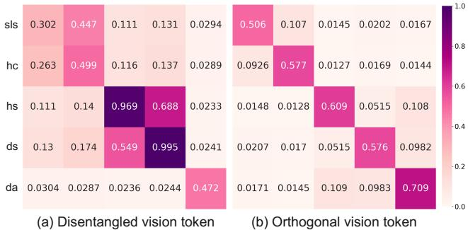  
Figure 3. Visualization of the correlation between vision tokens and attributes. The horizontal axis represents different dimensions of vision tokens, and the vertical axis represents their attributes, where sls, hc, hs, ds, da denote ship-load-status, hullcolor, hull-size, deck-structure, deck-accessories, respectively.

视觉标记类型。然后，我们对解耦视觉标记的性能进行验证，引入在公式 5 中提出的 $\mathcal { L } _ { d }$。通过利用学习到的属性特定解耦视觉特征，EagleVision 实现了增强的表示能力，在 mAP 和得分上分别获得了 $2 . 6 \%$ 和 1.1 的显著提升。此外，通过结合公式 3 中的正交约束 $\mathcal { L } _ { o }$，视觉标记展现出卓越的解耦特性，从而促进了更具辨别性的属性理解，得分提升了 1.2。直观上，我们在图 3 中可视化了我们提出的视觉标记的解耦能力，使用的测量指标为：

<table><tr><td rowspan="2">Method</td><td rowspan="2">ShipRSImageNet</td><td rowspan="2">MAR20</td><td colspan="6">FAIR1M</td></tr><tr><td>Airplane</td><td>Ship</td><td>Vehicle</td><td>Court</td><td>Road</td><td>Mean</td></tr><tr><td colspan="9">One-stage Detector</td></tr><tr><td>RetinaNet [21]</td><td>20.1</td><td>68.6</td><td>37.7</td><td>11.9</td><td>10.8</td><td>62.5</td><td>21.0</td><td>26.6</td></tr><tr><td>R3Det [50]</td><td>23.8</td><td>65.6</td><td>39.0</td><td>18.8</td><td>18.2</td><td>64.8</td><td>30.8</td><td>31.1</td></tr><tr><td>G GD [51]</td><td>26.7</td><td>74.3</td><td>40.2</td><td>13.3</td><td>13.2</td><td>62.8</td><td>26.1</td><td>28.1</td></tr><tr><td>KLD   [52]</td><td>49.2</td><td>80.8</td><td>39.6</td><td>13.2</td><td>13.7</td><td>63.8</td><td>26.4</td><td>28.3</td></tr><tr><td>FCOS [43]</td><td>56.0</td><td>80.2</td><td>42.4</td><td>23.8</td><td>18.9</td><td>66.9</td><td>35.5</td><td>34.1</td></tr><tr><td>S2ANet [15]</td><td>49.4</td><td>42.6</td><td>43.8</td><td>23.0</td><td>23.4</td><td>65.7</td><td>28.2</td><td>34.7</td></tr><tr><td>TIOE-Det [32]</td><td>-</td><td>-</td><td>45.8</td><td>16.9</td><td>25.0</td><td>69.9</td><td>32.7</td><td>35.2</td></tr><tr><td>RTMDet [29]</td><td>59.2</td><td>77.2</td><td>44.5</td><td>27.2</td><td>28.3</td><td>70.9</td><td>34.3</td><td>38.4</td></tr><tr><td colspan="9">Two-stage Detector</td></tr><tr><td>Faster R-CNN [38]</td><td>54.8</td><td>75.0</td><td>48.9</td><td>21.4</td><td>25.7</td><td>65.5</td><td>33.0</td><td>36.8</td></tr><tr><td>Gliding Vertex [48]</td><td>58.6</td><td>80.3</td><td>46.1</td><td>21.4</td><td>26.4</td><td>67.3</td><td>33.5</td><td>36.5</td></tr><tr><td>ReDet [14]</td><td>53.9</td><td>65.5</td><td>47.2</td><td>21.9</td><td>25.3</td><td>68.7</td><td>30.4</td><td>36.5</td></tr><tr><td>KF OU [53]</td><td>37.5</td><td>77.0</td><td>44.4</td><td>25.4</td><td>19.2</td><td>61.3</td><td>26.8</td><td>33.7</td></tr><tr><td>ROI Transformer [13]</td><td>61.0</td><td>82.5</td><td>50.8</td><td>24.1</td><td>28.2</td><td>68.3</td><td>34.7</td><td>39.2</td></tr><tr><td>Oriented R-CNN [47]</td><td>63.4</td><td>81.8</td><td>46.0</td><td>28.5</td><td>26.0</td><td>69.6</td><td>35.8</td><td>38.5</td></tr><tr><td>Oriented R-CNN* [47]</td><td>-</td><td>-</td><td>53.6</td><td>32.2</td><td>38.9</td><td>73.3</td><td>38.2</td><td>45.6</td></tr><tr><td>LSKNet* [20</td><td>-</td><td>-</td><td>53.6</td><td>32.8</td><td>40.9</td><td>76.6</td><td>40.8</td><td>46.9</td></tr><tr><td colspan="9">Ours</td></tr><tr><td>EagleVision-1B</td><td>67.1</td><td>82.7</td><td>46.4</td><td>28.6</td><td>26.1</td><td>69.7</td><td>35.4</td><td>38.6</td></tr><tr><td>EagleVision-2B</td><td>71.6</td><td>84.0</td><td>50.3</td><td>27.1</td><td>26.6</td><td>69.7</td><td>31.7</td><td>39.2</td></tr><tr><td>EagleVision-4B</td><td>73.3</td><td>84.3</td><td>49.3</td><td>29.0</td><td>26.3</td><td>68.0</td><td>30.9</td><td>39.0</td></tr><tr><td>EagleVision-7B</td><td>74.6</td><td>84.5</td><td>48.1</td><td>29.4</td><td>27.6</td><td>70.6</td><td>36.6</td><td>39.9</td></tr><tr><td>EagleVision-7B*</td><td>-</td><td>-</td><td>54.4</td><td>33.3</td><td>40.6</td><td>76.5</td><td>41.2</td><td>47.2</td></tr></table>

$$
C o r r ( i , j ) = \frac { m i n _ { 1 \leq i , j \leq n } | q ( \pmb { T _ { a } ^ { i } } ; \varphi ) - c _ { j } | } { | q ( \pmb { T _ { a } ^ { i } } ; \varphi ) - c _ { j } | } ,
$$

来源于我们在第3.2节中引入的变分下界，将对所有对象进行计算。$C o r r ( i , j )$ 直接表示视觉词元的第 $i$ 维与第 $j$ 特征之间的相关性，反映该词元是否能够表达单一特征信息。此外，它将原始绝对误差 $\vert q ( T _ { a } ^ { i } ; \varphi ) - c _ { j } \vert$ 转换为范围在0到1之间的数据，从而较大的值表示更强的相关性。如所观察到的，尽管（a）中的解耦视觉词元展示了一定的独立性，但随着性能的提高，某些特征仍然容易被混淆。例如，第四列的视觉词元与甲板结构特征的相关性为0.995，但与船体尺寸的相关性仍高达0.688。基于这样的混合词元，准确理解这两个特征是困难的。得益于我们的正交子空间学习，（b）中的正交视觉词元实现了更大的独立性，使得对特征的理解更加精准，并进一步提高了得分。相比之下，mAP仅略微下降，因此我们仍然采用正交解耦的视觉词元。基线检测器。探索不同类型的基线检测器，我们用二阶段的 Oriented R-CNN 替换了单阶段的 RTMDet，提升了 $0 . 7 \%$ 的 mAP 和 1.9 的得分。这证明了 EagleVision 与各种检测器的兼容性。考虑到其卓越性能，Oriented R-CNN 被选为后续实验的基线检测器。 LLM 扩展。最后，我们构建了四个不同规模的 LLM 版本的 Eagle-Vision。得益于更大规模的语言模块，模型的性能不断提升，尤其显著的是从 1B 到 2B，mAP 提升了 $4 . 5 \%$，而从 2B 到 4B，mAP 和得分分别提升了 $1 . 7 \%$ 和 0.9，最佳模型 EagleVision-7B 达到 mAP 为 $7 4 . 6 \%$，得分为69.9。

# 4.3. 任务评估

为了全面展示我们的Eagle-Vision的优势，我们在多个物体检测和物体属性理解任务的基准上进行了评估。

目标检测。在目标检测任务中，我们评估了我们的EagleVision在三个细粒度目标检测数据集上与15个最先进的检测器的性能。表4中的结果显示，EagleVision在三个数据集上都超越了基线检测器Oriented R-CNN。即使是1B版本，mAP分别增加了$3.7\%$、$0.9\%$和$0.1\%$。在单尺度设置下，我们的最佳EagleVision-7B以$74.6\%$、$84.5\%$和$39.9\%$的mAP超越了所有其他方法。特别是，尽管我们仅在FAIR1M上对飞机和船只的属性进行了标注，EagleVision不仅在大型物体上获得了提升，只有Qwen2-VL和InternVL2.5分别达到了$52.5\%$和$21.8\%$的相对较好召回率，而所有模型在其他数据集上的表现均低于$20\%$。此外，这些多模态语言模型（MLLMs）的得分普遍较低，尤其是在ShipRSImageNet上，GPT-4o的最高得分仅为38.0。值得注意的是，由于在有限领域任务上的监督微调（SFT），遥感多模态语言模型在对象级任务上表现出较差的泛化能力。只有LHRS-Bot在ShipRSImageNet上实现了可比的性能，召回率为$7.3\%$，得分为37.8。相比之下，EagleVision显示出显著的性能优势。例如，EagleVision-7B在ShipRSImageNet上的召回率和得分为$79.0\%$和69.9，在MAR20上为$92.8\%$和91.1，在FAIR1M上为$86.6\%$和75.7，远超其他方法。

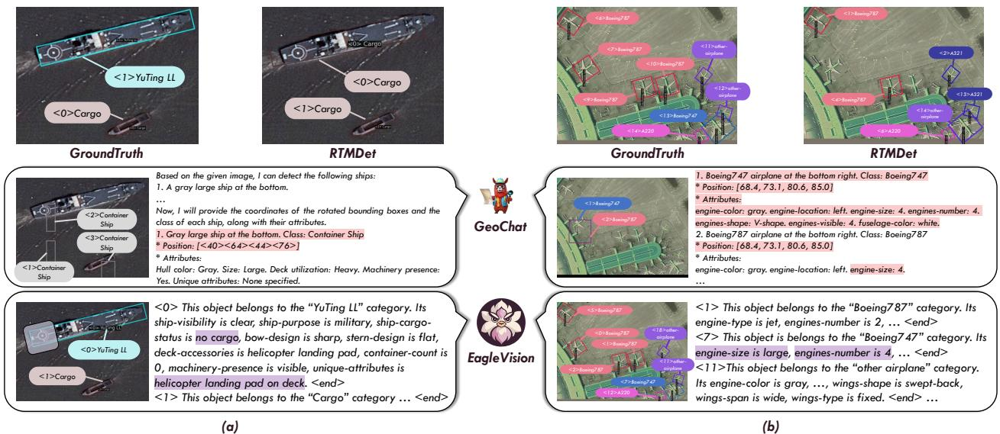  
iza esul hieNe R atauD  Tru understandng content, whic promotes the correct detectionf the jec catory.

Table 5. Performance comparison on the object attribute understanding task. "LLaVA-G" and "ShipRS" stands for LLaVA-Grounding and ShipRSImageNet.   

<table><tr><td>Method</td><td colspan="2">ShipRS</td><td colspan="2">MAR20</td><td colspan="2">FAIR1M</td></tr><tr><td></td><td>Recall</td><td>Score</td><td>Recall</td><td>Score</td><td>Recall Score</td><td></td></tr><tr><td colspan="7">General MLLMs</td></tr><tr><td>LLaVA-G [57]</td><td>0.5%</td><td>3.4</td><td>1.8%</td><td>1.5</td><td>1.2%</td><td>3.7</td></tr><tr><td>Qwen2-VL [45]</td><td>8.2%</td><td>36.2</td><td>52.5%</td><td>42.2</td><td>16.9%</td><td>40.3</td></tr><tr><td>InternVL2.5 [11]</td><td>9.7%</td><td>28.9</td><td>21.8%</td><td>44.3</td><td>3.2%</td><td>44.7</td></tr><tr><td>GPT-4o-mini [2]</td><td>0.7%</td><td>38.0</td><td>4.8%</td><td>45.7</td><td>3.5%</td><td>39.9</td></tr><tr><td colspan="7">Remote Sensing MLLMs</td></tr><tr><td>GeoChat [19]</td><td>1.6%</td><td>22.1</td><td>5.9%</td><td>19.8</td><td>3.7%</td><td>23.5</td></tr><tr><td>HRS-Bot [33]</td><td>7.3%</td><td>37.8</td><td>2.0%</td><td>27.7</td><td>2.5%</td><td>33.4</td></tr><tr><td colspan="7">Ours</td></tr><tr><td>EagleVision-1B</td><td>77.3%</td><td>69.3</td><td>91.6%</td><td>86.2</td><td>90.2%</td><td>75.0</td></tr><tr><td>EagleVision-2B</td><td>77.1%</td><td>68.8</td><td>93.5%</td><td>88.8</td><td>89.5%</td><td>76.2</td></tr><tr><td>EagleVision-4B</td><td>76.8%</td><td>695</td><td>94.3%</td><td>88.4</td><td>89.5%</td><td>76.3</td></tr><tr><td>EagleVision-7B</td><td>79.0%</td><td>69.9</td><td>92.8%</td><td>91.1</td><td>86.6%</td><td>75.7</td></tr></table>

$4.3\%$ 和 $0.9\%$，同时在其他类别上也提高了 $1.6\%$、$1.0\%$ 和 $0.8\%$。在 FAIR1M 的多尺度设置下，我们的方法超过了最先进的 LSKNet $0.3\%$。在没有额外计算开销的情况下，EagleVision 与任何检测器兼容，保持检测推理效率，并带来稳定性提升。这凸显了大语言模型在通过物体级属性理解来增强视觉感知的潜力。物体属性理解。对于属性理解任务，我们将我们的 Eagle Vision 与 6 个先进的大语言模型进行了比较，如表 5 所示。结果显示了现有大语言模型在遥感场景中的低召回率，导致显著的物体遗漏，妨碍了关键物体属性的获取。尽管 MAR20 包含了

# 4.4. 可视化

可视化示例如图4所示。与基线检测器RTMDet的较差检测性能和遥感大语言模型GeoChat所表现的稀疏对象级理解和检测相比，EagleVision提供了更准确的对象检测和全面的对象属性描述。它不仅为未知类别捕获了更丰富的语义信息，例如“其他飞机”，还通过识别特定属性增强了正确检测的可解释性。例如，在图4（a）中，EagleVision获得了“YuTing LL”的“没有货物”和“甲板上的直升机着陆区”这两个属性，从而澄清该对象不是货船而是着陆船。在图4（b）中，所有对象均被正确检测和描述，实现了密集的对象级理解和检测。这些效果展示了EagleVision在遥感垂直领域中创新架构的重要优势和潜力。

# 5. 结论

在本文中，我们介绍了EagleVision，这是一种新颖的面向对象属性的多模态大型语言模型（MLLM），专为遥感应用而设计， seamlessly 集成了对象定位和细粒度属性理解。为了支持EagleVision的指令微调和性能评估，我们提供了首个大规模遥感对象属性理解数据集EVAttrs-95K，以及相应的基准EVBench。此外，我们提出了属性解耦模块，确保视觉词元的解耦，以便更好地表示和对齐属性。广泛的实验结果表明，EagleVision在多个任务中实现了最先进的性能。

# References

[1] Marah Abdin, Jyoti Aneja, Hany Awadalla, Ahmed Awadallah, Ammar Ahmad Awan, Nguyen Bach, Amit Bahree, Arash Bakhtiari, Jianmin Bao, Harkirat Behl, et al. Phi-3 technical report: A highly capable language model locally on your phone. arXiv preprint arXiv:2404.14219, 2024. 6   
[2] Josh Achiam, Steven Adler, Sandhini Agarwal, Lama Ahmad, Ilge Akkaya, Florencia Leoni Aleman, Diogo Almeida, Janko Altenschmidt, Sam Altman, Shyamal Anadkat, et al. Gpt-4 technical report. arXiv preprint arXiv:2303.08774, 2023. 1, 8   
[3] Yoshua Bengio, Aaron Courville, and Pascal Vincent. Representation learning: A review and new perspectives. IEEE Transactions onPattern Analysis and Machine Intellnce, 35:17981828, 2013. 4   
[4] Zhaowei Cai and Nuno Vasconcelos. Cascade R-CNN: delving into high quality object detection. In Proceedings of the IEEE/CVF Conference on Computer Vision and Pattern Recognition, pages 61546162, 2018. 2   
[5] Zheng Cai, Maosong Cao, Haojiong Chen, Kai Chen, Keyu Chen, Xin Chen, Xun Chen, Zehui Chen, Zhi Chen, Pei Chu, et al. Internlm2 technical report. arXiv preprint arXiv:2403.17297, 2024. 6   
[6] Nicolas Carion, Francisco Massa, Gabriel Synnaeve, Nicolas Usunier, Alexander Kirillov, and Sergey Zagoruyko. End-toend object detection with transformers. In European Conference on Computer Vision, pages 213229, 2020. 2   
[7] Jaehoon Cha and Jeyan Thiyagalingam. Orthogonalityenforced latent space in autoencoders: An approach to learning disentangled representations. In International Conference on Machine Learning, pages 39133948, 2023. 4   
[8] Keyan Chen, Xiaolong Jiang, Yao Hu, Xu Tang, Yan Gao, Jianqi Chen, and Weidi Xie. Ovarnet: Towards openvocabulary object attribute recognition. In Proceedings of the IEEE/CVF Conference on Computer Vision and Pattern Recognition, pages 2351823527, 2023. 3   
[9] Lin Chen, Jinsong Li, Xiaoyi Dong, Pan Zhang, Conghui He, Jiaqi Wang, Feng Zhao, and Dahua Lin. Sharegpt4v: Improving large multi-modal models with better captions. In European Conference on Computer Vision, pages 370387, 2024. 3   
[10] Xi Chen, Yan Duan, Rein Houthooft, John Schulman, Ilya Sutskever, and Pieter Abbeel. Infogan: Interpretable representation learning by information maximizing generative adversarial nets. In Advances in Neural Information Processing Systems, pages 21722180, 2016. 4   
[1] Zhe Chen, Weiyun Wang, Yue ao, Yangzhou Liu, Zhangwei Gao, Erfei Cui, Jinguo Zhu, Shenglong Ye, Hao Tian, Zhaoyang Liu, et al. Expanding performance boundaries of open-source multimodal models with model, data, and testtime scaling. arXiv preprint arXiv:2412.05271, 2024. 8   
[12] Zhe Chen, Jiannan Wu, Wenhai Wang, Weijie Su, Guo Chen, Sen Xing, Muyan Zhong, Qinglong Zhang, Xizhou Zhu, Lewei Lu, et al. Internvl: Scaling up vision foundation models and aligning for generic visual-linguistic tasks. In Proceedings of the IEEE/CVF Conference on Computer Vision and Pattern Recognition, pages 2418524198, 2024. 1   
[13] Jian Ding, Nan Xue, Yang Long, Gui-Song Xia, and Qikai Lu. Learning roi transformer for oriented object detection in aerial images. In Proceedings of the IEEE/CVF Conference on Computer Vision and Pattern Recognition, pages 2849 2858, 2019. 7   
[14] Jiaming Han, Jian Ding, Nan Xue, and Gui-Song Xia. Redet: A rotation-equivariant detector for aerial object detection. In Proceedings of the IEEE/CVF Conference on Computer Vision and Pattern Recognition, pages 27862795, 2021. 7   
[15] Jiaming Han, Jian Ding, Jie Li, and Gui-Song Xia. Align deep features for oriented object detection. IEEE Transactions on Geoscience and Remote Sensing, pages 111, 2022. 7   
[16] Kaiming He, Georgia Gkioxari, Piotr Dollár, and Ross B. Girshick. Mask R-CNN. IEEE Transactions on Pattern Analysis and Machine Intelligence, 42(2):386397, 2020. 2   
[17] Yuan Hu, Jianlong Yuan, Congcong Wen, Xiaonan Lu, and Xiang Li. Rsgpt: A remote sensing vision language model and benchmark. arXiv preprint arXiv:2307.15266, 2023. 1, 3   
[18] Qing Jiang, Yuqin Yang, Yuda Xiong, Yihao Chen, Zhaoyang Zeng, Tianhe Ren, Lei Zhang, et al. Chatrex: Taming multimodal llm for joint perception and understanding. arXiv preprint arXiv:2411.18363, 2024. 3   
[19] Kartik Kuckreja, Muhammad Sohail Danish, Muzammal Naseer, Abhijit Das, Salman Khan, and Fahad Shahbaz Khan. Geochat: Grounded large vision-language model for remote sensing. In Proceedings of the IEEE/CVF Conference on Computer Vision and Pattern Recognition, pages 27831 27840, 2024. 1, 3, 8   
[20] Yuxuan Li, Xiang Li, Yimain Dai, Qibin Hou, Li Liu, Yongxiang Liu, Ming-Ming Cheng, and Jian Yang. Lsknet: A foundation lightweight backbone for remote sensing. International Journal of Computer Vision, 2024. 7   
[21] Tsung-Yi Lin, Priya Goyal, Ross B. Girshick, Kaiming He, and Piotr Dollár. Focal loss for dense object detection. In Proceedings of the IEEE/CVF International Conference on Computer Vision, pages 29993007, 2017. 7   
[22] Haotian Liu, Chunyuan Li, Qingyang Wu, and Yong Jae Lee. Visual instruction tuning. In Advances in Neural Information Processing Systems, 2023. 1, 3, 5   
[23] Haotian Liu, Chunyuan Li, Yuheng Li, and Yong Jae Lee. Improved baselines with visual instruction tuning. In Proceedings of the IEEE/CVF Conference on Computer Vision and Pattern Recognition, pages 2628626296, 2024. 1, 3   
[24] Jiang Liu, Hui Ding, Zhaowei Cai, Yuting Zhang, Ravi Kumar Satzoda, Vijay Mahadevan, and R. Manmatha. Polyformer: Referring image segmentation as sequential polygon generation. In Proceedings of the IEEE/CVF Conference on Computer Vision and Pattern Recognition, pages 18653 18663, 2023. 2   
[25] Shilong Liu, Zhaoyang Zeng, Tianhe Ren, Feng Li, Hao Zhang, Jie ang, Qing Jiang, Chuyan Li, Jianwei Yng, Hang Su, Jun Zhu, and Lei Zhang. Grounding DINO: marrying DINO with grounded pre-training for open-set object detection. In European Conference on Computer Vision, pages 3855, 2024. 2   
[26] Xu Liu and Zhouhui Lian. Rsunivlm: A unified vision language model for remote sensing via granularity-oriented mixture of experts. arXiv preprint arXiv:2412.05679, 2024. 3   
[27] Yuan Liu, Haodong Duan, Yuanhan Zhang, Bo Li, Songyang Zhang, Wangbo Zhao, Yike Yuan, Jiaqi Wang, Conghui He, Ziwei Liu, Kai Chen, and Dahua Lin. Mmbench: Is your multi-modal model an all-around player? In European Conference on Computer Vision, pages 216233, 2024. 5   
[28] Ilya Loshchilov and Frank Hutter. Decoupled weight decay regularization. In International Conference on Learning Representations, 2019. 6   
[29] Chengqi Lyu, Wenwei Zhang, Haian Huang, Yue Zhou, Yudong Wang, Yanyi Liu, Shilong Zhang, and Kai Chen. Rtmdet: An empirical study of designing real-time object detectors. arXiv preprint arXiv:2212.07784, 2022. 7   
[30] Chuofan Ma, Yi Jiang, Jiannan Wu, Zehuan Yuan, and Xiaojuan Qi. Groma: Localized visual tokenization for grounding multimodal large language models. In European Conference on Computer Vision, pages 417435, 2024. 1   
[31] Jianqi Ma, Weiyuan Shao, Hao Ye, Li Wang, Hong Wang, Yingbin Zheng, and Xiangyang Xue. Arbitrary-oriented scene text detection via rotation proposals. IEEE Transactions on Multimedia, 20(11):31113122, 2018. 4   
[32] Qi Ming, Lingjuan Miao, Zhiqiang Zhou, Junjie Song, Yunpeng Dong, and Xue Yang. Task interleaving and orientation estimation for high-precision oriented object detection in aerial images. ISPRS Journal of Photogrammetry and Remote Sensing, pages 241255, 2023. 7   
[33] Dilxat Muhtar, Zhenshi Li, Feng Gu, Xueliang Zhang, and Pengfeng Xiao. Lhrs-bot: Empowering remote sensing with vgi-enhanced large multimodal language model. In European Conference on Computer Vision, pages 440457, 2024. 8   
[34] Long Ouyang, Jeffrey Wu, Xu Jiang, Diogo Almeida, Carroll L. Wainwright, Pamela Mishkin, Chong Zhang, Sandhini Agarwal, Katarina Slama, Alex Ray, John Schulman, Jacob Hilton, Fraser Kelton, Luke Miller, Maddie Simens, Amanda Askell, Peter Welinder, Paul F. Christiano, Jan Leike, and Ryan Lowe. Training language models to follow instructions with human feedback. In Advances in Neural Information Processing Systems, 2022. 1   
[35] Khoi Pham, Kushal Kafle, Zhe Lin, Zhihong Ding, Scott Cohen, Quan Tran, and Abhinav Shrivastava. Improving closed and open-vocabulary attribute prediction using transformers. In European Conference on Computer Vision, pages 201 219, 2022. 3   
[36] Alec Radford, Jong Wook Kim, Chris Hallacy, Aditya Ramesh, Gabriel Goh, Sandhini Agarwal, Girish Sastry, Amanda Askell, Pamela Mishkin, Jack Clark, Gretchen Krueger, and Ilya Sutskever. Learning transferable visual models from natural language supervision. In International Conference on Machine Learning, pages 87488763, 2021. 3   
[37] Samyam Rajbhandari, Jeff Rasley, Olatunji Ruwase, and Yuxiong He. Zero: memory optimizations toward training trillion parameter models. In Proceedings of the International Conference for High Performance Computing, Networking, Storage and Analysis, page 20, 2020. 6   
[38] Shaoqing Ren, Kaiming He, Ross B. Girshick, and Jian Sun. Faster R-CNN: towards real-time object detection with region proposal networks. IEEE Transactions on Pattern Analysis and Machine Intelligence, 39(6):11371149, 2017. 2, 7   
[39] Mhd Hasan Sarhan, Nassir Navab, Abouzar Eslami, and Shadi Albarqouni. Fairness by learning orthogonal disentangled representations. In European Conference on Computer Vision, pages 746761, 2020. 4   
[40] Xian Sun, Peijin Wang, Zhiyuan Yan, Feng Xu, Ruiping Wang, Wenhui Diao, Jin Chen, Jihao Li, Yingchao Feng, Tao Xu, Martin Weinmann, Stefan Hinz, Cheng Wang, and Kun Fu. FAIR1M: A benchmark dataset for fine-grained object recognition in high-resolution remote sensing imagery. IS-PRS Journal of Photogrammetry and Remote Sensing, 184: 116130, 2022. 5   
[41] Gemini Team, Rohan Anil, Sebastian Borgeaud, Jean-Baptiste Alayrac, Jiahui Yu, Radu Soricut, Johan Schalkwyk, Andrew M Dai, Anja Hauth, Katie Millican, et al. Gemini: a family of highly capable multimodal models. arXiv preprint arXiv:2312.11805, 2023. 3   
[42] Gemini Team, Petko Georgiev, Ving Ian Lei, Ryan Burnell, Libin Bai, Anmol Gulati, Garrett Tanzer, Damien Vincent, Zhufeng Pan, Shibo Wang, et al. Gemini 1.5: Unlocking multimodal understanding across millions of tokens of context. arXiv preprint arXiv:2403.05530, 2024. 3   
[43] Zhi Tian, Chunhua Shen, Hao Chen, and Tong He. FCOS: fully convolutional one-stage object detection. In Proceedings of the IEEE/CVF International Conference on Computer Vision, pages 96269635, 2019. 7   
[44] Hugo Touvron, Thibaut Lavril, Gautier Izacard, Xavier Martinet, Marie-Anne Lachaux, Timothée Lacroix, Baptiste Rozière, Naman Goyal, Eric Hambro, Faisal Azhar, et al. Llama: Open and efficient foundation language models. arXiv preprint arXiv:2302.13971, 2023.   
[45] Peng Wang, Shuai Bai, Sinan Tan, Shijie Wang, Zhihao Fan, Jinze Bai, Keqin Chen, Xuejing Liu, Jialin Wang, Wenbin Ge, et al. Qwen2-vl: Enhancing vision-language model's perception of the world at any resolution. arXiv preprint arXiv:2409.12191, 2024. 3, 8   
[46] YU Wenqi, CHENG Gong, WANG Meijun, YAO Yanqing, XIE Xingxing, YAO Xiwen, and HAN Junwei. Mar20: A benchmark for military aircraft recognition in remote sensing images. National Remote Sensing Bulletin, 27(12):2688 2696, 2024. 5   
[47] Xingxing Xie, Gong Cheng, Jiabao Wang, Xiwen Yao, and Junwei Han. Oriented R-CNN for object detection. In Proceedings of the IEEE/CVF International Conference on Computer Vision, pages 35003509, 2021. 2, 6, 7   
[48] Yongchao Xu, Mingtao Fu, Qimeng Wang, Yukang Wang, Kai Chen, Gui-Song Xia, and Xiang Bai. Gliding vertex on the horizontal bounding box for multi-oriented object detection. IEEE Transactions on Pattern Analysis and Machine Intelligence, pages 14521459, 2021. 7   
[49] An Yang, Baosong Yang, Binyuan Hui, Bo Zheng, Bowen Yu, Chang Zhou, Chengpeng Li, Chengyuan Li, Dayiheng Liu, Fei Huang, Guanting Dong, Haoran Wei, Huan Lin, Jialong Tang, Jialin Wang, Jian Yang, Jianhong Tu, Jianwei Zhang, Jianxin Ma, Jin Xu, Jingren Zhou, Jinze Bai, Jinzheng He, Junyang Lin, Kai Dang, Keming Lu, Keqin Chen, Kexin Yang, Mei Li, Mingfeng Xue, Na Ni, Pei Zhang, Peng Wang, Ru Peng, Rui Men, Ruize Gao, Runji Lin, Shijie Wang, Shuai Bai, Sinan Tan, Tianhang Zhu, Tianhao Li, Tianyu Liu, Wenbin Ge, Xiaodong Deng, Xiaohuan Zhou, Xingzhang Ren, Xinyu Zhang, Xipin Wei, Xuancheng Ren, Yang Fan, Yang Yao, Yichang Zhang, Yu Wan, Yunfei Chu, Yuqiong Liu, Zeyu Cui, Zhenru Zhang, and Zhihao Fan. Qwen2 technical report. arXiv preprint arXiv:2407.10671, 2024. 6   
[50] Xue Yang, Junchi Yan, Ziming Feng, and Tao He. R3det: Refined single-stage detector with feature refinement for rotating object. In Proceedings of the AAAI Conference on Artificial Intelligence, pages 31633171, 2021. 2, 7   
[51] Xue Yang, Junchi Yan, Qi Ming, Wentao Wang, Xiaopeng Zhang, and Qi Tian. Rethinking rotated object detection with gaussian wasserstein distance loss. In International Conference on Machine Learning, pages 1183011841, 2021. 7   
[52] Xue Yang, Xiaojiang Yang, Jirui Yang, Qi Ming, Wentao Wang, Qi Tian, and Junchi Yan. Learning high-precision bounding box for rotated object detection via kullbackleibler divergence. In Advances in Neural Information Processing Systems, pages 1838118394, 2021. 7   
[53] Xue Yang, Yue Zhou, Gefan Zhang, Jirui Yang, Wentao Wang, Junchi Yan, Xiaopeng Zhang, and Qi Tian. The kfiou loss for rotated object detection. In International Conference on Learning Representations, 2023. 7   
[54] Zhenfei Yin, Jiong Wang, Jianjian Cao, Zhelun Shi, Dingning Liu, Mukai Li, Xiaoshui Huang, Zhiyong Wang, Lu Sheng, Lei Bai, Jing Shao, and Wanli Ouyang. LAMM: language-assisted multi-modal instruction-tuning dataset, framework, and benchmark. In Advances in Neural Information Processing Systems, 2023. 5   
[55] Weihao Yu, Zhengyuan Yang, Linjie Li, Jianfeng Wang, Kevin Lin, Zicheng Liu, Xinchao Wang, and Lijuan Wang. Mm-vet: Evaluating large multimodal models for integrated capabilities. In International Conference on Machine Learning, 2024. 5   
[56] Hao Zhang, Feng Li, Shilong Liu, Lei Zhang, Hang Su, Jun Zhu, Lionel M. Ni, and Heung-Yeung Shum. DINO: DETR with improved denoising anchor boxes for end-to-end object detection. In International Conference on Learning Representations, 2023. 2   
[57] Hao Zhang, Hongyang Li, Feng Li, Tianhe Ren, Xueyan Zou, Shilong Liu, Shijia Huang, Jianfeng Gao, Leizhang, Chunyuan Li, and Jainwei Yang. Llava-grounding: Grounded visual chat with large multimodal models. In European Conference on Computer Vision, pages 1935, 2024. 3,8   
[58] Zhengning Zhang, Lin Zhang, Yue Wang, Pengming Feng, and Ran He. Shiprsimagenet: A large-scale fine-grained dataset for ship detection in high-resolution optical remote sensing images. IEEE Journal of Selected Topics in Applied Earth Observations and Remote Sensing, 14:8458 8472, 2021. 5   
[59] Xingyi Zhou, Dequan Wang, and Philipp Krähenbühl. Objects as points. arXiv preprint arXiv:1904.07850, 2019. 2   
[60] Xizhou Zhu, Weijie Su, Lewei Lu, Bin Li, Xiaogang Wang, and Jifeng Dai. Deformable DETR: deformable transformers for end-to-end object detection. In International Conference on Learning Representations, 2021. 2

# EagleVision: Object-level Attribute Multimodal LLM for Remote Sensing

Supplementary Material

Predefined Attribute Prompt for EVAttrs-95K Generation EVAttrs-95K engines-number Qwen2-VL-72B GPt-4o hull-color Uncertain Uncertain location . Object Patches (Stage1) (Stage2)

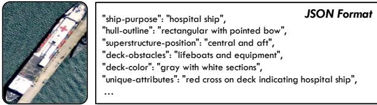  
Figure 5. Annotation process diagram.   
Figure 6. Annotation example on ShipRSImageNet.

# A. Annotation Process Diagram

The annotation process diagram is shown in Fig. 5.

# B. Annotation Example

As an example, we provide the attribute annotation result of the ship on ShipRSImageNet, as shown in Fig. 6.

# C. Predefined Attributes

The fine-grained attributes of ship and airplane in EVAttrs-95K are shown below. For each existing attribute, we offer an open-end description.

# Attributes of Ship

<table><tr><td rowspan=1 colspan=2>ship-visibility                 deck-conditionship-purpose                  deck-obstacles</td></tr><tr><td rowspan=1 colspan=2>ship-motion                   deck-colorship-capacity                 deck-structure</td></tr><tr><td rowspan=1 colspan=2>ship-load-status               deck-accessories</td></tr><tr><td rowspan=1 colspan=2>ship-cargo-status             passenger-facilities</td></tr><tr><td rowspan=1 colspan=2>ship-mooring-status          container-presence</td></tr><tr><td rowspan=1 colspan=2>hull-color                     container-count</td></tr><tr><td rowspan=1 colspan=1>hull-size</td><td rowspan=1 colspan=1>container-color</td></tr><tr><td rowspan=1 colspan=1>hull-shadow</td><td rowspan=1 colspan=1>container-layoaut</td></tr><tr><td rowspan=1 colspan=2>hull-outline                   container-alignment</td></tr><tr><td rowspan=1 colspan=2>superstructure-color          container-densitiessuperstructure-size           container-typesuperstructure-height        machinery-presencesuperstructure-position       locationpaint-condition               weather-conditionbow-design                   water-colorstern-design                  water-turbulencedeck-utilization               unique-attributes</td></tr></table>

# Attributes of Airplane

<table><tr><td rowspan=1 colspan=1>engine-color                  propeller-countengine-location               tail-color</td></tr><tr><td rowspan=1 colspan=1>engine-size                   tail-height</td></tr><tr><td rowspan=1 colspan=1>engine-type                   tail-material</td></tr><tr><td rowspan=1 colspan=1>engines-number              tail-shape</td></tr><tr><td rowspan=1 colspan=1>engines-shape                tail-type</td></tr><tr><td rowspan=1 colspan=1>engines-visible               wings-angle</td></tr><tr><td rowspan=1 colspan=1>fuselage-color                wings-color</td></tr><tr><td rowspan=1 colspan=1>fuselage-length               wings-material</td></tr><tr><td rowspan=1 colspan=1>fuselage-material             wings-shape</td></tr><tr><td rowspan=1 colspan=1>fuselage-shape               wings-span</td></tr><tr><td rowspan=1 colspan=1>nose-cone-color              wings-type</td></tr></table>

# D. Prompt Design

In this paper, we meticulously design three distinct prompts for annotating the EVAttrs-95K dataset, the GPT-assisted evaluation in EVBench and obtaining results from other MLLMs on the OAU task, excluding Eaglevision. The full prompts are provided as follows, with the blue text indicating sections that need to be replaced depending on the objects (ship or airplane).

# The Prompt for EVAttrs-95K Generation

Please perform fine-grained visual annotation of the center ship in the image based on different attributes (such as body color, body size, etc.).

Please strictly follow these requirements for annotation:   
1. All attributes must be consistent with the visual information of the provided image.   
2. Provide the confidence level for the annotation, ranging from 0 to 1, where 1 means you are absolutely confident that your annotation is correct. 3. Your annotation description for each attribute must be accurate.   
(VERY IMPORTANT)   
4. Your output must conform to JSON format, and only include the following attributes:   
confidence   
ship-visibility   
ship-purpose

# System Message

P standing. Each data sample includes:

[Instruction] {Instruction}

[Reference Answer] {Reference Answer}

[Assistant's Final Answer] {Assistant's Final Answer}

\*\*Evaluation Criteria:\*\*

1. \*\*Correctness:\*\*

ah answer in meaning, allowing for reasonable variations in expression.

_ \*\*Guidelines:\*\*

- \*\*Accurate:\*\* The attribute value matches the reference answer with minimal errors or reasonable varition in phrasing.

$^ { * * }$ Moderate:\*\* The attribute value is misaligned with the reference answer in meaning, or incomplete.

- \*\*Inaccurate:\*\* The attribute value is largely incorrect or misleading, with signifiant deviation fro the reference answer.

- \*\*Notes:\*\*

- Theassistant's answer hould match the reference answer inmeaning, even f the wording is different. For ele phrase ie "one, ot visible, "nvisble, minial", an simil expresions can e consd equivalent if they convey the same underlying concept of absence or near-absence.

I interpretation should be fexible enough toaccommodate slight differences in wording as long as the intende meaning remains clear.

Thesn anugyehnt, uhea ra the original meaning or causes ambiguity, it should be flagged as incorrect.

- Avoid penalizing the assistant for using reasonable variants unless it leads to misunderstanding or overcomplication of the reference meaning.

- I aattibuteisiteormisig  theassitant'anserass whether hesecec be y inferred or if it is critical to the answer.

2. \*\*Expressiveness:\*\*

\*\*Desciption:\*\*Assess whether eac attribute's value sfficiently conveys thenecssary inoration, mthi the level of detail required by the reference answer.

- \*\*Guidelines:\*\*

- \*\*Adequate:\*\* The value is clear and conveys the required information effectively, whether long, short o different variants.

# The Prompt for GPT-assisted Evaluation (2/2)

\*\*Scoring Guidelines:\*\* _ \*\*Scale:\*\* 1 to 5 - \*\*5:\*\* Excellent

Thttrbue vlu shicra wi aleatvrasmat theefeennswe meai clearly convey the required information, even if the phrasing differs slightly.

- \*\*4:\*\* Good

- The aribute value is mostly correct, with minor discrepancies in meaning, and stil convey the necessary information effectively.

_ \*\*3:\*\* Satisfactory T - $^ { * * } 2 \cdot ^ { * * }$ Needs Improvement reference answer.

_ \*\*1\*\* Poor

- Theattributevalu s copletely ncorrect misleadingcanot beunderstoo s a variant o the re answer, and fails to provide meaningful or necessary information.

\*\*Instructions:\*\*

\*Assess Correctness, and Expressiveness:\*\*Assess Correctness and xpressiveness or each attibute bas the criteria above.

2. \*\*Attribute Score:\*\* Provide a score for each attribute (1 to 5).

\*lanaion:\*\*riy ustythe cor or  attribute epecl  thee reasable vai phrasing or missing attributes that can be inferred.

\*\*Output Format:\*\* [Explanation] Your evaluation [attribute_name 1] $\{ 1 - 5 \}$ [attribute_name 2] {1-5} .…

# User

[Instruction]   
e object in a fine-grained manner.

[Reference Answer] y  h

[Assistant's Final Answer] {ship-visibility" "partial", ship-purpose "naval or military operations", }

Task Requirements:

Plese elpme detct al the ships i themage,determie the positns, and provide the cordnates the four corners f ther rotated bounding boxes with decimal precision.dentiy the class o each shipand provie fine-grained attribute descriptions based on the given categories and attributes.

Output Format:

The output must be in the JSON list format.

# Ship Classes:

List of all possible ship classes. Options: ["Container Ship", "Enterprise", "Container Ship", "Enterprise", "Tugboat", "Cargo", …]

# Ship Attributes:

List of all possible fine-grained ship attributes. ptons:[hip-visibility, ship-purpose, hip-motion, ship-capacity" hip-load-status", ]

Output Requirements:

ach ship must return ts \*class\*\*, \*\*positio\*\* (with decial precision), and \*\*attriutes\*\* (may coin multiple attributes).

2. The \*\*class\*\* and \*\*attributes\*\* should be chosen from the provided options.

T\*os\*  e abi o  e hi wi he coia x,, x2, y2, x3, y3, x4, y4] given in decimal precision.

The \*\*attributes\*\*shouldinclude the negraine descriptions base nthe hip visual characrisi.

For more convenient display, the prompt used for OAU results generation in Fig. 1 cancels the format restrictions and coordinate output requirements, and supplements the image-level description instruction.

# E. Implementation Details

For EagleVision with different sizes in multiple datasets, we determine their learning rates for training, following the basic principle, the larger model with the lower learning rate. In addition, except FAIR1M adopts a lower language loss weight $\lambda _ { q }$ , all other weights are the default 1.0.

# F. Additional Visualization Results

In this section, we provide more visualization and comparison results for object detection in Fig. 7, 8, and 9, and for object attribute understanding in Fig. 10, 11, and 12.

Table 6. The hyperparmeters for Eagle Vision.   

<table><tr><td>Dataset</td><td>Size</td><td></td><td></td><td>Ir λd λo λa λq n</td><td></td><td></td><td></td></tr><tr><td>ShipRS</td><td>1B 2B 4B 7B</td><td>6e-4 4e-4 1e-4 9e-5</td><td>1.0</td><td>1.0 1.0 1.0 64</td><td></td><td></td><td></td></tr><tr><td>MAR20</td><td>1B 2B 4B 7B</td><td>9e-4 6e-4 6e-4 1e-4</td><td></td><td>1.0 1.0 1.0 1.0 64</td><td></td><td></td><td></td></tr><tr><td>FAIR1M</td><td>1B 2B 4B 7B</td><td>1e-4 1e-4 6e-5 6e-5</td><td>1.0</td><td></td><td>1.0 1.0 0.1 64</td><td></td><td></td></tr></table>

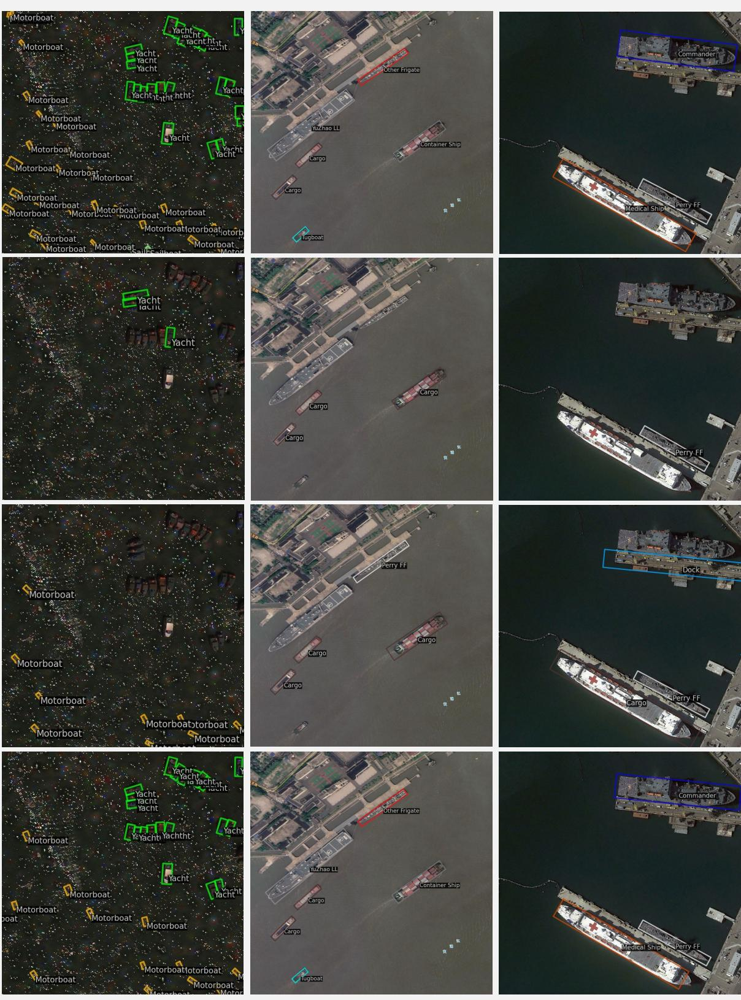  
Figure 7. Visualization results for object detection on ShipRSImageNet dataset

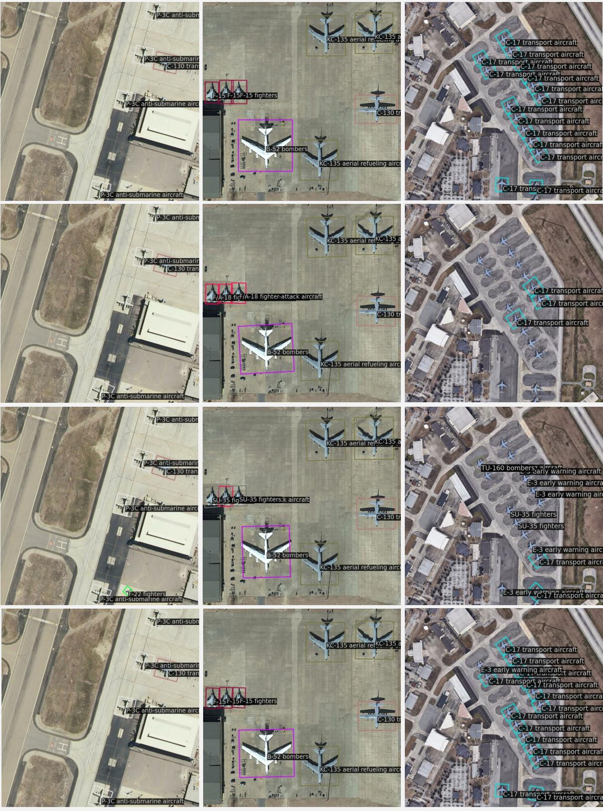  
Figure 8. Visualization results for object detection on MAR20 dataset.

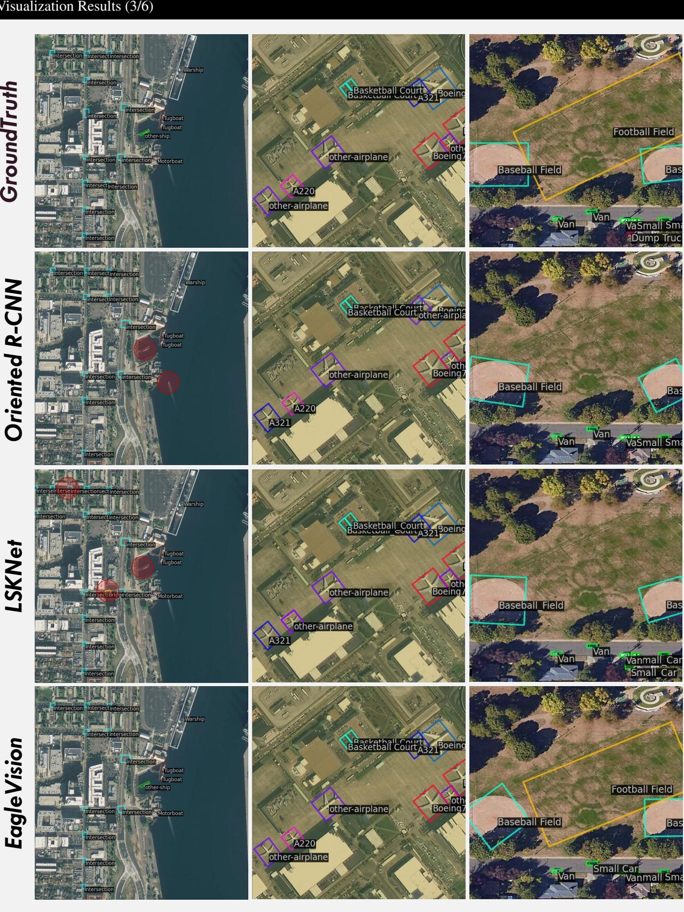  
Figure 9. Visualization results for object detection on the validation set of FAIR1M-v1.0 dataset.

# Qwen2-VL

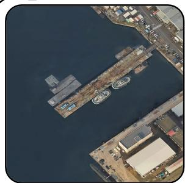

"json[

{"class": "Tugboat", "position": [123.456, 789.012, 123.457, 789.013, 123.458, 789.014, 123.459, 789.015], "attributes": [{"ship-visibility": "clear"}, {"shippurpose": "towing and pushing other vessels"}, {"ship-motion": "static"}, {"hull-color" "gray"}, {"superstructure-color": "white"}]},   
{"class": "Cargo", "position": [123.456, 789.012, 123.457, 789.013, 123.458, 789.014, 123.459, 789.015], "attributes": [{"ship-visibility": "clear"}, {"shippurpose": "transporting goods"}, {"ship-motion": "static"}, {"hull-color": "blue"}, {"superstructure-color": "white"}]}]""   
Note: The coordinates provided in the JSON output are placeholders and should be replaced with the actual coordinates of the ships in the image.'

# ChatGPT

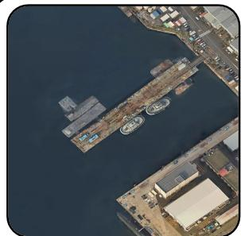

"ison[ {"class": "Tugboat", "position": [123.45, 67.89, 123.55, 67.89, 123.55, 67.79, 123.45, 67.79], "attributes": ["ship-visibility", "ship-purpose", "ship-motion", "hullcor", "hull-ize", "uperstructure-color", persrucureheight", "deck-utilizati"}, {"class": "Cargo", "position": [124.00, 68.00, 124.10, 68.00, 124.10, 67.90, ueshisii",hi-uros,hip-loas, "hull-color", "deck-color", "container-presence", "container-count"]}]

# GeoChat

Based on the given information, I can detect the following ships in the image: 1. A silver large ship at the center. 2. A gray large ship at the center. 3. A silver large ship at the top. 4. A gray large ship at the top. 5. A silver large ship at the top right. 6. A gray large ship at the top right. 7. A silver large ship at the bottom.

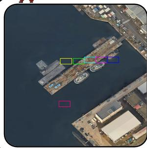

The position of these ships is as follows: 1. [39, 38, 47, 42] 2. [48, 38, 56, 42] 3. [56, 37, 64, 41] 4. [64, 37, 72, 41] 5. [72, 37, 80, 41] 6. [72, 37, 0.80, 41] 7. [38, 68, 46, 72]

Please note that the information provided is not sufficient to determine the exact class or purpose of each ship, but only their general category and relative position in the image.

# EagleVision

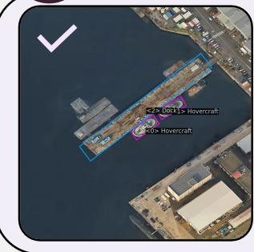  
Figure 10. Visualization results for object attribute understanding on the ShipRSImageNet dataset.

<0>..<|end|> <1> This object belongs to the "Hovercraft" category. Its shipl ship-capacity is medium, ship-load-status is unloaded, ship-mooring-status is moored, hull-color is white, hull-size is medium, hull-shadow is minimal, hull-outline is smooth, superstructure-color is white, superstructure-size is medium, superstructure-height is low, superstructure-position is centered, paint-condition is good, bow-design is rounded, stern-design is rounded, deck-utilization is low, deck-condition is clean, deck-color is white, deck-structure is simple, deck-accessories is minimal, passengerfacilities is present, container-count is O, machinery-presence is minimal, location is docked at a pier, weather-condition is clear, water-color is dark blue, waterturbulence is calm, unique-attributes is sleek design with a rounded hull. < |end $| >$

# Qwen2-VL

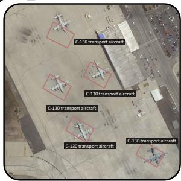

"json[ {"class": "C-130 transport aircraft", "position": [0.28, 0.1, 0.4, 0.17, 0.36, 0.25, 0.24, 0.19], "attributes": {"engines-number": 4, "engines-type": "turboprop", "fuselage-color": "gray", "wings-shape": "high-wing"}}, {"class": "C-130 transport aircraft", "position": [0.26, 0.4, 0.38, 0.47 , 0.34, 0.55, 0., 0.48], "attributes": {"engines-number": 4, "engines-type": "turboprop", "uselage-color" "gray", "wings-shape" "high-wing"}, {"class" ., "position": [0.49, 0.33, 0.61, 0.4, 0.57, 0.48, 0.45, 0.41], ...}, {"class": ., "position" [0.39, 0.64, 0.51, 0.71, 0.47, 0.79, 0.35, 0.72], ..}, {"class": .., "position": [0.79, 0.78, 0.91, 0.85, 0.87, 0.93, 0.75, 0.86], ..}]"\*

# ChatGPT

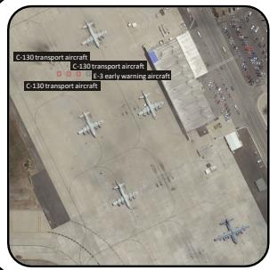

{"class": "C-130 transport aircraft", "position": [150.25, 200.75, 160.25, 200.75, 160.25, 212.25, 150.25, 212.25], "attributes": [{"fuselage-color": "ight gray"}, {"engine-location": "wing-mounted"}, {"engines-number": "four"}, {"tail-color": "light gray"}]},   
{"class": ….,"position": [180.25, 200.75, 190.25, 200.75, 190.25, 212.25, 180.25, 212.25], .,   
{"class": "E-3 early warning aircraft", "position": [240.25, 200.75, 250.25, 200.75, 250.25, 212.25, 240.25, 212.25], "attributes": [{"fuselage-color": "white"}, {"engine-location": "wing-mounted"}, {"engines-number": "four"}, {"tailcolor": "white"}, {"wings-shape": "straight"}}]" Z

# GeoChat

airplane $l = \{ < 2 8 > < 4 > < 3 6 > < 2 0 > | < 6 4 > \}$ with $< _ { P } > 1$ silver C-130 transport aircraft</ $\Rightarrow \{ < 2 8 > < 4 > < 3 6 > < 2 0 > | < 6 4 > \}$ at the top.

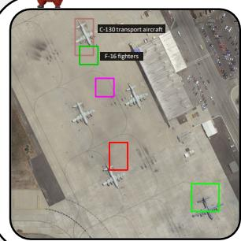

$< _ { P } > 1$ silver F-16 fighter $< / p > \{ < 3 0 > < 1 6 > < 3 8 > < 2 4 > | < 6 5 > \}$ at the top.   
$< _ { P } > 1$ silver airplane
 \{ < 3 7 > < 3 0 > < 4 5 > < 3 8 > | < 6 5 > \}$ in the center.   
$< _ { P } > 1$ silver airplane< $\int 1 0 > \{ < 4 3 > < 5 8 > < 5 1 > < 7 0 > | < 6 5 > \}$ at the bottom.   
$< _ { P } > 1$ silver airplane $< / { \mathsf { p } } >$ $\rho > \{ < 7 9 > < 7 6 > < 9 1 > < 8 8 > | < 6 5 > \}$ at the bottom right.

# EagleVision

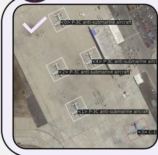  
Figure 11. Visualization results for object attribute understanding on the MAR20 dataset.

$< 0 > . . . < | e n d | > < { l } > . . . < | e n d | > < 2 > T h i s$ object belongs to the "p-3C antisubmarine aircraft" category. Its engine-color is white, engine-location is wingmounted, engine-size ismedium, engine-type s e engines-number ,  ueage color is white, fuselage-shape is tubular, nose-cone-color is white, propeller-count is 0, tail-color is white, wings-color is white, wings-shape is rectangular, . < | end|> $< 3 >$ This object belongs to the $\because 1 3 0$ transport aircraft" category. Its engine-color is gray, engine-location is wing-mounted, engine-size is medium, engine-type is turboprop, engines-number is 4, …, fuselage-color is gray, fuselage-shape is cylindrical, nose-cone-coloris gray, propeller-count is , tail-color isgray, wgscolor is gray, wings-shape is high-wing, wings-type is fixed. $< | \mathsf { e n d } | > < 4 > . . . < \mathsf { e n d } >$

# Qwen2-VL

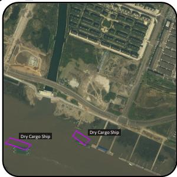

"jison[ {"class": "Dry Cargo Ship", "position": [0.04, 0.78, 0.16, 0.82, 0.13, 0.85, 0.01, 0.81], "attributes": {"ship-visibility": "clear", "ship-purpose": "cargo", "ship-motion" "static", "ship-capacity": "Iarge", "ship-load-status": "Ioaded", , "superstructurecolor" "white", superstructure-size": "medium", superstructure-height": "Iow", "superstructure-position": "center", paint-condition" "good", "bow-design conventional", stern-design"square", deck-utilization": "high", "deck-condition" "clean", "deck-obstacles": "none", "deck-color": "gray", "deck-accessories" conainers", "passgerfacilites" "none", "contaier-presence ye}, {"class": , "p": [0.42, 0.74, 0.5, 0.79, 0.47, 0.82, 0.4, 0.77], …]

# ChatGPT

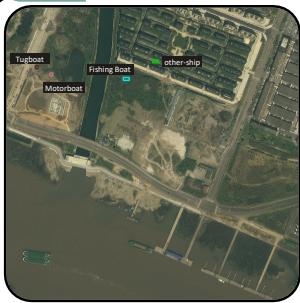

{"class": "Tugboat", "position": [100.5, 200.3, 110.5, 200.5, 110.7, 210.7, 100.7, 210.5], "attributes": [{"ship-visibility": "high", "ship-purpose": "towing", "hull-color" "green", "deck-color": "gray", "engine-type": "diesel", "engines-number": 2, .….}]}, {"class": "Motorboat", "position": [150.7, 225.2, 160.0, 225.4, 160.2, 235.9, 15.9, 235.7], atributes":[{"ship-purpose""leisure",ship-motion"mog" "hull-color" "blue", "hull-size" "small", "deck-color" "white", …}}, {"class": "Fishing Boat", "position": [400.1, 240.5, 420.3, 240.7, 420.5, 250.2, 400.3, 250.0], "attributes": [{"ship-purpose": "fishing", "hull-color": "red", .….}]}, {"class": "other-ship","position": [500.5, 180.2, 520.0, 180.4, 520.2, 190.8, .10. "h hulcolo el

# GeoChat

1. Passenger Ship at the bottom left

\* Class: Passenger Ship. \* Position: $[ 6 > < 8 1 > < 1 0 > < 9 3 ]$ Attributes: ship-purpose: passenger. ship-motion: stationary. ship-cargo-status: none. ship-mooring-status: at dock. hull-color: white. superstructure-color: white. superstructure-position: at dock. bow-design: smooth. stern-design: symmetrical deck-utilization: passenger. deck-color: white. container-presence: no. unique-attributes: none ...

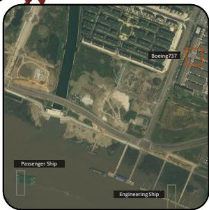

2. Engineering Ship at the bottom right   
\* Class: Engineering Ship. \* Position: $[ 8 0 > < 8 8 > < 8 4 > < 1 0 0 ]$ . \* Attributes: shippurpose: engineering. hull-color: gray. water-color: blue .   
3. Boeing7 37 airplane at the top right   
\*Class: Boeing737.\* Position: $[ 8 9 > < 2 1 > < 9 7 > < 2 9 ]$ \* Attributes: ..

# EagleVision

$< l > . . . < | e n d | > < 2 > . . . < | e n d | > < 3 >$ This object is a "Dry Cargo Ship". Its ship-ship-capacity is large, ship-load-status is loaded, ship-cargo-status is secured, hullcolor is dark green, hull-size is large, , paint-condition is worn, bow-design is rounded, stern-design is flat, deck-utilization is high, .…, machinery-presence is visible, location is waterway, weather-condition is clear, unique-attributes is cranes and stacked containers. $< | \mathsf { e n d } | > \mathsf { < } 4 >$ This object is a "Motorboat". Its ship-motion is aaulolhul superstructure-color is white, superstructure-size is medium, superstructure-height is low, container-count is O, weather-condition is clear, unique-attributes is minimal visible features. $< | \mathrm { e } n d | > < 6 > . . . < | \mathrm { e } n d | >$

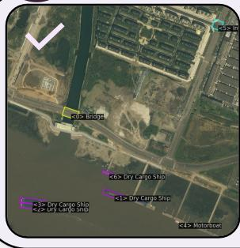

Figur 1.Visualization results for objec attribute understanding on the validation set of FAIR1M-v1.0 dataset