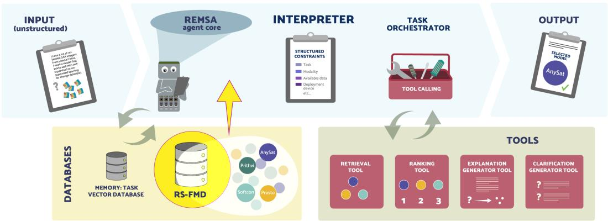

# 1. Bibliographic Information
## 1.1. Title
The full title is *REMSA: Foundation Model Selection for Remote Sensing via a Constraint-Aware Agent*. The central topic is developing an automated, constraint-aware system to select the most suitable publicly available remote sensing foundation model (RSFM) for a user's specific downstream task and deployment requirements.

## 1.2. Authors
Authors are Binger Chen, Tacettin Emre Bök, Behnood Rasti, Volker Markl, and Begüm Demir, all affiliated with Technische Universität Berlin & BIFOLD (Berlin Institute for the Foundations of Learning and Data), Berlin, Germany. All authors are active researchers in machine learning, data systems, and remote sensing, based at one of Europe's leading technical institutions for AI and geospatial research.

## 1.3. Journal/Conference
This work is currently released as a preprint on arXiv, and has not yet been formally published in a peer-reviewed venue. It targets top-tier computer vision/remote sensing venues such as CVPR or ECCV, which are the most influential outlets for this research area.

## 1.4. Publication Year
Preprint was published on 21 November 2025, so the publication year is 2025.

## 1.5. Abstract
The paper aims to solve the open challenge of selecting the most appropriate RSFM for a specific user task, which is currently complicated by scattered model documentation, heterogeneous model formats, and complex practical deployment constraints. To address this, the authors first introduce RS-FMD, the first structured, schema-guided database covering over 160 RSFMs spanning different data modalities, resolutions, and learning paradigms. Built on RS-FMD, they propose REMSA (Remote-sensing Model Selection Agent), a constraint-aware large language model (LLM) agent that enables automated RSFM selection directly from natural language user queries. REMSA combines structured metadata retrieval with a task-driven decision workflow, including query interpretation, missing constraint clarification, in-context learning-based ranking, and transparent justifications for selections. The work evaluates REMSA on a new benchmark of 100 expert-verified RS query scenarios, with 3,000 expert-scored model-system-model configurations across 4 systems and 3 LLM backbones. Results show REMSA consistently outperforms multiple baseline methods, demonstrating high practical utility for real-world decision-making. REMSA operates entirely on open, public metadata and does not access private or sensitive data.

## 1.6. Original Source Link
Original preprint source: https://arxiv.org/abs/2511.17442, PDF download: https://arxiv.org/pdf/2511.17442. Publication status: unpeer-reviewed preprint.

# 2. Executive Summary
## 2.1. Background & Motivation
The core problem this paper aims to solve is automated selection of the best RSFM for a user's unique task and constraints. This problem has become increasingly important as the field of remote sensing (RS) shifts from training task-specific models to using large pre-trained foundation models (FMs), with hundreds of new RSFMs publicly released in recent years.

Existing gaps and challenges:
1. Model information is scattered across unstructured sources (papers, GitHub repositories, model cards), with no unified, machine-readable database of RSFM properties.
2. Manual model selection is time-consuming, error-prone, and non-reproducible, especially for non-expert users.
3. Existing RSFM benchmarks only compare model performance on fixed, standardized tasks, and do not support matching models to user-specific constraints (e.g., compute budget, required modality, data availability).
4. No prior work has developed a domain-specific agent for RSFM selection; general LLMs and generic retrieval-augmented generation (RAG) lack the structured domain knowledge and decision workflow to handle this task well.

   The paper's entry point is to combine a curated structured database of RSFMs with a modular, task-aware LLM agent that can interpret natural language queries, resolve missing constraints, rank models based on user needs, and provide transparent explanations.

## 2.2. Main Contributions / Findings
The paper's three primary contributions are:
1. **RS-FMD:** The first structured, schema-guided public database of over 160 RSFMs, covering all major modalities, architectures, pretraining paradigms, and benchmark results. It is released as a maintained community resource for the RS field.
2. **REMSA Agent:** The first modular LLM-based constraint-aware agent for automated RSFM selection, with a task-aware orchestration workflow that integrates retrieval, rule-based filtering, in-context ranking, interactive constraint clarification, and transparent explanation generation.
3. **Benchmark & Evaluation Protocol:** A new benchmark of 100 realistic, expert-verified user query scenarios, and a novel expert-centered evaluation protocol, resulting in 3,000 expert-scored model-system configurations to enable rigorous comparison.

   Key findings:
- REMSA consistently outperforms all baselines (naive agent, retrieval-only, generic unstructured RAG) across all evaluation metrics and all three tested LLM backbones (GPT-4.1, DeepSeek 3.2, LLaMA-3.3-70B).
- Performance improvements come from the core architecture (structured schema grounding + task-aware orchestration) rather than any specific LLM backbone, so the approach is generalizable to future LLMs.
- REMSA correctly prioritizes core functional constraints (application compatibility, modality match) over superficial indicators like model popularity or recency, aligning with expert preferences.

# 3. Prerequisite Knowledge & Related Work
## 3.1. Foundational Concepts
All core concepts are defined below for beginners:
- **Foundation Model (FM):** A large-scale AI model pretrained on massive amounts of unlabeled data that can be adapted to a wide range of downstream tasks with minimal fine-tuning. For remote sensing, FMs are pretrained on large collections of satellite/aerial earth observation data to learn general geospatial representations.
- **Remote Sensing Foundation Model (RSFM):** A foundation model specifically designed and pretrained for remote sensing tasks, supporting diverse input modalities such as optical imagery, synthetic aperture radar (SAR), LiDAR, etc.
- **Large Language Model (LLM):** A transformer-based foundation model trained on massive text corpora that can understand and generate natural language, and perform complex multi-step reasoning.
- **Retrieval-Augmented Generation (RAG):** A technique that enhances LLMs by retrieving relevant external information from a knowledge base and injecting it into the LLM's prompt, to reduce hallucinations and improve accuracy on domain-specific tasks.
- **In-Context Learning (ICL):** The ability of large LLMs to perform new tasks without fine-tuning, by providing task descriptions and examples directly in the input prompt.
- **LLM Agent:** A system that uses an LLM as a core controller to orchestrate external tools, interact with users, and complete complex multi-step tasks.

## 3.2. Previous Works
### 3.2.1. RSFM Benchmarking and Model Selection
Prior work in RS has produced multiple surveys and benchmarks for RSFMs, such as GEO-Bench-2, Skysense, and recent surveys of RSFMs for earth observation. These works systematically evaluate RSFMs on fixed standardized tasks, but do not address automated selection for user-specific deployment constraints. Classical AutoML methods (e.g., Auto-WEKA, Auto-sklearn) automate algorithm and hyperparameter selection for traditional machine learning, but have not been extended to the problem of FM selection in the RS domain, which has unique constraints around modality, resolution, and deployment.

### 3.2.2. Tool-Augmented LLM Agents in Remote Sensing
Recent work has developed LLM agents for RS tasks such as geospatial question answering (GeoLLM-Squad, RS-Agent), multi-step RS workflow evaluation (ThinkGeo), and interactive dialog over multi-sensor data (EarthDial). All of these existing agents target downstream analysis tasks (e.g., information extraction, change detection) rather than the problem of RSFM selection.

## 3.3. Technological Evolution
The field of remote sensing AI has evolved in three main stages:
1. **Stage 1 (pre-2020):** Most RS models were small, task-specific models trained from scratch for individual downstream tasks. Model selection was a small, manual problem with few options.
2. **Stage 2 (2020-2024):** The rise of foundation models led to an explosion of new RSFMs, with hundreds of publicly available models released across different modalities and architectures. Manual selection became increasingly time-consuming and error-prone.
3. **Stage 3 (current):** The community now needs structured, automated solutions to match models to user needs. This paper fills this gap, representing the first dedicated solution for automated RSFM selection.

## 3.4. Differentiation Analysis
Compared to prior work, this paper has three core differentiators:
1. Compared to static RSFM benchmarks: This work goes beyond fixed task comparison to provide an interactive, automated selection system that adapts to user-specific constraints, rather than only comparing models on standardized tasks.
2. Compared to generic LLM agents and unstructured RAG: This work uses a structured, schema-guided database of model metadata, domain-specific hard constraint filtering, and task-aware adaptive orchestration, leading to significantly better selection quality than generic approaches.
3. Compared to classical AutoML: This work addresses the unique challenges of FM selection in the RS domain, with domain-specific handling of constraints around input modality, spatial/spectral resolution, sensor compatibility, and deployment requirements that do not exist in general AutoML.

# 4. Methodology
## 4.1. Core Principles
The approach is built on two core principles:
1. A reliable automated selection system requires a centralized, structured, machine-readable database of RSFM properties, to enable consistent querying and comparison of models.
2. A modular agent architecture with task-aware orchestration is needed to handle the ambiguity of natural language user queries, resolve missing constraints, and balance competing user requirements to produce high-quality, transparent recommendations.

## 4.2. Step 1: RS-FMD - Remote Sensing Foundation Model Database
RS-FMD is the structured knowledge base that underpins REMSA. It is curated via a semi-automated pipeline to ensure accuracy with minimal human effort.

### 4.2.1. Schema Design
RS-FMD uses a comprehensive, extensible schema that captures all critical properties of each RSFM:
- Core metadata: Unique model ID, name, version, release date, links to paper, code, and pretrained weights, number of citations, number of parameters, backbone architecture.
- Modality and sensor information: Supported input modalities, supported satellites/sensors, spatial, spectral, and temporal resolution information.
- Nested `PretrainingPhase` structure: Captures pretraining dataset properties, geographic coverage, time range, number of images, augmentation strategies, masking ratio, and other pretraining details.
- Nested `Benchmark` structure: Captures all reported evaluation results, including task type, dataset, performance metrics, and evaluation settings.

### 4.2.2. Semi-Automated Population and Confidence Scoring
To convert unstructured model information from papers and repositories into structured database entries, the authors use a schema-guided iterative LLM extraction pipeline, with confidence-guided human verification. To identify which fields need human review, the authors define a confidence score for each extracted field:
$$
\mathrm{Confidence} = w_{\mathrm{logp}} \cdot \mathrm{NormalizedLogProb} + w_{\mathrm{cons}} \cdot \mathrm{SelfConsistency}
$$

Explanation of all terms:
- $w_{\mathrm{logp}}$: Weight for the log probability term, empirically set to 0.7 (prioritized by the authors during validation).
- $\mathrm{NormalizedLogProb}$: The normalized log probability of the extracted field value, which quantifies the LLM's internal certainty about the generated output. It is normalized using a temperature-controlled sigmoid function with $\tau = 0.5$ to avoid saturation and preserve sensitivity for moderate-confidence values.
- $w_{\mathrm{cons}}$: Weight for the self-consistency term, empirically set to 0.3.
- $\mathrm{SelfConsistency}$: The fraction of independent LLM sampling iterations that agree on the same value for the field. Higher consistency indicates higher confidence in the extracted value.

  All fields with a confidence score below a threshold $\theta = 0.75$ are automatically flagged for human review. This approach minimizes human annotation effort: only uncertain fields are reviewed, not entire model records, making it feasible to curate 160+ models with limited effort.

### 4.2.3. Database Coverage
The current release of RS-FMD includes over 160 RSFMs, spanning all major modalities (RGB, multispectral, hyperspectral, SAR, LiDAR, vision-language), model architectures, spatial resolutions from sub-meter to coarse, and all common pretraining paradigms. The database is publicly available, with ongoing maintenance to add new RSFMs as they are released.

## 4.3. Step 2: REMSA Agent Architecture
REMSA is a modular LLM agent with two core layers: the LLM agent core (Interpreter + Task Orchestrator) and a set of external callable tools. The full architecture is shown below:

*Fig. 1: Original REMSA architecture from the paper*

### 4.3.1. End-to-End Agent Workflow
The full workflow of REMSA follows this step-by-step process:
1. Initialize: Set a clarification round counter to 0, with a maximum of 3 rounds to avoid user fatigue.
2. Repeat:
   a. Parse the user's free-text query into a set of structured constraints using the Interpreter component.
   b. If any mandatory constraints (target application, required input modality) are missing:
      i. If maximum clarification rounds have not been reached, generate questions to ask the user for missing information, increment the counter, and repeat parsing.
      ii. If maximum rounds have been reached, proceed with the available constraints.
3. Continue until all mandatory constraints are collected.
4. Retrieve an initial set of candidate models from RS-FMD using the Retrieval Tool.
5. Filter candidates with rule-based filtering to remove any models that violate hard user constraints.
6. If no candidates pass filtering: Select the closest matching candidate, generate an explanation, and return the result.
7. If the number of filtered candidates is larger than the maximum allowed for ranking: If clarification rounds are available, ask for additional constraints and repeat the process.
8. Rank the filtered candidates using the Ranking Tool, and compute the overall confidence of the ranking.
9. If overall ranking confidence is below threshold and clarification rounds are available: Ask for additional constraints and repeat the process.
10. Select the top-$k$ highest-ranked candidates.
11. Generate a human-readable explanation for the selected models, and return the final result.

### 4.3.2. Agent Core Components
- **Interpreter:** Parses free-text user input into a structured constraint object following a predefined schema, with mandatory fields (application, modality) and optional fields (sensor, spatial resolution, compute budget, performance requirements, geographic region, etc.).
- **Task Orchestrator:** Dynamically decides which tool to invoke at each step based on the current task state (number of candidates, missing constraints, ranking confidence), following the workflow above. This ensures adaptive, transparent tool invocation tailored to the specific query.

### 4.3.3. External Agent Tools
REMSA has four main callable tools, each designed for a specific step in the workflow:

#### 4.3.3.1. Retrieval Tool
The Retrieval Tool generates an initial high-recall candidate set from RS-FMD:
1. Each model metadata entry is embedded by prefixing each field with a type-indicator token (e.g., `[APPLICATION]`, `[MODALITY]`) to preserve structural information, then encoded using Sentence-BERT embeddings.
2. The structured user constraints are embedded using the same process.
3. Efficient cosine similarity search is performed using FAISS (Facebook AI Similarity Search) to retrieve the most relevant candidates.
4. The tool is optimized for high recall, so it includes soft matches to avoid eliminating relevant candidates early, leaving fine-grained filtering and ranking to downstream steps.

#### 4.3.3.2. Ranking Tool
The Ranking Tool refines the candidate list with a hybrid two-step approach:
1. **Rule-Based Filtering:** First, any candidate that violates hard user constraints (e.g., does not support the required modality, does not meet minimum performance requirements) is deterministically eliminated.
2. **In-Context LLM Ranking:** The remaining candidates are re-ranked by an LLM using in-context learning. The LLM is prompted with expert-crafted few-shot examples, instructed to prioritize hard constraints first, then secondary user preferences, and break ties by preferring more efficient, better-validated models. A confidence score is computed for the final ranking.

#### 4.3.3.3. Clarification Generator Tool
If the orchestrator detects missing mandatory constraints or low overall ranking confidence, this tool generates targeted clarification questions based on the missing fields in the constraint schema. It limits clarification to 3 rounds maximum to avoid user fatigue, and integrates user responses back into the constraint set to refine the selection.

#### 4.3.3.4. Explanation Generator Tool
After the final ranking is obtained, this tool generates a structured, human-readable explanation for each selected model, including why it matches the user's constraints, key trade-offs compared to other candidates, and links to the original paper and code repository. This improves transparency and user trust in the selection.

Additionally, REMSA includes a lightweight Task Memory component that stores past user interactions in a vector database, to enable personalization and improve future interactions by retrieving relevant past context.

# 5. Experimental Setup
## 5.1. Benchmark Dataset
The authors constructed a new benchmark of 100 diverse, realistic natural language user queries, designed to cover the full range of common RS use cases and constraints. Queries are generated from 16 structured templates spanning 4 constraint categories:
1. **Data Availability:** No labeled training data, sufficient labeled data, few-shot labels, unlabeled data only, data adaptation needed.
2. **Computational Resources:** Limited (CPU-only laptop), moderate (desktop with single GPU), high (cloud GPU cluster).
3. **Application Complexity:** Simple, moderate, complex/fine-grained.
4. **Evaluation Priorities:** Accuracy-focused, output quality-focused, coverage-focused, speed-focused.

   Slot values (application, modality, sensor, region) are sampled from a predefined vocabulary and paraphrased by an LLM to create natural, realistic queries. All queries are verified for accuracy by RS domain experts. For evaluation, each top-3 model selected by each system and LLM backbone is scored independently by two RS experts, resulting in 3,000 total expert-scored configurations.

## 5.2. Evaluation Metrics
Five complementary metrics are used for evaluation, all defined below:

### 5.2.1. Average Top-1 Score
**Conceptual Definition:** The average of the expert's final score for the top-ranked model across all queries. This measures how well the system's highest-recommended model aligns with expert preferences and user requirements.
The expert's final score for a model is a weighted sum of 7 criteria (Application Compatibility: 25%, Modality Match: 20%, Reported Performance: 20%, Efficiency: 15%, Generalizability: 10%, Popularity: 5%, Recency: 5%), linearly mapped to a 1-100 scale, where 100 is a perfect score.

### 5.2.2. Average Set Score
**Conceptual Definition:** The average of the expert scores for all three top-ranked models across all queries. This measures the overall quality of the full set of recommendations, not just the top-ranked model.

### 5.2.3. Top-1 Hit Rate
**Conceptual Definition:** The fraction of queries where the system's top-ranked model matches the expert's highest-scored model across all candidates from all systems. This measures ranking precision at the top position.
$$
\text{Top-1 Hit Rate} = \frac{\text{Number of queries where system top-1 = expert top-1}}{\text{Total number of queries}}
$$

### 5.2.4. High-Quality (HQ) Hit Rate
**Conceptual Definition:** The fraction of queries where the system's top-ranked model has a final expert score of at least 80 (out of 100), meaning it is a high-quality, suitable recommendation for the user's needs.
$$
\text{HQ Hit Rate} = \frac{\text{Number of queries where system top-1 score} \geq 80}{\text{Total number of queries}}
$$

### 5.2.5. Mean Reciprocal Rank (MRR)
**Conceptual Definition:** Measures how highly the expert-preferred model is ranked in the system's top-3 output. MRR ranges from 0 to 1, with higher values indicating better ranking quality.
$$
\text{MRR} = \frac{1}{Q} \sum_{i=1}^{Q} \frac{1}{rank_i}
$$
Where $Q$ is the total number of queries, and $rank_i$ is the rank of the expert-preferred model in the system's output for query $i$. If the expert-preferred model is not in the top-3, $\frac{1}{rank_i} = 0$.

## 5.3. Baselines
Three baselines are used, each designed to test the contribution of a specific component of REMSA:
1. **REMSA-NAIVE:** Uses the same RS-FMD database and toolset as REMSA, but replaces REMSA's adaptive task-aware orchestration with basic default LangChain sequential orchestration, where the LLM chooses tools independently without structured multi-step coordination. This tests the contribution of REMSA's custom orchestration logic.
2. **DB-RETRIEVAL:** Returns top-$k$ models directly from FAISS dense similarity retrieval, removing all other components (ranking, clarification, orchestration). This tests the contribution of LLM-based constraint reasoning and ranking beyond just similarity-based retrieval.
3. **UNSTRUCTURED-RAG:** A generic RAG setup where the LLM receives the original user query and unstructured model descriptions, and outputs top-$k$ models. This tests the value of REMSA's structured schema and modular agent design compared to generic unstructured RAG.

## 5.4. LLM Backbones
To test robustness across different LLMs, experiments are run with three different backbones: GPT-4.1 (OpenAI, primary backbone), DeepSeek 3.2, and LLaMA-3.3-70B (Meta). To ensure consistency and avoid evaluator bias, all clarification rounds during evaluation are automatically simulated by an LLM acting as the user, with no human involvement in the interaction process.

# 6. Results & Analysis
## 6.1. Core Results Analysis
REMSA consistently outperforms all baselines across all metrics and all three LLM backbones, as shown in the full results tables below.

The following are the results from Table 2 of the original paper (GPT-4.1 backbone):

<table>
<thead>
<tr>
<th>System</th>
<th>Avg Top-1</th>
<th>Avg Set</th>
<th>Top-1 Hit</th>
<th>HQ Hit</th>
<th>MRR</th>
</tr>
</thead>
<tbody>
<tr>
<td>REMSA (Ours)</td>
<td>75.76</td>
<td>75.03</td>
<td>21.33%</td>
<td>40.00%</td>
<td>0.34</td>
</tr>
<tr>
<td>REMSA-Naive</td>
<td>72.67</td>
<td>72.00</td>
<td>20.00%</td>
<td>37.33%</td>
<td>0.29</td>
</tr>
<tr>
<td>DB-RETRIEVAL</td>
<td>67.37</td>
<td>68.87</td>
<td>12.00%</td>
<td>17.33%</td>
<td>0.23</td>
</tr>
<tr>
<td>Unstr.-RAG</td>
<td>71.23</td>
<td>68.39</td>
<td>13.33%</td>
<td>30.67%</td>
<td>0.24</td>
</tr>
</tbody>
</table>

The following are the results from Table 3 of the original paper (DeepSeek 3.2 backbone):

<table>
<thead>
<tr>
<th>System</th>
<th>Avg Top-1</th>
<th>Avg Set</th>
<th>Top-1 Hit</th>
<th>HQ Hit</th>
<th>MRR</th>
</tr>
</thead>
<tbody>
<tr>
<td>REMSA (Ours)</td>
<td>75.35</td>
<td>73.81</td>
<td>18.67%</td>
<td>40.00%</td>
<td>0.30</td>
</tr>
<tr>
<td>REMSA-Naive</td>
<td>72.03</td>
<td>71.83</td>
<td>16.51%</td>
<td>36.89%</td>
<td>0.26</td>
</tr>
<tr>
<td>DB-RETRIEVAL</td>
<td>67.37</td>
<td>68.87</td>
<td>12.00%</td>
<td>17.33%</td>
<td>0.23</td>
</tr>
<tr>
<td>Unstr.-RAG</td>
<td>69.19</td>
<td>70.94</td>
<td>10.67%</td>
<td>24.00%</td>
<td>0.24</td>
</tr>
</tbody>
</table>

The following are the results from Table 4 of the original paper (LLaMA-3.3-70B backbone):

<table>
<thead>
<tr>
<th>System</th>
<th>Avg Top-1</th>
<th>Avg Set</th>
<th>Top-1 Hit</th>
<th>HQ Hit</th>
<th>MRR</th>
</tr>
</thead>
<tbody>
<tr>
<td>REMSA (Ours)</td>
<td>73.39</td>
<td>70.34</td>
<td>14.67%</td>
<td>32.00%</td>
<td>0.26</td>
</tr>
<tr>
<td>REMSA-Naive</td>
<td>69.02</td>
<td>69.00</td>
<td>14.23%</td>
<td>29.47%</td>
<td>0.24</td>
</tr>
<tr>
<td>DB-RETRIEVAL</td>
<td>67.37</td>
<td>68.87</td>
<td>12.00%</td>
<td>17.33%</td>
<td>0.23</td>
</tr>
<tr>
<td>Unstr.-RAG</td>
<td>69.87</td>
<td>68.04</td>
<td>10.00%</td>
<td>26.67%</td>
<td>0.22</td>
</tr>
</tbody>
</table>

Key observations:
1. REMSA outperforms all baselines on all metrics for all three backbones, confirming that the performance gains come from the architecture, not a specific LLM.
2. Performance is strongest with GPT-4.1, followed closely by DeepSeek 3.2, with LLaMA-3.3-70B slightly lower but still outperforming all baselines. High-quality hit rate is identical (40%) for GPT-4.1 and DeepSeek 3.2, showing that high-quality candidate selection is robust across strong LLM backbones.
3. REMSA's adaptive orchestration improves performance over naive orchestration: for GPT-4.1, Average Top-1 increases from 72.67 to 75.76, and MRR from 0.29 to 0.34, confirming that the task-aware control logic adds meaningful value.
4. Generic unstructured RAG performs much worse than REMSA, even with access to the same model information, showing that structured constraint handling and modular reasoning is critical for this task.
5. Latency: REMSA has an average end-to-end latency of 31.7s per query, which is higher than faster baselines (DB-RETRIEVAL: 0.77s, Unstructured RAG: 11.9s, REMSA-Naive: 22.7s), but the additional latency leads to consistent, significant improvements in selection quality, which is a worthwhile trade-off for this task.

## 6.2. Sensitivity Analysis on Evaluation Criteria
The authors conducted a sensitivity analysis to understand how different evaluation criteria contribute to overall performance, by removing each criterion individually from the expert scoring and re-evaluating results. The results are shown below:

The following are the results from Table 5 of the original paper:

<table>
<thead>
<tr>
<th>Criteria Setting</th>
<th>Avg Set</th>
<th>Top-1 Hit</th>
<th>MRR</th>
</tr>
</thead>
<tbody>
<tr>
<td>Full Scoring (All Criteria)</td>
<td>75.03</td>
<td>22.67%</td>
<td>0.38</td>
</tr>
<tr>
<td>w/o Application Compatibility</td>
<td>73.32</td>
<td>21.33%</td>
<td>0.36</td>
</tr>
<tr>
<td>w/o Modality Match</td>
<td>70.88</td>
<td>22.67%</td>
<td>0.36</td>
</tr>
<tr>
<td>w/o Reported Performance</td>
<td>75.05</td>
<td>22.67%</td>
<td>0.38</td>
</tr>
<tr>
<td>w/o Efficiency</td>
<td>80.23</td>
<td>25.33%</td>
<td>0.38</td>
</tr>
<tr>
<td>w/o Popularity+Recency</td>
<td>75.13</td>
<td>25.33%</td>
<td>0.39</td>
</tr>
<tr>
<td>w/o Generalizability</td>
<td>75.10</td>
<td>22.67%</td>
<td>0.38</td>
</tr>
</tbody>
</table>

Key insights:
1. Removing *Application Compatibility* and *Modality Match* leads to clear performance drops, which confirms that REMSA correctly prioritizes these core functional constraints, which are the most important for selecting a suitable model.
2. Removing *Reported Performance* and *Generalizability* leads to almost no change in overall performance, meaning these dimensions are already captured implicitly by other core criteria in the current benchmark.
3. Removing *Efficiency* or *Popularity + Recency* leads to a small performance gain. This suggests that while these criteria add practical relevance for deployment, they can occasionally favor well-known or small models over technically optimal models. The result confirms that REMSA does not overfit to superficial indicators like citations or recency, and prioritizes core compatibility first, as expected.

# 7. Conclusion & Reflections
## 7.1. Conclusion Summary
This paper addresses the critical emerging problem of automated RSFM selection, which becomes increasingly important as hundreds of new RSFMs are released every year. The core contributions are: (1) RS-FMD, the first structured, schema-guided public database of over 160 RSFMs; (2) REMSA, the first modular constraint-aware LLM agent for automated RSFM selection from natural language queries; (3) a new expert-annotated benchmark and evaluation protocol for this task. Extensive experiments across three LLM backbones show that REMSA consistently outperforms all baselines, demonstrating its effectiveness and practical utility for real-world remote sensing workflows.

## 7.2. Limitations & Future Work
The authors identify two main limitations of the current work:
1. The benchmark includes 100 expert-annotated queries, which already required 3,000 expert ratings and substantial annotation effort, but may still miss rare or emerging use cases.
2. The ranking step relies on in-context learning rather than supervised fine-tuned learning-to-rank, which may limit performance on very complex queries with many overlapping constraints.

   Suggested future directions:
* Expand the benchmark to cover more diverse and complex scenarios.
* Explore supervised or reinforcement learning-based adaptive ranking strategies to improve performance on complex queries.
* Extend the system to support end-to-end workflows including automatic fine-tuning and deployment after model selection.

## 7.3. Personal Insights & Critique
This work fills a major practical gap for the remote sensing community, and provides a well-designed, rigorous solution that will be useful for both expert and non-expert practitioners working with RSFMs. The approach is clever in that it leverages existing LLM capabilities without requiring fine-tuning, making it easy to update the database with new models as they are released. The expert-driven evaluation protocol sets a high standard for future work on this problem.

The core idea of a structured domain database plus a constraint-aware agent is broadly generalizable beyond remote sensing: it can be applied to other domains with similar model selection challenges, such as medical imaging foundation models, domain-specific NLP models, or edge-deployed AI models, so this work has impact beyond the RS community.

One potential area for future improvement is integrating lightweight downstream performance prediction into the ranking step, to estimate how a model will perform on the user's specific dataset, beyond just relying on reported benchmark results. This could further improve selection quality for users with unusual or domain-specific data.