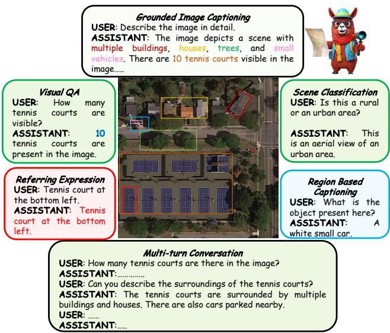
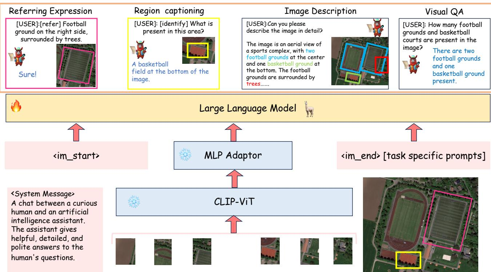
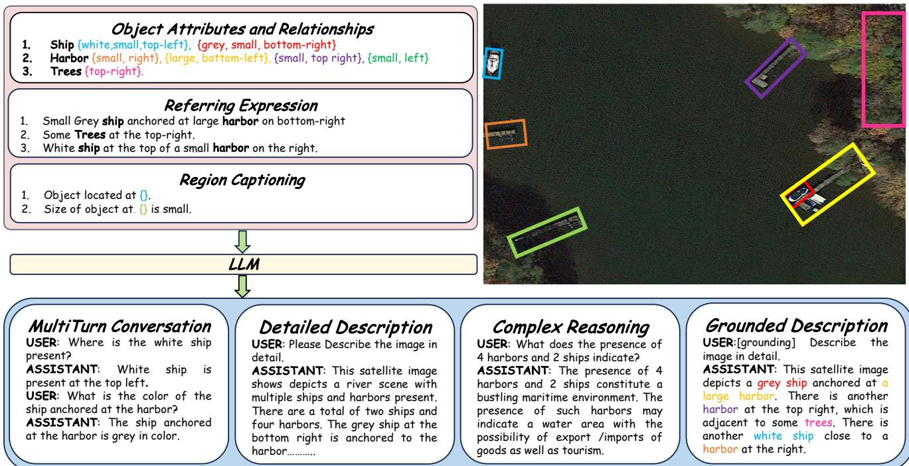
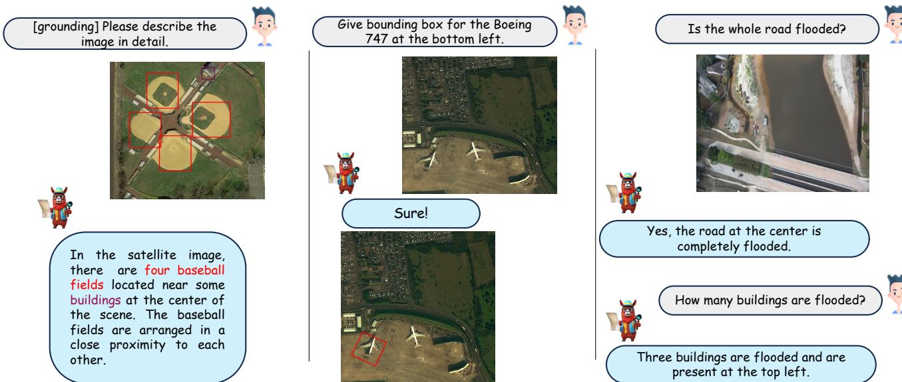

# GChatGrodd Larision-Language Model o Remote e

Kartik Kuckreja1, 2\* Muhammad Sohail Danish1\* Muzammal Naseer1 Abhijit Das2 Salman Khan1, 3 Fahad Shahbaz Khan1, 4 1Mohamed bin Zayed University of AI, 2Birla Institute of Technology & Science, Hyderabad 3Australian National University, 4Linköping University kartik.kuckreja@mbzuai.ac.ae, muhammad.sohail@mbzuai.ac.ae

# Abstract

Recent advancements in Large Vision-Language Models (VLMs) have shown great promise in natural image domains, allowing users to hold a dialogue about given visual content. However, such general-domain VLMs perform poorly for Remote Sensing (RS) scenarios, leading to inaccurate or fabricated information when presented with RS domain-specific queries. Such a behavior emerges due to the unique challenges introduced by RS imagery. For example, to handle high-resolution RS imagery with diverse scale changes across categories and many small objects, regionlevel reasoning is necessary alongside holistic scene interpretation. Furthermore, the lack of domain-specific multimodal instruction following data as well as strong backbone models for RS make it hard for the models to align their behavior with user queries. To address these limitations, we propose GeoChat - the first versatile remote sensing VLM that offers multitask conversational capabilities with high-resolution RS images. Specifically, GeoChat can not only answer image-level queries but also accepts region inputs to hold region-specific dialogue. Furthermore, it can visually ground objects in its responses by referring to their spatial coordinates. To address the lack of domain-specific datasets, we generate a novel RS multimodal instruction-following dataset by extending imagetext pairs from existing diverse RS datasets. We establish a comprehensive benchmark for RS multitask conversations and compare with a number of baseline methods. GeoChat demonstrates robust zero-shot performance on various RS tasks, e.g., image and region captioning, visual question answering, scene classification, visually grounded conversations and referring detection. Our code is available here.

# 1. Introduction

In the natural image domain, the abundance of aligned image-text data sourced from web imagery or manual annotations facilitate effective self-supervised vision-language modeling, as demonstrated by multimodal GPT-4 [23] and open-source initiatives like LLaVA [19]. These visionlanguage models (VLMs), developed through generative pretraining and instruction-tuning, exhibit robust zero-shot task completion across various user-oriented multimodal tasks. The resulting capabilities open the door to the development of versatile multimodal conversational assistants with broad applications in real-world scenarios [12].

  
Figure 1. GeoChat can accomplish multiple tasks for remotesensing (RS) image comprehension in a unified framework. Given suitable task tokens and user queries, the model can generate visually grounded responses (text with corresponding object locations - shown on top), visual question answering on images and regions (top left and bottom right, respectively) as well as scene classification (top right) and normal natural language conversations (bottom). This makes it the first RS VLM with grounding capability.

However, general-domain VLMs designed for natural images, exhibit poor performance when presented with remotely sensed visual imagery. The performance disparity arises primarily from the distinct nature of content found in remote sensing image-text pairings compared to the publicly available web data. As a result, general-domain VLMs can provide inaccurate information or hallucinate when presented with spatial images from RS sensors. Although there has been significant progress in the field of remote sensing visual question answering (VQA) [38, 40], earlier methods have framed the task as a classification problem. Here, the model chooses answers from predetermined responses found in the training data. It limits their applicability to open-ended answer generation and instruction-following. In this paper, we introduce GeoChat, an attempt to extend multimodal instruction-tuning to the remote sensing domain for training a multitask conversational assistant. However, remote-sensing domain lacks a multimodal instruction-tuning conversational dataset. Inspired by recent work in instruction-tuning [14, 19, 41], GeoChat uses Vicuna-v1.5 [7] and an automated pipeline to generate diverse remote sensing multimodal instruction-following data comprising of nearly $3 1 8 k$ instructions. We create the image-text pairs from various existing remote sensing datasets developed for diverse tasks. These includes LR-BEN for VQA [20], NWPU-RESISC-45 for scene classification [5] and SAMRS for object detection [30]. A crucial capability of GeoChat is the unification of multiple image and region-level reasoning tasks for RS imagery within a single pipeline (see Fig. 1). We achieve this via distinct task tokens that help suitably direct the model's responses according to user requirements. In addition, the model uses spatial location representations in its inputs to seamlessly reason about local regions and can also generate object locations in its responses to visually ground objects. This enables a diverse set of tasks possible with GeoChat including referring expression detection, image/region captioning, scene classification, natural language conversations and VQA, besides visually grounded conversations. In summary, this work has the following contributions: •RS multimodal instruction following dataset. We present a novel data generation pipeline, to leverage existing object detection dataset [30] to create short descriptions of the images, followed by using Vicuna-v1.5 [7] to create conversations using the generated text alone. Further, we add visual question-answering and scene classification abilities using their corresponding datasets [5, 20]. This results in a total of $3 1 8 k$ instruction pairs for RS domain. •GeoChat. Leveraging our dataset, we finetune LLaVA-1.5 [14] to create the remote sensing-domain visionlanguage model - GeoChat. Our LoRA [11] fine-tuning is efficient and avoids forgetting the necessary context embedded in fully-tuned LLaVA model, whose MLP projection is trained to align images into the word embedding space of the LLM (Vicuna-v1.5 [7]). This allows GeoChat to retain the conversation and instruction following abilities of LLaVA and extend its domain-knowledge to remote sensing tasks. • We also address the lack of evaluation benchmarks to assess the capability of existing VLMs on remote-sensing conversations. To this end, we setup evaluation protocols for conversation grounding in RS, as well as a setup a suite of tasks to allow comparisons with future efforts in this direction. We show various supervised as well as zero-shot evaluations for different remote sensing tasks, including image captioning, visual question answering and scene classification to demonstrate the generalisability of GeoChat conversational VLM.

# 2. Related Work

Large Vision-Language Models. The typical architecture of instruction-following Vision Language Models (VLMs) consists of utilising a pre-trained visual backbone[9] to encode visual data, a large language model [7] for interpreting user instructions and generating responses, and a visionlanguage cross-modal connector, e.g., a linear projection layer [18, 41] or an MLP [17], for fusing visual information with language models. The results achieved with VLMs show great promise; for example, LLaVA [18], Instruct-BLIP [8], Otter [13] and MiniGPT-4 [41] show remarkable gains in language instruction following and visual reasoning ability for natural scenes. More recent studies have shown that these models can be adapted to other domains such as videos [22], biomedical [14, 29] and remote sensing [12].

Remote Sensing VLMs. The application of generalized VLMs in remote sensing is comparatively sparse. The majority of research so far has neglected the semantic understanding of the items and their relationships towards a deep visual comprehension. Beyond merely identifying the objects in an image, vision-language models are also capable of generating natural language descriptions of the image and inferring the connections between the objects. This makes them more appropriate for tasks like text-based image retrieval, captioning images, and answering visual questions that call for both visual and linguistic knowledge. Although there has been progress in vision language models for remote sensing tasks, such as image captioning [42], zero-shot classification [16] and visual question answering [3, 38], these models can only perform a specific task they are trained for, lack conversational capability and do not possess generic semantic knowledge about the remote sensing images. A major gap exists in the remote sensing domain towards developing general-purpose models to solve all tasks together, while also maintaining conversation abilities. While RSGPT [12] is an initial effort that has shown good conversation ability along with solving multiple tasks, it requires finetuning the model for each task separately, which makes it cumbersome and not generalizable. Further, RSGPT cannot work for region-level reasoning or visual grounding, which our work aims to address.

# 3. GeoChat: Grounded Remote Sensing VLM

Visually grounded conversations for remote sensing aim to generate textual responses interleaved with corresponding object locations. Further, a user can also provide visual prompts (e.g., a bounding box) besides natural language questions, and the model should be able to answer questions about the specified Region of Interest (RoI). Such seamless interplay between visual and language modalities necessitate a deep comprehension of linguistic constructions that denote particular objects or elements in a visual scene. As mentioned above, GeoChat is the first model capable of holding visually grounded conversations about remotely sensed images. By construction, GeoChat can address not only the challenging task of visually grounded conversations, but can also perform a spectrum of other spatial reasoning tasks that span varying levels of granularity in visual imagery understanding e.g., image/region captioning, referring object detection and image/region-level conversations about remotely sensed images. We formally outline the tasks possible with GeoChat below. a) Image-Level Conversation Tasks. In this task, GeoChat processes an image $_ { \textbf { \em x } }$ and a user text query $\pmb q$ without any specific spatial coordinates in its inputs or outputs. The goal is to perform conversation-based tasks at a holistic level with image-wide context, such as visual question answering (VQA), scene classification and image captioning. b) Region-Level Conversation Tasks. This task involves providing spatial box locations $^ { b }$ in the input to GeoChat besides $_ { \textbf { \em x } }$ and $\pmb q$ Region locations $^ { b }$ guide the model's attention to specific regions within the image, so that the model can perform tasks such as region-level captioning, region-specific VQA or multi-turn conversation. c) Grounded Conversation Tasks. With the use of special tokens, termed as task-specification tokens $\pmb { t }$ , GeoChat can be guided to provide object locations at different granularities, while maintaining conversation abilities. It helps in tasks including grounded image captioning/conversation, object grounding and referring expression detection.

# 3.1. GeoChat Architecture

GeoChat follows the architecture as of LLaVA-v1.5 [17], which consists of three core components, i) Global Image encoder, ii) an MLP adaptor (two linear layers) and iii) LLM. Different to LLaVA, we add specific task prompt that indicates the type of task desired from the model i.e., grounding, image-level or region-level conversations. Additionally, we allow spatial positions within both inputs and outputs, enabling visual prompts as inputs and grounded objects in GeoChat outputs. Notably, the original LLaVA model cannot perform object grounding or accept region inputs. Further, the original LLaVA can not reason about remote sensing images which is enabled via our domainspecific dataset. We describe each component in the architecture as follows:

Table 1. Instruction following data used to train GeoChat. Instruction types and format are shown. We use a $3 0 6 \mathrm { k }$ set for training and a separate 12k instruction-set for testing.   

<table><tr><td>Data</td><td>Size</td><td>Response formatting prompts</td></tr><tr><td>Detailed Description</td><td>30k</td><td>Describe the image in detail.</td></tr><tr><td>Multi-Round Conversation</td><td>65k</td><td>-</td></tr><tr><td>Complex Questions</td><td>10k</td><td>-</td></tr><tr><td>RSVQA-LRBEN[20]</td><td>56k</td><td>Answer the question using a single word or phrase.</td></tr><tr><td>NWPU-RESISC-45[5]</td><td>31.5k</td><td></td></tr><tr><td>Floodnet[25]</td><td>4k</td><td></td></tr><tr><td>Grounding Description</td><td>45k</td><td>[grounding] Describe the image in detail.</td></tr><tr><td>Region Captioning</td><td>40k</td><td>[identify] {bx_left, by,top, bx_right, bybottom|θ}</td></tr><tr><td>Referring Expression</td><td>25k</td><td>[refer] &lt; p &gt; Object &lt; /p &gt;</td></tr></table>

Task Token: The unique quality of GeoChat is its ability to easily switch between different types of remote sensing visual interpretation tasks. To eliminate uncertainty among tasks, our approach assigns a unique task identification to each one. We suggest three distinct task identities, $\mathbf { \boldsymbol { t } } \in \mathbf { \boldsymbol { \mathbf { \mathit { t } } } }$ {grounding, identify, refer}, each for grounded conversations, region captioning and referring expression comprehension. As for the case of visual question answering and scene classification, we directly ask the model to output the answer in a single word or phrase, as shown in Table 1. Our approach does not employ any task identification tokens for vision-irrelevant commands. This unified approach is supported by a modular design that efficiently integrates spatial data, giving the model flexibility in its reasoning about visual content.

Spatial Location Representation. Our model must precisely identify the spatial position of the referenced items for tasks such as grounded conversations, referring expression generation, and comprehension. To this end, we represent the box locations in a textual format to express the geographical position: $\boldsymbol { b } = \{ b _ { \mathrm { x \_ l e f t } } , b _ { \mathrm { y \_ t o p } } , b _ { \mathrm { x \_ r i g h t } } , b _ { \mathrm { y \_ b o t t o m } } | \theta \}$ . Here, $b _ { \mathrm { x \mathrm { . l e f t } } } , b _ { \mathrm { y \mathrm { . t o p } } }$ denote the top left corner point of box while the $b _ { \mathrm { x . r i g h t } } , b _ { \mathrm { y . b o t t o m } }$ represent the bottom right corner coordinates. The angle $\theta$ represents the angle of rotation for the bounding box, from the lower edge. Numerical values normalised within the interval [0, 100] are used to represent the $\mathbf { X }$ and y coordinates. Region locations in this format are used to interact with the model via its inputs and outputs. Visual Backbone. GeoChat adapts the pretrained vision backbone of CLIP-ViT(L-14) [28], which has an input resolution of $3 3 6 \times 3 3 6$ This results in effectively 576 patches per image. Since this resolution is not sufficient to understand details presented in remote sensing imagery (e.g., small objects and object details), we interpolate the positional encoding in the transformer-based CLIP [28] model to scale with input image sizes of $5 0 4 \times 5 0 4$ Although this leads to an increase in the number of patches to almost double (i.e., 1296 per image), this enhanced resolution allows us to handle larger image sizes and also supports better visual grounding in high-resolution RS images.

  
. 1 .   
Figure 3. Multi-task instruction template for GeoChat.

MLP Cross-modal Adaptor. From the frozen CLIP-ViT[28], we project the output tokens $( \in \mathbb { R } ^ { 1 2 9 6 \times 1 0 2 4 } )$ with dimensions 1024 onto the language model space, using an MLP adaptor with one hidden layer. The adaptor has an input dimensionality of 1024 and outputs a vector of size 4096, corresponding to the input size of the LLM [7]. A GeLU [10] is used as the activation function. Large Language Model. The open source Vicunav1.5(7B) [7] large language model is utilised as the foundation for GeoChat. The language model functions as a single interface for diverse vision-language inputs in our framework. To accomplish different vision-language tasks, we directly depend on the Vicuna-v1.5(7B) [7] language tokens. We explicitly interact with the language model to construct textual representations of bounding boxes to express their spatial coordinates for the visual grounding tasks that require the production of spatial locations. Similarly, the safe, aligned and effective behavior of LLM is ensured via system prompts appended together with given inputs. A [USER] <im_start Image Features <im_end> [Task Identifier] [ASSISTANT] Low-Rank Adaptation (LoRA) [11] based strategy is used for fine-tuning the LLM. While training, instead of finetuning all of the weights that comprise the weight matrix of the pre-trained Vicuna-v1.5[7], we finetune two smaller matrices in LoRA [11] that approximate the original larger matrix. After that, the fine-tuned adaptor is fed into the pretrained model and utilised for inference. The LoRA adaptation ensures faster training and avoids forgetting original knowledge embedded in the LLM trained and fine-tuned on generic natural language instructions. This is an important feature since it allows the model to bring in external context about generic object types, landmarks and affordances in the remote-sensing reasoning framework of GeoChat.

# 3.2. Training Details

To enhance the effectiveness of our model on general visual tasks and optimize training efficiency, we employ a strategy that involves initializing the network with pre-trained weights and fine-tuning specific segments for remote sensing related tasks. We use a pre-trained CLIP-ViT(L-14) encoder[28],trained on large amounts of textual and visual data, a pretrained MLP adaptor[17], pretrained on a 558K subset of the LAION-CC-SBU [26] dataset with BLIP [15] captions, and Vicuna-v1.5[7] to initialize our model. To adapt our model to remote sensing images, we subsequently LoRA [11] fine-tune the LLM , while keeping the MLP adaptor and the CLIP encoder [28] frozen during training.

  
image). Bottom-row: This structured information is used to create the rich instruction-set with a total of $3 1 8 \mathrm { k }$ image-instruction pairs.

# 4. RS Multimodal Instruction Dataset

By using LLM Vicuna [7], we align the model to follow a range of instructions by presenting and curating varied instruction-following data with multi-round conversations regarding remote sensing imagery (Table 1). We specifically provide system instructions as prompts that ask Vicuna [7] to generate multi-round question and answer pairs in a manner as if it could visualize the image (although it only has access to the text). This is achieved by providing few-shot in-context examples manually composed within the prompt to show Vicuna [7] how to build high-quality instruction-response pairs based on the caption and information supplied. Specifically, from our short descriptions created using the below pipeline, we randomly sample $6 5 \mathrm { k }$ images to create multi-round conversations, $1 0 \mathrm { k }$ images to generate complex question answers and 30k images to generate detailed descriptions for the given short descriptions. In combination, after conversion to instruction format, we obtain a total of nearly $3 0 6 \mathrm { k }$ image-instruction pairs for training and 12k for testing. Next, we outline the instruction-set creation process.   

<table><tr><td>Dataset</td><td>Category</td><td># Classes</td><td># Images</td><td>Image Size</td></tr><tr><td>DOTA</td><td>Object Detection</td><td>18</td><td>17,480</td><td>1024 × 1024</td></tr><tr><td>DIOR</td><td>Object Detection</td><td>20</td><td>23,463</td><td>800 × 800</td></tr><tr><td>FAIR1M</td><td>Object Detection</td><td>37</td><td>64,147</td><td>600 × 600</td></tr><tr><td>LRBEN(rsvqa)</td><td>Visual Question Answering</td><td>-</td><td>600</td><td>256 × 256</td></tr><tr><td>Floodnet</td><td>Visual Question Answering</td><td>-</td><td>4056</td><td>3000 × 4000</td></tr><tr><td>NWPU-RESISC-45</td><td>Scene Classification</td><td>45</td><td>31,500</td><td>256 × 256</td></tr></table>

Table 2. List of datasets used to creat our remote-sensing instruction set for GeoChat VLM training. We include object detection, visual question answering and scene classification datasets with varying image sizes and types of classes to ensure diversity.

Constituent Datasets: In the compilation of our instruction set, we incorporate three distinct types of datasets, encompassing the ones designed for object detection, scene classification, and visual question answering (VQA). Specifically, we integrate three object detection (DOTA [34], DIOR [6], and FAIR1M [27] which together form the SAMRS [30] dataset), one scene classification (NWPU-RESISC-45 [5]), one VQA (LRBEN[20]), and one flood detection [25] VQA dataset (see Table 2). The object detection datasets allow region-level reasoning capability as they offer segmentation masks along with bounding boxes. Addition of Missing Classes: Although a wide variety of object classes are included in the object detection databases, several essential categories like buildings, roads, and trees are missing. To address this, we propose to utilize ViTAE-RVSA [31] model, pre-trained on the LoveDA dataset [32], which encompasses the required important classes. The model [31] is used to infer these classes on the SAMRS [30] dataset, yielding pseudo labels. To mitigate potential noise in these predictions, we remove the predictions of ViTAE-RVSA [31] for which we already have ground truth from the SAMRS [30] dataset to refine the results.

  
The model can also specify object types, object counts, object attributes and object relationships.

Table 3. List of attributes collected for objects. Attributes are used to obtain referring expressions e.g., small-sized plane to the left.   

<table><tr><td></td><td>Attribute</td><td>Example</td></tr><tr><td>a1</td><td>category</td><td>(e.g. &quot;plane, ship&quot;)</td></tr><tr><td>a2</td><td>color</td><td>(e.g. &quot;gray, white&quot;)</td></tr><tr><td>a3</td><td>relative size</td><td>(e.g. &quot;small, large&quot;)</td></tr><tr><td>a4</td><td>relative location</td><td>(e.g. &quot;top right, bottom&quot;)</td></tr><tr><td>a5</td><td>relation</td><td>(e.g. &quot;parked at, driving through&quot;)</td></tr></table>

Attribute extraction: For referring expression annotations, it is important to derive a variety of attributes in RS images. To this end, we have selected five distinct types of attributes, as outlined in Table 3. Object category information can be directly obtained from the SAMRS dataset. For color extraction, we use the K-Means clustering algorithm. Specifically, we extract the object's pixels from the image using ground-truth box and cluster them into $K$ groups. The center of the largest cluster is then selected as the object's color. To specify the relative size of the object, we categorize objects into three sizes: small, normal, and large. This categorization is determined by measuring the area of all instances of a class in the entire dataset and assigning the $8 0 ^ { t h }$ percentile as the large label. Similarly, the $2 0 ^ { t h }$ percentile is designated as small size, with the remaining falling into the normal category. To determine the object's relative position within the images, we partition the entire image into a $3 \times 3$ grid, defining regions such as Top Right, Top, Top Left, Left, Center, Right, Bottom Right, Bottom Left, and Bottom. Based on the object's center pixel coordinates, we assign its relative position accordingly.

Table 4. Example of relationships between different objects used in the proposed instruction dataset.   

<table><tr><td>Categories</td><td>Example</td></tr><tr><td>Ships and Harbors</td><td>(e.g. &quot;anchored at, parked at&quot;)</td></tr><tr><td>Track Field and Soccer Field</td><td>(e.g. &quot;Surrounded by, Inside&quot;)</td></tr><tr><td>Vehicles, Bridge, Road, Roundabout</td><td>(e.g. &quot;passing through, passing through&quot;)</td></tr><tr><td>Vehicles and Building</td><td>(e.g. &quot;parked&quot;)</td></tr><tr><td>Airport and Plane</td><td>(e.g. &quot;parked&quot;)</td></tr><tr><td>Ship and Helipad</td><td>(e.g. &quot;on, contains&quot;)</td></tr></table>

To define the relation between objects in a given image, we group different objects based on their distance between the bounding boxes, and for each sub-graph, we assign different relationships between objects based on their class labels. Table 4 presents various examples of object relationships. To establish relationships like "surrounded by," we cross-reference pixel-level coordinates to verify if one object is entirely contained within another object. Expression Generation: To emulate natural language expressions, we employ predefined textual templates based on [39]. The phrase template encompasses the attributes $\{ \mathrm { a } 1 , . . . , \mathrm { a } 5 \}$ from Table 3. The expression for a group of objects of the same class is formulated as:

Table 5. Zero-shot scene classification accuracy comparison on AID [33] and UCMerced [35] datasets. In comparison to other generic VLMs, GeoChat performs favorably well.   

<table><tr><td>Model</td><td>UCMerced</td><td>AID</td></tr><tr><td>Qwen-VL [1]</td><td>62.90</td><td>52.60</td></tr><tr><td>MiniGPTv2 [4]</td><td>4.76</td><td>12.90</td></tr><tr><td>LLaVA-1.5 [17]</td><td>68.00</td><td>51.00</td></tr><tr><td>GeoChat</td><td>84.43</td><td>72.03</td></tr></table>

$$
^ { \mathrm { , } } \mathrm { T h e / A } \ \langle a 3 \rangle \ \langle a 2 \rangle a 1 \langle \mathrm { i n / o n  t h e } \ a 4 \rangle \ : ^ { \mathrm { , } }
$$

Attributes that may be absent are enclosed in $\langle \rangle$ , and attributes $\{ \mathsf { a } 2 , \mathsf { a } 3 \}$ can be arranged in any sequence. Similarly, the sentence template incorporates the relational attributes a5 to establish connections between two objects through this structure: Here, the indicies $i$ and $j$ represent the $i ^ { t h }$ and $j ^ { t h }$ object. Visual Grounding: Although referring expression datasets are available in the natural image domain [36, 37], they lack for the remote sensing domain. To this end, we use our short descriptions as referring expressions to create three different kinds of question answering pairs, i.e. grounding image description, referring expression, and region level captioning, as described in Table 1.

# 5. Experiments

# 5.1. Implementation Details

We initialize the weights of our model with the pretrained CLIP-ViT [24], and LLM (Vicuna-v1.5 [7] and apply LoRA [11] finetuning. Utilizing LoRA, we refine the parameters $W _ { q }$ and $W _ { v }$ through low-rank adaptation, with a designated rank $r$ set to 64 in our implementation. The model undergoes training consistently at an image resolution of $5 0 4 ~ \times$ 504 throughout the whole process. Each training step incorporates specifically crafted multi-modal instructional templates designed for a variety of vision-language tasks during the training process. We use AdamW [21] optimizer with a cosine learning rate scheduler to train our model. We keep the global batch size as 144. We train our model in two stages, first, we train using all of our datasets for 1 epoch, correspondingly 2400 steps, followed by stage 2, where we only train on the grounding dataset for 1600 more steps.

# 5.2. Scene Classification

Datasets for evaluation. For scene classification, we evaluate our model using AID [33] and UCMerced [35]. AID [33] is a large-scale aerial image collection compiled from

Table 6. Comparisons with general zero-shot (top) and RS-VQA specialized (middle) models on RSVQA-LRBEN [20] dataset for VQA task. [1, 4, 17] are evaluated in zero-shot setting. GeoChat outperforms other zero-shot models and performs competitively to SoTA-supervised models like RSGPT which are specifically finetuned on target dataset (while ours is a generic model not specifically finetuned on target dataset).   

<table><tr><td>Method</td><td>Presence Comparison</td><td></td><td></td><td>Rural/Urban Avg. Accuracy</td></tr><tr><td>LLaVA-1.5[17]</td><td>55.46</td><td>68.20</td><td>59.00</td><td>62.77</td></tr><tr><td>Qwen-vl-Chat [1]</td><td>38.57</td><td>67.59</td><td>61.00</td><td>55.35</td></tr><tr><td>MiniGPTv2 [4]</td><td>55.16</td><td>55.22</td><td>39.00</td><td>54.96</td></tr><tr><td>RSVQA[20]</td><td>87.47</td><td>81.50</td><td>90.00</td><td>86.32</td></tr><tr><td>EasyToHard[38]</td><td>90.66</td><td>87.49</td><td>91.67</td><td>89.94</td></tr><tr><td>Bi-Modal[2]</td><td>91.06</td><td>91.16</td><td>92.66</td><td>91.63</td></tr><tr><td>SHRNet [40]</td><td>91.03</td><td>90.48</td><td>94.00</td><td>91.84</td></tr><tr><td>RSGPT[12]</td><td>91.17</td><td>91.70</td><td>94.00</td><td>92.29</td></tr><tr><td>GeoChat</td><td>91.09</td><td>90.33</td><td>94.00</td><td>90.70</td></tr></table>

Google Earth imagery, with 30 classes, such as a river, dense residential area, etc. The images are labeled by specialists in the field of remote sensing image interpretation. In total, the AID [33] dataset has 10,000 images within 30 classes. The images have been taken from different countries as well as different weather conditions. For evaluation, we use a $20 \%$ split of the AID [33] dataset. UCMerced [35] is a Land Use scene classification dataset, with 2,100 images and 21 classes. Each image is of size $2 5 6 \times 2 5 6$ . We use the whole UCMerced [35] dataset as a zero-shot test set.

Results. We prompt the models with all of the classes and prompt to classify the image using just one word/phrase. For example, we input a prompt like " Classify the image within one of the given classes: dense residential area, ..., school. Answer with one word or short phrase.". We calculate zero-shot accuracy on both AID and UCMerced. GeoChat significantly outperforms other VLM's with an accuracy of $8 4 . 4 3 \%$ on UCMerced [35] and $7 2 . 0 3 \%$ on AID [33], as presented in Table 5. Notably, the recent MiniGPT-4-v2[4] fails to follow the instructions provided for this specific task and returns unrelated classes that are not a part of the dataset. It's accuracy is close to $5 \%$ if we pass the answers from Vicunav1.5 [7] and ask it to check if the output sentence refers to the ground truth class or not. In comparison, Qwen-VL and LLaVa-1.5 perform well in instruction following, but fall short to GeoChat, due to lack of domain knowledge.

# 5.3. Visual Question Answering

Datasets for evaluation. RSVQA-HRBEN [20] comprises 10,569 high-resolution photos and 1,066,316 questionanswer pairs, with $6 1 . 5 \%$ , $1 1 . 2 \%$ , $2 0 . 5 \%$ ,and $6 . 8 \%$ divided into training, validation, test 1, and test 2 sets, respectively. This dataset has three question types: presence, comparison, and count. For evaluation, we use the test set-2 for RSVQA-HRBEN [20] with $4 7 \mathrm { k }$ question answer pairs. RSVQA-LR [20] is made up of 772 low-resolution images and 77,232 question-answer pairs, with $7 7 . 8 \%$ , $1 1 . 1 \%$ and $1 1 . 1 \%$ used for training, validation, and testing, respectively. There are four different categories of questions: presence, comparison, rural/urban, and count. We omitted area and count questions during evaluation because the responses are numerical and quantifiable into numerous categories. In the RSVQA-LRBEN [20] dataset, for example, counting questions are quantified into five categories: 0, between 1 and 10, between 11 and 100, between 101 and 1000, and greater than 1000. For evaluation, we use the test set of RSVQA-LRBEN [20] with 7k question-answer pairs.

Table 7. Performance $\operatorname { a c c } @ 0 . 5 \% )$ comparison of GeoChat on our benchmark. Small, medium and large refer to the size of the objects   

<table><tr><td>Model</td><td>Small</td><td>Medium</td><td></td><td>Large Single-object grounding Multi-object grounding [refer]</td><td></td><td></td><td>] [grounding] Overall</td><td></td></tr><tr><td>MiniGPTv2 [4]</td><td>1.7</td><td>9.9</td><td>21.9</td><td>9.1</td><td>3.6</td><td>8.2</td><td>2.6</td><td>7.6</td></tr><tr><td>GeoChat</td><td>2.9</td><td>13.6</td><td>21.7</td><td>16.0</td><td>4.3</td><td>10.5</td><td>11.8</td><td>10.6</td></tr></table>

<table><tr><td>Model</td><td>Presence</td><td>Comparison</td><td> Average Accuracy</td></tr><tr><td>Qwen-VL[1]</td><td>66.44</td><td>60.41</td><td>63.06</td></tr><tr><td>LLaVA-1.5[17]</td><td>69.83</td><td>67.29</td><td>68.40</td></tr><tr><td>MiniGPTv2[4]</td><td>40.79</td><td>50.91</td><td>46.46</td></tr><tr><td>GeoChat</td><td>58.45</td><td>83.19</td><td>72.30</td></tr></table>

Table 8. Comparison with other general ZS model's on RSVQA-HRBEN [20] dataset for visual qa. All models here have not been trained on the target dataset. GeoChat performs favorably well compared to generic VLMs.

Results. To constrain the answers to a simple yes/no and for rural/urban question types, we add a suitable prompt at the end of each question. GeoChat performs close to the SOTA specialist models on RSVQA-LRBEN test set, which is RSGPT [12], finetuned on the target dataset for 5 iterations in comparison. We also match the SOTA on urban-rural classification subset, as presented in Table 6. For RSVQA-HRBEN, GeoChat outperforms other VLM's in zero-shot setting on average accuracy by $3 . 9 \%$ , while beating the Comparison subset by $1 5 . 9 \%$ on LLaVA-v1.5 [17], as shown in Table 8.

# 5.4. Visual Grounding

Datasets for evaluation. For the evaluation of grounding tasks, we propose a new benchmark that contains different referring and grounding tasks. We use the validation set from [30] and used the same dataset creation pipeline as in Sec. 4 to construct the test benchmark. There are a total of 7653 [refer], 758 [grounding], and 555 grounding description questions. We use accuracy $@ 0 . 5$ as the evaluation metric. Accuracy is calculated if the predicted box has an overlap of more than $0 . 5 \mathrm { I o U }$ with the ground-truth box.

Table 9. Results on grounding description task.   

<table><tr><td>Model</td><td>acc@0.5</td><td>acc@.25</td><td>METEOR</td></tr><tr><td>MiniGPTv2[4]</td><td>10.8</td><td>30.9</td><td>16.4</td></tr><tr><td>GeoChat</td><td>11.7</td><td>33.9</td><td>48.9</td></tr></table>

Table 10. Region level captioning performance.   

<table><tr><td>Model</td><td>ROUGE-1</td><td>ROUGE-L</td><td>METEOR</td></tr><tr><td>MiniGPTv2[4]</td><td>32.1</td><td>31.2</td><td>10.0</td></tr><tr><td>GeoChat</td><td>87.3</td><td>87.2</td><td>83.9</td></tr></table>

Results. Table 7 shows the performance of our method and MiniGPT-4-v2 [4] on the proposed benchmark. Overall, the model performance is low on small objects or when it has to predict multiple boxes. Compared to MiniGPT-4- v2[4], our model works better on medium size images. On the grounding description task, we calculate both, the IoU for the multiple bounding boxes generated as well as the text answer generated. Our model provides a better description with slightly better box accuracy than MiniGPT-4-v2 [4] (Table 9). As for region-level captioning, we evaluate both models based on the text accuracy with ground truth region-level captions (Table 10). Our model significantly outperforms MiniGPT-4-v2 in terms of ROUGE and ME-TEOR score.

# 6. Conclusion

Although recent advancements in large Vision-Language Models (VLMs) have shown promise in nature image domains, their performance in Remote Sensing (RS) scenarios is still limited due to the unique domain-specific challenges. Addressing this gap, we present GeoChat, the first unified remote sensing VLM that excels in multitask conversational capabilities with high-resolution RS images. GeoChat not only answers image-level queries but also engages in region-specific dialogue, grounding responses with precise spatial coordinates. We create a novel RS multimodal instruction-following dataset comprising of $3 1 8 k$ image-instruction pairs with a diverse multitask format. GeoChat achieves robust zero-shot performance across various RS tasks including scene classification, VQA, multiturn dialogue, visual grounding and referring object detection, thus establishing a comprehensive benchmark.

# References

[1] Jinze Bai, Shuai Bai, Shusheng Yang, Shijie Wang, Sinan Tan, Peng Wang, Junyang Lin, Chang Zhou, and Jingren Zhou. Qwen-vl: A frontier large vision-language model with versatile abilities. arXiv preprint arXiv:2308.12966, 2023. 7, 8   
[2] Yakoub Bazi, Mohamad Mahmoud Al Rahhal, Mohamed Lamine Mekhalfi, Mansour Abdulaziz Al Zuair, and Farid Melgani. Bi-modal transformer-based approach for visual question answering in remote sensing imagery. IEEE Transactions on Geoscience and Remote Sensing, 60:111, 2022. 7   
[3] Christel Chappuis, Valérie Zermatten, Sylvain Lobry, Bertrand Le Saux, and Devis Tuia. Prompt-rsvqa: Prompting visual context to a language model for remote sensing visual question answering. In Proceedings of the IEEE/CVF Conference on Computer Vision and Pattern Recognition, pages 13721381, 2022. 2   
[4] Jun Chen, Deyao Zhu, Xiaoqian Shen, Xiang Li, Zechun Liu, Pengchuan Zhang, Raghuraman Krishnamoorthi, Vikas Chandra, Yunyang Xiong, and Mohamed Elhoseiny. Minigpt-v2: large language model as a unified interface for vision-language multi-task learning. arXiv preprint arXiv:2310.09478, 2023. 7, 8   
[5] Gong Cheng, Junwei Han, and Xiaoqiang Lu. Remote sensing image scene classification: Benchmark and state of the art. Proceedings of the IEEE, 105(10):18651883, 2017. 2, 3, 5   
[6] Gong Cheng, Jiabao Wang, Ke Li, Xingxing Xie, Chunbo Lang, Yanqing Yao, and Junwei Han. Anchor-free oriented proposal generator for object detection. IEEE Transactions on Geoscience and Remote Sensing, 60:111, 2022. 5   
[7] Wei-Lin Chiang, Zhuohan Li, Zi Lin, Ying Sheng, Zhanghao Wu, Hao Zhang, Lianmin Zheng, Siyuan Zhuang, Yonghao Zhuang, Joseph E. Gonzalez, Ion Stoica, and Eric P. Xing. Vicuna: An open-source chatbot impressing gpt-4 with $9 0 \% ^ { \ast }$ chatgpt quality, 2023. 2, 4, 5, 7   
[8] Wenliang Dai, Junnan Li, Dongxu Li, Anthony Meng Huat Tiong, Junqi Zhao, Weisheng Wang, Boyang Li, Pascale Fung, and Steven Hoi. Instructblip: Towards generalpurpose vision-language models with instruction tuning, 2023. 2   
[9] Alexey Dosovitskiy, Lucas Beyer, Alexander Kolesnikov, Dirk Weissenborn, Xiaohua Zhai, Thomas Unterthiner, Mostafa Dehghani, Matthias Minderer, Georg Heigold, Sylvain Gelly, Jakob Uszkoreit, and Neil Houlsby. An image is worth 16x16 words: Transformers for image recognition at scale. ICLR, 2021. 2   
10] Dan Hendrycks and Kevin Gimpel. Gaussian error linear units (gelus). arXiv preprint arXiv:1606.08415, 2016. 4   
11] Edward J Hu, Yelong Shen, Phillip Wallis, Zeyuan Allen-Zhu, Yuanzhi Li, Shean Wang, Lu Wang, and Weizhu Chen. LoRA: Low-rank adaptation of large language models. In International Conference on Learning Representations, 2022. 2, 4, 5, 7   
12] Yuan Hu, Jianlong Yuan, Congcong Wen, Xiaonan Lu, and Xiang Li. Rsgpt: A remote sensing vision language model and benchmark. arXiv preprint arXiv:2307.15266, 2023. 1, 2,7,8   
[13] Bo Li, Yuanhan Zhang, Liangyu Chen, Jinghao Wang, Jingkang Yang, and Ziwei Liu. Otter: A multi-modal model with in-context instruction tuning. arXiv preprint arXiv:2305.03726, 2023. 2   
[14] Chunyuan Li, Cliff Wong, Sheng Zhang, Naoto Usuyama, Haotian Liu, Jianwei Yang, Tristan Naumann, Hoifung Poon, and Jianfeng Gao. Llava-med: Training a large languageand-vision assistant for biomedicine in one day. arXiv preprint arXiv:2306.00890, 2023. 2   
[15] Junnan Li, Dongxu Li, Caiming Xiong, and Steven Hoi. Blip: Bootstrapping language-image pre-training for unified vision-language understanding and generation. In International Conference on Machine Learning, pages 12888 12900. PMLR, 2022. 5   
[16] Xiang Li, Congcong Wen, Yuan Hu, and Nan Zhou. Rs-clip: Zero shot remote sensing scene classification via contrastive vision-language supervision. International Journal of Applied Earth Observation and Geoinformation, 124:103497, 2023. 2   
[17] Haotian Liu, Chunyuan Li, Yuheng Li, and Yong Jae Lee. Improved baselines with visual instruction tuning. arXiv preprint arXiv:2310.03744, 2023. 2, 3, 5, 7, 8   
[18] Haotian Liu, Chunyuan Li, Qingyang Wu, and Yong Jae Lee. Visual instruction tuning. arXiv preprint arXiv:2304.08485, 2023.2   
[19] Haotian Liu, Chunyuan Li, Qingyang Wu, and Yong Jae Lee. Visual instruction tuning, 2023. 1, 2   
[20] Sylvain Lobry, Diego Marcos, Jesse Murray, and Devis Tuia. Rsvqa: Visual question answering for remote sensing data. IEEE Transactions on Geoscience and Remote Sensing, 58 (12):85558566, 2020. 2, 3, 5, 7, 8   
[21] Ilya Loshchilov and Frank Hutter. Decoupled weight decay regularization. arXiv preprint arXiv:1711.05101, 2017. 7   
[22] Muhammad Maaz, Hanoona Rasheed, Salman Khan, and Fahad Shahbaz Khan. Video-chatgpt: Towards detailed video understanding via large vision and language models. arXiv preprint arXiv:2306.05424, 2023. 2   
[23] OpenAI. Gpt-4 technical report, 2023. 1   
[24] Alec Radford, Jong Wook Kim, Chris Hallacy, Aditya Ramesh, Gabriel Goh, SandhiniAgarwal, Girish Sastry, Amanda Askell, Pamela Mishkin, Jack Clark, et al. Learning transferable visual models from natural language supervision. In International conference on machine learning, pages 87488763. PMLR, 2021. 7   
[25] Maryam Rahnemoonfar, Tashnim Chowdhury, Argho Sarkar, Debvrat Varshney, Masoud Yari, and Robin Murphy. Floodnet: A high resolution aerial imagery dataset for post flood scene understanding. arXiv preprint arXiv:2012.02951, 2020. 3, 5   
[26] Christoph Schuhmann, Richard Vencu, Romain Beaumont, Robert Kaczmarczyk, Clayton Mullis, Aarush Katta, Theo Coombes, Jenia Jitsev, and Aran Komatsuzaki. Laion- $. 4 0 0 \mathrm { m }$ . Open dataset of clip-filtered 400 million image-text pairs. arXiv preprint arXiv:2111.02114, 2021. 5   
[27] Xian Sun, Peijin Wang, Zhiyuan Yan, Feng Xu, Ruiping Wang, Wenhui Diao, Jin Chen, Jihao Li, Yingchao Feng, Tao Xu, Martin Weinmann, Stefan Hinz, Cheng Wang, and Kun Fu. Fair1m: A benchmark dataset for fine-grained object recognition in high-resolution remote sensing imagery. IS-PRS Journal of Photogrammetry and Remote Sensing, 184: 116130, 2022. 5   
[28] Yi Tay, Minh C Phan, Luu Anh Tuan, and Siu Cheung Hui. Learning to rank question answer pairs with holographic dual lstm architecture. In Proceedings of the 40th International ACM SIGIR Conference on Research and Development in Information Retrieval, pages 695704. ACM, 2017. 3, 4, 5   
[29] Omkar Thawkar, Abdelrahman Shaker, Sahal Shaji Mullappilly, Hisham Cholakkal, Rao Muhammad Anwer, Salman Khan, Jorma Laaksonen, and Fahad Shahbaz Khan. Xraygpt: Chest radiographs summarization using large medical vision-language models. arXiv: 2306.07971, 2023. 2   
[30] Di Wang, Jing Zhang, Bo Du, Dacheng Tao, and Liangpei Zhang. Scaling-up remote sensing segmentation dataset with segment anything model. In arxiv, 2023. 2, 5, 6, 8   
[31] Di Wang, Qiming Zhang, Yufei Xu, Jing Zhang, Bo Du, Dacheng Tao, and Liangpei Zhang. Advancing plain vision transformer toward remote sensing foundation model. IEEE Transactions on Geoscience and Remote Sensing, 61:115, 2023.6   
[32] Junjue Wang, Zhuo Zheng, Ailong Ma, Xiaoyan Lu, and Yanfei Zhong. LoveDA: A remote sensing land-cover dataset for domain adaptive semantic segmentation, 2021. 6   
[33] Gui-Song Xia, Jingwen Hu, Fan Hu, Baoguang Shi, Xiang Bai, Yanfei Zhong, Liangpei Zhang, and Xiaoqiang Lu. Aid: A benchmark data set for performance evaluation of aerial scene classification. IEEE Transactions on Geoscience and Remote Sensing, 55(7):39653981, 2017. 7   
[34] Gui-Song Xia, Xiang Bai, Jian Ding, Zhen Zhu, Serge Belongie, Jiebo Luo, Mihai Datcu, Marcello Pelillo, and Liangpei Zhang. Dota: A large-scale dataset for object detection in aerial images. In The IEEE Conference on Computer Vision and Pattern Recognition (CVPR), 2018. 5   
[35] Yi Yang and Shawn Newsam. Bag-of-visual-words and spatial extensions for land-use classification. In Proceedings of the 18th SIGSPATIAL international conference on advances in geographic information systems, pages 270279, 2010. 7   
[36] Peter Young, Alice Lai, Micah Hodosh, and Julia Hockenmaier. From image descriptions to visual denotations: New similarity metrics for semantic inference over event descriptions. Transactions of the Association for Computational Linguistics, 2:6778, 2014. 7   
[37] Licheng Yu, PaticPrn, Shan Yng, Alexander Berg, and Tamara L Berg. Modeling context in referring expressions. In Computer Vision-ECCV 2016: 14th European Conference, Amsterdam, The Netherlands, October 11-14, 2016, Proceedings, Part II 14, pages 6985. Springer, 2016. 7   
[38] Zhenghang Yuan, Lichao Mou, Qi Wang, and Xiao Xiang Zhu. From easy to hard: Learning language-guided curriculum for visual question answering on remote sensing data. IEEE Transactions on Geoscience and Remote Sensing, 60: 111, 2022. 2, 7   
[39] Yang Zhan, Zhitong Xiong, and Yuan Yuan. Rsvg: Exploring data and models for visual grounding on remote sensing data. IEEE Transactions on Geoscience and Remote Sensing, 61: 113, 2023. 6   
[40] Zixiao Zhang, Licheng Jiao, Lingling Li, Xu Liu, Puhua Chen, Fang Liu, Yuxuan Li, and Zhicheng Guo. A spatial hierarchical reasoning network for remote sensing visual question answering. IEEE Transactions on Geoscience and Remote Sensing, 61:115, 2023. 2, 7   
[41] Deyao Zhu, Jun Chen, Xiaoqian Shen, Xiang Li, and Mohamed Elhoseiny. Minigpt-4: Enhancing vision-language understanding with advanced large language models. arXiv preprint arXiv:2304.10592, 2023. 2   
[42] Usman Zia, M Mohsin Riaz, and Abdul Ghafoor. Transforming remote sensing images to textual descriptions. International Journal of Applied Earth Observation and Geoinformation, 108:102741, 2022. 2