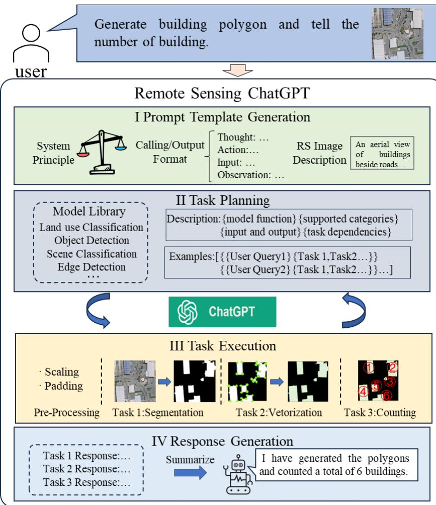
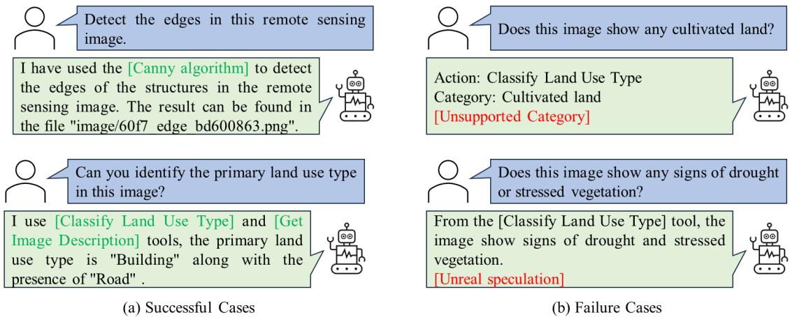

# 1. Bibliographic Information
## 1.1. Title
The central topic of the paper is the development of **Remote Sensing ChatGPT**, a large language model (LLM) powered agent that connects ChatGPT with specialized remote sensing visual models to automatically plan and execute complex remote sensing image interpretation tasks for end users, especially non-experts.
## 1.2. Authors
All authors are affiliated with Wuhan University (a top global institution for remote sensing research):
- Haonan Guo, Chen Wu, Liangpei Zhang, Deren Li: State Key Laboratory of Information Engineering in Surveying, Mapping and Remote Sensing
- Xin Su: School of Remote Sensing and Information Engineering
- Bo Du: School of Computer Science
  All authors have deep expertise in deep learning for remote sensing interpretation.
## 1.3. Journal/Conference
This is an unpublished preprint hosted on arXiv, the most widely used preprint server for computer science and geoscience research.
## 1.4. Publication Year
The preprint was uploaded in January 2024, so the publication year is 2024.
## 1.5. Abstract
The paper addresses the lack of automated task planning for remote sensing interpretation, which creates accessibility barriers for non-remote sensing experts. The core methodology is to build a modular LLM agent that uses ChatGPT for natural language understanding, automated task planning, iterative subtask execution, and final response generation, while using visual models to handle image interpretation and inject visual information into the language-only ChatGPT. Experiments on 138 real user queries show that the gpt-3.5-turbo backbone achieves 94.9% overall task planning correctness, and the system can handle both single-task and complex multi-step remote sensing requests. The work concludes that this framework enables accessible, automated remote sensing interpretation, and can be extended with advanced remote sensing foundation models.
## 1.6. Original Source Link
- Preprint link: https://arxiv.org/abs/2401.09083
- PDF link: https://arxiv.org/pdf/2401.09083.pdf
- Publication status: Unpublished preprint
# 2. Executive Summary
## 2.1. Background & Motivation
- **Core problem**: The paper aims to solve the lack of automated end-to-end remote sensing interpretation for arbitrary natural language user requests. Currently, organizing existing specialized remote sensing models to fulfill complex user requests requires manual planning by remote sensing experts, which excludes non-experts from accessing remote sensing techniques.
- **Importance and existing gaps**: Remote sensing data is critical for many cross-disciplinary applications (climate monitoring, disaster response, Sustainable Development Goal tracking), but most non-specialist researchers cannot use it effectively. Prior work has developed high-performance deep learning models for individual remote sensing tasks, but no system can automatically combine these models to answer arbitrary user requests. Prior attempts to apply LLMs to remote sensing only adapted general natural image methods, did not integrate specialized remote sensing models, and did not quantitatively evaluate task planning performance across LLM backbones.
- **Innovative entry point**: The paper proposes using ChatGPT as a domain-agnostic "brain" agent to connect a library of specialized pre-trained remote sensing visual models, enabling fully automated planning and execution of interpretation tasks from user natural language requests.
## 2.2. Main Contributions / Findings
- **Primary contributions**:
  1. Proposes the first open-source LLM agent framework customized for the remote sensing domain, which integrates ChatGPT with specialized remote sensing models to solve arbitrary user interpretation requests.
  2. Designs a complete end-to-end workflow including prompt template generation, task planning, iterative task execution, and final response generation, with a visual cue injection mechanism to connect image data to the language-only ChatGPT.
  3. Conducts a quantitative evaluation of task planning performance across 4 popular GPT backbones, providing empirical insights for the research community.
  4. Releases all code and a public demo to enable further research in this area.
- **Key findings**:
  1. The gpt-3.5-turbo backbone achieves the highest task planning correctness (94.9%) out of all tested models, outperforming larger, more modern models like GPT-4.
  2. The system can handle both simple single-task requests and complex multi-step requests that require sequential execution of multiple subtasks.
  3. The two main failure modes are: (i) requests for categories/classes not supported by existing specialized models, and (ii) LLM hallucination when tools are insufficient to answer the query.
  4. The framework is fully modular and can be easily extended with new tasks and advanced models like remote sensing foundation models.
# 3. Prerequisite Knowledge & Related Work
## 3.1. Foundational Concepts
All core concepts are explained below for beginners:
1. **Large Language Model (LLM)**: A large-scale neural network model trained on massive text corpora, capable of understanding natural language, performing reasoning, and generating human-like text. LLMs like ChatGPT have emergent abilities such as few-shot learning and tool use.
2. **LLM Agent**: A system that uses an LLM as the core "brain" to plan actions, call external tools (e.g., computer vision models, databases), process tool outputs, and achieve user-specified goals.
3. **Remote Sensing Image Interpretation**: The process of extracting meaningful information (e.g., identifying land types, counting objects, detecting infrastructure) from aerial or satellite images of the Earth's surface.
4. **Prompt Engineering**: The practice of designing input text (prompts) to guide an LLM to produce the desired output, including system prompts that define the LLM's role and execution rules.
5. **In-Context Learning**: The ability of large LLMs to learn how to perform a task from examples provided in the input prompt, without updating the model's parameters.
6. **BLIP**: Bootstrapping Language-Image Pre-training, a pre-trained vision-language model that can generate natural language captions for input images, used to connect image data to language-only LLMs.
## 3.2. Previous Works
The paper cites the following key prior studies:
1. **Deep Learning for Remote Sensing**: Decades of prior work have developed specialized deep learning models for individual remote sensing tasks (scene classification, object detection, segmentation) that achieve high performance on single tasks, but cannot be automatically combined to solve complex requests.
2. **LLM Tool Use**: *Toolformer* (2023) first demonstrated that language models can learn to use external tools autonomously. *HuggingGPT* (2023) proposed a general LLM agent framework that uses ChatGPT to connect multiple AI models to solve complex multi-modal tasks, which inspired the structure of this work.
3. **Visual ChatGPT (2023)**: A general framework that enables ChatGPT to interact with visual models to understand and edit images, which is the direct predecessor of this work's approach of combining a language LLM with specialized visual models.
4. **Prior ChatGPT for Remote Sensing**: Osco et al. (2023) first explored applying Visual ChatGPT to remote sensing, but only adapted the general natural image version of Visual ChatGPT, did not integrate specialized remote sensing models, and did not perform quantitative evaluation of task planning.
## 3.3. Technological Evolution
The field has evolved in four key stages:
1. **Stage 1 (Pre-Deep Learning, before 2012)**: Remote sensing interpretation was almost entirely manual, requiring extensive expert effort.
2. **Stage 2 (Deep Learning Era, 2012-2022)**: Researchers developed specialized deep learning models for each individual remote sensing task, achieving high performance on single tasks, but still required expert knowledge to use and combine models for complex requests.
3. **Stage 3 (General LLM Agents, 2023)**: General LLM agent frameworks like Visual ChatGPT and HuggingGPT emerged, demonstrating that LLMs can automatically connect multiple models to solve arbitrary user requests.
4. **Current Work (2024)**: This paper adapts the LLM agent paradigm specifically to the remote sensing domain, creating a customized, open-source, evaluated framework, which is the first major step in domain-specific LLM agents for remote sensing.
## 3.4. Differentiation Analysis
Compared to prior work, this work has the following key differences:
- Vs. general LLM agents (Visual ChatGPT, HuggingGPT): This work is customized for remote sensing, with a dedicated library of specialized models trained on standard remote sensing benchmarks, and evaluated specifically for remote sensing task planning.
- Vs. prior remote sensing ChatGPT work: Unlike prior work that only adapted general visual ChatGPT to remote sensing, this work integrates specialized remote sensing models, performs quantitative evaluation of different LLM backbones, and provides a modular, extendable open-source framework.
- Vs. traditional remote sensing workflows: Unlike traditional workflows that require human experts to plan and execute tasks, this work fully automates the entire process from natural language user request to final result, making remote sensing accessible to non-experts.
# 4. Methodology
## 4.1. Principles
The core design principle is to separate roles: (1) ChatGPT acts as the general "brain" that handles natural language understanding, reasoning, and task planning, leveraging its emergent tool-use ability; (2) a library of specialized pre-trained remote sensing visual models handles actual visual interpretation tasks, retaining the high performance of domain-specific models. Since ChatGPT is a pure language model that cannot directly process image pixels, visual cues (image captions generated by a vision-language model) are used to inject image information into ChatGPT.
## 4.2. Core Methodology In-depth
The complete workflow has four sequential steps, explained below:
### 4.2.1 Step 1: Prompt Template Generation
Given a user input (natural language request + remote sensing image), the system first constructs a complete prompt for ChatGPT with three parts:
1. **System Principle**: Defines core rules for ChatGPT: (i) ChatGPT must use provided external tools to complete the task, and cannot hallucinate results from its own knowledge; (ii) ChatGPT must follow strict output formatting for tool calls, and cannot fabricate non-existent files.
2. **Visual Cue Injection**: The BLIP vision-language model generates a natural language caption describing the content of the input remote sensing image, which is added to the prompt to give ChatGPT visual context.
3. **Output Format Template**: A standardized template is provided to regulate tool call formatting, requiring ChatGPT to specify the tool name, input file, and output observation for any tool call, to ensure the system can parse and execute the call.

   The full system workflow from the original paper is shown below:

   
   *该图像是示意图，展示了提议的遥感ChatGPT的工作流程。用户输入包含建筑多边形生成和数量统计的指令，系统经过任务规划、执行和响应生成，最终汇总结果。在任务执行中，包括了分割、矢量化和计数等步骤。*

### 4.2.2 Step 2: Task Planning
After prompt template generation, ChatGPT performs task planning based on the predefined task library:
1. The system supports 7 common remote sensing tasks, each with a pre-trained specialized model as shown in the table below:
   The following are the supported tasks from Table I of the original paper:

   <table>
   <thead>
   <tr>
   <th>Tool (Task)</th>
   <th>Model/Method</th>
   <th>Training Dataset</th>
   </tr>
   </thead>
   <tbody>
   <tr>
   <td>Scene Classification</td>
   <td>ResNet</td>
   <td>AID</td>
   </tr>
   <tr>
   <td>Land use Classification</td>
   <td>HRNet</td>
   <td>LoveDA</td>
   </tr>
   <tr>
   <td>Object Detection</td>
   <td>YOLOv5</td>
   <td>DOTA</td>
   </tr>
   <tr>
   <td>Image Captioning</td>
   <td>BLIP</td>
   <td>BLIP Pre-training Dataset</td>
   </tr>
   <tr>
   <td>Edge Detection</td>
   <td>Canny Edge Detector</td>
   <td>N/A</td>
   </tr>
   <tr>
   <td>Polygonization</td>
   <td>Douglas-Peuker Algorithm</td>
   <td>N/A</td>
   </tr>
   <tr>
   <td>Object Counting</td>
   <td>Counts outputs from detection</td>
   <td>N/A</td>
   </tr>
   </tbody>
   </table>

2. For each task, the prompt is supplemented with: task function description, supported categories, input/output formats, task dependencies, and example task calls for in-context learning.
3. The complete prompt (system principle + visual caption + task descriptions + user request) is fed to ChatGPT, which outputs a planned sequence of tool calls to solve the user's request.
### 4.2.3 Step 3: Iterative Task Execution
The system parses ChatGPT's output and executes tasks iteratively:
1. Parse the output to get the first tool to call, execute the specialized remote sensing model with the specified input, and generate the model output (e.g., detection bounding boxes, segmentation masks, count values).
2. Convert the model output to a natural language observation, which is added to the prompt as new context for ChatGPT.
3. ChatGPT decides whether more tools are needed to solve the request. If yes, repeat the process for the next tool; if no, stop execution and proceed to response generation.

   This iterative process enables the system to handle complex multi-step requests, e.g., the request "Count the number of airplanes on the runway" requires three sequential steps: runway segmentation, airplane detection within the runway, object counting.
### 4.2.4 Step 4: Final Response Generation
After all required tasks are executed, all task outputs are passed to ChatGPT as context. ChatGPT generates a natural language final response summarizing the results, and the system returns the response along with any output visualizations (e.g., segmentation masks, detection bounding boxes) to the user.
*(Note: The original paper does not include any core mathematical formulas for the methodology, so no formulas are added here per the requirement of faithfulness to the original text.)*
# 5. Experimental Setup
## 5.1. Datasets
The paper's evaluation uses a custom dataset of 138 real user queries for remote sensing interpretation, collected from multiple users. Each query is manually labeled with the essential task(s) required to solve it, e.g., the query "Locate the baseball diamond in this aerial image" is labeled with `Object Detection` as the essential task.

For training the specialized remote sensing tools, the paper uses standard public remote sensing benchmark datasets:
1. **AID Dataset**: A standard benchmark for aerial scene classification with 10,000 images across 30 scene categories.
2. **LoveDA Dataset**: A high-resolution land use classification dataset with 5,000 images and 10 land cover categories collected from multiple cities.
3. **DOTA Dataset**: The standard benchmark for remote sensing object detection with ~2,800 images and 180,000 annotated objects across 15 common categories.
4. **BLIP Pre-training Dataset**: A large general vision-language dataset for pre-training the BLIP image captioning model.

   These datasets are the most widely used benchmarks for each task, so they provide reliable baseline performance for the specialized tools, which is appropriate since the core focus of the experiments is evaluating LLM task planning performance, not the accuracy of individual tools.
## 5.2. Evaluation Metrics
The core evaluation metric is **Task Planning Correctness** (overall and per-task), defined as follows:
1. **Conceptual Definition**: This metric measures the proportion of user queries for which the LLM correctly identifies and calls all essential tasks required to solve the query. It directly evaluates the core ability of the system, which is the focus of the paper.
2. **Mathematical Formula**:
   $$
\text{Correctness} = \frac{N_c}{N_t} \times 100\%
$$
3. **Symbol Explanation**:
   - $N_c$: Number of test queries where the LLM correctly planned the required essential tasks.
   - $N_t$: Total number of test queries in the evaluation set.

     For per-task correctness, the formula is identical: $N_c$ is the number of correctly handled queries that require the specific task, and $N_t$ is the total number of queries requiring that task.
## 5.3. Baselines
The paper compares 4 popular OpenAI GPT backbones as the LLM core of Remote Sensing ChatGPT:
1. `gpt-4`: The original 2023 GPT-4 model, one of the most capable general-purpose LLMs.
2. `gpt-4-1106-preview`: The updated November 2023 GPT-4 preview with a longer context window.
3. `gpt-3.5-turbo`: The original stable version of GPT-3.5 Turbo, the most widely used ChatGPT model before GPT-4.
4. `gpt-3.5-turbo-1106`: The updated November 2023 GPT-3.5 Turbo with a longer context window.

   These baselines cover all major current GPT models, so the comparison provides clear empirical guidance for the community on which backbone works best for this task.
# 6. Results & Analysis
## 6.1. Core Results Analysis
The main result is that `gpt-3.5-turbo` achieves the highest overall task planning correctness of 94.9%, which is significantly higher than all other tested backbones: `gpt-4` (63%), `gpt-4-1106-preview` (84.1%), and `gpt-3.5-turbo-1106` (29%). This is a surprising result, as larger, more modern models like GPT-4 do not outperform the older stable GPT-3.5-turbo for this specific domain tool-use task. The paper notes that the newer `gpt-3.5-turbo-1106` has particularly poor performance because its ability to follow complex tool-calling instructions is worse than the older stable version.

Qualitatively, the system successfully handles both simple single-task requests and complex multi-step requests. The two main failure modes identified are: (1) the user requests a category that is not supported by the existing specialized model (e.g., asking to segment cultivated land when the model was not trained on that category), and (2) when existing tools cannot answer the query, the LLM tends to hallucinate an answer instead of asking the user for clarification or more information.
## 6.2. Data Presentation (Tables)
The following are the results from Table II of the original paper:

<table>
<thead>
<tr>
<th>Metric</th>
<th>gpt-4</th>
<th>gpt-4-1106-preview</th>
<th>gpt-3.5-turbo</th>
<th>gpt-3.5-turbo-1106</th>
</tr>
</thead>
<tbody>
<tr>
<td>Overall Correctness</td>
<td>63%</td>
<td>84.1%</td>
<td>94.9%</td>
<td>29%</td>
</tr>
<tr>
<td>Scene Classification</td>
<td>76.9%</td>
<td>84.6%</td>
<td>84.6%</td>
<td>7.7%</td>
</tr>
<tr>
<td>Land use Classification</td>
<td>69.1%</td>
<td>90.9%</td>
<td>100%</td>
<td>30.9%</td>
</tr>
<tr>
<td>Object Detection</td>
<td>79.2%</td>
<td>83.3%</td>
<td>95.8%</td>
<td>33.3%</td>
</tr>
<tr>
<td>Image Captioning</td>
<td>86.7%</td>
<td>60%</td>
<td>93.3%</td>
<td>6.7%</td>
</tr>
<tr>
<td>Edge Detection</td>
<td>70%</td>
<td>100%</td>
<td>100%</td>
<td>100%</td>
</tr>
<tr>
<td>Polygonization</td>
<td>0%</td>
<td>100%</td>
<td>100%</td>
<td>28.6%</td>
</tr>
<tr>
<td>Object Counting</td>
<td>0%</td>
<td>64.3%</td>
<td>78.6%</td>
<td>7.1%</td>
</tr>
</tbody>
</table>

Example successful and failure cases from the original paper are shown below:

*该图像是示意图，展示了遥感 ChatGPT 在成功和失败案例中的应用。左侧展示了成功的用例，包括使用 Canny 算法检测图像边缘和识别土地用途类型；右侧则显示失败案例，涉及对耕地和干旱植被的错误判断。相关信息表明模型在某些情况下无法准确分类。*

## 6.3. Ablation Studies / Parameter Analysis
The paper does not conduct traditional ablation studies of individual framework components, as its core focus is comparing the performance of different LLM backbones for remote sensing task planning. The comparison across 4 backbones itself shows that the choice of LLM backbone has an extremely large impact on overall system performance, with the older stable GPT-3.5-turbo being the best performing option out of the 4 tested models.
# 7. Conclusion & Reflections
## 7.1. Conclusion Summary
This paper proposes Remote Sensing ChatGPT, a modular LLM-powered agent framework that uses ChatGPT as a task planning brain to connect multiple specialized remote sensing visual models, enabling end-users to get interpretation results from a simple natural language request and input image. Quantitative experiments show that the system with the gpt-3.5-turbo backbone achieves 94.9% overall task planning correctness, and can handle both simple and complex remote sensing requests. The framework is open-source, modular, and easily extendable with new tasks and advanced models. This work improves the accessibility of remote sensing techniques for non-experts, and is a key preliminary step toward fully automated end-to-end remote sensing interpretation.
## 7.2. Limitations & Future Work
The authors identify the following limitations:
1. The existing system supports a limited set of tasks and categories, since the specialized models are trained on benchmark datasets that do not cover all possible use cases.
2. The LLM often hallucinates answers when existing tools cannot fulfill the user request, instead of asking for clarification.
3. The system relies on closed-source OpenAI GPT models, which introduces cost and access limitations.

   Proposed future directions:
1. Integrate open-vocabulary remote sensing foundation models to support a much wider range of categories and tasks.
2. Fine-tune open-source LLMs for remote sensing task planning to reduce reliance on closed-source models.
3. Extend the task library with more advanced remote sensing tasks such as change detection and super-resolution.
## 7.3. Personal Insights & Critique
This work is a valuable early contribution to the emerging field of LLM agents for remote sensing. Its greatest strengths are its modular open-source design and its empirical finding that older, smaller GPT models outperform larger newer models for this specific domain task, which is a useful insight for the community.

Potential areas for further improvement:
1. The paper only evaluates task planning correctness, and does not evaluate end-to-end accuracy of the full system (i.e., how often the final answer provided to the user is correct). A full end-to-end evaluation would give a more complete picture of real-world performance.
2. The system uses BLIP pre-trained on natural images for visual captioning, which may not capture domain-specific remote sensing concepts well. Replacing BLIP with a remote sensing pre-trained vision-language model would likely improve overall performance.
3. The evaluation set is relatively small (138 queries), so a larger, more diverse evaluation set would provide more statistically significant results.

   The general paradigm proposed in this work (using an LLM agent to connect domain-specific models to enable accessible automated analysis for non-experts) can be easily transferred to other domain-specific image analysis tasks such as medical imaging, agricultural image analysis, and industrial inspection, making it a highly impactful approach beyond remote sensing.