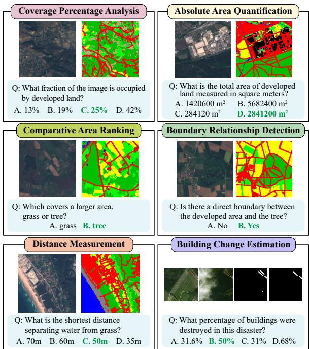
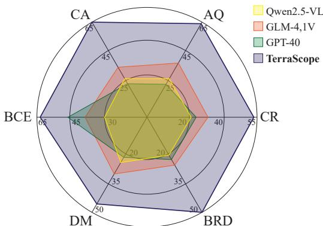
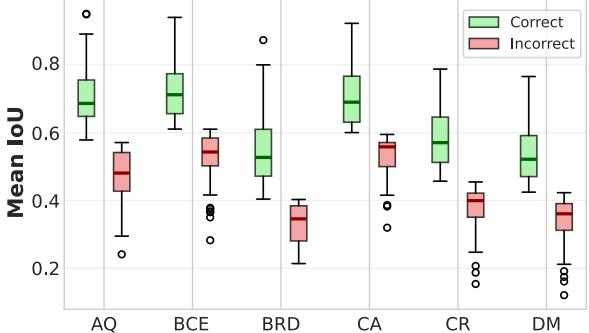
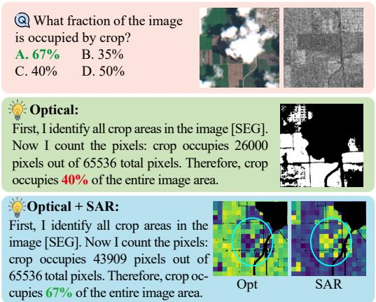

# 1. Bibliographic Information
## 1.1. Title
The central topic of the paper is **pixel-grounded visual reasoning for Earth observation (EO)**, introducing a unified vision-language model (VLM) that enables precise, interpretable fine-grained spatial analysis of satellite imagery by grounding reasoning steps in pixel-level segmentation masks.
## 1.2. Authors
The authors are Yan Shu, Bin Ren, Zhitong Xiong, Xiao Xiang Zhu, Begüm Demir, Nicu Sebe, and Paolo Rota. Their affiliations span top European academic institutions focused on computer vision and remote sensing: University of Trento, BIFOLD/TU Berlin, Technical University of Munich, and MBZUAI. Most authors are active researchers in the fields of geospatial analysis and multimodal machine learning.
## 1.3. Journal/Conference
This work is currently a preprint hosted on arXiv, the leading open-access preprint server for computer science and remote sensing research, and has not yet been peer-reviewed and published in a formal journal or conference.
## 1.4. Publication Year
2026, posted to arXiv on 2026-03-19.
## 1.5. Abstract
This work addresses the key limitation that existing vision-language models (VLMs) for Earth observation struggle with tasks requiring complex spatial reasoning grounded in precise pixel-level visual representations. The core contribution is TerraScope, a unified VLM that delivers pixel-grounded geospatial reasoning with two unique capabilities: (1) modality-flexible reasoning that handles single-modality (optical or SAR) inputs and adaptively fuses both modalities when available, and (2) multi-temporal reasoning that integrates temporal sequences for change analysis across multiple time points. The authors also curate two new community resources: *Terra-CoT*, a 1-million-sample large-scale instruction dataset with pixel-level masks embedded in reasoning chains, and *TerraScope-Bench*, the first benchmark for pixel-grounded geospatial reasoning that evaluates both answer accuracy and intermediate mask quality. Experiments confirm that TerraScope significantly outperforms all existing general and EO-specific VLMs, while providing interpretable pixel-level visual evidence for reasoning.
## 1.6. Original Source Link
Original preprint link: https://arxiv.org/abs/2603.19039  
PDF link: https://arxiv.org/pdf/2603.19039v1  
Publication status: Preprint.

# 2. Executive Summary
## 2.1. Background & Motivation
Earth observation satellites generate massive volumes of imagery for critical applications including environmental monitoring, disaster response, and natural resource management. Traditional EO analysis relies on inflexible task-specific models, while modern vision-language models (VLMs) offer a paradigm shift: a unified model that supports flexible, text-based interaction for diverse EO tasks. However, existing VLMs have two fundamental gaps that prevent them from being used for fine-grained geospatial reasoning:
1. Most existing VLMs use coarse-grained grounding (bounding boxes, implicit token selection) which fails for EO: unlike natural images with discrete objects, EO imagery has continuous spatial distributions of land cover with gradual transitions, so coarse grounding introduces substantial noise that degrades reasoning accuracy.
2. EO analysis commonly relies on multi-sensor (optical + SAR) and multi-temporal data: optical provides good spectral information but is corrupted by cloud cover, while SAR provides all-weather observation, and temporal sequences reveal dynamic changes. No existing VLM unifies pixel-level grounding with adaptive multi-modal fusion and multi-temporal reasoning for EO.

   Additionally, there was no existing large-scale training dataset with pixel-level masks embedded in reasoning chains, and no existing benchmark that evaluates both answer accuracy and pixel-level grounding quality for geospatial reasoning. The innovative entry point of this work is the principle of "thinking with pixels": explicitly grounding every reasoning step in pixel-level segmentation masks, rather than doing all reasoning in the text domain.
## 2.2. Main Contributions / Findings
The paper has three core contributions:
1. **Model**: TerraScope, the first unified VLM for pixel-grounded geospatial reasoning. It interleaves pixel-level segmentation mask generation with textual reasoning, supports adaptive text-guided fusion of optical and SAR modalities, and enables multi-temporal change analysis via explicit temporal indicators.
2. **Dataset**: Terra-CoT, a 1-million-sample large-scale instruction tuning dataset with pixel-accurate segmentation masks embedded in reasoning chains, constructed via an automated hierarchical pipeline, enabling scalable training of pixel-grounded reasoning models.
3. **Benchmark**: TerraScope-Bench, the first expert-verified benchmark for pixel-grounded geospatial reasoning, with 3,837 samples across 6 task types, and dual evaluation metrics for both answer accuracy and intermediate segmentation mask quality.

   Key findings from experiments:
- Existing VLMs (even state-of-the-art general and EO-specific models) perform very poorly on pixel-grounded geospatial reasoning, confirming the need for specialized design.
- Pixel-level grounding accuracy is strongly correlated with final answer correctness (Pearson correlation $r=0.607$), validating the core hypothesis that pixel-grounded reasoning improves accuracy.
- TerraScope outperforms all baselines by a large margin across all benchmarks, achieving 68.9% average accuracy on TerraScope-Bench (9.3% higher than the best fine-tuned baseline), while providing interpretable visual evidence for every reasoning step.

# 3. Prerequisite Knowledge & Related Work
## 3.1. Foundational Concepts
All core foundational concepts are explained below for novice readers:
1. **Earth Observation (EO)**: The collection of data about Earth's surface via satellites or airborne sensors. Two common sensor types:
   - *Optical sensors*: Capture visible/infrared reflectance of the surface, similar to regular digital photos, provide rich spectral information but are corrupted by cloud cover.
   - *SAR (Synthetic Aperture Radar)*: An active sensor that uses radar signals to measure surface properties, works regardless of weather or cloud cover, so it complements optical data.
2. **Vision-Language Model (VLM)**: A large multimodal model that processes both image (visual) and text inputs, enabling flexible tasks like visual question answering, image captioning, and interactive reasoning via natural language. VLMs unify multiple tasks into a single model, avoiding the need for separate task-specific models.
3. **Chain-of-Thought (CoT) Reasoning**: A training/prompting technique where a model generates intermediate reasoning steps before producing a final answer, which improves performance on complex reasoning tasks. *Pixel-grounded visual CoT* extends this by interleaving pixel-level visual evidence (segmentation masks) into intermediate reasoning steps, instead of only using textual steps.
4. **Intersection over Union (IoU)**: A standard metric for segmentation quality that measures the overlap between a predicted segmentation mask and the ground truth mask. Higher IoU means more accurate segmentation.
5. **LoRA (Low-Rank Adaptation)**: A parameter-efficient fine-tuning technique for large models that only trains small low-rank matrices instead of updating all model parameters, reducing memory and computation requirements for fine-tuning.
## 3.2. Previous Works
Prior work can be grouped into three categories:
1. **EO-Specific VLMs**: Early work adapted general VLMs to EO via domain instruction tuning, starting with RSGPT and SkyEye-GPT for basic captioning and visual question answering. Later works like GeoChat and SkySenseGPT added region-level grounding, and recent works like EarthDial added multi-sensor (optical/SAR) support. However, all existing EO-VLMs lack explicit pixel-grounded reasoning capabilities, relying on coarse bounding box grounding or no explicit grounding at all.
2. **EO Benchmarks**: Existing benchmarks like RSVQA, LHRS-Bench, and VLEO-Bench only evaluate final answer accuracy for conversational tasks, not the quality of intermediate spatial reasoning. Recent benchmarks like VRS-Bench and GeoChat-Bench add region-level grounding evaluation, but none evaluate pixel-level segmentation accuracy for reasoning, which is required for fine-grained geospatial analysis.
3. **Visual Chain-of-Thought Reasoning**: Recent work on general VLMs has explored grounding reasoning in visual content: GRIT uses bounding boxes for interleaved reasoning, DeepEyes and Chain-of-Focus use iterative zooming on cropped regions, and Mint-CoT/ICoT use implicit token selection. However, all of these methods rely on coarse-grained spatial representations that are inadequate for EO, which requires pixel-level segmentation to capture continuous spatial distributions, and none support multi-modal optical-SAR fusion or multi-temporal reasoning for EO applications.
## 3.3. Technological Evolution
The evolution of EO analysis methods follows this timeline:
1. **Traditional EO Analysis (pre-2020)**: Task-specific models for segmentation, classification, and change detection, each model only works for one task, with no flexibility for new tasks or natural language interaction.
2. **VLMs for EO (2021-2024)**: General VLMs adapted to EO via domain instruction tuning, providing a unified framework for multiple tasks with natural language interaction, but no explicit grounding for fine-grained spatial reasoning.
3. **Visual CoT for General VLMs (2024-2025)**: Interleaving visual evidence with textual reasoning for complex tasks, but not adapted to EO's unique requirements of multi-modal data, multi-temporal data, and pixel-level continuous spatial distributions.
4. **This Work (2026)**: First to unify pixel-level grounding, adaptive multi-modal optical-SAR fusion, and multi-temporal reasoning for EO, plus the first training dataset and evaluation benchmark for pixel-grounded geospatial reasoning.
## 3.4. Differentiation Analysis
Core differences from prior work:
1. Compared to existing EO-VLMs: TerraScope is the first EO VLM that explicitly interleaves pixel-level segmentation masks into the reasoning chain, grounding every step in pixel-level visual evidence, rather than relying on coarse bounding boxes or purely textual reasoning. It also natively supports adaptive optical-SAR fusion and multi-temporal reasoning in a single unified framework, which no prior EO-VLM provides.
2. Compared to general visual CoT models: Unlike general models that use coarse spatial representations, TerraScope uses explicit pixel-level segmentation, and is purpose-built for EO's unique requirements of multi-modal and multi-temporal data.
3. Compared to existing EO benchmarks: TerraScope-Bench is the first benchmark that evaluates both final answer accuracy and intermediate pixel-level grounding quality, ensuring models genuinely perform pixel-grounded reasoning instead of guessing answers without correct spatial understanding.

# 4. Methodology
## 4.1. Principles
The core principle of TerraScope is "thinking with pixels": instead of conducting all reasoning in the text domain like traditional VLMs, TerraScope explicitly generates pixel-level segmentation masks for relevant regions at each reasoning step, and injects masked visual features from these regions into the reasoning sequence to guide subsequent steps. This directly grounds every reasoning step in pixel-level visual evidence, which is critical for accurate fine-grained geospatial reasoning in EO, where continuous spatial distributions require precise pixel-level localization.
## 4.2. Core Formalization
We first contrast traditional VLM reasoning with pixel-grounded reasoning as formalized in the paper:

For a traditional VLM, given an input question $Q$ and input image $I$:
- The text encoder produces question embedding: $\mathbf{q} = f_T(Q)$
- The vision encoder produces visual features: $\mathbf{v} = f_V(I) \in \mathbb{R}^{N \times D}$, where $N$ = number of visual tokens, $D$ = feature dimension.

  Traditional VLMs output purely textual reasoning and a final answer:
$$
[ \mathbf { r } _ { 1 } , \mathbf { r } _ { 2 } , \ldots , \mathbf { r } _ { k } , \mathbf { a } ] = f ( \mathbf { v } , \mathbf { q } )
$$
Where $k$ = number of reasoning steps, $\mathbf{r}_i$ = $i$-th textual reasoning step, $\mathbf{a}$ = final answer.

In contrast, pixel-grounded visual reasoning interleaves masked visual features with textual reasoning:
$$
[ \mathbf { r } _ { 1 } , ( \mathbf { m } _ { 1 } , \mathbf { v } _ { 1 } ) , \mathbf { r } _ { 2 } , ( \mathbf { m } _ { 2 } , \mathbf { v } _ { 2 } ) , \ldots , \mathbf { r } _ { k } , ( \mathbf { m } _ { k } , \mathbf { v } _ { k } ) , \mathbf { a } ] = f ( \mathbf { v } , \mathbf { q } )
$$
Where at each step $i$, the model generates a pixel-level binary segmentation mask $\mathbf{m}_i$ (marking the relevant region for this reasoning step) and extracts masked visual features $\mathbf{v}_i$ from the identified region, which are injected into the reasoning sequence to guide subsequent text generation.
## 4.3. TerraScope Framework Architecture
TerraScope builds on InternVL3 (a state-of-the-art open-source VLM) as its backbone, augmented with a pixel-level segmentation mask decoder. We break down the core components step by step:
### 4.3.1 Pixel-Grounded Chain-of-Thought Mechanism
The core innovation is the cooperative dual-decoder mechanism that interleaves mask generation and text generation:
1. During autoregressive text generation, the language decoder outputs tokens one by one. When it outputs the special token `[SEG]` (placed after the model mentions a key region to analyze), this triggers the mask decoder.
2. The hidden state of the `[SEG]` token from the language model is used as a prompt for the mask decoder (initialized from pre-trained SAM 2, the Segment Anything Model 2), which generates a pixel-level segmentation mask for the relevant region.
3. Next, the mask is aligned to the visual token grid to extract masked visual features:
   - The pixel-level mask $\mathbf{m}_i$ is resized to the resolution of the visual token grid $(n \cdot s) \times (m \cdot s)$, where the input image is split into $n \times m$ patches, each producing $s \times s$ tokens ($s=16$ for InternVL3).
   - A visual token is selected if the mask covers more than 50% of its corresponding spatial region, producing a token-level mask $\mathbf{m}_i^{\mathrm{tok}}$.
   - Selected visual features are extracted as:
     $$
   \mathbf v _ { i } = \{ \mathbf v _ { j } \ | \ \mathbf m _ { i } ^ { \mathrm { t o k } } [ j ] = 1 , j \in [ 1 , N ] \}
   $$
   Where $\mathbf{v}_j$ = $j$-th visual token from the original vision encoder output.
4. The selected masked visual features $\mathbf{v}_i$ are projected and flattened into a 1D sequence aligned with text embeddings, then injected into the generation sequence. The language model then resumes autoregressive text generation conditioned on the existing KV cache, using the injected visual features to guide subsequent reasoning.

   To balance effectiveness and efficiency, if the number of selected tokens exceeds a threshold of $\lambda=128$, TerraScope applies spatial uniform sampling: it divides the masked region into a $\lceil \sqrt{\lambda} \rceil \times \lceil \sqrt{\lambda} \rceil$ grid and selects one token per grid (the token closest to the cell center), preserving full spatial coverage while limiting context length.
### 4.3.2 Multi-Modal Reasoning for Optical-SAR Pairs
To leverage complementary information from paired optical and SAR data, TerraScope uses text-guided, token-level adaptive modality selection. The process is:
1. Optical and SAR images are processed independently by the vision encoder to get visual features $\mathbf{v}_{\mathrm{opt}}$ (optical) and $\mathbf{v}_{\mathrm{SAR}}$ (SAR). The input question is encoded to question embeddings $\mathbf{q}$ of length $L$.
2. Compute text-relevance scores for each visual token, which measure how relevant the token is to the input question:
   $$
\beta _ { j } ^ { \mu } = \frac { 1 } { L } \sum _ { \ell = 1 } ^ { L } \mathrm { S o f t m a x } \left( \frac { { \mathbf v } ^ { \mu } { \mathbf q } ^ { \top } } { \sqrt { D } } \right) _ { j \ell } , \quad \mu \in \{ \mathrm { o p t } , \mathrm { S A R } \}
$$
Where:
- $\beta_j^\mu$ = relevance score of the $j$-th visual token for modality $\mu$
- $\mathbf{v}^\mu$ = visual features for modality $\mu$
- $\mathbf{q}$ = question embeddings
- $D$ = dimension of visual/question features
- Softmax is applied over the spatial dimension to get attention weights for each token, which are averaged across all question tokens to get the final relevance score.

3. When extracting masked visual features for a generated mask, for each token in the mask, select the feature from the modality with the higher relevance score:
   $$
\begin{array} { r } { \mathbf { v } _ { j } = \left\{ \begin{array} { l l } { \mathbf { v } _ { j } ^ { \mathrm { o p t } } } & { \mathrm { i f } ~ \beta _ { j } ^ { \mathrm { o p t } } > \beta _ { j } ^ { \mathrm { S A R } } } \\ { \mathbf { v } _ { j } ^ { \mathrm { S A R } } } & { \mathrm { o t h e r w i s e } } \end{array} \right. , \quad \forall j \mathrm { ~ w h e r e ~ } \mathbf { m } _ { i } ^ { \mathrm { t o k } } [ j ] = 1 }
\end{array}
$$
This dynamic, spatially adaptive mechanism automatically selects optical tokens for cloud-free regions (where optical provides reliable spectral information) and SAR tokens for cloud-covered regions (where optical data is corrupted), leveraging the complementary strengths of both modalities.
### 4.3.3 Multi-Temporal Reasoning for Temporal Sequences
To reason over multiple time points (e.g., pre-disaster and post-disaster imagery for change analysis), TerraScope uses explicit temporal indicators: before each `[SEG]` token, the model generates a signal in the format `Image:`t_i$$ that specifies which time point $t_i$ the mask should be generated from. When this signal is detected, the mask decoder segments from the $t_i$-th image, and masked features are extracted from the visual features of that image. The model learns to generate these temporal indicators from the Terra-CoT training dataset, which includes temporally grounded reasoning traces.
### 4.3.4 Training Procedure
TerraScope is trained in two stages with supervised fine-tuning, and the total training objective combines language modeling loss and segmentation loss:
$$
\mathcal{L} = \mathcal{L}_{\mathrm{LM}} + \lambda \mathcal{L}_{\mathrm{seg}}, \quad \lambda=0.5
$$
Where:
- $\mathcal{L}_{\mathrm{LM}}$ = cross-entropy loss on text tokens and `[SEG]` tokens, excluding the injected masked visual features
- $\mathcal{L}_{\mathrm{seg}}$ = combination of Dice loss and pixel-wise cross-entropy loss for segmentation masks, computed on ground truth masks

  **Stage 1 (Grounded Pre-training):** Only the mask decoder is trained on 2M referring expression segmentation samples, with the vision encoder, text encoder, and language model frozen. This establishes basic pixel-level grounding capability before instruction tuning.

**Stage 2 (Instruction Tuning on Terra-CoT):** The projector and mask decoder are unfrozen, and the language model is fine-tuned via LoRA (parameter-efficient fine-tuning), keeping the vision encoder frozen. During training, ground truth masks are used to extract masked visual features, which are interleaved into the sequence after `[SEG]` tokens, so the model learns to generate correct masks and use them for reasoning.
## 4.4. Terra-CoT Dataset Construction
To train pixel-grounded reasoning at scale, the authors curated Terra-CoT, a 1M-sample dataset with pixel-level masks embedded in reasoning chains, built via an automated two-stage pipeline:
### 4.4.1 Step 1: Cap-CoT Curation
First, 250K Cap-CoT (captioning with chain-of-thought) samples are built from existing datasets with semantic segmentation annotations. A large pre-trained multimodal model is prompted with images overlaid with colored class masks, and instructed to generate captions with chain-of-thought reasoning that explicitly references each masked region. This Cap-CoT data is used to train an intermediate annotator, *TerraScope-Cap*, which can generate pixel-grounded captions for unlabeled imagery.
### 4.4.2 Step 2: Hierarchical Synthesis of Full Terra-CoT
TerraScope-Cap is used to annotate unlabeled images from multiple sources (optical, SAR, multi-temporal), then the full Terra-CoT dataset is synthesized hierarchically:
1. **Level 1 (L1: Basic Spatial Grounding):** Template-based questions are generated for randomly selected land cover classes, covering fundamental tasks: existence verification, object counting, localization, area quantification, boundary detection. Pixel-level ground truth masks are used to generate reasoning traces that explain the spatial analysis process.
2. **Level 2 (L2: Complex Multi-Step Reasoning):** An LLM is used to combine multiple L1 questions into complex reasoning tasks of two types:
   - *L2-Spatial:* Cross-entity spatial analysis (e.g., "Is water adjacent to crops?")
   - *L2-Semantic:* Domain knowledge-based reasoning (e.g., "Is this region suitable for farming?")
     The LLM generates reasoning traces that combine pixel-level visual evidence with semantic or spatial analysis.

The final Terra-CoT dataset has 1 million total samples, covering global regions across multiple EO data sources.

# 5. Experimental Setup
## 5.1. Datasets
The paper evaluates on three benchmarks, including the newly proposed TerraScope-Bench and two existing public EO benchmarks:
### 5.1.1 TerraScope-Bench (Proposed in this paper)
This is the first benchmark specifically designed for pixel-grounded geospatial reasoning, constructed from test sets of existing public datasets (BigEarthNet, ChatEarthNet, xBD). It contains 3,837 expert-verified samples, covering six task categories:
1. Coverage Percentage Analysis (CA, 855 samples): Ask for the percentage of the image covered by a specific land cover class.
2. Absolute Area Quantification (AQ, 855 samples): Ask for the absolute area of a specific land cover class.
3. Comparative Area Ranking (CR, 855 samples): Ask to rank or compare the area of different land cover classes.
4. Boundary Relationship Detection (BRD, 855 samples): Ask if two land cover classes are adjacent (share a boundary).
5. Distance Measurement (DM, 129 samples): Ask for the minimum distance between two land cover classes.
6. Building Change Estimation (BCE, 288 samples): Ask for the number or percentage of destroyed buildings after a disaster, using pre- and post-disaster imagery.

   All samples are formatted as multiple-choice questions, with ground truth answers derived automatically from pixel-level segmentation annotations, then filtered and validated by domain experts. Unlike existing benchmarks, TerraScope-Bench evaluates both final answer accuracy and intermediate segmentation mask quality to ensure genuine pixel-grounded reasoning.

Example task samples from TerraScope-Bench:

*该图像是一个示意图，展示了TerraScope-Bench的几个任务示例，包括覆盖率百分比分析、绝对面积量化、比较区域排名、边界关系检测、距离测量和建筑变化估计。每个任务附有相关问题及选项，旨在验证像素基础的地理信息推理能力。*

### 5.1.2 Landsat30-AU
An existing public benchmark with 30-meter resolution Landsat imagery, covering 8 geospatial reasoning tasks including agro-phenology reasoning, cloud occlusion assessment, object counting, and spatial relationship inference. It is used to evaluate generalization of TerraScope to lower-resolution EO imagery common in real-world applications.
### 5.1.3 DisasterM3
An existing public bi-temporal disaster assessment benchmark, with pre- and post-disaster imagery for multiple hazard types, covering damaged building counting and damaged road area estimation. It supports both optical-only and optical-SAR multi-modal evaluation, used to test multi-modal and multi-temporal reasoning capabilities.
## 5.2. Evaluation Metrics
### 5.2.1 Answer Accuracy
This metric quantifies the percentage of correct final answers, the primary evaluation metric for overall task performance:
$$
\text{Accuracy} = \frac{\text{Number of Correct Predictions}}{\text{Total Number of Samples}} \times 100\%
$$
Accuracy is reported per task and as a macro-average across all tasks.
### 5.2.2 Mean Intersection over Union (Mean IoU)
This metric evaluates the quality of intermediate segmentation masks generated during reasoning, measuring how well the predicted mask overlaps with the ground truth mask for the target region. The IoU for a single sample is calculated as:
$$
\text{IoU} = \frac{|P \cap G|}{|P \cup G|}
\$\$
Where:
- $P$ = set of pixels in the predicted segmentation mask
- $G$ = set of pixels in the ground truth segmentation mask
- `|.|` = number of pixels in the set

  Mean IoU is the average of IoU across all evaluated samples, ranging from 0 (no overlap) to 1 (perfect overlap).
## 5.3. Baseline Models
The paper compares against three categories of representative baselines for fair comparison:
1. **General-purpose VLMs:** GPT-4o, LLaVA-OV, Qwen2.5-VL, InternVL3, GLM-4.1V-Think, Qwen3-VL-Think. These include state-of-the-art general VLMs with and without explicit reasoning capabilities.
2. **EO-specific VLMs:** TeoChat, LHRS-bot, EarthDial, EarthMind. These are VLMs specifically fine-tuned on EO data, representing the current state-of-the-art for domain-adapted EO VLMs.
3. **Fine-tuned general VLMs:** InternVL3 and GLM-4.1V-Think fine-tuned on the Terra-CoT dataset, to isolate the contribution of the Terra-CoT dataset from the contribution of the TerraScope architecture.

# 6. Results & Analysis
## 6.1. Core Results Analysis
The full core results across all three benchmarks are shown in Table 1 below:

The following are the results from Table 1 of the original paper:

<table>
<thead>
<tr>
<th rowspan="2">Model</th>
<th rowspan="2">Size</th>
<th colspan="7">TerraScope-Bench</th>
<th colspan="4">Landsat30AU</th>
<th colspan="3">DisasterM3</th>
</tr>
<tr>
<th>CA</th>
<th>AQ</th>
<th>CR</th>
<th>BRD</th>
<th>DM</th>
<th>BCE</th>
<th>Avg.</th>
<th>APR</th>
<th>NUM</th>
<th>SRI</th>
<th>Avg.</th>
<th>BDC</th>
<th>DRE</th>
<th>Avg.</th>
</tr>
</thead>
<tbody>
<tr>
<td colspan="16">General VLMs</td>
</tr>
<tr>
<td>GPT-4o† [34]</td>
<td>-</td>
<td>27.6</td>
<td>25.4</td>
<td>54.3</td>
<td>75.3</td>
<td>22.5</td>
<td>27.1</td>
<td>38.7</td>
<td>-</td>
<td>-</td>
<td>-</td>
<td>-</td>
<td>24.2</td>
<td>21.4</td>
<td>22.8</td>
</tr>
<tr>
<td>LLaVA-OV [18]</td>
<td>7B</td>
<td>28.0</td>
<td>21.2</td>
<td>56.6</td>
<td>75.9</td>
<td>19.4</td>
<td>23.7</td>
<td>37.5</td>
<td>39.4</td>
<td>46.6</td>
<td>85.1</td>
<td>57.0</td>
<td>26.4</td>
<td>24.2</td>
<td>25.3</td>
</tr>
<tr>
<td>Qwen2.5-VL [1]</td>
<td>7B</td>
<td>25.3</td>
<td>33.5</td>
<td>55.7</td>
<td>67.7</td>
<td>23.3</td>
<td>25.7</td>
<td>38.5</td>
<td>29.8</td>
<td>53.1</td>
<td>92.8</td>
<td>58.6</td>
<td>34.2</td>
<td>29.3</td>
<td>31.8</td>
</tr>
<tr>
<td>InternVL3 [59]</td>
<td>8B</td>
<td>22.3</td>
<td>26.3</td>
<td>57.2</td>
<td>67.0</td>
<td>18.6</td>
<td>24.3</td>
<td>36.0</td>
<td>31.4</td>
<td>42.4</td>
<td>90.6</td>
<td>54.8</td>
<td>30.3</td>
<td>24.1</td>
<td>27.2</td>
</tr>
<tr>
<td>GLM-4.1V-Think‡ [11]</td>
<td>9B</td>
<td>24.8</td>
<td>57.1</td>
<td>55.2</td>
<td>58.4</td>
<td>23.3</td>
<td>29.5</td>
<td>41.4</td>
<td>45.7</td>
<td>58.6</td>
<td>70.0</td>
<td>58.1</td>
<td>-</td>
<td>-</td>
<td>-</td>
</tr>
<tr>
<td>Qwen3-VL-Think‡ [1]</td>
<td>8B</td>
<td>29.0</td>
<td>47.8</td>
<td>57.9</td>
<td>67.8</td>
<td>25.6</td>
<td>31.9</td>
<td>43.3</td>
<td>42.8</td>
<td>60.2</td>
<td>92.0</td>
<td>65.0</td>
<td>36.8</td>
<td>28.2</td>
<td>32.5</td>
</tr>
<tr>
<td colspan="16">EO-Specific VLMs</td>
</tr>
<tr>
<td>TeoChat [14]</td>
<td>7B</td>
<td>25.6</td>
<td>17.8</td>
<td>55.8</td>
<td>55.8</td>
<td>8.5</td>
<td>22.6</td>
<td>31.0</td>
<td>30.2</td>
<td>41.8</td>
<td>87.1</td>
<td>59.0</td>
<td>22.5</td>
<td>23.3</td>
<td>22.9</td>
</tr>
<tr>
<td>LHRS-bot [33]</td>
<td>7B</td>
<td>13.7</td>
<td>24.3</td>
<td>54.0</td>
<td>28.4</td>
<td>12.4</td>
<td>-</td>
<td>26.6</td>
<td>63.5</td>
<td>12.5</td>
<td>82.6</td>
<td>52.9</td>
<td>-</td>
<td>-</td>
<td>-</td>
</tr>
<tr>
<td>EarthDial [43]</td>
<td>4B</td>
<td>26.3</td>
<td>24.1</td>
<td>54.4</td>
<td>69.2</td>
<td>20.2</td>
<td>23.6</td>
<td>36.3</td>
<td>23.5</td>
<td>43.6</td>
<td>51.2</td>
<td>39.4</td>
<td>30.2</td>
<td>20.8</td>
<td>25.5</td>
</tr>
<tr>
<td>EarthMind [42]</td>
<td>4B</td>
<td>26.1</td>
<td>42.2</td>
<td>52.2</td>
<td>73.3</td>
<td>38.1</td>
<td>20.8</td>
<td>42.1</td>
<td>-</td>
<td>-</td>
<td>-</td>
<td>-</td>
<td>-</td>
<td>-</td>
<td>-</td>
</tr>
<tr>
<td colspan="16">Fine-tuned VLMs (fine-tuned on Terra-CoT)</td>
</tr>
<tr>
<td>InternVL3 [59]</td>
<td>8B</td>
<td>67.1</td>
<td>63.2</td>
<td>60.0</td>
<td>67.8</td>
<td>40.0</td>
<td>31.0</td>
<td>54.9</td>
<td>55.3</td>
<td>56.6</td>
<td>90.8</td>
<td>67.6</td>
<td>42.2</td>
<td>30.1</td>
<td>36.1</td>
</tr>
<tr>
<td>GLM-4.1V-Think‡ [11]</td>
<td>9B</td>
<td>67.8</td>
<td>68.1</td>
<td>65.5</td>
<td>70.2</td>
<td>51.1</td>
<td>34.7</td>
<td>59.6</td>
<td>63.4</td>
<td>60.5</td>
<td>80.0</td>
<td>68.0</td>
<td>45.6</td>
<td>32.0</td>
<td>38.8</td>
</tr>
<tr>
<td>TerraScope</td>
<td>8B</td>
<td>73.2</td>
<td>70.2</td>
<td>71.8</td>
<td>80.0</td>
<td>65.9</td>
<td>52.1</td>
<td>68.9</td>
<td>69.8</td>
<td>60.8</td>
<td>91.1</td>
<td>73.9</td>
<td>54.1</td>
<td>38.9</td>
<td>46.5</td>
</tr>
</tbody>
</table>

Key conclusions from core results:
1. **Pixel-grounded reasoning is extremely challenging for existing VLMs:** All existing general and EO-specific VLMs achieve average accuracy below 45% even for the best baseline, with many tasks having near-random performance, confirming that existing models lack the pixel-level grounding capability required for this task.
2. **EO-specific models do not outperform general reasoning-capable VLMs:** Most existing EO-specific VLMs have similar or worse performance than general VLMs with explicit reasoning, because existing EO training data does not include pixel-grounded reasoning samples.
3. **Terra-CoT substantially improves performance:** Fine-tuning general VLMs on Terra-CoT gives a massive accuracy gain (e.g., InternVL3 improves from 36.0% to 54.9% average accuracy on TerraScope-Bench), confirming the value of the proposed dataset. However, even fine-tuned general VLMs still underperform TerraScope by a large margin, especially on the hardest tasks (distance measurement, building change estimation), showing that specialized architecture design is required.
4. **TerraScope outperforms all baselines by a large margin:** TerraScope achieves 68.9% average accuracy on TerraScope-Bench, 9.3% higher than the best fine-tuned baseline, and 25.6% higher than the best existing non-fine-tuned VLM. It also outperforms all baselines on the two out-of-distribution benchmarks (Landsat30AU average 73.9% vs 68.0% for best baseline; DisasterM3 average 46.5% vs 38.8% for best baseline), demonstrating strong generalization.

   Beyond answer accuracy, TerraScope also achieves much higher grounding IoU than all other models, as shown in Figure 5:

   
   *该图像是图表，展示了不同模型在多项指标上的性能对比，包括 Qwen2.5-VL、GLM-4,1V、GPT-40 和 TerraScope。每个模型的表现通过雷达图形象化，同心圆表示性能值。*

Correct predictions have significantly higher IoU than incorrect predictions, as shown in Figure 6, with a strong Pearson correlation of $r=0.607$ between mask IoU and answer correctness, confirming that accurate pixel grounding is directly linked to correct reasoning:

*该图像是一个箱线图，展示了正确和错误预测的IoU（Intersection over Union）分布。图中绿色和红色箱体分别代表正确和错误的平均IoU值，涵盖了多个评估标准。各组别的IoU值及其分布被清晰地显示，从而帮助比较不同算法的性能。*

## 6.2. Ablation Studies
The authors conducted extensive ablation studies to verify the effectiveness of each core component:
### 6.2.1 Ablation of Pixel-Grounded CoT Mechanism
The results for different CoT variants are shown below:

<table>
<thead>
<tr>
<th>Model Variant</th>
<th>TerraScope-Bench</th>
<th>Landsat30-AU</th>
<th>DisasterM3</th>
</tr>
</thead>
<tbody>
<tr>
<td>Original (base model after pre-training only)</td>
<td>33.8</td>
<td>45.7</td>
<td>23.6</td>
</tr>
<tr>
<td>Textual CoT w/o Seg. (text-only CoT, no mask/visual features)</td>
<td>58.7</td>
<td>56.5</td>
<td>32.9</td>
</tr>
<tr>
<td>Textual CoT with Seg. (text-only CoT, segmentation as auxiliary loss, no injected visual features)</td>
<td>60.6</td>
<td>58.9</td>
<td>35.8</td>
</tr>
<tr>
<td>Random-Mask CoT (interleave randomly selected visual tokens, no correct mask prediction)</td>
<td>43.2</td>
<td>53.8</td>
<td>32.6</td>
</tr>
<tr>
<td>Box CoT (use bounding boxes instead of pixel segmentation to select tokens)</td>
<td>62.8</td>
<td>70.5</td>
<td>43.9</td>
</tr>
<tr>
<td>TerraScope (full pixel-grounded CoT)</td>
<td>68.9</td>
<td>73.9</td>
<td>46.5</td>
</tr>
</tbody>
</table>

Key findings:
- Auxiliary segmentation loss improves performance even without injecting visual features, confirming that joint training of segmentation and reasoning benefits overall performance.
- Randomly selected visual tokens hurt performance, because irrelevant visual information distracts the reasoning process, confirming that correct mask-based token selection is critical.
- Coarse bounding box grounding underperforms pixel-level segmentation, especially for irregularly shaped land cover regions common in EO, confirming that pixel-level grounding is necessary.
- The full pixel-grounded mechanism achieves the best performance across all benchmarks.
### 6.2.2 Ablation of Multi-Modal Reasoning
The ablation results for multi-modal fusion are shown below:

<table>
<thead>
<tr>
<th>Variant</th>
<th>CA</th>
<th>AQ</th>
<th>CR</th>
<th>BRD</th>
<th>DM</th>
</tr>
</thead>
<tbody>
<tr>
<td>No Fusion (optical-only)</td>
<td>73.2</td>
<td>70.2</td>
<td>71.8</td>
<td>80.0</td>
<td>65.9</td>
</tr>
<tr>
<td>Concat (concatenate optical and SAR features)</td>
<td>74.5</td>
<td>71.6</td>
<td>73.0</td>
<td>81.2</td>
<td>67.4</td>
</tr>
<tr>
<td>Text-guided (test only, enable selection only at inference)</td>
<td>72.3</td>
<td>69.0</td>
<td>66.7</td>
<td>78.8</td>
<td>63.6</td>
</tr>
<tr>
<td>Text-guided (train + test, enable selection during both training and inference)</td>
<td>74.3</td>
<td>70.9</td>
<td>72.7</td>
<td>80.7</td>
<td>68.2</td>
</tr>
</tbody>
</table>

Key findings:
- Any form of multi-modal fusion improves over the optical-only baseline, confirming the value of complementary optical-SAR data.
- Text-guided adaptive selection achieves performance almost equal to concatenating both modalities, while reducing context length by half, giving a better efficiency-accuracy trade-off for deployment.
- Adaptive selection must be trained: enabling it only at inference time hurts performance, so the model needs to learn how to use the mechanism during training.

  A qualitative example of multi-modal fusion for a cloud-contaminated image is shown in Figure 7: optical-only fails to segment crops under cloud cover, but TerraScope with adaptive fusion uses SAR data to produce an accurate mask:

  
  *该图像是示意图，展示了作物占地面积的计算。上方的问题询问图像中作物所占比例。通过光学图像和光学与SAR融合的方式，分别得出作物占比40%和67%的计算结果，公式计算为：$Crop Occupation = \frac{Crop Pixels}{Total Pixels} \times 100\%$。*

### 6.2.3 Additional Ablations
Additional ablations confirm:
1. Two-stage grounded pre-training is effective: grounded pre-training improves average accuracy on TerraScope-Bench from 65.4% to 68.9%, confirming that pre-training establishes good foundational grounding capability before instruction tuning.
2. Hierarchical Terra-CoT composition is effective: adding Cap-CoT, then L1-VQA, then L2-VQA incrementally improves performance across all benchmarks, with the full composition achieving the best results.

# 7. Conclusion & Reflections
## 7.1. Conclusion Summary
This work addresses a critical gap in Earth observation vision-language models: the lack of pixel-grounded reasoning for fine-grained spatial analysis. It makes three core contributions:
1. **Model:** TerraScope, the first unified VLM that natively supports pixel-grounded reasoning, adaptive optical-SAR multi-modal fusion, and multi-temporal change analysis for EO. TerraScope interleaves pixel-level segmentation masks with textual reasoning, grounding every step in precise visual evidence, leading to substantially improved accuracy and interpretability.
2. **Dataset:** Terra-CoT, a 1-million-sample large-scale instruction tuning dataset with pixel-accurate masks embedded in reasoning chains, enabling scalable training of pixel-grounded reasoning models for EO.
3. **Benchmark:** TerraScope-Bench, the first expert-verified benchmark for pixel-grounded geospatial reasoning, with dual evaluation of answer accuracy and mask quality to ensure genuine pixel-level reasoning.

   Extensive experiments confirm that TerraScope significantly outperforms all existing general and EO-specific VLMs across multiple benchmarks, validating the core hypothesis that pixel-grounded reasoning improves geospatial reasoning accuracy.
## 7.2. Limitations & Future Work
The authors identify the following key limitations and future research directions:
1. **Hallucination:** Like other large multimodal models, TerraScope can still produce hallucinated reasoning traces or inaccurate masks for complex scenes. Future work can explore mitigation via retrieval-augmented generation, explicit verification mechanisms, or improved training strategies.
2. **Computational overhead:** Interleaving mask generation and visual tokens increases context length and inference time compared to pure text reasoning. Future work can explore token compression methods to reduce overhead while retaining grounding capability.
3. **Limited modality support:** TerraScope currently only supports RGB optical and SAR data, and does not handle multispectral or hyperspectral imagery, which provide additional spectral information critical for distinguishing similar land cover types. Extending the vision encoder to handle full spectral inputs is an important future direction.
4. **Limited temporal support:** Current temporal reasoning is limited to bi-temporal analysis (two time points), but many real-world EO applications require reasoning over long temporal sequences (e.g., multi-year urban expansion tracking). Extending TerraScope to support continuous multi-temporal reasoning over long sequences is another key future direction.
5. **Error propagation:** Segmentation errors propagate to reasoning errors, especially for small, low-contrast objects. Future work can add uncertainty estimation and iterative mask refinement to address this.
## 7.3. Personal Insights & Critique
This work makes a highly valuable contribution to the field of EO VLMs, addressing a critical gap that has been overlooked by prior work: the need for pixel-level grounding for fine-grained geospatial reasoning. The core insight that geospatial reasoning must be grounded in pixel-level evidence, rather than coarse bounding boxes or purely textual reasoning, is a fundamental contribution that will influence future EO VLM design.

The work also provides two high-value community resources: the large-scale Terra-CoT training dataset and the TerraScope-Bench evaluation benchmark, which will enable standardized research on this new topic for the entire community.

A major strength of this work is that it not only proposes a new model, but also creates the required training data and evaluation benchmark, which are essential for advancing the field. The approach of pixel-grounded interleaved reasoning is also generalizable beyond EO, and could be applied to other domains that require precise spatial reasoning, such as medical image analysis, agricultural remote sensing, and urban planning.

One potential direction for future improvement beyond what the authors mention is integrating uncertainty estimation into the model, so that it can report confidence in its segmentation masks and reasoning outputs, which is critical for real-world decision-making by EO practitioners. Another potential extension is integrating TerraScope with standard Geographic Information System (GIS) workflows, to make it directly usable for operational EO analysis.