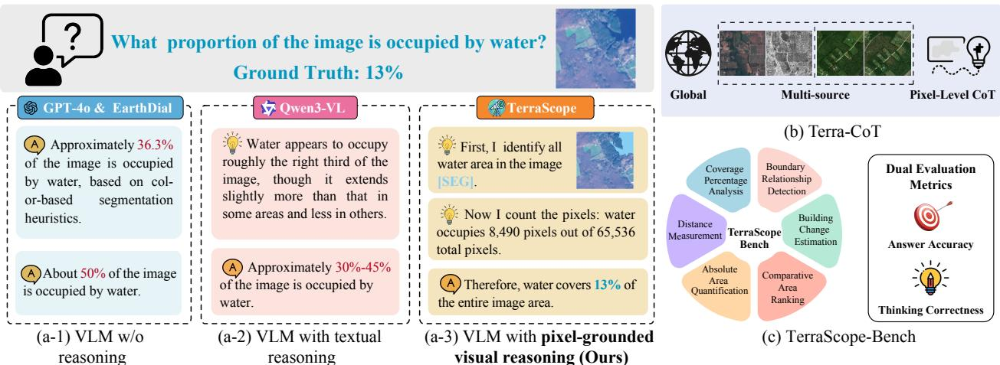
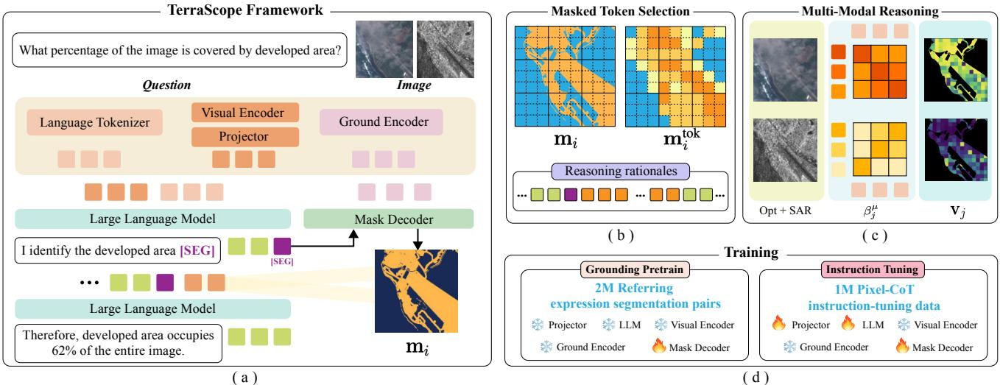
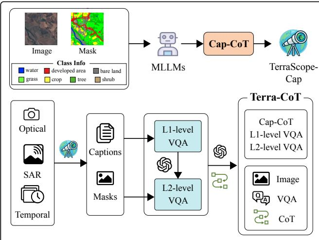
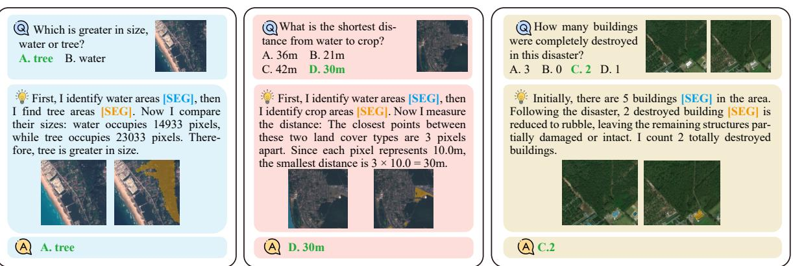
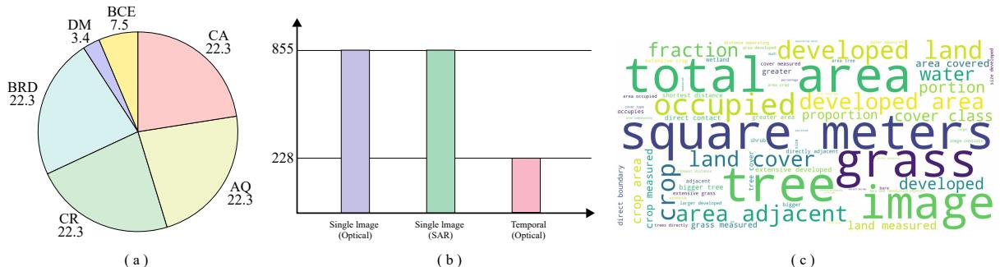
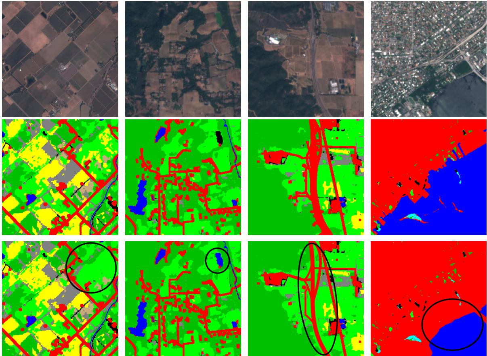
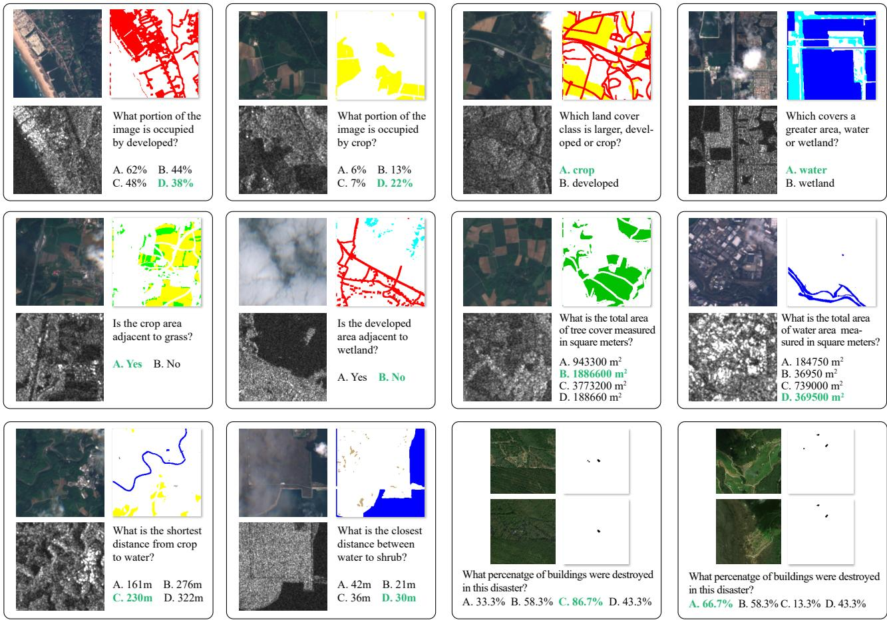
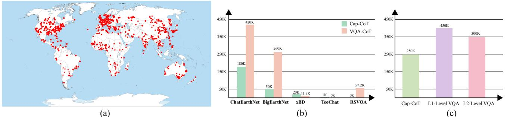
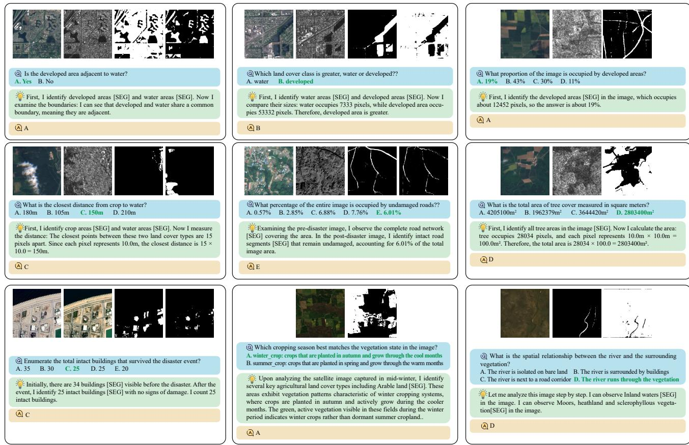
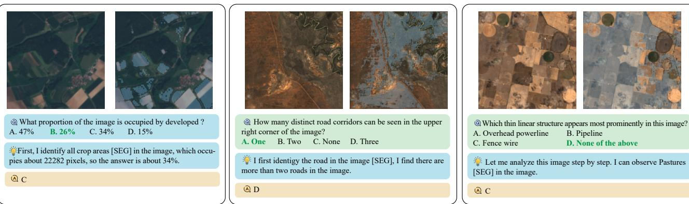

# TerraScope：基于像素的地球观测视觉推理

严恂1 任彬1.4\* 熊志彤3\* 朱小相3 贝古姆·德米尔2 尼库·塞贝1 保罗·罗塔1 特伦托大学 2 BIFOLD 和柏林工业大学 3 慕尼黑工业大学 4 MBZUAl https://shuyansy.github.io/terrascope/

  
T textualinput, ormi he intrleave CoT.bOur Terr-CoT Mdataset.):Our TerrScope benc.

# 摘要

视觉语言模型（VLMs）在地球观测（EO）中展现出良好的前景，但在需要精确像素级视觉表示的复杂空间推理任务中表现乏力。为了解决这一问题，我们推出了TerraScope，一种统一的VLM，能够提供像素基础的地理空间推理，具备两个关键能力：（1）模态灵活推理：能够处理单一模态输入（光学或SAR），并在同时可用时自适应地融合不同模态到推理过程中；（2）多时态推理：整合时间序列以进行跨多个时间点的变化分析。此外，我们构建了Terra-CoT，一个大型数据集，包含100万样本，嵌入多个来源的推理链中的像素级掩码。我们还提出了TerraScope-Bench，这是首个针对像素基础地理空间推理的基准，包含六个子任务，评估答案准确性和掩码质量，以确保真实的像素基础推理。实验表明，TerraScope在像素基础地理空间推理方面显著优于现有的VLM，同时提供可解释的视觉证据。

# 1. 引言

地球观测（EO）卫星以空前的规模持续监测我们的星球，产生大量影像档案用于环境监测[49]、灾害响应[48]和资源管理[16]。传统的EO数据分析方法[13, 19, 20, 45]依赖于特定任务的模型，限制了在各种应用中的灵活性。视觉语言模型（VLMs）提供了一种范式转变：统一模型能够理解视觉内容和自然语言，通过基于文本的交互实现灵活的分析。近期的领域适应VLMs在标准EO任务上表现出强劲的性能，包括图像字幕生成[30]、视觉问答[29, 31, 43, 52]和视觉定位[15, 51, 54, 58]，利用了对遥感数据的大规模指令微调。

然而，最先进的视觉语言模型在进行细粒度地理空间推理时遇到困难，需要进行像素级的空间分析。如图1所示，领先的通用模型（GPT-4o）、具备推理能力的模型（Qwen3-VL）和特定于地球观测的变种（EarthDial）都未能在诸如计算给定图像中某土地覆盖类型的覆盖率等任务上提供准确答案。最近的多模态推理模型通过在推理之前定位视觉区域展现出了希望。然而，由于两种基本差异，它们无法直接转移到地球观测领域：（i）与具有离散物体的自然图像不同，地球观测影像描绘了土地覆盖类型逐渐过渡的连续空间分布。这种连续性在使用粗糙定位时引入了大量噪声，从而阻碍了推理的准确性。（ii）地球观测分析通常涉及多传感器和时序演变数据。光学影像捕捉表面反射，合成孔径雷达（SAR）提供全天候观测，而多时相序列揭示动态变化。然而，现有的视觉语言模型在单一统一框架内有效整合这种模态灵活、时变的数据以进行地球观测推理方面仍然面临挑战。

为了应对这些挑战，我们提出了TerraScope，这是一个针对地球观测（EO）中像素基础视觉推理的综合框架。基于近期“用图像思考”的范式，[44] TerraScope体现了“用像素思考”的原则：它明确定位与任务相关的区域，并将每个推理步骤基于像素级视觉证据，而不是仅仅在语言领域内操作。之前的EO视觉语言模型（VLM）依赖外部工具 [4, 8, 25, 37] 进行推理。外部工具的引入大大增加了模型的复杂性，并降低了可控性，使得在像素级实现内在推理变得困难。相比之下，TerraScope采用混合解码器，联合生成分割掩模和推理轨迹。语言模型自主决定何时触发掩模生成，并将生成的视觉词元交错到推理过程中，从而在多步推理中实现动态视觉基础。除了单日期单模态数据，TerraScope还支持两种独立的推理能力。首先，对于多时间推理，它分析多个时间点的观测，以基于不断演变的空间模式推导时间变化。其次，对于多模态推理，在光学数据和合成孔径雷达（SAR）数据均可用的情况下，它通过文本引导的交叉注意机制，自适应选择每个推理步骤中最有信息量的模态，在清晰区域利用光学数据获取光谱信息而在云覆盖区域依赖SAR数据。为了实现大规模的像素基础推理，我们策划了Terra-CoT，一个包含100万条指令调优数据集的，嵌入了推理轨迹中像素级掩模的自动化管道，覆盖了来自多源EO数据的全球场景。此外，现有的EO基准测试 [23, 29, 46] 主要集中于视觉感知任务，缺乏对细粒度视觉推理能力的评估。我们推出了TerraScope-Bench，一个专为像素基础地理空间推理设计的基准。它包含3,837个经过专家验证的问题，支持使用光学唯一、SAR唯一或联合光学-SAR数据的灵活评估，涵盖单日期和多时间场景。除了传统的视觉问答（VQA）准确率指标，TerraScope-Bench还引入了双重评估指标，评估答案的正确性和分割掩模的质量，以确保模型在像素级视觉证据中真正扎根推理。总之，我们的贡献可以总结为三个方面： • 我们推出了TerraScope，这是一个统一的针对EO中像素基础视觉推理的框架。它将每个推理步骤扎根于精确的分割掩模，以实现细粒度、可解释的空间分析，支持多时间变化推理，并自适应使用光学或SAR影像。 • 我们策划了Terra-CoT，一个包含100万条指令调优的数据集，在推理轨迹中嵌入像素精确的掩模，从而实现可扩展的像素基础训练。 • 我们提出了TerraScope-Bench，这是一个包含3,837个经过专家验证的样本的基准，具有答案准确性和掩模质量的双重指标。在对11个模型的实验中揭示了当前的局限性，并展示了TerraScope的有效性。

# 2. 相关工作

地球观测视觉语言模型。最近，通用视觉语言模型的进展显示出在各种任务中令人印象深刻的能力。然而，它们对遥感图像的有限接触阻碍了在地球观测任务上的表现。为了解决这一差距，专门的地球观测视觉语言模型应运而生，通过领域特定的数据整理和模型调整。RSGPT通过丰富描述数据集来增强LLaVA在卫星图像上的对话能力。SkyEye-GPT合成了968K的指令样本用于多任务学习。在图像级任务之外，GeoChat、SkySenseGPT和LHRS-Bot整合了视觉锚定、区域描述和推理功能。EarthGPT引入了跨光学、合成孔径雷达和红外模态的多传感器数据集，而Earth-Marker和EarthGPT-X则实现了视觉提示交互。GeoPixel专注于像素级锚定，使用了锚定对话数据集。EarthDial在多光谱、高光谱和合成孔径雷达数据上进行缩放，以提高模型的泛化能力。VHM提出了包含事实和欺骗性问题的数据集，以提高模型的诚实性。尽管取得了这些进展，现有的地球观测视觉语言模型仍缺乏细粒度空间分析所需的像素级推理能力。

地球观测基准。EO-VLM的快速发展刺激了专门的评估基准。RSVQA [29]、LHRS-Bench [33]、RSIEval [12] 和VLEO-Bench [53] 评估了包括分类、图像描述和视觉问答在内的对话能力。VRS-Bench [23] 和GeoChat-Bench [15] 纳入了区域级定位的评估。XLRS-Bench [46] 专注于超高分辨率图像理解。GeoBench-VLM [6] 是一个全面的基准，涵盖多任务和多传感器的地球观测场景。DisasterM3 [48] 提出了一个跨多个灾害、传感器和任务的双时态基准。尽管最新的基准扩展了传感器、任务和时间设置的范围，但它们仍未严格评估模型在像素级地理空间推理方面的能力，导致在进行详细空间分析时缺乏所需的精度评估。视觉推理链。最近的研究通过将视觉证据与文本推理链交替结合，探索了在视觉内容中进行推理的过程。GRIT [7] 将边界框坐标与自然语言推理交错以实现精细计数。Deep-Eyes [57]、Chain-of-Focus [56] 和Mini-o3 [17] 采用迭代缩放机制，对焦区域进行裁剪和分析。VLM-R1 [39] 和Visual-RFT [28] 在视觉定位任务中利用强化学习。Mint-CoT [3] 和ICoT [9] 通过检索或注意机制选择相关视觉词元，以构建多模态推理。然而，这些方法依赖于粗糙的空间表示（边界框、裁剪或隐式词元选择），这对于需要像素级分割以捕捉跨多模态数据连续空间分布的地理空间推理来说是不足够的。

  
modal and multi-temporal reasoning across EO data.

# 3. 方法

在本节中，我们介绍了TerraScope的核心组成部分，并概述了像素基础的视觉推理在我们框架中的表述和实现方式。

# 3.1. 概述

地理空间推理需要细粒度的视觉理解，而仅依赖语言的推理无法提供这一点。在此背景下，我们提出了像素基础的视觉推理，其中模型明确生成分割掩码，并在所选的掩码视觉空间中进行推理。正式地，设 $f ( \cdot )$ 是一个由文本编码器 $f _ { T }$ 和视觉编码器 $f _ { V }$ 组成的视觉语言模型（VLM）。给定一个问题 $Q$ 和一幅图像 $I$，文本编码器生成 ${ \bf q } = f _ { T } ( Q )$，视觉编码器生成 $\mathbf { v } = f _ { V } ( I ) \in \mathbb { R } ^ { N \times D }$，其中 $N$ 是视觉词元的数量，$D$ 是特征维度。传统的视觉语言模型随后通过仅依赖语言的推理输出答案：

$$
[ \mathbf { r } _ { 1 } , \mathbf { r } _ { 2 } , \ldots , \mathbf { r } _ { k } , \mathbf { a } ] = f ( \mathbf { v } , \mathbf { q } ) ,
$$

其中 $k$ 是推理步骤的数量，$\mathbf { r } _ { i }$ 表示第 $i$ 个文本推理步骤，$\mathbf { a }$ 是最终答案。像素引导的视觉推理将遮蔽的视觉特征与文本推理交错结合：

$$
[ \mathbf { r } _ { 1 } , ( \mathbf { m } _ { 1 } , \mathbf { v } _ { 1 } ) , \mathbf { r } _ { 2 } , ( \mathbf { m } _ { 2 } , \mathbf { v } _ { 2 } ) , \ldots , \mathbf { r } _ { k } , ( \mathbf { m } _ { k } , \mathbf { v } _ { k } ) , \mathbf { a } ] = f ( \mathbf { v } , \mathbf { q } ) ,
$$

在每个推理步骤 $i$，模型生成一个分割掩码 $\mathbf { m } _ { i }$ 并从识别的区域中选择被掩码的视觉特征 $\mathbf { v } _ { i }$。在本节的其余部分，我们首先介绍使掩码和推理能够联合生成的 TerraScope 架构（第 3.2 节），然后描述我们的指令数据集 Terra-CoT，该数据集具有交错的视觉和文本轨迹（第 3.3 节）。

# 3.2. TerraScope 框架

如图2所示，我们的TerraScope基于强化的视觉语言架构，并增强了像素级分割。

# 问题：

# L1级别视觉问答

# 存在

识别土地覆盖类型及其视觉位置的步骤如下： 1. 收集数据：获取高分辨率的卫星图像或航空照片。 2. 数据预处理：对图像进行校正，去除噪声，调整亮度和对比度。 3. 设置分类标准：确定所需的土地覆盖类型，如森林、农田、水体、城市等。 4. 特征提取：使用图像处理技术提取特征，如颜色、纹理和形状。 5. 应用分类算法：选择合适的机器学习或深度学习算法，对提取的特征进行分类。 6. 结果验证：通过对比已有的地面实测数据，验证分类结果的准确性。 7. 可视化展示：将分类结果可视化，标记各类土地覆盖的具体位置。 8. 结果分析：分析不同土地覆盖类型的分布特征和变化趋势。

# ce 计数定位

# 理由：

首先，我看到水[SEG]，然后我看到农作物[SEG]……问题： 农作物存在吗？ 理由： 我可以看到农作物[SEG]……问题： 水的位置是什么？ 理由： 我可以看到水[SEG]……答案：左下角

# 标题：

  
basic spatial grounding and (L2) complex multi-step reasoning including spatial and semantic tasks.

从左下角开始，有一条河，周围被农作物和草地环绕。…… 答：是的

# L2级视觉问答（VQA）

# 语义推理

# 空间推理

# 问题：

# 该地区适合农业吗？水源是否靠近作物？

# 理由：

首先，我识别水源 [SEG]，提供灌溉。然后我观察这里现有的作物 [SEG]。答案：是的，根据水源 [SEG] 和作物 [SEG] 的相对位置，它们的边界并不接触……答案：不是。我们形成了一个统一的框架，整合了视觉基础和基于语言的推理于一个单一模型中。具体来说，我们利用 InternVL3 [59] 作为基础模型，它在处理多图像输入时动态地将单张图像拆分为子块，从而定义了一个统一的管道，将所有数据转换为统一格式。像素驱动的思维链。TerraScope 的核心创新在于双解码器之间的协作机制，将分割掩码生成与文本生成交替进行。具体而言，在推理过程中，TerraScope 监控语言解码器的自回归输出，并在检测到 [SEG] 时触发掩码解码器，该信号通常在提及关键区域或物体后出现。掩码解码器随后预测分割掩码，从中选择掩码视觉词元并注入推理序列，以指导后续生成。例如，当回答“水和道路哪个更大？”时，模型生成“我首先识别水区域 [SEG] ..然后是道路区域 [SEG] ”并通过比较它们的掩码视觉特征得出答案。如图 2 (b) 所示，为了将对应于生成的掩码的高质量视觉表示注入推理轨迹，我们首先通过将掩码 $\mathbf{m}_i$ 调整为令牌网格分辨率 $(n \cdot s) \times (m \cdot s)$ 来与视觉编码器的动态补丁布局对齐，其中图像被拆分为 $n \times m$ 个补丁，每个补丁产生 $s \times s$ 个词元 $s = 16$（适用于 InternVL）。为了处理像素级掩码与词元网格之间的部分重叠，如果掩码覆盖其对应空间区域的超过 $50\%$，我们将选择一个视觉词元。对于被掩盖的区域，我们提取所选的视觉特征为：

$$
\mathbf v _ { i } = \{ \mathbf v _ { j } \ | \ \mathbf m _ { i } ^ { \mathrm { t o k } } [ j ] = 1 , j \in [ 1 , N ] \}
$$

其中 $\mathbf { v } _ { j }$ 表示特征图中的第 $j$ 个视觉词元，$\mathbf { m } _ { i } ^ { \mathrm { t o k } }$ 是通过调整 $\mathbf { m } _ { i }$ 到词元网格得到的词元级掩码。然后，选定的视觉特征 $\mathbf { v } _ { i }$ 被投影并展平为与文本嵌入对齐的一维序列，并输入到大型语言模型（LLM）中，以恢复基于先前生成的词元的 KV 缓存的自回归文本生成。多模态与时间推理。与单图像理解不同，地球观测（EO）数据通常涉及多个来源，包括光学-合成孔径雷达（SAR）对和时间序列。TerraScope 通过其灵活的像素归属推理框架处理这些多样化场景。对于光学-合成孔径雷达对，模型必须识别互补特征，利用清晰条件下的光学图像获取光谱信息，同时在云层覆盖区域依赖于 SAR。我们通过文本引导的词元级模态选择实现这一点。如图 2 (c) 所示，给定独立处理的光学和 SAR 图像，通过视觉编码器获得视觉特征 $\mathbf { v _ { \mathrm { o p t } } }$ 和 $\mathbf { v } _ { \mathrm { S A R } }$，以及来自文本分词器的长度为 $L$ 的问题嵌入 $\mathbf { q }$，我们计算文本与每个视觉模态之间的交叉注意力，然后在文本词元之间聚合，以获得文本相关性得分：

$$
\beta _ { j } ^ { \mu } = \frac { 1 } { L } \sum _ { \ell = 1 } ^ { L } \mathrm { S o f t m a x } \left( \frac { { \mathbf v } ^ { \mu } { \mathbf q } ^ { \top } } { \sqrt { D } } \right) _ { j \ell } , \quad \mu \in \{ \mathrm { o p t } , \mathrm { S A R } \}
$$

其中 $\beta _ { j } ^ { \mu }$ 表示第 $j$ 个视觉词元对模态 $\mu$ 的问题相关性得分。在选择掩蔽的视觉特征 $\mathbf { v } _ { i }$ 时，我们在每个词元位置选择相关性得分较高的模态特征：

$$
\begin{array} { r } { \mathbf { v } _ { j } = \left\{ \begin{array} { l l } { \mathbf { v } _ { j } ^ { \mathrm { o p t } } } & { \mathrm { i f } ~ \beta _ { j } ^ { \mathrm { o p t } } > \beta _ { j } ^ { \mathrm { S A R } } } \\ { \mathbf { v } _ { j } ^ { \mathrm { S A R } } } & { \mathrm { o t h e r w i s e } } \end{array} \right. , \quad \forall j \mathrm { ~ w h e r e ~ } \mathbf { m } _ { i } ^ { \mathrm { t o k } } [ j ] = 1 } \end{array}
$$

这种动态的、空间自适应机制利用成对的地面目标（EO）数据的互补性来增强推理能力。对于时间序列，一个关键的挑战是时间消歧：当推理涉及多个观察时，每个 [SEG] 词元必须指定 (1) 掩码解码器应从哪个时间图像进行分割，以及 (2) 从哪个图像提取被掩盖的视觉词元。为了解决这个问题，我们在每个 [SEG] 词元之前添加了格式为“Image: $t _ { i } ^ { , \dag }$”的显式时间指示符。当语言解码器生成这些信号时，掩码解码器从图像 $t _ { i }$ 进行分割，并且特征提取模块从 $\mathbf { v } ^ { ( t _ { i } ) }$ 中采样视觉词元。该模型学习从我们的 Terra-CoT 数据集中生成时间戳，该数据集包含与特定帧掩码配对的时间基础推理轨迹（第3.3节）。训练。我们采用监督微调的方式分两个阶段训练 TerraScope。首先，我们在200万个引用表达分割对上进行训练，以建立基本的基础能力。然后，我们在100万个 Terra-CoT 样本上进行微调，以激励基于像素的视觉推理能力。在训练过程中，我们从真实标注的掩码中提取被掩盖的视觉特征，并在 [SEG] 词元后的位置将其交错到序列中。训练目标结合了语言建模损失（文本和 [SEG] 词元的交叉熵，不包括注入的视觉特征）和分割损失（Dice损失和像素级交叉熵）：

$$
\begin{array} { r } { \mathcal { L } = \mathcal { L } _ { \mathrm { L M } } + \lambda \mathcal { L } _ { \mathrm { s e g } } , } \end{array}
$$

我们设置 $\lambda = 0.5$ 以平衡这两个目标。

# 3.3. Terra-CoT 数据集

策划像素基础的视觉连锁思维数据并非易事：现有的地球观测数据集提供分割标签或视觉问答对，但没有同时提供带有推理轨迹的数据。我们通过一个两阶段的自动化流程解决了这一问题，从而启用大规模的像素基础推理数据。基于连锁思维的图像描述。我们利用现有的带有语义注释的数据集构建具有推理轨迹的像素基础描述数据（Cap-CoT）。如图3所示，我们用高亮特定土地覆盖类型的彩色掩膜和相应标签的一张图像提示一个大型多模态模型。该模型被指示生成详细的描述，明确引用这些掩盖区域的推理过程。这个过程生成了25万条Cap-CoT样本，用于训练TerraScope并构建一个中间注释器TerraScope-Cap，能够为未标记图像生成像素基础的描述。分层数据合成。利用在Cap-CoT上训练的TerraScope-Cap，我们对覆盖全球区域的来自不同来源（光学、合成孔径雷达、时序）的图像进行多类别像素级标签注释（统计数据见附录）。基于这些注释，我们通过两个层次的分层过程合成了Terra-CoT。

  
Figure 4. Examples of TerraScope-Bench.

Level 1 (L1)：基本空间定位。我们为随机选择的类别生成基于模板的问题，涵盖基本的空间任务，如存在性验证、物体计数、定位、面积量化和边界检测。对于每个问题，我们使用分割标签合成像素基础的推理轨迹，以解释空间分析过程。Level 2 (L2)：复杂的多步推理。我们提示大型语言模型（LLM）将多个 L1 问题组合成两种类型的复杂推理任务：(1) L2-空间需要跨实体的空间分析，例如关系推理（例如，“水是否临近农作物？”）；(2) L2-语义需要超出视觉观察的领域知识，例如土地适宜性评估（例如，“该地区适合农业吗？”）。对于这两种类型，LLM 合成结合视觉证据与空间或语义分析的推理轨迹。这个分层过程产生了 100 万个具有多样化推理能力的 Terra-CoT 样本。

# 4. TerraScope-Bench

分辨率超过 $1 0 \mathrm { m }$ 的地球观测影像面临独特挑战：个别物体仅占据少量像素，土地利用边界变得模糊，使得精确的像素级空间推理变得至关重要。然而，现有基准（例如，BigEarthNet [5]，ChatEarthNet [50]）强调的粗粒度任务，如场景分类和图像描述，主要依赖全局视觉线索。因此，它们未能充分评估 VLM 的细粒度推理能力，导致模型在没有真实空间理解的情况下表现良好。为了解决这些局限，我们引入了 TerraScope-Bench，这是一个基准，包含来自现有数据集测试集 [5, 10, 50] 中精心挑选的 3,837 个样本。如图 4 所示，我们的基准涵盖六个任务类别：覆盖百分比分析（855），绝对面积量化（855），距离测量（129），比较面积排名（855），边界关系检测（855），以及建筑变化估计（288）。

<table><tr><td rowspan="2">Model</td><td rowspan="2">Size</td><td colspan="7">TerraScope-Bench</td><td colspan="4">Landsat30AU</td><td colspan="3">DisasterM3</td></tr><tr><td>CA</td><td>AQ</td><td>CR</td><td>BRD</td><td>DM</td><td>BCE</td><td>Avg.</td><td>APR</td><td>NUM</td><td>SRI</td><td>Avg.</td><td>BDC</td><td>DRE Avg.</td></tr><tr><td colspan="10">General VLMs</td><td></td><td></td><td></td><td></td><td></td></tr><tr><td>GPT-4o† [34]</td><td>-</td><td>27.6</td><td>25.4</td><td>54.3</td><td>75.3</td><td>22.5</td><td>27.1</td><td>38.7</td><td></td><td>-</td><td>-</td><td>-</td><td>24.2</td><td>21.4</td><td>22.8</td></tr><tr><td>LLaVA-OV [18]</td><td>7B</td><td>28.0</td><td>21.2</td><td>56.6</td><td>75.9</td><td>19.4</td><td>23.7</td><td>37.5</td><td>39.4</td><td>46.6</td><td>85.1</td><td>57.0</td><td>26.4</td><td>24.2</td><td>25.3</td></tr><tr><td>Qwen2.5-VL [1]</td><td>7B 8B</td><td>25.3</td><td>33.5 26.3</td><td>55.7</td><td>67.7 667.0</td><td>23.3</td><td>25.7</td><td>38.5</td><td>29.8</td><td>53.1</td><td>92.8</td><td>58.6</td><td>34.2</td><td>29.3</td><td>31.8</td></tr><tr><td>InternVL3 [59]</td><td></td><td>22.3</td><td></td><td>57.2</td><td></td><td>18.6</td><td>24.3</td><td>36.0</td><td>31.4</td><td>42.4</td><td>90.6</td><td>54.8</td><td>30.3</td><td>24.1</td><td>27.2</td></tr><tr><td>GLM-4.1V-Think‡ [11]</td><td>9B</td><td>24.8</td><td>57.1</td><td>55.2</td><td>58.4</td><td>23.3</td><td>29.5</td><td>41.4</td><td>45.7</td><td>58.6</td><td>70.0</td><td>58.1</td><td>-</td><td></td><td>-</td></tr><tr><td>Qwen3-VL-Think‡ [1]</td><td>8B</td><td>29.0</td><td>47.8</td><td>57.9</td><td>67.8</td><td>25.6</td><td>31.9</td><td>43.3</td><td>42.8</td><td>60.2</td><td>92.0</td><td>65.0</td><td>36.8</td><td>28.2</td><td>32.5</td></tr><tr><td colspan="10">EO-Specific VLMs 33.7 31.1</td><td colspan="7"></td></tr><tr><td colspan="10">24.8 19.5 49.6 69.2</td><td colspan="7">86.2 53.0</td></tr><tr><td>TeoChat [14]</td><td>7B</td><td>25.6</td><td>17.8</td><td>55.8</td><td>55.8</td><td>5.4 8.5</td><td>22.6</td><td>31.0</td><td>30.2</td><td>41.8 59.6</td><td>87.1</td><td>59.0</td><td>22.5</td><td>23.3</td><td>22.9</td></tr><tr><td>LHRS-bot [33]</td><td>7B</td><td>13.7</td><td>24.3</td><td>54.0</td><td>28.4</td><td>12.4</td><td></td><td>26.6</td><td>63.5</td><td>12.5</td><td>82.6</td><td>52.9</td><td>-</td><td></td><td>-</td></tr><tr><td>EarthDial [43]</td><td>4B</td><td>26.3</td><td>24.1</td><td>54.4</td><td>69.2</td><td>20.2</td><td>23.6</td><td>36.3</td><td>23.5</td><td>43.6</td><td>51.2</td><td>39.4</td><td>30.2</td><td>20.8</td><td>25.5</td></tr><tr><td>EarthMind [42]</td><td>4B</td><td>26.1</td><td>42.2</td><td>52.2</td><td>73.3</td><td>38.1</td><td>20.8</td><td>42.1</td><td>-</td><td>-</td><td>-</td><td>-</td><td>-</td><td>-</td><td>-</td></tr><tr><td colspan="10">Fine-tuned VLMs</td><td colspan="7"></td></tr><tr><td>InternVL3 [59]</td><td>8B</td><td>67.1</td><td>63.2</td><td>60.0</td><td>67.8</td><td>40.0</td><td>31.0</td><td>54.9</td><td>55.3</td><td>56.6</td><td>90.8</td><td>67.6</td><td>42.2</td><td>30.1</td><td>36.1</td></tr><tr><td>GLM-4.1V-Think‡ [11]</td><td>9B</td><td>67.8</td><td>68.1</td><td>65.5</td><td>70.2</td><td>51.1</td><td>34.7</td><td>59.6</td><td>63.4</td><td>60.5</td><td>80.0</td><td>68.0</td><td>45.6</td><td>32.0</td><td>38.8</td></tr><tr><td>TerraScope</td><td>8B</td><td>73.2</td><td>70.2</td><td>71.8</td><td>80.0</td><td>65.9</td><td>52.1</td><td>68.9</td><td>69.8</td><td>60.8</td><td>91.1</td><td>73.9</td><td>54.1</td><td>38.9</td><td>46.5</td></tr></table>

微调后的视觉语言模型（VLMs）是在我们提出的 Terra-CoT 数据集上进行微调的。

  
Figure 5. Grounding IoU performance of different models.

我们利用像素级分割标注来自动生成问答对。对于每个样本，我们从分割掩码中计算空间属性，包括覆盖率、绝对面积、物体间距离和边界关系，以推导出真值答案。问题通过模板生成，以确保多样化的表述，然后由大型语言模型进行改写，以创建自然的变体和合理的干扰项，以适应多项选择格式。最后，人类专家审核数据集，过滤掉带有错误掩码的样本。与现有仅评估最终答案准确性的基准不同，TerraScope-Bench 评估回答的正确性和空间推理质量，使用基于IoU的分割指标，验证模型在推理过程中是否关注正确的区域。

# 5. 实验

实现细节。根据第3.2节的双阶段训练策略，我们首先进行基础预训练，其中视觉编码器、投影器和大语言模型保持不变，仅训练掩码解码器（学习率为 $1 \times 10^{-5}$，批大小为 $8$）。在第二阶段，我们解冻投影器和掩码解码器进行全面训练，并通过 LoRA 微调大语言模型（学习率为 $1 \times 10^{-5}$，批大小为 $2$）。在训练过程中，视觉编码器保持冻结状态。所有实验在 NVIDIA H200-141GB GPU 上进行，附录中提供了额外的数据集和超参数细节。基准测试。除了我们提出的 TerraScope-Bench，我们还在零-shot 设置下评估 TerraScope，并在两个具有代表性的地球观测基准上检验其泛化能力。LandSat30-AU [32] 提供了具有挑战性推理子任务的 30 米分辨率影像；我们在四个需要细粒度地理空间推理的任务上报告结果：农业物候推理（APR）、数量估计（NUM）和空间关系推理（SRI）。DisasterM3 [48] 是一个双时间点灾害评估基准，包含覆盖多个传感器的多种灾害场景的事件前后图像对；我们在损坏建筑物计数（DBC）和损坏道路面积估计（DRE）上进行评估。

# 5.1. 主要结果

我们在表1中展示了TerraScope在多个地球观测基准上的表现，其中评估了11个VLM模型，包括专有模型以及通用和特定于地球观测的模型。此外，我们对InternVL3和GLM-4.1V-Think进行了微调，以展示其有效性。我们强调了几个关键发现：（1）基于像素的推理仍然具有挑战性。现有的VLM在细粒度地理空间推理方面表现不佳，特别是在需要精确空间分析的任务上，如区域百分比估计。专有和开源模型的表现接近随机，这表明像素级基础的重要性。

<table><tr><td>Model</td><td>TerraBen.</td><td>Landsat.</td><td>Disaster.</td></tr><tr><td>Original</td><td>33.8</td><td>45.7</td><td>23.6</td></tr><tr><td>Textual CoT w/o Seg.</td><td>58.7</td><td>56.5</td><td>32.9</td></tr><tr><td>Textual CoT with Seg.</td><td>60.6</td><td>58.9</td><td>35.8</td></tr><tr><td>Random-Mask CoT</td><td>43.2</td><td>53.8</td><td>32.6</td></tr><tr><td>Box CoT</td><td>62.8</td><td>70.5</td><td>43.9</td></tr><tr><td>TerraScope</td><td>68.9</td><td>73.9</td><td>46.5</td></tr></table>

Table 2. Ablation study on the effect of different CoT strategies for pixel-grounded visual reasoning. "Original" denotes the base TerraScope model after pretraining, upon which we fine-tune with different CoT variations via SFT.

  
Figure 6. IoU distribution for correct vs. incorrect predictions.

(2) 遥感特定模型显示出有限的优势。尽管在大规模遥感数据上进行训练，遥感特定的 VLM 在 TerraScope-Bench 上的表现并未显著超过通用 VLM。我们推测这是因为现有的遥感数据集主要以高分辨率图像（$ < 5 \mathrm { m } $）为主，限制了模型处理在实际应用中普遍存在的低分辨率数据的能力。(3) 推理模型表现更好，但缺乏视觉基础。具有明确推理能力的模型表现更强，特别是在需要外部知识的任务如绝对面积量化上。然而，它们的推理依然完全基于文本，没有像素级视觉证据的支持，导致幻觉和不足的细粒度空间感知。(4) Terra-CoT 有效提升了模型性能。在我们的 Terra-CoT 数据集上对通用 VLM（如 InternVL3、GLM-4.1V-Think）进行微调，导致所有任务的性能显著提高，证明了我们的像素基础推理数据的有效性。然而，像距离测量（DM）和建筑变化估计（BCE）等挑战性任务仍然较难，这表明仅凭数据是不够的，需要专门的架构设计以实现像素基础的推理。(5) TerraScope 实现了强大的性能和泛化能力。我们的框架将推理与细粒度视觉感知相结合，在 TerraScope-Bench 上取得了最佳结果，同时在 LandSat30-AU 和 DisasterM3 上展现了强大的泛化能力。

<table><tr><td>Model</td><td>CA</td><td>AQ</td><td>CR</td><td>BRD</td><td>DM</td></tr><tr><td>No Fusion</td><td>73.2</td><td>70.2</td><td>71.8</td><td>80.0</td><td>65.9</td></tr><tr><td>Concat.</td><td>74.5</td><td>71.6</td><td>73.0</td><td>81.2</td><td>67.4</td></tr><tr><td>Text-guided (test only.)</td><td>72.3</td><td>69.0</td><td>66.7</td><td>78.8</td><td>63.6</td></tr><tr><td>Text-guided (train + test)</td><td>74.3</td><td>70.9</td><td>72.7</td><td>80.7</td><td>68.2</td></tr></table>

  
Table.Ablation study f multi-modal reasning.   
Figure 7. Visualizations of multi-modal reasoning.

(6) TerraScope 提供了可解释的推理。除了答案的准确性，TerraScope-Bench 通过测量分割的交并比（IoU）与真实标注数据进行推理过程的评估。如图 5 所示，TerraScope 不仅生成正确的答案，还产生了忠实的推理轨迹，并具有准确的空间定位，优于其他具备定位能力的模型。

# 5.2. 消融研究

我们进行广泛的消融研究，以分析TerraScope在其像素级视觉推理机制和多模态推理方面的有效性，更多细节见附录。像素级视觉推理的有效性。为了验证像素级定位对推理的益处，我们在表2中比较了几种变体。首先，我们仅训练使用文本链式思维的模型，其中视觉词元未插入推理步骤中：要么冻结掩码解码器（无分割的文本链式思维），要么使用真实掩码作为辅助监督训练它（带分割的文本链式思维）。结果表明，即使在推理序列中缺少视觉词元时，辅助分割训练也隐含地改善了推理，证明了我们联合训练设计的好处。其次，我们考察掩码引导的词元选择的重要性。随机掩码链式思维在每个推理步骤中随机选择视觉词元，而不进行掩码预测，其性能较文本链式思维更差，可能是由于无关的视觉信息妨碍了推理。箱形链式思维使用预测掩码的最小外接矩形来选择视觉词元，而不是使用精确的分割掩码。这种较粗的定位在TerraScope上也表现不佳，特别是在TerraScope-Bench和LandSat30-AU上，其中土地区域的边界和形状不规则。这些结果确认，通过分割掩码进行精确的像素级定位对于有效的地球观测视觉推理至关重要。

  
Figure 8. Visualization of TerraScope.

除了最终答案的准确性，我们还分析了中间分割质量（通过与真实标注掩码的平均交并比（IoU）来衡量）与答案正确性之间的关系。如图6所示，具有更高分割质量的样本显著更可能产生正确答案。具体而言，正确预测的平均IoU为0.628，明显高于错误预测的0.443。强相关系数 $r = 0.607$，$p < 0.001$ 在所有任务类型中始终保持一致（$\boldsymbol { r } = 0.70-0.80$），表明准确的像素级视觉基础对正确的地理空间推理至关重要。 多模态推理的有效性。除了光学影像外，TerraScope能够通过文本引导的模态选择在光学和合成孔径雷达（SAR）模态之间进行推理。为了验证其有效性，我们在表3中比较了几种设置：（1）无融合：仅使用光学影像；（2）拼接：将光学和SAR特征拼接，并在每个推理步骤中交错拼接的特征；（3）文本引导（仅测试）：仅在推理期间启用模态选择；（4）文本引导（训练+测试）：在训练和推理期间均启用模态选择。结果表明，任何形式的多模态融合大幅提高了光学仅基线的性能。虽然拼接在准确性上略高于文本引导选择，但我们的方法提供了一个关键优势：通过仅选择相关模态而非同时处理两者，减少了上下文长度，提高了效率，同时保持了竞争力的性能。重要的是，进行模态选择的训练至关重要，仅在测试时启用此功能不会带来任何改善，这表明模型必须学习何时以及如何利用不同的模态。 图7通过一个受云层污染的案例展示了我们的多模态推理的有效性。该图揭示了两个关键优势：（1）通过多模态融合改善分割：仅使用光学影像时，云层覆盖导致被遮蔽区域严重分割错误。通过融合穿透云层的SAR数据，TerraScope能生成准确的分割掩码。（2）推理的自适应模态选择：我们的文本引导选择机制根据数据质量自适应选择光学和SAR模态：它优先选择云层无覆盖且光谱信息可靠的光学标记，而在光学数据受损的云层覆盖区域选择SAR标记。这一双重优势使得在具有挑战性的条件下实现准确推理成为可能。

# 6. 定性结果

图8展示了TerraScope在三个具有挑战性的任务中的像素基础推理能力的代表性示例：面积百分比估计、距离测量和时间计数视觉问答。这些案例展示了TerraScope的双重优势：（1）结构化推理：通过文本推理链将复杂的空间问题分解为可解释的子步骤，以及（2）准确的视觉基础：在每个推理步骤中为相关区域生成精确的分割掩模。通过基于像素精确的视觉证据对数值计算进行基础，TerraScope生成可解释的答案，并提供透明的推理轨迹。附录中提供了更多的定性结果和失败案例分析。

# 7. 结论

在本文中，我们提出了TerraScope，一个统一的视觉语言框架，用于地球观测中的像素基础地理推理。通过生成分割掩模和推理轨迹，TerraScope 实现了精确且可解释的空间分析，支持多时相变化分析及光学和合成孔径雷达（SAR）模态之间的自适应推理。我们整理了Terra-CoT，一个包含100万个指令调优数据集，嵌入了像素级精确掩模的推理链，并推出了TerraScope-Bench，这是首个针对像素基础地理推理的基准测试。大量实验验证了我们方法在多样化地理推理任务中的有效性。

# 致谢

本研究得到了欧洲联盟地平线项目ELIAS（编号101120237）和ELLIOT（编号101214398）的支持，以及FIS项目GUIDANCE（编号FIS2023-03251）的资助。Begüm Demir获欧洲研究委员会（ERC）资助，通过ERC-2025-POC Agent-BigEarth项目的拨款101292498支持。本研究还得到了Mountain Maps s.r.l.的支持。

# References

[1] Shuai Bai, Keqin Chen, Xuejing Liu, Jialin Wang, Wenbin Ge, Sibo Song, Kai Dang, Peng Wang, Shijie Wang, Jun Tang, et al. Qwen2. 5-vl technical report. arXiv preprint arXiv:2502.13923, 2025. 2, 6   
[2] Zechen Bai, Pichao Wang, Tianjun Xiao, Tong He, Zongbo Han, Zheng Zhang, and Mike Zheng Shou. Hallucination of multimodal large language models: A survey. arXiv preprint arXiv:2404.18930, 2024. 1   
[3] Xinyan Chen, Renrui Zhang, Dongzhi Jiang, Aojun Zhou, Shilin Yan, Weifeng Lin, and Hongsheng Li. Mint-cot: Enabling interleaved visual tokens in mathematical chain-ofthought reasoning. arXiv preprint arXiv:2506.05331, 2025. 3, 1   
[4] Yuxing Chen, Weijie Wang, Sylvain Lobry, and Camille Kurtz. An llm agent for automatic geospatial data analysis. arXiv preprint arXiv:2410.18792, 2024. 2   
[5] Kai Norman Clasen, Leonard Hackel, Tom Burgert, Gencer Sumbul, Begüm Demir, and Volker Markl. reBEN: Refined bigearthnet dataset for remote sensing image analysis. In IEEE International Geoscience and Remote Sensing Symposium (IGARSS), 2025. 5, 6, 10   
[6] Muhammad Sohail Danish, Muhammad Akhtar Munir, Syed Roshaan Ali Shah, Kartik Kuckreja, Fahad Shahbaz Khan, Paolo Fraccaro, Alexandre Lacoste, and Salman Khan. Geobench-vlm: Benchmarking vision-language models for geospatial tasks. arXiv preprint arXiv:2411.19325, 2024. 3   
[7] Yue Fan, Xuehai He, Diji Yang, Kaizhi Zheng, Ching-Chen Kuo, Yuting Zheng, Sravana Jyothi Narayanaraju, Xinze Guan, and Xin Eric Wang. Grit: Teaching mllms to think with images. arXiv preprint arXiv:2505.15879, 2025. 2, 3, 1   
[8] Peilin Feng, Zhutao Lv, Junyan Ye, Xiaolei Wang, Xinjie Huo, Jinhua Yu, Wanghan Xu, Wenlong Zhang, Lei Bai, Conghui He, et al. Earth-agent: Unlocking the full landscape of earth observation with agents. arXiv preprint arXiv:2509.23141, 2025. 2   
[9] Jun Gao, Yongqi Li, Ziqiang Cao, and Wenjie Li. Interleaved-modal chain-of-thought. In CVPR, pages 19520 19529, 2025. 3, 1   
10] Ritwik Gupta, Richard Hosfelt, Sandra Sajeev, Nirav Patel, Bryce Goodman, Jigar Doshi, Eric Heim, Howie Choset, and Matthew Gaston. xbd: A dataset for assessing building damage from satellite imagery. arXiv preprint arXiv:1911.09296, 2019. 6   
11] Wenyi Hong, Wenmeng Yu, Xiaotao Gu, Guo Wang, Guobing Gan, Haomiao Tang, Jiale Cheng, Ji Qi, Junhui Ji, Lihang Pan, et al. $\mathrm { G l m } { - } 4 . 1 \ : \mathrm { v }$ -thinking: Towards versatile multimodal reasoning with scalable reinforcement learning. arXiv e-prints, pages arXiv2507, 2025. 6, 9   
[12] Yuan Hu, Jianlong Yuan, Congcong Wen, Xiaonan Lu, Yu Liu, and Xiang Li. Rsgpt: A remote sensing vision language model and benchmark. ISPRS Journal of Photogrammetry and Remote Sensing, 224:272286, 2025. 2, 3   
[13] Shiqi Huang, Shuting He, Huaiyuan Qin, and Bihan Wen. Score: Scene context matters in open-vocabulary remote sensing instance segmentation. In ICCV, pages 12559 12569, 2025. 1   
[14] Jeremy Andrew Irvin, Emily Ruoyu Liu, Joyce Chuyi Chen, Ines Dormoy, Jinyoung Kim, Samar Khanna, Zhuo Zheng, and Stefano Ermon. Teochat: A large vision-language assistant for temporal earth observation data. arXiv preprint arXiv:2410.06234, 2024. 6   
[15] Kartik Kuckreja, Muhammad Sohail Danish, Muzammal Naseer, Abhijit Das, Salman Khan, and Fahad Shahbaz Khan. Geochat: Grounded large vision-language model for remote sensing. In CVPR, pages 2783127840, 2024. 1, 2, 3, 6   
[16] Sandeep Kumar, Ram Swaroop Meena, Seema Sheoran, Chetan Kumar Jangir, Manoj Kumar Jhariya, Arnab Banerjee, and Abhishek Raj. Remote sensing for agriculture and resource management. In Natural resources conservation and advances for sustainability, pages 91135. Elsevier, 2022. 1   
[17] Xin Lai, Junyi Li, Wei Li, Tao Liu, Tianjian Li, and Hengshuang Zhao. Mini-o3: Scaling up reasoning patterns and interaction turns for visual search. arXiv preprint arXiv:2509.07969, 2025. 3   
[18] Bo Li, Yuanhan Zhang, Dong Guo, Renrui Zhang, Feng Li, Hao Zhang, Kaichen Zhang, Peiyuan Zhang, Yanwei Li, Ziwei Liu, et al. Llava-onevision: Easy visual task transfer. arXiv preprint arXiv:2408.03326, 2024. 2, 6   
[19] Erzhu Li, Junshi Xia, Peijun Du, Cong Lin, and Alim Samat. Integrating multilayer features of convolutional neural networks for remote sensing scene classification. TGRS, 55(10): 56535665, 2017. 1   
[20] Kaiyu Li, Ruixun Liu, Xiangyong Cao, Xueru Bai, Feng Zhou, Deyu Meng, and Zhi Wang. Segearth-ov: Towards training-free open-vocabulary segmentation for remote sensing images. In CVPR, pages 1054510556, 2025. 1   
[21] Qi Li and Xinchao Wang. Sponge tool attack: Stealthy denial-of-efficiency against tool-augmented agentic reasoning. arXiv preprint arXiv:2601.17566, 2026. 1   
[22] Xue Li, Guo Zhang, Hao Cui, Shasha Hou, Shunyao Wang, Xin Li, Yujia Chen, Zhijiang Li, and Li Zhang. Mcanet: A joint semantic segmentation framework of optical and sar images for land use classification. International Journal of Applied Earth Observation and Geoinformation, 106: 102638, 2022. 5   
[23] Xiang Li, Jian Ding, and Mohamed Elhoseiny. Vrsbench: A versatile vision-language benchmark dataset for remote sensing image understanding. arXiv preprint arXiv:2406.12384, 2024. 2, 3   
[24] Xixun Lin, Yucheng Ning, Jingwen Zhang, Yan Dong, Yilong Liu, Yongxuan Wu, Xiaohua Qi, Nan Sun, Yanmin Shang, Kun Wang, et al. Llm-based agents suffer from hallucinations: A survey of taxonomy, methods, and directions. arXiv preprint arXiv:2509.18970, 2025. 1   
[25] Chenyang Liu, Keyan Chen, Haotian Zhang, Zipeng Qi, Zhengxia Zou, and Zhenwei Shi. Change-agent: Towards interactive comprehensive remote sensing change interpretation and analysis. TGRS, 2024. 2   
[26] Haotian Liu, Chunyuan Li, Qingyang Wu, and Yong Jae Lee. Visual instruction tuning. NeurIPS, 36:3489234916, 2023. 2   
[27] Hao Liu, Yongjie Zheng, Yuhan Kang, Mingyang Zhang, Maoguo Gong, and Lorenzo Bruzzone. Balanced diffusionguided fusion for multimodal remote sensing classification. arXiv preprint arXiv:2509.23310, 2025. 1   
[28] Ziyu Liu, Zeyi Sun, Yuhang Zang, Xiaoyi Dong, Yuhang Cao, Haodong Duan, Dahua Lin, and Jiaqi Wang. Visualrt: Visual reinforcement fine-tuning. arXiv preprint arXiv:2503.01785, 2025. 3   
[29] Sylvain Lobry, Diego Marcos, Jesse Murray, and Devis Tuia. Rsvqa: Visual question answering for remote sensing data. TGRS, 58(12):85558566, 2020. 1, 2, 3, 5, 10   
[30] Xiaoqiang Lu, Binqiang Wang, Xiangtao Zheng, and Xuelong Li. Exploring models and data for remote sensing image caption generation. TGRS, 56(4):21832195, 2017. 1   
[31] Junwei Luo, Zhen Pang, Yongjun Zhang, Tingzhu Wang, Linlin Wang, Bo Dang, Jiangwei Lao, Jian Wang, Jingdong Chen, Yihua Tan, et al. Skysensegpt: A fine-grained instruction tuning dataset and model for remote sensing visionlanguage understanding. arXiv preprint arXiv:2406.10100, 2024. 1, 2   
[32] Sai Ma, Zhuang Li, and John A Taylor. Landsat30-au: A vision-language dataset for australian landsat imagery. arXiv preprint arXiv:2508.03127, 2025. 6   
[33] Dilxat Muhtar, Zhenshi Li, Feng Gu, Xueliang Zhang, and Pengfeng Xiao. Lhrs-bot: Empowering remote sensing with vgi-enhanced large multimodal language model. In ECCV, pages 440457. Springer, 2024. 2, 3, 6   
[34] OpenAI. Gpt-4o, 2024. 2, 6   
[35] Chao Pang, Xingxing Weng, Jiang Wu, Jiayu Li, Yi Liu, Jiaxing Sun, Weijia Li, Shuai Wang, Litong Feng, Gui-Song Xia, et al. Vhm: Versatile and honest vision language model for remote sensing image analysis. In AAAI, pages 6381 6388, 2025. 2   
[36] Nikhila Ravi, Valentin Gabeur, Yuan-Ting Hu, Ronghang Hu, Chaitanya Ryali, Tengyu Ma, Haitham Khedr, Roman Rädle, Chloe Rolland, Laura Gustafson, et al. Sam 2: Segment anything in images and videos. arXiv preprint arXiv:2408.00714, 2024. 2   
[37] Akashah Shabbir, Muhammad Akhtar Munir, Akshay Dudhane, Muhammad Umer Sheikh, Muhammad Haris Khan, Paolo Fraccaro, Juan Bernabe Moreno, Fahad Shahbaz Khan, and Salman Khan. Thinkgeo: Evaluating toolaugmented agents for remote sensing tasks. arXiv preprint arXiv:2505.23752, 2025. 2   
[38] Akashah Shabbir, Mohammed Zumri, Mohammed Bennamoun, Fahad S Khan, and Salman Khan. Geopixel: Pixel grounding large multimodal model in remote sensing. ICML, 2025. 2   
[39] Haozhan Shen, Peng Liu, Jingcheng Li, Chunxin Fang, Yibo Ma, Jiajia Liao, Qiaoli Shen, Zilun Zhang, Kangjia Zhao, Qianqian Zhang, et al. Vlm-r1: A stable and generalizable r1-style large vision-language model. arXiv preprint arXiv:2504.07615, 2025. 3   
[0] anShu, Ha Lin, Yexi Lu, Yan Zhag, Gn Zeg, Yan Li, Yu Zhou, Ser-Nam Lim, Harry Yang, and Nicu Sebe. When semantics mislead vision: Mitigating large multimodal models hallucinations in scene text spotting and understanding. arXiv preprint arXiv:2506.05551, 2025. 1   
[41] Yan Shu, Zheng Liu, Peitian Zhang, Minghao Qin, Junjie Zhou, Zhengyang Liang, Tiejun Huang, and Bo Zhao. Vio Exta-os n modelohoue video understanding. In CVPR, pages 2616026169, 2025. 1   
[42] Yan Shu, Bin Ren, Zhitong Xiong, Danda Pani Paudel, Luc Van Gool, Begüm Demir, Nicu Sebe, and Paolo Rota. Earthmind: Leveraging cross-sensor data for advanced earth observation interpretation with a unified multimodal llm. arXiv preprint arXiv:2506.01667, 2025. 6   
[43] Sagar Soni, Akshay Dudhane, Hiyam Debary, Mustansar Fiaz, Muhammad Akhtar Munir, Muhammad Sohail Danish, Paolo Fraccaro, Campbell D Watson, Levente J Klein, Fahad Shahbaz Khan, et al. Earthdial: Turning multi-sensory earth observations to interactive dialogues. arXiv preprint arXiv:2412.15190, 2024. 1, 2, 6   
[44] Zhaochen Su, Peng Xia, Hangyu Guo, Zhenhua Liu, Yan Ma, Xiaoye Qu, Jiaqi Liu, Yanshu Li, Kaide Zeng, Zhengyuan Yang, et al. Thinking with images for multimodal reasoning: Foundations, methods, and future frontiers. arXiv preprint arXiv:2506.23918, 2025. 2   
[45] Hao Sun, Siyuan Li, Xiangtao Zheng, and Xiaoqiang Lu. Remote sensing scene classification by gated bidirectional network. TGRS, 58(1):8296, 2019. 1   
[46] Fengxiang Wang, Hongzhen Wang, Mingshuo Chen, Di Wang, Yulin Wang, Zonghao Guo, Qiang Ma, Long Lan, Wenjing Yang, Jing Zhang, et al. Xlrs-bench: Could your multimodal llms understand extremely large ultrahigh-resolution remote sensing imagery? arXiv preprint arXiv:2503.23771, 2025. 2, 3   
[47] Jiacong Wang, Zijian Kang, Haochen Wang, Haiyong Jiang, Jiawen Li, Bohong Wu, Ya Wang, Jiao Ran, Xiao Liang, Chao Feng, et al. Vgr: Visual grounded reasoning. arXiv preprint arXiv:2506.11991, 2025. 1   
[48] Junjue Wang, Weihao Xuan, Heli Qi, Zhihao Liu, Kunyi Liu, Yuhan Wu, Hongruixuan Chen, Jian Song, Junshi Xia, Zhuo Zheng, et al. Disasterm3: A remote sensing vision-language dataset for disaster damage assessment and response. arXiv preprint arXiv:2505.21089, 2025. 1, 3, 6   
[49] Weihao Xuan, Junjue Wang, Heli Qi, Zihang Chen, Zhuo Zheng, Yanfei Zhong, Junshi Xia, and Naoto Yokoya. Dynamicvl: Benchmarking multimodal large language models for dynamic city understanding. arXiv preprint arXiv:2505.21076, 2025. 1   
[50] Zhenghang Yuan, Zhitong Xiong, Lichao Mou, and Xiao Xiang Zhu. Chatearthnet: A global-scale image-text dataset empowering vision-language geo-foundation models. Earth System Science Data Discussions. 2024:124, 2024, 5.6   
[51] Yang Zhan, Zhitong Xiong, and Yuan Yuan. Rsvg: Exploring data and models for visual grounding on remote sensing data. TGRS, 61:113, 2023. 1   
[52] Yang Zhan, Zhitong Xiong, and Yuan Yuan. Skyeyegpt: Unifying remote sensing vision-language tasks via instruction tuning with large language model. ISPRS Journal of Photogrammetry and Remote Sensing,, 221:6477, 2025. 1, 2   
[53] Chenhui Zhang and Sherrie Wang. Good at captioning bad at counting: Benchmarking gpt-4v on earth observation data. In CVPR, pages 78397849, 2024. 3   
[54] Wei Zhang, Miaoxin Cai, Tong Zhang, Yin Zhuang, and Xuerui Mao. Earthgpt: A universal multi-modal large language model for multi-sensor image comprehension in remote sensing domain. TGRS, 2024. 1, 2   
[55] Wei Zhang, Miaoxin Cai, Yaqian Ning, Tong Zhang, Yin Zhuang, He Chen, Jun Li, and Xuerui Mao. Earthgptx: Enabling mllms to flexibly and comprehensively understand multi-source remote sensing imagery. arXiv preprint arXiv:2504.12795, 2025. 2   
[56] Xintong Zhang, Zhi Gao, Bofei Zhang, Pengxiang Li, Xiaowen Zhang, Yang Liu, Tao Yuan, Yuwei Wu, Yunde Jia, Song-Chun Zhu, et al. Chain-of-focus: Adaptive visual search and zooming for multimodal reasoning via rl. arXiv preprint arXiv:2505.15436, 2025. 2, 3   
[57] Ziwei Zheng, Michael Yang, Jack Hong, Chenxiao Zhao, Guohai Xu, Le Yang, Chao Shen, and Xing Yu. Deepeyes: Incentivizing" thinking with images" via reinforcement learning. arXiv preprint arXiv:2505.14362, 2025. 2, 3   
[58] Yue Zhou, Mengcheng Lan, Xiang Li, Litong Feng, Yiping Ke, Xue Jiang, Qingyun Li, Xue Yang, and Wayne Zhang. Geoground: A unified large vision-language model for remote sensing visual grounding. arXiv preprint arXiv:2411.11904, 2024. 1   
[59] Jinguo Zhu, Weiyun Wang, Zhe Chen, Zhaoyang Liu, Shenglong Ye, Lixin Gu, Hao Tian, Yuchen Duan, Weijie Su, Jie Shao, et al. Internvl3: Exploring advanced training and test-time recipes for open-source multimodal models. arXiv preprint arXiv:2504.10479, 2025. 2, 4, 6

# TerraScope: Pixel-Grounded Visual Reasoning for Earth Observation

Supplementary Material

# Appendix Overview

A: Limitations and Future work.   
B: Comparison to Concurrent Works. C: Details of TerraScope. D: Details of TerraScope-Bench. E: Details of Training Data. F: Experimental Settings. G: Efficiency Analysis. I: More Ablation Studies.   
H: Additional Experiment Results.   
• J: Additional Visualizations and Failure Analysis.

# A. Limitations and Future Work

TerraScope focuses on pixel-level grounding for earth observation data, but it has several limitations. First, like other multimodal large language models, TerraScope may produce hallucinated outputs, e.g., generating plausible but factually incorrect reasoning traces or inaccurate mask predictions that do not correspond to actual ground features [2, 40]. Mitigating such hallucinations through improved training strategies, verification mechanisms, or retrievalaugmented generation is an important direction for future work. Second, the interleaved generation of masks and reasoning traces increases context length during training and inference. We analyze its computational complexity in Sec. G. A potential solution is to compress masked visual tokens to reduce context length while retaining visual grounding capability. Third, although TerraScope supports multi-sensor reasoning, it currently handles only optical (RGB) and SAR data, with limited capability for multispectral and hyper-spectral imagery [27]. Future work will explore integrating these challenging data sources into the reasoning framework. Finally, the current temporal reasoning capability of TerraScope is limited to bi-temporal analysis (i.e., comparing two time points). Many real-world EO applications, such as urban expansion monitoring, deforestation tracking, and climate trend analysis, require reasoning over long temporal sequences [41]. Extending TerraScope to support multi-temporal and continuous time-series reasoning is an important direction for future work.

# B. Comparison to Concurrent Works

TerraScope belongs to the category of "thinking with images" models. In Sec. 1 and Sec. 2, we described the distinction between our approach and agent-based models. In this section, we provide detailed comparisons with both unified interleaved reasoning models and LLM-agent-based methods.

Comparison with Unified Interleaved Reasoning Models. Several concurrent works share similar interleaved reasoning mechanisms with TerraScope, including ICoT [9], GRIT [7], VGR [47], and Mint-CoT [3]. However, they differ from TerraScope in two key aspects. First, these models are designed for general vision tasks and have limited transferability to earth observation, as they lack multi-modal reasoning (optical/SAR) and multi-temporal reasoning capabilities essential for EO applications. Second, they employ different mechanisms for interleaved reasoning:

• ICoT [9] proposes a training-free module that leverages text-image cross-attention maps in LLMs to select relevant tokens. However, this approach is limited to scenarios with salient objects and fails when queries are complex or involve high-level semantic reasoning not directly tied to visible objects. GRIT and VGR [7, 47] use language to model object coordinates (bounding boxes), which is inadequate for representing pixel-level regions in EO data where spatial phenomena often lack clear boundaries. • Mint-CoT [3] overcomes bounding-box limitations by selecting relevant image tokens through similarity-based implicit selection. However, this approach may include tokens irrelevant to the current reasoning step. To validate this, we trained Mint-CoT on our Terra-CoT dataset following their official training paradigm, converting our pixel-level masks into their token indices. Experiments (Tab. A) show Mint-CoT underperforms TerraScope on TerraScope-Bench, confirming the importance of explicit mask generation for pixel-grounded reasoning.

Comparison with LLM-Agent-Based Methods. We further compare TerraScope with concurrent agentic approaches, including ThinkGeo and EarthAgent. As shown in Tab. A, these methods significantly underperform TerraScope. We attribute this to two main limitations: (1) Hallucination: the LLM orchestrator may misinterpret tool outputs or introduce reasoning errors during multi-step planning [21, 24]; (2) Weak perception: ThinkGeo relies on box-level grounding, while EarthAgent adopts SAM-based grounding with independently trained modules, limiting cross-module synergy. In contrast, TerraScope's unified training paradigm enables bidirectional enhancement between reasoning and pixel-level grounding, which agentic pipelines with decoupled components cannot achieve.

Table A. Comparison of TerraScope with interleaved reasoning models and LLM-agent-based methods on TerraScope-Bench.   

<table><tr><td>Methods</td><td>TerraBench.</td><td>Landsat.</td></tr><tr><td>Interleaved Reasoning Models</td><td></td><td></td></tr><tr><td>Mint-CoT (with SFT)</td><td>54.6</td><td>62.8</td></tr><tr><td>Mint-CoT (with SFT + RL)</td><td>55.7</td><td>63.2</td></tr><tr><td>LLM-Agent-Based Methods</td><td></td><td></td></tr><tr><td>ThinkGeo</td><td>28.5</td><td></td></tr><tr><td>EarthAgent</td><td>37.6</td><td></td></tr><tr><td>TerraScope</td><td>68.9</td><td>73.9</td></tr></table>

# C. Details of TerraScope

Vision-Language Model. The VLM component of TerraScope is built upon InternVL-3 [59]. In InternVL-3, each image is divided into multiple patches at a pre-defined resolution $4 4 8 \times 4 4 8 )$ . Each patch is processed by the vision encoder and encoded into 256 tokens. For instance, an image with 4 patches (plus one global thumbnail) yields $( 4 + 1 ) \times 2 5 6 = 1 , 2 8 0$ visual tokens in total. For multitemporal inputs, we do not split images into patches but directly feed independent images into the model. For example, for a multi-temporal sequence with $T$ observations, the total number of visual tokens is $T \times 2 5 6$ .

Pixel-Grounding Module. TerraScope's pixel-grounding module is initialized with the pre-trained SAM-2 model [36]. We connect SAM-2 and the LLM via the special token [SEG]. The hidden states of the [SEG] token from the last layer of LLM serve as a spatial prompt and are fed into SAM-2's decoder, which generates segmentation masks. This design allows the LLM to control mask generation through learned prompt embeddings.

During training, the SAM-2 decoder is fine-tuned to understand the spatial prompts, and gradients are backpropagated through the [ SEG] token to the LLM, enabling it to generate better prompts. During inference, if the LLM does not generate a [ SEG] token, we interpret this as indicating that no segmentation is needed for the current reasoning step.

Masked Token Selection. To balance effectiveness and efficiency, we set a maximum threshold $\lambda = 1 2 8$ for the number of visual tokens in $\mathbf { v } _ { i }$ . If the number of selected tokens exceeds this threshold, we apply spatial uniform sampling to retain $\lambda$ tokens while preserving spatial coverage. Specifically, we divide the masked region into a $\lceil \sqrt { \lambda } \rceil \times \mathsf { \bar { \Gamma } } \sqrt { \lambda } \bar { \rceil }$ grid and select one token from each grid cell, choosing the token closest to the cell center. This ensures representative spatial sampling across the entire masked region rather than biased concentration in any local area.

Inference Process. TerraScope performs autoregressive generation with pixel-grounded reasoning (Algorithm 1).

1: Input: Question embeddings q, Visual features $\mathbf { v }$ (or $\mathbf { v } ^ { \mathrm { o p t } }$ $\mathbf { v } ^ { \mathrm { S A R } } .$ , Mask decoder $f _ { \mathrm { m a s k } }$ ,Max  tokens $\lambda$ Stopping criteria SC   
2: Output: Generated answer a with reasoning traces   
3: predicted_tokens $ [ ]$ $\triangleright$ Initialize as empty list   
4: reasoning_step $ 0$ $\triangleright$ Track reasoning step index   
5: inputs Initialize(q, v) $\triangleright$ Initialize inputs for prefli $\triangleright$ Compute modality relevance scores if multi-modal   
6: if both $\mathbf { v } ^ { \mathrm { o p t } }$ and $\mathbf { v } ^ { \mathrm { S A R } }$ are available then   
7: $\begin{array} { r } { \beta _ { j } ^ { \mu }  \frac { 1 } { L } \sum _ { \ell = 1 } ^ { L } } \end{array}$ So ftmax $\left( \frac { \mathbf { v } ^ { \mu } \mathbf { q } ^ { \top } } { \sqrt { D } } \right) _ { j \ell }$ for $\mu \in \{ \mathrm { o p t } , \mathrm { S A R } \}$   
8: end if   
9: while $_ { S C }$ not met do   
10: next_token, hidden_state $ \mathbf { L L M } ( \mathrm { i n p u t s } )$   
11: Append next_token to predicted_tokens Check if [SEG] token is generated   
12: if next_token $=$ [SEG] then   
13: reasoning_step reasoning step + 1   
14: $i \gets$ reasoning_step Generate segmentation mask   
15: $\mathbf { m } _ { i } \gets f _ { \mathrm { m a s k } }$ (hidden_state) $\triangleright$ Resize mask to token grid   
16: $\mathbf { m } _ { i } ^ { \mathrm { t o k } } \gets \mathrm { R e s i z e T o T o k e n G r i d } ( \mathbf { m } _ { i } )$ Select tokens with $> 5 0 \%$ coverage   
17: $\mathcal { T }  \{ j \ | \ \mathrm { C o v e r a g e } ( \mathbf { m } _ { i } ^ { \mathrm { t o k } } , j ) > 0 . 5 \}$ Apply spatial sampling if exceeds threshold   
18: if $| \mathcal { T } | > \lambda$ then   
19: $\mathcal { L } \gets$ SpatialUniformSample $( \mathcal { T } , \mathbf { m } _ { i } ^ { \mathrm { t o k } } ,$ λ)   
20: end if Extract masked visual features   
21: if both modalities available then   
22: 23: for bf $j \in \mathcal { Z }$ $\beta _ { j } ^ { \mathrm { o p t } } > \beta _ { j } ^ { \mathrm { S A R } }$ do then   
24: $\mathbf { v } _ { j } \gets \mathbf { v } _ { j } ^ { \mathrm { o p t } }$   
25: else   
26: Vj ← vSAR   
27: end if   
28: end for   
29: else   
30: Extract features from single modality   
31: end if   
32: $\mathbf { v } _ { i }  \{ \mathbf { v } _ { j } \mid j \in { \mathcal { T } } \}$   
33: Append $\mathbf { v } _ { i }$ to predicted_tokens   
34: end if   
35: inputs Update(inputs, predicted_tokens)  Update KV cache for next generation   
36: end while   
37: $\mathbf { a } \gets$ Tokenizer.decode(predicted_tokens)   
38: return a

The vision encoder processes input images to obtain visual features $\mathbf { v }$ (or $\mathbf { v } ^ { \mathrm { o p t } }$ , $\mathbf { v } ^ { \mathrm { S A R } }$ for multi-modal inputs), which are cached for efficiency. At each step, the LLM generates the next token. When a [ SEG] token is generated, TerraScope: (1) generates a segmentation mask $\mathbf { m } _ { i }$ via the mask decoder conditioned on the [SEG] token's hidden states; (2) extracts masked visual features $\mathbf { v } _ { i }$ by selecting tokens with $> 5 0 \%$ coverage and applying spatial uniform sampling if the count exceeds $\lambda = 1 2 8$ ; (3) for multi-modal inputs, adaptively selects between optical and SAR based on text-relevance scores $\beta _ { j } ^ { \mu }$ . The selected features $\mathbf { v } _ { i }$ are then injected into the generation sequence, and the LLM continues reasoning conditioned on both textual and visual contexts through KV cache updates.

  
Figure A. Data distribution of TerraScope-Bench.

# D. Details of TerraScope-Bench

# D.1. Overview

We present a more detailed analysis of TerraScope-Bench in Fig. A. Subfigures (ac) illustrate the distribution of task categories, image source (multi-sensor and multi-temporal) and the visualization of word clouds of question, showing that TerraScope-Bench covers a wide variety of object types and semantics, enabling comprehensive evaluation across pixel-level grounded visual reasoning tasks.

# D.2. Data Annotations for TerraScope-Bench

TerraScope-Bench consists of six task types requiring pixelgrounded reasoning. We construct the benchmark through a three-stage pipeline: (1) heuristic-based answer generation from pixel-level annotations, (2) GPT-4o-based question rephrasing and distractor generation, and (3) expert validation and quality control.

Stage 1: Heuristic-Based Answer Generation. We leverage existing pixel-level segmentation annotations to generate ground-truth answers using deterministic rules. The benchmark includes three data sources: ChatEarthNet and BigEarthNet for land cover analysis and xBD for building damage assessment. For each image, we process the segmentation mask to extract spatial information required for different task types. The specific rules for each task are:

•Absolute Area Calculation: For a given land cover class $c$ , we count all pixels with label $c$ in the segmentation mask. The area is computed as $A _ { c } = N _ { c } \times r ^ { 2 }$ , where $N _ { c }$ is the pixel count and $r$ is the spatial resolution ( $1 0 \mathrm { m }$ for Sentinel-2). Questions specify a single target class (e.g., "What is the area of forest?"), and the ground-truth answer is the computed area in square meters or hectares. We only include classes with $A _ { c } > 0$ to avoid trivial questions.

• Coverage Percentage: For a target land cover class $c$ , we compute the percentage as Nc × 100%, where Nc is the pixel count of class $c$ and $N _ { \mathrm { t o t a l } }$ is the total number of valid pixels in the image (excluding background/void). Questions ask for the coverage of a specific class (e.g., What percentage of the image is cropland?"). We require $P _ { c } \ge 5 \%$ to ensure the class is visually significant and avoid questions about negligible regions.

•Comparative Area Ranking: Given a set of land cover classes present in the image, we rank them by area in descending order: $c _ { 1 } , c _ { 2 } , \ldots , c _ { n }$ where $A _ { c _ { 1 } } \geq A _ { c _ { 2 } } \geq \cdot \cdot \cdot \geq$ $A _ { c _ { n } }$ . Questions ask for the largest class (e.g., "Which land cover type has the largest area?") or relative ranking (e.g., "Is forest larger than grassland?"). We only include classes with $P _ { c } \ge 5 \%$ in the ranking to ensure clear visual distinction. For binary questions, we require $| A _ { c _ { i } } - A _ { c _ { j } } | > 0 . 1 \times \operatorname* { m a x } ( A _ { c _ { i } } , A _ { c _ { j } } )$ to avoid ambiguous comparisons between similar-sized regions.

• Distance Measurement: To measure the minimum distance between two land cover classes $c _ { i }$ and $c _ { j }$ , we: (1) generate binary masks $M _ { i }$ and $M _ { j }$ for each class; (2) apply Euclidean distance transform (distance_transform_edt) to $M _ { i }$ to compute the distance from each pixel to the nearest $c _ { i }$ pixel; (3) extract the minimum value within $M _ { j }$ , which gives the minimum distance $d ( c _ { i } , c _ { j } )$ in pixels; (4) convert to meters using spatial resolution $\dot { \boldsymbol { d } } _ { \mathrm { m e t e r s } } = \boldsymbol { d } \times \boldsymbol { r } )$ Questions specify two distinct classes (e.g., "What is the distance between forest and water?"). We require both classes to form spatially connected components (removing isolated pixels via morphological opening) and enforce $d ( c _ { i } , c _ { j } ) > 1 0$ pixels to avoid trivial adjacent cases. For classes with multiple disconnected regions, we report the minimum distance across all region pairs.

•Boundary Relationship Detection: To determine if two land cover classes $c _ { i }$ and $c _ { j }$ are adjacent, we: (1) generate binary masks $M _ { i }$ and $M _ { j }$ ; (2) apply morphological dilation (binary-dilation) with a $3 { \times } 3$ structuring element to $M _ { i }$ , creating $M _ { i } ^ { \mathrm { d i l a t e d } }$ ; (3) check if $M _ { i } ^ { \mathrm { d i l a t e d } } \cap M _ { j } \neq$ $\varnothing$ If the intersection is non-empty, the classes are considered adjacent (sharing a boundary). Questions ask binary yes/no queries (e.g., "Does forest border water?"). We filter out class pairs where either region is too small $( P _ { c } ~ < ~ 3 \% )$ or fragmented (more than 5 disconnected components) to ensure clear, unambiguous boundaries. For multi-component classes, adjacency is determined if any component pair satisfies the criterion.

  
masks, and the third row shows masks modified by human annotators.

• Building Change Estimation: Using the xBD dataset, we compare pre-disaster and post-disaster satellite imagery to identify destroyed buildings. The annotation process: (1) parse building footprint polygons from JSON files in WKT format using Shapely (wkt .1oads); (2) filter polygons based on damage classification labels (only retain buildings labeled as "destroyed"); (3) rasterize polygon geometries to binary masks using OpenCV (cv2 . fillPoly) at the image resolution; (4) count destroyed buildings $N _ { \mathrm { d e s t r o y e d } }$ and total buildings $N _ { \mathrm { t o t a l } }$ to compute damage rate Ndestroyed × 100%. Questions ask Ntotal about building counts (e.g., "How many buildings were destroyed?") or damage percentages (e.g., "What percentage of buildings were destroyed?"). We only include samples with $N _ { \mathrm { t o t a l } } \geq 1 0$ buildings and $N _ { \mathrm { d e s t r o y e d } } \geq 3$ to ensure statistically meaningful damage assessment. Polygon parsing handles potential coordinate precision issues and self-intersecting geometries using Shapely's built-in validation.

The implementation uses Python libraries including NumPy for array operations, SciPy for distance transforms (distance_transform_edt, binary_dilation), Shapely for geometry processing (wkt.loads, Polygon), and OpenCV for mask rendering.

Stage 2: GPT-4o-Based Question Refinement. To ensure linguistic diversity and difficulty, we use GPT-4o to: (1) rephrase template questions into natural language variations, and (2) generate plausible distractors for multiplechoice format. For comparative area ranking and boundary relationship detection, we generate 2 options (binary choice). For other tasks (absolute area, coverage percentage, distance measurement, building change estimation), we generate 4 options. The rephrasing prompt is designed to maintain semantic equivalence while varying question structure and wording.

# GPT-4o Rephrasing Prompt:

  
Fur C.Mor xampleTerraScope-Bench, iclding he uetionsanswes nd heask ivolve  CT

# Question Rephrasing Prompt

Given the following question template and answer:

Question: {original_question} Answer: {ground_truth_answer}

Task: Rephrase the question to make it more natural and diverse while preserving the original meaning. Generate {num_options} plausible but incorrect answer choices (distractors) that are numerically/semantically close to the ground truth but clearly distinguishable. Ensure distractors are realistic and challenging.

Output format:   
{   
"question": "rephrased question",   
"options": ["option A", "option B",   
"option C", "option D"],   
"answer": "correct option letter"   
}

Stage 3: Expert Validation. We recruit 4 domain experts in geoscience and disaster assessment to ensure annotation quality. Each expert is assigned to validate one or two specific task types. The validation process includes:

1. Mask accuracy check: Verify that segmentation masks correctly represent land cover boundaries or building footprints, as shown in Fig. B.   
2. Answer correctness: Validate that ground-truth answers match the mask through manual calculation.   
3. Distractor quality: Ensure distractors are plausible but clearly incorrect.   
4. Question clarity: Check that questions are unambiguous and answerable from the image.

After initial annotation, experts cross-validate each other's work and score sample quality on a 3-point scale (low/medium/high). Only samples with consensus (all experts agree on high quality) are retained. Samples with erroneous masks, ambiguous questions, or invalid distractors are filtered out. The final benchmark contains 3,837 expertverified samples across six task types. Sample visualizations are shown in Fig. C.

# E. Details of Training Data

# E.1. Pretraining Data

For Stage 1 grounded pretraining, we synthesize 2M referring expression segmentation (RES) samples from two sources: 1.5M from BigEarthNet and $0 . 5 \mathbf { M }$ from ChatEarthNet. Both datasets provide semantic segmentation annotations with pixel-level class labels. To convert them into RES format, we randomly select one land cover category from each image and construct the instruction as "Please segment the [class name]", where [class name] is replaced with the specific land cover type (e.g., "forest", "cropland", "water"). The corresponding groundtruth masks are extracted from the original semantic labels and encoded in Run-Length Encoding (RLE) format for efficient storage. This synthetic RES data enables the mask decoder to learn foundational pixel-level grounding capabilities before instruction tuning.

# E.2. Terra-CoT Dataset Construction

Cap-CoT Curation. We construct the Cap-CoT (Caption with Chain-of-Thought) dataset from four sources: ChatEarthNet, BigEarthNet, xBD, and TEOChat (regionbased change question answering). We employ an RoIbased summarization strategy where class information or original metadata, along with mask-overlaid images, are fed into Qwen3-VL-235B to generate captions with reasoning chains. The generation prompt instructs the model to produce chain-of-thought reasoning that explicitly refers to the provided segmentation semantic labels. This ensures that generated captions are grounded in precise spatial information rather than vague descriptions.

# Caption Generation Prompt for Cap-CoT

System: You are an expert in remote sensing image analysis. Your task is to generate a detailed caption with stepby-step reasoning for the given satellite image.

# Input:

Satellite image with mask overlay •Segmentation labels: {label_1, label_2, .., label_n} Metadata: [resolution, sensor type, location]

# Instructions:

1. Analyze the spatial distribution of each land cover type shown in the segmentation masks   
Generate a chain-of-thought reasoning process that: •Explicitly mentions each segmented region Describes spatial relationships between different land cover types Estimates approximate coverage or area for major land cover classes Notes any significant patterns or features

3. Provide a final comprehensive caption summarizing the image

# Output Format:

<think>

First, I observe [description   
of dominant land cover]. The   
segmentation shows [specific   
area/pattern]. [SEG for   
region 1] covers approximately   
[percentage/area]. Next, I   
notice [another land cover type]. [SEG for region 2] appears in   
[location/pattern]. The spatial relationship between these regions shows [description]. Additionally, [other observations]...   
</think>   
<caption>   
This satellite image shows   
[comprehensive summary including all major land cover types, their spatial distribution, and key   
characteristics].   
</caption>

VQA-CoT Curation. Based on the 250K Cap-CoT dataset, we first train TerraScope-Cap, a caption-specialized variant of TerraScope. We then use TerraScope-Cap to annotate images from ChatEarthNet, BigEarthNet, RSVQA-LR, and xBD training sets, generating captions and predicted masks. For ground-truth mask refinement, we compute the intersection between predicted masks and available ground-truth annotations when available, ensuring higher quality.

Using these captions as context, we synthesize L1-level VQA samples covering six task types. We design predefined templates for each task type to ensure consistency and coverage:

# L1-Level VQA Templates

# Task 1: Object Existence

Template: "Is there any [class] in the image?" Example: "Is there any forest in the image?" Answer: "Yes" or "No"

# Task 2: Object Counting

Template: "How many [object] are there in the image?" Example: "How many buildings are there in the image?" Answer: "[number] [object]" (e.g., "15 buildings"

# Task 3: Localization

Template: "Where is the [class] located in the image?" Example: "Where is the water body located in the image?" Answer:"[cardinal direction/relative position]" e "i the northeastern part", "along the southern edge"

# Task 4: Area Quantification

Template 1: "What is the area of [class]?"

Template 2: "What percentage of the image is covered by   
[class]?"   
Example 1: "What is the area of cropland?"   
Example 2: "What percentage of the image is covered by   
forest?"   
Answer 1: "[number] square meters" or “[number]   
hectares"   
Answer 2: "[percentage]%"

# Task 5: Boundary Detection

Template: "Does [class1] border [class2]?" Example: "Does forest border water?" Answer: "Yes" or "No"

# Task 6: Distance Measurement

Template: "What is the distance between [class1] and [class2]?"

Example: "What is the distance between cropland and water?

Answer: "[number] meters"

# Generation Strategy:

•For each image, randomly select 2-4 task types   
Ensure at least one task per image requires pixel-level reasoning   
• Classes are sampled from available segmentation labels   
•Answers are computed deterministically from groundtruth or refined masks

Building upon L1-level VQA, we use GPT-4o to synthesize more complex reasoning problems that require multistep spatial analysis. The synthesis prompt encourages GPT-4o to create questions involving comparative reasoning, spatial relationships, and compositional understanding.

Fig. D visualizes the composition and distribution of the Terra-CoT dataset from three perspectives. First, we show the geographic distribution of source images, demonstrating global coverage across diverse geographical regions and climatic zones. Second, we present the data source breakdown for Cap-CoT and VQA-CoT subsets, illustrating how different source datasets contribute to caption generation and question-answering components. Third, we provide sample quantity statistics across the three dataset tiers: Cap-CoT (caption with chain-of-thought), L1-level VQA (simple spatial queries), and L2-level VQA (complex multi-step reasoning).

Task: Generate 2-3 complex reasoning questions from two categories:

# Category 1: Spatial Reasoning Questions

These questions focus on geometric and spatial properties requiring pixel-level analysis, such as area comparison, distance measurement, boundary relationships, coverage quantification, and spatial distribution patterns.

# Category 2: Semantic Reasoning Questions

These questions focus on understanding land cover semantics, ecological patterns, temporal changes, functional relationships, and overall landscape composition.

# Requirements:

1Generate at least one question from each category   
Questions must require multi-step reasoning   
Answers should be deterministic and verifiable   
Spatial reasoning questions must involve precise geometric analysis   
5. Semantic reasoning questions must demonstrate understanding of land cover semantics

# Output Format:

For each question, provide:

Question text   
Category: [Spatial Reasoning] or [Semantic Reasoning]   
Ground-truth answer   
Reasoning steps required (brief description)   
Classes involved

<table><tr><td>Hyperparameter</td><td>Value</td></tr><tr><td>Overall batch size</td><td>32</td></tr><tr><td>Learning rate</td><td>4e-5</td></tr><tr><td>LR Scheduler</td><td>Cosine decay</td></tr><tr><td>DeepSpeed ZeRO Stage</td><td>ZeRO-2</td></tr><tr><td>Optimizer</td><td>Adam</td></tr><tr><td>Warmup ratio</td><td>0.3</td></tr><tr><td>Epoch</td><td>1</td></tr><tr><td>Weight decay</td><td>0</td></tr><tr><td>Precision</td><td>bf16</td></tr></table>

Table B. Hyperparameters of TerraScope.

# L2-Level VQA Synthesis Prompt

System: You are an expert in designing complex spatial reasoning questions for satellite imagery analysis.

# Input:

Image caption with spatial information L1-level QA pairs (simple questions and answers) Available land cover classes:{class_1, class_2, class_n}

# F. Experimental Settings

# F.1. Training Details of TerraScope

We provide complete training hyperparameters for TerraScope in Tab. B. The model is fine-tuned for one epoch on Terra-CoT with a total batch size of 32, using the Adam optimizer with cosine learning rate decay. We employ Deep-Speed ZeRO-2 for memory-efficient training and use bf16 mixed precision to accelerate computation.

  
Figure D. Data distributions of Terra-CoT.

System Prompt for Reasoning Mode. To facilitate pixelgrounded reasoning, we modify the system prompt of InternVL-3 to encourage structured thinking with segmentation. The modified prompt instructs the model to: (1) generate reasoning steps within <think $>$ tags, where it can insert [ SEG] tokens to trigger mask generation; (2) provide the final answer within <answer> tags. The complete system prompt is:

# System Prompt for TerraScope

A conversation between User and Assistant. The user asks a question, and the Assistant solves it. The Assistant first thinks about the reasoning process in their mind, generating segmentation masks when needed using [SEG] tokens, and then provides the user a concise final answer in a short word or phrase. The reasoning process and answer are enclosed within <think> </think> and <answer> </answer> tags, respectively, i.e., <think> reasoning process with [SEG] for segmentation </think><answer> answer here </answer>.

# Example Prompt with Pixel-Grounded Reasoning:

# Example Output

User: What percentage of the image is covered by forest?

# Assistant:

<think>

To answer this question, I need to identify and measure the forest area in the image. Let me first segment the forest regions. [SEG]

[Mask generated for forest regions]

Now I can see the forest areas clearly marked. Let me calculate the coverage:

- The segmented forest region covers approximately

3,450 pixels   
The total image area is about 10,000 pixels   
Coverage percentage $= ( 3 , 4 5 0 ~ / ~ 1 0 , 0 0 0 ) ~ \times ~ 1 0 0 \% ~ =$   
$3 4 . 5 \%$ Therefore, forest covers approximately $3 5 \%$ of the image.   
</think>

<answer>35%</answer>

The full prompt template including additional few-shot examples is provided in our code repository.

# F.2. Evaluation Details on TerraScope-Bench

Baseline Models. We evaluate TerraScope-Bench on three categories of vision-language models:

• General-purpose VLMs: We include proprietary models (GPT-4o) and open-source models (LLaVA-OV), Qwen2.5-VL, InternVL-3. For GPT-4o, we utilize its multi-image API to handle multi-temporal inputs for the Building Change Estimation task.   
• Reasoning-enhanced VLMs: We evaluate two models with explicit reasoning capabilities: GLM-4.1V-Think and Qwen3-VL-Think, which generate intermediate reasoning steps before final answers.   
• EO-specific VLMs: We include domain-adapted models fine-tuned on earth observation data: GeoChat, TEOChat, LHRS-Bot, EarthDial, and EarthMind.

Evaluation Protocol. All tasks in TerraScope-Bench are formatted as multiple-choice questions with 2 or 4 options (A, B, C, D). We use a unified prompt template across all evaluated models, requesting them to select the correct option. To ensure reliable option extraction, we incorporate option prediction guidance in the prompt: "Please respond with only the option letter (A, B, C, or $D$ ) corresponding to your answer." Since some models have limited instruction-following ability and may generate verbose explanations instead of direct option letters, we implement post-processing using regex patterns (e.g., $\mathrm { ~ r ' ~ } [ \mathrm { b } \left[ \mathrm { A } { - } \mathrm { D } \right] \left\backslash \mathrm { b } ^ { \prime } \right)$ to extract the predicted option from model outputs. If multiple option letters appear, we select the first occurrence; if no valid option is found, the prediction is marked as incorrect.

Multi-temporal Handling. For the Building Change Estimation task, which requires comparing pre-disaster and post-disaster imagery:

Proprietary models (GPT-4o): Use multi-image input API •Open-source models: Concatenate images horizontally or process as separate frames •Models without multi-image support: Provide both images sequentially in the conversation

Evaluation Metrics. We compute accuracy by exact matching between predicted option letters and ground-truth answers. For each task type, we report:

Per-task accuracy: Percentage of correct predictions for each task •Overall accuracy: Macro-average across all six tasks

# Implementation Details.

•For open-source models, we use their official repositories and recommended inference settings   
•For proprietary APIs (GPT-4o), we set temperatur ${ = } 0$ for deterministic outputs   
All evaluations use greedy decoding (top- $\cdot { \mathrm { p } } { = } 1 . 0$ , temperature ${ = } 0$

To ensure fair comparison, we fine-tune baseline models on our Terra-CoT dataset with appropriate adaptations:

• InternVL-3: We remove all special tokens (<think>, </think>, [ SEG]) from the training data and perform standard supervised fine-tuning using the official training scripts. The model is trained to directly predict answers without explicit reasoning traces or segmentation masks. • GLM-4.1V-Think: We preserve the thinking mode structure (<think>, </think>) but remove the [SEG] token, as this model does not support pixel-level grounding. We use the official training pipeline combining SFT (Supervised Fine-Tuning) and RLVR (Reinforcement Learning with Verifiable Rewards) as described in [11].

This design allows us to assess whether baseline models can benefit from our training data while maintaining their original architectures. The complete evaluation code, prompts, and output parsing scripts are available in our repository.

<table><tr><td>Model</td><td>Total Params</td><td>Additional Modules</td></tr><tr><td>GPT-40</td><td>-</td><td></td></tr><tr><td>Qwen2.5-VL-7B</td><td>7.6B</td><td></td></tr><tr><td>InternVL-3-8B</td><td>8.1B</td><td></td></tr><tr><td>GLM-4.1V-9B</td><td>9.4B</td><td></td></tr><tr><td>LLaVA-OV-7B</td><td>7.2B</td><td></td></tr><tr><td>TerraScope-8B</td><td>8.3B</td><td>SAM-2 (0.228B)</td></tr><tr><td> Base InternVL-3</td><td>8.1B</td><td>-</td></tr><tr><td> SAM-2 image encoder</td><td></td><td>0.224B</td></tr><tr><td> SAM-2 mask decoder</td><td>-</td><td>0.004B</td></tr></table>

Table C. Model complexity comparison. TerraScope adds a lightweight pixel-level grounding module on top of InternVL-3.

to enable pixel-level grounding. These two modules together introduce only about 0.228B additional parameters, increasing the overall model size from 8.1B (base InternVL-3) to 8.3B. This corresponds to a parameter overhead of merely ${ \sim } 2 . 8 \%$ .

Crucially, the added segmentation components are extremely lightweight compared to the backbone large multimodal model: the extra 0.228B parameters account for only a small fraction of the total parameter budget, while the vast majority of parameters still reside in the LLM. In other words, TerraScope incurs only a minimal parameter increase yet gains the substantial benefit of being able to produce verifiable, pixel-level segmentation masks at each reasoning step.

# G.2. Inference Time Analysis

We measure inference time on a single NVIDIA A100 80GB GPU with batch size 1. Tab. D reports the average time per sample on TerraScope-Bench.

We analyze TerraScope's computational efficiency from multiple perspectives, including inference time, memory consumption, parameter count, and the impact of pixelgrounded reasoning on computational cost.

# G. Efficiency Analysis

<table><tr><td>Model</td><td>Avg. Time (s)</td></tr><tr><td>InternVL-3-8B</td><td>0.85</td></tr><tr><td>Qwen2.5-VL-7B</td><td>0.92</td></tr><tr><td>TerraScope-8B</td><td>2.48</td></tr><tr><td>GLM-4.1V-9B</td><td>2.60</td></tr></table>

# G.1. Model Complexity

Tab. C compares TerraScope with mainstream baseline models in terms of model size.

TerraScope integrates the SAM-2 image encoder (224.4M parameters) and mask decoder (3.9M parameters)

Table D. Average inference time per sample (seconds).

TerraScope achieves faster inference than GLM-4.1V-9B (2.4s vs 2.6s) despite generating additional segmentation masks. We identify two key efficiency advantages: First, TerraScope performs deterministic reasoning with structured output (<think> and <answer> tags), while GLM-4.1V tends to generate overly verbose reasoning traces with significantly more tokens. Second, our interleaved mask injection is highly efficient—masked visual features are directly inserted into the KV cache without re-encoding through the vision encoder, avoiding redundant visual processing. InternVL-3 remains the fastest (0.85s) as it generates answers directly without reasoning, but lacks both reasoning transparency and pixel-level grounding capabilities that TerraScope provides.

# G.3. Memory Consumption

We profile GPU memory usage during inference on a single NVIDIA A100 80GB GPU. Tab. E shows peak memory consumption with different numbers of generated masks.

Table E. GPU memory consumption (GB) on NVIDIA A100.   

<table><tr><td>Model</td><td>1 Mask</td><td>2 Masks</td><td>3+ Masks</td></tr><tr><td>InternVL-3-8B</td><td>18.2</td><td>18.3</td><td>18.2</td></tr><tr><td>Qwen2.5-VL-7B</td><td>16.8</td><td>17.0</td><td>17.0</td></tr><tr><td>TerraScope-8B</td><td>22.4</td><td>23.1</td><td>24.2</td></tr></table>

TerraScope requires approximately $22 \%$ more memory than InternVL-3 (22.4GB vs 18.2GB for single-mask cases), primarily due to the SAM-2 decoder weights (3.9GB). Memory consumption increases with the number of generated masks, as each mask adds approximately 0.7GB for storing mask features and intermediate activations. In contrast, baseline models (InternVL-3, Qwen2.5- VL) maintain constant memory usage regardless of output complexity, as they do not generate pixel-level grounding. The memory overhead is acceptable given TerraScope's additional capability of producing verifiable segmentation masks.

# H. Additional Experimental Results

Beyond the geospatial reasoning tasks reported in Sec. 5, we evaluate TerraScope on additional benchmarks to demonstrate its generalization ability across diverse earth observation tasks.

# H.1. Comprehensive Results on Landsat30-AU

Tab. F presents complete results on all eight task types in Landsat30-AU. The benchmark includes Agro-Phenology Reasoning (APR) for agricultural growth stages, Cloud-Occlusion Assessment (COA) for detecting cloud coverage, Dominant Land-Cover (DLC) for identifying main land types, Fine-Object Detectability (FOD) for detecting small objects, Macro-Object Presence (MOP) for large-scale objects, Object Counting (NUM), Spatial Relationship (SRI) for spatial layout reasoning, and Urban Scale Recognition (USR) for classifying settlement scale. TerraScope achieves competitive performance across all task types, with particularly strong results on fine-grained visual tasks requiring precise spatial understanding, such as Cloud-Occlusion Assessment (COA) and Fine-Object Detectability (FOD).

This demonstrates that pixel-grounded reasoning capabilities transfer effectively to general earth observation understanding tasks.

# H.2. Results on RSVQA and Scene Classification

Tab. G reports performance on RSVQA-LR [29] and BigEarthNet scene classification [5]. On RSVQA-LR, TerraScope performs slightly below EarthDial. We attribute this to the difference in training data scale—LHRS-Bot and EarthDial were trained on significantly larger VQA datasets, which benefits general question-answering tasks. On BigEarthNet scene classification, TerraScope achieves competitive accuracy comparable to EarthDial, demonstrating effective transfer learning despite being primarily designed for pixel-grounded reasoning.

# H.3. Complete Results on DisasterM3

We report comprehensive results on DisasterM3, which includes both optical-optical and optical-SAR multi-modal evaluation. In the main paper (Sec. 5), we reported only optical-optical results as most baseline models do not support SAR imagery. Tab. $\mathrm { H }$ presents results on both modality configurations. TerraScope is the only model capable of handling optical-SAR multi-modal inputs through adaptive modality selection. On optical-optical pairs, TerraScope achieves competitive performance with EO-specific baselines. On optical-SAR pairs, TerraScope demonstrates its unique capability to leverage complementary information from heterogeneous modalities for damage assessment.

# I. More Ablation Studies

Effectiveness of Two-Stage Training. TerraScope employs a two-stage training strategy: Stage 1 performs grounded pretraining on 2M referring expression segmentation pairs to train the mask decoder, and Stage 2 applies instruction tuning on Terra-CoT to jointly optimize the projector, LLM, and mask decoder. Tab. J compares models with and without Stage 1 pretraining on three benchmarks. The results demonstrate that grounded pretraining establishes foundational pixel-level grounding capability, which substantially improves performance on pixel-grounded reasoning tasks and also benefits general EO understanding and disaster assessment tasks.

Effectiveness of Terra-CoT data composition. Our Terra-CoT dataset is synthesized using a hierarchical data synthesis strategy combining three data types: L1-level VQA, L2-Level VQA, and captioning. To validate the effectiveness of this composition, we train TerraScope with different data mixtures in Tab. I. First, training with Terra-Cap (captioning only) provides limited instruction-following capability, as the model struggles with both perception and reasoning tasks. Second, adding L1-level VQA establishes foundational pixel-grounded visual understanding, significantly improving performance on tasks requiring accurate segmentation. However, this perception-focused training still lacks complex reasoning capabilities, resulting in poor performance on challenging tasks like those in LandSat30- AU that require multi-step spatial reasoning. Third, incorporating L2-Level data enables strong generalization across diverse task types. The full Terra-CoT mixture achieves the best overall performance, with improvements scaling consistently as we increase the proportion of reasoning data.

Table F. Performance on the VQA task on Landsat30-AU. Bold indicates the best score.   

<table><tr><td>Model</td><td>Size</td><td>APR</td><td>COA</td><td>DLC</td><td>FOD</td><td>MOP</td><td>NUM</td><td>SRI</td><td>USR</td><td>Overall</td></tr><tr><td>EarthDial</td><td>4B</td><td>23.49</td><td>10.34</td><td>75.27</td><td>99.00</td><td>61.16</td><td>43.62</td><td>51.24</td><td>15.52</td><td>48.29</td></tr><tr><td>RS-LLaVA</td><td>7B</td><td>68.57</td><td>80.88</td><td>71.24</td><td>87.00</td><td>63.09</td><td>49.85</td><td>26.17</td><td>10.34</td><td>57.24</td></tr><tr><td>MiMo</td><td>7B</td><td>40.00</td><td>45.77</td><td>92.47</td><td>93.33</td><td>84.30</td><td>61.42</td><td>94.21</td><td>88.97</td><td>75.55</td></tr><tr><td>GLM-4.1V</td><td>9B</td><td>45.71</td><td>36.36</td><td>72.85</td><td>62.67</td><td>67.49</td><td>58.63</td><td>69.97</td><td>88.28</td><td>62.87</td></tr><tr><td>Qwen2.5-V</td><td>7B</td><td>29.84</td><td>89.66</td><td>94.09</td><td>71.67</td><td>76.03</td><td>53.12</td><td>92.84</td><td>82.07</td><td>74.28</td></tr><tr><td>LLaVA-OV</td><td>8B</td><td>39.37</td><td>79.00</td><td>83.06</td><td>59.00</td><td>72.45</td><td>46.59</td><td>85.12</td><td>10.34</td><td>60.96</td></tr><tr><td>TerraScope</td><td>8B</td><td>69.84</td><td>98.12</td><td>83.06</td><td>87.67</td><td>61.98</td><td>60.82</td><td>91.12</td><td>85.52</td><td>79.36</td></tr></table>

  
Figure E. More qualitative results of TerraScope.

<table><tr><td>Model</td><td>RSVQA-LR</td><td>BigEarthNet</td></tr><tr><td>GeoChat</td><td>90.7</td><td>20.4</td></tr><tr><td>LHRS-Bot</td><td>89.2</td><td></td></tr><tr><td>EarthDial</td><td>92.7</td><td>68.8</td></tr><tr><td>TerraScope</td><td>91.4</td><td>69.2</td></tr></table>

Table G. Results on RSVQA and scene classification.

<table><tr><td rowspan="2">Model</td><td colspan="2">Optical-SAR</td></tr><tr><td>BDC</td><td>DRE Avg</td></tr><tr><td>LLaVA-OV</td><td>22.2</td><td>19.4 20.8</td></tr><tr><td>TEOChat</td><td>18.4</td><td>9.4 13.9</td></tr><tr><td>InternVL3-8B</td><td>20.7</td><td>18.4 19.6</td></tr><tr><td>EarthDial</td><td>19.5 10.2</td><td>14.9</td></tr><tr><td>TerraScope</td><td>50.4</td><td>32.6 41.5</td></tr></table>

Table H. Optical-SAR results on DisasterM3 benchmark.

  
Figure F. Failure cases of TerraScope.

Table I. Ablations of Terra-CoT.   

<table><tr><td>Data</td><td>TerraBench.</td><td>Landsat.</td><td>Disaster.</td></tr><tr><td>Cap-CoT</td><td>42.8</td><td>50.1</td><td>26.9</td></tr><tr><td>Cap-CoT + L1-VQA</td><td>66.7</td><td>61.0</td><td>46.2</td></tr><tr><td>Cap-CoT + L1-VQA + L2-VQA</td><td>68.9</td><td>73.9</td><td>46.5</td></tr></table>

Table J. Ablation study on grounded pretraining.   

<table><tr><td>Training Strategy</td><td>TerraScope-Bench</td><td>Landsat30-AU</td><td>DisasterM3</td></tr><tr><td>w/o Grounded Pretrain</td><td>65.4</td><td>71.8</td><td>43.0</td></tr><tr><td>w/ Grounded Pretrain</td><td>68.9</td><td>73.9</td><td>46.5</td></tr></table>

Ablations about multi-modal reasoning. We investigate how multi-modal data (optical and SAR) contributes to TerraScope's performance. We design ablation experiments by controlling two aspects: (1) Multi-modal encoding: whether to concatenate optical and SAR features as input to the LLM during initial image encoding; (2) Masked feature interleaving: how to inject masked visual features during reasoning steps—using optical only, concatenating both modalities, or adaptively selecting based on relevance scores (Eq. 4-5).

Tab. K presents results on TerraScope-Bench, evaluated on both segmentation quality (mean IoU) and final answer accuracy.

Our ablation study reveals two key findings. First, multimodal encoding is essential for both accurate segmentation and reasoning. Concatenating optical and SAR features as initial input substantially improves performance compared to optical-only encoding, demonstrating that the LLM benefits from complementary multi-modal representations from the beginning of reasoning. Second, the masked feature injection strategy during reasoning steps also matters. Both concatenation and adaptive selection of masked features significantly outperform optical-only injection. While concatenation achieves slightly higher answer accuracy, adaptive selection demonstrates a favorable trade-off: it maintains comparable segmentation quality and nearly equivalent reasoning performance while significantly reducing context length by dynamically selecting only the most informative modality at each spatial location. This reduction in context length translates to substantial savings in memory consumption and inference time, making adaptive selection the more practical choice for deployment.

Table K. Ablation study on multi-modal reasoning. "Efficiency" indicates inference efficiency: "High" for methods with shorter context length (single modality or adaptive selection), "Low" for concatenation methods that double the visual token count.   

<table><tr><td rowspan="2">Multi-modal Encoding</td><td rowspan="2">Masked Feature Interleaving</td><td colspan="2">TerraScope-Bench</td><td rowspan="2">Efficiency</td></tr><tr><td>Mean IoU (%)</td><td>Accuracy (%)</td></tr><tr><td>Optical only</td><td>Optical only</td><td>53.4</td><td>65.0</td><td>High</td></tr><tr><td>Optical only</td><td>Concat Opt+SAR</td><td>53.5</td><td>67.6</td><td>Low</td></tr><tr><td>Optical only</td><td>Adaptive selection</td><td>53.1</td><td>67.4</td><td>High</td></tr><tr><td>Concat Opt+SAR</td><td>Optical only</td><td>56.8</td><td>69.2</td><td>High</td></tr><tr><td>Concat Opt+SAR</td><td>Concat Opt+SAR</td><td>57.2</td><td>73.0</td><td>Low</td></tr><tr><td>Concat Opt+SAR</td><td>Adaptive selection</td><td>57.2</td><td>72.6</td><td>High</td></tr></table>

# J. Additional Visualizations and Failure Analysis

# J.1. Qualitative Results

Fig. E presents additional qualitative results demonstrating TerraScope's capabilities across diverse scenarios. The visualizations show that TerraScope can perform pixelgrounded reasoning on: (1) single-modality optical imagery, generating accurate segmentation masks and spatial analysis; (2) multi-modal optical-SAR fusion, adaptively selecting the most informative modality for each spatial region; and (3) temporal change detection, providing chainof-thought reasoning traces that explain land cover changes with supporting visual evidence. These results validate TerraScope's versatility in handling different data modalities and temporal information while maintaining pixel-level grounding throughout the reasoning process.

# J.2. Failure Cases and Analysis

Fig. F presents typical failure cases to understand TerraScope's limitations. We identify two primary failure modes: (1) Limited spectral information. TerraScope currently processes only RGB bands as input, discarding additional spectral channels available in multispectral sensors like Sentinel-2 (which provides 13 bands including nearinfrared, red-edge, and shortwave infrared). This limitation makes it challenging to distinguish spectrally similar land cover types that appear visually identical in RGB but exhibit distinct spectral signatures in other bands. For example, certain crop types or vegetation health conditions that are easily separable using NDVI or red-edge indices become ambiguous in RGB-only input, leading to incorrect segmentation and subsequent reasoning errors.

(2) Error propagation from segmentation. For scenes containing small or low-contrast objects (e.g., narrow roads, sparse buildings, thin water channels), the mask decoder may produce inaccurate segmentation due to insufficient visual salience. These segmentation errors directly propagate to the reasoning stage: when spatial claims are grounded in incorrect masks, the derived answers become unreliable even if the reasoning logic is sound. This highlights the critical dependency of pixel-grounded reasoning on highquality segmentation, particularly for fine-grained objects in complex landscapes.

Future improvements could address these limitations by: (1) extending the vision encoder to process full multispectral inputs rather than RGB only, enabling better spectral discrimination; (2) incorporating uncertainty estimation in the segmentation module to flag low-confidence masks and trigger refinement; and (3) developing iterative refinement mechanisms that allow the model to correct initial segmentation errors through multi-step reasoning.